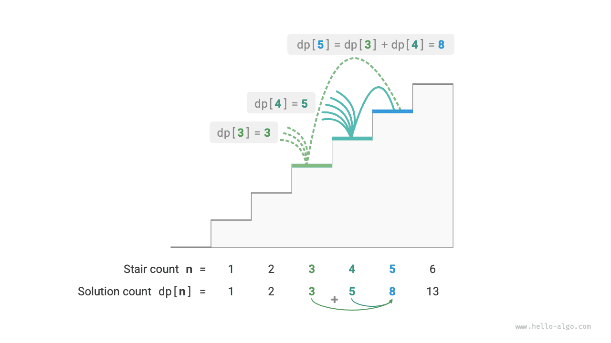
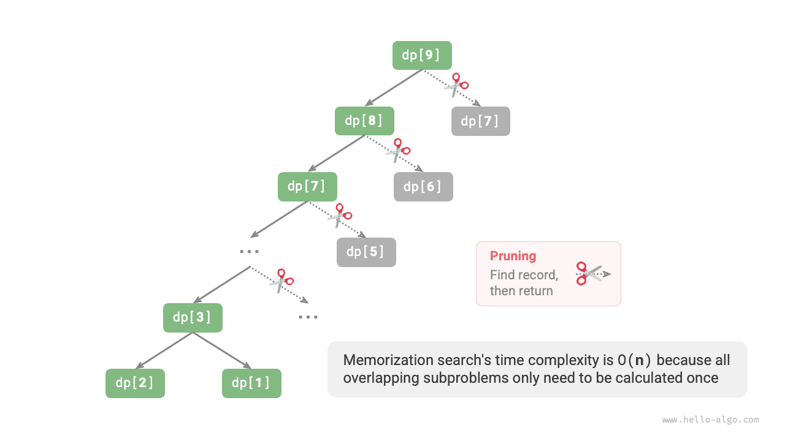
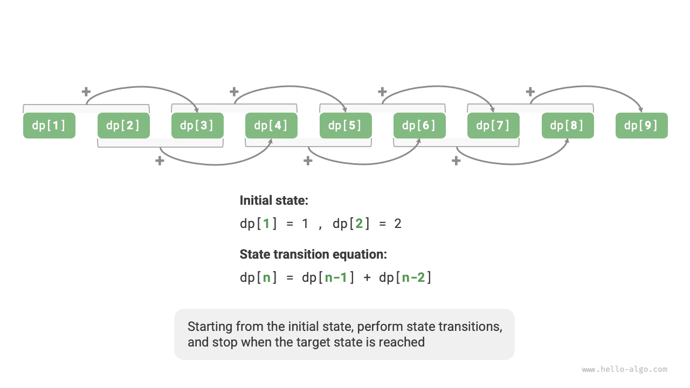

# Giới thiệu về lập trình động

<u>Lập trình động</u> là một mô hình thuật toán quan trọng giúp phân tách một vấn đề thành một loạt các bài toán con nhỏ hơn và tránh tính toán dư thừa bằng cách lưu trữ lời giải cho các bài toán con, từ đó cải thiện đáng kể hiệu quả về thời gian.

Trong phần này, chúng tôi bắt đầu với một ví dụ cổ điển, trước tiên trình bày giải pháp quay lui mạnh mẽ, quan sát các bài toán con chồng chéo bên trong nó và sau đó dần dần tìm ra giải pháp lập trình động hiệu quả hơn.

!!! Câu hỏi “Leo cầu thang”

    Cho một cầu thang có $n$ bậc, trong đó bạn có thể leo từng bậc $1$ hoặc $2$ một lần, có bao nhiêu cách khác nhau để lên đến đỉnh?

Như được hiển thị trong hình bên dưới, đối với cầu thang $3$, có nhiều cách khác nhau $3$ để lên tới đỉnh.


Mục tiêu của bài toán này là xác định số cách, vì vậy **chúng ta có thể xem xét sử dụng phương pháp quay lui để liệt kê tất cả các khả năng**. Cụ thể, hãy tưởng tượng việc leo cầu thang như một quá trình lựa chọn nhiều vòng: bắt đầu từ mặt đất, chọn đi lên các bậc $1$ hoặc $2$ trong mỗi vòng, tăng số lượng lên $1$ bất cứ khi nào đạt đến đỉnh cầu thang và cắt tỉa khi vượt quá đỉnh. Mã này như sau:

```src
[file]{climbing_stairs_backtrack}-[class]{}-[func]{climbing_stairs_backtrack}
```

## Phương pháp 1: Tìm kiếm Brute Force

Các thuật toán quay lui thường không phân tích rõ ràng các vấn đề mà xử lý việc giải quyết vấn đề như một chuỗi các bước quyết định, tìm kiếm tất cả các giải pháp có thể thông qua thử nghiệm và cắt tỉa.

Chúng ta có thể cố gắng phân tích vấn đề này từ góc độ phân rã vấn đề. Đặt số cách để leo lên bước $i$-th là $dp[i]$, khi đó $dp[i]$ là bài toán ban đầu và các bài toán con của nó bao gồm:

$$
dp[i-1], dp[i-2], \dots, dp[2], dp[1]
$$

Vì chúng ta chỉ có thể đi lên các bước $1$ hoặc $2$ trong mỗi vòng, nên khi chúng ta đứng ở bước $i$-th, chúng ta chỉ có thể ở bước $i-1$-th hoặc $i-2$-th ở vòng trước. Nói cách khác, chúng ta chỉ có thể đạt đến bước thứ $i$-th từ bước thứ $i-1$-th hoặc $i-2$-th.

Điều này dẫn đến một kết luận quan trọng: **số cách để leo lên bước $i-1$-th cộng với số cách để leo lên bước $i-2$-th bằng số cách để leo lên bước $i$-th**. Công thức như sau:

$$
dp[i] = dp[i-1] + dp[i-2]
$$

Điều này có nghĩa là trong bài toán leo cầu thang, tồn tại mối quan hệ truy hồi giữa các bài toán con và **lời giải của bài toán ban đầu có thể được xây dựng từ lời giải của các bài toán con**. Hình dưới đây minh họa mối quan hệ tái phát này.



Chúng ta có thể thu được giải pháp tìm kiếm Brute Force dựa trên công thức truy hồi. Bắt đầu từ $dp[n]$, **phân rã đệ quy một bài toán lớn hơn thành tổng của hai bài toán nhỏ hơn**, cho đến khi đạt đến các bài toán con nhỏ nhất $dp[1]$ và $dp[2]$ và quay trở lại. Trong số đó, lời giải cho các bài toán con nhỏ nhất đã được biết, cụ thể là $dp[1] = 1$ và $dp[2] = 2$, tương ứng là các cách $1$ và $2$ để leo lên các bước $1$st và $2$nd.

Hãy quan sát đoạn mã sau: giống như mã quay lui tiêu chuẩn, nó cũng sử dụng tìm kiếm theo chiều sâu nhưng ngắn gọn hơn:

```src
[file]{climbing_stairs_dfs}-[class]{}-[func]{climbing_stairs_dfs}
```

Hình dưới đây cho thấy cây đệ quy được hình thành bằng cách tìm kiếm brute-force. Đối với bài toán $dp[n]$, độ sâu của cây đệ quy là $n$, với độ phức tạp về thời gian là $O(2^n)$. Tăng trưởng theo cấp số nhân đang bùng nổ; nếu chúng ta nhập một số $n$ tương đối lớn thì thời gian chờ đợi có thể rất lâu.


Quan sát hình trên, **độ phức tạp theo thời gian theo cấp số nhân là do "các bài toán con chồng chéo"**. Ví dụ: $dp[9]$ được phân tách thành $dp[8]$ và $dp[7]$, và $dp[8]$ được phân tách thành $dp[7]$ và $dp[6]$, cả hai đều chứa bài toán con $dp[7]$.

Và cứ thế, các bài toán con chứa các bài toán con chồng chéo nhỏ hơn, đến vô cùng. Phần lớn tài nguyên tính toán bị lãng phí cho các bài toán con chồng chéo này.

## Cách 2: Ghi nhớ

Để cải thiện hiệu quả của thuật toán, **chúng tôi muốn tất cả các bài toán con chồng chéo chỉ được tính một lần**. Với mục đích này, chúng tôi khai báo một mảng `mem` để ghi lại lời giải cho từng bài toán con và loại bỏ các bài toán con chồng chéo trong quá trình tìm kiếm.

1. Khi tính toán $dp[i]$ lần đầu tiên, chúng tôi ghi lại nó trong `mem[i]` để sử dụng sau này.
2. Khi cần tính lại $dp[i]$, chúng ta có thể truy xuất trực tiếp kết quả từ `mem[i]`, nhờ đó tránh được việc tính toán dư thừa cho bài toán con đó.

Mã này như sau:

```src
[file]{climbing_stairs_dfs_mem}-[class]{}-[func]{climbing_stairs_dfs_mem}
```

Quan sát hình bên dưới: **sau khi ghi nhớ, tất cả các bài toán con chồng chéo chỉ cần được tính toán một lần, giảm độ phức tạp về thời gian xuống $O(n)$**, đây là một bước nhảy vọt lớn.



## Cách 3: Lập trình động

**Ghi nhớ là phương pháp "từ trên xuống"**: chúng ta bắt đầu từ bài toán ban đầu (nút gốc), phân rã đệ quy các bài toán con lớn hơn thành các bài toán con nhỏ hơn, cho đến khi đạt được các bài toán con nhỏ nhất đã biết (nút lá). Sau đó, bằng cách quay lại, chúng tôi thu thập các giải pháp cho các bài toán con theo từng lớp để xây dựng giải pháp cho vấn đề ban đầu.

Ngược lại, **lập trình động là phương pháp "từ dưới lên"**: bắt đầu từ lời giải của các bài toán con nhỏ nhất, xây dựng lặp lại lời giải của các bài toán con lớn hơn cho đến khi đạt được lời giải của bài toán con ban đầu.

Vì lập trình động không bao gồm quy trình quay lui nên nó chỉ yêu cầu lặp vòng lặp để thực hiện và không cần đệ quy. Trong đoạn mã sau, chúng ta khởi tạo một mảng `dp` để lưu trữ lời giải cho các bài toán con, phục vụ chức năng ghi giống như mảng `mem` trong ghi nhớ:

```src
[file]{climbing_stairs_dp}-[class]{}-[func]{climbing_stairs_dp}
```

Hình dưới đây mô phỏng quá trình thực thi của đoạn mã trên.



Giống như các thuật toán quay lui, lập trình động cũng sử dụng khái niệm "trạng thái" để biểu diễn các giai đoạn cụ thể của việc giải quyết vấn đề, với mỗi trạng thái tương ứng với một bài toán con và lời giải tối ưu cục bộ tương ứng của nó. Ví dụ: trạng thái trong bài toán leo cầu thang được xác định là số bước cầu thang hiện tại $i$.

Dựa vào nội dung trên chúng ta có thể tóm tắt lại các thuật ngữ thường dùng trong lập trình động.

- Mảng `dp` được gọi là <u>bảng dp</u>, trong đó $dp[i]$ biểu thị lời giải cho bài toán con tương ứng với trạng thái $i$.
- Các trạng thái tương ứng với các bài toán con nhỏ nhất (bước $1$st và $2$nd) được gọi là <u>trạng thái ban đầu</u>.
- Công thức truy hồi $dp[i] = dp[i-1] + dp[i-2]$ được gọi là <u>phương trình chuyển trạng thái</u>.

## Tối ưu hóa không gian

Những độc giả tinh ý có thể nhận thấy rằng **vì $dp[i]$ chỉ liên quan đến $dp[i-1]$ và $dp[i-2]$, nên chúng ta không cần sử dụng mảng `dp` để lưu trữ lời giải cho tất cả các bài toán con** và thay vào đó có thể sử dụng hai biến chuyển tiếp. Mã này như sau:

```src
[file]{climbing_stairs_dp}-[class]{}-[func]{climbing_stairs_dp_comp}
```

Như đoạn mã trên cho thấy, bằng cách loại bỏ không gian bị chiếm bởi mảng `dp`, độ phức tạp của không gian giảm từ $O(n)$ xuống $O(1)$.

Trong các bài toán lập trình động, trạng thái hiện tại thường chỉ phụ thuộc vào một số lượng hữu hạn các trạng thái trước đó, cho phép chúng ta chỉ giữ lại những trạng thái cần thiết và tiết kiệm không gian bộ nhớ thông qua việc “giảm kích thước”. **Kỹ thuật tối ưu hóa không gian này được gọi là "biến cuộn" hoặc "mảng cuộn"**.
