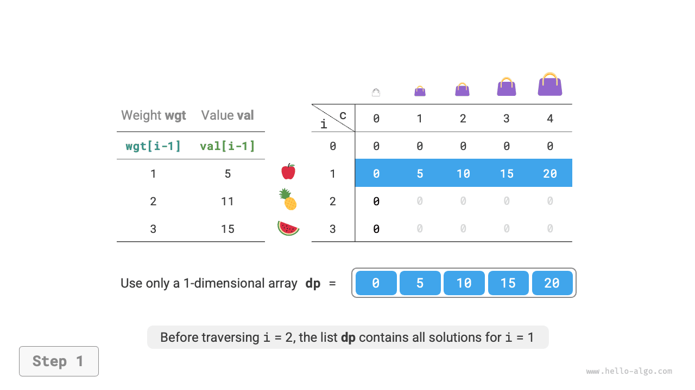
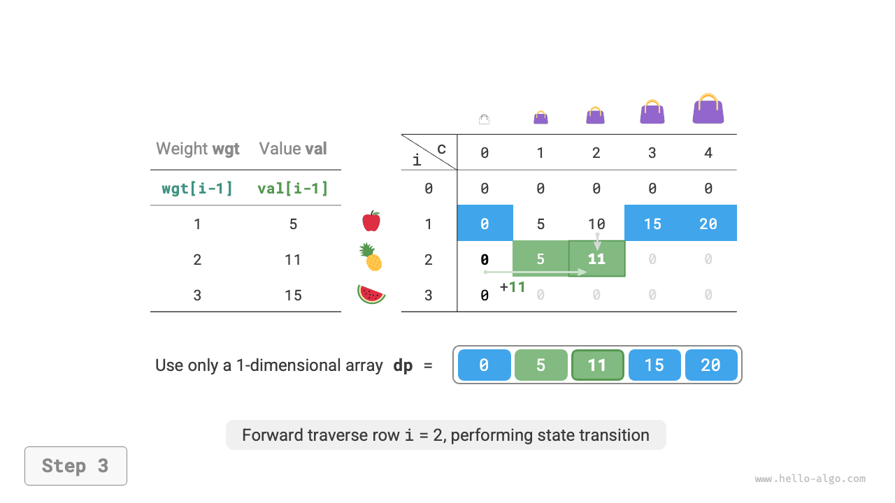
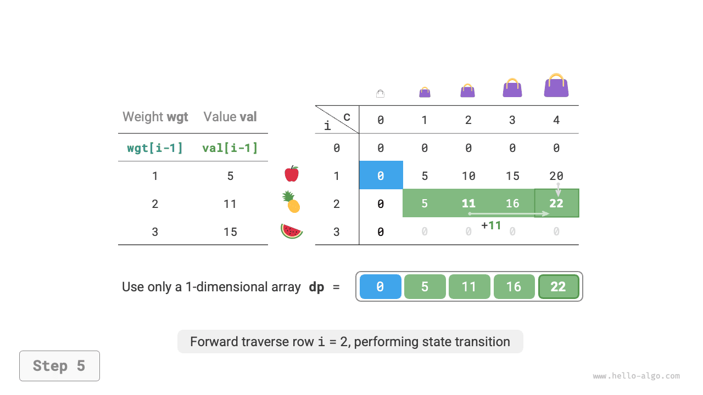
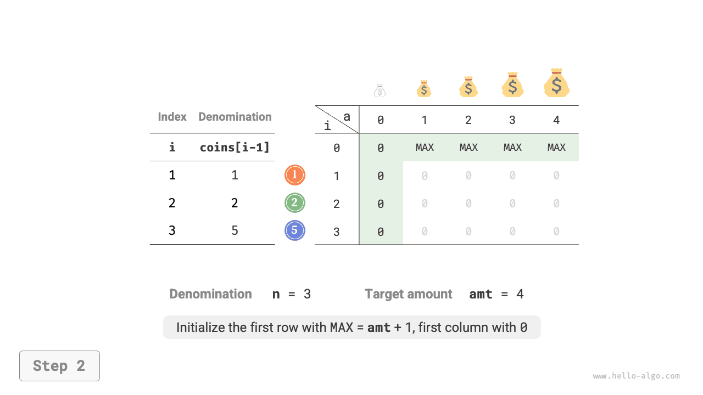
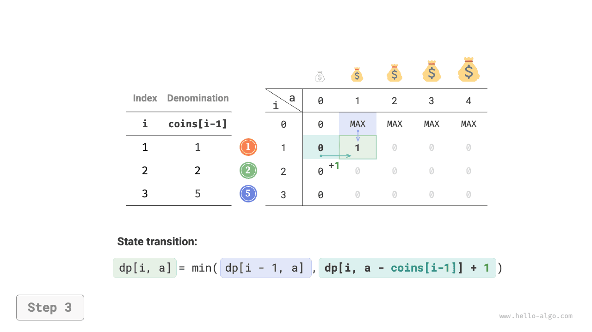
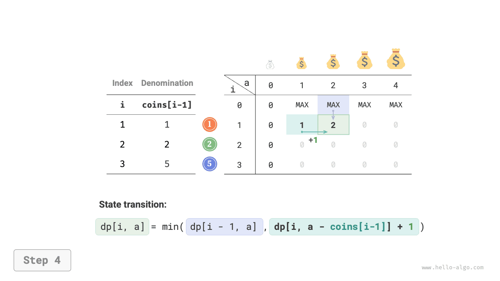
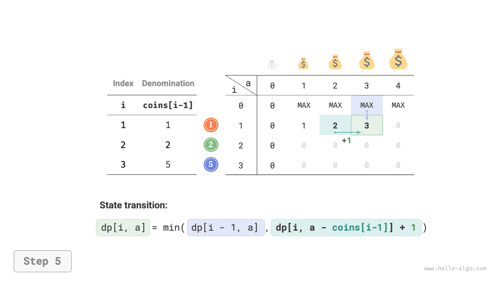
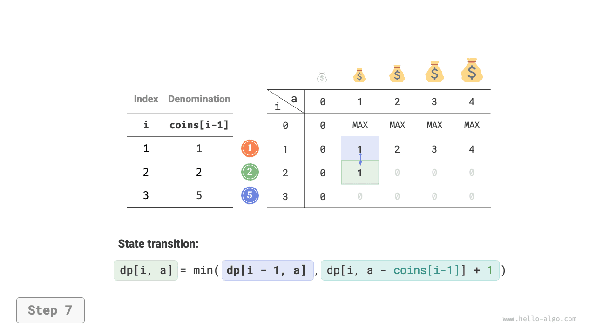

# Vấn đề về chiếc ba lô không giới hạn

Trong phần này, trước tiên chúng ta giải một bài toán về chiếc ba lô phổ biến khác: chiếc ba lô không giới hạn, sau đó khám phá một trường hợp đặc biệt của nó: bài toán đổi xu.

## Vấn đề về chiếc ba lô không giới hạn

!!! câu hỏi

    Cho $n$ vật phẩm, trong đó trọng lượng của vật phẩm thứ $i$ là $wgt[i-1]$ và giá trị của nó là $val[i-1]$, và một chiếc ba lô có sức chứa $cap$. **Mỗi mục có thể được chọn nhiều lần**. Giá trị tối đa có thể được đặt trong ba lô trong giới hạn sức chứa là bao nhiêu? Một ví dụ được hiển thị trong hình dưới đây.


### Phương pháp lập trình động

Bài toán về chiếc ba lô không giới hạn rất giống với bài toán về chiếc ba lô 0-1, **chỉ khác ở chỗ không có giới hạn về số lần một vật phẩm có thể được chọn**.

- Trong bài toán ba lô 0-1, mỗi loại vật phẩm chỉ có một loại nên sau khi đặt vật phẩm $i$ vào trong ba lô, chúng ta chỉ có thể chọn từ các vật phẩm $i-1$ đầu tiên.
- Trong bài toán chiếc ba lô không giới hạn, số lượng của mỗi loại vật phẩm là không giới hạn nên sau khi đặt vật phẩm $i$ vào trong ba lô, **chúng ta vẫn có thể chọn từ những vật phẩm $i$ đầu tiên**.

Theo quy tắc của bài toán chiếc ba lô không giới hạn, sự thay đổi trạng thái $[i, c]$ được chia thành hai trường hợp.

- **Không đặt đồ vật $i$**: Tương tự như bài toán về chiếc ba lô 0-1, chuyển sang $[i-1, c]$.
- **Đặt vật phẩm $i$**: Khác với bài toán về chiếc ba lô 0-1, chuyển sang $[i, c-wgt[i-1]]$.

Do đó, phương trình chuyển trạng thái trở thành:

$$
dp[i, c] = \max(dp[i-1, c], dp[i, c - wgt[i-1]] + val[i-1])
$$

### Triển khai mã

So sánh mã cho hai vấn đề, có một thay đổi trong quá trình chuyển đổi trạng thái từ $i-1$ sang $i$, với mọi thứ khác giống hệt nhau:

```src
[file]{unbounded_knapsack}-[class]{}-[func]{unbounded_knapsack_dp}
```

### Tối ưu hóa không gian

Vì trạng thái hiện tại được chuyển từ các trạng thái ở bên trái và phía trên, **sau khi tối ưu hóa không gian, mỗi hàng trong bảng $dp$ phải được duyệt theo thứ tự chuyển tiếp**.

Thứ tự di chuyển này hoàn toàn ngược lại với ba lô 0-1. Vui lòng tham khảo hình dưới đây để hiểu sự khác biệt giữa hai.

=== "<1>"
    

=== "<2>"
    

=== "<3>"
    

=== "<4>"
    

=== "<5>"
    

=== "<6>"
    

Việc thực hiện mã tương đối đơn giản, chỉ cần xóa chiều đầu tiên của mảng `dp`:

```src
[file]{unbounded_knapsack}-[class]{}-[func]{unbounded_knapsack_dp_comp}
```

## Vấn đề đổi tiền

Bài toán chiếc ba lô đại diện cho một lớp lớn các bài toán quy hoạch động và có nhiều biến thể, chẳng hạn như bài toán đổi xu.

!!! câu hỏi

    Cho $n$ loại tiền, trong đó mệnh giá của loại tiền $i$-là $coins[i - 1]$, và số tiền mục tiêu là $amt$. **Mỗi loại xu có thể được chọn nhiều lần**. Số xu tối thiểu cần thiết để đạt được số tiền mục tiêu là bao nhiêu? Nếu không thể đạt được số tiền mục tiêu, hãy trả lại $-1$. Một ví dụ được hiển thị trong hình dưới đây.


### Phương pháp lập trình động

**Bài toán đổi xu có thể xem là trường hợp đặc biệt của bài toán chiếc ba lô không giới hạn**, với những mối liên hệ và điểm khác biệt sau.

- Hai vấn đề có thể được chuyển đổi lẫn nhau: "vật phẩm" tương ứng với "đồng xu", "trọng lượng vật phẩm" tương ứng với "mệnh giá tiền xu" và "dung lượng ba lô" tương ứng với "số lượng mục tiêu".
- Các mục tiêu tối ưu hóa thì ngược lại: bài toán ba lô không giới hạn nhằm mục đích tối đa hóa giá trị vật phẩm, trong khi bài toán đổi xu nhằm mục đích giảm thiểu số lượng xu.
- Bài toán chiếc ba lô không giới hạn tìm kiếm giải pháp "không vượt quá" sức chứa của chiếc ba lô, trong khi bài toán đổi xu tìm kiếm giải pháp "chính xác" bằng số lượng mục tiêu.

**Bước 1: Suy nghĩ về các quyết định trong mỗi vòng, xác định trạng thái và từ đó nhận được bảng $dp$**

Trạng thái $[i, a]$ tương ứng với bài toán con: **số lượng xu tối thiểu trong số các loại $i$ đầu tiên có thể tạo nên số tiền $a$**, ký hiệu là $dp[i, a]$.

Bảng $dp$ hai chiều có kích thước $(n+1) \times (amt+1)$.

**Bước 2: Xác định cấu trúc con tối ưu và sau đó rút ra phương trình chuyển trạng thái**

Bài toán này khác với bài toán chiếc ba lô không giới hạn ở hai khía cạnh sau đây liên quan đến phương trình chuyển trạng thái.

- Vấn đề này tìm kiếm giá trị tối thiểu, vì vậy toán tử $\max()$ cần được đổi thành $\min()$.
- Mục tiêu tối ưu hóa là số lượng xu thay vì giá trị vật phẩm, vì vậy khi chọn một xu, bạn chỉ cần thêm $1$.

$$
dp[i, a] = \min(dp[i-1, a], dp[i, a - coins[i-1]] + 1)
$$

**Bước 3: Xác định điều kiện biên và thứ tự chuyển trạng thái**

Khi số tiền mục tiêu là $0$, số xu tối thiểu cần thiết để tạo nên số tiền đó là $0$, vì vậy tất cả $dp[i, 0]$ trong cột đầu tiên bằng $0$.

Khi không có xu, **không thể bù đắp bất kỳ số tiền $> 0$** nào, đây là một giải pháp không hợp lệ. Để kích hoạt hàm $\min()$ trong phương trình chuyển đổi trạng thái nhằm xác định và lọc ra các giải pháp không hợp lệ, chúng tôi xem xét sử dụng $+ \infty$ để biểu thị chúng, tức là đặt tất cả $dp[0, a]$ ở hàng đầu tiên thành $+ \infty$.

### Triển khai mã

Hầu hết các ngôn ngữ lập trình không cung cấp biến $+ \infty$ và chỉ có thể sử dụng giá trị tối đa của loại số nguyên `int` để thay thế. Tuy nhiên, điều này có thể dẫn tới tràn số nguyên: phép toán $+1$ trong phương trình chuyển trạng thái có thể gây ra tràn.

Vì lý do này, chúng tôi sử dụng số $amt + 1$ để biểu thị các giải pháp không hợp lệ, vì số lượng xu tối đa cần thiết để tạo nên $amt$ nhiều nhất là $amt$. Trước khi quay lại, hãy kiểm tra xem $dp[n, amt]$ có bằng $amt + 1$; nếu vậy, hãy trả về $-1$, cho biết rằng số tiền mục tiêu không thể đạt được. Mã này như sau:

```src
[file]{coin_change}-[class]{}-[func]{coin_change_dp}
```

Hình dưới đây cho thấy quy trình lập trình động để đổi xu, rất giống với bài toán chiếc ba lô không giới hạn.

=== "<1>"
    

=== "<2>"
    

=== "<3>"
    

=== "<4>"
    

=== "<5>"
    

=== "<6>"
    

=== "<7>"
    

=== "<8>"
    

=== "<9>"
    

=== "<10>"
    

=== "<11>"
    

=== "<12>"
    

=== "<13>"
    

=== "<14>"
    

=== "<15>"
    

### Tối ưu hóa không gian

Việc tối ưu hóa không gian cho bài toán đổi xu được xử lý tương tự như bài toán chiếc ba lô không giới hạn:

```src
[file]{coin_change}-[class]{}-[func]{coin_change_dp_comp}
```

## Vấn đề đổi xu II

!!! câu hỏi

    Cho $n$ loại tiền, trong đó mệnh giá của loại tiền $i$-là $coins[i - 1]$, và số tiền mục tiêu là $amt$. Mỗi loại xu có thể được chọn nhiều lần. **Số lượng kết hợp xu có thể tạo nên số tiền mục tiêu là bao nhiêu?** Một ví dụ được hiển thị trong hình bên dưới.


### Phương pháp lập trình động

So với bài toán trước, mục tiêu của bài toán này là tìm số tổ hợp, do đó bài toán con trở thành: **số tổ hợp giữa các loại $i$ đầu tiên có thể tạo thành số tiền $a$**. Bảng $dp$ vẫn là một ma trận hai chiều có kích thước $(n+1) \times (amt + 1)$.

Số lượng kết hợp cho trạng thái hiện tại bằng tổng các kết hợp từ việc không chọn đồng xu hiện tại đến chọn đồng xu hiện tại. Phương trình chuyển trạng thái là:

$$
dp[i, a] = dp[i-1, a] + dp[i, a - coins[i-1]]
$$

Khi số tiền mục tiêu là $0$, không cần chọn đồng xu nào để tạo nên số tiền mục tiêu, vì vậy tất cả $dp[i, 0]$ trong cột đầu tiên phải được khởi tạo thành $1$. Khi không có xu, không thể tạo ra bất kỳ số tiền $>0$ nào, vì vậy tất cả $dp[0, a]$ ở hàng đầu tiên đều bằng $0$.

### Triển khai mã

```src
[file]{coin_change_ii}-[class]{}-[func]{coin_change_ii_dp}
```

### Tối ưu hóa không gian

Việc tối ưu hóa không gian được xử lý theo cách tương tự, chỉ cần xóa kích thước đồng xu:

```src
[file]{coin_change_ii}-[class]{}-[func]{coin_change_ii_dp_comp}
```
