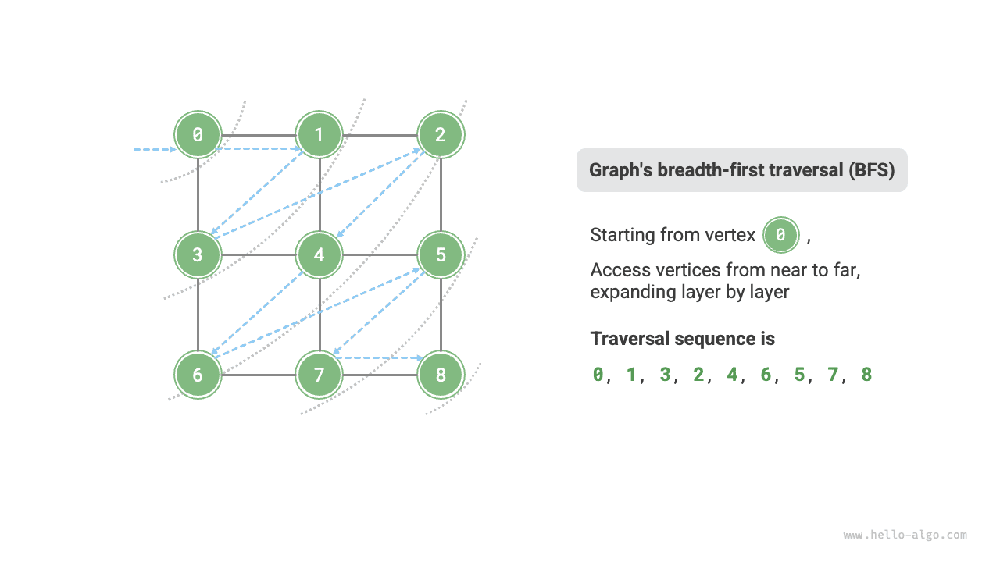
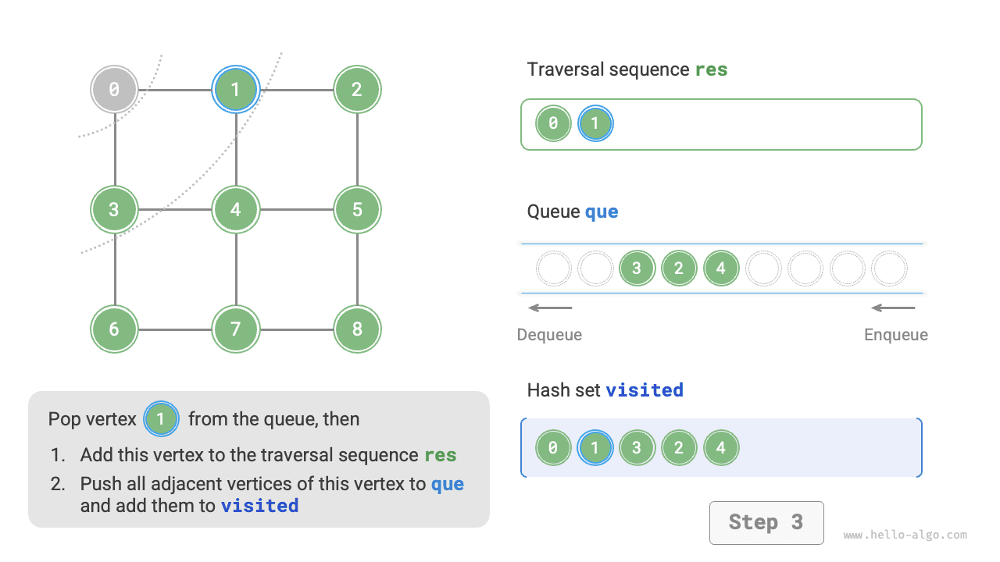
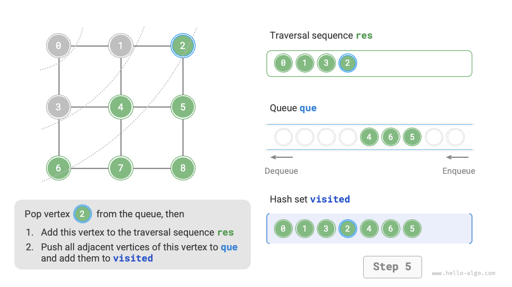
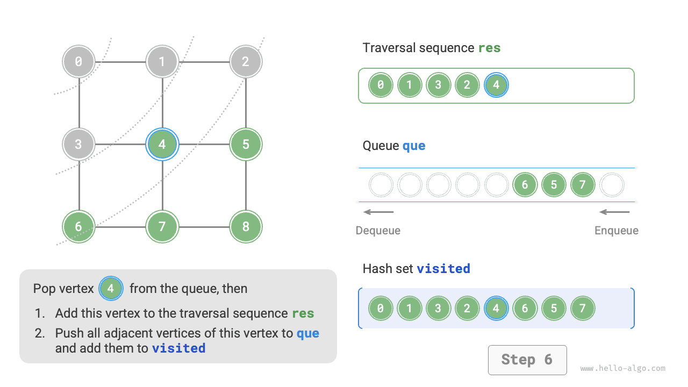
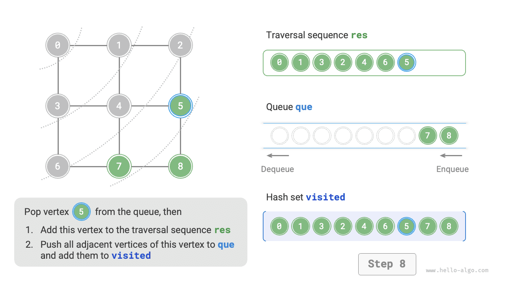
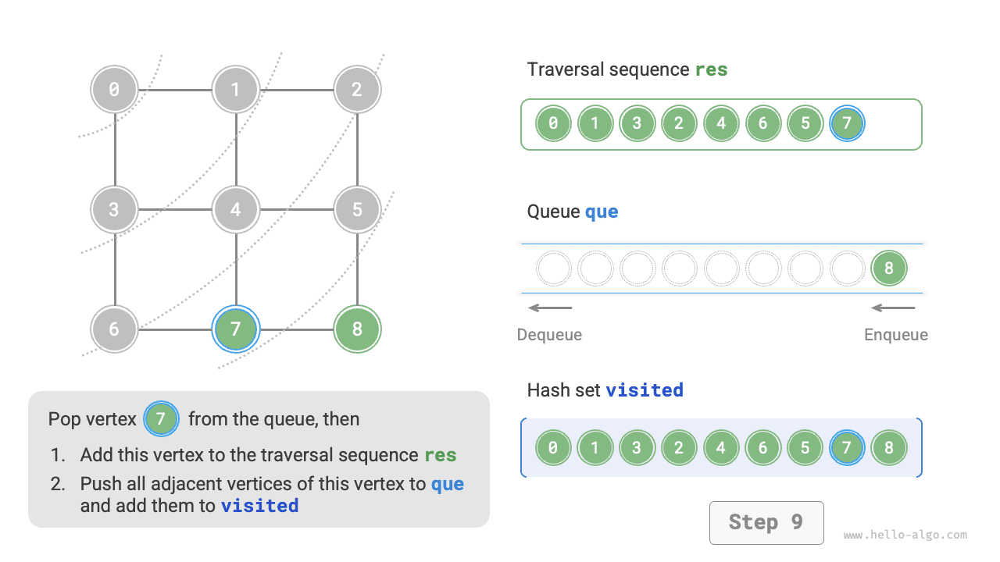
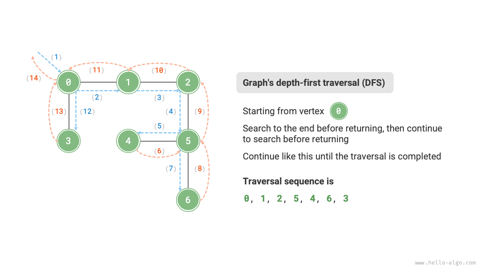
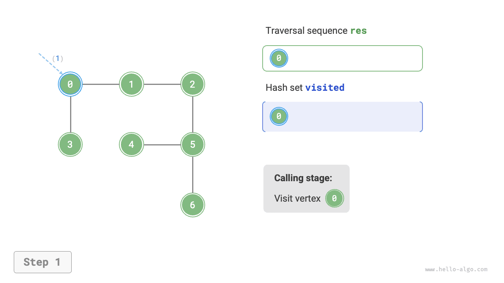
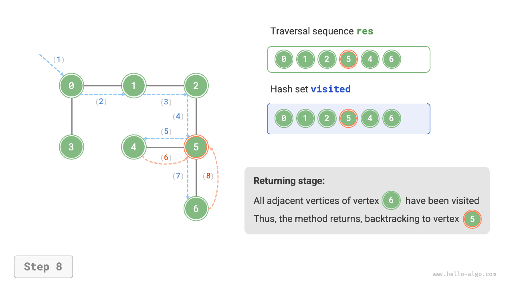
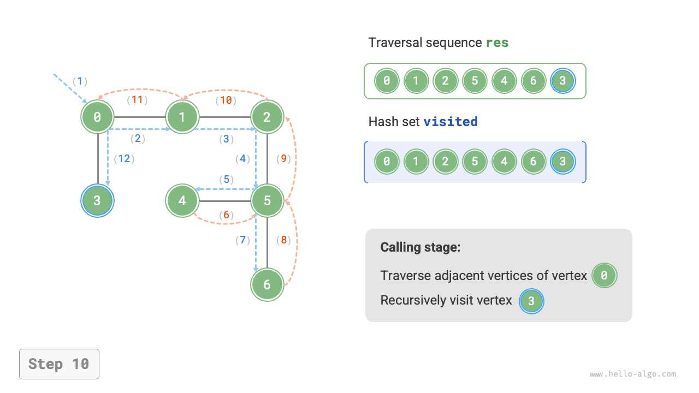

# Truyền tải đồ thị

Cây biểu thị mối quan hệ "một-nhiều", trong khi biểu đồ có mức độ tự do cao hơn và có thể biểu thị bất kỳ mối quan hệ "nhiều-nhiều". Vì vậy, chúng ta có thể xem cây như một trường hợp đặc biệt của đồ thị. Rõ ràng, **các phép toán duyệt cây cũng là một trường hợp đặc biệt của các phép toán duyệt đồ thị**.

Cả đồ thị và cây đều yêu cầu ứng dụng thuật toán tìm kiếm để thực hiện các phép toán truyền tải. Phương pháp truyền tải đồ thị cũng có thể được chia thành hai loại: <u>duyệt theo chiều rộng</u> và <u>duyệt theo chiều sâu</u>.

## Tìm kiếm theo chiều rộng

**Tìm kiếm theo chiều rộng tiến hành từ gần đến xa: bắt đầu từ một nút nhất định, nó luôn truy cập các đỉnh gần nhất trước tiên và mở rộng ra từng lớp ra bên ngoài**. Như minh họa trong hình bên dưới, bắt đầu từ đỉnh trên cùng bên trái, trước tiên đi qua tất cả các đỉnh liền kề của đỉnh đó, sau đó đi qua tất cả các đỉnh liền kề của đỉnh tiếp theo, v.v., cho đến khi đi qua tất cả các đỉnh.



### Triển khai thuật toán

BFS thường được triển khai với sự trợ giúp của hàng đợi, như được hiển thị trong đoạn mã bên dưới. Hàng đợi có thuộc tính "vào trước, ra trước", phù hợp với ý tưởng "gần đến xa" của BFS.

1. Thêm đỉnh bắt đầu `startVet` vào hàng đợi và bắt đầu vòng lặp.
2. Trong mỗi lần lặp của vòng lặp, hãy bật đỉnh ở phía trước hàng đợi và ghi lại nó là đã ghé thăm, sau đó thêm tất cả các đỉnh liền kề của đỉnh đó vào phía sau hàng đợi.
3. Lặp lại bước `2.` cho đến khi đã thăm hết tất cả các đỉnh.

Để ngăn việc truy cập lại các đỉnh, chúng tôi sử dụng bộ băm `visited` để ghi lại các nút đã được truy cập.

!!! mẹo

    Bộ băm có thể được xem dưới dạng bảng băm chỉ lưu trữ `key` mà không lưu trữ `value`. Nó hỗ trợ các thao tác chèn, xóa, tra cứu và cập nhật trên `key` trong thời gian $O(1)$. Dựa trên tính duy nhất của `key`, bộ băm thường được sử dụng để chống trùng lặp dữ liệu và các tình huống tương tự.

```src
[file]{graph_bfs}-[class]{}-[func]{graph_bfs}
```

Mã tương đối trừu tượng; nên tham khảo hình dưới đây để hiểu sâu hơn.

=== "<1>"
    

=== "<2>"
    

=== "<3>"
    

=== "<4>"
    

=== "<5>"
    

=== "<6>"
    

=== "<7>"
    

=== "<8>"
    

=== "<9>"
    

=== "<10>"
    

=== "<11>"
    

!!! câu hỏi "Trình tự duyệt theo chiều rộng đầu tiên có phải là duy nhất không?"

    Không độc đáo. Tìm kiếm theo chiều rộng chỉ yêu cầu di chuyển ngang theo thứ tự "gần đến xa", **và thứ tự di chuyển của các đỉnh ở cùng khoảng cách có thể được xáo trộn tùy ý**. Lấy hình trên làm ví dụ, thứ tự truy cập của các đỉnh $1$ và $3$ có thể được hoán đổi, cũng như thứ tự truy cập của các đỉnh $2$, $4$ và $6$.

### Phân tích độ phức tạp

**Độ phức tạp về thời gian**: Tất cả các đỉnh sẽ được xếp vào hàng đợi và loại bỏ hàng đợi một lần, sử dụng thời gian $O(|V|)$; trong quá trình đi qua các đỉnh liền kề, vì là đồ thị vô hướng nên tất cả các cạnh sẽ được thăm $2$ lần, sử dụng $O(2|E|)$ thời gian; tổng thể sử dụng thời gian $O(|V| + |E|)$.

**Độ phức tạp của không gian**: Danh sách `res`, tập hợp băm `visited` và hàng đợi `que` có thể chứa tối đa $|V|$ đỉnh, sử dụng không gian $O(|V|)$.

## Tìm kiếm theo chiều sâu

**Tìm kiếm theo chiều sâu là phương pháp truyền tải ưu tiên đi xa nhất có thể, sau đó quay lại khi không còn đường dẫn**. As shown in the figure below, starting from the top-left vertex, visit an adjacent vertex of the current vertex, continuing until reaching a dead end, then return and continue going as far as possible before returning again, and so on, until all vertices have been traversed.



### Triển khai thuật toán

Mô hình thuật toán "đi càng xa càng tốt rồi quay lại" này thường được triển khai bằng cách sử dụng đệ quy. Tương tự như tìm kiếm theo chiều rộng, trong tìm kiếm theo chiều sâu, chúng ta cũng cần một bộ băm `visited` để ghi lại các đỉnh đã truy cập và tránh xem lại.

```src
[file]{graph_dfs}-[class]{}-[func]{graph_dfs}
```

Luồng thuật toán tìm kiếm theo chiều sâu được thể hiện trong hình bên dưới.

- **Các đường đứt nét thẳng biểu thị đệ quy đi xuống**, biểu thị rằng một phương pháp đệ quy mới đã được bắt đầu để truy cập một đỉnh mới.
- **Các đường đứt nét cong biểu thị quá trình quay lui lên trên**, biểu thị rằng lệnh gọi đệ quy này đã quay trở lại điểm mà nó được thực hiện.

Để hiểu sâu hơn, bạn nên kết hợp hình bên dưới với mã để mô phỏng (hoặc rút ra) toàn bộ quy trình DFS, bao gồm cả thời điểm mỗi lệnh gọi đệ quy bắt đầu và khi nó quay trở lại.

=== "<1>"
    

=== "<2>"
    

=== "<3>"
    

=== "<4>"
    

=== "<5>"
    

=== "<6>"
    

=== "<7>"
    

=== "<8>"
    

=== "<9>"
    

=== "<10>"
    

=== "<11>"
    

!!! câu hỏi "Trình tự truyền tải theo chiều sâu có phải là duy nhất không?"

    Tương tự như tìm kiếm theo chiều rộng, chuỗi tìm kiếm theo chiều sâu cũng không phải là duy nhất. Cho trước một đỉnh, bất kỳ hướng thăm dò nào cũng có thể được chọn trước; nghĩa là thứ tự của các đỉnh liền kề có thể được sắp xếp lại tùy ý mà vẫn tạo thành tìm kiếm theo chiều sâu.

    Lấy việc duyệt cây làm ví dụ, "root $\rightarrow$ left $\rightarrow$ right", "left $\rightarrow$ root $\rightarrow$ right" và "left $\rightarrow$ right $\rightarrow$ root" tương ứng với các lần duyệt trước, theo thứ tự và sau thứ tự. Chúng đại diện cho ba mức độ ưu tiên truyền tải khác nhau, tuy nhiên cả ba đều thuộc về tìm kiếm theo chiều sâu.

### Phân tích độ phức tạp

**Độ phức tạp về thời gian**: Tất cả các đỉnh sẽ được truy cập $1$ lần, sử dụng $O(|V|)$ thời gian; tất cả các cạnh sẽ được truy cập $2$ lần, sử dụng thời gian $O(2|E|)$; tổng thể sử dụng thời gian $O(|V| + |E|)$.

**Độ phức tạp của không gian**: Danh sách `res` và tập hợp băm `visited` có thể chứa tối đa $|V|$ đỉnh và độ sâu đệ quy tối đa là $|V|$, do đó sử dụng không gian $O(|V|)$.
