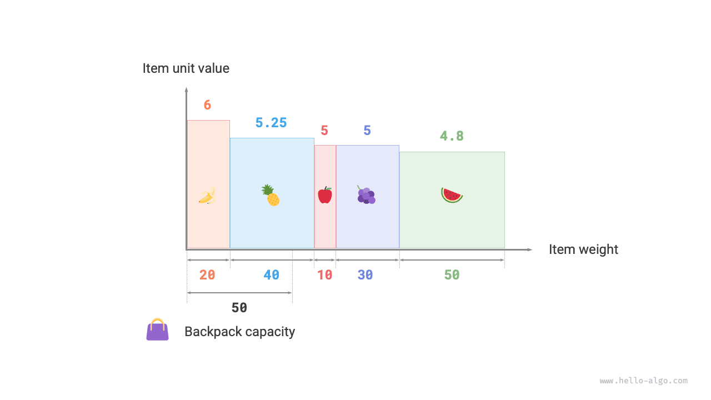

# Bài toán ba lô phân số

!!! câu hỏi

    Cho $n$ vật phẩm, trong đó trọng lượng của vật phẩm thứ $i$ là $wgt[i-1]$ và giá trị của nó là $val[i-1]$, và một chiếc ba lô có sức chứa $cap$. Mỗi mục chỉ có thể được chọn một lần, **nhưng có thể chọn một phần của mục, với giá trị của nó tỷ lệ thuận với trọng lượng đã chọn**. Tổng giá trị tối đa có thể được đặt trong ba lô dưới giới hạn dung lượng là bao nhiêu? Một ví dụ được hiển thị trong hình dưới đây.


Bài toán chiếc ba lô phân số nhìn chung rất giống với bài toán chiếc ba lô 0-1, với các trạng thái bao gồm vật phẩm hiện tại $i$ và sức chứa $c$, và mục tiêu là tối đa hóa giá trị trong sức chứa giới hạn của chiếc ba lô.

Sự khác biệt là bài toán này chỉ cho phép chọn một phần của một mục. Như minh họa trong hình bên dưới, **chúng ta có thể chia một mục tùy ý và tính giá trị của nó theo tỷ lệ với trọng lượng đã chọn**.

1. Đối với mặt hàng $i$, giá trị trên mỗi đơn vị trọng lượng của nó là $val[i-1] / wgt[i-1]$, được gọi là giá trị đơn vị.
2. Giả sử chúng ta đặt một phần vật phẩm $i$ có trọng lượng $w$ vào trong ba lô, khi đó giá trị được thêm vào ba lô là $w \times val[i-1] / wgt[i-1]$.


### Quyết định chiến lược tham lam

Tối đa hóa tổng giá trị trong ba lô **về cơ bản có nghĩa là ưu tiên các mặt hàng có giá trị cao hơn trên mỗi đơn vị trọng lượng**. Từ quan sát này, chúng ta có thể rút ra chiến lược tham lam được thể hiện trong hình bên dưới.

1. Sắp xếp các mục theo giá trị đơn vị từ cao xuống thấp.
2. Lặp lại qua tất cả các mục, **tham lam chọn mục có giá trị đơn vị cao nhất trong mỗi vòng**.
3. Nếu sức chứa ba lô còn lại không đủ, hãy sử dụng một phần vật phẩm hiện tại để đổ vào ba lô.


### Triển khai mã

Chúng tôi xác định lớp `Item` để có thể sắp xếp các mục theo giá trị đơn vị. Sau đó, chúng ta lặp lại các mục được sắp xếp một cách tham lam, dừng lại khi ba lô đầy và trả về kết quả:

```src
[file]{fractional_knapsack}-[class]{}-[func]{fractional_knapsack}
```

Các thuật toán sắp xếp tích hợp thường mất $O(n \log n)$ và độ phức tạp về không gian của chúng thường là $O(\log n)$ hoặc $O(n)$, tùy thuộc vào cách triển khai cụ thể của ngôn ngữ lập trình.

Ngoài việc sắp xếp, trong trường hợp xấu nhất, toàn bộ danh sách mặt hàng cần phải được duyệt qua, **do đó độ phức tạp về thời gian là $O(n)$**, trong đó $n$ là số lượng mặt hàng.

Vì danh sách đối tượng `Item` được khởi tạo nên **độ phức tạp của không gian là $O(n)$**.

### Bằng chứng chính xác

Chúng tôi sử dụng bằng chứng bằng phản chứng. Giả sử mục $x$ có giá trị đơn vị cao nhất và một số thuật toán tạo ra giá trị tối ưu `res`, nhưng giải pháp thu được không bao gồm mục $x$.

Bây giờ hãy lấy một đơn vị trọng lượng khỏi bất kỳ vật phẩm nào trong ba lô và thay thế bằng một đơn vị trọng lượng từ vật phẩm $x$. Vì mục $x$ có giá trị đơn vị cao nhất nên tổng giá trị sau khi thay thế phải lớn hơn `res`. **Điều này mâu thuẫn với giả định rằng `res` là tối ưu, chứng tỏ rằng mọi giải pháp tối ưu đều phải bao gồm mục $x$**.

Chúng ta cũng có thể xây dựng mâu thuẫn tương tự cho các hạng mục khác trong lời giải. Tóm lại, **những món đồ có giá trị đơn vị cao hơn luôn là lựa chọn tốt hơn**, điều này chứng tỏ chiến lược tham lam đang phát huy hiệu quả.

Như được hiển thị trong hình bên dưới, nếu chúng ta coi trọng lượng vật phẩm và giá trị đơn vị là trục ngang và trục dọc của biểu đồ hai chiều thì bài toán chiếc ba lô phân số có thể được xem là "tìm diện tích tối đa được bao bọc trong một khoảng giới hạn trên trục ngang." Sự tương tự này giúp giải thích tính hiệu quả của chiến lược tham lam từ góc độ hình học.


