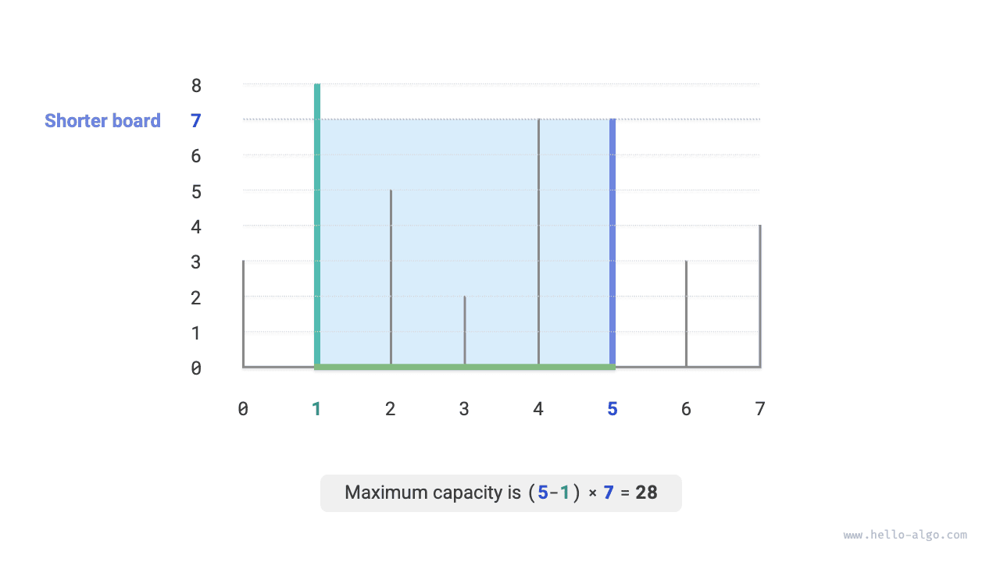
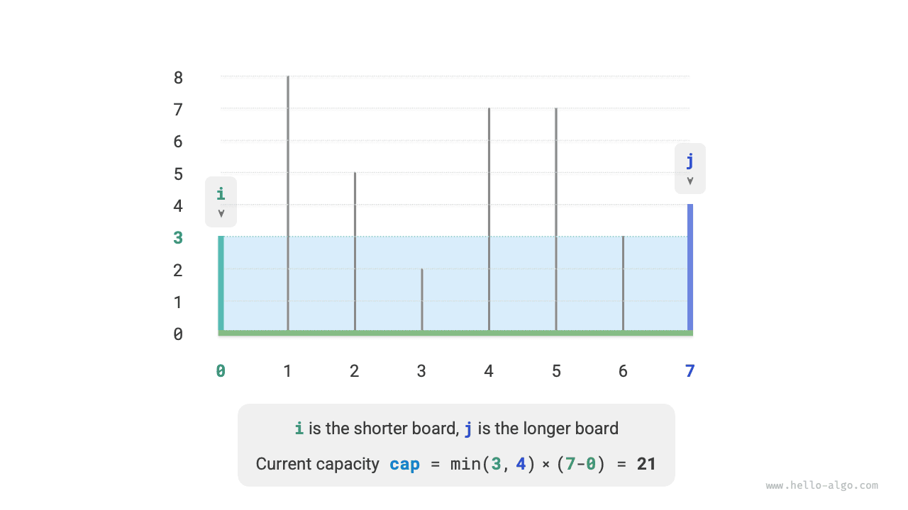
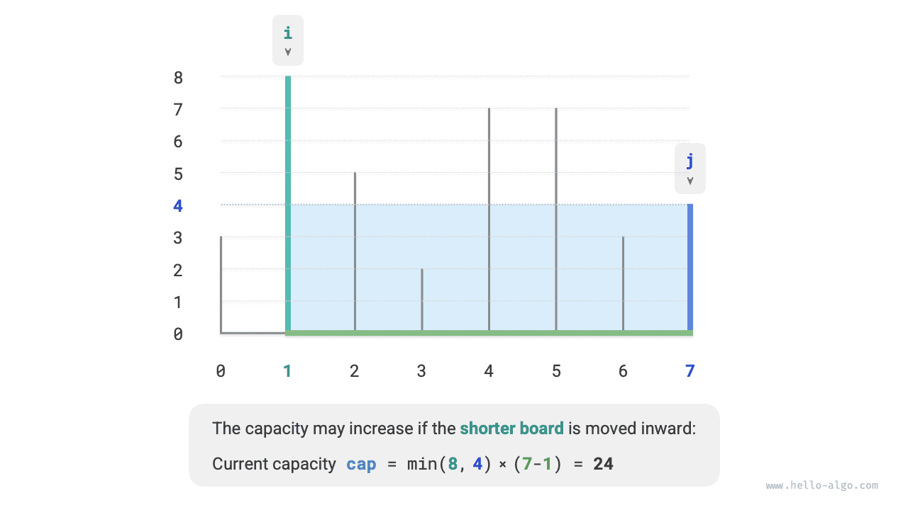
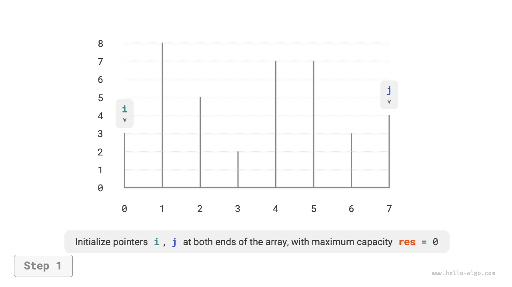
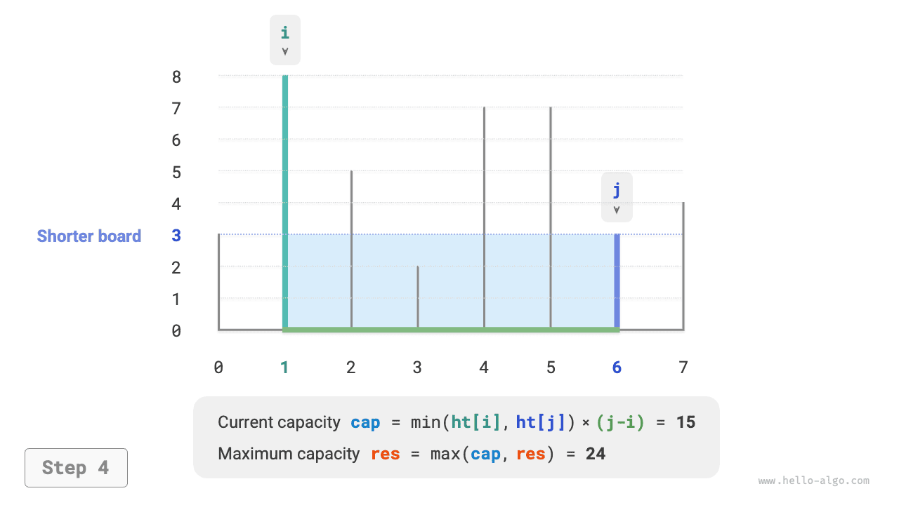
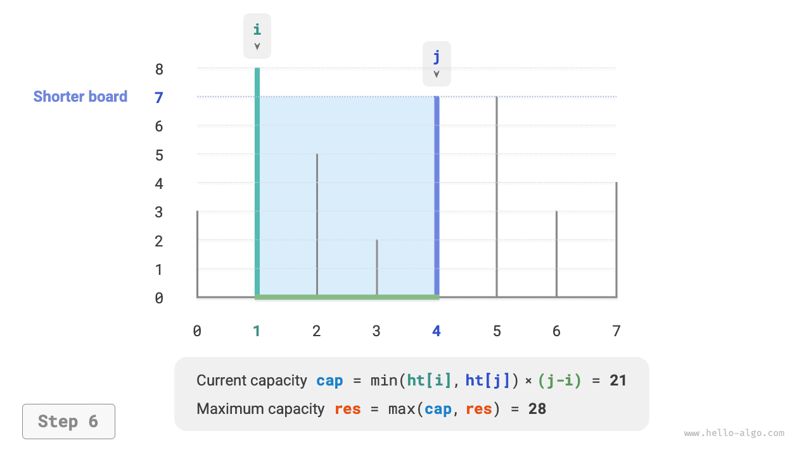

# Vấn đề về công suất tối đa

!!! câu hỏi

    Cho một mảng $ht$, trong đó mỗi phần tử biểu thị chiều cao của một phân vùng dọc. Bất kỳ hai phân vùng nào trong mảng, cùng với khoảng cách giữa chúng, đều có thể tạo thành một vùng chứa.

    Dung lượng của vùng chứa bằng tích của chiều cao và chiều rộng (tức là diện tích của nó), trong đó chiều cao được xác định bởi phân vùng ngắn hơn và chiều rộng là sự khác biệt giữa các chỉ số mảng của hai phân vùng.

    Chọn hai phân vùng trong mảng sao cho dung lượng của vùng chứa kết quả được tối đa hóa và trả về dung lượng tối đa đó. Một ví dụ được hiển thị trong hình dưới đây.



Vùng chứa được hình thành bởi hai phân vùng bất kỳ, **vì vậy trạng thái của vấn đề này là chỉ số của hai phân vùng, ký hiệu là $[i, j]$**.

Theo báo cáo bài toán, dung lượng bằng chiều cao nhân với chiều rộng, trong đó chiều cao được xác định bởi phân vùng ngắn hơn và chiều rộng là sự khác biệt giữa các chỉ số mảng của hai phân vùng. Đặt dung lượng là $cap[i, j]$; thì ta thu được công thức sau:

$$
cap[i, j] = \min(ht[i], ht[j]) \times (j - i)
$$

Gọi độ dài mảng là $n$. Khi đó, số cách chọn hai phân vùng (tức là tổng số trạng thái) là $C_n^2 = \frac{n(n - 1)}{2}$. Cách tiếp cận đơn giản nhất là **liệt kê toàn diện tất cả các trạng thái** để tìm công suất tối đa, có độ phức tạp về thời gian là $O(n^2)$.

### Quyết định chiến lược tham lam

Vấn đề này có một giải pháp hiệu quả hơn. Như được hiển thị trong hình bên dưới, hãy xem xét trạng thái $[i, j]$ trong đó $i < j$ and $ht[i] < ht[j]$. In this case, $i$ is the shorter partition and $j$ is the taller partition.



As shown in the figure below, **if we now move the taller partition $j$ inward toward the shorter partition $i$, the capacity will definitely decrease**.

This is because after moving the taller partition $j$, the width $j-i$ definitely decreases. Since the height is determined by the shorter partition, the height can only stay the same ($i$ remains the shorter partition) or decrease ($j$ becomes the shorter partition after being moved).


Conversely, **only by moving the shorter partition $i$ inward can the capacity possibly increase**. Although the width will definitely decrease, **the height may increase** (the moved partition at $i$ may be taller). For example, in the figure below, the area increases after moving the shorter partition.



From this, we can derive the greedy strategy for this problem: initialize two pointers at the two ends, and in each round move the pointer corresponding to the shorter partition inward until the two pointers meet.

The figure below shows the execution process of the greedy strategy.

1. In the initial state, pointers $i$ and $j$ are at both ends of the array.
2. Calculate the capacity of the current state $cap[i, j]$, and update the maximum capacity.
3. Compare the heights of partitions $i$ and $j$, and move the pointer corresponding to the shorter partition inward by one position.
4. Repeat steps `2.` and `3.` until $i$ and $j$ meet.

=== "<1>"
    

=== "<2>"
    

=== "<3>"
    

=== "<4>"
    

=== "<5>"
    

=== "<6>"
    

=== "<7>"
    

=== "<8>"
    

=== "<9>"
    

### Triển khai mã

Mã chạy tối đa $n$ vòng, **vì vậy độ phức tạp về thời gian là $O(n)$**.

Các biến $i$, $j$ và $res$ chỉ sử dụng một lượng không gian bổ sung không đổi, **vì vậy độ phức tạp của không gian là $O(1)$**.

```src
[file]{max_capacity}-[class]{}-[func]{max_capacity}
```

### Bằng chứng chính xác

Lý do tham lam nhanh hơn liệt kê đầy đủ là vì mỗi vòng lựa chọn tham lam "bỏ qua" một số trạng thái.

Ví dụ, ở trạng thái $cap[i, j]$, giả sử $i$ là phân vùng ngắn hơn và $j$ là phân vùng cao hơn. Nếu chúng ta cố tình di chuyển phân vùng $i$ ngắn hơn vào trong một vị trí, các trạng thái hiển thị trong hình bên dưới sẽ bị "bỏ qua". **Điều này có nghĩa là sau này không thể kiểm tra dung lượng của chúng được nữa**.

$$
cap[i, i+1], cap[i, i+2], \dots, cap[i, j-2], cap[i, j-1]
$$


Nhìn kỹ hơn sẽ thấy rằng **các trạng thái bị bỏ qua này chính xác là các trạng thái thu được bằng cách di chuyển phân vùng cao hơn $j$ vào trong**. Chúng tôi đã chứng minh rằng việc di chuyển vách ngăn cao hơn vào trong chắc chắn sẽ làm giảm dung lượng. Do đó, không có trạng thái bị bỏ qua nào có thể là giải pháp tối ưu, **vì vậy việc bỏ qua chúng không khiến chúng ta bỏ lỡ trạng thái tối ưu**.

Phân tích trên cho thấy việc di chuyển phân vùng ngắn hơn là một thao tác "an toàn" và chiến lược tham lam có hiệu quả.
