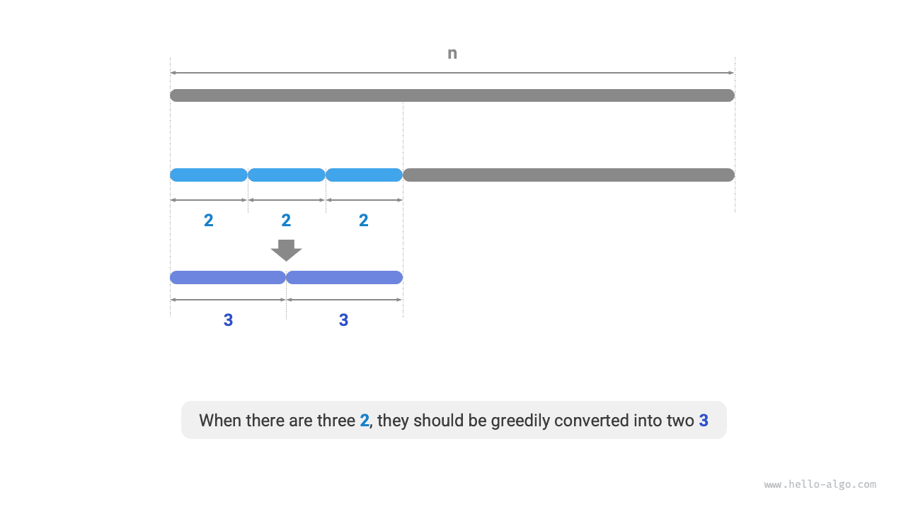

# Vấn đề cắt giảm sản phẩm tối đa

!!! câu hỏi

    Cho một số nguyên dương $n$, chia nó thành tổng của ít nhất hai số nguyên dương và tìm tích lớn nhất của các số nguyên thu được, như minh họa trong hình bên dưới.


Giả sử chúng ta chia $n$ thành $m$ thừa số nguyên, trong đó thừa số $i$-th được ký hiệu là $n_i$, nghĩa là

$$
n = \sum_{i=1}^{m}n_i
$$

Mục tiêu của bài toán này là tìm tích lớn nhất của tất cả các thừa số nguyên, cụ thể là

$$
\max(\prod_{i=1}^{m}n_i)
$$

Chúng ta cần xác định nên có bao nhiêu phần $m$ và mỗi phần $n_i$ nên là bao nhiêu.

### Xác định chiến lược tham lam

Theo nguyên tắc chung, tích của hai số nguyên thường lớn hơn tổng của chúng. Giả sử chúng ta tách hệ số $2$ khỏi $n$; sản phẩm thu được là $2(n-2)$. Chúng tôi so sánh sản phẩm này với $n$:

$$
\bắt đầu{căn chỉnh}
2(n-2) & \geq n \newline
2n - n - 4 & \geq 0 \newline
n & \geq 4
\end{căn chỉnh}
$$

Như được hiển thị trong hình bên dưới, khi $n \geq 4$, việc tách $2$ sẽ làm tăng tích, **điều này cho biết rằng các số nguyên lớn hơn hoặc bằng $4$ đều phải được chia**.

**Chiến lược tham lam thứ nhất**: Nếu sơ đồ phân tách chứa hệ số $\geq 4$, thì cần phân chia thêm. Sơ đồ phân tách cuối cùng chỉ nên chứa các thừa số $1$, $2$ và $3$.


Tiếp theo, hãy xem xét yếu tố nào là tối ưu. Trong ba yếu tố $1$, $2$ và $3$, rõ ràng $1$ là yếu tố tệ nhất, vì $1 \times (n-1) < n$ always holds, meaning splitting out $1$ will actually decrease the product.

As shown in the figure below, when $n = 6$, we have $3 \times 3 > 2 \times 2 \times 2$. **Điều này có nghĩa là việc chia $3$ sẽ tốt hơn là tách $2$**.

**Chiến lược tham lam hai**: Trong sơ đồ chia tách, chỉ nên có tối đa hai $2$, vì ba $2$ luôn có thể được thay thế bằng hai $3$ để có được sản phẩm lớn hơn.



Tóm lại, có thể rút ra các chiến lược tham lam sau đây.

1. Nhập số nguyên $n$, liên tục chia ra thừa số $3$ cho đến khi số dư là $0$, $1$ hoặc $2$.
2. Khi số dư là $0$, điều đó có nghĩa là $n$ là bội số của $3$, do đó không cần thực hiện thêm hành động nào.
3. Khi số dư là $2$ thì không chia thêm; giữ nó như cũ.
4. Khi số dư là $1$, vì $2 \times 2 > 1 \times 3$, hãy thay thế $3$ cuối cùng và $1$ còn lại bằng hai $2$s.

### Triển khai mã

Như thể hiện trong hình bên dưới, chúng ta không cần vòng lặp để chia số nguyên. Thay vào đó, chúng ta sử dụng phép chia số nguyên để thu được số $3$s, ký hiệu là $a$, và phép toán modulo để thu được số $b$ còn lại, cho:

$$
n = 3 a + b
$$

Xin lưu ý rằng đối với trường hợp cạnh của $n \leq 3$, $1$ phải được tách ra, với tích $1 \times (n - 1)$.

```src
[file]{max_product_cutting}-[class]{}-[func]{max_product_cutting}
```


**Độ phức tạp về thời gian phụ thuộc vào cách thực hiện phép lũy thừa trong ngôn ngữ lập trình**. Lấy Python làm ví dụ, có ba cách thường được sử dụng để tính lũy thừa.

- Cả toán tử `**` và hàm `pow()` đều có độ phức tạp về thời gian $O(\log⁡ a)$.
- Hàm `math.pow()` gọi nội bộ hàm `pow()` của thư viện C, hàm này thực hiện phép lũy thừa dấu phẩy động với độ phức tạp về thời gian $O(1)$.

Các biến $a$ và $b$ sử dụng một lượng không gian bổ sung không đổi, **do đó độ phức tạp của không gian là $O(1)$**.

### Bằng chứng chính xác

Chúng ta sử dụng chứng minh phản chứng và chỉ xét trường hợp $n \geq 4$.

1. **Tất cả các hệ số $\leq 3$**: Giả sử sơ đồ phân tách tối ưu bao gồm hệ số $x \geq 4$. Sau đó, nó có thể được chia tiếp thành $2(x-2)$ để thu được tích lớn hơn (hoặc bằng). Điều này mâu thuẫn với giả định.
2. **sơ đồ phân tách không chứa $1$**: Giả sử sơ đồ phân tách tối ưu bao gồm hệ số $1$. Sau đó, nó có thể được hợp nhất vào một yếu tố khác để có được sản phẩm lớn hơn. Điều này mâu thuẫn với giả định.
3. **sơ đồ phân tách chứa tối đa hai $2$s**: Giả sử sơ đồ phân tách tối ưu bao gồm ba $2$s. Sau đó, chúng có thể được thay thế bằng hai $3$, mang lại sản phẩm lớn hơn. Điều này mâu thuẫn với giả định.
