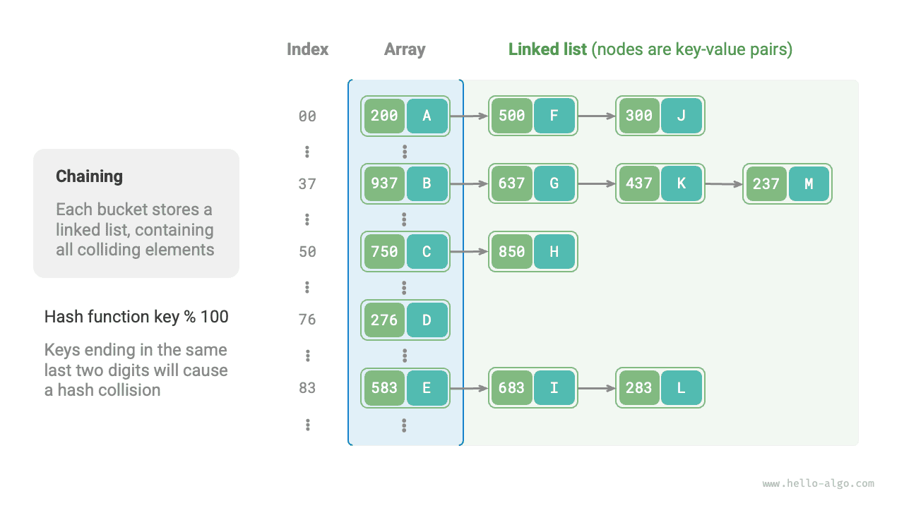
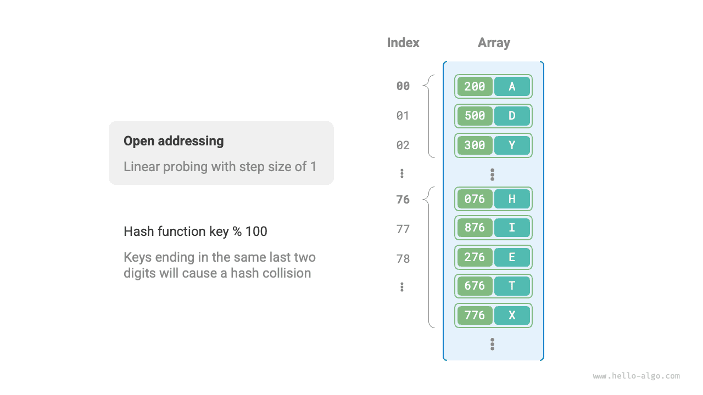
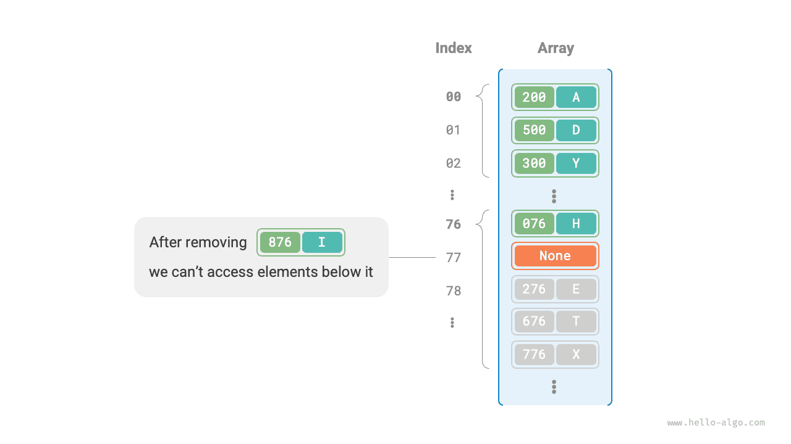

# Va chạm băm

Phần trước đã đề cập rằng, **trong hầu hết các trường hợp, không gian đầu vào của hàm băm lớn hơn nhiều so với không gian đầu ra**, vì vậy về mặt lý thuyết, việc va chạm hàm băm là không thể tránh khỏi. Ví dụ: nếu không gian đầu vào là tất cả các số nguyên và không gian đầu ra là kích thước dung lượng mảng thì chắc chắn nhiều số nguyên sẽ được ánh xạ tới cùng một chỉ mục nhóm.

Xung đột băm có thể dẫn đến kết quả truy vấn không chính xác, ảnh hưởng nghiêm trọng đến khả năng sử dụng của bảng băm. Để giải quyết vấn đề này, bất cứ khi nào xung đột băm xảy ra, chúng ta có thể thực hiện mở rộng bảng băm cho đến khi xung đột biến mất. Cách tiếp cận này đơn giản, dễ hiểu và hiệu quả nhưng rất kém hiệu quả vì việc mở rộng bảng băm liên quan đến một lượng lớn di chuyển dữ liệu và tính toán lại giá trị băm. Để nâng cao hiệu quả, chúng ta có thể áp dụng các chiến lược sau:

1. Cải thiện cấu trúc dữ liệu bảng băm để **bảng băm có thể hoạt động bình thường khi xảy ra xung đột băm**.
2. Chỉ mở rộng khi cần thiết, nghĩa là chỉ khi xung đột băm nghiêm trọng.

Các cách tiếp cận chính để cải thiện cấu trúc của bảng băm là xâu chuỗi riêng biệt và đánh địa chỉ mở.

## Chuỗi riêng biệt

Trong bảng băm ban đầu, mỗi nhóm chỉ có thể lưu trữ một cặp khóa-giá trị. <u>Chuỗi riêng biệt</u> thay thế phần tử đơn lẻ trong mỗi nhóm bằng danh sách được liên kết, coi mỗi cặp khóa-giá trị là một nút và lưu trữ tất cả các cặp khóa-giá trị xung đột trong cùng một danh sách. Hình dưới đây cho thấy một ví dụ về bảng băm chuỗi riêng biệt.



Trong bảng băm được triển khai với chuỗi riêng biệt, các thao tác cơ bản hoạt động như sau:

- **Truy vấn các phần tử**: Nhập `key`, tính toán chỉ mục nhóm bằng hàm băm, truy cập vào phần đầu của danh sách liên kết tương ứng và duyệt qua danh sách trong khi so sánh các khóa cho đến khi tìm thấy cặp khóa-giá trị đích.
- **Thêm phần tử**: Trước tiên, hãy sử dụng hàm băm để định vị danh sách liên kết tương ứng, sau đó chèn nút (cặp khóa-giá trị) vào danh sách.
- **Xóa các phần tử**: Sử dụng hàm băm để định vị danh sách liên kết tương ứng, sau đó duyệt qua danh sách đó để tìm và xóa nút đích.

Chuỗi riêng biệt có những hạn chế sau:

- **Tăng mức sử dụng không gian**: Danh sách liên kết chứa các con trỏ nút, tiêu tốn nhiều dung lượng bộ nhớ hơn mảng.
- **Hiệu quả truy vấn giảm**: Điều này là do cần phải duyệt tuyến tính danh sách liên kết để tìm phần tử tương ứng.

Mã bên dưới cung cấp cách triển khai đơn giản cho bảng băm chuỗi riêng biệt, với hai điều cần lưu ý:

- Danh sách (mảng động) được sử dụng thay cho danh sách liên kết để đơn giản hóa mã. Trong thiết lập này, bảng băm (mảng) chứa nhiều nhóm, mỗi nhóm là một danh sách.
- Việc triển khai này bao gồm một phương pháp mở rộng bảng băm. Khi hệ số tải vượt quá $\frac{2}{3}$, chúng tôi sẽ mở rộng bảng băm lên $2$ gấp kích thước ban đầu của nó.

```src
[file]{hash_map_chaining}-[class]{hash_map_chaining}-[func]{}
```

Cần lưu ý rằng khi danh sách liên kết trở nên quá dài thì thời gian truy vấn $O(n)$ sẽ kém. **Trong trường hợp này, danh sách liên kết có thể được chuyển đổi thành cây AVL hoặc cây đỏ đen**, giảm độ phức tạp về thời gian tra cứu xuống $O(\log n)$.

## Địa chỉ mở

<u>Địa chỉ mở</u> không đưa ra cấu trúc dữ liệu bổ sung. Thay vào đó, nó xử lý các va chạm băm thông qua việc thăm dò lặp đi lặp lại. Các chiến lược thăm dò phổ biến bao gồm thăm dò tuyến tính, thăm dò bậc hai và băm nhiều lần.

Hãy lấy việc thăm dò tuyến tính làm ví dụ để giới thiệu cơ chế của bảng băm địa chỉ mở.

### Thăm dò tuyến tính

Thăm dò tuyến tính sử dụng kích thước bước cố định để thăm dò tuần tự, do đó hoạt động của nó hơi khác so với hoạt động của bảng băm thông thường.

- **Chèn phần tử**: Tính toán chỉ mục nhóm bằng hàm băm. Nếu nhóm đã bị chiếm dụng, hãy tiếp tục thăm dò về phía trước từ vị trí va chạm với kích thước bước cố định (thường là $1$) cho đến khi tìm thấy nhóm trống, sau đó chèn phần tử vào đó.
- **Tìm kiếm các phần tử**: Nếu xảy ra xung đột, hãy tiếp tục thăm dò về phía trước với cùng kích thước bước cho đến khi tìm thấy phần tử tương ứng và trả về `value` của nó; nếu gặp một nhóm trống thì phần tử đích không có trong bảng băm, vì vậy hãy trả về `None`.

Hình bên dưới hiển thị sự phân bố của các cặp khóa-giá trị trong bảng băm địa chỉ mở sử dụng thăm dò tuyến tính. Theo hàm băm này, các khóa có hai chữ số cuối giống nhau sẽ được ánh xạ vào cùng một nhóm. Việc thăm dò tuyến tính sau đó đặt chúng vào nhóm đó và các nhóm tiếp theo.



Tuy nhiên, **thăm dò tuyến tính có xu hướng phân cụm**. Cụ thể, vùng bị chiếm đóng liền kề trong mảng càng dài thì các xung đột mới càng có nhiều khả năng xảy ra trong vùng đó. Điều này lại làm cho cụm phát triển hơn nữa, tạo ra một vòng luẩn quẩn làm giảm dần hiệu quả của các hoạt động chèn, xóa, tra cứu và cập nhật.

Điều quan trọng cần lưu ý là **chúng tôi không thể xóa trực tiếp các phần tử khỏi bảng băm có địa chỉ mở**. Việc xóa một phần tử sẽ tạo ra một nhóm trống `None` trong mảng. Trong quá trình tra cứu, khi việc thăm dò tuyến tính chạm tới vùng trống đó, nó sẽ dừng lại, điều đó có nghĩa là mọi phần tử được lưu trữ xa hơn dọc theo chuỗi thăm dò sẽ không thể truy cập được. Kết quả là chương trình có thể kết luận không chính xác rằng những phần tử đó không tồn tại, như thể hiện trong hình bên dưới.



Để giải quyết vấn đề này, chúng ta có thể áp dụng <u>xóa từng phần</u>: thay vì xóa trực tiếp một phần tử khỏi bảng băm, **sử dụng hằng số `TOMBSTONE` để đánh dấu nhóm**. Theo cơ chế này, cả `None` và `TOMBSTONE` đều biểu thị các nhóm có thể chấp nhận các cặp khóa-giá trị. Sự khác biệt là khi việc thăm dò tuyến tính gặp `TOMBSTONE`, nó phải tiếp tục thăm dò vì các cặp khóa-giá trị có thể vẫn tồn tại xa hơn dọc theo chuỗi.

Tuy nhiên, **xóa chậm có thể đẩy nhanh tốc độ suy giảm hiệu suất của bảng băm**. Mỗi lần xóa sẽ để lại một điểm đánh dấu và khi số lượng mục nhập `TOMBSTONE` tăng lên thì thời gian tìm kiếm cũng tăng lên vì việc thăm dò tuyến tính có thể cần phải bỏ qua nhiều bia mộ trước khi tìm thấy phần tử mục tiêu.

Để giải quyết vấn đề này, chúng ta có thể ghi lại chỉ mục của `TOMBSTONE` đầu tiên gặp phải trong quá trình thăm dò tuyến tính và hoán đổi phần tử đích tìm thấy vào vị trí đó. Lợi ích là mỗi truy vấn hoặc thao tác chèn có thể di chuyển các phần tử đến gần vị trí lý tưởng của chúng hơn, tức là gần hơn với nơi bắt đầu thăm dò, giúp cải thiện hiệu quả tra cứu.

Mã bên dưới triển khai bảng băm địa chỉ mở (thăm dò tuyến tính) với tính năng xóa từng phần. Để tận dụng tốt hơn không gian bảng băm, chúng ta xử lý bảng băm như một "mảng tròn". Khi đi quá cuối mảng ta quay lại đầu mảng và tiếp tục duyệt.

```src
[file]{hash_map_open_addressing}-[class]{hash_map_open_addressing}-[func]{}
```

### Thăm dò bậc hai

Thăm dò bậc hai tương tự như thăm dò tuyến tính và là một trong những chiến lược phổ biến để đánh địa chỉ mở. Khi xảy ra xung đột, việc thăm dò bậc hai không chỉ bỏ qua một số bước cố định mà bỏ qua một số bước bằng "bình phương số lượng thăm dò", tức là các bước $1, 4, 9, \dots$.

Thăm dò bậc hai có những ưu điểm sau:

- Thăm dò bậc hai cố gắng giảm bớt hiệu ứng phân cụm của thăm dò tuyến tính bằng cách bỏ qua các khoảng cách bằng bình phương của số lượng thăm dò.
- Thăm dò bậc hai bỏ qua khoảng cách lớn hơn để tìm các vị trí trống, giúp phân phối dữ liệu đồng đều hơn.

Tuy nhiên, việc thăm dò bậc hai không hoàn hảo:

- Việc phân cụm vẫn tồn tại, tức là một số vị trí có nhiều khả năng bị chiếm giữ hơn những vị trí khác.
- Do sự phát triển của các ô vuông, việc thăm dò bậc hai có thể không thăm dò toàn bộ bảng băm, nghĩa là ngay cả khi có các nhóm trống trong bảng băm, việc thăm dò bậc hai có thể không truy cập được chúng.

### Băm nhiều lần

Như tên cho thấy, băm nhiều lần sử dụng nhiều hàm băm $f_1(x)$, $f_2(x)$, $f_3(x)$, $\dots$ để thăm dò.

- **Chèn phần tử**: Nếu hàm băm $f_1(x)$ gặp xung đột, hãy thử $f_2(x)$, v.v., cho đến khi tìm thấy vị trí trống và phần tử được chèn.
- **Tìm kiếm phần tử**: Tìm kiếm theo cùng thứ tự của hàm băm cho đến khi tìm thấy phần tử đích và trả về phần tử đó; nếu gặp một vị trí trống hoặc tất cả các hàm băm đã được thử, điều đó cho biết phần tử không có trong bảng băm, sau đó trả về `None`.

So với thăm dò tuyến tính, băm nhiều lớp ít có xu hướng phân cụm hơn, nhưng việc sử dụng nhiều hàm băm sẽ gây ra chi phí tính toán bổ sung.

!!! mẹo

    Xin lưu ý rằng các bảng băm dựa trên địa chỉ mở, bao gồm thăm dò tuyến tính, thăm dò bậc hai và băm nhiều lần, tất cả đều có vấn đề là không thể xóa trực tiếp các phần tử.

## Lựa chọn ngôn ngữ lập trình

Các ngôn ngữ lập trình khác nhau áp dụng các chiến lược triển khai bảng băm khác nhau. Dưới đây là một vài ví dụ:

- Python sử dụng địa chỉ mở. Từ điển `dict` sử dụng số giả ngẫu nhiên để thăm dò.
- Java sử dụng chuỗi riêng biệt. Kể từ JDK 1.8, khi độ dài mảng trong `HashMap` đạt 64 và độ dài của danh sách liên kết đạt 8, danh sách liên kết sẽ được chuyển đổi thành cây đỏ đen để cải thiện hiệu suất tìm kiếm.
- Go sử dụng chuỗi riêng biệt. Go quy định rằng mỗi nhóm có thể lưu trữ tối đa 8 cặp khóa-giá trị và nếu vượt quá dung lượng, một nhóm tràn sẽ được liên kết; khi có quá nhiều thùng tràn, thao tác mở rộng công suất bằng nhau đặc biệt sẽ được thực hiện để đảm bảo hiệu suất.
