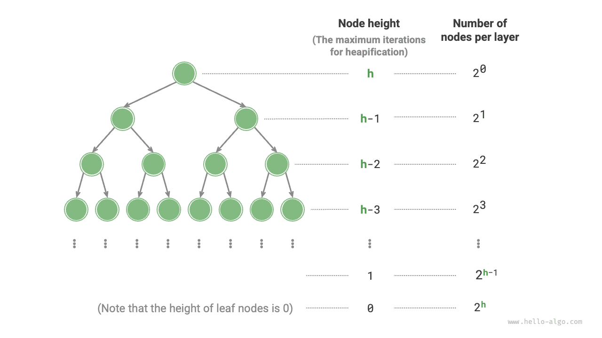

# Vận hành xây dựng Heap

Trong một số trường hợp, chúng ta muốn tạo vùng nhớ heap bằng cách sử dụng tất cả các thành phần của danh sách và quá trình này được gọi là "hoạt động xây dựng vùng nhớ heap".

## Triển khai bằng cách chèn phần tử

Trước tiên, chúng tôi tạo một vùng trống, sau đó lặp qua danh sách, thực hiện "thao tác chèn phần tử" trên từng phần tử theo trình tự. Điều này có nghĩa là thêm phần tử vào cuối vùng heap và sau đó thực hiện heapify "từ dưới lên trên" trên phần tử đó.

Mỗi lần một phần tử được chèn vào heap, chiều dài của heap sẽ tăng thêm một. Vì các nút được thêm vào cây nhị phân một cách tuần tự từ trên xuống dưới nên vùng heap được xây dựng "từ trên xuống dưới".

Với các phần tử $n$, thao tác chèn của mỗi phần tử mất $O(\log{n})$ thời gian, do đó độ phức tạp về thời gian của phương pháp xây dựng vùng heap này là $O(n \log n)$.

## Triển khai thông qua Heapify Traversal

Trên thực tế, chúng ta có thể triển khai một phương pháp xây dựng vùng heap hiệu quả hơn theo hai bước.

1. Thêm tất cả các phần tử của danh sách vào heap, tại thời điểm đó thuộc tính heap vẫn chưa được thỏa mãn.
2. Duyệt heap theo thứ tự ngược lại (ngược lại với duyệt thứ tự cấp), thực hiện "heapify từ trên xuống dưới" trên mỗi nút không phải lá theo trình tự.

**Sau khi tạo vùng heap con, cây con gốc tại nút đó sẽ trở thành vùng heap con hợp lệ**. Vì chúng ta duyệt theo thứ tự ngược lại nên heap được xây dựng "từ dưới lên trên".

Lý do chọn truyền tải theo thứ tự ngược là vì nó đảm bảo các cây con bên dưới nút hiện tại đã là các vùng nhớ con hợp lệ, do đó việc tạo đống dữ liệu cho nút hiện tại sẽ có hiệu quả.

Cần lưu ý rằng **vì các nút lá không có nút con nên chúng là các vùng nhớ con hợp lệ một cách tự nhiên và không yêu cầu tạo đống**. Như được hiển thị trong đoạn mã bên dưới, nút không phải lá cuối cùng là nút cha của nút cuối cùng; chúng tôi bắt đầu từ nút đó và tăng cường trong khi duyệt theo thứ tự ngược lại:

```src
[file]{my_heap}-[class]{max_heap}-[func]{__init__}
```

## Phân tích độ phức tạp

Tiếp theo, chúng ta hãy thử tính độ phức tạp về thời gian của phương pháp xây dựng vùng heap thứ hai này.

- Giả sử cây nhị phân hoàn chỉnh có $n$ nút thì số nút lá là $(n + 1) / 2$, trong đó $/$ là phép chia sàn. Do đó, số lượng nút cần heapification là $(n - 1) / 2$.
- Trong quá trình heapify từ trên xuống dưới, mỗi nút có thể chìm nhiều nhất vào một nút lá, vì vậy số lần lặp tối đa là chiều cao của cây nhị phân, $\log n$.

Nhân hai số này với nhau, chúng ta có được độ phức tạp về thời gian là $O(n \log n)$ cho quá trình xây dựng vùng heap. **Tuy nhiên, ước tính này không chính xác vì nó không tính đến đặc tính là cây nhị phân có nhiều nút ở cấp thấp hơn so với ở cấp cao**.

Hãy thực hiện một phép tính chính xác hơn. Để đơn giản hóa việc phân tích, giả sử một "cây nhị phân hoàn hảo" với các nút $n$ và chiều cao $h$; giả định này không ảnh hưởng đến tính đúng đắn của kết quả.



Như được hiển thị trong hình trên, số lần lặp tối đa cho "heapify từ trên xuống dưới" của một nút bằng khoảng cách từ nút đó đến nút lá, chính xác là chiều cao của nút đó. Do đó, chúng ta có thể tính tổng "số nút $\times$ chiều cao nút" ở mỗi cấp để **có được tổng số lần lặp lại heapify cho tất cả các nút**.

$$
T(h) = 2^0h + 2^1(h-1) + 2^2(h-2) + \dots + 2^{(h-1)}\times1
$$

Đơn giản hóa biểu thức trên đòi hỏi một số đại số cấp ba. Đầu tiên, nhân $T(h)$ với $2$ để có:

$$
\bắt đầu{căn chỉnh}
T(h) & = 2^0h + 2^1(h-1) + 2^2(h-2) + \dots + 2^{h-1}\times1 \newline
2 T(h) & = 2^1h + 2^2(h-1) + 2^3(h-2) + \dots + 2^{h}\times1 \newline
\end{căn chỉnh}
$$

Sử dụng phép trừ các tổng đã dịch chuyển, trừ phương trình thứ nhất $T(h)$ khỏi phương trình thứ hai $2 T(h)$ để có:

$$
2T(h) - T(h) = T(h) = -2^0h + 2^1 + 2^2 + \dots + 2^{h-1} + 2^h
$$

Quan sát biểu thức trên, chúng ta thấy rằng $T(h)$ là một chuỗi hình học, có thể được tính trực tiếp bằng công thức tính tổng, mang lại độ phức tạp về thời gian là:

$$
\bắt đầu{căn chỉnh}
T(h) & = 2 \frac{1 - 2^h}{1 - 2} - h \newline
& = 2^{h+1} - h - 2 \newline
& = O(2^h)
\end{căn chỉnh}
$$

Hơn nữa, một cây nhị phân hoàn hảo có chiều cao $h$ có $n = 2^{h+1} - 1$ nút, do đó độ phức tạp là $O(2^h) = O(n)$. Đạo hàm này cho thấy rằng **độ phức tạp về thời gian của việc xây dựng vùng nhớ heap từ danh sách đầu vào là $O(n)$, có hiệu quả cao**.
