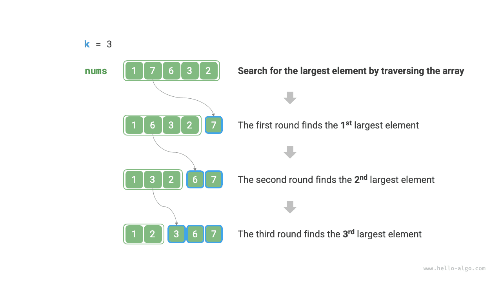
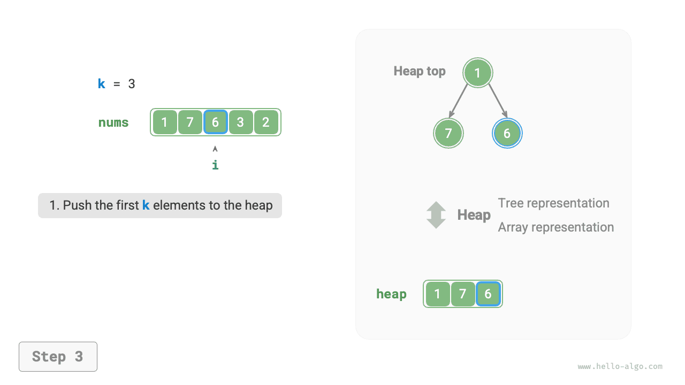
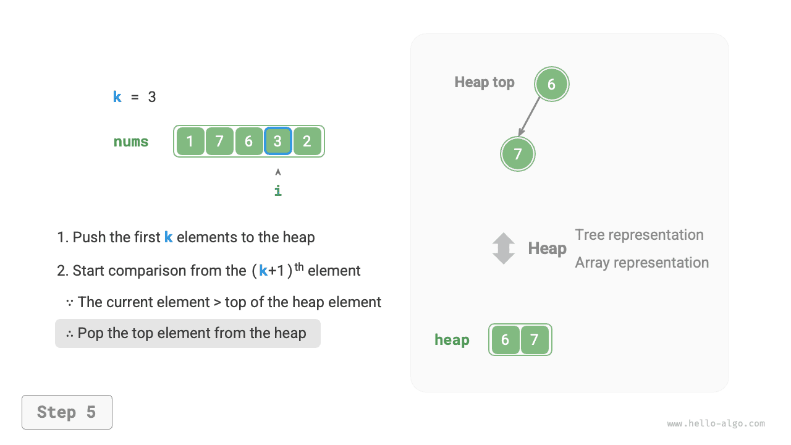
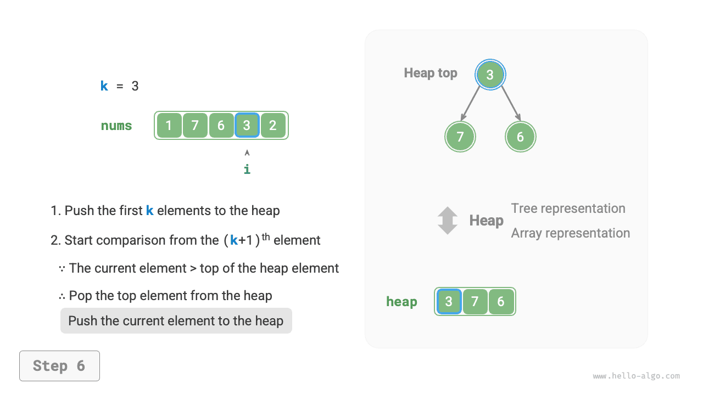
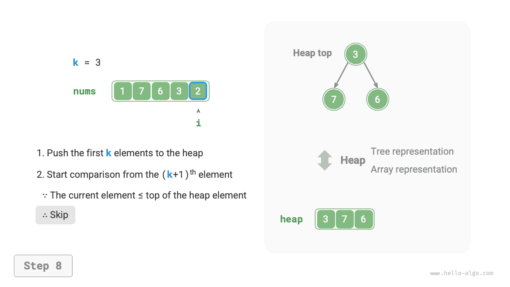

# Vấn đề Top-k

!!! câu hỏi

    Cho một mảng không có thứ tự `nums` có độ dài $n$, trả về các phần tử $k$ lớn nhất trong mảng.

Đối với vấn đề này, trước tiên chúng tôi sẽ giới thiệu hai giải pháp tương đối đơn giản, tiếp theo là giải pháp dựa trên heap hiệu quả hơn.

## Phương pháp 1: Lựa chọn lặp lại

Chúng ta có thể thực hiện các vòng duyệt $k$ như trong hình bên dưới, trích xuất các phần tử lớn nhất $1^{st}$, $2^{nd}$, $\dots$, $k^{th}$ trong mỗi vòng, với độ phức tạp về thời gian là $O(nk)$.

Phương pháp này chỉ phù hợp khi $k \ll n$, vì khi $k$ gần với $n$, độ phức tạp về thời gian tiến gần đến $O(n^2)$, khiến nó rất kém hiệu quả.



!!! mẹo

    Khi $k = n$, chúng ta có thể thu được một chuỗi được sắp xếp hoàn chỉnh, tương đương với thuật toán "sắp xếp chọn".

## Cách 2: Sắp xếp

Như được hiển thị trong hình bên dưới, trước tiên chúng ta có thể sắp xếp mảng `nums`, sau đó trả về các phần tử $k$ ngoài cùng bên phải, với độ phức tạp về thời gian là $O(n \log n)$.

Rõ ràng, phương pháp này hiệu quả hơn mức cần thiết, vì chúng ta chỉ cần tìm các phần tử $k$ lớn nhất thay vì sắp xếp các phần tử khác.


## Cách 3: Đống

Chúng ta có thể giải quyết vấn đề Top-k hiệu quả hơn bằng heap, như minh họa trong hình bên dưới.

1. Khởi tạo vùng heap tối thiểu, trong đó phần tử trên cùng của heap là nhỏ nhất.
2. Đầu tiên, chèn các phần tử $k$ đầu tiên của mảng vào heap theo thứ tự.
3. Bắt đầu từ phần tử $(k + 1)^{th}$, nếu phần tử hiện tại lớn hơn phần tử trên cùng của heap, hãy loại bỏ phần tử trên cùng của heap và chèn phần tử hiện tại vào heap.
4. Sau khi quá trình duyệt hoàn tất, heap chứa các phần tử $k$ lớn nhất.

=== "<1>"
    

=== "<2>"
    

=== "<3>"
    

=== "<4>"
    

=== "<5>"
    

=== "<6>"
    

=== "<7>"
    

=== "<8>"
    

=== "<9>"
    

Mã ví dụ như sau:

```src
[file]{top_k}-[class]{}-[func]{top_k_heap}
```

Tổng cộng $n$ vòng chèn và xóa vùng nhớ heap được thực hiện, với độ dài tối đa của vùng nhớ heap là $k$, do đó độ phức tạp về thời gian là $O(n \log k)$. Phương pháp này rất hiệu quả; khi $k$ nhỏ, độ phức tạp về thời gian tiến tới $O(n)$; khi $k$ lớn, độ phức tạp về thời gian không vượt quá $O(n \log n)$.

Ngoài ra, phương pháp này rất phù hợp với luồng dữ liệu động. Khi có dữ liệu mới, chúng tôi có thể liên tục duy trì các phần tử trong vùng heap, cho phép cập nhật động các phần tử $k$ lớn nhất.
