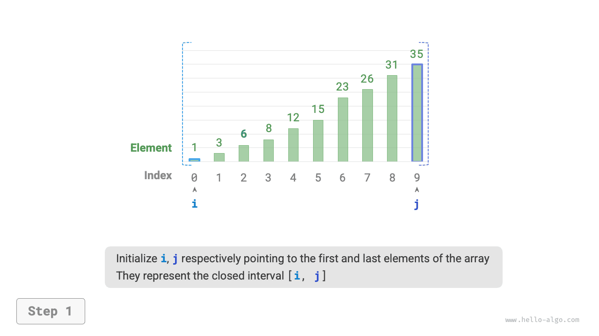
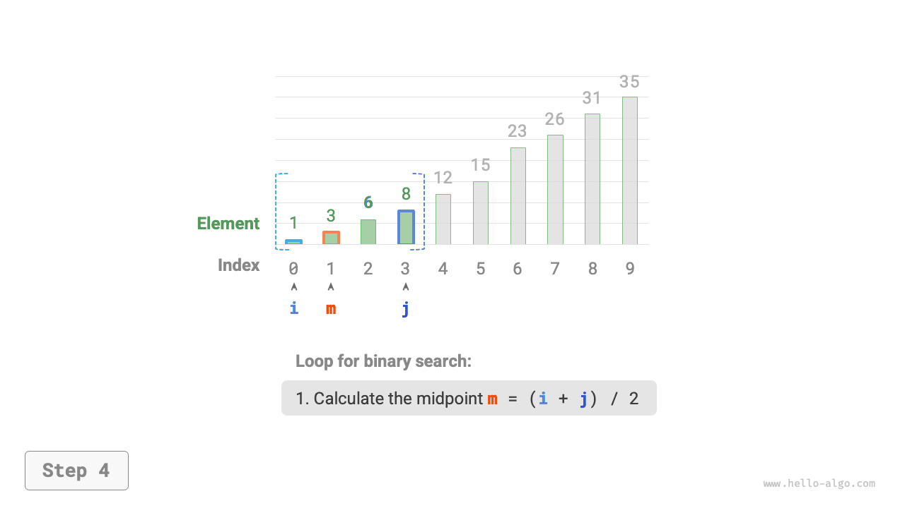
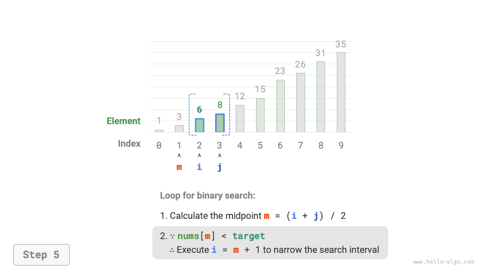
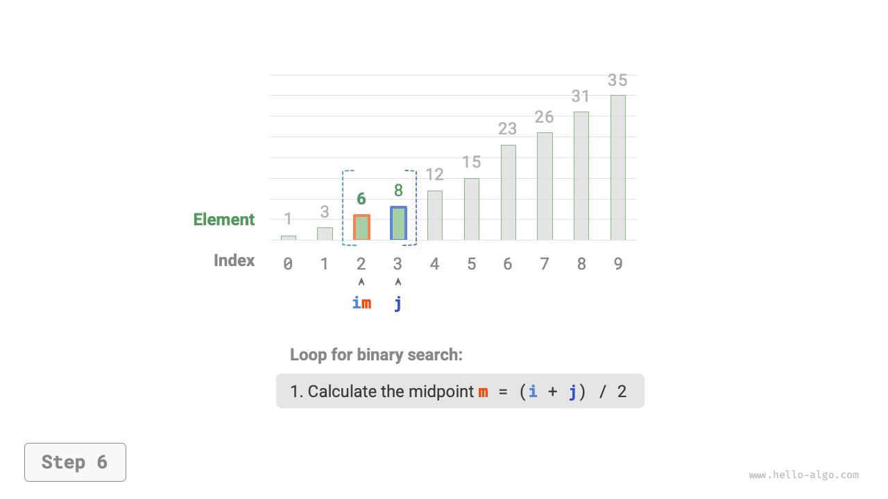
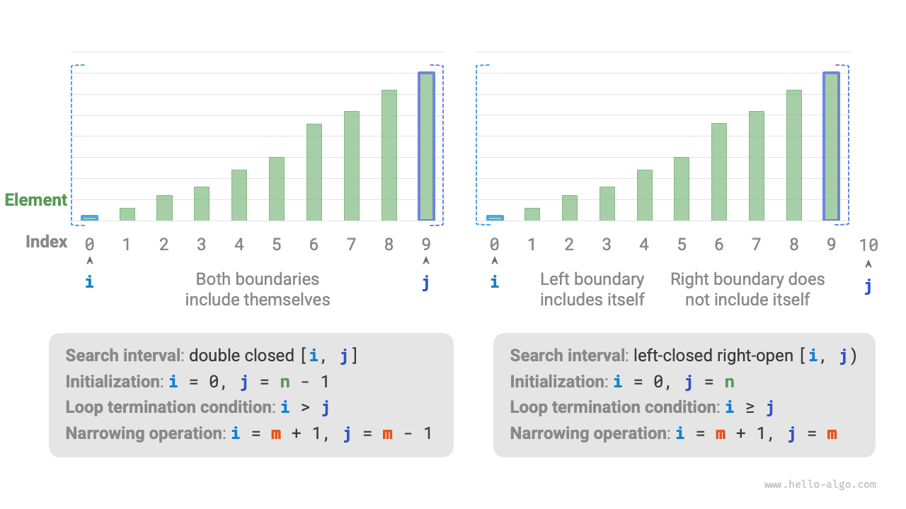

# Tìm kiếm nhị phân

<u>Tìm kiếm nhị phân</u> là thuật toán tìm kiếm hiệu quả dựa trên chiến lược chia để trị. Nó tận dụng thứ tự sắp xếp của dữ liệu để giảm một nửa phạm vi tìm kiếm trong mỗi vòng cho đến khi tìm thấy phần tử mục tiêu hoặc khoảng thời gian tìm kiếm trở nên trống.

!!! câu hỏi

    Cho một mảng `nums` có độ dài $n$ với các phần tử được sắp xếp theo thứ tự tăng dần và không trùng lặp, hãy tìm kiếm và trả về chỉ mục của phần tử `target` trong mảng. Nếu mảng không chứa phần tử, trả về $-1$. Một ví dụ được hiển thị trong hình dưới đây.


Như thể hiện trong hình bên dưới, trước tiên chúng ta khởi tạo các con trỏ $i = 0$ và $j = n - 1$, lần lượt trỏ đến phần tử đầu tiên và cuối cùng của mảng, biểu thị khoảng tìm kiếm $[0, n - 1]$. Lưu ý rằng dấu ngoặc vuông biểu thị một khoảng đóng, bao gồm chính các giá trị biên.

Tiếp theo, thực hiện hai bước sau trong một vòng lặp:

1. Tính chỉ số trung điểm $m = \lfloor {(i + j) / 2} \rfloor$, trong đó $\lfloor \: \rfloor$ biểu thị hoạt động sàn.
2. So sánh `nums[m]` và `target`, dẫn đến ba trường hợp:
    1. Khi `nums[m] < target`, nó chỉ ra rằng `target` nằm trong khoảng $[m + 1, j]$, vì vậy hãy thực hiện $i = m + 1$.
    2. Khi `nums[m] > target`, nó chỉ ra rằng `target` nằm trong khoảng $[i, m - 1]$, vì vậy hãy thực hiện $j = m - 1$.
    3. Khi `nums[m] = target`, nó cho biết rằng `target` đã được tìm thấy, vì vậy hãy trả về chỉ mục $m$.

Nếu mảng không chứa phần tử đích, khoảng thời gian tìm kiếm cuối cùng sẽ trống. Trong trường hợp này, trả về $-1$.

=== "<1>"
    

=== "<2>"
    

=== "<3>"
    

=== "<4>"
    

=== "<5>"
    

=== "<6>"
    

=== "<7>"
    

Cần lưu ý rằng vì cả $i$ và $j$ đều thuộc loại `int` nên **$i + j$ có thể vượt quá phạm vi của loại `int`**. Để tránh tràn số nguyên, chúng tôi thường sử dụng công thức $m = \lfloor {i + (j - i) / 2} \rfloor$ để tính điểm giữa.

Mã được hiển thị dưới đây:

```src
[file]{binary_search}-[class]{}-[func]{binary_search}
```

**Độ phức tạp về thời gian là $O(\log n)$**: Trong vòng lặp tìm kiếm nhị phân, khoảng thời gian được giảm đi một nửa mỗi vòng, do đó số lần lặp là $\log_2 n$.

**Độ phức tạp của không gian là $O(1)$**: Con trỏ $i$ và $j$ sử dụng không gian có kích thước không đổi.

## Phương pháp biểu diễn khoảng

Ngoài khoảng đóng được đề cập ở trên, một cách biểu diễn khoảng phổ biến khác là khoảng "đóng trái - mở", được định nghĩa là $[0, n)$, nghĩa là ranh giới bên trái là bao gồm trong khi ranh giới bên phải là loại trừ. Theo biểu diễn này, khoảng $[i, j)$ trống khi $i = j$.

Chúng ta có thể triển khai thuật toán tìm kiếm nhị phân có cùng chức năng dựa trên biểu diễn này:

```src
[file]{binary_search}-[class]{}-[func]{binary_search_lcro}
```

Như được hiển thị trong hình bên dưới, dưới hai biểu diễn khoảng, các hoạt động khởi tạo, điều kiện vòng lặp và thu hẹp khoảng của thuật toán tìm kiếm nhị phân đều khác nhau.

Vì cả hai ranh giới bên trái và bên phải trong biểu diễn "khoảng đóng" đều được xác định là đóng, nên các phép toán để thu hẹp khoảng thông qua các con trỏ $i$ và $j$ cũng đối xứng. Điều này làm cho nó ít xảy ra lỗi hơn, **vì vậy, phương pháp "khoảng thời gian đóng" thường được khuyến nghị**.



## Ưu điểm và hạn chế

Tìm kiếm nhị phân mang lại hiệu suất tốt cả về thời gian và không gian.

- Tìm kiếm nhị phân có hiệu quả về thời gian cao. Với khối lượng dữ liệu lớn, độ phức tạp thời gian logarit có những lợi thế đáng kể. Ví dụ: khi kích thước dữ liệu $n = 2^{20}$, tìm kiếm tuyến tính yêu cầu số lần lặp $2^{20} = 1048576$, trong khi tìm kiếm nhị phân chỉ cần số lần lặp $\log_2 2^{20} = 20$.
- Tìm kiếm nhị phân không yêu cầu thêm không gian. So với các thuật toán tìm kiếm yêu cầu thêm không gian (chẳng hạn như tìm kiếm dựa trên hàm băm), tìm kiếm nhị phân tiết kiệm không gian hơn.

Tuy nhiên, tìm kiếm nhị phân không phù hợp với mọi tình huống, chủ yếu vì những lý do sau:

- Tìm kiếm nhị phân chỉ áp dụng cho dữ liệu đã được sắp xếp. Nếu dữ liệu đầu vào không được sắp xếp, việc sắp xếp cụ thể để sử dụng tìm kiếm nhị phân sẽ phản tác dụng, vì thuật toán sắp xếp thường có độ phức tạp về thời gian là $O(n \log n)$, cao hơn cả tìm kiếm tuyến tính và tìm kiếm nhị phân. Đối với các trường hợp thường xuyên chèn phần tử, việc giữ cho mảng được sắp xếp yêu cầu chèn các phần tử vào các vị trí cụ thể với độ phức tạp về thời gian là $O(n)$, điều này cũng rất tốn kém.
- Tìm kiếm nhị phân chỉ áp dụng cho mảng. Tìm kiếm nhị phân yêu cầu quyền truy cập không liền kề, kiểu nhảy vào các phần tử và kiểu truy cập này không hiệu quả trong danh sách được liên kết, khiến nó không phù hợp với danh sách được liên kết hoặc cấu trúc dữ liệu dựa trên danh sách liên kết.
- Đối với khối lượng dữ liệu nhỏ, tìm kiếm tuyến tính hoạt động tốt hơn. Trong tìm kiếm tuyến tính, mỗi vòng chỉ cần 1 phép toán so sánh; trong khi ở tìm kiếm nhị phân, nó yêu cầu 1 phép cộng, 1 phép chia, 1-3 phép so sánh và 1 phép cộng (trừ), tổng cộng là 4-6 phép toán đơn vị. Do đó, khi khối lượng dữ liệu $n$ nhỏ, tìm kiếm tuyến tính thực sự nhanh hơn tìm kiếm nhị phân.
