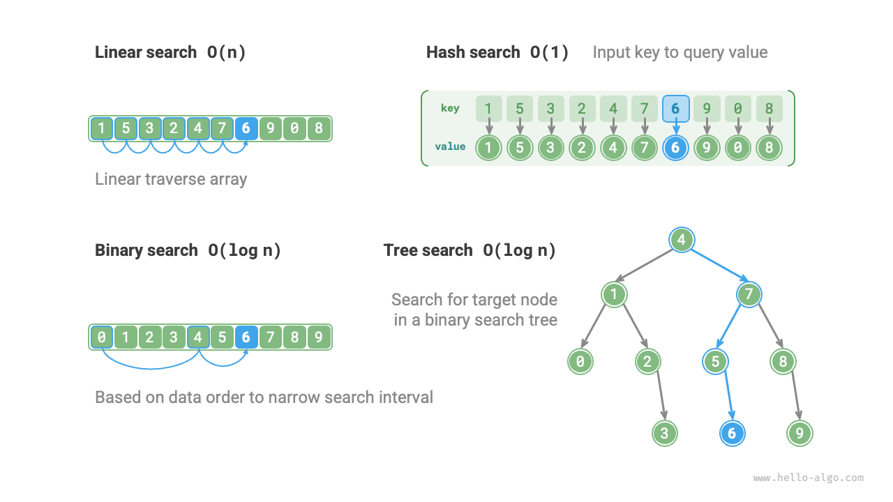

# Thuật toán tìm kiếm được xem lại

<u>Thuật toán tìm kiếm</u> được sử dụng để tìm kiếm một hoặc một nhóm phần tử đáp ứng các điều kiện cụ thể trong cấu trúc dữ liệu (chẳng hạn như mảng, danh sách liên kết, cây hoặc biểu đồ).

Các thuật toán tìm kiếm có thể được chia thành hai loại sau dựa trên phương pháp triển khai của chúng:

- **Định vị các phần tử đích bằng cách duyệt qua cấu trúc dữ liệu**, chẳng hạn như duyệt mảng, danh sách liên kết, cây và biểu đồ.
- **Đạt được khả năng tra cứu phần tử hiệu quả bằng cách tận dụng cách sắp xếp dữ liệu hoặc thông tin trước đó về dữ liệu**, chẳng hạn như tìm kiếm nhị phân, tìm kiếm dựa trên hàm băm và tìm kiếm cây tìm kiếm nhị phân.

Vì những chủ đề này đã được giới thiệu trong các chương trước nên các thuật toán tìm kiếm chắc hẳn đã quen thuộc với chúng ta. Trong phần này, chúng ta xem xét lại chúng từ một góc độ có hệ thống hơn.

## Tìm kiếm vũ phu

Tìm kiếm Brute-force định vị các phần tử mục tiêu bằng cách duyệt qua từng phần tử của cấu trúc dữ liệu.

- "Tìm kiếm tuyến tính" có thể áp dụng cho các cấu trúc dữ liệu tuyến tính như mảng và danh sách liên kết. Nó bắt đầu từ một đầu của cấu trúc dữ liệu và truy cập từng phần tử một cho đến khi tìm thấy phần tử đích hoặc đến đầu kia mà không tìm thấy phần tử đích.
- "Tìm kiếm theo chiều rộng" và "tìm kiếm theo chiều sâu" là hai chiến lược truyền tải cho đồ thị và cây. Tìm kiếm theo chiều rộng bắt đầu từ nút ban đầu và tìm kiếm từng lớp, truy cập các nút từ gần đến xa. Tìm kiếm theo chiều sâu bắt đầu từ nút ban đầu, đi theo một đường dẫn đến cuối, sau đó quay lại và thử các đường dẫn khác cho đến khi toàn bộ cấu trúc dữ liệu được duyệt qua.

Ưu điểm của tìm kiếm brute-force là nó đơn giản và có tính tổng quát tốt, **không yêu cầu xử lý trước dữ liệu hoặc cấu trúc dữ liệu bổ sung**.

Tuy nhiên, **độ phức tạp về thời gian của các thuật toán như vậy là $O(n)$**, trong đó $n$ là số phần tử, do đó hiệu suất kém khi xử lý lượng lớn dữ liệu.

## Tìm kiếm thích ứng

Tìm kiếm thích ứng tận dụng các thuộc tính của chính dữ liệu (chẳng hạn như thứ tự được sắp xếp) để tối ưu hóa quá trình tìm kiếm và định vị các phần tử mục tiêu hiệu quả hơn.

- "Tìm kiếm nhị phân" sử dụng tính thứ tự của dữ liệu để tìm kiếm hiệu quả, chỉ áp dụng cho mảng.
- "Tìm kiếm dựa trên hàm băm" sử dụng bảng băm để lưu trữ dữ liệu có thể tìm kiếm dưới dạng cặp khóa-giá trị, từ đó cho phép truy vấn hiệu quả.
- "Tìm kiếm cây" hoạt động trên các cấu trúc cây cụ thể (chẳng hạn như cây tìm kiếm nhị phân), nhanh chóng loại trừ các nút bằng cách so sánh các giá trị nút để xác định vị trí phần tử đích.

Ưu điểm của các thuật toán như vậy là hiệu quả cao, **với độ phức tạp về thời gian đạt $O(\log n)$ hoặc thậm chí $O(1)$**.

Tuy nhiên, **việc sử dụng các thuật toán này thường yêu cầu xử lý trước dữ liệu**. Ví dụ: tìm kiếm nhị phân yêu cầu sắp xếp trước mảng, trong khi tìm kiếm dựa trên hàm băm và tìm kiếm cây đều yêu cầu cấu trúc dữ liệu bổ sung và việc duy trì các cấu trúc dữ liệu này cũng đòi hỏi thêm thời gian và không gian.

!!! mẹo

    Các thuật toán tìm kiếm thích ứng thường được gọi là thuật toán tra cứu, **chủ yếu được sử dụng để truy xuất nhanh các phần tử mục tiêu trong các cấu trúc dữ liệu cụ thể**.

## Lựa chọn phương pháp tìm kiếm

Với tập dữ liệu có kích thước $n$, chúng ta có thể sử dụng tìm kiếm tuyến tính, tìm kiếm nhị phân, tìm kiếm cây, tìm kiếm dựa trên hàm băm và các phương pháp khác để tìm kiếm phần tử đích. Nguyên lý làm việc của từng phương pháp được thể hiện trong hình dưới đây.

Hiệu quả và đặc điểm của các phương pháp này được tóm tắt trong bảng dưới đây.

 Bảng <id> &nbsp; So sánh hiệu quả của thuật toán tìm kiếm 

|                    | Tìm kiếm tuyến tính | Tìm kiếm nhị phân | Tìm kiếm cây | Tìm kiếm dựa trên hàm băm |
| ------------------ | ------------- | --------------------- | ----------------------------- | -------------------------- |
| Phần tử tìm kiếm | $O(n)$ | $O(\log n)$ | $O(\log n)$ | $O(1)$ |
| Chèn phần tử | $O(1)$ | $O(n)$ | $O(\log n)$ | $O(1)$ |
| Xóa phần tử | $O(n)$ | $O(n)$ | $O(\log n)$ | $O(1)$ |
| Thêm không gian | $O(1)$ | $O(1)$ | $O(n)$ | $O(n)$ |
| Tiền xử lý dữ liệu | / | Sắp xếp $O(n \log n)$ | Xây dựng trên cây $O(n \log n)$ | Xây dựng bảng băm $O(n)$ |
| Dữ liệu được đặt hàng | Không có thứ tự | Đã đặt hàng | Đã đặt hàng | Không có thứ tự |

Việc lựa chọn thuật toán tìm kiếm còn phụ thuộc vào khối lượng dữ liệu, yêu cầu về hiệu suất tìm kiếm, truy vấn dữ liệu và tần suất cập nhật, v.v.

**Tìm kiếm tuyến tính**

- Tính tổng quát tốt, không yêu cầu thao tác tiền xử lý dữ liệu. Nếu chúng ta chỉ cần truy vấn dữ liệu một lần thì quá trình tiền xử lý theo yêu cầu của ba phương pháp còn lại có thể mất nhiều thời gian hơn so với chính tìm kiếm tuyến tính.
- Thích hợp cho khối lượng dữ liệu nhỏ, trong đó độ phức tạp về thời gian ít ảnh hưởng đến hiệu quả hơn.
- Thích hợp cho các tình huống có tần suất cập nhật dữ liệu cao vì phương pháp này không yêu cầu bảo trì dữ liệu bổ sung.

**Tìm kiếm nhị phân**

- Thích hợp cho các tập dữ liệu lớn, có hiệu suất ổn định và độ phức tạp về thời gian trong trường hợp xấu nhất là $O(\log n)$.
- Khối lượng dữ liệu không được quá lớn vì việc lưu trữ mảng đòi hỏi không gian bộ nhớ liền kề.
- Không phù hợp với các tình huống thường xuyên chèn và xóa dữ liệu vì việc duy trì một mảng được sắp xếp có chi phí cao.

**Tìm kiếm dựa trên hàm băm**

- Thích hợp cho các tình huống có yêu cầu hiệu năng truy vấn cao, với độ phức tạp về thời gian trung bình là $O(1)$.
- Không phù hợp với các tình huống yêu cầu tìm kiếm dữ liệu theo thứ tự hoặc theo phạm vi, vì bảng băm không thể duy trì dữ liệu theo thứ tự được sắp xếp.
- Sự phụ thuộc nhiều vào hàm băm và chiến lược xử lý xung đột hàm băm, có nguy cơ suy giảm hiệu suất đáng kể.
- Không phù hợp với khối lượng dữ liệu quá lớn, vì bảng băm yêu cầu thêm không gian để giảm thiểu xung đột và do đó mang lại hiệu suất truy vấn tốt.

**Tìm kiếm cây**

- Thích hợp cho các tập dữ liệu lớn vì các nút cây được lưu trữ không liền kề trong bộ nhớ.
- Thích hợp cho các tình huống yêu cầu duy trì dữ liệu theo thứ tự hoặc thực hiện tìm kiếm theo phạm vi.
- Trong quá trình chèn và xóa nút liên tục, cây tìm kiếm nhị phân có thể bị lệch, làm giảm độ phức tạp về thời gian xuống $O(n)$.
- Nếu sử dụng cây AVL hoặc cây đỏ đen, tất cả các hoạt động có thể chạy nhất quán trong thời gian $O(\log n)$, mặc dù việc duy trì sự cân bằng của cây sẽ bổ sung thêm chi phí.
