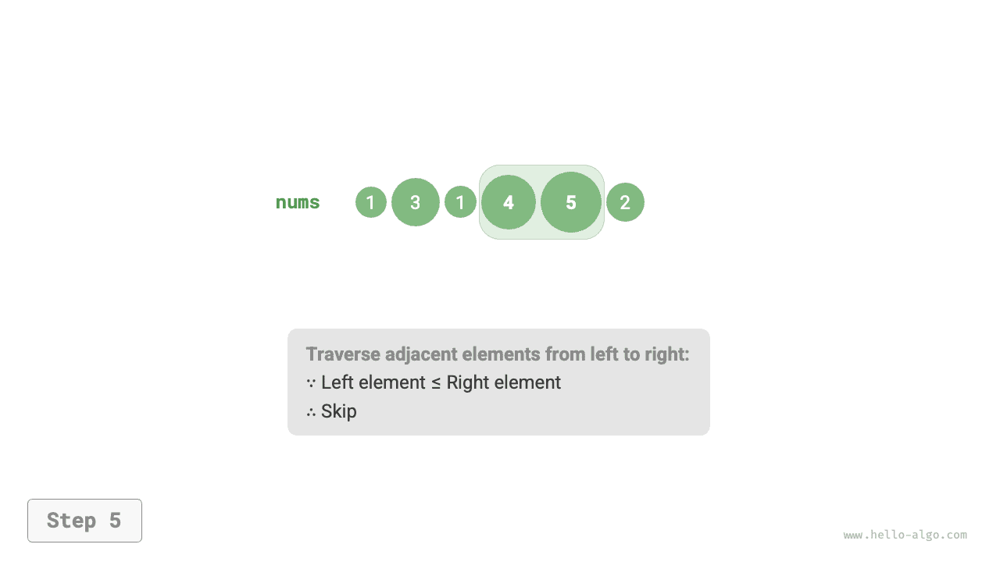
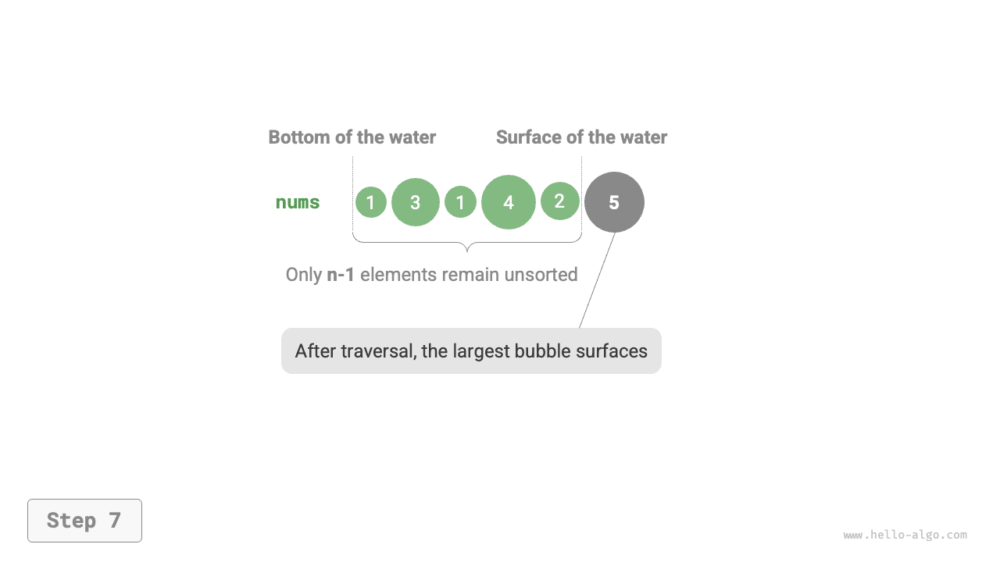
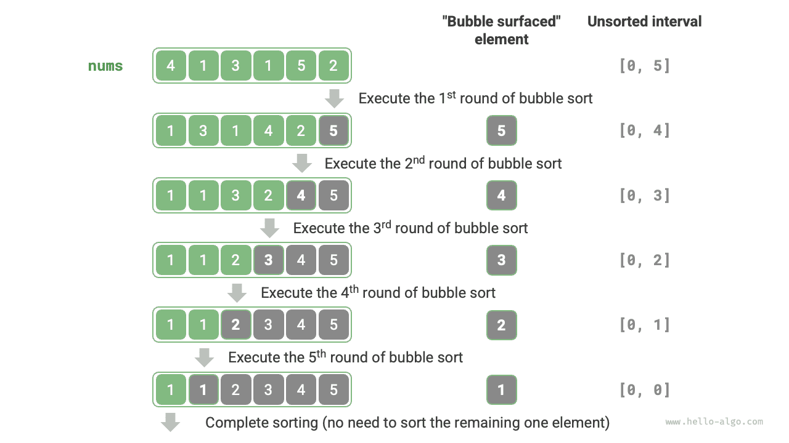

# Sắp xếp bong bóng

<u>Sắp xếp bong bóng</u> sắp xếp một mảng bằng cách liên tục so sánh và hoán đổi các phần tử liền kề. Quá trình này giống như bong bóng nổi lên từ dưới lên trên, do đó có tên là bong bóng.

Như minh họa trong hình bên dưới, quá trình sủi bọt có thể được mô phỏng bằng cách sử dụng hoán đổi phần tử: bắt đầu từ đầu ngoài cùng bên trái của mảng và di chuyển sang bên phải, so sánh từng cặp phần tử liền kề và nếu "phần tử bên trái > phần tử bên phải", hãy hoán đổi chúng. Sau khi quá trình duyệt hoàn tất, phần tử lớn nhất sẽ được chuyển đến đầu ngoài cùng bên phải của mảng.

=== "<1>"
    

=== "<2>"
    

=== "<3>"
    

=== "<4>"
    

=== "<5>"
    

=== "<6>"
    

=== "<7>"
    

## Luồng thuật toán

Giả sử mảng có độ dài $n$. Các bước sắp xếp bong bóng được thể hiện trong hình dưới đây.

1. Đầu tiên, thực hiện "sủi bọt" trên các phần tử $n$, **hoán đổi phần tử lớn nhất của mảng về đúng vị trí của nó**.
2. Tiếp theo, thực hiện "sủi bọt" trên các phần tử $n - 1$ còn lại, **hoán đổi phần tử lớn thứ hai về đúng vị trí của nó**.
3. Và vân vân. Sau $n - 1$ vòng "sủi bọt", **các phần tử $n - 1$ lớn nhất đều đã được hoán đổi về đúng vị trí của chúng**.
4. Phần tử duy nhất còn lại phải là phần tử nhỏ nhất, không cần sắp xếp nên việc sắp xếp mảng hoàn tất.



Mã ví dụ như sau:

```src
[file]{bubble_sort}-[class]{}-[func]{bubble_sort}
```

## Tối ưu hóa hiệu quả

Chúng ta có thể quan sát thấy rằng nếu không có sự hoán đổi nào xảy ra trong một vòng "sủi bọt", thì mảng đã được sắp xếp và thuật toán có thể trả về ngay lập tức. Do đó, chúng ta có thể thêm cờ `flag` để phát hiện tình huống này và chấm dứt ngay khi nó xảy ra.

Sau lần tối ưu hóa này, độ phức tạp về thời gian trong trường hợp xấu nhất và trường hợp trung bình của sắp xếp bong bóng vẫn là $O(n^2)$; tuy nhiên, khi mảng đầu vào đã được sắp xếp, độ phức tạp về thời gian trong trường hợp tốt nhất sẽ trở thành $O(n)$.

```src
[file]{bubble_sort}-[class]{}-[func]{bubble_sort_with_flag}
```

## Đặc điểm thuật toán

- **Độ phức tạp về thời gian là $O(n^2)$; thích ứng**: Trong các vòng "sủi bọt" liên tiếp, phần duyệt của mảng có độ dài $n - 1$, $n - 2$, $\dots$, $2$, $1$, với tổng độ dài là $(n - 1) n / 2$. Sau khi giới thiệu tối ưu hóa `flag`, độ phức tạp về thời gian trong trường hợp tốt nhất có thể đạt tới $O(n)$.
- **Độ phức tạp về không gian của $O(1)$, sắp xếp tại chỗ**: Con trỏ $i$ và $j$ sử dụng một lượng không gian bổ sung không đổi.
- **Sắp xếp ổn định**: Các phần tử bằng nhau không bị hoán đổi trong quá trình "sủi bọt".
