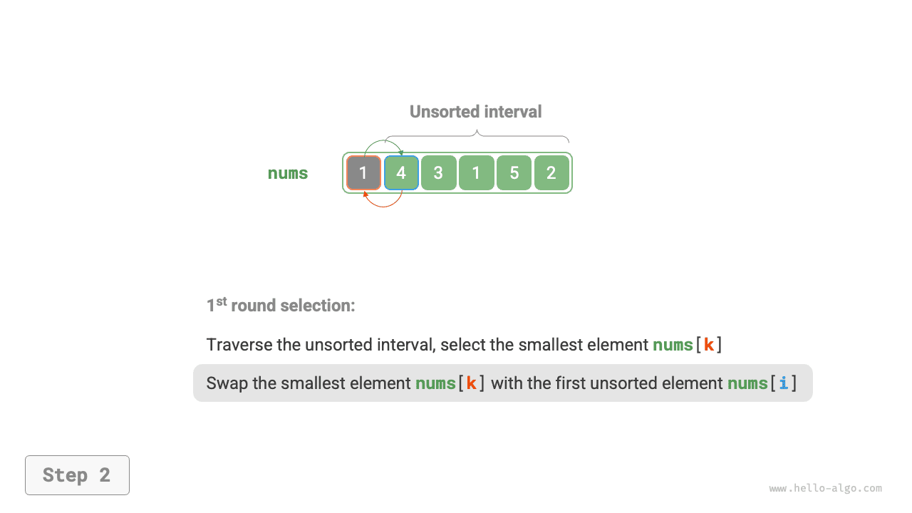
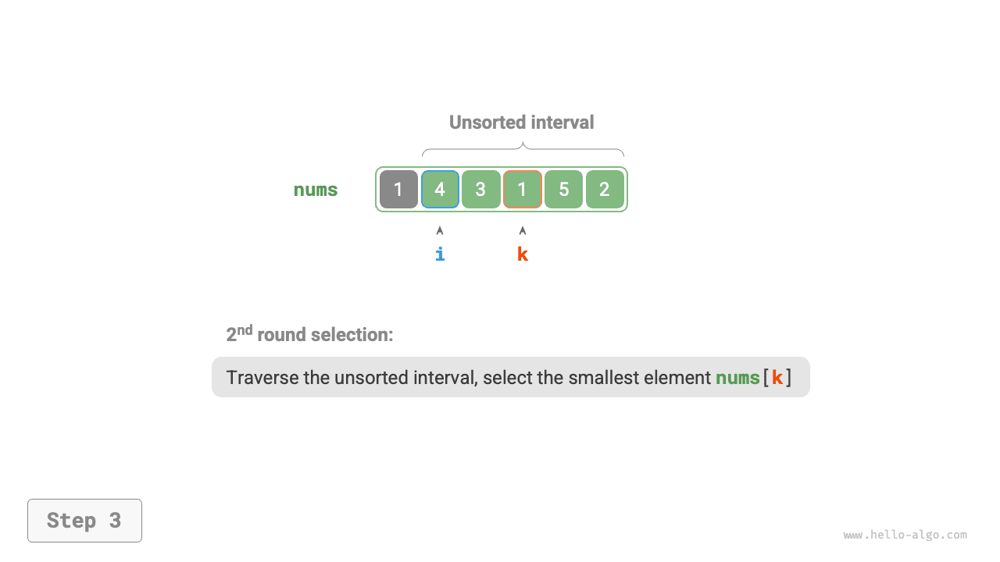
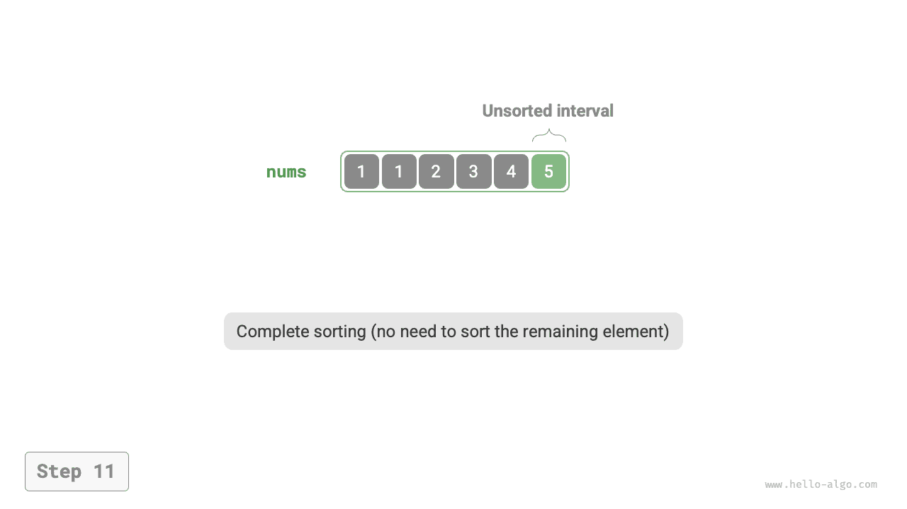
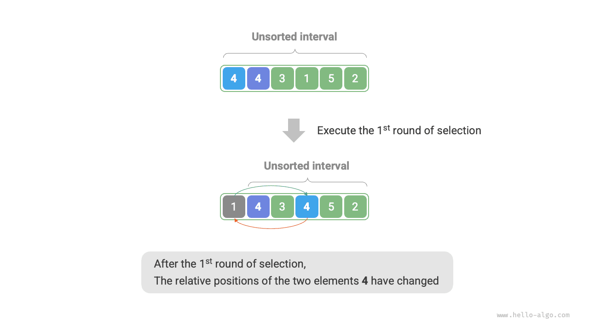

# Sắp xếp lựa chọn

<u>Sắp xếp lựa chọn</u> hoạt động rất đơn giản: trong mỗi vòng, nó chọn phần tử nhỏ nhất từ ​​khoảng chưa sắp xếp và đặt phần tử đó vào cuối khoảng đã sắp xếp.

Giả sử mảng có độ dài $n$. Quy trình sắp xếp lựa chọn được thể hiện trong hình dưới đây.

1. Ban đầu, tất cả các phần tử đều chưa được sắp xếp, tức là khoảng (chỉ mục) chưa được sắp xếp là $[0, n-1]$.
2. Chọn phần tử nhỏ nhất trong khoảng $[0, n-1]$ và hoán đổi nó với phần tử ở chỉ mục $0$. Sau khi hoàn thành, phần tử đầu tiên của mảng được sắp xếp.
3. Chọn phần tử nhỏ nhất trong khoảng $[1, n-1]$ và hoán đổi nó với phần tử ở chỉ mục $1$. Sau khi hoàn thành, 2 phần tử đầu tiên của mảng được sắp xếp.
4. Và vân vân. Sau $n - 1$ vòng lựa chọn và hoán đổi, các phần tử $n - 1$ đầu tiên của mảng được sắp xếp.
5. Phần tử duy nhất còn lại phải là phần tử lớn nhất nên không cần sắp xếp thêm nữa và mảng đã được sắp xếp.

=== "<1>"
    

=== "<2>"
    

=== "<3>"
    

=== "<4>"
    

=== "<5>"
    

=== "<6>"
    

=== "<7>"
    

=== "<8>"
    

=== "<9>"
    

=== "<10>"
    

=== "<11>"
    

Trong mã, chúng tôi sử dụng $k$ để theo dõi phần tử nhỏ nhất trong khoảng chưa được sắp xếp:

```src
[file]{selection_sort}-[class]{}-[func]{selection_sort}
```

## Đặc điểm thuật toán

- **Độ phức tạp về thời gian $O(n^2)$, sắp xếp không thích ứng**: Vòng lặp bên ngoài có tổng cộng $n - 1$ vòng. Độ dài của khoảng chưa sắp xếp ở vòng đầu tiên là $n$ và độ dài của khoảng chưa sắp xếp ở vòng cuối cùng là $2$. Nghĩa là, các vòng của vòng lặp bên ngoài chứa các vòng lặp bên trong với các lần lặp $n$, $n - 1$, $\dots$, $3$ và $2$, tổng cộng là $\frac{(n - 1)(n + 2)}{2}$.
- **Độ phức tạp của không gian $O(1)$, sắp xếp tại chỗ**: Con trỏ $i$ và $j$ sử dụng một lượng không gian bổ sung không đổi.
- **Sắp xếp không ổn định**: Như minh họa trong hình bên dưới, phần tử `nums[i]` có thể bị hoán đổi sang bên phải của phần tử bằng nó, gây ra thay đổi về thứ tự tương đối của chúng.


