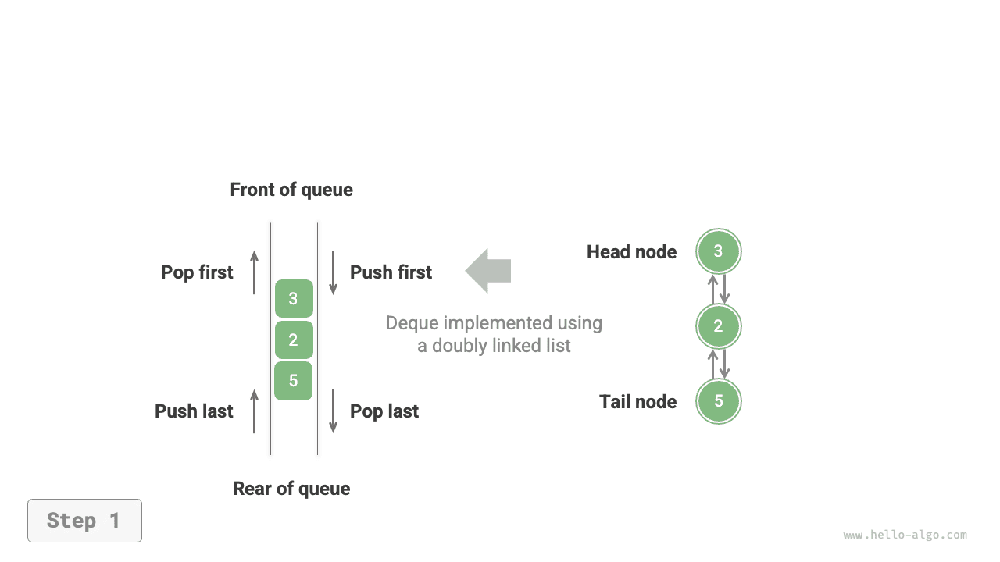
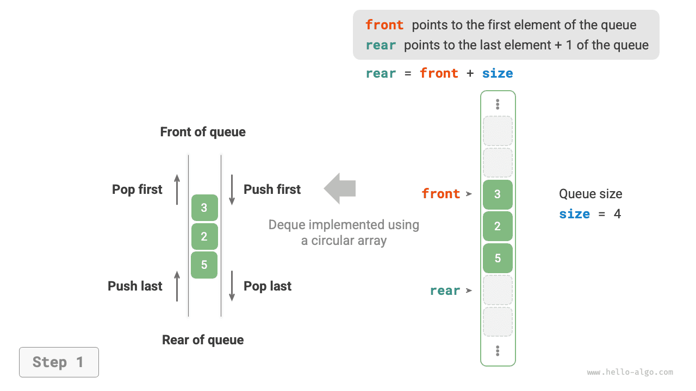
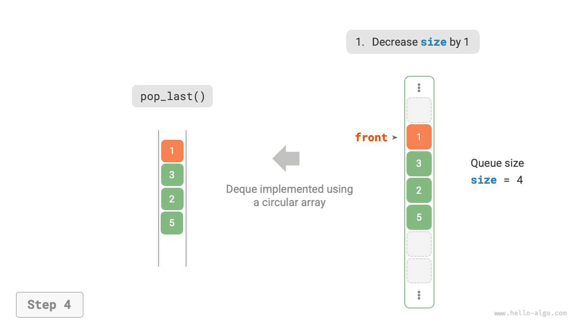

# Deque

Trong hàng đợi, chúng ta chỉ có thể xóa các phần tử ở phía trước hoặc thêm các phần tử ở phía sau. Như được hiển thị trong hình bên dưới, hàng đợi hai đầu <u>(deque)</u> mang lại tính linh hoạt cao hơn, cho phép thêm hoặc xóa các phần tử ở cả phía trước và phía sau.


## Hoạt động Deque phổ biến

Các hoạt động phổ biến trên deque được hiển thị trong bảng bên dưới. Tên phương thức cụ thể phụ thuộc vào ngôn ngữ lập trình được sử dụng.

<p align="center"> Bảng <id> &nbsp; Hiệu quả của hoạt động Deque </p>

| Phương pháp | Mô tả | Độ phức tạp thời gian |
| -------------- | ------------------------- | --------------- |
| `push_first()` | Thêm phần tử vào phía trước | $O(1)$ |
| `push_last()` | Thêm phần tử vào phía sau | $O(1)$ |
| `pop_first()` | Xóa phần tử phía trước | $O(1)$ |
| `pop_last()` | Loại bỏ phần tử phía sau | $O(1)$ |
| `peek_first()` | Truy cập phần tử phía trước | $O(1)$ |
| `peek_last()` | Truy cập phần tử phía sau | $O(1)$ |

Tương tự, chúng ta có thể sử dụng trực tiếp các lớp deque do ngôn ngữ lập trình cung cấp:

=== "Python"

    ```python title="deque.py"
    from collections import deque

    # Initialize deque
    deq: deque[int] = deque()

    # Enqueue elements
    deq.append(2)      # Add to rear
    deq.append(5)
    deq.append(4)
    deq.appendleft(3)  # Add to front
    deq.appendleft(1)

    # Access elements
    front: int = deq[0]  # Front element
    rear: int = deq[-1]  # Rear element

    # Dequeue elements
    pop_front: int = deq.popleft()  # Front element dequeue
    pop_rear: int = deq.pop()       # Rear element dequeue

    # Get deque length
    size: int = len(deq)

    # Check if deque is empty
    is_empty: bool = len(deq) == 0
    ```

=== "C++"

    ```cpp title="deque.cpp"
    /* Initialize deque */
    deque<int> deque;

    /* Enqueue elements */
    deque.push_back(2);   // Add to rear
    deque.push_back(5);
    deque.push_back(4);
    deque.push_front(3);  // Add to front
    deque.push_front(1);

    /* Access elements */
    int front = deque.front(); // Front element
    int back = deque.back();   // Rear element

    /* Dequeue elements */
    deque.pop_front();  // Front element dequeue
    deque.pop_back();   // Rear element dequeue

    /* Get deque length */
    int size = deque.size();

    /* Check if deque is empty */
    bool empty = deque.empty();
    ```

=== "Java"

    ```java title="deque.java"
    /* Initialize deque */
    Deque<Integer> deque = new LinkedList<>();

    /* Enqueue elements */
    deque.offerLast(2);   // Add to rear
    deque.offerLast(5);
    deque.offerLast(4);
    deque.offerFirst(3);  // Add to front
    deque.offerFirst(1);

    /* Access elements */
    int peekFirst = deque.peekFirst();  // Front element
    int peekLast = deque.peekLast();    // Rear element

    /* Dequeue elements */
    int popFirst = deque.pollFirst();  // Front element dequeue
    int popLast = deque.pollLast();    // Rear element dequeue

    /* Get deque length */
    int size = deque.size();

    /* Check if deque is empty */
    boolean isEmpty = deque.isEmpty();
    ```

=== "C#"

    ```csharp title="deque.cs"
    /* Initialize deque */
    // In C#, use LinkedList as a deque
    LinkedList<int> deque = new();

    /* Enqueue elements */
    deque.AddLast(2);   // Add to rear
    deque.AddLast(5);
    deque.AddLast(4);
    deque.AddFirst(3);  // Add to front
    deque.AddFirst(1);

    /* Access elements */
    int peekFirst = deque.First.Value;  // Front element
    int peekLast = deque.Last.Value;    // Rear element

    /* Dequeue elements */
    deque.RemoveFirst();  // Front element dequeue
    deque.RemoveLast();   // Rear element dequeue

    /* Get deque length */
    int size = deque.Count;

    /* Check if deque is empty */
    bool isEmpty = deque.Count == 0;
    ```

=== "Go"

    ```go title="deque_test.go"
    /* Initialize deque */
    // In Go, use list as a deque
    deque := list.New()

    /* Enqueue elements */
    deque.PushBack(2)      // Add to rear
    deque.PushBack(5)
    deque.PushBack(4)
    deque.PushFront(3)     // Add to front
    deque.PushFront(1)

    /* Access elements */
    front := deque.Front() // Front element
    rear := deque.Back()   // Rear element

    /* Dequeue elements */
    deque.Remove(front)    // Front element dequeue
    deque.Remove(rear)     // Rear element dequeue

    /* Get deque length */
    size := deque.Len()

    /* Check if deque is empty */
    isEmpty := deque.Len() == 0
    ```

=== "Swift"

    ```swift title="deque.swift"
    /* Initialize deque */
    // Swift does not have a built-in deque class, can use Array as a deque
    var deque: [Int] = []

    /* Enqueue elements */
    deque.append(2) // Add to rear
    deque.append(5)
    deque.append(4)
    deque.insert(3, at: 0) // Add to front
    deque.insert(1, at: 0)

    /* Access elements */
    let peekFirst = deque.first! // Front element
    let peekLast = deque.last! // Rear element

    /* Dequeue elements */
    // When using Array simulation, popFirst has O(n) complexity
    let popFirst = deque.removeFirst() // Front element dequeue
    let popLast = deque.removeLast() // Rear element dequeue

    /* Get deque length */
    let size = deque.count

    /* Check if deque is empty */
    let isEmpty = deque.isEmpty
    ```

=== "JS"

    ```javascript title="deque.js"
    /* Initialize deque */
    // JavaScript does not have a built-in deque, can only use Array as a deque
    const deque = [];

    /* Enqueue elements */
    deque.push(2);
    deque.push(5);
    deque.push(4);
    // Please note that since it's an array, unshift() has O(n) time complexity
    deque.unshift(3);
    deque.unshift(1);

    /* Access elements */
    const peekFirst = deque[0];
    const peekLast = deque[deque.length - 1];

    /* Dequeue elements */
    // Please note that since it's an array, shift() has O(n) time complexity
    const popFront = deque.shift();
    const popBack = deque.pop();

    /* Get deque length */
    const size = deque.length;

    /* Check if deque is empty */
    const isEmpty = size === 0;
    ```

=== "TS"

    ```typescript title="deque.ts"
    /* Initialize deque */
    // TypeScript does not have a built-in deque, can only use Array as a deque
    const deque: number[] = [];

    /* Enqueue elements */
    deque.push(2);
    deque.push(5);
    deque.push(4);
    // Please note that since it's an array, unshift() has O(n) time complexity
    deque.unshift(3);
    deque.unshift(1);

    /* Access elements */
    const peekFirst: number = deque[0];
    const peekLast: number = deque[deque.length - 1];

    /* Dequeue elements */
    // Please note that since it's an array, shift() has O(n) time complexity
    const popFront: number = deque.shift() as number;
    const popBack: number = deque.pop() as number;

    /* Get deque length */
    const size: number = deque.length;

    /* Check if deque is empty */
    const isEmpty: boolean = size === 0;
    ```

=== "Dart"

    ```dart title="deque.dart"
    /* Initialize deque */
    // In Dart, Queue is defined as a deque
    Queue<int> deque = Queue<int>();

    /* Enqueue elements */
    deque.addLast(2);  // Add to rear
    deque.addLast(5);
    deque.addLast(4);
    deque.addFirst(3); // Add to front
    deque.addFirst(1);

    /* Access elements */
    int peekFirst = deque.first; // Front element
    int peekLast = deque.last;   // Rear element

    /* Dequeue elements */
    int popFirst = deque.removeFirst(); // Front element dequeue
    int popLast = deque.removeLast();   // Rear element dequeue

    /* Get deque length */
    int size = deque.length;

    /* Check if deque is empty */
    bool isEmpty = deque.isEmpty;
    ```

=== "Rust"

    ```rust title="deque.rs"
    /* Initialize deque */
    let mut deque: VecDeque<u32> = VecDeque::new();

    /* Enqueue elements */
    deque.push_back(2);  // Add to rear
    deque.push_back(5);
    deque.push_back(4);
    deque.push_front(3); // Add to front
    deque.push_front(1);

    /* Access elements */
    if let Some(front) = deque.front() { // Front element
    }
    if let Some(rear) = deque.back() {   // Rear element
    }

    /* Dequeue elements */
    if let Some(pop_front) = deque.pop_front() { // Front element dequeue
    }
    if let Some(pop_rear) = deque.pop_back() {   // Rear element dequeue
    }

    /* Get deque length */
    let size = deque.len();

    /* Check if deque is empty */
    let is_empty = deque.is_empty();
    ```

=== "C"

    ```c title="deque.c"
    // C does not provide a built-in deque
    ```

=== "Kotlin"

    ```kotlin title="deque.kt"
    /* Initialize deque */
    val deque = LinkedList<Int>()

    /* Enqueue elements */
    deque.offerLast(2)  // Add to rear
    deque.offerLast(5)
    deque.offerLast(4)
    deque.offerFirst(3) // Add to front
    deque.offerFirst(1)

    /* Access elements */
    val peekFirst = deque.peekFirst() // Front element
    val peekLast = deque.peekLast()   // Rear element

    /* Dequeue elements */
    val popFirst = deque.pollFirst() // Front element dequeue
    val popLast = deque.pollLast()   // Rear element dequeue

    /* Get deque length */
    val size = deque.size

    /* Check if deque is empty */
    val isEmpty = deque.isEmpty()
    ```

=== "Ruby"

    ```ruby title="deque.rb"
    # Initialize deque
    # Ruby does not have a built-in deque, can only use Array as a deque
    deque = []

    # Enqueue elements
    deque << 2
    deque << 5
    deque << 4
    # Please note that since it's an array, Array#unshift has O(n) time complexity
    deque.unshift(3)
    deque.unshift(1)

    # Access elements
    peek_first = deque.first
    peek_last = deque.last

    # Dequeue elements
    # Please note that since it's an array, Array#shift has O(n) time complexity
    pop_front = deque.shift
    pop_back = deque.pop

    # Get deque length
    size = deque.length

    # Check if deque is empty
    is_empty = size.zero?
    ```

??? pythontutor "Trực quan hóa mã"

    https://pythontutor.com/render.html#code=from%20collections%20import%20deque%0A%0A%22%22%22Driver%20Code%22%22%22%0Aif%20__name__%20%3D%3D%20%22__main__%22%3A %0A%20%20%20%20%23%20%E5%88%9D%E5%A7%8B%E5%8C%96%E5%8F%8C%E5%90%91%E9%98%9F%E5% 88%97%0A%20%20%20%20deq%20%3D%20deque%28%29%0A%0A%20%20%20%20%23%20%E5%85%83%E7 %B4%A0%E5%85%A5%E9%98%9F%0A%20%20%20%20deq.append%282%29%20%20%23%20%E6%B7%BB%E 5%8A%A0%E8%87%B3%E9%98%9F%E5%B0%BE%0A%20%20%20%20deq.append%285%29%0A%20%20%20% 20deq.append%284%29%0A%20%20%20%20deq.appendleft%283%29%20%20%23%20%E6%B7%BB%E5 %8A%A0%E8%87%B3%E9%98%9F%E9%A6%96%0A%20%20%20%20deq.appendleft%281%29%0A%20%20% 20%20print%28%22%E5%8F%8C%E5%90%91%E9%98%9F%E5%88%97%20deque%20%3D%22,%20deq%29 %0A%0A%20%20%20%20%23%20%E8%AE%BF%E9%97%AE%E5%85%83%E7%B4%A0%0A%20%20%20%20fron t%20%3D%20deq%5B0%5D%20%20%23%20%E9%98%9F%E9%A6%96%E5%85%83%E7%B4%A0%0A%20%20%2 0%20print%28%22%E9%98%9F%E9%A6%96%E5%85%83%E7%B4%A0%20front%20%3D%22,%20front%2 9%0A%20%20%20%20phía sau%20%3D%20deq%5B-1%5D%20%20%23%20%E9%98%9F%E5%B0%BE%E5%85%83 %E7%B4%A0%0A%20%20%20%20print%28%22%E9%98%9F%E5%B0%BE%E5%85%83%E7%B4%A0%20phía sau% 20%3D%22,%20phía sau%29%0A%0A%20%20%20%20%23%20%E5%85%83%E7%B4%A0%E5%87%BA%E9%98%9F %0A%20%20%20%20pop_front%20%3D%20deq.popleft%28%29%20%20%23%20%E9%98%9F%E9%A6%96 %E5%85%83%E7%B4%A0%E5%87%BA%E9%98%9F%0A%20%20%20%20print%28%22%E9%98%9F%E9%A6%9 6%E5%87%BA%E9%98%9F%E5%85%83%E7%B4%A0%20%20pop_front%20%3D%22,%20pop_front%29%0 A%20%20%20%20print%28%22%E9%98%9F%E9%A6%96%E5%87%BA%E9%98%9F%E5%90%8E%20deque%2 0%3D%22,%20deq%29%0A%20%20%20%20pop_rear%20%3D%20deq.pop%28%29%20%20%23%20%E9%9 8%9F%E5%B0%BE%E5%85%83%E7%B4%A0%E5%87%BA%E9%98%9F%0A%20%20%20%20print%28%22%E9% 98%9F%E5%B0%BE%E5%87%BA%E9%98%9F%E5%85%83%E7%B4%A0%20%20pop_rear%20%3D%22,%20po p_rear%29%0A%20%20%20%20print%28%22%E9%98%9F%E5%B0%BE%E5%87%BA%E9%98%9F%E5%90%8 E%20deque%20%3D%22,%20deq%29%0A%0A%20%20%20%20%23%20%E8%8E%B7%E5%8F%96%E5%8F%8C% E5%90%91%E9%98%9F%E5%88%97%E7%9A%84%E9%95%BF%E5%BA%A6%0A%20%20%20%20size%20%3D% 20len%28deq%29%0A%20%20%20%20print%28%22%E5%8F%8C%E5%90%91%E9%98%9F%E5%88%97%E9 %95%BF%E5%BA%A6%20size%20%3D%22,%20size%29%0A%0A%20%20%20%20%23%20%E5%88%A4%E6% 96%AD%E5%8F%8C%E5%90%91%E9%98%9F%E5%88%97%E6%98%AF%E5%90%A6%E4%B8%BA%E7%A9%BA%0 A%20%20%20%20is_empty%20%3D%20len%28deq%29%20%3D%3D%200%0A%20%20%20%20print%28% 22%E5%8F%8C%E5%90%91%E9%98%9F%E5%88%97%E6%98%AF%E5%90%A6%E4%B8%BA%E7%A9%BA%20%3 D%22,%20is_empty%29&cumulative=false&curInstr=3&heapPrimitives=nvernest&mode=display&origin=opt-frontend.js&py=311&rawInputLstJSON=%5B%5D&textReferences=false

## Thực hiện Deque *

Việc triển khai deque tương tự như hàng đợi. Bạn có thể chọn danh sách liên kết hoặc mảng làm cấu trúc dữ liệu cơ bản.

### Triển khai danh sách liên kết đôi

Ôn lại phần trước, chúng ta đã sử dụng danh sách liên kết đơn thông thường để triển khai hàng đợi vì nó cho phép xóa nút đầu (tương ứng với dequeue) và thêm các nút mới sau nút đuôi (tương ứng với enqueue) một cách thuận tiện.

Đối với deque, cả phía trước và phía sau đều có thể thực hiện các thao tác enqueue và dequeue. Nói cách khác, một deque cũng cần thực hiện các hoạt động theo hướng ngược lại. Vì lý do này, chúng tôi sử dụng "danh sách liên kết đôi" làm cấu trúc dữ liệu cơ bản cho deque.

Như được hiển thị trong hình bên dưới, chúng tôi coi các nút đầu và đuôi của danh sách liên kết đôi là mặt trước và mặt sau của deque, triển khai chức năng thêm và xóa các nút ở cả hai đầu.

=== "<1>"
    

=== "<2>"
    

=== "<3>"
    

=== "<4>"
    

=== "<5>"
    

Mã thực hiện được hiển thị dưới đây:

```src
[file]{linkedlist_deque}-[class]{linked_list_deque}-[func]{}
```

### Triển khai mảng

Như minh họa trong hình bên dưới, tương tự như việc triển khai hàng đợi dựa trên một mảng, chúng ta cũng có thể sử dụng mảng hình tròn để triển khai một deque.

=== "<1>"
    

=== "<2>"
    

=== "<3>"
    

=== "<4>"
    

=== "<5>"
    

Dựa trên việc triển khai hàng đợi, chúng ta chỉ cần thêm các phương thức cho "enqueue at front" và "dequeue from Rear":

```src
[file]{array_deque}-[class]{array_deque}-[func]{}
```

## Ứng dụng Deque

Deque kết hợp logic của cả ngăn xếp và hàng đợi. **Do đó, nó có thể triển khai tất cả các kịch bản ứng dụng của cả hai, đồng thời mang lại sự linh hoạt cao hơn**.

Chúng tôi biết rằng chức năng "hoàn tác" trong phần mềm thường được triển khai bằng cách sử dụng ngăn xếp: hệ thống sẽ đẩy từng thao tác thay đổi vào ngăn xếp và sau đó thực hiện hoàn tác thông qua cửa sổ bật lên. Tuy nhiên, do hạn chế về tài nguyên hệ thống, phần mềm thường giới hạn số bước hoàn tác (ví dụ: chỉ cho phép lưu 50 bước). Khi chiều dài ngăn xếp vượt quá 50, phần mềm cần thực hiện thao tác xóa ở cuối ngăn xếp (phía trước hàng đợi). **Nhưng ngăn xếp không thể triển khai chức năng này, vì vậy cần có deque để thay thế ngăn xếp**. Lưu ý rằng logic cốt lõi của "hoàn tác" vẫn tuân theo nguyên tắc LIFO của ngăn xếp; chỉ là deque có thể triển khai linh hoạt hơn một số logic bổ sung.
