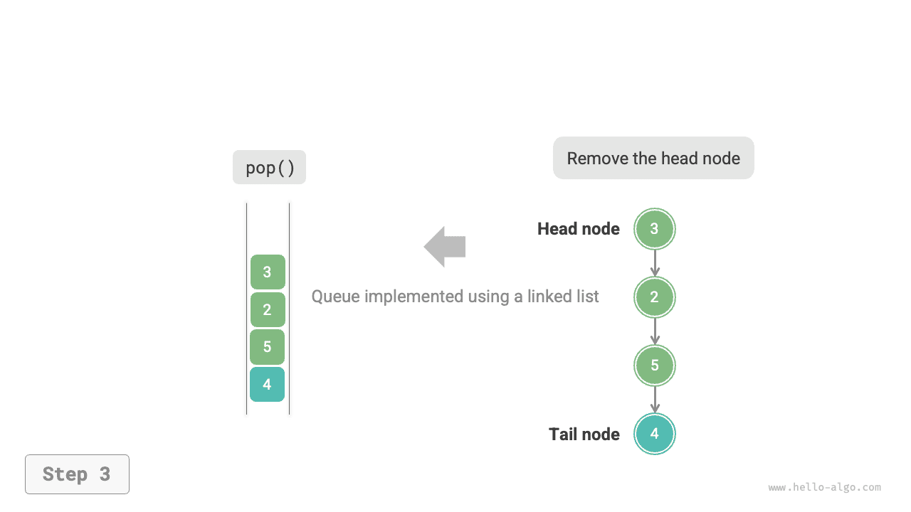
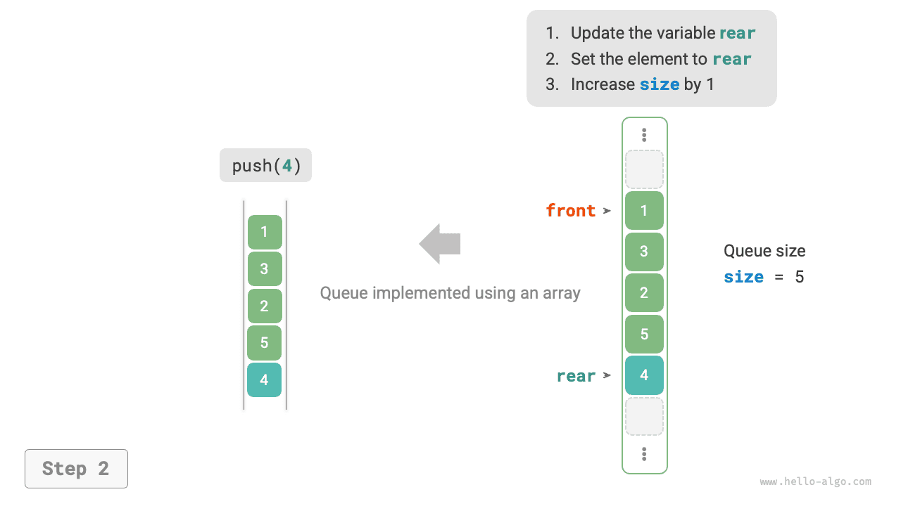

# Hàng đợi

<u>queue</u> là cấu trúc dữ liệu tuyến tính tuân theo quy tắc Vào trước, ra trước (FIFO). Đúng như tên gọi, nó mô hình mọi người xếp hàng: những người mới liên tục xếp hàng ở phía sau, trong khi những người ở phía trước lần lượt rời đi.

Như minh họa trong hình bên dưới, chúng ta gọi phần đầu của hàng đợi là "phía trước" và phần cuối của hàng đợi là "phía sau". Thao tác thêm một phần tử vào phía sau được gọi là "enqueue" và thao tác loại bỏ phần tử phía trước được gọi là "dequeue".


## Hoạt động xếp hàng chung

Các hoạt động phổ biến trên hàng đợi được hiển thị trong bảng bên dưới. Lưu ý rằng tên phương thức có thể khác nhau tùy theo ngôn ngữ lập trình. Ở đây, chúng tôi sử dụng quy ước đặt tên tương tự như đối với ngăn xếp.

<p align="center"> Bảng <id> &nbsp; Hiệu quả của hoạt động xếp hàng </p>

| Phương pháp | Mô tả | Độ phức tạp thời gian |
| -------- | ------------------------------------------ | --------------- |
| `push()` | Phần tử Enqueue, thêm phần tử vào phía sau | $O(1)$ |
| `pop()` | Phần tử phía trước Dequeue | $O(1)$ |
| `peek()` | Truy cập phần tử phía trước | $O(1)$ |

Chúng ta có thể trực tiếp sử dụng các lớp hàng đợi do ngôn ngữ lập trình cung cấp:

=== "Python"

    ```python title="queue.py"
    from collections import deque

    # Initialize queue
    # In Python, we generally use the deque class as a queue
    # Although queue.Queue() is a pure queue class, it is not very user-friendly, so it is not recommended
    que: deque[int] = deque()

    # Enqueue elements
    que.append(1)
    que.append(3)
    que.append(2)
    que.append(5)
    que.append(4)

    # Access front element
    front: int = que[0]

    # Dequeue element
    pop: int = que.popleft()

    # Get queue length
    size: int = len(que)

    # Check if queue is empty
    is_empty: bool = len(que) == 0
    ```

=== "C++"

    ```cpp title="queue.cpp"
    /* Initialize queue */
    queue<int> queue;

    /* Enqueue elements */
    queue.push(1);
    queue.push(3);
    queue.push(2);
    queue.push(5);
    queue.push(4);

    /* Access front element */
    int front = queue.front();

    /* Dequeue element */
    queue.pop();

    /* Get queue length */
    int size = queue.size();

    /* Check if queue is empty */
    bool empty = queue.empty();
    ```

=== "Java"

    ```java title="queue.java"
    /* Initialize queue */
    Queue<Integer> queue = new LinkedList<>();

    /* Enqueue elements */
    queue.offer(1);
    queue.offer(3);
    queue.offer(2);
    queue.offer(5);
    queue.offer(4);

    /* Access front element */
    int peek = queue.peek();

    /* Dequeue element */
    int pop = queue.poll();

    /* Get queue length */
    int size = queue.size();

    /* Check if queue is empty */
    boolean isEmpty = queue.isEmpty();
    ```

=== "C#"

    ```csharp title="queue.cs"
    /* Initialize queue */
    Queue<int> queue = new();

    /* Enqueue elements */
    queue.Enqueue(1);
    queue.Enqueue(3);
    queue.Enqueue(2);
    queue.Enqueue(5);
    queue.Enqueue(4);

    /* Access front element */
    int peek = queue.Peek();

    /* Dequeue element */
    int pop = queue.Dequeue();

    /* Get queue length */
    int size = queue.Count;

    /* Check if queue is empty */
    bool isEmpty = queue.Count == 0;
    ```

=== "Go"

    ```go title="queue_test.go"
    /* Initialize queue */
    // In Go, use list as a queue
    queue := list.New()

    /* Enqueue elements */
    queue.PushBack(1)
    queue.PushBack(3)
    queue.PushBack(2)
    queue.PushBack(5)
    queue.PushBack(4)

    /* Access front element */
    peek := queue.Front()

    /* Dequeue element */
    pop := queue.Front()
    queue.Remove(pop)

    /* Get queue length */
    size := queue.Len()

    /* Check if queue is empty */
    isEmpty := queue.Len() == 0
    ```

=== "Swift"

    ```swift title="queue.swift"
    /* Initialize queue */
    // Swift does not have a built-in queue class, can use Array as a queue
    var queue: [Int] = []

    /* Enqueue elements */
    queue.append(1)
    queue.append(3)
    queue.append(2)
    queue.append(5)
    queue.append(4)

    /* Access front element */
    let peek = queue.first!

    /* Dequeue element */
    // Since it's an array, removeFirst has O(n) complexity
    let pool = queue.removeFirst()

    /* Get queue length */
    let size = queue.count

    /* Check if queue is empty */
    let isEmpty = queue.isEmpty
    ```

=== "JS"

    ```javascript title="queue.js"
    /* Initialize queue */
    // JavaScript does not have a built-in queue, can use Array as a queue
    const queue = [];

    /* Enqueue elements */
    queue.push(1);
    queue.push(3);
    queue.push(2);
    queue.push(5);
    queue.push(4);

    /* Access front element */
    const peek = queue[0];

    /* Dequeue element */
    // The underlying structure is an array, so shift() has O(n) time complexity
    const pop = queue.shift();

    /* Get queue length */
    const size = queue.length;

    /* Check if queue is empty */
    const empty = queue.length === 0;
    ```

=== "TS"

    ```typescript title="queue.ts"
    /* Initialize queue */
    // TypeScript does not have a built-in queue, can use Array as a queue
    const queue: number[] = [];

    /* Enqueue elements */
    queue.push(1);
    queue.push(3);
    queue.push(2);
    queue.push(5);
    queue.push(4);

    /* Access front element */
    const peek = queue[0];

    /* Dequeue element */
    // The underlying structure is an array, so shift() has O(n) time complexity
    const pop = queue.shift();

    /* Get queue length */
    const size = queue.length;

    /* Check if queue is empty */
    const empty = queue.length === 0;
    ```

=== "Dart"

    ```dart title="queue.dart"
    /* Initialize queue */
    // In Dart, the Queue class is a deque and can also be used as a queue
    Queue<int> queue = Queue();

    /* Enqueue elements */
    queue.add(1);
    queue.add(3);
    queue.add(2);
    queue.add(5);
    queue.add(4);

    /* Access front element */
    int peek = queue.first;

    /* Dequeue element */
    int pop = queue.removeFirst();

    /* Get queue length */
    int size = queue.length;

    /* Check if queue is empty */
    bool isEmpty = queue.isEmpty;
    ```

=== "Rust"

    ```rust title="queue.rs"
    /* Initialize deque */
    // In Rust, use deque as a regular queue
    let mut deque: VecDeque<u32> = VecDeque::new();

    /* Enqueue elements */
    deque.push_back(1);
    deque.push_back(3);
    deque.push_back(2);
    deque.push_back(5);
    deque.push_back(4);

    /* Access front element */
    if let Some(front) = deque.front() {
    }

    /* Dequeue element */
    if let Some(pop) = deque.pop_front() {
    }

    /* Get queue length */
    let size = deque.len();

    /* Check if queue is empty */
    let is_empty = deque.is_empty();
    ```

=== "C"

    ```c title="queue.c"
    // C does not provide a built-in queue
    ```

=== "Kotlin"

    ```kotlin title="queue.kt"
    /* Initialize queue */
    val queue = LinkedList<Int>()

    /* Enqueue elements */
    queue.offer(1)
    queue.offer(3)
    queue.offer(2)
    queue.offer(5)
    queue.offer(4)

    /* Access front element */
    val peek = queue.peek()

    /* Dequeue element */
    val pop = queue.poll()

    /* Get queue length */
    val size = queue.size

    /* Check if queue is empty */
    val isEmpty = queue.isEmpty()
    ```

=== "Ruby"

    ```ruby title="queue.rb"
    # Initialize queue
    # Ruby's built-in queue (Thread::Queue) does not have peek and traversal methods, can use Array as a queue
    queue = []

    # Enqueue elements
    queue.push(1)
    queue.push(3)
    queue.push(2)
    queue.push(5)
    queue.push(4)

    # Access front element
    peek = queue.first

    # Dequeue element
    # Please note that since it's an array, Array#shift has O(n) time complexity
    pop = queue.shift

    # Get queue length
    size = queue.length

    # Check if queue is empty
    is_empty = queue.empty?
    ```

??? pythontutor "Trực quan hóa mã"

    https://pythontutor.com/render.html#code=from%20collections%20import%20deque%0A%0A%22%22%22Driver%20Code%22%22%22%0Aif%20__name __%20%3D%3D%20%22__main__%22%3A%0A%20%20%20%20%23%20%E5%88%9D%E 5%A7%8B%E5%8C%96%E9%98%9F%E5%88%97%0A%20%20%20%20%23%20%E5%9C%A8 %20Python%20%E4%B8%AD%EF%BC%8C%E6%88%91%E4%BB%AC%E4%B8%80%E8%88 %AC%E5%B0%86%E5%8F%8C%E5%90%91%E9%98%9F%E5%88%97%E7%B1%BB%20dequ e%20%E7%9C%8B%E4%BD%9C%E9%98%9F%E5%88%97%E4%BD%BF%E7%94%A8%0A%2 0%20%20%20%23%20%E8%99%BD%E7%84%B6%20queue.Queue%28%29%20%E6%98% AF%E7%BA%AF%E6%AD%A3%E7%9A%84%E9%98%9F%E5%88%97%E7%B1%BB%EF%BC%8C%E4%BD%86%E4%B8%8D%E5%A4%AA%E5%A5%BD%E7%94%A8%0A%20%20%20%20qu e%20%3D%20deque%28%29%0A%0A%20%20%20%20%23%20%E5%85%83%E7%B4%A0 %E5%85%A5%E9%98%9F%0A%20%20%20%20que.append%281%29%0A%20%20%20%2 0que.append%283%29%0A%20%20%20%20que.append%282%29%0A%20%20%20%20que.append%285%29%0A%20%20%20%20que.append%284%29%0A%20%20%20% 20print%28%22%E9%98%9F%E5%88%97%20que%20%3D%22,%20que%29%0A%0A%2 0%20%20%20%23%20%E8%AE%BF%E9%97%AE%E9%98%9F%E9%A6%96%E5%85%83%E7 %B4%A0%0A%20%20%20%20front%20%3D%20que%5B0%5D%0A%20%20%20%20print%28%22%E9%98%9F%E9%A6%96%E5%85%83%E7%B4%A0%20front%20%3D%22,%2 0front%29%0A%0A%20%20%20%20%23%20%E5%85%83%E7%B4%A0%E5%87%BA%E9%98%9F%0A%20%20%20%20pop%20%3D%20que.popleft%28%29%0A%20%20%20%2 0print%28%22%E5%87%BA%E9%98%9F%E5%85%83%E7%B4%A0%20pop%20%3D%22,%20pop%29%0A%20%20%20%20print%28%22%E5%87%BA%E9%98%9F%E5%90%8E% 20que%20%3D%22,%20que%29%0A%0A%20%20%20%20%23%20%E8%8E%B7%E5%8F% 96%E9%98%9F%E5%88%97%E7%9A%84%E9%95%BF%E5%BA%A6%0A%20%20%20%20si ze%20%3D%20len%28que%29%0A%20%20%20%20print%28%22%E9%98%9F%E5%88%97%E9%95%BF%E5%BA%A6%20size%20%3D%22,%20size%29%0A%0A%20%20%20 %20%23%20%E5%88%A4%E6%96%AD%E9%98%9F%E5%88%97%E6%98%AF%E5%90%A6%E4%B8%BA%E7%A9%BA%0A%20%20%20%20is_empty%20%3D%20len%28que%29%2 0%3D%3D%200%0A%20%20%20%20print%28%22%E9%98%9F%E5%88%97%E6%98%AF%E5%90%A6%E4%B8%BA%E7%A9%BA%20%3D%22,%20is_empty%29&cumulative= false&curInstr=3&heapPrimitives=neverest&mode=display&origin=opt-frontend.js&py=311&rawInputLstJSON=%5B%5D&textReferences=false

## Thực hiện hàng đợi

Để triển khai hàng đợi, chúng ta cần một cấu trúc dữ liệu cho phép thêm các phần tử ở một đầu và loại bỏ các phần tử ở đầu kia. Cả danh sách liên kết và mảng đều đáp ứng yêu cầu này.

### Triển khai danh sách liên kết

Như được hiển thị trong hình bên dưới, chúng ta có thể coi "nút đầu" và "nút đuôi" của danh sách được liên kết lần lượt là "phía trước" và "phía sau" của hàng đợi, với quy tắc là các nút chỉ có thể được thêm vào ở phía sau và bị xóa khỏi phía trước.

=== "<1>"
    

=== "<2>"
    

=== "<3>"
    

Dưới đây là mã để triển khai hàng đợi bằng danh sách được liên kết:

```src
[file]{linkedlist_queue}-[class]{linked_list_queue}-[func]{}
```

### Triển khai mảng

Việc xóa phần tử đầu tiên trong một mảng có độ phức tạp về thời gian là $O(n)$, điều này sẽ làm cho thao tác dequeue không hiệu quả. Tuy nhiên, chúng ta có thể sử dụng phương pháp thông minh sau để tránh vấn đề này.

Chúng ta có thể sử dụng biến `front` để trỏ đến chỉ mục của phần tử phía trước và duy trì biến `size` để ghi lại độ dài hàng đợi. Chúng tôi xác định `rear = front + size`, tính toán vị trí ngay sau phần tử phía sau.

Dựa trên thiết kế này, **khoảng hợp lệ chứa các phần tử trong mảng là `[front, rear - 1]`**. Các phương pháp thực hiện cho các hoạt động khác nhau được thể hiện trong hình dưới đây:

- Thao tác liệt kê: Gán phần tử đầu vào cho chỉ mục `rear` và tăng `size` lên 1.
- Thao tác xếp hàng: Chỉ cần tăng `front` lên 1 và giảm `size` xuống 1.

Như bạn có thể thấy, cả hai thao tác enqueue và dequeue chỉ yêu cầu một thao tác, với độ phức tạp về thời gian là $O(1)$.

=== "<1>"
    

=== "<2>"
    

=== "<3>"
    

Bạn có thể nhận thấy sự cố: vì chúng tôi liên tục xếp hàng và xếp hàng, cả `front` và `rear` đều di chuyển sang bên phải. **Khi đến cuối mảng, chúng không thể tiếp tục di chuyển**. Để giải quyết vấn đề này, chúng ta có thể coi mảng như một "mảng tròn" với đầu và đuôi được kết nối.

Đối với mảng hình tròn, chúng ta cần để `front` hoặc `rear` bao quanh phần đầu của mảng khi chúng vượt qua phần cuối. Mẫu định kỳ này có thể được triển khai bằng cách sử dụng "thao tác modulo", như trong mã bên dưới:

```src
[file]{array_queue}-[class]{array_queue}-[func]{}
```

Hàng đợi được triển khai ở trên vẫn có những hạn chế: độ dài của nó là không thay đổi. Tuy nhiên, vấn đề này không khó giải quyết. Chúng ta có thể thay thế mảng bằng mảng động để đưa ra cơ chế mở rộng. Bạn đọc quan tâm có thể thử tự mình thực hiện việc này.

Các kết luận so sánh cho hai cách triển khai này nhất quán với các kết luận dành cho ngăn xếp và sẽ không được lặp lại ở đây.

## Ứng dụng điển hình của hàng đợi

- **Đơn hàng trên taobao**. Sau khi người mua hàng đặt hàng, đơn hàng sẽ được thêm vào hàng đợi và hệ thống sau đó sẽ xử lý các đơn hàng trong hàng đợi theo trình tự của chúng. Trong Double Eleven, các đơn đặt hàng lớn được tạo ra trong thời gian ngắn và tính đồng thời cao trở thành thách thức chính mà các kỹ sư cần phải giải quyết.
- **Các nhiệm vụ cần làm khác nhau**. Bất kỳ kịch bản nào cần triển khai chức năng "đến trước được phục vụ trước", chẳng hạn như hàng đợi tác vụ của máy in hoặc hàng đợi đặt hàng của nhà hàng, đều có thể duy trì thứ tự xử lý bằng cách sử dụng hàng đợi một cách hiệu quả.
