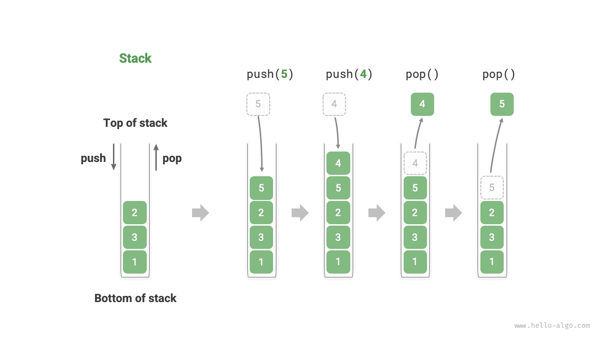
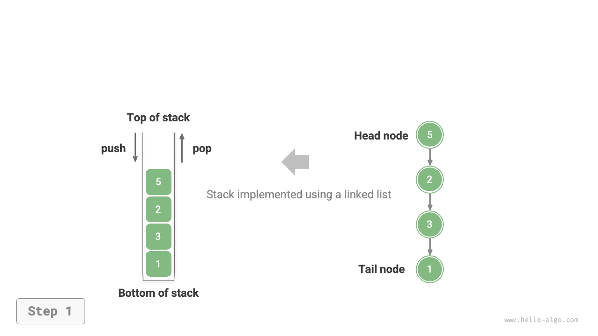

# ngăn xếp

<u>stack</u> là cấu trúc dữ liệu tuyến tính tuân theo nguyên tắc Vào trước, ra trước (LIFO).

Chúng ta có thể so sánh một chồng đĩa với một chồng đĩa trên bàn. Nếu chúng ta chỉ định mỗi lần chỉ được di chuyển một tấm thì để có được tấm dưới cùng, trước tiên chúng ta phải loại bỏ từng tấm phía trên nó. Nếu chúng ta thay thế các mảng bằng nhiều loại phần tử khác nhau (chẳng hạn như số nguyên, ký tự, đối tượng, v.v.), chúng ta sẽ có được cấu trúc dữ liệu ngăn xếp.

Như thể hiện trong hình bên dưới, chúng tôi gọi phần trên cùng của các phần tử được xếp chồng lên nhau là "trên cùng" và phần dưới cùng là "dưới cùng". Thao tác thêm phần tử lên trên cùng được gọi là "push" và thao tác xóa phần tử trên cùng được gọi là "pop".



## Hoạt động ngăn xếp phổ biến

Các thao tác phổ biến trên ngăn xếp được thể hiện trong bảng dưới đây. Tên phương thức cụ thể phụ thuộc vào ngôn ngữ lập trình được sử dụng. Ở đây, chúng tôi sử dụng quy ước đặt tên chung là `push()`, `pop()` và `peek()`.

<p align="center"> Bảng <id> &nbsp; Hiệu quả của hoạt động ngăn xếp </p>

| Phương pháp | Mô tả | Độ phức tạp thời gian |
| -------- | ---------------------------------------------- | --------------- |
| `push()` | Đẩy phần tử lên ngăn xếp (thêm lên trên cùng) | $O(1)$ |
| `pop()` | Phần tử bật lên từ ngăn xếp | $O(1)$ |
| `peek()` | Truy cập phần tử trên cùng | $O(1)$ |

Thông thường, chúng ta có thể trực tiếp sử dụng lớp ngăn xếp tích hợp do ngôn ngữ lập trình cung cấp. Tuy nhiên, một số ngôn ngữ có thể không cung cấp lớp ngăn xếp chuyên dụng. Trong những trường hợp như vậy, chúng ta có thể sử dụng "mảng" hoặc "danh sách liên kết" của ngôn ngữ làm ngăn xếp và chỉ cần tránh sử dụng các thao tác không liên quan đến hành vi của ngăn xếp.

=== "Python"

    ```python title="stack.py"
    # Initialize stack
    # Python does not have a built-in stack class, can use list as a stack
    stack: list[int] = []

    # Push elements
    stack.append(1)
    stack.append(3)
    stack.append(2)
    stack.append(5)
    stack.append(4)

    # Access top element
    peek: int = stack[-1]

    # Pop element
    pop: int = stack.pop()

    # Get stack length
    size: int = len(stack)

    # Check if empty
    is_empty: bool = len(stack) == 0
    ```

=== "C++"

    ```cpp title="stack.cpp"
    /* Initialize stack */
    stack<int> stack;

    /* Push elements */
    stack.push(1);
    stack.push(3);
    stack.push(2);
    stack.push(5);
    stack.push(4);

    /* Access top element */
    int top = stack.top();

    /* Pop element */
    stack.pop(); // No return value

    /* Get stack length */
    int size = stack.size();

    /* Check if empty */
    bool empty = stack.empty();
    ```

=== "Java"

    ```java title="stack.java"
    /* Initialize stack */
    Stack<Integer> stack = new Stack<>();

    /* Push elements */
    stack.push(1);
    stack.push(3);
    stack.push(2);
    stack.push(5);
    stack.push(4);

    /* Access top element */
    int peek = stack.peek();

    /* Pop element */
    int pop = stack.pop();

    /* Get stack length */
    int size = stack.size();

    /* Check if empty */
    boolean isEmpty = stack.isEmpty();
    ```

=== "C#"

    ```csharp title="stack.cs"
    /* Initialize stack */
    Stack<int> stack = new();

    /* Push elements */
    stack.Push(1);
    stack.Push(3);
    stack.Push(2);
    stack.Push(5);
    stack.Push(4);

    /* Access top element */
    int peek = stack.Peek();

    /* Pop element */
    int pop = stack.Pop();

    /* Get stack length */
    int size = stack.Count;

    /* Check if empty */
    bool isEmpty = stack.Count == 0;
    ```

=== "Go"

    ```go title="stack_test.go"
    /* Initialize stack */
    // In Go, it is recommended to use Slice as a stack
    var stack []int

    /* Push elements */
    stack = append(stack, 1)
    stack = append(stack, 3)
    stack = append(stack, 2)
    stack = append(stack, 5)
    stack = append(stack, 4)

    /* Access top element */
    peek := stack[len(stack)-1]

    /* Pop element */
    pop := stack[len(stack)-1]
    stack = stack[:len(stack)-1]

    /* Get stack length */
    size := len(stack)

    /* Check if empty */
    isEmpty := len(stack) == 0
    ```

=== "Swift"

    ```swift title="stack.swift"
    /* Initialize stack */
    // Swift does not have a built-in stack class, can use Array as a stack
    var stack: [Int] = []

    /* Push elements */
    stack.append(1)
    stack.append(3)
    stack.append(2)
    stack.append(5)
    stack.append(4)

    /* Access top element */
    let peek = stack.last!

    /* Pop element */
    let pop = stack.removeLast()

    /* Get stack length */
    let size = stack.count

    /* Check if empty */
    let isEmpty = stack.isEmpty
    ```

=== "JS"

    ```javascript title="stack.js"
    /* Initialize stack */
    // JavaScript does not have a built-in stack class, can use Array as a stack
    const stack = [];

    /* Push elements */
    stack.push(1);
    stack.push(3);
    stack.push(2);
    stack.push(5);
    stack.push(4);

    /* Access top element */
    const peek = stack[stack.length-1];

    /* Pop element */
    const pop = stack.pop();

    /* Get stack length */
    const size = stack.length;

    /* Check if empty */
    const is_empty = stack.length === 0;
    ```

=== "TS"

    ```typescript title="stack.ts"
    /* Initialize stack */
    // TypeScript does not have a built-in stack class, can use Array as a stack
    const stack: number[] = [];

    /* Push elements */
    stack.push(1);
    stack.push(3);
    stack.push(2);
    stack.push(5);
    stack.push(4);

    /* Access top element */
    const peek = stack[stack.length - 1];

    /* Pop element */
    const pop = stack.pop();

    /* Get stack length */
    const size = stack.length;

    /* Check if empty */
    const is_empty = stack.length === 0;
    ```

=== "Dart"

    ```dart title="stack.dart"
    /* Initialize stack */
    // Dart does not have a built-in stack class, can use List as a stack
    List<int> stack = [];

    /* Push elements */
    stack.add(1);
    stack.add(3);
    stack.add(2);
    stack.add(5);
    stack.add(4);

    /* Access top element */
    int peek = stack.last;

    /* Pop element */
    int pop = stack.removeLast();

    /* Get stack length */
    int size = stack.length;

    /* Check if empty */
    bool isEmpty = stack.isEmpty;
    ```

=== "Rust"

    ```rust title="stack.rs"
    /* Initialize stack */
    // Use Vec as a stack
    let mut stack: Vec<i32> = Vec::new();

    /* Push elements */
    stack.push(1);
    stack.push(3);
    stack.push(2);
    stack.push(5);
    stack.push(4);

    /* Access top element */
    let top = stack.last().unwrap();

    /* Pop element */
    let pop = stack.pop().unwrap();

    /* Get stack length */
    let size = stack.len();

    /* Check if empty */
    let is_empty = stack.is_empty();
    ```

=== "C"

    ```c title="stack.c"
    // C does not provide a built-in stack
    ```

=== "Kotlin"

    ```kotlin title="stack.kt"
    /* Initialize stack */
    val stack = Stack<Int>()

    /* Push elements */
    stack.push(1)
    stack.push(3)
    stack.push(2)
    stack.push(5)
    stack.push(4)

    /* Access top element */
    val peek = stack.peek()

    /* Pop element */
    val pop = stack.pop()

    /* Get stack length */
    val size = stack.size

    /* Check if empty */
    val isEmpty = stack.isEmpty()
    ```

=== "Ruby"

    ```ruby title="stack.rb"
    # Initialize stack
    # Ruby does not have a built-in stack class, can use Array as a stack
    stack = []

    # Push elements
    stack << 1
    stack << 3
    stack << 2
    stack << 5
    stack << 4

    # Access top element
    peek = stack.last

    # Pop element
    pop = stack.pop

    # Get stack length
    size = stack.length

    # Check if empty
    is_empty = stack.empty?
    ```

??? pythontutor "Trực quan hóa mã"

    https://pythontutor.com/render.html#code=%22%22%22Driver%20Code%22%22%22%0Aif%20__name__%20%3D%3D%20%22__main __%22%3A%0A%20%20%20%20%23%20%E5%88%9D%E5%A7%8B%E5%8C%96%E6%A0%88%0A%20%20%20%20%23%20Python%20%E6%B2%A1%E6%9C %89%E5%86%85%E7%BD%AE%E7%9A%84%E6%A0%88%E7%B1%BB%EF%BC%8C%E5%8F%AF%E4%BB%A5%E6%8A%8A%20list%20%E5%BD%93%E4%BD% 9C%E6%A0%88%E6%9D%A5%E4%BD%BF%E7%94%A8%0A%20%20%20%20stack%20%3D%20%5B%5D%0A%0A%20%20%20%20%23%20%E5%85%83%E7% B4%A0%E5%85%A5%E6%A0%88%0A%20%20%20%20stack.append%281%29%0A%20%20%20%20stack.append%283%29%0A%20%20%20%20sta ck.append%282%29%0A%20%20%20%20stack.append%285%29%0A%20%20%20%20stack.append%284%29%0A%20%20%20%20print%28%22 %E6%A0%88%20stack%20%3D%22,%20stack%29%0A%0A%20%20%20%20%23%20%E8%AE%BF%E9%97%AE%E6%A0%88%E9%A1%B6%E5%85%83%E7 %B4%A0%0A%20%20%20%20peek%20%3D%20stack%5B-1%5D%0A%20%20%20%20print%28%22%E6%A0%88%E9%A1%B6%E5%85%83%E7%B4%A0% 20peek%20%3D%22,%20peek%29%0A%0A%20%20%20%20%23%20%E5%85%83%E7%B4%A0%E5%87%BA%E6%A0%88%0A%20%20%20%20pop%20%3 D%20stack.pop%28%29%0A%20%20%20%20print%28%22%E5%87%BA%E6%A0%88%E5%85%83%E7%B4%A0%20pop%20%3D%22,%20pop%29%0A% 20%20%20%20print%28%22%E5%87%BA%E6%A0%88%E5%90%8E%20stack%20%3D%22,%20stack%29%0A%0A%20%20%20%20%23%20%E8%8E%B 7%E5%8F%96%E6%A0%88%E7%9A%84%E9%95%BF%E5%BA%A6%0A%20%20%20%20size%20%3D%20len%28stack%29%0A%20%20%20%20print%2 8%22%E6%A0%88%E7%9A%84%E9%95%BF%E5%BA%A6%20size%20%3D%22,%20size%29%0A%0A%20%20%20%20%23%20%E5%88%A4%E6%96%AD %E6%98%AF%E5%90%A6%E4%B8%BA%E7%A9%BA%0A%20%20%20%20is_empty%20%3D%20len%28stack%29%20%3D%3D%200%0A%20%20%20%20 print%28%22%E6%A0%88%E6%98%AF%E5%90%A6%E4%B8%BA%E7%A9%BA%20%3D%22,%20is_empty%29&cumulative=false&curInstr=2&h eapPrimitives=nvernest&mode=display&origin=opt-frontend.js&py=311&rawInputLstJSON=%5B%5D&textReferences=false

## Triển khai ngăn xếp

Để hiểu sâu hơn về cách hoạt động của ngăn xếp, chúng ta hãy thử tự mình triển khai một lớp ngăn xếp.

Ngăn xếp tuân theo nguyên tắc LIFO nên chúng ta chỉ có thể thêm hoặc bớt các phần tử ở trên cùng. Tuy nhiên, cả mảng và danh sách liên kết đều cho phép thêm và bớt phần tử ở bất kỳ vị trí nào. **Do đó, ngăn xếp có thể được xem dưới dạng mảng bị hạn chế hoặc danh sách liên kết**. Nói cách khác, chúng ta có thể “che chắn” một số thao tác không liên quan của mảng hoặc danh sách liên kết để logic bên ngoài của chúng phù hợp với đặc điểm của ngăn xếp.

### Triển khai danh sách liên kết

Khi triển khai ngăn xếp bằng danh sách liên kết, chúng ta có thể coi nút đầu của danh sách liên kết là đỉnh của ngăn xếp và nút đuôi là nút cơ sở.

Như minh họa trong hình bên dưới, đối với thao tác đẩy, chúng ta chỉ cần chèn một phần tử vào đầu danh sách liên kết. Phương pháp chèn nút này được gọi là "phương pháp chèn đầu". Đối với thao tác pop, chúng ta chỉ cần xóa nút đầu khỏi danh sách liên kết.

=== "<1>"
    

=== "<2>"
    

=== "<3>"
    

Dưới đây là mã mẫu để triển khai ngăn xếp dựa trên danh sách được liên kết:

```src
[file]{linkedlist_stack}-[class]{linked_list_stack}-[func]{}
```

### Triển khai mảng

Khi triển khai ngăn xếp bằng mảng, chúng ta có thể coi phần cuối của mảng là phần trên cùng của ngăn xếp. Như được hiển thị trong hình bên dưới, các thao tác đẩy và bật tương ứng với việc thêm và xóa các phần tử ở cuối mảng, cả hai đều có độ phức tạp về thời gian là $O(1)$.

=== "<1>"
    

=== "<2>"
    

=== "<3>"
    

Vì các phần tử được đẩy lên ngăn xếp có thể tăng liên tục nên chúng ta có thể sử dụng mảng động, điều này giúp loại bỏ nhu cầu tự mình xử lý việc mở rộng mảng. Đây là mã mẫu:

```src
[file]{array_stack}-[class]{array_stack}-[func]{}
```

## So sánh hai cách triển khai

**Hoạt động được hỗ trợ**

Cả hai cách triển khai đều hỗ trợ tất cả các hoạt động được xác định bởi ngăn xếp. Việc triển khai mảng còn hỗ trợ thêm truy cập ngẫu nhiên, nhưng điều này vượt xa định nghĩa ngăn xếp và thường không được sử dụng.

**Hiệu quả về thời gian**

Trong triển khai dựa trên mảng, cả hoạt động đẩy và bật đều xảy ra trong bộ nhớ liền kề được cấp phát trước, có vị trí bộ nhớ đệm tốt và do đó hiệu quả hơn. Tuy nhiên, nếu việc đẩy vượt quá dung lượng mảng, nó sẽ kích hoạt một cơ chế mở rộng, khiến độ phức tạp về thời gian của thao tác Đẩy cụ thể đó trở thành $O(n)$.

Trong triển khai dựa trên danh sách liên kết, việc mở rộng danh sách rất linh hoạt và không có vấn đề giảm hiệu quả do mở rộng mảng. Tuy nhiên, thao tác đẩy yêu cầu khởi tạo một đối tượng nút và sửa đổi các con trỏ, do đó nó tương đối kém hiệu quả hơn. Tuy nhiên, nếu các phần tử được đẩy đã là đối tượng nút thì bước khởi tạo có thể được bỏ qua, nhờ đó nâng cao hiệu quả.

Tóm lại, khi các phần tử được đẩy và bật ra là các kiểu dữ liệu cơ bản như `int` hoặc `double`, chúng ta có thể rút ra kết luận sau:

- Việc triển khai ngăn xếp dựa trên mảng đã làm giảm hiệu quả khi kích hoạt mở rộng, nhưng vì việc mở rộng là hoạt động không thường xuyên nên hiệu quả trung bình sẽ cao hơn.
- Việc triển khai ngăn xếp dựa trên danh sách liên kết có thể mang lại hiệu suất ổn định hơn.

**Hiệu quả không gian**

Khi khởi tạo danh sách, hệ thống sẽ phân bổ "dung lượng ban đầu" có thể vượt quá nhu cầu thực tế. Ngoài ra, cơ chế mở rộng thường mở rộng ở một tỷ lệ cụ thể (ví dụ: 2x) và dung lượng sau khi mở rộng cũng có thể vượt quá nhu cầu thực tế. Do đó, **việc triển khai ngăn xếp dựa trên mảng có thể gây lãng phí không gian**.

Tuy nhiên, vì các nút danh sách liên kết cần lưu trữ các con trỏ bổ sung, **không gian chiếm giữ bởi các nút danh sách liên kết tương đối lớn**.

Tóm lại, chúng ta không thể đơn giản xác định cách triển khai nào tiết kiệm bộ nhớ hơn và cần phân tích tình huống cụ thể.

## Các ứng dụng điển hình của ngăn xếp

- **Quay lại và chuyển tiếp trong trình duyệt, hoàn tác và làm lại trong phần mềm**. Mỗi khi chúng ta mở một trang web mới, trình duyệt sẽ đẩy trang trước đó vào ngăn xếp, cho phép chúng ta quay lại trang trước thông qua thao tác quay lại. Thao tác quay lại về cơ bản là thực hiện một thao tác bật lên. Để hỗ trợ cả tiến và lùi, cần có hai ngăn xếp để hoạt động cùng nhau.
- **Quản lý bộ nhớ chương trình**. Mỗi khi một hàm được gọi, hệ thống sẽ thêm một khung ngăn xếp vào đầu ngăn xếp để ghi lại thông tin ngữ cảnh của hàm. Trong quá trình đệ quy, giai đoạn đệ quy đi xuống liên tục thực hiện các thao tác đẩy, trong khi giai đoạn quay lui lên liên tục thực hiện các thao tác bật lên.
