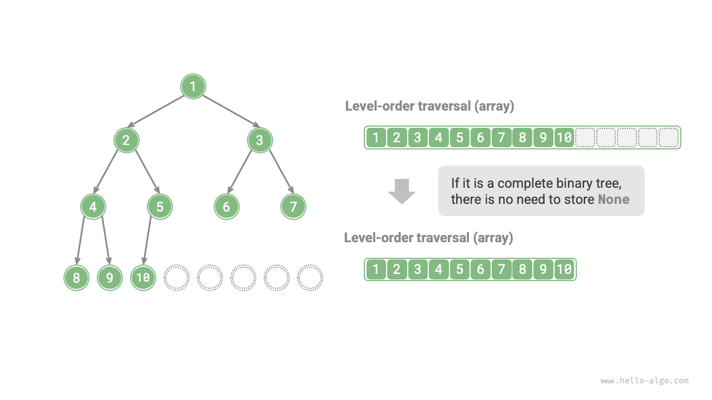

# Biểu diễn mảng của cây nhị phân

Trong biểu diễn danh sách liên kết, đơn vị lưu trữ của cây nhị phân là một nút `TreeNode` và các nút được kết nối bằng con trỏ. Phần trước đã giới thiệu các thao tác cơ bản của cây nhị phân trong cách biểu diễn này.

Vậy chúng ta có thể sử dụng mảng để biểu diễn cây nhị phân không? Câu trả lời là có.

## Đại diện cho cây nhị phân hoàn hảo

Trước tiên hãy phân tích một trường hợp đơn giản. Cho một cây nhị phân hoàn hảo, chúng ta lưu trữ tất cả các nút trong một mảng theo thứ tự duyệt cấp bậc, trong đó mỗi nút tương ứng với một chỉ mục mảng duy nhất.

Dựa trên các đặc điểm của truyền tải theo thứ tự cấp, chúng ta có thể rút ra một "công thức ánh xạ" giữa chỉ mục nút cha và chỉ mục nút con: **Nếu chỉ mục của nút là $i$, thì chỉ mục con bên trái của nó là $2i + 1$ và chỉ mục con bên phải của nó là $2i + 2$**. Hình dưới đây cho thấy mối quan hệ ánh xạ giữa các chỉ số nút khác nhau.


**Công thức ánh xạ đóng vai trò tương tự như tham chiếu nút (con trỏ) trong danh sách liên kết**. Với bất kỳ nút nào trong mảng, chúng ta có thể truy cập nút con bên trái (phải) của nó bằng công thức ánh xạ.

## Đại diện cho bất kỳ cây nhị phân nào

Cây nhị phân hoàn hảo là một trường hợp đặc biệt; ở các cấp độ giữa của cây nhị phân, thường có nhiều giá trị `None`. Vì trình tự truyền tải theo thứ tự cấp không bao gồm các giá trị `None` này nên chúng tôi không thể suy ra số lượng và phân bổ của các giá trị `None` chỉ dựa trên trình tự này. **Điều này có nghĩa là nhiều cấu trúc cây nhị phân có thể tương ứng với cùng một trình tự duyệt cấp bậc**.

Như thể hiện trong hình bên dưới, với một cây nhị phân không hoàn hảo, phương pháp biểu diễn mảng ở trên không thành công.


Để giải quyết vấn đề này, **chúng ta có thể viết rõ ràng tất cả các giá trị `None` theo trình tự duyệt cấp bậc**. Như được hiển thị trong hình bên dưới, khi chúng ta thực hiện điều này, trình tự duyệt cấp bậc có thể biểu diễn duy nhất một cây nhị phân. Mã ví dụ như sau:

=== "Python"

    ```python title=""
    # Array representation of a binary tree
    # Using None to represent empty slots
    tree = [1, 2, 3, 4, None, 6, 7, 8, 9, None, None, 12, None, None, 15]
    ```

=== "C++"

    ```cpp title=""
    /* Array representation of a binary tree */
    // Using the maximum integer value INT_MAX to mark empty slots
    vector<int> tree = {1, 2, 3, 4, INT_MAX, 6, 7, 8, 9, INT_MAX, INT_MAX, 12, INT_MAX, INT_MAX, 15};
    ```

=== "Java"

    ```java title=""
    /* Array representation of a binary tree */
    // Using the Integer wrapper class allows for using null to mark empty slots
    Integer[] tree = { 1, 2, 3, 4, null, 6, 7, 8, 9, null, null, 12, null, null, 15 };
    ```

=== "C#"

    ```csharp title=""
    /* Array representation of a binary tree */
    // Using nullable int (int?) allows for using null to mark empty slots
    int?[] tree = [1, 2, 3, 4, null, 6, 7, 8, 9, null, null, 12, null, null, 15];
    ```

=== "Go"

    ```go title=""
    /* Array representation of a binary tree */
    // Using an any type slice, allowing for nil to mark empty slots
    tree := []any{1, 2, 3, 4, nil, 6, 7, 8, 9, nil, nil, 12, nil, nil, 15}
    ```

=== "Swift"

    ```swift title=""
    /* Array representation of a binary tree */
    // Using optional Int (Int?) allows for using nil to mark empty slots
    let tree: [Int?] = [1, 2, 3, 4, nil, 6, 7, 8, 9, nil, nil, 12, nil, nil, 15]
    ```

=== "JS"

    ```javascript title=""
    /* Array representation of a binary tree */
    // Using null to represent empty slots
    let tree = [1, 2, 3, 4, null, 6, 7, 8, 9, null, null, 12, null, null, 15];
    ```

=== "TS"

    ```typescript title=""
    /* Array representation of a binary tree */
    // Using null to represent empty slots
    let tree: (number | null)[] = [1, 2, 3, 4, null, 6, 7, 8, 9, null, null, 12, null, null, 15];
    ```

=== "Dart"

    ```dart title=""
    /* Array representation of a binary tree */
    // Using nullable int (int?) allows for using null to mark empty slots
    List<int?> tree = [1, 2, 3, 4, null, 6, 7, 8, 9, null, null, 12, null, null, 15];
    ```

=== "Rust"

    ```rust title=""
    /* Array representation of a binary tree */
    // Using None to mark empty slots
    let tree = [Some(1), Some(2), Some(3), Some(4), None, Some(6), Some(7), Some(8), Some(9), None, None, Some(12), None, None, Some(15)];
    ```

=== "C"

    ```c title=""
    /* Array representation of a binary tree */
    // Using the maximum int value to mark empty slots, therefore, node values must not be INT_MAX
    int tree[] = {1, 2, 3, 4, INT_MAX, 6, 7, 8, 9, INT_MAX, INT_MAX, 12, INT_MAX, INT_MAX, 15};
    ```

=== "Kotlin"

    ```kotlin title=""
    /* Array representation of a binary tree */
    // Using null to represent empty slots
    val tree = arrayOf( 1, 2, 3, 4, null, 6, 7, 8, 9, null, null, 12, null, null, 15 )
    ```

=== "Ruby"

    ```ruby title=""
    ### Array representation of a binary tree ###
    # Using nil to represent empty slots
    tree = [1, 2, 3, 4, nil, 6, 7, 8, 9, nil, nil, 12, nil, nil, 15]
    ```


Điều đáng chú ý là **cây nhị phân hoàn chỉnh rất phù hợp để biểu diễn mảng**. Nhắc lại định nghĩa về cây nhị phân hoàn chỉnh, `None` chỉ xuất hiện ở cấp dưới cùng và về phía bên phải, **có nghĩa là tất cả các giá trị `None` phải xuất hiện ở cuối trình tự duyệt theo thứ tự cấp**.

Điều này có nghĩa là khi sử dụng một mảng để biểu diễn cây nhị phân hoàn chỉnh, có thể bỏ qua việc lưu trữ tất cả các giá trị `None`, điều này rất thuận tiện. Hình dưới đây đưa ra một ví dụ.



Đoạn mã sau triển khai cây nhị phân bằng cách sử dụng biểu diễn mảng, bao gồm các thao tác sau:

- Cho một nút, lấy giá trị của nó, nút con trái (phải) và nút cha.
- Lấy các trình tự duyệt thứ tự trước, thứ tự thứ tự, thứ tự thứ tự sau và thứ tự cấp.

```src
[file]{array_binary_tree}-[class]{array_binary_tree}-[func]{}
```

## Ưu điểm và hạn chế

Việc biểu diễn mảng của cây nhị phân có những ưu điểm sau:

- Mảng được lưu trữ trong không gian bộ nhớ liền kề, thân thiện với bộ đệm, cho phép truy cập và truyền tải nhanh hơn.
- Nó không yêu cầu lưu trữ con trỏ, giúp tiết kiệm không gian.
- Nó cho phép truy cập ngẫu nhiên vào các nút.

Tuy nhiên, cách biểu diễn mảng cũng có một số hạn chế:

- Lưu trữ mảng yêu cầu không gian bộ nhớ liền kề nên không phù hợp để lưu trữ cây có lượng dữ liệu lớn.
- Việc thêm hoặc xóa các nút yêu cầu các thao tác chèn và xóa mảng, có hiệu quả thấp hơn.
- Khi có nhiều giá trị `None` trong cây nhị phân, tỷ lệ dữ liệu nút chứa trong mảng thấp, dẫn đến mức sử dụng không gian thấp hơn.
