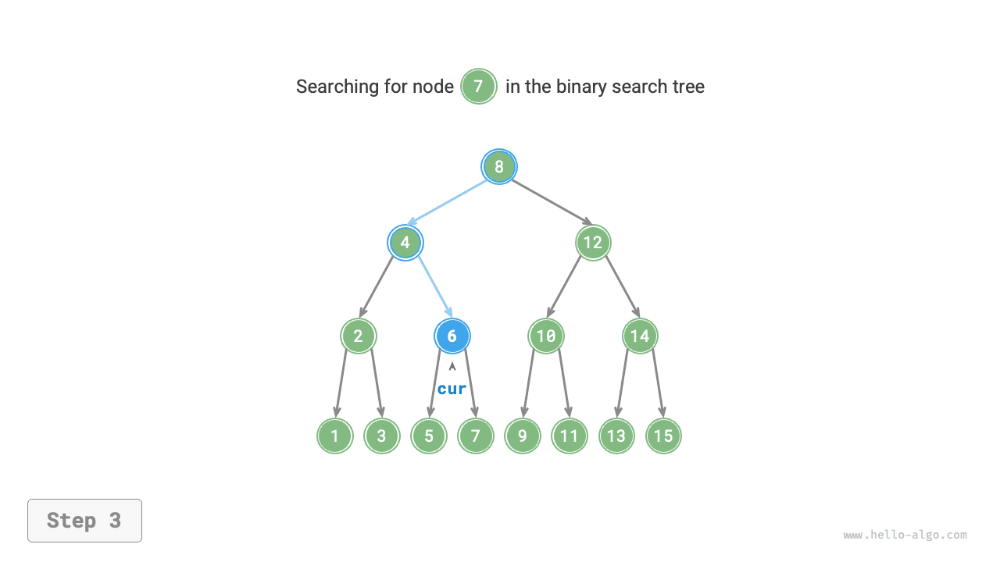
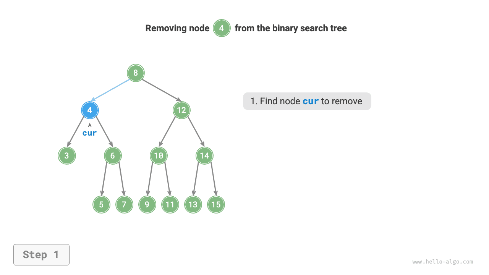
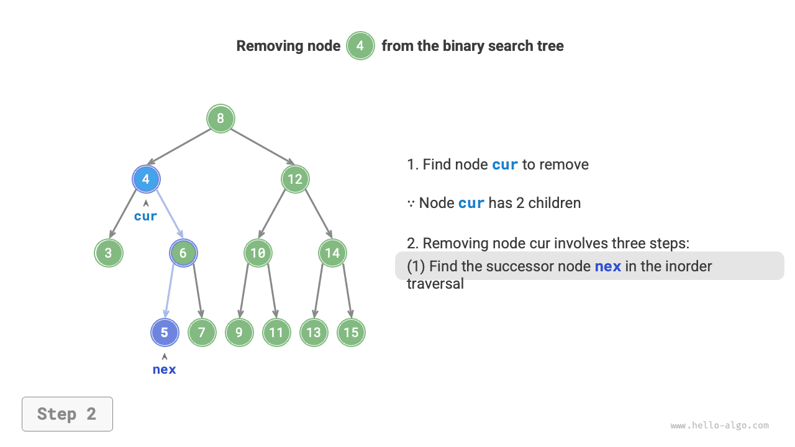
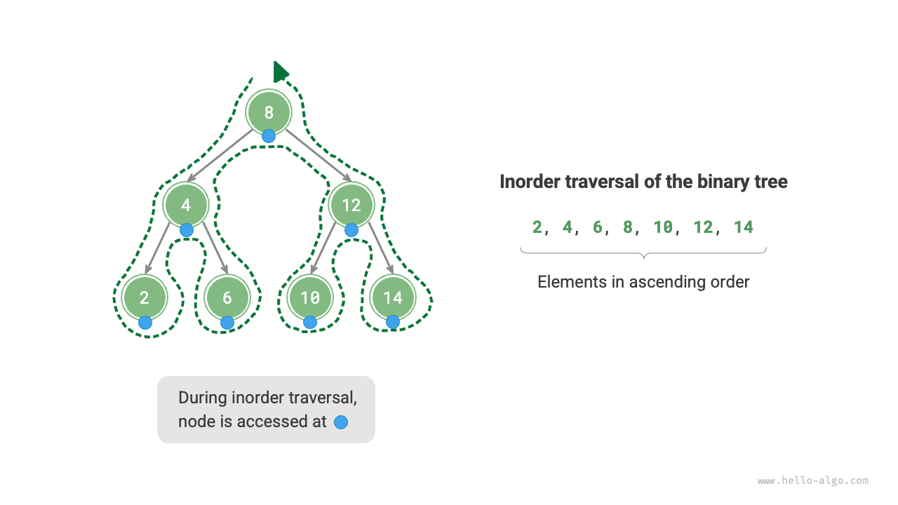
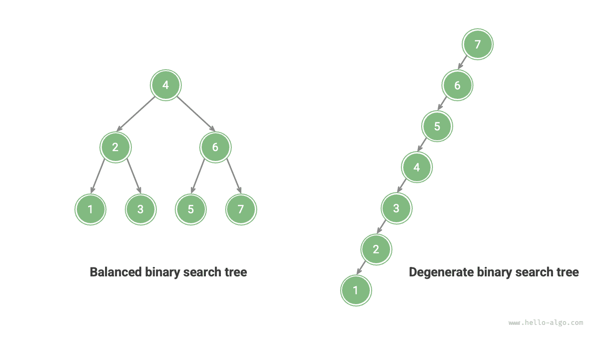

# Cây tìm kiếm nhị phân

Như được hiển thị trong hình bên dưới, <u>cây tìm kiếm nhị phân</u> đáp ứng các điều kiện sau.

1. Đối với nút gốc, giá trị của tất cả các nút trong cây con bên trái $<$ the value of the root node $<$ the value of all nodes in the right subtree.
2. The left and right subtrees of any node are also binary search trees, i.e., they satisfy condition `1.` as well.


## Operations on a Binary Search Tree

We encapsulate the binary search tree as a class `BinarySearchTree` and declare a member variable `root` pointing to the tree's root node.

### Searching for a Node

Given a target node value `num`, we can search according to the properties of the binary search tree. As shown in the figure below, we declare a node `cur` and start from the binary search tree's root node `root`, looping to compare `cur.val` with `num`.

- If `cur.val < num`, it means the target node is in `cur`'s right subtree, thus execute `cur = cur.right`.
- If `cur.val > num`, it means the target node is in `cur`'s left subtree, thus execute `cur = cur.left`.
- If `cur.val = num`, it means the target node is found, exit the loop, and return the node.

=== "<1>"
    

=== "<2>"
    

=== "<3>"
    

=== "<4>"
    

Hoạt động tìm kiếm trong cây tìm kiếm nhị phân tuân theo nguyên tắc tương tự như tìm kiếm nhị phân: mỗi vòng loại trừ một nửa số trường hợp còn lại. Số lần lặp vòng lặp tối đa bằng chiều cao của cây. Khi cây được cân bằng, việc tìm kiếm mất $O(\log n)$ thời gian. Mã ví dụ như sau:

```src
[file]{binary_search_tree}-[class]{binary_search_tree}-[func]{search}
```

### Chèn một nút

Cho một phần tử `num` được chèn vào, để duy trì thuộc tính của cây tìm kiếm nhị phân "cây con bên trái < root node < right subtree," the insertion process is as shown in the figure below.

1. **Finding the insertion position**: Similar to the search operation, start from the root node and loop downward searching according to the size relationship between the current node value and `num`, until passing the leaf node (traversing to `None`) and then exit the loop.
2. **Insert the node at that position**: Create a node for `num` and place it at the `None` position.


In the code implementation, note the following two points:

- Binary search trees do not allow duplicate nodes; otherwise, the tree would no longer satisfy its definition. Therefore, if the node to be inserted already exists in the tree, the insertion is skipped and the function returns directly.
- To implement the node insertion, we need to use node `pre` to save the node from the previous loop iteration. This way, when traversing to `None`, we can obtain its parent node, thereby completing the node insertion operation.

```src
[file]{binary_search_tree}-[class]{binary_search_tree}-[func]{insert}
```

Similar to searching for a node, inserting a node uses $O(\log n)$ time.

### Removing a Node

First, find the target node in the binary search tree, then remove it. Similar to node insertion, we need to ensure that after the removal operation is completed, the binary search tree's property of "left subtree $<$ root node $<$ right subtree" is still maintained. Therefore, depending on the number of child nodes the target node has, we consider three cases: degree $0$, degree $1$, and degree $2$, and perform the corresponding removal operation.

As shown in the figure below, when the degree of the node to be removed is $0$, it means the node is a leaf node and can be directly removed.


As shown in the figure below, when the degree of the node to be removed is $1$, replacing the node to be removed with its child node is sufficient.


When the degree of the node to be removed is $2$, we cannot directly remove it; instead, we need to use a node to replace it. To maintain the binary search tree's property of "left subtree $<$ root node $<$ right subtree," **this node can be either the smallest node in the right subtree or the largest node in the left subtree**.

Assuming we choose the smallest node in the right subtree, that is, the inorder successor, the removal process is as shown in the figure below.

1. Find the next node of the node to be removed in the "inorder traversal sequence," denoted as `tmp`.
2. Replace the value of the node to be removed with the value of `tmp`, and recursively remove node `tmp` in the tree.

=== "<1>"
    

=== "<2>"
    

=== "<3>"
    

=== "<4>"
    

Hoạt động loại bỏ nút cũng sử dụng thời gian $O(\log n)$, trong đó việc tìm kiếm nút cần xóa yêu cầu thời gian $O(\log n)$ và để có được nút kế tiếp theo thứ tự yêu cầu thời gian $O(\log n)$. Mã ví dụ như sau:

```src
[file]{binary_search_tree}-[class]{binary_search_tree}-[func]{remove}
```

### Truyền tải theo thứ tự được sắp xếp

Như được hiển thị trong hình bên dưới, việc duyệt theo thứ tự của cây nhị phân tuân theo thứ tự duyệt "left $\rightarrow$ root $\rightarrow$ right", trong khi cây tìm kiếm nhị phân thỏa mãn "nút con trái $<$ root node $<$ right child node" size relationship.

This means that when performing an inorder traversal in a binary search tree, the next smallest node is always traversed first, thus yielding an important property: **The inorder traversal sequence of a binary search tree is ascending**.

Using the property of inorder traversal being ascending, we can obtain ordered data in a binary search tree in only $O(n)$ time, without the need for additional sorting operations, which is very efficient.



## Efficiency of Binary Search Trees

Given a set of data, we consider using an array or a binary search tree for storage. Observing the table below, all operations in a binary search tree have logarithmic time complexity, providing stable and efficient performance. Arrays are more efficient than binary search trees only in scenarios with high-frequency additions and low-frequency searches and deletions.

<p align="center"> Bảng <id> &nbsp; So sánh hiệu quả giữa mảng và cây tìm kiếm </p>

|                | Mảng chưa sắp xếp | Cây tìm kiếm nhị phân |
| -------------- | -------------- | ------------------ |
| Phần tử tìm kiếm | $O(n)$ | $O(\log n)$ |
| Chèn phần tử | $O(1)$ | $O(\log n)$ |
| Xóa phần tử | $O(n)$ | $O(\log n)$ |

Trong trường hợp lý tưởng, cây tìm kiếm nhị phân được cân bằng, do đó, bất kỳ nút nào cũng có thể được tìm thấy trong các vòng lặp $O(\log n)$.

Tuy nhiên, nếu chúng ta liên tục chèn và xóa các nút trong cây tìm kiếm nhị phân, nó có thể thoái hóa thành danh sách liên kết như trong hình bên dưới, trong đó độ phức tạp về thời gian của các hoạt động khác nhau cũng giảm xuống $O(n)$.



## Các ứng dụng phổ biến của cây tìm kiếm nhị phân

- Được sử dụng làm chỉ mục đa cấp trong hệ thống để thực hiện các hoạt động tìm kiếm, chèn và xóa hiệu quả.
- Phục vụ như cấu trúc dữ liệu cơ bản cho các thuật toán tìm kiếm nhất định.
- Được sử dụng để lưu trữ các luồng dữ liệu nhằm duy trì trạng thái được sắp xếp của chúng.
