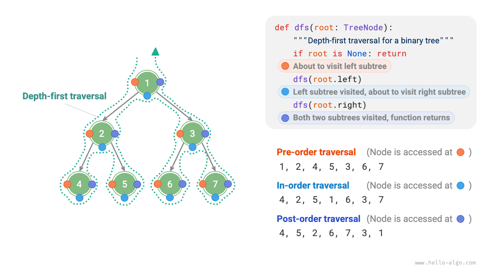
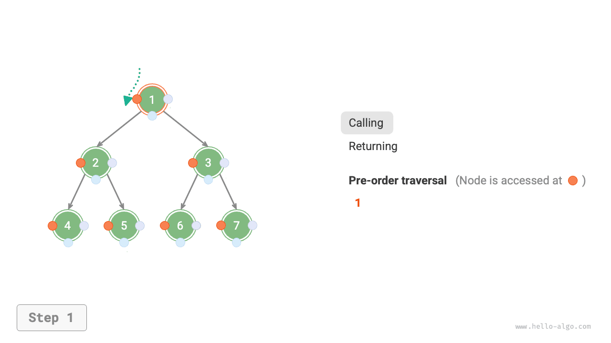
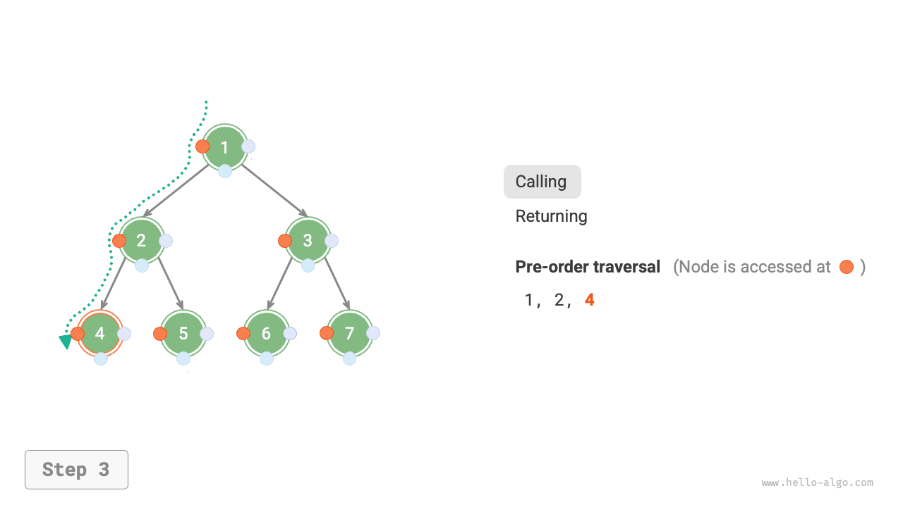
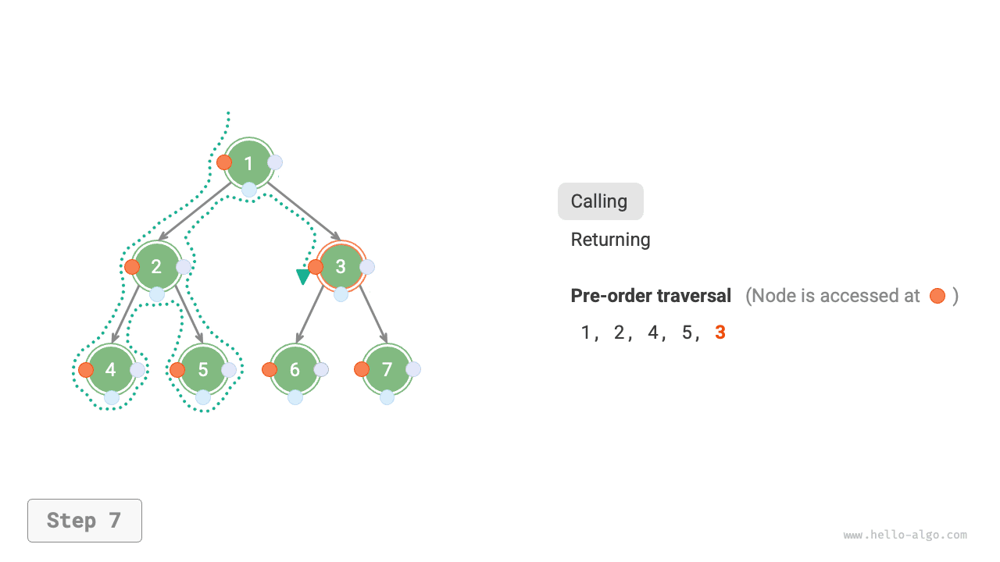
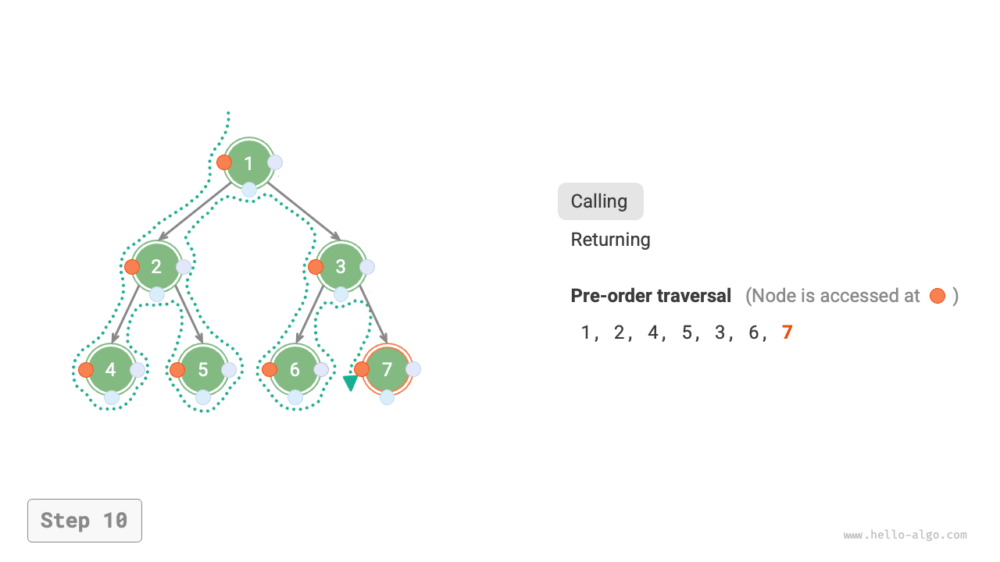

# Truyền tải cây nhị phân

Từ góc độ cấu trúc vật lý, cây là cấu trúc dữ liệu dựa trên các danh sách được liên kết. Do đó, phương pháp truyền tải của nó liên quan đến việc truy cập từng nút một thông qua con trỏ. Tuy nhiên, cây là một cấu trúc dữ liệu phi tuyến tính, khiến cho việc duyệt cây phức tạp hơn việc duyệt danh sách liên kết, cần có sự hỗ trợ của các thuật toán tìm kiếm.

Các phương pháp duyệt phổ biến cho cây nhị phân bao gồm duyệt theo cấp độ, duyệt theo thứ tự trước, duyệt theo thứ tự và duyệt theo thứ tự sau.

## Truyền tải thứ tự cấp độ

Như được hiển thị trong hình bên dưới, <u>duyệt theo thứ tự cấp độ</u> duyệt cây nhị phân từ trên xuống dưới, từng lớp. Trong mỗi cấp độ, nó truy cập các nút từ trái sang phải.

Truyền tải theo thứ tự cấp về cơ bản là <u>truyền tải theo chiều rộng</u>, còn được gọi là <u>tìm kiếm theo chiều rộng (BFS)</u>, tiến hành truyền tải theo cấp độ bên ngoài.


### Triển khai mã

Truyền tải theo chiều rộng thường được thực hiện với sự trợ giúp của "hàng đợi". Hàng đợi tuân theo quy tắc "vào trước, ra trước", trong khi truyền tải theo chiều rộng tuân theo quy tắc "tiến triển theo từng lớp"; những ý tưởng cơ bản của cả hai là nhất quán. Mã thực hiện như sau:

```src
[file]{binary_tree_bfs}-[class]{}-[func]{level_order}
```

### Phân tích độ phức tạp

- **Độ phức tạp về thời gian là $O(n)$**: Tất cả các nút được truy cập một lần, sử dụng thời gian $O(n)$, trong đó $n$ là số lượng nút.
- **Độ phức tạp của không gian là $O(n)$**: Trong trường hợp xấu nhất, tức là một cây nhị phân đầy đủ, trước khi duyệt đến mức dưới cùng, hàng đợi chứa đồng thời nhiều nhất các nút $(n + 1) / 2$, chiếm không gian $O(n)$.

## Truyền tải thứ tự trước, thứ tự thứ tự và thứ tự sau

Tương ứng, tất cả các lần duyệt theo thứ tự trước, theo thứ tự và theo thứ tự sau đều thuộc về <u>tìm kiếm theo chiều sâu</u>, còn được gọi là <u>tìm kiếm theo chiều sâu (DFS)</u>, đi sâu nhất có thể trước khi quay lui.

Hình dưới đây cho thấy cách thức hoạt động của quá trình truyền tải theo chiều sâu trên cây nhị phân. **Truyền tải theo chiều sâu giống như "đi bộ" xung quanh chu vi của toàn bộ cây nhị phân**, gặp ba vị trí tại mỗi nút, tương ứng với duyệt theo thứ tự trước, theo thứ tự và theo thứ tự sau.



### Triển khai mã

Tìm kiếm theo chiều sâu thường được triển khai dựa trên đệ quy:

```src
[file]{binary_tree_dfs}-[class]{}-[func]{post_order}
```

!!! mẹo

    Tìm kiếm theo chiều sâu cũng có thể được thực hiện lặp đi lặp lại và những độc giả quan tâm có thể tự mình khám phá điều này.

Hình dưới đây cho thấy quá trình đệ quy duyệt cây nhị phân theo thứ tự trước, có thể chia thành hai giai đoạn đối lập nhau: "giảm dần" và "trở về".

1. "Giảm dần" có nghĩa là thực hiện một cuộc gọi đệ quy mới, trong đó chương trình sẽ truy cập nút tiếp theo.
2. "Trở về" có nghĩa là lệnh gọi hàm trả về, cho biết rằng nút hiện tại đã được xử lý hoàn toàn.

=== "<1>"
    

=== "<2>"
    

=== "<3>"
    

=== "<4>"
    

=== "<5>"
    

=== "<6>"
    

=== "<7>"
    

=== "<8>"
    

=== "<9>"
    

=== "<10>"
    

=== "<11>"
    

### Phân tích độ phức tạp

- **Độ phức tạp về thời gian là $O(n)$**: Tất cả các nút được truy cập một lần, sử dụng thời gian $O(n)$.
- **Độ phức tạp của không gian là $O(n)$**: Trong trường hợp xấu nhất, tức là cây thoái hóa thành danh sách liên kết, độ sâu đệ quy đạt đến $n$ và hệ thống chiếm không gian khung ngăn xếp $O(n)$.
