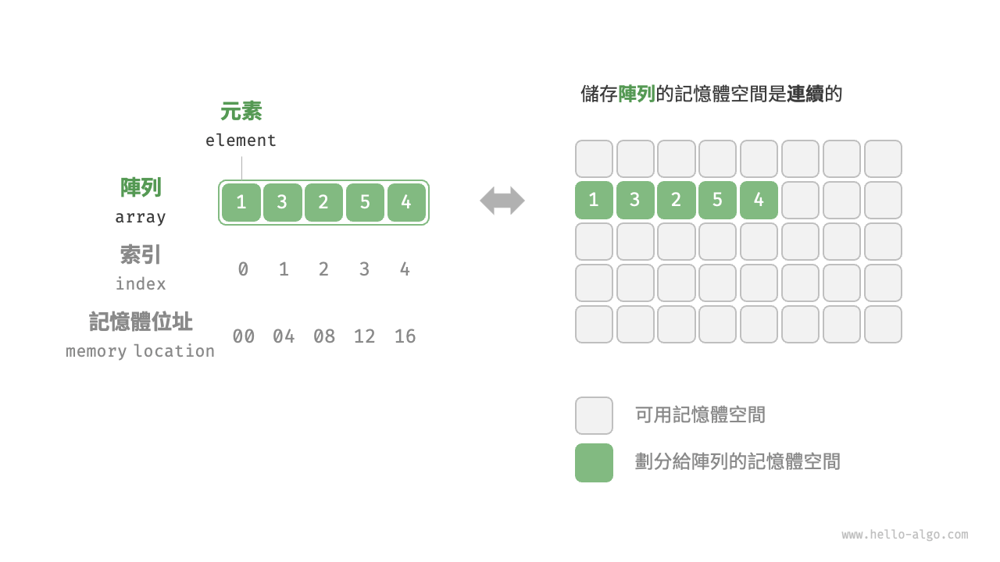
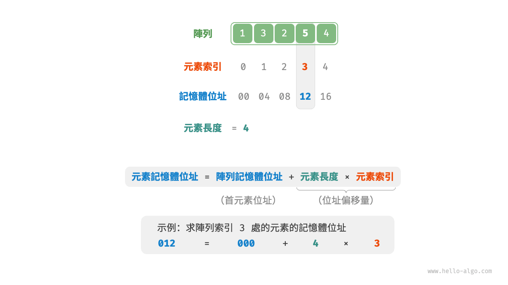
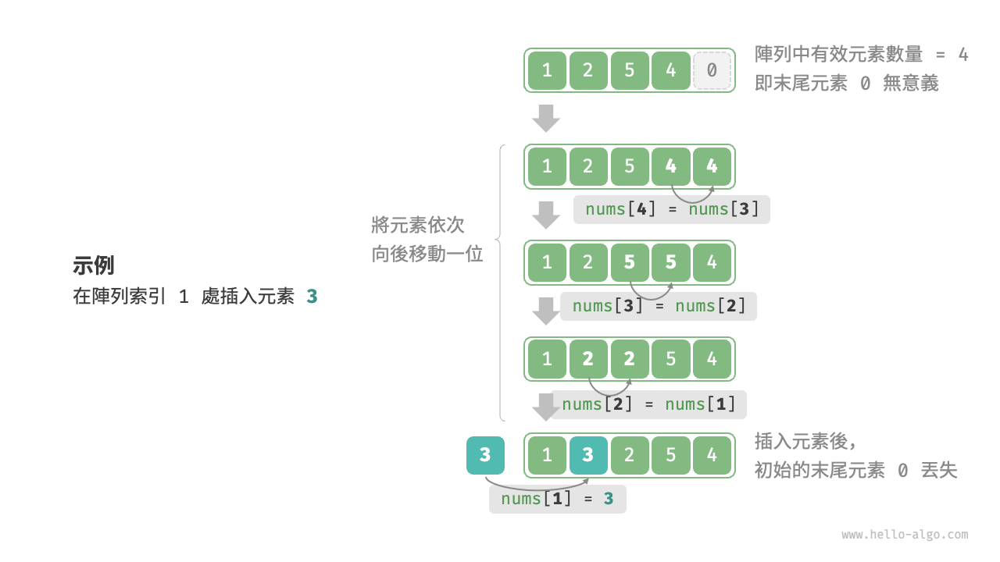
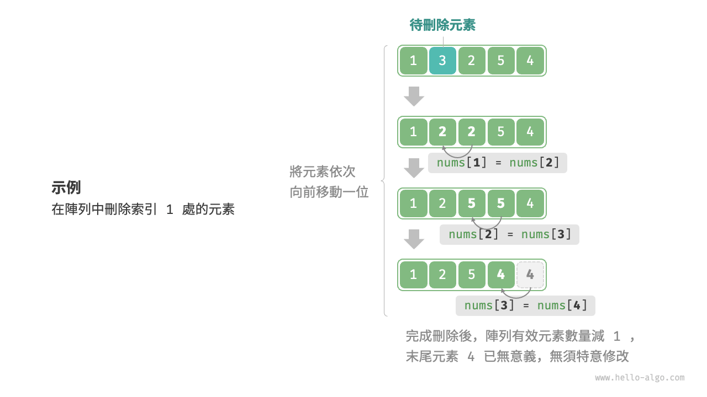

# 4.1 &nbsp; 陣列

<u>陣列（array）</u>是一種線性資料結構，其將相同型別的元素儲存在連續的記憶體空間中。我們將元素在陣列中的位置稱為該元素的<u>索引（index）</u>。圖 4-1 展示了陣列的主要概念和儲存方式。

{ class="animation-figure" }

<p align="center"> 圖 4-1 &nbsp; 陣列定義與儲存方式 </p>

## 4.1.1 &nbsp; 陣列常用操作

### 1. &nbsp; 初始化陣列

我們可以根據需求選用陣列的兩種初始化方式：無初始值、給定初始值。在未指定初始值的情況下，大多數程式語言會將陣列元素初始化為 $0$ ：

=== "Python"

    ```python title="array.py"
    # 初始化陣列
    arr: list[int] = [0] * 5  # [ 0, 0, 0, 0, 0 ]
    nums: list[int] = [1, 3, 2, 5, 4]
    ```

=== "C++"

    ```cpp title="array.cpp"
    /* 初始化陣列 */
    // 儲存在堆疊上
    int arr[5];
    int nums[5] = { 1, 3, 2, 5, 4 };
    // 儲存在堆積上（需要手動釋放空間）
    int* arr1 = new int[5];
    int* nums1 = new int[5] { 1, 3, 2, 5, 4 };
    ```

=== "Java"

    ```java title="array.java"
    /* 初始化陣列 */
    int[] arr = new int[5]; // { 0, 0, 0, 0, 0 }
    int[] nums = { 1, 3, 2, 5, 4 };
    ```

=== "C#"

    ```csharp title="array.cs"
    /* 初始化陣列 */
    int[] arr = new int[5]; // [ 0, 0, 0, 0, 0 ]
    int[] nums = [1, 3, 2, 5, 4];
    ```

=== "Go"

    ```go title="array.go"
    /* 初始化陣列 */
    var arr [5]int
    // 在 Go 中，指定長度時（[5]int）為陣列，不指定長度時（[]int）為切片
    // 由於 Go 的陣列被設計為在編譯期確定長度，因此只能使用常數來指定長度
    // 為了方便實現擴容 extend() 方法，以下將切片（Slice）看作陣列（Array）
    nums := []int{1, 3, 2, 5, 4}
    ```

=== "Swift"

    ```swift title="array.swift"
    /* 初始化陣列 */
    let arr = Array(repeating: 0, count: 5) // [0, 0, 0, 0, 0]
    let nums = [1, 3, 2, 5, 4]
    ```

=== "JS"

    ```javascript title="array.js"
    /* 初始化陣列 */
    var arr = new Array(5).fill(0);
    var nums = [1, 3, 2, 5, 4];
    ```

=== "TS"

    ```typescript title="array.ts"
    /* 初始化陣列 */
    let arr: number[] = new Array(5).fill(0);
    let nums: number[] = [1, 3, 2, 5, 4];
    ```

=== "Dart"

    ```dart title="array.dart"
    /* 初始化陣列 */
    List<int> arr = List.filled(5, 0); // [0, 0, 0, 0, 0]
    List<int> nums = [1, 3, 2, 5, 4];
    ```

=== "Rust"

    ```rust title="array.rs"
    /* 初始化陣列 */
    let arr: [i32; 5] = [0; 5]; // [0, 0, 0, 0, 0]
    let slice: &[i32] = &[0; 5];
    // 在 Rust 中，指定長度時（[i32; 5]）為陣列，不指定長度時（&[i32]）為切片
    // 由於 Rust 的陣列被設計為在編譯期確定長度，因此只能使用常數來指定長度
    // Vector 是 Rust 一般情況下用作動態陣列的型別
    // 為了方便實現擴容 extend() 方法，以下將 vector 看作陣列（array）
    let nums: Vec<i32> = vec![1, 3, 2, 5, 4];
    ```

=== "C"

    ```c title="array.c"
    /* 初始化陣列 */
    int arr[5] = { 0 }; // { 0, 0, 0, 0, 0 }
    int nums[5] = { 1, 3, 2, 5, 4 };
    ```

=== "Kotlin"

    ```kotlin title="array.kt"
    /* 初始化陣列 */
    var arr = IntArray(5) // { 0, 0, 0, 0, 0 }
    var nums = intArrayOf(1, 3, 2, 5, 4)
    ```

=== "Ruby"

    ```ruby title="array.rb"
    # 初始化陣列
    arr = Array.new(5, 0)
    nums = [1, 3, 2, 5, 4]
    ```

=== "Zig"

    ```zig title="array.zig"
    // 初始化陣列
    const arr = [_]i32{0} ** 5; // { 0, 0, 0, 0, 0 }
    const nums = [_]i32{ 1, 3, 2, 5, 4 };
    ```

??? pythontutor "視覺化執行"

    <div style="height: 243px; width: 100%;"><iframe class="pythontutor-iframe" src="https://pythontutor.com/iframe-embed.html#code=%23%20%E5%88%9D%E5%A7%8B%E5%8C%96%E9%99%A3%E5%88%97%0Aarr%20%3D%20%5B0%5D%20%2A%205%20%20%23%20%5B%200%2C%200%2C%200%2C%200%2C%200%20%5D%0Anums%20%3D%20%5B1%2C%203%2C%202%2C%205%2C%204%5D&codeDivHeight=472&codeDivWidth=350&cumulative=false&curInstr=0&heapPrimitives=nevernest&origin=opt-frontend.js&py=311&rawInputLstJSON=%5B%5D&textReferences=false"> </iframe></div>
    <div style="margin-top: 5px;"><a href="https://pythontutor.com/iframe-embed.html#code=%23%20%E5%88%9D%E5%A7%8B%E5%8C%96%E9%99%A3%E5%88%97%0Aarr%20%3D%20%5B0%5D%20%2A%205%20%20%23%20%5B%200%2C%200%2C%200%2C%200%2C%200%20%5D%0Anums%20%3D%20%5B1%2C%203%2C%202%2C%205%2C%204%5D&codeDivHeight=800&codeDivWidth=600&cumulative=false&curInstr=0&heapPrimitives=nevernest&origin=opt-frontend.js&py=311&rawInputLstJSON=%5B%5D&textReferences=false" target="_blank" rel="noopener noreferrer">全螢幕觀看 ></a></div>

### 2. &nbsp; 訪問元素

陣列元素被儲存在連續的記憶體空間中，這意味著計算陣列元素的記憶體位址非常容易。給定陣列記憶體位址（首元素記憶體位址）和某個元素的索引，我們可以使用圖 4-2 所示的公式計算得到該元素的記憶體位址，從而直接訪問該元素。

{ class="animation-figure" }

<p align="center"> 圖 4-2 &nbsp; 陣列元素的記憶體位址計算 </p>

觀察圖 4-2 ，我們發現陣列首個元素的索引為 $0$ ，這似乎有些反直覺，因為從 $1$ 開始計數會更自然。但從位址計算公式的角度看，**索引本質上是記憶體位址的偏移量**。首個元素的位址偏移量是 $0$ ，因此它的索引為 $0$ 是合理的。

在陣列中訪問元素非常高效，我們可以在 $O(1)$ 時間內隨機訪問陣列中的任意一個元素。

=== "Python"

    ```python title="array.py"
    def random_access(nums: list[int]) -> int:
        """隨機訪問元素"""
        # 在區間 [0, len(nums)-1] 中隨機抽取一個數字
        random_index = random.randint(0, len(nums) - 1)
        # 獲取並返回隨機元素
        random_num = nums[random_index]
        return random_num
    ```

=== "C++"

    ```cpp title="array.cpp"
    /* 隨機訪問元素 */
    int randomAccess(int *nums, int size) {
        // 在區間 [0, size) 中隨機抽取一個數字
        int randomIndex = rand() % size;
        // 獲取並返回隨機元素
        int randomNum = nums[randomIndex];
        return randomNum;
    }
    ```

=== "Java"

    ```java title="array.java"
    /* 隨機訪問元素 */
    int randomAccess(int[] nums) {
        // 在區間 [0, nums.length) 中隨機抽取一個數字
        int randomIndex = ThreadLocalRandom.current().nextInt(0, nums.length);
        // 獲取並返回隨機元素
        int randomNum = nums[randomIndex];
        return randomNum;
    }
    ```

=== "C#"

    ```csharp title="array.cs"
    /* 隨機訪問元素 */
    int RandomAccess(int[] nums) {
        Random random = new();
        // 在區間 [0, nums.Length) 中隨機抽取一個數字
        int randomIndex = random.Next(nums.Length);
        // 獲取並返回隨機元素
        int randomNum = nums[randomIndex];
        return randomNum;
    }
    ```

=== "Go"

    ```go title="array.go"
    /* 隨機訪問元素 */
    func randomAccess(nums []int) (randomNum int) {
        // 在區間 [0, nums.length) 中隨機抽取一個數字
        randomIndex := rand.Intn(len(nums))
        // 獲取並返回隨機元素
        randomNum = nums[randomIndex]
        return
    }
    ```

=== "Swift"

    ```swift title="array.swift"
    /* 隨機訪問元素 */
    func randomAccess(nums: [Int]) -> Int {
        // 在區間 [0, nums.count) 中隨機抽取一個數字
        let randomIndex = nums.indices.randomElement()!
        // 獲取並返回隨機元素
        let randomNum = nums[randomIndex]
        return randomNum
    }
    ```

=== "JS"

    ```javascript title="array.js"
    /* 隨機訪問元素 */
    function randomAccess(nums) {
        // 在區間 [0, nums.length) 中隨機抽取一個數字
        const random_index = Math.floor(Math.random() * nums.length);
        // 獲取並返回隨機元素
        const random_num = nums[random_index];
        return random_num;
    }
    ```

=== "TS"

    ```typescript title="array.ts"
    /* 隨機訪問元素 */
    function randomAccess(nums: number[]): number {
        // 在區間 [0, nums.length) 中隨機抽取一個數字
        const random_index = Math.floor(Math.random() * nums.length);
        // 獲取並返回隨機元素
        const random_num = nums[random_index];
        return random_num;
    }
    ```

=== "Dart"

    ```dart title="array.dart"
    /* 隨機訪問元素 */
    int randomAccess(List<int> nums) {
      // 在區間 [0, nums.length) 中隨機抽取一個數字
      int randomIndex = Random().nextInt(nums.length);
      // 獲取並返回隨機元素
      int randomNum = nums[randomIndex];
      return randomNum;
    }
    ```

=== "Rust"

    ```rust title="array.rs"
    /* 隨機訪問元素 */
    fn random_access(nums: &[i32]) -> i32 {
        // 在區間 [0, nums.len()) 中隨機抽取一個數字
        let random_index = rand::thread_rng().gen_range(0..nums.len());
        // 獲取並返回隨機元素
        let random_num = nums[random_index];
        random_num
    }
    ```

=== "C"

    ```c title="array.c"
    /* 隨機訪問元素 */
    int randomAccess(int *nums, int size) {
        // 在區間 [0, size) 中隨機抽取一個數字
        int randomIndex = rand() % size;
        // 獲取並返回隨機元素
        int randomNum = nums[randomIndex];
        return randomNum;
    }
    ```

=== "Kotlin"

    ```kotlin title="array.kt"
    /* 隨機訪問元素 */
    fun randomAccess(nums: IntArray): Int {
        // 在區間 [0, nums.size) 中隨機抽取一個數字
        val randomIndex = ThreadLocalRandom.current().nextInt(0, nums.size)
        // 獲取並返回隨機元素
        val randomNum = nums[randomIndex]
        return randomNum
    }
    ```

=== "Ruby"

    ```ruby title="array.rb"
    ### 隨機訪問元素 ###
    def random_access(nums)
      # 在區間 [0, nums.length) 中隨機抽取一個數字
      random_index = Random.rand(0...nums.length)

      # 獲取並返回隨機元素
      nums[random_index]
    end
    ```

=== "Zig"

    ```zig title="array.zig"
    // 隨機訪問元素
    fn randomAccess(nums: []const i32) i32 {
        // 在區間 [0, nums.len) 中隨機抽取一個整數
        const random_index = std.crypto.random.intRangeLessThan(usize, 0, nums.len);
        // 獲取並返回隨機元素
        const randomNum = nums[random_index];
        return randomNum;
    }
    ```

??? pythontutor "視覺化執行"

    <div style="height: 531px; width: 100%;"><iframe class="pythontutor-iframe" src="https://pythontutor.com/iframe-embed.html#code=import%20random%0A%0Adef%20random_access%28nums%3A%20list%5Bint%5D%29%20-%3E%20int%3A%0A%20%20%20%20%22%22%22%E9%9A%A8%E6%A9%9F%E8%A8%AA%E5%95%8F%E5%85%83%E7%B4%A0%22%22%22%0A%20%20%20%20%23%20%E5%9C%A8%E5%8D%80%E9%96%93%20%5B0%2C%20len%28nums%29-1%5D%20%E4%B8%AD%E9%9A%A8%E6%A9%9F%E6%8A%BD%E5%8F%96%E4%B8%80%E5%80%8B%E6%95%B8%E5%AD%97%0A%20%20%20%20random_index%20%3D%20random.randint%280%2C%20len%28nums%29%20-%201%29%0A%20%20%20%20%23%20%E7%8D%B2%E5%8F%96%E4%B8%A6%E8%BF%94%E5%9B%9E%E9%9A%A8%E6%A9%9F%E5%85%83%E7%B4%A0%0A%20%20%20%20random_num%20%3D%20nums%5Brandom_index%5D%0A%20%20%20%20return%20random_num%0A%0A%22%22%22Driver%20Code%22%22%22%0Aif%20__name__%20%3D%3D%20%22__main__%22%3A%0A%20%20%20%20%23%20%E5%88%9D%E5%A7%8B%E5%8C%96%E9%99%A3%E5%88%97%0A%20%20%20%20nums%20%3D%20%5B1%2C%203%2C%202%2C%205%2C%204%5D%0A%20%20%20%20print%28%22%E9%99%A3%E5%88%97%20nums%20%3D%22%2C%20nums%29%0A%0A%20%20%20%20%23%20%E9%9A%A8%E6%A9%9F%E8%A8%AA%E5%95%8F%0A%20%20%20%20random_num%3A%20int%20%3D%20random_access%28nums%29%0A%20%20%20%20print%28%22%E5%9C%A8%20nums%20%E4%B8%AD%E7%8D%B2%E5%8F%96%E9%9A%A8%E6%A9%9F%E5%85%83%E7%B4%A0%22%2C%20random_num%29%0A&codeDivHeight=472&codeDivWidth=350&cumulative=false&curInstr=7&heapPrimitives=nevernest&origin=opt-frontend.js&py=311&rawInputLstJSON=%5B%5D&textReferences=false"> </iframe></div>
    <div style="margin-top: 5px;"><a href="https://pythontutor.com/iframe-embed.html#code=import%20random%0A%0Adef%20random_access%28nums%3A%20list%5Bint%5D%29%20-%3E%20int%3A%0A%20%20%20%20%22%22%22%E9%9A%A8%E6%A9%9F%E8%A8%AA%E5%95%8F%E5%85%83%E7%B4%A0%22%22%22%0A%20%20%20%20%23%20%E5%9C%A8%E5%8D%80%E9%96%93%20%5B0%2C%20len%28nums%29-1%5D%20%E4%B8%AD%E9%9A%A8%E6%A9%9F%E6%8A%BD%E5%8F%96%E4%B8%80%E5%80%8B%E6%95%B8%E5%AD%97%0A%20%20%20%20random_index%20%3D%20random.randint%280%2C%20len%28nums%29%20-%201%29%0A%20%20%20%20%23%20%E7%8D%B2%E5%8F%96%E4%B8%A6%E8%BF%94%E5%9B%9E%E9%9A%A8%E6%A9%9F%E5%85%83%E7%B4%A0%0A%20%20%20%20random_num%20%3D%20nums%5Brandom_index%5D%0A%20%20%20%20return%20random_num%0A%0A%22%22%22Driver%20Code%22%22%22%0Aif%20__name__%20%3D%3D%20%22__main__%22%3A%0A%20%20%20%20%23%20%E5%88%9D%E5%A7%8B%E5%8C%96%E9%99%A3%E5%88%97%0A%20%20%20%20nums%20%3D%20%5B1%2C%203%2C%202%2C%205%2C%204%5D%0A%20%20%20%20print%28%22%E9%99%A3%E5%88%97%20nums%20%3D%22%2C%20nums%29%0A%0A%20%20%20%20%23%20%E9%9A%A8%E6%A9%9F%E8%A8%AA%E5%95%8F%0A%20%20%20%20random_num%3A%20int%20%3D%20random_access%28nums%29%0A%20%20%20%20print%28%22%E5%9C%A8%20nums%20%E4%B8%AD%E7%8D%B2%E5%8F%96%E9%9A%A8%E6%A9%9F%E5%85%83%E7%B4%A0%22%2C%20random_num%29%0A&codeDivHeight=800&codeDivWidth=600&cumulative=false&curInstr=7&heapPrimitives=nevernest&origin=opt-frontend.js&py=311&rawInputLstJSON=%5B%5D&textReferences=false" target="_blank" rel="noopener noreferrer">全螢幕觀看 ></a></div>

### 3. &nbsp; 插入元素

陣列元素在記憶體中是“緊挨著的”，它們之間沒有空間再存放任何資料。如圖 4-3 所示，如果想在陣列中間插入一個元素，則需要將該元素之後的所有元素都向後移動一位，之後再把元素賦值給該索引。

{ class="animation-figure" }

<p align="center"> 圖 4-3 &nbsp; 陣列插入元素示例 </p>

值得注意的是，由於陣列的長度是固定的，因此插入一個元素必定會導致陣列尾部元素“丟失”。我們將這個問題的解決方案留在“串列”章節中討論。

=== "Python"

    ```python title="array.py"
    def insert(nums: list[int], num: int, index: int):
        """在陣列的索引 index 處插入元素 num"""
        # 把索引 index 以及之後的所有元素向後移動一位
        for i in range(len(nums) - 1, index, -1):
            nums[i] = nums[i - 1]
        # 將 num 賦給 index 處的元素
        nums[index] = num
    ```

=== "C++"

    ```cpp title="array.cpp"
    /* 在陣列的索引 index 處插入元素 num */
    void insert(int *nums, int size, int num, int index) {
        // 把索引 index 以及之後的所有元素向後移動一位
        for (int i = size - 1; i > index; i--) {
            nums[i] = nums[i - 1];
        }
        // 將 num 賦給 index 處的元素
        nums[index] = num;
    }
    ```

=== "Java"

    ```java title="array.java"
    /* 在陣列的索引 index 處插入元素 num */
    void insert(int[] nums, int num, int index) {
        // 把索引 index 以及之後的所有元素向後移動一位
        for (int i = nums.length - 1; i > index; i--) {
            nums[i] = nums[i - 1];
        }
        // 將 num 賦給 index 處的元素
        nums[index] = num;
    }
    ```

=== "C#"

    ```csharp title="array.cs"
    /* 在陣列的索引 index 處插入元素 num */
    void Insert(int[] nums, int num, int index) {
        // 把索引 index 以及之後的所有元素向後移動一位
        for (int i = nums.Length - 1; i > index; i--) {
            nums[i] = nums[i - 1];
        }
        // 將 num 賦給 index 處的元素
        nums[index] = num;
    }
    ```

=== "Go"

    ```go title="array.go"
    /* 在陣列的索引 index 處插入元素 num */
    func insert(nums []int, num int, index int) {
        // 把索引 index 以及之後的所有元素向後移動一位
        for i := len(nums) - 1; i > index; i-- {
            nums[i] = nums[i-1]
        }
        // 將 num 賦給 index 處的元素
        nums[index] = num
    }
    ```

=== "Swift"

    ```swift title="array.swift"
    /* 在陣列的索引 index 處插入元素 num */
    func insert(nums: inout [Int], num: Int, index: Int) {
        // 把索引 index 以及之後的所有元素向後移動一位
        for i in nums.indices.dropFirst(index).reversed() {
            nums[i] = nums[i - 1]
        }
        // 將 num 賦給 index 處的元素
        nums[index] = num
    }
    ```

=== "JS"

    ```javascript title="array.js"
    /* 在陣列的索引 index 處插入元素 num */
    function insert(nums, num, index) {
        // 把索引 index 以及之後的所有元素向後移動一位
        for (let i = nums.length - 1; i > index; i--) {
            nums[i] = nums[i - 1];
        }
        // 將 num 賦給 index 處的元素
        nums[index] = num;
    }
    ```

=== "TS"

    ```typescript title="array.ts"
    /* 在陣列的索引 index 處插入元素 num */
    function insert(nums: number[], num: number, index: number): void {
        // 把索引 index 以及之後的所有元素向後移動一位
        for (let i = nums.length - 1; i > index; i--) {
            nums[i] = nums[i - 1];
        }
        // 將 num 賦給 index 處的元素
        nums[index] = num;
    }
    ```

=== "Dart"

    ```dart title="array.dart"
    /* 在陣列的索引 index 處插入元素 _num */
    void insert(List<int> nums, int _num, int index) {
      // 把索引 index 以及之後的所有元素向後移動一位
      for (var i = nums.length - 1; i > index; i--) {
        nums[i] = nums[i - 1];
      }
      // 將 _num 賦給 index 處元素
      nums[index] = _num;
    }
    ```

=== "Rust"

    ```rust title="array.rs"
    /* 在陣列的索引 index 處插入元素 num */
    fn insert(nums: &mut [i32], num: i32, index: usize) {
        // 把索引 index 以及之後的所有元素向後移動一位
        for i in (index + 1..nums.len()).rev() {
            nums[i] = nums[i - 1];
        }
        // 將 num 賦給 index 處的元素
        nums[index] = num;
    }
    ```

=== "C"

    ```c title="array.c"
    /* 在陣列的索引 index 處插入元素 num */
    void insert(int *nums, int size, int num, int index) {
        // 把索引 index 以及之後的所有元素向後移動一位
        for (int i = size - 1; i > index; i--) {
            nums[i] = nums[i - 1];
        }
        // 將 num 賦給 index 處的元素
        nums[index] = num;
    }
    ```

=== "Kotlin"

    ```kotlin title="array.kt"
    /* 在陣列的索引 index 處插入元素 num */
    fun insert(nums: IntArray, num: Int, index: Int) {
        // 把索引 index 以及之後的所有元素向後移動一位
        for (i in nums.size - 1 downTo index + 1) {
            nums[i] = nums[i - 1]
        }
        // 將 num 賦給 index 處的元素
        nums[index] = num
    }
    ```

=== "Ruby"

    ```ruby title="array.rb"
    ### 在陣列的索引 index 處插入元素 num ###
    def insert(nums, num, index)
      # 把索引 index 以及之後的所有元素向後移動一位
      for i in (nums.length - 1).downto(index + 1)
        nums[i] = nums[i - 1]
      end

      # 將 num 賦給 index 處的元素
      nums[index] = num
    end
    ```

=== "Zig"

    ```zig title="array.zig"
    // 在陣列的索引 index 處插入元素 num
    fn insert(nums: []i32, num: i32, index: usize) void {
        // 把索引 index 以及之後的所有元素向後移動一位
        var i = nums.len - 1;
        while (i > index) : (i -= 1) {
            nums[i] = nums[i - 1];
        }
        // 將 num 賦給 index 處的元素
        nums[index] = num;
    }
    ```

??? pythontutor "視覺化執行"

    <div style="height: 495px; width: 100%;"><iframe class="pythontutor-iframe" src="https://pythontutor.com/iframe-embed.html#code=def%20insert%28nums%3A%20list%5Bint%5D%2C%20num%3A%20int%2C%20index%3A%20int%29%3A%0A%20%20%20%20%22%22%22%E5%9C%A8%E9%99%A3%E5%88%97%E7%9A%84%E7%B4%A2%E5%BC%95%20index%20%E8%99%95%E6%8F%92%E5%85%A5%E5%85%83%E7%B4%A0%20num%22%22%22%0A%20%20%20%20%23%20%E6%8A%8A%E7%B4%A2%E5%BC%95%20index%20%E4%BB%A5%E5%8F%8A%E4%B9%8B%E5%BE%8C%E7%9A%84%E6%89%80%E6%9C%89%E5%85%83%E7%B4%A0%E5%90%91%E5%BE%8C%E7%A7%BB%E5%8B%95%E4%B8%80%E4%BD%8D%0A%20%20%20%20for%20i%20in%20range%28len%28nums%29%20-%201%2C%20index%2C%20-1%29%3A%0A%20%20%20%20%20%20%20%20nums%5Bi%5D%20%3D%20nums%5Bi%20-%201%5D%0A%20%20%20%20%23%20%E5%B0%87%20num%20%E8%B3%A6%E7%B5%A6%20index%20%E8%99%95%E7%9A%84%E5%85%83%E7%B4%A0%0A%20%20%20%20nums%5Bindex%5D%20%3D%20num%0A%0A%22%22%22Driver%20Code%22%22%22%0Aif%20__name__%20%3D%3D%20%22__main__%22%3A%0A%20%20%20%20%23%20%E5%88%9D%E5%A7%8B%E5%8C%96%E9%99%A3%E5%88%97%0A%20%20%20%20nums%20%3D%20%5B1%2C%203%2C%202%2C%205%2C%204%5D%0A%20%20%20%20print%28%22%E9%99%A3%E5%88%97%20nums%20%3D%22%2C%20nums%29%0A%0A%20%20%20%20%23%20%E6%8F%92%E5%85%A5%E5%85%83%E7%B4%A0%0A%20%20%20%20insert%28nums%2C%206%2C%203%29%0A%20%20%20%20print%28%22%E5%9C%A8%E7%B4%A2%E5%BC%95%203%20%E8%99%95%E6%8F%92%E5%85%A5%E6%95%B8%E5%AD%97%206%20%EF%BC%8C%E5%BE%97%E5%88%B0%20nums%20%3D%22%2C%20nums%29&codeDivHeight=472&codeDivWidth=350&cumulative=false&curInstr=6&heapPrimitives=nevernest&origin=opt-frontend.js&py=311&rawInputLstJSON=%5B%5D&textReferences=false"> </iframe></div>
    <div style="margin-top: 5px;"><a href="https://pythontutor.com/iframe-embed.html#code=def%20insert%28nums%3A%20list%5Bint%5D%2C%20num%3A%20int%2C%20index%3A%20int%29%3A%0A%20%20%20%20%22%22%22%E5%9C%A8%E9%99%A3%E5%88%97%E7%9A%84%E7%B4%A2%E5%BC%95%20index%20%E8%99%95%E6%8F%92%E5%85%A5%E5%85%83%E7%B4%A0%20num%22%22%22%0A%20%20%20%20%23%20%E6%8A%8A%E7%B4%A2%E5%BC%95%20index%20%E4%BB%A5%E5%8F%8A%E4%B9%8B%E5%BE%8C%E7%9A%84%E6%89%80%E6%9C%89%E5%85%83%E7%B4%A0%E5%90%91%E5%BE%8C%E7%A7%BB%E5%8B%95%E4%B8%80%E4%BD%8D%0A%20%20%20%20for%20i%20in%20range%28len%28nums%29%20-%201%2C%20index%2C%20-1%29%3A%0A%20%20%20%20%20%20%20%20nums%5Bi%5D%20%3D%20nums%5Bi%20-%201%5D%0A%20%20%20%20%23%20%E5%B0%87%20num%20%E8%B3%A6%E7%B5%A6%20index%20%E8%99%95%E7%9A%84%E5%85%83%E7%B4%A0%0A%20%20%20%20nums%5Bindex%5D%20%3D%20num%0A%0A%22%22%22Driver%20Code%22%22%22%0Aif%20__name__%20%3D%3D%20%22__main__%22%3A%0A%20%20%20%20%23%20%E5%88%9D%E5%A7%8B%E5%8C%96%E9%99%A3%E5%88%97%0A%20%20%20%20nums%20%3D%20%5B1%2C%203%2C%202%2C%205%2C%204%5D%0A%20%20%20%20print%28%22%E9%99%A3%E5%88%97%20nums%20%3D%22%2C%20nums%29%0A%0A%20%20%20%20%23%20%E6%8F%92%E5%85%A5%E5%85%83%E7%B4%A0%0A%20%20%20%20insert%28nums%2C%206%2C%203%29%0A%20%20%20%20print%28%22%E5%9C%A8%E7%B4%A2%E5%BC%95%203%20%E8%99%95%E6%8F%92%E5%85%A5%E6%95%B8%E5%AD%97%206%20%EF%BC%8C%E5%BE%97%E5%88%B0%20nums%20%3D%22%2C%20nums%29&codeDivHeight=800&codeDivWidth=600&cumulative=false&curInstr=6&heapPrimitives=nevernest&origin=opt-frontend.js&py=311&rawInputLstJSON=%5B%5D&textReferences=false" target="_blank" rel="noopener noreferrer">全螢幕觀看 ></a></div>

### 4. &nbsp; 刪除元素

同理，如圖 4-4 所示，若想刪除索引 $i$ 處的元素，則需要把索引 $i$ 之後的元素都向前移動一位。

{ class="animation-figure" }

<p align="center"> 圖 4-4 &nbsp; 陣列刪除元素示例 </p>

請注意，刪除元素完成後，原先末尾的元素變得“無意義”了，所以我們無須特意去修改它。

=== "Python"

    ```python title="array.py"
    def remove(nums: list[int], index: int):
        """刪除索引 index 處的元素"""
        # 把索引 index 之後的所有元素向前移動一位
        for i in range(index, len(nums) - 1):
            nums[i] = nums[i + 1]
    ```

=== "C++"

    ```cpp title="array.cpp"
    /* 刪除索引 index 處的元素 */
    void remove(int *nums, int size, int index) {
        // 把索引 index 之後的所有元素向前移動一位
        for (int i = index; i < size - 1; i++) {
            nums[i] = nums[i + 1];
        }
    }
    ```

=== "Java"

    ```java title="array.java"
    /* 刪除索引 index 處的元素 */
    void remove(int[] nums, int index) {
        // 把索引 index 之後的所有元素向前移動一位
        for (int i = index; i < nums.length - 1; i++) {
            nums[i] = nums[i + 1];
        }
    }
    ```

=== "C#"

    ```csharp title="array.cs"
    /* 刪除索引 index 處的元素 */
    void Remove(int[] nums, int index) {
        // 把索引 index 之後的所有元素向前移動一位
        for (int i = index; i < nums.Length - 1; i++) {
            nums[i] = nums[i + 1];
        }
    }
    ```

=== "Go"

    ```go title="array.go"
    /* 刪除索引 index 處的元素 */
    func remove(nums []int, index int) {
        // 把索引 index 之後的所有元素向前移動一位
        for i := index; i < len(nums)-1; i++ {
            nums[i] = nums[i+1]
        }
    }
    ```

=== "Swift"

    ```swift title="array.swift"
    /* 刪除索引 index 處的元素 */
    func remove(nums: inout [Int], index: Int) {
        // 把索引 index 之後的所有元素向前移動一位
        for i in nums.indices.dropFirst(index).dropLast() {
            nums[i] = nums[i + 1]
        }
    }
    ```

=== "JS"

    ```javascript title="array.js"
    /* 刪除索引 index 處的元素 */
    function remove(nums, index) {
        // 把索引 index 之後的所有元素向前移動一位
        for (let i = index; i < nums.length - 1; i++) {
            nums[i] = nums[i + 1];
        }
    }
    ```

=== "TS"

    ```typescript title="array.ts"
    /* 刪除索引 index 處的元素 */
    function remove(nums: number[], index: number): void {
        // 把索引 index 之後的所有元素向前移動一位
        for (let i = index; i < nums.length - 1; i++) {
            nums[i] = nums[i + 1];
        }
    }
    ```

=== "Dart"

    ```dart title="array.dart"
    /* 刪除索引 index 處的元素 */
    void remove(List<int> nums, int index) {
      // 把索引 index 之後的所有元素向前移動一位
      for (var i = index; i < nums.length - 1; i++) {
        nums[i] = nums[i + 1];
      }
    }
    ```

=== "Rust"

    ```rust title="array.rs"
    /* 刪除索引 index 處的元素 */
    fn remove(nums: &mut [i32], index: usize) {
        // 把索引 index 之後的所有元素向前移動一位
        for i in index..nums.len() - 1 {
            nums[i] = nums[i + 1];
        }
    }
    ```

=== "C"

    ```c title="array.c"
    /* 刪除索引 index 處的元素 */
    // 注意：stdio.h 佔用了 remove 關鍵詞
    void removeItem(int *nums, int size, int index) {
        // 把索引 index 之後的所有元素向前移動一位
        for (int i = index; i < size - 1; i++) {
            nums[i] = nums[i + 1];
        }
    }
    ```

=== "Kotlin"

    ```kotlin title="array.kt"
    /* 刪除索引 index 處的元素 */
    fun remove(nums: IntArray, index: Int) {
        // 把索引 index 之後的所有元素向前移動一位
        for (i in index..<nums.size - 1) {
            nums[i] = nums[i + 1]
        }
    }
    ```

=== "Ruby"

    ```ruby title="array.rb"
    ### 刪除索引 index 處的元素 ###
    def remove(nums, index)
      # 把索引 index 之後的所有元素向前移動一位
      for i in index...(nums.length - 1)
        nums[i] = nums[i + 1]
      end
    end
    ```

=== "Zig"

    ```zig title="array.zig"
    // 刪除索引 index 處的元素
    fn remove(nums: []i32, index: usize) void {
        // 把索引 index 之後的所有元素向前移動一位
        var i = index;
        while (i < nums.len - 1) : (i += 1) {
            nums[i] = nums[i + 1];
        }
    }
    ```

??? pythontutor "視覺化執行"

    <div style="height: 459px; width: 100%;"><iframe class="pythontutor-iframe" src="https://pythontutor.com/iframe-embed.html#code=def%20remove%28nums%3A%20list%5Bint%5D%2C%20index%3A%20int%29%3A%0A%20%20%20%20%22%22%22%E5%88%AA%E9%99%A4%E7%B4%A2%E5%BC%95%20index%20%E8%99%95%E7%9A%84%E5%85%83%E7%B4%A0%22%22%22%0A%20%20%20%20%23%20%E6%8A%8A%E7%B4%A2%E5%BC%95%20index%20%E4%B9%8B%E5%BE%8C%E7%9A%84%E6%89%80%E6%9C%89%E5%85%83%E7%B4%A0%E5%90%91%E5%89%8D%E7%A7%BB%E5%8B%95%E4%B8%80%E4%BD%8D%0A%20%20%20%20for%20i%20in%20range%28index%2C%20len%28nums%29%20-%201%29%3A%0A%20%20%20%20%20%20%20%20nums%5Bi%5D%20%3D%20nums%5Bi%20%2B%201%5D%0A%0A%22%22%22Driver%20Code%22%22%22%0Aif%20__name__%20%3D%3D%20%22__main__%22%3A%0A%20%20%20%20%23%20%E5%88%9D%E5%A7%8B%E5%8C%96%E9%99%A3%E5%88%97%0A%20%20%20%20nums%20%3D%20%5B1%2C%203%2C%202%2C%205%2C%204%5D%0A%20%20%20%20print%28%22%E9%99%A3%E5%88%97%20nums%20%3D%22%2C%20nums%29%0A%0A%20%20%20%20%23%20%E5%88%AA%E9%99%A4%E5%85%83%E7%B4%A0%0A%20%20%20%20remove%28nums%2C%202%29%0A%20%20%20%20print%28%22%E5%88%AA%E9%99%A4%E7%B4%A2%E5%BC%95%202%20%E8%99%95%E7%9A%84%E5%85%83%E7%B4%A0%EF%BC%8C%E5%BE%97%E5%88%B0%20nums%20%3D%22%2C%20nums%29&codeDivHeight=472&codeDivWidth=350&cumulative=false&curInstr=6&heapPrimitives=nevernest&origin=opt-frontend.js&py=311&rawInputLstJSON=%5B%5D&textReferences=false"> </iframe></div>
    <div style="margin-top: 5px;"><a href="https://pythontutor.com/iframe-embed.html#code=def%20remove%28nums%3A%20list%5Bint%5D%2C%20index%3A%20int%29%3A%0A%20%20%20%20%22%22%22%E5%88%AA%E9%99%A4%E7%B4%A2%E5%BC%95%20index%20%E8%99%95%E7%9A%84%E5%85%83%E7%B4%A0%22%22%22%0A%20%20%20%20%23%20%E6%8A%8A%E7%B4%A2%E5%BC%95%20index%20%E4%B9%8B%E5%BE%8C%E7%9A%84%E6%89%80%E6%9C%89%E5%85%83%E7%B4%A0%E5%90%91%E5%89%8D%E7%A7%BB%E5%8B%95%E4%B8%80%E4%BD%8D%0A%20%20%20%20for%20i%20in%20range%28index%2C%20len%28nums%29%20-%201%29%3A%0A%20%20%20%20%20%20%20%20nums%5Bi%5D%20%3D%20nums%5Bi%20%2B%201%5D%0A%0A%22%22%22Driver%20Code%22%22%22%0Aif%20__name__%20%3D%3D%20%22__main__%22%3A%0A%20%20%20%20%23%20%E5%88%9D%E5%A7%8B%E5%8C%96%E9%99%A3%E5%88%97%0A%20%20%20%20nums%20%3D%20%5B1%2C%203%2C%202%2C%205%2C%204%5D%0A%20%20%20%20print%28%22%E9%99%A3%E5%88%97%20nums%20%3D%22%2C%20nums%29%0A%0A%20%20%20%20%23%20%E5%88%AA%E9%99%A4%E5%85%83%E7%B4%A0%0A%20%20%20%20remove%28nums%2C%202%29%0A%20%20%20%20print%28%22%E5%88%AA%E9%99%A4%E7%B4%A2%E5%BC%95%202%20%E8%99%95%E7%9A%84%E5%85%83%E7%B4%A0%EF%BC%8C%E5%BE%97%E5%88%B0%20nums%20%3D%22%2C%20nums%29&codeDivHeight=800&codeDivWidth=600&cumulative=false&curInstr=6&heapPrimitives=nevernest&origin=opt-frontend.js&py=311&rawInputLstJSON=%5B%5D&textReferences=false" target="_blank" rel="noopener noreferrer">全螢幕觀看 ></a></div>

總的來看，陣列的插入與刪除操作有以下缺點。

- **時間複雜度高**：陣列的插入和刪除的平均時間複雜度均為 $O(n)$ ，其中 $n$ 為陣列長度。
- **丟失元素**：由於陣列的長度不可變，因此在插入元素後，超出陣列長度範圍的元素會丟失。
- **記憶體浪費**：我們可以初始化一個比較長的陣列，只用前面一部分，這樣在插入資料時，丟失的末尾元素都是“無意義”的，但這樣做會造成部分記憶體空間浪費。

### 5. &nbsp; 走訪陣列

在大多數程式語言中，我們既可以透過索引走訪陣列，也可以直接走訪獲取陣列中的每個元素：

=== "Python"

    ```python title="array.py"
    def traverse(nums: list[int]):
        """走訪陣列"""
        count = 0
        # 透過索引走訪陣列
        for i in range(len(nums)):
            count += nums[i]
        # 直接走訪陣列元素
        for num in nums:
            count += num
        # 同時走訪資料索引和元素
        for i, num in enumerate(nums):
            count += nums[i]
            count += num
    ```

=== "C++"

    ```cpp title="array.cpp"
    /* 走訪陣列 */
    void traverse(int *nums, int size) {
        int count = 0;
        // 透過索引走訪陣列
        for (int i = 0; i < size; i++) {
            count += nums[i];
        }
    }
    ```

=== "Java"

    ```java title="array.java"
    /* 走訪陣列 */
    void traverse(int[] nums) {
        int count = 0;
        // 透過索引走訪陣列
        for (int i = 0; i < nums.length; i++) {
            count += nums[i];
        }
        // 直接走訪陣列元素
        for (int num : nums) {
            count += num;
        }
    }
    ```

=== "C#"

    ```csharp title="array.cs"
    /* 走訪陣列 */
    void Traverse(int[] nums) {
        int count = 0;
        // 透過索引走訪陣列
        for (int i = 0; i < nums.Length; i++) {
            count += nums[i];
        }
        // 直接走訪陣列元素
        foreach (int num in nums) {
            count += num;
        }
    }
    ```

=== "Go"

    ```go title="array.go"
    /* 走訪陣列 */
    func traverse(nums []int) {
        count := 0
        // 透過索引走訪陣列
        for i := 0; i < len(nums); i++ {
            count += nums[i]
        }
        count = 0
        // 直接走訪陣列元素
        for _, num := range nums {
            count += num
        }
        // 同時走訪資料索引和元素
        for i, num := range nums {
            count += nums[i]
            count += num
        }
    }
    ```

=== "Swift"

    ```swift title="array.swift"
    /* 走訪陣列 */
    func traverse(nums: [Int]) {
        var count = 0
        // 透過索引走訪陣列
        for i in nums.indices {
            count += nums[i]
        }
        // 直接走訪陣列元素
        for num in nums {
            count += num
        }
        // 同時走訪資料索引和元素
        for (i, num) in nums.enumerated() {
            count += nums[i]
            count += num
        }
    }
    ```

=== "JS"

    ```javascript title="array.js"
    /* 走訪陣列 */
    function traverse(nums) {
        let count = 0;
        // 透過索引走訪陣列
        for (let i = 0; i < nums.length; i++) {
            count += nums[i];
        }
        // 直接走訪陣列元素
        for (const num of nums) {
            count += num;
        }
    }
    ```

=== "TS"

    ```typescript title="array.ts"
    /* 走訪陣列 */
    function traverse(nums: number[]): void {
        let count = 0;
        // 透過索引走訪陣列
        for (let i = 0; i < nums.length; i++) {
            count += nums[i];
        }
        // 直接走訪陣列元素
        for (const num of nums) {
            count += num;
        }
    }
    ```

=== "Dart"

    ```dart title="array.dart"
    /* 走訪陣列元素 */
    void traverse(List<int> nums) {
      int count = 0;
      // 透過索引走訪陣列
      for (var i = 0; i < nums.length; i++) {
        count += nums[i];
      }
      // 直接走訪陣列元素
      for (int _num in nums) {
        count += _num;
      }
      // 透過 forEach 方法走訪陣列
      nums.forEach((_num) {
        count += _num;
      });
    }
    ```

=== "Rust"

    ```rust title="array.rs"
    /* 走訪陣列 */
    fn traverse(nums: &[i32]) {
        let mut _count = 0;
        // 透過索引走訪陣列
        for i in 0..nums.len() {
            _count += nums[i];
        }
        // 直接走訪陣列元素
        _count = 0;
        for &num in nums {
            _count += num;
        }
    }
    ```

=== "C"

    ```c title="array.c"
    /* 走訪陣列 */
    void traverse(int *nums, int size) {
        int count = 0;
        // 透過索引走訪陣列
        for (int i = 0; i < size; i++) {
            count += nums[i];
        }
    }
    ```

=== "Kotlin"

    ```kotlin title="array.kt"
    /* 走訪陣列 */
    fun traverse(nums: IntArray) {
        var count = 0
        // 透過索引走訪陣列
        for (i in nums.indices) {
            count += nums[i]
        }
        // 直接走訪陣列元素
        for (j in nums) {
            count += j
        }
    }
    ```

=== "Ruby"

    ```ruby title="array.rb"
    ### 走訪陣列 ###
    def traverse(nums)
      count = 0

      # 透過索引走訪陣列
      for i in 0...nums.length
        count += nums[i]
      end

      # 直接走訪陣列元素
      for num in nums
        count += num
      end
    end
    ```

=== "Zig"

    ```zig title="array.zig"
    // 走訪陣列
    fn traverse(nums: []const i32) void {
        var count: i32 = 0;

        // 透過索引走訪陣列
        var i: usize = 0;
        while (i < nums.len) : (i += 1) {
            count += nums[i];
        }

        // 直接走訪陣列元素
        count = 0;
        for (nums) |num| {
            count += num;
        }

        // 同時走訪資料索引和元素
        for (nums, 0..) |num, index| {
            count += nums[index];
            count += num;
        }
    }
    ```

??? pythontutor "視覺化執行"

    <div style="height: 549px; width: 100%;"><iframe class="pythontutor-iframe" src="https://pythontutor.com/iframe-embed.html#code=def%20traverse%28nums%3A%20list%5Bint%5D%29%3A%0A%20%20%20%20%22%22%22%E8%B5%B0%E8%A8%AA%E9%99%A3%E5%88%97%22%22%22%0A%20%20%20%20count%20%3D%200%0A%20%20%20%20%23%20%E9%80%8F%E9%81%8E%E7%B4%A2%E5%BC%95%E8%B5%B0%E8%A8%AA%E9%99%A3%E5%88%97%0A%20%20%20%20for%20i%20in%20range%28len%28nums%29%29%3A%0A%20%20%20%20%20%20%20%20count%20%2B%3D%20nums%5Bi%5D%0A%20%20%20%20%23%20%E7%9B%B4%E6%8E%A5%E8%B5%B0%E8%A8%AA%E9%99%A3%E5%88%97%E5%85%83%E7%B4%A0%0A%20%20%20%20for%20num%20in%20nums%3A%0A%20%20%20%20%20%20%20%20count%20%2B%3D%20num%0A%20%20%20%20%23%20%E5%90%8C%E6%99%82%E8%B5%B0%E8%A8%AA%E8%B3%87%E6%96%99%E7%B4%A2%E5%BC%95%E5%92%8C%E5%85%83%E7%B4%A0%0A%20%20%20%20for%20i%2C%20num%20in%20enumerate%28nums%29%3A%0A%20%20%20%20%20%20%20%20count%20%2B%3D%20nums%5Bi%5D%0A%20%20%20%20%20%20%20%20count%20%2B%3D%20num%0A%0A%22%22%22Driver%20Code%22%22%22%0Aif%20__name__%20%3D%3D%20%22__main__%22%3A%0A%20%20%20%20%23%20%E5%88%9D%E5%A7%8B%E5%8C%96%E9%99%A3%E5%88%97%0A%20%20%20%20nums%20%3D%20%5B1%2C%203%2C%202%2C%205%2C%204%5D%0A%20%20%20%20print%28%22%E9%99%A3%E5%88%97%20nums%20%3D%22%2C%20nums%29%0A%0A%20%20%20%20%23%20%E8%B5%B0%E8%A8%AA%E9%99%A3%E5%88%97%0A%20%20%20%20traverse%28nums%29&codeDivHeight=472&codeDivWidth=350&cumulative=false&curInstr=6&heapPrimitives=nevernest&origin=opt-frontend.js&py=311&rawInputLstJSON=%5B%5D&textReferences=false"> </iframe></div>
    <div style="margin-top: 5px;"><a href="https://pythontutor.com/iframe-embed.html#code=def%20traverse%28nums%3A%20list%5Bint%5D%29%3A%0A%20%20%20%20%22%22%22%E8%B5%B0%E8%A8%AA%E9%99%A3%E5%88%97%22%22%22%0A%20%20%20%20count%20%3D%200%0A%20%20%20%20%23%20%E9%80%8F%E9%81%8E%E7%B4%A2%E5%BC%95%E8%B5%B0%E8%A8%AA%E9%99%A3%E5%88%97%0A%20%20%20%20for%20i%20in%20range%28len%28nums%29%29%3A%0A%20%20%20%20%20%20%20%20count%20%2B%3D%20nums%5Bi%5D%0A%20%20%20%20%23%20%E7%9B%B4%E6%8E%A5%E8%B5%B0%E8%A8%AA%E9%99%A3%E5%88%97%E5%85%83%E7%B4%A0%0A%20%20%20%20for%20num%20in%20nums%3A%0A%20%20%20%20%20%20%20%20count%20%2B%3D%20num%0A%20%20%20%20%23%20%E5%90%8C%E6%99%82%E8%B5%B0%E8%A8%AA%E8%B3%87%E6%96%99%E7%B4%A2%E5%BC%95%E5%92%8C%E5%85%83%E7%B4%A0%0A%20%20%20%20for%20i%2C%20num%20in%20enumerate%28nums%29%3A%0A%20%20%20%20%20%20%20%20count%20%2B%3D%20nums%5Bi%5D%0A%20%20%20%20%20%20%20%20count%20%2B%3D%20num%0A%0A%22%22%22Driver%20Code%22%22%22%0Aif%20__name__%20%3D%3D%20%22__main__%22%3A%0A%20%20%20%20%23%20%E5%88%9D%E5%A7%8B%E5%8C%96%E9%99%A3%E5%88%97%0A%20%20%20%20nums%20%3D%20%5B1%2C%203%2C%202%2C%205%2C%204%5D%0A%20%20%20%20print%28%22%E9%99%A3%E5%88%97%20nums%20%3D%22%2C%20nums%29%0A%0A%20%20%20%20%23%20%E8%B5%B0%E8%A8%AA%E9%99%A3%E5%88%97%0A%20%20%20%20traverse%28nums%29&codeDivHeight=800&codeDivWidth=600&cumulative=false&curInstr=6&heapPrimitives=nevernest&origin=opt-frontend.js&py=311&rawInputLstJSON=%5B%5D&textReferences=false" target="_blank" rel="noopener noreferrer">全螢幕觀看 ></a></div>

### 6. &nbsp; 查詢元素

在陣列中查詢指定元素需要走訪陣列，每輪判斷元素值是否匹配，若匹配則輸出對應索引。

因為陣列是線性資料結構，所以上述查詢操作被稱為“線性查詢”。

=== "Python"

    ```python title="array.py"
    def find(nums: list[int], target: int) -> int:
        """在陣列中查詢指定元素"""
        for i in range(len(nums)):
            if nums[i] == target:
                return i
        return -1
    ```

=== "C++"

    ```cpp title="array.cpp"
    /* 在陣列中查詢指定元素 */
    int find(int *nums, int size, int target) {
        for (int i = 0; i < size; i++) {
            if (nums[i] == target)
                return i;
        }
        return -1;
    }
    ```

=== "Java"

    ```java title="array.java"
    /* 在陣列中查詢指定元素 */
    int find(int[] nums, int target) {
        for (int i = 0; i < nums.length; i++) {
            if (nums[i] == target)
                return i;
        }
        return -1;
    }
    ```

=== "C#"

    ```csharp title="array.cs"
    /* 在陣列中查詢指定元素 */
    int Find(int[] nums, int target) {
        for (int i = 0; i < nums.Length; i++) {
            if (nums[i] == target)
                return i;
        }
        return -1;
    }
    ```

=== "Go"

    ```go title="array.go"
    /* 在陣列中查詢指定元素 */
    func find(nums []int, target int) (index int) {
        index = -1
        for i := 0; i < len(nums); i++ {
            if nums[i] == target {
                index = i
                break
            }
        }
        return
    }
    ```

=== "Swift"

    ```swift title="array.swift"
    /* 在陣列中查詢指定元素 */
    func find(nums: [Int], target: Int) -> Int {
        for i in nums.indices {
            if nums[i] == target {
                return i
            }
        }
        return -1
    }
    ```

=== "JS"

    ```javascript title="array.js"
    /* 在陣列中查詢指定元素 */
    function find(nums, target) {
        for (let i = 0; i < nums.length; i++) {
            if (nums[i] === target) return i;
        }
        return -1;
    }
    ```

=== "TS"

    ```typescript title="array.ts"
    /* 在陣列中查詢指定元素 */
    function find(nums: number[], target: number): number {
        for (let i = 0; i < nums.length; i++) {
            if (nums[i] === target) {
                return i;
            }
        }
        return -1;
    }
    ```

=== "Dart"

    ```dart title="array.dart"
    /* 在陣列中查詢指定元素 */
    int find(List<int> nums, int target) {
      for (var i = 0; i < nums.length; i++) {
        if (nums[i] == target) return i;
      }
      return -1;
    }
    ```

=== "Rust"

    ```rust title="array.rs"
    /* 在陣列中查詢指定元素 */
    fn find(nums: &[i32], target: i32) -> Option<usize> {
        for i in 0..nums.len() {
            if nums[i] == target {
                return Some(i);
            }
        }
        None
    }
    ```

=== "C"

    ```c title="array.c"
    /* 在陣列中查詢指定元素 */
    int find(int *nums, int size, int target) {
        for (int i = 0; i < size; i++) {
            if (nums[i] == target)
                return i;
        }
        return -1;
    }
    ```

=== "Kotlin"

    ```kotlin title="array.kt"
    /* 在陣列中查詢指定元素 */
    fun find(nums: IntArray, target: Int): Int {
        for (i in nums.indices) {
            if (nums[i] == target)
                return i
        }
        return -1
    }
    ```

=== "Ruby"

    ```ruby title="array.rb"
    ### 在陣列中查詢指定元素 ###
    def find(nums, target)
      for i in 0...nums.length
        return i if nums[i] == target
      end

      -1
    end
    ```

=== "Zig"

    ```zig title="array.zig"
    // 在陣列中查詢指定元素
    fn find(nums: []i32, target: i32) i32 {
        for (nums, 0..) |num, i| {
            if (num == target) return @intCast(i);
        }
        return -1;
    }
    ```

??? pythontutor "視覺化執行"

    <div style="height: 477px; width: 100%;"><iframe class="pythontutor-iframe" src="https://pythontutor.com/iframe-embed.html#code=def%20find%28nums%3A%20list%5Bint%5D%2C%20target%3A%20int%29%20-%3E%20int%3A%0A%20%20%20%20%22%22%22%E5%9C%A8%E9%99%A3%E5%88%97%E4%B8%AD%E6%9F%A5%E8%A9%A2%E6%8C%87%E5%AE%9A%E5%85%83%E7%B4%A0%22%22%22%0A%20%20%20%20for%20i%20in%20range%28len%28nums%29%29%3A%0A%20%20%20%20%20%20%20%20if%20nums%5Bi%5D%20%3D%3D%20target%3A%0A%20%20%20%20%20%20%20%20%20%20%20%20return%20i%0A%20%20%20%20return%20-1%0A%0A%22%22%22Driver%20Code%22%22%22%0Aif%20__name__%20%3D%3D%20%22__main__%22%3A%0A%20%20%20%20%23%20%E5%88%9D%E5%A7%8B%E5%8C%96%E9%99%A3%E5%88%97%0A%20%20%20%20nums%20%3D%20%5B1%2C%203%2C%202%2C%205%2C%204%5D%0A%20%20%20%20print%28%22%E9%99%A3%E5%88%97%20nums%20%3D%22%2C%20nums%29%0A%0A%20%20%20%20%23%20%E6%9F%A5%E8%A9%A2%E5%85%83%E7%B4%A0%0A%20%20%20%20index%3A%20int%20%3D%20find%28nums%2C%203%29%0A%20%20%20%20print%28%22%E5%9C%A8%20nums%20%E4%B8%AD%E6%9F%A5%E8%A9%A2%E5%85%83%E7%B4%A0%203%20%EF%BC%8C%E5%BE%97%E5%88%B0%E7%B4%A2%E5%BC%95%20%3D%22%2C%20index%29&codeDivHeight=472&codeDivWidth=350&cumulative=false&curInstr=6&heapPrimitives=nevernest&origin=opt-frontend.js&py=311&rawInputLstJSON=%5B%5D&textReferences=false"> </iframe></div>
    <div style="margin-top: 5px;"><a href="https://pythontutor.com/iframe-embed.html#code=def%20find%28nums%3A%20list%5Bint%5D%2C%20target%3A%20int%29%20-%3E%20int%3A%0A%20%20%20%20%22%22%22%E5%9C%A8%E9%99%A3%E5%88%97%E4%B8%AD%E6%9F%A5%E8%A9%A2%E6%8C%87%E5%AE%9A%E5%85%83%E7%B4%A0%22%22%22%0A%20%20%20%20for%20i%20in%20range%28len%28nums%29%29%3A%0A%20%20%20%20%20%20%20%20if%20nums%5Bi%5D%20%3D%3D%20target%3A%0A%20%20%20%20%20%20%20%20%20%20%20%20return%20i%0A%20%20%20%20return%20-1%0A%0A%22%22%22Driver%20Code%22%22%22%0Aif%20__name__%20%3D%3D%20%22__main__%22%3A%0A%20%20%20%20%23%20%E5%88%9D%E5%A7%8B%E5%8C%96%E9%99%A3%E5%88%97%0A%20%20%20%20nums%20%3D%20%5B1%2C%203%2C%202%2C%205%2C%204%5D%0A%20%20%20%20print%28%22%E9%99%A3%E5%88%97%20nums%20%3D%22%2C%20nums%29%0A%0A%20%20%20%20%23%20%E6%9F%A5%E8%A9%A2%E5%85%83%E7%B4%A0%0A%20%20%20%20index%3A%20int%20%3D%20find%28nums%2C%203%29%0A%20%20%20%20print%28%22%E5%9C%A8%20nums%20%E4%B8%AD%E6%9F%A5%E8%A9%A2%E5%85%83%E7%B4%A0%203%20%EF%BC%8C%E5%BE%97%E5%88%B0%E7%B4%A2%E5%BC%95%20%3D%22%2C%20index%29&codeDivHeight=800&codeDivWidth=600&cumulative=false&curInstr=6&heapPrimitives=nevernest&origin=opt-frontend.js&py=311&rawInputLstJSON=%5B%5D&textReferences=false" target="_blank" rel="noopener noreferrer">全螢幕觀看 ></a></div>

### 7. &nbsp; 擴容陣列

在複雜的系統環境中，程式難以保證陣列之後的記憶體空間是可用的，從而無法安全地擴展陣列容量。因此在大多數程式語言中，**陣列的長度是不可變的**。

如果我們希望擴容陣列，則需重新建立一個更大的陣列，然後把原陣列元素依次複製到新陣列。這是一個 $O(n)$ 的操作，在陣列很大的情況下非常耗時。程式碼如下所示：

=== "Python"

    ```python title="array.py"
    def extend(nums: list[int], enlarge: int) -> list[int]:
        """擴展陣列長度"""
        # 初始化一個擴展長度後的陣列
        res = [0] * (len(nums) + enlarge)
        # 將原陣列中的所有元素複製到新陣列
        for i in range(len(nums)):
            res[i] = nums[i]
        # 返回擴展後的新陣列
        return res
    ```

=== "C++"

    ```cpp title="array.cpp"
    /* 擴展陣列長度 */
    int *extend(int *nums, int size, int enlarge) {
        // 初始化一個擴展長度後的陣列
        int *res = new int[size + enlarge];
        // 將原陣列中的所有元素複製到新陣列
        for (int i = 0; i < size; i++) {
            res[i] = nums[i];
        }
        // 釋放記憶體
        delete[] nums;
        // 返回擴展後的新陣列
        return res;
    }
    ```

=== "Java"

    ```java title="array.java"
    /* 擴展陣列長度 */
    int[] extend(int[] nums, int enlarge) {
        // 初始化一個擴展長度後的陣列
        int[] res = new int[nums.length + enlarge];
        // 將原陣列中的所有元素複製到新陣列
        for (int i = 0; i < nums.length; i++) {
            res[i] = nums[i];
        }
        // 返回擴展後的新陣列
        return res;
    }
    ```

=== "C#"

    ```csharp title="array.cs"
    /* 擴展陣列長度 */
    int[] Extend(int[] nums, int enlarge) {
        // 初始化一個擴展長度後的陣列
        int[] res = new int[nums.Length + enlarge];
        // 將原陣列中的所有元素複製到新陣列
        for (int i = 0; i < nums.Length; i++) {
            res[i] = nums[i];
        }
        // 返回擴展後的新陣列
        return res;
    }
    ```

=== "Go"

    ```go title="array.go"
    /* 擴展陣列長度 */
    func extend(nums []int, enlarge int) []int {
        // 初始化一個擴展長度後的陣列
        res := make([]int, len(nums)+enlarge)
        // 將原陣列中的所有元素複製到新陣列
        for i, num := range nums {
            res[i] = num
        }
        // 返回擴展後的新陣列
        return res
    }
    ```

=== "Swift"

    ```swift title="array.swift"
    /* 擴展陣列長度 */
    func extend(nums: [Int], enlarge: Int) -> [Int] {
        // 初始化一個擴展長度後的陣列
        var res = Array(repeating: 0, count: nums.count + enlarge)
        // 將原陣列中的所有元素複製到新陣列
        for i in nums.indices {
            res[i] = nums[i]
        }
        // 返回擴展後的新陣列
        return res
    }
    ```

=== "JS"

    ```javascript title="array.js"
    /* 擴展陣列長度 */
    // 請注意，JavaScript 的 Array 是動態陣列，可以直接擴展
    // 為了方便學習，本函式將 Array 看作長度不可變的陣列
    function extend(nums, enlarge) {
        // 初始化一個擴展長度後的陣列
        const res = new Array(nums.length + enlarge).fill(0);
        // 將原陣列中的所有元素複製到新陣列
        for (let i = 0; i < nums.length; i++) {
            res[i] = nums[i];
        }
        // 返回擴展後的新陣列
        return res;
    }
    ```

=== "TS"

    ```typescript title="array.ts"
    /* 擴展陣列長度 */
    // 請注意，TypeScript 的 Array 是動態陣列，可以直接擴展
    // 為了方便學習，本函式將 Array 看作長度不可變的陣列
    function extend(nums: number[], enlarge: number): number[] {
        // 初始化一個擴展長度後的陣列
        const res = new Array(nums.length + enlarge).fill(0);
        // 將原陣列中的所有元素複製到新陣列
        for (let i = 0; i < nums.length; i++) {
            res[i] = nums[i];
        }
        // 返回擴展後的新陣列
        return res;
    }
    ```

=== "Dart"

    ```dart title="array.dart"
    /* 擴展陣列長度 */
    List<int> extend(List<int> nums, int enlarge) {
      // 初始化一個擴展長度後的陣列
      List<int> res = List.filled(nums.length + enlarge, 0);
      // 將原陣列中的所有元素複製到新陣列
      for (var i = 0; i < nums.length; i++) {
        res[i] = nums[i];
      }
      // 返回擴展後的新陣列
      return res;
    }
    ```

=== "Rust"

    ```rust title="array.rs"
    /* 擴展陣列長度 */
    fn extend(nums: &[i32], enlarge: usize) -> Vec<i32> {
        // 初始化一個擴展長度後的陣列
        let mut res: Vec<i32> = vec![0; nums.len() + enlarge];
        // 將原陣列中的所有元素複製到新
        res[0..nums.len()].copy_from_slice(nums);

        // 返回擴展後的新陣列
        res
    }
    ```

=== "C"

    ```c title="array.c"
    /* 擴展陣列長度 */
    int *extend(int *nums, int size, int enlarge) {
        // 初始化一個擴展長度後的陣列
        int *res = (int *)malloc(sizeof(int) * (size + enlarge));
        // 將原陣列中的所有元素複製到新陣列
        for (int i = 0; i < size; i++) {
            res[i] = nums[i];
        }
        // 初始化擴展後的空間
        for (int i = size; i < size + enlarge; i++) {
            res[i] = 0;
        }
        // 返回擴展後的新陣列
        return res;
    }
    ```

=== "Kotlin"

    ```kotlin title="array.kt"
    /* 擴展陣列長度 */
    fun extend(nums: IntArray, enlarge: Int): IntArray {
        // 初始化一個擴展長度後的陣列
        val res = IntArray(nums.size + enlarge)
        // 將原陣列中的所有元素複製到新陣列
        for (i in nums.indices) {
            res[i] = nums[i]
        }
        // 返回擴展後的新陣列
        return res
    }
    ```

=== "Ruby"

    ```ruby title="array.rb"
    ### 擴展陣列長度 ###
    # 請注意，Ruby 的 Array 是動態陣列，可以直接擴展
    # 為了方便學習，本函式將 Array 看作長度不可變的陣列
    def extend(nums, enlarge)
      # 初始化一個擴展長度後的陣列
      res = Array.new(nums.length + enlarge, 0)

      # 將原陣列中的所有元素複製到新陣列
      for i in 0...nums.length
        res[i] = nums[i]
      end

      # 返回擴展後的新陣列
      res
    end
    ```

=== "Zig"

    ```zig title="array.zig"
    // 擴展陣列長度
    fn extend(allocator: std.mem.Allocator, nums: []const i32, enlarge: usize) ![]i32 {
        // 初始化一個擴展長度後的陣列
        const res = try allocator.alloc(i32, nums.len + enlarge);
        @memset(res, 0);

        // 將原陣列中的所有元素複製到新陣列
        std.mem.copyForwards(i32, res, nums);

        // 返回擴展後的新陣列
        return res;
    }
    ```

??? pythontutor "視覺化執行"

    <div style="height: 549px; width: 100%;"><iframe class="pythontutor-iframe" src="https://pythontutor.com/iframe-embed.html#code=%23%20%E8%AB%8B%E6%B3%A8%E6%84%8F%EF%BC%8CPython%20%E7%9A%84%20list%20%E6%98%AF%E5%8B%95%E6%85%8B%E9%99%A3%E5%88%97%EF%BC%8C%E5%8F%AF%E4%BB%A5%E7%9B%B4%E6%8E%A5%E6%93%B4%E5%B1%95%0A%23%20%E7%82%BA%E4%BA%86%E6%96%B9%E4%BE%BF%E5%AD%B8%E7%BF%92%EF%BC%8C%E6%9C%AC%E5%87%BD%E5%BC%8F%E5%B0%87%20list%20%E7%9C%8B%E4%BD%9C%E9%95%B7%E5%BA%A6%E4%B8%8D%E5%8F%AF%E8%AE%8A%E7%9A%84%E9%99%A3%E5%88%97%0Adef%20extend%28nums%3A%20list%5Bint%5D%2C%20enlarge%3A%20int%29%20-%3E%20list%5Bint%5D%3A%0A%20%20%20%20%22%22%22%E6%93%B4%E5%B1%95%E9%99%A3%E5%88%97%E9%95%B7%E5%BA%A6%22%22%22%0A%20%20%20%20%23%20%E5%88%9D%E5%A7%8B%E5%8C%96%E4%B8%80%E5%80%8B%E6%93%B4%E5%B1%95%E9%95%B7%E5%BA%A6%E5%BE%8C%E7%9A%84%E9%99%A3%E5%88%97%0A%20%20%20%20res%20%3D%20%5B0%5D%20%2A%20%28len%28nums%29%20%2B%20enlarge%29%0A%20%20%20%20%23%20%E5%B0%87%E5%8E%9F%E9%99%A3%E5%88%97%E4%B8%AD%E7%9A%84%E6%89%80%E6%9C%89%E5%85%83%E7%B4%A0%E8%A4%87%E8%A3%BD%E5%88%B0%E6%96%B0%E9%99%A3%E5%88%97%0A%20%20%20%20for%20i%20in%20range%28len%28nums%29%29%3A%0A%20%20%20%20%20%20%20%20res%5Bi%5D%20%3D%20nums%5Bi%5D%0A%20%20%20%20%23%20%E8%BF%94%E5%9B%9E%E6%93%B4%E5%B1%95%E5%BE%8C%E7%9A%84%E6%96%B0%E9%99%A3%E5%88%97%0A%20%20%20%20return%20res%0A%0A%22%22%22Driver%20Code%22%22%22%0Aif%20__name__%20%3D%3D%20%22__main__%22%3A%0A%20%20%20%20%23%20%E5%88%9D%E5%A7%8B%E5%8C%96%E9%99%A3%E5%88%97%0A%20%20%20%20nums%20%3D%20%5B1%2C%203%2C%202%2C%205%2C%204%5D%0A%20%20%20%20print%28%22%E9%99%A3%E5%88%97%20nums%20%3D%22%2C%20nums%29%0A%0A%20%20%20%20%23%20%E9%95%B7%E5%BA%A6%E6%93%B4%E5%B1%95%0A%20%20%20%20nums%20%3D%20extend%28nums%2C%203%29%0A%20%20%20%20print%28%22%E5%B0%87%E9%99%A3%E5%88%97%E9%95%B7%E5%BA%A6%E6%93%B4%E5%B1%95%E8%87%B3%208%20%EF%BC%8C%E5%BE%97%E5%88%B0%20nums%20%3D%22%2C%20nums%29&codeDivHeight=472&codeDivWidth=350&cumulative=false&curInstr=6&heapPrimitives=nevernest&origin=opt-frontend.js&py=311&rawInputLstJSON=%5B%5D&textReferences=false"> </iframe></div>
    <div style="margin-top: 5px;"><a href="https://pythontutor.com/iframe-embed.html#code=%23%20%E8%AB%8B%E6%B3%A8%E6%84%8F%EF%BC%8CPython%20%E7%9A%84%20list%20%E6%98%AF%E5%8B%95%E6%85%8B%E9%99%A3%E5%88%97%EF%BC%8C%E5%8F%AF%E4%BB%A5%E7%9B%B4%E6%8E%A5%E6%93%B4%E5%B1%95%0A%23%20%E7%82%BA%E4%BA%86%E6%96%B9%E4%BE%BF%E5%AD%B8%E7%BF%92%EF%BC%8C%E6%9C%AC%E5%87%BD%E5%BC%8F%E5%B0%87%20list%20%E7%9C%8B%E4%BD%9C%E9%95%B7%E5%BA%A6%E4%B8%8D%E5%8F%AF%E8%AE%8A%E7%9A%84%E9%99%A3%E5%88%97%0Adef%20extend%28nums%3A%20list%5Bint%5D%2C%20enlarge%3A%20int%29%20-%3E%20list%5Bint%5D%3A%0A%20%20%20%20%22%22%22%E6%93%B4%E5%B1%95%E9%99%A3%E5%88%97%E9%95%B7%E5%BA%A6%22%22%22%0A%20%20%20%20%23%20%E5%88%9D%E5%A7%8B%E5%8C%96%E4%B8%80%E5%80%8B%E6%93%B4%E5%B1%95%E9%95%B7%E5%BA%A6%E5%BE%8C%E7%9A%84%E9%99%A3%E5%88%97%0A%20%20%20%20res%20%3D%20%5B0%5D%20%2A%20%28len%28nums%29%20%2B%20enlarge%29%0A%20%20%20%20%23%20%E5%B0%87%E5%8E%9F%E9%99%A3%E5%88%97%E4%B8%AD%E7%9A%84%E6%89%80%E6%9C%89%E5%85%83%E7%B4%A0%E8%A4%87%E8%A3%BD%E5%88%B0%E6%96%B0%E9%99%A3%E5%88%97%0A%20%20%20%20for%20i%20in%20range%28len%28nums%29%29%3A%0A%20%20%20%20%20%20%20%20res%5Bi%5D%20%3D%20nums%5Bi%5D%0A%20%20%20%20%23%20%E8%BF%94%E5%9B%9E%E6%93%B4%E5%B1%95%E5%BE%8C%E7%9A%84%E6%96%B0%E9%99%A3%E5%88%97%0A%20%20%20%20return%20res%0A%0A%22%22%22Driver%20Code%22%22%22%0Aif%20__name__%20%3D%3D%20%22__main__%22%3A%0A%20%20%20%20%23%20%E5%88%9D%E5%A7%8B%E5%8C%96%E9%99%A3%E5%88%97%0A%20%20%20%20nums%20%3D%20%5B1%2C%203%2C%202%2C%205%2C%204%5D%0A%20%20%20%20print%28%22%E9%99%A3%E5%88%97%20nums%20%3D%22%2C%20nums%29%0A%0A%20%20%20%20%23%20%E9%95%B7%E5%BA%A6%E6%93%B4%E5%B1%95%0A%20%20%20%20nums%20%3D%20extend%28nums%2C%203%29%0A%20%20%20%20print%28%22%E5%B0%87%E9%99%A3%E5%88%97%E9%95%B7%E5%BA%A6%E6%93%B4%E5%B1%95%E8%87%B3%208%20%EF%BC%8C%E5%BE%97%E5%88%B0%20nums%20%3D%22%2C%20nums%29&codeDivHeight=800&codeDivWidth=600&cumulative=false&curInstr=6&heapPrimitives=nevernest&origin=opt-frontend.js&py=311&rawInputLstJSON=%5B%5D&textReferences=false" target="_blank" rel="noopener noreferrer">全螢幕觀看 ></a></div>

## 4.1.2 &nbsp; 陣列的優點與侷限性

陣列儲存在連續的記憶體空間內，且元素型別相同。這種做法包含豐富的先驗資訊，系統可以利用這些資訊來最佳化資料結構的操作效率。

- **空間效率高**：陣列為資料分配了連續的記憶體塊，無須額外的結構開銷。
- **支持隨機訪問**：陣列允許在 $O(1)$ 時間內訪問任何元素。
- **快取區域性**：當訪問陣列元素時，計算機不僅會載入它，還會快取其周圍的其他資料，從而藉助高速快取來提升後續操作的執行速度。

連續空間儲存是一把雙刃劍，其存在以下侷限性。

- **插入與刪除效率低**：當陣列中元素較多時，插入與刪除操作需要移動大量的元素。
- **長度不可變**：陣列在初始化後長度就固定了，擴容陣列需要將所有資料複製到新陣列，開銷很大。
- **空間浪費**：如果陣列分配的大小超過實際所需，那麼多餘的空間就被浪費了。

## 4.1.3 &nbsp; 陣列典型應用

陣列是一種基礎且常見的資料結構，既頻繁應用在各類演算法之中，也可用於實現各種複雜資料結構。

- **隨機訪問**：如果我們想隨機抽取一些樣本，那麼可以用陣列儲存，並生成一個隨機序列，根據索引實現隨機抽樣。
- **排序和搜尋**：陣列是排序和搜尋演算法最常用的資料結構。快速排序、合併排序、二分搜尋等都主要在陣列上進行。
- **查詢表**：當需要快速查詢一個元素或其對應關係時，可以使用陣列作為查詢表。假如我們想實現字元到 ASCII 碼的對映，則可以將字元的 ASCII 碼值作為索引，對應的元素存放在陣列中的對應位置。
- **機器學習**：神經網路中大量使用了向量、矩陣、張量之間的線性代數運算，這些資料都是以陣列的形式構建的。陣列是神經網路程式設計中最常使用的資料結構。
- **資料結構實現**：陣列可以用於實現堆疊、佇列、雜湊表、堆積、圖等資料結構。例如，圖的鄰接矩陣表示實際上是一個二維陣列。
