# 13.1 &nbsp; 回溯演算法

<u>回溯演算法（backtracking algorithm）</u>是一種透過窮舉來解決問題的方法，它的核心思想是從一個初始狀態出發，暴力搜尋所有可能的解決方案，當遇到正確的解則將其記錄，直到找到解或者嘗試了所有可能的選擇都無法找到解為止。

回溯演算法通常採用“深度優先搜尋”來走訪解空間。在“二元樹”章節中，我們提到前序、中序和後序走訪都屬於深度優先搜尋。接下來，我們利用前序走訪構造一個回溯問題，逐步瞭解回溯演算法的工作原理。

!!! question "例題一"

    給定一棵二元樹，搜尋並記錄所有值為 $7$ 的節點，請返回節點串列。

對於此題，我們前序走訪這棵樹，並判斷當前節點的值是否為 $7$ ，若是，則將該節點的值加入結果串列 `res` 之中。相關過程實現如圖 13-1 和以下程式碼所示：

=== "Python"

    ```python title="preorder_traversal_i_compact.py"
    def pre_order(root: TreeNode):
        """前序走訪：例題一"""
        if root is None:
            return
        if root.val == 7:
            # 記錄解
            res.append(root)
        pre_order(root.left)
        pre_order(root.right)
    ```

=== "C++"

    ```cpp title="preorder_traversal_i_compact.cpp"
    /* 前序走訪：例題一 */
    void preOrder(TreeNode *root) {
        if (root == nullptr) {
            return;
        }
        if (root->val == 7) {
            // 記錄解
            res.push_back(root);
        }
        preOrder(root->left);
        preOrder(root->right);
    }
    ```

=== "Java"

    ```java title="preorder_traversal_i_compact.java"
    /* 前序走訪：例題一 */
    void preOrder(TreeNode root) {
        if (root == null) {
            return;
        }
        if (root.val == 7) {
            // 記錄解
            res.add(root);
        }
        preOrder(root.left);
        preOrder(root.right);
    }
    ```

=== "C#"

    ```csharp title="preorder_traversal_i_compact.cs"
    /* 前序走訪：例題一 */
    void PreOrder(TreeNode? root) {
        if (root == null) {
            return;
        }
        if (root.val == 7) {
            // 記錄解
            res.Add(root);
        }
        PreOrder(root.left);
        PreOrder(root.right);
    }
    ```

=== "Go"

    ```go title="preorder_traversal_i_compact.go"
    /* 前序走訪：例題一 */
    func preOrderI(root *TreeNode, res *[]*TreeNode) {
        if root == nil {
            return
        }
        if (root.Val).(int) == 7 {
            // 記錄解
            *res = append(*res, root)
        }
        preOrderI(root.Left, res)
        preOrderI(root.Right, res)
    }
    ```

=== "Swift"

    ```swift title="preorder_traversal_i_compact.swift"
    /* 前序走訪：例題一 */
    func preOrder(root: TreeNode?) {
        guard let root = root else {
            return
        }
        if root.val == 7 {
            // 記錄解
            res.append(root)
        }
        preOrder(root: root.left)
        preOrder(root: root.right)
    }
    ```

=== "JS"

    ```javascript title="preorder_traversal_i_compact.js"
    /* 前序走訪：例題一 */
    function preOrder(root, res) {
        if (root === null) {
            return;
        }
        if (root.val === 7) {
            // 記錄解
            res.push(root);
        }
        preOrder(root.left, res);
        preOrder(root.right, res);
    }
    ```

=== "TS"

    ```typescript title="preorder_traversal_i_compact.ts"
    /* 前序走訪：例題一 */
    function preOrder(root: TreeNode | null, res: TreeNode[]): void {
        if (root === null) {
            return;
        }
        if (root.val === 7) {
            // 記錄解
            res.push(root);
        }
        preOrder(root.left, res);
        preOrder(root.right, res);
    }
    ```

=== "Dart"

    ```dart title="preorder_traversal_i_compact.dart"
    /* 前序走訪：例題一 */
    void preOrder(TreeNode? root, List<TreeNode> res) {
      if (root == null) {
        return;
      }
      if (root.val == 7) {
        // 記錄解
        res.add(root);
      }
      preOrder(root.left, res);
      preOrder(root.right, res);
    }
    ```

=== "Rust"

    ```rust title="preorder_traversal_i_compact.rs"
    /* 前序走訪：例題一 */
    fn pre_order(res: &mut Vec<Rc<RefCell<TreeNode>>>, root: Option<&Rc<RefCell<TreeNode>>>) {
        if root.is_none() {
            return;
        }
        if let Some(node) = root {
            if node.borrow().val == 7 {
                // 記錄解
                res.push(node.clone());
            }
            pre_order(res, node.borrow().left.as_ref());
            pre_order(res, node.borrow().right.as_ref());
        }
    }
    ```

=== "C"

    ```c title="preorder_traversal_i_compact.c"
    /* 前序走訪：例題一 */
    void preOrder(TreeNode *root) {
        if (root == NULL) {
            return;
        }
        if (root->val == 7) {
            // 記錄解
            res[resSize++] = root;
        }
        preOrder(root->left);
        preOrder(root->right);
    }
    ```

=== "Kotlin"

    ```kotlin title="preorder_traversal_i_compact.kt"
    /* 前序走訪：例題一 */
    fun preOrder(root: TreeNode?) {
        if (root == null) {
            return
        }
        if (root._val == 7) {
            // 記錄解
            res!!.add(root)
        }
        preOrder(root.left)
        preOrder(root.right)
    }
    ```

=== "Ruby"

    ```ruby title="preorder_traversal_i_compact.rb"
    ### 前序走訪：例題一 ###
    def pre_order(root)
      return unless root

      # 記錄解
      $res << root if root.val == 7

      pre_order(root.left)
      pre_order(root.right)
    end
    ```

=== "Zig"

    ```zig title="preorder_traversal_i_compact.zig"
    [class]{}-[func]{preOrder}
    ```

??? pythontutor "視覺化執行"

    <div style="height: 549px; width: 100%;"><iframe class="pythontutor-iframe" src="https://pythontutor.com/iframe-embed.html#code=class%20TreeNode%3A%0A%20%20%20%20%22%22%22%E4%BA%8C%E5%85%83%E6%A8%B9%E7%AF%80%E9%BB%9E%E9%A1%9E%E5%88%A5%22%22%22%0A%0A%20%20%20%20def%20__init__%28self%2C%20val%3A%20int%20%3D%200%29%3A%0A%20%20%20%20%20%20%20%20self.val%3A%20int%20%3D%20val%20%20%23%20%E7%AF%80%E9%BB%9E%E5%80%BC%0A%20%20%20%20%20%20%20%20self.left%3A%20TreeNode%20%7C%20None%20%3D%20None%20%20%23%20%E5%B7%A6%E5%AD%90%E7%AF%80%E9%BB%9E%E5%BC%95%E7%94%A8%0A%20%20%20%20%20%20%20%20self.right%3A%20TreeNode%20%7C%20None%20%3D%20None%20%20%23%20%E5%8F%B3%E5%AD%90%E7%AF%80%E9%BB%9E%E5%BC%95%E7%94%A8%0A%0Adef%20list_to_tree_dfs%28arr%3A%20list%5Bint%5D%2C%20i%3A%20int%29%20-%3E%20TreeNode%20%7C%20None%3A%0A%20%20%20%20%22%22%22%E5%B0%87%E4%B8%B2%E5%88%97%E5%8F%8D%E5%BA%8F%E5%88%97%E5%8C%96%E7%82%BA%E4%BA%8C%E5%85%83%E6%A8%B9%EF%BC%9A%E9%81%9E%E8%BF%B4%22%22%22%0A%20%20%20%20%23%20%E5%A6%82%E6%9E%9C%E7%B4%A2%E5%BC%95%E8%B6%85%E5%87%BA%E9%99%A3%E5%88%97%E9%95%B7%E5%BA%A6%EF%BC%8C%E6%88%96%E8%80%85%E5%B0%8D%E6%87%89%E7%9A%84%E5%85%83%E7%B4%A0%E7%82%BA%20None%20%EF%BC%8C%E5%89%87%E8%BF%94%E5%9B%9E%20None%0A%20%20%20%20if%20i%20%3C%200%20or%20i%20%3E%3D%20len%28arr%29%20or%20arr%5Bi%5D%20is%20None%3A%0A%20%20%20%20%20%20%20%20return%20None%0A%20%20%20%20%23%20%E6%A7%8B%E5%BB%BA%E7%95%B6%E5%89%8D%E7%AF%80%E9%BB%9E%0A%20%20%20%20root%20%3D%20TreeNode%28arr%5Bi%5D%29%0A%20%20%20%20%23%20%E9%81%9E%E8%BF%B4%E6%A7%8B%E5%BB%BA%E5%B7%A6%E5%8F%B3%E5%AD%90%E6%A8%B9%0A%20%20%20%20root.left%20%3D%20list_to_tree_dfs%28arr%2C%202%20%2A%20i%20%2B%201%29%0A%20%20%20%20root.right%20%3D%20list_to_tree_dfs%28arr%2C%202%20%2A%20i%20%2B%202%29%0A%20%20%20%20return%20root%0A%0Adef%20list_to_tree%28arr%3A%20list%5Bint%5D%29%20-%3E%20TreeNode%20%7C%20None%3A%0A%20%20%20%20%22%22%22%E5%B0%87%E4%B8%B2%E5%88%97%E5%8F%8D%E5%BA%8F%E5%88%97%E5%8C%96%E7%82%BA%E4%BA%8C%E5%85%83%E6%A8%B9%22%22%22%0A%20%20%20%20return%20list_to_tree_dfs%28arr%2C%200%29%0A%0A%0Adef%20pre_order%28root%3A%20TreeNode%29%3A%0A%20%20%20%20%22%22%22%E5%89%8D%E5%BA%8F%E8%B5%B0%E8%A8%AA%EF%BC%9A%E4%BE%8B%E9%A1%8C%E4%B8%80%22%22%22%0A%20%20%20%20if%20root%20is%20None%3A%0A%20%20%20%20%20%20%20%20return%0A%20%20%20%20if%20root.val%20%3D%3D%207%3A%0A%20%20%20%20%20%20%20%20%23%20%E8%A8%98%E9%8C%84%E8%A7%A3%0A%20%20%20%20%20%20%20%20res.append%28root%29%0A%20%20%20%20pre_order%28root.left%29%0A%20%20%20%20pre_order%28root.right%29%0A%0A%0A%22%22%22Driver%20Code%22%22%22%0Aif%20__name__%20%3D%3D%20%22__main__%22%3A%0A%20%20%20%20root%20%3D%20list_to_tree%28%5B1%2C%207%2C%203%2C%204%2C%205%2C%206%2C%207%5D%29%0A%0A%20%20%20%20%23%20%E5%89%8D%E5%BA%8F%E8%B5%B0%E8%A8%AA%0A%20%20%20%20res%20%3D%20list%5BTreeNode%5D%28%29%0A%20%20%20%20pre_order%28root%29%0A%0A%20%20%20%20print%28%22%5Cn%E8%BC%B8%E5%87%BA%E6%89%80%E6%9C%89%E5%80%BC%E7%82%BA%207%20%E7%9A%84%E7%AF%80%E9%BB%9E%22%29%0A%20%20%20%20print%28%5Bnode.val%20for%20node%20in%20res%5D%29&codeDivHeight=472&codeDivWidth=350&cumulative=false&curInstr=126&heapPrimitives=nevernest&origin=opt-frontend.js&py=311&rawInputLstJSON=%5B%5D&textReferences=false"> </iframe></div>
    <div style="margin-top: 5px;"><a href="https://pythontutor.com/iframe-embed.html#code=class%20TreeNode%3A%0A%20%20%20%20%22%22%22%E4%BA%8C%E5%85%83%E6%A8%B9%E7%AF%80%E9%BB%9E%E9%A1%9E%E5%88%A5%22%22%22%0A%0A%20%20%20%20def%20__init__%28self%2C%20val%3A%20int%20%3D%200%29%3A%0A%20%20%20%20%20%20%20%20self.val%3A%20int%20%3D%20val%20%20%23%20%E7%AF%80%E9%BB%9E%E5%80%BC%0A%20%20%20%20%20%20%20%20self.left%3A%20TreeNode%20%7C%20None%20%3D%20None%20%20%23%20%E5%B7%A6%E5%AD%90%E7%AF%80%E9%BB%9E%E5%BC%95%E7%94%A8%0A%20%20%20%20%20%20%20%20self.right%3A%20TreeNode%20%7C%20None%20%3D%20None%20%20%23%20%E5%8F%B3%E5%AD%90%E7%AF%80%E9%BB%9E%E5%BC%95%E7%94%A8%0A%0Adef%20list_to_tree_dfs%28arr%3A%20list%5Bint%5D%2C%20i%3A%20int%29%20-%3E%20TreeNode%20%7C%20None%3A%0A%20%20%20%20%22%22%22%E5%B0%87%E4%B8%B2%E5%88%97%E5%8F%8D%E5%BA%8F%E5%88%97%E5%8C%96%E7%82%BA%E4%BA%8C%E5%85%83%E6%A8%B9%EF%BC%9A%E9%81%9E%E8%BF%B4%22%22%22%0A%20%20%20%20%23%20%E5%A6%82%E6%9E%9C%E7%B4%A2%E5%BC%95%E8%B6%85%E5%87%BA%E9%99%A3%E5%88%97%E9%95%B7%E5%BA%A6%EF%BC%8C%E6%88%96%E8%80%85%E5%B0%8D%E6%87%89%E7%9A%84%E5%85%83%E7%B4%A0%E7%82%BA%20None%20%EF%BC%8C%E5%89%87%E8%BF%94%E5%9B%9E%20None%0A%20%20%20%20if%20i%20%3C%200%20or%20i%20%3E%3D%20len%28arr%29%20or%20arr%5Bi%5D%20is%20None%3A%0A%20%20%20%20%20%20%20%20return%20None%0A%20%20%20%20%23%20%E6%A7%8B%E5%BB%BA%E7%95%B6%E5%89%8D%E7%AF%80%E9%BB%9E%0A%20%20%20%20root%20%3D%20TreeNode%28arr%5Bi%5D%29%0A%20%20%20%20%23%20%E9%81%9E%E8%BF%B4%E6%A7%8B%E5%BB%BA%E5%B7%A6%E5%8F%B3%E5%AD%90%E6%A8%B9%0A%20%20%20%20root.left%20%3D%20list_to_tree_dfs%28arr%2C%202%20%2A%20i%20%2B%201%29%0A%20%20%20%20root.right%20%3D%20list_to_tree_dfs%28arr%2C%202%20%2A%20i%20%2B%202%29%0A%20%20%20%20return%20root%0A%0Adef%20list_to_tree%28arr%3A%20list%5Bint%5D%29%20-%3E%20TreeNode%20%7C%20None%3A%0A%20%20%20%20%22%22%22%E5%B0%87%E4%B8%B2%E5%88%97%E5%8F%8D%E5%BA%8F%E5%88%97%E5%8C%96%E7%82%BA%E4%BA%8C%E5%85%83%E6%A8%B9%22%22%22%0A%20%20%20%20return%20list_to_tree_dfs%28arr%2C%200%29%0A%0A%0Adef%20pre_order%28root%3A%20TreeNode%29%3A%0A%20%20%20%20%22%22%22%E5%89%8D%E5%BA%8F%E8%B5%B0%E8%A8%AA%EF%BC%9A%E4%BE%8B%E9%A1%8C%E4%B8%80%22%22%22%0A%20%20%20%20if%20root%20is%20None%3A%0A%20%20%20%20%20%20%20%20return%0A%20%20%20%20if%20root.val%20%3D%3D%207%3A%0A%20%20%20%20%20%20%20%20%23%20%E8%A8%98%E9%8C%84%E8%A7%A3%0A%20%20%20%20%20%20%20%20res.append%28root%29%0A%20%20%20%20pre_order%28root.left%29%0A%20%20%20%20pre_order%28root.right%29%0A%0A%0A%22%22%22Driver%20Code%22%22%22%0Aif%20__name__%20%3D%3D%20%22__main__%22%3A%0A%20%20%20%20root%20%3D%20list_to_tree%28%5B1%2C%207%2C%203%2C%204%2C%205%2C%206%2C%207%5D%29%0A%0A%20%20%20%20%23%20%E5%89%8D%E5%BA%8F%E8%B5%B0%E8%A8%AA%0A%20%20%20%20res%20%3D%20list%5BTreeNode%5D%28%29%0A%20%20%20%20pre_order%28root%29%0A%0A%20%20%20%20print%28%22%5Cn%E8%BC%B8%E5%87%BA%E6%89%80%E6%9C%89%E5%80%BC%E7%82%BA%207%20%E7%9A%84%E7%AF%80%E9%BB%9E%22%29%0A%20%20%20%20print%28%5Bnode.val%20for%20node%20in%20res%5D%29&codeDivHeight=800&codeDivWidth=600&cumulative=false&curInstr=126&heapPrimitives=nevernest&origin=opt-frontend.js&py=311&rawInputLstJSON=%5B%5D&textReferences=false" target="_blank" rel="noopener noreferrer">全螢幕觀看 ></a></div>

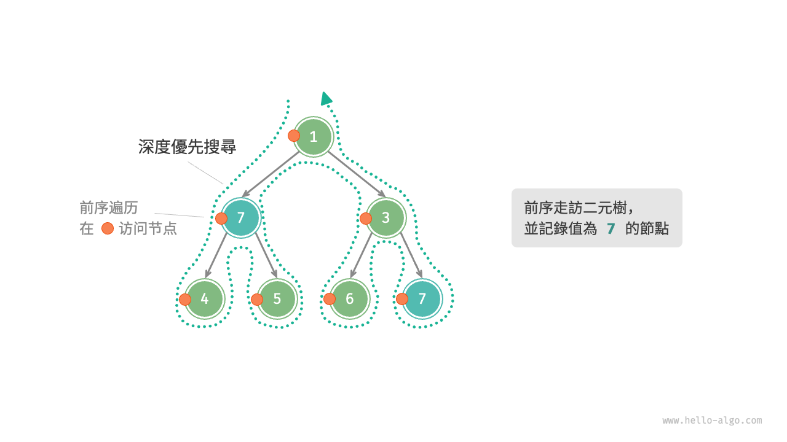{ class="animation-figure" }

<p align="center"> 圖 13-1 &nbsp; 在前序走訪中搜索節點 </p>

## 13.1.1 &nbsp; 嘗試與回退

**之所以稱之為回溯演算法，是因為該演算法在搜尋解空間時會採用“嘗試”與“回退”的策略**。當演算法在搜尋過程中遇到某個狀態無法繼續前進或無法得到滿足條件的解時，它會撤銷上一步的選擇，退回到之前的狀態，並嘗試其他可能的選擇。

對於例題一，訪問每個節點都代表一次“嘗試”，而越過葉節點或返回父節點的 `return` 則表示“回退”。

值得說明的是，**回退並不僅僅包括函式返回**。為解釋這一點，我們對例題一稍作拓展。

!!! question "例題二"

    在二元樹中搜索所有值為 $7$ 的節點，**請返回根節點到這些節點的路徑**。

在例題一程式碼的基礎上，我們需要藉助一個串列 `path` 記錄訪問過的節點路徑。當訪問到值為 $7$ 的節點時，則複製 `path` 並新增進結果串列 `res` 。走訪完成後，`res` 中儲存的就是所有的解。程式碼如下所示：

=== "Python"

    ```python title="preorder_traversal_ii_compact.py"
    def pre_order(root: TreeNode):
        """前序走訪：例題二"""
        if root is None:
            return
        # 嘗試
        path.append(root)
        if root.val == 7:
            # 記錄解
            res.append(list(path))
        pre_order(root.left)
        pre_order(root.right)
        # 回退
        path.pop()
    ```

=== "C++"

    ```cpp title="preorder_traversal_ii_compact.cpp"
    /* 前序走訪：例題二 */
    void preOrder(TreeNode *root) {
        if (root == nullptr) {
            return;
        }
        // 嘗試
        path.push_back(root);
        if (root->val == 7) {
            // 記錄解
            res.push_back(path);
        }
        preOrder(root->left);
        preOrder(root->right);
        // 回退
        path.pop_back();
    }
    ```

=== "Java"

    ```java title="preorder_traversal_ii_compact.java"
    /* 前序走訪：例題二 */
    void preOrder(TreeNode root) {
        if (root == null) {
            return;
        }
        // 嘗試
        path.add(root);
        if (root.val == 7) {
            // 記錄解
            res.add(new ArrayList<>(path));
        }
        preOrder(root.left);
        preOrder(root.right);
        // 回退
        path.remove(path.size() - 1);
    }
    ```

=== "C#"

    ```csharp title="preorder_traversal_ii_compact.cs"
    /* 前序走訪：例題二 */
    void PreOrder(TreeNode? root) {
        if (root == null) {
            return;
        }
        // 嘗試
        path.Add(root);
        if (root.val == 7) {
            // 記錄解
            res.Add(new List<TreeNode>(path));
        }
        PreOrder(root.left);
        PreOrder(root.right);
        // 回退
        path.RemoveAt(path.Count - 1);
    }
    ```

=== "Go"

    ```go title="preorder_traversal_ii_compact.go"
    /* 前序走訪：例題二 */
    func preOrderII(root *TreeNode, res *[][]*TreeNode, path *[]*TreeNode) {
        if root == nil {
            return
        }
        // 嘗試
        *path = append(*path, root)
        if root.Val.(int) == 7 {
            // 記錄解
            *res = append(*res, append([]*TreeNode{}, *path...))
        }
        preOrderII(root.Left, res, path)
        preOrderII(root.Right, res, path)
        // 回退
        *path = (*path)[:len(*path)-1]
    }
    ```

=== "Swift"

    ```swift title="preorder_traversal_ii_compact.swift"
    /* 前序走訪：例題二 */
    func preOrder(root: TreeNode?) {
        guard let root = root else {
            return
        }
        // 嘗試
        path.append(root)
        if root.val == 7 {
            // 記錄解
            res.append(path)
        }
        preOrder(root: root.left)
        preOrder(root: root.right)
        // 回退
        path.removeLast()
    }
    ```

=== "JS"

    ```javascript title="preorder_traversal_ii_compact.js"
    /* 前序走訪：例題二 */
    function preOrder(root, path, res) {
        if (root === null) {
            return;
        }
        // 嘗試
        path.push(root);
        if (root.val === 7) {
            // 記錄解
            res.push([...path]);
        }
        preOrder(root.left, path, res);
        preOrder(root.right, path, res);
        // 回退
        path.pop();
    }
    ```

=== "TS"

    ```typescript title="preorder_traversal_ii_compact.ts"
    /* 前序走訪：例題二 */
    function preOrder(
        root: TreeNode | null,
        path: TreeNode[],
        res: TreeNode[][]
    ): void {
        if (root === null) {
            return;
        }
        // 嘗試
        path.push(root);
        if (root.val === 7) {
            // 記錄解
            res.push([...path]);
        }
        preOrder(root.left, path, res);
        preOrder(root.right, path, res);
        // 回退
        path.pop();
    }
    ```

=== "Dart"

    ```dart title="preorder_traversal_ii_compact.dart"
    /* 前序走訪：例題二 */
    void preOrder(
      TreeNode? root,
      List<TreeNode> path,
      List<List<TreeNode>> res,
    ) {
      if (root == null) {
        return;
      }

      // 嘗試
      path.add(root);
      if (root.val == 7) {
        // 記錄解
        res.add(List.from(path));
      }
      preOrder(root.left, path, res);
      preOrder(root.right, path, res);
      // 回退
      path.removeLast();
    }
    ```

=== "Rust"

    ```rust title="preorder_traversal_ii_compact.rs"
    /* 前序走訪：例題二 */
    fn pre_order(
        res: &mut Vec<Vec<Rc<RefCell<TreeNode>>>>,
        path: &mut Vec<Rc<RefCell<TreeNode>>>,
        root: Option<&Rc<RefCell<TreeNode>>>,
    ) {
        if root.is_none() {
            return;
        }
        if let Some(node) = root {
            // 嘗試
            path.push(node.clone());
            if node.borrow().val == 7 {
                // 記錄解
                res.push(path.clone());
            }
            pre_order(res, path, node.borrow().left.as_ref());
            pre_order(res, path, node.borrow().right.as_ref());
            // 回退
            path.pop();
        }
    }
    ```

=== "C"

    ```c title="preorder_traversal_ii_compact.c"
    /* 前序走訪：例題二 */
    void preOrder(TreeNode *root) {
        if (root == NULL) {
            return;
        }
        // 嘗試
        path[pathSize++] = root;
        if (root->val == 7) {
            // 記錄解
            for (int i = 0; i < pathSize; ++i) {
                res[resSize][i] = path[i];
            }
            resSize++;
        }
        preOrder(root->left);
        preOrder(root->right);
        // 回退
        pathSize--;
    }
    ```

=== "Kotlin"

    ```kotlin title="preorder_traversal_ii_compact.kt"
    /* 前序走訪：例題二 */
    fun preOrder(root: TreeNode?) {
        if (root == null) {
            return
        }
        // 嘗試
        path!!.add(root)
        if (root._val == 7) {
            // 記錄解
            res!!.add(path!!.toMutableList())
        }
        preOrder(root.left)
        preOrder(root.right)
        // 回退
        path!!.removeAt(path!!.size - 1)
    }
    ```

=== "Ruby"

    ```ruby title="preorder_traversal_ii_compact.rb"
    ### 前序走訪：例題二 ###
    def pre_order(root)
      return unless root

      # 嘗試
      $path << root

      # 記錄解
      $res << $path.dup if root.val == 7

      pre_order(root.left)
      pre_order(root.right)

      # 回退
      $path.pop
    end
    ```

=== "Zig"

    ```zig title="preorder_traversal_ii_compact.zig"
    [class]{}-[func]{preOrder}
    ```

??? pythontutor "視覺化執行"

    <div style="height: 549px; width: 100%;"><iframe class="pythontutor-iframe" src="https://pythontutor.com/iframe-embed.html#code=class%20TreeNode%3A%0A%20%20%20%20%22%22%22%E4%BA%8C%E5%85%83%E6%A8%B9%E7%AF%80%E9%BB%9E%E9%A1%9E%E5%88%A5%22%22%22%0A%0A%20%20%20%20def%20__init__%28self%2C%20val%3A%20int%20%3D%200%29%3A%0A%20%20%20%20%20%20%20%20self.val%3A%20int%20%3D%20val%20%20%23%20%E7%AF%80%E9%BB%9E%E5%80%BC%0A%20%20%20%20%20%20%20%20self.left%3A%20TreeNode%20%7C%20None%20%3D%20None%20%20%23%20%E5%B7%A6%E5%AD%90%E7%AF%80%E9%BB%9E%E5%BC%95%E7%94%A8%0A%20%20%20%20%20%20%20%20self.right%3A%20TreeNode%20%7C%20None%20%3D%20None%20%20%23%20%E5%8F%B3%E5%AD%90%E7%AF%80%E9%BB%9E%E5%BC%95%E7%94%A8%0A%0Adef%20list_to_tree_dfs%28arr%3A%20list%5Bint%5D%2C%20i%3A%20int%29%20-%3E%20TreeNode%20%7C%20None%3A%0A%20%20%20%20%22%22%22%E5%B0%87%E4%B8%B2%E5%88%97%E5%8F%8D%E5%BA%8F%E5%88%97%E5%8C%96%E7%82%BA%E4%BA%8C%E5%85%83%E6%A8%B9%EF%BC%9A%E9%81%9E%E8%BF%B4%22%22%22%0A%20%20%20%20%23%20%E5%A6%82%E6%9E%9C%E7%B4%A2%E5%BC%95%E8%B6%85%E5%87%BA%E9%99%A3%E5%88%97%E9%95%B7%E5%BA%A6%EF%BC%8C%E6%88%96%E8%80%85%E5%B0%8D%E6%87%89%E7%9A%84%E5%85%83%E7%B4%A0%E7%82%BA%20None%20%EF%BC%8C%E5%89%87%E8%BF%94%E5%9B%9E%20None%0A%20%20%20%20if%20i%20%3C%200%20or%20i%20%3E%3D%20len%28arr%29%20or%20arr%5Bi%5D%20is%20None%3A%0A%20%20%20%20%20%20%20%20return%20None%0A%20%20%20%20%23%20%E6%A7%8B%E5%BB%BA%E7%95%B6%E5%89%8D%E7%AF%80%E9%BB%9E%0A%20%20%20%20root%20%3D%20TreeNode%28arr%5Bi%5D%29%0A%20%20%20%20%23%20%E9%81%9E%E8%BF%B4%E6%A7%8B%E5%BB%BA%E5%B7%A6%E5%8F%B3%E5%AD%90%E6%A8%B9%0A%20%20%20%20root.left%20%3D%20list_to_tree_dfs%28arr%2C%202%20%2A%20i%20%2B%201%29%0A%20%20%20%20root.right%20%3D%20list_to_tree_dfs%28arr%2C%202%20%2A%20i%20%2B%202%29%0A%20%20%20%20return%20root%0A%0Adef%20list_to_tree%28arr%3A%20list%5Bint%5D%29%20-%3E%20TreeNode%20%7C%20None%3A%0A%20%20%20%20%22%22%22%E5%B0%87%E4%B8%B2%E5%88%97%E5%8F%8D%E5%BA%8F%E5%88%97%E5%8C%96%E7%82%BA%E4%BA%8C%E5%85%83%E6%A8%B9%22%22%22%0A%20%20%20%20return%20list_to_tree_dfs%28arr%2C%200%29%0A%0A%0Adef%20pre_order%28root%3A%20TreeNode%29%3A%0A%20%20%20%20%22%22%22%E5%89%8D%E5%BA%8F%E8%B5%B0%E8%A8%AA%EF%BC%9A%E4%BE%8B%E9%A1%8C%E4%BA%8C%22%22%22%0A%20%20%20%20if%20root%20is%20None%3A%0A%20%20%20%20%20%20%20%20return%0A%20%20%20%20%23%20%E5%98%97%E8%A9%A6%0A%20%20%20%20path.append%28root%29%0A%20%20%20%20if%20root.val%20%3D%3D%207%3A%0A%20%20%20%20%20%20%20%20%23%20%E8%A8%98%E9%8C%84%E8%A7%A3%0A%20%20%20%20%20%20%20%20res.append%28list%28path%29%29%0A%20%20%20%20pre_order%28root.left%29%0A%20%20%20%20pre_order%28root.right%29%0A%20%20%20%20%23%20%E5%9B%9E%E9%80%80%0A%20%20%20%20path.pop%28%29%0A%0A%0A%22%22%22Driver%20Code%22%22%22%0Aif%20__name__%20%3D%3D%20%22__main__%22%3A%0A%20%20%20%20root%20%3D%20list_to_tree%28%5B1%2C%207%2C%203%2C%204%2C%205%2C%206%2C%207%5D%29%0A%0A%20%20%20%20%23%20%E5%89%8D%E5%BA%8F%E8%B5%B0%E8%A8%AA%0A%20%20%20%20path%20%3D%20list%5BTreeNode%5D%28%29%0A%20%20%20%20res%20%3D%20list%5Blist%5BTreeNode%5D%5D%28%29%0A%20%20%20%20pre_order%28root%29%0A%0A%20%20%20%20print%28%22%5Cn%E8%BC%B8%E5%87%BA%E6%89%80%E6%9C%89%E6%A0%B9%E7%AF%80%E9%BB%9E%E5%88%B0%E7%AF%80%E9%BB%9E%207%20%E7%9A%84%E8%B7%AF%E5%BE%91%22%29%0A%20%20%20%20for%20path%20in%20res%3A%0A%20%20%20%20%20%20%20%20print%28%5Bnode.val%20for%20node%20in%20path%5D%29&codeDivHeight=472&codeDivWidth=350&cumulative=false&curInstr=126&heapPrimitives=nevernest&origin=opt-frontend.js&py=311&rawInputLstJSON=%5B%5D&textReferences=false"> </iframe></div>
    <div style="margin-top: 5px;"><a href="https://pythontutor.com/iframe-embed.html#code=class%20TreeNode%3A%0A%20%20%20%20%22%22%22%E4%BA%8C%E5%85%83%E6%A8%B9%E7%AF%80%E9%BB%9E%E9%A1%9E%E5%88%A5%22%22%22%0A%0A%20%20%20%20def%20__init__%28self%2C%20val%3A%20int%20%3D%200%29%3A%0A%20%20%20%20%20%20%20%20self.val%3A%20int%20%3D%20val%20%20%23%20%E7%AF%80%E9%BB%9E%E5%80%BC%0A%20%20%20%20%20%20%20%20self.left%3A%20TreeNode%20%7C%20None%20%3D%20None%20%20%23%20%E5%B7%A6%E5%AD%90%E7%AF%80%E9%BB%9E%E5%BC%95%E7%94%A8%0A%20%20%20%20%20%20%20%20self.right%3A%20TreeNode%20%7C%20None%20%3D%20None%20%20%23%20%E5%8F%B3%E5%AD%90%E7%AF%80%E9%BB%9E%E5%BC%95%E7%94%A8%0A%0Adef%20list_to_tree_dfs%28arr%3A%20list%5Bint%5D%2C%20i%3A%20int%29%20-%3E%20TreeNode%20%7C%20None%3A%0A%20%20%20%20%22%22%22%E5%B0%87%E4%B8%B2%E5%88%97%E5%8F%8D%E5%BA%8F%E5%88%97%E5%8C%96%E7%82%BA%E4%BA%8C%E5%85%83%E6%A8%B9%EF%BC%9A%E9%81%9E%E8%BF%B4%22%22%22%0A%20%20%20%20%23%20%E5%A6%82%E6%9E%9C%E7%B4%A2%E5%BC%95%E8%B6%85%E5%87%BA%E9%99%A3%E5%88%97%E9%95%B7%E5%BA%A6%EF%BC%8C%E6%88%96%E8%80%85%E5%B0%8D%E6%87%89%E7%9A%84%E5%85%83%E7%B4%A0%E7%82%BA%20None%20%EF%BC%8C%E5%89%87%E8%BF%94%E5%9B%9E%20None%0A%20%20%20%20if%20i%20%3C%200%20or%20i%20%3E%3D%20len%28arr%29%20or%20arr%5Bi%5D%20is%20None%3A%0A%20%20%20%20%20%20%20%20return%20None%0A%20%20%20%20%23%20%E6%A7%8B%E5%BB%BA%E7%95%B6%E5%89%8D%E7%AF%80%E9%BB%9E%0A%20%20%20%20root%20%3D%20TreeNode%28arr%5Bi%5D%29%0A%20%20%20%20%23%20%E9%81%9E%E8%BF%B4%E6%A7%8B%E5%BB%BA%E5%B7%A6%E5%8F%B3%E5%AD%90%E6%A8%B9%0A%20%20%20%20root.left%20%3D%20list_to_tree_dfs%28arr%2C%202%20%2A%20i%20%2B%201%29%0A%20%20%20%20root.right%20%3D%20list_to_tree_dfs%28arr%2C%202%20%2A%20i%20%2B%202%29%0A%20%20%20%20return%20root%0A%0Adef%20list_to_tree%28arr%3A%20list%5Bint%5D%29%20-%3E%20TreeNode%20%7C%20None%3A%0A%20%20%20%20%22%22%22%E5%B0%87%E4%B8%B2%E5%88%97%E5%8F%8D%E5%BA%8F%E5%88%97%E5%8C%96%E7%82%BA%E4%BA%8C%E5%85%83%E6%A8%B9%22%22%22%0A%20%20%20%20return%20list_to_tree_dfs%28arr%2C%200%29%0A%0A%0Adef%20pre_order%28root%3A%20TreeNode%29%3A%0A%20%20%20%20%22%22%22%E5%89%8D%E5%BA%8F%E8%B5%B0%E8%A8%AA%EF%BC%9A%E4%BE%8B%E9%A1%8C%E4%BA%8C%22%22%22%0A%20%20%20%20if%20root%20is%20None%3A%0A%20%20%20%20%20%20%20%20return%0A%20%20%20%20%23%20%E5%98%97%E8%A9%A6%0A%20%20%20%20path.append%28root%29%0A%20%20%20%20if%20root.val%20%3D%3D%207%3A%0A%20%20%20%20%20%20%20%20%23%20%E8%A8%98%E9%8C%84%E8%A7%A3%0A%20%20%20%20%20%20%20%20res.append%28list%28path%29%29%0A%20%20%20%20pre_order%28root.left%29%0A%20%20%20%20pre_order%28root.right%29%0A%20%20%20%20%23%20%E5%9B%9E%E9%80%80%0A%20%20%20%20path.pop%28%29%0A%0A%0A%22%22%22Driver%20Code%22%22%22%0Aif%20__name__%20%3D%3D%20%22__main__%22%3A%0A%20%20%20%20root%20%3D%20list_to_tree%28%5B1%2C%207%2C%203%2C%204%2C%205%2C%206%2C%207%5D%29%0A%0A%20%20%20%20%23%20%E5%89%8D%E5%BA%8F%E8%B5%B0%E8%A8%AA%0A%20%20%20%20path%20%3D%20list%5BTreeNode%5D%28%29%0A%20%20%20%20res%20%3D%20list%5Blist%5BTreeNode%5D%5D%28%29%0A%20%20%20%20pre_order%28root%29%0A%0A%20%20%20%20print%28%22%5Cn%E8%BC%B8%E5%87%BA%E6%89%80%E6%9C%89%E6%A0%B9%E7%AF%80%E9%BB%9E%E5%88%B0%E7%AF%80%E9%BB%9E%207%20%E7%9A%84%E8%B7%AF%E5%BE%91%22%29%0A%20%20%20%20for%20path%20in%20res%3A%0A%20%20%20%20%20%20%20%20print%28%5Bnode.val%20for%20node%20in%20path%5D%29&codeDivHeight=800&codeDivWidth=600&cumulative=false&curInstr=126&heapPrimitives=nevernest&origin=opt-frontend.js&py=311&rawInputLstJSON=%5B%5D&textReferences=false" target="_blank" rel="noopener noreferrer">全螢幕觀看 ></a></div>

在每次“嘗試”中，我們透過將當前節點新增進 `path` 來記錄路徑；而在“回退”前，我們需要將該節點從 `path` 中彈出，**以恢復本次嘗試之前的狀態**。

觀察圖 13-2 所示的過程，**我們可以將嘗試和回退理解為“前進”與“撤銷”**，兩個操作互為逆向。

=== "<1>"
    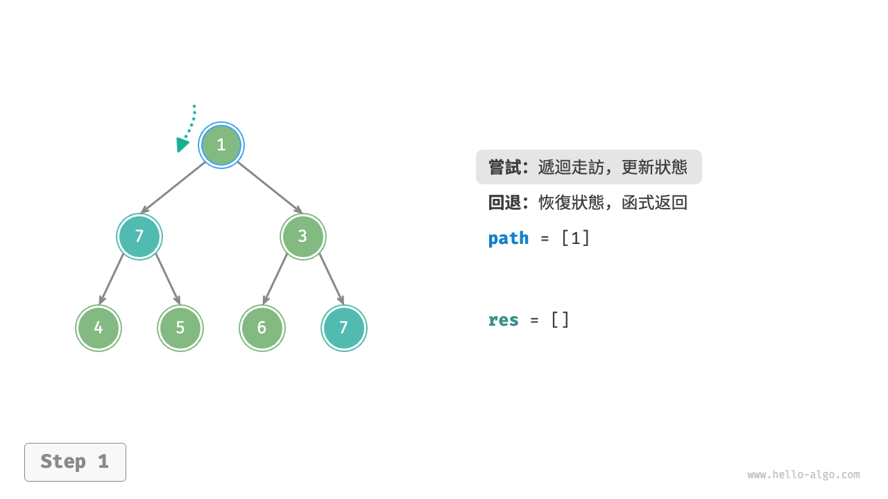{ class="animation-figure" }

=== "<2>"
    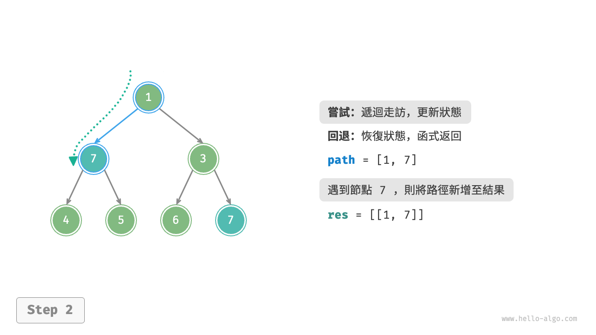{ class="animation-figure" }

=== "<3>"
    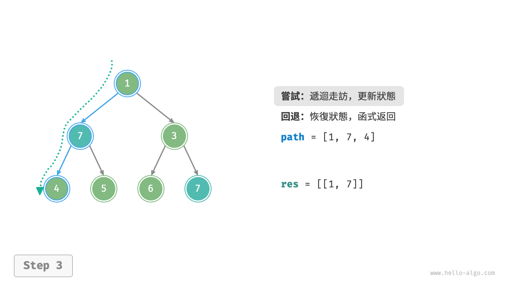{ class="animation-figure" }

=== "<4>"
    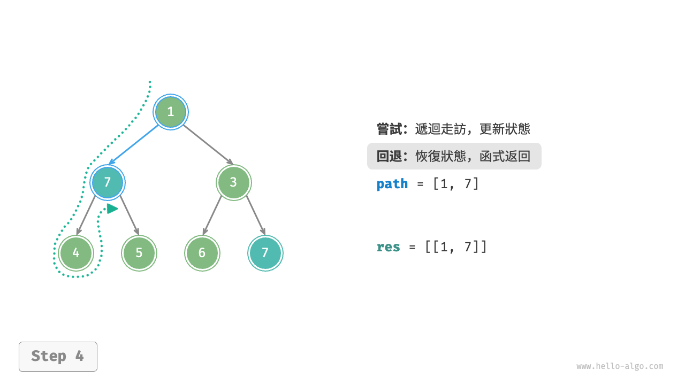{ class="animation-figure" }

=== "<5>"
    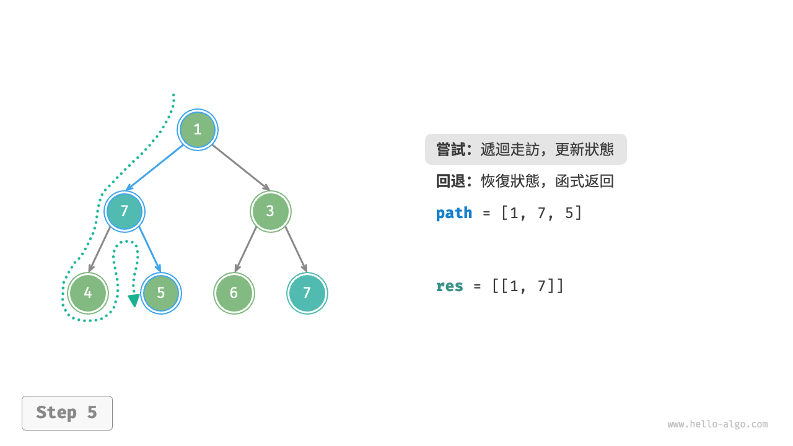{ class="animation-figure" }

=== "<6>"
    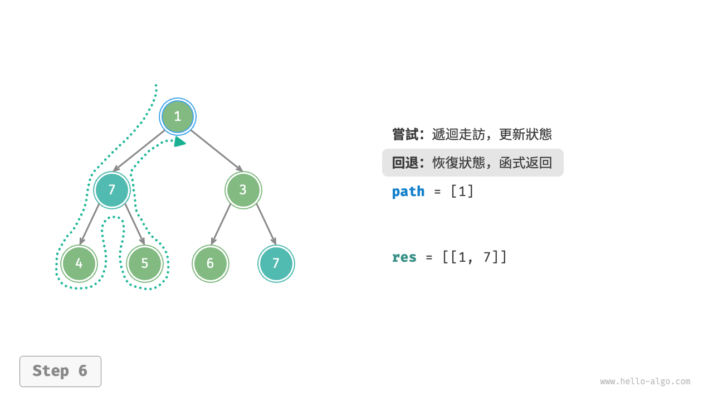{ class="animation-figure" }

=== "<7>"
    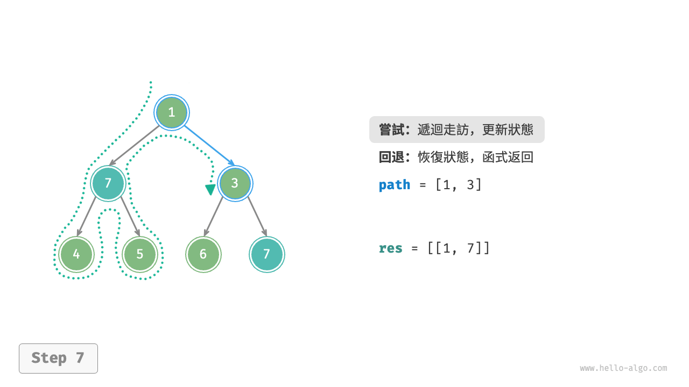{ class="animation-figure" }

=== "<8>"
    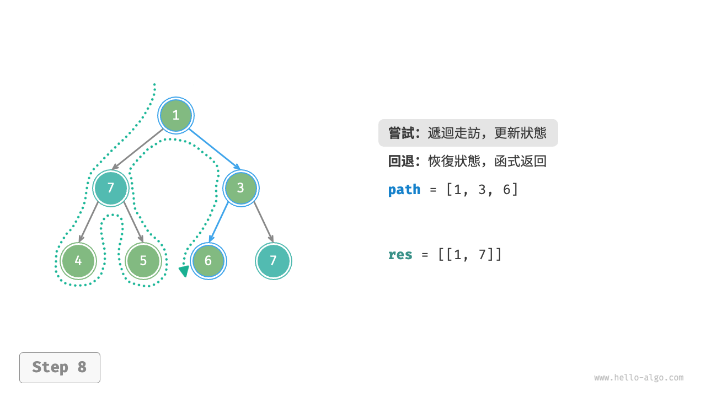{ class="animation-figure" }

=== "<9>"
    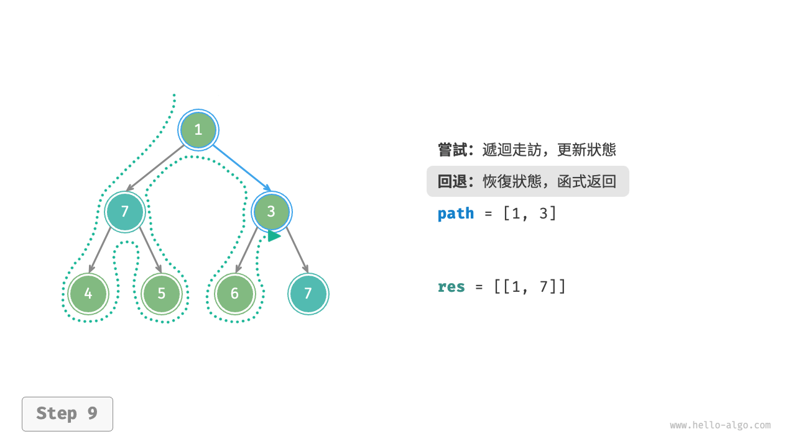{ class="animation-figure" }

=== "<10>"
    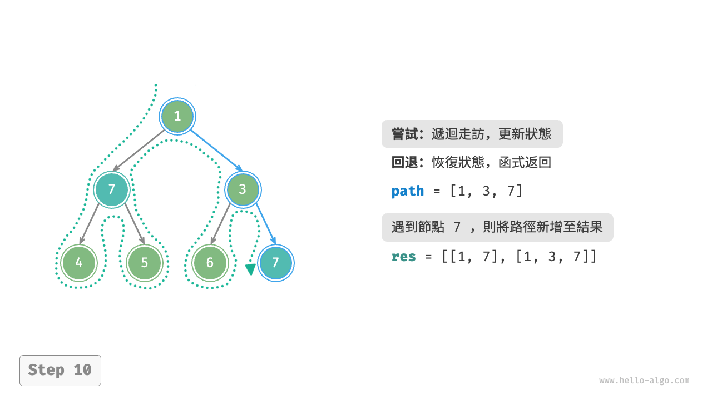{ class="animation-figure" }

=== "<11>"
    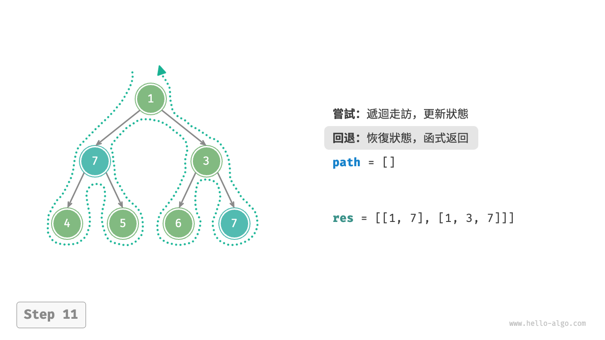{ class="animation-figure" }

<p align="center"> 圖 13-2 &nbsp; 嘗試與回退 </p>

## 13.1.2 &nbsp; 剪枝

複雜的回溯問題通常包含一個或多個約束條件，**約束條件通常可用於“剪枝”**。

!!! question "例題三"

    在二元樹中搜索所有值為 $7$ 的節點，請返回根節點到這些節點的路徑，**並要求路徑中不包含值為 $3$ 的節點**。

為了滿足以上約束條件，**我們需要新增剪枝操作**：在搜尋過程中，若遇到值為 $3$ 的節點，則提前返回，不再繼續搜尋。程式碼如下所示：

=== "Python"

    ```python title="preorder_traversal_iii_compact.py"
    def pre_order(root: TreeNode):
        """前序走訪：例題三"""
        # 剪枝
        if root is None or root.val == 3:
            return
        # 嘗試
        path.append(root)
        if root.val == 7:
            # 記錄解
            res.append(list(path))
        pre_order(root.left)
        pre_order(root.right)
        # 回退
        path.pop()
    ```

=== "C++"

    ```cpp title="preorder_traversal_iii_compact.cpp"
    /* 前序走訪：例題三 */
    void preOrder(TreeNode *root) {
        // 剪枝
        if (root == nullptr || root->val == 3) {
            return;
        }
        // 嘗試
        path.push_back(root);
        if (root->val == 7) {
            // 記錄解
            res.push_back(path);
        }
        preOrder(root->left);
        preOrder(root->right);
        // 回退
        path.pop_back();
    }
    ```

=== "Java"

    ```java title="preorder_traversal_iii_compact.java"
    /* 前序走訪：例題三 */
    void preOrder(TreeNode root) {
        // 剪枝
        if (root == null || root.val == 3) {
            return;
        }
        // 嘗試
        path.add(root);
        if (root.val == 7) {
            // 記錄解
            res.add(new ArrayList<>(path));
        }
        preOrder(root.left);
        preOrder(root.right);
        // 回退
        path.remove(path.size() - 1);
    }
    ```

=== "C#"

    ```csharp title="preorder_traversal_iii_compact.cs"
    /* 前序走訪：例題三 */
    void PreOrder(TreeNode? root) {
        // 剪枝
        if (root == null || root.val == 3) {
            return;
        }
        // 嘗試
        path.Add(root);
        if (root.val == 7) {
            // 記錄解
            res.Add(new List<TreeNode>(path));
        }
        PreOrder(root.left);
        PreOrder(root.right);
        // 回退
        path.RemoveAt(path.Count - 1);
    }
    ```

=== "Go"

    ```go title="preorder_traversal_iii_compact.go"
    /* 前序走訪：例題三 */
    func preOrderIII(root *TreeNode, res *[][]*TreeNode, path *[]*TreeNode) {
        // 剪枝
        if root == nil || root.Val == 3 {
            return
        }
        // 嘗試
        *path = append(*path, root)
        if root.Val.(int) == 7 {
            // 記錄解
            *res = append(*res, append([]*TreeNode{}, *path...))
        }
        preOrderIII(root.Left, res, path)
        preOrderIII(root.Right, res, path)
        // 回退
        *path = (*path)[:len(*path)-1]
    }
    ```

=== "Swift"

    ```swift title="preorder_traversal_iii_compact.swift"
    /* 前序走訪：例題三 */
    func preOrder(root: TreeNode?) {
        // 剪枝
        guard let root = root, root.val != 3 else {
            return
        }
        // 嘗試
        path.append(root)
        if root.val == 7 {
            // 記錄解
            res.append(path)
        }
        preOrder(root: root.left)
        preOrder(root: root.right)
        // 回退
        path.removeLast()
    }
    ```

=== "JS"

    ```javascript title="preorder_traversal_iii_compact.js"
    /* 前序走訪：例題三 */
    function preOrder(root, path, res) {
        // 剪枝
        if (root === null || root.val === 3) {
            return;
        }
        // 嘗試
        path.push(root);
        if (root.val === 7) {
            // 記錄解
            res.push([...path]);
        }
        preOrder(root.left, path, res);
        preOrder(root.right, path, res);
        // 回退
        path.pop();
    }
    ```

=== "TS"

    ```typescript title="preorder_traversal_iii_compact.ts"
    /* 前序走訪：例題三 */
    function preOrder(
        root: TreeNode | null,
        path: TreeNode[],
        res: TreeNode[][]
    ): void {
        // 剪枝
        if (root === null || root.val === 3) {
            return;
        }
        // 嘗試
        path.push(root);
        if (root.val === 7) {
            // 記錄解
            res.push([...path]);
        }
        preOrder(root.left, path, res);
        preOrder(root.right, path, res);
        // 回退
        path.pop();
    }
    ```

=== "Dart"

    ```dart title="preorder_traversal_iii_compact.dart"
    /* 前序走訪：例題三 */
    void preOrder(
      TreeNode? root,
      List<TreeNode> path,
      List<List<TreeNode>> res,
    ) {
      if (root == null || root.val == 3) {
        return;
      }

      // 嘗試
      path.add(root);
      if (root.val == 7) {
        // 記錄解
        res.add(List.from(path));
      }
      preOrder(root.left, path, res);
      preOrder(root.right, path, res);
      // 回退
      path.removeLast();
    }
    ```

=== "Rust"

    ```rust title="preorder_traversal_iii_compact.rs"
    /* 前序走訪：例題三 */
    fn pre_order(
        res: &mut Vec<Vec<Rc<RefCell<TreeNode>>>>,
        path: &mut Vec<Rc<RefCell<TreeNode>>>,
        root: Option<&Rc<RefCell<TreeNode>>>,
    ) {
        // 剪枝
        if root.is_none() || root.as_ref().unwrap().borrow().val == 3 {
            return;
        }
        if let Some(node) = root {
            // 嘗試
            path.push(node.clone());
            if node.borrow().val == 7 {
                // 記錄解
                res.push(path.clone());
            }
            pre_order(res, path, node.borrow().left.as_ref());
            pre_order(res, path, node.borrow().right.as_ref());
            // 回退
            path.pop();
        }
    }
    ```

=== "C"

    ```c title="preorder_traversal_iii_compact.c"
    /* 前序走訪：例題三 */
    void preOrder(TreeNode *root) {
        // 剪枝
        if (root == NULL || root->val == 3) {
            return;
        }
        // 嘗試
        path[pathSize++] = root;
        if (root->val == 7) {
            // 記錄解
            for (int i = 0; i < pathSize; i++) {
                res[resSize][i] = path[i];
            }
            resSize++;
        }
        preOrder(root->left);
        preOrder(root->right);
        // 回退
        pathSize--;
    }
    ```

=== "Kotlin"

    ```kotlin title="preorder_traversal_iii_compact.kt"
    /* 前序走訪：例題三 */
    fun preOrder(root: TreeNode?) {
        // 剪枝
        if (root == null || root._val == 3) {
            return
        }
        // 嘗試
        path!!.add(root)
        if (root._val == 7) {
            // 記錄解
            res!!.add(path!!.toMutableList())
        }
        preOrder(root.left)
        preOrder(root.right)
        // 回退
        path!!.removeAt(path!!.size - 1)
    }
    ```

=== "Ruby"

    ```ruby title="preorder_traversal_iii_compact.rb"
    ### 前序走訪：例題三 ###
    def pre_order(root)
      # 剪枝
      return if !root || root.val == 3

      # 嘗試
      $path.append(root)

      # 記錄解
      $res << $path.dup if root.val == 7

      pre_order(root.left)
      pre_order(root.right)

      # 回退
      $path.pop
    end
    ```

=== "Zig"

    ```zig title="preorder_traversal_iii_compact.zig"
    [class]{}-[func]{preOrder}
    ```

??? pythontutor "視覺化執行"

    <div style="height: 549px; width: 100%;"><iframe class="pythontutor-iframe" src="https://pythontutor.com/iframe-embed.html#code=class%20TreeNode%3A%0A%20%20%20%20%22%22%22%E4%BA%8C%E5%85%83%E6%A8%B9%E7%AF%80%E9%BB%9E%E9%A1%9E%E5%88%A5%22%22%22%0A%0A%20%20%20%20def%20__init__%28self%2C%20val%3A%20int%20%3D%200%29%3A%0A%20%20%20%20%20%20%20%20self.val%3A%20int%20%3D%20val%20%20%23%20%E7%AF%80%E9%BB%9E%E5%80%BC%0A%20%20%20%20%20%20%20%20self.left%3A%20TreeNode%20%7C%20None%20%3D%20None%20%20%23%20%E5%B7%A6%E5%AD%90%E7%AF%80%E9%BB%9E%E5%BC%95%E7%94%A8%0A%20%20%20%20%20%20%20%20self.right%3A%20TreeNode%20%7C%20None%20%3D%20None%20%20%23%20%E5%8F%B3%E5%AD%90%E7%AF%80%E9%BB%9E%E5%BC%95%E7%94%A8%0A%0Adef%20list_to_tree_dfs%28arr%3A%20list%5Bint%5D%2C%20i%3A%20int%29%20-%3E%20TreeNode%20%7C%20None%3A%0A%20%20%20%20%22%22%22%E5%B0%87%E4%B8%B2%E5%88%97%E5%8F%8D%E5%BA%8F%E5%88%97%E5%8C%96%E7%82%BA%E4%BA%8C%E5%85%83%E6%A8%B9%EF%BC%9A%E9%81%9E%E8%BF%B4%22%22%22%0A%20%20%20%20%23%20%E5%A6%82%E6%9E%9C%E7%B4%A2%E5%BC%95%E8%B6%85%E5%87%BA%E9%99%A3%E5%88%97%E9%95%B7%E5%BA%A6%EF%BC%8C%E6%88%96%E8%80%85%E5%B0%8D%E6%87%89%E7%9A%84%E5%85%83%E7%B4%A0%E7%82%BA%20None%20%EF%BC%8C%E5%89%87%E8%BF%94%E5%9B%9E%20None%0A%20%20%20%20if%20i%20%3C%200%20or%20i%20%3E%3D%20len%28arr%29%20or%20arr%5Bi%5D%20is%20None%3A%0A%20%20%20%20%20%20%20%20return%20None%0A%20%20%20%20%23%20%E6%A7%8B%E5%BB%BA%E7%95%B6%E5%89%8D%E7%AF%80%E9%BB%9E%0A%20%20%20%20root%20%3D%20TreeNode%28arr%5Bi%5D%29%0A%20%20%20%20%23%20%E9%81%9E%E8%BF%B4%E6%A7%8B%E5%BB%BA%E5%B7%A6%E5%8F%B3%E5%AD%90%E6%A8%B9%0A%20%20%20%20root.left%20%3D%20list_to_tree_dfs%28arr%2C%202%20%2A%20i%20%2B%201%29%0A%20%20%20%20root.right%20%3D%20list_to_tree_dfs%28arr%2C%202%20%2A%20i%20%2B%202%29%0A%20%20%20%20return%20root%0A%0Adef%20list_to_tree%28arr%3A%20list%5Bint%5D%29%20-%3E%20TreeNode%20%7C%20None%3A%0A%20%20%20%20%22%22%22%E5%B0%87%E4%B8%B2%E5%88%97%E5%8F%8D%E5%BA%8F%E5%88%97%E5%8C%96%E7%82%BA%E4%BA%8C%E5%85%83%E6%A8%B9%22%22%22%0A%20%20%20%20return%20list_to_tree_dfs%28arr%2C%200%29%0A%0A%0Adef%20pre_order%28root%3A%20TreeNode%29%3A%0A%20%20%20%20%22%22%22%E5%89%8D%E5%BA%8F%E8%B5%B0%E8%A8%AA%EF%BC%9A%E4%BE%8B%E9%A1%8C%E4%B8%89%22%22%22%0A%20%20%20%20%23%20%E5%89%AA%E6%9E%9D%0A%20%20%20%20if%20root%20is%20None%20or%20root.val%20%3D%3D%203%3A%0A%20%20%20%20%20%20%20%20return%0A%20%20%20%20%23%20%E5%98%97%E8%A9%A6%0A%20%20%20%20path.append%28root%29%0A%20%20%20%20if%20root.val%20%3D%3D%207%3A%0A%20%20%20%20%20%20%20%20%23%20%E8%A8%98%E9%8C%84%E8%A7%A3%0A%20%20%20%20%20%20%20%20res.append%28list%28path%29%29%0A%20%20%20%20pre_order%28root.left%29%0A%20%20%20%20pre_order%28root.right%29%0A%20%20%20%20%23%20%E5%9B%9E%E9%80%80%0A%20%20%20%20path.pop%28%29%0A%0A%0A%22%22%22Driver%20Code%22%22%22%0Aif%20__name__%20%3D%3D%20%22__main__%22%3A%0A%20%20%20%20root%20%3D%20list_to_tree%28%5B1%2C%207%2C%203%2C%204%2C%205%2C%206%2C%207%5D%29%0A%0A%20%20%20%20%23%20%E5%89%8D%E5%BA%8F%E8%B5%B0%E8%A8%AA%0A%20%20%20%20path%20%3D%20list%5BTreeNode%5D%28%29%0A%20%20%20%20res%20%3D%20list%5Blist%5BTreeNode%5D%5D%28%29%0A%20%20%20%20pre_order%28root%29%0A%0A%20%20%20%20print%28%22%5Cn%E8%BC%B8%E5%87%BA%E6%89%80%E6%9C%89%E6%A0%B9%E7%AF%80%E9%BB%9E%E5%88%B0%E7%AF%80%E9%BB%9E%207%20%E7%9A%84%E8%B7%AF%E5%BE%91%EF%BC%8C%E8%B7%AF%E5%BE%91%E4%B8%AD%E4%B8%8D%E5%8C%85%E5%90%AB%E5%80%BC%E7%82%BA%203%20%E7%9A%84%E7%AF%80%E9%BB%9E%22%29%0A%20%20%20%20for%20path%20in%20res%3A%0A%20%20%20%20%20%20%20%20print%28%5Bnode.val%20for%20node%20in%20path%5D%29&codeDivHeight=472&codeDivWidth=350&cumulative=false&curInstr=126&heapPrimitives=nevernest&origin=opt-frontend.js&py=311&rawInputLstJSON=%5B%5D&textReferences=false"> </iframe></div>
    <div style="margin-top: 5px;"><a href="https://pythontutor.com/iframe-embed.html#code=class%20TreeNode%3A%0A%20%20%20%20%22%22%22%E4%BA%8C%E5%85%83%E6%A8%B9%E7%AF%80%E9%BB%9E%E9%A1%9E%E5%88%A5%22%22%22%0A%0A%20%20%20%20def%20__init__%28self%2C%20val%3A%20int%20%3D%200%29%3A%0A%20%20%20%20%20%20%20%20self.val%3A%20int%20%3D%20val%20%20%23%20%E7%AF%80%E9%BB%9E%E5%80%BC%0A%20%20%20%20%20%20%20%20self.left%3A%20TreeNode%20%7C%20None%20%3D%20None%20%20%23%20%E5%B7%A6%E5%AD%90%E7%AF%80%E9%BB%9E%E5%BC%95%E7%94%A8%0A%20%20%20%20%20%20%20%20self.right%3A%20TreeNode%20%7C%20None%20%3D%20None%20%20%23%20%E5%8F%B3%E5%AD%90%E7%AF%80%E9%BB%9E%E5%BC%95%E7%94%A8%0A%0Adef%20list_to_tree_dfs%28arr%3A%20list%5Bint%5D%2C%20i%3A%20int%29%20-%3E%20TreeNode%20%7C%20None%3A%0A%20%20%20%20%22%22%22%E5%B0%87%E4%B8%B2%E5%88%97%E5%8F%8D%E5%BA%8F%E5%88%97%E5%8C%96%E7%82%BA%E4%BA%8C%E5%85%83%E6%A8%B9%EF%BC%9A%E9%81%9E%E8%BF%B4%22%22%22%0A%20%20%20%20%23%20%E5%A6%82%E6%9E%9C%E7%B4%A2%E5%BC%95%E8%B6%85%E5%87%BA%E9%99%A3%E5%88%97%E9%95%B7%E5%BA%A6%EF%BC%8C%E6%88%96%E8%80%85%E5%B0%8D%E6%87%89%E7%9A%84%E5%85%83%E7%B4%A0%E7%82%BA%20None%20%EF%BC%8C%E5%89%87%E8%BF%94%E5%9B%9E%20None%0A%20%20%20%20if%20i%20%3C%200%20or%20i%20%3E%3D%20len%28arr%29%20or%20arr%5Bi%5D%20is%20None%3A%0A%20%20%20%20%20%20%20%20return%20None%0A%20%20%20%20%23%20%E6%A7%8B%E5%BB%BA%E7%95%B6%E5%89%8D%E7%AF%80%E9%BB%9E%0A%20%20%20%20root%20%3D%20TreeNode%28arr%5Bi%5D%29%0A%20%20%20%20%23%20%E9%81%9E%E8%BF%B4%E6%A7%8B%E5%BB%BA%E5%B7%A6%E5%8F%B3%E5%AD%90%E6%A8%B9%0A%20%20%20%20root.left%20%3D%20list_to_tree_dfs%28arr%2C%202%20%2A%20i%20%2B%201%29%0A%20%20%20%20root.right%20%3D%20list_to_tree_dfs%28arr%2C%202%20%2A%20i%20%2B%202%29%0A%20%20%20%20return%20root%0A%0Adef%20list_to_tree%28arr%3A%20list%5Bint%5D%29%20-%3E%20TreeNode%20%7C%20None%3A%0A%20%20%20%20%22%22%22%E5%B0%87%E4%B8%B2%E5%88%97%E5%8F%8D%E5%BA%8F%E5%88%97%E5%8C%96%E7%82%BA%E4%BA%8C%E5%85%83%E6%A8%B9%22%22%22%0A%20%20%20%20return%20list_to_tree_dfs%28arr%2C%200%29%0A%0A%0Adef%20pre_order%28root%3A%20TreeNode%29%3A%0A%20%20%20%20%22%22%22%E5%89%8D%E5%BA%8F%E8%B5%B0%E8%A8%AA%EF%BC%9A%E4%BE%8B%E9%A1%8C%E4%B8%89%22%22%22%0A%20%20%20%20%23%20%E5%89%AA%E6%9E%9D%0A%20%20%20%20if%20root%20is%20None%20or%20root.val%20%3D%3D%203%3A%0A%20%20%20%20%20%20%20%20return%0A%20%20%20%20%23%20%E5%98%97%E8%A9%A6%0A%20%20%20%20path.append%28root%29%0A%20%20%20%20if%20root.val%20%3D%3D%207%3A%0A%20%20%20%20%20%20%20%20%23%20%E8%A8%98%E9%8C%84%E8%A7%A3%0A%20%20%20%20%20%20%20%20res.append%28list%28path%29%29%0A%20%20%20%20pre_order%28root.left%29%0A%20%20%20%20pre_order%28root.right%29%0A%20%20%20%20%23%20%E5%9B%9E%E9%80%80%0A%20%20%20%20path.pop%28%29%0A%0A%0A%22%22%22Driver%20Code%22%22%22%0Aif%20__name__%20%3D%3D%20%22__main__%22%3A%0A%20%20%20%20root%20%3D%20list_to_tree%28%5B1%2C%207%2C%203%2C%204%2C%205%2C%206%2C%207%5D%29%0A%0A%20%20%20%20%23%20%E5%89%8D%E5%BA%8F%E8%B5%B0%E8%A8%AA%0A%20%20%20%20path%20%3D%20list%5BTreeNode%5D%28%29%0A%20%20%20%20res%20%3D%20list%5Blist%5BTreeNode%5D%5D%28%29%0A%20%20%20%20pre_order%28root%29%0A%0A%20%20%20%20print%28%22%5Cn%E8%BC%B8%E5%87%BA%E6%89%80%E6%9C%89%E6%A0%B9%E7%AF%80%E9%BB%9E%E5%88%B0%E7%AF%80%E9%BB%9E%207%20%E7%9A%84%E8%B7%AF%E5%BE%91%EF%BC%8C%E8%B7%AF%E5%BE%91%E4%B8%AD%E4%B8%8D%E5%8C%85%E5%90%AB%E5%80%BC%E7%82%BA%203%20%E7%9A%84%E7%AF%80%E9%BB%9E%22%29%0A%20%20%20%20for%20path%20in%20res%3A%0A%20%20%20%20%20%20%20%20print%28%5Bnode.val%20for%20node%20in%20path%5D%29&codeDivHeight=800&codeDivWidth=600&cumulative=false&curInstr=126&heapPrimitives=nevernest&origin=opt-frontend.js&py=311&rawInputLstJSON=%5B%5D&textReferences=false" target="_blank" rel="noopener noreferrer">全螢幕觀看 ></a></div>

“剪枝”是一個非常形象的名詞。如圖 13-3 所示，在搜尋過程中，**我們“剪掉”了不滿足約束條件的搜尋分支**，避免許多無意義的嘗試，從而提高了搜尋效率。

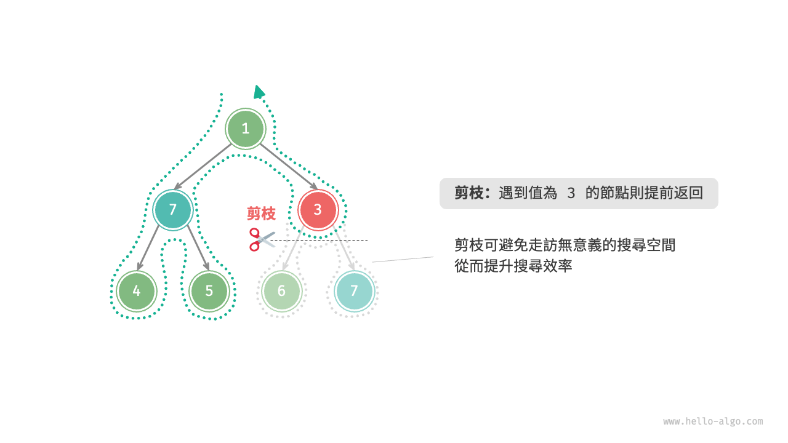{ class="animation-figure" }

<p align="center"> 圖 13-3 &nbsp; 根據約束條件剪枝 </p>

## 13.1.3 &nbsp; 框架程式碼

接下來，我們嘗試將回溯的“嘗試、回退、剪枝”的主體框架提煉出來，提升程式碼的通用性。

在以下框架程式碼中，`state` 表示問題的當前狀態，`choices` 表示當前狀態下可以做出的選擇：

=== "Python"

    ```python title=""
    def backtrack(state: State, choices: list[choice], res: list[state]):
        """回溯演算法框架"""
        # 判斷是否為解
        if is_solution(state):
            # 記錄解
            record_solution(state, res)
            # 不再繼續搜尋
            return
        # 走訪所有選擇
        for choice in choices:
            # 剪枝：判斷選擇是否合法
            if is_valid(state, choice):
                # 嘗試：做出選擇，更新狀態
                make_choice(state, choice)
                backtrack(state, choices, res)
                # 回退：撤銷選擇，恢復到之前的狀態
                undo_choice(state, choice)
    ```

=== "C++"

    ```cpp title=""
    /* 回溯演算法框架 */
    void backtrack(State *state, vector<Choice *> &choices, vector<State *> &res) {
        // 判斷是否為解
        if (isSolution(state)) {
            // 記錄解
            recordSolution(state, res);
            // 不再繼續搜尋
            return;
        }
        // 走訪所有選擇
        for (Choice choice : choices) {
            // 剪枝：判斷選擇是否合法
            if (isValid(state, choice)) {
                // 嘗試：做出選擇，更新狀態
                makeChoice(state, choice);
                backtrack(state, choices, res);
                // 回退：撤銷選擇，恢復到之前的狀態
                undoChoice(state, choice);
            }
        }
    }
    ```

=== "Java"

    ```java title=""
    /* 回溯演算法框架 */
    void backtrack(State state, List<Choice> choices, List<State> res) {
        // 判斷是否為解
        if (isSolution(state)) {
            // 記錄解
            recordSolution(state, res);
            // 不再繼續搜尋
            return;
        }
        // 走訪所有選擇
        for (Choice choice : choices) {
            // 剪枝：判斷選擇是否合法
            if (isValid(state, choice)) {
                // 嘗試：做出選擇，更新狀態
                makeChoice(state, choice);
                backtrack(state, choices, res);
                // 回退：撤銷選擇，恢復到之前的狀態
                undoChoice(state, choice);
            }
        }
    }
    ```

=== "C#"

    ```csharp title=""
    /* 回溯演算法框架 */
    void Backtrack(State state, List<Choice> choices, List<State> res) {
        // 判斷是否為解
        if (IsSolution(state)) {
            // 記錄解
            RecordSolution(state, res);
            // 不再繼續搜尋
            return;
        }
        // 走訪所有選擇
        foreach (Choice choice in choices) {
            // 剪枝：判斷選擇是否合法
            if (IsValid(state, choice)) {
                // 嘗試：做出選擇，更新狀態
                MakeChoice(state, choice);
                Backtrack(state, choices, res);
                // 回退：撤銷選擇，恢復到之前的狀態
                UndoChoice(state, choice);
            }
        }
    }
    ```

=== "Go"

    ```go title=""
    /* 回溯演算法框架 */
    func backtrack(state *State, choices []Choice, res *[]State) {
        // 判斷是否為解
        if isSolution(state) {
            // 記錄解
            recordSolution(state, res)
            // 不再繼續搜尋
            return
        }
        // 走訪所有選擇
        for _, choice := range choices {
            // 剪枝：判斷選擇是否合法
            if isValid(state, choice) {
                // 嘗試：做出選擇，更新狀態
                makeChoice(state, choice)
                backtrack(state, choices, res)
                // 回退：撤銷選擇，恢復到之前的狀態
                undoChoice(state, choice)
            }
        }
    }
    ```

=== "Swift"

    ```swift title=""
    /* 回溯演算法框架 */
    func backtrack(state: inout State, choices: [Choice], res: inout [State]) {
        // 判斷是否為解
        if isSolution(state: state) {
            // 記錄解
            recordSolution(state: state, res: &res)
            // 不再繼續搜尋
            return
        }
        // 走訪所有選擇
        for choice in choices {
            // 剪枝：判斷選擇是否合法
            if isValid(state: state, choice: choice) {
                // 嘗試：做出選擇，更新狀態
                makeChoice(state: &state, choice: choice)
                backtrack(state: &state, choices: choices, res: &res)
                // 回退：撤銷選擇，恢復到之前的狀態
                undoChoice(state: &state, choice: choice)
            }
        }
    }
    ```

=== "JS"

    ```javascript title=""
    /* 回溯演算法框架 */
    function backtrack(state, choices, res) {
        // 判斷是否為解
        if (isSolution(state)) {
            // 記錄解
            recordSolution(state, res);
            // 不再繼續搜尋
            return;
        }
        // 走訪所有選擇
        for (let choice of choices) {
            // 剪枝：判斷選擇是否合法
            if (isValid(state, choice)) {
                // 嘗試：做出選擇，更新狀態
                makeChoice(state, choice);
                backtrack(state, choices, res);
                // 回退：撤銷選擇，恢復到之前的狀態
                undoChoice(state, choice);
            }
        }
    }
    ```

=== "TS"

    ```typescript title=""
    /* 回溯演算法框架 */
    function backtrack(state: State, choices: Choice[], res: State[]): void {
        // 判斷是否為解
        if (isSolution(state)) {
            // 記錄解
            recordSolution(state, res);
            // 不再繼續搜尋
            return;
        }
        // 走訪所有選擇
        for (let choice of choices) {
            // 剪枝：判斷選擇是否合法
            if (isValid(state, choice)) {
                // 嘗試：做出選擇，更新狀態
                makeChoice(state, choice);
                backtrack(state, choices, res);
                // 回退：撤銷選擇，恢復到之前的狀態
                undoChoice(state, choice);
            }
        }
    }
    ```

=== "Dart"

    ```dart title=""
    /* 回溯演算法框架 */
    void backtrack(State state, List<Choice>, List<State> res) {
      // 判斷是否為解
      if (isSolution(state)) {
        // 記錄解
        recordSolution(state, res);
        // 不再繼續搜尋
        return;
      }
      // 走訪所有選擇
      for (Choice choice in choices) {
        // 剪枝：判斷選擇是否合法
        if (isValid(state, choice)) {
          // 嘗試：做出選擇，更新狀態
          makeChoice(state, choice);
          backtrack(state, choices, res);
          // 回退：撤銷選擇，恢復到之前的狀態
          undoChoice(state, choice);
        }
      }
    }
    ```

=== "Rust"

    ```rust title=""
    /* 回溯演算法框架 */
    fn backtrack(state: &mut State, choices: &Vec<Choice>, res: &mut Vec<State>) {
        // 判斷是否為解
        if is_solution(state) {
            // 記錄解
            record_solution(state, res);
            // 不再繼續搜尋
            return;
        }
        // 走訪所有選擇
        for choice in choices {
            // 剪枝：判斷選擇是否合法
            if is_valid(state, choice) {
                // 嘗試：做出選擇，更新狀態
                make_choice(state, choice);
                backtrack(state, choices, res);
                // 回退：撤銷選擇，恢復到之前的狀態
                undo_choice(state, choice);
            }
        }
    }
    ```

=== "C"

    ```c title=""
    /* 回溯演算法框架 */
    void backtrack(State *state, Choice *choices, int numChoices, State *res, int numRes) {
        // 判斷是否為解
        if (isSolution(state)) {
            // 記錄解
            recordSolution(state, res, numRes);
            // 不再繼續搜尋
            return;
        }
        // 走訪所有選擇
        for (int i = 0; i < numChoices; i++) {
            // 剪枝：判斷選擇是否合法
            if (isValid(state, &choices[i])) {
                // 嘗試：做出選擇，更新狀態
                makeChoice(state, &choices[i]);
                backtrack(state, choices, numChoices, res, numRes);
                // 回退：撤銷選擇，恢復到之前的狀態
                undoChoice(state, &choices[i]);
            }
        }
    }
    ```

=== "Kotlin"

    ```kotlin title=""
    /* 回溯演算法框架 */
    fun backtrack(state: State?, choices: List<Choice?>, res: List<State?>?) {
        // 判斷是否為解
        if (isSolution(state)) {
            // 記錄解
            recordSolution(state, res)
            // 不再繼續搜尋
            return
        }
        // 走訪所有選擇
        for (choice in choices) {
            // 剪枝：判斷選擇是否合法
            if (isValid(state, choice)) {
                // 嘗試：做出選擇，更新狀態
                makeChoice(state, choice)
                backtrack(state, choices, res)
                // 回退：撤銷選擇，恢復到之前的狀態
                undoChoice(state, choice)
            }
        }
    }
    ```

=== "Ruby"

    ```ruby title=""
    ### 回溯演算法框架 ###
    def backtrack(state, choices, res)
        # 判斷是否為解
        if is_solution?(state)
            # 記錄解
            record_solution(state, res)
            return
        end

        # 走訪所有選擇
        for choice in choices
            # 剪枝：判斷選擇是否合法
            if is_valid?(state, choice)
                # 嘗試：做出選擇，更新狀態
                make_choice(state, choice)
                backtrack(state, choices, res)
                # 回退：撤銷選擇，恢復到之前的狀態
                undo_choice(state, choice)
            end
        end
    end
    ```

=== "Zig"

    ```zig title=""

    ```

接下來，我們基於框架程式碼來解決例題三。狀態 `state` 為節點走訪路徑，選擇 `choices` 為當前節點的左子節點和右子節點，結果 `res` 是路徑串列：

=== "Python"

    ```python title="preorder_traversal_iii_template.py"
    def is_solution(state: list[TreeNode]) -> bool:
        """判斷當前狀態是否為解"""
        return state and state[-1].val == 7

    def record_solution(state: list[TreeNode], res: list[list[TreeNode]]):
        """記錄解"""
        res.append(list(state))

    def is_valid(state: list[TreeNode], choice: TreeNode) -> bool:
        """判斷在當前狀態下，該選擇是否合法"""
        return choice is not None and choice.val != 3

    def make_choice(state: list[TreeNode], choice: TreeNode):
        """更新狀態"""
        state.append(choice)

    def undo_choice(state: list[TreeNode], choice: TreeNode):
        """恢復狀態"""
        state.pop()

    def backtrack(
        state: list[TreeNode], choices: list[TreeNode], res: list[list[TreeNode]]
    ):
        """回溯演算法：例題三"""
        # 檢查是否為解
        if is_solution(state):
            # 記錄解
            record_solution(state, res)
        # 走訪所有選擇
        for choice in choices:
            # 剪枝：檢查選擇是否合法
            if is_valid(state, choice):
                # 嘗試：做出選擇，更新狀態
                make_choice(state, choice)
                # 進行下一輪選擇
                backtrack(state, [choice.left, choice.right], res)
                # 回退：撤銷選擇，恢復到之前的狀態
                undo_choice(state, choice)
    ```

=== "C++"

    ```cpp title="preorder_traversal_iii_template.cpp"
    /* 判斷當前狀態是否為解 */
    bool isSolution(vector<TreeNode *> &state) {
        return !state.empty() && state.back()->val == 7;
    }

    /* 記錄解 */
    void recordSolution(vector<TreeNode *> &state, vector<vector<TreeNode *>> &res) {
        res.push_back(state);
    }

    /* 判斷在當前狀態下，該選擇是否合法 */
    bool isValid(vector<TreeNode *> &state, TreeNode *choice) {
        return choice != nullptr && choice->val != 3;
    }

    /* 更新狀態 */
    void makeChoice(vector<TreeNode *> &state, TreeNode *choice) {
        state.push_back(choice);
    }

    /* 恢復狀態 */
    void undoChoice(vector<TreeNode *> &state, TreeNode *choice) {
        state.pop_back();
    }

    /* 回溯演算法：例題三 */
    void backtrack(vector<TreeNode *> &state, vector<TreeNode *> &choices, vector<vector<TreeNode *>> &res) {
        // 檢查是否為解
        if (isSolution(state)) {
            // 記錄解
            recordSolution(state, res);
        }
        // 走訪所有選擇
        for (TreeNode *choice : choices) {
            // 剪枝：檢查選擇是否合法
            if (isValid(state, choice)) {
                // 嘗試：做出選擇，更新狀態
                makeChoice(state, choice);
                // 進行下一輪選擇
                vector<TreeNode *> nextChoices{choice->left, choice->right};
                backtrack(state, nextChoices, res);
                // 回退：撤銷選擇，恢復到之前的狀態
                undoChoice(state, choice);
            }
        }
    }
    ```

=== "Java"

    ```java title="preorder_traversal_iii_template.java"
    /* 判斷當前狀態是否為解 */
    boolean isSolution(List<TreeNode> state) {
        return !state.isEmpty() && state.get(state.size() - 1).val == 7;
    }

    /* 記錄解 */
    void recordSolution(List<TreeNode> state, List<List<TreeNode>> res) {
        res.add(new ArrayList<>(state));
    }

    /* 判斷在當前狀態下，該選擇是否合法 */
    boolean isValid(List<TreeNode> state, TreeNode choice) {
        return choice != null && choice.val != 3;
    }

    /* 更新狀態 */
    void makeChoice(List<TreeNode> state, TreeNode choice) {
        state.add(choice);
    }

    /* 恢復狀態 */
    void undoChoice(List<TreeNode> state, TreeNode choice) {
        state.remove(state.size() - 1);
    }

    /* 回溯演算法：例題三 */
    void backtrack(List<TreeNode> state, List<TreeNode> choices, List<List<TreeNode>> res) {
        // 檢查是否為解
        if (isSolution(state)) {
            // 記錄解
            recordSolution(state, res);
        }
        // 走訪所有選擇
        for (TreeNode choice : choices) {
            // 剪枝：檢查選擇是否合法
            if (isValid(state, choice)) {
                // 嘗試：做出選擇，更新狀態
                makeChoice(state, choice);
                // 進行下一輪選擇
                backtrack(state, Arrays.asList(choice.left, choice.right), res);
                // 回退：撤銷選擇，恢復到之前的狀態
                undoChoice(state, choice);
            }
        }
    }
    ```

=== "C#"

    ```csharp title="preorder_traversal_iii_template.cs"
    /* 判斷當前狀態是否為解 */
    bool IsSolution(List<TreeNode> state) {
        return state.Count != 0 && state[^1].val == 7;
    }

    /* 記錄解 */
    void RecordSolution(List<TreeNode> state, List<List<TreeNode>> res) {
        res.Add(new List<TreeNode>(state));
    }

    /* 判斷在當前狀態下，該選擇是否合法 */
    bool IsValid(List<TreeNode> state, TreeNode choice) {
        return choice != null && choice.val != 3;
    }

    /* 更新狀態 */
    void MakeChoice(List<TreeNode> state, TreeNode choice) {
        state.Add(choice);
    }

    /* 恢復狀態 */
    void UndoChoice(List<TreeNode> state, TreeNode choice) {
        state.RemoveAt(state.Count - 1);
    }

    /* 回溯演算法：例題三 */
    void Backtrack(List<TreeNode> state, List<TreeNode> choices, List<List<TreeNode>> res) {
        // 檢查是否為解
        if (IsSolution(state)) {
            // 記錄解
            RecordSolution(state, res);
        }
        // 走訪所有選擇
        foreach (TreeNode choice in choices) {
            // 剪枝：檢查選擇是否合法
            if (IsValid(state, choice)) {
                // 嘗試：做出選擇，更新狀態
                MakeChoice(state, choice);
                // 進行下一輪選擇
                Backtrack(state, [choice.left!, choice.right!], res);
                // 回退：撤銷選擇，恢復到之前的狀態
                UndoChoice(state, choice);
            }
        }
    }
    ```

=== "Go"

    ```go title="preorder_traversal_iii_template.go"
    /* 判斷當前狀態是否為解 */
    func isSolution(state *[]*TreeNode) bool {
        return len(*state) != 0 && (*state)[len(*state)-1].Val == 7
    }

    /* 記錄解 */
    func recordSolution(state *[]*TreeNode, res *[][]*TreeNode) {
        *res = append(*res, append([]*TreeNode{}, *state...))
    }

    /* 判斷在當前狀態下，該選擇是否合法 */
    func isValid(state *[]*TreeNode, choice *TreeNode) bool {
        return choice != nil && choice.Val != 3
    }

    /* 更新狀態 */
    func makeChoice(state *[]*TreeNode, choice *TreeNode) {
        *state = append(*state, choice)
    }

    /* 恢復狀態 */
    func undoChoice(state *[]*TreeNode, choice *TreeNode) {
        *state = (*state)[:len(*state)-1]
    }

    /* 回溯演算法：例題三 */
    func backtrackIII(state *[]*TreeNode, choices *[]*TreeNode, res *[][]*TreeNode) {
        // 檢查是否為解
        if isSolution(state) {
            // 記錄解
            recordSolution(state, res)
        }
        // 走訪所有選擇
        for _, choice := range *choices {
            // 剪枝：檢查選擇是否合法
            if isValid(state, choice) {
                // 嘗試：做出選擇，更新狀態
                makeChoice(state, choice)
                // 進行下一輪選擇
                temp := make([]*TreeNode, 0)
                temp = append(temp, choice.Left, choice.Right)
                backtrackIII(state, &temp, res)
                // 回退：撤銷選擇，恢復到之前的狀態
                undoChoice(state, choice)
            }
        }
    }
    ```

=== "Swift"

    ```swift title="preorder_traversal_iii_template.swift"
    /* 判斷當前狀態是否為解 */
    func isSolution(state: [TreeNode]) -> Bool {
        !state.isEmpty && state.last!.val == 7
    }

    /* 記錄解 */
    func recordSolution(state: [TreeNode], res: inout [[TreeNode]]) {
        res.append(state)
    }

    /* 判斷在當前狀態下，該選擇是否合法 */
    func isValid(state: [TreeNode], choice: TreeNode?) -> Bool {
        choice != nil && choice!.val != 3
    }

    /* 更新狀態 */
    func makeChoice(state: inout [TreeNode], choice: TreeNode) {
        state.append(choice)
    }

    /* 恢復狀態 */
    func undoChoice(state: inout [TreeNode], choice: TreeNode) {
        state.removeLast()
    }

    /* 回溯演算法：例題三 */
    func backtrack(state: inout [TreeNode], choices: [TreeNode], res: inout [[TreeNode]]) {
        // 檢查是否為解
        if isSolution(state: state) {
            recordSolution(state: state, res: &res)
        }
        // 走訪所有選擇
        for choice in choices {
            // 剪枝：檢查選擇是否合法
            if isValid(state: state, choice: choice) {
                // 嘗試：做出選擇，更新狀態
                makeChoice(state: &state, choice: choice)
                // 進行下一輪選擇
                backtrack(state: &state, choices: [choice.left, choice.right].compactMap { $0 }, res: &res)
                // 回退：撤銷選擇，恢復到之前的狀態
                undoChoice(state: &state, choice: choice)
            }
        }
    }
    ```

=== "JS"

    ```javascript title="preorder_traversal_iii_template.js"
    /* 判斷當前狀態是否為解 */
    function isSolution(state) {
        return state && state[state.length - 1]?.val === 7;
    }

    /* 記錄解 */
    function recordSolution(state, res) {
        res.push([...state]);
    }

    /* 判斷在當前狀態下，該選擇是否合法 */
    function isValid(state, choice) {
        return choice !== null && choice.val !== 3;
    }

    /* 更新狀態 */
    function makeChoice(state, choice) {
        state.push(choice);
    }

    /* 恢復狀態 */
    function undoChoice(state) {
        state.pop();
    }

    /* 回溯演算法：例題三 */
    function backtrack(state, choices, res) {
        // 檢查是否為解
        if (isSolution(state)) {
            // 記錄解
            recordSolution(state, res);
        }
        // 走訪所有選擇
        for (const choice of choices) {
            // 剪枝：檢查選擇是否合法
            if (isValid(state, choice)) {
                // 嘗試：做出選擇，更新狀態
                makeChoice(state, choice);
                // 進行下一輪選擇
                backtrack(state, [choice.left, choice.right], res);
                // 回退：撤銷選擇，恢復到之前的狀態
                undoChoice(state);
            }
        }
    }
    ```

=== "TS"

    ```typescript title="preorder_traversal_iii_template.ts"
    /* 判斷當前狀態是否為解 */
    function isSolution(state: TreeNode[]): boolean {
        return state && state[state.length - 1]?.val === 7;
    }

    /* 記錄解 */
    function recordSolution(state: TreeNode[], res: TreeNode[][]): void {
        res.push([...state]);
    }

    /* 判斷在當前狀態下，該選擇是否合法 */
    function isValid(state: TreeNode[], choice: TreeNode): boolean {
        return choice !== null && choice.val !== 3;
    }

    /* 更新狀態 */
    function makeChoice(state: TreeNode[], choice: TreeNode): void {
        state.push(choice);
    }

    /* 恢復狀態 */
    function undoChoice(state: TreeNode[]): void {
        state.pop();
    }

    /* 回溯演算法：例題三 */
    function backtrack(
        state: TreeNode[],
        choices: TreeNode[],
        res: TreeNode[][]
    ): void {
        // 檢查是否為解
        if (isSolution(state)) {
            // 記錄解
            recordSolution(state, res);
        }
        // 走訪所有選擇
        for (const choice of choices) {
            // 剪枝：檢查選擇是否合法
            if (isValid(state, choice)) {
                // 嘗試：做出選擇，更新狀態
                makeChoice(state, choice);
                // 進行下一輪選擇
                backtrack(state, [choice.left, choice.right], res);
                // 回退：撤銷選擇，恢復到之前的狀態
                undoChoice(state);
            }
        }
    }
    ```

=== "Dart"

    ```dart title="preorder_traversal_iii_template.dart"
    /* 判斷當前狀態是否為解 */
    bool isSolution(List<TreeNode> state) {
      return state.isNotEmpty && state.last.val == 7;
    }

    /* 記錄解 */
    void recordSolution(List<TreeNode> state, List<List<TreeNode>> res) {
      res.add(List.from(state));
    }

    /* 判斷在當前狀態下，該選擇是否合法 */
    bool isValid(List<TreeNode> state, TreeNode? choice) {
      return choice != null && choice.val != 3;
    }

    /* 更新狀態 */
    void makeChoice(List<TreeNode> state, TreeNode? choice) {
      state.add(choice!);
    }

    /* 恢復狀態 */
    void undoChoice(List<TreeNode> state, TreeNode? choice) {
      state.removeLast();
    }

    /* 回溯演算法：例題三 */
    void backtrack(
      List<TreeNode> state,
      List<TreeNode?> choices,
      List<List<TreeNode>> res,
    ) {
      // 檢查是否為解
      if (isSolution(state)) {
        // 記錄解
        recordSolution(state, res);
      }
      // 走訪所有選擇
      for (TreeNode? choice in choices) {
        // 剪枝：檢查選擇是否合法
        if (isValid(state, choice)) {
          // 嘗試：做出選擇，更新狀態
          makeChoice(state, choice);
          // 進行下一輪選擇
          backtrack(state, [choice!.left, choice.right], res);
          // 回退：撤銷選擇，恢復到之前的狀態
          undoChoice(state, choice);
        }
      }
    }
    ```

=== "Rust"

    ```rust title="preorder_traversal_iii_template.rs"
    /* 判斷當前狀態是否為解 */
    fn is_solution(state: &mut Vec<Rc<RefCell<TreeNode>>>) -> bool {
        return !state.is_empty() && state.last().unwrap().borrow().val == 7;
    }

    /* 記錄解 */
    fn record_solution(
        state: &mut Vec<Rc<RefCell<TreeNode>>>,
        res: &mut Vec<Vec<Rc<RefCell<TreeNode>>>>,
    ) {
        res.push(state.clone());
    }

    /* 判斷在當前狀態下，該選擇是否合法 */
    fn is_valid(_: &mut Vec<Rc<RefCell<TreeNode>>>, choice: Option<&Rc<RefCell<TreeNode>>>) -> bool {
        return choice.is_some() && choice.unwrap().borrow().val != 3;
    }

    /* 更新狀態 */
    fn make_choice(state: &mut Vec<Rc<RefCell<TreeNode>>>, choice: Rc<RefCell<TreeNode>>) {
        state.push(choice);
    }

    /* 恢復狀態 */
    fn undo_choice(state: &mut Vec<Rc<RefCell<TreeNode>>>, _: Rc<RefCell<TreeNode>>) {
        state.pop();
    }

    /* 回溯演算法：例題三 */
    fn backtrack(
        state: &mut Vec<Rc<RefCell<TreeNode>>>,
        choices: &Vec<Option<&Rc<RefCell<TreeNode>>>>,
        res: &mut Vec<Vec<Rc<RefCell<TreeNode>>>>,
    ) {
        // 檢查是否為解
        if is_solution(state) {
            // 記錄解
            record_solution(state, res);
        }
        // 走訪所有選擇
        for &choice in choices.iter() {
            // 剪枝：檢查選擇是否合法
            if is_valid(state, choice) {
                // 嘗試：做出選擇，更新狀態
                make_choice(state, choice.unwrap().clone());
                // 進行下一輪選擇
                backtrack(
                    state,
                    &vec![
                        choice.unwrap().borrow().left.as_ref(),
                        choice.unwrap().borrow().right.as_ref(),
                    ],
                    res,
                );
                // 回退：撤銷選擇，恢復到之前的狀態
                undo_choice(state, choice.unwrap().clone());
            }
        }
    }
    ```

=== "C"

    ```c title="preorder_traversal_iii_template.c"
    /* 判斷當前狀態是否為解 */
    bool isSolution(void) {
        return pathSize > 0 && path[pathSize - 1]->val == 7;
    }

    /* 記錄解 */
    void recordSolution(void) {
        for (int i = 0; i < pathSize; i++) {
            res[resSize][i] = path[i];
        }
        resSize++;
    }

    /* 判斷在當前狀態下，該選擇是否合法 */
    bool isValid(TreeNode *choice) {
        return choice != NULL && choice->val != 3;
    }

    /* 更新狀態 */
    void makeChoice(TreeNode *choice) {
        path[pathSize++] = choice;
    }

    /* 恢復狀態 */
    void undoChoice(void) {
        pathSize--;
    }

    /* 回溯演算法：例題三 */
    void backtrack(TreeNode *choices[2]) {
        // 檢查是否為解
        if (isSolution()) {
            // 記錄解
            recordSolution();
        }
        // 走訪所有選擇
        for (int i = 0; i < 2; i++) {
            TreeNode *choice = choices[i];
            // 剪枝：檢查選擇是否合法
            if (isValid(choice)) {
                // 嘗試：做出選擇，更新狀態
                makeChoice(choice);
                // 進行下一輪選擇
                TreeNode *nextChoices[2] = {choice->left, choice->right};
                backtrack(nextChoices);
                // 回退：撤銷選擇，恢復到之前的狀態
                undoChoice();
            }
        }
    }
    ```

=== "Kotlin"

    ```kotlin title="preorder_traversal_iii_template.kt"
    /* 判斷當前狀態是否為解 */
    fun isSolution(state: MutableList<TreeNode?>): Boolean {
        return state.isNotEmpty() && state[state.size - 1]?._val == 7
    }

    /* 記錄解 */
    fun recordSolution(state: MutableList<TreeNode?>?, res: MutableList<MutableList<TreeNode?>?>) {
        res.add(state!!.toMutableList())
    }

    /* 判斷在當前狀態下，該選擇是否合法 */
    fun isValid(state: MutableList<TreeNode?>?, choice: TreeNode?): Boolean {
        return choice != null && choice._val != 3
    }

    /* 更新狀態 */
    fun makeChoice(state: MutableList<TreeNode?>, choice: TreeNode?) {
        state.add(choice)
    }

    /* 恢復狀態 */
    fun undoChoice(state: MutableList<TreeNode?>, choice: TreeNode?) {
        state.removeLast()
    }

    /* 回溯演算法：例題三 */
    fun backtrack(
        state: MutableList<TreeNode?>,
        choices: MutableList<TreeNode?>,
        res: MutableList<MutableList<TreeNode?>?>
    ) {
        // 檢查是否為解
        if (isSolution(state)) {
            // 記錄解
            recordSolution(state, res)
        }
        // 走訪所有選擇
        for (choice in choices) {
            // 剪枝：檢查選擇是否合法
            if (isValid(state, choice)) {
                // 嘗試：做出選擇，更新狀態
                makeChoice(state, choice)
                // 進行下一輪選擇
                backtrack(state, mutableListOf(choice!!.left, choice.right), res)
                // 回退：撤銷選擇，恢復到之前的狀態
                undoChoice(state, choice)
            }
        }
    }
    ```

=== "Ruby"

    ```ruby title="preorder_traversal_iii_template.rb"
    ### 判斷當前狀態是否為解 ###
    def is_solution?(state)
      !state.empty? && state.last.val == 7
    end

    ### 記錄解 ###
    def record_solution(state, res)
      res << state.dup
    end

    ### 判斷在當前狀態下，該選擇是否合法 ###
    def is_valid?(state, choice)
      choice && choice.val != 3
    end

    ### 更新狀態 ###
    def make_choice(state, choice)
      state << choice
    end

    ### 恢復狀態 ###
    def undo_choice(state, choice)
      state.pop
    end

    ### 回溯演算法：例題三 ###
    def backtrack(state, choices, res)
      # 檢查是否為解
      record_solution(state, res) if is_solution?(state)

      # 走訪所有選擇
      for choice in choices
        # 剪枝：檢查選擇是否合法
        if is_valid?(state, choice)
          # 嘗試：做出選擇，更新狀態
          make_choice(state, choice)
          # 進行下一輪選擇
          backtrack(state, [choice.left, choice.right], res)
          # 回退：撤銷選擇，恢復到之前的狀態
          undo_choice(state, choice)
        end
      end
    end
    ```

=== "Zig"

    ```zig title="preorder_traversal_iii_template.zig"
    [class]{}-[func]{isSolution}

    [class]{}-[func]{recordSolution}

    [class]{}-[func]{isValid}

    [class]{}-[func]{makeChoice}

    [class]{}-[func]{undoChoice}

    [class]{}-[func]{backtrack}
    ```

??? pythontutor "視覺化執行"

    <div style="height: 549px; width: 100%;"><iframe class="pythontutor-iframe" src="https://pythontutor.com/iframe-embed.html#code=class%20TreeNode%3A%0A%20%20%20%20%22%22%22%E4%BA%8C%E5%85%83%E6%A8%B9%E7%AF%80%E9%BB%9E%E9%A1%9E%E5%88%A5%22%22%22%0A%0A%20%20%20%20def%20__init__%28self%2C%20val%3A%20int%20%3D%200%29%3A%0A%20%20%20%20%20%20%20%20self.val%3A%20int%20%3D%20val%20%20%23%20%E7%AF%80%E9%BB%9E%E5%80%BC%0A%20%20%20%20%20%20%20%20self.left%3A%20TreeNode%20%7C%20None%20%3D%20None%20%20%23%20%E5%B7%A6%E5%AD%90%E7%AF%80%E9%BB%9E%E5%BC%95%E7%94%A8%0A%20%20%20%20%20%20%20%20self.right%3A%20TreeNode%20%7C%20None%20%3D%20None%20%20%23%20%E5%8F%B3%E5%AD%90%E7%AF%80%E9%BB%9E%E5%BC%95%E7%94%A8%0A%0Adef%20list_to_tree_dfs%28arr%3A%20list%5Bint%5D%2C%20i%3A%20int%29%20-%3E%20TreeNode%20%7C%20None%3A%0A%20%20%20%20%22%22%22%E5%B0%87%E4%B8%B2%E5%88%97%E5%8F%8D%E5%BA%8F%E5%88%97%E5%8C%96%E7%82%BA%E4%BA%8C%E5%85%83%E6%A8%B9%EF%BC%9A%E9%81%9E%E8%BF%B4%22%22%22%0A%20%20%20%20%23%20%E5%A6%82%E6%9E%9C%E7%B4%A2%E5%BC%95%E8%B6%85%E5%87%BA%E9%99%A3%E5%88%97%E9%95%B7%E5%BA%A6%EF%BC%8C%E6%88%96%E8%80%85%E5%B0%8D%E6%87%89%E7%9A%84%E5%85%83%E7%B4%A0%E7%82%BA%20None%20%EF%BC%8C%E5%89%87%E8%BF%94%E5%9B%9E%20None%0A%20%20%20%20if%20i%20%3C%200%20or%20i%20%3E%3D%20len%28arr%29%20or%20arr%5Bi%5D%20is%20None%3A%0A%20%20%20%20%20%20%20%20return%20None%0A%20%20%20%20%23%20%E6%A7%8B%E5%BB%BA%E7%95%B6%E5%89%8D%E7%AF%80%E9%BB%9E%0A%20%20%20%20root%20%3D%20TreeNode%28arr%5Bi%5D%29%0A%20%20%20%20%23%20%E9%81%9E%E8%BF%B4%E6%A7%8B%E5%BB%BA%E5%B7%A6%E5%8F%B3%E5%AD%90%E6%A8%B9%0A%20%20%20%20root.left%20%3D%20list_to_tree_dfs%28arr%2C%202%20%2A%20i%20%2B%201%29%0A%20%20%20%20root.right%20%3D%20list_to_tree_dfs%28arr%2C%202%20%2A%20i%20%2B%202%29%0A%20%20%20%20return%20root%0A%0Adef%20list_to_tree%28arr%3A%20list%5Bint%5D%29%20-%3E%20TreeNode%20%7C%20None%3A%0A%20%20%20%20%22%22%22%E5%B0%87%E4%B8%B2%E5%88%97%E5%8F%8D%E5%BA%8F%E5%88%97%E5%8C%96%E7%82%BA%E4%BA%8C%E5%85%83%E6%A8%B9%22%22%22%0A%20%20%20%20return%20list_to_tree_dfs%28arr%2C%200%29%0A%0A%0Adef%20is_solution%28state%3A%20list%5BTreeNode%5D%29%20-%3E%20bool%3A%0A%20%20%20%20%22%22%22%E5%88%A4%E6%96%B7%E7%95%B6%E5%89%8D%E7%8B%80%E6%85%8B%E6%98%AF%E5%90%A6%E7%82%BA%E8%A7%A3%22%22%22%0A%20%20%20%20return%20state%20and%20state%5B-1%5D.val%20%3D%3D%207%0A%0Adef%20record_solution%28state%3A%20list%5BTreeNode%5D%2C%20res%3A%20list%5Blist%5BTreeNode%5D%5D%29%3A%0A%20%20%20%20%22%22%22%E8%A8%98%E9%8C%84%E8%A7%A3%22%22%22%0A%20%20%20%20res.append%28list%28state%29%29%0A%0Adef%20is_valid%28state%3A%20list%5BTreeNode%5D%2C%20choice%3A%20TreeNode%29%20-%3E%20bool%3A%0A%20%20%20%20%22%22%22%E5%88%A4%E6%96%B7%E5%9C%A8%E7%95%B6%E5%89%8D%E7%8B%80%E6%85%8B%E4%B8%8B%EF%BC%8C%E8%A9%B2%E9%81%B8%E6%93%87%E6%98%AF%E5%90%A6%E5%90%88%E6%B3%95%22%22%22%0A%20%20%20%20return%20choice%20is%20not%20None%20and%20choice.val%20%21%3D%203%0A%0Adef%20make_choice%28state%3A%20list%5BTreeNode%5D%2C%20choice%3A%20TreeNode%29%3A%0A%20%20%20%20%22%22%22%E6%9B%B4%E6%96%B0%E7%8B%80%E6%85%8B%22%22%22%0A%20%20%20%20state.append%28choice%29%0A%0Adef%20undo_choice%28state%3A%20list%5BTreeNode%5D%2C%20choice%3A%20TreeNode%29%3A%0A%20%20%20%20%22%22%22%E6%81%A2%E5%BE%A9%E7%8B%80%E6%85%8B%22%22%22%0A%20%20%20%20state.pop%28%29%0A%0Adef%20backtrack%28%0A%20%20%20%20state%3A%20list%5BTreeNode%5D%2C%20choices%3A%20list%5BTreeNode%5D%2C%20res%3A%20list%5Blist%5BTreeNode%5D%5D%0A%29%3A%0A%20%20%20%20%22%22%22%E5%9B%9E%E6%BA%AF%E6%BC%94%E7%AE%97%E6%B3%95%EF%BC%9A%E4%BE%8B%E9%A1%8C%E4%B8%89%22%22%22%0A%20%20%20%20%23%20%E6%AA%A2%E6%9F%A5%E6%98%AF%E5%90%A6%E7%82%BA%E8%A7%A3%0A%20%20%20%20if%20is_solution%28state%29%3A%0A%20%20%20%20%20%20%20%20%23%20%E8%A8%98%E9%8C%84%E8%A7%A3%0A%20%20%20%20%20%20%20%20record_solution%28state%2C%20res%29%0A%20%20%20%20%23%20%E8%B5%B0%E8%A8%AA%E6%89%80%E6%9C%89%E9%81%B8%E6%93%87%0A%20%20%20%20for%20choice%20in%20choices%3A%0A%20%20%20%20%20%20%20%20%23%20%E5%89%AA%E6%9E%9D%EF%BC%9A%E6%AA%A2%E6%9F%A5%E9%81%B8%E6%93%87%E6%98%AF%E5%90%A6%E5%90%88%E6%B3%95%0A%20%20%20%20%20%20%20%20if%20is_valid%28state%2C%20choice%29%3A%0A%20%20%20%20%20%20%20%20%20%20%20%20%23%20%E5%98%97%E8%A9%A6%EF%BC%9A%E5%81%9A%E5%87%BA%E9%81%B8%E6%93%87%EF%BC%8C%E6%9B%B4%E6%96%B0%E7%8B%80%E6%85%8B%0A%20%20%20%20%20%20%20%20%20%20%20%20make_choice%28state%2C%20choice%29%0A%20%20%20%20%20%20%20%20%20%20%20%20%23%20%E9%80%B2%E8%A1%8C%E4%B8%8B%E4%B8%80%E8%BC%AA%E9%81%B8%E6%93%87%0A%20%20%20%20%20%20%20%20%20%20%20%20backtrack%28state%2C%20%5Bchoice.left%2C%20choice.right%5D%2C%20res%29%0A%20%20%20%20%20%20%20%20%20%20%20%20%23%20%E5%9B%9E%E9%80%80%EF%BC%9A%E6%92%A4%E9%8A%B7%E9%81%B8%E6%93%87%EF%BC%8C%E6%81%A2%E5%BE%A9%E5%88%B0%E4%B9%8B%E5%89%8D%E7%9A%84%E7%8B%80%E6%85%8B%0A%20%20%20%20%20%20%20%20%20%20%20%20undo_choice%28state%2C%20choice%29%0A%0A%22%22%22Driver%20Code%22%22%22%0Aif%20__name__%20%3D%3D%20%22__main__%22%3A%0A%20%20%20%20root%20%3D%20list_to_tree%28%5B1%2C%207%2C%203%2C%204%2C%205%2C%206%2C%207%5D%29%0A%0A%20%20%20%20%23%20%E5%9B%9E%E6%BA%AF%E6%BC%94%E7%AE%97%E6%B3%95%0A%20%20%20%20res%20%3D%20%5B%5D%0A%20%20%20%20backtrack%28state%3D%5B%5D%2C%20choices%3D%5Broot%5D%2C%20res%3Dres%29%0A%20%20%20%20print%28%22%5Cn%E8%BC%B8%E5%87%BA%E6%89%80%E6%9C%89%E8%B7%AF%E5%BE%91%22%29%0A%20%20%20%20for%20path%20in%20res%3A%0A%20%20%20%20%20%20%20%20print%28%5Bnode.val%20for%20node%20in%20path%5D%29&codeDivHeight=472&codeDivWidth=350&cumulative=false&curInstr=138&heapPrimitives=nevernest&origin=opt-frontend.js&py=311&rawInputLstJSON=%5B%5D&textReferences=false"> </iframe></div>
    <div style="margin-top: 5px;"><a href="https://pythontutor.com/iframe-embed.html#code=class%20TreeNode%3A%0A%20%20%20%20%22%22%22%E4%BA%8C%E5%85%83%E6%A8%B9%E7%AF%80%E9%BB%9E%E9%A1%9E%E5%88%A5%22%22%22%0A%0A%20%20%20%20def%20__init__%28self%2C%20val%3A%20int%20%3D%200%29%3A%0A%20%20%20%20%20%20%20%20self.val%3A%20int%20%3D%20val%20%20%23%20%E7%AF%80%E9%BB%9E%E5%80%BC%0A%20%20%20%20%20%20%20%20self.left%3A%20TreeNode%20%7C%20None%20%3D%20None%20%20%23%20%E5%B7%A6%E5%AD%90%E7%AF%80%E9%BB%9E%E5%BC%95%E7%94%A8%0A%20%20%20%20%20%20%20%20self.right%3A%20TreeNode%20%7C%20None%20%3D%20None%20%20%23%20%E5%8F%B3%E5%AD%90%E7%AF%80%E9%BB%9E%E5%BC%95%E7%94%A8%0A%0Adef%20list_to_tree_dfs%28arr%3A%20list%5Bint%5D%2C%20i%3A%20int%29%20-%3E%20TreeNode%20%7C%20None%3A%0A%20%20%20%20%22%22%22%E5%B0%87%E4%B8%B2%E5%88%97%E5%8F%8D%E5%BA%8F%E5%88%97%E5%8C%96%E7%82%BA%E4%BA%8C%E5%85%83%E6%A8%B9%EF%BC%9A%E9%81%9E%E8%BF%B4%22%22%22%0A%20%20%20%20%23%20%E5%A6%82%E6%9E%9C%E7%B4%A2%E5%BC%95%E8%B6%85%E5%87%BA%E9%99%A3%E5%88%97%E9%95%B7%E5%BA%A6%EF%BC%8C%E6%88%96%E8%80%85%E5%B0%8D%E6%87%89%E7%9A%84%E5%85%83%E7%B4%A0%E7%82%BA%20None%20%EF%BC%8C%E5%89%87%E8%BF%94%E5%9B%9E%20None%0A%20%20%20%20if%20i%20%3C%200%20or%20i%20%3E%3D%20len%28arr%29%20or%20arr%5Bi%5D%20is%20None%3A%0A%20%20%20%20%20%20%20%20return%20None%0A%20%20%20%20%23%20%E6%A7%8B%E5%BB%BA%E7%95%B6%E5%89%8D%E7%AF%80%E9%BB%9E%0A%20%20%20%20root%20%3D%20TreeNode%28arr%5Bi%5D%29%0A%20%20%20%20%23%20%E9%81%9E%E8%BF%B4%E6%A7%8B%E5%BB%BA%E5%B7%A6%E5%8F%B3%E5%AD%90%E6%A8%B9%0A%20%20%20%20root.left%20%3D%20list_to_tree_dfs%28arr%2C%202%20%2A%20i%20%2B%201%29%0A%20%20%20%20root.right%20%3D%20list_to_tree_dfs%28arr%2C%202%20%2A%20i%20%2B%202%29%0A%20%20%20%20return%20root%0A%0Adef%20list_to_tree%28arr%3A%20list%5Bint%5D%29%20-%3E%20TreeNode%20%7C%20None%3A%0A%20%20%20%20%22%22%22%E5%B0%87%E4%B8%B2%E5%88%97%E5%8F%8D%E5%BA%8F%E5%88%97%E5%8C%96%E7%82%BA%E4%BA%8C%E5%85%83%E6%A8%B9%22%22%22%0A%20%20%20%20return%20list_to_tree_dfs%28arr%2C%200%29%0A%0A%0Adef%20is_solution%28state%3A%20list%5BTreeNode%5D%29%20-%3E%20bool%3A%0A%20%20%20%20%22%22%22%E5%88%A4%E6%96%B7%E7%95%B6%E5%89%8D%E7%8B%80%E6%85%8B%E6%98%AF%E5%90%A6%E7%82%BA%E8%A7%A3%22%22%22%0A%20%20%20%20return%20state%20and%20state%5B-1%5D.val%20%3D%3D%207%0A%0Adef%20record_solution%28state%3A%20list%5BTreeNode%5D%2C%20res%3A%20list%5Blist%5BTreeNode%5D%5D%29%3A%0A%20%20%20%20%22%22%22%E8%A8%98%E9%8C%84%E8%A7%A3%22%22%22%0A%20%20%20%20res.append%28list%28state%29%29%0A%0Adef%20is_valid%28state%3A%20list%5BTreeNode%5D%2C%20choice%3A%20TreeNode%29%20-%3E%20bool%3A%0A%20%20%20%20%22%22%22%E5%88%A4%E6%96%B7%E5%9C%A8%E7%95%B6%E5%89%8D%E7%8B%80%E6%85%8B%E4%B8%8B%EF%BC%8C%E8%A9%B2%E9%81%B8%E6%93%87%E6%98%AF%E5%90%A6%E5%90%88%E6%B3%95%22%22%22%0A%20%20%20%20return%20choice%20is%20not%20None%20and%20choice.val%20%21%3D%203%0A%0Adef%20make_choice%28state%3A%20list%5BTreeNode%5D%2C%20choice%3A%20TreeNode%29%3A%0A%20%20%20%20%22%22%22%E6%9B%B4%E6%96%B0%E7%8B%80%E6%85%8B%22%22%22%0A%20%20%20%20state.append%28choice%29%0A%0Adef%20undo_choice%28state%3A%20list%5BTreeNode%5D%2C%20choice%3A%20TreeNode%29%3A%0A%20%20%20%20%22%22%22%E6%81%A2%E5%BE%A9%E7%8B%80%E6%85%8B%22%22%22%0A%20%20%20%20state.pop%28%29%0A%0Adef%20backtrack%28%0A%20%20%20%20state%3A%20list%5BTreeNode%5D%2C%20choices%3A%20list%5BTreeNode%5D%2C%20res%3A%20list%5Blist%5BTreeNode%5D%5D%0A%29%3A%0A%20%20%20%20%22%22%22%E5%9B%9E%E6%BA%AF%E6%BC%94%E7%AE%97%E6%B3%95%EF%BC%9A%E4%BE%8B%E9%A1%8C%E4%B8%89%22%22%22%0A%20%20%20%20%23%20%E6%AA%A2%E6%9F%A5%E6%98%AF%E5%90%A6%E7%82%BA%E8%A7%A3%0A%20%20%20%20if%20is_solution%28state%29%3A%0A%20%20%20%20%20%20%20%20%23%20%E8%A8%98%E9%8C%84%E8%A7%A3%0A%20%20%20%20%20%20%20%20record_solution%28state%2C%20res%29%0A%20%20%20%20%23%20%E8%B5%B0%E8%A8%AA%E6%89%80%E6%9C%89%E9%81%B8%E6%93%87%0A%20%20%20%20for%20choice%20in%20choices%3A%0A%20%20%20%20%20%20%20%20%23%20%E5%89%AA%E6%9E%9D%EF%BC%9A%E6%AA%A2%E6%9F%A5%E9%81%B8%E6%93%87%E6%98%AF%E5%90%A6%E5%90%88%E6%B3%95%0A%20%20%20%20%20%20%20%20if%20is_valid%28state%2C%20choice%29%3A%0A%20%20%20%20%20%20%20%20%20%20%20%20%23%20%E5%98%97%E8%A9%A6%EF%BC%9A%E5%81%9A%E5%87%BA%E9%81%B8%E6%93%87%EF%BC%8C%E6%9B%B4%E6%96%B0%E7%8B%80%E6%85%8B%0A%20%20%20%20%20%20%20%20%20%20%20%20make_choice%28state%2C%20choice%29%0A%20%20%20%20%20%20%20%20%20%20%20%20%23%20%E9%80%B2%E8%A1%8C%E4%B8%8B%E4%B8%80%E8%BC%AA%E9%81%B8%E6%93%87%0A%20%20%20%20%20%20%20%20%20%20%20%20backtrack%28state%2C%20%5Bchoice.left%2C%20choice.right%5D%2C%20res%29%0A%20%20%20%20%20%20%20%20%20%20%20%20%23%20%E5%9B%9E%E9%80%80%EF%BC%9A%E6%92%A4%E9%8A%B7%E9%81%B8%E6%93%87%EF%BC%8C%E6%81%A2%E5%BE%A9%E5%88%B0%E4%B9%8B%E5%89%8D%E7%9A%84%E7%8B%80%E6%85%8B%0A%20%20%20%20%20%20%20%20%20%20%20%20undo_choice%28state%2C%20choice%29%0A%0A%22%22%22Driver%20Code%22%22%22%0Aif%20__name__%20%3D%3D%20%22__main__%22%3A%0A%20%20%20%20root%20%3D%20list_to_tree%28%5B1%2C%207%2C%203%2C%204%2C%205%2C%206%2C%207%5D%29%0A%0A%20%20%20%20%23%20%E5%9B%9E%E6%BA%AF%E6%BC%94%E7%AE%97%E6%B3%95%0A%20%20%20%20res%20%3D%20%5B%5D%0A%20%20%20%20backtrack%28state%3D%5B%5D%2C%20choices%3D%5Broot%5D%2C%20res%3Dres%29%0A%20%20%20%20print%28%22%5Cn%E8%BC%B8%E5%87%BA%E6%89%80%E6%9C%89%E8%B7%AF%E5%BE%91%22%29%0A%20%20%20%20for%20path%20in%20res%3A%0A%20%20%20%20%20%20%20%20print%28%5Bnode.val%20for%20node%20in%20path%5D%29&codeDivHeight=800&codeDivWidth=600&cumulative=false&curInstr=138&heapPrimitives=nevernest&origin=opt-frontend.js&py=311&rawInputLstJSON=%5B%5D&textReferences=false" target="_blank" rel="noopener noreferrer">全螢幕觀看 ></a></div>

根據題意，我們在找到值為 $7$ 的節點後應該繼續搜尋，**因此需要將記錄解之後的 `return` 語句刪除**。圖 13-4 對比了保留或刪除 `return` 語句的搜尋過程。

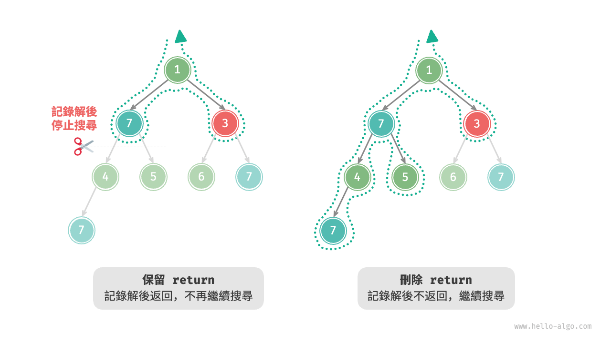{ class="animation-figure" }

<p align="center"> 圖 13-4 &nbsp; 保留與刪除 return 的搜尋過程對比 </p>

相比基於前序走訪的程式碼實現，基於回溯演算法框架的程式碼實現雖然顯得囉唆，但通用性更好。實際上，**許多回溯問題可以在該框架下解決**。我們只需根據具體問題來定義 `state` 和 `choices` ，並實現框架中的各個方法即可。

## 13.1.4 &nbsp; 常用術語

為了更清晰地分析演算法問題，我們總結一下回溯演算法中常用術語的含義，並對照例題三給出對應示例，如表 13-1 所示。

<p align="center"> 表 13-1 &nbsp; 常見的回溯演算法術語 </p>

<div class="center-table" markdown>

| 名詞                   | 定義                                                                       | 例題三                                                               |
| ---------------------- | -------------------------------------------------------------------------- | -------------------------------------------------------------------- |
| 解（solution）         | 解是滿足問題特定條件的答案，可能有一個或多個                               | 根節點到節點 $7$ 的滿足約束條件的所有路徑                            |
| 約束條件（constraint） | 約束條件是問題中限制解的可行性的條件，通常用於剪枝                         | 路徑中不包含節點 $3$                                                 |
| 狀態（state）          | 狀態表示問題在某一時刻的情況，包括已經做出的選擇                           | 當前已訪問的節點路徑，即 `path` 節點串列                             |
| 嘗試（attempt）        | 嘗試是根據可用選擇來探索解空間的過程，包括做出選擇，更新狀態，檢查是否為解 | 遞迴訪問左（右）子節點，將節點新增進 `path` ，判斷節點的值是否為 $7$ |
| 回退（backtracking）   | 回退指遇到不滿足約束條件的狀態時，撤銷前面做出的選擇，回到上一個狀態       | 當越過葉節點、結束節點訪問、遇到值為 $3$ 的節點時終止搜尋，函式返回  |
| 剪枝（pruning）        | 剪枝是根據問題特性和約束條件避免無意義的搜尋路徑的方法，可提高搜尋效率     | 當遇到值為 $3$ 的節點時，則不再繼續搜尋                              |

</div>

!!! tip

    問題、解、狀態等概念是通用的，在分治、回溯、動態規劃、貪婪等演算法中都有涉及。

## 13.1.5 &nbsp; 優點與侷限性

回溯演算法本質上是一種深度優先搜尋演算法，它嘗試所有可能的解決方案直到找到滿足條件的解。這種方法的優點在於能夠找到所有可能的解決方案，而且在合理的剪枝操作下，具有很高的效率。

然而，在處理大規模或者複雜問題時，**回溯演算法的執行效率可能難以接受**。

- **時間**：回溯演算法通常需要走訪狀態空間的所有可能，時間複雜度可以達到指數階或階乘階。
- **空間**：在遞迴呼叫中需要儲存當前的狀態（例如路徑、用於剪枝的輔助變數等），當深度很大時，空間需求可能會變得很大。

即便如此，**回溯演算法仍然是某些搜尋問題和約束滿足問題的最佳解決方案**。對於這些問題，由於無法預測哪些選擇可生成有效的解，因此我們必須對所有可能的選擇進行走訪。在這種情況下，**關鍵是如何最佳化效率**，常見的效率最佳化方法有兩種。

- **剪枝**：避免搜尋那些肯定不會產生解的路徑，從而節省時間和空間。
- **啟發式搜尋**：在搜尋過程中引入一些策略或者估計值，從而優先搜尋最有可能產生有效解的路徑。

## 13.1.6 &nbsp; 回溯典型例題

回溯演算法可用於解決許多搜尋問題、約束滿足問題和組合最佳化問題。

**搜尋問題**：這類問題的目標是找到滿足特定條件的解決方案。

- 全排列問題：給定一個集合，求出其所有可能的排列組合。
- 子集和問題：給定一個集合和一個目標和，找到集合中所有和為目標和的子集。
- 河內塔問題：給定三根柱子和一系列大小不同的圓盤，要求將所有圓盤從一根柱子移動到另一根柱子，每次只能移動一個圓盤，且不能將大圓盤放在小圓盤上。

**約束滿足問題**：這類問題的目標是找到滿足所有約束條件的解。

- $n$ 皇后：在 $n \times n$ 的棋盤上放置 $n$ 個皇后，使得它們互不攻擊。
- 數獨：在 $9 \times 9$ 的網格中填入數字 $1$ ~ $9$ ，使得每行、每列和每個 $3 \times 3$ 子網格中的數字不重複。
- 圖著色問題：給定一個無向圖，用最少的顏色給圖的每個頂點著色，使得相鄰頂點顏色不同。

**組合最佳化問題**：這類問題的目標是在一個組合空間中找到滿足某些條件的最優解。

- 0-1 背包問題：給定一組物品和一個背包，每個物品有一定的價值和重量，要求在背包容量限制內，選擇物品使得總價值最大。
- 旅行商問題：在一個圖中，從一個點出發，訪問所有其他點恰好一次後返回起點，求最短路徑。
- 最大團問題：給定一個無向圖，找到最大的完全子圖，即子圖中的任意兩個頂點之間都有邊相連。

請注意，對於許多組合最佳化問題，回溯不是最優解決方案。

- 0-1 背包問題通常使用動態規劃解決，以達到更高的時間效率。
- 旅行商是一個著名的 NP-Hard 問題，常用解法有遺傳演算法和蟻群演算法等。
- 最大團問題是圖論中的一個經典問題，可用貪婪演算法等啟發式演算法來解決。
