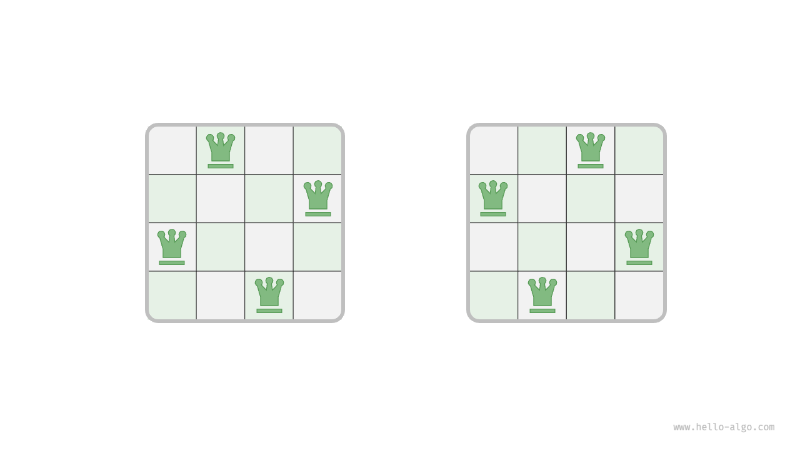
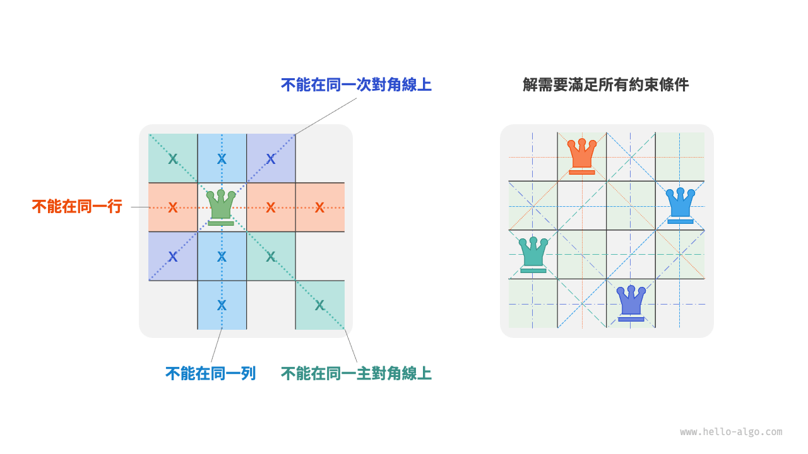
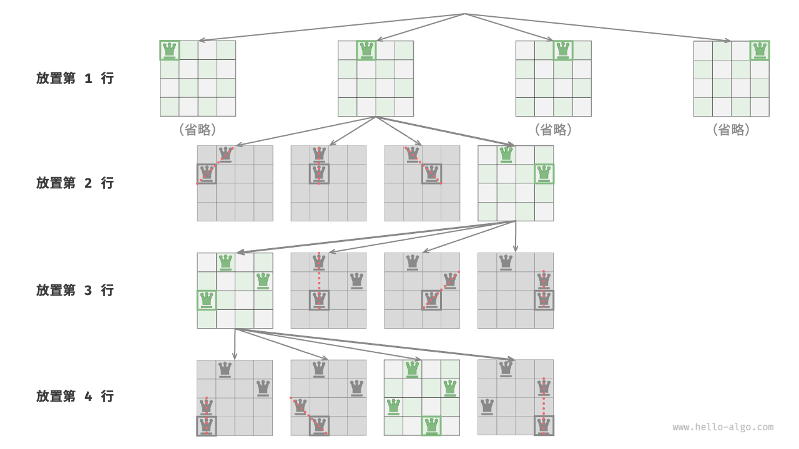
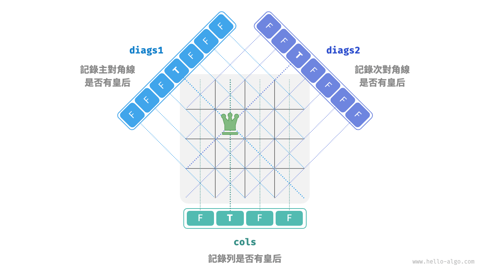

# 13.4 &nbsp; n 皇后問題

!!! question

    根據國際象棋的規則，皇后可以攻擊與同處一行、一列或一條斜線上的棋子。給定 $n$ 個皇后和一個 $n \times n$ 大小的棋盤，尋找使得所有皇后之間無法相互攻擊的擺放方案。

如圖 13-15 所示，當 $n = 4$ 時，共可以找到兩個解。從回溯演算法的角度看，$n \times n$ 大小的棋盤共有 $n^2$ 個格子，給出了所有的選擇 `choices` 。在逐個放置皇后的過程中，棋盤狀態在不斷地變化，每個時刻的棋盤就是狀態 `state` 。

{ class="animation-figure" }

<p align="center"> 圖 13-15 &nbsp; 4 皇后問題的解 </p>

圖 13-16 展示了本題的三個約束條件：**多個皇后不能在同一行、同一列、同一條對角線上**。值得注意的是，對角線分為主對角線 `\` 和次對角線 `/` 兩種。

{ class="animation-figure" }

<p align="center"> 圖 13-16 &nbsp; n 皇后問題的約束條件 </p>

### 1. &nbsp; 逐行放置策略

皇后的數量和棋盤的行數都為 $n$ ，因此我們容易得到一個推論：**棋盤每行都允許且只允許放置一個皇后**。

也就是說，我們可以採取逐行放置策略：從第一行開始，在每行放置一個皇后，直至最後一行結束。

圖 13-17 所示為 4 皇后問題的逐行放置過程。受畫幅限制，圖 13-17 僅展開了第一行的其中一個搜尋分支，並且將不滿足列約束和對角線約束的方案都進行了剪枝。

{ class="animation-figure" }

<p align="center"> 圖 13-17 &nbsp; 逐行放置策略 </p>

從本質上看，**逐行放置策略起到了剪枝的作用**，它避免了同一行出現多個皇后的所有搜尋分支。

### 2. &nbsp; 列與對角線剪枝

為了滿足列約束，我們可以利用一個長度為 $n$ 的布林型陣列 `cols` 記錄每一列是否有皇后。在每次決定放置前，我們透過 `cols` 將已有皇后的列進行剪枝，並在回溯中動態更新 `cols` 的狀態。

那麼，如何處理對角線約束呢？設棋盤中某個格子的行列索引為 $(row, col)$ ，選定矩陣中的某條主對角線，我們發現該對角線上所有格子的行索引減列索引都相等，**即對角線上所有格子的 $row - col$ 為恆定值**。

也就是說，如果兩個格子滿足 $row_1 - col_1 = row_2 - col_2$ ，則它們一定處在同一條主對角線上。利用該規律，我們可以藉助圖 13-18 所示的陣列 `diags1` 記錄每條主對角線上是否有皇后。

同理，**次對角線上的所有格子的 $row + col$ 是恆定值**。我們同樣也可以藉助陣列 `diags2` 來處理次對角線約束。

{ class="animation-figure" }

<p align="center"> 圖 13-18 &nbsp; 處理列約束和對角線約束 </p>

### 3. &nbsp; 程式碼實現

請注意，$n$ 維方陣中 $row - col$ 的範圍是 $[-n + 1, n - 1]$ ，$row + col$ 的範圍是 $[0, 2n - 2]$ ，所以主對角線和次對角線的數量都為 $2n - 1$ ，即陣列 `diags1` 和 `diags2` 的長度都為 $2n - 1$ 。

=== "Python"

    ```python title="n_queens.py"
    def backtrack(
        row: int,
        n: int,
        state: list[list[str]],
        res: list[list[list[str]]],
        cols: list[bool],
        diags1: list[bool],
        diags2: list[bool],
    ):
        """回溯演算法：n 皇后"""
        # 當放置完所有行時，記錄解
        if row == n:
            res.append([list(row) for row in state])
            return
        # 走訪所有列
        for col in range(n):
            # 計算該格子對應的主對角線和次對角線
            diag1 = row - col + n - 1
            diag2 = row + col
            # 剪枝：不允許該格子所在列、主對角線、次對角線上存在皇后
            if not cols[col] and not diags1[diag1] and not diags2[diag2]:
                # 嘗試：將皇后放置在該格子
                state[row][col] = "Q"
                cols[col] = diags1[diag1] = diags2[diag2] = True
                # 放置下一行
                backtrack(row + 1, n, state, res, cols, diags1, diags2)
                # 回退：將該格子恢復為空位
                state[row][col] = "#"
                cols[col] = diags1[diag1] = diags2[diag2] = False

    def n_queens(n: int) -> list[list[list[str]]]:
        """求解 n 皇后"""
        # 初始化 n*n 大小的棋盤，其中 'Q' 代表皇后，'#' 代表空位
        state = [["#" for _ in range(n)] for _ in range(n)]
        cols = [False] * n  # 記錄列是否有皇后
        diags1 = [False] * (2 * n - 1)  # 記錄主對角線上是否有皇后
        diags2 = [False] * (2 * n - 1)  # 記錄次對角線上是否有皇后
        res = []
        backtrack(0, n, state, res, cols, diags1, diags2)

        return res
    ```

=== "C++"

    ```cpp title="n_queens.cpp"
    /* 回溯演算法：n 皇后 */
    void backtrack(int row, int n, vector<vector<string>> &state, vector<vector<vector<string>>> &res, vector<bool> &cols,
                   vector<bool> &diags1, vector<bool> &diags2) {
        // 當放置完所有行時，記錄解
        if (row == n) {
            res.push_back(state);
            return;
        }
        // 走訪所有列
        for (int col = 0; col < n; col++) {
            // 計算該格子對應的主對角線和次對角線
            int diag1 = row - col + n - 1;
            int diag2 = row + col;
            // 剪枝：不允許該格子所在列、主對角線、次對角線上存在皇后
            if (!cols[col] && !diags1[diag1] && !diags2[diag2]) {
                // 嘗試：將皇后放置在該格子
                state[row][col] = "Q";
                cols[col] = diags1[diag1] = diags2[diag2] = true;
                // 放置下一行
                backtrack(row + 1, n, state, res, cols, diags1, diags2);
                // 回退：將該格子恢復為空位
                state[row][col] = "#";
                cols[col] = diags1[diag1] = diags2[diag2] = false;
            }
        }
    }

    /* 求解 n 皇后 */
    vector<vector<vector<string>>> nQueens(int n) {
        // 初始化 n*n 大小的棋盤，其中 'Q' 代表皇后，'#' 代表空位
        vector<vector<string>> state(n, vector<string>(n, "#"));
        vector<bool> cols(n, false);           // 記錄列是否有皇后
        vector<bool> diags1(2 * n - 1, false); // 記錄主對角線上是否有皇后
        vector<bool> diags2(2 * n - 1, false); // 記錄次對角線上是否有皇后
        vector<vector<vector<string>>> res;

        backtrack(0, n, state, res, cols, diags1, diags2);

        return res;
    }
    ```

=== "Java"

    ```java title="n_queens.java"
    /* 回溯演算法：n 皇后 */
    void backtrack(int row, int n, List<List<String>> state, List<List<List<String>>> res,
            boolean[] cols, boolean[] diags1, boolean[] diags2) {
        // 當放置完所有行時，記錄解
        if (row == n) {
            List<List<String>> copyState = new ArrayList<>();
            for (List<String> sRow : state) {
                copyState.add(new ArrayList<>(sRow));
            }
            res.add(copyState);
            return;
        }
        // 走訪所有列
        for (int col = 0; col < n; col++) {
            // 計算該格子對應的主對角線和次對角線
            int diag1 = row - col + n - 1;
            int diag2 = row + col;
            // 剪枝：不允許該格子所在列、主對角線、次對角線上存在皇后
            if (!cols[col] && !diags1[diag1] && !diags2[diag2]) {
                // 嘗試：將皇后放置在該格子
                state.get(row).set(col, "Q");
                cols[col] = diags1[diag1] = diags2[diag2] = true;
                // 放置下一行
                backtrack(row + 1, n, state, res, cols, diags1, diags2);
                // 回退：將該格子恢復為空位
                state.get(row).set(col, "#");
                cols[col] = diags1[diag1] = diags2[diag2] = false;
            }
        }
    }

    /* 求解 n 皇后 */
    List<List<List<String>>> nQueens(int n) {
        // 初始化 n*n 大小的棋盤，其中 'Q' 代表皇后，'#' 代表空位
        List<List<String>> state = new ArrayList<>();
        for (int i = 0; i < n; i++) {
            List<String> row = new ArrayList<>();
            for (int j = 0; j < n; j++) {
                row.add("#");
            }
            state.add(row);
        }
        boolean[] cols = new boolean[n]; // 記錄列是否有皇后
        boolean[] diags1 = new boolean[2 * n - 1]; // 記錄主對角線上是否有皇后
        boolean[] diags2 = new boolean[2 * n - 1]; // 記錄次對角線上是否有皇后
        List<List<List<String>>> res = new ArrayList<>();

        backtrack(0, n, state, res, cols, diags1, diags2);

        return res;
    }
    ```

=== "C#"

    ```csharp title="n_queens.cs"
    /* 回溯演算法：n 皇后 */
    void Backtrack(int row, int n, List<List<string>> state, List<List<List<string>>> res,
            bool[] cols, bool[] diags1, bool[] diags2) {
        // 當放置完所有行時，記錄解
        if (row == n) {
            List<List<string>> copyState = [];
            foreach (List<string> sRow in state) {
                copyState.Add(new List<string>(sRow));
            }
            res.Add(copyState);
            return;
        }
        // 走訪所有列
        for (int col = 0; col < n; col++) {
            // 計算該格子對應的主對角線和次對角線
            int diag1 = row - col + n - 1;
            int diag2 = row + col;
            // 剪枝：不允許該格子所在列、主對角線、次對角線上存在皇后
            if (!cols[col] && !diags1[diag1] && !diags2[diag2]) {
                // 嘗試：將皇后放置在該格子
                state[row][col] = "Q";
                cols[col] = diags1[diag1] = diags2[diag2] = true;
                // 放置下一行
                Backtrack(row + 1, n, state, res, cols, diags1, diags2);
                // 回退：將該格子恢復為空位
                state[row][col] = "#";
                cols[col] = diags1[diag1] = diags2[diag2] = false;
            }
        }
    }

    /* 求解 n 皇后 */
    List<List<List<string>>> NQueens(int n) {
        // 初始化 n*n 大小的棋盤，其中 'Q' 代表皇后，'#' 代表空位
        List<List<string>> state = [];
        for (int i = 0; i < n; i++) {
            List<string> row = [];
            for (int j = 0; j < n; j++) {
                row.Add("#");
            }
            state.Add(row);
        }
        bool[] cols = new bool[n]; // 記錄列是否有皇后
        bool[] diags1 = new bool[2 * n - 1]; // 記錄主對角線上是否有皇后
        bool[] diags2 = new bool[2 * n - 1]; // 記錄次對角線上是否有皇后
        List<List<List<string>>> res = [];

        Backtrack(0, n, state, res, cols, diags1, diags2);

        return res;
    }
    ```

=== "Go"

    ```go title="n_queens.go"
    /* 回溯演算法：n 皇后 */
    func backtrack(row, n int, state *[][]string, res *[][][]string, cols, diags1, diags2 *[]bool) {
        // 當放置完所有行時，記錄解
        if row == n {
            newState := make([][]string, len(*state))
            for i, _ := range newState {
                newState[i] = make([]string, len((*state)[0]))
                copy(newState[i], (*state)[i])

            }
            *res = append(*res, newState)
            return
        }
        // 走訪所有列
        for col := 0; col < n; col++ {
            // 計算該格子對應的主對角線和次對角線
            diag1 := row - col + n - 1
            diag2 := row + col
            // 剪枝：不允許該格子所在列、主對角線、次對角線上存在皇后
            if !(*cols)[col] && !(*diags1)[diag1] && !(*diags2)[diag2] {
                // 嘗試：將皇后放置在該格子
                (*state)[row][col] = "Q"
                (*cols)[col], (*diags1)[diag1], (*diags2)[diag2] = true, true, true
                // 放置下一行
                backtrack(row+1, n, state, res, cols, diags1, diags2)
                // 回退：將該格子恢復為空位
                (*state)[row][col] = "#"
                (*cols)[col], (*diags1)[diag1], (*diags2)[diag2] = false, false, false
            }
        }
    }

    /* 求解 n 皇后 */
    func nQueens(n int) [][][]string {
        // 初始化 n*n 大小的棋盤，其中 'Q' 代表皇后，'#' 代表空位
        state := make([][]string, n)
        for i := 0; i < n; i++ {
            row := make([]string, n)
            for i := 0; i < n; i++ {
                row[i] = "#"
            }
            state[i] = row
        }
        // 記錄列是否有皇后
        cols := make([]bool, n)
        diags1 := make([]bool, 2*n-1)
        diags2 := make([]bool, 2*n-1)
        res := make([][][]string, 0)
        backtrack(0, n, &state, &res, &cols, &diags1, &diags2)
        return res
    }
    ```

=== "Swift"

    ```swift title="n_queens.swift"
    /* 回溯演算法：n 皇后 */
    func backtrack(row: Int, n: Int, state: inout [[String]], res: inout [[[String]]], cols: inout [Bool], diags1: inout [Bool], diags2: inout [Bool]) {
        // 當放置完所有行時，記錄解
        if row == n {
            res.append(state)
            return
        }
        // 走訪所有列
        for col in 0 ..< n {
            // 計算該格子對應的主對角線和次對角線
            let diag1 = row - col + n - 1
            let diag2 = row + col
            // 剪枝：不允許該格子所在列、主對角線、次對角線上存在皇后
            if !cols[col] && !diags1[diag1] && !diags2[diag2] {
                // 嘗試：將皇后放置在該格子
                state[row][col] = "Q"
                cols[col] = true
                diags1[diag1] = true
                diags2[diag2] = true
                // 放置下一行
                backtrack(row: row + 1, n: n, state: &state, res: &res, cols: &cols, diags1: &diags1, diags2: &diags2)
                // 回退：將該格子恢復為空位
                state[row][col] = "#"
                cols[col] = false
                diags1[diag1] = false
                diags2[diag2] = false
            }
        }
    }

    /* 求解 n 皇后 */
    func nQueens(n: Int) -> [[[String]]] {
        // 初始化 n*n 大小的棋盤，其中 'Q' 代表皇后，'#' 代表空位
        var state = Array(repeating: Array(repeating: "#", count: n), count: n)
        var cols = Array(repeating: false, count: n) // 記錄列是否有皇后
        var diags1 = Array(repeating: false, count: 2 * n - 1) // 記錄主對角線上是否有皇后
        var diags2 = Array(repeating: false, count: 2 * n - 1) // 記錄次對角線上是否有皇后
        var res: [[[String]]] = []

        backtrack(row: 0, n: n, state: &state, res: &res, cols: &cols, diags1: &diags1, diags2: &diags2)

        return res
    }
    ```

=== "JS"

    ```javascript title="n_queens.js"
    /* 回溯演算法：n 皇后 */
    function backtrack(row, n, state, res, cols, diags1, diags2) {
        // 當放置完所有行時，記錄解
        if (row === n) {
            res.push(state.map((row) => row.slice()));
            return;
        }
        // 走訪所有列
        for (let col = 0; col < n; col++) {
            // 計算該格子對應的主對角線和次對角線
            const diag1 = row - col + n - 1;
            const diag2 = row + col;
            // 剪枝：不允許該格子所在列、主對角線、次對角線上存在皇后
            if (!cols[col] && !diags1[diag1] && !diags2[diag2]) {
                // 嘗試：將皇后放置在該格子
                state[row][col] = 'Q';
                cols[col] = diags1[diag1] = diags2[diag2] = true;
                // 放置下一行
                backtrack(row + 1, n, state, res, cols, diags1, diags2);
                // 回退：將該格子恢復為空位
                state[row][col] = '#';
                cols[col] = diags1[diag1] = diags2[diag2] = false;
            }
        }
    }

    /* 求解 n 皇后 */
    function nQueens(n) {
        // 初始化 n*n 大小的棋盤，其中 'Q' 代表皇后，'#' 代表空位
        const state = Array.from({ length: n }, () => Array(n).fill('#'));
        const cols = Array(n).fill(false); // 記錄列是否有皇后
        const diags1 = Array(2 * n - 1).fill(false); // 記錄主對角線上是否有皇后
        const diags2 = Array(2 * n - 1).fill(false); // 記錄次對角線上是否有皇后
        const res = [];

        backtrack(0, n, state, res, cols, diags1, diags2);
        return res;
    }
    ```

=== "TS"

    ```typescript title="n_queens.ts"
    /* 回溯演算法：n 皇后 */
    function backtrack(
        row: number,
        n: number,
        state: string[][],
        res: string[][][],
        cols: boolean[],
        diags1: boolean[],
        diags2: boolean[]
    ): void {
        // 當放置完所有行時，記錄解
        if (row === n) {
            res.push(state.map((row) => row.slice()));
            return;
        }
        // 走訪所有列
        for (let col = 0; col < n; col++) {
            // 計算該格子對應的主對角線和次對角線
            const diag1 = row - col + n - 1;
            const diag2 = row + col;
            // 剪枝：不允許該格子所在列、主對角線、次對角線上存在皇后
            if (!cols[col] && !diags1[diag1] && !diags2[diag2]) {
                // 嘗試：將皇后放置在該格子
                state[row][col] = 'Q';
                cols[col] = diags1[diag1] = diags2[diag2] = true;
                // 放置下一行
                backtrack(row + 1, n, state, res, cols, diags1, diags2);
                // 回退：將該格子恢復為空位
                state[row][col] = '#';
                cols[col] = diags1[diag1] = diags2[diag2] = false;
            }
        }
    }

    /* 求解 n 皇后 */
    function nQueens(n: number): string[][][] {
        // 初始化 n*n 大小的棋盤，其中 'Q' 代表皇后，'#' 代表空位
        const state = Array.from({ length: n }, () => Array(n).fill('#'));
        const cols = Array(n).fill(false); // 記錄列是否有皇后
        const diags1 = Array(2 * n - 1).fill(false); // 記錄主對角線上是否有皇后
        const diags2 = Array(2 * n - 1).fill(false); // 記錄次對角線上是否有皇后
        const res: string[][][] = [];

        backtrack(0, n, state, res, cols, diags1, diags2);
        return res;
    }
    ```

=== "Dart"

    ```dart title="n_queens.dart"
    /* 回溯演算法：n 皇后 */
    void backtrack(
      int row,
      int n,
      List<List<String>> state,
      List<List<List<String>>> res,
      List<bool> cols,
      List<bool> diags1,
      List<bool> diags2,
    ) {
      // 當放置完所有行時，記錄解
      if (row == n) {
        List<List<String>> copyState = [];
        for (List<String> sRow in state) {
          copyState.add(List.from(sRow));
        }
        res.add(copyState);
        return;
      }
      // 走訪所有列
      for (int col = 0; col < n; col++) {
        // 計算該格子對應的主對角線和次對角線
        int diag1 = row - col + n - 1;
        int diag2 = row + col;
        // 剪枝：不允許該格子所在列、主對角線、次對角線上存在皇后
        if (!cols[col] && !diags1[diag1] && !diags2[diag2]) {
          // 嘗試：將皇后放置在該格子
          state[row][col] = "Q";
          cols[col] = true;
          diags1[diag1] = true;
          diags2[diag2] = true;
          // 放置下一行
          backtrack(row + 1, n, state, res, cols, diags1, diags2);
          // 回退：將該格子恢復為空位
          state[row][col] = "#";
          cols[col] = false;
          diags1[diag1] = false;
          diags2[diag2] = false;
        }
      }
    }

    /* 求解 n 皇后 */
    List<List<List<String>>> nQueens(int n) {
      // 初始化 n*n 大小的棋盤，其中 'Q' 代表皇后，'#' 代表空位
      List<List<String>> state = List.generate(n, (index) => List.filled(n, "#"));
      List<bool> cols = List.filled(n, false); // 記錄列是否有皇后
      List<bool> diags1 = List.filled(2 * n - 1, false); // 記錄主對角線上是否有皇后
      List<bool> diags2 = List.filled(2 * n - 1, false); // 記錄次對角線上是否有皇后
      List<List<List<String>>> res = [];

      backtrack(0, n, state, res, cols, diags1, diags2);

      return res;
    }
    ```

=== "Rust"

    ```rust title="n_queens.rs"
    /* 回溯演算法：n 皇后 */
    fn backtrack(
        row: usize,
        n: usize,
        state: &mut Vec<Vec<String>>,
        res: &mut Vec<Vec<Vec<String>>>,
        cols: &mut [bool],
        diags1: &mut [bool],
        diags2: &mut [bool],
    ) {
        // 當放置完所有行時，記錄解
        if row == n {
            let mut copy_state: Vec<Vec<String>> = Vec::new();
            for s_row in state.clone() {
                copy_state.push(s_row);
            }
            res.push(copy_state);
            return;
        }
        // 走訪所有列
        for col in 0..n {
            // 計算該格子對應的主對角線和次對角線
            let diag1 = row + n - 1 - col;
            let diag2 = row + col;
            // 剪枝：不允許該格子所在列、主對角線、次對角線上存在皇后
            if !cols[col] && !diags1[diag1] && !diags2[diag2] {
                // 嘗試：將皇后放置在該格子
                state.get_mut(row).unwrap()[col] = "Q".into();
                (cols[col], diags1[diag1], diags2[diag2]) = (true, true, true);
                // 放置下一行
                backtrack(row + 1, n, state, res, cols, diags1, diags2);
                // 回退：將該格子恢復為空位
                state.get_mut(row).unwrap()[col] = "#".into();
                (cols[col], diags1[diag1], diags2[diag2]) = (false, false, false);
            }
        }
    }

    /* 求解 n 皇后 */
    fn n_queens(n: usize) -> Vec<Vec<Vec<String>>> {
        // 初始化 n*n 大小的棋盤，其中 'Q' 代表皇后，'#' 代表空位
        let mut state: Vec<Vec<String>> = Vec::new();
        for _ in 0..n {
            let mut row: Vec<String> = Vec::new();
            for _ in 0..n {
                row.push("#".into());
            }
            state.push(row);
        }
        let mut cols = vec![false; n]; // 記錄列是否有皇后
        let mut diags1 = vec![false; 2 * n - 1]; // 記錄主對角線上是否有皇后
        let mut diags2 = vec![false; 2 * n - 1]; // 記錄次對角線上是否有皇后
        let mut res: Vec<Vec<Vec<String>>> = Vec::new();

        backtrack(
            0,
            n,
            &mut state,
            &mut res,
            &mut cols,
            &mut diags1,
            &mut diags2,
        );

        res
    }
    ```

=== "C"

    ```c title="n_queens.c"
    /* 回溯演算法：n 皇后 */
    void backtrack(int row, int n, char state[MAX_SIZE][MAX_SIZE], char ***res, int *resSize, bool cols[MAX_SIZE],
                   bool diags1[2 * MAX_SIZE - 1], bool diags2[2 * MAX_SIZE - 1]) {
        // 當放置完所有行時，記錄解
        if (row == n) {
            res[*resSize] = (char **)malloc(sizeof(char *) * n);
            for (int i = 0; i < n; ++i) {
                res[*resSize][i] = (char *)malloc(sizeof(char) * (n + 1));
                strcpy(res[*resSize][i], state[i]);
            }
            (*resSize)++;
            return;
        }
        // 走訪所有列
        for (int col = 0; col < n; col++) {
            // 計算該格子對應的主對角線和次對角線
            int diag1 = row - col + n - 1;
            int diag2 = row + col;
            // 剪枝：不允許該格子所在列、主對角線、次對角線上存在皇后
            if (!cols[col] && !diags1[diag1] && !diags2[diag2]) {
                // 嘗試：將皇后放置在該格子
                state[row][col] = 'Q';
                cols[col] = diags1[diag1] = diags2[diag2] = true;
                // 放置下一行
                backtrack(row + 1, n, state, res, resSize, cols, diags1, diags2);
                // 回退：將該格子恢復為空位
                state[row][col] = '#';
                cols[col] = diags1[diag1] = diags2[diag2] = false;
            }
        }
    }

    /* 求解 n 皇后 */
    char ***nQueens(int n, int *returnSize) {
        char state[MAX_SIZE][MAX_SIZE];
        // 初始化 n*n 大小的棋盤，其中 'Q' 代表皇后，'#' 代表空位
        for (int i = 0; i < n; ++i) {
            for (int j = 0; j < n; ++j) {
                state[i][j] = '#';
            }
            state[i][n] = '\0';
        }
        bool cols[MAX_SIZE] = {false};           // 記錄列是否有皇后
        bool diags1[2 * MAX_SIZE - 1] = {false}; // 記錄主對角線上是否有皇后
        bool diags2[2 * MAX_SIZE - 1] = {false}; // 記錄次對角線上是否有皇后

        char ***res = (char ***)malloc(sizeof(char **) * MAX_SIZE);
        *returnSize = 0;
        backtrack(0, n, state, res, returnSize, cols, diags1, diags2);
        return res;
    }
    ```

=== "Kotlin"

    ```kotlin title="n_queens.kt"
    /* 回溯演算法：n 皇后 */
    fun backtrack(
        row: Int,
        n: Int,
        state: MutableList<MutableList<String>>,
        res: MutableList<MutableList<MutableList<String>>?>,
        cols: BooleanArray,
        diags1: BooleanArray,
        diags2: BooleanArray
    ) {
        // 當放置完所有行時，記錄解
        if (row == n) {
            val copyState = mutableListOf<MutableList<String>>()
            for (sRow in state) {
                copyState.add(sRow.toMutableList())
            }
            res.add(copyState)
            return
        }
        // 走訪所有列
        for (col in 0..<n) {
            // 計算該格子對應的主對角線和次對角線
            val diag1 = row - col + n - 1
            val diag2 = row + col
            // 剪枝：不允許該格子所在列、主對角線、次對角線上存在皇后
            if (!cols[col] && !diags1[diag1] && !diags2[diag2]) {
                // 嘗試：將皇后放置在該格子
                state[row][col] = "Q"
                diags2[diag2] = true
                diags1[diag1] = diags2[diag2]
                cols[col] = diags1[diag1]
                // 放置下一行
                backtrack(row + 1, n, state, res, cols, diags1, diags2)
                // 回退：將該格子恢復為空位
                state[row][col] = "#"
                diags2[diag2] = false
                diags1[diag1] = diags2[diag2]
                cols[col] = diags1[diag1]
            }
        }
    }

    /* 求解 n 皇后 */
    fun nQueens(n: Int): MutableList<MutableList<MutableList<String>>?> {
        // 初始化 n*n 大小的棋盤，其中 'Q' 代表皇后，'#' 代表空位
        val state = mutableListOf<MutableList<String>>()
        for (i in 0..<n) {
            val row = mutableListOf<String>()
            for (j in 0..<n) {
                row.add("#")
            }
            state.add(row)
        }
        val cols = BooleanArray(n) // 記錄列是否有皇后
        val diags1 = BooleanArray(2 * n - 1) // 記錄主對角線上是否有皇后
        val diags2 = BooleanArray(2 * n - 1) // 記錄次對角線上是否有皇后
        val res = mutableListOf<MutableList<MutableList<String>>?>()

        backtrack(0, n, state, res, cols, diags1, diags2)

        return res
    }
    ```

=== "Ruby"

    ```ruby title="n_queens.rb"
    [class]{}-[func]{backtrack}

    [class]{}-[func]{n_queens}
    ```

=== "Zig"

    ```zig title="n_queens.zig"
    [class]{}-[func]{backtrack}

    [class]{}-[func]{nQueens}
    ```

??? pythontutor "視覺化執行"

    <div style="height: 549px; width: 100%;"><iframe class="pythontutor-iframe" src="https://pythontutor.com/iframe-embed.html#code=def%20backtrack%28%0A%20%20%20%20row%3A%20int%2C%0A%20%20%20%20n%3A%20int%2C%0A%20%20%20%20state%3A%20list%5Blist%5Bstr%5D%5D%2C%0A%20%20%20%20res%3A%20list%5Blist%5Blist%5Bstr%5D%5D%5D%2C%0A%20%20%20%20cols%3A%20list%5Bbool%5D%2C%0A%20%20%20%20diags1%3A%20list%5Bbool%5D%2C%0A%20%20%20%20diags2%3A%20list%5Bbool%5D%2C%0A%29%3A%0A%20%20%20%20%22%22%22%E5%9B%9E%E6%BA%AF%E6%BC%94%E7%AE%97%E6%B3%95%EF%BC%9AN%20%E7%9A%87%E5%90%8E%22%22%22%0A%20%20%20%20%23%20%E7%95%B6%E6%94%BE%E7%BD%AE%E5%AE%8C%E6%89%80%E6%9C%89%E8%A1%8C%E6%99%82%EF%BC%8C%E8%A8%98%E9%8C%84%E8%A7%A3%0A%20%20%20%20if%20row%20%3D%3D%20n%3A%0A%20%20%20%20%20%20%20%20res.append%28%5Blist%28row%29%20for%20row%20in%20state%5D%29%0A%20%20%20%20%20%20%20%20return%0A%20%20%20%20%23%20%E8%B5%B0%E8%A8%AA%E6%89%80%E6%9C%89%E5%88%97%0A%20%20%20%20for%20col%20in%20range%28n%29%3A%0A%20%20%20%20%20%20%20%20%23%20%E8%A8%88%E7%AE%97%E8%A9%B2%E6%A0%BC%E5%AD%90%E5%B0%8D%E6%87%89%E7%9A%84%E4%B8%BB%E5%B0%8D%E8%A7%92%E7%B7%9A%E5%92%8C%E6%AC%A1%E5%B0%8D%E8%A7%92%E7%B7%9A%0A%20%20%20%20%20%20%20%20diag1%20%3D%20row%20-%20col%20%2B%20n%20-%201%0A%20%20%20%20%20%20%20%20diag2%20%3D%20row%20%2B%20col%0A%20%20%20%20%20%20%20%20%23%20%E5%89%AA%E6%9E%9D%EF%BC%9A%E4%B8%8D%E5%85%81%E8%A8%B1%E8%A9%B2%E6%A0%BC%E5%AD%90%E6%89%80%E5%9C%A8%E5%88%97%E3%80%81%E4%B8%BB%E5%B0%8D%E8%A7%92%E7%B7%9A%E3%80%81%E6%AC%A1%E5%B0%8D%E8%A7%92%E7%B7%9A%E4%B8%8A%E5%AD%98%E5%9C%A8%E7%9A%87%E5%90%8E%0A%20%20%20%20%20%20%20%20if%20not%20cols%5Bcol%5D%20and%20not%20diags1%5Bdiag1%5D%20and%20not%20diags2%5Bdiag2%5D%3A%0A%20%20%20%20%20%20%20%20%20%20%20%20%23%20%E5%98%97%E8%A9%A6%EF%BC%9A%E5%B0%87%E7%9A%87%E5%90%8E%E6%94%BE%E7%BD%AE%E5%9C%A8%E8%A9%B2%E6%A0%BC%E5%AD%90%0A%20%20%20%20%20%20%20%20%20%20%20%20state%5Brow%5D%5Bcol%5D%20%3D%20%22Q%22%0A%20%20%20%20%20%20%20%20%20%20%20%20cols%5Bcol%5D%20%3D%20diags1%5Bdiag1%5D%20%3D%20diags2%5Bdiag2%5D%20%3D%20True%0A%20%20%20%20%20%20%20%20%20%20%20%20%23%20%E6%94%BE%E7%BD%AE%E4%B8%8B%E4%B8%80%E8%A1%8C%0A%20%20%20%20%20%20%20%20%20%20%20%20backtrack%28row%20%2B%201%2C%20n%2C%20state%2C%20res%2C%20cols%2C%20diags1%2C%20diags2%29%0A%20%20%20%20%20%20%20%20%20%20%20%20%23%20%E5%9B%9E%E9%80%80%EF%BC%9A%E5%B0%87%E8%A9%B2%E6%A0%BC%E5%AD%90%E6%81%A2%E5%BE%A9%E7%82%BA%E7%A9%BA%E4%BD%8D%0A%20%20%20%20%20%20%20%20%20%20%20%20state%5Brow%5D%5Bcol%5D%20%3D%20%22%23%22%0A%20%20%20%20%20%20%20%20%20%20%20%20cols%5Bcol%5D%20%3D%20diags1%5Bdiag1%5D%20%3D%20diags2%5Bdiag2%5D%20%3D%20False%0A%0A%0Adef%20n_queens%28n%3A%20int%29%20-%3E%20list%5Blist%5Blist%5Bstr%5D%5D%5D%3A%0A%20%20%20%20%22%22%22%E6%B1%82%E8%A7%A3%20N%20%E7%9A%87%E5%90%8E%22%22%22%0A%20%20%20%20%23%20%E5%88%9D%E5%A7%8B%E5%8C%96%20n%2An%20%E5%A4%A7%E5%B0%8F%E7%9A%84%E6%A3%8B%E7%9B%A4%EF%BC%8C%E5%85%B6%E4%B8%AD%20%27Q%27%20%E4%BB%A3%E8%A1%A8%E7%9A%87%E5%90%8E%EF%BC%8C%27%23%27%20%E4%BB%A3%E8%A1%A8%E7%A9%BA%E4%BD%8D%0A%20%20%20%20state%20%3D%20%5B%5B%22%23%22%20for%20_%20in%20range%28n%29%5D%20for%20_%20in%20range%28n%29%5D%0A%20%20%20%20cols%20%3D%20%5BFalse%5D%20%2A%20n%20%20%23%20%E8%A8%98%E9%8C%84%E5%88%97%E6%98%AF%E5%90%A6%E6%9C%89%E7%9A%87%E5%90%8E%0A%20%20%20%20diags1%20%3D%20%5BFalse%5D%20%2A%20%282%20%2A%20n%20-%201%29%20%20%23%20%E8%A8%98%E9%8C%84%E4%B8%BB%E5%B0%8D%E8%A7%92%E7%B7%9A%E4%B8%8A%E6%98%AF%E5%90%A6%E6%9C%89%E7%9A%87%E5%90%8E%0A%20%20%20%20diags2%20%3D%20%5BFalse%5D%20%2A%20%282%20%2A%20n%20-%201%29%20%20%23%20%E8%A8%98%E9%8C%84%E6%AC%A1%E5%B0%8D%E8%A7%92%E7%B7%9A%E4%B8%8A%E6%98%AF%E5%90%A6%E6%9C%89%E7%9A%87%E5%90%8E%0A%20%20%20%20res%20%3D%20%5B%5D%0A%20%20%20%20backtrack%280%2C%20n%2C%20state%2C%20res%2C%20cols%2C%20diags1%2C%20diags2%29%0A%0A%20%20%20%20return%20res%0A%0A%0A%22%22%22Driver%20Code%22%22%22%0Aif%20__name__%20%3D%3D%20%22__main__%22%3A%0A%20%20%20%20n%20%3D%204%0A%20%20%20%20res%20%3D%20n_queens%28n%29%0A%0A%20%20%20%20print%28f%22%E8%BC%B8%E5%85%A5%E6%A3%8B%E7%9B%A4%E9%95%B7%E5%AF%AC%E7%82%BA%20%7Bn%7D%22%29%0A%20%20%20%20print%28f%22%E7%9A%87%E5%90%8E%E6%94%BE%E7%BD%AE%E6%96%B9%E6%A1%88%E5%85%B1%E6%9C%89%20%7Blen%28res%29%7D%20%E7%A8%AE%22%29%0A%20%20%20%20for%20state%20in%20res%3A%0A%20%20%20%20%20%20%20%20print%28%22--------------------%22%29%0A%20%20%20%20%20%20%20%20for%20row%20in%20state%3A%0A%20%20%20%20%20%20%20%20%20%20%20%20print%28row%29&codeDivHeight=472&codeDivWidth=350&cumulative=false&curInstr=61&heapPrimitives=nevernest&origin=opt-frontend.js&py=311&rawInputLstJSON=%5B%5D&textReferences=false"> </iframe></div>
    <div style="margin-top: 5px;"><a href="https://pythontutor.com/iframe-embed.html#code=def%20backtrack%28%0A%20%20%20%20row%3A%20int%2C%0A%20%20%20%20n%3A%20int%2C%0A%20%20%20%20state%3A%20list%5Blist%5Bstr%5D%5D%2C%0A%20%20%20%20res%3A%20list%5Blist%5Blist%5Bstr%5D%5D%5D%2C%0A%20%20%20%20cols%3A%20list%5Bbool%5D%2C%0A%20%20%20%20diags1%3A%20list%5Bbool%5D%2C%0A%20%20%20%20diags2%3A%20list%5Bbool%5D%2C%0A%29%3A%0A%20%20%20%20%22%22%22%E5%9B%9E%E6%BA%AF%E6%BC%94%E7%AE%97%E6%B3%95%EF%BC%9AN%20%E7%9A%87%E5%90%8E%22%22%22%0A%20%20%20%20%23%20%E7%95%B6%E6%94%BE%E7%BD%AE%E5%AE%8C%E6%89%80%E6%9C%89%E8%A1%8C%E6%99%82%EF%BC%8C%E8%A8%98%E9%8C%84%E8%A7%A3%0A%20%20%20%20if%20row%20%3D%3D%20n%3A%0A%20%20%20%20%20%20%20%20res.append%28%5Blist%28row%29%20for%20row%20in%20state%5D%29%0A%20%20%20%20%20%20%20%20return%0A%20%20%20%20%23%20%E8%B5%B0%E8%A8%AA%E6%89%80%E6%9C%89%E5%88%97%0A%20%20%20%20for%20col%20in%20range%28n%29%3A%0A%20%20%20%20%20%20%20%20%23%20%E8%A8%88%E7%AE%97%E8%A9%B2%E6%A0%BC%E5%AD%90%E5%B0%8D%E6%87%89%E7%9A%84%E4%B8%BB%E5%B0%8D%E8%A7%92%E7%B7%9A%E5%92%8C%E6%AC%A1%E5%B0%8D%E8%A7%92%E7%B7%9A%0A%20%20%20%20%20%20%20%20diag1%20%3D%20row%20-%20col%20%2B%20n%20-%201%0A%20%20%20%20%20%20%20%20diag2%20%3D%20row%20%2B%20col%0A%20%20%20%20%20%20%20%20%23%20%E5%89%AA%E6%9E%9D%EF%BC%9A%E4%B8%8D%E5%85%81%E8%A8%B1%E8%A9%B2%E6%A0%BC%E5%AD%90%E6%89%80%E5%9C%A8%E5%88%97%E3%80%81%E4%B8%BB%E5%B0%8D%E8%A7%92%E7%B7%9A%E3%80%81%E6%AC%A1%E5%B0%8D%E8%A7%92%E7%B7%9A%E4%B8%8A%E5%AD%98%E5%9C%A8%E7%9A%87%E5%90%8E%0A%20%20%20%20%20%20%20%20if%20not%20cols%5Bcol%5D%20and%20not%20diags1%5Bdiag1%5D%20and%20not%20diags2%5Bdiag2%5D%3A%0A%20%20%20%20%20%20%20%20%20%20%20%20%23%20%E5%98%97%E8%A9%A6%EF%BC%9A%E5%B0%87%E7%9A%87%E5%90%8E%E6%94%BE%E7%BD%AE%E5%9C%A8%E8%A9%B2%E6%A0%BC%E5%AD%90%0A%20%20%20%20%20%20%20%20%20%20%20%20state%5Brow%5D%5Bcol%5D%20%3D%20%22Q%22%0A%20%20%20%20%20%20%20%20%20%20%20%20cols%5Bcol%5D%20%3D%20diags1%5Bdiag1%5D%20%3D%20diags2%5Bdiag2%5D%20%3D%20True%0A%20%20%20%20%20%20%20%20%20%20%20%20%23%20%E6%94%BE%E7%BD%AE%E4%B8%8B%E4%B8%80%E8%A1%8C%0A%20%20%20%20%20%20%20%20%20%20%20%20backtrack%28row%20%2B%201%2C%20n%2C%20state%2C%20res%2C%20cols%2C%20diags1%2C%20diags2%29%0A%20%20%20%20%20%20%20%20%20%20%20%20%23%20%E5%9B%9E%E9%80%80%EF%BC%9A%E5%B0%87%E8%A9%B2%E6%A0%BC%E5%AD%90%E6%81%A2%E5%BE%A9%E7%82%BA%E7%A9%BA%E4%BD%8D%0A%20%20%20%20%20%20%20%20%20%20%20%20state%5Brow%5D%5Bcol%5D%20%3D%20%22%23%22%0A%20%20%20%20%20%20%20%20%20%20%20%20cols%5Bcol%5D%20%3D%20diags1%5Bdiag1%5D%20%3D%20diags2%5Bdiag2%5D%20%3D%20False%0A%0A%0Adef%20n_queens%28n%3A%20int%29%20-%3E%20list%5Blist%5Blist%5Bstr%5D%5D%5D%3A%0A%20%20%20%20%22%22%22%E6%B1%82%E8%A7%A3%20N%20%E7%9A%87%E5%90%8E%22%22%22%0A%20%20%20%20%23%20%E5%88%9D%E5%A7%8B%E5%8C%96%20n%2An%20%E5%A4%A7%E5%B0%8F%E7%9A%84%E6%A3%8B%E7%9B%A4%EF%BC%8C%E5%85%B6%E4%B8%AD%20%27Q%27%20%E4%BB%A3%E8%A1%A8%E7%9A%87%E5%90%8E%EF%BC%8C%27%23%27%20%E4%BB%A3%E8%A1%A8%E7%A9%BA%E4%BD%8D%0A%20%20%20%20state%20%3D%20%5B%5B%22%23%22%20for%20_%20in%20range%28n%29%5D%20for%20_%20in%20range%28n%29%5D%0A%20%20%20%20cols%20%3D%20%5BFalse%5D%20%2A%20n%20%20%23%20%E8%A8%98%E9%8C%84%E5%88%97%E6%98%AF%E5%90%A6%E6%9C%89%E7%9A%87%E5%90%8E%0A%20%20%20%20diags1%20%3D%20%5BFalse%5D%20%2A%20%282%20%2A%20n%20-%201%29%20%20%23%20%E8%A8%98%E9%8C%84%E4%B8%BB%E5%B0%8D%E8%A7%92%E7%B7%9A%E4%B8%8A%E6%98%AF%E5%90%A6%E6%9C%89%E7%9A%87%E5%90%8E%0A%20%20%20%20diags2%20%3D%20%5BFalse%5D%20%2A%20%282%20%2A%20n%20-%201%29%20%20%23%20%E8%A8%98%E9%8C%84%E6%AC%A1%E5%B0%8D%E8%A7%92%E7%B7%9A%E4%B8%8A%E6%98%AF%E5%90%A6%E6%9C%89%E7%9A%87%E5%90%8E%0A%20%20%20%20res%20%3D%20%5B%5D%0A%20%20%20%20backtrack%280%2C%20n%2C%20state%2C%20res%2C%20cols%2C%20diags1%2C%20diags2%29%0A%0A%20%20%20%20return%20res%0A%0A%0A%22%22%22Driver%20Code%22%22%22%0Aif%20__name__%20%3D%3D%20%22__main__%22%3A%0A%20%20%20%20n%20%3D%204%0A%20%20%20%20res%20%3D%20n_queens%28n%29%0A%0A%20%20%20%20print%28f%22%E8%BC%B8%E5%85%A5%E6%A3%8B%E7%9B%A4%E9%95%B7%E5%AF%AC%E7%82%BA%20%7Bn%7D%22%29%0A%20%20%20%20print%28f%22%E7%9A%87%E5%90%8E%E6%94%BE%E7%BD%AE%E6%96%B9%E6%A1%88%E5%85%B1%E6%9C%89%20%7Blen%28res%29%7D%20%E7%A8%AE%22%29%0A%20%20%20%20for%20state%20in%20res%3A%0A%20%20%20%20%20%20%20%20print%28%22--------------------%22%29%0A%20%20%20%20%20%20%20%20for%20row%20in%20state%3A%0A%20%20%20%20%20%20%20%20%20%20%20%20print%28row%29&codeDivHeight=800&codeDivWidth=600&cumulative=false&curInstr=61&heapPrimitives=nevernest&origin=opt-frontend.js&py=311&rawInputLstJSON=%5B%5D&textReferences=false" target="_blank" rel="noopener noreferrer">全螢幕觀看 ></a></div>

逐行放置 $n$ 次，考慮列約束，則從第一行到最後一行分別有 $n$、$n-1$、$\dots$、$2$、$1$ 個選擇，使用 $O(n!)$ 時間。當記錄解時，需要複製矩陣 `state` 並新增進 `res` ，複製操作使用 $O(n^2)$ 時間。因此，**總體時間複雜度為 $O(n! \cdot n^2)$** 。實際上，根據對角線約束的剪枝也能夠大幅縮小搜尋空間，因而搜尋效率往往優於以上時間複雜度。

陣列 `state` 使用 $O(n^2)$ 空間，陣列 `cols`、`diags1` 和 `diags2` 皆使用 $O(n)$ 空間。最大遞迴深度為 $n$ ，使用 $O(n)$ 堆疊幀空間。因此，**空間複雜度為 $O(n^2)$** 。
