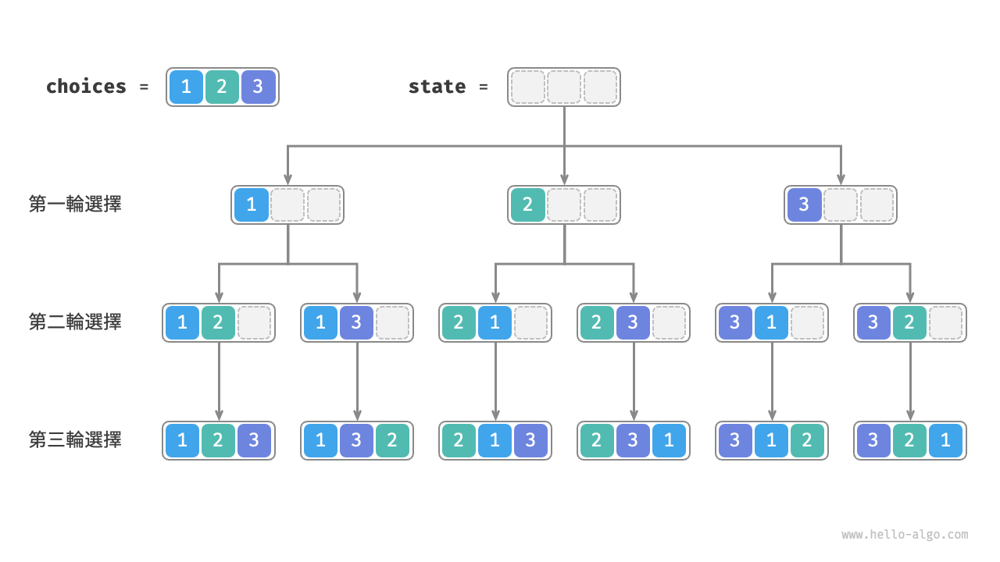
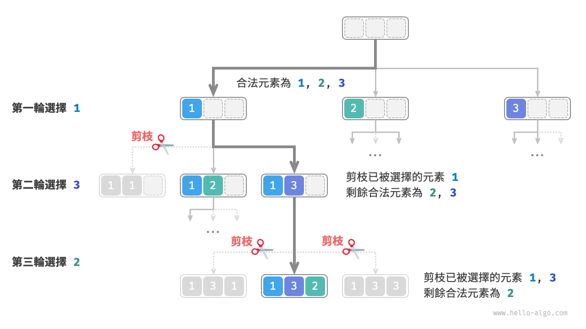
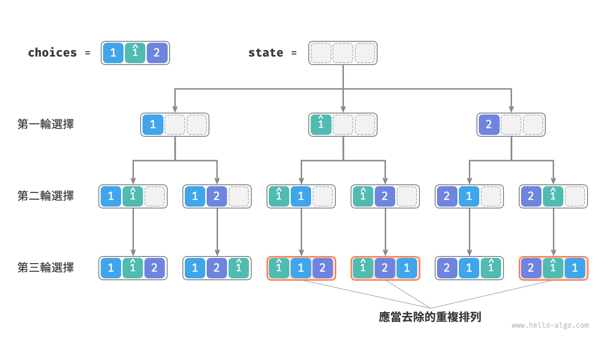
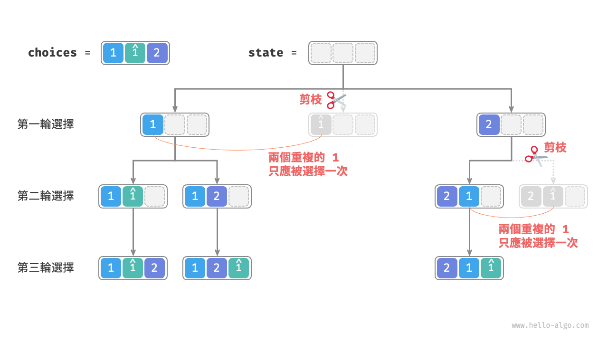
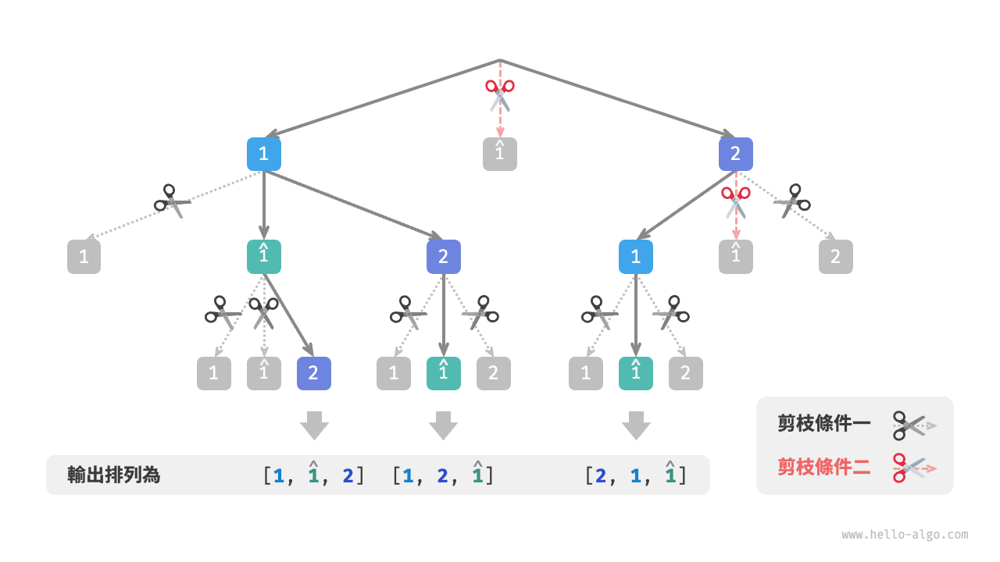

# 13.2 &nbsp; 全排列問題

全排列問題是回溯演算法的一個典型應用。它的定義是在給定一個集合（如一個陣列或字串）的情況下，找出其中元素的所有可能的排列。

表 13-2 列舉了幾個示例資料，包括輸入陣列和對應的所有排列。

<p align="center"> 表 13-2 &nbsp; 全排列示例 </p>

<div class="center-table" markdown>

| 輸入陣列    | 所有排列                                                           |
| :---------- | :----------------------------------------------------------------- |
| $[1]$       | $[1]$                                                              |
| $[1, 2]$    | $[1, 2], [2, 1]$                                                   |
| $[1, 2, 3]$ | $[1, 2, 3], [1, 3, 2], [2, 1, 3], [2, 3, 1], [3, 1, 2], [3, 2, 1]$ |

</div>

## 13.2.1 &nbsp; 無相等元素的情況

!!! question

    輸入一個整數陣列，其中不包含重複元素，返回所有可能的排列。

從回溯演算法的角度看，**我們可以把生成排列的過程想象成一系列選擇的結果**。假設輸入陣列為 $[1, 2, 3]$ ，如果我們先選擇 $1$ ，再選擇 $3$ ，最後選擇 $2$ ，則獲得排列 $[1, 3, 2]$ 。回退表示撤銷一個選擇，之後繼續嘗試其他選擇。

從回溯程式碼的角度看，候選集合 `choices` 是輸入陣列中的所有元素，狀態 `state` 是直至目前已被選擇的元素。請注意，每個元素只允許被選擇一次，**因此 `state` 中的所有元素都應該是唯一的**。

如圖 13-5 所示，我們可以將搜尋過程展開成一棵遞迴樹，樹中的每個節點代表當前狀態 `state` 。從根節點開始，經過三輪選擇後到達葉節點，每個葉節點都對應一個排列。

{ class="animation-figure" }

<p align="center"> 圖 13-5 &nbsp; 全排列的遞迴樹 </p>

### 1. &nbsp; 重複選擇剪枝

為了實現每個元素只被選擇一次，我們考慮引入一個布林型陣列 `selected` ，其中 `selected[i]` 表示 `choices[i]` 是否已被選擇，並基於它實現以下剪枝操作。

- 在做出選擇 `choice[i]` 後，我們就將 `selected[i]` 賦值為 $\text{True}$ ，代表它已被選擇。
- 走訪選擇串列 `choices` 時，跳過所有已被選擇的節點，即剪枝。

如圖 13-6 所示，假設我們第一輪選擇 1 ，第二輪選擇 3 ，第三輪選擇 2 ，則需要在第二輪剪掉元素 1 的分支，在第三輪剪掉元素 1 和元素 3 的分支。

{ class="animation-figure" }

<p align="center"> 圖 13-6 &nbsp; 全排列剪枝示例 </p>

觀察圖 13-6 發現，該剪枝操作將搜尋空間大小從 $O(n^n)$ 減小至 $O(n!)$ 。

### 2. &nbsp; 程式碼實現

想清楚以上資訊之後，我們就可以在框架程式碼中做“完形填空”了。為了縮短整體程式碼，我們不單獨實現框架程式碼中的各個函式，而是將它們展開在 `backtrack()` 函式中：

=== "Python"

    ```python title="permutations_i.py"
    def backtrack(
        state: list[int], choices: list[int], selected: list[bool], res: list[list[int]]
    ):
        """回溯演算法：全排列 I"""
        # 當狀態長度等於元素數量時，記錄解
        if len(state) == len(choices):
            res.append(list(state))
            return
        # 走訪所有選擇
        for i, choice in enumerate(choices):
            # 剪枝：不允許重複選擇元素
            if not selected[i]:
                # 嘗試：做出選擇，更新狀態
                selected[i] = True
                state.append(choice)
                # 進行下一輪選擇
                backtrack(state, choices, selected, res)
                # 回退：撤銷選擇，恢復到之前的狀態
                selected[i] = False
                state.pop()

    def permutations_i(nums: list[int]) -> list[list[int]]:
        """全排列 I"""
        res = []
        backtrack(state=[], choices=nums, selected=[False] * len(nums), res=res)
        return res
    ```

=== "C++"

    ```cpp title="permutations_i.cpp"
    /* 回溯演算法：全排列 I */
    void backtrack(vector<int> &state, const vector<int> &choices, vector<bool> &selected, vector<vector<int>> &res) {
        // 當狀態長度等於元素數量時，記錄解
        if (state.size() == choices.size()) {
            res.push_back(state);
            return;
        }
        // 走訪所有選擇
        for (int i = 0; i < choices.size(); i++) {
            int choice = choices[i];
            // 剪枝：不允許重複選擇元素
            if (!selected[i]) {
                // 嘗試：做出選擇，更新狀態
                selected[i] = true;
                state.push_back(choice);
                // 進行下一輪選擇
                backtrack(state, choices, selected, res);
                // 回退：撤銷選擇，恢復到之前的狀態
                selected[i] = false;
                state.pop_back();
            }
        }
    }

    /* 全排列 I */
    vector<vector<int>> permutationsI(vector<int> nums) {
        vector<int> state;
        vector<bool> selected(nums.size(), false);
        vector<vector<int>> res;
        backtrack(state, nums, selected, res);
        return res;
    }
    ```

=== "Java"

    ```java title="permutations_i.java"
    /* 回溯演算法：全排列 I */
    void backtrack(List<Integer> state, int[] choices, boolean[] selected, List<List<Integer>> res) {
        // 當狀態長度等於元素數量時，記錄解
        if (state.size() == choices.length) {
            res.add(new ArrayList<Integer>(state));
            return;
        }
        // 走訪所有選擇
        for (int i = 0; i < choices.length; i++) {
            int choice = choices[i];
            // 剪枝：不允許重複選擇元素
            if (!selected[i]) {
                // 嘗試：做出選擇，更新狀態
                selected[i] = true;
                state.add(choice);
                // 進行下一輪選擇
                backtrack(state, choices, selected, res);
                // 回退：撤銷選擇，恢復到之前的狀態
                selected[i] = false;
                state.remove(state.size() - 1);
            }
        }
    }

    /* 全排列 I */
    List<List<Integer>> permutationsI(int[] nums) {
        List<List<Integer>> res = new ArrayList<List<Integer>>();
        backtrack(new ArrayList<Integer>(), nums, new boolean[nums.length], res);
        return res;
    }
    ```

=== "C#"

    ```csharp title="permutations_i.cs"
    /* 回溯演算法：全排列 I */
    void Backtrack(List<int> state, int[] choices, bool[] selected, List<List<int>> res) {
        // 當狀態長度等於元素數量時，記錄解
        if (state.Count == choices.Length) {
            res.Add(new List<int>(state));
            return;
        }
        // 走訪所有選擇
        for (int i = 0; i < choices.Length; i++) {
            int choice = choices[i];
            // 剪枝：不允許重複選擇元素
            if (!selected[i]) {
                // 嘗試：做出選擇，更新狀態
                selected[i] = true;
                state.Add(choice);
                // 進行下一輪選擇
                Backtrack(state, choices, selected, res);
                // 回退：撤銷選擇，恢復到之前的狀態
                selected[i] = false;
                state.RemoveAt(state.Count - 1);
            }
        }
    }

    /* 全排列 I */
    List<List<int>> PermutationsI(int[] nums) {
        List<List<int>> res = [];
        Backtrack([], nums, new bool[nums.Length], res);
        return res;
    }
    ```

=== "Go"

    ```go title="permutations_i.go"
    /* 回溯演算法：全排列 I */
    func backtrackI(state *[]int, choices *[]int, selected *[]bool, res *[][]int) {
        // 當狀態長度等於元素數量時，記錄解
        if len(*state) == len(*choices) {
            newState := append([]int{}, *state...)
            *res = append(*res, newState)
        }
        // 走訪所有選擇
        for i := 0; i < len(*choices); i++ {
            choice := (*choices)[i]
            // 剪枝：不允許重複選擇元素
            if !(*selected)[i] {
                // 嘗試：做出選擇，更新狀態
                (*selected)[i] = true
                *state = append(*state, choice)
                // 進行下一輪選擇
                backtrackI(state, choices, selected, res)
                // 回退：撤銷選擇，恢復到之前的狀態
                (*selected)[i] = false
                *state = (*state)[:len(*state)-1]
            }
        }
    }

    /* 全排列 I */
    func permutationsI(nums []int) [][]int {
        res := make([][]int, 0)
        state := make([]int, 0)
        selected := make([]bool, len(nums))
        backtrackI(&state, &nums, &selected, &res)
        return res
    }
    ```

=== "Swift"

    ```swift title="permutations_i.swift"
    /* 回溯演算法：全排列 I */
    func backtrack(state: inout [Int], choices: [Int], selected: inout [Bool], res: inout [[Int]]) {
        // 當狀態長度等於元素數量時，記錄解
        if state.count == choices.count {
            res.append(state)
            return
        }
        // 走訪所有選擇
        for (i, choice) in choices.enumerated() {
            // 剪枝：不允許重複選擇元素
            if !selected[i] {
                // 嘗試：做出選擇，更新狀態
                selected[i] = true
                state.append(choice)
                // 進行下一輪選擇
                backtrack(state: &state, choices: choices, selected: &selected, res: &res)
                // 回退：撤銷選擇，恢復到之前的狀態
                selected[i] = false
                state.removeLast()
            }
        }
    }

    /* 全排列 I */
    func permutationsI(nums: [Int]) -> [[Int]] {
        var state: [Int] = []
        var selected = Array(repeating: false, count: nums.count)
        var res: [[Int]] = []
        backtrack(state: &state, choices: nums, selected: &selected, res: &res)
        return res
    }
    ```

=== "JS"

    ```javascript title="permutations_i.js"
    /* 回溯演算法：全排列 I */
    function backtrack(state, choices, selected, res) {
        // 當狀態長度等於元素數量時，記錄解
        if (state.length === choices.length) {
            res.push([...state]);
            return;
        }
        // 走訪所有選擇
        choices.forEach((choice, i) => {
            // 剪枝：不允許重複選擇元素
            if (!selected[i]) {
                // 嘗試：做出選擇，更新狀態
                selected[i] = true;
                state.push(choice);
                // 進行下一輪選擇
                backtrack(state, choices, selected, res);
                // 回退：撤銷選擇，恢復到之前的狀態
                selected[i] = false;
                state.pop();
            }
        });
    }

    /* 全排列 I */
    function permutationsI(nums) {
        const res = [];
        backtrack([], nums, Array(nums.length).fill(false), res);
        return res;
    }
    ```

=== "TS"

    ```typescript title="permutations_i.ts"
    /* 回溯演算法：全排列 I */
    function backtrack(
        state: number[],
        choices: number[],
        selected: boolean[],
        res: number[][]
    ): void {
        // 當狀態長度等於元素數量時，記錄解
        if (state.length === choices.length) {
            res.push([...state]);
            return;
        }
        // 走訪所有選擇
        choices.forEach((choice, i) => {
            // 剪枝：不允許重複選擇元素
            if (!selected[i]) {
                // 嘗試：做出選擇，更新狀態
                selected[i] = true;
                state.push(choice);
                // 進行下一輪選擇
                backtrack(state, choices, selected, res);
                // 回退：撤銷選擇，恢復到之前的狀態
                selected[i] = false;
                state.pop();
            }
        });
    }

    /* 全排列 I */
    function permutationsI(nums: number[]): number[][] {
        const res: number[][] = [];
        backtrack([], nums, Array(nums.length).fill(false), res);
        return res;
    }
    ```

=== "Dart"

    ```dart title="permutations_i.dart"
    /* 回溯演算法：全排列 I */
    void backtrack(
      List<int> state,
      List<int> choices,
      List<bool> selected,
      List<List<int>> res,
    ) {
      // 當狀態長度等於元素數量時，記錄解
      if (state.length == choices.length) {
        res.add(List.from(state));
        return;
      }
      // 走訪所有選擇
      for (int i = 0; i < choices.length; i++) {
        int choice = choices[i];
        // 剪枝：不允許重複選擇元素
        if (!selected[i]) {
          // 嘗試：做出選擇，更新狀態
          selected[i] = true;
          state.add(choice);
          // 進行下一輪選擇
          backtrack(state, choices, selected, res);
          // 回退：撤銷選擇，恢復到之前的狀態
          selected[i] = false;
          state.removeLast();
        }
      }
    }

    /* 全排列 I */
    List<List<int>> permutationsI(List<int> nums) {
      List<List<int>> res = [];
      backtrack([], nums, List.filled(nums.length, false), res);
      return res;
    }
    ```

=== "Rust"

    ```rust title="permutations_i.rs"
    /* 回溯演算法：全排列 I */
    fn backtrack(mut state: Vec<i32>, choices: &[i32], selected: &mut [bool], res: &mut Vec<Vec<i32>>) {
        // 當狀態長度等於元素數量時，記錄解
        if state.len() == choices.len() {
            res.push(state);
            return;
        }
        // 走訪所有選擇
        for i in 0..choices.len() {
            let choice = choices[i];
            // 剪枝：不允許重複選擇元素
            if !selected[i] {
                // 嘗試：做出選擇，更新狀態
                selected[i] = true;
                state.push(choice);
                // 進行下一輪選擇
                backtrack(state.clone(), choices, selected, res);
                // 回退：撤銷選擇，恢復到之前的狀態
                selected[i] = false;
                state.pop();
            }
        }
    }

    /* 全排列 I */
    fn permutations_i(nums: &mut [i32]) -> Vec<Vec<i32>> {
        let mut res = Vec::new(); // 狀態（子集）
        backtrack(Vec::new(), nums, &mut vec![false; nums.len()], &mut res);
        res
    }
    ```

=== "C"

    ```c title="permutations_i.c"
    /* 回溯演算法：全排列 I */
    void backtrack(int *state, int stateSize, int *choices, int choicesSize, bool *selected, int **res, int *resSize) {
        // 當狀態長度等於元素數量時，記錄解
        if (stateSize == choicesSize) {
            res[*resSize] = (int *)malloc(choicesSize * sizeof(int));
            for (int i = 0; i < choicesSize; i++) {
                res[*resSize][i] = state[i];
            }
            (*resSize)++;
            return;
        }
        // 走訪所有選擇
        for (int i = 0; i < choicesSize; i++) {
            int choice = choices[i];
            // 剪枝：不允許重複選擇元素
            if (!selected[i]) {
                // 嘗試：做出選擇，更新狀態
                selected[i] = true;
                state[stateSize] = choice;
                // 進行下一輪選擇
                backtrack(state, stateSize + 1, choices, choicesSize, selected, res, resSize);
                // 回退：撤銷選擇，恢復到之前的狀態
                selected[i] = false;
            }
        }
    }

    /* 全排列 I */
    int **permutationsI(int *nums, int numsSize, int *returnSize) {
        int *state = (int *)malloc(numsSize * sizeof(int));
        bool *selected = (bool *)malloc(numsSize * sizeof(bool));
        for (int i = 0; i < numsSize; i++) {
            selected[i] = false;
        }
        int **res = (int **)malloc(MAX_SIZE * sizeof(int *));
        *returnSize = 0;

        backtrack(state, 0, nums, numsSize, selected, res, returnSize);

        free(state);
        free(selected);

        return res;
    }
    ```

=== "Kotlin"

    ```kotlin title="permutations_i.kt"
    /* 回溯演算法：全排列 I */
    fun backtrack(
        state: MutableList<Int>,
        choices: IntArray,
        selected: BooleanArray,
        res: MutableList<MutableList<Int>?>
    ) {
        // 當狀態長度等於元素數量時，記錄解
        if (state.size == choices.size) {
            res.add(state.toMutableList())
            return
        }
        // 走訪所有選擇
        for (i in choices.indices) {
            val choice = choices[i]
            // 剪枝：不允許重複選擇元素
            if (!selected[i]) {
                // 嘗試：做出選擇，更新狀態
                selected[i] = true
                state.add(choice)
                // 進行下一輪選擇
                backtrack(state, choices, selected, res)
                // 回退：撤銷選擇，恢復到之前的狀態
                selected[i] = false
                state.removeAt(state.size - 1)
            }
        }
    }

    /* 全排列 I */
    fun permutationsI(nums: IntArray): MutableList<MutableList<Int>?> {
        val res = mutableListOf<MutableList<Int>?>()
        backtrack(mutableListOf(), nums, BooleanArray(nums.size), res)
        return res
    }
    ```

=== "Ruby"

    ```ruby title="permutations_i.rb"
    ### 回溯演算法：全排列 I ###
    def backtrack(state, choices, selected, res)
      # 當狀態長度等於元素數量時，記錄解
      if state.length == choices.length
        res << state.dup
        return
      end

      # 走訪所有選擇
      choices.each_with_index do |choice, i|
        # 剪枝：不允許重複選擇元素
        unless selected[i]
          # 嘗試：做出選擇，更新狀態
          selected[i] = true
          state << choice
          # 進行下一輪選擇
          backtrack(state, choices, selected, res)
          # 回退：撤銷選擇，恢復到之前的狀態
          selected[i] = false
          state.pop
        end
      end
    end

    ### 全排列 I ###
    def permutations_i(nums)
      res = []
      backtrack([], nums, Array.new(nums.length, false), res)
      res
    end
    ```

??? pythontutor "視覺化執行"

    <div style="height: 549px; width: 100%;"><iframe class="pythontutor-iframe" src="https://pythontutor.com/iframe-embed.html#code=def%20backtrack%28%0A%20%20%20%20state%3A%20list%5Bint%5D%2C%20choices%3A%20list%5Bint%5D%2C%20selected%3A%20list%5Bbool%5D%2C%20res%3A%20list%5Blist%5Bint%5D%5D%0A%29%3A%0A%20%20%20%20%22%22%22%E5%9B%9E%E6%BA%AF%E6%BC%94%E7%AE%97%E6%B3%95%EF%BC%9A%E5%85%A8%E6%8E%92%E5%88%97%20I%22%22%22%0A%20%20%20%20%23%20%E7%95%B6%E7%8B%80%E6%85%8B%E9%95%B7%E5%BA%A6%E7%AD%89%E6%96%BC%E5%85%83%E7%B4%A0%E6%95%B8%E9%87%8F%E6%99%82%EF%BC%8C%E8%A8%98%E9%8C%84%E8%A7%A3%0A%20%20%20%20if%20len%28state%29%20%3D%3D%20len%28choices%29%3A%0A%20%20%20%20%20%20%20%20res.append%28list%28state%29%29%0A%20%20%20%20%20%20%20%20return%0A%20%20%20%20%23%20%E8%B5%B0%E8%A8%AA%E6%89%80%E6%9C%89%E9%81%B8%E6%93%87%0A%20%20%20%20for%20i%2C%20choice%20in%20enumerate%28choices%29%3A%0A%20%20%20%20%20%20%20%20%23%20%E5%89%AA%E6%9E%9D%EF%BC%9A%E4%B8%8D%E5%85%81%E8%A8%B1%E9%87%8D%E8%A4%87%E9%81%B8%E6%93%87%E5%85%83%E7%B4%A0%0A%20%20%20%20%20%20%20%20if%20not%20selected%5Bi%5D%3A%0A%20%20%20%20%20%20%20%20%20%20%20%20%23%20%E5%98%97%E8%A9%A6%EF%BC%9A%E5%81%9A%E5%87%BA%E9%81%B8%E6%93%87%EF%BC%8C%E6%9B%B4%E6%96%B0%E7%8B%80%E6%85%8B%0A%20%20%20%20%20%20%20%20%20%20%20%20selected%5Bi%5D%20%3D%20True%0A%20%20%20%20%20%20%20%20%20%20%20%20state.append%28choice%29%0A%20%20%20%20%20%20%20%20%20%20%20%20%23%20%E9%80%B2%E8%A1%8C%E4%B8%8B%E4%B8%80%E8%BC%AA%E9%81%B8%E6%93%87%0A%20%20%20%20%20%20%20%20%20%20%20%20backtrack%28state%2C%20choices%2C%20selected%2C%20res%29%0A%20%20%20%20%20%20%20%20%20%20%20%20%23%20%E5%9B%9E%E9%80%80%EF%BC%9A%E6%92%A4%E9%8A%B7%E9%81%B8%E6%93%87%EF%BC%8C%E6%81%A2%E5%BE%A9%E5%88%B0%E4%B9%8B%E5%89%8D%E7%9A%84%E7%8B%80%E6%85%8B%0A%20%20%20%20%20%20%20%20%20%20%20%20selected%5Bi%5D%20%3D%20False%0A%20%20%20%20%20%20%20%20%20%20%20%20state.pop%28%29%0A%0A%0Adef%20permutations_i%28nums%3A%20list%5Bint%5D%29%20-%3E%20list%5Blist%5Bint%5D%5D%3A%0A%20%20%20%20%22%22%22%E5%85%A8%E6%8E%92%E5%88%97%20I%22%22%22%0A%20%20%20%20res%20%3D%20%5B%5D%0A%20%20%20%20backtrack%28state%3D%5B%5D%2C%20choices%3Dnums%2C%20selected%3D%5BFalse%5D%20%2A%20len%28nums%29%2C%20res%3Dres%29%0A%20%20%20%20return%20res%0A%0A%0A%22%22%22Driver%20Code%22%22%22%0Aif%20__name__%20%3D%3D%20%22__main__%22%3A%0A%20%20%20%20nums%20%3D%20%5B1%2C%202%2C%203%5D%0A%0A%20%20%20%20res%20%3D%20permutations_i%28nums%29%0A%0A%20%20%20%20print%28f%22%E8%BC%B8%E5%85%A5%E9%99%A3%E5%88%97%20nums%20%3D%20%7Bnums%7D%22%29%0A%20%20%20%20print%28f%22%E6%89%80%E6%9C%89%E6%8E%92%E5%88%97%20res%20%3D%20%7Bres%7D%22%29&codeDivHeight=472&codeDivWidth=350&cumulative=false&curInstr=13&heapPrimitives=nevernest&origin=opt-frontend.js&py=311&rawInputLstJSON=%5B%5D&textReferences=false"> </iframe></div>
    <div style="margin-top: 5px;"><a href="https://pythontutor.com/iframe-embed.html#code=def%20backtrack%28%0A%20%20%20%20state%3A%20list%5Bint%5D%2C%20choices%3A%20list%5Bint%5D%2C%20selected%3A%20list%5Bbool%5D%2C%20res%3A%20list%5Blist%5Bint%5D%5D%0A%29%3A%0A%20%20%20%20%22%22%22%E5%9B%9E%E6%BA%AF%E6%BC%94%E7%AE%97%E6%B3%95%EF%BC%9A%E5%85%A8%E6%8E%92%E5%88%97%20I%22%22%22%0A%20%20%20%20%23%20%E7%95%B6%E7%8B%80%E6%85%8B%E9%95%B7%E5%BA%A6%E7%AD%89%E6%96%BC%E5%85%83%E7%B4%A0%E6%95%B8%E9%87%8F%E6%99%82%EF%BC%8C%E8%A8%98%E9%8C%84%E8%A7%A3%0A%20%20%20%20if%20len%28state%29%20%3D%3D%20len%28choices%29%3A%0A%20%20%20%20%20%20%20%20res.append%28list%28state%29%29%0A%20%20%20%20%20%20%20%20return%0A%20%20%20%20%23%20%E8%B5%B0%E8%A8%AA%E6%89%80%E6%9C%89%E9%81%B8%E6%93%87%0A%20%20%20%20for%20i%2C%20choice%20in%20enumerate%28choices%29%3A%0A%20%20%20%20%20%20%20%20%23%20%E5%89%AA%E6%9E%9D%EF%BC%9A%E4%B8%8D%E5%85%81%E8%A8%B1%E9%87%8D%E8%A4%87%E9%81%B8%E6%93%87%E5%85%83%E7%B4%A0%0A%20%20%20%20%20%20%20%20if%20not%20selected%5Bi%5D%3A%0A%20%20%20%20%20%20%20%20%20%20%20%20%23%20%E5%98%97%E8%A9%A6%EF%BC%9A%E5%81%9A%E5%87%BA%E9%81%B8%E6%93%87%EF%BC%8C%E6%9B%B4%E6%96%B0%E7%8B%80%E6%85%8B%0A%20%20%20%20%20%20%20%20%20%20%20%20selected%5Bi%5D%20%3D%20True%0A%20%20%20%20%20%20%20%20%20%20%20%20state.append%28choice%29%0A%20%20%20%20%20%20%20%20%20%20%20%20%23%20%E9%80%B2%E8%A1%8C%E4%B8%8B%E4%B8%80%E8%BC%AA%E9%81%B8%E6%93%87%0A%20%20%20%20%20%20%20%20%20%20%20%20backtrack%28state%2C%20choices%2C%20selected%2C%20res%29%0A%20%20%20%20%20%20%20%20%20%20%20%20%23%20%E5%9B%9E%E9%80%80%EF%BC%9A%E6%92%A4%E9%8A%B7%E9%81%B8%E6%93%87%EF%BC%8C%E6%81%A2%E5%BE%A9%E5%88%B0%E4%B9%8B%E5%89%8D%E7%9A%84%E7%8B%80%E6%85%8B%0A%20%20%20%20%20%20%20%20%20%20%20%20selected%5Bi%5D%20%3D%20False%0A%20%20%20%20%20%20%20%20%20%20%20%20state.pop%28%29%0A%0A%0Adef%20permutations_i%28nums%3A%20list%5Bint%5D%29%20-%3E%20list%5Blist%5Bint%5D%5D%3A%0A%20%20%20%20%22%22%22%E5%85%A8%E6%8E%92%E5%88%97%20I%22%22%22%0A%20%20%20%20res%20%3D%20%5B%5D%0A%20%20%20%20backtrack%28state%3D%5B%5D%2C%20choices%3Dnums%2C%20selected%3D%5BFalse%5D%20%2A%20len%28nums%29%2C%20res%3Dres%29%0A%20%20%20%20return%20res%0A%0A%0A%22%22%22Driver%20Code%22%22%22%0Aif%20__name__%20%3D%3D%20%22__main__%22%3A%0A%20%20%20%20nums%20%3D%20%5B1%2C%202%2C%203%5D%0A%0A%20%20%20%20res%20%3D%20permutations_i%28nums%29%0A%0A%20%20%20%20print%28f%22%E8%BC%B8%E5%85%A5%E9%99%A3%E5%88%97%20nums%20%3D%20%7Bnums%7D%22%29%0A%20%20%20%20print%28f%22%E6%89%80%E6%9C%89%E6%8E%92%E5%88%97%20res%20%3D%20%7Bres%7D%22%29&codeDivHeight=800&codeDivWidth=600&cumulative=false&curInstr=13&heapPrimitives=nevernest&origin=opt-frontend.js&py=311&rawInputLstJSON=%5B%5D&textReferences=false" target="_blank" rel="noopener noreferrer">全螢幕觀看 ></a></div>

## 13.2.2 &nbsp; 考慮相等元素的情況

!!! question

    輸入一個整數陣列，**陣列中可能包含重複元素**，返回所有不重複的排列。

假設輸入陣列為 $[1, 1, 2]$ 。為了方便區分兩個重複元素 $1$ ，我們將第二個 $1$ 記為 $\hat{1}$ 。

如圖 13-7 所示，上述方法生成的排列有一半是重複的。

{ class="animation-figure" }

<p align="center"> 圖 13-7 &nbsp; 重複排列 </p>

那麼如何去除重複的排列呢？最直接地，考慮藉助一個雜湊集合，直接對排列結果進行去重。然而這樣做不夠優雅，**因為生成重複排列的搜尋分支沒有必要，應當提前識別並剪枝**，這樣可以進一步提升演算法效率。

### 1. &nbsp; 相等元素剪枝

觀察圖 13-8 ，在第一輪中，選擇 $1$ 或選擇 $\hat{1}$ 是等價的，在這兩個選擇之下生成的所有排列都是重複的。因此應該把 $\hat{1}$ 剪枝。

同理，在第一輪選擇 $2$ 之後，第二輪選擇中的 $1$ 和 $\hat{1}$ 也會產生重複分支，因此也應將第二輪的 $\hat{1}$ 剪枝。

從本質上看，**我們的目標是在某一輪選擇中，保證多個相等的元素僅被選擇一次**。

{ class="animation-figure" }

<p align="center"> 圖 13-8 &nbsp; 重複排列剪枝 </p>

### 2. &nbsp; 程式碼實現

在上一題的程式碼的基礎上，我們考慮在每一輪選擇中開啟一個雜湊集合 `duplicated` ，用於記錄該輪中已經嘗試過的元素，並將重複元素剪枝：

=== "Python"

    ```python title="permutations_ii.py"
    def backtrack(
        state: list[int], choices: list[int], selected: list[bool], res: list[list[int]]
    ):
        """回溯演算法：全排列 II"""
        # 當狀態長度等於元素數量時，記錄解
        if len(state) == len(choices):
            res.append(list(state))
            return
        # 走訪所有選擇
        duplicated = set[int]()
        for i, choice in enumerate(choices):
            # 剪枝：不允許重複選擇元素 且 不允許重複選擇相等元素
            if not selected[i] and choice not in duplicated:
                # 嘗試：做出選擇，更新狀態
                duplicated.add(choice)  # 記錄選擇過的元素值
                selected[i] = True
                state.append(choice)
                # 進行下一輪選擇
                backtrack(state, choices, selected, res)
                # 回退：撤銷選擇，恢復到之前的狀態
                selected[i] = False
                state.pop()

    def permutations_ii(nums: list[int]) -> list[list[int]]:
        """全排列 II"""
        res = []
        backtrack(state=[], choices=nums, selected=[False] * len(nums), res=res)
        return res
    ```

=== "C++"

    ```cpp title="permutations_ii.cpp"
    /* 回溯演算法：全排列 II */
    void backtrack(vector<int> &state, const vector<int> &choices, vector<bool> &selected, vector<vector<int>> &res) {
        // 當狀態長度等於元素數量時，記錄解
        if (state.size() == choices.size()) {
            res.push_back(state);
            return;
        }
        // 走訪所有選擇
        unordered_set<int> duplicated;
        for (int i = 0; i < choices.size(); i++) {
            int choice = choices[i];
            // 剪枝：不允許重複選擇元素 且 不允許重複選擇相等元素
            if (!selected[i] && duplicated.find(choice) == duplicated.end()) {
                // 嘗試：做出選擇，更新狀態
                duplicated.emplace(choice); // 記錄選擇過的元素值
                selected[i] = true;
                state.push_back(choice);
                // 進行下一輪選擇
                backtrack(state, choices, selected, res);
                // 回退：撤銷選擇，恢復到之前的狀態
                selected[i] = false;
                state.pop_back();
            }
        }
    }

    /* 全排列 II */
    vector<vector<int>> permutationsII(vector<int> nums) {
        vector<int> state;
        vector<bool> selected(nums.size(), false);
        vector<vector<int>> res;
        backtrack(state, nums, selected, res);
        return res;
    }
    ```

=== "Java"

    ```java title="permutations_ii.java"
    /* 回溯演算法：全排列 II */
    void backtrack(List<Integer> state, int[] choices, boolean[] selected, List<List<Integer>> res) {
        // 當狀態長度等於元素數量時，記錄解
        if (state.size() == choices.length) {
            res.add(new ArrayList<Integer>(state));
            return;
        }
        // 走訪所有選擇
        Set<Integer> duplicated = new HashSet<Integer>();
        for (int i = 0; i < choices.length; i++) {
            int choice = choices[i];
            // 剪枝：不允許重複選擇元素 且 不允許重複選擇相等元素
            if (!selected[i] && !duplicated.contains(choice)) {
                // 嘗試：做出選擇，更新狀態
                duplicated.add(choice); // 記錄選擇過的元素值
                selected[i] = true;
                state.add(choice);
                // 進行下一輪選擇
                backtrack(state, choices, selected, res);
                // 回退：撤銷選擇，恢復到之前的狀態
                selected[i] = false;
                state.remove(state.size() - 1);
            }
        }
    }

    /* 全排列 II */
    List<List<Integer>> permutationsII(int[] nums) {
        List<List<Integer>> res = new ArrayList<List<Integer>>();
        backtrack(new ArrayList<Integer>(), nums, new boolean[nums.length], res);
        return res;
    }
    ```

=== "C#"

    ```csharp title="permutations_ii.cs"
    /* 回溯演算法：全排列 II */
    void Backtrack(List<int> state, int[] choices, bool[] selected, List<List<int>> res) {
        // 當狀態長度等於元素數量時，記錄解
        if (state.Count == choices.Length) {
            res.Add(new List<int>(state));
            return;
        }
        // 走訪所有選擇
        HashSet<int> duplicated = [];
        for (int i = 0; i < choices.Length; i++) {
            int choice = choices[i];
            // 剪枝：不允許重複選擇元素 且 不允許重複選擇相等元素
            if (!selected[i] && !duplicated.Contains(choice)) {
                // 嘗試：做出選擇，更新狀態
                duplicated.Add(choice); // 記錄選擇過的元素值
                selected[i] = true;
                state.Add(choice);
                // 進行下一輪選擇
                Backtrack(state, choices, selected, res);
                // 回退：撤銷選擇，恢復到之前的狀態
                selected[i] = false;
                state.RemoveAt(state.Count - 1);
            }
        }
    }

    /* 全排列 II */
    List<List<int>> PermutationsII(int[] nums) {
        List<List<int>> res = [];
        Backtrack([], nums, new bool[nums.Length], res);
        return res;
    }
    ```

=== "Go"

    ```go title="permutations_ii.go"
    /* 回溯演算法：全排列 II */
    func backtrackII(state *[]int, choices *[]int, selected *[]bool, res *[][]int) {
        // 當狀態長度等於元素數量時，記錄解
        if len(*state) == len(*choices) {
            newState := append([]int{}, *state...)
            *res = append(*res, newState)
        }
        // 走訪所有選擇
        duplicated := make(map[int]struct{}, 0)
        for i := 0; i < len(*choices); i++ {
            choice := (*choices)[i]
            // 剪枝：不允許重複選擇元素 且 不允許重複選擇相等元素
            if _, ok := duplicated[choice]; !ok && !(*selected)[i] {
                // 嘗試：做出選擇，更新狀態
                // 記錄選擇過的元素值
                duplicated[choice] = struct{}{}
                (*selected)[i] = true
                *state = append(*state, choice)
                // 進行下一輪選擇
                backtrackII(state, choices, selected, res)
                // 回退：撤銷選擇，恢復到之前的狀態
                (*selected)[i] = false
                *state = (*state)[:len(*state)-1]
            }
        }
    }

    /* 全排列 II */
    func permutationsII(nums []int) [][]int {
        res := make([][]int, 0)
        state := make([]int, 0)
        selected := make([]bool, len(nums))
        backtrackII(&state, &nums, &selected, &res)
        return res
    }
    ```

=== "Swift"

    ```swift title="permutations_ii.swift"
    /* 回溯演算法：全排列 II */
    func backtrack(state: inout [Int], choices: [Int], selected: inout [Bool], res: inout [[Int]]) {
        // 當狀態長度等於元素數量時，記錄解
        if state.count == choices.count {
            res.append(state)
            return
        }
        // 走訪所有選擇
        var duplicated: Set<Int> = []
        for (i, choice) in choices.enumerated() {
            // 剪枝：不允許重複選擇元素 且 不允許重複選擇相等元素
            if !selected[i], !duplicated.contains(choice) {
                // 嘗試：做出選擇，更新狀態
                duplicated.insert(choice) // 記錄選擇過的元素值
                selected[i] = true
                state.append(choice)
                // 進行下一輪選擇
                backtrack(state: &state, choices: choices, selected: &selected, res: &res)
                // 回退：撤銷選擇，恢復到之前的狀態
                selected[i] = false
                state.removeLast()
            }
        }
    }

    /* 全排列 II */
    func permutationsII(nums: [Int]) -> [[Int]] {
        var state: [Int] = []
        var selected = Array(repeating: false, count: nums.count)
        var res: [[Int]] = []
        backtrack(state: &state, choices: nums, selected: &selected, res: &res)
        return res
    }
    ```

=== "JS"

    ```javascript title="permutations_ii.js"
    /* 回溯演算法：全排列 II */
    function backtrack(state, choices, selected, res) {
        // 當狀態長度等於元素數量時，記錄解
        if (state.length === choices.length) {
            res.push([...state]);
            return;
        }
        // 走訪所有選擇
        const duplicated = new Set();
        choices.forEach((choice, i) => {
            // 剪枝：不允許重複選擇元素 且 不允許重複選擇相等元素
            if (!selected[i] && !duplicated.has(choice)) {
                // 嘗試：做出選擇，更新狀態
                duplicated.add(choice); // 記錄選擇過的元素值
                selected[i] = true;
                state.push(choice);
                // 進行下一輪選擇
                backtrack(state, choices, selected, res);
                // 回退：撤銷選擇，恢復到之前的狀態
                selected[i] = false;
                state.pop();
            }
        });
    }

    /* 全排列 II */
    function permutationsII(nums) {
        const res = [];
        backtrack([], nums, Array(nums.length).fill(false), res);
        return res;
    }
    ```

=== "TS"

    ```typescript title="permutations_ii.ts"
    /* 回溯演算法：全排列 II */
    function backtrack(
        state: number[],
        choices: number[],
        selected: boolean[],
        res: number[][]
    ): void {
        // 當狀態長度等於元素數量時，記錄解
        if (state.length === choices.length) {
            res.push([...state]);
            return;
        }
        // 走訪所有選擇
        const duplicated = new Set();
        choices.forEach((choice, i) => {
            // 剪枝：不允許重複選擇元素 且 不允許重複選擇相等元素
            if (!selected[i] && !duplicated.has(choice)) {
                // 嘗試：做出選擇，更新狀態
                duplicated.add(choice); // 記錄選擇過的元素值
                selected[i] = true;
                state.push(choice);
                // 進行下一輪選擇
                backtrack(state, choices, selected, res);
                // 回退：撤銷選擇，恢復到之前的狀態
                selected[i] = false;
                state.pop();
            }
        });
    }

    /* 全排列 II */
    function permutationsII(nums: number[]): number[][] {
        const res: number[][] = [];
        backtrack([], nums, Array(nums.length).fill(false), res);
        return res;
    }
    ```

=== "Dart"

    ```dart title="permutations_ii.dart"
    /* 回溯演算法：全排列 II */
    void backtrack(
      List<int> state,
      List<int> choices,
      List<bool> selected,
      List<List<int>> res,
    ) {
      // 當狀態長度等於元素數量時，記錄解
      if (state.length == choices.length) {
        res.add(List.from(state));
        return;
      }
      // 走訪所有選擇
      Set<int> duplicated = {};
      for (int i = 0; i < choices.length; i++) {
        int choice = choices[i];
        // 剪枝：不允許重複選擇元素 且 不允許重複選擇相等元素
        if (!selected[i] && !duplicated.contains(choice)) {
          // 嘗試：做出選擇，更新狀態
          duplicated.add(choice); // 記錄選擇過的元素值
          selected[i] = true;
          state.add(choice);
          // 進行下一輪選擇
          backtrack(state, choices, selected, res);
          // 回退：撤銷選擇，恢復到之前的狀態
          selected[i] = false;
          state.removeLast();
        }
      }
    }

    /* 全排列 II */
    List<List<int>> permutationsII(List<int> nums) {
      List<List<int>> res = [];
      backtrack([], nums, List.filled(nums.length, false), res);
      return res;
    }
    ```

=== "Rust"

    ```rust title="permutations_ii.rs"
    /* 回溯演算法：全排列 II */
    fn backtrack(mut state: Vec<i32>, choices: &[i32], selected: &mut [bool], res: &mut Vec<Vec<i32>>) {
        // 當狀態長度等於元素數量時，記錄解
        if state.len() == choices.len() {
            res.push(state);
            return;
        }
        // 走訪所有選擇
        let mut duplicated = HashSet::<i32>::new();
        for i in 0..choices.len() {
            let choice = choices[i];
            // 剪枝：不允許重複選擇元素 且 不允許重複選擇相等元素
            if !selected[i] && !duplicated.contains(&choice) {
                // 嘗試：做出選擇，更新狀態
                duplicated.insert(choice); // 記錄選擇過的元素值
                selected[i] = true;
                state.push(choice);
                // 進行下一輪選擇
                backtrack(state.clone(), choices, selected, res);
                // 回退：撤銷選擇，恢復到之前的狀態
                selected[i] = false;
                state.pop();
            }
        }
    }

    /* 全排列 II */
    fn permutations_ii(nums: &mut [i32]) -> Vec<Vec<i32>> {
        let mut res = Vec::new();
        backtrack(Vec::new(), nums, &mut vec![false; nums.len()], &mut res);
        res
    }
    ```

=== "C"

    ```c title="permutations_ii.c"
    /* 回溯演算法：全排列 II */
    void backtrack(int *state, int stateSize, int *choices, int choicesSize, bool *selected, int **res, int *resSize) {
        // 當狀態長度等於元素數量時，記錄解
        if (stateSize == choicesSize) {
            res[*resSize] = (int *)malloc(choicesSize * sizeof(int));
            for (int i = 0; i < choicesSize; i++) {
                res[*resSize][i] = state[i];
            }
            (*resSize)++;
            return;
        }
        // 走訪所有選擇
        bool duplicated[MAX_SIZE] = {false};
        for (int i = 0; i < choicesSize; i++) {
            int choice = choices[i];
            // 剪枝：不允許重複選擇元素 且 不允許重複選擇相等元素
            if (!selected[i] && !duplicated[choice]) {
                // 嘗試：做出選擇，更新狀態
                duplicated[choice] = true; // 記錄選擇過的元素值
                selected[i] = true;
                state[stateSize] = choice;
                // 進行下一輪選擇
                backtrack(state, stateSize + 1, choices, choicesSize, selected, res, resSize);
                // 回退：撤銷選擇，恢復到之前的狀態
                selected[i] = false;
            }
        }
    }

    /* 全排列 II */
    int **permutationsII(int *nums, int numsSize, int *returnSize) {
        int *state = (int *)malloc(numsSize * sizeof(int));
        bool *selected = (bool *)malloc(numsSize * sizeof(bool));
        for (int i = 0; i < numsSize; i++) {
            selected[i] = false;
        }
        int **res = (int **)malloc(MAX_SIZE * sizeof(int *));
        *returnSize = 0;

        backtrack(state, 0, nums, numsSize, selected, res, returnSize);

        free(state);
        free(selected);

        return res;
    }
    ```

=== "Kotlin"

    ```kotlin title="permutations_ii.kt"
    /* 回溯演算法：全排列 II */
    fun backtrack(
        state: MutableList<Int>,
        choices: IntArray,
        selected: BooleanArray,
        res: MutableList<MutableList<Int>?>
    ) {
        // 當狀態長度等於元素數量時，記錄解
        if (state.size == choices.size) {
            res.add(state.toMutableList())
            return
        }
        // 走訪所有選擇
        val duplicated = HashSet<Int>()
        for (i in choices.indices) {
            val choice = choices[i]
            // 剪枝：不允許重複選擇元素 且 不允許重複選擇相等元素
            if (!selected[i] && !duplicated.contains(choice)) {
                // 嘗試：做出選擇，更新狀態
                duplicated.add(choice) // 記錄選擇過的元素值
                selected[i] = true
                state.add(choice)
                // 進行下一輪選擇
                backtrack(state, choices, selected, res)
                // 回退：撤銷選擇，恢復到之前的狀態
                selected[i] = false
                state.removeAt(state.size - 1)
            }
        }
    }

    /* 全排列 II */
    fun permutationsII(nums: IntArray): MutableList<MutableList<Int>?> {
        val res = mutableListOf<MutableList<Int>?>()
        backtrack(mutableListOf(), nums, BooleanArray(nums.size), res)
        return res
    }
    ```

=== "Ruby"

    ```ruby title="permutations_ii.rb"
    ### 回溯演算法：全排列 II ###
    def backtrack(state, choices, selected, res)
      # 當狀態長度等於元素數量時，記錄解
      if state.length == choices.length
        res << state.dup
        return
      end

      # 走訪所有選擇
      duplicated = Set.new
      choices.each_with_index do |choice, i|
        # 剪枝：不允許重複選擇元素 且 不允許重複選擇相等元素
        if !selected[i] && !duplicated.include?(choice)
          # 嘗試：做出選擇，更新狀態
          duplicated.add(choice)
          selected[i] = true
          state << choice
          # 進行下一輪選擇
          backtrack(state, choices, selected, res)
          # 回退：撤銷選擇，恢復到之前的狀態
          selected[i] = false
          state.pop
        end
      end
    end

    ### 全排列 II ###
    def permutations_ii(nums)
      res = []
      backtrack([], nums, Array.new(nums.length, false), res)
      res
    end
    ```

??? pythontutor "視覺化執行"

    <div style="height: 549px; width: 100%;"><iframe class="pythontutor-iframe" src="https://pythontutor.com/iframe-embed.html#code=def%20backtrack%28%0A%20%20%20%20state%3A%20list%5Bint%5D%2C%20choices%3A%20list%5Bint%5D%2C%20selected%3A%20list%5Bbool%5D%2C%20res%3A%20list%5Blist%5Bint%5D%5D%0A%29%3A%0A%20%20%20%20%22%22%22%E5%9B%9E%E6%BA%AF%E6%BC%94%E7%AE%97%E6%B3%95%EF%BC%9A%E5%85%A8%E6%8E%92%E5%88%97%20II%22%22%22%0A%20%20%20%20%23%20%E7%95%B6%E7%8B%80%E6%85%8B%E9%95%B7%E5%BA%A6%E7%AD%89%E6%96%BC%E5%85%83%E7%B4%A0%E6%95%B8%E9%87%8F%E6%99%82%EF%BC%8C%E8%A8%98%E9%8C%84%E8%A7%A3%0A%20%20%20%20if%20len%28state%29%20%3D%3D%20len%28choices%29%3A%0A%20%20%20%20%20%20%20%20res.append%28list%28state%29%29%0A%20%20%20%20%20%20%20%20return%0A%20%20%20%20%23%20%E8%B5%B0%E8%A8%AA%E6%89%80%E6%9C%89%E9%81%B8%E6%93%87%0A%20%20%20%20duplicated%20%3D%20set%5Bint%5D%28%29%0A%20%20%20%20for%20i%2C%20choice%20in%20enumerate%28choices%29%3A%0A%20%20%20%20%20%20%20%20%23%20%E5%89%AA%E6%9E%9D%EF%BC%9A%E4%B8%8D%E5%85%81%E8%A8%B1%E9%87%8D%E8%A4%87%E9%81%B8%E6%93%87%E5%85%83%E7%B4%A0%20%E4%B8%94%20%E4%B8%8D%E5%85%81%E8%A8%B1%E9%87%8D%E8%A4%87%E9%81%B8%E6%93%87%E7%9B%B8%E7%AD%89%E5%85%83%E7%B4%A0%0A%20%20%20%20%20%20%20%20if%20not%20selected%5Bi%5D%20and%20choice%20not%20in%20duplicated%3A%0A%20%20%20%20%20%20%20%20%20%20%20%20%23%20%E5%98%97%E8%A9%A6%EF%BC%9A%E5%81%9A%E5%87%BA%E9%81%B8%E6%93%87%EF%BC%8C%E6%9B%B4%E6%96%B0%E7%8B%80%E6%85%8B%0A%20%20%20%20%20%20%20%20%20%20%20%20duplicated.add%28choice%29%20%20%23%20%E8%A8%98%E9%8C%84%E9%81%B8%E6%93%87%E9%81%8E%E7%9A%84%E5%85%83%E7%B4%A0%E5%80%BC%0A%20%20%20%20%20%20%20%20%20%20%20%20selected%5Bi%5D%20%3D%20True%0A%20%20%20%20%20%20%20%20%20%20%20%20state.append%28choice%29%0A%20%20%20%20%20%20%20%20%20%20%20%20%23%20%E9%80%B2%E8%A1%8C%E4%B8%8B%E4%B8%80%E8%BC%AA%E9%81%B8%E6%93%87%0A%20%20%20%20%20%20%20%20%20%20%20%20backtrack%28state%2C%20choices%2C%20selected%2C%20res%29%0A%20%20%20%20%20%20%20%20%20%20%20%20%23%20%E5%9B%9E%E9%80%80%EF%BC%9A%E6%92%A4%E9%8A%B7%E9%81%B8%E6%93%87%EF%BC%8C%E6%81%A2%E5%BE%A9%E5%88%B0%E4%B9%8B%E5%89%8D%E7%9A%84%E7%8B%80%E6%85%8B%0A%20%20%20%20%20%20%20%20%20%20%20%20selected%5Bi%5D%20%3D%20False%0A%20%20%20%20%20%20%20%20%20%20%20%20state.pop%28%29%0A%0A%0Adef%20permutations_ii%28nums%3A%20list%5Bint%5D%29%20-%3E%20list%5Blist%5Bint%5D%5D%3A%0A%20%20%20%20%22%22%22%E5%85%A8%E6%8E%92%E5%88%97%20II%22%22%22%0A%20%20%20%20res%20%3D%20%5B%5D%0A%20%20%20%20backtrack%28state%3D%5B%5D%2C%20choices%3Dnums%2C%20selected%3D%5BFalse%5D%20%2A%20len%28nums%29%2C%20res%3Dres%29%0A%20%20%20%20return%20res%0A%0A%0A%22%22%22Driver%20Code%22%22%22%0Aif%20__name__%20%3D%3D%20%22__main__%22%3A%0A%20%20%20%20nums%20%3D%20%5B1%2C%202%2C%202%5D%0A%0A%20%20%20%20res%20%3D%20permutations_ii%28nums%29%0A%0A%20%20%20%20print%28f%22%E8%BC%B8%E5%85%A5%E9%99%A3%E5%88%97%20nums%20%3D%20%7Bnums%7D%22%29%0A%20%20%20%20print%28f%22%E6%89%80%E6%9C%89%E6%8E%92%E5%88%97%20res%20%3D%20%7Bres%7D%22%29&codeDivHeight=472&codeDivWidth=350&cumulative=false&curInstr=13&heapPrimitives=nevernest&origin=opt-frontend.js&py=311&rawInputLstJSON=%5B%5D&textReferences=false"> </iframe></div>
    <div style="margin-top: 5px;"><a href="https://pythontutor.com/iframe-embed.html#code=def%20backtrack%28%0A%20%20%20%20state%3A%20list%5Bint%5D%2C%20choices%3A%20list%5Bint%5D%2C%20selected%3A%20list%5Bbool%5D%2C%20res%3A%20list%5Blist%5Bint%5D%5D%0A%29%3A%0A%20%20%20%20%22%22%22%E5%9B%9E%E6%BA%AF%E6%BC%94%E7%AE%97%E6%B3%95%EF%BC%9A%E5%85%A8%E6%8E%92%E5%88%97%20II%22%22%22%0A%20%20%20%20%23%20%E7%95%B6%E7%8B%80%E6%85%8B%E9%95%B7%E5%BA%A6%E7%AD%89%E6%96%BC%E5%85%83%E7%B4%A0%E6%95%B8%E9%87%8F%E6%99%82%EF%BC%8C%E8%A8%98%E9%8C%84%E8%A7%A3%0A%20%20%20%20if%20len%28state%29%20%3D%3D%20len%28choices%29%3A%0A%20%20%20%20%20%20%20%20res.append%28list%28state%29%29%0A%20%20%20%20%20%20%20%20return%0A%20%20%20%20%23%20%E8%B5%B0%E8%A8%AA%E6%89%80%E6%9C%89%E9%81%B8%E6%93%87%0A%20%20%20%20duplicated%20%3D%20set%5Bint%5D%28%29%0A%20%20%20%20for%20i%2C%20choice%20in%20enumerate%28choices%29%3A%0A%20%20%20%20%20%20%20%20%23%20%E5%89%AA%E6%9E%9D%EF%BC%9A%E4%B8%8D%E5%85%81%E8%A8%B1%E9%87%8D%E8%A4%87%E9%81%B8%E6%93%87%E5%85%83%E7%B4%A0%20%E4%B8%94%20%E4%B8%8D%E5%85%81%E8%A8%B1%E9%87%8D%E8%A4%87%E9%81%B8%E6%93%87%E7%9B%B8%E7%AD%89%E5%85%83%E7%B4%A0%0A%20%20%20%20%20%20%20%20if%20not%20selected%5Bi%5D%20and%20choice%20not%20in%20duplicated%3A%0A%20%20%20%20%20%20%20%20%20%20%20%20%23%20%E5%98%97%E8%A9%A6%EF%BC%9A%E5%81%9A%E5%87%BA%E9%81%B8%E6%93%87%EF%BC%8C%E6%9B%B4%E6%96%B0%E7%8B%80%E6%85%8B%0A%20%20%20%20%20%20%20%20%20%20%20%20duplicated.add%28choice%29%20%20%23%20%E8%A8%98%E9%8C%84%E9%81%B8%E6%93%87%E9%81%8E%E7%9A%84%E5%85%83%E7%B4%A0%E5%80%BC%0A%20%20%20%20%20%20%20%20%20%20%20%20selected%5Bi%5D%20%3D%20True%0A%20%20%20%20%20%20%20%20%20%20%20%20state.append%28choice%29%0A%20%20%20%20%20%20%20%20%20%20%20%20%23%20%E9%80%B2%E8%A1%8C%E4%B8%8B%E4%B8%80%E8%BC%AA%E9%81%B8%E6%93%87%0A%20%20%20%20%20%20%20%20%20%20%20%20backtrack%28state%2C%20choices%2C%20selected%2C%20res%29%0A%20%20%20%20%20%20%20%20%20%20%20%20%23%20%E5%9B%9E%E9%80%80%EF%BC%9A%E6%92%A4%E9%8A%B7%E9%81%B8%E6%93%87%EF%BC%8C%E6%81%A2%E5%BE%A9%E5%88%B0%E4%B9%8B%E5%89%8D%E7%9A%84%E7%8B%80%E6%85%8B%0A%20%20%20%20%20%20%20%20%20%20%20%20selected%5Bi%5D%20%3D%20False%0A%20%20%20%20%20%20%20%20%20%20%20%20state.pop%28%29%0A%0A%0Adef%20permutations_ii%28nums%3A%20list%5Bint%5D%29%20-%3E%20list%5Blist%5Bint%5D%5D%3A%0A%20%20%20%20%22%22%22%E5%85%A8%E6%8E%92%E5%88%97%20II%22%22%22%0A%20%20%20%20res%20%3D%20%5B%5D%0A%20%20%20%20backtrack%28state%3D%5B%5D%2C%20choices%3Dnums%2C%20selected%3D%5BFalse%5D%20%2A%20len%28nums%29%2C%20res%3Dres%29%0A%20%20%20%20return%20res%0A%0A%0A%22%22%22Driver%20Code%22%22%22%0Aif%20__name__%20%3D%3D%20%22__main__%22%3A%0A%20%20%20%20nums%20%3D%20%5B1%2C%202%2C%202%5D%0A%0A%20%20%20%20res%20%3D%20permutations_ii%28nums%29%0A%0A%20%20%20%20print%28f%22%E8%BC%B8%E5%85%A5%E9%99%A3%E5%88%97%20nums%20%3D%20%7Bnums%7D%22%29%0A%20%20%20%20print%28f%22%E6%89%80%E6%9C%89%E6%8E%92%E5%88%97%20res%20%3D%20%7Bres%7D%22%29&codeDivHeight=800&codeDivWidth=600&cumulative=false&curInstr=13&heapPrimitives=nevernest&origin=opt-frontend.js&py=311&rawInputLstJSON=%5B%5D&textReferences=false" target="_blank" rel="noopener noreferrer">全螢幕觀看 ></a></div>

假設元素兩兩之間互不相同，則 $n$ 個元素共有 $n!$  種排列（階乘）；在記錄結果時，需要複製長度為 $n$ 的串列，使用 $O(n)$ 時間。**因此時間複雜度為 $O(n!n)$** 。

最大遞迴深度為 $n$ ，使用 $O(n)$ 堆疊幀空間。`selected` 使用 $O(n)$ 空間。同一時刻最多共有 $n$ 個 `duplicated` ，使用 $O(n^2)$ 空間。**因此空間複雜度為 $O(n^2)$** 。

### 3. &nbsp; 兩種剪枝對比

請注意，雖然 `selected` 和 `duplicated` 都用於剪枝，但兩者的目標不同。

- **重複選擇剪枝**：整個搜尋過程中只有一個 `selected` 。它記錄的是當前狀態中包含哪些元素，其作用是避免某個元素在 `state` 中重複出現。
- **相等元素剪枝**：每輪選擇（每個呼叫的 `backtrack` 函式）都包含一個 `duplicated` 。它記錄的是在本輪走訪（`for` 迴圈）中哪些元素已被選擇過，其作用是保證相等元素只被選擇一次。

圖 13-9 展示了兩個剪枝條件的生效範圍。注意，樹中的每個節點代表一個選擇，從根節點到葉節點的路徑上的各個節點構成一個排列。

{ class="animation-figure" }

<p align="center"> 圖 13-9 &nbsp; 兩種剪枝條件的作用範圍 </p>
