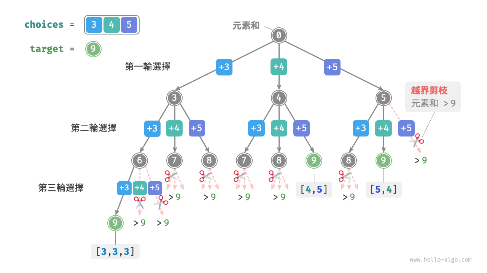
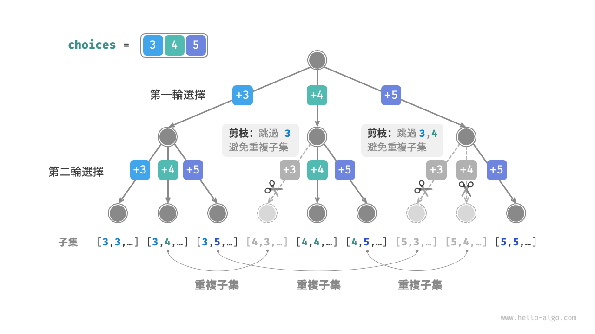
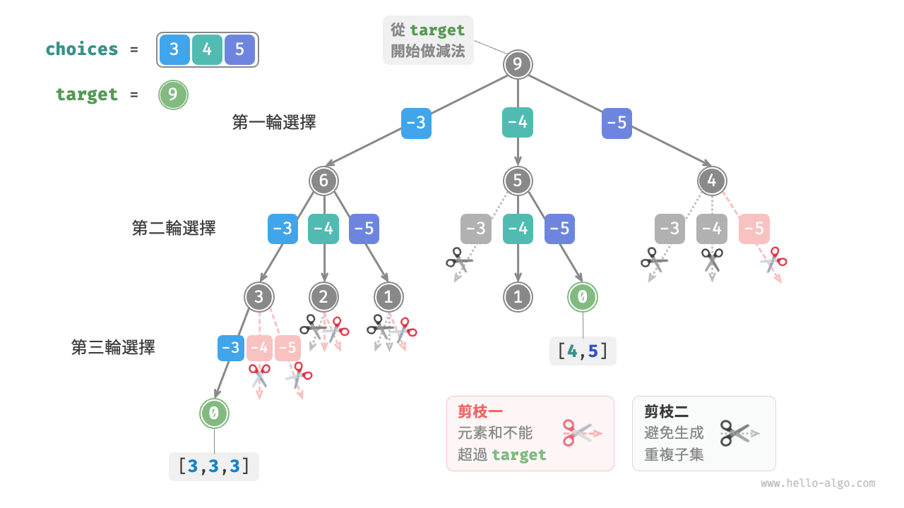
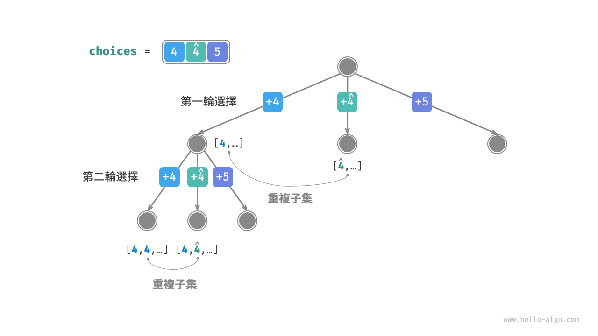
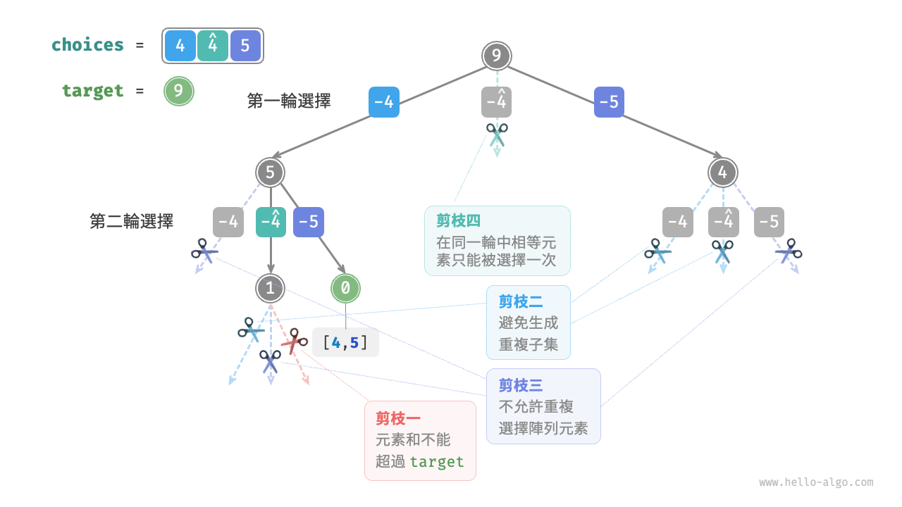

# 子集和问题

## 无重复元素的情况

!!! question

    给定一个正整数数组 `nums` 和一个目标正整数 `target` ，请找出所有可能的组合，使得组合中的元素和等于 `target` 。给定数组无重复元素，每个元素可以被选取多次。请以列表形式返回这些组合，列表中不应包含重复组合。

例如，输入集合 $\{3, 4, 5\}$ 和目标整数 $9$ ，解为 $\{3, 3, 3\}, \{4, 5\}$ 。需要注意以下两点。

- 输入集合中的元素可以被无限次重复选取。
- 子集不区分元素顺序，比如 $\{4, 5\}$ 和 $\{5, 4\}$ 是同一个子集。

### 参考全排列解法

类似于全排列问题，我们可以把子集的生成过程想象成一系列选择的结果，并在选择过程中实时更新“元素和”，当元素和等于 `target` 时，就将子集记录至结果列表。

而与全排列问题不同的是，**本题集合中的元素可以被无限次选取**，因此无须借助 `selected` 布尔列表来记录元素是否已被选择。我们可以对全排列代码进行小幅修改，初步得到解题代码：

```src
[file]{subset_sum_i_naive}-[class]{}-[func]{subset_sum_i_naive}
```

向以上代码输入数组 $[3, 4, 5]$ 和目标元素 $9$ ，输出结果为 $[3, 3, 3], [4, 5], [5, 4]$ 。**虽然成功找出了所有和为 $9$ 的子集，但其中存在重复的子集 $[4, 5]$ 和 $[5, 4]$** 。

这是因为搜索过程是区分选择顺序的，然而子集不区分选择顺序。如下图所示，先选 $4$ 后选 $5$ 与先选 $5$ 后选 $4$ 是不同的分支，但对应同一个子集。



为了去除重复子集，**一种直接的思路是对结果列表进行去重**。但这个方法效率很低，有两方面原因。

- 当数组元素较多，尤其是当 `target` 较大时，搜索过程会产生大量的重复子集。
- 比较子集（数组）的异同非常耗时，需要先排序数组，再比较数组中每个元素的异同。

### 重复子集剪枝

**我们考虑在搜索过程中通过剪枝进行去重**。观察下图，重复子集是在以不同顺序选择数组元素时产生的，例如以下情况。

1. 当第一轮和第二轮分别选择 $3$ 和 $4$ 时，会生成包含这两个元素的所有子集，记为 $[3, 4, \dots]$ 。
2. 之后，当第一轮选择 $4$ 时，**则第二轮应该跳过 $3$** ，因为该选择产生的子集 $[4, 3, \dots]$ 和第 `1.` 步中生成的子集完全重复。

在搜索过程中，每一层的选择都是从左到右被逐个尝试的，因此越靠右的分支被剪掉的越多。

1. 前两轮选择 $3$ 和 $5$ ，生成子集 $[3, 5, \dots]$ 。
2. 前两轮选择 $4$ 和 $5$ ，生成子集 $[4, 5, \dots]$ 。
3. 若第一轮选择 $5$ ，**则第二轮应该跳过 $3$ 和 $4$** ，因为子集 $[5, 3, \dots]$ 和 $[5, 4, \dots]$ 与第 `1.` 步和第 `2.` 步中描述的子集完全重复。



总结来看，给定输入数组 $[x_1, x_2, \dots, x_n]$ ，设搜索过程中的选择序列为 $[x_{i_1}, x_{i_2}, \dots, x_{i_m}]$ ，则该选择序列需要满足 $i_1 \leq i_2 \leq \dots \leq i_m$ ，**不满足该条件的选择序列都会造成重复，应当剪枝**。

### 代码实现

为实现该剪枝，我们初始化变量 `start` ，用于指示遍历起始点。**当做出选择 $x_{i}$ 后，设定下一轮从索引 $i$ 开始遍历**。这样做就可以让选择序列满足 $i_1 \leq i_2 \leq \dots \leq i_m$ ，从而保证子集唯一。

除此之外，我们还对代码进行了以下两项优化。

- 在开启搜索前，先将数组 `nums` 排序。在遍历所有选择时，**当子集和超过 `target` 时直接结束循环**，因为后边的元素更大，其子集和一定超过 `target` 。
- 省去元素和变量 `total` ，**通过在 `target` 上执行减法来统计元素和**，当 `target` 等于 $0$ 时记录解。

```src
[file]{subset_sum_i}-[class]{}-[func]{subset_sum_i}
```

下图所示为将数组 $[3, 4, 5]$ 和目标元素 $9$ 输入以上代码后的整体回溯过程。



## 考虑重复元素的情况

!!! question

    给定一个正整数数组 `nums` 和一个目标正整数 `target` ，请找出所有可能的组合，使得组合中的元素和等于 `target` 。**给定数组可能包含重复元素，每个元素只可被选择一次**。请以列表形式返回这些组合，列表中不应包含重复组合。

相比于上题，**本题的输入数组可能包含重复元素**，这引入了新的问题。例如，给定数组 $[4, \hat{4}, 5]$ 和目标元素 $9$ ，则现有代码的输出结果为 $[4, 5], [\hat{4}, 5]$ ，出现了重复子集。

**造成这种重复的原因是相等元素在某轮中被多次选择**。在下图中，第一轮共有三个选择，其中两个都为 $4$ ，会产生两个重复的搜索分支，从而输出重复子集；同理，第二轮的两个 $4$ 也会产生重复子集。



### 相等元素剪枝

为解决此问题，**我们需要限制相等元素在每一轮中只能被选择一次**。实现方式比较巧妙：由于数组是已排序的，因此相等元素都是相邻的。这意味着在某轮选择中，若当前元素与其左边元素相等，则说明它已经被选择过，因此直接跳过当前元素。

与此同时，**本题规定每个数组元素只能被选择一次**。幸运的是，我们也可以利用变量 `start` 来满足该约束：当做出选择 $x_{i}$ 后，设定下一轮从索引 $i + 1$ 开始向后遍历。这样既能去除重复子集，也能避免重复选择元素。

### 代码实现

```src
[file]{subset_sum_ii}-[class]{}-[func]{subset_sum_ii}
```

下图展示了数组 $[4, 4, 5]$ 和目标元素 $9$ 的回溯过程，共包含四种剪枝操作。请你将图示与代码注释相结合，理解整个搜索过程，以及每种剪枝操作是如何工作的。


