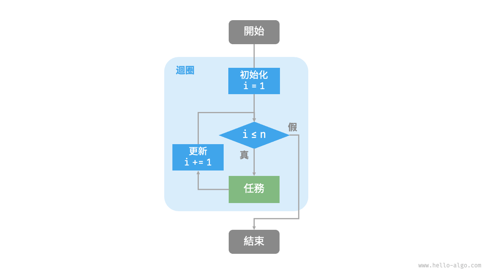
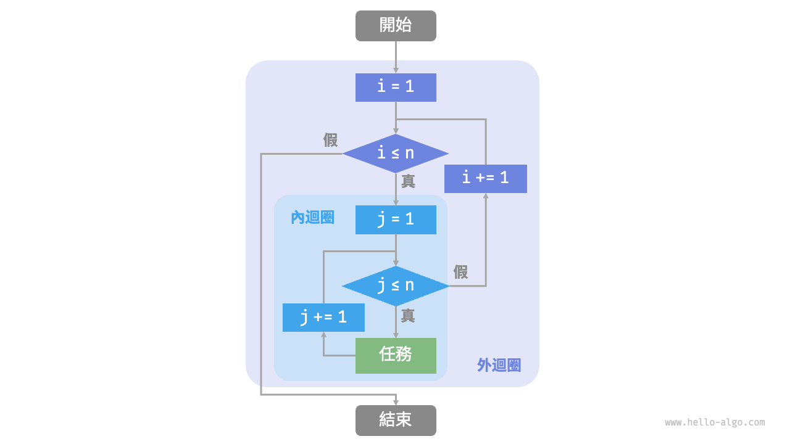
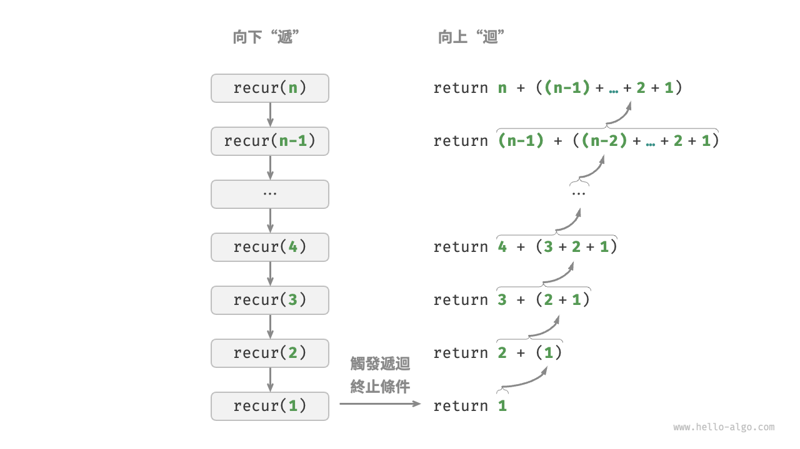
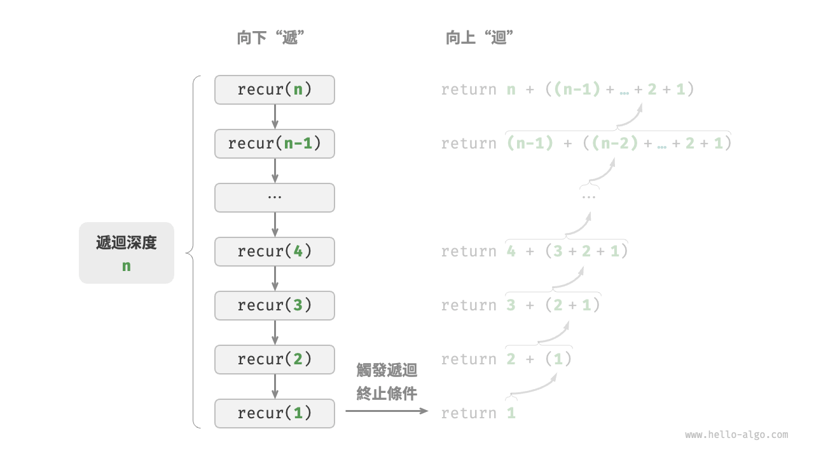
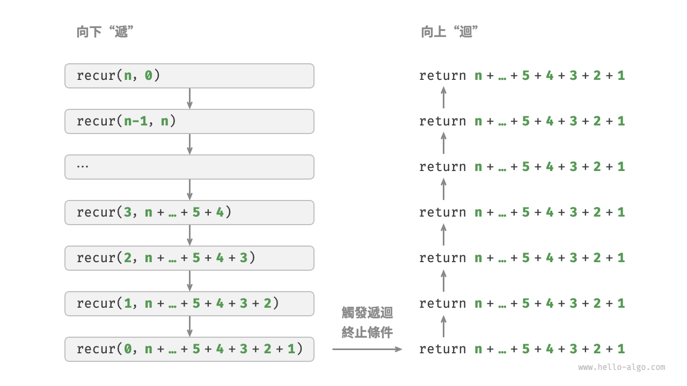
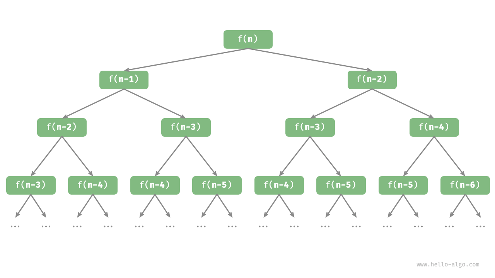

# 2.2 &nbsp; 迭代與遞迴

在演算法中，重複執行某個任務是很常見的，它與複雜度分析息息相關。因此，在介紹時間複雜度和空間複雜度之前，我們先來了解如何在程式中實現重複執行任務，即兩種基本的程式控制結構：迭代、遞迴。

## 2.2.1 &nbsp; 迭代

<u>迭代（iteration）</u>是一種重複執行某個任務的控制結構。在迭代中，程式會在滿足一定的條件下重複執行某段程式碼，直到這個條件不再滿足。

### 1. &nbsp; for 迴圈

`for` 迴圈是最常見的迭代形式之一，**適合在預先知道迭代次數時使用**。

以下函式基於 `for` 迴圈實現了求和 $1 + 2 + \dots + n$ ，求和結果使用變數 `res` 記錄。需要注意的是，Python 中 `range(a, b)` 對應的區間是“左閉右開”的，對應的走訪範圍為 $a, a + 1, \dots, b-1$ ：

=== "Python"

    ```python title="iteration.py"
    def for_loop(n: int) -> int:
        """for 迴圈"""
        res = 0
        # 迴圈求和 1, 2, ..., n-1, n
        for i in range(1, n + 1):
            res += i
        return res
    ```

=== "C++"

    ```cpp title="iteration.cpp"
    /* for 迴圈 */
    int forLoop(int n) {
        int res = 0;
        // 迴圈求和 1, 2, ..., n-1, n
        for (int i = 1; i <= n; ++i) {
            res += i;
        }
        return res;
    }
    ```

=== "Java"

    ```java title="iteration.java"
    /* for 迴圈 */
    int forLoop(int n) {
        int res = 0;
        // 迴圈求和 1, 2, ..., n-1, n
        for (int i = 1; i <= n; i++) {
            res += i;
        }
        return res;
    }
    ```

=== "C#"

    ```csharp title="iteration.cs"
    /* for 迴圈 */
    int ForLoop(int n) {
        int res = 0;
        // 迴圈求和 1, 2, ..., n-1, n
        for (int i = 1; i <= n; i++) {
            res += i;
        }
        return res;
    }
    ```

=== "Go"

    ```go title="iteration.go"
    /* for 迴圈 */
    func forLoop(n int) int {
        res := 0
        // 迴圈求和 1, 2, ..., n-1, n
        for i := 1; i <= n; i++ {
            res += i
        }
        return res
    }
    ```

=== "Swift"

    ```swift title="iteration.swift"
    /* for 迴圈 */
    func forLoop(n: Int) -> Int {
        var res = 0
        // 迴圈求和 1, 2, ..., n-1, n
        for i in 1 ... n {
            res += i
        }
        return res
    }
    ```

=== "JS"

    ```javascript title="iteration.js"
    /* for 迴圈 */
    function forLoop(n) {
        let res = 0;
        // 迴圈求和 1, 2, ..., n-1, n
        for (let i = 1; i <= n; i++) {
            res += i;
        }
        return res;
    }
    ```

=== "TS"

    ```typescript title="iteration.ts"
    /* for 迴圈 */
    function forLoop(n: number): number {
        let res = 0;
        // 迴圈求和 1, 2, ..., n-1, n
        for (let i = 1; i <= n; i++) {
            res += i;
        }
        return res;
    }
    ```

=== "Dart"

    ```dart title="iteration.dart"
    /* for 迴圈 */
    int forLoop(int n) {
      int res = 0;
      // 迴圈求和 1, 2, ..., n-1, n
      for (int i = 1; i <= n; i++) {
        res += i;
      }
      return res;
    }
    ```

=== "Rust"

    ```rust title="iteration.rs"
    /* for 迴圈 */
    fn for_loop(n: i32) -> i32 {
        let mut res = 0;
        // 迴圈求和 1, 2, ..., n-1, n
        for i in 1..=n {
            res += i;
        }
        res
    }
    ```

=== "C"

    ```c title="iteration.c"
    /* for 迴圈 */
    int forLoop(int n) {
        int res = 0;
        // 迴圈求和 1, 2, ..., n-1, n
        for (int i = 1; i <= n; i++) {
            res += i;
        }
        return res;
    }
    ```

=== "Kotlin"

    ```kotlin title="iteration.kt"
    /* for 迴圈 */
    fun forLoop(n: Int): Int {
        var res = 0
        // 迴圈求和 1, 2, ..., n-1, n
        for (i in 1..n) {
            res += i
        }
        return res
    }
    ```

=== "Ruby"

    ```ruby title="iteration.rb"
    ### for 迴圈 ###
    def for_loop(n)
      res = 0

      # 迴圈求和 1, 2, ..., n-1, n
      for i in 1..n
        res += i
      end

      res
    end
    ```

=== "Zig"

    ```zig title="iteration.zig"
    // for 迴圈
    fn forLoop(n: usize) i32 {
        var res: i32 = 0;
        // 迴圈求和 1, 2, ..., n-1, n
        for (1..n+1) |i| {
            res = res + @as(i32, @intCast(i));
        }
        return res;
    } 
    ```

??? pythontutor "視覺化執行"

    <div style="height: 423px; width: 100%;"><iframe class="pythontutor-iframe" src="https://pythontutor.com/iframe-embed.html#code=def%20for_loop%28n%3A%20int%29%20-%3E%20int%3A%0A%20%20%20%20%22%22%22for%20%E8%BF%B4%E5%9C%88%22%22%22%0A%20%20%20%20res%20%3D%200%0A%20%20%20%20%23%20%E8%BF%B4%E5%9C%88%E6%B1%82%E5%92%8C%201%2C%202%2C%20...%2C%20n-1%2C%20n%0A%20%20%20%20for%20i%20in%20range%281%2C%20n%20%2B%201%29%3A%0A%20%20%20%20%20%20%20%20res%20%2B%3D%20i%0A%20%20%20%20return%20res%0A%0A%22%22%22Driver%20Code%22%22%22%0Aif%20__name__%20%3D%3D%20%22__main__%22%3A%0A%20%20%20%20n%20%3D%205%0A%20%20%20%20res%20%3D%20for_loop%28n%29%0A%20%20%20%20print%28f%22%5Cnfor%20%E8%BF%B4%E5%9C%88%E7%9A%84%E6%B1%82%E5%92%8C%E7%B5%90%E6%9E%9C%20res%20%3D%20%7Bres%7D%22%29&codeDivHeight=472&codeDivWidth=350&cumulative=false&curInstr=3&heapPrimitives=nevernest&origin=opt-frontend.js&py=311&rawInputLstJSON=%5B%5D&"> </iframe></div>
    <div style="margin-top: 5px;"><a href="https://pythontutor.com/iframe-embed.html#code=def%20for_loop%28n%3A%20int%29%20-%3E%20int%3A%0A%20%20%20%20%22%22%22for%20%E8%BF%B4%E5%9C%88%22%22%22%0A%20%20%20%20res%20%3D%200%0A%20%20%20%20%23%20%E8%BF%B4%E5%9C%88%E6%B1%82%E5%92%8C%201%2C%202%2C%20...%2C%20n-1%2C%20n%0A%20%20%20%20for%20i%20in%20range%281%2C%20n%20%2B%201%29%3A%0A%20%20%20%20%20%20%20%20res%20%2B%3D%20i%0A%20%20%20%20return%20res%0A%0A%22%22%22Driver%20Code%22%22%22%0Aif%20__name__%20%3D%3D%20%22__main__%22%3A%0A%20%20%20%20n%20%3D%205%0A%20%20%20%20res%20%3D%20for_loop%28n%29%0A%20%20%20%20print%28f%22%5Cnfor%20%E8%BF%B4%E5%9C%88%E7%9A%84%E6%B1%82%E5%92%8C%E7%B5%90%E6%9E%9C%20res%20%3D%20%7Bres%7D%22%29&codeDivHeight=800&codeDivWidth=600&cumulative=false&curInstr=3&heapPrimitives=nevernest&origin=opt-frontend.js&py=311&rawInputLstJSON=%5B%5D&" target="_blank" rel="noopener noreferrer">全螢幕觀看 ></a></div>

圖 2-1 是該求和函式的流程框圖。

{ class="animation-figure" }

<p align="center"> 圖 2-1 &nbsp; 求和函式的流程框圖 </p>

此求和函式的操作數量與輸入資料大小 $n$ 成正比，或者說成“線性關係”。實際上，**時間複雜度描述的就是這個“線性關係”**。相關內容將會在下一節中詳細介紹。

### 2. &nbsp; while 迴圈

與 `for` 迴圈類似，`while` 迴圈也是一種實現迭代的方法。在 `while` 迴圈中，程式每輪都會先檢查條件，如果條件為真，則繼續執行，否則就結束迴圈。

下面我們用 `while` 迴圈來實現求和 $1 + 2 + \dots + n$ ：

=== "Python"

    ```python title="iteration.py"
    def while_loop(n: int) -> int:
        """while 迴圈"""
        res = 0
        i = 1  # 初始化條件變數
        # 迴圈求和 1, 2, ..., n-1, n
        while i <= n:
            res += i
            i += 1  # 更新條件變數
        return res
    ```

=== "C++"

    ```cpp title="iteration.cpp"
    /* while 迴圈 */
    int whileLoop(int n) {
        int res = 0;
        int i = 1; // 初始化條件變數
        // 迴圈求和 1, 2, ..., n-1, n
        while (i <= n) {
            res += i;
            i++; // 更新條件變數
        }
        return res;
    }
    ```

=== "Java"

    ```java title="iteration.java"
    /* while 迴圈 */
    int whileLoop(int n) {
        int res = 0;
        int i = 1; // 初始化條件變數
        // 迴圈求和 1, 2, ..., n-1, n
        while (i <= n) {
            res += i;
            i++; // 更新條件變數
        }
        return res;
    }
    ```

=== "C#"

    ```csharp title="iteration.cs"
    /* while 迴圈 */
    int WhileLoop(int n) {
        int res = 0;
        int i = 1; // 初始化條件變數
        // 迴圈求和 1, 2, ..., n-1, n
        while (i <= n) {
            res += i;
            i += 1; // 更新條件變數
        }
        return res;
    }
    ```

=== "Go"

    ```go title="iteration.go"
    /* while 迴圈 */
    func whileLoop(n int) int {
        res := 0
        // 初始化條件變數
        i := 1
        // 迴圈求和 1, 2, ..., n-1, n
        for i <= n {
            res += i
            // 更新條件變數
            i++
        }
        return res
    }
    ```

=== "Swift"

    ```swift title="iteration.swift"
    /* while 迴圈 */
    func whileLoop(n: Int) -> Int {
        var res = 0
        var i = 1 // 初始化條件變數
        // 迴圈求和 1, 2, ..., n-1, n
        while i <= n {
            res += i
            i += 1 // 更新條件變數
        }
        return res
    }
    ```

=== "JS"

    ```javascript title="iteration.js"
    /* while 迴圈 */
    function whileLoop(n) {
        let res = 0;
        let i = 1; // 初始化條件變數
        // 迴圈求和 1, 2, ..., n-1, n
        while (i <= n) {
            res += i;
            i++; // 更新條件變數
        }
        return res;
    }
    ```

=== "TS"

    ```typescript title="iteration.ts"
    /* while 迴圈 */
    function whileLoop(n: number): number {
        let res = 0;
        let i = 1; // 初始化條件變數
        // 迴圈求和 1, 2, ..., n-1, n
        while (i <= n) {
            res += i;
            i++; // 更新條件變數
        }
        return res;
    }
    ```

=== "Dart"

    ```dart title="iteration.dart"
    /* while 迴圈 */
    int whileLoop(int n) {
      int res = 0;
      int i = 1; // 初始化條件變數
      // 迴圈求和 1, 2, ..., n-1, n
      while (i <= n) {
        res += i;
        i++; // 更新條件變數
      }
      return res;
    }
    ```

=== "Rust"

    ```rust title="iteration.rs"
    /* while 迴圈 */
    fn while_loop(n: i32) -> i32 {
        let mut res = 0;
        let mut i = 1; // 初始化條件變數

        // 迴圈求和 1, 2, ..., n-1, n
        while i <= n {
            res += i;
            i += 1; // 更新條件變數
        }
        res
    }
    ```

=== "C"

    ```c title="iteration.c"
    /* while 迴圈 */
    int whileLoop(int n) {
        int res = 0;
        int i = 1; // 初始化條件變數
        // 迴圈求和 1, 2, ..., n-1, n
        while (i <= n) {
            res += i;
            i++; // 更新條件變數
        }
        return res;
    }
    ```

=== "Kotlin"

    ```kotlin title="iteration.kt"
    /* while 迴圈 */
    fun whileLoop(n: Int): Int {
        var res = 0
        var i = 1 // 初始化條件變數
        // 迴圈求和 1, 2, ..., n-1, n
        while (i <= n) {
            res += i
            i++ // 更新條件變數
        }
        return res
    }
    ```

=== "Ruby"

    ```ruby title="iteration.rb"
    ### while 迴圈 ###
    def while_loop(n)
      res = 0
      i = 1 # 初始化條件變數

      # 迴圈求和 1, 2, ..., n-1, n
      while i <= n
        res += i
        i += 1 # 更新條件變數
      end

      res
    end
    ```

=== "Zig"

    ```zig title="iteration.zig"
    // while 迴圈
    fn whileLoop(n: i32) i32 {
        var res: i32 = 0;
        var i: i32 = 1; // 初始化條件變數
        // 迴圈求和 1, 2, ..., n-1, n
        while (i <= n) {
            res += @intCast(i);
            i += 1;
        }
        return res;
    }
    ```

??? pythontutor "視覺化執行"

    <div style="height: 459px; width: 100%;"><iframe class="pythontutor-iframe" src="https://pythontutor.com/iframe-embed.html#code=def%20while_loop%28n%3A%20int%29%20-%3E%20int%3A%0A%20%20%20%20%22%22%22while%20%E8%BF%B4%E5%9C%88%22%22%22%0A%20%20%20%20res%20%3D%200%0A%20%20%20%20i%20%3D%201%20%20%23%20%E5%88%9D%E5%A7%8B%E5%8C%96%E6%A2%9D%E4%BB%B6%E8%AE%8A%E6%95%B8%0A%20%20%20%20%23%20%E8%BF%B4%E5%9C%88%E6%B1%82%E5%92%8C%201%2C%202%2C%20...%2C%20n-1%2C%20n%0A%20%20%20%20while%20i%20%3C%3D%20n%3A%0A%20%20%20%20%20%20%20%20res%20%2B%3D%20i%0A%20%20%20%20%20%20%20%20i%20%2B%3D%201%20%20%23%20%E6%9B%B4%E6%96%B0%E6%A2%9D%E4%BB%B6%E8%AE%8A%E6%95%B8%0A%20%20%20%20return%20res%0A%0A%22%22%22Driver%20Code%22%22%22%0Aif%20__name__%20%3D%3D%20%22__main__%22%3A%0A%20%20%20%20n%20%3D%205%0A%20%20%20%20res%20%3D%20while_loop%28n%29%0A%20%20%20%20print%28f%22%5Cnwhile%20%E8%BF%B4%E5%9C%88%E7%9A%84%E6%B1%82%E5%92%8C%E7%B5%90%E6%9E%9C%20res%20%3D%20%7Bres%7D%22%29&codeDivHeight=472&codeDivWidth=350&cumulative=false&curInstr=3&heapPrimitives=nevernest&origin=opt-frontend.js&py=311&rawInputLstJSON=%5B%5D&textReferences=false"> </iframe></div>
    <div style="margin-top: 5px;"><a href="https://pythontutor.com/iframe-embed.html#code=def%20while_loop%28n%3A%20int%29%20-%3E%20int%3A%0A%20%20%20%20%22%22%22while%20%E8%BF%B4%E5%9C%88%22%22%22%0A%20%20%20%20res%20%3D%200%0A%20%20%20%20i%20%3D%201%20%20%23%20%E5%88%9D%E5%A7%8B%E5%8C%96%E6%A2%9D%E4%BB%B6%E8%AE%8A%E6%95%B8%0A%20%20%20%20%23%20%E8%BF%B4%E5%9C%88%E6%B1%82%E5%92%8C%201%2C%202%2C%20...%2C%20n-1%2C%20n%0A%20%20%20%20while%20i%20%3C%3D%20n%3A%0A%20%20%20%20%20%20%20%20res%20%2B%3D%20i%0A%20%20%20%20%20%20%20%20i%20%2B%3D%201%20%20%23%20%E6%9B%B4%E6%96%B0%E6%A2%9D%E4%BB%B6%E8%AE%8A%E6%95%B8%0A%20%20%20%20return%20res%0A%0A%22%22%22Driver%20Code%22%22%22%0Aif%20__name__%20%3D%3D%20%22__main__%22%3A%0A%20%20%20%20n%20%3D%205%0A%20%20%20%20res%20%3D%20while_loop%28n%29%0A%20%20%20%20print%28f%22%5Cnwhile%20%E8%BF%B4%E5%9C%88%E7%9A%84%E6%B1%82%E5%92%8C%E7%B5%90%E6%9E%9C%20res%20%3D%20%7Bres%7D%22%29&codeDivHeight=800&codeDivWidth=600&cumulative=false&curInstr=3&heapPrimitives=nevernest&origin=opt-frontend.js&py=311&rawInputLstJSON=%5B%5D&textReferences=false" target="_blank" rel="noopener noreferrer">全螢幕觀看 ></a></div>

**`while` 迴圈比 `for` 迴圈的自由度更高**。在 `while` 迴圈中，我們可以自由地設計條件變數的初始化和更新步驟。

例如在以下程式碼中，條件變數 $i$ 每輪進行兩次更新，這種情況就不太方便用 `for` 迴圈實現：

=== "Python"

    ```python title="iteration.py"
    def while_loop_ii(n: int) -> int:
        """while 迴圈（兩次更新）"""
        res = 0
        i = 1  # 初始化條件變數
        # 迴圈求和 1, 4, 10, ...
        while i <= n:
            res += i
            # 更新條件變數
            i += 1
            i *= 2
        return res
    ```

=== "C++"

    ```cpp title="iteration.cpp"
    /* while 迴圈（兩次更新） */
    int whileLoopII(int n) {
        int res = 0;
        int i = 1; // 初始化條件變數
        // 迴圈求和 1, 4, 10, ...
        while (i <= n) {
            res += i;
            // 更新條件變數
            i++;
            i *= 2;
        }
        return res;
    }
    ```

=== "Java"

    ```java title="iteration.java"
    /* while 迴圈（兩次更新） */
    int whileLoopII(int n) {
        int res = 0;
        int i = 1; // 初始化條件變數
        // 迴圈求和 1, 4, 10, ...
        while (i <= n) {
            res += i;
            // 更新條件變數
            i++;
            i *= 2;
        }
        return res;
    }
    ```

=== "C#"

    ```csharp title="iteration.cs"
    /* while 迴圈（兩次更新） */
    int WhileLoopII(int n) {
        int res = 0;
        int i = 1; // 初始化條件變數
        // 迴圈求和 1, 4, 10, ...
        while (i <= n) {
            res += i;
            // 更新條件變數
            i += 1; 
            i *= 2;
        }
        return res;
    }
    ```

=== "Go"

    ```go title="iteration.go"
    /* while 迴圈（兩次更新） */
    func whileLoopII(n int) int {
        res := 0
        // 初始化條件變數
        i := 1
        // 迴圈求和 1, 4, 10, ...
        for i <= n {
            res += i
            // 更新條件變數
            i++
            i *= 2
        }
        return res
    }
    ```

=== "Swift"

    ```swift title="iteration.swift"
    /* while 迴圈（兩次更新） */
    func whileLoopII(n: Int) -> Int {
        var res = 0
        var i = 1 // 初始化條件變數
        // 迴圈求和 1, 4, 10, ...
        while i <= n {
            res += i
            // 更新條件變數
            i += 1
            i *= 2
        }
        return res
    }
    ```

=== "JS"

    ```javascript title="iteration.js"
    /* while 迴圈（兩次更新） */
    function whileLoopII(n) {
        let res = 0;
        let i = 1; // 初始化條件變數
        // 迴圈求和 1, 4, 10, ...
        while (i <= n) {
            res += i;
            // 更新條件變數
            i++;
            i *= 2;
        }
        return res;
    }
    ```

=== "TS"

    ```typescript title="iteration.ts"
    /* while 迴圈（兩次更新） */
    function whileLoopII(n: number): number {
        let res = 0;
        let i = 1; // 初始化條件變數
        // 迴圈求和 1, 4, 10, ...
        while (i <= n) {
            res += i;
            // 更新條件變數
            i++;
            i *= 2;
        }
        return res;
    }
    ```

=== "Dart"

    ```dart title="iteration.dart"
    /* while 迴圈（兩次更新） */
    int whileLoopII(int n) {
      int res = 0;
      int i = 1; // 初始化條件變數
      // 迴圈求和 1, 4, 10, ...
      while (i <= n) {
        res += i;
        // 更新條件變數
        i++;
        i *= 2;
      }
      return res;
    }
    ```

=== "Rust"

    ```rust title="iteration.rs"
    /* while 迴圈（兩次更新） */
    fn while_loop_ii(n: i32) -> i32 {
        let mut res = 0;
        let mut i = 1; // 初始化條件變數

        // 迴圈求和 1, 4, 10, ...
        while i <= n {
            res += i;
            // 更新條件變數
            i += 1;
            i *= 2;
        }
        res
    }
    ```

=== "C"

    ```c title="iteration.c"
    /* while 迴圈（兩次更新） */
    int whileLoopII(int n) {
        int res = 0;
        int i = 1; // 初始化條件變數
        // 迴圈求和 1, 4, 10, ...
        while (i <= n) {
            res += i;
            // 更新條件變數
            i++;
            i *= 2;
        }
        return res;
    }
    ```

=== "Kotlin"

    ```kotlin title="iteration.kt"
    /* while 迴圈（兩次更新） */
    fun whileLoopII(n: Int): Int {
        var res = 0
        var i = 1 // 初始化條件變數
        // 迴圈求和 1, 4, 10, ...
        while (i <= n) {
            res += i
            // 更新條件變數
            i++
            i *= 2
        }
        return res
    }
    ```

=== "Ruby"

    ```ruby title="iteration.rb"
    ### while 迴圈（兩次更新）###
    def while_loop_ii(n)
      res = 0
      i = 1 # 初始化條件變數

      # 迴圈求和 1, 4, 10, ...
      while i <= n
        res += i
        # 更新條件變數
        i += 1
        i *= 2
      end

      res
    end
    ```

=== "Zig"

    ```zig title="iteration.zig"
    //  while 迴圈（兩次更新）
    fn whileLoopII(n: i32) i32 {
        var res: i32 = 0;
        var i: i32 = 1; // 初始化條件變數
        // 迴圈求和 1, 4, 10, ...
        while (i <= n) {
            res += @intCast(i);
            // 更新條件變數
            i += 1;
            i *= 2;
        }
        return res;
    }
    ```

??? pythontutor "視覺化執行"

    <div style="height: 495px; width: 100%;"><iframe class="pythontutor-iframe" src="https://pythontutor.com/iframe-embed.html#code=def%20while_loop_ii%28n%3A%20int%29%20-%3E%20int%3A%0A%20%20%20%20%22%22%22while%20%E8%BF%B4%E5%9C%88%EF%BC%88%E5%85%A9%E6%AC%A1%E6%9B%B4%E6%96%B0%EF%BC%89%22%22%22%0A%20%20%20%20res%20%3D%200%0A%20%20%20%20i%20%3D%201%20%20%23%20%E5%88%9D%E5%A7%8B%E5%8C%96%E6%A2%9D%E4%BB%B6%E8%AE%8A%E6%95%B8%0A%20%20%20%20%23%20%E8%BF%B4%E5%9C%88%E6%B1%82%E5%92%8C%201%2C%204%2C%2010%2C%20...%0A%20%20%20%20while%20i%20%3C%3D%20n%3A%0A%20%20%20%20%20%20%20%20res%20%2B%3D%20i%0A%20%20%20%20%20%20%20%20%23%20%E6%9B%B4%E6%96%B0%E6%A2%9D%E4%BB%B6%E8%AE%8A%E6%95%B8%0A%20%20%20%20%20%20%20%20i%20%2B%3D%201%0A%20%20%20%20%20%20%20%20i%20%2A%3D%202%0A%20%20%20%20return%20res%0A%0A%22%22%22Driver%20Code%22%22%22%0Aif%20__name__%20%3D%3D%20%22__main__%22%3A%0A%20%20%20%20n%20%3D%205%0A%20%20%20%20res%20%3D%20while_loop_ii%28n%29%0A%20%20%20%20print%28f%22%5Cnwhile%20%E8%BF%B4%E5%9C%88%EF%BC%88%E5%85%A9%E6%AC%A1%E6%9B%B4%E6%96%B0%EF%BC%89%E6%B1%82%E5%92%8C%E7%B5%90%E6%9E%9C%20res%20%3D%20%7Bres%7D%22%29&codeDivHeight=472&codeDivWidth=350&cumulative=false&curInstr=3&heapPrimitives=nevernest&origin=opt-frontend.js&py=311&rawInputLstJSON=%5B%5D&textReferences=false"> </iframe></div>
    <div style="margin-top: 5px;"><a href="https://pythontutor.com/iframe-embed.html#code=def%20while_loop_ii%28n%3A%20int%29%20-%3E%20int%3A%0A%20%20%20%20%22%22%22while%20%E8%BF%B4%E5%9C%88%EF%BC%88%E5%85%A9%E6%AC%A1%E6%9B%B4%E6%96%B0%EF%BC%89%22%22%22%0A%20%20%20%20res%20%3D%200%0A%20%20%20%20i%20%3D%201%20%20%23%20%E5%88%9D%E5%A7%8B%E5%8C%96%E6%A2%9D%E4%BB%B6%E8%AE%8A%E6%95%B8%0A%20%20%20%20%23%20%E8%BF%B4%E5%9C%88%E6%B1%82%E5%92%8C%201%2C%204%2C%2010%2C%20...%0A%20%20%20%20while%20i%20%3C%3D%20n%3A%0A%20%20%20%20%20%20%20%20res%20%2B%3D%20i%0A%20%20%20%20%20%20%20%20%23%20%E6%9B%B4%E6%96%B0%E6%A2%9D%E4%BB%B6%E8%AE%8A%E6%95%B8%0A%20%20%20%20%20%20%20%20i%20%2B%3D%201%0A%20%20%20%20%20%20%20%20i%20%2A%3D%202%0A%20%20%20%20return%20res%0A%0A%22%22%22Driver%20Code%22%22%22%0Aif%20__name__%20%3D%3D%20%22__main__%22%3A%0A%20%20%20%20n%20%3D%205%0A%20%20%20%20res%20%3D%20while_loop_ii%28n%29%0A%20%20%20%20print%28f%22%5Cnwhile%20%E8%BF%B4%E5%9C%88%EF%BC%88%E5%85%A9%E6%AC%A1%E6%9B%B4%E6%96%B0%EF%BC%89%E6%B1%82%E5%92%8C%E7%B5%90%E6%9E%9C%20res%20%3D%20%7Bres%7D%22%29&codeDivHeight=800&codeDivWidth=600&cumulative=false&curInstr=3&heapPrimitives=nevernest&origin=opt-frontend.js&py=311&rawInputLstJSON=%5B%5D&textReferences=false" target="_blank" rel="noopener noreferrer">全螢幕觀看 ></a></div>

總的來說，**`for` 迴圈的程式碼更加緊湊，`while` 迴圈更加靈活**，兩者都可以實現迭代結構。選擇使用哪一個應該根據特定問題的需求來決定。

### 3. &nbsp; 巢狀迴圈

我們可以在一個迴圈結構內巢狀另一個迴圈結構，下面以 `for` 迴圈為例：

=== "Python"

    ```python title="iteration.py"
    def nested_for_loop(n: int) -> str:
        """雙層 for 迴圈"""
        res = ""
        # 迴圈 i = 1, 2, ..., n-1, n
        for i in range(1, n + 1):
            # 迴圈 j = 1, 2, ..., n-1, n
            for j in range(1, n + 1):
                res += f"({i}, {j}), "
        return res
    ```

=== "C++"

    ```cpp title="iteration.cpp"
    /* 雙層 for 迴圈 */
    string nestedForLoop(int n) {
        ostringstream res;
        // 迴圈 i = 1, 2, ..., n-1, n
        for (int i = 1; i <= n; ++i) {
            // 迴圈 j = 1, 2, ..., n-1, n
            for (int j = 1; j <= n; ++j) {
                res << "(" << i << ", " << j << "), ";
            }
        }
        return res.str();
    }
    ```

=== "Java"

    ```java title="iteration.java"
    /* 雙層 for 迴圈 */
    String nestedForLoop(int n) {
        StringBuilder res = new StringBuilder();
        // 迴圈 i = 1, 2, ..., n-1, n
        for (int i = 1; i <= n; i++) {
            // 迴圈 j = 1, 2, ..., n-1, n
            for (int j = 1; j <= n; j++) {
                res.append("(" + i + ", " + j + "), ");
            }
        }
        return res.toString();
    }
    ```

=== "C#"

    ```csharp title="iteration.cs"
    /* 雙層 for 迴圈 */
    string NestedForLoop(int n) {
        StringBuilder res = new();
        // 迴圈 i = 1, 2, ..., n-1, n
        for (int i = 1; i <= n; i++) {
            // 迴圈 j = 1, 2, ..., n-1, n
            for (int j = 1; j <= n; j++) {
                res.Append($"({i}, {j}), ");
            }
        }
        return res.ToString();
    }
    ```

=== "Go"

    ```go title="iteration.go"
    /* 雙層 for 迴圈 */
    func nestedForLoop(n int) string {
        res := ""
        // 迴圈 i = 1, 2, ..., n-1, n
        for i := 1; i <= n; i++ {
            for j := 1; j <= n; j++ {
                // 迴圈 j = 1, 2, ..., n-1, n
                res += fmt.Sprintf("(%d, %d), ", i, j)
            }
        }
        return res
    }
    ```

=== "Swift"

    ```swift title="iteration.swift"
    /* 雙層 for 迴圈 */
    func nestedForLoop(n: Int) -> String {
        var res = ""
        // 迴圈 i = 1, 2, ..., n-1, n
        for i in 1 ... n {
            // 迴圈 j = 1, 2, ..., n-1, n
            for j in 1 ... n {
                res.append("(\(i), \(j)), ")
            }
        }
        return res
    }
    ```

=== "JS"

    ```javascript title="iteration.js"
    /* 雙層 for 迴圈 */
    function nestedForLoop(n) {
        let res = '';
        // 迴圈 i = 1, 2, ..., n-1, n
        for (let i = 1; i <= n; i++) {
            // 迴圈 j = 1, 2, ..., n-1, n
            for (let j = 1; j <= n; j++) {
                res += `(${i}, ${j}), `;
            }
        }
        return res;
    }
    ```

=== "TS"

    ```typescript title="iteration.ts"
    /* 雙層 for 迴圈 */
    function nestedForLoop(n: number): string {
        let res = '';
        // 迴圈 i = 1, 2, ..., n-1, n
        for (let i = 1; i <= n; i++) {
            // 迴圈 j = 1, 2, ..., n-1, n
            for (let j = 1; j <= n; j++) {
                res += `(${i}, ${j}), `;
            }
        }
        return res;
    }
    ```

=== "Dart"

    ```dart title="iteration.dart"
    /* 雙層 for 迴圈 */
    String nestedForLoop(int n) {
      String res = "";
      // 迴圈 i = 1, 2, ..., n-1, n
      for (int i = 1; i <= n; i++) {
        // 迴圈 j = 1, 2, ..., n-1, n
        for (int j = 1; j <= n; j++) {
          res += "($i, $j), ";
        }
      }
      return res;
    }
    ```

=== "Rust"

    ```rust title="iteration.rs"
    /* 雙層 for 迴圈 */
    fn nested_for_loop(n: i32) -> String {
        let mut res = vec![];
        // 迴圈 i = 1, 2, ..., n-1, n
        for i in 1..=n {
            // 迴圈 j = 1, 2, ..., n-1, n
            for j in 1..=n {
                res.push(format!("({}, {}), ", i, j));
            }
        }
        res.join("")
    }
    ```

=== "C"

    ```c title="iteration.c"
    /* 雙層 for 迴圈 */
    char *nestedForLoop(int n) {
        // n * n 為對應點數量，"(i, j), " 對應字串長最大為 6+10*2，加上最後一個空字元 \0 的額外空間
        int size = n * n * 26 + 1;
        char *res = malloc(size * sizeof(char));
        // 迴圈 i = 1, 2, ..., n-1, n
        for (int i = 1; i <= n; i++) {
            // 迴圈 j = 1, 2, ..., n-1, n
            for (int j = 1; j <= n; j++) {
                char tmp[26];
                snprintf(tmp, sizeof(tmp), "(%d, %d), ", i, j);
                strncat(res, tmp, size - strlen(res) - 1);
            }
        }
        return res;
    }
    ```

=== "Kotlin"

    ```kotlin title="iteration.kt"
    /* 雙層 for 迴圈 */
    fun nestedForLoop(n: Int): String {
        val res = StringBuilder()
        // 迴圈 i = 1, 2, ..., n-1, n
        for (i in 1..n) {
            // 迴圈 j = 1, 2, ..., n-1, n
            for (j in 1..n) {
                res.append(" ($i, $j), ")
            }
        }
        return res.toString()
    }
    ```

=== "Ruby"

    ```ruby title="iteration.rb"
    ### 雙層 for 迴圈 ###
    def nested_for_loop(n)
      res = ""

      # 迴圈 i = 1, 2, ..., n-1, n
      for i in 1..n
        # 迴圈 j = 1, 2, ..., n-1, n
        for j in 1..n
          res += "(#{i}, #{j}), "
        end
      end

      res
    end
    ```

=== "Zig"

    ```zig title="iteration.zig"
    // 雙層 for 迴圈
    fn nestedForLoop(allocator: Allocator, n: usize) ![]const u8 {
        var res = std.ArrayList(u8).init(allocator);
        defer res.deinit();
        var buffer: [20]u8 = undefined;
        // 迴圈 i = 1, 2, ..., n-1, n
        for (1..n+1) |i| {
            // 迴圈 j = 1, 2, ..., n-1, n
            for (1..n+1) |j| {
                var _str = try std.fmt.bufPrint(&buffer, "({d}, {d}), ", .{i, j});
                try res.appendSlice(_str);
            }
        }
        return res.toOwnedSlice();
    }
    ```

??? pythontutor "視覺化執行"

    <div style="height: 459px; width: 100%;"><iframe class="pythontutor-iframe" src="https://pythontutor.com/iframe-embed.html#code=def%20nested_for_loop%28n%3A%20int%29%20-%3E%20str%3A%0A%20%20%20%20%22%22%22%E9%9B%99%E5%B1%A4%20for%20%E8%BF%B4%E5%9C%88%22%22%22%0A%20%20%20%20res%20%3D%20%22%22%0A%20%20%20%20%23%20%E8%BF%B4%E5%9C%88%20i%20%3D%201%2C%202%2C%20...%2C%20n-1%2C%20n%0A%20%20%20%20for%20i%20in%20range%281%2C%20n%20%2B%201%29%3A%0A%20%20%20%20%20%20%20%20%23%20%E8%BF%B4%E5%9C%88%20j%20%3D%201%2C%202%2C%20...%2C%20n-1%2C%20n%0A%20%20%20%20%20%20%20%20for%20j%20in%20range%281%2C%20n%20%2B%201%29%3A%0A%20%20%20%20%20%20%20%20%20%20%20%20res%20%2B%3D%20f%22%28%7Bi%7D%2C%20%7Bj%7D%29%2C%20%22%0A%20%20%20%20return%20res%0A%0A%22%22%22Driver%20Code%22%22%22%0Aif%20__name__%20%3D%3D%20%22__main__%22%3A%0A%20%20%20%20n%20%3D%205%0A%20%20%20%20res%20%3D%20nested_for_loop%28n%29%0A%20%20%20%20print%28f%22%5Cn%E9%9B%99%E5%B1%A4%20for%20%E8%BF%B4%E5%9C%88%E7%9A%84%E8%B5%B0%E8%A8%AA%E7%B5%90%E6%9E%9C%20%7Bres%7D%22%29&codeDivHeight=472&codeDivWidth=350&cumulative=false&curInstr=3&heapPrimitives=nevernest&origin=opt-frontend.js&py=311&rawInputLstJSON=%5B%5D&textReferences=false"> </iframe></div>
    <div style="margin-top: 5px;"><a href="https://pythontutor.com/iframe-embed.html#code=def%20nested_for_loop%28n%3A%20int%29%20-%3E%20str%3A%0A%20%20%20%20%22%22%22%E9%9B%99%E5%B1%A4%20for%20%E8%BF%B4%E5%9C%88%22%22%22%0A%20%20%20%20res%20%3D%20%22%22%0A%20%20%20%20%23%20%E8%BF%B4%E5%9C%88%20i%20%3D%201%2C%202%2C%20...%2C%20n-1%2C%20n%0A%20%20%20%20for%20i%20in%20range%281%2C%20n%20%2B%201%29%3A%0A%20%20%20%20%20%20%20%20%23%20%E8%BF%B4%E5%9C%88%20j%20%3D%201%2C%202%2C%20...%2C%20n-1%2C%20n%0A%20%20%20%20%20%20%20%20for%20j%20in%20range%281%2C%20n%20%2B%201%29%3A%0A%20%20%20%20%20%20%20%20%20%20%20%20res%20%2B%3D%20f%22%28%7Bi%7D%2C%20%7Bj%7D%29%2C%20%22%0A%20%20%20%20return%20res%0A%0A%22%22%22Driver%20Code%22%22%22%0Aif%20__name__%20%3D%3D%20%22__main__%22%3A%0A%20%20%20%20n%20%3D%205%0A%20%20%20%20res%20%3D%20nested_for_loop%28n%29%0A%20%20%20%20print%28f%22%5Cn%E9%9B%99%E5%B1%A4%20for%20%E8%BF%B4%E5%9C%88%E7%9A%84%E8%B5%B0%E8%A8%AA%E7%B5%90%E6%9E%9C%20%7Bres%7D%22%29&codeDivHeight=800&codeDivWidth=600&cumulative=false&curInstr=3&heapPrimitives=nevernest&origin=opt-frontend.js&py=311&rawInputLstJSON=%5B%5D&textReferences=false" target="_blank" rel="noopener noreferrer">全螢幕觀看 ></a></div>

圖 2-2 是該巢狀迴圈的流程框圖。

{ class="animation-figure" }

<p align="center"> 圖 2-2 &nbsp; 巢狀迴圈的流程框圖 </p>

在這種情況下，函式的操作數量與 $n^2$ 成正比，或者說演算法執行時間和輸入資料大小 $n$ 成“平方關係”。

我們可以繼續新增巢狀迴圈，每一次巢狀都是一次“升維”，將會使時間複雜度提高至“立方關係”“四次方關係”，以此類推。

## 2.2.2 &nbsp; 遞迴

 <u>遞迴（recursion）</u>是一種演算法策略，透過函式呼叫自身來解決問題。它主要包含兩個階段。

1. **遞**：程式不斷深入地呼叫自身，通常傳入更小或更簡化的參數，直到達到“終止條件”。
2. **迴**：觸發“終止條件”後，程式從最深層的遞迴函式開始逐層返回，匯聚每一層的結果。

而從實現的角度看，遞迴程式碼主要包含三個要素。

1. **終止條件**：用於決定什麼時候由“遞”轉“迴”。
2. **遞迴呼叫**：對應“遞”，函式呼叫自身，通常輸入更小或更簡化的參數。
3. **返回結果**：對應“迴”，將當前遞迴層級的結果返回至上一層。

觀察以下程式碼，我們只需呼叫函式 `recur(n)`  ，就可以完成 $1 + 2 + \dots + n$ 的計算：

=== "Python"

    ```python title="recursion.py"
    def recur(n: int) -> int:
        """遞迴"""
        # 終止條件
        if n == 1:
            return 1
        # 遞：遞迴呼叫
        res = recur(n - 1)
        # 迴：返回結果
        return n + res
    ```

=== "C++"

    ```cpp title="recursion.cpp"
    /* 遞迴 */
    int recur(int n) {
        // 終止條件
        if (n == 1)
            return 1;
        // 遞：遞迴呼叫
        int res = recur(n - 1);
        // 迴：返回結果
        return n + res;
    }
    ```

=== "Java"

    ```java title="recursion.java"
    /* 遞迴 */
    int recur(int n) {
        // 終止條件
        if (n == 1)
            return 1;
        // 遞：遞迴呼叫
        int res = recur(n - 1);
        // 迴：返回結果
        return n + res;
    }
    ```

=== "C#"

    ```csharp title="recursion.cs"
    /* 遞迴 */
    int Recur(int n) {
        // 終止條件
        if (n == 1)
            return 1;
        // 遞：遞迴呼叫
        int res = Recur(n - 1);
        // 迴：返回結果
        return n + res;
    }
    ```

=== "Go"

    ```go title="recursion.go"
    /* 遞迴 */
    func recur(n int) int {
        // 終止條件
        if n == 1 {
            return 1
        }
        // 遞：遞迴呼叫
        res := recur(n - 1)
        // 迴：返回結果
        return n + res
    }
    ```

=== "Swift"

    ```swift title="recursion.swift"
    /* 遞迴 */
    func recur(n: Int) -> Int {
        // 終止條件
        if n == 1 {
            return 1
        }
        // 遞：遞迴呼叫
        let res = recur(n: n - 1)
        // 迴：返回結果
        return n + res
    }
    ```

=== "JS"

    ```javascript title="recursion.js"
    /* 遞迴 */
    function recur(n) {
        // 終止條件
        if (n === 1) return 1;
        // 遞：遞迴呼叫
        const res = recur(n - 1);
        // 迴：返回結果
        return n + res;
    }
    ```

=== "TS"

    ```typescript title="recursion.ts"
    /* 遞迴 */
    function recur(n: number): number {
        // 終止條件
        if (n === 1) return 1;
        // 遞：遞迴呼叫
        const res = recur(n - 1);
        // 迴：返回結果
        return n + res;
    }
    ```

=== "Dart"

    ```dart title="recursion.dart"
    /* 遞迴 */
    int recur(int n) {
      // 終止條件
      if (n == 1) return 1;
      // 遞：遞迴呼叫
      int res = recur(n - 1);
      // 迴：返回結果
      return n + res;
    }
    ```

=== "Rust"

    ```rust title="recursion.rs"
    /* 遞迴 */
    fn recur(n: i32) -> i32 {
        // 終止條件
        if n == 1 {
            return 1;
        }
        // 遞：遞迴呼叫
        let res = recur(n - 1);
        // 迴：返回結果
        n + res
    }
    ```

=== "C"

    ```c title="recursion.c"
    /* 遞迴 */
    int recur(int n) {
        // 終止條件
        if (n == 1)
            return 1;
        // 遞：遞迴呼叫
        int res = recur(n - 1);
        // 迴：返回結果
        return n + res;
    }
    ```

=== "Kotlin"

    ```kotlin title="recursion.kt"
    /* 遞迴 */
    fun recur(n: Int): Int {
        // 終止條件
        if (n == 1)
            return 1
        // 遞: 遞迴呼叫
        val res = recur(n - 1)
        // 迴: 返回結果
        return n + res
    }
    ```

=== "Ruby"

    ```ruby title="recursion.rb"
    ### 遞迴 ###
    def recur(n)
      # 終止條件
      return 1 if n == 1
      # 遞：遞迴呼叫
      res = recur(n - 1)
      # 迴：返回結果
      n + res
    end
    ```

=== "Zig"

    ```zig title="recursion.zig"
    // 遞迴函式
    fn recur(n: i32) i32 {
        // 終止條件
        if (n == 1) {
            return 1;
        }
        // 遞：遞迴呼叫
        var res: i32 = recur(n - 1);
        // 迴：返回結果
        return n + res;
    }
    ```

??? pythontutor "視覺化執行"

    <div style="height: 459px; width: 100%;"><iframe class="pythontutor-iframe" src="https://pythontutor.com/iframe-embed.html#code=def%20recur%28n%3A%20int%29%20-%3E%20int%3A%0A%20%20%20%20%22%22%22%E9%81%9E%E8%BF%B4%22%22%22%0A%20%20%20%20%23%20%E7%B5%82%E6%AD%A2%E6%A2%9D%E4%BB%B6%0A%20%20%20%20if%20n%20%3D%3D%201%3A%0A%20%20%20%20%20%20%20%20return%201%0A%20%20%20%20%23%20%E9%81%9E%EF%BC%9A%E9%81%9E%E8%BF%B4%E5%91%BC%E5%8F%AB%0A%20%20%20%20res%20%3D%20recur%28n%20-%201%29%0A%20%20%20%20%23%20%E8%BF%B4%EF%BC%9A%E8%BF%94%E5%9B%9E%E7%B5%90%E6%9E%9C%0A%20%20%20%20return%20n%20%2B%20res%0A%0A%22%22%22Driver%20Code%22%22%22%0Aif%20__name__%20%3D%3D%20%22__main__%22%3A%0A%20%20%20%20n%20%3D%205%0A%20%20%20%20res%20%3D%20recur%28n%29%0A%20%20%20%20print%28f%22%5Cn%E9%81%9E%E8%BF%B4%E5%87%BD%E5%BC%8F%E7%9A%84%E6%B1%82%E5%92%8C%E7%B5%90%E6%9E%9C%20res%20%3D%20%7Bres%7D%22%29&codeDivHeight=472&codeDivWidth=350&cumulative=false&curInstr=3&heapPrimitives=nevernest&origin=opt-frontend.js&py=311&rawInputLstJSON=%5B%5D&textReferences=false"> </iframe></div>
    <div style="margin-top: 5px;"><a href="https://pythontutor.com/iframe-embed.html#code=def%20recur%28n%3A%20int%29%20-%3E%20int%3A%0A%20%20%20%20%22%22%22%E9%81%9E%E8%BF%B4%22%22%22%0A%20%20%20%20%23%20%E7%B5%82%E6%AD%A2%E6%A2%9D%E4%BB%B6%0A%20%20%20%20if%20n%20%3D%3D%201%3A%0A%20%20%20%20%20%20%20%20return%201%0A%20%20%20%20%23%20%E9%81%9E%EF%BC%9A%E9%81%9E%E8%BF%B4%E5%91%BC%E5%8F%AB%0A%20%20%20%20res%20%3D%20recur%28n%20-%201%29%0A%20%20%20%20%23%20%E8%BF%B4%EF%BC%9A%E8%BF%94%E5%9B%9E%E7%B5%90%E6%9E%9C%0A%20%20%20%20return%20n%20%2B%20res%0A%0A%22%22%22Driver%20Code%22%22%22%0Aif%20__name__%20%3D%3D%20%22__main__%22%3A%0A%20%20%20%20n%20%3D%205%0A%20%20%20%20res%20%3D%20recur%28n%29%0A%20%20%20%20print%28f%22%5Cn%E9%81%9E%E8%BF%B4%E5%87%BD%E5%BC%8F%E7%9A%84%E6%B1%82%E5%92%8C%E7%B5%90%E6%9E%9C%20res%20%3D%20%7Bres%7D%22%29&codeDivHeight=800&codeDivWidth=600&cumulative=false&curInstr=3&heapPrimitives=nevernest&origin=opt-frontend.js&py=311&rawInputLstJSON=%5B%5D&textReferences=false" target="_blank" rel="noopener noreferrer">全螢幕觀看 ></a></div>

圖 2-3 展示了該函式的遞迴過程。

{ class="animation-figure" }

<p align="center"> 圖 2-3 &nbsp; 求和函式的遞迴過程 </p>

雖然從計算角度看，迭代與遞迴可以得到相同的結果，**但它們代表了兩種完全不同的思考和解決問題的範式**。

- **迭代**：“自下而上”地解決問題。從最基礎的步驟開始，然後不斷重複或累加這些步驟，直到任務完成。
- **遞迴**：“自上而下”地解決問題。將原問題分解為更小的子問題，這些子問題和原問題具有相同的形式。接下來將子問題繼續分解為更小的子問題，直到基本情況時停止（基本情況的解是已知的）。

以上述求和函式為例，設問題 $f(n) = 1 + 2 + \dots + n$ 。

- **迭代**：在迴圈中模擬求和過程，從 $1$ 走訪到 $n$ ，每輪執行求和操作，即可求得 $f(n)$ 。
- **遞迴**：將問題分解為子問題 $f(n) = n + f(n-1)$ ，不斷（遞迴地）分解下去，直至基本情況 $f(1) = 1$ 時終止。

### 1. &nbsp; 呼叫堆疊

遞迴函式每次呼叫自身時，系統都會為新開啟的函式分配記憶體，以儲存區域性變數、呼叫位址和其他資訊等。這將導致兩方面的結果。

- 函式的上下文資料都儲存在稱為“堆疊幀空間”的記憶體區域中，直至函式返回後才會被釋放。因此，**遞迴通常比迭代更加耗費記憶體空間**。
- 遞迴呼叫函式會產生額外的開銷。**因此遞迴通常比迴圈的時間效率更低**。

如圖 2-4 所示，在觸發終止條件前，同時存在 $n$ 個未返回的遞迴函式，**遞迴深度為 $n$** 。

{ class="animation-figure" }

<p align="center"> 圖 2-4 &nbsp; 遞迴呼叫深度 </p>

在實際中，程式語言允許的遞迴深度通常是有限的，過深的遞迴可能導致堆疊溢位錯誤。

### 2. &nbsp; 尾遞迴

有趣的是，**如果函式在返回前的最後一步才進行遞迴呼叫**，則該函式可以被編譯器或直譯器最佳化，使其在空間效率上與迭代相當。這種情況被稱為<u>尾遞迴（tail recursion）</u>。

- **普通遞迴**：當函式返回到上一層級的函式後，需要繼續執行程式碼，因此系統需要儲存上一層呼叫的上下文。
- **尾遞迴**：遞迴呼叫是函式返回前的最後一個操作，這意味著函式返回到上一層級後，無須繼續執行其他操作，因此系統無須儲存上一層函式的上下文。

以計算 $1 + 2 + \dots + n$ 為例，我們可以將結果變數 `res` 設為函式參數，從而實現尾遞迴：

=== "Python"

    ```python title="recursion.py"
    def tail_recur(n, res):
        """尾遞迴"""
        # 終止條件
        if n == 0:
            return res
        # 尾遞迴呼叫
        return tail_recur(n - 1, res + n)
    ```

=== "C++"

    ```cpp title="recursion.cpp"
    /* 尾遞迴 */
    int tailRecur(int n, int res) {
        // 終止條件
        if (n == 0)
            return res;
        // 尾遞迴呼叫
        return tailRecur(n - 1, res + n);
    }
    ```

=== "Java"

    ```java title="recursion.java"
    /* 尾遞迴 */
    int tailRecur(int n, int res) {
        // 終止條件
        if (n == 0)
            return res;
        // 尾遞迴呼叫
        return tailRecur(n - 1, res + n);
    }
    ```

=== "C#"

    ```csharp title="recursion.cs"
    /* 尾遞迴 */
    int TailRecur(int n, int res) {
        // 終止條件
        if (n == 0)
            return res;
        // 尾遞迴呼叫
        return TailRecur(n - 1, res + n);
    }
    ```

=== "Go"

    ```go title="recursion.go"
    /* 尾遞迴 */
    func tailRecur(n int, res int) int {
        // 終止條件
        if n == 0 {
            return res
        }
        // 尾遞迴呼叫
        return tailRecur(n-1, res+n)
    }
    ```

=== "Swift"

    ```swift title="recursion.swift"
    /* 尾遞迴 */
    func tailRecur(n: Int, res: Int) -> Int {
        // 終止條件
        if n == 0 {
            return res
        }
        // 尾遞迴呼叫
        return tailRecur(n: n - 1, res: res + n)
    }
    ```

=== "JS"

    ```javascript title="recursion.js"
    /* 尾遞迴 */
    function tailRecur(n, res) {
        // 終止條件
        if (n === 0) return res;
        // 尾遞迴呼叫
        return tailRecur(n - 1, res + n);
    }
    ```

=== "TS"

    ```typescript title="recursion.ts"
    /* 尾遞迴 */
    function tailRecur(n: number, res: number): number {
        // 終止條件
        if (n === 0) return res;
        // 尾遞迴呼叫
        return tailRecur(n - 1, res + n);
    }
    ```

=== "Dart"

    ```dart title="recursion.dart"
    /* 尾遞迴 */
    int tailRecur(int n, int res) {
      // 終止條件
      if (n == 0) return res;
      // 尾遞迴呼叫
      return tailRecur(n - 1, res + n);
    }
    ```

=== "Rust"

    ```rust title="recursion.rs"
    /* 尾遞迴 */
    fn tail_recur(n: i32, res: i32) -> i32 {
        // 終止條件
        if n == 0 {
            return res;
        }
        // 尾遞迴呼叫
        tail_recur(n - 1, res + n)
    }
    ```

=== "C"

    ```c title="recursion.c"
    /* 尾遞迴 */
    int tailRecur(int n, int res) {
        // 終止條件
        if (n == 0)
            return res;
        // 尾遞迴呼叫
        return tailRecur(n - 1, res + n);
    }
    ```

=== "Kotlin"

    ```kotlin title="recursion.kt"
    /* 尾遞迴 */
    tailrec fun tailRecur(n: Int, res: Int): Int {
        // 新增 tailrec 關鍵詞，以開啟尾遞迴最佳化
        // 終止條件
        if (n == 0)
            return res
        // 尾遞迴呼叫
        return tailRecur(n - 1, res + n)
    }
    ```

=== "Ruby"

    ```ruby title="recursion.rb"
    ### 尾遞迴 ###
    def tail_recur(n, res)
      # 終止條件
      return res if n == 0
      # 尾遞迴呼叫
      tail_recur(n - 1, res + n)
    end
    ```

=== "Zig"

    ```zig title="recursion.zig"
    // 尾遞迴函式
    fn tailRecur(n: i32, res: i32) i32 {
        // 終止條件
        if (n == 0) {
            return res;
        }
        // 尾遞迴呼叫
        return tailRecur(n - 1, res + n);
    }
    ```

??? pythontutor "視覺化執行"

    <div style="height: 423px; width: 100%;"><iframe class="pythontutor-iframe" src="https://pythontutor.com/iframe-embed.html#code=def%20tail_recur%28n%2C%20res%29%3A%0A%20%20%20%20%22%22%22%E5%B0%BE%E9%81%9E%E8%BF%B4%22%22%22%0A%20%20%20%20%23%20%E7%B5%82%E6%AD%A2%E6%A2%9D%E4%BB%B6%0A%20%20%20%20if%20n%20%3D%3D%200%3A%0A%20%20%20%20%20%20%20%20return%20res%0A%20%20%20%20%23%20%E5%B0%BE%E9%81%9E%E8%BF%B4%E5%91%BC%E5%8F%AB%0A%20%20%20%20return%20tail_recur%28n%20-%201%2C%20res%20%2B%20n%29%0A%0A%22%22%22Driver%20Code%22%22%22%0Aif%20__name__%20%3D%3D%20%22__main__%22%3A%0A%20%20%20%20n%20%3D%205%0A%20%20%20%20res%20%3D%20tail_recur%28n%2C%200%29%0A%20%20%20%20print%28f%22%5Cn%E5%B0%BE%E9%81%9E%E8%BF%B4%E5%87%BD%E5%BC%8F%E7%9A%84%E6%B1%82%E5%92%8C%E7%B5%90%E6%9E%9C%20res%20%3D%20%7Bres%7D%22%29&codeDivHeight=472&codeDivWidth=350&cumulative=false&curInstr=3&heapPrimitives=nevernest&origin=opt-frontend.js&py=311&rawInputLstJSON=%5B%5D&textReferences=false"> </iframe></div>
    <div style="margin-top: 5px;"><a href="https://pythontutor.com/iframe-embed.html#code=def%20tail_recur%28n%2C%20res%29%3A%0A%20%20%20%20%22%22%22%E5%B0%BE%E9%81%9E%E8%BF%B4%22%22%22%0A%20%20%20%20%23%20%E7%B5%82%E6%AD%A2%E6%A2%9D%E4%BB%B6%0A%20%20%20%20if%20n%20%3D%3D%200%3A%0A%20%20%20%20%20%20%20%20return%20res%0A%20%20%20%20%23%20%E5%B0%BE%E9%81%9E%E8%BF%B4%E5%91%BC%E5%8F%AB%0A%20%20%20%20return%20tail_recur%28n%20-%201%2C%20res%20%2B%20n%29%0A%0A%22%22%22Driver%20Code%22%22%22%0Aif%20__name__%20%3D%3D%20%22__main__%22%3A%0A%20%20%20%20n%20%3D%205%0A%20%20%20%20res%20%3D%20tail_recur%28n%2C%200%29%0A%20%20%20%20print%28f%22%5Cn%E5%B0%BE%E9%81%9E%E8%BF%B4%E5%87%BD%E5%BC%8F%E7%9A%84%E6%B1%82%E5%92%8C%E7%B5%90%E6%9E%9C%20res%20%3D%20%7Bres%7D%22%29&codeDivHeight=800&codeDivWidth=600&cumulative=false&curInstr=3&heapPrimitives=nevernest&origin=opt-frontend.js&py=311&rawInputLstJSON=%5B%5D&textReferences=false" target="_blank" rel="noopener noreferrer">全螢幕觀看 ></a></div>

尾遞迴的執行過程如圖 2-5 所示。對比普通遞迴和尾遞迴，兩者的求和操作的執行點是不同的。

- **普通遞迴**：求和操作是在“迴”的過程中執行的，每層返回後都要再執行一次求和操作。
- **尾遞迴**：求和操作是在“遞”的過程中執行的，“迴”的過程只需層層返回。

{ class="animation-figure" }

<p align="center"> 圖 2-5 &nbsp; 尾遞迴過程 </p>

!!! tip

    請注意，許多編譯器或直譯器並不支持尾遞迴最佳化。例如，Python 預設不支持尾遞迴最佳化，因此即使函式是尾遞迴形式，仍然可能會遇到堆疊溢位問題。

### 3. &nbsp; 遞迴樹

當處理與“分治”相關的演算法問題時，遞迴往往比迭代的思路更加直觀、程式碼更加易讀。以“費波那契數列”為例。

!!! question

    給定一個費波那契數列 $0, 1, 1, 2, 3, 5, 8, 13, \dots$ ，求該數列的第 $n$ 個數字。

設費波那契數列的第 $n$ 個數字為 $f(n)$ ，易得兩個結論。

- 數列的前兩個數字為 $f(1) = 0$ 和 $f(2) = 1$ 。
- 數列中的每個數字是前兩個數字的和，即 $f(n) = f(n - 1) + f(n - 2)$ 。

按照遞推關係進行遞迴呼叫，將前兩個數字作為終止條件，便可寫出遞迴程式碼。呼叫 `fib(n)` 即可得到費波那契數列的第 $n$ 個數字：

=== "Python"

    ```python title="recursion.py"
    def fib(n: int) -> int:
        """費波那契數列：遞迴"""
        # 終止條件 f(1) = 0, f(2) = 1
        if n == 1 or n == 2:
            return n - 1
        # 遞迴呼叫 f(n) = f(n-1) + f(n-2)
        res = fib(n - 1) + fib(n - 2)
        # 返回結果 f(n)
        return res
    ```

=== "C++"

    ```cpp title="recursion.cpp"
    /* 費波那契數列：遞迴 */
    int fib(int n) {
        // 終止條件 f(1) = 0, f(2) = 1
        if (n == 1 || n == 2)
            return n - 1;
        // 遞迴呼叫 f(n) = f(n-1) + f(n-2)
        int res = fib(n - 1) + fib(n - 2);
        // 返回結果 f(n)
        return res;
    }
    ```

=== "Java"

    ```java title="recursion.java"
    /* 費波那契數列：遞迴 */
    int fib(int n) {
        // 終止條件 f(1) = 0, f(2) = 1
        if (n == 1 || n == 2)
            return n - 1;
        // 遞迴呼叫 f(n) = f(n-1) + f(n-2)
        int res = fib(n - 1) + fib(n - 2);
        // 返回結果 f(n)
        return res;
    }
    ```

=== "C#"

    ```csharp title="recursion.cs"
    /* 費波那契數列：遞迴 */
    int Fib(int n) {
        // 終止條件 f(1) = 0, f(2) = 1
        if (n == 1 || n == 2)
            return n - 1;
        // 遞迴呼叫 f(n) = f(n-1) + f(n-2)
        int res = Fib(n - 1) + Fib(n - 2);
        // 返回結果 f(n)
        return res;
    }
    ```

=== "Go"

    ```go title="recursion.go"
    /* 費波那契數列：遞迴 */
    func fib(n int) int {
        // 終止條件 f(1) = 0, f(2) = 1
        if n == 1 || n == 2 {
            return n - 1
        }
        // 遞迴呼叫 f(n) = f(n-1) + f(n-2)
        res := fib(n-1) + fib(n-2)
        // 返回結果 f(n)
        return res
    }
    ```

=== "Swift"

    ```swift title="recursion.swift"
    /* 費波那契數列：遞迴 */
    func fib(n: Int) -> Int {
        // 終止條件 f(1) = 0, f(2) = 1
        if n == 1 || n == 2 {
            return n - 1
        }
        // 遞迴呼叫 f(n) = f(n-1) + f(n-2)
        let res = fib(n: n - 1) + fib(n: n - 2)
        // 返回結果 f(n)
        return res
    }
    ```

=== "JS"

    ```javascript title="recursion.js"
    /* 費波那契數列：遞迴 */
    function fib(n) {
        // 終止條件 f(1) = 0, f(2) = 1
        if (n === 1 || n === 2) return n - 1;
        // 遞迴呼叫 f(n) = f(n-1) + f(n-2)
        const res = fib(n - 1) + fib(n - 2);
        // 返回結果 f(n)
        return res;
    }
    ```

=== "TS"

    ```typescript title="recursion.ts"
    /* 費波那契數列：遞迴 */
    function fib(n: number): number {
        // 終止條件 f(1) = 0, f(2) = 1
        if (n === 1 || n === 2) return n - 1;
        // 遞迴呼叫 f(n) = f(n-1) + f(n-2)
        const res = fib(n - 1) + fib(n - 2);
        // 返回結果 f(n)
        return res;
    }
    ```

=== "Dart"

    ```dart title="recursion.dart"
    /* 費波那契數列：遞迴 */
    int fib(int n) {
      // 終止條件 f(1) = 0, f(2) = 1
      if (n == 1 || n == 2) return n - 1;
      // 遞迴呼叫 f(n) = f(n-1) + f(n-2)
      int res = fib(n - 1) + fib(n - 2);
      // 返回結果 f(n)
      return res;
    }
    ```

=== "Rust"

    ```rust title="recursion.rs"
    /* 費波那契數列：遞迴 */
    fn fib(n: i32) -> i32 {
        // 終止條件 f(1) = 0, f(2) = 1
        if n == 1 || n == 2 {
            return n - 1;
        }
        // 遞迴呼叫 f(n) = f(n-1) + f(n-2)
        let res = fib(n - 1) + fib(n - 2);
        // 返回結果
        res
    }
    ```

=== "C"

    ```c title="recursion.c"
    /* 費波那契數列：遞迴 */
    int fib(int n) {
        // 終止條件 f(1) = 0, f(2) = 1
        if (n == 1 || n == 2)
            return n - 1;
        // 遞迴呼叫 f(n) = f(n-1) + f(n-2)
        int res = fib(n - 1) + fib(n - 2);
        // 返回結果 f(n)
        return res;
    }
    ```

=== "Kotlin"

    ```kotlin title="recursion.kt"
    /* 費波那契數列：遞迴 */
    fun fib(n: Int): Int {
        // 終止條件 f(1) = 0, f(2) = 1
        if (n == 1 || n == 2)
            return n - 1
        // 遞迴呼叫 f(n) = f(n-1) + f(n-2)
        val res = fib(n - 1) + fib(n - 2)
        // 返回結果 f(n)
        return res
    }
    ```

=== "Ruby"

    ```ruby title="recursion.rb"
    ### 費波那契數列：遞迴 ###
    def fib(n)
      # 終止條件 f(1) = 0, f(2) = 1
      return n - 1 if n == 1 || n == 2
      # 遞迴呼叫 f(n) = f(n-1) + f(n-2)
      res = fib(n - 1) + fib(n - 2)
      # 返回結果 f(n)
      res
    end
    ```

=== "Zig"

    ```zig title="recursion.zig"
    // 費波那契數列
    fn fib(n: i32) i32 {
        // 終止條件 f(1) = 0, f(2) = 1
        if (n == 1 or n == 2) {
            return n - 1;
        }
        // 遞迴呼叫 f(n) = f(n-1) + f(n-2)
        var res: i32 = fib(n - 1) + fib(n - 2);
        // 返回結果 f(n)
        return res;
    }
    ```

??? pythontutor "視覺化執行"

    <div style="height: 459px; width: 100%;"><iframe class="pythontutor-iframe" src="https://pythontutor.com/iframe-embed.html#code=def%20fib%28n%3A%20int%29%20-%3E%20int%3A%0A%20%20%20%20%22%22%22%E8%B2%BB%E6%B3%A2%E9%82%A3%E5%A5%91%E6%95%B8%E5%88%97%EF%BC%9A%E9%81%9E%E8%BF%B4%22%22%22%0A%20%20%20%20%23%20%E7%B5%82%E6%AD%A2%E6%A2%9D%E4%BB%B6%20f%281%29%20%3D%200%2C%20f%282%29%20%3D%201%0A%20%20%20%20if%20n%20%3D%3D%201%20or%20n%20%3D%3D%202%3A%0A%20%20%20%20%20%20%20%20return%20n%20-%201%0A%20%20%20%20%23%20%E9%81%9E%E8%BF%B4%E5%91%BC%E5%8F%AB%20f%28n%29%20%3D%20f%28n-1%29%20%2B%20f%28n-2%29%0A%20%20%20%20res%20%3D%20fib%28n%20-%201%29%20%2B%20fib%28n%20-%202%29%0A%20%20%20%20%23%20%E8%BF%94%E5%9B%9E%E7%B5%90%E6%9E%9C%20f%28n%29%0A%20%20%20%20return%20res%0A%0A%22%22%22Driver%20Code%22%22%22%0Aif%20__name__%20%3D%3D%20%22__main__%22%3A%0A%20%20%20%20n%20%3D%205%0A%20%20%20%20res%20%3D%20fib%28n%29%0A%20%20%20%20print%28f%22%5Cn%E8%B2%BB%E6%B3%A2%E9%82%A3%E5%A5%91%E6%95%B8%E5%88%97%E7%9A%84%E7%AC%AC%20%7Bn%7D%20%E9%A0%85%E7%82%BA%20%7Bres%7D%22%29&codeDivHeight=472&codeDivWidth=350&cumulative=false&curInstr=3&heapPrimitives=nevernest&origin=opt-frontend.js&py=311&rawInputLstJSON=%5B%5D&textReferences=false"> </iframe></div>
    <div style="margin-top: 5px;"><a href="https://pythontutor.com/iframe-embed.html#code=def%20fib%28n%3A%20int%29%20-%3E%20int%3A%0A%20%20%20%20%22%22%22%E8%B2%BB%E6%B3%A2%E9%82%A3%E5%A5%91%E6%95%B8%E5%88%97%EF%BC%9A%E9%81%9E%E8%BF%B4%22%22%22%0A%20%20%20%20%23%20%E7%B5%82%E6%AD%A2%E6%A2%9D%E4%BB%B6%20f%281%29%20%3D%200%2C%20f%282%29%20%3D%201%0A%20%20%20%20if%20n%20%3D%3D%201%20or%20n%20%3D%3D%202%3A%0A%20%20%20%20%20%20%20%20return%20n%20-%201%0A%20%20%20%20%23%20%E9%81%9E%E8%BF%B4%E5%91%BC%E5%8F%AB%20f%28n%29%20%3D%20f%28n-1%29%20%2B%20f%28n-2%29%0A%20%20%20%20res%20%3D%20fib%28n%20-%201%29%20%2B%20fib%28n%20-%202%29%0A%20%20%20%20%23%20%E8%BF%94%E5%9B%9E%E7%B5%90%E6%9E%9C%20f%28n%29%0A%20%20%20%20return%20res%0A%0A%22%22%22Driver%20Code%22%22%22%0Aif%20__name__%20%3D%3D%20%22__main__%22%3A%0A%20%20%20%20n%20%3D%205%0A%20%20%20%20res%20%3D%20fib%28n%29%0A%20%20%20%20print%28f%22%5Cn%E8%B2%BB%E6%B3%A2%E9%82%A3%E5%A5%91%E6%95%B8%E5%88%97%E7%9A%84%E7%AC%AC%20%7Bn%7D%20%E9%A0%85%E7%82%BA%20%7Bres%7D%22%29&codeDivHeight=800&codeDivWidth=600&cumulative=false&curInstr=3&heapPrimitives=nevernest&origin=opt-frontend.js&py=311&rawInputLstJSON=%5B%5D&textReferences=false" target="_blank" rel="noopener noreferrer">全螢幕觀看 ></a></div>

觀察以上程式碼，我們在函式內遞迴呼叫了兩個函式，**這意味著從一個呼叫產生了兩個呼叫分支**。如圖 2-6 所示，這樣不斷遞迴呼叫下去，最終將產生一棵層數為 $n$ 的<u>遞迴樹（recursion tree）</u>。

{ class="animation-figure" }

<p align="center"> 圖 2-6 &nbsp; 費波那契數列的遞迴樹 </p>

從本質上看，遞迴體現了“將問題分解為更小子問題”的思維範式，這種分治策略至關重要。

- 從演算法角度看，搜尋、排序、回溯、分治、動態規劃等許多重要演算法策略直接或間接地應用了這種思維方式。
- 從資料結構角度看，遞迴天然適合處理鏈結串列、樹和圖的相關問題，因為它們非常適合用分治思想進行分析。

## 2.2.3 &nbsp; 兩者對比

總結以上內容，如表 2-1 所示，迭代和遞迴在實現、效能和適用性上有所不同。

<p align="center"> 表 2-1 &nbsp; 迭代與遞迴特點對比 </p>

<div class="center-table" markdown>

|          | 迭代                                   | 遞迴                                                         |
| -------- | -------------------------------------- | ------------------------------------------------------------ |
| 實現方式 | 迴圈結構                               | 函式呼叫自身                                                 |
| 時間效率 | 效率通常較高，無函式呼叫開銷           | 每次函式呼叫都會產生開銷                                     |
| 記憶體使用 | 通常使用固定大小的記憶體空間             | 累積函式呼叫可能使用大量的堆疊幀空間                           |
| 適用問題 | 適用於簡單迴圈任務，程式碼直觀、可讀性好 | 適用於子問題分解，如樹、圖、分治、回溯等，程式碼結構簡潔、清晰 |

</div>

!!! tip

    如果感覺以下內容理解困難，可以在讀完“堆疊”章節後再來複習。

那麼，迭代和遞迴具有什麼內在關聯呢？以上述遞迴函式為例，求和操作在遞迴的“迴”階段進行。這意味著最初被呼叫的函式實際上是最後完成其求和操作的，**這種工作機制與堆疊的“先入後出”原則異曲同工**。

事實上，“呼叫堆疊”和“堆疊幀空間”這類遞迴術語已經暗示了遞迴與堆疊之間的密切關係。

1. **遞**：當函式被呼叫時，系統會在“呼叫堆疊”上為該函式分配新的堆疊幀，用於儲存函式的區域性變數、參數、返回位址等資料。
2. **迴**：當函式完成執行並返回時，對應的堆疊幀會被從“呼叫堆疊”上移除，恢復之前函式的執行環境。

因此，**我們可以使用一個顯式的堆疊來模擬呼叫堆疊的行為**，從而將遞迴轉化為迭代形式：

=== "Python"

    ```python title="recursion.py"
    def for_loop_recur(n: int) -> int:
        """使用迭代模擬遞迴"""
        # 使用一個顯式的堆疊來模擬系統呼叫堆疊
        stack = []
        res = 0
        # 遞：遞迴呼叫
        for i in range(n, 0, -1):
            # 透過“入堆疊操作”模擬“遞”
            stack.append(i)
        # 迴：返回結果
        while stack:
            # 透過“出堆疊操作”模擬“迴”
            res += stack.pop()
        # res = 1+2+3+...+n
        return res
    ```

=== "C++"

    ```cpp title="recursion.cpp"
    /* 使用迭代模擬遞迴 */
    int forLoopRecur(int n) {
        // 使用一個顯式的堆疊來模擬系統呼叫堆疊
        stack<int> stack;
        int res = 0;
        // 遞：遞迴呼叫
        for (int i = n; i > 0; i--) {
            // 透過“入堆疊操作”模擬“遞”
            stack.push(i);
        }
        // 迴：返回結果
        while (!stack.empty()) {
            // 透過“出堆疊操作”模擬“迴”
            res += stack.top();
            stack.pop();
        }
        // res = 1+2+3+...+n
        return res;
    }
    ```

=== "Java"

    ```java title="recursion.java"
    /* 使用迭代模擬遞迴 */
    int forLoopRecur(int n) {
        // 使用一個顯式的堆疊來模擬系統呼叫堆疊
        Stack<Integer> stack = new Stack<>();
        int res = 0;
        // 遞：遞迴呼叫
        for (int i = n; i > 0; i--) {
            // 透過“入堆疊操作”模擬“遞”
            stack.push(i);
        }
        // 迴：返回結果
        while (!stack.isEmpty()) {
            // 透過“出堆疊操作”模擬“迴”
            res += stack.pop();
        }
        // res = 1+2+3+...+n
        return res;
    }
    ```

=== "C#"

    ```csharp title="recursion.cs"
    /* 使用迭代模擬遞迴 */
    int ForLoopRecur(int n) {
        // 使用一個顯式的堆疊來模擬系統呼叫堆疊
        Stack<int> stack = new();
        int res = 0;
        // 遞：遞迴呼叫
        for (int i = n; i > 0; i--) {
            // 透過“入堆疊操作”模擬“遞”
            stack.Push(i);
        }
        // 迴：返回結果
        while (stack.Count > 0) {
            // 透過“出堆疊操作”模擬“迴”
            res += stack.Pop();
        }
        // res = 1+2+3+...+n
        return res;
    }
    ```

=== "Go"

    ```go title="recursion.go"
    /* 使用迭代模擬遞迴 */
    func forLoopRecur(n int) int {
        // 使用一個顯式的堆疊來模擬系統呼叫堆疊
        stack := list.New()
        res := 0
        // 遞：遞迴呼叫
        for i := n; i > 0; i-- {
            // 透過“入堆疊操作”模擬“遞”
            stack.PushBack(i)
        }
        // 迴：返回結果
        for stack.Len() != 0 {
            // 透過“出堆疊操作”模擬“迴”
            res += stack.Back().Value.(int)
            stack.Remove(stack.Back())
        }
        // res = 1+2+3+...+n
        return res
    }
    ```

=== "Swift"

    ```swift title="recursion.swift"
    /* 使用迭代模擬遞迴 */
    func forLoopRecur(n: Int) -> Int {
        // 使用一個顯式的堆疊來模擬系統呼叫堆疊
        var stack: [Int] = []
        var res = 0
        // 遞：遞迴呼叫
        for i in (1 ... n).reversed() {
            // 透過“入堆疊操作”模擬“遞”
            stack.append(i)
        }
        // 迴：返回結果
        while !stack.isEmpty {
            // 透過“出堆疊操作”模擬“迴”
            res += stack.removeLast()
        }
        // res = 1+2+3+...+n
        return res
    }
    ```

=== "JS"

    ```javascript title="recursion.js"
    /* 使用迭代模擬遞迴 */
    function forLoopRecur(n) {
        // 使用一個顯式的堆疊來模擬系統呼叫堆疊
        const stack = [];
        let res = 0;
        // 遞：遞迴呼叫
        for (let i = n; i > 0; i--) {
            // 透過“入堆疊操作”模擬“遞”
            stack.push(i);
        }
        // 迴：返回結果
        while (stack.length) {
            // 透過“出堆疊操作”模擬“迴”
            res += stack.pop();
        }
        // res = 1+2+3+...+n
        return res;
    }
    ```

=== "TS"

    ```typescript title="recursion.ts"
    /* 使用迭代模擬遞迴 */
    function forLoopRecur(n: number): number {
        // 使用一個顯式的堆疊來模擬系統呼叫堆疊 
        const stack: number[] = [];
        let res: number = 0;
        // 遞：遞迴呼叫
        for (let i = n; i > 0; i--) {
            // 透過“入堆疊操作”模擬“遞”
            stack.push(i);
        }
        // 迴：返回結果
        while (stack.length) {
            // 透過“出堆疊操作”模擬“迴”
            res += stack.pop();
        }
        // res = 1+2+3+...+n
        return res;
    }
    ```

=== "Dart"

    ```dart title="recursion.dart"
    /* 使用迭代模擬遞迴 */
    int forLoopRecur(int n) {
      // 使用一個顯式的堆疊來模擬系統呼叫堆疊
      List<int> stack = [];
      int res = 0;
      // 遞：遞迴呼叫
      for (int i = n; i > 0; i--) {
        // 透過“入堆疊操作”模擬“遞”
        stack.add(i);
      }
      // 迴：返回結果
      while (!stack.isEmpty) {
        // 透過“出堆疊操作”模擬“迴”
        res += stack.removeLast();
      }
      // res = 1+2+3+...+n
      return res;
    }
    ```

=== "Rust"

    ```rust title="recursion.rs"
    /* 使用迭代模擬遞迴 */
    fn for_loop_recur(n: i32) -> i32 {
        // 使用一個顯式的堆疊來模擬系統呼叫堆疊
        let mut stack = Vec::new();
        let mut res = 0;
        // 遞：遞迴呼叫
        for i in (1..=n).rev() {
            // 透過“入堆疊操作”模擬“遞”
            stack.push(i);
        }
        // 迴：返回結果
        while !stack.is_empty() {
            // 透過“出堆疊操作”模擬“迴”
            res += stack.pop().unwrap();
        }
        // res = 1+2+3+...+n
        res
    }
    ```

=== "C"

    ```c title="recursion.c"
    /* 使用迭代模擬遞迴 */
    int forLoopRecur(int n) {
        int stack[1000]; // 藉助一個大陣列來模擬堆疊
        int top = -1;    // 堆疊頂索引
        int res = 0;
        // 遞：遞迴呼叫
        for (int i = n; i > 0; i--) {
            // 透過“入堆疊操作”模擬“遞”
            stack[1 + top++] = i;
        }
        // 迴：返回結果
        while (top >= 0) {
            // 透過“出堆疊操作”模擬“迴”
            res += stack[top--];
        }
        // res = 1+2+3+...+n
        return res;
    }
    ```

=== "Kotlin"

    ```kotlin title="recursion.kt"
    /* 使用迭代模擬遞迴 */
    fun forLoopRecur(n: Int): Int {
        // 使用一個顯式的堆疊來模擬系統呼叫堆疊
        val stack = Stack<Int>()
        var res = 0
        // 遞: 遞迴呼叫
        for (i in n downTo 0) {
            // 透過“入堆疊操作”模擬“遞”
            stack.push(i)
        }
        // 迴: 返回結果
        while (stack.isNotEmpty()) {
            // 透過“出堆疊操作”模擬“迴”
            res += stack.pop()
        }
        // res = 1+2+3+...+n
        return res
    }
    ```

=== "Ruby"

    ```ruby title="recursion.rb"
    ### 使用迭代模擬遞迴 ###
    def for_loop_recur(n)
      # 使用一個顯式的堆疊來模擬系統呼叫堆疊
      stack = []
      res = 0

      # 遞：遞迴呼叫
      for i in n.downto(0)
        # 透過“入堆疊操作”模擬“遞”
        stack << i
      end
      # 迴：返回結果
      while !stack.empty?
        res += stack.pop
      end

      # res = 1+2+3+...+n
      res
    end
    ```

=== "Zig"

    ```zig title="recursion.zig"
    // 使用迭代模擬遞迴
    fn forLoopRecur(comptime n: i32) i32 {
        // 使用一個顯式的堆疊來模擬系統呼叫堆疊
        var stack: [n]i32 = undefined;
        var res: i32 = 0;
        // 遞：遞迴呼叫
        var i: usize = n;
        while (i > 0) {
            stack[i - 1] = @intCast(i);
            i -= 1;
        }
        // 迴：返回結果
        var index: usize = n;
        while (index > 0) {
            index -= 1;
            res += stack[index];
        }
        // res = 1+2+3+...+n
        return res;
    }
    ```

??? pythontutor "視覺化執行"

    <div style="height: 549px; width: 100%;"><iframe class="pythontutor-iframe" src="https://pythontutor.com/iframe-embed.html#code=def%20for_loop_recur%28n%3A%20int%29%20-%3E%20int%3A%0A%20%20%20%20%22%22%22%E4%BD%BF%E7%94%A8%E8%BF%AD%E4%BB%A3%E6%A8%A1%E6%93%AC%E9%81%9E%E8%BF%B4%22%22%22%0A%20%20%20%20%23%20%E4%BD%BF%E7%94%A8%E4%B8%80%E5%80%8B%E9%A1%AF%E5%BC%8F%E7%9A%84%E5%A0%86%E7%96%8A%E4%BE%86%E6%A8%A1%E6%93%AC%E7%B3%BB%E7%B5%B1%E5%91%BC%E5%8F%AB%E5%A0%86%E7%96%8A%0A%20%20%20%20stack%20%3D%20%5B%5D%0A%20%20%20%20res%20%3D%200%0A%20%20%20%20%23%20%E9%81%9E%EF%BC%9A%E9%81%9E%E8%BF%B4%E5%91%BC%E5%8F%AB%0A%20%20%20%20for%20i%20in%20range%28n%2C%200%2C%20-1%29%3A%0A%20%20%20%20%20%20%20%20%23%20%E9%80%8F%E9%81%8E%E2%80%9C%E5%85%A5%E5%A0%86%E7%96%8A%E6%93%8D%E4%BD%9C%E2%80%9D%E6%A8%A1%E6%93%AC%E2%80%9C%E9%81%9E%E2%80%9D%0A%20%20%20%20%20%20%20%20stack.append%28i%29%0A%20%20%20%20%23%20%E8%BF%B4%EF%BC%9A%E8%BF%94%E5%9B%9E%E7%B5%90%E6%9E%9C%0A%20%20%20%20while%20stack%3A%0A%20%20%20%20%20%20%20%20%23%20%E9%80%8F%E9%81%8E%E2%80%9C%E5%87%BA%E5%A0%86%E7%96%8A%E6%93%8D%E4%BD%9C%E2%80%9D%E6%A8%A1%E6%93%AC%E2%80%9C%E8%BF%B4%E2%80%9D%0A%20%20%20%20%20%20%20%20res%20%2B%3D%20stack.pop%28%29%0A%20%20%20%20%23%20res%20%3D%201%2B2%2B3%2B...%2Bn%0A%20%20%20%20return%20res%0A%0A%22%22%22Driver%20Code%22%22%22%0Aif%20__name__%20%3D%3D%20%22__main__%22%3A%0A%20%20%20%20n%20%3D%205%0A%20%20%20%20res%20%3D%20for_loop_recur%28n%29%0A%20%20%20%20print%28f%22%5Cn%E4%BD%BF%E7%94%A8%E8%BF%AD%E4%BB%A3%E6%A8%A1%E6%93%AC%E9%81%9E%E8%BF%B4%E6%B1%82%E5%92%8C%E7%B5%90%E6%9E%9C%20res%20%3D%20%7Bres%7D%22%29&codeDivHeight=472&codeDivWidth=350&cumulative=false&curInstr=3&heapPrimitives=nevernest&origin=opt-frontend.js&py=311&rawInputLstJSON=%5B%5D&textReferences=false"> </iframe></div>
    <div style="margin-top: 5px;"><a href="https://pythontutor.com/iframe-embed.html#code=def%20for_loop_recur%28n%3A%20int%29%20-%3E%20int%3A%0A%20%20%20%20%22%22%22%E4%BD%BF%E7%94%A8%E8%BF%AD%E4%BB%A3%E6%A8%A1%E6%93%AC%E9%81%9E%E8%BF%B4%22%22%22%0A%20%20%20%20%23%20%E4%BD%BF%E7%94%A8%E4%B8%80%E5%80%8B%E9%A1%AF%E5%BC%8F%E7%9A%84%E5%A0%86%E7%96%8A%E4%BE%86%E6%A8%A1%E6%93%AC%E7%B3%BB%E7%B5%B1%E5%91%BC%E5%8F%AB%E5%A0%86%E7%96%8A%0A%20%20%20%20stack%20%3D%20%5B%5D%0A%20%20%20%20res%20%3D%200%0A%20%20%20%20%23%20%E9%81%9E%EF%BC%9A%E9%81%9E%E8%BF%B4%E5%91%BC%E5%8F%AB%0A%20%20%20%20for%20i%20in%20range%28n%2C%200%2C%20-1%29%3A%0A%20%20%20%20%20%20%20%20%23%20%E9%80%8F%E9%81%8E%E2%80%9C%E5%85%A5%E5%A0%86%E7%96%8A%E6%93%8D%E4%BD%9C%E2%80%9D%E6%A8%A1%E6%93%AC%E2%80%9C%E9%81%9E%E2%80%9D%0A%20%20%20%20%20%20%20%20stack.append%28i%29%0A%20%20%20%20%23%20%E8%BF%B4%EF%BC%9A%E8%BF%94%E5%9B%9E%E7%B5%90%E6%9E%9C%0A%20%20%20%20while%20stack%3A%0A%20%20%20%20%20%20%20%20%23%20%E9%80%8F%E9%81%8E%E2%80%9C%E5%87%BA%E5%A0%86%E7%96%8A%E6%93%8D%E4%BD%9C%E2%80%9D%E6%A8%A1%E6%93%AC%E2%80%9C%E8%BF%B4%E2%80%9D%0A%20%20%20%20%20%20%20%20res%20%2B%3D%20stack.pop%28%29%0A%20%20%20%20%23%20res%20%3D%201%2B2%2B3%2B...%2Bn%0A%20%20%20%20return%20res%0A%0A%22%22%22Driver%20Code%22%22%22%0Aif%20__name__%20%3D%3D%20%22__main__%22%3A%0A%20%20%20%20n%20%3D%205%0A%20%20%20%20res%20%3D%20for_loop_recur%28n%29%0A%20%20%20%20print%28f%22%5Cn%E4%BD%BF%E7%94%A8%E8%BF%AD%E4%BB%A3%E6%A8%A1%E6%93%AC%E9%81%9E%E8%BF%B4%E6%B1%82%E5%92%8C%E7%B5%90%E6%9E%9C%20res%20%3D%20%7Bres%7D%22%29&codeDivHeight=800&codeDivWidth=600&cumulative=false&curInstr=3&heapPrimitives=nevernest&origin=opt-frontend.js&py=311&rawInputLstJSON=%5B%5D&textReferences=false" target="_blank" rel="noopener noreferrer">全螢幕觀看 ></a></div>

觀察以上程式碼，當遞迴轉化為迭代後，程式碼變得更加複雜了。儘管迭代和遞迴在很多情況下可以互相轉化，但不一定值得這樣做，有以下兩點原因。

- 轉化後的程式碼可能更加難以理解，可讀性更差。
- 對於某些複雜問題，模擬系統呼叫堆疊的行為可能非常困難。

總之，**選擇迭代還是遞迴取決於特定問題的性質**。在程式設計實踐中，權衡兩者的優劣並根據情境選擇合適的方法至關重要。
