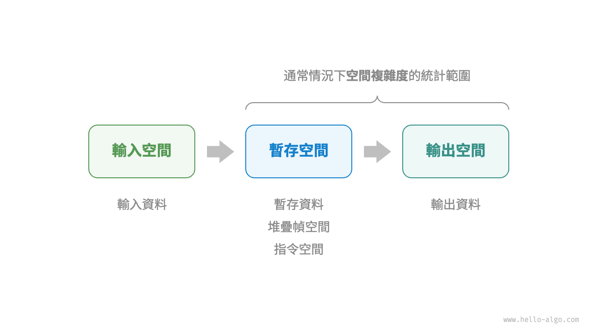
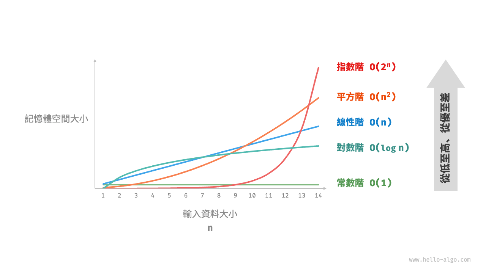
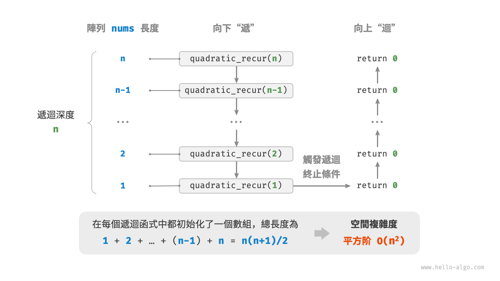
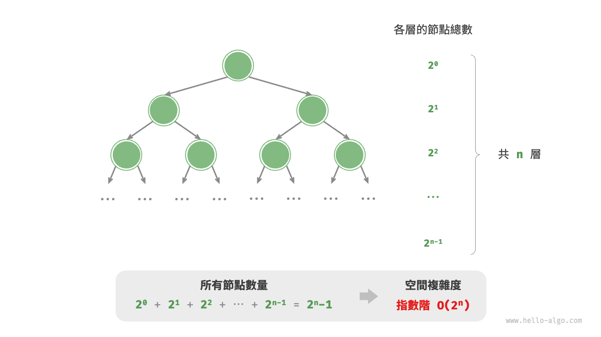

# 2.4 &nbsp; 空間複雜度

<u>空間複雜度（space complexity）</u>用於衡量演算法佔用記憶體空間隨著資料量變大時的增長趨勢。這個概念與時間複雜度非常類似，只需將“執行時間”替換為“佔用記憶體空間”。

## 2.4.1 &nbsp; 演算法相關空間

演算法在執行過程中使用的記憶體空間主要包括以下幾種。

- **輸入空間**：用於儲存演算法的輸入資料。
- **暫存空間**：用於儲存演算法在執行過程中的變數、物件、函式上下文等資料。
- **輸出空間**：用於儲存演算法的輸出資料。

一般情況下，空間複雜度的統計範圍是“暫存空間”加上“輸出空間”。

暫存空間可以進一步劃分為三個部分。

- **暫存資料**：用於儲存演算法執行過程中的各種常數、變數、物件等。
- **堆疊幀空間**：用於儲存呼叫函式的上下文資料。系統在每次呼叫函式時都會在堆疊頂部建立一個堆疊幀，函式返回後，堆疊幀空間會被釋放。
- **指令空間**：用於儲存編譯後的程式指令，在實際統計中通常忽略不計。

在分析一段程式的空間複雜度時，**我們通常統計暫存資料、堆疊幀空間和輸出資料三部分**，如圖 2-15 所示。

{ class="animation-figure" }

<p align="center"> 圖 2-15 &nbsp; 演算法使用的相關空間 </p>

相關程式碼如下：

=== "Python"

    ```python title=""
    class Node:
        """類別"""
        def __init__(self, x: int):
            self.val: int = x              # 節點值
            self.next: Node | None = None  # 指向下一節點的引用

    def function() -> int:
        """函式"""
        # 執行某些操作...
        return 0

    def algorithm(n) -> int:  # 輸入資料
        A = 0                 # 暫存資料（常數，一般用大寫字母表示）
        b = 0                 # 暫存資料（變數）
        node = Node(0)        # 暫存資料（物件）
        c = function()        # 堆疊幀空間（呼叫函式）
        return A + b + c      # 輸出資料
    ```

=== "C++"

    ```cpp title=""
    /* 結構體 */
    struct Node {
        int val;
        Node *next;
        Node(int x) : val(x), next(nullptr) {}
    };

    /* 函式 */
    int func() {
        // 執行某些操作...
        return 0;
    }

    int algorithm(int n) {        // 輸入資料
        const int a = 0;          // 暫存資料（常數）
        int b = 0;                // 暫存資料（變數）
        Node* node = new Node(0); // 暫存資料（物件）
        int c = func();           // 堆疊幀空間（呼叫函式）
        return a + b + c;         // 輸出資料
    }
    ```

=== "Java"

    ```java title=""
    /* 類別 */
    class Node {
        int val;
        Node next;
        Node(int x) { val = x; }
    }
    
    /* 函式 */
    int function() {
        // 執行某些操作...
        return 0;
    }
    
    int algorithm(int n) {        // 輸入資料
        final int a = 0;          // 暫存資料（常數）
        int b = 0;                // 暫存資料（變數）
        Node node = new Node(0);  // 暫存資料（物件）
        int c = function();       // 堆疊幀空間（呼叫函式）
        return a + b + c;         // 輸出資料
    }
    ```

=== "C#"

    ```csharp title=""
    /* 類別 */
    class Node(int x) {
        int val = x;
        Node next;
    }

    /* 函式 */
    int Function() {
        // 執行某些操作...
        return 0;
    }

    int Algorithm(int n) {        // 輸入資料
        const int a = 0;          // 暫存資料（常數）
        int b = 0;                // 暫存資料（變數）
        Node node = new(0);       // 暫存資料（物件）
        int c = Function();       // 堆疊幀空間（呼叫函式）
        return a + b + c;         // 輸出資料
    }
    ```

=== "Go"

    ```go title=""
    /* 結構體 */
    type node struct {
        val  int
        next *node
    }

    /* 建立 node 結構體  */
    func newNode(val int) *node {
        return &node{val: val}
    }
    
    /* 函式 */
    func function() int {
        // 執行某些操作...
        return 0
    }

    func algorithm(n int) int { // 輸入資料
        const a = 0             // 暫存資料（常數）
        b := 0                  // 暫存資料（變數）
        newNode(0)              // 暫存資料（物件）
        c := function()         // 堆疊幀空間（呼叫函式）
        return a + b + c        // 輸出資料
    }
    ```

=== "Swift"

    ```swift title=""
    /* 類別 */
    class Node {
        var val: Int
        var next: Node?

        init(x: Int) {
            val = x
        }
    }

    /* 函式 */
    func function() -> Int {
        // 執行某些操作...
        return 0
    }

    func algorithm(n: Int) -> Int { // 輸入資料
        let a = 0             // 暫存資料（常數）
        var b = 0             // 暫存資料（變數）
        let node = Node(x: 0) // 暫存資料（物件）
        let c = function()    // 堆疊幀空間（呼叫函式）
        return a + b + c      // 輸出資料
    }
    ```

=== "JS"

    ```javascript title=""
    /* 類別 */
    class Node {
        val;
        next;
        constructor(val) {
            this.val = val === undefined ? 0 : val; // 節點值
            this.next = null;                       // 指向下一節點的引用
        }
    }

    /* 函式 */
    function constFunc() {
        // 執行某些操作
        return 0;
    }

    function algorithm(n) {       // 輸入資料
        const a = 0;              // 暫存資料（常數）
        let b = 0;                // 暫存資料（變數）
        const node = new Node(0); // 暫存資料（物件）
        const c = constFunc();    // 堆疊幀空間（呼叫函式）
        return a + b + c;         // 輸出資料
    }
    ```

=== "TS"

    ```typescript title=""
    /* 類別 */
    class Node {
        val: number;
        next: Node | null;
        constructor(val?: number) {
            this.val = val === undefined ? 0 : val; // 節點值
            this.next = null;                       // 指向下一節點的引用
        }
    }

    /* 函式 */
    function constFunc(): number {
        // 執行某些操作
        return 0;
    }

    function algorithm(n: number): number { // 輸入資料
        const a = 0;                        // 暫存資料（常數）
        let b = 0;                          // 暫存資料（變數）
        const node = new Node(0);           // 暫存資料（物件）
        const c = constFunc();              // 堆疊幀空間（呼叫函式）
        return a + b + c;                   // 輸出資料
    }
    ```

=== "Dart"

    ```dart title=""
    /* 類別 */
    class Node {
      int val;
      Node next;
      Node(this.val, [this.next]);
    }

    /* 函式 */
    int function() {
      // 執行某些操作...
      return 0;
    }

    int algorithm(int n) {  // 輸入資料
      const int a = 0;      // 暫存資料（常數）
      int b = 0;            // 暫存資料（變數）
      Node node = Node(0);  // 暫存資料（物件）
      int c = function();   // 堆疊幀空間（呼叫函式）
      return a + b + c;     // 輸出資料
    }
    ```

=== "Rust"

    ```rust title=""
    use std::rc::Rc;
    use std::cell::RefCell;
    
    /* 結構體 */
    struct Node {
        val: i32,
        next: Option<Rc<RefCell<Node>>>,
    }

    /* 建立 Node 結構體 */
    impl Node {
        fn new(val: i32) -> Self {
            Self { val: val, next: None }
        }
    }

    /* 函式 */
    fn function() -> i32 {      
        // 執行某些操作...
        return 0;
    }

    fn algorithm(n: i32) -> i32 {       // 輸入資料
        const a: i32 = 0;               // 暫存資料（常數）
        let mut b = 0;                  // 暫存資料（變數）
        let node = Node::new(0);        // 暫存資料（物件）
        let c = function();             // 堆疊幀空間（呼叫函式）
        return a + b + c;               // 輸出資料
    }
    ```

=== "C"

    ```c title=""
    /* 函式 */
    int func() {
        // 執行某些操作...
        return 0;
    }

    int algorithm(int n) { // 輸入資料
        const int a = 0;   // 暫存資料（常數）
        int b = 0;         // 暫存資料（變數）
        int c = func();    // 堆疊幀空間（呼叫函式）
        return a + b + c;  // 輸出資料
    }
    ```

=== "Kotlin"

    ```kotlin title=""
    /* 類別 */
    class Node(var _val: Int) {
        var next: Node? = null
    }

    /* 函式 */
    fun function(): Int {
        // 執行某些操作...
        return 0
    }

    fun algorithm(n: Int): Int { // 輸入資料
        val a = 0                // 暫存資料（常數）
        var b = 0                // 暫存資料（變數）
        val node = Node(0)       // 暫存資料（物件）
        val c = function()       // 堆疊幀空間（呼叫函式）
        return a + b + c         // 輸出資料
    }
    ```

=== "Ruby"

    ```ruby title=""
    ### 類別 ###
    class Node
        attr_accessor :val      # 節點值
        attr_accessor :next     # 指向下一節點的引用

        def initialize(x)
            @val = x
        end
    end

    ### 函式 ###
    def function
        # 執行某些操作...
        0
    end

    ### 演算法 ###
    def algorithm(n)        # 輸入資料
        a = 0               # 暫存資料（常數）
        b = 0               # 暫存資料（變數）
        node = Node.new(0)  # 暫存資料（物件）
        c = function        # 堆疊幀空間（呼叫函式）
        a + b + c           # 輸出資料
    end
    ```

=== "Zig"

    ```zig title=""

    ```

## 2.4.2 &nbsp; 推算方法

空間複雜度的推算方法與時間複雜度大致相同，只需將統計物件從“操作數量”轉為“使用空間大小”。

而與時間複雜度不同的是，**我們通常只關注最差空間複雜度**。這是因為記憶體空間是一項硬性要求，我們必須確保在所有輸入資料下都有足夠的記憶體空間預留。

觀察以下程式碼，最差空間複雜度中的“最差”有兩層含義。

1. **以最差輸入資料為準**：當 $n < 10$ 時，空間複雜度為 $O(1)$ ；但當 $n > 10$ 時，初始化的陣列 `nums` 佔用 $O(n)$ 空間，因此最差空間複雜度為 $O(n)$ 。
2. **以演算法執行中的峰值記憶體為準**：例如，程式在執行最後一行之前，佔用 $O(1)$ 空間；當初始化陣列 `nums` 時，程式佔用 $O(n)$ 空間，因此最差空間複雜度為 $O(n)$ 。

=== "Python"

    ```python title=""
    def algorithm(n: int):
        a = 0               # O(1)
        b = [0] * 10000     # O(1)
        if n > 10:
            nums = [0] * n  # O(n)
    ```

=== "C++"

    ```cpp title=""
    void algorithm(int n) {
        int a = 0;               // O(1)
        vector<int> b(10000);    // O(1)
        if (n > 10)
            vector<int> nums(n); // O(n)
    }
    ```

=== "Java"

    ```java title=""
    void algorithm(int n) {
        int a = 0;                   // O(1)
        int[] b = new int[10000];    // O(1)
        if (n > 10)
            int[] nums = new int[n]; // O(n)
    }
    ```

=== "C#"

    ```csharp title=""
    void Algorithm(int n) {
        int a = 0;                   // O(1)
        int[] b = new int[10000];    // O(1)
        if (n > 10) {
            int[] nums = new int[n]; // O(n)
        }
    }
    ```

=== "Go"

    ```go title=""
    func algorithm(n int) {
        a := 0                      // O(1)
        b := make([]int, 10000)     // O(1)
        var nums []int
        if n > 10 {
            nums := make([]int, n)  // O(n)
        }
        fmt.Println(a, b, nums)
    }
    ```

=== "Swift"

    ```swift title=""
    func algorithm(n: Int) {
        let a = 0 // O(1)
        let b = Array(repeating: 0, count: 10000) // O(1)
        if n > 10 {
            let nums = Array(repeating: 0, count: n) // O(n)
        }
    }
    ```

=== "JS"

    ```javascript title=""
    function algorithm(n) {
        const a = 0;                   // O(1)
        const b = new Array(10000);    // O(1)
        if (n > 10) {
            const nums = new Array(n); // O(n)
        }
    }
    ```

=== "TS"

    ```typescript title=""
    function algorithm(n: number): void {
        const a = 0;                   // O(1)
        const b = new Array(10000);    // O(1)
        if (n > 10) {
            const nums = new Array(n); // O(n)
        }
    }
    ```

=== "Dart"

    ```dart title=""
    void algorithm(int n) {
      int a = 0;                            // O(1)
      List<int> b = List.filled(10000, 0);  // O(1)
      if (n > 10) {
        List<int> nums = List.filled(n, 0); // O(n)
      }
    }
    ```

=== "Rust"

    ```rust title=""
    fn algorithm(n: i32) {
        let a = 0;                              // O(1)
        let b = [0; 10000];                     // O(1)
        if n > 10 {
            let nums = vec![0; n as usize];     // O(n)
        }
    }
    ```

=== "C"

    ```c title=""
    void algorithm(int n) {
        int a = 0;               // O(1)
        int b[10000];            // O(1)
        if (n > 10)
            int nums[n] = {0};   // O(n)
    }
    ```

=== "Kotlin"

    ```kotlin title=""
    fun algorithm(n: Int) {
        val a = 0                    // O(1)
        val b = IntArray(10000)      // O(1)
        if (n > 10) {
            val nums = IntArray(n)   // O(n)
        }
    }
    ```

=== "Ruby"

    ```ruby title=""
    def algorithm(n)
        a = 0                           # O(1)
        b = Array.new(10000)            # O(1)
        nums = Array.new(n) if n > 10   # O(n)
    end
    ```

=== "Zig"

    ```zig title=""

    ```

**在遞迴函式中，需要注意統計堆疊幀空間**。觀察以下程式碼：

=== "Python"

    ```python title=""
    def function() -> int:
        # 執行某些操作
        return 0

    def loop(n: int):
        """迴圈的空間複雜度為 O(1)"""
        for _ in range(n):
            function()

    def recur(n: int):
        """遞迴的空間複雜度為 O(n)"""
        if n == 1:
            return
        return recur(n - 1)
    ```

=== "C++"

    ```cpp title=""
    int func() {
        // 執行某些操作
        return 0;
    }
    /* 迴圈的空間複雜度為 O(1) */
    void loop(int n) {
        for (int i = 0; i < n; i++) {
            func();
        }
    }
    /* 遞迴的空間複雜度為 O(n) */
    void recur(int n) {
        if (n == 1) return;
        recur(n - 1);
    }
    ```

=== "Java"

    ```java title=""
    int function() {
        // 執行某些操作
        return 0;
    }
    /* 迴圈的空間複雜度為 O(1) */
    void loop(int n) {
        for (int i = 0; i < n; i++) {
            function();
        }
    }
    /* 遞迴的空間複雜度為 O(n) */
    void recur(int n) {
        if (n == 1) return;
        recur(n - 1);
    }
    ```

=== "C#"

    ```csharp title=""
    int Function() {
        // 執行某些操作
        return 0;
    }
    /* 迴圈的空間複雜度為 O(1) */
    void Loop(int n) {
        for (int i = 0; i < n; i++) {
            Function();
        }
    }
    /* 遞迴的空間複雜度為 O(n) */
    int Recur(int n) {
        if (n == 1) return 1;
        return Recur(n - 1);
    }
    ```

=== "Go"

    ```go title=""
    func function() int {
        // 執行某些操作
        return 0
    }
    
    /* 迴圈的空間複雜度為 O(1) */
    func loop(n int) {
        for i := 0; i < n; i++ {
            function()
        }
    }
    
    /* 遞迴的空間複雜度為 O(n) */
    func recur(n int) {
        if n == 1 {
            return
        }
        recur(n - 1)
    }
    ```

=== "Swift"

    ```swift title=""
    @discardableResult
    func function() -> Int {
        // 執行某些操作
        return 0
    }

    /* 迴圈的空間複雜度為 O(1) */
    func loop(n: Int) {
        for _ in 0 ..< n {
            function()
        }
    }

    /* 遞迴的空間複雜度為 O(n) */
    func recur(n: Int) {
        if n == 1 {
            return
        }
        recur(n: n - 1)
    }
    ```

=== "JS"

    ```javascript title=""
    function constFunc() {
        // 執行某些操作
        return 0;
    }
    /* 迴圈的空間複雜度為 O(1) */
    function loop(n) {
        for (let i = 0; i < n; i++) {
            constFunc();
        }
    }
    /* 遞迴的空間複雜度為 O(n) */
    function recur(n) {
        if (n === 1) return;
        return recur(n - 1);
    }
    ```

=== "TS"

    ```typescript title=""
    function constFunc(): number {
        // 執行某些操作
        return 0;
    }
    /* 迴圈的空間複雜度為 O(1) */
    function loop(n: number): void {
        for (let i = 0; i < n; i++) {
            constFunc();
        }
    }
    /* 遞迴的空間複雜度為 O(n) */
    function recur(n: number): void {
        if (n === 1) return;
        return recur(n - 1);
    }
    ```

=== "Dart"

    ```dart title=""
    int function() {
      // 執行某些操作
      return 0;
    }
    /* 迴圈的空間複雜度為 O(1) */
    void loop(int n) {
      for (int i = 0; i < n; i++) {
        function();
      }
    }
    /* 遞迴的空間複雜度為 O(n) */
    void recur(int n) {
      if (n == 1) return;
      recur(n - 1);
    }
    ```

=== "Rust"

    ```rust title=""
    fn function() -> i32 {
        // 執行某些操作
        return 0;
    }
    /* 迴圈的空間複雜度為 O(1) */
    fn loop(n: i32) {
        for i in 0..n {
            function();
        }
    }
    /* 遞迴的空間複雜度為 O(n) */
    fn recur(n: i32) {
        if n == 1 {
            return;
        }
        recur(n - 1);
    }
    ```

=== "C"

    ```c title=""
    int func() {
        // 執行某些操作
        return 0;
    }
    /* 迴圈的空間複雜度為 O(1) */
    void loop(int n) {
        for (int i = 0; i < n; i++) {
            func();
        }
    }
    /* 遞迴的空間複雜度為 O(n) */
    void recur(int n) {
        if (n == 1) return;
        recur(n - 1);
    }
    ```

=== "Kotlin"

    ```kotlin title=""
    fun function(): Int {
        // 執行某些操作
        return 0
    }
    /* 迴圈的空間複雜度為 O(1) */
    fun loop(n: Int) {
        for (i in 0..<n) {
            function()
        }
    }
    /* 遞迴的空間複雜度為 O(n) */
    fun recur(n: Int) {
        if (n == 1) return
        return recur(n - 1)
    }
    ```

=== "Ruby"

    ```ruby title=""
    def function
        # 執行某些操作
        0
    end

    ### 迴圈的空間複雜度為 O(1) ###
    def loop(n)
        (0...n).each { function }
    end

    ### 遞迴的空間複雜度為 O(n) ###
    def recur(n)
        return if n == 1
        recur(n - 1)
    end
    ```

=== "Zig"

    ```zig title=""

    ```

函式 `loop()` 和 `recur()` 的時間複雜度都為 $O(n)$ ，但空間複雜度不同。

- 函式 `loop()` 在迴圈中呼叫了 $n$ 次 `function()` ，每輪中的 `function()` 都返回並釋放了堆疊幀空間，因此空間複雜度仍為 $O(1)$ 。
- 遞迴函式 `recur()` 在執行過程中會同時存在 $n$ 個未返回的 `recur()` ，從而佔用 $O(n)$ 的堆疊幀空間。

## 2.4.3 &nbsp; 常見型別

設輸入資料大小為 $n$ ，圖 2-16 展示了常見的空間複雜度型別（從低到高排列）。

$$
\begin{aligned}
O(1) < O(\log n) < O(n) < O(n^2) < O(2^n) \newline
\text{常數階} < \text{對數階} < \text{線性階} < \text{平方階} < \text{指數階}
\end{aligned}
$$

{ class="animation-figure" }

<p align="center"> 圖 2-16 &nbsp; 常見的空間複雜度型別 </p>

### 1. &nbsp; 常數階 $O(1)$ {data-toc-label="1. &nbsp; 常數階"}

常數階常見於數量與輸入資料大小 $n$ 無關的常數、變數、物件。

需要注意的是，在迴圈中初始化變數或呼叫函式而佔用的記憶體，在進入下一迴圈後就會被釋放，因此不會累積佔用空間，空間複雜度仍為 $O(1)$ ：

=== "Python"

    ```python title="space_complexity.py"
    def function() -> int:
        """函式"""
        # 執行某些操作
        return 0

    def constant(n: int):
        """常數階"""
        # 常數、變數、物件佔用 O(1) 空間
        a = 0
        nums = [0] * 10000
        node = ListNode(0)
        # 迴圈中的變數佔用 O(1) 空間
        for _ in range(n):
            c = 0
        # 迴圈中的函式佔用 O(1) 空間
        for _ in range(n):
            function()
    ```

=== "C++"

    ```cpp title="space_complexity.cpp"
    /* 函式 */
    int func() {
        // 執行某些操作
        return 0;
    }

    /* 常數階 */
    void constant(int n) {
        // 常數、變數、物件佔用 O(1) 空間
        const int a = 0;
        int b = 0;
        vector<int> nums(10000);
        ListNode node(0);
        // 迴圈中的變數佔用 O(1) 空間
        for (int i = 0; i < n; i++) {
            int c = 0;
        }
        // 迴圈中的函式佔用 O(1) 空間
        for (int i = 0; i < n; i++) {
            func();
        }
    }
    ```

=== "Java"

    ```java title="space_complexity.java"
    /* 函式 */
    int function() {
        // 執行某些操作
        return 0;
    }

    /* 常數階 */
    void constant(int n) {
        // 常數、變數、物件佔用 O(1) 空間
        final int a = 0;
        int b = 0;
        int[] nums = new int[10000];
        ListNode node = new ListNode(0);
        // 迴圈中的變數佔用 O(1) 空間
        for (int i = 0; i < n; i++) {
            int c = 0;
        }
        // 迴圈中的函式佔用 O(1) 空間
        for (int i = 0; i < n; i++) {
            function();
        }
    }
    ```

=== "C#"

    ```csharp title="space_complexity.cs"
    /* 函式 */
    int Function() {
        // 執行某些操作
        return 0;
    }

    /* 常數階 */
    void Constant(int n) {
        // 常數、變數、物件佔用 O(1) 空間
        int a = 0;
        int b = 0;
        int[] nums = new int[10000];
        ListNode node = new(0);
        // 迴圈中的變數佔用 O(1) 空間
        for (int i = 0; i < n; i++) {
            int c = 0;
        }
        // 迴圈中的函式佔用 O(1) 空間
        for (int i = 0; i < n; i++) {
            Function();
        }
    }
    ```

=== "Go"

    ```go title="space_complexity.go"
    /* 函式 */
    func function() int {
        // 執行某些操作...
        return 0
    }

    /* 常數階 */
    func spaceConstant(n int) {
        // 常數、變數、物件佔用 O(1) 空間
        const a = 0
        b := 0
        nums := make([]int, 10000)
        node := newNode(0)
        // 迴圈中的變數佔用 O(1) 空間
        var c int
        for i := 0; i < n; i++ {
            c = 0
        }
        // 迴圈中的函式佔用 O(1) 空間
        for i := 0; i < n; i++ {
            function()
        }
        b += 0
        c += 0
        nums[0] = 0
        node.val = 0
    }
    ```

=== "Swift"

    ```swift title="space_complexity.swift"
    /* 函式 */
    @discardableResult
    func function() -> Int {
        // 執行某些操作
        return 0
    }

    /* 常數階 */
    func constant(n: Int) {
        // 常數、變數、物件佔用 O(1) 空間
        let a = 0
        var b = 0
        let nums = Array(repeating: 0, count: 10000)
        let node = ListNode(x: 0)
        // 迴圈中的變數佔用 O(1) 空間
        for _ in 0 ..< n {
            let c = 0
        }
        // 迴圈中的函式佔用 O(1) 空間
        for _ in 0 ..< n {
            function()
        }
    }
    ```

=== "JS"

    ```javascript title="space_complexity.js"
    /* 函式 */
    function constFunc() {
        // 執行某些操作
        return 0;
    }

    /* 常數階 */
    function constant(n) {
        // 常數、變數、物件佔用 O(1) 空間
        const a = 0;
        const b = 0;
        const nums = new Array(10000);
        const node = new ListNode(0);
        // 迴圈中的變數佔用 O(1) 空間
        for (let i = 0; i < n; i++) {
            const c = 0;
        }
        // 迴圈中的函式佔用 O(1) 空間
        for (let i = 0; i < n; i++) {
            constFunc();
        }
    }
    ```

=== "TS"

    ```typescript title="space_complexity.ts"
    /* 函式 */
    function constFunc(): number {
        // 執行某些操作
        return 0;
    }

    /* 常數階 */
    function constant(n: number): void {
        // 常數、變數、物件佔用 O(1) 空間
        const a = 0;
        const b = 0;
        const nums = new Array(10000);
        const node = new ListNode(0);
        // 迴圈中的變數佔用 O(1) 空間
        for (let i = 0; i < n; i++) {
            const c = 0;
        }
        // 迴圈中的函式佔用 O(1) 空間
        for (let i = 0; i < n; i++) {
            constFunc();
        }
    }
    ```

=== "Dart"

    ```dart title="space_complexity.dart"
    /* 函式 */
    int function() {
      // 執行某些操作
      return 0;
    }

    /* 常數階 */
    void constant(int n) {
      // 常數、變數、物件佔用 O(1) 空間
      final int a = 0;
      int b = 0;
      List<int> nums = List.filled(10000, 0);
      ListNode node = ListNode(0);
      // 迴圈中的變數佔用 O(1) 空間
      for (var i = 0; i < n; i++) {
        int c = 0;
      }
      // 迴圈中的函式佔用 O(1) 空間
      for (var i = 0; i < n; i++) {
        function();
      }
    }
    ```

=== "Rust"

    ```rust title="space_complexity.rs"
    /* 函式 */
    fn function() -> i32 {
        // 執行某些操作
        return 0;
    }

    /* 常數階 */
    #[allow(unused)]
    fn constant(n: i32) {
        // 常數、變數、物件佔用 O(1) 空間
        const A: i32 = 0;
        let b = 0;
        let nums = vec![0; 10000];
        let node = ListNode::new(0);
        // 迴圈中的變數佔用 O(1) 空間
        for i in 0..n {
            let c = 0;
        }
        // 迴圈中的函式佔用 O(1) 空間
        for i in 0..n {
            function();
        }
    }
    ```

=== "C"

    ```c title="space_complexity.c"
    /* 函式 */
    int func() {
        // 執行某些操作
        return 0;
    }

    /* 常數階 */
    void constant(int n) {
        // 常數、變數、物件佔用 O(1) 空間
        const int a = 0;
        int b = 0;
        int nums[1000];
        ListNode *node = newListNode(0);
        free(node);
        // 迴圈中的變數佔用 O(1) 空間
        for (int i = 0; i < n; i++) {
            int c = 0;
        }
        // 迴圈中的函式佔用 O(1) 空間
        for (int i = 0; i < n; i++) {
            func();
        }
    }
    ```

=== "Kotlin"

    ```kotlin title="space_complexity.kt"
    /* 函式 */
    fun function(): Int {
        // 執行某些操作
        return 0
    }

    /* 常數階 */
    fun constant(n: Int) {
        // 常數、變數、物件佔用 O(1) 空間
        val a = 0
        var b = 0
        val nums = Array(10000) { 0 }
        val node = ListNode(0)
        // 迴圈中的變數佔用 O(1) 空間
        for (i in 0..<n) {
            val c = 0
        }
        // 迴圈中的函式佔用 O(1) 空間
        for (i in 0..<n) {
            function()
        }
    }
    ```

=== "Ruby"

    ```ruby title="space_complexity.rb"
    ### 函式 ###
    def function
      # 執行某些操作
      0
    end

    ### 常數階 ###
    def constant(n)
      # 常數、變數、物件佔用 O(1) 空間
      a = 0
      nums = [0] * 10000
      node = ListNode.new

      # 迴圈中的變數佔用 O(1) 空間
      (0...n).each { c = 0 }
      # 迴圈中的函式佔用 O(1) 空間
      (0...n).each { function }
    end
    ```

=== "Zig"

    ```zig title="space_complexity.zig"
    // 函式
    fn function() i32 {
        // 執行某些操作
        return 0;
    }

    // 常數階
    fn constant(n: i32) void {
        // 常數、變數、物件佔用 O(1) 空間
        const a: i32 = 0;
        const b: i32 = 0;
        const nums = [_]i32{0} ** 10000;
        const node = ListNode(i32){ .val = 0 };
        var i: i32 = 0;
        // 迴圈中的變數佔用 O(1) 空間
        while (i < n) : (i += 1) {
            const c: i32 = 0;
            _ = c;
        }
        // 迴圈中的函式佔用 O(1) 空間
        i = 0;
        while (i < n) : (i += 1) {
            _ = function();
        }
        _ = a;
        _ = b;
        _ = nums;
        _ = node;
    }
    ```

??? pythontutor "視覺化執行"

    <div style="height: 549px; width: 100%;"><iframe class="pythontutor-iframe" src="https://pythontutor.com/iframe-embed.html#code=class%20ListNode%3A%0A%20%20%20%20%22%22%22%E9%8F%88%E7%B5%90%E4%B8%B2%E5%88%97%E7%AF%80%E9%BB%9E%E9%A1%9E%E5%88%A5%22%22%22%0A%20%20%20%20def%20__init__%28self%2C%20val%3A%20int%29%3A%0A%20%20%20%20%20%20%20%20self.val%3A%20int%20%3D%20val%20%20%23%20%E7%AF%80%E9%BB%9E%E5%80%BC%0A%20%20%20%20%20%20%20%20self.next%3A%20ListNode%20%7C%20None%20%3D%20None%20%20%23%20%E5%BE%8C%E7%B9%BC%E7%AF%80%E9%BB%9E%E5%BC%95%E7%94%A8%0A%0Adef%20function%28%29%20-%3E%20int%3A%0A%20%20%20%20%22%22%22%E5%87%BD%E5%BC%8F%22%22%22%0A%20%20%20%20%23%20%E5%9F%B7%E8%A1%8C%E6%9F%90%E4%BA%9B%E6%93%8D%E4%BD%9C%0A%20%20%20%20return%200%0A%0Adef%20constant%28n%3A%20int%29%3A%0A%20%20%20%20%22%22%22%E5%B8%B8%E6%95%B8%E9%9A%8E%22%22%22%0A%20%20%20%20%23%20%E5%B8%B8%E6%95%B8%E3%80%81%E8%AE%8A%E6%95%B8%E3%80%81%E7%89%A9%E4%BB%B6%E4%BD%94%E7%94%A8%20O%281%29%20%E7%A9%BA%E9%96%93%0A%20%20%20%20a%20%3D%200%0A%20%20%20%20nums%20%3D%20%5B0%5D%20%2A%2010%0A%20%20%20%20node%20%3D%20ListNode%280%29%0A%20%20%20%20%23%20%E8%BF%B4%E5%9C%88%E4%B8%AD%E7%9A%84%E8%AE%8A%E6%95%B8%E4%BD%94%E7%94%A8%20O%281%29%20%E7%A9%BA%E9%96%93%0A%20%20%20%20for%20_%20in%20range%28n%29%3A%0A%20%20%20%20%20%20%20%20c%20%3D%200%0A%20%20%20%20%23%20%E8%BF%B4%E5%9C%88%E4%B8%AD%E7%9A%84%E5%87%BD%E5%BC%8F%E4%BD%94%E7%94%A8%20O%281%29%20%E7%A9%BA%E9%96%93%0A%20%20%20%20for%20_%20in%20range%28n%29%3A%0A%20%20%20%20%20%20%20%20function%28%29%0A%0A%22%22%22Driver%20Code%22%22%22%0Aif%20__name__%20%3D%3D%20%22__main__%22%3A%0A%20%20%20%20n%20%3D%205%0A%20%20%20%20print%28%22%E8%BC%B8%E5%85%A5%E8%B3%87%E6%96%99%E5%A4%A7%E5%B0%8F%20n%20%3D%22%2C%20n%29%0A%0A%20%20%20%20%23%20%E5%B8%B8%E6%95%B8%E9%9A%8E%0A%20%20%20%20constant%28n%29&codeDivHeight=472&codeDivWidth=350&cumulative=false&curInstr=6&heapPrimitives=nevernest&origin=opt-frontend.js&py=311&rawInputLstJSON=%5B%5D&textReferences=false"> </iframe></div>
    <div style="margin-top: 5px;"><a href="https://pythontutor.com/iframe-embed.html#code=class%20ListNode%3A%0A%20%20%20%20%22%22%22%E9%8F%88%E7%B5%90%E4%B8%B2%E5%88%97%E7%AF%80%E9%BB%9E%E9%A1%9E%E5%88%A5%22%22%22%0A%20%20%20%20def%20__init__%28self%2C%20val%3A%20int%29%3A%0A%20%20%20%20%20%20%20%20self.val%3A%20int%20%3D%20val%20%20%23%20%E7%AF%80%E9%BB%9E%E5%80%BC%0A%20%20%20%20%20%20%20%20self.next%3A%20ListNode%20%7C%20None%20%3D%20None%20%20%23%20%E5%BE%8C%E7%B9%BC%E7%AF%80%E9%BB%9E%E5%BC%95%E7%94%A8%0A%0Adef%20function%28%29%20-%3E%20int%3A%0A%20%20%20%20%22%22%22%E5%87%BD%E5%BC%8F%22%22%22%0A%20%20%20%20%23%20%E5%9F%B7%E8%A1%8C%E6%9F%90%E4%BA%9B%E6%93%8D%E4%BD%9C%0A%20%20%20%20return%200%0A%0Adef%20constant%28n%3A%20int%29%3A%0A%20%20%20%20%22%22%22%E5%B8%B8%E6%95%B8%E9%9A%8E%22%22%22%0A%20%20%20%20%23%20%E5%B8%B8%E6%95%B8%E3%80%81%E8%AE%8A%E6%95%B8%E3%80%81%E7%89%A9%E4%BB%B6%E4%BD%94%E7%94%A8%20O%281%29%20%E7%A9%BA%E9%96%93%0A%20%20%20%20a%20%3D%200%0A%20%20%20%20nums%20%3D%20%5B0%5D%20%2A%2010%0A%20%20%20%20node%20%3D%20ListNode%280%29%0A%20%20%20%20%23%20%E8%BF%B4%E5%9C%88%E4%B8%AD%E7%9A%84%E8%AE%8A%E6%95%B8%E4%BD%94%E7%94%A8%20O%281%29%20%E7%A9%BA%E9%96%93%0A%20%20%20%20for%20_%20in%20range%28n%29%3A%0A%20%20%20%20%20%20%20%20c%20%3D%200%0A%20%20%20%20%23%20%E8%BF%B4%E5%9C%88%E4%B8%AD%E7%9A%84%E5%87%BD%E5%BC%8F%E4%BD%94%E7%94%A8%20O%281%29%20%E7%A9%BA%E9%96%93%0A%20%20%20%20for%20_%20in%20range%28n%29%3A%0A%20%20%20%20%20%20%20%20function%28%29%0A%0A%22%22%22Driver%20Code%22%22%22%0Aif%20__name__%20%3D%3D%20%22__main__%22%3A%0A%20%20%20%20n%20%3D%205%0A%20%20%20%20print%28%22%E8%BC%B8%E5%85%A5%E8%B3%87%E6%96%99%E5%A4%A7%E5%B0%8F%20n%20%3D%22%2C%20n%29%0A%0A%20%20%20%20%23%20%E5%B8%B8%E6%95%B8%E9%9A%8E%0A%20%20%20%20constant%28n%29&codeDivHeight=800&codeDivWidth=600&cumulative=false&curInstr=6&heapPrimitives=nevernest&origin=opt-frontend.js&py=311&rawInputLstJSON=%5B%5D&textReferences=false" target="_blank" rel="noopener noreferrer">全螢幕觀看 ></a></div>

### 2. &nbsp; 線性階 $O(n)$ {data-toc-label="2. &nbsp; 線性階"}

線性階常見於元素數量與 $n$ 成正比的陣列、鏈結串列、堆疊、佇列等：

=== "Python"

    ```python title="space_complexity.py"
    def linear(n: int):
        """線性階"""
        # 長度為 n 的串列佔用 O(n) 空間
        nums = [0] * n
        # 長度為 n 的雜湊表佔用 O(n) 空間
        hmap = dict[int, str]()
        for i in range(n):
            hmap[i] = str(i)
    ```

=== "C++"

    ```cpp title="space_complexity.cpp"
    /* 線性階 */
    void linear(int n) {
        // 長度為 n 的陣列佔用 O(n) 空間
        vector<int> nums(n);
        // 長度為 n 的串列佔用 O(n) 空間
        vector<ListNode> nodes;
        for (int i = 0; i < n; i++) {
            nodes.push_back(ListNode(i));
        }
        // 長度為 n 的雜湊表佔用 O(n) 空間
        unordered_map<int, string> map;
        for (int i = 0; i < n; i++) {
            map[i] = to_string(i);
        }
    }
    ```

=== "Java"

    ```java title="space_complexity.java"
    /* 線性階 */
    void linear(int n) {
        // 長度為 n 的陣列佔用 O(n) 空間
        int[] nums = new int[n];
        // 長度為 n 的串列佔用 O(n) 空間
        List<ListNode> nodes = new ArrayList<>();
        for (int i = 0; i < n; i++) {
            nodes.add(new ListNode(i));
        }
        // 長度為 n 的雜湊表佔用 O(n) 空間
        Map<Integer, String> map = new HashMap<>();
        for (int i = 0; i < n; i++) {
            map.put(i, String.valueOf(i));
        }
    }
    ```

=== "C#"

    ```csharp title="space_complexity.cs"
    /* 線性階 */
    void Linear(int n) {
        // 長度為 n 的陣列佔用 O(n) 空間
        int[] nums = new int[n];
        // 長度為 n 的串列佔用 O(n) 空間
        List<ListNode> nodes = [];
        for (int i = 0; i < n; i++) {
            nodes.Add(new ListNode(i));
        }
        // 長度為 n 的雜湊表佔用 O(n) 空間
        Dictionary<int, string> map = [];
        for (int i = 0; i < n; i++) {
            map.Add(i, i.ToString());
        }
    }
    ```

=== "Go"

    ```go title="space_complexity.go"
    /* 線性階 */
    func spaceLinear(n int) {
        // 長度為 n 的陣列佔用 O(n) 空間
        _ = make([]int, n)
        // 長度為 n 的串列佔用 O(n) 空間
        var nodes []*node
        for i := 0; i < n; i++ {
            nodes = append(nodes, newNode(i))
        }
        // 長度為 n 的雜湊表佔用 O(n) 空間
        m := make(map[int]string, n)
        for i := 0; i < n; i++ {
            m[i] = strconv.Itoa(i)
        }
    }
    ```

=== "Swift"

    ```swift title="space_complexity.swift"
    /* 線性階 */
    func linear(n: Int) {
        // 長度為 n 的陣列佔用 O(n) 空間
        let nums = Array(repeating: 0, count: n)
        // 長度為 n 的串列佔用 O(n) 空間
        let nodes = (0 ..< n).map { ListNode(x: $0) }
        // 長度為 n 的雜湊表佔用 O(n) 空間
        let map = Dictionary(uniqueKeysWithValues: (0 ..< n).map { ($0, "\($0)") })
    }
    ```

=== "JS"

    ```javascript title="space_complexity.js"
    /* 線性階 */
    function linear(n) {
        // 長度為 n 的陣列佔用 O(n) 空間
        const nums = new Array(n);
        // 長度為 n 的串列佔用 O(n) 空間
        const nodes = [];
        for (let i = 0; i < n; i++) {
            nodes.push(new ListNode(i));
        }
        // 長度為 n 的雜湊表佔用 O(n) 空間
        const map = new Map();
        for (let i = 0; i < n; i++) {
            map.set(i, i.toString());
        }
    }
    ```

=== "TS"

    ```typescript title="space_complexity.ts"
    /* 線性階 */
    function linear(n: number): void {
        // 長度為 n 的陣列佔用 O(n) 空間
        const nums = new Array(n);
        // 長度為 n 的串列佔用 O(n) 空間
        const nodes: ListNode[] = [];
        for (let i = 0; i < n; i++) {
            nodes.push(new ListNode(i));
        }
        // 長度為 n 的雜湊表佔用 O(n) 空間
        const map = new Map();
        for (let i = 0; i < n; i++) {
            map.set(i, i.toString());
        }
    }
    ```

=== "Dart"

    ```dart title="space_complexity.dart"
    /* 線性階 */
    void linear(int n) {
      // 長度為 n 的陣列佔用 O(n) 空間
      List<int> nums = List.filled(n, 0);
      // 長度為 n 的串列佔用 O(n) 空間
      List<ListNode> nodes = [];
      for (var i = 0; i < n; i++) {
        nodes.add(ListNode(i));
      }
      // 長度為 n 的雜湊表佔用 O(n) 空間
      Map<int, String> map = HashMap();
      for (var i = 0; i < n; i++) {
        map.putIfAbsent(i, () => i.toString());
      }
    }
    ```

=== "Rust"

    ```rust title="space_complexity.rs"
    /* 線性階 */
    #[allow(unused)]
    fn linear(n: i32) {
        // 長度為 n 的陣列佔用 O(n) 空間
        let mut nums = vec![0; n as usize];
        // 長度為 n 的串列佔用 O(n) 空間
        let mut nodes = Vec::new();
        for i in 0..n {
            nodes.push(ListNode::new(i))
        }
        // 長度為 n 的雜湊表佔用 O(n) 空間
        let mut map = HashMap::new();
        for i in 0..n {
            map.insert(i, i.to_string());
        }
    }
    ```

=== "C"

    ```c title="space_complexity.c"
    /* 雜湊表 */
    typedef struct {
        int key;
        int val;
        UT_hash_handle hh; // 基於 uthash.h 實現
    } HashTable;

    /* 線性階 */
    void linear(int n) {
        // 長度為 n 的陣列佔用 O(n) 空間
        int *nums = malloc(sizeof(int) * n);
        free(nums);

        // 長度為 n 的串列佔用 O(n) 空間
        ListNode **nodes = malloc(sizeof(ListNode *) * n);
        for (int i = 0; i < n; i++) {
            nodes[i] = newListNode(i);
        }
        // 記憶體釋放
        for (int i = 0; i < n; i++) {
            free(nodes[i]);
        }
        free(nodes);

        // 長度為 n 的雜湊表佔用 O(n) 空間
        HashTable *h = NULL;
        for (int i = 0; i < n; i++) {
            HashTable *tmp = malloc(sizeof(HashTable));
            tmp->key = i;
            tmp->val = i;
            HASH_ADD_INT(h, key, tmp);
        }

        // 記憶體釋放
        HashTable *curr, *tmp;
        HASH_ITER(hh, h, curr, tmp) {
            HASH_DEL(h, curr);
            free(curr);
        }
    }
    ```

=== "Kotlin"

    ```kotlin title="space_complexity.kt"
    /* 線性階 */
    fun linear(n: Int) {
        // 長度為 n 的陣列佔用 O(n) 空間
        val nums = Array(n) { 0 }
        // 長度為 n 的串列佔用 O(n) 空間
        val nodes = mutableListOf<ListNode>()
        for (i in 0..<n) {
            nodes.add(ListNode(i))
        }
        // 長度為 n 的雜湊表佔用 O(n) 空間
        val map = mutableMapOf<Int, String>()
        for (i in 0..<n) {
            map[i] = i.toString()
        }
    }
    ```

=== "Ruby"

    ```ruby title="space_complexity.rb"
    ### 線性階 ###
    def linear(n)
      # 長度為 n 的串列佔用 O(n) 空間
      nums = Array.new(n, 0)

      # 長度為 n 的雜湊表佔用 O(n) 空間
      hmap = {}
      for i in 0...n
        hmap[i] = i.to_s
      end
    end
    ```

=== "Zig"

    ```zig title="space_complexity.zig"
    // 線性階
    fn linear(comptime n: i32) !void {
        // 長度為 n 的陣列佔用 O(n) 空間
        const nums = [_]i32{0} ** n;
        // 長度為 n 的串列佔用 O(n) 空間
        var nodes = std.ArrayList(i32).init(std.heap.page_allocator);
        defer nodes.deinit();
        var i: i32 = 0;
        while (i < n) : (i += 1) {
            try nodes.append(i);
        }
        // 長度為 n 的雜湊表佔用 O(n) 空間
        var map = std.AutoArrayHashMap(i32, []const u8).init(std.heap.page_allocator);
        defer map.deinit();
        var j: i32 = 0;
        while (j < n) : (j += 1) {
            const string = try std.fmt.allocPrint(std.heap.page_allocator, "{d}", .{j});
            defer std.heap.page_allocator.free(string);
            try map.put(i, string);
        }
        _ = nums;
    }
    ```

??? pythontutor "視覺化執行"

    <div style="height: 477px; width: 100%;"><iframe class="pythontutor-iframe" src="https://pythontutor.com/iframe-embed.html#code=def%20linear%28n%3A%20int%29%3A%0A%20%20%20%20%22%22%22%E7%B7%9A%E6%80%A7%E9%9A%8E%22%22%22%0A%20%20%20%20%23%20%E9%95%B7%E5%BA%A6%E7%82%BA%20n%20%E7%9A%84%E4%B8%B2%E5%88%97%E4%BD%94%E7%94%A8%20O%28n%29%20%E7%A9%BA%E9%96%93%0A%20%20%20%20nums%20%3D%20%5B0%5D%20%2A%20n%0A%20%20%20%20%23%20%E9%95%B7%E5%BA%A6%E7%82%BA%20n%20%E7%9A%84%E9%9B%9C%E6%B9%8A%E8%A1%A8%E4%BD%94%E7%94%A8%20O%28n%29%20%E7%A9%BA%E9%96%93%0A%20%20%20%20hmap%20%3D%20dict%5Bint%2C%20str%5D%28%29%0A%20%20%20%20for%20i%20in%20range%28n%29%3A%0A%20%20%20%20%20%20%20%20hmap%5Bi%5D%20%3D%20str%28i%29%0A%0A%22%22%22Driver%20Code%22%22%22%0Aif%20__name__%20%3D%3D%20%22__main__%22%3A%0A%20%20%20%20n%20%3D%205%0A%20%20%20%20print%28%22%E8%BC%B8%E5%85%A5%E8%B3%87%E6%96%99%E5%A4%A7%E5%B0%8F%20n%20%3D%22%2C%20n%29%0A%0A%20%20%20%20%23%20%E7%B7%9A%E6%80%A7%E9%9A%8E%0A%20%20%20%20linear%28n%29&codeDivHeight=472&codeDivWidth=350&cumulative=false&curInstr=20&heapPrimitives=nevernest&origin=opt-frontend.js&py=311&rawInputLstJSON=%5B%5D&textReferences=false"> </iframe></div>
    <div style="margin-top: 5px;"><a href="https://pythontutor.com/iframe-embed.html#code=def%20linear%28n%3A%20int%29%3A%0A%20%20%20%20%22%22%22%E7%B7%9A%E6%80%A7%E9%9A%8E%22%22%22%0A%20%20%20%20%23%20%E9%95%B7%E5%BA%A6%E7%82%BA%20n%20%E7%9A%84%E4%B8%B2%E5%88%97%E4%BD%94%E7%94%A8%20O%28n%29%20%E7%A9%BA%E9%96%93%0A%20%20%20%20nums%20%3D%20%5B0%5D%20%2A%20n%0A%20%20%20%20%23%20%E9%95%B7%E5%BA%A6%E7%82%BA%20n%20%E7%9A%84%E9%9B%9C%E6%B9%8A%E8%A1%A8%E4%BD%94%E7%94%A8%20O%28n%29%20%E7%A9%BA%E9%96%93%0A%20%20%20%20hmap%20%3D%20dict%5Bint%2C%20str%5D%28%29%0A%20%20%20%20for%20i%20in%20range%28n%29%3A%0A%20%20%20%20%20%20%20%20hmap%5Bi%5D%20%3D%20str%28i%29%0A%0A%22%22%22Driver%20Code%22%22%22%0Aif%20__name__%20%3D%3D%20%22__main__%22%3A%0A%20%20%20%20n%20%3D%205%0A%20%20%20%20print%28%22%E8%BC%B8%E5%85%A5%E8%B3%87%E6%96%99%E5%A4%A7%E5%B0%8F%20n%20%3D%22%2C%20n%29%0A%0A%20%20%20%20%23%20%E7%B7%9A%E6%80%A7%E9%9A%8E%0A%20%20%20%20linear%28n%29&codeDivHeight=800&codeDivWidth=600&cumulative=false&curInstr=20&heapPrimitives=nevernest&origin=opt-frontend.js&py=311&rawInputLstJSON=%5B%5D&textReferences=false" target="_blank" rel="noopener noreferrer">全螢幕觀看 ></a></div>

如圖 2-17 所示，此函式的遞迴深度為 $n$ ，即同時存在 $n$ 個未返回的 `linear_recur()` 函式，使用 $O(n)$ 大小的堆疊幀空間：

=== "Python"

    ```python title="space_complexity.py"
    def linear_recur(n: int):
        """線性階（遞迴實現）"""
        print("遞迴 n =", n)
        if n == 1:
            return
        linear_recur(n - 1)
    ```

=== "C++"

    ```cpp title="space_complexity.cpp"
    /* 線性階（遞迴實現） */
    void linearRecur(int n) {
        cout << "遞迴 n = " << n << endl;
        if (n == 1)
            return;
        linearRecur(n - 1);
    }
    ```

=== "Java"

    ```java title="space_complexity.java"
    /* 線性階（遞迴實現） */
    void linearRecur(int n) {
        System.out.println("遞迴 n = " + n);
        if (n == 1)
            return;
        linearRecur(n - 1);
    }
    ```

=== "C#"

    ```csharp title="space_complexity.cs"
    /* 線性階（遞迴實現） */
    void LinearRecur(int n) {
        Console.WriteLine("遞迴 n = " + n);
        if (n == 1) return;
        LinearRecur(n - 1);
    }
    ```

=== "Go"

    ```go title="space_complexity.go"
    /* 線性階（遞迴實現） */
    func spaceLinearRecur(n int) {
        fmt.Println("遞迴 n =", n)
        if n == 1 {
            return
        }
        spaceLinearRecur(n - 1)
    }
    ```

=== "Swift"

    ```swift title="space_complexity.swift"
    /* 線性階（遞迴實現） */
    func linearRecur(n: Int) {
        print("遞迴 n = \(n)")
        if n == 1 {
            return
        }
        linearRecur(n: n - 1)
    }
    ```

=== "JS"

    ```javascript title="space_complexity.js"
    /* 線性階（遞迴實現） */
    function linearRecur(n) {
        console.log(`遞迴 n = ${n}`);
        if (n === 1) return;
        linearRecur(n - 1);
    }
    ```

=== "TS"

    ```typescript title="space_complexity.ts"
    /* 線性階（遞迴實現） */
    function linearRecur(n: number): void {
        console.log(`遞迴 n = ${n}`);
        if (n === 1) return;
        linearRecur(n - 1);
    }
    ```

=== "Dart"

    ```dart title="space_complexity.dart"
    /* 線性階（遞迴實現） */
    void linearRecur(int n) {
      print('遞迴 n = $n');
      if (n == 1) return;
      linearRecur(n - 1);
    }
    ```

=== "Rust"

    ```rust title="space_complexity.rs"
    /* 線性階（遞迴實現） */
    fn linear_recur(n: i32) {
        println!("遞迴 n = {}", n);
        if n == 1 {
            return;
        };
        linear_recur(n - 1);
    }
    ```

=== "C"

    ```c title="space_complexity.c"
    /* 線性階（遞迴實現） */
    void linearRecur(int n) {
        printf("遞迴 n = %d\r\n", n);
        if (n == 1)
            return;
        linearRecur(n - 1);
    }
    ```

=== "Kotlin"

    ```kotlin title="space_complexity.kt"
    /* 線性階（遞迴實現） */
    fun linearRecur(n: Int) {
        println("遞迴 n = $n")
        if (n == 1)
            return
        linearRecur(n - 1)
    }
    ```

=== "Ruby"

    ```ruby title="space_complexity.rb"
    ### 線性階（遞迴實現）###
    def linear_recur(n)
      puts "遞迴 n = #{n}"
      return if n == 1
      linear_recur(n - 1)
    end
    ```

=== "Zig"

    ```zig title="space_complexity.zig"
    // 線性階（遞迴實現）
    fn linearRecur(comptime n: i32) void {
        std.debug.print("遞迴 n = {}\n", .{n});
        if (n == 1) return;
        linearRecur(n - 1);
    }
    ```

??? pythontutor "視覺化執行"

    <div style="height: 441px; width: 100%;"><iframe class="pythontutor-iframe" src="https://pythontutor.com/iframe-embed.html#code=def%20linear_recur%28n%3A%20int%29%3A%0A%20%20%20%20%22%22%22%E7%B7%9A%E6%80%A7%E9%9A%8E%EF%BC%88%E9%81%9E%E8%BF%B4%E5%AF%A6%E7%8F%BE%EF%BC%89%22%22%22%0A%20%20%20%20print%28%22%E9%81%9E%E8%BF%B4%20n%20%3D%22%2C%20n%29%0A%20%20%20%20if%20n%20%3D%3D%201%3A%0A%20%20%20%20%20%20%20%20return%0A%20%20%20%20linear_recur%28n%20-%201%29%0A%0A%22%22%22Driver%20Code%22%22%22%0Aif%20__name__%20%3D%3D%20%22__main__%22%3A%0A%20%20%20%20n%20%3D%205%0A%20%20%20%20print%28%22%E8%BC%B8%E5%85%A5%E8%B3%87%E6%96%99%E5%A4%A7%E5%B0%8F%20n%20%3D%22%2C%20n%29%0A%0A%20%20%20%20%23%20%E7%B7%9A%E6%80%A7%E9%9A%8E%0A%20%20%20%20linear_recur%28n%29&codeDivHeight=472&codeDivWidth=350&cumulative=false&curInstr=25&heapPrimitives=nevernest&origin=opt-frontend.js&py=311&rawInputLstJSON=%5B%5D&textReferences=false"> </iframe></div>
    <div style="margin-top: 5px;"><a href="https://pythontutor.com/iframe-embed.html#code=def%20linear_recur%28n%3A%20int%29%3A%0A%20%20%20%20%22%22%22%E7%B7%9A%E6%80%A7%E9%9A%8E%EF%BC%88%E9%81%9E%E8%BF%B4%E5%AF%A6%E7%8F%BE%EF%BC%89%22%22%22%0A%20%20%20%20print%28%22%E9%81%9E%E8%BF%B4%20n%20%3D%22%2C%20n%29%0A%20%20%20%20if%20n%20%3D%3D%201%3A%0A%20%20%20%20%20%20%20%20return%0A%20%20%20%20linear_recur%28n%20-%201%29%0A%0A%22%22%22Driver%20Code%22%22%22%0Aif%20__name__%20%3D%3D%20%22__main__%22%3A%0A%20%20%20%20n%20%3D%205%0A%20%20%20%20print%28%22%E8%BC%B8%E5%85%A5%E8%B3%87%E6%96%99%E5%A4%A7%E5%B0%8F%20n%20%3D%22%2C%20n%29%0A%0A%20%20%20%20%23%20%E7%B7%9A%E6%80%A7%E9%9A%8E%0A%20%20%20%20linear_recur%28n%29&codeDivHeight=800&codeDivWidth=600&cumulative=false&curInstr=25&heapPrimitives=nevernest&origin=opt-frontend.js&py=311&rawInputLstJSON=%5B%5D&textReferences=false" target="_blank" rel="noopener noreferrer">全螢幕觀看 ></a></div>

{ class="animation-figure" }

<p align="center"> 圖 2-17 &nbsp; 遞迴函式產生的線性階空間複雜度 </p>

### 3. &nbsp; 平方階 $O(n^2)$ {data-toc-label="3. &nbsp; 平方階"}

平方階常見於矩陣和圖，元素數量與 $n$ 成平方關係：

=== "Python"

    ```python title="space_complexity.py"
    def quadratic(n: int):
        """平方階"""
        # 二維串列佔用 O(n^2) 空間
        num_matrix = [[0] * n for _ in range(n)]
    ```

=== "C++"

    ```cpp title="space_complexity.cpp"
    /* 平方階 */
    void quadratic(int n) {
        // 二維串列佔用 O(n^2) 空間
        vector<vector<int>> numMatrix;
        for (int i = 0; i < n; i++) {
            vector<int> tmp;
            for (int j = 0; j < n; j++) {
                tmp.push_back(0);
            }
            numMatrix.push_back(tmp);
        }
    }
    ```

=== "Java"

    ```java title="space_complexity.java"
    /* 平方階 */
    void quadratic(int n) {
        // 矩陣佔用 O(n^2) 空間
        int[][] numMatrix = new int[n][n];
        // 二維串列佔用 O(n^2) 空間
        List<List<Integer>> numList = new ArrayList<>();
        for (int i = 0; i < n; i++) {
            List<Integer> tmp = new ArrayList<>();
            for (int j = 0; j < n; j++) {
                tmp.add(0);
            }
            numList.add(tmp);
        }
    }
    ```

=== "C#"

    ```csharp title="space_complexity.cs"
    /* 平方階 */
    void Quadratic(int n) {
        // 矩陣佔用 O(n^2) 空間
        int[,] numMatrix = new int[n, n];
        // 二維串列佔用 O(n^2) 空間
        List<List<int>> numList = [];
        for (int i = 0; i < n; i++) {
            List<int> tmp = [];
            for (int j = 0; j < n; j++) {
                tmp.Add(0);
            }
            numList.Add(tmp);
        }
    }
    ```

=== "Go"

    ```go title="space_complexity.go"
    /* 平方階 */
    func spaceQuadratic(n int) {
        // 矩陣佔用 O(n^2) 空間
        numMatrix := make([][]int, n)
        for i := 0; i < n; i++ {
            numMatrix[i] = make([]int, n)
        }
    }
    ```

=== "Swift"

    ```swift title="space_complexity.swift"
    /* 平方階 */
    func quadratic(n: Int) {
        // 二維串列佔用 O(n^2) 空間
        let numList = Array(repeating: Array(repeating: 0, count: n), count: n)
    }
    ```

=== "JS"

    ```javascript title="space_complexity.js"
    /* 平方階 */
    function quadratic(n) {
        // 矩陣佔用 O(n^2) 空間
        const numMatrix = Array(n)
            .fill(null)
            .map(() => Array(n).fill(null));
        // 二維串列佔用 O(n^2) 空間
        const numList = [];
        for (let i = 0; i < n; i++) {
            const tmp = [];
            for (let j = 0; j < n; j++) {
                tmp.push(0);
            }
            numList.push(tmp);
        }
    }
    ```

=== "TS"

    ```typescript title="space_complexity.ts"
    /* 平方階 */
    function quadratic(n: number): void {
        // 矩陣佔用 O(n^2) 空間
        const numMatrix = Array(n)
            .fill(null)
            .map(() => Array(n).fill(null));
        // 二維串列佔用 O(n^2) 空間
        const numList = [];
        for (let i = 0; i < n; i++) {
            const tmp = [];
            for (let j = 0; j < n; j++) {
                tmp.push(0);
            }
            numList.push(tmp);
        }
    }
    ```

=== "Dart"

    ```dart title="space_complexity.dart"
    /* 平方階 */
    void quadratic(int n) {
      // 矩陣佔用 O(n^2) 空間
      List<List<int>> numMatrix = List.generate(n, (_) => List.filled(n, 0));
      // 二維串列佔用 O(n^2) 空間
      List<List<int>> numList = [];
      for (var i = 0; i < n; i++) {
        List<int> tmp = [];
        for (int j = 0; j < n; j++) {
          tmp.add(0);
        }
        numList.add(tmp);
      }
    }
    ```

=== "Rust"

    ```rust title="space_complexity.rs"
    /* 平方階 */
    #[allow(unused)]
    fn quadratic(n: i32) {
        // 矩陣佔用 O(n^2) 空間
        let num_matrix = vec![vec![0; n as usize]; n as usize];
        // 二維串列佔用 O(n^2) 空間
        let mut num_list = Vec::new();
        for i in 0..n {
            let mut tmp = Vec::new();
            for j in 0..n {
                tmp.push(0);
            }
            num_list.push(tmp);
        }
    }
    ```

=== "C"

    ```c title="space_complexity.c"
    /* 平方階 */
    void quadratic(int n) {
        // 二維串列佔用 O(n^2) 空間
        int **numMatrix = malloc(sizeof(int *) * n);
        for (int i = 0; i < n; i++) {
            int *tmp = malloc(sizeof(int) * n);
            for (int j = 0; j < n; j++) {
                tmp[j] = 0;
            }
            numMatrix[i] = tmp;
        }

        // 記憶體釋放
        for (int i = 0; i < n; i++) {
            free(numMatrix[i]);
        }
        free(numMatrix);
    }
    ```

=== "Kotlin"

    ```kotlin title="space_complexity.kt"
    /* 平方階 */
    fun quadratic(n: Int) {
        // 矩陣佔用 O(n^2) 空間
        val numMatrix = arrayOfNulls<Array<Int>?>(n)
        // 二維串列佔用 O(n^2) 空間
        val numList = mutableListOf<MutableList<Int>>()
        for (i in 0..<n) {
            val tmp = mutableListOf<Int>()
            for (j in 0..<n) {
                tmp.add(0)
            }
            numList.add(tmp)
        }
    }
    ```

=== "Ruby"

    ```ruby title="space_complexity.rb"
    ### 平方階 ###
    def quadratic(n)
      # 二維串列佔用 O(n^2) 空間
      Array.new(n) { Array.new(n, 0) }
    end
    ```

=== "Zig"

    ```zig title="space_complexity.zig"
    // 平方階
    fn quadratic(n: i32) !void {
        // 二維串列佔用 O(n^2) 空間
        var nodes = std.ArrayList(std.ArrayList(i32)).init(std.heap.page_allocator);
        defer nodes.deinit();
        var i: i32 = 0;
        while (i < n) : (i += 1) {
            var tmp = std.ArrayList(i32).init(std.heap.page_allocator);
            defer tmp.deinit();
            var j: i32 = 0;
            while (j < n) : (j += 1) {
                try tmp.append(0);
            }
            try nodes.append(tmp);
        }
    }
    ```

??? pythontutor "視覺化執行"

    <div style="height: 405px; width: 100%;"><iframe class="pythontutor-iframe" src="https://pythontutor.com/iframe-embed.html#code=def%20quadratic%28n%3A%20int%29%3A%0A%20%20%20%20%22%22%22%E5%B9%B3%E6%96%B9%E9%9A%8E%22%22%22%0A%20%20%20%20%23%20%E4%BA%8C%E7%B6%AD%E4%B8%B2%E5%88%97%E4%BD%94%E7%94%A8%20O%28n%5E2%29%20%E7%A9%BA%E9%96%93%0A%20%20%20%20num_matrix%20%3D%20%5B%5B0%5D%20%2A%20n%20for%20_%20in%20range%28n%29%5D%0A%0A%22%22%22Driver%20Code%22%22%22%0Aif%20__name__%20%3D%3D%20%22__main__%22%3A%0A%20%20%20%20n%20%3D%205%0A%20%20%20%20print%28%22%E8%BC%B8%E5%85%A5%E8%B3%87%E6%96%99%E5%A4%A7%E5%B0%8F%20n%20%3D%22%2C%20n%29%0A%0A%20%20%20%20%23%20%E5%B9%B3%E6%96%B9%E9%9A%8E%0A%20%20%20%20quadratic%28n%29&codeDivHeight=472&codeDivWidth=350&cumulative=false&curInstr=16&heapPrimitives=nevernest&origin=opt-frontend.js&py=311&rawInputLstJSON=%5B%5D&textReferences=false"> </iframe></div>
    <div style="margin-top: 5px;"><a href="https://pythontutor.com/iframe-embed.html#code=def%20quadratic%28n%3A%20int%29%3A%0A%20%20%20%20%22%22%22%E5%B9%B3%E6%96%B9%E9%9A%8E%22%22%22%0A%20%20%20%20%23%20%E4%BA%8C%E7%B6%AD%E4%B8%B2%E5%88%97%E4%BD%94%E7%94%A8%20O%28n%5E2%29%20%E7%A9%BA%E9%96%93%0A%20%20%20%20num_matrix%20%3D%20%5B%5B0%5D%20%2A%20n%20for%20_%20in%20range%28n%29%5D%0A%0A%22%22%22Driver%20Code%22%22%22%0Aif%20__name__%20%3D%3D%20%22__main__%22%3A%0A%20%20%20%20n%20%3D%205%0A%20%20%20%20print%28%22%E8%BC%B8%E5%85%A5%E8%B3%87%E6%96%99%E5%A4%A7%E5%B0%8F%20n%20%3D%22%2C%20n%29%0A%0A%20%20%20%20%23%20%E5%B9%B3%E6%96%B9%E9%9A%8E%0A%20%20%20%20quadratic%28n%29&codeDivHeight=800&codeDivWidth=600&cumulative=false&curInstr=16&heapPrimitives=nevernest&origin=opt-frontend.js&py=311&rawInputLstJSON=%5B%5D&textReferences=false" target="_blank" rel="noopener noreferrer">全螢幕觀看 ></a></div>

如圖 2-18 所示，該函式的遞迴深度為 $n$ ，在每個遞迴函式中都初始化了一個陣列，長度分別為 $n$、$n-1$、$\dots$、$2$、$1$ ，平均長度為 $n / 2$ ，因此總體佔用 $O(n^2)$ 空間：

=== "Python"

    ```python title="space_complexity.py"
    def quadratic_recur(n: int) -> int:
        """平方階（遞迴實現）"""
        if n <= 0:
            return 0
        # 陣列 nums 長度為 n, n-1, ..., 2, 1
        nums = [0] * n
        return quadratic_recur(n - 1)
    ```

=== "C++"

    ```cpp title="space_complexity.cpp"
    /* 平方階（遞迴實現） */
    int quadraticRecur(int n) {
        if (n <= 0)
            return 0;
        vector<int> nums(n);
        cout << "遞迴 n = " << n << " 中的 nums 長度 = " << nums.size() << endl;
        return quadraticRecur(n - 1);
    }
    ```

=== "Java"

    ```java title="space_complexity.java"
    /* 平方階（遞迴實現） */
    int quadraticRecur(int n) {
        if (n <= 0)
            return 0;
        // 陣列 nums 長度為 n, n-1, ..., 2, 1
        int[] nums = new int[n];
        System.out.println("遞迴 n = " + n + " 中的 nums 長度 = " + nums.length);
        return quadraticRecur(n - 1);
    }
    ```

=== "C#"

    ```csharp title="space_complexity.cs"
    /* 平方階（遞迴實現） */
    int QuadraticRecur(int n) {
        if (n <= 0) return 0;
        int[] nums = new int[n];
        Console.WriteLine("遞迴 n = " + n + " 中的 nums 長度 = " + nums.Length);
        return QuadraticRecur(n - 1);
    }
    ```

=== "Go"

    ```go title="space_complexity.go"
    /* 平方階（遞迴實現） */
    func spaceQuadraticRecur(n int) int {
        if n <= 0 {
            return 0
        }
        nums := make([]int, n)
        fmt.Printf("遞迴 n = %d 中的 nums 長度 = %d \n", n, len(nums))
        return spaceQuadraticRecur(n - 1)
    }
    ```

=== "Swift"

    ```swift title="space_complexity.swift"
    /* 平方階（遞迴實現） */
    @discardableResult
    func quadraticRecur(n: Int) -> Int {
        if n <= 0 {
            return 0
        }
        // 陣列 nums 長度為 n, n-1, ..., 2, 1
        let nums = Array(repeating: 0, count: n)
        print("遞迴 n = \(n) 中的 nums 長度 = \(nums.count)")
        return quadraticRecur(n: n - 1)
    }
    ```

=== "JS"

    ```javascript title="space_complexity.js"
    /* 平方階（遞迴實現） */
    function quadraticRecur(n) {
        if (n <= 0) return 0;
        const nums = new Array(n);
        console.log(`遞迴 n = ${n} 中的 nums 長度 = ${nums.length}`);
        return quadraticRecur(n - 1);
    }
    ```

=== "TS"

    ```typescript title="space_complexity.ts"
    /* 平方階（遞迴實現） */
    function quadraticRecur(n: number): number {
        if (n <= 0) return 0;
        const nums = new Array(n);
        console.log(`遞迴 n = ${n} 中的 nums 長度 = ${nums.length}`);
        return quadraticRecur(n - 1);
    }
    ```

=== "Dart"

    ```dart title="space_complexity.dart"
    /* 平方階（遞迴實現） */
    int quadraticRecur(int n) {
      if (n <= 0) return 0;
      List<int> nums = List.filled(n, 0);
      print('遞迴 n = $n 中的 nums 長度 = ${nums.length}');
      return quadraticRecur(n - 1);
    }
    ```

=== "Rust"

    ```rust title="space_complexity.rs"
    /* 平方階（遞迴實現） */
    fn quadratic_recur(n: i32) -> i32 {
        if n <= 0 {
            return 0;
        };
        // 陣列 nums 長度為 n, n-1, ..., 2, 1
        let nums = vec![0; n as usize];
        println!("遞迴 n = {} 中的 nums 長度 = {}", n, nums.len());
        return quadratic_recur(n - 1);
    }
    ```

=== "C"

    ```c title="space_complexity.c"
    /* 平方階（遞迴實現） */
    int quadraticRecur(int n) {
        if (n <= 0)
            return 0;
        int *nums = malloc(sizeof(int) * n);
        printf("遞迴 n = %d 中的 nums 長度 = %d\r\n", n, n);
        int res = quadraticRecur(n - 1);
        free(nums);
        return res;
    }
    ```

=== "Kotlin"

    ```kotlin title="space_complexity.kt"
    /* 平方階（遞迴實現） */
    tailrec fun quadraticRecur(n: Int): Int {
        if (n <= 0)
            return 0
        // 陣列 nums 長度為 n, n-1, ..., 2, 1
        val nums = Array(n) { 0 }
        println("遞迴 n = $n 中的 nums 長度 = ${nums.size}")
        return quadraticRecur(n - 1)
    }
    ```

=== "Ruby"

    ```ruby title="space_complexity.rb"
    ### 平方階（遞迴實現）###
    def quadratic_recur(n)
      return 0 unless n > 0

      # 陣列 nums 長度為 n, n-1, ..., 2, 1
      nums = Array.new(n, 0)
      quadratic_recur(n - 1)
    end
    ```

=== "Zig"

    ```zig title="space_complexity.zig"
    // 平方階（遞迴實現）
    fn quadraticRecur(comptime n: i32) i32 {
        if (n <= 0) return 0;
        const nums = [_]i32{0} ** n;
        std.debug.print("遞迴 n = {} 中的 nums 長度 = {}\n", .{ n, nums.len });
        return quadraticRecur(n - 1);
    }
    ```

??? pythontutor "視覺化執行"

    <div style="height: 459px; width: 100%;"><iframe class="pythontutor-iframe" src="https://pythontutor.com/iframe-embed.html#code=def%20quadratic_recur%28n%3A%20int%29%20-%3E%20int%3A%0A%20%20%20%20%22%22%22%E5%B9%B3%E6%96%B9%E9%9A%8E%EF%BC%88%E9%81%9E%E8%BF%B4%E5%AF%A6%E7%8F%BE%EF%BC%89%22%22%22%0A%20%20%20%20if%20n%20%3C%3D%200%3A%0A%20%20%20%20%20%20%20%20return%200%0A%20%20%20%20%23%20%E9%99%A3%E5%88%97%20nums%20%E9%95%B7%E5%BA%A6%E7%82%BA%20n%2C%20n-1%2C%20...%2C%202%2C%201%0A%20%20%20%20nums%20%3D%20%5B0%5D%20%2A%20n%0A%20%20%20%20return%20quadratic_recur%28n%20-%201%29%0A%0A%22%22%22Driver%20Code%22%22%22%0Aif%20__name__%20%3D%3D%20%22__main__%22%3A%0A%20%20%20%20n%20%3D%205%0A%20%20%20%20print%28%22%E8%BC%B8%E5%85%A5%E8%B3%87%E6%96%99%E5%A4%A7%E5%B0%8F%20n%20%3D%22%2C%20n%29%0A%0A%20%20%20%20%23%20%E5%B9%B3%E6%96%B9%E9%9A%8E%0A%20%20%20%20quadratic_recur%28n%29&codeDivHeight=472&codeDivWidth=350&cumulative=false&curInstr=28&heapPrimitives=nevernest&origin=opt-frontend.js&py=311&rawInputLstJSON=%5B%5D&textReferences=false"> </iframe></div>
    <div style="margin-top: 5px;"><a href="https://pythontutor.com/iframe-embed.html#code=def%20quadratic_recur%28n%3A%20int%29%20-%3E%20int%3A%0A%20%20%20%20%22%22%22%E5%B9%B3%E6%96%B9%E9%9A%8E%EF%BC%88%E9%81%9E%E8%BF%B4%E5%AF%A6%E7%8F%BE%EF%BC%89%22%22%22%0A%20%20%20%20if%20n%20%3C%3D%200%3A%0A%20%20%20%20%20%20%20%20return%200%0A%20%20%20%20%23%20%E9%99%A3%E5%88%97%20nums%20%E9%95%B7%E5%BA%A6%E7%82%BA%20n%2C%20n-1%2C%20...%2C%202%2C%201%0A%20%20%20%20nums%20%3D%20%5B0%5D%20%2A%20n%0A%20%20%20%20return%20quadratic_recur%28n%20-%201%29%0A%0A%22%22%22Driver%20Code%22%22%22%0Aif%20__name__%20%3D%3D%20%22__main__%22%3A%0A%20%20%20%20n%20%3D%205%0A%20%20%20%20print%28%22%E8%BC%B8%E5%85%A5%E8%B3%87%E6%96%99%E5%A4%A7%E5%B0%8F%20n%20%3D%22%2C%20n%29%0A%0A%20%20%20%20%23%20%E5%B9%B3%E6%96%B9%E9%9A%8E%0A%20%20%20%20quadratic_recur%28n%29&codeDivHeight=800&codeDivWidth=600&cumulative=false&curInstr=28&heapPrimitives=nevernest&origin=opt-frontend.js&py=311&rawInputLstJSON=%5B%5D&textReferences=false" target="_blank" rel="noopener noreferrer">全螢幕觀看 ></a></div>

{ class="animation-figure" }

<p align="center"> 圖 2-18 &nbsp; 遞迴函式產生的平方階空間複雜度 </p>

### 4. &nbsp; 指數階 $O(2^n)$ {data-toc-label="4. &nbsp; 指數階"}

指數階常見於二元樹。觀察圖 2-19 ，層數為 $n$ 的“滿二元樹”的節點數量為 $2^n - 1$ ，佔用 $O(2^n)$ 空間：

=== "Python"

    ```python title="space_complexity.py"
    def build_tree(n: int) -> TreeNode | None:
        """指數階（建立滿二元樹）"""
        if n == 0:
            return None
        root = TreeNode(0)
        root.left = build_tree(n - 1)
        root.right = build_tree(n - 1)
        return root
    ```

=== "C++"

    ```cpp title="space_complexity.cpp"
    /* 指數階（建立滿二元樹） */
    TreeNode *buildTree(int n) {
        if (n == 0)
            return nullptr;
        TreeNode *root = new TreeNode(0);
        root->left = buildTree(n - 1);
        root->right = buildTree(n - 1);
        return root;
    }
    ```

=== "Java"

    ```java title="space_complexity.java"
    /* 指數階（建立滿二元樹） */
    TreeNode buildTree(int n) {
        if (n == 0)
            return null;
        TreeNode root = new TreeNode(0);
        root.left = buildTree(n - 1);
        root.right = buildTree(n - 1);
        return root;
    }
    ```

=== "C#"

    ```csharp title="space_complexity.cs"
    /* 指數階（建立滿二元樹） */
    TreeNode? BuildTree(int n) {
        if (n == 0) return null;
        TreeNode root = new(0) {
            left = BuildTree(n - 1),
            right = BuildTree(n - 1)
        };
        return root;
    }
    ```

=== "Go"

    ```go title="space_complexity.go"
    /* 指數階（建立滿二元樹） */
    func buildTree(n int) *TreeNode {
        if n == 0 {
            return nil
        }
        root := NewTreeNode(0)
        root.Left = buildTree(n - 1)
        root.Right = buildTree(n - 1)
        return root
    }
    ```

=== "Swift"

    ```swift title="space_complexity.swift"
    /* 指數階（建立滿二元樹） */
    func buildTree(n: Int) -> TreeNode? {
        if n == 0 {
            return nil
        }
        let root = TreeNode(x: 0)
        root.left = buildTree(n: n - 1)
        root.right = buildTree(n: n - 1)
        return root
    }
    ```

=== "JS"

    ```javascript title="space_complexity.js"
    /* 指數階（建立滿二元樹） */
    function buildTree(n) {
        if (n === 0) return null;
        const root = new TreeNode(0);
        root.left = buildTree(n - 1);
        root.right = buildTree(n - 1);
        return root;
    }
    ```

=== "TS"

    ```typescript title="space_complexity.ts"
    /* 指數階（建立滿二元樹） */
    function buildTree(n: number): TreeNode | null {
        if (n === 0) return null;
        const root = new TreeNode(0);
        root.left = buildTree(n - 1);
        root.right = buildTree(n - 1);
        return root;
    }
    ```

=== "Dart"

    ```dart title="space_complexity.dart"
    /* 指數階（建立滿二元樹） */
    TreeNode? buildTree(int n) {
      if (n == 0) return null;
      TreeNode root = TreeNode(0);
      root.left = buildTree(n - 1);
      root.right = buildTree(n - 1);
      return root;
    }
    ```

=== "Rust"

    ```rust title="space_complexity.rs"
    /* 指數階（建立滿二元樹） */
    fn build_tree(n: i32) -> Option<Rc<RefCell<TreeNode>>> {
        if n == 0 {
            return None;
        };
        let root = TreeNode::new(0);
        root.borrow_mut().left = build_tree(n - 1);
        root.borrow_mut().right = build_tree(n - 1);
        return Some(root);
    }
    ```

=== "C"

    ```c title="space_complexity.c"
    /* 指數階（建立滿二元樹） */
    TreeNode *buildTree(int n) {
        if (n == 0)
            return NULL;
        TreeNode *root = newTreeNode(0);
        root->left = buildTree(n - 1);
        root->right = buildTree(n - 1);
        return root;
    }
    ```

=== "Kotlin"

    ```kotlin title="space_complexity.kt"
    /* 指數階（建立滿二元樹） */
    fun buildTree(n: Int): TreeNode? {
        if (n == 0)
            return null
        val root = TreeNode(0)
        root.left = buildTree(n - 1)
        root.right = buildTree(n - 1)
        return root
    }
    ```

=== "Ruby"

    ```ruby title="space_complexity.rb"
    ### 指數階（建立滿二元樹）###
    def build_tree(n)
      return if n == 0

      TreeNode.new.tap do |root|
        root.left = build_tree(n - 1)
        root.right = build_tree(n - 1)
      end
    end
    ```

=== "Zig"

    ```zig title="space_complexity.zig"
    // 指數階（建立滿二元樹）
    fn buildTree(allocator: std.mem.Allocator, n: i32) !?*TreeNode(i32) {
        if (n == 0) return null;
        const root = try allocator.create(TreeNode(i32));
        root.init(0);
        root.left = try buildTree(allocator, n - 1);
        root.right = try buildTree(allocator, n - 1);
        return root;
    }
    ```

??? pythontutor "視覺化執行"

    <div style="height: 549px; width: 100%;"><iframe class="pythontutor-iframe" src="https://pythontutor.com/iframe-embed.html#code=class%20TreeNode%3A%0A%20%20%20%20%22%22%22%E4%BA%8C%E5%85%83%E6%A8%B9%E7%AF%80%E9%BB%9E%E9%A1%9E%E5%88%A5%22%22%22%0A%20%20%20%20def%20__init__%28self%2C%20val%3A%20int%20%3D%200%29%3A%0A%20%20%20%20%20%20%20%20self.val%3A%20int%20%3D%20val%20%20%23%20%E7%AF%80%E9%BB%9E%E5%80%BC%0A%20%20%20%20%20%20%20%20self.left%3A%20TreeNode%20%7C%20None%20%3D%20None%20%20%23%20%E5%B7%A6%E5%AD%90%E7%AF%80%E9%BB%9E%E5%BC%95%E7%94%A8%0A%20%20%20%20%20%20%20%20self.right%3A%20TreeNode%20%7C%20None%20%3D%20None%20%20%23%20%E5%8F%B3%E5%AD%90%E7%AF%80%E9%BB%9E%E5%BC%95%E7%94%A8%0A%0Adef%20build_tree%28n%3A%20int%29%20-%3E%20TreeNode%20%7C%20None%3A%0A%20%20%20%20%22%22%22%E6%8C%87%E6%95%B8%E9%9A%8E%EF%BC%88%E5%BB%BA%E7%AB%8B%E6%BB%BF%E4%BA%8C%E5%85%83%E6%A8%B9%EF%BC%89%22%22%22%0A%20%20%20%20if%20n%20%3D%3D%200%3A%0A%20%20%20%20%20%20%20%20return%20None%0A%20%20%20%20root%20%3D%20TreeNode%280%29%0A%20%20%20%20root.left%20%3D%20build_tree%28n%20-%201%29%0A%20%20%20%20root.right%20%3D%20build_tree%28n%20-%201%29%0A%20%20%20%20return%20root%0A%0A%22%22%22Driver%20Code%22%22%22%0Aif%20__name__%20%3D%3D%20%22__main__%22%3A%0A%20%20%20%20n%20%3D%205%0A%20%20%20%20print%28%22%E8%BC%B8%E5%85%A5%E8%B3%87%E6%96%99%E5%A4%A7%E5%B0%8F%20n%20%3D%22%2C%20n%29%0A%0A%20%20%20%20%23%20%E6%8C%87%E6%95%B8%E9%9A%8E%0A%20%20%20%20root%20%3D%20build_tree%28n%29&codeDivHeight=472&codeDivWidth=350&cumulative=false&curInstr=507&heapPrimitives=nevernest&origin=opt-frontend.js&py=311&rawInputLstJSON=%5B%5D&textReferences=false"> </iframe></div>
    <div style="margin-top: 5px;"><a href="https://pythontutor.com/iframe-embed.html#code=class%20TreeNode%3A%0A%20%20%20%20%22%22%22%E4%BA%8C%E5%85%83%E6%A8%B9%E7%AF%80%E9%BB%9E%E9%A1%9E%E5%88%A5%22%22%22%0A%20%20%20%20def%20__init__%28self%2C%20val%3A%20int%20%3D%200%29%3A%0A%20%20%20%20%20%20%20%20self.val%3A%20int%20%3D%20val%20%20%23%20%E7%AF%80%E9%BB%9E%E5%80%BC%0A%20%20%20%20%20%20%20%20self.left%3A%20TreeNode%20%7C%20None%20%3D%20None%20%20%23%20%E5%B7%A6%E5%AD%90%E7%AF%80%E9%BB%9E%E5%BC%95%E7%94%A8%0A%20%20%20%20%20%20%20%20self.right%3A%20TreeNode%20%7C%20None%20%3D%20None%20%20%23%20%E5%8F%B3%E5%AD%90%E7%AF%80%E9%BB%9E%E5%BC%95%E7%94%A8%0A%0Adef%20build_tree%28n%3A%20int%29%20-%3E%20TreeNode%20%7C%20None%3A%0A%20%20%20%20%22%22%22%E6%8C%87%E6%95%B8%E9%9A%8E%EF%BC%88%E5%BB%BA%E7%AB%8B%E6%BB%BF%E4%BA%8C%E5%85%83%E6%A8%B9%EF%BC%89%22%22%22%0A%20%20%20%20if%20n%20%3D%3D%200%3A%0A%20%20%20%20%20%20%20%20return%20None%0A%20%20%20%20root%20%3D%20TreeNode%280%29%0A%20%20%20%20root.left%20%3D%20build_tree%28n%20-%201%29%0A%20%20%20%20root.right%20%3D%20build_tree%28n%20-%201%29%0A%20%20%20%20return%20root%0A%0A%22%22%22Driver%20Code%22%22%22%0Aif%20__name__%20%3D%3D%20%22__main__%22%3A%0A%20%20%20%20n%20%3D%205%0A%20%20%20%20print%28%22%E8%BC%B8%E5%85%A5%E8%B3%87%E6%96%99%E5%A4%A7%E5%B0%8F%20n%20%3D%22%2C%20n%29%0A%0A%20%20%20%20%23%20%E6%8C%87%E6%95%B8%E9%9A%8E%0A%20%20%20%20root%20%3D%20build_tree%28n%29&codeDivHeight=800&codeDivWidth=600&cumulative=false&curInstr=507&heapPrimitives=nevernest&origin=opt-frontend.js&py=311&rawInputLstJSON=%5B%5D&textReferences=false" target="_blank" rel="noopener noreferrer">全螢幕觀看 ></a></div>

{ class="animation-figure" }

<p align="center"> 圖 2-19 &nbsp; 滿二元樹產生的指數階空間複雜度 </p>

### 5. &nbsp; 對數階 $O(\log n)$ {data-toc-label="5. &nbsp; 對數階"}

對數階常見於分治演算法。例如合併排序，輸入長度為 $n$ 的陣列，每輪遞迴將陣列從中點處劃分為兩半，形成高度為 $\log n$ 的遞迴樹，使用 $O(\log n)$ 堆疊幀空間。

再例如將數字轉化為字串，輸入一個正整數 $n$ ，它的位數為 $\lfloor \log_{10} n \rfloor + 1$ ，即對應字串長度為 $\lfloor \log_{10} n \rfloor + 1$ ，因此空間複雜度為 $O(\log_{10} n + 1) = O(\log n)$ 。

## 2.4.4 &nbsp; 權衡時間與空間

理想情況下，我們希望演算法的時間複雜度和空間複雜度都能達到最優。然而在實際情況中，同時最佳化時間複雜度和空間複雜度通常非常困難。

**降低時間複雜度通常需要以提升空間複雜度為代價，反之亦然**。我們將犧牲記憶體空間來提升演算法執行速度的思路稱為“以空間換時間”；反之，則稱為“以時間換空間”。

選擇哪種思路取決於我們更看重哪個方面。在大多數情況下，時間比空間更寶貴，因此“以空間換時間”通常是更常用的策略。當然，在資料量很大的情況下，控制空間複雜度也非常重要。
