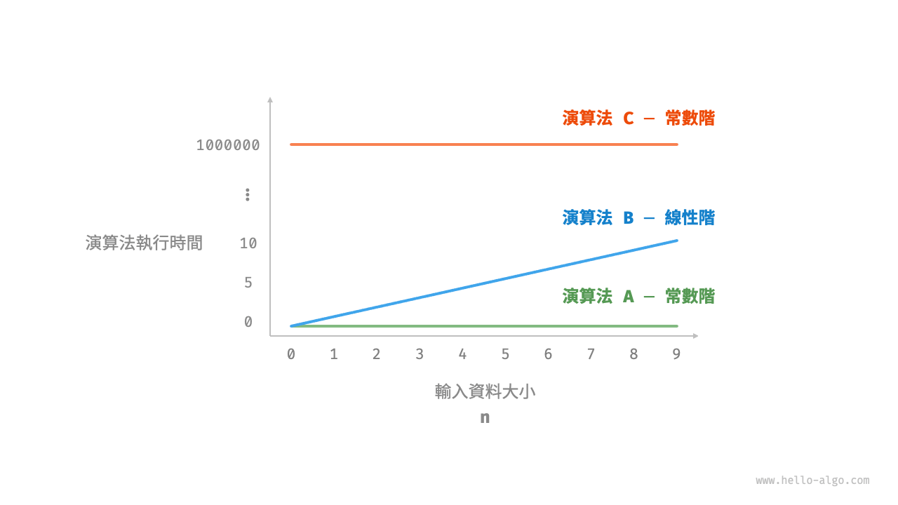
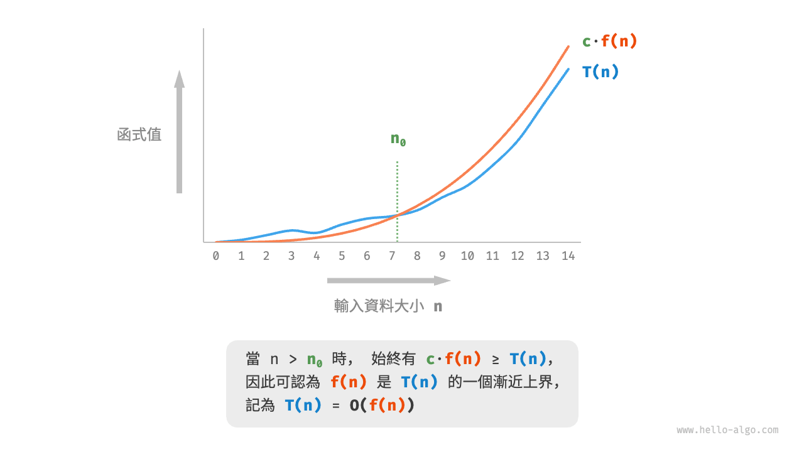
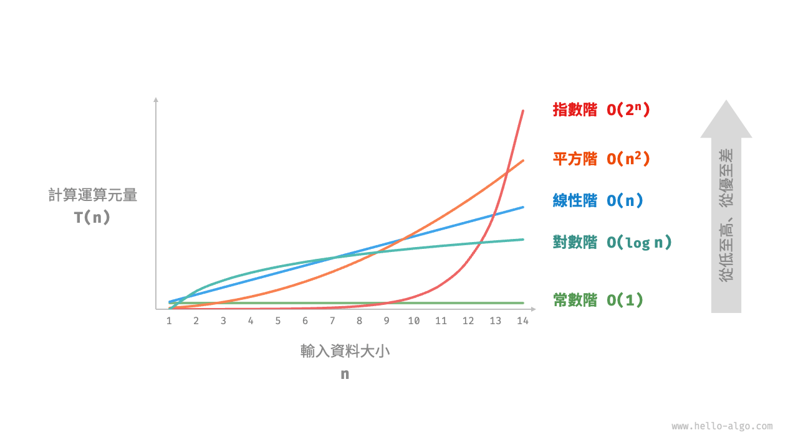
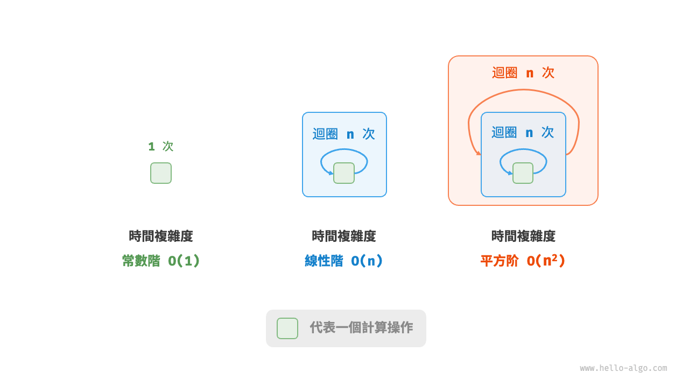
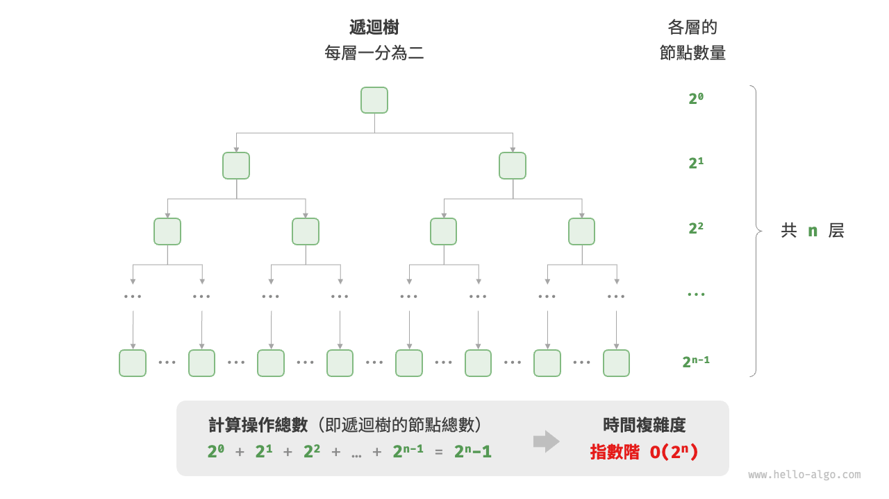
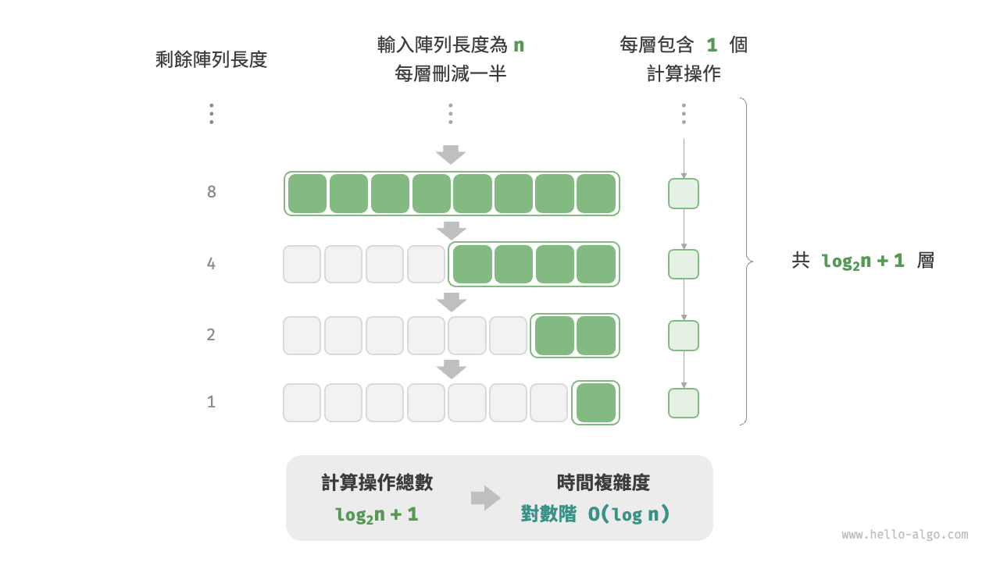
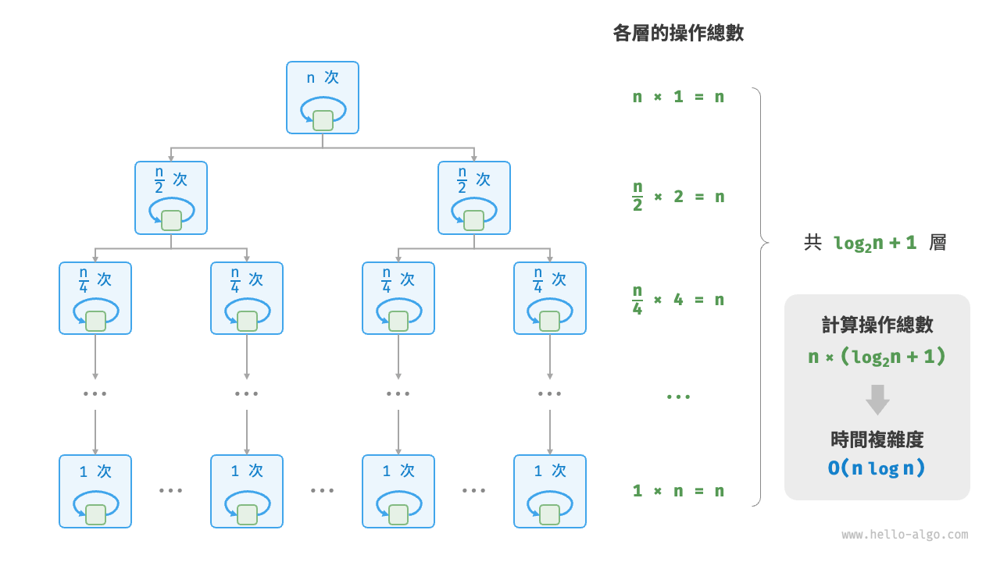
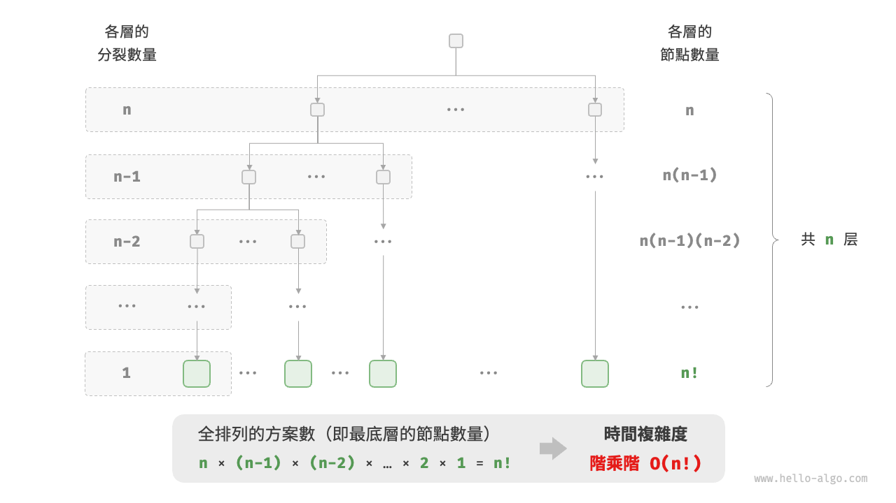

# 2.3 &nbsp; 時間複雜度

執行時間可以直觀且準確地反映演算法的效率。如果我們想準確預估一段程式碼的執行時間，應該如何操作呢？

1. **確定執行平臺**，包括硬體配置、程式語言、系統環境等，這些因素都會影響程式碼的執行效率。
2. **評估各種計算操作所需的執行時間**，例如加法操作 `+` 需要 1 ns ，乘法操作 `*` 需要 10 ns ，列印操作 `print()` 需要 5 ns 等。
3. **統計程式碼中所有的計算操作**，並將所有操作的執行時間求和，從而得到執行時間。

例如在以下程式碼中，輸入資料大小為 $n$ ：

=== "Python"

    ```python title=""
    # 在某執行平臺下
    def algorithm(n: int):
        a = 2      # 1 ns
        a = a + 1  # 1 ns
        a = a * 2  # 10 ns
        # 迴圈 n 次
        for _ in range(n):  # 1 ns
            print(0)        # 5 ns
    ```

=== "C++"

    ```cpp title=""
    // 在某執行平臺下
    void algorithm(int n) {
        int a = 2;  // 1 ns
        a = a + 1;  // 1 ns
        a = a * 2;  // 10 ns
        // 迴圈 n 次
        for (int i = 0; i < n; i++) {  // 1 ns ，每輪都要執行 i++
            cout << 0 << endl;         // 5 ns
        }
    }
    ```

=== "Java"

    ```java title=""
    // 在某執行平臺下
    void algorithm(int n) {
        int a = 2;  // 1 ns
        a = a + 1;  // 1 ns
        a = a * 2;  // 10 ns
        // 迴圈 n 次
        for (int i = 0; i < n; i++) {  // 1 ns ，每輪都要執行 i++
            System.out.println(0);     // 5 ns
        }
    }
    ```

=== "C#"

    ```csharp title=""
    // 在某執行平臺下
    void Algorithm(int n) {
        int a = 2;  // 1 ns
        a = a + 1;  // 1 ns
        a = a * 2;  // 10 ns
        // 迴圈 n 次
        for (int i = 0; i < n; i++) {  // 1 ns ，每輪都要執行 i++
            Console.WriteLine(0);      // 5 ns
        }
    }
    ```

=== "Go"

    ```go title=""
    // 在某執行平臺下
    func algorithm(n int) {
        a := 2     // 1 ns
        a = a + 1  // 1 ns
        a = a * 2  // 10 ns
        // 迴圈 n 次
        for i := 0; i < n; i++ {  // 1 ns
            fmt.Println(a)        // 5 ns
        }
    }
    ```

=== "Swift"

    ```swift title=""
    // 在某執行平臺下
    func algorithm(n: Int) {
        var a = 2 // 1 ns
        a = a + 1 // 1 ns
        a = a * 2 // 10 ns
        // 迴圈 n 次
        for _ in 0 ..< n { // 1 ns
            print(0) // 5 ns
        }
    }
    ```

=== "JS"

    ```javascript title=""
    // 在某執行平臺下
    function algorithm(n) {
        var a = 2; // 1 ns
        a = a + 1; // 1 ns
        a = a * 2; // 10 ns
        // 迴圈 n 次
        for(let i = 0; i < n; i++) { // 1 ns ，每輪都要執行 i++
            console.log(0); // 5 ns
        }
    }
    ```

=== "TS"

    ```typescript title=""
    // 在某執行平臺下
    function algorithm(n: number): void {
        var a: number = 2; // 1 ns
        a = a + 1; // 1 ns
        a = a * 2; // 10 ns
        // 迴圈 n 次
        for(let i = 0; i < n; i++) { // 1 ns ，每輪都要執行 i++
            console.log(0); // 5 ns
        }
    }
    ```

=== "Dart"

    ```dart title=""
    // 在某執行平臺下
    void algorithm(int n) {
      int a = 2; // 1 ns
      a = a + 1; // 1 ns
      a = a * 2; // 10 ns
      // 迴圈 n 次
      for (int i = 0; i < n; i++) { // 1 ns ，每輪都要執行 i++
        print(0); // 5 ns
      }
    }
    ```

=== "Rust"

    ```rust title=""
    // 在某執行平臺下
    fn algorithm(n: i32) {
        let mut a = 2;      // 1 ns
        a = a + 1;          // 1 ns
        a = a * 2;          // 10 ns
        // 迴圈 n 次
        for _ in 0..n {     // 1 ns ，每輪都要執行 i++
            println!("{}", 0);  // 5 ns
        }
    }
    ```

=== "C"

    ```c title=""
    // 在某執行平臺下
    void algorithm(int n) {
        int a = 2;  // 1 ns
        a = a + 1;  // 1 ns
        a = a * 2;  // 10 ns
        // 迴圈 n 次
        for (int i = 0; i < n; i++) {   // 1 ns ，每輪都要執行 i++
            printf("%d", 0);            // 5 ns
        }
    }
    ```

=== "Kotlin"

    ```kotlin title=""
    // 在某執行平臺下
    fun algorithm(n: Int) {
        var a = 2 // 1 ns
        a = a + 1 // 1 ns
        a = a * 2 // 10 ns
        // 迴圈 n 次
        for (i in 0..<n) {  // 1 ns ，每輪都要執行 i++
            println(0)      // 5 ns
        }
    }
    ```

=== "Ruby"

    ```ruby title=""
    # 在某執行平臺下
    def algorithm(n)
        a = 2       # 1 ns
        a = a + 1   # 1 ns
        a = a * 2   # 10 ns
        # 迴圈 n 次
        (0...n).each do # 1 ns
            puts 0      # 5 ns
        end
    end
    ```

=== "Zig"

    ```zig title=""
    // 在某執行平臺下
    fn algorithm(n: usize) void {
        var a: i32 = 2; // 1 ns
        a += 1; // 1 ns
        a *= 2; // 10 ns
        // 迴圈 n 次
        for (0..n) |_| { // 1 ns
            std.debug.print("{}\n", .{0}); // 5 ns
        }
    }
    ```

根據以上方法，可以得到演算法的執行時間為 $(6n + 12)$ ns ：

$$
1 + 1 + 10 + (1 + 5) \times n = 6n + 12
$$

但實際上，**統計演算法的執行時間既不合理也不現實**。首先，我們不希望將預估時間和執行平臺繫結，因為演算法需要在各種不同的平臺上執行。其次，我們很難獲知每種操作的執行時間，這給預估過程帶來了極大的難度。

## 2.3.1 &nbsp; 統計時間增長趨勢

時間複雜度分析統計的不是演算法執行時間，**而是演算法執行時間隨著資料量變大時的增長趨勢**。

“時間增長趨勢”這個概念比較抽象，我們透過一個例子來加以理解。假設輸入資料大小為 $n$ ，給定三個演算法 `A`、`B` 和 `C` ：

=== "Python"

    ```python title=""
    # 演算法 A 的時間複雜度：常數階
    def algorithm_A(n: int):
        print(0)
    # 演算法 B 的時間複雜度：線性階
    def algorithm_B(n: int):
        for _ in range(n):
            print(0)
    # 演算法 C 的時間複雜度：常數階
    def algorithm_C(n: int):
        for _ in range(1000000):
            print(0)
    ```

=== "C++"

    ```cpp title=""
    // 演算法 A 的時間複雜度：常數階
    void algorithm_A(int n) {
        cout << 0 << endl;
    }
    // 演算法 B 的時間複雜度：線性階
    void algorithm_B(int n) {
        for (int i = 0; i < n; i++) {
            cout << 0 << endl;
        }
    }
    // 演算法 C 的時間複雜度：常數階
    void algorithm_C(int n) {
        for (int i = 0; i < 1000000; i++) {
            cout << 0 << endl;
        }
    }
    ```

=== "Java"

    ```java title=""
    // 演算法 A 的時間複雜度：常數階
    void algorithm_A(int n) {
        System.out.println(0);
    }
    // 演算法 B 的時間複雜度：線性階
    void algorithm_B(int n) {
        for (int i = 0; i < n; i++) {
            System.out.println(0);
        }
    }
    // 演算法 C 的時間複雜度：常數階
    void algorithm_C(int n) {
        for (int i = 0; i < 1000000; i++) {
            System.out.println(0);
        }
    }
    ```

=== "C#"

    ```csharp title=""
    // 演算法 A 的時間複雜度：常數階
    void AlgorithmA(int n) {
        Console.WriteLine(0);
    }
    // 演算法 B 的時間複雜度：線性階
    void AlgorithmB(int n) {
        for (int i = 0; i < n; i++) {
            Console.WriteLine(0);
        }
    }
    // 演算法 C 的時間複雜度：常數階
    void AlgorithmC(int n) {
        for (int i = 0; i < 1000000; i++) {
            Console.WriteLine(0);
        }
    }
    ```

=== "Go"

    ```go title=""
    // 演算法 A 的時間複雜度：常數階
    func algorithm_A(n int) {
        fmt.Println(0)
    }
    // 演算法 B 的時間複雜度：線性階
    func algorithm_B(n int) {
        for i := 0; i < n; i++ {
            fmt.Println(0)
        }
    }
    // 演算法 C 的時間複雜度：常數階
    func algorithm_C(n int) {
        for i := 0; i < 1000000; i++ {
            fmt.Println(0)
        }
    }
    ```

=== "Swift"

    ```swift title=""
    // 演算法 A 的時間複雜度：常數階
    func algorithmA(n: Int) {
        print(0)
    }

    // 演算法 B 的時間複雜度：線性階
    func algorithmB(n: Int) {
        for _ in 0 ..< n {
            print(0)
        }
    }

    // 演算法 C 的時間複雜度：常數階
    func algorithmC(n: Int) {
        for _ in 0 ..< 1_000_000 {
            print(0)
        }
    }
    ```

=== "JS"

    ```javascript title=""
    // 演算法 A 的時間複雜度：常數階
    function algorithm_A(n) {
        console.log(0);
    }
    // 演算法 B 的時間複雜度：線性階
    function algorithm_B(n) {
        for (let i = 0; i < n; i++) {
            console.log(0);
        }
    }
    // 演算法 C 的時間複雜度：常數階
    function algorithm_C(n) {
        for (let i = 0; i < 1000000; i++) {
            console.log(0);
        }
    }

    ```

=== "TS"

    ```typescript title=""
    // 演算法 A 的時間複雜度：常數階
    function algorithm_A(n: number): void {
        console.log(0);
    }
    // 演算法 B 的時間複雜度：線性階
    function algorithm_B(n: number): void {
        for (let i = 0; i < n; i++) {
            console.log(0);
        }
    }
    // 演算法 C 的時間複雜度：常數階
    function algorithm_C(n: number): void {
        for (let i = 0; i < 1000000; i++) {
            console.log(0);
        }
    }
    ```

=== "Dart"

    ```dart title=""
    // 演算法 A 的時間複雜度：常數階
    void algorithmA(int n) {
      print(0);
    }
    // 演算法 B 的時間複雜度：線性階
    void algorithmB(int n) {
      for (int i = 0; i < n; i++) {
        print(0);
      }
    }
    // 演算法 C 的時間複雜度：常數階
    void algorithmC(int n) {
      for (int i = 0; i < 1000000; i++) {
        print(0);
      }
    }
    ```

=== "Rust"

    ```rust title=""
    // 演算法 A 的時間複雜度：常數階
    fn algorithm_A(n: i32) {
        println!("{}", 0);
    }
    // 演算法 B 的時間複雜度：線性階
    fn algorithm_B(n: i32) {
        for _ in 0..n {
            println!("{}", 0);
        }
    }
    // 演算法 C 的時間複雜度：常數階
    fn algorithm_C(n: i32) {
        for _ in 0..1000000 {
            println!("{}", 0);
        }
    }
    ```

=== "C"

    ```c title=""
    // 演算法 A 的時間複雜度：常數階
    void algorithm_A(int n) {
        printf("%d", 0);
    }
    // 演算法 B 的時間複雜度：線性階
    void algorithm_B(int n) {
        for (int i = 0; i < n; i++) {
            printf("%d", 0);
        }
    }
    // 演算法 C 的時間複雜度：常數階
    void algorithm_C(int n) {
        for (int i = 0; i < 1000000; i++) {
            printf("%d", 0);
        }
    }
    ```

=== "Kotlin"

    ```kotlin title=""
    // 演算法 A 的時間複雜度：常數階
    fun algoritm_A(n: Int) {
        println(0)
    }
    // 演算法 B 的時間複雜度：線性階
    fun algorithm_B(n: Int) {
        for (i in 0..<n){
            println(0)
        }
    }
    // 演算法 C 的時間複雜度：常數階
    fun algorithm_C(n: Int) {
        for (i in 0..<1000000) {
            println(0)
        }
    }
    ```

=== "Ruby"

    ```ruby title=""
    # 演算法 A 的時間複雜度：常數階
    def algorithm_A(n)
        puts 0
    end

    # 演算法 B 的時間複雜度：線性階
    def algorithm_B(n)
        (0...n).each { puts 0 }
    end

    # 演算法 C 的時間複雜度：常數階
    def algorithm_C(n)
        (0...1_000_000).each { puts 0 }
    end
    ```

=== "Zig"

    ```zig title=""
    // 演算法 A 的時間複雜度：常數階
    fn algorithm_A(n: usize) void {
        _ = n;
        std.debug.print("{}\n", .{0});
    }
    // 演算法 B 的時間複雜度：線性階
    fn algorithm_B(n: i32) void {
        for (0..n) |_| {
            std.debug.print("{}\n", .{0});
        }
    }
    // 演算法 C 的時間複雜度：常數階
    fn algorithm_C(n: i32) void {
        _ = n;
        for (0..1000000) |_| {
            std.debug.print("{}\n", .{0});
        }
    }
    ```

圖 2-7 展示了以上三個演算法函式的時間複雜度。

- 演算法 `A` 只有 $1$ 個列印操作，演算法執行時間不隨著 $n$ 增大而增長。我們稱此演算法的時間複雜度為“常數階”。
- 演算法 `B` 中的列印操作需要迴圈 $n$ 次，演算法執行時間隨著 $n$ 增大呈線性增長。此演算法的時間複雜度被稱為“線性階”。
- 演算法 `C` 中的列印操作需要迴圈 $1000000$ 次，雖然執行時間很長，但它與輸入資料大小 $n$ 無關。因此 `C` 的時間複雜度和 `A` 相同，仍為“常數階”。

{ class="animation-figure" }

<p align="center"> 圖 2-7 &nbsp; 演算法 A、B 和 C 的時間增長趨勢 </p>

相較於直接統計演算法的執行時間，時間複雜度分析有哪些特點呢？

- **時間複雜度能夠有效評估演算法效率**。例如，演算法 `B` 的執行時間呈線性增長，在 $n > 1$ 時比演算法 `A` 更慢，在 $n > 1000000$ 時比演算法 `C` 更慢。事實上，只要輸入資料大小 $n$ 足夠大，複雜度為“常數階”的演算法一定優於“線性階”的演算法，這正是時間增長趨勢的含義。
- **時間複雜度的推算方法更簡便**。顯然，執行平臺和計算操作型別都與演算法執行時間的增長趨勢無關。因此在時間複雜度分析中，我們可以簡單地將所有計算操作的執行時間視為相同的“單位時間”，從而將“計算操作執行時間統計”簡化為“計算操作數量統計”，這樣一來估算難度就大大降低了。
- **時間複雜度也存在一定的侷限性**。例如，儘管演算法 `A` 和 `C` 的時間複雜度相同，但實際執行時間差別很大。同樣，儘管演算法 `B` 的時間複雜度比 `C` 高，但在輸入資料大小 $n$ 較小時，演算法 `B` 明顯優於演算法 `C` 。對於此類情況，我們時常難以僅憑時間複雜度判斷演算法效率的高低。當然，儘管存在上述問題，複雜度分析仍然是評判演算法效率最有效且常用的方法。

## 2.3.2 &nbsp; 函式漸近上界

給定一個輸入大小為 $n$ 的函式：

=== "Python"

    ```python title=""
    def algorithm(n: int):
        a = 1      # +1
        a = a + 1  # +1
        a = a * 2  # +1
        # 迴圈 n 次
        for i in range(n):  # +1
            print(0)        # +1
    ```

=== "C++"

    ```cpp title=""
    void algorithm(int n) {
        int a = 1;  // +1
        a = a + 1;  // +1
        a = a * 2;  // +1
        // 迴圈 n 次
        for (int i = 0; i < n; i++) { // +1（每輪都執行 i ++）
            cout << 0 << endl;    // +1
        }
    }
    ```

=== "Java"

    ```java title=""
    void algorithm(int n) {
        int a = 1;  // +1
        a = a + 1;  // +1
        a = a * 2;  // +1
        // 迴圈 n 次
        for (int i = 0; i < n; i++) { // +1（每輪都執行 i ++）
            System.out.println(0);    // +1
        }
    }
    ```

=== "C#"

    ```csharp title=""
    void Algorithm(int n) {
        int a = 1;  // +1
        a = a + 1;  // +1
        a = a * 2;  // +1
        // 迴圈 n 次
        for (int i = 0; i < n; i++) {   // +1（每輪都執行 i ++）
            Console.WriteLine(0);   // +1
        }
    }
    ```

=== "Go"

    ```go title=""
    func algorithm(n int) {
        a := 1      // +1
        a = a + 1   // +1
        a = a * 2   // +1
        // 迴圈 n 次
        for i := 0; i < n; i++ {   // +1
            fmt.Println(a)         // +1
        }
    }
    ```

=== "Swift"

    ```swift title=""
    func algorithm(n: Int) {
        var a = 1 // +1
        a = a + 1 // +1
        a = a * 2 // +1
        // 迴圈 n 次
        for _ in 0 ..< n { // +1
            print(0) // +1
        }
    }
    ```

=== "JS"

    ```javascript title=""
    function algorithm(n) {
        var a = 1; // +1
        a += 1; // +1
        a *= 2; // +1
        // 迴圈 n 次
        for(let i = 0; i < n; i++){ // +1（每輪都執行 i ++）
            console.log(0); // +1
        }
    }
    ```

=== "TS"

    ```typescript title=""
    function algorithm(n: number): void{
        var a: number = 1; // +1
        a += 1; // +1
        a *= 2; // +1
        // 迴圈 n 次
        for(let i = 0; i < n; i++){ // +1（每輪都執行 i ++）
            console.log(0); // +1
        }
    }
    ```

=== "Dart"

    ```dart title=""
    void algorithm(int n) {
      int a = 1; // +1
      a = a + 1; // +1
      a = a * 2; // +1
      // 迴圈 n 次
      for (int i = 0; i < n; i++) { // +1（每輪都執行 i ++）
        print(0); // +1
      }
    }
    ```

=== "Rust"

    ```rust title=""
    fn algorithm(n: i32) {
        let mut a = 1;   // +1
        a = a + 1;      // +1
        a = a * 2;      // +1

        // 迴圈 n 次
        for _ in 0..n { // +1（每輪都執行 i ++）
            println!("{}", 0); // +1
        }
    }
    ```

=== "C"

    ```c title=""
    void algorithm(int n) {
        int a = 1;  // +1
        a = a + 1;  // +1
        a = a * 2;  // +1
        // 迴圈 n 次
        for (int i = 0; i < n; i++) {   // +1（每輪都執行 i ++）
            printf("%d", 0);            // +1
        }
    }
    ```

=== "Kotlin"

    ```kotlin title=""
    fun algorithm(n: Int) {
        var a = 1 // +1
        a = a + 1 // +1
        a = a * 2 // +1
        // 迴圈 n 次
        for (i in 0..<n) { // +1（每輪都執行 i ++）
            println(0) // +1
        }
    }
    ```

=== "Ruby"

    ```ruby title=""
    def algorithm(n)
        a = 1       # +1
        a = a + 1   # +1
        a = a * 2   # +1
        # 迴圈 n 次
        (0...n).each do # +1
            puts 0      # +1
        end
    end
    ```

=== "Zig"

    ```zig title=""
    fn algorithm(n: usize) void {
        var a: i32 = 1; // +1
        a += 1; // +1
        a *= 2; // +1
        // 迴圈 n 次
        for (0..n) |_| { // +1（每輪都執行 i ++）
            std.debug.print("{}\n", .{0}); // +1
        }
    }
    ```

設演算法的操作數量是一個關於輸入資料大小 $n$ 的函式，記為 $T(n)$ ，則以上函式的操作數量為：

$$
T(n) = 3 + 2n
$$

$T(n)$ 是一次函式，說明其執行時間的增長趨勢是線性的，因此它的時間複雜度是線性階。

我們將線性階的時間複雜度記為 $O(n)$ ，這個數學符號稱為<u>大 $O$ 記號（big-$O$ notation）</u>，表示函式 $T(n)$ 的<u>漸近上界（asymptotic upper bound）</u>。

時間複雜度分析本質上是計算“操作數量 $T(n)$”的漸近上界，它具有明確的數學定義。

!!! note "函式漸近上界"

    若存在正實數 $c$ 和實數 $n_0$ ，使得對於所有的 $n > n_0$ ，均有 $T(n) \leq c \cdot f(n)$ ，則可認為 $f(n)$ 給出了 $T(n)$ 的一個漸近上界，記為 $T(n) = O(f(n))$ 。

如圖 2-8 所示，計算漸近上界就是尋找一個函式 $f(n)$ ，使得當 $n$ 趨向於無窮大時，$T(n)$ 和 $f(n)$ 處於相同的增長級別，僅相差一個常數項 $c$ 的倍數。

{ class="animation-figure" }

<p align="center"> 圖 2-8 &nbsp; 函式的漸近上界 </p>

## 2.3.3 &nbsp; 推算方法

漸近上界的數學味兒有點重，如果你感覺沒有完全理解，也無須擔心。我們可以先掌握推算方法，在不斷的實踐中，就可以逐漸領悟其數學意義。

根據定義，確定 $f(n)$ 之後，我們便可得到時間複雜度 $O(f(n))$ 。那麼如何確定漸近上界 $f(n)$ 呢？總體分為兩步：首先統計操作數量，然後判斷漸近上界。

### 1. &nbsp; 第一步：統計操作數量

針對程式碼，逐行從上到下計算即可。然而，由於上述 $c \cdot f(n)$ 中的常數項 $c$ 可以取任意大小，**因此操作數量 $T(n)$ 中的各種係數、常數項都可以忽略**。根據此原則，可以總結出以下計數簡化技巧。

1. **忽略 $T(n)$ 中的常數項**。因為它們都與 $n$ 無關，所以對時間複雜度不產生影響。
2. **省略所有係數**。例如，迴圈 $2n$ 次、$5n + 1$ 次等，都可以簡化記為 $n$ 次，因為 $n$ 前面的係數對時間複雜度沒有影響。
3. **迴圈巢狀時使用乘法**。總操作數量等於外層迴圈和內層迴圈操作數量之積，每一層迴圈依然可以分別套用第 `1.` 點和第 `2.` 點的技巧。

給定一個函式，我們可以用上述技巧來統計操作數量：

=== "Python"

    ```python title=""
    def algorithm(n: int):
        a = 1      # +0（技巧 1）
        a = a + n  # +0（技巧 1）
        # +n（技巧 2）
        for i in range(5 * n + 1):
            print(0)
        # +n*n（技巧 3）
        for i in range(2 * n):
            for j in range(n + 1):
                print(0)
    ```

=== "C++"

    ```cpp title=""
    void algorithm(int n) {
        int a = 1;  // +0（技巧 1）
        a = a + n;  // +0（技巧 1）
        // +n（技巧 2）
        for (int i = 0; i < 5 * n + 1; i++) {
            cout << 0 << endl;
        }
        // +n*n（技巧 3）
        for (int i = 0; i < 2 * n; i++) {
            for (int j = 0; j < n + 1; j++) {
                cout << 0 << endl;
            }
        }
    }
    ```

=== "Java"

    ```java title=""
    void algorithm(int n) {
        int a = 1;  // +0（技巧 1）
        a = a + n;  // +0（技巧 1）
        // +n（技巧 2）
        for (int i = 0; i < 5 * n + 1; i++) {
            System.out.println(0);
        }
        // +n*n（技巧 3）
        for (int i = 0; i < 2 * n; i++) {
            for (int j = 0; j < n + 1; j++) {
                System.out.println(0);
            }
        }
    }
    ```

=== "C#"

    ```csharp title=""
    void Algorithm(int n) {
        int a = 1;  // +0（技巧 1）
        a = a + n;  // +0（技巧 1）
        // +n（技巧 2）
        for (int i = 0; i < 5 * n + 1; i++) {
            Console.WriteLine(0);
        }
        // +n*n（技巧 3）
        for (int i = 0; i < 2 * n; i++) {
            for (int j = 0; j < n + 1; j++) {
                Console.WriteLine(0);
            }
        }
    }
    ```

=== "Go"

    ```go title=""
    func algorithm(n int) {
        a := 1     // +0（技巧 1）
        a = a + n  // +0（技巧 1）
        // +n（技巧 2）
        for i := 0; i < 5 * n + 1; i++ {
            fmt.Println(0)
        }
        // +n*n（技巧 3）
        for i := 0; i < 2 * n; i++ {
            for j := 0; j < n + 1; j++ {
                fmt.Println(0)
            }
        }
    }
    ```

=== "Swift"

    ```swift title=""
    func algorithm(n: Int) {
        var a = 1 // +0（技巧 1）
        a = a + n // +0（技巧 1）
        // +n（技巧 2）
        for _ in 0 ..< (5 * n + 1) {
            print(0)
        }
        // +n*n（技巧 3）
        for _ in 0 ..< (2 * n) {
            for _ in 0 ..< (n + 1) {
                print(0)
            }
        }
    }
    ```

=== "JS"

    ```javascript title=""
    function algorithm(n) {
        let a = 1;  // +0（技巧 1）
        a = a + n;  // +0（技巧 1）
        // +n（技巧 2）
        for (let i = 0; i < 5 * n + 1; i++) {
            console.log(0);
        }
        // +n*n（技巧 3）
        for (let i = 0; i < 2 * n; i++) {
            for (let j = 0; j < n + 1; j++) {
                console.log(0);
            }
        }
    }
    ```

=== "TS"

    ```typescript title=""
    function algorithm(n: number): void {
        let a = 1;  // +0（技巧 1）
        a = a + n;  // +0（技巧 1）
        // +n（技巧 2）
        for (let i = 0; i < 5 * n + 1; i++) {
            console.log(0);
        }
        // +n*n（技巧 3）
        for (let i = 0; i < 2 * n; i++) {
            for (let j = 0; j < n + 1; j++) {
                console.log(0);
            }
        }
    }
    ```

=== "Dart"

    ```dart title=""
    void algorithm(int n) {
      int a = 1; // +0（技巧 1）
      a = a + n; // +0（技巧 1）
      // +n（技巧 2）
      for (int i = 0; i < 5 * n + 1; i++) {
        print(0);
      }
      // +n*n（技巧 3）
      for (int i = 0; i < 2 * n; i++) {
        for (int j = 0; j < n + 1; j++) {
          print(0);
        }
      }
    }
    ```

=== "Rust"

    ```rust title=""
    fn algorithm(n: i32) {
        let mut a = 1;     // +0（技巧 1）
        a = a + n;        // +0（技巧 1）

        // +n（技巧 2）
        for i in 0..(5 * n + 1) {
            println!("{}", 0);
        }

        // +n*n（技巧 3）
        for i in 0..(2 * n) {
            for j in 0..(n + 1) {
                println!("{}", 0);
            }
        }
    }
    ```

=== "C"

    ```c title=""
    void algorithm(int n) {
        int a = 1;  // +0（技巧 1）
        a = a + n;  // +0（技巧 1）
        // +n（技巧 2）
        for (int i = 0; i < 5 * n + 1; i++) {
            printf("%d", 0);
        }
        // +n*n（技巧 3）
        for (int i = 0; i < 2 * n; i++) {
            for (int j = 0; j < n + 1; j++) {
                printf("%d", 0);
            }
        }
    }
    ```

=== "Kotlin"

    ```kotlin title=""
    fun algorithm(n: Int) {
        var a = 1   // +0（技巧 1）
        a = a + n   // +0（技巧 1）
        // +n（技巧 2）
        for (i in 0..<5 * n + 1) {
            println(0)
        }
        // +n*n（技巧 3）
        for (i in 0..<2 * n) {
            for (j in 0..<n + 1) {
                println(0)
            }
        }
    }
    ```

=== "Ruby"

    ```ruby title=""
    def algorithm(n)
        a = 1       # +0（技巧 1）
        a = a + n   # +0（技巧 1）
        # +n（技巧 2）
        (0...(5 * n + 1)).each do { puts 0 }
        # +n*n（技巧 3）
        (0...(2 * n)).each do
            (0...(n + 1)).each do { puts 0 }
        end
    end
    ```

=== "Zig"

    ```zig title=""
    fn algorithm(n: usize) void {
        var a: i32 = 1;     // +0（技巧 1）
        a = a + @as(i32, @intCast(n));        // +0（技巧 1）

        // +n（技巧 2）
        for(0..(5 * n + 1)) |_| {
            std.debug.print("{}\n", .{0});
        }

        // +n*n（技巧 3）
        for(0..(2 * n)) |_| {
            for(0..(n + 1)) |_| {
                std.debug.print("{}\n", .{0});
            }
        }
    }
    ```

以下公式展示了使用上述技巧前後的統計結果，兩者推算出的時間複雜度都為 $O(n^2)$ 。

$$
\begin{aligned}
T(n) & = 2n(n + 1) + (5n + 1) + 2 & \text{完整統計 (-.-|||)} \newline
& = 2n^2 + 7n + 3 \newline
T(n) & = n^2 + n & \text{偷懶統計 (o.O)}
\end{aligned}
$$

### 2. &nbsp; 第二步：判斷漸近上界

**時間複雜度由 $T(n)$ 中最高階的項來決定**。這是因為在 $n$ 趨於無窮大時，最高階的項將發揮主導作用，其他項的影響都可以忽略。

表 2-2 展示了一些例子，其中一些誇張的值是為了強調“係數無法撼動階數”這一結論。當 $n$ 趨於無窮大時，這些常數變得無足輕重。

<p align="center"> 表 2-2 &nbsp; 不同操作數量對應的時間複雜度 </p>

<div class="center-table" markdown>

| 操作數量 $T(n)$        | 時間複雜度 $O(f(n))$ |
| ---------------------- | -------------------- |
| $100000$               | $O(1)$               |
| $3n + 2$               | $O(n)$               |
| $2n^2 + 3n + 2$        | $O(n^2)$             |
| $n^3 + 10000n^2$       | $O(n^3)$             |
| $2^n + 10000n^{10000}$ | $O(2^n)$             |

</div>

## 2.3.4 &nbsp; 常見型別

設輸入資料大小為 $n$ ，常見的時間複雜度型別如圖 2-9 所示（按照從低到高的順序排列）。

$$
\begin{aligned}
O(1) < O(\log n) < O(n) < O(n \log n) < O(n^2) < O(2^n) < O(n!) \newline
\text{常數階} < \text{對數階} < \text{線性階} < \text{線性對數階} < \text{平方階} < \text{指數階} < \text{階乘階}
\end{aligned}
$$

{ class="animation-figure" }

<p align="center"> 圖 2-9 &nbsp; 常見的時間複雜度型別 </p>

### 1. &nbsp; 常數階 $O(1)$ {data-toc-label="1. &nbsp; 常數階"}

常數階的操作數量與輸入資料大小 $n$ 無關，即不隨著 $n$ 的變化而變化。

在以下函式中，儘管操作數量 `size` 可能很大，但由於其與輸入資料大小 $n$ 無關，因此時間複雜度仍為 $O(1)$ ：

=== "Python"

    ```python title="time_complexity.py"
    def constant(n: int) -> int:
        """常數階"""
        count = 0
        size = 100000
        for _ in range(size):
            count += 1
        return count
    ```

=== "C++"

    ```cpp title="time_complexity.cpp"
    /* 常數階 */
    int constant(int n) {
        int count = 0;
        int size = 100000;
        for (int i = 0; i < size; i++)
            count++;
        return count;
    }
    ```

=== "Java"

    ```java title="time_complexity.java"
    /* 常數階 */
    int constant(int n) {
        int count = 0;
        int size = 100000;
        for (int i = 0; i < size; i++)
            count++;
        return count;
    }
    ```

=== "C#"

    ```csharp title="time_complexity.cs"
    /* 常數階 */
    int Constant(int n) {
        int count = 0;
        int size = 100000;
        for (int i = 0; i < size; i++)
            count++;
        return count;
    }
    ```

=== "Go"

    ```go title="time_complexity.go"
    /* 常數階 */
    func constant(n int) int {
        count := 0
        size := 100000
        for i := 0; i < size; i++ {
            count++
        }
        return count
    }
    ```

=== "Swift"

    ```swift title="time_complexity.swift"
    /* 常數階 */
    func constant(n: Int) -> Int {
        var count = 0
        let size = 100_000
        for _ in 0 ..< size {
            count += 1
        }
        return count
    }
    ```

=== "JS"

    ```javascript title="time_complexity.js"
    /* 常數階 */
    function constant(n) {
        let count = 0;
        const size = 100000;
        for (let i = 0; i < size; i++) count++;
        return count;
    }
    ```

=== "TS"

    ```typescript title="time_complexity.ts"
    /* 常數階 */
    function constant(n: number): number {
        let count = 0;
        const size = 100000;
        for (let i = 0; i < size; i++) count++;
        return count;
    }
    ```

=== "Dart"

    ```dart title="time_complexity.dart"
    /* 常數階 */
    int constant(int n) {
      int count = 0;
      int size = 100000;
      for (var i = 0; i < size; i++) {
        count++;
      }
      return count;
    }
    ```

=== "Rust"

    ```rust title="time_complexity.rs"
    /* 常數階 */
    fn constant(n: i32) -> i32 {
        _ = n;
        let mut count = 0;
        let size = 100_000;
        for _ in 0..size {
            count += 1;
        }
        count
    }
    ```

=== "C"

    ```c title="time_complexity.c"
    /* 常數階 */
    int constant(int n) {
        int count = 0;
        int size = 100000;
        int i = 0;
        for (int i = 0; i < size; i++) {
            count++;
        }
        return count;
    }
    ```

=== "Kotlin"

    ```kotlin title="time_complexity.kt"
    /* 常數階 */
    fun constant(n: Int): Int {
        var count = 0
        val size = 100000
        for (i in 0..<size)
            count++
        return count
    }
    ```

=== "Ruby"

    ```ruby title="time_complexity.rb"
    ### 常數階 ###
    def constant(n)
      count = 0
      size = 100000

      (0...size).each { count += 1 }

      count
    end
    ```

=== "Zig"

    ```zig title="time_complexity.zig"
    // 常數階
    fn constant(n: i32) i32 {
        _ = n;
        var count: i32 = 0;
        const size: i32 = 100_000;
        var i: i32 = 0;
        while(i<size) : (i += 1) {
            count += 1;
        }
        return count;
    }
    ```

??? pythontutor "視覺化執行"

    <div style="height: 459px; width: 100%;"><iframe class="pythontutor-iframe" src="https://pythontutor.com/iframe-embed.html#code=def%20constant%28n%3A%20int%29%20-%3E%20int%3A%0A%20%20%20%20%22%22%22%E5%B8%B8%E6%95%B8%E9%9A%8E%22%22%22%0A%20%20%20%20count%20%3D%200%0A%20%20%20%20size%20%3D%2010%0A%20%20%20%20for%20_%20in%20range%28size%29%3A%0A%20%20%20%20%20%20%20%20count%20%2B%3D%201%0A%20%20%20%20return%20count%0A%0A%22%22%22Driver%20Code%22%22%22%0Aif%20__name__%20%3D%3D%20%22__main__%22%3A%0A%20%20%20%20n%20%3D%208%0A%20%20%20%20print%28%22%E8%BC%B8%E5%85%A5%E8%B3%87%E6%96%99%E5%A4%A7%E5%B0%8F%20n%20%3D%22%2C%20n%29%0A%0A%20%20%20%20count%20%3D%20constant%28n%29%0A%20%20%20%20print%28%22%E5%B8%B8%E6%95%B8%E9%9A%8E%E7%9A%84%E6%93%8D%E4%BD%9C%E6%95%B8%E9%87%8F%20%3D%22%2C%20count%29&codeDivHeight=472&codeDivWidth=350&cumulative=false&curInstr=3&heapPrimitives=nevernest&origin=opt-frontend.js&py=311&rawInputLstJSON=%5B%5D&textReferences=false"> </iframe></div>
    <div style="margin-top: 5px;"><a href="https://pythontutor.com/iframe-embed.html#code=def%20constant%28n%3A%20int%29%20-%3E%20int%3A%0A%20%20%20%20%22%22%22%E5%B8%B8%E6%95%B8%E9%9A%8E%22%22%22%0A%20%20%20%20count%20%3D%200%0A%20%20%20%20size%20%3D%2010%0A%20%20%20%20for%20_%20in%20range%28size%29%3A%0A%20%20%20%20%20%20%20%20count%20%2B%3D%201%0A%20%20%20%20return%20count%0A%0A%22%22%22Driver%20Code%22%22%22%0Aif%20__name__%20%3D%3D%20%22__main__%22%3A%0A%20%20%20%20n%20%3D%208%0A%20%20%20%20print%28%22%E8%BC%B8%E5%85%A5%E8%B3%87%E6%96%99%E5%A4%A7%E5%B0%8F%20n%20%3D%22%2C%20n%29%0A%0A%20%20%20%20count%20%3D%20constant%28n%29%0A%20%20%20%20print%28%22%E5%B8%B8%E6%95%B8%E9%9A%8E%E7%9A%84%E6%93%8D%E4%BD%9C%E6%95%B8%E9%87%8F%20%3D%22%2C%20count%29&codeDivHeight=800&codeDivWidth=600&cumulative=false&curInstr=3&heapPrimitives=nevernest&origin=opt-frontend.js&py=311&rawInputLstJSON=%5B%5D&textReferences=false" target="_blank" rel="noopener noreferrer">全螢幕觀看 ></a></div>

### 2. &nbsp; 線性階 $O(n)$ {data-toc-label="2. &nbsp; 線性階"}

線性階的操作數量相對於輸入資料大小 $n$ 以線性級別增長。線性階通常出現在單層迴圈中：

=== "Python"

    ```python title="time_complexity.py"
    def linear(n: int) -> int:
        """線性階"""
        count = 0
        for _ in range(n):
            count += 1
        return count
    ```

=== "C++"

    ```cpp title="time_complexity.cpp"
    /* 線性階 */
    int linear(int n) {
        int count = 0;
        for (int i = 0; i < n; i++)
            count++;
        return count;
    }
    ```

=== "Java"

    ```java title="time_complexity.java"
    /* 線性階 */
    int linear(int n) {
        int count = 0;
        for (int i = 0; i < n; i++)
            count++;
        return count;
    }
    ```

=== "C#"

    ```csharp title="time_complexity.cs"
    /* 線性階 */
    int Linear(int n) {
        int count = 0;
        for (int i = 0; i < n; i++)
            count++;
        return count;
    }
    ```

=== "Go"

    ```go title="time_complexity.go"
    /* 線性階 */
    func linear(n int) int {
        count := 0
        for i := 0; i < n; i++ {
            count++
        }
        return count
    }
    ```

=== "Swift"

    ```swift title="time_complexity.swift"
    /* 線性階 */
    func linear(n: Int) -> Int {
        var count = 0
        for _ in 0 ..< n {
            count += 1
        }
        return count
    }
    ```

=== "JS"

    ```javascript title="time_complexity.js"
    /* 線性階 */
    function linear(n) {
        let count = 0;
        for (let i = 0; i < n; i++) count++;
        return count;
    }
    ```

=== "TS"

    ```typescript title="time_complexity.ts"
    /* 線性階 */
    function linear(n: number): number {
        let count = 0;
        for (let i = 0; i < n; i++) count++;
        return count;
    }
    ```

=== "Dart"

    ```dart title="time_complexity.dart"
    /* 線性階 */
    int linear(int n) {
      int count = 0;
      for (var i = 0; i < n; i++) {
        count++;
      }
      return count;
    }
    ```

=== "Rust"

    ```rust title="time_complexity.rs"
    /* 線性階 */
    fn linear(n: i32) -> i32 {
        let mut count = 0;
        for _ in 0..n {
            count += 1;
        }
        count
    }
    ```

=== "C"

    ```c title="time_complexity.c"
    /* 線性階 */
    int linear(int n) {
        int count = 0;
        for (int i = 0; i < n; i++) {
            count++;
        }
        return count;
    }
    ```

=== "Kotlin"

    ```kotlin title="time_complexity.kt"
    /* 線性階 */
    fun linear(n: Int): Int {
        var count = 0
        for (i in 0..<n)
            count++
        return count
    }
    ```

=== "Ruby"

    ```ruby title="time_complexity.rb"
    ### 線性階 ###
    def linear(n)
      count = 0
      (0...n).each { count += 1 }
      count
    end
    ```

=== "Zig"

    ```zig title="time_complexity.zig"
    // 線性階
    fn linear(n: i32) i32 {
        var count: i32 = 0;
        var i: i32 = 0;
        while (i < n) : (i += 1) {
            count += 1;
        }
        return count;
    }
    ```

??? pythontutor "視覺化執行"

    <div style="height: 441px; width: 100%;"><iframe class="pythontutor-iframe" src="https://pythontutor.com/iframe-embed.html#code=def%20linear%28n%29%20-%3E%20int%3A%0A%20%20%20%20%22%22%22%E7%B7%9A%E6%80%A7%E9%9A%8E%22%22%22%0A%20%20%20%20count%20%3D%200%0A%20%20%20%20for%20_%20in%20range%28n%29%3A%0A%20%20%20%20%20%20%20%20count%20%2B%3D%201%0A%20%20%20%20return%20count%0A%0A%22%22%22Driver%20Code%22%22%22%0Aif%20__name__%20%3D%3D%20%22__main__%22%3A%0A%20%20%20%20n%20%3D%208%0A%20%20%20%20print%28%22%E8%BC%B8%E5%85%A5%E8%B3%87%E6%96%99%E5%A4%A7%E5%B0%8F%20n%20%3D%22%2C%20n%29%0A%0A%20%20%20%20count%20%3D%20linear%28n%29%0A%20%20%20%20print%28%22%E7%B7%9A%E6%80%A7%E9%9A%8E%E7%9A%84%E6%93%8D%E4%BD%9C%E6%95%B8%E9%87%8F%20%3D%22%2C%20count%29&codeDivHeight=472&codeDivWidth=350&cumulative=false&curInstr=3&heapPrimitives=nevernest&origin=opt-frontend.js&py=311&rawInputLstJSON=%5B%5D&textReferences=false"> </iframe></div>
    <div style="margin-top: 5px;"><a href="https://pythontutor.com/iframe-embed.html#code=def%20linear%28n%29%20-%3E%20int%3A%0A%20%20%20%20%22%22%22%E7%B7%9A%E6%80%A7%E9%9A%8E%22%22%22%0A%20%20%20%20count%20%3D%200%0A%20%20%20%20for%20_%20in%20range%28n%29%3A%0A%20%20%20%20%20%20%20%20count%20%2B%3D%201%0A%20%20%20%20return%20count%0A%0A%22%22%22Driver%20Code%22%22%22%0Aif%20__name__%20%3D%3D%20%22__main__%22%3A%0A%20%20%20%20n%20%3D%208%0A%20%20%20%20print%28%22%E8%BC%B8%E5%85%A5%E8%B3%87%E6%96%99%E5%A4%A7%E5%B0%8F%20n%20%3D%22%2C%20n%29%0A%0A%20%20%20%20count%20%3D%20linear%28n%29%0A%20%20%20%20print%28%22%E7%B7%9A%E6%80%A7%E9%9A%8E%E7%9A%84%E6%93%8D%E4%BD%9C%E6%95%B8%E9%87%8F%20%3D%22%2C%20count%29&codeDivHeight=800&codeDivWidth=600&cumulative=false&curInstr=3&heapPrimitives=nevernest&origin=opt-frontend.js&py=311&rawInputLstJSON=%5B%5D&textReferences=false" target="_blank" rel="noopener noreferrer">全螢幕觀看 ></a></div>

走訪陣列和走訪鏈結串列等操作的時間複雜度均為 $O(n)$ ，其中 $n$ 為陣列或鏈結串列的長度：

=== "Python"

    ```python title="time_complexity.py"
    def array_traversal(nums: list[int]) -> int:
        """線性階（走訪陣列）"""
        count = 0
        # 迴圈次數與陣列長度成正比
        for num in nums:
            count += 1
        return count
    ```

=== "C++"

    ```cpp title="time_complexity.cpp"
    /* 線性階（走訪陣列） */
    int arrayTraversal(vector<int> &nums) {
        int count = 0;
        // 迴圈次數與陣列長度成正比
        for (int num : nums) {
            count++;
        }
        return count;
    }
    ```

=== "Java"

    ```java title="time_complexity.java"
    /* 線性階（走訪陣列） */
    int arrayTraversal(int[] nums) {
        int count = 0;
        // 迴圈次數與陣列長度成正比
        for (int num : nums) {
            count++;
        }
        return count;
    }
    ```

=== "C#"

    ```csharp title="time_complexity.cs"
    /* 線性階（走訪陣列） */
    int ArrayTraversal(int[] nums) {
        int count = 0;
        // 迴圈次數與陣列長度成正比
        foreach (int num in nums) {
            count++;
        }
        return count;
    }
    ```

=== "Go"

    ```go title="time_complexity.go"
    /* 線性階（走訪陣列） */
    func arrayTraversal(nums []int) int {
        count := 0
        // 迴圈次數與陣列長度成正比
        for range nums {
            count++
        }
        return count
    }
    ```

=== "Swift"

    ```swift title="time_complexity.swift"
    /* 線性階（走訪陣列） */
    func arrayTraversal(nums: [Int]) -> Int {
        var count = 0
        // 迴圈次數與陣列長度成正比
        for _ in nums {
            count += 1
        }
        return count
    }
    ```

=== "JS"

    ```javascript title="time_complexity.js"
    /* 線性階（走訪陣列） */
    function arrayTraversal(nums) {
        let count = 0;
        // 迴圈次數與陣列長度成正比
        for (let i = 0; i < nums.length; i++) {
            count++;
        }
        return count;
    }
    ```

=== "TS"

    ```typescript title="time_complexity.ts"
    /* 線性階（走訪陣列） */
    function arrayTraversal(nums: number[]): number {
        let count = 0;
        // 迴圈次數與陣列長度成正比
        for (let i = 0; i < nums.length; i++) {
            count++;
        }
        return count;
    }
    ```

=== "Dart"

    ```dart title="time_complexity.dart"
    /* 線性階（走訪陣列） */
    int arrayTraversal(List<int> nums) {
      int count = 0;
      // 迴圈次數與陣列長度成正比
      for (var _num in nums) {
        count++;
      }
      return count;
    }
    ```

=== "Rust"

    ```rust title="time_complexity.rs"
    /* 線性階（走訪陣列） */
    fn array_traversal(nums: &[i32]) -> i32 {
        let mut count = 0;
        // 迴圈次數與陣列長度成正比
        for _ in nums {
            count += 1;
        }
        count
    }
    ```

=== "C"

    ```c title="time_complexity.c"
    /* 線性階（走訪陣列） */
    int arrayTraversal(int *nums, int n) {
        int count = 0;
        // 迴圈次數與陣列長度成正比
        for (int i = 0; i < n; i++) {
            count++;
        }
        return count;
    }
    ```

=== "Kotlin"

    ```kotlin title="time_complexity.kt"
    /* 線性階（走訪陣列） */
    fun arrayTraversal(nums: IntArray): Int {
        var count = 0
        // 迴圈次數與陣列長度成正比
        for (num in nums) {
            count++
        }
        return count
    }
    ```

=== "Ruby"

    ```ruby title="time_complexity.rb"
    ### 線性階（走訪陣列）###
    def array_traversal(nums)
      count = 0

      # 迴圈次數與陣列長度成正比
      for num in nums
        count += 1
      end

      count
    end
    ```

=== "Zig"

    ```zig title="time_complexity.zig"
    // 線性階（走訪陣列）
    fn arrayTraversal(nums: []i32) i32 {
        var count: i32 = 0;
        // 迴圈次數與陣列長度成正比
        for (nums) |_| {
            count += 1;
        }
        return count;
    }
    ```

??? pythontutor "視覺化執行"

    <div style="height: 459px; width: 100%;"><iframe class="pythontutor-iframe" src="https://pythontutor.com/iframe-embed.html#code=def%20array_traversal%28nums%3A%20list%5Bint%5D%29%20-%3E%20int%3A%0A%20%20%20%20%22%22%22%E7%B7%9A%E6%80%A7%E9%9A%8E%EF%BC%88%E8%B5%B0%E8%A8%AA%E9%99%A3%E5%88%97%EF%BC%89%22%22%22%0A%20%20%20%20count%20%3D%200%0A%20%20%20%20%23%20%E8%BF%B4%E5%9C%88%E6%AC%A1%E6%95%B8%E8%88%87%E9%99%A3%E5%88%97%E9%95%B7%E5%BA%A6%E6%88%90%E6%AD%A3%E6%AF%94%0A%20%20%20%20for%20num%20in%20nums%3A%0A%20%20%20%20%20%20%20%20count%20%2B%3D%201%0A%20%20%20%20return%20count%0A%0A%22%22%22Driver%20Code%22%22%22%0Aif%20__name__%20%3D%3D%20%22__main__%22%3A%0A%20%20%20%20n%20%3D%208%0A%20%20%20%20print%28%22%E8%BC%B8%E5%85%A5%E8%B3%87%E6%96%99%E5%A4%A7%E5%B0%8F%20n%20%3D%22%2C%20n%29%0A%0A%20%20%20%20count%20%3D%20array_traversal%28%5B0%5D%20%2A%20n%29%0A%20%20%20%20print%28%22%E7%B7%9A%E6%80%A7%E9%9A%8E%EF%BC%88%E8%B5%B0%E8%A8%AA%E9%99%A3%E5%88%97%EF%BC%89%E7%9A%84%E6%93%8D%E4%BD%9C%E6%95%B8%E9%87%8F%20%3D%22%2C%20count%29&codeDivHeight=472&codeDivWidth=350&cumulative=false&curInstr=3&heapPrimitives=nevernest&origin=opt-frontend.js&py=311&rawInputLstJSON=%5B%5D&textReferences=false"> </iframe></div>
    <div style="margin-top: 5px;"><a href="https://pythontutor.com/iframe-embed.html#code=def%20array_traversal%28nums%3A%20list%5Bint%5D%29%20-%3E%20int%3A%0A%20%20%20%20%22%22%22%E7%B7%9A%E6%80%A7%E9%9A%8E%EF%BC%88%E8%B5%B0%E8%A8%AA%E9%99%A3%E5%88%97%EF%BC%89%22%22%22%0A%20%20%20%20count%20%3D%200%0A%20%20%20%20%23%20%E8%BF%B4%E5%9C%88%E6%AC%A1%E6%95%B8%E8%88%87%E9%99%A3%E5%88%97%E9%95%B7%E5%BA%A6%E6%88%90%E6%AD%A3%E6%AF%94%0A%20%20%20%20for%20num%20in%20nums%3A%0A%20%20%20%20%20%20%20%20count%20%2B%3D%201%0A%20%20%20%20return%20count%0A%0A%22%22%22Driver%20Code%22%22%22%0Aif%20__name__%20%3D%3D%20%22__main__%22%3A%0A%20%20%20%20n%20%3D%208%0A%20%20%20%20print%28%22%E8%BC%B8%E5%85%A5%E8%B3%87%E6%96%99%E5%A4%A7%E5%B0%8F%20n%20%3D%22%2C%20n%29%0A%0A%20%20%20%20count%20%3D%20array_traversal%28%5B0%5D%20%2A%20n%29%0A%20%20%20%20print%28%22%E7%B7%9A%E6%80%A7%E9%9A%8E%EF%BC%88%E8%B5%B0%E8%A8%AA%E9%99%A3%E5%88%97%EF%BC%89%E7%9A%84%E6%93%8D%E4%BD%9C%E6%95%B8%E9%87%8F%20%3D%22%2C%20count%29&codeDivHeight=800&codeDivWidth=600&cumulative=false&curInstr=3&heapPrimitives=nevernest&origin=opt-frontend.js&py=311&rawInputLstJSON=%5B%5D&textReferences=false" target="_blank" rel="noopener noreferrer">全螢幕觀看 ></a></div>

值得注意的是，**輸入資料大小 $n$ 需根據輸入資料的型別來具體確定**。比如在第一個示例中，變數 $n$ 為輸入資料大小；在第二個示例中，陣列長度 $n$ 為資料大小。

### 3. &nbsp; 平方階 $O(n^2)$ {data-toc-label="3. &nbsp; 平方階"}

平方階的操作數量相對於輸入資料大小 $n$ 以平方級別增長。平方階通常出現在巢狀迴圈中，外層迴圈和內層迴圈的時間複雜度都為 $O(n)$ ，因此總體的時間複雜度為 $O(n^2)$ ：

=== "Python"

    ```python title="time_complexity.py"
    def quadratic(n: int) -> int:
        """平方階"""
        count = 0
        # 迴圈次數與資料大小 n 成平方關係
        for i in range(n):
            for j in range(n):
                count += 1
        return count
    ```

=== "C++"

    ```cpp title="time_complexity.cpp"
    /* 平方階 */
    int quadratic(int n) {
        int count = 0;
        // 迴圈次數與資料大小 n 成平方關係
        for (int i = 0; i < n; i++) {
            for (int j = 0; j < n; j++) {
                count++;
            }
        }
        return count;
    }
    ```

=== "Java"

    ```java title="time_complexity.java"
    /* 平方階 */
    int quadratic(int n) {
        int count = 0;
        // 迴圈次數與資料大小 n 成平方關係
        for (int i = 0; i < n; i++) {
            for (int j = 0; j < n; j++) {
                count++;
            }
        }
        return count;
    }
    ```

=== "C#"

    ```csharp title="time_complexity.cs"
    /* 平方階 */
    int Quadratic(int n) {
        int count = 0;
        // 迴圈次數與資料大小 n 成平方關係
        for (int i = 0; i < n; i++) {
            for (int j = 0; j < n; j++) {
                count++;
            }
        }
        return count;
    }
    ```

=== "Go"

    ```go title="time_complexity.go"
    /* 平方階 */
    func quadratic(n int) int {
        count := 0
        // 迴圈次數與資料大小 n 成平方關係
        for i := 0; i < n; i++ {
            for j := 0; j < n; j++ {
                count++
            }
        }
        return count
    }
    ```

=== "Swift"

    ```swift title="time_complexity.swift"
    /* 平方階 */
    func quadratic(n: Int) -> Int {
        var count = 0
        // 迴圈次數與資料大小 n 成平方關係
        for _ in 0 ..< n {
            for _ in 0 ..< n {
                count += 1
            }
        }
        return count
    }
    ```

=== "JS"

    ```javascript title="time_complexity.js"
    /* 平方階 */
    function quadratic(n) {
        let count = 0;
        // 迴圈次數與資料大小 n 成平方關係
        for (let i = 0; i < n; i++) {
            for (let j = 0; j < n; j++) {
                count++;
            }
        }
        return count;
    }
    ```

=== "TS"

    ```typescript title="time_complexity.ts"
    /* 平方階 */
    function quadratic(n: number): number {
        let count = 0;
        // 迴圈次數與資料大小 n 成平方關係
        for (let i = 0; i < n; i++) {
            for (let j = 0; j < n; j++) {
                count++;
            }
        }
        return count;
    }
    ```

=== "Dart"

    ```dart title="time_complexity.dart"
    /* 平方階 */
    int quadratic(int n) {
      int count = 0;
      // 迴圈次數與資料大小 n 成平方關係
      for (int i = 0; i < n; i++) {
        for (int j = 0; j < n; j++) {
          count++;
        }
      }
      return count;
    }
    ```

=== "Rust"

    ```rust title="time_complexity.rs"
    /* 平方階 */
    fn quadratic(n: i32) -> i32 {
        let mut count = 0;
        // 迴圈次數與資料大小 n 成平方關係
        for _ in 0..n {
            for _ in 0..n {
                count += 1;
            }
        }
        count
    }
    ```

=== "C"

    ```c title="time_complexity.c"
    /* 平方階 */
    int quadratic(int n) {
        int count = 0;
        // 迴圈次數與資料大小 n 成平方關係
        for (int i = 0; i < n; i++) {
            for (int j = 0; j < n; j++) {
                count++;
            }
        }
        return count;
    }
    ```

=== "Kotlin"

    ```kotlin title="time_complexity.kt"
    /* 平方階 */
    fun quadratic(n: Int): Int {
        var count = 0
        // 迴圈次數與資料大小 n 成平方關係
        for (i in 0..<n) {
            for (j in 0..<n) {
                count++
            }
        }
        return count
    }
    ```

=== "Ruby"

    ```ruby title="time_complexity.rb"
    ### 平方階 ###
    def quadratic(n)
      count = 0

      # 迴圈次數與資料大小 n 成平方關係
      for i in 0...n
        for j in 0...n
          count += 1
        end
      end

      count
    end
    ```

=== "Zig"

    ```zig title="time_complexity.zig"
    // 平方階
    fn quadratic(n: i32) i32 {
        var count: i32 = 0;
        var i: i32 = 0;
        // 迴圈次數與資料大小 n 成平方關係
        while (i < n) : (i += 1) {
            var j: i32 = 0;
            while (j < n) : (j += 1) {
                count += 1;
            }
        }
        return count;
    }
    ```

??? pythontutor "視覺化執行"

    <div style="height: 477px; width: 100%;"><iframe class="pythontutor-iframe" src="https://pythontutor.com/iframe-embed.html#code=def%20quadratic%28n%29%20-%3E%20int%3A%0A%20%20%20%20%22%22%22%E5%B9%B3%E6%96%B9%E9%9A%8E%22%22%22%0A%20%20%20%20count%20%3D%200%0A%20%20%20%20%23%20%E8%BF%B4%E5%9C%88%E6%AC%A1%E6%95%B8%E8%88%87%E8%B3%87%E6%96%99%E5%A4%A7%E5%B0%8F%20n%20%E6%88%90%E5%B9%B3%E6%96%B9%E9%97%9C%E4%BF%82%0A%20%20%20%20for%20i%20in%20range%28n%29%3A%0A%20%20%20%20%20%20%20%20for%20j%20in%20range%28n%29%3A%0A%20%20%20%20%20%20%20%20%20%20%20%20count%20%2B%3D%201%0A%20%20%20%20return%20count%0A%0A%22%22%22Driver%20Code%22%22%22%0Aif%20__name__%20%3D%3D%20%22__main__%22%3A%0A%20%20%20%20n%20%3D%208%0A%20%20%20%20print%28%22%E8%BC%B8%E5%85%A5%E8%B3%87%E6%96%99%E5%A4%A7%E5%B0%8F%20n%20%3D%22%2C%20n%29%0A%0A%20%20%20%20count%20%3D%20quadratic%28n%29%0A%20%20%20%20print%28%22%E5%B9%B3%E6%96%B9%E9%9A%8E%E7%9A%84%E6%93%8D%E4%BD%9C%E6%95%B8%E9%87%8F%20%3D%22%2C%20count%29&codeDivHeight=472&codeDivWidth=350&cumulative=false&curInstr=3&heapPrimitives=nevernest&origin=opt-frontend.js&py=311&rawInputLstJSON=%5B%5D&textReferences=false"> </iframe></div>
    <div style="margin-top: 5px;"><a href="https://pythontutor.com/iframe-embed.html#code=def%20quadratic%28n%29%20-%3E%20int%3A%0A%20%20%20%20%22%22%22%E5%B9%B3%E6%96%B9%E9%9A%8E%22%22%22%0A%20%20%20%20count%20%3D%200%0A%20%20%20%20%23%20%E8%BF%B4%E5%9C%88%E6%AC%A1%E6%95%B8%E8%88%87%E8%B3%87%E6%96%99%E5%A4%A7%E5%B0%8F%20n%20%E6%88%90%E5%B9%B3%E6%96%B9%E9%97%9C%E4%BF%82%0A%20%20%20%20for%20i%20in%20range%28n%29%3A%0A%20%20%20%20%20%20%20%20for%20j%20in%20range%28n%29%3A%0A%20%20%20%20%20%20%20%20%20%20%20%20count%20%2B%3D%201%0A%20%20%20%20return%20count%0A%0A%22%22%22Driver%20Code%22%22%22%0Aif%20__name__%20%3D%3D%20%22__main__%22%3A%0A%20%20%20%20n%20%3D%208%0A%20%20%20%20print%28%22%E8%BC%B8%E5%85%A5%E8%B3%87%E6%96%99%E5%A4%A7%E5%B0%8F%20n%20%3D%22%2C%20n%29%0A%0A%20%20%20%20count%20%3D%20quadratic%28n%29%0A%20%20%20%20print%28%22%E5%B9%B3%E6%96%B9%E9%9A%8E%E7%9A%84%E6%93%8D%E4%BD%9C%E6%95%B8%E9%87%8F%20%3D%22%2C%20count%29&codeDivHeight=800&codeDivWidth=600&cumulative=false&curInstr=3&heapPrimitives=nevernest&origin=opt-frontend.js&py=311&rawInputLstJSON=%5B%5D&textReferences=false" target="_blank" rel="noopener noreferrer">全螢幕觀看 ></a></div>

圖 2-10 對比了常數階、線性階和平方階三種時間複雜度。

{ class="animation-figure" }

<p align="center"> 圖 2-10 &nbsp; 常數階、線性階和平方階的時間複雜度 </p>

以泡沫排序為例，外層迴圈執行 $n - 1$ 次，內層迴圈執行 $n-1$、$n-2$、$\dots$、$2$、$1$ 次，平均為 $n / 2$ 次，因此時間複雜度為 $O((n - 1) n / 2) = O(n^2)$ ：

=== "Python"

    ```python title="time_complexity.py"
    def bubble_sort(nums: list[int]) -> int:
        """平方階（泡沫排序）"""
        count = 0  # 計數器
        # 外迴圈：未排序區間為 [0, i]
        for i in range(len(nums) - 1, 0, -1):
            # 內迴圈：將未排序區間 [0, i] 中的最大元素交換至該區間的最右端
            for j in range(i):
                if nums[j] > nums[j + 1]:
                    # 交換 nums[j] 與 nums[j + 1]
                    tmp: int = nums[j]
                    nums[j] = nums[j + 1]
                    nums[j + 1] = tmp
                    count += 3  # 元素交換包含 3 個單元操作
        return count
    ```

=== "C++"

    ```cpp title="time_complexity.cpp"
    /* 平方階（泡沫排序） */
    int bubbleSort(vector<int> &nums) {
        int count = 0; // 計數器
        // 外迴圈：未排序區間為 [0, i]
        for (int i = nums.size() - 1; i > 0; i--) {
            // 內迴圈：將未排序區間 [0, i] 中的最大元素交換至該區間的最右端
            for (int j = 0; j < i; j++) {
                if (nums[j] > nums[j + 1]) {
                    // 交換 nums[j] 與 nums[j + 1]
                    int tmp = nums[j];
                    nums[j] = nums[j + 1];
                    nums[j + 1] = tmp;
                    count += 3; // 元素交換包含 3 個單元操作
                }
            }
        }
        return count;
    }
    ```

=== "Java"

    ```java title="time_complexity.java"
    /* 平方階（泡沫排序） */
    int bubbleSort(int[] nums) {
        int count = 0; // 計數器
        // 外迴圈：未排序區間為 [0, i]
        for (int i = nums.length - 1; i > 0; i--) {
            // 內迴圈：將未排序區間 [0, i] 中的最大元素交換至該區間的最右端
            for (int j = 0; j < i; j++) {
                if (nums[j] > nums[j + 1]) {
                    // 交換 nums[j] 與 nums[j + 1]
                    int tmp = nums[j];
                    nums[j] = nums[j + 1];
                    nums[j + 1] = tmp;
                    count += 3; // 元素交換包含 3 個單元操作
                }
            }
        }
        return count;
    }
    ```

=== "C#"

    ```csharp title="time_complexity.cs"
    /* 平方階（泡沫排序） */
    int BubbleSort(int[] nums) {
        int count = 0;  // 計數器
        // 外迴圈：未排序區間為 [0, i]
        for (int i = nums.Length - 1; i > 0; i--) {
            // 內迴圈：將未排序區間 [0, i] 中的最大元素交換至該區間的最右端
            for (int j = 0; j < i; j++) {
                if (nums[j] > nums[j + 1]) {
                    // 交換 nums[j] 與 nums[j + 1]
                    (nums[j + 1], nums[j]) = (nums[j], nums[j + 1]);
                    count += 3;  // 元素交換包含 3 個單元操作
                }
            }
        }
        return count;
    }
    ```

=== "Go"

    ```go title="time_complexity.go"
    /* 平方階（泡沫排序） */
    func bubbleSort(nums []int) int {
        count := 0 // 計數器
        // 外迴圈：未排序區間為 [0, i]
        for i := len(nums) - 1; i > 0; i-- {
            // 內迴圈：將未排序區間 [0, i] 中的最大元素交換至該區間的最右端
            for j := 0; j < i; j++ {
                if nums[j] > nums[j+1] {
                    // 交換 nums[j] 與 nums[j + 1]
                    tmp := nums[j]
                    nums[j] = nums[j+1]
                    nums[j+1] = tmp
                    count += 3 // 元素交換包含 3 個單元操作
                }
            }
        }
        return count
    }
    ```

=== "Swift"

    ```swift title="time_complexity.swift"
    /* 平方階（泡沫排序） */
    func bubbleSort(nums: inout [Int]) -> Int {
        var count = 0 // 計數器
        // 外迴圈：未排序區間為 [0, i]
        for i in nums.indices.dropFirst().reversed() {
            // 內迴圈：將未排序區間 [0, i] 中的最大元素交換至該區間的最右端
            for j in 0 ..< i {
                if nums[j] > nums[j + 1] {
                    // 交換 nums[j] 與 nums[j + 1]
                    let tmp = nums[j]
                    nums[j] = nums[j + 1]
                    nums[j + 1] = tmp
                    count += 3 // 元素交換包含 3 個單元操作
                }
            }
        }
        return count
    }
    ```

=== "JS"

    ```javascript title="time_complexity.js"
    /* 平方階（泡沫排序） */
    function bubbleSort(nums) {
        let count = 0; // 計數器
        // 外迴圈：未排序區間為 [0, i]
        for (let i = nums.length - 1; i > 0; i--) {
            // 內迴圈：將未排序區間 [0, i] 中的最大元素交換至該區間的最右端
            for (let j = 0; j < i; j++) {
                if (nums[j] > nums[j + 1]) {
                    // 交換 nums[j] 與 nums[j + 1]
                    let tmp = nums[j];
                    nums[j] = nums[j + 1];
                    nums[j + 1] = tmp;
                    count += 3; // 元素交換包含 3 個單元操作
                }
            }
        }
        return count;
    }
    ```

=== "TS"

    ```typescript title="time_complexity.ts"
    /* 平方階（泡沫排序） */
    function bubbleSort(nums: number[]): number {
        let count = 0; // 計數器
        // 外迴圈：未排序區間為 [0, i]
        for (let i = nums.length - 1; i > 0; i--) {
            // 內迴圈：將未排序區間 [0, i] 中的最大元素交換至該區間的最右端
            for (let j = 0; j < i; j++) {
                if (nums[j] > nums[j + 1]) {
                    // 交換 nums[j] 與 nums[j + 1]
                    let tmp = nums[j];
                    nums[j] = nums[j + 1];
                    nums[j + 1] = tmp;
                    count += 3; // 元素交換包含 3 個單元操作
                }
            }
        }
        return count;
    }
    ```

=== "Dart"

    ```dart title="time_complexity.dart"
    /* 平方階（泡沫排序） */
    int bubbleSort(List<int> nums) {
      int count = 0; // 計數器
      // 外迴圈：未排序區間為 [0, i]
      for (var i = nums.length - 1; i > 0; i--) {
        // 內迴圈：將未排序區間 [0, i] 中的最大元素交換至該區間的最右端
        for (var j = 0; j < i; j++) {
          if (nums[j] > nums[j + 1]) {
            // 交換 nums[j] 與 nums[j + 1]
            int tmp = nums[j];
            nums[j] = nums[j + 1];
            nums[j + 1] = tmp;
            count += 3; // 元素交換包含 3 個單元操作
          }
        }
      }
      return count;
    }
    ```

=== "Rust"

    ```rust title="time_complexity.rs"
    /* 平方階（泡沫排序） */
    fn bubble_sort(nums: &mut [i32]) -> i32 {
        let mut count = 0; // 計數器

        // 外迴圈：未排序區間為 [0, i]
        for i in (1..nums.len()).rev() {
            // 內迴圈：將未排序區間 [0, i] 中的最大元素交換至該區間的最右端
            for j in 0..i {
                if nums[j] > nums[j + 1] {
                    // 交換 nums[j] 與 nums[j + 1]
                    let tmp = nums[j];
                    nums[j] = nums[j + 1];
                    nums[j + 1] = tmp;
                    count += 3; // 元素交換包含 3 個單元操作
                }
            }
        }
        count
    }
    ```

=== "C"

    ```c title="time_complexity.c"
    /* 平方階（泡沫排序） */
    int bubbleSort(int *nums, int n) {
        int count = 0; // 計數器
        // 外迴圈：未排序區間為 [0, i]
        for (int i = n - 1; i > 0; i--) {
            // 內迴圈：將未排序區間 [0, i] 中的最大元素交換至該區間的最右端
            for (int j = 0; j < i; j++) {
                if (nums[j] > nums[j + 1]) {
                    // 交換 nums[j] 與 nums[j + 1]
                    int tmp = nums[j];
                    nums[j] = nums[j + 1];
                    nums[j + 1] = tmp;
                    count += 3; // 元素交換包含 3 個單元操作
                }
            }
        }
        return count;
    }
    ```

=== "Kotlin"

    ```kotlin title="time_complexity.kt"
    /* 平方階（泡沫排序） */
    fun bubbleSort(nums: IntArray): Int {
        var count = 0 // 計數器
        // 外迴圈：未排序區間為 [0, i]
        for (i in nums.size - 1 downTo 1) {
            // 內迴圈：將未排序區間 [0, i] 中的最大元素交換至該區間的最右端
            for (j in 0..<i) {
                if (nums[j] > nums[j + 1]) {
                    // 交換 nums[j] 與 nums[j + 1]
                    val temp = nums[j]
                    nums[j] = nums[j + 1]
                    nums[j + 1] = temp
                    count += 3 // 元素交換包含 3 個單元操作
                }
            }
        }
        return count
    }
    ```

=== "Ruby"

    ```ruby title="time_complexity.rb"
    ### 平方階（泡沫排序）###
    def bubble_sort(nums)
      count = 0  # 計數器

      # 外迴圈：未排序區間為 [0, i]
      for i in (nums.length - 1).downto(0)
        # 內迴圈：將未排序區間 [0, i] 中的最大元素交換至該區間的最右端
        for j in 0...i
          if nums[j] > nums[j + 1]
            # 交換 nums[j] 與 nums[j + 1]
            tmp = nums[j]
            nums[j] = nums[j + 1]
            nums[j + 1] = tmp
            count += 3 # 元素交換包含 3 個單元操作
          end
        end
      end

      count
    end
    ```

=== "Zig"

    ```zig title="time_complexity.zig"
    // 平方階（泡沫排序）
    fn bubbleSort(nums: []i32) i32 {
        var count: i32 = 0;  // 計數器 
        // 外迴圈：未排序區間為 [0, i]
        var i: i32 = @as(i32, @intCast(nums.len)) - 1;
        while (i > 0) : (i -= 1) {
            var j: usize = 0;
            // 內迴圈：將未排序區間 [0, i] 中的最大元素交換至該區間的最右端
            while (j < i) : (j += 1) {
                if (nums[j] > nums[j + 1]) {
                    // 交換 nums[j] 與 nums[j + 1]
                    var tmp = nums[j];
                    nums[j] = nums[j + 1];
                    nums[j + 1] = tmp;
                    count += 3;  // 元素交換包含 3 個單元操作
                }
            }
        }
        return count;
    }
    ```

??? pythontutor "視覺化執行"

    <div style="height: 549px; width: 100%;"><iframe class="pythontutor-iframe" src="https://pythontutor.com/iframe-embed.html#code=def%20bubble_sort%28nums%3A%20list%5Bint%5D%29%20-%3E%20int%3A%0A%20%20%20%20%22%22%22%E5%B9%B3%E6%96%B9%E9%9A%8E%EF%BC%88%E6%B3%A1%E6%B2%AB%E6%8E%92%E5%BA%8F%EF%BC%89%22%22%22%0A%20%20%20%20count%20%3D%200%20%20%23%20%E8%A8%88%E6%95%B8%E5%99%A8%0A%20%20%20%20%23%20%E5%A4%96%E8%BF%B4%E5%9C%88%EF%BC%9A%E6%9C%AA%E6%8E%92%E5%BA%8F%E5%8D%80%E9%96%93%E7%82%BA%20%5B0%2C%20i%5D%0A%20%20%20%20for%20i%20in%20range%28len%28nums%29%20-%201%2C%200%2C%20-1%29%3A%0A%20%20%20%20%20%20%20%20%23%20%E5%85%A7%E8%BF%B4%E5%9C%88%EF%BC%9A%E5%B0%87%E6%9C%AA%E6%8E%92%E5%BA%8F%E5%8D%80%E9%96%93%20%5B0%2C%20i%5D%20%E4%B8%AD%E7%9A%84%E6%9C%80%E5%A4%A7%E5%85%83%E7%B4%A0%E4%BA%A4%E6%8F%9B%E8%87%B3%E8%A9%B2%E5%8D%80%E9%96%93%E7%9A%84%E6%9C%80%E5%8F%B3%E7%AB%AF%0A%20%20%20%20%20%20%20%20for%20j%20in%20range%28i%29%3A%0A%20%20%20%20%20%20%20%20%20%20%20%20if%20nums%5Bj%5D%20%3E%20nums%5Bj%20%2B%201%5D%3A%0A%20%20%20%20%20%20%20%20%20%20%20%20%20%20%20%20%23%20%E4%BA%A4%E6%8F%9B%20nums%5Bj%5D%20%E8%88%87%20nums%5Bj%20%2B%201%5D%0A%20%20%20%20%20%20%20%20%20%20%20%20%20%20%20%20tmp%20%3D%20nums%5Bj%5D%0A%20%20%20%20%20%20%20%20%20%20%20%20%20%20%20%20nums%5Bj%5D%20%3D%20nums%5Bj%20%2B%201%5D%0A%20%20%20%20%20%20%20%20%20%20%20%20%20%20%20%20nums%5Bj%20%2B%201%5D%20%3D%20tmp%0A%20%20%20%20%20%20%20%20%20%20%20%20%20%20%20%20count%20%2B%3D%203%20%20%23%20%E5%85%83%E7%B4%A0%E4%BA%A4%E6%8F%9B%E5%8C%85%E5%90%AB%203%20%E5%80%8B%E5%96%AE%E5%85%83%E6%93%8D%E4%BD%9C%0A%20%20%20%20return%20count%0A%0A%22%22%22Driver%20Code%22%22%22%0Aif%20__name__%20%3D%3D%20%22__main__%22%3A%0A%20%20%20%20n%20%3D%208%0A%20%20%20%20print%28%22%E8%BC%B8%E5%85%A5%E8%B3%87%E6%96%99%E5%A4%A7%E5%B0%8F%20n%20%3D%22%2C%20n%29%0A%0A%20%20%20%20nums%20%3D%20%5Bi%20for%20i%20in%20range%28n%2C%200%2C%20-1%29%5D%20%20%23%20%5Bn%2C%20n-1%2C%20...%2C%202%2C%201%5D%0A%20%20%20%20count%20%3D%20bubble_sort%28nums%29%0A%20%20%20%20print%28%22%E5%B9%B3%E6%96%B9%E9%9A%8E%EF%BC%88%E6%B3%A1%E6%B2%AB%E6%8E%92%E5%BA%8F%EF%BC%89%E7%9A%84%E6%93%8D%E4%BD%9C%E6%95%B8%E9%87%8F%20%3D%22%2C%20count%29&codeDivHeight=472&codeDivWidth=350&cumulative=false&curInstr=3&heapPrimitives=nevernest&origin=opt-frontend.js&py=311&rawInputLstJSON=%5B%5D&textReferences=false"> </iframe></div>
    <div style="margin-top: 5px;"><a href="https://pythontutor.com/iframe-embed.html#code=def%20bubble_sort%28nums%3A%20list%5Bint%5D%29%20-%3E%20int%3A%0A%20%20%20%20%22%22%22%E5%B9%B3%E6%96%B9%E9%9A%8E%EF%BC%88%E6%B3%A1%E6%B2%AB%E6%8E%92%E5%BA%8F%EF%BC%89%22%22%22%0A%20%20%20%20count%20%3D%200%20%20%23%20%E8%A8%88%E6%95%B8%E5%99%A8%0A%20%20%20%20%23%20%E5%A4%96%E8%BF%B4%E5%9C%88%EF%BC%9A%E6%9C%AA%E6%8E%92%E5%BA%8F%E5%8D%80%E9%96%93%E7%82%BA%20%5B0%2C%20i%5D%0A%20%20%20%20for%20i%20in%20range%28len%28nums%29%20-%201%2C%200%2C%20-1%29%3A%0A%20%20%20%20%20%20%20%20%23%20%E5%85%A7%E8%BF%B4%E5%9C%88%EF%BC%9A%E5%B0%87%E6%9C%AA%E6%8E%92%E5%BA%8F%E5%8D%80%E9%96%93%20%5B0%2C%20i%5D%20%E4%B8%AD%E7%9A%84%E6%9C%80%E5%A4%A7%E5%85%83%E7%B4%A0%E4%BA%A4%E6%8F%9B%E8%87%B3%E8%A9%B2%E5%8D%80%E9%96%93%E7%9A%84%E6%9C%80%E5%8F%B3%E7%AB%AF%0A%20%20%20%20%20%20%20%20for%20j%20in%20range%28i%29%3A%0A%20%20%20%20%20%20%20%20%20%20%20%20if%20nums%5Bj%5D%20%3E%20nums%5Bj%20%2B%201%5D%3A%0A%20%20%20%20%20%20%20%20%20%20%20%20%20%20%20%20%23%20%E4%BA%A4%E6%8F%9B%20nums%5Bj%5D%20%E8%88%87%20nums%5Bj%20%2B%201%5D%0A%20%20%20%20%20%20%20%20%20%20%20%20%20%20%20%20tmp%20%3D%20nums%5Bj%5D%0A%20%20%20%20%20%20%20%20%20%20%20%20%20%20%20%20nums%5Bj%5D%20%3D%20nums%5Bj%20%2B%201%5D%0A%20%20%20%20%20%20%20%20%20%20%20%20%20%20%20%20nums%5Bj%20%2B%201%5D%20%3D%20tmp%0A%20%20%20%20%20%20%20%20%20%20%20%20%20%20%20%20count%20%2B%3D%203%20%20%23%20%E5%85%83%E7%B4%A0%E4%BA%A4%E6%8F%9B%E5%8C%85%E5%90%AB%203%20%E5%80%8B%E5%96%AE%E5%85%83%E6%93%8D%E4%BD%9C%0A%20%20%20%20return%20count%0A%0A%22%22%22Driver%20Code%22%22%22%0Aif%20__name__%20%3D%3D%20%22__main__%22%3A%0A%20%20%20%20n%20%3D%208%0A%20%20%20%20print%28%22%E8%BC%B8%E5%85%A5%E8%B3%87%E6%96%99%E5%A4%A7%E5%B0%8F%20n%20%3D%22%2C%20n%29%0A%0A%20%20%20%20nums%20%3D%20%5Bi%20for%20i%20in%20range%28n%2C%200%2C%20-1%29%5D%20%20%23%20%5Bn%2C%20n-1%2C%20...%2C%202%2C%201%5D%0A%20%20%20%20count%20%3D%20bubble_sort%28nums%29%0A%20%20%20%20print%28%22%E5%B9%B3%E6%96%B9%E9%9A%8E%EF%BC%88%E6%B3%A1%E6%B2%AB%E6%8E%92%E5%BA%8F%EF%BC%89%E7%9A%84%E6%93%8D%E4%BD%9C%E6%95%B8%E9%87%8F%20%3D%22%2C%20count%29&codeDivHeight=800&codeDivWidth=600&cumulative=false&curInstr=3&heapPrimitives=nevernest&origin=opt-frontend.js&py=311&rawInputLstJSON=%5B%5D&textReferences=false" target="_blank" rel="noopener noreferrer">全螢幕觀看 ></a></div>

### 4. &nbsp; 指數階 $O(2^n)$ {data-toc-label="4. &nbsp; 指數階"}

生物學的“細胞分裂”是指數階增長的典型例子：初始狀態為 $1$ 個細胞，分裂一輪後變為 $2$ 個，分裂兩輪後變為 $4$ 個，以此類推，分裂 $n$ 輪後有 $2^n$ 個細胞。

圖 2-11 和以下程式碼模擬了細胞分裂的過程，時間複雜度為 $O(2^n)$ ：

=== "Python"

    ```python title="time_complexity.py"
    def exponential(n: int) -> int:
        """指數階（迴圈實現）"""
        count = 0
        base = 1
        # 細胞每輪一分為二，形成數列 1, 2, 4, 8, ..., 2^(n-1)
        for _ in range(n):
            for _ in range(base):
                count += 1
            base *= 2
        # count = 1 + 2 + 4 + 8 + .. + 2^(n-1) = 2^n - 1
        return count
    ```

=== "C++"

    ```cpp title="time_complexity.cpp"
    /* 指數階（迴圈實現） */
    int exponential(int n) {
        int count = 0, base = 1;
        // 細胞每輪一分為二，形成數列 1, 2, 4, 8, ..., 2^(n-1)
        for (int i = 0; i < n; i++) {
            for (int j = 0; j < base; j++) {
                count++;
            }
            base *= 2;
        }
        // count = 1 + 2 + 4 + 8 + .. + 2^(n-1) = 2^n - 1
        return count;
    }
    ```

=== "Java"

    ```java title="time_complexity.java"
    /* 指數階（迴圈實現） */
    int exponential(int n) {
        int count = 0, base = 1;
        // 細胞每輪一分為二，形成數列 1, 2, 4, 8, ..., 2^(n-1)
        for (int i = 0; i < n; i++) {
            for (int j = 0; j < base; j++) {
                count++;
            }
            base *= 2;
        }
        // count = 1 + 2 + 4 + 8 + .. + 2^(n-1) = 2^n - 1
        return count;
    }
    ```

=== "C#"

    ```csharp title="time_complexity.cs"
    /* 指數階（迴圈實現） */
    int Exponential(int n) {
        int count = 0, bas = 1;
        // 細胞每輪一分為二，形成數列 1, 2, 4, 8, ..., 2^(n-1)
        for (int i = 0; i < n; i++) {
            for (int j = 0; j < bas; j++) {
                count++;
            }
            bas *= 2;
        }
        // count = 1 + 2 + 4 + 8 + .. + 2^(n-1) = 2^n - 1
        return count;
    }
    ```

=== "Go"

    ```go title="time_complexity.go"
    /* 指數階（迴圈實現）*/
    func exponential(n int) int {
        count, base := 0, 1
        // 細胞每輪一分為二，形成數列 1, 2, 4, 8, ..., 2^(n-1)
        for i := 0; i < n; i++ {
            for j := 0; j < base; j++ {
                count++
            }
            base *= 2
        }
        // count = 1 + 2 + 4 + 8 + .. + 2^(n-1) = 2^n - 1
        return count
    }
    ```

=== "Swift"

    ```swift title="time_complexity.swift"
    /* 指數階（迴圈實現） */
    func exponential(n: Int) -> Int {
        var count = 0
        var base = 1
        // 細胞每輪一分為二，形成數列 1, 2, 4, 8, ..., 2^(n-1)
        for _ in 0 ..< n {
            for _ in 0 ..< base {
                count += 1
            }
            base *= 2
        }
        // count = 1 + 2 + 4 + 8 + .. + 2^(n-1) = 2^n - 1
        return count
    }
    ```

=== "JS"

    ```javascript title="time_complexity.js"
    /* 指數階（迴圈實現） */
    function exponential(n) {
        let count = 0,
            base = 1;
        // 細胞每輪一分為二，形成數列 1, 2, 4, 8, ..., 2^(n-1)
        for (let i = 0; i < n; i++) {
            for (let j = 0; j < base; j++) {
                count++;
            }
            base *= 2;
        }
        // count = 1 + 2 + 4 + 8 + .. + 2^(n-1) = 2^n - 1
        return count;
    }
    ```

=== "TS"

    ```typescript title="time_complexity.ts"
    /* 指數階（迴圈實現） */
    function exponential(n: number): number {
        let count = 0,
            base = 1;
        // 細胞每輪一分為二，形成數列 1, 2, 4, 8, ..., 2^(n-1)
        for (let i = 0; i < n; i++) {
            for (let j = 0; j < base; j++) {
                count++;
            }
            base *= 2;
        }
        // count = 1 + 2 + 4 + 8 + .. + 2^(n-1) = 2^n - 1
        return count;
    }
    ```

=== "Dart"

    ```dart title="time_complexity.dart"
    /* 指數階（迴圈實現） */
    int exponential(int n) {
      int count = 0, base = 1;
      // 細胞每輪一分為二，形成數列 1, 2, 4, 8, ..., 2^(n-1)
      for (var i = 0; i < n; i++) {
        for (var j = 0; j < base; j++) {
          count++;
        }
        base *= 2;
      }
      // count = 1 + 2 + 4 + 8 + .. + 2^(n-1) = 2^n - 1
      return count;
    }
    ```

=== "Rust"

    ```rust title="time_complexity.rs"
    /* 指數階（迴圈實現） */
    fn exponential(n: i32) -> i32 {
        let mut count = 0;
        let mut base = 1;
        // 細胞每輪一分為二，形成數列 1, 2, 4, 8, ..., 2^(n-1)
        for _ in 0..n {
            for _ in 0..base {
                count += 1
            }
            base *= 2;
        }
        // count = 1 + 2 + 4 + 8 + .. + 2^(n-1) = 2^n - 1
        count
    }
    ```

=== "C"

    ```c title="time_complexity.c"
    /* 指數階（迴圈實現） */
    int exponential(int n) {
        int count = 0;
        int bas = 1;
        // 細胞每輪一分為二，形成數列 1, 2, 4, 8, ..., 2^(n-1)
        for (int i = 0; i < n; i++) {
            for (int j = 0; j < bas; j++) {
                count++;
            }
            bas *= 2;
        }
        // count = 1 + 2 + 4 + 8 + .. + 2^(n-1) = 2^n - 1
        return count;
    }
    ```

=== "Kotlin"

    ```kotlin title="time_complexity.kt"
    /* 指數階（迴圈實現） */
    fun exponential(n: Int): Int {
        var count = 0
        var base = 1
        // 細胞每輪一分為二，形成數列 1, 2, 4, 8, ..., 2^(n-1)
        for (i in 0..<n) {
            for (j in 0..<base) {
                count++
            }
            base *= 2
        }
        // count = 1 + 2 + 4 + 8 + .. + 2^(n-1) = 2^n - 1
        return count
    }
    ```

=== "Ruby"

    ```ruby title="time_complexity.rb"
    ### 指數階（迴圈實現）###
    def exponential(n)
      count, base = 0, 1

      # 細胞每輪一分為二，形成數列 1, 2, 4, 8, ..., 2^(n-1)
      (0...n).each do
        (0...base).each { count += 1 }
        base *= 2
      end

      # count = 1 + 2 + 4 + 8 + .. + 2^(n-1) = 2^n - 1
      count
    end
    ```

=== "Zig"

    ```zig title="time_complexity.zig"
    // 指數階（迴圈實現）
    fn exponential(n: i32) i32 {
        var count: i32 = 0;
        var bas: i32 = 1;
        var i: i32 = 0;
        // 細胞每輪一分為二，形成數列 1, 2, 4, 8, ..., 2^(n-1)
        while (i < n) : (i += 1) {
            var j: i32 = 0;
            while (j < bas) : (j += 1) {
                count += 1;
            }
            bas *= 2;
        }
        // count = 1 + 2 + 4 + 8 + .. + 2^(n-1) = 2^n - 1
        return count;
    }
    ```

??? pythontutor "視覺化執行"

    <div style="height: 531px; width: 100%;"><iframe class="pythontutor-iframe" src="https://pythontutor.com/iframe-embed.html#code=def%20exponential%28n%29%20-%3E%20int%3A%0A%20%20%20%20%22%22%22%E6%8C%87%E6%95%B8%E9%9A%8E%EF%BC%88%E8%BF%B4%E5%9C%88%E5%AF%A6%E7%8F%BE%EF%BC%89%22%22%22%0A%20%20%20%20count%20%3D%200%0A%20%20%20%20base%20%3D%201%0A%20%20%20%20%23%20%E7%B4%B0%E8%83%9E%E6%AF%8F%E8%BC%AA%E4%B8%80%E5%88%86%E7%82%BA%E4%BA%8C%EF%BC%8C%E5%BD%A2%E6%88%90%E6%95%B8%E5%88%97%201%2C%202%2C%204%2C%208%2C%20...%2C%202%5E%28n-1%29%0A%20%20%20%20for%20_%20in%20range%28n%29%3A%0A%20%20%20%20%20%20%20%20for%20_%20in%20range%28base%29%3A%0A%20%20%20%20%20%20%20%20%20%20%20%20count%20%2B%3D%201%0A%20%20%20%20%20%20%20%20base%20%2A%3D%202%0A%20%20%20%20%23%20count%20%3D%201%20%2B%202%20%2B%204%20%2B%208%20%2B%20..%20%2B%202%5E%28n-1%29%20%3D%202%5En%20-%201%0A%20%20%20%20return%20count%0A%0A%22%22%22Driver%20Code%22%22%22%0Aif%20__name__%20%3D%3D%20%22__main__%22%3A%0A%20%20%20%20n%20%3D%208%0A%20%20%20%20print%28%22%E8%BC%B8%E5%85%A5%E8%B3%87%E6%96%99%E5%A4%A7%E5%B0%8F%20n%20%3D%22%2C%20n%29%0A%0A%20%20%20%20count%20%3D%20exponential%28n%29%0A%20%20%20%20print%28%22%E6%8C%87%E6%95%B8%E9%9A%8E%EF%BC%88%E8%BF%B4%E5%9C%88%E5%AF%A6%E7%8F%BE%EF%BC%89%E7%9A%84%E6%93%8D%E4%BD%9C%E6%95%B8%E9%87%8F%20%3D%22%2C%20count%29&codeDivHeight=472&codeDivWidth=350&cumulative=false&curInstr=3&heapPrimitives=nevernest&origin=opt-frontend.js&py=311&rawInputLstJSON=%5B%5D&textReferences=false"> </iframe></div>
    <div style="margin-top: 5px;"><a href="https://pythontutor.com/iframe-embed.html#code=def%20exponential%28n%29%20-%3E%20int%3A%0A%20%20%20%20%22%22%22%E6%8C%87%E6%95%B8%E9%9A%8E%EF%BC%88%E8%BF%B4%E5%9C%88%E5%AF%A6%E7%8F%BE%EF%BC%89%22%22%22%0A%20%20%20%20count%20%3D%200%0A%20%20%20%20base%20%3D%201%0A%20%20%20%20%23%20%E7%B4%B0%E8%83%9E%E6%AF%8F%E8%BC%AA%E4%B8%80%E5%88%86%E7%82%BA%E4%BA%8C%EF%BC%8C%E5%BD%A2%E6%88%90%E6%95%B8%E5%88%97%201%2C%202%2C%204%2C%208%2C%20...%2C%202%5E%28n-1%29%0A%20%20%20%20for%20_%20in%20range%28n%29%3A%0A%20%20%20%20%20%20%20%20for%20_%20in%20range%28base%29%3A%0A%20%20%20%20%20%20%20%20%20%20%20%20count%20%2B%3D%201%0A%20%20%20%20%20%20%20%20base%20%2A%3D%202%0A%20%20%20%20%23%20count%20%3D%201%20%2B%202%20%2B%204%20%2B%208%20%2B%20..%20%2B%202%5E%28n-1%29%20%3D%202%5En%20-%201%0A%20%20%20%20return%20count%0A%0A%22%22%22Driver%20Code%22%22%22%0Aif%20__name__%20%3D%3D%20%22__main__%22%3A%0A%20%20%20%20n%20%3D%208%0A%20%20%20%20print%28%22%E8%BC%B8%E5%85%A5%E8%B3%87%E6%96%99%E5%A4%A7%E5%B0%8F%20n%20%3D%22%2C%20n%29%0A%0A%20%20%20%20count%20%3D%20exponential%28n%29%0A%20%20%20%20print%28%22%E6%8C%87%E6%95%B8%E9%9A%8E%EF%BC%88%E8%BF%B4%E5%9C%88%E5%AF%A6%E7%8F%BE%EF%BC%89%E7%9A%84%E6%93%8D%E4%BD%9C%E6%95%B8%E9%87%8F%20%3D%22%2C%20count%29&codeDivHeight=800&codeDivWidth=600&cumulative=false&curInstr=3&heapPrimitives=nevernest&origin=opt-frontend.js&py=311&rawInputLstJSON=%5B%5D&textReferences=false" target="_blank" rel="noopener noreferrer">全螢幕觀看 ></a></div>

{ class="animation-figure" }

<p align="center"> 圖 2-11 &nbsp; 指數階的時間複雜度 </p>

在實際演算法中，指數階常出現於遞迴函式中。例如在以下程式碼中，其遞迴地一分為二，經過 $n$ 次分裂後停止：

=== "Python"

    ```python title="time_complexity.py"
    def exp_recur(n: int) -> int:
        """指數階（遞迴實現）"""
        if n == 1:
            return 1
        return exp_recur(n - 1) + exp_recur(n - 1) + 1
    ```

=== "C++"

    ```cpp title="time_complexity.cpp"
    /* 指數階（遞迴實現） */
    int expRecur(int n) {
        if (n == 1)
            return 1;
        return expRecur(n - 1) + expRecur(n - 1) + 1;
    }
    ```

=== "Java"

    ```java title="time_complexity.java"
    /* 指數階（遞迴實現） */
    int expRecur(int n) {
        if (n == 1)
            return 1;
        return expRecur(n - 1) + expRecur(n - 1) + 1;
    }
    ```

=== "C#"

    ```csharp title="time_complexity.cs"
    /* 指數階（遞迴實現） */
    int ExpRecur(int n) {
        if (n == 1) return 1;
        return ExpRecur(n - 1) + ExpRecur(n - 1) + 1;
    }
    ```

=== "Go"

    ```go title="time_complexity.go"
    /* 指數階（遞迴實現）*/
    func expRecur(n int) int {
        if n == 1 {
            return 1
        }
        return expRecur(n-1) + expRecur(n-1) + 1
    }
    ```

=== "Swift"

    ```swift title="time_complexity.swift"
    /* 指數階（遞迴實現） */
    func expRecur(n: Int) -> Int {
        if n == 1 {
            return 1
        }
        return expRecur(n: n - 1) + expRecur(n: n - 1) + 1
    }
    ```

=== "JS"

    ```javascript title="time_complexity.js"
    /* 指數階（遞迴實現） */
    function expRecur(n) {
        if (n === 1) return 1;
        return expRecur(n - 1) + expRecur(n - 1) + 1;
    }
    ```

=== "TS"

    ```typescript title="time_complexity.ts"
    /* 指數階（遞迴實現） */
    function expRecur(n: number): number {
        if (n === 1) return 1;
        return expRecur(n - 1) + expRecur(n - 1) + 1;
    }
    ```

=== "Dart"

    ```dart title="time_complexity.dart"
    /* 指數階（遞迴實現） */
    int expRecur(int n) {
      if (n == 1) return 1;
      return expRecur(n - 1) + expRecur(n - 1) + 1;
    }
    ```

=== "Rust"

    ```rust title="time_complexity.rs"
    /* 指數階（遞迴實現） */
    fn exp_recur(n: i32) -> i32 {
        if n == 1 {
            return 1;
        }
        exp_recur(n - 1) + exp_recur(n - 1) + 1
    }
    ```

=== "C"

    ```c title="time_complexity.c"
    /* 指數階（遞迴實現） */
    int expRecur(int n) {
        if (n == 1)
            return 1;
        return expRecur(n - 1) + expRecur(n - 1) + 1;
    }
    ```

=== "Kotlin"

    ```kotlin title="time_complexity.kt"
    /* 指數階（遞迴實現） */
    fun expRecur(n: Int): Int {
        if (n == 1) {
            return 1
        }
        return expRecur(n - 1) + expRecur(n - 1) + 1
    }
    ```

=== "Ruby"

    ```ruby title="time_complexity.rb"
    ### 指數階（遞迴實現）###
    def exp_recur(n)
      return 1 if n == 1
      exp_recur(n - 1) + exp_recur(n - 1) + 1
    end
    ```

=== "Zig"

    ```zig title="time_complexity.zig"
    // 指數階（遞迴實現）
    fn expRecur(n: i32) i32 {
        if (n == 1) return 1;
        return expRecur(n - 1) + expRecur(n - 1) + 1;
    }
    ```

??? pythontutor "視覺化執行"

    <div style="height: 423px; width: 100%;"><iframe class="pythontutor-iframe" src="https://pythontutor.com/iframe-embed.html#code=def%20exp_recur%28n%29%20-%3E%20int%3A%0A%20%20%20%20%22%22%22%E6%8C%87%E6%95%B8%E9%9A%8E%EF%BC%88%E9%81%9E%E8%BF%B4%E5%AF%A6%E7%8F%BE%EF%BC%89%22%22%22%0A%20%20%20%20if%20n%20%3D%3D%201%3A%0A%20%20%20%20%20%20%20%20return%201%0A%20%20%20%20return%20exp_recur%28n%20-%201%29%20%2B%20exp_recur%28n%20-%201%29%20%2B%201%0A%0A%22%22%22Driver%20Code%22%22%22%0Aif%20__name__%20%3D%3D%20%22__main__%22%3A%0A%20%20%20%20n%20%3D%207%0A%20%20%20%20print%28%22%E8%BC%B8%E5%85%A5%E8%B3%87%E6%96%99%E5%A4%A7%E5%B0%8F%20n%20%3D%22%2C%20n%29%0A%0A%20%20%20%20count%20%3D%20exp_recur%28n%29%0A%20%20%20%20print%28%22%E6%8C%87%E6%95%B8%E9%9A%8E%EF%BC%88%E9%81%9E%E8%BF%B4%E5%AF%A6%E7%8F%BE%EF%BC%89%E7%9A%84%E6%93%8D%E4%BD%9C%E6%95%B8%E9%87%8F%20%3D%22%2C%20count%29&codeDivHeight=472&codeDivWidth=350&cumulative=false&curInstr=3&heapPrimitives=nevernest&origin=opt-frontend.js&py=311&rawInputLstJSON=%5B%5D&textReferences=false"> </iframe></div>
    <div style="margin-top: 5px;"><a href="https://pythontutor.com/iframe-embed.html#code=def%20exp_recur%28n%29%20-%3E%20int%3A%0A%20%20%20%20%22%22%22%E6%8C%87%E6%95%B8%E9%9A%8E%EF%BC%88%E9%81%9E%E8%BF%B4%E5%AF%A6%E7%8F%BE%EF%BC%89%22%22%22%0A%20%20%20%20if%20n%20%3D%3D%201%3A%0A%20%20%20%20%20%20%20%20return%201%0A%20%20%20%20return%20exp_recur%28n%20-%201%29%20%2B%20exp_recur%28n%20-%201%29%20%2B%201%0A%0A%22%22%22Driver%20Code%22%22%22%0Aif%20__name__%20%3D%3D%20%22__main__%22%3A%0A%20%20%20%20n%20%3D%207%0A%20%20%20%20print%28%22%E8%BC%B8%E5%85%A5%E8%B3%87%E6%96%99%E5%A4%A7%E5%B0%8F%20n%20%3D%22%2C%20n%29%0A%0A%20%20%20%20count%20%3D%20exp_recur%28n%29%0A%20%20%20%20print%28%22%E6%8C%87%E6%95%B8%E9%9A%8E%EF%BC%88%E9%81%9E%E8%BF%B4%E5%AF%A6%E7%8F%BE%EF%BC%89%E7%9A%84%E6%93%8D%E4%BD%9C%E6%95%B8%E9%87%8F%20%3D%22%2C%20count%29&codeDivHeight=800&codeDivWidth=600&cumulative=false&curInstr=3&heapPrimitives=nevernest&origin=opt-frontend.js&py=311&rawInputLstJSON=%5B%5D&textReferences=false" target="_blank" rel="noopener noreferrer">全螢幕觀看 ></a></div>

指數階增長非常迅速，在窮舉法（暴力搜尋、回溯等）中比較常見。對於資料規模較大的問題，指數階是不可接受的，通常需要使用動態規劃或貪婪演算法等來解決。

### 5. &nbsp; 對數階 $O(\log n)$ {data-toc-label="5. &nbsp; 對數階"}

與指數階相反，對數階反映了“每輪縮減到一半”的情況。設輸入資料大小為 $n$ ，由於每輪縮減到一半，因此迴圈次數是 $\log_2 n$ ，即 $2^n$ 的反函式。

圖 2-12 和以下程式碼模擬了“每輪縮減到一半”的過程，時間複雜度為 $O(\log_2 n)$ ，簡記為 $O(\log n)$ ：

=== "Python"

    ```python title="time_complexity.py"
    def logarithmic(n: int) -> int:
        """對數階（迴圈實現）"""
        count = 0
        while n > 1:
            n = n / 2
            count += 1
        return count
    ```

=== "C++"

    ```cpp title="time_complexity.cpp"
    /* 對數階（迴圈實現） */
    int logarithmic(int n) {
        int count = 0;
        while (n > 1) {
            n = n / 2;
            count++;
        }
        return count;
    }
    ```

=== "Java"

    ```java title="time_complexity.java"
    /* 對數階（迴圈實現） */
    int logarithmic(int n) {
        int count = 0;
        while (n > 1) {
            n = n / 2;
            count++;
        }
        return count;
    }
    ```

=== "C#"

    ```csharp title="time_complexity.cs"
    /* 對數階（迴圈實現） */
    int Logarithmic(int n) {
        int count = 0;
        while (n > 1) {
            n /= 2;
            count++;
        }
        return count;
    }
    ```

=== "Go"

    ```go title="time_complexity.go"
    /* 對數階（迴圈實現）*/
    func logarithmic(n int) int {
        count := 0
        for n > 1 {
            n = n / 2
            count++
        }
        return count
    }
    ```

=== "Swift"

    ```swift title="time_complexity.swift"
    /* 對數階（迴圈實現） */
    func logarithmic(n: Int) -> Int {
        var count = 0
        var n = n
        while n > 1 {
            n = n / 2
            count += 1
        }
        return count
    }
    ```

=== "JS"

    ```javascript title="time_complexity.js"
    /* 對數階（迴圈實現） */
    function logarithmic(n) {
        let count = 0;
        while (n > 1) {
            n = n / 2;
            count++;
        }
        return count;
    }
    ```

=== "TS"

    ```typescript title="time_complexity.ts"
    /* 對數階（迴圈實現） */
    function logarithmic(n: number): number {
        let count = 0;
        while (n > 1) {
            n = n / 2;
            count++;
        }
        return count;
    }
    ```

=== "Dart"

    ```dart title="time_complexity.dart"
    /* 對數階（迴圈實現） */
    int logarithmic(int n) {
      int count = 0;
      while (n > 1) {
        n = n ~/ 2;
        count++;
      }
      return count;
    }
    ```

=== "Rust"

    ```rust title="time_complexity.rs"
    /* 對數階（迴圈實現） */
    fn logarithmic(mut n: i32) -> i32 {
        let mut count = 0;
        while n > 1 {
            n = n / 2;
            count += 1;
        }
        count
    }
    ```

=== "C"

    ```c title="time_complexity.c"
    /* 對數階（迴圈實現） */
    int logarithmic(int n) {
        int count = 0;
        while (n > 1) {
            n = n / 2;
            count++;
        }
        return count;
    }
    ```

=== "Kotlin"

    ```kotlin title="time_complexity.kt"
    /* 對數階（迴圈實現） */
    fun logarithmic(n: Int): Int {
        var n1 = n
        var count = 0
        while (n1 > 1) {
            n1 /= 2
            count++
        }
        return count
    }
    ```

=== "Ruby"

    ```ruby title="time_complexity.rb"
    ### 對數階（迴圈實現）###
    def logarithmic(n)
      count = 0

      while n > 1
        n /= 2
        count += 1
      end

      count
    end
    ```

=== "Zig"

    ```zig title="time_complexity.zig"
    // 對數階（迴圈實現）
    fn logarithmic(n: i32) i32 {
        var count: i32 = 0;
        var n_var = n;
        while (n_var > 1)
        {
            n_var = n_var / 2;
            count +=1;
        }
        return count;
    }
    ```

??? pythontutor "視覺化執行"

    <div style="height: 459px; width: 100%;"><iframe class="pythontutor-iframe" src="https://pythontutor.com/iframe-embed.html#code=def%20logarithmic%28n%3A%20int%29%20-%3E%20int%3A%0A%20%20%20%20%22%22%22%E5%B0%8D%E6%95%B8%E9%9A%8E%EF%BC%88%E8%BF%B4%E5%9C%88%E5%AF%A6%E7%8F%BE%EF%BC%89%22%22%22%0A%20%20%20%20count%20%3D%200%0A%20%20%20%20while%20n%20%3E%201%3A%0A%20%20%20%20%20%20%20%20n%20%3D%20n%20/%202%0A%20%20%20%20%20%20%20%20count%20%2B%3D%201%0A%20%20%20%20return%20count%0A%0A%22%22%22Driver%20Code%22%22%22%0Aif%20__name__%20%3D%3D%20%22__main__%22%3A%0A%20%20%20%20n%20%3D%208%0A%20%20%20%20print%28%22%E8%BC%B8%E5%85%A5%E8%B3%87%E6%96%99%E5%A4%A7%E5%B0%8F%20n%20%3D%22%2C%20n%29%0A%0A%20%20%20%20count%20%3D%20logarithmic%28n%29%0A%20%20%20%20print%28%22%E5%B0%8D%E6%95%B8%E9%9A%8E%EF%BC%88%E8%BF%B4%E5%9C%88%E5%AF%A6%E7%8F%BE%EF%BC%89%E7%9A%84%E6%93%8D%E4%BD%9C%E6%95%B8%E9%87%8F%20%3D%22%2C%20count%29&codeDivHeight=472&codeDivWidth=350&cumulative=false&curInstr=3&heapPrimitives=nevernest&origin=opt-frontend.js&py=311&rawInputLstJSON=%5B%5D&textReferences=false"> </iframe></div>
    <div style="margin-top: 5px;"><a href="https://pythontutor.com/iframe-embed.html#code=def%20logarithmic%28n%3A%20int%29%20-%3E%20int%3A%0A%20%20%20%20%22%22%22%E5%B0%8D%E6%95%B8%E9%9A%8E%EF%BC%88%E8%BF%B4%E5%9C%88%E5%AF%A6%E7%8F%BE%EF%BC%89%22%22%22%0A%20%20%20%20count%20%3D%200%0A%20%20%20%20while%20n%20%3E%201%3A%0A%20%20%20%20%20%20%20%20n%20%3D%20n%20/%202%0A%20%20%20%20%20%20%20%20count%20%2B%3D%201%0A%20%20%20%20return%20count%0A%0A%22%22%22Driver%20Code%22%22%22%0Aif%20__name__%20%3D%3D%20%22__main__%22%3A%0A%20%20%20%20n%20%3D%208%0A%20%20%20%20print%28%22%E8%BC%B8%E5%85%A5%E8%B3%87%E6%96%99%E5%A4%A7%E5%B0%8F%20n%20%3D%22%2C%20n%29%0A%0A%20%20%20%20count%20%3D%20logarithmic%28n%29%0A%20%20%20%20print%28%22%E5%B0%8D%E6%95%B8%E9%9A%8E%EF%BC%88%E8%BF%B4%E5%9C%88%E5%AF%A6%E7%8F%BE%EF%BC%89%E7%9A%84%E6%93%8D%E4%BD%9C%E6%95%B8%E9%87%8F%20%3D%22%2C%20count%29&codeDivHeight=800&codeDivWidth=600&cumulative=false&curInstr=3&heapPrimitives=nevernest&origin=opt-frontend.js&py=311&rawInputLstJSON=%5B%5D&textReferences=false" target="_blank" rel="noopener noreferrer">全螢幕觀看 ></a></div>

{ class="animation-figure" }

<p align="center"> 圖 2-12 &nbsp; 對數階的時間複雜度 </p>

與指數階類似，對數階也常出現於遞迴函式中。以下程式碼形成了一棵高度為 $\log_2 n$ 的遞迴樹：

=== "Python"

    ```python title="time_complexity.py"
    def log_recur(n: int) -> int:
        """對數階（遞迴實現）"""
        if n <= 1:
            return 0
        return log_recur(n / 2) + 1
    ```

=== "C++"

    ```cpp title="time_complexity.cpp"
    /* 對數階（遞迴實現） */
    int logRecur(int n) {
        if (n <= 1)
            return 0;
        return logRecur(n / 2) + 1;
    }
    ```

=== "Java"

    ```java title="time_complexity.java"
    /* 對數階（遞迴實現） */
    int logRecur(int n) {
        if (n <= 1)
            return 0;
        return logRecur(n / 2) + 1;
    }
    ```

=== "C#"

    ```csharp title="time_complexity.cs"
    /* 對數階（遞迴實現） */
    int LogRecur(int n) {
        if (n <= 1) return 0;
        return LogRecur(n / 2) + 1;
    }
    ```

=== "Go"

    ```go title="time_complexity.go"
    /* 對數階（遞迴實現）*/
    func logRecur(n int) int {
        if n <= 1 {
            return 0
        }
        return logRecur(n/2) + 1
    }
    ```

=== "Swift"

    ```swift title="time_complexity.swift"
    /* 對數階（遞迴實現） */
    func logRecur(n: Int) -> Int {
        if n <= 1 {
            return 0
        }
        return logRecur(n: n / 2) + 1
    }
    ```

=== "JS"

    ```javascript title="time_complexity.js"
    /* 對數階（遞迴實現） */
    function logRecur(n) {
        if (n <= 1) return 0;
        return logRecur(n / 2) + 1;
    }
    ```

=== "TS"

    ```typescript title="time_complexity.ts"
    /* 對數階（遞迴實現） */
    function logRecur(n: number): number {
        if (n <= 1) return 0;
        return logRecur(n / 2) + 1;
    }
    ```

=== "Dart"

    ```dart title="time_complexity.dart"
    /* 對數階（遞迴實現） */
    int logRecur(int n) {
      if (n <= 1) return 0;
      return logRecur(n ~/ 2) + 1;
    }
    ```

=== "Rust"

    ```rust title="time_complexity.rs"
    /* 對數階（遞迴實現） */
    fn log_recur(n: i32) -> i32 {
        if n <= 1 {
            return 0;
        }
        log_recur(n / 2) + 1
    }
    ```

=== "C"

    ```c title="time_complexity.c"
    /* 對數階（遞迴實現） */
    int logRecur(int n) {
        if (n <= 1)
            return 0;
        return logRecur(n / 2) + 1;
    }
    ```

=== "Kotlin"

    ```kotlin title="time_complexity.kt"
    /* 對數階（遞迴實現） */
    fun logRecur(n: Int): Int {
        if (n <= 1)
            return 0
        return logRecur(n / 2) + 1
    }
    ```

=== "Ruby"

    ```ruby title="time_complexity.rb"
    ### 對數階（遞迴實現）###
    def log_recur(n)
      return 0 unless n > 1
      log_recur(n / 2) + 1
    end
    ```

=== "Zig"

    ```zig title="time_complexity.zig"
    // 對數階（遞迴實現）
    fn logRecur(n: i32) i32 {
        if (n <= 1) return 0;
        return logRecur(n / 2) + 1;
    }
    ```

??? pythontutor "視覺化執行"

    <div style="height: 423px; width: 100%;"><iframe class="pythontutor-iframe" src="https://pythontutor.com/iframe-embed.html#code=def%20log_recur%28n%3A%20int%29%20-%3E%20int%3A%0A%20%20%20%20%22%22%22%E5%B0%8D%E6%95%B8%E9%9A%8E%EF%BC%88%E9%81%9E%E8%BF%B4%E5%AF%A6%E7%8F%BE%EF%BC%89%22%22%22%0A%20%20%20%20if%20n%20%3C%3D%201%3A%0A%20%20%20%20%20%20%20%20return%200%0A%20%20%20%20return%20log_recur%28n%20/%202%29%20%2B%201%0A%0A%22%22%22Driver%20Code%22%22%22%0Aif%20__name__%20%3D%3D%20%22__main__%22%3A%0A%20%20%20%20n%20%3D%208%0A%20%20%20%20print%28%22%E8%BC%B8%E5%85%A5%E8%B3%87%E6%96%99%E5%A4%A7%E5%B0%8F%20n%20%3D%22%2C%20n%29%0A%0A%20%20%20%20count%20%3D%20log_recur%28n%29%0A%20%20%20%20print%28%22%E5%B0%8D%E6%95%B8%E9%9A%8E%EF%BC%88%E9%81%9E%E8%BF%B4%E5%AF%A6%E7%8F%BE%EF%BC%89%E7%9A%84%E6%93%8D%E4%BD%9C%E6%95%B8%E9%87%8F%20%3D%22%2C%20count%29&codeDivHeight=472&codeDivWidth=350&cumulative=false&curInstr=4&heapPrimitives=nevernest&origin=opt-frontend.js&py=311&rawInputLstJSON=%5B%5D&textReferences=false"> </iframe></div>
    <div style="margin-top: 5px;"><a href="https://pythontutor.com/iframe-embed.html#code=def%20log_recur%28n%3A%20int%29%20-%3E%20int%3A%0A%20%20%20%20%22%22%22%E5%B0%8D%E6%95%B8%E9%9A%8E%EF%BC%88%E9%81%9E%E8%BF%B4%E5%AF%A6%E7%8F%BE%EF%BC%89%22%22%22%0A%20%20%20%20if%20n%20%3C%3D%201%3A%0A%20%20%20%20%20%20%20%20return%200%0A%20%20%20%20return%20log_recur%28n%20/%202%29%20%2B%201%0A%0A%22%22%22Driver%20Code%22%22%22%0Aif%20__name__%20%3D%3D%20%22__main__%22%3A%0A%20%20%20%20n%20%3D%208%0A%20%20%20%20print%28%22%E8%BC%B8%E5%85%A5%E8%B3%87%E6%96%99%E5%A4%A7%E5%B0%8F%20n%20%3D%22%2C%20n%29%0A%0A%20%20%20%20count%20%3D%20log_recur%28n%29%0A%20%20%20%20print%28%22%E5%B0%8D%E6%95%B8%E9%9A%8E%EF%BC%88%E9%81%9E%E8%BF%B4%E5%AF%A6%E7%8F%BE%EF%BC%89%E7%9A%84%E6%93%8D%E4%BD%9C%E6%95%B8%E9%87%8F%20%3D%22%2C%20count%29&codeDivHeight=800&codeDivWidth=600&cumulative=false&curInstr=4&heapPrimitives=nevernest&origin=opt-frontend.js&py=311&rawInputLstJSON=%5B%5D&textReferences=false" target="_blank" rel="noopener noreferrer">全螢幕觀看 ></a></div>

對數階常出現於基於分治策略的演算法中，體現了“一分為多”和“化繁為簡”的演算法思想。它增長緩慢，是僅次於常數階的理想的時間複雜度。

!!! tip "$O(\log n)$ 的底數是多少？"

    準確來說，“一分為 $m$”對應的時間複雜度是 $O(\log_m n)$ 。而透過對數換底公式，我們可以得到具有不同底數、相等的時間複雜度：

    $$
    O(\log_m n) = O(\log_k n / \log_k m) = O(\log_k n)
    $$

    也就是說，底數 $m$ 可以在不影響複雜度的前提下轉換。因此我們通常會省略底數 $m$ ，將對數階直接記為 $O(\log n)$ 。

### 6. &nbsp; 線性對數階 $O(n \log n)$ {data-toc-label="6. &nbsp; 線性對數階"}

線性對數階常出現於巢狀迴圈中，兩層迴圈的時間複雜度分別為 $O(\log n)$ 和 $O(n)$ 。相關程式碼如下：

=== "Python"

    ```python title="time_complexity.py"
    def linear_log_recur(n: int) -> int:
        """線性對數階"""
        if n <= 1:
            return 1
        # 一分為二，子問題的規模減小一半
        count = linear_log_recur(n // 2) + linear_log_recur(n // 2)
        # 當前子問題包含 n 個操作
        for _ in range(n):
            count += 1
        return count
    ```

=== "C++"

    ```cpp title="time_complexity.cpp"
    /* 線性對數階 */
    int linearLogRecur(int n) {
        if (n <= 1)
            return 1;
        int count = linearLogRecur(n / 2) + linearLogRecur(n / 2);
        for (int i = 0; i < n; i++) {
            count++;
        }
        return count;
    }
    ```

=== "Java"

    ```java title="time_complexity.java"
    /* 線性對數階 */
    int linearLogRecur(int n) {
        if (n <= 1)
            return 1;
        int count = linearLogRecur(n / 2) + linearLogRecur(n / 2);
        for (int i = 0; i < n; i++) {
            count++;
        }
        return count;
    }
    ```

=== "C#"

    ```csharp title="time_complexity.cs"
    /* 線性對數階 */
    int LinearLogRecur(int n) {
        if (n <= 1) return 1;
        int count = LinearLogRecur(n / 2) + LinearLogRecur(n / 2);
        for (int i = 0; i < n; i++) {
            count++;
        }
        return count;
    }
    ```

=== "Go"

    ```go title="time_complexity.go"
    /* 線性對數階 */
    func linearLogRecur(n int) int {
        if n <= 1 {
            return 1
        }
        count := linearLogRecur(n/2) + linearLogRecur(n/2)
        for i := 0; i < n; i++ {
            count++
        }
        return count
    }
    ```

=== "Swift"

    ```swift title="time_complexity.swift"
    /* 線性對數階 */
    func linearLogRecur(n: Int) -> Int {
        if n <= 1 {
            return 1
        }
        var count = linearLogRecur(n: n / 2) + linearLogRecur(n: n / 2)
        for _ in stride(from: 0, to: n, by: 1) {
            count += 1
        }
        return count
    }
    ```

=== "JS"

    ```javascript title="time_complexity.js"
    /* 線性對數階 */
    function linearLogRecur(n) {
        if (n <= 1) return 1;
        let count = linearLogRecur(n / 2) + linearLogRecur(n / 2);
        for (let i = 0; i < n; i++) {
            count++;
        }
        return count;
    }
    ```

=== "TS"

    ```typescript title="time_complexity.ts"
    /* 線性對數階 */
    function linearLogRecur(n: number): number {
        if (n <= 1) return 1;
        let count = linearLogRecur(n / 2) + linearLogRecur(n / 2);
        for (let i = 0; i < n; i++) {
            count++;
        }
        return count;
    }
    ```

=== "Dart"

    ```dart title="time_complexity.dart"
    /* 線性對數階 */
    int linearLogRecur(int n) {
      if (n <= 1) return 1;
      int count = linearLogRecur(n ~/ 2) + linearLogRecur(n ~/ 2);
      for (var i = 0; i < n; i++) {
        count++;
      }
      return count;
    }
    ```

=== "Rust"

    ```rust title="time_complexity.rs"
    /* 線性對數階 */
    fn linear_log_recur(n: i32) -> i32 {
        if n <= 1 {
            return 1;
        }
        let mut count = linear_log_recur(n / 2) + linear_log_recur(n / 2);
        for _ in 0..n as i32 {
            count += 1;
        }
        return count;
    }
    ```

=== "C"

    ```c title="time_complexity.c"
    /* 線性對數階 */
    int linearLogRecur(int n) {
        if (n <= 1)
            return 1;
        int count = linearLogRecur(n / 2) + linearLogRecur(n / 2);
        for (int i = 0; i < n; i++) {
            count++;
        }
        return count;
    }
    ```

=== "Kotlin"

    ```kotlin title="time_complexity.kt"
    /* 線性對數階 */
    fun linearLogRecur(n: Int): Int {
        if (n <= 1)
            return 1
        var count = linearLogRecur(n / 2) + linearLogRecur(n / 2)
        for (i in 0..<n) {
            count++
        }
        return count
    }
    ```

=== "Ruby"

    ```ruby title="time_complexity.rb"
    ### 線性對數階 ###
    def linear_log_recur(n)
      return 1 unless n > 1

      count = linear_log_recur(n / 2) + linear_log_recur(n / 2)
      (0...n).each { count += 1 }

      count
    end
    ```

=== "Zig"

    ```zig title="time_complexity.zig"
    // 線性對數階
    fn linearLogRecur(n: i32) i32 {
        if (n <= 1) return 1;
        var count: i32 = linearLogRecur(n / 2) + linearLogRecur(n / 2);
        var i: i32 = 0;
        while (i < n) : (i += 1) {
            count += 1;
        }
        return count;
    }
    ```

??? pythontutor "視覺化執行"

    <div style="height: 477px; width: 100%;"><iframe class="pythontutor-iframe" src="https://pythontutor.com/iframe-embed.html#code=def%20linear_log_recur%28n%3A%20int%29%20-%3E%20int%3A%0A%20%20%20%20%22%22%22%E7%B7%9A%E6%80%A7%E5%B0%8D%E6%95%B8%E9%9A%8E%22%22%22%0A%20%20%20%20if%20n%20%3C%3D%201%3A%0A%20%20%20%20%20%20%20%20return%201%0A%20%20%20%20count%20%3D%20linear_log_recur%28n%20//%202%29%20%2B%20linear_log_recur%28n%20//%202%29%0A%20%20%20%20for%20_%20in%20range%28n%29%3A%0A%20%20%20%20%20%20%20%20count%20%2B%3D%201%0A%20%20%20%20return%20count%0A%0A%22%22%22Driver%20Code%22%22%22%0Aif%20__name__%20%3D%3D%20%22__main__%22%3A%0A%20%20%20%20n%20%3D%208%0A%20%20%20%20print%28%22%E8%BC%B8%E5%85%A5%E8%B3%87%E6%96%99%E5%A4%A7%E5%B0%8F%20n%20%3D%22%2C%20n%29%0A%0A%20%20%20%20count%20%3D%20linear_log_recur%28n%29%0A%20%20%20%20print%28%22%E7%B7%9A%E6%80%A7%E5%B0%8D%E6%95%B8%E9%9A%8E%EF%BC%88%E9%81%9E%E8%BF%B4%E5%AF%A6%E7%8F%BE%EF%BC%89%E7%9A%84%E6%93%8D%E4%BD%9C%E6%95%B8%E9%87%8F%20%3D%22%2C%20count%29&codeDivHeight=472&codeDivWidth=350&cumulative=false&curInstr=4&heapPrimitives=nevernest&origin=opt-frontend.js&py=311&rawInputLstJSON=%5B%5D&textReferences=false"> </iframe></div>
    <div style="margin-top: 5px;"><a href="https://pythontutor.com/iframe-embed.html#code=def%20linear_log_recur%28n%3A%20int%29%20-%3E%20int%3A%0A%20%20%20%20%22%22%22%E7%B7%9A%E6%80%A7%E5%B0%8D%E6%95%B8%E9%9A%8E%22%22%22%0A%20%20%20%20if%20n%20%3C%3D%201%3A%0A%20%20%20%20%20%20%20%20return%201%0A%20%20%20%20count%20%3D%20linear_log_recur%28n%20//%202%29%20%2B%20linear_log_recur%28n%20//%202%29%0A%20%20%20%20for%20_%20in%20range%28n%29%3A%0A%20%20%20%20%20%20%20%20count%20%2B%3D%201%0A%20%20%20%20return%20count%0A%0A%22%22%22Driver%20Code%22%22%22%0Aif%20__name__%20%3D%3D%20%22__main__%22%3A%0A%20%20%20%20n%20%3D%208%0A%20%20%20%20print%28%22%E8%BC%B8%E5%85%A5%E8%B3%87%E6%96%99%E5%A4%A7%E5%B0%8F%20n%20%3D%22%2C%20n%29%0A%0A%20%20%20%20count%20%3D%20linear_log_recur%28n%29%0A%20%20%20%20print%28%22%E7%B7%9A%E6%80%A7%E5%B0%8D%E6%95%B8%E9%9A%8E%EF%BC%88%E9%81%9E%E8%BF%B4%E5%AF%A6%E7%8F%BE%EF%BC%89%E7%9A%84%E6%93%8D%E4%BD%9C%E6%95%B8%E9%87%8F%20%3D%22%2C%20count%29&codeDivHeight=800&codeDivWidth=600&cumulative=false&curInstr=4&heapPrimitives=nevernest&origin=opt-frontend.js&py=311&rawInputLstJSON=%5B%5D&textReferences=false" target="_blank" rel="noopener noreferrer">全螢幕觀看 ></a></div>

圖 2-13 展示了線性對數階的生成方式。二元樹的每一層的操作總數都為 $n$ ，樹共有 $\log_2 n + 1$ 層，因此時間複雜度為 $O(n \log n)$ 。

{ class="animation-figure" }

<p align="center"> 圖 2-13 &nbsp; 線性對數階的時間複雜度 </p>

主流排序演算法的時間複雜度通常為 $O(n \log n)$ ，例如快速排序、合併排序、堆積排序等。

### 7. &nbsp; 階乘階 $O(n!)$ {data-toc-label="7. &nbsp; 階乘階"}

階乘階對應數學上的“全排列”問題。給定 $n$ 個互不重複的元素，求其所有可能的排列方案，方案數量為：

$$
n! = n \times (n - 1) \times (n - 2) \times \dots \times 2 \times 1
$$

階乘通常使用遞迴實現。如圖 2-14 和以下程式碼所示，第一層分裂出 $n$ 個，第二層分裂出 $n - 1$ 個，以此類推，直至第 $n$ 層時停止分裂：

=== "Python"

    ```python title="time_complexity.py"
    def factorial_recur(n: int) -> int:
        """階乘階（遞迴實現）"""
        if n == 0:
            return 1
        count = 0
        # 從 1 個分裂出 n 個
        for _ in range(n):
            count += factorial_recur(n - 1)
        return count
    ```

=== "C++"

    ```cpp title="time_complexity.cpp"
    /* 階乘階（遞迴實現） */
    int factorialRecur(int n) {
        if (n == 0)
            return 1;
        int count = 0;
        // 從 1 個分裂出 n 個
        for (int i = 0; i < n; i++) {
            count += factorialRecur(n - 1);
        }
        return count;
    }
    ```

=== "Java"

    ```java title="time_complexity.java"
    /* 階乘階（遞迴實現） */
    int factorialRecur(int n) {
        if (n == 0)
            return 1;
        int count = 0;
        // 從 1 個分裂出 n 個
        for (int i = 0; i < n; i++) {
            count += factorialRecur(n - 1);
        }
        return count;
    }
    ```

=== "C#"

    ```csharp title="time_complexity.cs"
    /* 階乘階（遞迴實現） */
    int FactorialRecur(int n) {
        if (n == 0) return 1;
        int count = 0;
        // 從 1 個分裂出 n 個
        for (int i = 0; i < n; i++) {
            count += FactorialRecur(n - 1);
        }
        return count;
    }
    ```

=== "Go"

    ```go title="time_complexity.go"
    /* 階乘階（遞迴實現） */
    func factorialRecur(n int) int {
        if n == 0 {
            return 1
        }
        count := 0
        // 從 1 個分裂出 n 個
        for i := 0; i < n; i++ {
            count += factorialRecur(n - 1)
        }
        return count
    }
    ```

=== "Swift"

    ```swift title="time_complexity.swift"
    /* 階乘階（遞迴實現） */
    func factorialRecur(n: Int) -> Int {
        if n == 0 {
            return 1
        }
        var count = 0
        // 從 1 個分裂出 n 個
        for _ in 0 ..< n {
            count += factorialRecur(n: n - 1)
        }
        return count
    }
    ```

=== "JS"

    ```javascript title="time_complexity.js"
    /* 階乘階（遞迴實現） */
    function factorialRecur(n) {
        if (n === 0) return 1;
        let count = 0;
        // 從 1 個分裂出 n 個
        for (let i = 0; i < n; i++) {
            count += factorialRecur(n - 1);
        }
        return count;
    }
    ```

=== "TS"

    ```typescript title="time_complexity.ts"
    /* 階乘階（遞迴實現） */
    function factorialRecur(n: number): number {
        if (n === 0) return 1;
        let count = 0;
        // 從 1 個分裂出 n 個
        for (let i = 0; i < n; i++) {
            count += factorialRecur(n - 1);
        }
        return count;
    }
    ```

=== "Dart"

    ```dart title="time_complexity.dart"
    /* 階乘階（遞迴實現） */
    int factorialRecur(int n) {
      if (n == 0) return 1;
      int count = 0;
      // 從 1 個分裂出 n 個
      for (var i = 0; i < n; i++) {
        count += factorialRecur(n - 1);
      }
      return count;
    }
    ```

=== "Rust"

    ```rust title="time_complexity.rs"
    /* 階乘階（遞迴實現） */
    fn factorial_recur(n: i32) -> i32 {
        if n == 0 {
            return 1;
        }
        let mut count = 0;
        // 從 1 個分裂出 n 個
        for _ in 0..n {
            count += factorial_recur(n - 1);
        }
        count
    }
    ```

=== "C"

    ```c title="time_complexity.c"
    /* 階乘階（遞迴實現） */
    int factorialRecur(int n) {
        if (n == 0)
            return 1;
        int count = 0;
        for (int i = 0; i < n; i++) {
            count += factorialRecur(n - 1);
        }
        return count;
    }
    ```

=== "Kotlin"

    ```kotlin title="time_complexity.kt"
    /* 階乘階（遞迴實現） */
    fun factorialRecur(n: Int): Int {
        if (n == 0)
            return 1
        var count = 0
        // 從 1 個分裂出 n 個
        for (i in 0..<n) {
            count += factorialRecur(n - 1)
        }
        return count
    }
    ```

=== "Ruby"

    ```ruby title="time_complexity.rb"
    ### 階乘階（遞迴實現）###
    def factorial_recur(n)
      return 1 if n == 0

      count = 0
      # 從 1 個分裂出 n 個
      (0...n).each { count += factorial_recur(n - 1) }

      count
    end
    ```

=== "Zig"

    ```zig title="time_complexity.zig"
    // 階乘階（遞迴實現）
    fn factorialRecur(n: i32) i32 {
        if (n == 0) return 1;
        var count: i32 = 0;
        var i: i32 = 0;
        // 從 1 個分裂出 n 個
        while (i < n) : (i += 1) {
            count += factorialRecur(n - 1);
        }
        return count;
    }
    ```

??? pythontutor "視覺化執行"

    <div style="height: 495px; width: 100%;"><iframe class="pythontutor-iframe" src="https://pythontutor.com/iframe-embed.html#code=def%20factorial_recur%28n%29%20-%3E%20int%3A%0A%20%20%20%20%22%22%22%E9%9A%8E%E4%B9%98%E9%9A%8E%EF%BC%88%E9%81%9E%E8%BF%B4%E5%AF%A6%E7%8F%BE%EF%BC%89%22%22%22%0A%20%20%20%20if%20n%20%3D%3D%200%3A%0A%20%20%20%20%20%20%20%20return%201%0A%20%20%20%20count%20%3D%200%0A%20%20%20%20%23%20%E5%BE%9E%201%20%E5%80%8B%E5%88%86%E8%A3%82%E5%87%BA%20n%20%E5%80%8B%0A%20%20%20%20for%20_%20in%20range%28n%29%3A%0A%20%20%20%20%20%20%20%20count%20%2B%3D%20factorial_recur%28n%20-%201%29%0A%20%20%20%20return%20count%0A%0A%22%22%22Driver%20Code%22%22%22%0Aif%20__name__%20%3D%3D%20%22__main__%22%3A%0A%20%20%20%20n%20%3D%204%0A%20%20%20%20print%28%22%E8%BC%B8%E5%85%A5%E8%B3%87%E6%96%99%E5%A4%A7%E5%B0%8F%20n%20%3D%22%2C%20n%29%0A%0A%20%20%20%20count%20%3D%20factorial_recur%28n%29%0A%20%20%20%20print%28%22%E9%9A%8E%E4%B9%98%E9%9A%8E%EF%BC%88%E9%81%9E%E8%BF%B4%E5%AF%A6%E7%8F%BE%EF%BC%89%E7%9A%84%E6%93%8D%E4%BD%9C%E6%95%B8%E9%87%8F%20%3D%22%2C%20count%29&codeDivHeight=472&codeDivWidth=350&cumulative=false&curInstr=3&heapPrimitives=nevernest&origin=opt-frontend.js&py=311&rawInputLstJSON=%5B%5D&textReferences=false"> </iframe></div>
    <div style="margin-top: 5px;"><a href="https://pythontutor.com/iframe-embed.html#code=def%20factorial_recur%28n%29%20-%3E%20int%3A%0A%20%20%20%20%22%22%22%E9%9A%8E%E4%B9%98%E9%9A%8E%EF%BC%88%E9%81%9E%E8%BF%B4%E5%AF%A6%E7%8F%BE%EF%BC%89%22%22%22%0A%20%20%20%20if%20n%20%3D%3D%200%3A%0A%20%20%20%20%20%20%20%20return%201%0A%20%20%20%20count%20%3D%200%0A%20%20%20%20%23%20%E5%BE%9E%201%20%E5%80%8B%E5%88%86%E8%A3%82%E5%87%BA%20n%20%E5%80%8B%0A%20%20%20%20for%20_%20in%20range%28n%29%3A%0A%20%20%20%20%20%20%20%20count%20%2B%3D%20factorial_recur%28n%20-%201%29%0A%20%20%20%20return%20count%0A%0A%22%22%22Driver%20Code%22%22%22%0Aif%20__name__%20%3D%3D%20%22__main__%22%3A%0A%20%20%20%20n%20%3D%204%0A%20%20%20%20print%28%22%E8%BC%B8%E5%85%A5%E8%B3%87%E6%96%99%E5%A4%A7%E5%B0%8F%20n%20%3D%22%2C%20n%29%0A%0A%20%20%20%20count%20%3D%20factorial_recur%28n%29%0A%20%20%20%20print%28%22%E9%9A%8E%E4%B9%98%E9%9A%8E%EF%BC%88%E9%81%9E%E8%BF%B4%E5%AF%A6%E7%8F%BE%EF%BC%89%E7%9A%84%E6%93%8D%E4%BD%9C%E6%95%B8%E9%87%8F%20%3D%22%2C%20count%29&codeDivHeight=800&codeDivWidth=600&cumulative=false&curInstr=3&heapPrimitives=nevernest&origin=opt-frontend.js&py=311&rawInputLstJSON=%5B%5D&textReferences=false" target="_blank" rel="noopener noreferrer">全螢幕觀看 ></a></div>

{ class="animation-figure" }

<p align="center"> 圖 2-14 &nbsp; 階乘階的時間複雜度 </p>

請注意，因為當 $n \geq 4$ 時恆有 $n! > 2^n$ ，所以階乘階比指數階增長得更快，在 $n$ 較大時也是不可接受的。

## 2.3.5 &nbsp; 最差、最佳、平均時間複雜度

**演算法的時間效率往往不是固定的，而是與輸入資料的分佈有關**。假設輸入一個長度為 $n$ 的陣列 `nums` ，其中 `nums` 由從 $1$ 至 $n$ 的數字組成，每個數字只出現一次；但元素順序是隨機打亂的，任務目標是返回元素 $1$ 的索引。我們可以得出以下結論。

- 當 `nums = [?, ?, ..., 1]` ，即當末尾元素是 $1$ 時，需要完整走訪陣列，**達到最差時間複雜度 $O(n)$** 。
- 當 `nums = [1, ?, ?, ...]` ，即當首個元素為 $1$ 時，無論陣列多長都不需要繼續走訪，**達到最佳時間複雜度 $\Omega(1)$** 。

“最差時間複雜度”對應函式漸近上界，使用大 $O$ 記號表示。相應地，“最佳時間複雜度”對應函式漸近下界，用 $\Omega$ 記號表示：

=== "Python"

    ```python title="worst_best_time_complexity.py"
    def random_numbers(n: int) -> list[int]:
        """生成一個陣列，元素為: 1, 2, ..., n ，順序被打亂"""
        # 生成陣列 nums =: 1, 2, 3, ..., n
        nums = [i for i in range(1, n + 1)]
        # 隨機打亂陣列元素
        random.shuffle(nums)
        return nums

    def find_one(nums: list[int]) -> int:
        """查詢陣列 nums 中數字 1 所在索引"""
        for i in range(len(nums)):
            # 當元素 1 在陣列頭部時，達到最佳時間複雜度 O(1)
            # 當元素 1 在陣列尾部時，達到最差時間複雜度 O(n)
            if nums[i] == 1:
                return i
        return -1
    ```

=== "C++"

    ```cpp title="worst_best_time_complexity.cpp"
    /* 生成一個陣列，元素為 { 1, 2, ..., n }，順序被打亂 */
    vector<int> randomNumbers(int n) {
        vector<int> nums(n);
        // 生成陣列 nums = { 1, 2, 3, ..., n }
        for (int i = 0; i < n; i++) {
            nums[i] = i + 1;
        }
        // 使用系統時間生成隨機種子
        unsigned seed = chrono::system_clock::now().time_since_epoch().count();
        // 隨機打亂陣列元素
        shuffle(nums.begin(), nums.end(), default_random_engine(seed));
        return nums;
    }

    /* 查詢陣列 nums 中數字 1 所在索引 */
    int findOne(vector<int> &nums) {
        for (int i = 0; i < nums.size(); i++) {
            // 當元素 1 在陣列頭部時，達到最佳時間複雜度 O(1)
            // 當元素 1 在陣列尾部時，達到最差時間複雜度 O(n)
            if (nums[i] == 1)
                return i;
        }
        return -1;
    }
    ```

=== "Java"

    ```java title="worst_best_time_complexity.java"
    /* 生成一個陣列，元素為 { 1, 2, ..., n }，順序被打亂 */
    int[] randomNumbers(int n) {
        Integer[] nums = new Integer[n];
        // 生成陣列 nums = { 1, 2, 3, ..., n }
        for (int i = 0; i < n; i++) {
            nums[i] = i + 1;
        }
        // 隨機打亂陣列元素
        Collections.shuffle(Arrays.asList(nums));
        // Integer[] -> int[]
        int[] res = new int[n];
        for (int i = 0; i < n; i++) {
            res[i] = nums[i];
        }
        return res;
    }

    /* 查詢陣列 nums 中數字 1 所在索引 */
    int findOne(int[] nums) {
        for (int i = 0; i < nums.length; i++) {
            // 當元素 1 在陣列頭部時，達到最佳時間複雜度 O(1)
            // 當元素 1 在陣列尾部時，達到最差時間複雜度 O(n)
            if (nums[i] == 1)
                return i;
        }
        return -1;
    }
    ```

=== "C#"

    ```csharp title="worst_best_time_complexity.cs"
    /* 生成一個陣列，元素為 { 1, 2, ..., n }，順序被打亂 */
    int[] RandomNumbers(int n) {
        int[] nums = new int[n];
        // 生成陣列 nums = { 1, 2, 3, ..., n }
        for (int i = 0; i < n; i++) {
            nums[i] = i + 1;
        }

        // 隨機打亂陣列元素
        for (int i = 0; i < nums.Length; i++) {
            int index = new Random().Next(i, nums.Length);
            (nums[i], nums[index]) = (nums[index], nums[i]);
        }
        return nums;
    }

    /* 查詢陣列 nums 中數字 1 所在索引 */
    int FindOne(int[] nums) {
        for (int i = 0; i < nums.Length; i++) {
            // 當元素 1 在陣列頭部時，達到最佳時間複雜度 O(1)
            // 當元素 1 在陣列尾部時，達到最差時間複雜度 O(n)
            if (nums[i] == 1)
                return i;
        }
        return -1;
    }
    ```

=== "Go"

    ```go title="worst_best_time_complexity.go"
    /* 生成一個陣列，元素為 { 1, 2, ..., n }，順序被打亂 */
    func randomNumbers(n int) []int {
        nums := make([]int, n)
        // 生成陣列 nums = { 1, 2, 3, ..., n }
        for i := 0; i < n; i++ {
            nums[i] = i + 1
        }
        // 隨機打亂陣列元素
        rand.Shuffle(len(nums), func(i, j int) {
            nums[i], nums[j] = nums[j], nums[i]
        })
        return nums
    }

    /* 查詢陣列 nums 中數字 1 所在索引 */
    func findOne(nums []int) int {
        for i := 0; i < len(nums); i++ {
            // 當元素 1 在陣列頭部時，達到最佳時間複雜度 O(1)
            // 當元素 1 在陣列尾部時，達到最差時間複雜度 O(n)
            if nums[i] == 1 {
                return i
            }
        }
        return -1
    }
    ```

=== "Swift"

    ```swift title="worst_best_time_complexity.swift"
    /* 生成一個陣列，元素為 { 1, 2, ..., n }，順序被打亂 */
    func randomNumbers(n: Int) -> [Int] {
        // 生成陣列 nums = { 1, 2, 3, ..., n }
        var nums = Array(1 ... n)
        // 隨機打亂陣列元素
        nums.shuffle()
        return nums
    }

    /* 查詢陣列 nums 中數字 1 所在索引 */
    func findOne(nums: [Int]) -> Int {
        for i in nums.indices {
            // 當元素 1 在陣列頭部時，達到最佳時間複雜度 O(1)
            // 當元素 1 在陣列尾部時，達到最差時間複雜度 O(n)
            if nums[i] == 1 {
                return i
            }
        }
        return -1
    }
    ```

=== "JS"

    ```javascript title="worst_best_time_complexity.js"
    /* 生成一個陣列，元素為 { 1, 2, ..., n }，順序被打亂 */
    function randomNumbers(n) {
        const nums = Array(n);
        // 生成陣列 nums = { 1, 2, 3, ..., n }
        for (let i = 0; i < n; i++) {
            nums[i] = i + 1;
        }
        // 隨機打亂陣列元素
        for (let i = 0; i < n; i++) {
            const r = Math.floor(Math.random() * (i + 1));
            const temp = nums[i];
            nums[i] = nums[r];
            nums[r] = temp;
        }
        return nums;
    }

    /* 查詢陣列 nums 中數字 1 所在索引 */
    function findOne(nums) {
        for (let i = 0; i < nums.length; i++) {
            // 當元素 1 在陣列頭部時，達到最佳時間複雜度 O(1)
            // 當元素 1 在陣列尾部時，達到最差時間複雜度 O(n)
            if (nums[i] === 1) {
                return i;
            }
        }
        return -1;
    }
    ```

=== "TS"

    ```typescript title="worst_best_time_complexity.ts"
    /* 生成一個陣列，元素為 { 1, 2, ..., n }，順序被打亂 */
    function randomNumbers(n: number): number[] {
        const nums = Array(n);
        // 生成陣列 nums = { 1, 2, 3, ..., n }
        for (let i = 0; i < n; i++) {
            nums[i] = i + 1;
        }
        // 隨機打亂陣列元素
        for (let i = 0; i < n; i++) {
            const r = Math.floor(Math.random() * (i + 1));
            const temp = nums[i];
            nums[i] = nums[r];
            nums[r] = temp;
        }
        return nums;
    }

    /* 查詢陣列 nums 中數字 1 所在索引 */
    function findOne(nums: number[]): number {
        for (let i = 0; i < nums.length; i++) {
            // 當元素 1 在陣列頭部時，達到最佳時間複雜度 O(1)
            // 當元素 1 在陣列尾部時，達到最差時間複雜度 O(n)
            if (nums[i] === 1) {
                return i;
            }
        }
        return -1;
    }
    ```

=== "Dart"

    ```dart title="worst_best_time_complexity.dart"
    /* 生成一個陣列，元素為 { 1, 2, ..., n }，順序被打亂 */
    List<int> randomNumbers(int n) {
      final nums = List.filled(n, 0);
      // 生成陣列 nums = { 1, 2, 3, ..., n }
      for (var i = 0; i < n; i++) {
        nums[i] = i + 1;
      }
      // 隨機打亂陣列元素
      nums.shuffle();

      return nums;
    }

    /* 查詢陣列 nums 中數字 1 所在索引 */
    int findOne(List<int> nums) {
      for (var i = 0; i < nums.length; i++) {
        // 當元素 1 在陣列頭部時，達到最佳時間複雜度 O(1)
        // 當元素 1 在陣列尾部時，達到最差時間複雜度 O(n)
        if (nums[i] == 1) return i;
      }

      return -1;
    }
    ```

=== "Rust"

    ```rust title="worst_best_time_complexity.rs"
    /* 生成一個陣列，元素為 { 1, 2, ..., n }，順序被打亂 */
    fn random_numbers(n: i32) -> Vec<i32> {
        // 生成陣列 nums = { 1, 2, 3, ..., n }
        let mut nums = (1..=n).collect::<Vec<i32>>();
        // 隨機打亂陣列元素
        nums.shuffle(&mut thread_rng());
        nums
    }

    /* 查詢陣列 nums 中數字 1 所在索引 */
    fn find_one(nums: &[i32]) -> Option<usize> {
        for i in 0..nums.len() {
            // 當元素 1 在陣列頭部時，達到最佳時間複雜度 O(1)
            // 當元素 1 在陣列尾部時，達到最差時間複雜度 O(n)
            if nums[i] == 1 {
                return Some(i);
            }
        }
        None
    }
    ```

=== "C"

    ```c title="worst_best_time_complexity.c"
    /* 生成一個陣列，元素為 { 1, 2, ..., n }，順序被打亂 */
    int *randomNumbers(int n) {
        // 分配堆積區記憶體（建立一維可變長陣列：陣列中元素數量為 n ，元素型別為 int ）
        int *nums = (int *)malloc(n * sizeof(int));
        // 生成陣列 nums = { 1, 2, 3, ..., n }
        for (int i = 0; i < n; i++) {
            nums[i] = i + 1;
        }
        // 隨機打亂陣列元素
        for (int i = n - 1; i > 0; i--) {
            int j = rand() % (i + 1);
            int temp = nums[i];
            nums[i] = nums[j];
            nums[j] = temp;
        }
        return nums;
    }

    /* 查詢陣列 nums 中數字 1 所在索引 */
    int findOne(int *nums, int n) {
        for (int i = 0; i < n; i++) {
            // 當元素 1 在陣列頭部時，達到最佳時間複雜度 O(1)
            // 當元素 1 在陣列尾部時，達到最差時間複雜度 O(n)
            if (nums[i] == 1)
                return i;
        }
        return -1;
    }
    ```

=== "Kotlin"

    ```kotlin title="worst_best_time_complexity.kt"
    /* 生成一個陣列，元素為 { 1, 2, ..., n }，順序被打亂 */
    fun randomNumbers(n: Int): Array<Int?> {
        val nums = IntArray(n)
        // 生成陣列 nums = { 1, 2, 3, ..., n }
        for (i in 0..<n) {
            nums[i] = i + 1
        }
        // 隨機打亂陣列元素
        nums.shuffle()
        val res = arrayOfNulls<Int>(n)
        for (i in 0..<n) {
            res[i] = nums[i]
        }
        return res
    }

    /* 查詢陣列 nums 中數字 1 所在索引 */
    fun findOne(nums: Array<Int?>): Int {
        for (i in nums.indices) {
            // 當元素 1 在陣列頭部時，達到最佳時間複雜度 O(1)
            // 當元素 1 在陣列尾部時，達到最差時間複雜度 O(n)
            if (nums[i] == 1)
                return i
        }
        return -1
    }
    ```

=== "Ruby"

    ```ruby title="worst_best_time_complexity.rb"
    ### 生成一個陣列，元素為: 1, 2, ..., n ，順序被打亂 ###
    def random_numbers(n)
      # 生成陣列 nums =: 1, 2, 3, ..., n
      nums = Array.new(n) { |i| i + 1 }
      # 隨機打亂陣列元素
      nums.shuffle!
    end

    ### 查詢陣列 nums 中數字 1 所在索引 ###
    def find_one(nums)
      for i in 0...nums.length
        # 當元素 1 在陣列頭部時，達到最佳時間複雜度 O(1)
        # 當元素 1 在陣列尾部時，達到最差時間複雜度 O(n)
        return i if nums[i] == 1
      end

      -1
    end
    ```

=== "Zig"

    ```zig title="worst_best_time_complexity.zig"
    // 生成一個陣列，元素為 { 1, 2, ..., n }，順序被打亂
    fn randomNumbers(comptime n: usize) [n]i32 {
        var nums: [n]i32 = undefined;
        // 生成陣列 nums = { 1, 2, 3, ..., n }
        for (&nums, 0..) |*num, i| {
            num.* = @as(i32, @intCast(i)) + 1;
        }
        // 隨機打亂陣列元素
        const rand = std.crypto.random;
        rand.shuffle(i32, &nums);
        return nums;
    }

    // 查詢陣列 nums 中數字 1 所在索引
    fn findOne(nums: []i32) i32 {
        for (nums, 0..) |num, i| {
            // 當元素 1 在陣列頭部時，達到最佳時間複雜度 O(1)
            // 當元素 1 在陣列尾部時，達到最差時間複雜度 O(n)
            if (num == 1) return @intCast(i);
        }
        return -1;
    }
    ```

??? pythontutor "視覺化執行"

    <div style="height: 549px; width: 100%;"><iframe class="pythontutor-iframe" src="https://pythontutor.com/iframe-embed.html#code=import%20random%0A%0Adef%20random_numbers%28n%3A%20int%29%20-%3E%20list%5Bint%5D%3A%0A%20%20%20%20%22%22%22%E7%94%9F%E6%88%90%E4%B8%80%E5%80%8B%E9%99%A3%E5%88%97%EF%BC%8C%E5%85%83%E7%B4%A0%E7%82%BA%3A%201%2C%202%2C%20...%2C%20n%20%EF%BC%8C%E9%A0%86%E5%BA%8F%E8%A2%AB%E6%89%93%E4%BA%82%22%22%22%0A%20%20%20%20%23%20%E7%94%9F%E6%88%90%E9%99%A3%E5%88%97%20nums%20%3D%3A%201%2C%202%2C%203%2C%20...%2C%20n%0A%20%20%20%20nums%20%3D%20%5Bi%20for%20i%20in%20range%281%2C%20n%20%2B%201%29%5D%0A%20%20%20%20%23%20%E9%9A%A8%E6%A9%9F%E6%89%93%E4%BA%82%E9%99%A3%E5%88%97%E5%85%83%E7%B4%A0%0A%20%20%20%20random.shuffle%28nums%29%0A%20%20%20%20return%20nums%0A%0Adef%20find_one%28nums%3A%20list%5Bint%5D%29%20-%3E%20int%3A%0A%20%20%20%20%22%22%22%E6%9F%A5%E8%A9%A2%E9%99%A3%E5%88%97%20nums%20%E4%B8%AD%E6%95%B8%E5%AD%97%201%20%E6%89%80%E5%9C%A8%E7%B4%A2%E5%BC%95%22%22%22%0A%20%20%20%20for%20i%20in%20range%28len%28nums%29%29%3A%0A%20%20%20%20%20%20%20%20%23%20%E7%95%B6%E5%85%83%E7%B4%A0%201%20%E5%9C%A8%E9%99%A3%E5%88%97%E9%A0%AD%E9%83%A8%E6%99%82%EF%BC%8C%E9%81%94%E5%88%B0%E6%9C%80%E4%BD%B3%E6%99%82%E9%96%93%E8%A4%87%E9%9B%9C%E5%BA%A6%20O%281%29%0A%20%20%20%20%20%20%20%20%23%20%E7%95%B6%E5%85%83%E7%B4%A0%201%20%E5%9C%A8%E9%99%A3%E5%88%97%E5%B0%BE%E9%83%A8%E6%99%82%EF%BC%8C%E9%81%94%E5%88%B0%E6%9C%80%E5%B7%AE%E6%99%82%E9%96%93%E8%A4%87%E9%9B%9C%E5%BA%A6%20O%28n%29%0A%20%20%20%20%20%20%20%20if%20nums%5Bi%5D%20%3D%3D%201%3A%0A%20%20%20%20%20%20%20%20%20%20%20%20return%20i%0A%20%20%20%20return%20-1%0A%0A%22%22%22Driver%20Code%22%22%22%0Aif%20__name__%20%3D%3D%20%22__main__%22%3A%0A%20%20%20%20n%20%3D%2010%0A%20%20%20%20nums%20%3D%20random_numbers%28n%29%0A%20%20%20%20index%20%3D%20find_one%28nums%29%0A%20%20%20%20print%28%22%5Cn%E9%99%A3%E5%88%97%20%5B%201%2C%202%2C%20...%2C%20n%20%5D%20%E8%A2%AB%E6%89%93%E4%BA%82%E5%BE%8C%20%3D%22%2C%20nums%29%0A%20%20%20%20print%28%22%E6%95%B8%E5%AD%97%201%20%E7%9A%84%E7%B4%A2%E5%BC%95%E7%82%BA%22%2C%20index%29&codeDivHeight=472&codeDivWidth=350&cumulative=false&curInstr=25&heapPrimitives=nevernest&origin=opt-frontend.js&py=311&rawInputLstJSON=%5B%5D&textReferences=false"> </iframe></div>
    <div style="margin-top: 5px;"><a href="https://pythontutor.com/iframe-embed.html#code=import%20random%0A%0Adef%20random_numbers%28n%3A%20int%29%20-%3E%20list%5Bint%5D%3A%0A%20%20%20%20%22%22%22%E7%94%9F%E6%88%90%E4%B8%80%E5%80%8B%E9%99%A3%E5%88%97%EF%BC%8C%E5%85%83%E7%B4%A0%E7%82%BA%3A%201%2C%202%2C%20...%2C%20n%20%EF%BC%8C%E9%A0%86%E5%BA%8F%E8%A2%AB%E6%89%93%E4%BA%82%22%22%22%0A%20%20%20%20%23%20%E7%94%9F%E6%88%90%E9%99%A3%E5%88%97%20nums%20%3D%3A%201%2C%202%2C%203%2C%20...%2C%20n%0A%20%20%20%20nums%20%3D%20%5Bi%20for%20i%20in%20range%281%2C%20n%20%2B%201%29%5D%0A%20%20%20%20%23%20%E9%9A%A8%E6%A9%9F%E6%89%93%E4%BA%82%E9%99%A3%E5%88%97%E5%85%83%E7%B4%A0%0A%20%20%20%20random.shuffle%28nums%29%0A%20%20%20%20return%20nums%0A%0Adef%20find_one%28nums%3A%20list%5Bint%5D%29%20-%3E%20int%3A%0A%20%20%20%20%22%22%22%E6%9F%A5%E8%A9%A2%E9%99%A3%E5%88%97%20nums%20%E4%B8%AD%E6%95%B8%E5%AD%97%201%20%E6%89%80%E5%9C%A8%E7%B4%A2%E5%BC%95%22%22%22%0A%20%20%20%20for%20i%20in%20range%28len%28nums%29%29%3A%0A%20%20%20%20%20%20%20%20%23%20%E7%95%B6%E5%85%83%E7%B4%A0%201%20%E5%9C%A8%E9%99%A3%E5%88%97%E9%A0%AD%E9%83%A8%E6%99%82%EF%BC%8C%E9%81%94%E5%88%B0%E6%9C%80%E4%BD%B3%E6%99%82%E9%96%93%E8%A4%87%E9%9B%9C%E5%BA%A6%20O%281%29%0A%20%20%20%20%20%20%20%20%23%20%E7%95%B6%E5%85%83%E7%B4%A0%201%20%E5%9C%A8%E9%99%A3%E5%88%97%E5%B0%BE%E9%83%A8%E6%99%82%EF%BC%8C%E9%81%94%E5%88%B0%E6%9C%80%E5%B7%AE%E6%99%82%E9%96%93%E8%A4%87%E9%9B%9C%E5%BA%A6%20O%28n%29%0A%20%20%20%20%20%20%20%20if%20nums%5Bi%5D%20%3D%3D%201%3A%0A%20%20%20%20%20%20%20%20%20%20%20%20return%20i%0A%20%20%20%20return%20-1%0A%0A%22%22%22Driver%20Code%22%22%22%0Aif%20__name__%20%3D%3D%20%22__main__%22%3A%0A%20%20%20%20n%20%3D%2010%0A%20%20%20%20nums%20%3D%20random_numbers%28n%29%0A%20%20%20%20index%20%3D%20find_one%28nums%29%0A%20%20%20%20print%28%22%5Cn%E9%99%A3%E5%88%97%20%5B%201%2C%202%2C%20...%2C%20n%20%5D%20%E8%A2%AB%E6%89%93%E4%BA%82%E5%BE%8C%20%3D%22%2C%20nums%29%0A%20%20%20%20print%28%22%E6%95%B8%E5%AD%97%201%20%E7%9A%84%E7%B4%A2%E5%BC%95%E7%82%BA%22%2C%20index%29&codeDivHeight=800&codeDivWidth=600&cumulative=false&curInstr=25&heapPrimitives=nevernest&origin=opt-frontend.js&py=311&rawInputLstJSON=%5B%5D&textReferences=false" target="_blank" rel="noopener noreferrer">全螢幕觀看 ></a></div>

值得說明的是，我們在實際中很少使用最佳時間複雜度，因為通常只有在很小機率下才能達到，可能會帶來一定的誤導性。**而最差時間複雜度更為實用，因為它給出了一個效率安全值**，讓我們可以放心地使用演算法。

從上述示例可以看出，最差時間複雜度和最佳時間複雜度只出現於“特殊的資料分佈”，這些情況的出現機率可能很小，並不能真實地反映演算法執行效率。相比之下，**平均時間複雜度可以體現演算法在隨機輸入資料下的執行效率**，用 $\Theta$ 記號來表示。

對於部分演算法，我們可以簡單地推算出隨機資料分佈下的平均情況。比如上述示例，由於輸入陣列是被打亂的，因此元素 $1$ 出現在任意索引的機率都是相等的，那麼演算法的平均迴圈次數就是陣列長度的一半 $n / 2$ ，平均時間複雜度為 $\Theta(n / 2) = \Theta(n)$ 。

但對於較為複雜的演算法，計算平均時間複雜度往往比較困難，因為很難分析出在資料分佈下的整體數學期望。在這種情況下，我們通常使用最差時間複雜度作為演算法效率的評判標準。

!!! question "為什麼很少看到 $\Theta$ 符號？"

    可能由於 $O$ 符號過於朗朗上口，因此我們常常使用它來表示平均時間複雜度。但從嚴格意義上講，這種做法並不規範。在本書和其他資料中，若遇到類似“平均時間複雜度 $O(n)$”的表述，請將其直接理解為 $\Theta(n)$ 。
