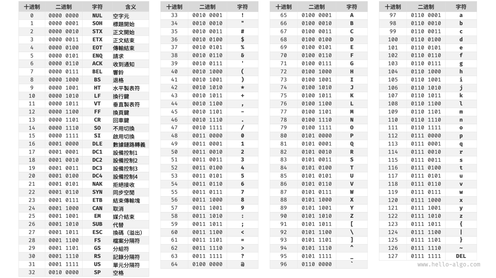
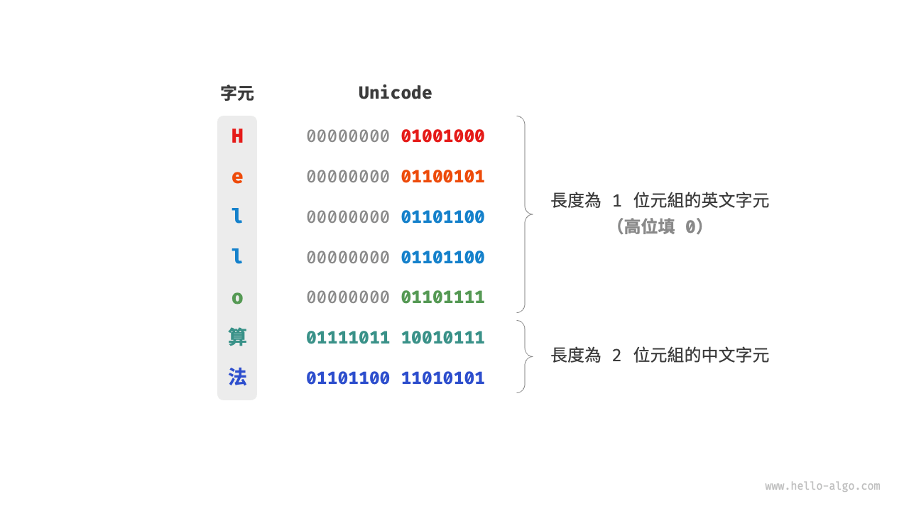
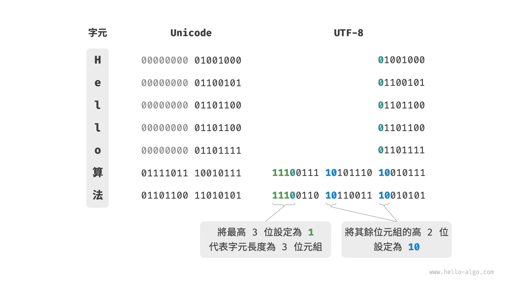

# 字元編碼 *

在計算機中，所有資料都是以二進位制數的形式儲存的，字元 `char` 也不例外。為了表示字元，我們需要建立一套“字符集”，規定每個字元和二進位制數之間的一一對應關係。有了字符集之後，計算機就可以透過查表完成二進位制數到字元的轉換。

## ASCII 字符集

<u>ASCII 碼</u>是最早出現的字符集，其全稱為 American Standard Code for Information Interchange（美國標準資訊交換程式碼）。它使用 7 位二進位制數（一個位元組的低 7 位）表示一個字元，最多能夠表示 128 個不同的字元。如下圖所示，ASCII 碼包括英文字母的大小寫、數字 0 ~ 9、一些標點符號，以及一些控制字元（如換行符和製表符）。

然而，**ASCII 碼僅能夠表示英文**。隨著計算機的全球化，誕生了一種能夠表示更多語言的 <u>EASCII</u> 字符集。它在 ASCII 的 7 位基礎上擴展到 8 位，能夠表示 256 個不同的字元。

在世界範圍內，陸續出現了一批適用於不同地區的 EASCII 字符集。這些字符集的前 128 個字元統一為 ASCII 碼，後 128 個字元定義不同，以適應不同語言的需求。

## GBK 字符集

後來人們發現，**EASCII 碼仍然無法滿足許多語言的字元數量要求**。比如漢字有近十萬個，光日常使用的就有幾千個。中國國家標準總局於 1980 年釋出了 <u>GB2312</u> 字符集，其收錄了 6763 個漢字，基本滿足了漢字的計算機處理需要。

然而，GB2312 無法處理部分罕見字和繁體字。<u>GBK</u> 字符集是在 GB2312 的基礎上擴展得到的，它共收錄了 21886 個漢字。在 GBK 的編碼方案中，ASCII 字元使用一個位元組表示，漢字使用兩個位元組表示。

## Unicode 字符集

隨著計算機技術的蓬勃發展，字符集與編碼標準百花齊放，而這帶來了許多問題。一方面，這些字符集一般只定義了特定語言的字元，無法在多語言環境下正常工作。另一方面，同一種語言存在多種字符集標準，如果兩臺計算機使用的是不同的編碼標準，則在資訊傳遞時就會出現亂碼。

那個時代的研究人員就在想：**如果推出一個足夠完整的字符集，將世界範圍內的所有語言和符號都收錄其中，不就可以解決跨語言環境和亂碼問題了嗎**？在這種想法的驅動下，一個大而全的字符集 Unicode 應運而生。

<u>Unicode</u> 的中文名稱為“統一碼”，理論上能容納 100 多萬個字元。它致力於將全球範圍內的字元納入統一的字符集之中，提供一種通用的字符集來處理和顯示各種語言文字，減少因為編碼標準不同而產生的亂碼問題。

自 1991 年釋出以來，Unicode 不斷擴充新的語言與字元。截至 2022 年 9 月，Unicode 已經包含 149186 個字元，包括各種語言的字元、符號甚至表情符號等。在龐大的 Unicode 字符集中，常用的字元佔用 2 位元組，有些生僻的字元佔用 3 位元組甚至 4 位元組。

Unicode 是一種通用字符集，本質上是給每個字元分配一個編號（稱為“碼點”），**但它並沒有規定在計算機中如何儲存這些字元碼點**。我們不禁會問：當多種長度的 Unicode 碼點同時出現在一個文字中時，系統如何解析字元？例如給定一個長度為 2 位元組的編碼，系統如何確認它是一個 2 位元組的字元還是兩個 1 位元組的字元？

對於以上問題，**一種直接的解決方案是將所有字元儲存為等長的編碼**。如下圖所示，“Hello”中的每個字元佔用 1 位元組，“演算法”中的每個字元佔用 2 位元組。我們可以透過高位填 0 將“Hello 演算法”中的所有字元都編碼為 2 位元組長度。這樣系統就可以每隔 2 位元組解析一個字元，恢復這個短語的內容了。

然而 ASCII 碼已經向我們證明，編碼英文只需 1 位元組。若採用上述方案，英文文字佔用空間的大小將會是 ASCII 編碼下的兩倍，非常浪費記憶體空間。因此，我們需要一種更加高效的 Unicode 編碼方法。

## UTF-8 編碼

目前，UTF-8 已成為國際上使用最廣泛的 Unicode 編碼方法。**它是一種可變長度的編碼**，使用 1 到 4 位元組來表示一個字元，根據字元的複雜性而變。ASCII 字元只需 1 位元組，拉丁字母和希臘字母需要 2 位元組，常用的中文字元需要 3 位元組，其他的一些生僻字元需要 4 位元組。

UTF-8 的編碼規則並不複雜，分為以下兩種情況。

- 對於長度為 1 位元組的字元，將最高位設定為 $0$ ，其餘 7 位設定為 Unicode 碼點。值得注意的是，ASCII 字元在 Unicode 字符集中佔據了前 128 個碼點。也就是說，**UTF-8 編碼可以向下相容 ASCII 碼**。這意味著我們可以使用 UTF-8 來解析年代久遠的 ASCII 碼文字。
- 對於長度為 $n$ 位元組的字元（其中 $n > 1$），將首個位元組的高 $n$ 位都設定為 $1$ ，第 $n + 1$ 位設定為 $0$ ；從第二個位元組開始，將每個位元組的高 2 位都設定為 $10$ ；其餘所有位用於填充字元的 Unicode 碼點。

下圖展示了“Hello演算法”對應的 UTF-8 編碼。觀察發現，由於最高 $n$ 位都設定為 $1$ ，因此系統可以透過讀取最高位 $1$ 的個數來解析出字元的長度為 $n$ 。

但為什麼要將其餘所有位元組的高 2 位都設定為 $10$ 呢？實際上，這個 $10$ 能夠起到校驗符的作用。假設系統從一個錯誤的位元組開始解析文字，位元組頭部的 $10$ 能夠幫助系統快速判斷出異常。

之所以將 $10$ 當作校驗符，是因為在 UTF-8 編碼規則下，不可能有字元的最高兩位是 $10$ 。這個結論可以用反證法來證明：假設一個字元的最高兩位是 $10$ ，說明該字元的長度為 $1$ ，對應 ASCII 碼。而 ASCII 碼的最高位應該是 $0$ ，與假設矛盾。

除了 UTF-8 之外，常見的編碼方式還包括以下兩種。

- **UTF-16 編碼**：使用 2 或 4 位元組來表示一個字元。所有的 ASCII 字元和常用的非英文字元，都用 2 位元組表示；少數字符需要用到 4 位元組表示。對於 2 位元組的字元，UTF-16 編碼與 Unicode 碼點相等。
- **UTF-32 編碼**：每個字元都使用 4 位元組。這意味著 UTF-32 比 UTF-8 和 UTF-16 更佔用空間，特別是對於 ASCII 字元佔比較高的文字。

從儲存空間佔用的角度看，使用 UTF-8 表示英文字元非常高效，因為它僅需 1 位元組；使用 UTF-16 編碼某些非英文字元（例如中文）會更加高效，因為它僅需 2 位元組，而 UTF-8 可能需要 3 位元組。

從相容性的角度看，UTF-8 的通用性最佳，許多工具和庫優先支持 UTF-8 。

## 程式語言的字元編碼

對於以往的大多數程式語言，程式執行中的字串都採用 UTF-16 或 UTF-32 這類等長編碼。在等長編碼下，我們可以將字串看作陣列來處理，這種做法具有以下優點。

- **隨機訪問**：UTF-16 編碼的字串可以很容易地進行隨機訪問。UTF-8 是一種變長編碼，要想找到第 $i$ 個字元，我們需要從字串的開始處走訪到第 $i$ 個字元，這需要 $O(n)$ 的時間。
- **字元計數**：與隨機訪問類似，計算 UTF-16 編碼的字串的長度也是 $O(1)$ 的操作。但是，計算 UTF-8 編碼的字串的長度需要走訪整個字串。
- **字串操作**：在 UTF-16 編碼的字串上，很多字串操作（如分割、連線、插入、刪除等）更容易進行。在 UTF-8 編碼的字串上，進行這些操作通常需要額外的計算，以確保不會產生無效的 UTF-8 編碼。

實際上，程式語言的字元編碼方案設計是一個很有趣的話題，涉及許多因素。

- Java 的 `String` 型別使用 UTF-16 編碼，每個字元佔用 2 位元組。這是因為 Java 語言設計之初，人們認為 16 位足以表示所有可能的字元。然而，這是一個不正確的判斷。後來 Unicode 規範擴展到了超過 16 位，所以 Java 中的字元現在可能由一對 16 位的值（稱為“代理對”）表示。
- JavaScript 和 TypeScript 的字串使用 UTF-16 編碼的原因與 Java 類似。當 1995 年 Netscape 公司首次推出 JavaScript 語言時，Unicode 還處於發展早期，那時候使用 16 位的編碼就足以表示所有的 Unicode 字元了。
- C# 使用 UTF-16 編碼，主要是因為 .NET 平臺是由 Microsoft 設計的，而 Microsoft 的很多技術（包括 Windows 作業系統）都廣泛使用 UTF-16 編碼。

由於以上程式語言對字元數量的低估，它們不得不採取“代理對”的方式來表示超過 16 位長度的 Unicode 字元。這是一個不得已為之的無奈之舉。一方面，包含代理對的字串中，一個字元可能佔用 2 位元組或 4 位元組，從而喪失了等長編碼的優勢。另一方面，處理代理對需要額外增加程式碼，這提高了程式設計的複雜性和除錯難度。

出於以上原因，部分程式語言提出了一些不同的編碼方案。

- Python 中的 `str` 使用 Unicode 編碼，並採用一種靈活的字串表示，儲存的字元長度取決於字串中最大的 Unicode 碼點。若字串中全部是 ASCII 字元，則每個字元佔用 1 位元組；如果有字元超出了 ASCII 範圍，但全部在基本多語言平面（BMP）內，則每個字元佔用 2 位元組；如果有超出 BMP 的字元，則每個字元佔用 4 位元組。
- Go 語言的 `string` 型別在內部使用 UTF-8 編碼。Go 語言還提供了 `rune` 型別，它用於表示單個 Unicode 碼點。
- Rust 語言的 `str` 和 `String` 型別在內部使用 UTF-8 編碼。Rust 也提供了 `char` 型別，用於表示單個 Unicode 碼點。

需要注意的是，以上討論的都是字串在程式語言中的儲存方式，**這和字串如何在檔案中儲存或在網路中傳輸是不同的問題**。在檔案儲存或網路傳輸中，我們通常會將字串編碼為 UTF-8 格式，以達到最優的相容性和空間效率。
