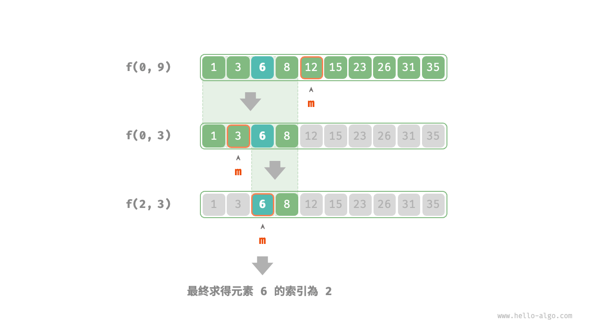

# 分治搜索策略

我们已经学过，搜索算法分为两大类。

- **暴力搜索**：它通过遍历数据结构实现，时间复杂度为 $O(n)$ 。
- **自适应搜索**：它利用特有的数据组织形式或先验信息，时间复杂度可达到 $O(\log n)$ 甚至 $O(1)$ 。

实际上，**时间复杂度为 $O(\log n)$ 的搜索算法通常是基于分治策略实现的**，例如二分查找和树。

- 二分查找的每一步都将问题（在数组中搜索目标元素）分解为一个小问题（在数组的一半中搜索目标元素），这个过程一直持续到数组为空或找到目标元素为止。
- 树是分治思想的代表，在二叉搜索树、AVL 树、堆等数据结构中，各种操作的时间复杂度皆为 $O(\log n)$ 。

二分查找的分治策略如下所示。

- **问题可以分解**：二分查找递归地将原问题（在数组中进行查找）分解为子问题（在数组的一半中进行查找），这是通过比较中间元素和目标元素来实现的。
- **子问题是独立的**：在二分查找中，每轮只处理一个子问题，它不受其他子问题的影响。
- **子问题的解无须合并**：二分查找旨在查找一个特定元素，因此不需要将子问题的解进行合并。当子问题得到解决时，原问题也会同时得到解决。

分治能够提升搜索效率，本质上是因为暴力搜索每轮只能排除一个选项，**而分治搜索每轮可以排除一半选项**。

### 基于分治实现二分查找

在之前的章节中，二分查找是基于递推（迭代）实现的。现在我们基于分治（递归）来实现它。

!!! question

    给定一个长度为 $n$ 的有序数组 `nums` ，其中所有元素都是唯一的，请查找元素 `target` 。

从分治角度，我们将搜索区间 $[i, j]$ 对应的子问题记为 $f(i, j)$ 。

以原问题 $f(0, n-1)$ 为起始点，通过以下步骤进行二分查找。

1. 计算搜索区间 $[i, j]$ 的中点 $m$ ，根据它排除一半搜索区间。
2. 递归求解规模减小一半的子问题，可能为 $f(i, m-1)$ 或 $f(m+1, j)$ 。
3. 循环第 `1.` 步和第 `2.` 步，直至找到 `target` 或区间为空时返回。

下图展示了在数组中二分查找元素 $6$ 的分治过程。



在实现代码中，我们声明一个递归函数 `dfs()` 来求解问题 $f(i, j)$ ：

```src
[file]{binary_search_recur}-[class]{}-[func]{binary_search}
```
