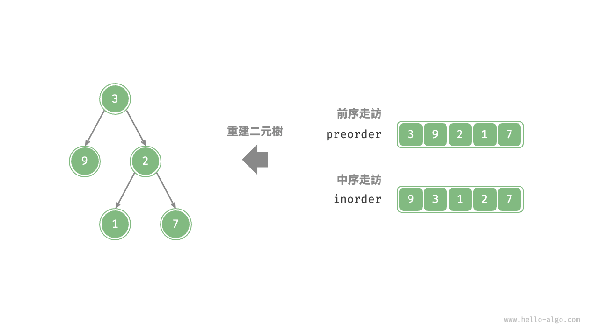
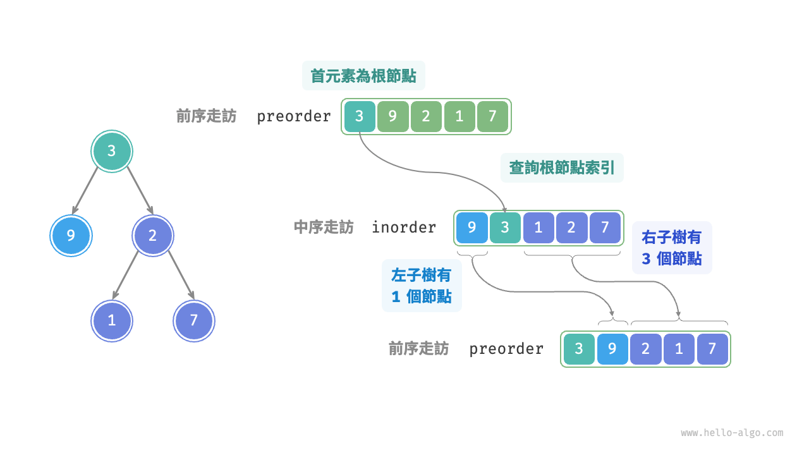
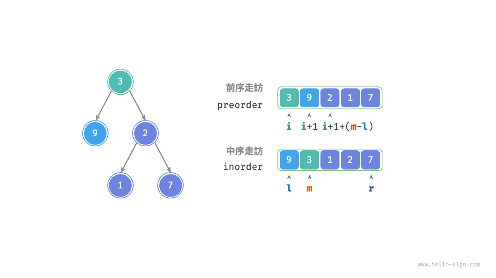
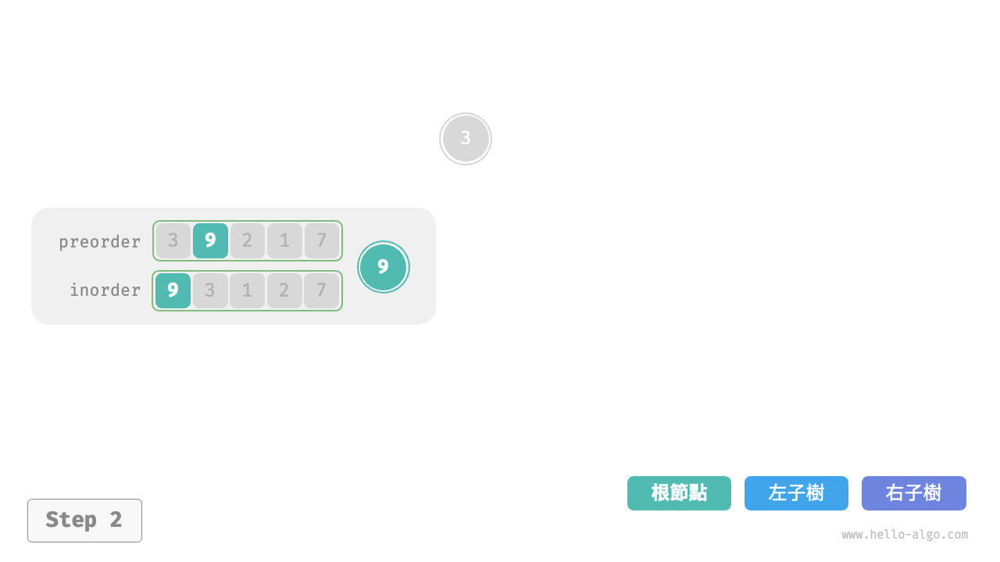
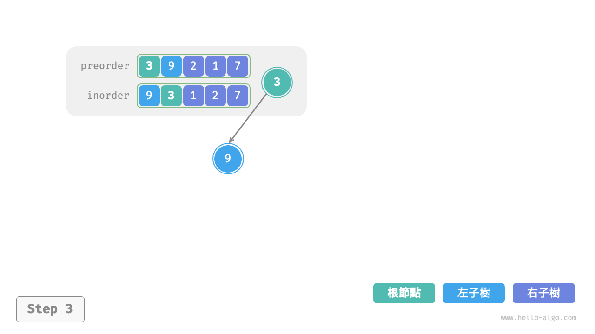
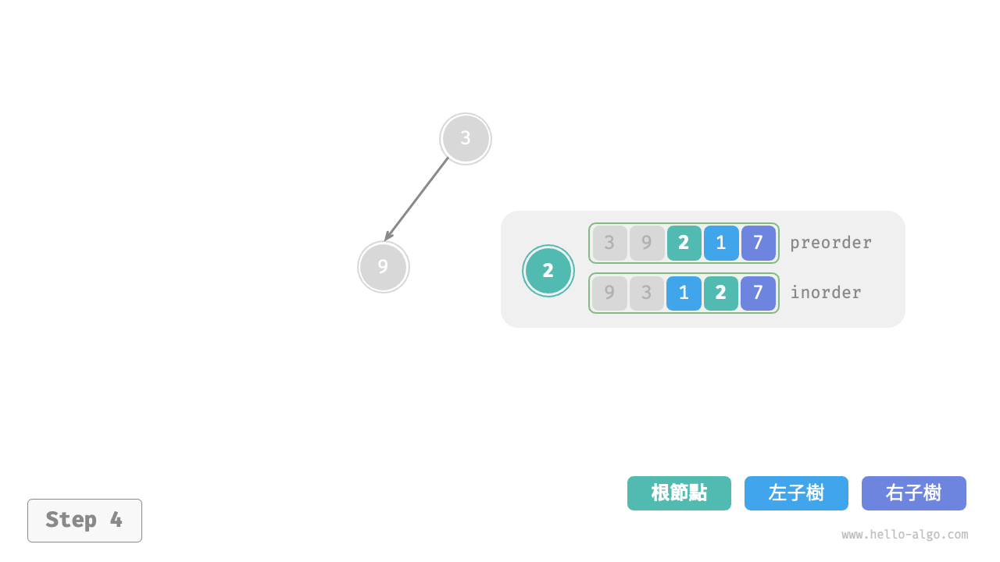
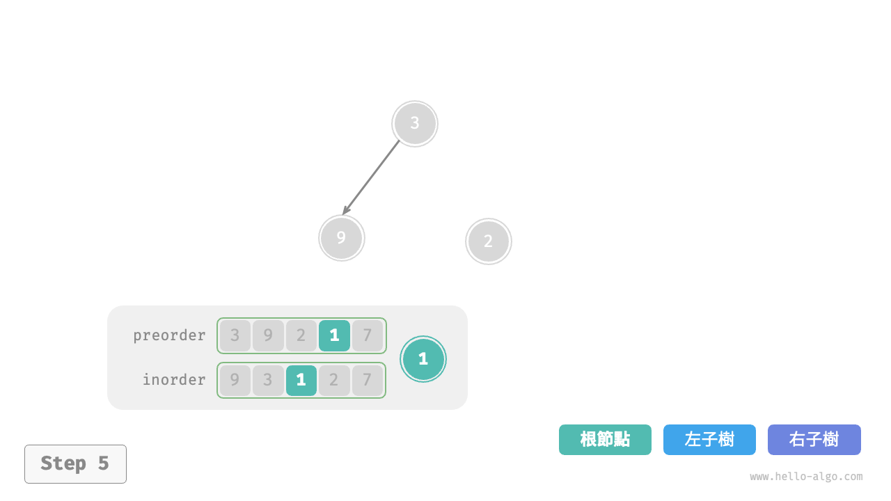
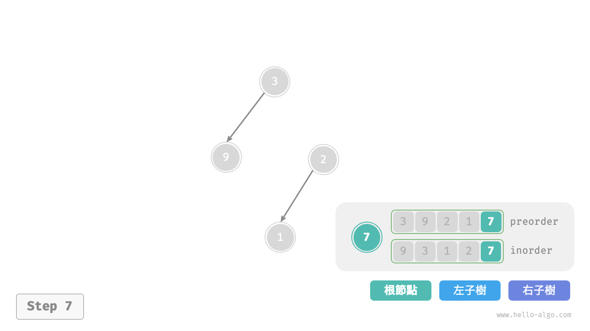
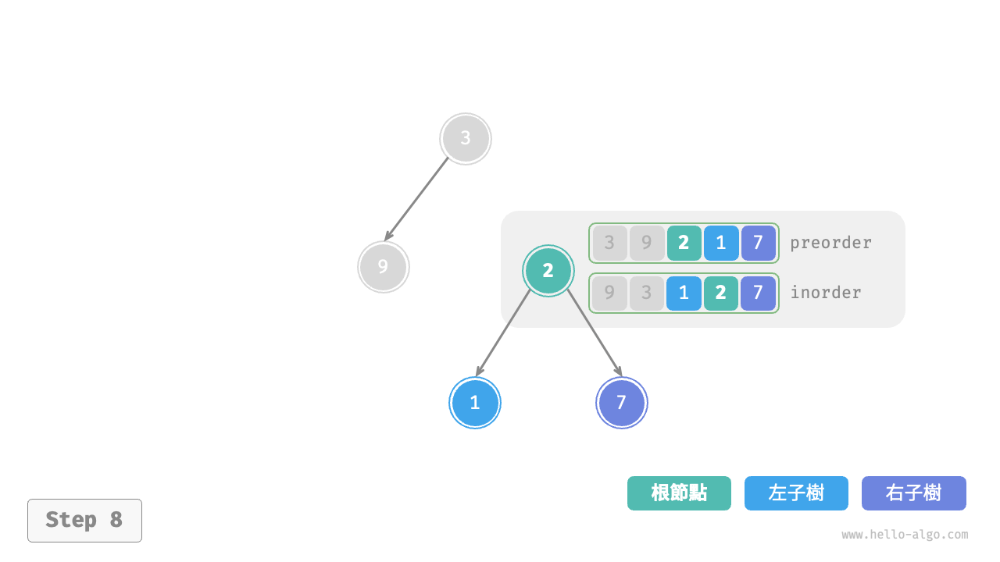
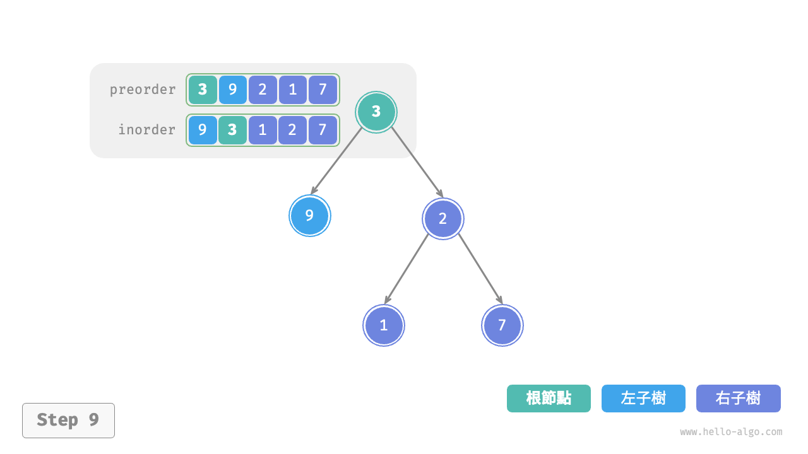

# 構建二元樹問題

!!! question

    給定一棵二元樹的前序走訪 `preorder` 和中序走訪 `inorder` ，請從中構建二元樹，返回二元樹的根節點。假設二元樹中沒有值重複的節點（如下圖所示）。



### 判斷是否為分治問題

原問題定義為從 `preorder` 和 `inorder` 構建二元樹，是一個典型的分治問題。

- **問題可以分解**：從分治的角度切入，我們可以將原問題劃分為兩個子問題：構建左子樹、構建右子樹，加上一步操作：初始化根節點。而對於每棵子樹（子問題），我們仍然可以複用以上劃分方法，將其劃分為更小的子樹（子問題），直至達到最小子問題（空子樹）時終止。
- **子問題是獨立的**：左子樹和右子樹是相互獨立的，它們之間沒有交集。在構建左子樹時，我們只需關注中序走訪和前序走訪中與左子樹對應的部分。右子樹同理。
- **子問題的解可以合併**：一旦得到了左子樹和右子樹（子問題的解），我們就可以將它們連結到根節點上，得到原問題的解。

### 如何劃分子樹

根據以上分析，這道題可以使用分治來求解，**但如何透過前序走訪 `preorder` 和中序走訪 `inorder` 來劃分左子樹和右子樹呢**？

根據定義，`preorder` 和 `inorder` 都可以劃分為三個部分。

- 前序走訪：`[ 根節點 | 左子樹 | 右子樹 ]` ，例如上圖的樹對應 `[ 3 | 9 | 2 1 7 ]` 。
- 中序走訪：`[ 左子樹 | 根節點 ｜ 右子樹 ]` ，例如上圖的樹對應 `[ 9 | 3 | 1 2 7 ]` 。

以上圖資料為例，我們可以透過下圖所示的步驟得到劃分結果。

1. 前序走訪的首元素 3 是根節點的值。
2. 查詢根節點 3 在 `inorder` 中的索引，利用該索引可將 `inorder` 劃分為 `[ 9 | 3 ｜ 1 2 7 ]` 。
3. 根據 `inorder` 的劃分結果，易得左子樹和右子樹的節點數量分別為 1 和 3 ，從而可將 `preorder` 劃分為 `[ 3 | 9 | 2 1 7 ]` 。



### 基於變數描述子樹區間

根據以上劃分方法，**我們已經得到根節點、左子樹、右子樹在 `preorder` 和 `inorder` 中的索引區間**。而為了描述這些索引區間，我們需要藉助幾個指標變數。

- 將當前樹的根節點在 `preorder` 中的索引記為 $i$ 。
- 將當前樹的根節點在 `inorder` 中的索引記為 $m$ 。
- 將當前樹在 `inorder` 中的索引區間記為 $[l, r]$ 。

如下表所示，透過以上變數即可表示根節點在 `preorder` 中的索引，以及子樹在 `inorder` 中的索引區間。

<p align="center"> 表 <id> &nbsp; 根節點和子樹在前序走訪和中序走訪中的索引 </p>

|        | 根節點在 `preorder` 中的索引 | 子樹在 `inorder` 中的索引區間 |
| ------ | ---------------------------- | ----------------------------- |
| 當前樹 | $i$                          | $[l, r]$                      |
| 左子樹 | $i + 1$                      | $[l, m-1]$                    |
| 右子樹 | $i + 1 + (m - l)$            | $[m+1, r]$                    |

請注意，右子樹根節點索引中的 $(m-l)$ 的含義是“左子樹的節點數量”，建議結合下圖理解。



### 程式碼實現

為了提升查詢 $m$ 的效率，我們藉助一個雜湊表 `hmap` 來儲存陣列 `inorder` 中元素到索引的對映：

```src
[file]{build_tree}-[class]{}-[func]{build_tree}
```

下圖展示了構建二元樹的遞迴過程，各個節點是在向下“遞”的過程中建立的，而各條邊（引用）是在向上“迴”的過程中建立的。

=== "<1>"
    

=== "<2>"
    

=== "<3>"
    

=== "<4>"
    

=== "<5>"
    

=== "<6>"
    

=== "<7>"
    

=== "<8>"
    

=== "<9>"
    

每個遞迴函式內的前序走訪 `preorder` 和中序走訪 `inorder` 的劃分結果如下圖所示。


設樹的節點數量為 $n$ ，初始化每一個節點（執行一個遞迴函式 `dfs()` ）使用 $O(1)$ 時間。**因此總體時間複雜度為 $O(n)$** 。

雜湊表儲存 `inorder` 元素到索引的對映，空間複雜度為 $O(n)$ 。在最差情況下，即二元樹退化為鏈結串列時，遞迴深度達到 $n$ ，使用 $O(n)$ 的堆疊幀空間。**因此總體空間複雜度為 $O(n)$** 。
