# 河內塔問題

在合併排序和構建二元樹中，我們都是將原問題分解為兩個規模為原問題一半的子問題。然而對於河內塔問題，我們採用不同的分解策略。

!!! question

    給定三根柱子，記為 `A`、`B` 和 `C` 。起始狀態下，柱子 `A` 上套著 $n$ 個圓盤，它們從上到下按照從小到大的順序排列。我們的任務是要把這 $n$ 個圓盤移到柱子 `C` 上，並保持它們的原有順序不變（如下圖所示）。在移動圓盤的過程中，需要遵守以下規則。
    
    1. 圓盤只能從一根柱子頂部拿出，從另一根柱子頂部放入。
    2. 每次只能移動一個圓盤。
    3. 小圓盤必須時刻位於大圓盤之上。


**我們將規模為 $i$ 的河內塔問題記作 $f(i)$** 。例如 $f(3)$ 代表將 $3$ 個圓盤從 `A` 移動至 `C` 的河內塔問題。

### 考慮基本情況

如下圖所示，對於問題 $f(1)$ ，即當只有一個圓盤時，我們將它直接從 `A` 移動至 `C` 即可。

=== "<1>"
    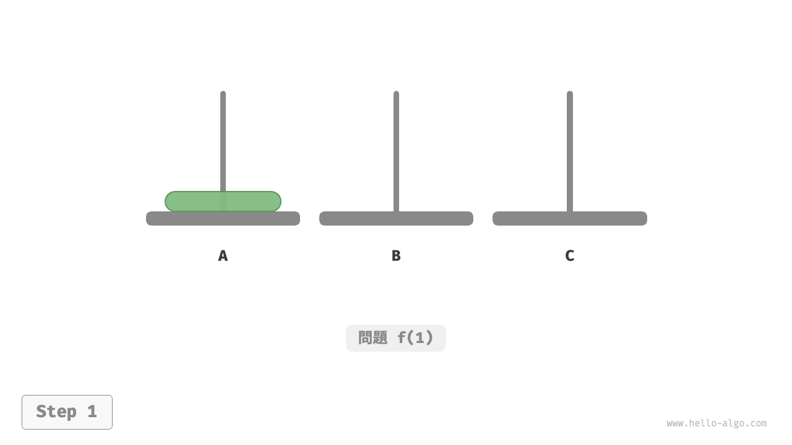

=== "<2>"
    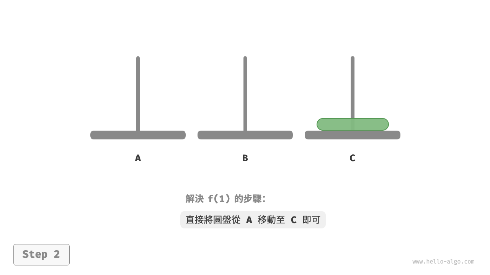

如下圖所示，對於問題 $f(2)$ ，即當有兩個圓盤時，**由於要時刻滿足小圓盤在大圓盤之上，因此需要藉助 `B` 來完成移動**。

1. 先將上面的小圓盤從 `A` 移至 `B` 。
2. 再將大圓盤從 `A` 移至 `C` 。
3. 最後將小圓盤從 `B` 移至 `C` 。

=== "<1>"
    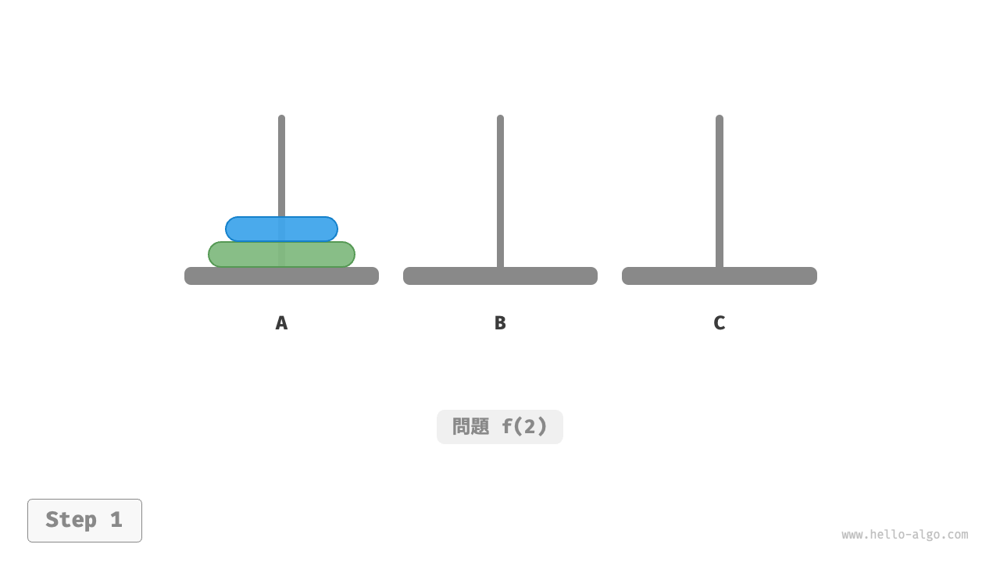

=== "<2>"
    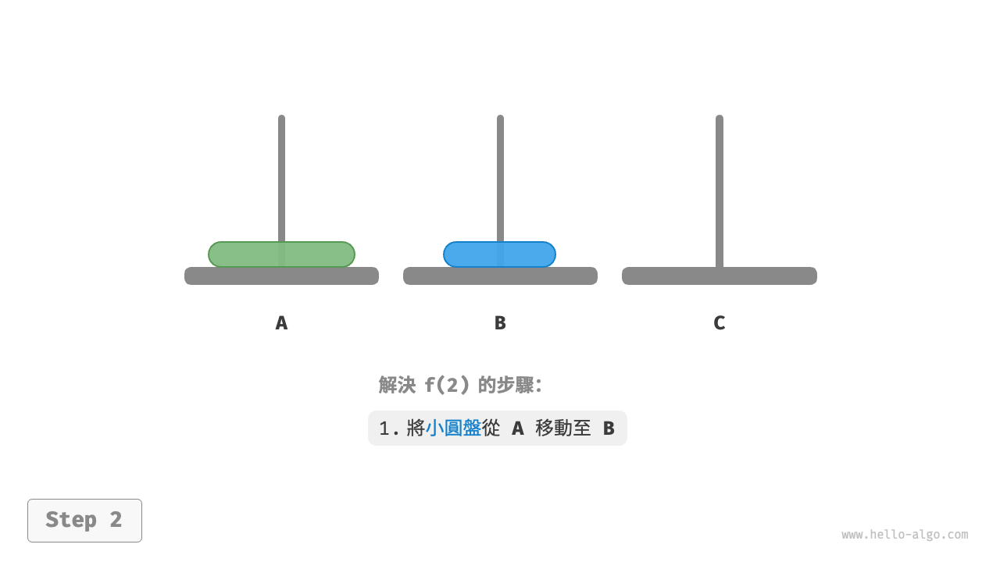

=== "<3>"
    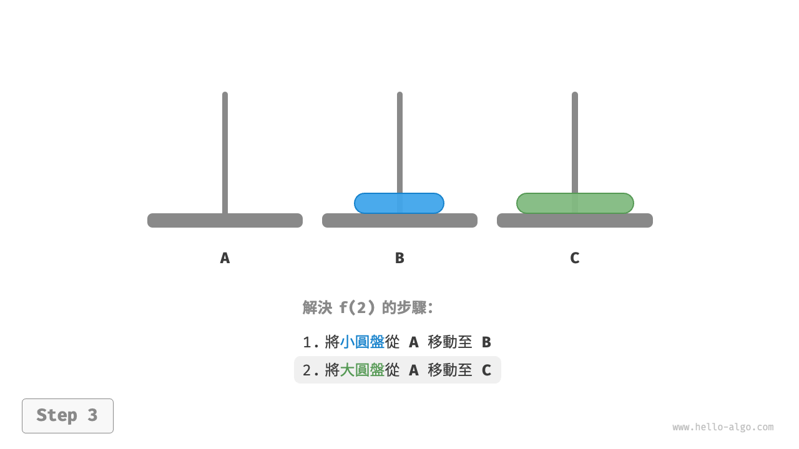

=== "<4>"
    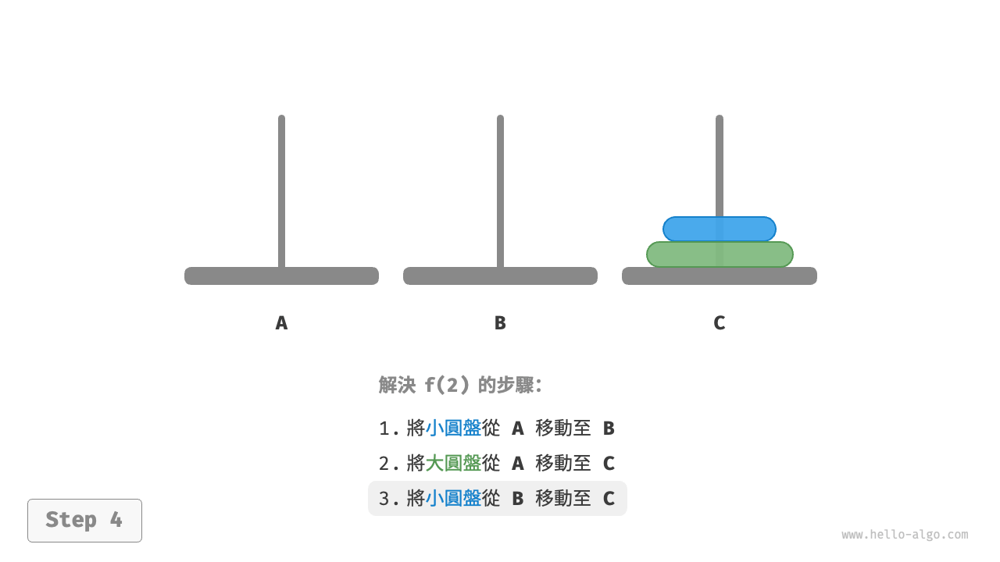

解決問題 $f(2)$ 的過程可總結為：**將兩個圓盤藉助 `B` 從 `A` 移至 `C`** 。其中，`C` 稱為目標柱、`B` 稱為緩衝柱。

### 子問題分解

對於問題 $f(3)$ ，即當有三個圓盤時，情況變得稍微複雜了一些。

因為已知 $f(1)$ 和 $f(2)$ 的解，所以我們可從分治角度思考，**將 `A` 頂部的兩個圓盤看作一個整體**，執行下圖所示的步驟。這樣三個圓盤就被順利地從 `A` 移至 `C` 了。

1. 令 `B` 為目標柱、`C` 為緩衝柱，將兩個圓盤從 `A` 移至 `B` 。
2. 將 `A` 中剩餘的一個圓盤從 `A` 直接移動至 `C` 。
3. 令 `C` 為目標柱、`A` 為緩衝柱，將兩個圓盤從 `B` 移至 `C` 。

=== "<1>"
    

=== "<2>"
    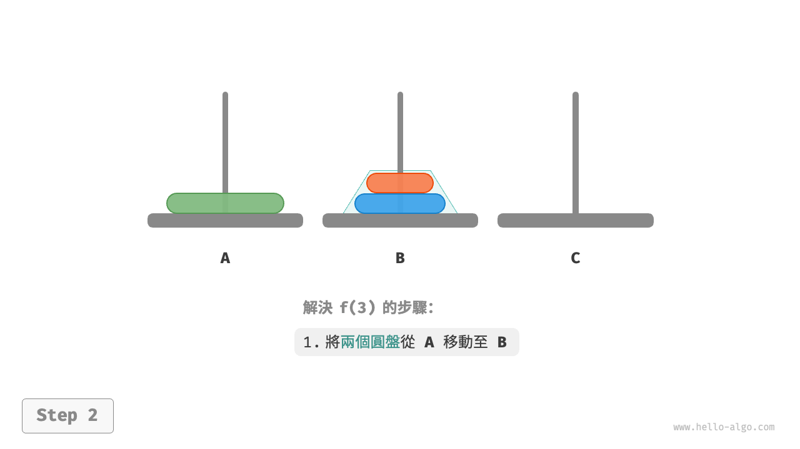

=== "<3>"
    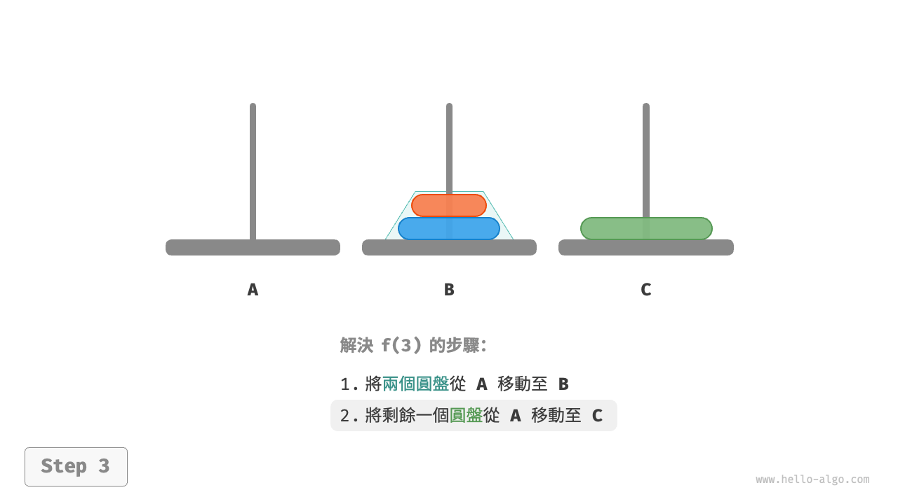

=== "<4>"
    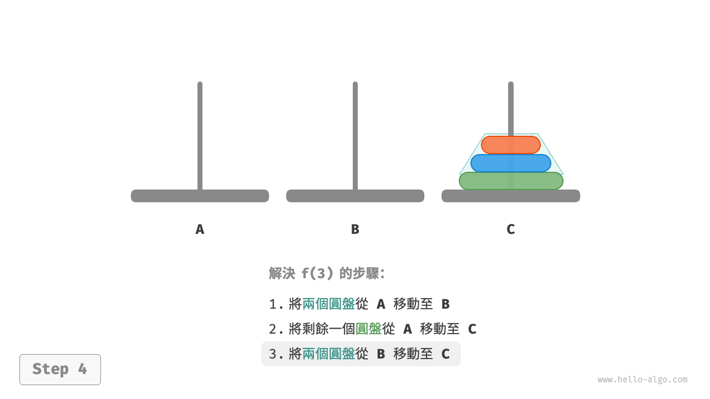

從本質上看，**我們將問題 $f(3)$ 劃分為兩個子問題 $f(2)$ 和一個子問題 $f(1)$** 。按順序解決這三個子問題之後，原問題隨之得到解決。這說明子問題是獨立的，而且解可以合併。

至此，我們可總結出下圖所示的解決河內塔問題的分治策略：將原問題 $f(n)$ 劃分為兩個子問題 $f(n-1)$ 和一個子問題 $f(1)$ ，並按照以下順序解決這三個子問題。

1. 將 $n-1$ 個圓盤藉助 `C` 從 `A` 移至 `B` 。
2. 將剩餘 $1$ 個圓盤從 `A` 直接移至 `C` 。
3. 將 $n-1$ 個圓盤藉助 `A` 從 `B` 移至 `C` 。

對於這兩個子問題 $f(n-1)$ ，**可以透過相同的方式進行遞迴劃分**，直至達到最小子問題 $f(1)$ 。而 $f(1)$ 的解是已知的，只需一次移動操作即可。

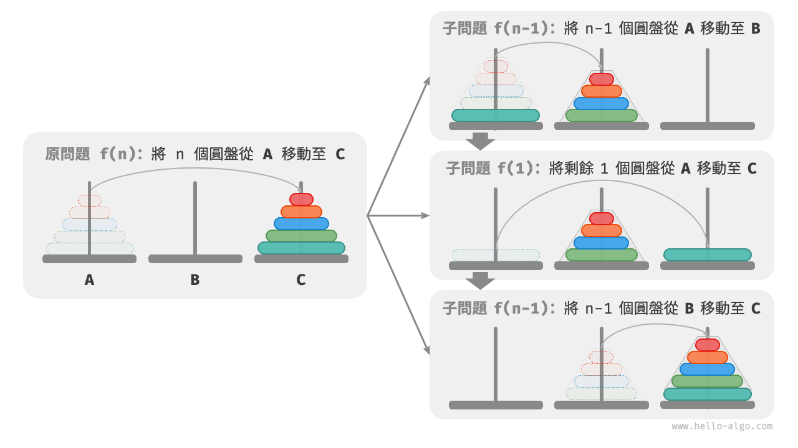

### 程式碼實現

在程式碼中，我們宣告一個遞迴函式 `dfs(i, src, buf, tar)` ，它的作用是將柱 `src` 頂部的 $i$ 個圓盤藉助緩衝柱 `buf` 移動至目標柱 `tar` ：

```src
[file]{hanota}-[class]{}-[func]{solve_hanota}
```

如下圖所示，河內塔問題形成一棵高度為 $n$ 的遞迴樹，每個節點代表一個子問題，對應一個開啟的 `dfs()` 函式，**因此時間複雜度為 $O(2^n)$ ，空間複雜度為 $O(n)$** 。

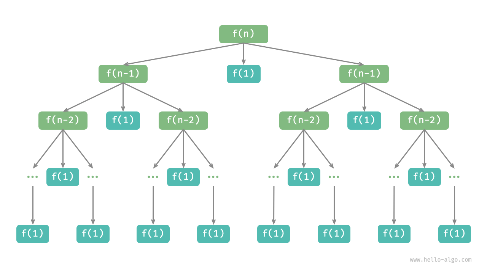

!!! quote

    河內塔問題源自一個古老的傳說。在古印度的一個寺廟裡，僧侶們有三根高大的鑽石柱子，以及 $64$ 個大小不一的金圓盤。僧侶們不斷地移動圓盤，他們相信在最後一個圓盤被正確放置的那一刻，這個世界就會結束。

    然而，即使僧侶們每秒鐘移動一次，總共需要大約 $2^{64} \approx 1.84×10^{19}$ 秒，合約 $5850$ 億年，遠遠超過了現在對宇宙年齡的估計。所以，倘若這個傳說是真的，我們應該不需要擔心世界末日的到來。
