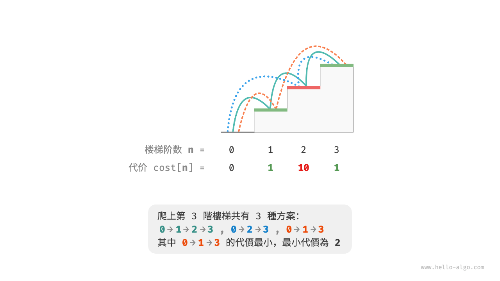
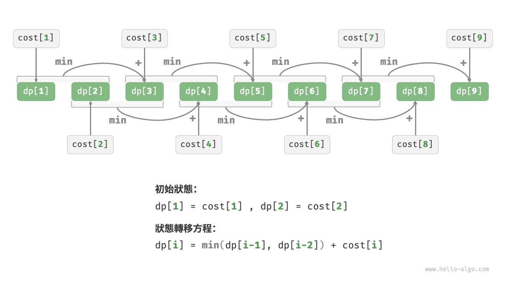
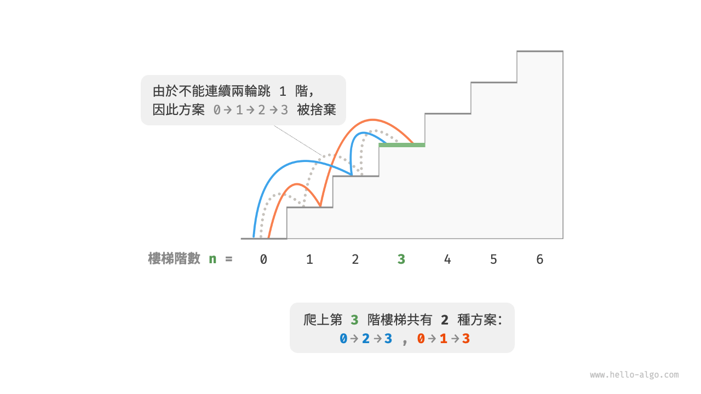
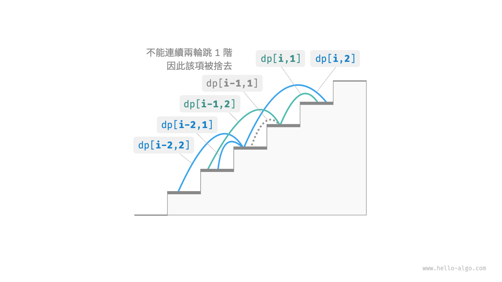

# 14.2 &nbsp; 動態規劃問題特性

在上一節中，我們學習了動態規劃是如何透過子問題分解來求解原問題的。實際上，子問題分解是一種通用的演算法思路，在分治、動態規劃、回溯中的側重點不同。

- 分治演算法遞迴地將原問題劃分為多個相互獨立的子問題，直至最小子問題，並在回溯中合併子問題的解，最終得到原問題的解。
- 動態規劃也對問題進行遞迴分解，但與分治演算法的主要區別是，動態規劃中的子問題是相互依賴的，在分解過程中會出現許多重疊子問題。
- 回溯演算法在嘗試和回退中窮舉所有可能的解，並透過剪枝避免不必要的搜尋分支。原問題的解由一系列決策步驟構成，我們可以將每個決策步驟之前的子序列看作一個子問題。

實際上，動態規劃常用來求解最最佳化問題，它們不僅包含重疊子問題，還具有另外兩大特性：最優子結構、無後效性。

## 14.2.1 &nbsp; 最優子結構

我們對爬樓梯問題稍作改動，使之更加適合展示最優子結構概念。

!!! question "爬樓梯最小代價"

    給定一個樓梯，你每步可以上 $1$ 階或者 $2$ 階，每一階樓梯上都貼有一個非負整數，表示你在該臺階所需要付出的代價。給定一個非負整數陣列 $cost$ ，其中 $cost[i]$ 表示在第 $i$ 個臺階需要付出的代價，$cost[0]$ 為地面（起始點）。請計算最少需要付出多少代價才能到達頂部？

如圖 14-6 所示，若第 $1$、$2$、$3$ 階的代價分別為 $1$、$10$、$1$ ，則從地面爬到第 $3$ 階的最小代價為 $2$ 。

{ class="animation-figure" }

<p align="center"> 圖 14-6 &nbsp; 爬到第 3 階的最小代價 </p>

設 $dp[i]$ 為爬到第 $i$ 階累計付出的代價，由於第 $i$ 階只可能從 $i - 1$ 階或 $i - 2$ 階走來，因此 $dp[i]$ 只可能等於 $dp[i - 1] + cost[i]$ 或 $dp[i - 2] + cost[i]$ 。為了儘可能減少代價，我們應該選擇兩者中較小的那一個：

$$
dp[i] = \min(dp[i-1], dp[i-2]) + cost[i]
$$

這便可以引出最優子結構的含義：**原問題的最優解是從子問題的最優解構建得來的**。

本題顯然具有最優子結構：我們從兩個子問題最優解 $dp[i-1]$ 和 $dp[i-2]$ 中挑選出較優的那一個，並用它構建出原問題 $dp[i]$ 的最優解。

那麼，上一節的爬樓梯題目有沒有最優子結構呢？它的目標是求解方案數量，看似是一個計數問題，但如果換一種問法：“求解最大方案數量”。我們意外地發現，**雖然題目修改前後是等價的，但最優子結構浮現出來了**：第 $n$ 階最大方案數量等於第 $n-1$ 階和第 $n-2$ 階最大方案數量之和。所以說，最優子結構的解釋方式比較靈活，在不同問題中會有不同的含義。

根據狀態轉移方程，以及初始狀態 $dp[1] = cost[1]$ 和 $dp[2] = cost[2]$ ，我們就可以得到動態規劃程式碼：

=== "Python"

    ```python title="min_cost_climbing_stairs_dp.py"
    def min_cost_climbing_stairs_dp(cost: list[int]) -> int:
        """爬樓梯最小代價：動態規劃"""
        n = len(cost) - 1
        if n == 1 or n == 2:
            return cost[n]
        # 初始化 dp 表，用於儲存子問題的解
        dp = [0] * (n + 1)
        # 初始狀態：預設最小子問題的解
        dp[1], dp[2] = cost[1], cost[2]
        # 狀態轉移：從較小子問題逐步求解較大子問題
        for i in range(3, n + 1):
            dp[i] = min(dp[i - 1], dp[i - 2]) + cost[i]
        return dp[n]
    ```

=== "C++"

    ```cpp title="min_cost_climbing_stairs_dp.cpp"
    /* 爬樓梯最小代價：動態規劃 */
    int minCostClimbingStairsDP(vector<int> &cost) {
        int n = cost.size() - 1;
        if (n == 1 || n == 2)
            return cost[n];
        // 初始化 dp 表，用於儲存子問題的解
        vector<int> dp(n + 1);
        // 初始狀態：預設最小子問題的解
        dp[1] = cost[1];
        dp[2] = cost[2];
        // 狀態轉移：從較小子問題逐步求解較大子問題
        for (int i = 3; i <= n; i++) {
            dp[i] = min(dp[i - 1], dp[i - 2]) + cost[i];
        }
        return dp[n];
    }
    ```

=== "Java"

    ```java title="min_cost_climbing_stairs_dp.java"
    /* 爬樓梯最小代價：動態規劃 */
    int minCostClimbingStairsDP(int[] cost) {
        int n = cost.length - 1;
        if (n == 1 || n == 2)
            return cost[n];
        // 初始化 dp 表，用於儲存子問題的解
        int[] dp = new int[n + 1];
        // 初始狀態：預設最小子問題的解
        dp[1] = cost[1];
        dp[2] = cost[2];
        // 狀態轉移：從較小子問題逐步求解較大子問題
        for (int i = 3; i <= n; i++) {
            dp[i] = Math.min(dp[i - 1], dp[i - 2]) + cost[i];
        }
        return dp[n];
    }
    ```

=== "C#"

    ```csharp title="min_cost_climbing_stairs_dp.cs"
    /* 爬樓梯最小代價：動態規劃 */
    int MinCostClimbingStairsDP(int[] cost) {
        int n = cost.Length - 1;
        if (n == 1 || n == 2)
            return cost[n];
        // 初始化 dp 表，用於儲存子問題的解
        int[] dp = new int[n + 1];
        // 初始狀態：預設最小子問題的解
        dp[1] = cost[1];
        dp[2] = cost[2];
        // 狀態轉移：從較小子問題逐步求解較大子問題
        for (int i = 3; i <= n; i++) {
            dp[i] = Math.Min(dp[i - 1], dp[i - 2]) + cost[i];
        }
        return dp[n];
    }
    ```

=== "Go"

    ```go title="min_cost_climbing_stairs_dp.go"
    /* 爬樓梯最小代價：動態規劃 */
    func minCostClimbingStairsDP(cost []int) int {
        n := len(cost) - 1
        if n == 1 || n == 2 {
            return cost[n]
        }
        min := func(a, b int) int {
            if a < b {
                return a
            }
            return b
        }
        // 初始化 dp 表，用於儲存子問題的解
        dp := make([]int, n+1)
        // 初始狀態：預設最小子問題的解
        dp[1] = cost[1]
        dp[2] = cost[2]
        // 狀態轉移：從較小子問題逐步求解較大子問題
        for i := 3; i <= n; i++ {
            dp[i] = min(dp[i-1], dp[i-2]) + cost[i]
        }
        return dp[n]
    }
    ```

=== "Swift"

    ```swift title="min_cost_climbing_stairs_dp.swift"
    /* 爬樓梯最小代價：動態規劃 */
    func minCostClimbingStairsDP(cost: [Int]) -> Int {
        let n = cost.count - 1
        if n == 1 || n == 2 {
            return cost[n]
        }
        // 初始化 dp 表，用於儲存子問題的解
        var dp = Array(repeating: 0, count: n + 1)
        // 初始狀態：預設最小子問題的解
        dp[1] = cost[1]
        dp[2] = cost[2]
        // 狀態轉移：從較小子問題逐步求解較大子問題
        for i in 3 ... n {
            dp[i] = min(dp[i - 1], dp[i - 2]) + cost[i]
        }
        return dp[n]
    }
    ```

=== "JS"

    ```javascript title="min_cost_climbing_stairs_dp.js"
    /* 爬樓梯最小代價：動態規劃 */
    function minCostClimbingStairsDP(cost) {
        const n = cost.length - 1;
        if (n === 1 || n === 2) {
            return cost[n];
        }
        // 初始化 dp 表，用於儲存子問題的解
        const dp = new Array(n + 1);
        // 初始狀態：預設最小子問題的解
        dp[1] = cost[1];
        dp[2] = cost[2];
        // 狀態轉移：從較小子問題逐步求解較大子問題
        for (let i = 3; i <= n; i++) {
            dp[i] = Math.min(dp[i - 1], dp[i - 2]) + cost[i];
        }
        return dp[n];
    }
    ```

=== "TS"

    ```typescript title="min_cost_climbing_stairs_dp.ts"
    /* 爬樓梯最小代價：動態規劃 */
    function minCostClimbingStairsDP(cost: Array<number>): number {
        const n = cost.length - 1;
        if (n === 1 || n === 2) {
            return cost[n];
        }
        // 初始化 dp 表，用於儲存子問題的解
        const dp = new Array(n + 1);
        // 初始狀態：預設最小子問題的解
        dp[1] = cost[1];
        dp[2] = cost[2];
        // 狀態轉移：從較小子問題逐步求解較大子問題
        for (let i = 3; i <= n; i++) {
            dp[i] = Math.min(dp[i - 1], dp[i - 2]) + cost[i];
        }
        return dp[n];
    }
    ```

=== "Dart"

    ```dart title="min_cost_climbing_stairs_dp.dart"
    /* 爬樓梯最小代價：動態規劃 */
    int minCostClimbingStairsDP(List<int> cost) {
      int n = cost.length - 1;
      if (n == 1 || n == 2) return cost[n];
      // 初始化 dp 表，用於儲存子問題的解
      List<int> dp = List.filled(n + 1, 0);
      // 初始狀態：預設最小子問題的解
      dp[1] = cost[1];
      dp[2] = cost[2];
      // 狀態轉移：從較小子問題逐步求解較大子問題
      for (int i = 3; i <= n; i++) {
        dp[i] = min(dp[i - 1], dp[i - 2]) + cost[i];
      }
      return dp[n];
    }
    ```

=== "Rust"

    ```rust title="min_cost_climbing_stairs_dp.rs"
    /* 爬樓梯最小代價：動態規劃 */
    fn min_cost_climbing_stairs_dp(cost: &[i32]) -> i32 {
        let n = cost.len() - 1;
        if n == 1 || n == 2 {
            return cost[n];
        }
        // 初始化 dp 表，用於儲存子問題的解
        let mut dp = vec![-1; n + 1];
        // 初始狀態：預設最小子問題的解
        dp[1] = cost[1];
        dp[2] = cost[2];
        // 狀態轉移：從較小子問題逐步求解較大子問題
        for i in 3..=n {
            dp[i] = cmp::min(dp[i - 1], dp[i - 2]) + cost[i];
        }
        dp[n]
    }
    ```

=== "C"

    ```c title="min_cost_climbing_stairs_dp.c"
    /* 爬樓梯最小代價：動態規劃 */
    int minCostClimbingStairsDP(int cost[], int costSize) {
        int n = costSize - 1;
        if (n == 1 || n == 2)
            return cost[n];
        // 初始化 dp 表，用於儲存子問題的解
        int *dp = calloc(n + 1, sizeof(int));
        // 初始狀態：預設最小子問題的解
        dp[1] = cost[1];
        dp[2] = cost[2];
        // 狀態轉移：從較小子問題逐步求解較大子問題
        for (int i = 3; i <= n; i++) {
            dp[i] = myMin(dp[i - 1], dp[i - 2]) + cost[i];
        }
        int res = dp[n];
        // 釋放記憶體
        free(dp);
        return res;
    }
    ```

=== "Kotlin"

    ```kotlin title="min_cost_climbing_stairs_dp.kt"
    /* 爬樓梯最小代價：動態規劃 */
    fun minCostClimbingStairsDP(cost: IntArray): Int {
        val n = cost.size - 1
        if (n == 1 || n == 2) return cost[n]
        // 初始化 dp 表，用於儲存子問題的解
        val dp = IntArray(n + 1)
        // 初始狀態：預設最小子問題的解
        dp[1] = cost[1]
        dp[2] = cost[2]
        // 狀態轉移：從較小子問題逐步求解較大子問題
        for (i in 3..n) {
            dp[i] = min(dp[i - 1], dp[i - 2]) + cost[i]
        }
        return dp[n]
    }
    ```

=== "Ruby"

    ```ruby title="min_cost_climbing_stairs_dp.rb"
    [class]{}-[func]{min_cost_climbing_stairs_dp}
    ```

=== "Zig"

    ```zig title="min_cost_climbing_stairs_dp.zig"
    // 爬樓梯最小代價：動態規劃
    fn minCostClimbingStairsDP(comptime cost: []i32) i32 {
        comptime var n = cost.len - 1;
        if (n == 1 or n == 2) {
            return cost[n];
        }
        // 初始化 dp 表，用於儲存子問題的解
        var dp = [_]i32{-1} ** (n + 1);
        // 初始狀態：預設最小子問題的解
        dp[1] = cost[1];
        dp[2] = cost[2];
        // 狀態轉移：從較小子問題逐步求解較大子問題
        for (3..n + 1) |i| {
            dp[i] = @min(dp[i - 1], dp[i - 2]) + cost[i];
        }
        return dp[n];
    }
    ```

??? pythontutor "視覺化執行"

    <div style="height: 549px; width: 100%;"><iframe class="pythontutor-iframe" src="https://pythontutor.com/iframe-embed.html#code=def%20min_cost_climbing_stairs_dp%28cost%3A%20list%5Bint%5D%29%20-%3E%20int%3A%0A%20%20%20%20%22%22%22%E7%88%AC%E6%A8%93%E6%A2%AF%E6%9C%80%E5%B0%8F%E4%BB%A3%E5%83%B9%EF%BC%9A%E5%8B%95%E6%85%8B%E8%A6%8F%E5%8A%83%22%22%22%0A%20%20%20%20n%20%3D%20len%28cost%29%20-%201%0A%20%20%20%20if%20n%20%3D%3D%201%20or%20n%20%3D%3D%202%3A%0A%20%20%20%20%20%20%20%20return%20cost%5Bn%5D%0A%20%20%20%20%23%20%E5%88%9D%E5%A7%8B%E5%8C%96%20dp%20%E8%A1%A8%EF%BC%8C%E7%94%A8%E6%96%BC%E5%84%B2%E5%AD%98%E5%AD%90%E5%95%8F%E9%A1%8C%E7%9A%84%E8%A7%A3%0A%20%20%20%20dp%20%3D%20%5B0%5D%20%2A%20%28n%20%2B%201%29%0A%20%20%20%20%23%20%E5%88%9D%E5%A7%8B%E7%8B%80%E6%85%8B%EF%BC%9A%E9%A0%90%E8%A8%AD%E6%9C%80%E5%B0%8F%E5%AD%90%E5%95%8F%E9%A1%8C%E7%9A%84%E8%A7%A3%0A%20%20%20%20dp%5B1%5D%2C%20dp%5B2%5D%20%3D%20cost%5B1%5D%2C%20cost%5B2%5D%0A%20%20%20%20%23%20%E7%8B%80%E6%85%8B%E8%BD%89%E7%A7%BB%EF%BC%9A%E5%BE%9E%E8%BC%83%E5%B0%8F%E5%AD%90%E5%95%8F%E9%A1%8C%E9%80%90%E6%AD%A5%E6%B1%82%E8%A7%A3%E8%BC%83%E5%A4%A7%E5%AD%90%E5%95%8F%E9%A1%8C%0A%20%20%20%20for%20i%20in%20range%283%2C%20n%20%2B%201%29%3A%0A%20%20%20%20%20%20%20%20dp%5Bi%5D%20%3D%20min%28dp%5Bi%20-%201%5D%2C%20dp%5Bi%20-%202%5D%29%20%2B%20cost%5Bi%5D%0A%20%20%20%20return%20dp%5Bn%5D%0A%0A%0A%22%22%22Driver%20Code%22%22%22%0Aif%20__name__%20%3D%3D%20%22__main__%22%3A%0A%20%20%20%20cost%20%3D%20%5B0%2C%201%2C%2010%2C%201%2C%201%2C%201%2C%2010%2C%201%2C%201%2C%2010%2C%201%5D%0A%20%20%20%20print%28f%22%E8%BC%B8%E5%85%A5%E6%A8%93%E6%A2%AF%E7%9A%84%E4%BB%A3%E5%83%B9%E4%B8%B2%E5%88%97%E7%82%BA%20%7Bcost%7D%22%29%0A%0A%20%20%20%20res%20%3D%20min_cost_climbing_stairs_dp%28cost%29%0A%20%20%20%20print%28f%22%E7%88%AC%E5%AE%8C%E6%A8%93%E6%A2%AF%E7%9A%84%E6%9C%80%E4%BD%8E%E4%BB%A3%E5%83%B9%E7%82%BA%20%7Bres%7D%22%29&codeDivHeight=472&codeDivWidth=350&cumulative=false&curInstr=4&heapPrimitives=nevernest&origin=opt-frontend.js&py=311&rawInputLstJSON=%5B%5D&textReferences=false"> </iframe></div>
    <div style="margin-top: 5px;"><a href="https://pythontutor.com/iframe-embed.html#code=def%20min_cost_climbing_stairs_dp%28cost%3A%20list%5Bint%5D%29%20-%3E%20int%3A%0A%20%20%20%20%22%22%22%E7%88%AC%E6%A8%93%E6%A2%AF%E6%9C%80%E5%B0%8F%E4%BB%A3%E5%83%B9%EF%BC%9A%E5%8B%95%E6%85%8B%E8%A6%8F%E5%8A%83%22%22%22%0A%20%20%20%20n%20%3D%20len%28cost%29%20-%201%0A%20%20%20%20if%20n%20%3D%3D%201%20or%20n%20%3D%3D%202%3A%0A%20%20%20%20%20%20%20%20return%20cost%5Bn%5D%0A%20%20%20%20%23%20%E5%88%9D%E5%A7%8B%E5%8C%96%20dp%20%E8%A1%A8%EF%BC%8C%E7%94%A8%E6%96%BC%E5%84%B2%E5%AD%98%E5%AD%90%E5%95%8F%E9%A1%8C%E7%9A%84%E8%A7%A3%0A%20%20%20%20dp%20%3D%20%5B0%5D%20%2A%20%28n%20%2B%201%29%0A%20%20%20%20%23%20%E5%88%9D%E5%A7%8B%E7%8B%80%E6%85%8B%EF%BC%9A%E9%A0%90%E8%A8%AD%E6%9C%80%E5%B0%8F%E5%AD%90%E5%95%8F%E9%A1%8C%E7%9A%84%E8%A7%A3%0A%20%20%20%20dp%5B1%5D%2C%20dp%5B2%5D%20%3D%20cost%5B1%5D%2C%20cost%5B2%5D%0A%20%20%20%20%23%20%E7%8B%80%E6%85%8B%E8%BD%89%E7%A7%BB%EF%BC%9A%E5%BE%9E%E8%BC%83%E5%B0%8F%E5%AD%90%E5%95%8F%E9%A1%8C%E9%80%90%E6%AD%A5%E6%B1%82%E8%A7%A3%E8%BC%83%E5%A4%A7%E5%AD%90%E5%95%8F%E9%A1%8C%0A%20%20%20%20for%20i%20in%20range%283%2C%20n%20%2B%201%29%3A%0A%20%20%20%20%20%20%20%20dp%5Bi%5D%20%3D%20min%28dp%5Bi%20-%201%5D%2C%20dp%5Bi%20-%202%5D%29%20%2B%20cost%5Bi%5D%0A%20%20%20%20return%20dp%5Bn%5D%0A%0A%0A%22%22%22Driver%20Code%22%22%22%0Aif%20__name__%20%3D%3D%20%22__main__%22%3A%0A%20%20%20%20cost%20%3D%20%5B0%2C%201%2C%2010%2C%201%2C%201%2C%201%2C%2010%2C%201%2C%201%2C%2010%2C%201%5D%0A%20%20%20%20print%28f%22%E8%BC%B8%E5%85%A5%E6%A8%93%E6%A2%AF%E7%9A%84%E4%BB%A3%E5%83%B9%E4%B8%B2%E5%88%97%E7%82%BA%20%7Bcost%7D%22%29%0A%0A%20%20%20%20res%20%3D%20min_cost_climbing_stairs_dp%28cost%29%0A%20%20%20%20print%28f%22%E7%88%AC%E5%AE%8C%E6%A8%93%E6%A2%AF%E7%9A%84%E6%9C%80%E4%BD%8E%E4%BB%A3%E5%83%B9%E7%82%BA%20%7Bres%7D%22%29&codeDivHeight=800&codeDivWidth=600&cumulative=false&curInstr=4&heapPrimitives=nevernest&origin=opt-frontend.js&py=311&rawInputLstJSON=%5B%5D&textReferences=false" target="_blank" rel="noopener noreferrer">全螢幕觀看 ></a></div>

圖 14-7 展示了以上程式碼的動態規劃過程。

{ class="animation-figure" }

<p align="center"> 圖 14-7 &nbsp; 爬樓梯最小代價的動態規劃過程 </p>

本題也可以進行空間最佳化，將一維壓縮至零維，使得空間複雜度從 $O(n)$ 降至 $O(1)$ ：

=== "Python"

    ```python title="min_cost_climbing_stairs_dp.py"
    def min_cost_climbing_stairs_dp_comp(cost: list[int]) -> int:
        """爬樓梯最小代價：空間最佳化後的動態規劃"""
        n = len(cost) - 1
        if n == 1 or n == 2:
            return cost[n]
        a, b = cost[1], cost[2]
        for i in range(3, n + 1):
            a, b = b, min(a, b) + cost[i]
        return b
    ```

=== "C++"

    ```cpp title="min_cost_climbing_stairs_dp.cpp"
    /* 爬樓梯最小代價：空間最佳化後的動態規劃 */
    int minCostClimbingStairsDPComp(vector<int> &cost) {
        int n = cost.size() - 1;
        if (n == 1 || n == 2)
            return cost[n];
        int a = cost[1], b = cost[2];
        for (int i = 3; i <= n; i++) {
            int tmp = b;
            b = min(a, tmp) + cost[i];
            a = tmp;
        }
        return b;
    }
    ```

=== "Java"

    ```java title="min_cost_climbing_stairs_dp.java"
    /* 爬樓梯最小代價：空間最佳化後的動態規劃 */
    int minCostClimbingStairsDPComp(int[] cost) {
        int n = cost.length - 1;
        if (n == 1 || n == 2)
            return cost[n];
        int a = cost[1], b = cost[2];
        for (int i = 3; i <= n; i++) {
            int tmp = b;
            b = Math.min(a, tmp) + cost[i];
            a = tmp;
        }
        return b;
    }
    ```

=== "C#"

    ```csharp title="min_cost_climbing_stairs_dp.cs"
    /* 爬樓梯最小代價：空間最佳化後的動態規劃 */
    int MinCostClimbingStairsDPComp(int[] cost) {
        int n = cost.Length - 1;
        if (n == 1 || n == 2)
            return cost[n];
        int a = cost[1], b = cost[2];
        for (int i = 3; i <= n; i++) {
            int tmp = b;
            b = Math.Min(a, tmp) + cost[i];
            a = tmp;
        }
        return b;
    }
    ```

=== "Go"

    ```go title="min_cost_climbing_stairs_dp.go"
    /* 爬樓梯最小代價：空間最佳化後的動態規劃 */
    func minCostClimbingStairsDPComp(cost []int) int {
        n := len(cost) - 1
        if n == 1 || n == 2 {
            return cost[n]
        }
        min := func(a, b int) int {
            if a < b {
                return a
            }
            return b
        }
        // 初始狀態：預設最小子問題的解
        a, b := cost[1], cost[2]
        // 狀態轉移：從較小子問題逐步求解較大子問題
        for i := 3; i <= n; i++ {
            tmp := b
            b = min(a, tmp) + cost[i]
            a = tmp
        }
        return b
    }
    ```

=== "Swift"

    ```swift title="min_cost_climbing_stairs_dp.swift"
    /* 爬樓梯最小代價：空間最佳化後的動態規劃 */
    func minCostClimbingStairsDPComp(cost: [Int]) -> Int {
        let n = cost.count - 1
        if n == 1 || n == 2 {
            return cost[n]
        }
        var (a, b) = (cost[1], cost[2])
        for i in 3 ... n {
            (a, b) = (b, min(a, b) + cost[i])
        }
        return b
    }
    ```

=== "JS"

    ```javascript title="min_cost_climbing_stairs_dp.js"
    /* 爬樓梯最小代價：空間最佳化後的動態規劃 */
    function minCostClimbingStairsDPComp(cost) {
        const n = cost.length - 1;
        if (n === 1 || n === 2) {
            return cost[n];
        }
        let a = cost[1],
            b = cost[2];
        for (let i = 3; i <= n; i++) {
            const tmp = b;
            b = Math.min(a, tmp) + cost[i];
            a = tmp;
        }
        return b;
    }
    ```

=== "TS"

    ```typescript title="min_cost_climbing_stairs_dp.ts"
    /* 爬樓梯最小代價：空間最佳化後的動態規劃 */
    function minCostClimbingStairsDPComp(cost: Array<number>): number {
        const n = cost.length - 1;
        if (n === 1 || n === 2) {
            return cost[n];
        }
        let a = cost[1],
            b = cost[2];
        for (let i = 3; i <= n; i++) {
            const tmp = b;
            b = Math.min(a, tmp) + cost[i];
            a = tmp;
        }
        return b;
    }
    ```

=== "Dart"

    ```dart title="min_cost_climbing_stairs_dp.dart"
    /* 爬樓梯最小代價：空間最佳化後的動態規劃 */
    int minCostClimbingStairsDPComp(List<int> cost) {
      int n = cost.length - 1;
      if (n == 1 || n == 2) return cost[n];
      int a = cost[1], b = cost[2];
      for (int i = 3; i <= n; i++) {
        int tmp = b;
        b = min(a, tmp) + cost[i];
        a = tmp;
      }
      return b;
    }
    ```

=== "Rust"

    ```rust title="min_cost_climbing_stairs_dp.rs"
    /* 爬樓梯最小代價：空間最佳化後的動態規劃 */
    fn min_cost_climbing_stairs_dp_comp(cost: &[i32]) -> i32 {
        let n = cost.len() - 1;
        if n == 1 || n == 2 {
            return cost[n];
        };
        let (mut a, mut b) = (cost[1], cost[2]);
        for i in 3..=n {
            let tmp = b;
            b = cmp::min(a, tmp) + cost[i];
            a = tmp;
        }
        b
    }
    ```

=== "C"

    ```c title="min_cost_climbing_stairs_dp.c"
    /* 爬樓梯最小代價：空間最佳化後的動態規劃 */
    int minCostClimbingStairsDPComp(int cost[], int costSize) {
        int n = costSize - 1;
        if (n == 1 || n == 2)
            return cost[n];
        int a = cost[1], b = cost[2];
        for (int i = 3; i <= n; i++) {
            int tmp = b;
            b = myMin(a, tmp) + cost[i];
            a = tmp;
        }
        return b;
    }
    ```

=== "Kotlin"

    ```kotlin title="min_cost_climbing_stairs_dp.kt"
    /* 爬樓梯最小代價：空間最佳化後的動態規劃 */
    fun minCostClimbingStairsDPComp(cost: IntArray): Int {
        val n = cost.size - 1
        if (n == 1 || n == 2) return cost[n]
        var a = cost[1]
        var b = cost[2]
        for (i in 3..n) {
            val tmp = b
            b = min(a, tmp) + cost[i]
            a = tmp
        }
        return b
    }
    ```

=== "Ruby"

    ```ruby title="min_cost_climbing_stairs_dp.rb"
    [class]{}-[func]{min_cost_climbing_stairs_dp_comp}
    ```

=== "Zig"

    ```zig title="min_cost_climbing_stairs_dp.zig"
    // 爬樓梯最小代價：空間最佳化後的動態規劃
    fn minCostClimbingStairsDPComp(cost: []i32) i32 {
        var n = cost.len - 1;
        if (n == 1 or n == 2) {
            return cost[n];
        }
        var a = cost[1];
        var b = cost[2];
        // 狀態轉移：從較小子問題逐步求解較大子問題
        for (3..n + 1) |i| {
            var tmp = b;
            b = @min(a, tmp) + cost[i];
            a = tmp;
        }
        return b;
    }
    ```

??? pythontutor "視覺化執行"

    <div style="height: 513px; width: 100%;"><iframe class="pythontutor-iframe" src="https://pythontutor.com/iframe-embed.html#code=def%20min_cost_climbing_stairs_dp_comp%28cost%3A%20list%5Bint%5D%29%20-%3E%20int%3A%0A%20%20%20%20%22%22%22%E7%88%AC%E6%A8%93%E6%A2%AF%E6%9C%80%E5%B0%8F%E4%BB%A3%E5%83%B9%EF%BC%9A%E7%A9%BA%E9%96%93%E6%9C%80%E4%BD%B3%E5%8C%96%E5%BE%8C%E7%9A%84%E5%8B%95%E6%85%8B%E8%A6%8F%E5%8A%83%22%22%22%0A%20%20%20%20n%20%3D%20len%28cost%29%20-%201%0A%20%20%20%20if%20n%20%3D%3D%201%20or%20n%20%3D%3D%202%3A%0A%20%20%20%20%20%20%20%20return%20cost%5Bn%5D%0A%20%20%20%20a%2C%20b%20%3D%20cost%5B1%5D%2C%20cost%5B2%5D%0A%20%20%20%20for%20i%20in%20range%283%2C%20n%20%2B%201%29%3A%0A%20%20%20%20%20%20%20%20a%2C%20b%20%3D%20b%2C%20min%28a%2C%20b%29%20%2B%20cost%5Bi%5D%0A%20%20%20%20return%20b%0A%0A%0A%22%22%22Driver%20Code%22%22%22%0Aif%20__name__%20%3D%3D%20%22__main__%22%3A%0A%20%20%20%20cost%20%3D%20%5B0%2C%201%2C%2010%2C%201%2C%201%2C%201%2C%2010%2C%201%2C%201%2C%2010%2C%201%5D%0A%20%20%20%20print%28f%22%E8%BC%B8%E5%85%A5%E6%A8%93%E6%A2%AF%E7%9A%84%E4%BB%A3%E5%83%B9%E4%B8%B2%E5%88%97%E7%82%BA%20%7Bcost%7D%22%29%0A%0A%20%20%20%20res%20%3D%20min_cost_climbing_stairs_dp_comp%28cost%29%0A%20%20%20%20print%28f%22%E7%88%AC%E5%AE%8C%E6%A8%93%E6%A2%AF%E7%9A%84%E6%9C%80%E4%BD%8E%E4%BB%A3%E5%83%B9%E7%82%BA%20%7Bres%7D%22%29&codeDivHeight=472&codeDivWidth=350&cumulative=false&curInstr=5&heapPrimitives=nevernest&origin=opt-frontend.js&py=311&rawInputLstJSON=%5B%5D&textReferences=false"> </iframe></div>
    <div style="margin-top: 5px;"><a href="https://pythontutor.com/iframe-embed.html#code=def%20min_cost_climbing_stairs_dp_comp%28cost%3A%20list%5Bint%5D%29%20-%3E%20int%3A%0A%20%20%20%20%22%22%22%E7%88%AC%E6%A8%93%E6%A2%AF%E6%9C%80%E5%B0%8F%E4%BB%A3%E5%83%B9%EF%BC%9A%E7%A9%BA%E9%96%93%E6%9C%80%E4%BD%B3%E5%8C%96%E5%BE%8C%E7%9A%84%E5%8B%95%E6%85%8B%E8%A6%8F%E5%8A%83%22%22%22%0A%20%20%20%20n%20%3D%20len%28cost%29%20-%201%0A%20%20%20%20if%20n%20%3D%3D%201%20or%20n%20%3D%3D%202%3A%0A%20%20%20%20%20%20%20%20return%20cost%5Bn%5D%0A%20%20%20%20a%2C%20b%20%3D%20cost%5B1%5D%2C%20cost%5B2%5D%0A%20%20%20%20for%20i%20in%20range%283%2C%20n%20%2B%201%29%3A%0A%20%20%20%20%20%20%20%20a%2C%20b%20%3D%20b%2C%20min%28a%2C%20b%29%20%2B%20cost%5Bi%5D%0A%20%20%20%20return%20b%0A%0A%0A%22%22%22Driver%20Code%22%22%22%0Aif%20__name__%20%3D%3D%20%22__main__%22%3A%0A%20%20%20%20cost%20%3D%20%5B0%2C%201%2C%2010%2C%201%2C%201%2C%201%2C%2010%2C%201%2C%201%2C%2010%2C%201%5D%0A%20%20%20%20print%28f%22%E8%BC%B8%E5%85%A5%E6%A8%93%E6%A2%AF%E7%9A%84%E4%BB%A3%E5%83%B9%E4%B8%B2%E5%88%97%E7%82%BA%20%7Bcost%7D%22%29%0A%0A%20%20%20%20res%20%3D%20min_cost_climbing_stairs_dp_comp%28cost%29%0A%20%20%20%20print%28f%22%E7%88%AC%E5%AE%8C%E6%A8%93%E6%A2%AF%E7%9A%84%E6%9C%80%E4%BD%8E%E4%BB%A3%E5%83%B9%E7%82%BA%20%7Bres%7D%22%29&codeDivHeight=800&codeDivWidth=600&cumulative=false&curInstr=5&heapPrimitives=nevernest&origin=opt-frontend.js&py=311&rawInputLstJSON=%5B%5D&textReferences=false" target="_blank" rel="noopener noreferrer">全螢幕觀看 ></a></div>

## 14.2.2 &nbsp; 無後效性

無後效性是動態規劃能夠有效解決問題的重要特性之一，其定義為：**給定一個確定的狀態，它的未來發展只與當前狀態有關，而與過去經歷的所有狀態無關**。

以爬樓梯問題為例，給定狀態 $i$ ，它會發展出狀態 $i+1$ 和狀態 $i+2$ ，分別對應跳 $1$ 步和跳 $2$ 步。在做出這兩種選擇時，我們無須考慮狀態 $i$ 之前的狀態，它們對狀態 $i$ 的未來沒有影響。

然而，如果我們給爬樓梯問題新增一個約束，情況就不一樣了。

!!! question "帶約束爬樓梯"

    給定一個共有 $n$ 階的樓梯，你每步可以上 $1$ 階或者 $2$ 階，**但不能連續兩輪跳 $1$ 階**，請問有多少種方案可以爬到樓頂？

如圖 14-8 所示，爬上第 $3$ 階僅剩 $2$ 種可行方案，其中連續三次跳 $1$ 階的方案不滿足約束條件，因此被捨棄。

{ class="animation-figure" }

<p align="center"> 圖 14-8 &nbsp; 帶約束爬到第 3 階的方案數量 </p>

在該問題中，如果上一輪是跳 $1$ 階上來的，那麼下一輪就必須跳 $2$ 階。這意味著，**下一步選擇不能由當前狀態（當前所在樓梯階數）獨立決定，還和前一個狀態（上一輪所在樓梯階數）有關**。

不難發現，此問題已不滿足無後效性，狀態轉移方程 $dp[i] = dp[i-1] + dp[i-2]$ 也失效了，因為 $dp[i-1]$ 代表本輪跳 $1$ 階，但其中包含了許多“上一輪是跳 $1$ 階上來的”方案，而為了滿足約束，我們就不能將 $dp[i-1]$ 直接計入 $dp[i]$ 中。

為此，我們需要擴展狀態定義：**狀態 $[i, j]$ 表示處在第 $i$ 階並且上一輪跳了 $j$ 階**，其中 $j \in \{1, 2\}$ 。此狀態定義有效地區分了上一輪跳了 $1$ 階還是 $2$ 階，我們可以據此判斷當前狀態是從何而來的。

- 當上一輪跳了 $1$ 階時，上上一輪只能選擇跳 $2$ 階，即 $dp[i, 1]$ 只能從 $dp[i-1, 2]$ 轉移過來。
- 當上一輪跳了 $2$ 階時，上上一輪可選擇跳 $1$ 階或跳 $2$ 階，即 $dp[i, 2]$ 可以從 $dp[i-2, 1]$ 或 $dp[i-2, 2]$ 轉移過來。

如圖 14-9 所示，在該定義下，$dp[i, j]$ 表示狀態 $[i, j]$ 對應的方案數。此時狀態轉移方程為：

$$
\begin{cases}
dp[i, 1] = dp[i-1, 2] \\
dp[i, 2] = dp[i-2, 1] + dp[i-2, 2]
\end{cases}
$$

{ class="animation-figure" }

<p align="center"> 圖 14-9 &nbsp; 考慮約束下的遞推關係 </p>

最終，返回 $dp[n, 1] + dp[n, 2]$ 即可，兩者之和代表爬到第 $n$ 階的方案總數：

=== "Python"

    ```python title="climbing_stairs_constraint_dp.py"
    def climbing_stairs_constraint_dp(n: int) -> int:
        """帶約束爬樓梯：動態規劃"""
        if n == 1 or n == 2:
            return 1
        # 初始化 dp 表，用於儲存子問題的解
        dp = [[0] * 3 for _ in range(n + 1)]
        # 初始狀態：預設最小子問題的解
        dp[1][1], dp[1][2] = 1, 0
        dp[2][1], dp[2][2] = 0, 1
        # 狀態轉移：從較小子問題逐步求解較大子問題
        for i in range(3, n + 1):
            dp[i][1] = dp[i - 1][2]
            dp[i][2] = dp[i - 2][1] + dp[i - 2][2]
        return dp[n][1] + dp[n][2]
    ```

=== "C++"

    ```cpp title="climbing_stairs_constraint_dp.cpp"
    /* 帶約束爬樓梯：動態規劃 */
    int climbingStairsConstraintDP(int n) {
        if (n == 1 || n == 2) {
            return 1;
        }
        // 初始化 dp 表，用於儲存子問題的解
        vector<vector<int>> dp(n + 1, vector<int>(3, 0));
        // 初始狀態：預設最小子問題的解
        dp[1][1] = 1;
        dp[1][2] = 0;
        dp[2][1] = 0;
        dp[2][2] = 1;
        // 狀態轉移：從較小子問題逐步求解較大子問題
        for (int i = 3; i <= n; i++) {
            dp[i][1] = dp[i - 1][2];
            dp[i][2] = dp[i - 2][1] + dp[i - 2][2];
        }
        return dp[n][1] + dp[n][2];
    }
    ```

=== "Java"

    ```java title="climbing_stairs_constraint_dp.java"
    /* 帶約束爬樓梯：動態規劃 */
    int climbingStairsConstraintDP(int n) {
        if (n == 1 || n == 2) {
            return 1;
        }
        // 初始化 dp 表，用於儲存子問題的解
        int[][] dp = new int[n + 1][3];
        // 初始狀態：預設最小子問題的解
        dp[1][1] = 1;
        dp[1][2] = 0;
        dp[2][1] = 0;
        dp[2][2] = 1;
        // 狀態轉移：從較小子問題逐步求解較大子問題
        for (int i = 3; i <= n; i++) {
            dp[i][1] = dp[i - 1][2];
            dp[i][2] = dp[i - 2][1] + dp[i - 2][2];
        }
        return dp[n][1] + dp[n][2];
    }
    ```

=== "C#"

    ```csharp title="climbing_stairs_constraint_dp.cs"
    /* 帶約束爬樓梯：動態規劃 */
    int ClimbingStairsConstraintDP(int n) {
        if (n == 1 || n == 2) {
            return 1;
        }
        // 初始化 dp 表，用於儲存子問題的解
        int[,] dp = new int[n + 1, 3];
        // 初始狀態：預設最小子問題的解
        dp[1, 1] = 1;
        dp[1, 2] = 0;
        dp[2, 1] = 0;
        dp[2, 2] = 1;
        // 狀態轉移：從較小子問題逐步求解較大子問題
        for (int i = 3; i <= n; i++) {
            dp[i, 1] = dp[i - 1, 2];
            dp[i, 2] = dp[i - 2, 1] + dp[i - 2, 2];
        }
        return dp[n, 1] + dp[n, 2];
    }
    ```

=== "Go"

    ```go title="climbing_stairs_constraint_dp.go"
    /* 帶約束爬樓梯：動態規劃 */
    func climbingStairsConstraintDP(n int) int {
        if n == 1 || n == 2 {
            return 1
        }
        // 初始化 dp 表，用於儲存子問題的解
        dp := make([][3]int, n+1)
        // 初始狀態：預設最小子問題的解
        dp[1][1] = 1
        dp[1][2] = 0
        dp[2][1] = 0
        dp[2][2] = 1
        // 狀態轉移：從較小子問題逐步求解較大子問題
        for i := 3; i <= n; i++ {
            dp[i][1] = dp[i-1][2]
            dp[i][2] = dp[i-2][1] + dp[i-2][2]
        }
        return dp[n][1] + dp[n][2]
    }
    ```

=== "Swift"

    ```swift title="climbing_stairs_constraint_dp.swift"
    /* 帶約束爬樓梯：動態規劃 */
    func climbingStairsConstraintDP(n: Int) -> Int {
        if n == 1 || n == 2 {
            return 1
        }
        // 初始化 dp 表，用於儲存子問題的解
        var dp = Array(repeating: Array(repeating: 0, count: 3), count: n + 1)
        // 初始狀態：預設最小子問題的解
        dp[1][1] = 1
        dp[1][2] = 0
        dp[2][1] = 0
        dp[2][2] = 1
        // 狀態轉移：從較小子問題逐步求解較大子問題
        for i in 3 ... n {
            dp[i][1] = dp[i - 1][2]
            dp[i][2] = dp[i - 2][1] + dp[i - 2][2]
        }
        return dp[n][1] + dp[n][2]
    }
    ```

=== "JS"

    ```javascript title="climbing_stairs_constraint_dp.js"
    /* 帶約束爬樓梯：動態規劃 */
    function climbingStairsConstraintDP(n) {
        if (n === 1 || n === 2) {
            return 1;
        }
        // 初始化 dp 表，用於儲存子問題的解
        const dp = Array.from(new Array(n + 1), () => new Array(3));
        // 初始狀態：預設最小子問題的解
        dp[1][1] = 1;
        dp[1][2] = 0;
        dp[2][1] = 0;
        dp[2][2] = 1;
        // 狀態轉移：從較小子問題逐步求解較大子問題
        for (let i = 3; i <= n; i++) {
            dp[i][1] = dp[i - 1][2];
            dp[i][2] = dp[i - 2][1] + dp[i - 2][2];
        }
        return dp[n][1] + dp[n][2];
    }
    ```

=== "TS"

    ```typescript title="climbing_stairs_constraint_dp.ts"
    /* 帶約束爬樓梯：動態規劃 */
    function climbingStairsConstraintDP(n: number): number {
        if (n === 1 || n === 2) {
            return 1;
        }
        // 初始化 dp 表，用於儲存子問題的解
        const dp = Array.from({ length: n + 1 }, () => new Array(3));
        // 初始狀態：預設最小子問題的解
        dp[1][1] = 1;
        dp[1][2] = 0;
        dp[2][1] = 0;
        dp[2][2] = 1;
        // 狀態轉移：從較小子問題逐步求解較大子問題
        for (let i = 3; i <= n; i++) {
            dp[i][1] = dp[i - 1][2];
            dp[i][2] = dp[i - 2][1] + dp[i - 2][2];
        }
        return dp[n][1] + dp[n][2];
    }
    ```

=== "Dart"

    ```dart title="climbing_stairs_constraint_dp.dart"
    /* 帶約束爬樓梯：動態規劃 */
    int climbingStairsConstraintDP(int n) {
      if (n == 1 || n == 2) {
        return 1;
      }
      // 初始化 dp 表，用於儲存子問題的解
      List<List<int>> dp = List.generate(n + 1, (index) => List.filled(3, 0));
      // 初始狀態：預設最小子問題的解
      dp[1][1] = 1;
      dp[1][2] = 0;
      dp[2][1] = 0;
      dp[2][2] = 1;
      // 狀態轉移：從較小子問題逐步求解較大子問題
      for (int i = 3; i <= n; i++) {
        dp[i][1] = dp[i - 1][2];
        dp[i][2] = dp[i - 2][1] + dp[i - 2][2];
      }
      return dp[n][1] + dp[n][2];
    }
    ```

=== "Rust"

    ```rust title="climbing_stairs_constraint_dp.rs"
    /* 帶約束爬樓梯：動態規劃 */
    fn climbing_stairs_constraint_dp(n: usize) -> i32 {
        if n == 1 || n == 2 {
            return 1;
        };
        // 初始化 dp 表，用於儲存子問題的解
        let mut dp = vec![vec![-1; 3]; n + 1];
        // 初始狀態：預設最小子問題的解
        dp[1][1] = 1;
        dp[1][2] = 0;
        dp[2][1] = 0;
        dp[2][2] = 1;
        // 狀態轉移：從較小子問題逐步求解較大子問題
        for i in 3..=n {
            dp[i][1] = dp[i - 1][2];
            dp[i][2] = dp[i - 2][1] + dp[i - 2][2];
        }
        dp[n][1] + dp[n][2]
    }
    ```

=== "C"

    ```c title="climbing_stairs_constraint_dp.c"
    /* 帶約束爬樓梯：動態規劃 */
    int climbingStairsConstraintDP(int n) {
        if (n == 1 || n == 2) {
            return 1;
        }
        // 初始化 dp 表，用於儲存子問題的解
        int **dp = malloc((n + 1) * sizeof(int *));
        for (int i = 0; i <= n; i++) {
            dp[i] = calloc(3, sizeof(int));
        }
        // 初始狀態：預設最小子問題的解
        dp[1][1] = 1;
        dp[1][2] = 0;
        dp[2][1] = 0;
        dp[2][2] = 1;
        // 狀態轉移：從較小子問題逐步求解較大子問題
        for (int i = 3; i <= n; i++) {
            dp[i][1] = dp[i - 1][2];
            dp[i][2] = dp[i - 2][1] + dp[i - 2][2];
        }
        int res = dp[n][1] + dp[n][2];
        // 釋放記憶體
        for (int i = 0; i <= n; i++) {
            free(dp[i]);
        }
        free(dp);
        return res;
    }
    ```

=== "Kotlin"

    ```kotlin title="climbing_stairs_constraint_dp.kt"
    /* 帶約束爬樓梯：動態規劃 */
    fun climbingStairsConstraintDP(n: Int): Int {
        if (n == 1 || n == 2) {
            return 1
        }
        // 初始化 dp 表，用於儲存子問題的解
        val dp = Array(n + 1) { IntArray(3) }
        // 初始狀態：預設最小子問題的解
        dp[1][1] = 1
        dp[1][2] = 0
        dp[2][1] = 0
        dp[2][2] = 1
        // 狀態轉移：從較小子問題逐步求解較大子問題
        for (i in 3..n) {
            dp[i][1] = dp[i - 1][2]
            dp[i][2] = dp[i - 2][1] + dp[i - 2][2]
        }
        return dp[n][1] + dp[n][2]
    }
    ```

=== "Ruby"

    ```ruby title="climbing_stairs_constraint_dp.rb"
    [class]{}-[func]{climbing_stairs_constraint_dp}
    ```

=== "Zig"

    ```zig title="climbing_stairs_constraint_dp.zig"
    // 帶約束爬樓梯：動態規劃
    fn climbingStairsConstraintDP(comptime n: usize) i32 {
        if (n == 1 or n == 2) {
            return 1;
        }
        // 初始化 dp 表，用於儲存子問題的解
        var dp = [_][3]i32{ [_]i32{ -1, -1, -1 } } ** (n + 1);
        // 初始狀態：預設最小子問題的解
        dp[1][1] = 1;
        dp[1][2] = 0;
        dp[2][1] = 0;
        dp[2][2] = 1;
        // 狀態轉移：從較小子問題逐步求解較大子問題
        for (3..n + 1) |i| {
            dp[i][1] = dp[i - 1][2];
            dp[i][2] = dp[i - 2][1] + dp[i - 2][2];
        }
        return dp[n][1] + dp[n][2];
    }
    ```

??? pythontutor "視覺化執行"

    <div style="height: 549px; width: 100%;"><iframe class="pythontutor-iframe" src="https://pythontutor.com/iframe-embed.html#code=def%20climbing_stairs_constraint_dp%28n%3A%20int%29%20-%3E%20int%3A%0A%20%20%20%20%22%22%22%E5%B8%B6%E7%B4%84%E6%9D%9F%E7%88%AC%E6%A8%93%E6%A2%AF%EF%BC%9A%E5%8B%95%E6%85%8B%E8%A6%8F%E5%8A%83%22%22%22%0A%20%20%20%20if%20n%20%3D%3D%201%20or%20n%20%3D%3D%202%3A%0A%20%20%20%20%20%20%20%20return%201%0A%20%20%20%20%23%20%E5%88%9D%E5%A7%8B%E5%8C%96%20dp%20%E8%A1%A8%EF%BC%8C%E7%94%A8%E6%96%BC%E5%84%B2%E5%AD%98%E5%AD%90%E5%95%8F%E9%A1%8C%E7%9A%84%E8%A7%A3%0A%20%20%20%20dp%20%3D%20%5B%5B0%5D%20%2A%203%20for%20_%20in%20range%28n%20%2B%201%29%5D%0A%20%20%20%20%23%20%E5%88%9D%E5%A7%8B%E7%8B%80%E6%85%8B%EF%BC%9A%E9%A0%90%E8%A8%AD%E6%9C%80%E5%B0%8F%E5%AD%90%E5%95%8F%E9%A1%8C%E7%9A%84%E8%A7%A3%0A%20%20%20%20dp%5B1%5D%5B1%5D%2C%20dp%5B1%5D%5B2%5D%20%3D%201%2C%200%0A%20%20%20%20dp%5B2%5D%5B1%5D%2C%20dp%5B2%5D%5B2%5D%20%3D%200%2C%201%0A%20%20%20%20%23%20%E7%8B%80%E6%85%8B%E8%BD%89%E7%A7%BB%EF%BC%9A%E5%BE%9E%E8%BC%83%E5%B0%8F%E5%AD%90%E5%95%8F%E9%A1%8C%E9%80%90%E6%AD%A5%E6%B1%82%E8%A7%A3%E8%BC%83%E5%A4%A7%E5%AD%90%E5%95%8F%E9%A1%8C%0A%20%20%20%20for%20i%20in%20range%283%2C%20n%20%2B%201%29%3A%0A%20%20%20%20%20%20%20%20dp%5Bi%5D%5B1%5D%20%3D%20dp%5Bi%20-%201%5D%5B2%5D%0A%20%20%20%20%20%20%20%20dp%5Bi%5D%5B2%5D%20%3D%20dp%5Bi%20-%202%5D%5B1%5D%20%2B%20dp%5Bi%20-%202%5D%5B2%5D%0A%20%20%20%20return%20dp%5Bn%5D%5B1%5D%20%2B%20dp%5Bn%5D%5B2%5D%0A%0A%0A%22%22%22Driver%20Code%22%22%22%0Aif%20__name__%20%3D%3D%20%22__main__%22%3A%0A%20%20%20%20n%20%3D%209%0A%0A%20%20%20%20res%20%3D%20climbing_stairs_constraint_dp%28n%29%0A%20%20%20%20print%28f%22%E7%88%AC%20%7Bn%7D%20%E9%9A%8E%E6%A8%93%E6%A2%AF%E5%85%B1%E6%9C%89%20%7Bres%7D%20%E7%A8%AE%E6%96%B9%E6%A1%88%22%29&codeDivHeight=472&codeDivWidth=350&cumulative=false&curInstr=4&heapPrimitives=nevernest&origin=opt-frontend.js&py=311&rawInputLstJSON=%5B%5D&textReferences=false"> </iframe></div>
    <div style="margin-top: 5px;"><a href="https://pythontutor.com/iframe-embed.html#code=def%20climbing_stairs_constraint_dp%28n%3A%20int%29%20-%3E%20int%3A%0A%20%20%20%20%22%22%22%E5%B8%B6%E7%B4%84%E6%9D%9F%E7%88%AC%E6%A8%93%E6%A2%AF%EF%BC%9A%E5%8B%95%E6%85%8B%E8%A6%8F%E5%8A%83%22%22%22%0A%20%20%20%20if%20n%20%3D%3D%201%20or%20n%20%3D%3D%202%3A%0A%20%20%20%20%20%20%20%20return%201%0A%20%20%20%20%23%20%E5%88%9D%E5%A7%8B%E5%8C%96%20dp%20%E8%A1%A8%EF%BC%8C%E7%94%A8%E6%96%BC%E5%84%B2%E5%AD%98%E5%AD%90%E5%95%8F%E9%A1%8C%E7%9A%84%E8%A7%A3%0A%20%20%20%20dp%20%3D%20%5B%5B0%5D%20%2A%203%20for%20_%20in%20range%28n%20%2B%201%29%5D%0A%20%20%20%20%23%20%E5%88%9D%E5%A7%8B%E7%8B%80%E6%85%8B%EF%BC%9A%E9%A0%90%E8%A8%AD%E6%9C%80%E5%B0%8F%E5%AD%90%E5%95%8F%E9%A1%8C%E7%9A%84%E8%A7%A3%0A%20%20%20%20dp%5B1%5D%5B1%5D%2C%20dp%5B1%5D%5B2%5D%20%3D%201%2C%200%0A%20%20%20%20dp%5B2%5D%5B1%5D%2C%20dp%5B2%5D%5B2%5D%20%3D%200%2C%201%0A%20%20%20%20%23%20%E7%8B%80%E6%85%8B%E8%BD%89%E7%A7%BB%EF%BC%9A%E5%BE%9E%E8%BC%83%E5%B0%8F%E5%AD%90%E5%95%8F%E9%A1%8C%E9%80%90%E6%AD%A5%E6%B1%82%E8%A7%A3%E8%BC%83%E5%A4%A7%E5%AD%90%E5%95%8F%E9%A1%8C%0A%20%20%20%20for%20i%20in%20range%283%2C%20n%20%2B%201%29%3A%0A%20%20%20%20%20%20%20%20dp%5Bi%5D%5B1%5D%20%3D%20dp%5Bi%20-%201%5D%5B2%5D%0A%20%20%20%20%20%20%20%20dp%5Bi%5D%5B2%5D%20%3D%20dp%5Bi%20-%202%5D%5B1%5D%20%2B%20dp%5Bi%20-%202%5D%5B2%5D%0A%20%20%20%20return%20dp%5Bn%5D%5B1%5D%20%2B%20dp%5Bn%5D%5B2%5D%0A%0A%0A%22%22%22Driver%20Code%22%22%22%0Aif%20__name__%20%3D%3D%20%22__main__%22%3A%0A%20%20%20%20n%20%3D%209%0A%0A%20%20%20%20res%20%3D%20climbing_stairs_constraint_dp%28n%29%0A%20%20%20%20print%28f%22%E7%88%AC%20%7Bn%7D%20%E9%9A%8E%E6%A8%93%E6%A2%AF%E5%85%B1%E6%9C%89%20%7Bres%7D%20%E7%A8%AE%E6%96%B9%E6%A1%88%22%29&codeDivHeight=800&codeDivWidth=600&cumulative=false&curInstr=4&heapPrimitives=nevernest&origin=opt-frontend.js&py=311&rawInputLstJSON=%5B%5D&textReferences=false" target="_blank" rel="noopener noreferrer">全螢幕觀看 ></a></div>

在上面的案例中，由於僅需多考慮前面一個狀態，因此我們仍然可以透過擴展狀態定義，使得問題重新滿足無後效性。然而，某些問題具有非常嚴重的“有後效性”。

!!! question "爬樓梯與障礙生成"

    給定一個共有 $n$ 階的樓梯，你每步可以上 $1$ 階或者 $2$ 階。**規定當爬到第 $i$ 階時，系統自動會在第 $2i$ 階上放上障礙物，之後所有輪都不允許跳到第 $2i$ 階上**。例如，前兩輪分別跳到了第 $2$、$3$ 階上，則之後就不能跳到第 $4$、$6$ 階上。請問有多少種方案可以爬到樓頂？

在這個問題中，下次跳躍依賴過去所有的狀態，因為每一次跳躍都會在更高的階梯上設定障礙，並影響未來的跳躍。對於這類問題，動態規劃往往難以解決。

實際上，許多複雜的組合最佳化問題（例如旅行商問題）不滿足無後效性。對於這類問題，我們通常會選擇使用其他方法，例如啟發式搜尋、遺傳演算法、強化學習等，從而在有限時間內得到可用的區域性最優解。
