# 14.3 &nbsp; 動態規劃解題思路

上兩節介紹了動態規劃問題的主要特徵，接下來我們一起探究兩個更加實用的問題。

1. 如何判斷一個問題是不是動態規劃問題？
2. 求解動態規劃問題該從何處入手，完整步驟是什麼？

## 14.3.1 &nbsp; 問題判斷

總的來說，如果一個問題包含重疊子問題、最優子結構，並滿足無後效性，那麼它通常適合用動態規劃求解。然而，我們很難從問題描述中直接提取出這些特性。因此我們通常會放寬條件，**先觀察問題是否適合使用回溯（窮舉）解決**。

**適合用回溯解決的問題通常滿足“決策樹模型”**，這種問題可以使用樹形結構來描述，其中每一個節點代表一個決策，每一條路徑代表一個決策序列。

換句話說，如果問題包含明確的決策概念，並且解是透過一系列決策產生的，那麼它就滿足決策樹模型，通常可以使用回溯來解決。

在此基礎上，動態規劃問題還有一些判斷的“加分項”。

- 問題包含最大（小）或最多（少）等最最佳化描述。
- 問題的狀態能夠使用一個串列、多維矩陣或樹來表示，並且一個狀態與其周圍的狀態存在遞推關係。

相應地，也存在一些“減分項”。

- 問題的目標是找出所有可能的解決方案，而不是找出最優解。
- 問題描述中有明顯的排列組合的特徵，需要返回具體的多個方案。

如果一個問題滿足決策樹模型，並具有較為明顯的“加分項”，我們就可以假設它是一個動態規劃問題，並在求解過程中驗證它。

## 14.3.2 &nbsp; 問題求解步驟

動態規劃的解題流程會因問題的性質和難度而有所不同，但通常遵循以下步驟：描述決策，定義狀態，建立 $dp$ 表，推導狀態轉移方程，確定邊界條件等。

為了更形象地展示解題步驟，我們使用一個經典問題“最小路徑和”來舉例。

!!! question

    給定一個 $n \times m$ 的二維網格 `grid` ，網格中的每個單元格包含一個非負整數，表示該單元格的代價。機器人以左上角單元格為起始點，每次只能向下或者向右移動一步，直至到達右下角單元格。請返回從左上角到右下角的最小路徑和。

圖 14-10 展示了一個例子，給定網格的最小路徑和為 $13$ 。

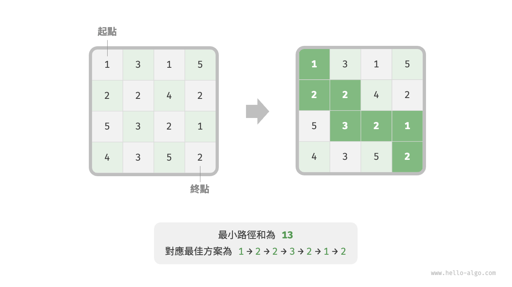{ class="animation-figure" }

<p align="center"> 圖 14-10 &nbsp; 最小路徑和示例資料 </p>

**第一步：思考每輪的決策，定義狀態，從而得到 $dp$ 表**

本題的每一輪的決策就是從當前格子向下或向右走一步。設當前格子的行列索引為 $[i, j]$ ，則向下或向右走一步後，索引變為 $[i+1, j]$ 或 $[i, j+1]$ 。因此，狀態應包含行索引和列索引兩個變數，記為 $[i, j]$ 。

狀態 $[i, j]$ 對應的子問題為：從起始點 $[0, 0]$ 走到 $[i, j]$ 的最小路徑和，解記為 $dp[i, j]$ 。

至此，我們就得到了圖 14-11 所示的二維 $dp$ 矩陣，其尺寸與輸入網格 $grid$ 相同。

{ class="animation-figure" }

<p align="center"> 圖 14-11 &nbsp; 狀態定義與 dp 表 </p>

!!! note

    動態規劃和回溯過程可以描述為一個決策序列，而狀態由所有決策變數構成。它應當包含描述解題進度的所有變數，其包含了足夠的資訊，能夠用來推導出下一個狀態。
    
    每個狀態都對應一個子問題，我們會定義一個 $dp$ 表來儲存所有子問題的解，狀態的每個獨立變數都是 $dp$ 表的一個維度。從本質上看，$dp$ 表是狀態和子問題的解之間的對映。

**第二步：找出最優子結構，進而推導出狀態轉移方程**

對於狀態 $[i, j]$ ，它只能從上邊格子 $[i-1, j]$ 和左邊格子 $[i, j-1]$ 轉移而來。因此最優子結構為：到達 $[i, j]$ 的最小路徑和由 $[i, j-1]$ 的最小路徑和與 $[i-1, j]$ 的最小路徑和中較小的那一個決定。

根據以上分析，可推出圖 14-12 所示的狀態轉移方程：

$$
dp[i, j] = \min(dp[i-1, j], dp[i, j-1]) + grid[i, j]
$$

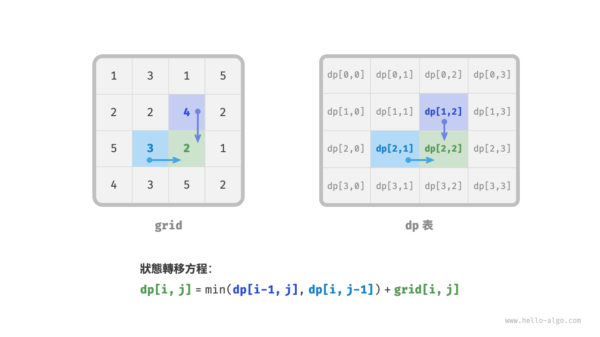{ class="animation-figure" }

<p align="center"> 圖 14-12 &nbsp; 最優子結構與狀態轉移方程 </p>

!!! note

    根據定義好的 $dp$ 表，思考原問題和子問題的關係，找出透過子問題的最優解來構造原問題的最優解的方法，即最優子結構。

    一旦我們找到了最優子結構，就可以使用它來構建出狀態轉移方程。

**第三步：確定邊界條件和狀態轉移順序**

在本題中，處在首行的狀態只能從其左邊的狀態得來，處在首列的狀態只能從其上邊的狀態得來，因此首行 $i = 0$ 和首列 $j = 0$ 是邊界條件。

如圖 14-13 所示，由於每個格子是由其左方格子和上方格子轉移而來，因此我們使用迴圈來走訪矩陣，外迴圈走訪各行，內迴圈走訪各列。

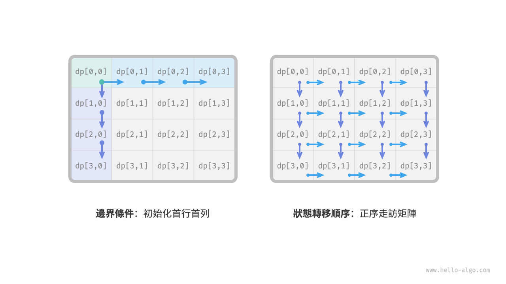{ class="animation-figure" }

<p align="center"> 圖 14-13 &nbsp; 邊界條件與狀態轉移順序 </p>

!!! note

    邊界條件在動態規劃中用於初始化 $dp$ 表，在搜尋中用於剪枝。
    
    狀態轉移順序的核心是要保證在計算當前問題的解時，所有它依賴的更小子問題的解都已經被正確地計算出來。

根據以上分析，我們已經可以直接寫出動態規劃程式碼。然而子問題分解是一種從頂至底的思想，因此按照“暴力搜尋 $\rightarrow$ 記憶化搜尋 $\rightarrow$ 動態規劃”的順序實現更加符合思維習慣。

### 1. &nbsp; 方法一：暴力搜尋

從狀態 $[i, j]$ 開始搜尋，不斷分解為更小的狀態 $[i-1, j]$ 和 $[i, j-1]$ ，遞迴函式包括以下要素。

- **遞迴參數**：狀態 $[i, j]$ 。
- **返回值**：從 $[0, 0]$ 到 $[i, j]$ 的最小路徑和 $dp[i, j]$ 。
- **終止條件**：當 $i = 0$ 且 $j = 0$ 時，返回代價 $grid[0, 0]$ 。
- **剪枝**：當 $i < 0$ 時或 $j < 0$ 時索引越界，此時返回代價 $+\infty$ ，代表不可行。

實現程式碼如下：

=== "Python"

    ```python title="min_path_sum.py"
    def min_path_sum_dfs(grid: list[list[int]], i: int, j: int) -> int:
        """最小路徑和：暴力搜尋"""
        # 若為左上角單元格，則終止搜尋
        if i == 0 and j == 0:
            return grid[0][0]
        # 若行列索引越界，則返回 +∞ 代價
        if i < 0 or j < 0:
            return inf
        # 計算從左上角到 (i-1, j) 和 (i, j-1) 的最小路徑代價
        up = min_path_sum_dfs(grid, i - 1, j)
        left = min_path_sum_dfs(grid, i, j - 1)
        # 返回從左上角到 (i, j) 的最小路徑代價
        return min(left, up) + grid[i][j]
    ```

=== "C++"

    ```cpp title="min_path_sum.cpp"
    /* 最小路徑和：暴力搜尋 */
    int minPathSumDFS(vector<vector<int>> &grid, int i, int j) {
        // 若為左上角單元格，則終止搜尋
        if (i == 0 && j == 0) {
            return grid[0][0];
        }
        // 若行列索引越界，則返回 +∞ 代價
        if (i < 0 || j < 0) {
            return INT_MAX;
        }
        // 計算從左上角到 (i-1, j) 和 (i, j-1) 的最小路徑代價
        int up = minPathSumDFS(grid, i - 1, j);
        int left = minPathSumDFS(grid, i, j - 1);
        // 返回從左上角到 (i, j) 的最小路徑代價
        return min(left, up) != INT_MAX ? min(left, up) + grid[i][j] : INT_MAX;
    }
    ```

=== "Java"

    ```java title="min_path_sum.java"
    /* 最小路徑和：暴力搜尋 */
    int minPathSumDFS(int[][] grid, int i, int j) {
        // 若為左上角單元格，則終止搜尋
        if (i == 0 && j == 0) {
            return grid[0][0];
        }
        // 若行列索引越界，則返回 +∞ 代價
        if (i < 0 || j < 0) {
            return Integer.MAX_VALUE;
        }
        // 計算從左上角到 (i-1, j) 和 (i, j-1) 的最小路徑代價
        int up = minPathSumDFS(grid, i - 1, j);
        int left = minPathSumDFS(grid, i, j - 1);
        // 返回從左上角到 (i, j) 的最小路徑代價
        return Math.min(left, up) + grid[i][j];
    }
    ```

=== "C#"

    ```csharp title="min_path_sum.cs"
    /* 最小路徑和：暴力搜尋 */
    int MinPathSumDFS(int[][] grid, int i, int j) {
        // 若為左上角單元格，則終止搜尋
        if (i == 0 && j == 0) {
            return grid[0][0];
        }
        // 若行列索引越界，則返回 +∞ 代價
        if (i < 0 || j < 0) {
            return int.MaxValue;
        }
        // 計算從左上角到 (i-1, j) 和 (i, j-1) 的最小路徑代價
        int up = MinPathSumDFS(grid, i - 1, j);
        int left = MinPathSumDFS(grid, i, j - 1);
        // 返回從左上角到 (i, j) 的最小路徑代價
        return Math.Min(left, up) + grid[i][j];
    }
    ```

=== "Go"

    ```go title="min_path_sum.go"
    /* 最小路徑和：暴力搜尋 */
    func minPathSumDFS(grid [][]int, i, j int) int {
        // 若為左上角單元格，則終止搜尋
        if i == 0 && j == 0 {
            return grid[0][0]
        }
        // 若行列索引越界，則返回 +∞ 代價
        if i < 0 || j < 0 {
            return math.MaxInt
        }
        // 計算從左上角到 (i-1, j) 和 (i, j-1) 的最小路徑代價
        up := minPathSumDFS(grid, i-1, j)
        left := minPathSumDFS(grid, i, j-1)
        // 返回從左上角到 (i, j) 的最小路徑代價
        return int(math.Min(float64(left), float64(up))) + grid[i][j]
    }
    ```

=== "Swift"

    ```swift title="min_path_sum.swift"
    /* 最小路徑和：暴力搜尋 */
    func minPathSumDFS(grid: [[Int]], i: Int, j: Int) -> Int {
        // 若為左上角單元格，則終止搜尋
        if i == 0, j == 0 {
            return grid[0][0]
        }
        // 若行列索引越界，則返回 +∞ 代價
        if i < 0 || j < 0 {
            return .max
        }
        // 計算從左上角到 (i-1, j) 和 (i, j-1) 的最小路徑代價
        let up = minPathSumDFS(grid: grid, i: i - 1, j: j)
        let left = minPathSumDFS(grid: grid, i: i, j: j - 1)
        // 返回從左上角到 (i, j) 的最小路徑代價
        return min(left, up) + grid[i][j]
    }
    ```

=== "JS"

    ```javascript title="min_path_sum.js"
    /* 最小路徑和：暴力搜尋 */
    function minPathSumDFS(grid, i, j) {
        // 若為左上角單元格，則終止搜尋
        if (i === 0 && j === 0) {
            return grid[0][0];
        }
        // 若行列索引越界，則返回 +∞ 代價
        if (i < 0 || j < 0) {
            return Infinity;
        }
        // 計算從左上角到 (i-1, j) 和 (i, j-1) 的最小路徑代價
        const up = minPathSumDFS(grid, i - 1, j);
        const left = minPathSumDFS(grid, i, j - 1);
        // 返回從左上角到 (i, j) 的最小路徑代價
        return Math.min(left, up) + grid[i][j];
    }
    ```

=== "TS"

    ```typescript title="min_path_sum.ts"
    /* 最小路徑和：暴力搜尋 */
    function minPathSumDFS(
        grid: Array<Array<number>>,
        i: number,
        j: number
    ): number {
        // 若為左上角單元格，則終止搜尋
        if (i === 0 && j == 0) {
            return grid[0][0];
        }
        // 若行列索引越界，則返回 +∞ 代價
        if (i < 0 || j < 0) {
            return Infinity;
        }
        // 計算從左上角到 (i-1, j) 和 (i, j-1) 的最小路徑代價
        const up = minPathSumDFS(grid, i - 1, j);
        const left = minPathSumDFS(grid, i, j - 1);
        // 返回從左上角到 (i, j) 的最小路徑代價
        return Math.min(left, up) + grid[i][j];
    }
    ```

=== "Dart"

    ```dart title="min_path_sum.dart"
    /* 最小路徑和：暴力搜尋 */
    int minPathSumDFS(List<List<int>> grid, int i, int j) {
      // 若為左上角單元格，則終止搜尋
      if (i == 0 && j == 0) {
        return grid[0][0];
      }
      // 若行列索引越界，則返回 +∞ 代價
      if (i < 0 || j < 0) {
        // 在 Dart 中，int 型別是固定範圍的整數，不存在表示“無窮大”的值
        return BigInt.from(2).pow(31).toInt();
      }
      // 計算從左上角到 (i-1, j) 和 (i, j-1) 的最小路徑代價
      int up = minPathSumDFS(grid, i - 1, j);
      int left = minPathSumDFS(grid, i, j - 1);
      // 返回從左上角到 (i, j) 的最小路徑代價
      return min(left, up) + grid[i][j];
    }
    ```

=== "Rust"

    ```rust title="min_path_sum.rs"
    /* 最小路徑和：暴力搜尋 */
    fn min_path_sum_dfs(grid: &Vec<Vec<i32>>, i: i32, j: i32) -> i32 {
        // 若為左上角單元格，則終止搜尋
        if i == 0 && j == 0 {
            return grid[0][0];
        }
        // 若行列索引越界，則返回 +∞ 代價
        if i < 0 || j < 0 {
            return i32::MAX;
        }
        // 計算從左上角到 (i-1, j) 和 (i, j-1) 的最小路徑代價
        let up = min_path_sum_dfs(grid, i - 1, j);
        let left = min_path_sum_dfs(grid, i, j - 1);
        // 返回從左上角到 (i, j) 的最小路徑代價
        std::cmp::min(left, up) + grid[i as usize][j as usize]
    }
    ```

=== "C"

    ```c title="min_path_sum.c"
    /* 最小路徑和：暴力搜尋 */
    int minPathSumDFS(int grid[MAX_SIZE][MAX_SIZE], int i, int j) {
        // 若為左上角單元格，則終止搜尋
        if (i == 0 && j == 0) {
            return grid[0][0];
        }
        // 若行列索引越界，則返回 +∞ 代價
        if (i < 0 || j < 0) {
            return INT_MAX;
        }
        // 計算從左上角到 (i-1, j) 和 (i, j-1) 的最小路徑代價
        int up = minPathSumDFS(grid, i - 1, j);
        int left = minPathSumDFS(grid, i, j - 1);
        // 返回從左上角到 (i, j) 的最小路徑代價
        return myMin(left, up) != INT_MAX ? myMin(left, up) + grid[i][j] : INT_MAX;
    }
    ```

=== "Kotlin"

    ```kotlin title="min_path_sum.kt"
    /* 最小路徑和：暴力搜尋 */
    fun minPathSumDFS(
        grid: Array<Array<Int>>,
        i: Int,
        j: Int
    ): Int {
        // 若為左上角單元格，則終止搜尋
        if (i == 0 && j == 0) {
            return grid[0][0]
        }
        // 若行列索引越界，則返回 +∞ 代價
        if (i < 0 || j < 0) {
            return Int.MAX_VALUE
        }
        // 計算從左上角到 (i-1, j) 和 (i, j-1) 的最小路徑代價
        val up = minPathSumDFS(grid, i - 1, j)
        val left = minPathSumDFS(grid, i, j - 1)
        // 返回從左上角到 (i, j) 的最小路徑代價
        return (min(left.toDouble(), up.toDouble()) + grid[i][j]).toInt()
    }
    ```

=== "Ruby"

    ```ruby title="min_path_sum.rb"
    [class]{}-[func]{min_path_sum_dfs}
    ```

=== "Zig"

    ```zig title="min_path_sum.zig"
    // 最小路徑和：暴力搜尋
    fn minPathSumDFS(grid: anytype, i: i32, j: i32) i32 {
        // 若為左上角單元格，則終止搜尋
        if (i == 0 and j == 0) {
            return grid[0][0];
        }
        // 若行列索引越界，則返回 +∞ 代價
        if (i < 0 or j < 0) {
            return std.math.maxInt(i32);
        }
        // 計算從左上角到 (i-1, j) 和 (i, j-1) 的最小路徑代價
        var up = minPathSumDFS(grid, i - 1, j);
        var left = minPathSumDFS(grid, i, j - 1);
        // 返回從左上角到 (i, j) 的最小路徑代價
        return @min(left, up) + grid[@as(usize, @intCast(i))][@as(usize, @intCast(j))];
    }
    ```

??? pythontutor "視覺化執行"

    <div style="height: 549px; width: 100%;"><iframe class="pythontutor-iframe" src="https://pythontutor.com/iframe-embed.html#code=from%20math%20import%20inf%0A%0Adef%20min_path_sum_dfs%28grid%3A%20list%5Blist%5Bint%5D%5D,%20i%3A%20int,%20j%3A%20int%29%20-%3E%20int%3A%0A%20%20%20%20%22%22%22%E6%9C%80%E5%B0%8F%E8%B7%AF%E5%BE%84%E5%92%8C%EF%BC%9A%E6%9A%B4%E5%8A%9B%E6%90%9C%E7%B4%A2%22%22%22%0A%20%20%20%20%23%20%E8%8B%A5%E4%B8%BA%E5%B7%A6%E4%B8%8A%E8%A7%92%E5%8D%95%E5%85%83%E6%A0%BC%EF%BC%8C%E5%88%99%E7%BB%88%E6%AD%A2%E6%90%9C%E7%B4%A2%0A%20%20%20%20if%20i%20%3D%3D%200%20and%20j%20%3D%3D%200%3A%0A%20%20%20%20%20%20%20%20return%20grid%5B0%5D%5B0%5D%0A%20%20%20%20%23%20%E8%8B%A5%E8%A1%8C%E5%88%97%E7%B4%A2%E5%BC%95%E8%B6%8A%E7%95%8C%EF%BC%8C%E5%88%99%E8%BF%94%E5%9B%9E%20%2B%E2%88%9E%20%E4%BB%A3%E4%BB%B7%0A%20%20%20%20if%20i%20%3C%200%20or%20j%20%3C%200%3A%0A%20%20%20%20%20%20%20%20return%20inf%0A%20%20%20%20%23%20%E8%AE%A1%E7%AE%97%E4%BB%8E%E5%B7%A6%E4%B8%8A%E8%A7%92%E5%88%B0%20%28i-1,%20j%29%20%E5%92%8C%20%28i,%20j-1%29%20%E7%9A%84%E6%9C%80%E5%B0%8F%E8%B7%AF%E5%BE%84%E4%BB%A3%E4%BB%B7%0A%20%20%20%20up%20%3D%20min_path_sum_dfs%28grid,%20i%20-%201,%20j%29%0A%20%20%20%20left%20%3D%20min_path_sum_dfs%28grid,%20i,%20j%20-%201%29%0A%20%20%20%20%23%20%E8%BF%94%E5%9B%9E%E4%BB%8E%E5%B7%A6%E4%B8%8A%E8%A7%92%E5%88%B0%20%28i,%20j%29%20%E7%9A%84%E6%9C%80%E5%B0%8F%E8%B7%AF%E5%BE%84%E4%BB%A3%E4%BB%B7%0A%20%20%20%20return%20min%28left,%20up%29%20%2B%20grid%5Bi%5D%5Bj%5D%0A%0A%0A%22%22%22Driver%20Code%22%22%22%0Aif%20__name__%20%3D%3D%20%22__main__%22%3A%0A%20%20%20%20grid%20%3D%20%5B%5B1,%203,%201,%205%5D,%20%5B2,%202,%204,%202%5D,%20%5B5,%203,%202,%201%5D,%20%5B4,%203,%205,%202%5D%5D%0A%20%20%20%20n,%20m%20%3D%20len%28grid%29,%20len%28grid%5B0%5D%29%0A%0A%20%20%20%20%23%20%E6%9A%B4%E5%8A%9B%E6%90%9C%E7%B4%A2%0A%20%20%20%20res%20%3D%20min_path_sum_dfs%28grid,%20n%20-%201,%20m%20-%201%29%0A%20%20%20%20print%28f%22%E4%BB%8E%E5%B7%A6%E4%B8%8A%E8%A7%92%E5%88%B0%E5%8F%B3%E4%B8%8B%E8%A7%92%E7%9A%84%E5%81%9A%E5%B0%8F%E8%B7%AF%E5%BE%84%E5%92%8C%E4%B8%BA%20%7Bres%7D%22%29&codeDivHeight=472&codeDivWidth=350&cumulative=false&curInstr=6&heapPrimitives=nevernest&origin=opt-frontend.js&py=311&rawInputLstJSON=%5B%5D&textReferences=false"> </iframe></div>
    <div style="margin-top: 5px;"><a href="https://pythontutor.com/iframe-embed.html#code=from%20math%20import%20inf%0A%0Adef%20min_path_sum_dfs%28grid%3A%20list%5Blist%5Bint%5D%5D,%20i%3A%20int,%20j%3A%20int%29%20-%3E%20int%3A%0A%20%20%20%20%22%22%22%E6%9C%80%E5%B0%8F%E8%B7%AF%E5%BE%84%E5%92%8C%EF%BC%9A%E6%9A%B4%E5%8A%9B%E6%90%9C%E7%B4%A2%22%22%22%0A%20%20%20%20%23%20%E8%8B%A5%E4%B8%BA%E5%B7%A6%E4%B8%8A%E8%A7%92%E5%8D%95%E5%85%83%E6%A0%BC%EF%BC%8C%E5%88%99%E7%BB%88%E6%AD%A2%E6%90%9C%E7%B4%A2%0A%20%20%20%20if%20i%20%3D%3D%200%20and%20j%20%3D%3D%200%3A%0A%20%20%20%20%20%20%20%20return%20grid%5B0%5D%5B0%5D%0A%20%20%20%20%23%20%E8%8B%A5%E8%A1%8C%E5%88%97%E7%B4%A2%E5%BC%95%E8%B6%8A%E7%95%8C%EF%BC%8C%E5%88%99%E8%BF%94%E5%9B%9E%20%2B%E2%88%9E%20%E4%BB%A3%E4%BB%B7%0A%20%20%20%20if%20i%20%3C%200%20or%20j%20%3C%200%3A%0A%20%20%20%20%20%20%20%20return%20inf%0A%20%20%20%20%23%20%E8%AE%A1%E7%AE%97%E4%BB%8E%E5%B7%A6%E4%B8%8A%E8%A7%92%E5%88%B0%20%28i-1,%20j%29%20%E5%92%8C%20%28i,%20j-1%29%20%E7%9A%84%E6%9C%80%E5%B0%8F%E8%B7%AF%E5%BE%84%E4%BB%A3%E4%BB%B7%0A%20%20%20%20up%20%3D%20min_path_sum_dfs%28grid,%20i%20-%201,%20j%29%0A%20%20%20%20left%20%3D%20min_path_sum_dfs%28grid,%20i,%20j%20-%201%29%0A%20%20%20%20%23%20%E8%BF%94%E5%9B%9E%E4%BB%8E%E5%B7%A6%E4%B8%8A%E8%A7%92%E5%88%B0%20%28i,%20j%29%20%E7%9A%84%E6%9C%80%E5%B0%8F%E8%B7%AF%E5%BE%84%E4%BB%A3%E4%BB%B7%0A%20%20%20%20return%20min%28left,%20up%29%20%2B%20grid%5Bi%5D%5Bj%5D%0A%0A%0A%22%22%22Driver%20Code%22%22%22%0Aif%20__name__%20%3D%3D%20%22__main__%22%3A%0A%20%20%20%20grid%20%3D%20%5B%5B1,%203,%201,%205%5D,%20%5B2,%202,%204,%202%5D,%20%5B5,%203,%202,%201%5D,%20%5B4,%203,%205,%202%5D%5D%0A%20%20%20%20n,%20m%20%3D%20len%28grid%29,%20len%28grid%5B0%5D%29%0A%0A%20%20%20%20%23%20%E6%9A%B4%E5%8A%9B%E6%90%9C%E7%B4%A2%0A%20%20%20%20res%20%3D%20min_path_sum_dfs%28grid,%20n%20-%201,%20m%20-%201%29%0A%20%20%20%20print%28f%22%E4%BB%8E%E5%B7%A6%E4%B8%8A%E8%A7%92%E5%88%B0%E5%8F%B3%E4%B8%8B%E8%A7%92%E7%9A%84%E5%81%9A%E5%B0%8F%E8%B7%AF%E5%BE%84%E5%92%8C%E4%B8%BA%20%7Bres%7D%22%29&codeDivHeight=800&codeDivWidth=600&cumulative=false&curInstr=6&heapPrimitives=nevernest&origin=opt-frontend.js&py=311&rawInputLstJSON=%5B%5D&textReferences=false" target="_blank" rel="noopener noreferrer">全螢幕觀看 ></a></div>

圖 14-14 給出了以 $dp[2, 1]$ 為根節點的遞迴樹，其中包含一些重疊子問題，其數量會隨著網格 `grid` 的尺寸變大而急劇增多。

從本質上看，造成重疊子問題的原因為：**存在多條路徑可以從左上角到達某一單元格**。

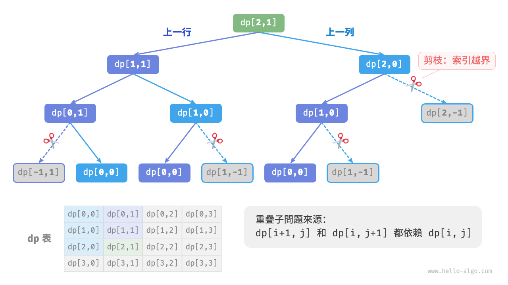{ class="animation-figure" }

<p align="center"> 圖 14-14 &nbsp; 暴力搜尋遞迴樹 </p>

每個狀態都有向下和向右兩種選擇，從左上角走到右下角總共需要 $m + n - 2$ 步，所以最差時間複雜度為 $O(2^{m + n})$ 。請注意，這種計算方式未考慮臨近網格邊界的情況，當到達網路邊界時只剩下一種選擇，因此實際的路徑數量會少一些。

### 2. &nbsp; 方法二：記憶化搜尋

我們引入一個和網格 `grid` 相同尺寸的記憶串列 `mem` ，用於記錄各個子問題的解，並將重疊子問題進行剪枝：

=== "Python"

    ```python title="min_path_sum.py"
    def min_path_sum_dfs_mem(
        grid: list[list[int]], mem: list[list[int]], i: int, j: int
    ) -> int:
        """最小路徑和：記憶化搜尋"""
        # 若為左上角單元格，則終止搜尋
        if i == 0 and j == 0:
            return grid[0][0]
        # 若行列索引越界，則返回 +∞ 代價
        if i < 0 or j < 0:
            return inf
        # 若已有記錄，則直接返回
        if mem[i][j] != -1:
            return mem[i][j]
        # 左邊和上邊單元格的最小路徑代價
        up = min_path_sum_dfs_mem(grid, mem, i - 1, j)
        left = min_path_sum_dfs_mem(grid, mem, i, j - 1)
        # 記錄並返回左上角到 (i, j) 的最小路徑代價
        mem[i][j] = min(left, up) + grid[i][j]
        return mem[i][j]
    ```

=== "C++"

    ```cpp title="min_path_sum.cpp"
    /* 最小路徑和：記憶化搜尋 */
    int minPathSumDFSMem(vector<vector<int>> &grid, vector<vector<int>> &mem, int i, int j) {
        // 若為左上角單元格，則終止搜尋
        if (i == 0 && j == 0) {
            return grid[0][0];
        }
        // 若行列索引越界，則返回 +∞ 代價
        if (i < 0 || j < 0) {
            return INT_MAX;
        }
        // 若已有記錄，則直接返回
        if (mem[i][j] != -1) {
            return mem[i][j];
        }
        // 左邊和上邊單元格的最小路徑代價
        int up = minPathSumDFSMem(grid, mem, i - 1, j);
        int left = minPathSumDFSMem(grid, mem, i, j - 1);
        // 記錄並返回左上角到 (i, j) 的最小路徑代價
        mem[i][j] = min(left, up) != INT_MAX ? min(left, up) + grid[i][j] : INT_MAX;
        return mem[i][j];
    }
    ```

=== "Java"

    ```java title="min_path_sum.java"
    /* 最小路徑和：記憶化搜尋 */
    int minPathSumDFSMem(int[][] grid, int[][] mem, int i, int j) {
        // 若為左上角單元格，則終止搜尋
        if (i == 0 && j == 0) {
            return grid[0][0];
        }
        // 若行列索引越界，則返回 +∞ 代價
        if (i < 0 || j < 0) {
            return Integer.MAX_VALUE;
        }
        // 若已有記錄，則直接返回
        if (mem[i][j] != -1) {
            return mem[i][j];
        }
        // 左邊和上邊單元格的最小路徑代價
        int up = minPathSumDFSMem(grid, mem, i - 1, j);
        int left = minPathSumDFSMem(grid, mem, i, j - 1);
        // 記錄並返回左上角到 (i, j) 的最小路徑代價
        mem[i][j] = Math.min(left, up) + grid[i][j];
        return mem[i][j];
    }
    ```

=== "C#"

    ```csharp title="min_path_sum.cs"
    /* 最小路徑和：記憶化搜尋 */
    int MinPathSumDFSMem(int[][] grid, int[][] mem, int i, int j) {
        // 若為左上角單元格，則終止搜尋
        if (i == 0 && j == 0) {
            return grid[0][0];
        }
        // 若行列索引越界，則返回 +∞ 代價
        if (i < 0 || j < 0) {
            return int.MaxValue;
        }
        // 若已有記錄，則直接返回
        if (mem[i][j] != -1) {
            return mem[i][j];
        }
        // 左邊和上邊單元格的最小路徑代價
        int up = MinPathSumDFSMem(grid, mem, i - 1, j);
        int left = MinPathSumDFSMem(grid, mem, i, j - 1);
        // 記錄並返回左上角到 (i, j) 的最小路徑代價
        mem[i][j] = Math.Min(left, up) + grid[i][j];
        return mem[i][j];
    }
    ```

=== "Go"

    ```go title="min_path_sum.go"
    /* 最小路徑和：記憶化搜尋 */
    func minPathSumDFSMem(grid, mem [][]int, i, j int) int {
        // 若為左上角單元格，則終止搜尋
        if i == 0 && j == 0 {
            return grid[0][0]
        }
        // 若行列索引越界，則返回 +∞ 代價
        if i < 0 || j < 0 {
            return math.MaxInt
        }
        // 若已有記錄，則直接返回
        if mem[i][j] != -1 {
            return mem[i][j]
        }
        // 左邊和上邊單元格的最小路徑代價
        up := minPathSumDFSMem(grid, mem, i-1, j)
        left := minPathSumDFSMem(grid, mem, i, j-1)
        // 記錄並返回左上角到 (i, j) 的最小路徑代價
        mem[i][j] = int(math.Min(float64(left), float64(up))) + grid[i][j]
        return mem[i][j]
    }
    ```

=== "Swift"

    ```swift title="min_path_sum.swift"
    /* 最小路徑和：記憶化搜尋 */
    func minPathSumDFSMem(grid: [[Int]], mem: inout [[Int]], i: Int, j: Int) -> Int {
        // 若為左上角單元格，則終止搜尋
        if i == 0, j == 0 {
            return grid[0][0]
        }
        // 若行列索引越界，則返回 +∞ 代價
        if i < 0 || j < 0 {
            return .max
        }
        // 若已有記錄，則直接返回
        if mem[i][j] != -1 {
            return mem[i][j]
        }
        // 左邊和上邊單元格的最小路徑代價
        let up = minPathSumDFSMem(grid: grid, mem: &mem, i: i - 1, j: j)
        let left = minPathSumDFSMem(grid: grid, mem: &mem, i: i, j: j - 1)
        // 記錄並返回左上角到 (i, j) 的最小路徑代價
        mem[i][j] = min(left, up) + grid[i][j]
        return mem[i][j]
    }
    ```

=== "JS"

    ```javascript title="min_path_sum.js"
    /* 最小路徑和：記憶化搜尋 */
    function minPathSumDFSMem(grid, mem, i, j) {
        // 若為左上角單元格，則終止搜尋
        if (i === 0 && j === 0) {
            return grid[0][0];
        }
        // 若行列索引越界，則返回 +∞ 代價
        if (i < 0 || j < 0) {
            return Infinity;
        }
        // 若已有記錄，則直接返回
        if (mem[i][j] !== -1) {
            return mem[i][j];
        }
        // 左邊和上邊單元格的最小路徑代價
        const up = minPathSumDFSMem(grid, mem, i - 1, j);
        const left = minPathSumDFSMem(grid, mem, i, j - 1);
        // 記錄並返回左上角到 (i, j) 的最小路徑代價
        mem[i][j] = Math.min(left, up) + grid[i][j];
        return mem[i][j];
    }
    ```

=== "TS"

    ```typescript title="min_path_sum.ts"
    /* 最小路徑和：記憶化搜尋 */
    function minPathSumDFSMem(
        grid: Array<Array<number>>,
        mem: Array<Array<number>>,
        i: number,
        j: number
    ): number {
        // 若為左上角單元格，則終止搜尋
        if (i === 0 && j === 0) {
            return grid[0][0];
        }
        // 若行列索引越界，則返回 +∞ 代價
        if (i < 0 || j < 0) {
            return Infinity;
        }
        // 若已有記錄，則直接返回
        if (mem[i][j] != -1) {
            return mem[i][j];
        }
        // 左邊和上邊單元格的最小路徑代價
        const up = minPathSumDFSMem(grid, mem, i - 1, j);
        const left = minPathSumDFSMem(grid, mem, i, j - 1);
        // 記錄並返回左上角到 (i, j) 的最小路徑代價
        mem[i][j] = Math.min(left, up) + grid[i][j];
        return mem[i][j];
    }
    ```

=== "Dart"

    ```dart title="min_path_sum.dart"
    /* 最小路徑和：記憶化搜尋 */
    int minPathSumDFSMem(List<List<int>> grid, List<List<int>> mem, int i, int j) {
      // 若為左上角單元格，則終止搜尋
      if (i == 0 && j == 0) {
        return grid[0][0];
      }
      // 若行列索引越界，則返回 +∞ 代價
      if (i < 0 || j < 0) {
        // 在 Dart 中，int 型別是固定範圍的整數，不存在表示“無窮大”的值
        return BigInt.from(2).pow(31).toInt();
      }
      // 若已有記錄，則直接返回
      if (mem[i][j] != -1) {
        return mem[i][j];
      }
      // 左邊和上邊單元格的最小路徑代價
      int up = minPathSumDFSMem(grid, mem, i - 1, j);
      int left = minPathSumDFSMem(grid, mem, i, j - 1);
      // 記錄並返回左上角到 (i, j) 的最小路徑代價
      mem[i][j] = min(left, up) + grid[i][j];
      return mem[i][j];
    }
    ```

=== "Rust"

    ```rust title="min_path_sum.rs"
    /* 最小路徑和：記憶化搜尋 */
    fn min_path_sum_dfs_mem(grid: &Vec<Vec<i32>>, mem: &mut Vec<Vec<i32>>, i: i32, j: i32) -> i32 {
        // 若為左上角單元格，則終止搜尋
        if i == 0 && j == 0 {
            return grid[0][0];
        }
        // 若行列索引越界，則返回 +∞ 代價
        if i < 0 || j < 0 {
            return i32::MAX;
        }
        // 若已有記錄，則直接返回
        if mem[i as usize][j as usize] != -1 {
            return mem[i as usize][j as usize];
        }
        // 左邊和上邊單元格的最小路徑代價
        let up = min_path_sum_dfs_mem(grid, mem, i - 1, j);
        let left = min_path_sum_dfs_mem(grid, mem, i, j - 1);
        // 記錄並返回左上角到 (i, j) 的最小路徑代價
        mem[i as usize][j as usize] = std::cmp::min(left, up) + grid[i as usize][j as usize];
        mem[i as usize][j as usize]
    }
    ```

=== "C"

    ```c title="min_path_sum.c"
    /* 最小路徑和：記憶化搜尋 */
    int minPathSumDFSMem(int grid[MAX_SIZE][MAX_SIZE], int mem[MAX_SIZE][MAX_SIZE], int i, int j) {
        // 若為左上角單元格，則終止搜尋
        if (i == 0 && j == 0) {
            return grid[0][0];
        }
        // 若行列索引越界，則返回 +∞ 代價
        if (i < 0 || j < 0) {
            return INT_MAX;
        }
        // 若已有記錄，則直接返回
        if (mem[i][j] != -1) {
            return mem[i][j];
        }
        // 左邊和上邊單元格的最小路徑代價
        int up = minPathSumDFSMem(grid, mem, i - 1, j);
        int left = minPathSumDFSMem(grid, mem, i, j - 1);
        // 記錄並返回左上角到 (i, j) 的最小路徑代價
        mem[i][j] = myMin(left, up) != INT_MAX ? myMin(left, up) + grid[i][j] : INT_MAX;
        return mem[i][j];
    }
    ```

=== "Kotlin"

    ```kotlin title="min_path_sum.kt"
    /* 最小路徑和：記憶化搜尋 */
    fun minPathSumDFSMem(
        grid: Array<Array<Int>>,
        mem: Array<Array<Int>>,
        i: Int,
        j: Int
    ): Int {
        // 若為左上角單元格，則終止搜尋
        if (i == 0 && j == 0) {
            return grid[0][0]
        }
        // 若行列索引越界，則返回 +∞ 代價
        if (i < 0 || j < 0) {
            return Int.MAX_VALUE
        }
        // 若已有記錄，則直接返回
        if (mem[i][j] != -1) {
            return mem[i][j]
        }
        // 左邊和上邊單元格的最小路徑代價
        val up = minPathSumDFSMem(grid, mem, i - 1, j)
        val left = minPathSumDFSMem(grid, mem, i, j - 1)
        // 記錄並返回左上角到 (i, j) 的最小路徑代價
        mem[i][j] = (min(left.toDouble(), up.toDouble()) + grid[i][j]).toInt()
        return mem[i][j]
    }
    ```

=== "Ruby"

    ```ruby title="min_path_sum.rb"
    [class]{}-[func]{min_path_sum_dfs_mem}
    ```

=== "Zig"

    ```zig title="min_path_sum.zig"
    // 最小路徑和：記憶化搜尋
    fn minPathSumDFSMem(grid: anytype, mem: anytype, i: i32, j: i32) i32 {
        // 若為左上角單元格，則終止搜尋
        if (i == 0 and j == 0) {
            return grid[0][0];
        }
        // 若行列索引越界，則返回 +∞ 代價
        if (i < 0 or j < 0) {
            return std.math.maxInt(i32);
        }
        // 若已有記錄，則直接返回
        if (mem[@as(usize, @intCast(i))][@as(usize, @intCast(j))] != -1) {
            return mem[@as(usize, @intCast(i))][@as(usize, @intCast(j))];
        }
        // 計算從左上角到 (i-1, j) 和 (i, j-1) 的最小路徑代價
        var up = minPathSumDFSMem(grid, mem, i - 1, j);
        var left = minPathSumDFSMem(grid, mem, i, j - 1);
        // 返回從左上角到 (i, j) 的最小路徑代價
        // 記錄並返回左上角到 (i, j) 的最小路徑代價
        mem[@as(usize, @intCast(i))][@as(usize, @intCast(j))] = @min(left, up) + grid[@as(usize, @intCast(i))][@as(usize, @intCast(j))];
        return mem[@as(usize, @intCast(i))][@as(usize, @intCast(j))];
    }
    ```

??? pythontutor "視覺化執行"

    <div style="height: 549px; width: 100%;"><iframe class="pythontutor-iframe" src="https://pythontutor.com/iframe-embed.html#code=from%20math%20import%20inf%0A%0Adef%20min_path_sum_dfs_mem%28%0A%20%20%20%20grid%3A%20list%5Blist%5Bint%5D%5D,%20mem%3A%20list%5Blist%5Bint%5D%5D,%20i%3A%20int,%20j%3A%20int%0A%29%20-%3E%20int%3A%0A%20%20%20%20%22%22%22%E6%9C%80%E5%B0%8F%E8%B7%AF%E5%BE%84%E5%92%8C%EF%BC%9A%E8%AE%B0%E5%BF%86%E5%8C%96%E6%90%9C%E7%B4%A2%22%22%22%0A%20%20%20%20%23%20%E8%8B%A5%E4%B8%BA%E5%B7%A6%E4%B8%8A%E8%A7%92%E5%8D%95%E5%85%83%E6%A0%BC%EF%BC%8C%E5%88%99%E7%BB%88%E6%AD%A2%E6%90%9C%E7%B4%A2%0A%20%20%20%20if%20i%20%3D%3D%200%20and%20j%20%3D%3D%200%3A%0A%20%20%20%20%20%20%20%20return%20grid%5B0%5D%5B0%5D%0A%20%20%20%20%23%20%E8%8B%A5%E8%A1%8C%E5%88%97%E7%B4%A2%E5%BC%95%E8%B6%8A%E7%95%8C%EF%BC%8C%E5%88%99%E8%BF%94%E5%9B%9E%20%2B%E2%88%9E%20%E4%BB%A3%E4%BB%B7%0A%20%20%20%20if%20i%20%3C%200%20or%20j%20%3C%200%3A%0A%20%20%20%20%20%20%20%20return%20inf%0A%20%20%20%20%23%20%E8%8B%A5%E5%B7%B2%E6%9C%89%E8%AE%B0%E5%BD%95%EF%BC%8C%E5%88%99%E7%9B%B4%E6%8E%A5%E8%BF%94%E5%9B%9E%0A%20%20%20%20if%20mem%5Bi%5D%5Bj%5D%20!%3D%20-1%3A%0A%20%20%20%20%20%20%20%20return%20mem%5Bi%5D%5Bj%5D%0A%20%20%20%20%23%20%E5%B7%A6%E8%BE%B9%E5%92%8C%E4%B8%8A%E8%BE%B9%E5%8D%95%E5%85%83%E6%A0%BC%E7%9A%84%E6%9C%80%E5%B0%8F%E8%B7%AF%E5%BE%84%E4%BB%A3%E4%BB%B7%0A%20%20%20%20up%20%3D%20min_path_sum_dfs_mem%28grid,%20mem,%20i%20-%201,%20j%29%0A%20%20%20%20left%20%3D%20min_path_sum_dfs_mem%28grid,%20mem,%20i,%20j%20-%201%29%0A%20%20%20%20%23%20%E8%AE%B0%E5%BD%95%E5%B9%B6%E8%BF%94%E5%9B%9E%E5%B7%A6%E4%B8%8A%E8%A7%92%E5%88%B0%20%28i,%20j%29%20%E7%9A%84%E6%9C%80%E5%B0%8F%E8%B7%AF%E5%BE%84%E4%BB%A3%E4%BB%B7%0A%20%20%20%20mem%5Bi%5D%5Bj%5D%20%3D%20min%28left,%20up%29%20%2B%20grid%5Bi%5D%5Bj%5D%0A%20%20%20%20return%20mem%5Bi%5D%5Bj%5D%0A%0A%0A%22%22%22Driver%20Code%22%22%22%0Aif%20__name__%20%3D%3D%20%22__main__%22%3A%0A%20%20%20%20grid%20%3D%20%5B%5B1,%203,%201,%205%5D,%20%5B2,%202,%204,%202%5D,%20%5B5,%203,%202,%201%5D,%20%5B4,%203,%205,%202%5D%5D%0A%20%20%20%20n,%20m%20%3D%20len%28grid%29,%20len%28grid%5B0%5D%29%0A%0A%20%20%20%23%20%E8%AE%B0%E5%BF%86%E5%8C%96%E6%90%9C%E7%B4%A2%0A%20%20%20%20mem%20%3D%20%5B%5B-1%5D%20*%20m%20for%20_%20in%20range%28n%29%5D%0A%20%20%20%20res%20%3D%20min_path_sum_dfs_mem%28grid,%20mem,%20n%20-%201,%20m%20-%201%29%0A%20%20%20%20print%28f%22%E4%BB%8E%E5%B7%A6%E4%B8%8A%E8%A7%92%E5%88%B0%E5%8F%B3%E4%B8%8B%E8%A7%92%E7%9A%84%E5%81%9A%E5%B0%8F%E8%B7%AF%E5%BE%84%E5%92%8C%E4%B8%BA%20%7Bres%7D%22%29&codeDivHeight=472&codeDivWidth=350&cumulative=false&curInstr=16&heapPrimitives=nevernest&origin=opt-frontend.js&py=311&rawInputLstJSON=%5B%5D&textReferences=false"> </iframe></div>
    <div style="margin-top: 5px;"><a href="https://pythontutor.com/iframe-embed.html#code=from%20math%20import%20inf%0A%0Adef%20min_path_sum_dfs_mem%28%0A%20%20%20%20grid%3A%20list%5Blist%5Bint%5D%5D,%20mem%3A%20list%5Blist%5Bint%5D%5D,%20i%3A%20int,%20j%3A%20int%0A%29%20-%3E%20int%3A%0A%20%20%20%20%22%22%22%E6%9C%80%E5%B0%8F%E8%B7%AF%E5%BE%84%E5%92%8C%EF%BC%9A%E8%AE%B0%E5%BF%86%E5%8C%96%E6%90%9C%E7%B4%A2%22%22%22%0A%20%20%20%20%23%20%E8%8B%A5%E4%B8%BA%E5%B7%A6%E4%B8%8A%E8%A7%92%E5%8D%95%E5%85%83%E6%A0%BC%EF%BC%8C%E5%88%99%E7%BB%88%E6%AD%A2%E6%90%9C%E7%B4%A2%0A%20%20%20%20if%20i%20%3D%3D%200%20and%20j%20%3D%3D%200%3A%0A%20%20%20%20%20%20%20%20return%20grid%5B0%5D%5B0%5D%0A%20%20%20%20%23%20%E8%8B%A5%E8%A1%8C%E5%88%97%E7%B4%A2%E5%BC%95%E8%B6%8A%E7%95%8C%EF%BC%8C%E5%88%99%E8%BF%94%E5%9B%9E%20%2B%E2%88%9E%20%E4%BB%A3%E4%BB%B7%0A%20%20%20%20if%20i%20%3C%200%20or%20j%20%3C%200%3A%0A%20%20%20%20%20%20%20%20return%20inf%0A%20%20%20%20%23%20%E8%8B%A5%E5%B7%B2%E6%9C%89%E8%AE%B0%E5%BD%95%EF%BC%8C%E5%88%99%E7%9B%B4%E6%8E%A5%E8%BF%94%E5%9B%9E%0A%20%20%20%20if%20mem%5Bi%5D%5Bj%5D%20!%3D%20-1%3A%0A%20%20%20%20%20%20%20%20return%20mem%5Bi%5D%5Bj%5D%0A%20%20%20%20%23%20%E5%B7%A6%E8%BE%B9%E5%92%8C%E4%B8%8A%E8%BE%B9%E5%8D%95%E5%85%83%E6%A0%BC%E7%9A%84%E6%9C%80%E5%B0%8F%E8%B7%AF%E5%BE%84%E4%BB%A3%E4%BB%B7%0A%20%20%20%20up%20%3D%20min_path_sum_dfs_mem%28grid,%20mem,%20i%20-%201,%20j%29%0A%20%20%20%20left%20%3D%20min_path_sum_dfs_mem%28grid,%20mem,%20i,%20j%20-%201%29%0A%20%20%20%20%23%20%E8%AE%B0%E5%BD%95%E5%B9%B6%E8%BF%94%E5%9B%9E%E5%B7%A6%E4%B8%8A%E8%A7%92%E5%88%B0%20%28i,%20j%29%20%E7%9A%84%E6%9C%80%E5%B0%8F%E8%B7%AF%E5%BE%84%E4%BB%A3%E4%BB%B7%0A%20%20%20%20mem%5Bi%5D%5Bj%5D%20%3D%20min%28left,%20up%29%20%2B%20grid%5Bi%5D%5Bj%5D%0A%20%20%20%20return%20mem%5Bi%5D%5Bj%5D%0A%0A%0A%22%22%22Driver%20Code%22%22%22%0Aif%20__name__%20%3D%3D%20%22__main__%22%3A%0A%20%20%20%20grid%20%3D%20%5B%5B1,%203,%201,%205%5D,%20%5B2,%202,%204,%202%5D,%20%5B5,%203,%202,%201%5D,%20%5B4,%203,%205,%202%5D%5D%0A%20%20%20%20n,%20m%20%3D%20len%28grid%29,%20len%28grid%5B0%5D%29%0A%0A%20%20%20%23%20%E8%AE%B0%E5%BF%86%E5%8C%96%E6%90%9C%E7%B4%A2%0A%20%20%20%20mem%20%3D%20%5B%5B-1%5D%20*%20m%20for%20_%20in%20range%28n%29%5D%0A%20%20%20%20res%20%3D%20min_path_sum_dfs_mem%28grid,%20mem,%20n%20-%201,%20m%20-%201%29%0A%20%20%20%20print%28f%22%E4%BB%8E%E5%B7%A6%E4%B8%8A%E8%A7%92%E5%88%B0%E5%8F%B3%E4%B8%8B%E8%A7%92%E7%9A%84%E5%81%9A%E5%B0%8F%E8%B7%AF%E5%BE%84%E5%92%8C%E4%B8%BA%20%7Bres%7D%22%29&codeDivHeight=800&codeDivWidth=600&cumulative=false&curInstr=16&heapPrimitives=nevernest&origin=opt-frontend.js&py=311&rawInputLstJSON=%5B%5D&textReferences=false" target="_blank" rel="noopener noreferrer">全螢幕觀看 ></a></div>

如圖 14-15 所示，在引入記憶化後，所有子問題的解只需計算一次，因此時間複雜度取決於狀態總數，即網格尺寸 $O(nm)$ 。

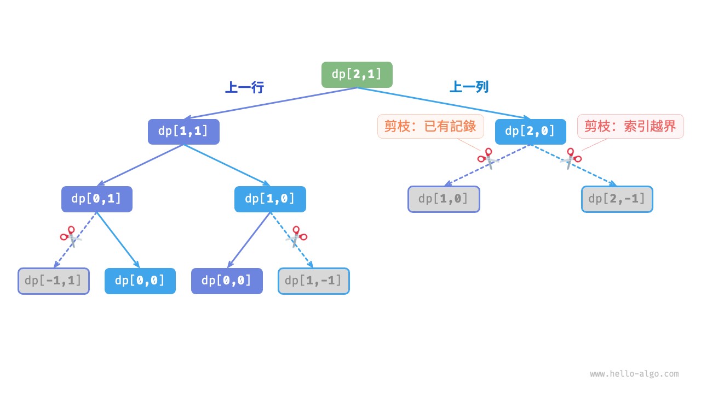{ class="animation-figure" }

<p align="center"> 圖 14-15 &nbsp; 記憶化搜尋遞迴樹 </p>

### 3. &nbsp; 方法三：動態規劃

基於迭代實現動態規劃解法，程式碼如下所示：

=== "Python"

    ```python title="min_path_sum.py"
    def min_path_sum_dp(grid: list[list[int]]) -> int:
        """最小路徑和：動態規劃"""
        n, m = len(grid), len(grid[0])
        # 初始化 dp 表
        dp = [[0] * m for _ in range(n)]
        dp[0][0] = grid[0][0]
        # 狀態轉移：首行
        for j in range(1, m):
            dp[0][j] = dp[0][j - 1] + grid[0][j]
        # 狀態轉移：首列
        for i in range(1, n):
            dp[i][0] = dp[i - 1][0] + grid[i][0]
        # 狀態轉移：其餘行和列
        for i in range(1, n):
            for j in range(1, m):
                dp[i][j] = min(dp[i][j - 1], dp[i - 1][j]) + grid[i][j]
        return dp[n - 1][m - 1]
    ```

=== "C++"

    ```cpp title="min_path_sum.cpp"
    /* 最小路徑和：動態規劃 */
    int minPathSumDP(vector<vector<int>> &grid) {
        int n = grid.size(), m = grid[0].size();
        // 初始化 dp 表
        vector<vector<int>> dp(n, vector<int>(m));
        dp[0][0] = grid[0][0];
        // 狀態轉移：首行
        for (int j = 1; j < m; j++) {
            dp[0][j] = dp[0][j - 1] + grid[0][j];
        }
        // 狀態轉移：首列
        for (int i = 1; i < n; i++) {
            dp[i][0] = dp[i - 1][0] + grid[i][0];
        }
        // 狀態轉移：其餘行和列
        for (int i = 1; i < n; i++) {
            for (int j = 1; j < m; j++) {
                dp[i][j] = min(dp[i][j - 1], dp[i - 1][j]) + grid[i][j];
            }
        }
        return dp[n - 1][m - 1];
    }
    ```

=== "Java"

    ```java title="min_path_sum.java"
    /* 最小路徑和：動態規劃 */
    int minPathSumDP(int[][] grid) {
        int n = grid.length, m = grid[0].length;
        // 初始化 dp 表
        int[][] dp = new int[n][m];
        dp[0][0] = grid[0][0];
        // 狀態轉移：首行
        for (int j = 1; j < m; j++) {
            dp[0][j] = dp[0][j - 1] + grid[0][j];
        }
        // 狀態轉移：首列
        for (int i = 1; i < n; i++) {
            dp[i][0] = dp[i - 1][0] + grid[i][0];
        }
        // 狀態轉移：其餘行和列
        for (int i = 1; i < n; i++) {
            for (int j = 1; j < m; j++) {
                dp[i][j] = Math.min(dp[i][j - 1], dp[i - 1][j]) + grid[i][j];
            }
        }
        return dp[n - 1][m - 1];
    }
    ```

=== "C#"

    ```csharp title="min_path_sum.cs"
    /* 最小路徑和：動態規劃 */
    int MinPathSumDP(int[][] grid) {
        int n = grid.Length, m = grid[0].Length;
        // 初始化 dp 表
        int[,] dp = new int[n, m];
        dp[0, 0] = grid[0][0];
        // 狀態轉移：首行
        for (int j = 1; j < m; j++) {
            dp[0, j] = dp[0, j - 1] + grid[0][j];
        }
        // 狀態轉移：首列
        for (int i = 1; i < n; i++) {
            dp[i, 0] = dp[i - 1, 0] + grid[i][0];
        }
        // 狀態轉移：其餘行和列
        for (int i = 1; i < n; i++) {
            for (int j = 1; j < m; j++) {
                dp[i, j] = Math.Min(dp[i, j - 1], dp[i - 1, j]) + grid[i][j];
            }
        }
        return dp[n - 1, m - 1];
    }
    ```

=== "Go"

    ```go title="min_path_sum.go"
    /* 最小路徑和：動態規劃 */
    func minPathSumDP(grid [][]int) int {
        n, m := len(grid), len(grid[0])
        // 初始化 dp 表
        dp := make([][]int, n)
        for i := 0; i < n; i++ {
            dp[i] = make([]int, m)
        }
        dp[0][0] = grid[0][0]
        // 狀態轉移：首行
        for j := 1; j < m; j++ {
            dp[0][j] = dp[0][j-1] + grid[0][j]
        }
        // 狀態轉移：首列
        for i := 1; i < n; i++ {
            dp[i][0] = dp[i-1][0] + grid[i][0]
        }
        // 狀態轉移：其餘行和列
        for i := 1; i < n; i++ {
            for j := 1; j < m; j++ {
                dp[i][j] = int(math.Min(float64(dp[i][j-1]), float64(dp[i-1][j]))) + grid[i][j]
            }
        }
        return dp[n-1][m-1]
    }
    ```

=== "Swift"

    ```swift title="min_path_sum.swift"
    /* 最小路徑和：動態規劃 */
    func minPathSumDP(grid: [[Int]]) -> Int {
        let n = grid.count
        let m = grid[0].count
        // 初始化 dp 表
        var dp = Array(repeating: Array(repeating: 0, count: m), count: n)
        dp[0][0] = grid[0][0]
        // 狀態轉移：首行
        for j in 1 ..< m {
            dp[0][j] = dp[0][j - 1] + grid[0][j]
        }
        // 狀態轉移：首列
        for i in 1 ..< n {
            dp[i][0] = dp[i - 1][0] + grid[i][0]
        }
        // 狀態轉移：其餘行和列
        for i in 1 ..< n {
            for j in 1 ..< m {
                dp[i][j] = min(dp[i][j - 1], dp[i - 1][j]) + grid[i][j]
            }
        }
        return dp[n - 1][m - 1]
    }
    ```

=== "JS"

    ```javascript title="min_path_sum.js"
    /* 最小路徑和：動態規劃 */
    function minPathSumDP(grid) {
        const n = grid.length,
            m = grid[0].length;
        // 初始化 dp 表
        const dp = Array.from({ length: n }, () =>
            Array.from({ length: m }, () => 0)
        );
        dp[0][0] = grid[0][0];
        // 狀態轉移：首行
        for (let j = 1; j < m; j++) {
            dp[0][j] = dp[0][j - 1] + grid[0][j];
        }
        // 狀態轉移：首列
        for (let i = 1; i < n; i++) {
            dp[i][0] = dp[i - 1][0] + grid[i][0];
        }
        // 狀態轉移：其餘行和列
        for (let i = 1; i < n; i++) {
            for (let j = 1; j < m; j++) {
                dp[i][j] = Math.min(dp[i][j - 1], dp[i - 1][j]) + grid[i][j];
            }
        }
        return dp[n - 1][m - 1];
    }
    ```

=== "TS"

    ```typescript title="min_path_sum.ts"
    /* 最小路徑和：動態規劃 */
    function minPathSumDP(grid: Array<Array<number>>): number {
        const n = grid.length,
            m = grid[0].length;
        // 初始化 dp 表
        const dp = Array.from({ length: n }, () =>
            Array.from({ length: m }, () => 0)
        );
        dp[0][0] = grid[0][0];
        // 狀態轉移：首行
        for (let j = 1; j < m; j++) {
            dp[0][j] = dp[0][j - 1] + grid[0][j];
        }
        // 狀態轉移：首列
        for (let i = 1; i < n; i++) {
            dp[i][0] = dp[i - 1][0] + grid[i][0];
        }
        // 狀態轉移：其餘行和列
        for (let i = 1; i < n; i++) {
            for (let j: number = 1; j < m; j++) {
                dp[i][j] = Math.min(dp[i][j - 1], dp[i - 1][j]) + grid[i][j];
            }
        }
        return dp[n - 1][m - 1];
    }
    ```

=== "Dart"

    ```dart title="min_path_sum.dart"
    /* 最小路徑和：動態規劃 */
    int minPathSumDP(List<List<int>> grid) {
      int n = grid.length, m = grid[0].length;
      // 初始化 dp 表
      List<List<int>> dp = List.generate(n, (i) => List.filled(m, 0));
      dp[0][0] = grid[0][0];
      // 狀態轉移：首行
      for (int j = 1; j < m; j++) {
        dp[0][j] = dp[0][j - 1] + grid[0][j];
      }
      // 狀態轉移：首列
      for (int i = 1; i < n; i++) {
        dp[i][0] = dp[i - 1][0] + grid[i][0];
      }
      // 狀態轉移：其餘行和列
      for (int i = 1; i < n; i++) {
        for (int j = 1; j < m; j++) {
          dp[i][j] = min(dp[i][j - 1], dp[i - 1][j]) + grid[i][j];
        }
      }
      return dp[n - 1][m - 1];
    }
    ```

=== "Rust"

    ```rust title="min_path_sum.rs"
    /* 最小路徑和：動態規劃 */
    fn min_path_sum_dp(grid: &Vec<Vec<i32>>) -> i32 {
        let (n, m) = (grid.len(), grid[0].len());
        // 初始化 dp 表
        let mut dp = vec![vec![0; m]; n];
        dp[0][0] = grid[0][0];
        // 狀態轉移：首行
        for j in 1..m {
            dp[0][j] = dp[0][j - 1] + grid[0][j];
        }
        // 狀態轉移：首列
        for i in 1..n {
            dp[i][0] = dp[i - 1][0] + grid[i][0];
        }
        // 狀態轉移：其餘行和列
        for i in 1..n {
            for j in 1..m {
                dp[i][j] = std::cmp::min(dp[i][j - 1], dp[i - 1][j]) + grid[i][j];
            }
        }
        dp[n - 1][m - 1]
    }
    ```

=== "C"

    ```c title="min_path_sum.c"
    /* 最小路徑和：動態規劃 */
    int minPathSumDP(int grid[MAX_SIZE][MAX_SIZE], int n, int m) {
        // 初始化 dp 表
        int **dp = malloc(n * sizeof(int *));
        for (int i = 0; i < n; i++) {
            dp[i] = calloc(m, sizeof(int));
        }
        dp[0][0] = grid[0][0];
        // 狀態轉移：首行
        for (int j = 1; j < m; j++) {
            dp[0][j] = dp[0][j - 1] + grid[0][j];
        }
        // 狀態轉移：首列
        for (int i = 1; i < n; i++) {
            dp[i][0] = dp[i - 1][0] + grid[i][0];
        }
        // 狀態轉移：其餘行和列
        for (int i = 1; i < n; i++) {
            for (int j = 1; j < m; j++) {
                dp[i][j] = myMin(dp[i][j - 1], dp[i - 1][j]) + grid[i][j];
            }
        }
        int res = dp[n - 1][m - 1];
        // 釋放記憶體
        for (int i = 0; i < n; i++) {
            free(dp[i]);
        }
        return res;
    }
    ```

=== "Kotlin"

    ```kotlin title="min_path_sum.kt"
    /* 最小路徑和：動態規劃 */
    fun minPathSumDP(grid: Array<Array<Int>>): Int {
        val n = grid.size
        val m = grid[0].size
        // 初始化 dp 表
        val dp = Array(n) { IntArray(m) }
        dp[0][0] = grid[0][0]
        // 狀態轉移：首行
        for (j in 1..<m) {
            dp[0][j] = dp[0][j - 1] + grid[0][j]
        }
        // 狀態轉移：首列
        for (i in 1..<n) {
            dp[i][0] = dp[i - 1][0] + grid[i][0]
        }
        // 狀態轉移：其餘行和列
        for (i in 1..<n) {
            for (j in 1..<m) {
                dp[i][j] =
                    (min(dp[i][j - 1].toDouble(), dp[i - 1][j].toDouble()) + grid[i][j]).toInt()
            }
        }
        return dp[n - 1][m - 1]
    }
    ```

=== "Ruby"

    ```ruby title="min_path_sum.rb"
    [class]{}-[func]{min_path_sum_dp}
    ```

=== "Zig"

    ```zig title="min_path_sum.zig"
    // 最小路徑和：動態規劃
    fn minPathSumDP(comptime grid: anytype) i32 {
        comptime var n = grid.len;
        comptime var m = grid[0].len;
        // 初始化 dp 表
        var dp = [_][m]i32{[_]i32{0} ** m} ** n;
        dp[0][0] = grid[0][0];
        // 狀態轉移：首行
        for (1..m) |j| {
            dp[0][j] = dp[0][j - 1] + grid[0][j];
        }
        // 狀態轉移：首列
        for (1..n) |i| {
            dp[i][0] = dp[i - 1][0] + grid[i][0];
        }
        // 狀態轉移：其餘行和列
        for (1..n) |i| {
            for (1..m) |j| {
                dp[i][j] = @min(dp[i][j - 1], dp[i - 1][j]) + grid[i][j];
            }
        }
        return dp[n - 1][m - 1];
    }
    ```

??? pythontutor "視覺化執行"

    <div style="height: 549px; width: 100%;"><iframe class="pythontutor-iframe" src="https://pythontutor.com/iframe-embed.html#code=from%20math%20import%20inf%0A%0Adef%20min_path_sum_dp%28grid%3A%20list%5Blist%5Bint%5D%5D%29%20-%3E%20int%3A%0A%20%20%20%20%22%22%22%E6%9C%80%E5%B0%8F%E8%B7%AF%E5%BE%84%E5%92%8C%EF%BC%9A%E5%8A%A8%E6%80%81%E8%A7%84%E5%88%92%22%22%22%0A%20%20%20%20n,%20m%20%3D%20len%28grid%29,%20len%28grid%5B0%5D%29%0A%20%20%20%20%23%20%E5%88%9D%E5%A7%8B%E5%8C%96%20dp%20%E8%A1%A8%0A%20%20%20%20dp%20%3D%20%5B%5B0%5D%20*%20m%20for%20_%20in%20range%28n%29%5D%0A%20%20%20%20dp%5B0%5D%5B0%5D%20%3D%20grid%5B0%5D%5B0%5D%0A%20%20%20%20%23%20%E7%8A%B6%E6%80%81%E8%BD%AC%E7%A7%BB%EF%BC%9A%E9%A6%96%E8%A1%8C%0A%20%20%20%20for%20j%20in%20range%281,%20m%29%3A%0A%20%20%20%20%20%20%20%20dp%5B0%5D%5Bj%5D%20%3D%20dp%5B0%5D%5Bj%20-%201%5D%20%2B%20grid%5B0%5D%5Bj%5D%0A%20%20%20%20%23%20%E7%8A%B6%E6%80%81%E8%BD%AC%E7%A7%BB%EF%BC%9A%E9%A6%96%E5%88%97%0A%20%20%20%20for%20i%20in%20range%281,%20n%29%3A%0A%20%20%20%20%20%20%20%20dp%5Bi%5D%5B0%5D%20%3D%20dp%5Bi%20-%201%5D%5B0%5D%20%2B%20grid%5Bi%5D%5B0%5D%0A%20%20%20%20%23%20%E7%8A%B6%E6%80%81%E8%BD%AC%E7%A7%BB%EF%BC%9A%E5%85%B6%E4%BD%99%E8%A1%8C%E5%92%8C%E5%88%97%0A%20%20%20%20for%20i%20in%20range%281,%20n%29%3A%0A%20%20%20%20%20%20%20%20for%20j%20in%20range%281,%20m%29%3A%0A%20%20%20%20%20%20%20%20%20%20%20%20dp%5Bi%5D%5Bj%5D%20%3D%20min%28dp%5Bi%5D%5Bj%20-%201%5D,%20dp%5Bi%20-%201%5D%5Bj%5D%29%20%2B%20grid%5Bi%5D%5Bj%5D%0A%20%20%20%20return%20dp%5Bn%20-%201%5D%5Bm%20-%201%5D%0A%0A%0A%22%22%22Driver%20Code%22%22%22%0Aif%20__name__%20%3D%3D%20%22__main__%22%3A%0A%20%20%20%20grid%20%3D%20%5B%5B1,%203,%201,%205%5D,%20%5B2,%202,%204,%202%5D,%20%5B5,%203,%202,%201%5D,%20%5B4,%203,%205,%202%5D%5D%0A%20%20%20%20n,%20m%20%3D%20len%28grid%29,%20len%28grid%5B0%5D%29%0A%0A%20%20%20%20%23%20%E5%8A%A8%E6%80%81%E8%A7%84%E5%88%92%0A%20%20%20%20res%20%3D%20min_path_sum_dp%28grid%29%0A%20%20%20%20print%28f%22%E4%BB%8E%E5%B7%A6%E4%B8%8A%E8%A7%92%E5%88%B0%E5%8F%B3%E4%B8%8B%E8%A7%92%E7%9A%84%E5%81%9A%E5%B0%8F%E8%B7%AF%E5%BE%84%E5%92%8C%E4%B8%BA%20%7Bres%7D%22%29&codeDivHeight=472&codeDivWidth=350&cumulative=false&curInstr=6&heapPrimitives=nevernest&origin=opt-frontend.js&py=311&rawInputLstJSON=%5B%5D&textReferences=false"> </iframe></div>
    <div style="margin-top: 5px;"><a href="https://pythontutor.com/iframe-embed.html#code=from%20math%20import%20inf%0A%0Adef%20min_path_sum_dp%28grid%3A%20list%5Blist%5Bint%5D%5D%29%20-%3E%20int%3A%0A%20%20%20%20%22%22%22%E6%9C%80%E5%B0%8F%E8%B7%AF%E5%BE%84%E5%92%8C%EF%BC%9A%E5%8A%A8%E6%80%81%E8%A7%84%E5%88%92%22%22%22%0A%20%20%20%20n,%20m%20%3D%20len%28grid%29,%20len%28grid%5B0%5D%29%0A%20%20%20%20%23%20%E5%88%9D%E5%A7%8B%E5%8C%96%20dp%20%E8%A1%A8%0A%20%20%20%20dp%20%3D%20%5B%5B0%5D%20*%20m%20for%20_%20in%20range%28n%29%5D%0A%20%20%20%20dp%5B0%5D%5B0%5D%20%3D%20grid%5B0%5D%5B0%5D%0A%20%20%20%20%23%20%E7%8A%B6%E6%80%81%E8%BD%AC%E7%A7%BB%EF%BC%9A%E9%A6%96%E8%A1%8C%0A%20%20%20%20for%20j%20in%20range%281,%20m%29%3A%0A%20%20%20%20%20%20%20%20dp%5B0%5D%5Bj%5D%20%3D%20dp%5B0%5D%5Bj%20-%201%5D%20%2B%20grid%5B0%5D%5Bj%5D%0A%20%20%20%20%23%20%E7%8A%B6%E6%80%81%E8%BD%AC%E7%A7%BB%EF%BC%9A%E9%A6%96%E5%88%97%0A%20%20%20%20for%20i%20in%20range%281,%20n%29%3A%0A%20%20%20%20%20%20%20%20dp%5Bi%5D%5B0%5D%20%3D%20dp%5Bi%20-%201%5D%5B0%5D%20%2B%20grid%5Bi%5D%5B0%5D%0A%20%20%20%20%23%20%E7%8A%B6%E6%80%81%E8%BD%AC%E7%A7%BB%EF%BC%9A%E5%85%B6%E4%BD%99%E8%A1%8C%E5%92%8C%E5%88%97%0A%20%20%20%20for%20i%20in%20range%281,%20n%29%3A%0A%20%20%20%20%20%20%20%20for%20j%20in%20range%281,%20m%29%3A%0A%20%20%20%20%20%20%20%20%20%20%20%20dp%5Bi%5D%5Bj%5D%20%3D%20min%28dp%5Bi%5D%5Bj%20-%201%5D,%20dp%5Bi%20-%201%5D%5Bj%5D%29%20%2B%20grid%5Bi%5D%5Bj%5D%0A%20%20%20%20return%20dp%5Bn%20-%201%5D%5Bm%20-%201%5D%0A%0A%0A%22%22%22Driver%20Code%22%22%22%0Aif%20__name__%20%3D%3D%20%22__main__%22%3A%0A%20%20%20%20grid%20%3D%20%5B%5B1,%203,%201,%205%5D,%20%5B2,%202,%204,%202%5D,%20%5B5,%203,%202,%201%5D,%20%5B4,%203,%205,%202%5D%5D%0A%20%20%20%20n,%20m%20%3D%20len%28grid%29,%20len%28grid%5B0%5D%29%0A%0A%20%20%20%20%23%20%E5%8A%A8%E6%80%81%E8%A7%84%E5%88%92%0A%20%20%20%20res%20%3D%20min_path_sum_dp%28grid%29%0A%20%20%20%20print%28f%22%E4%BB%8E%E5%B7%A6%E4%B8%8A%E8%A7%92%E5%88%B0%E5%8F%B3%E4%B8%8B%E8%A7%92%E7%9A%84%E5%81%9A%E5%B0%8F%E8%B7%AF%E5%BE%84%E5%92%8C%E4%B8%BA%20%7Bres%7D%22%29&codeDivHeight=800&codeDivWidth=600&cumulative=false&curInstr=6&heapPrimitives=nevernest&origin=opt-frontend.js&py=311&rawInputLstJSON=%5B%5D&textReferences=false" target="_blank" rel="noopener noreferrer">全螢幕觀看 ></a></div>

圖 14-16 展示了最小路徑和的狀態轉移過程，其走訪了整個網格，**因此時間複雜度為 $O(nm)$** 。

陣列 `dp` 大小為 $n \times m$ ，**因此空間複雜度為 $O(nm)$** 。

=== "<1>"
    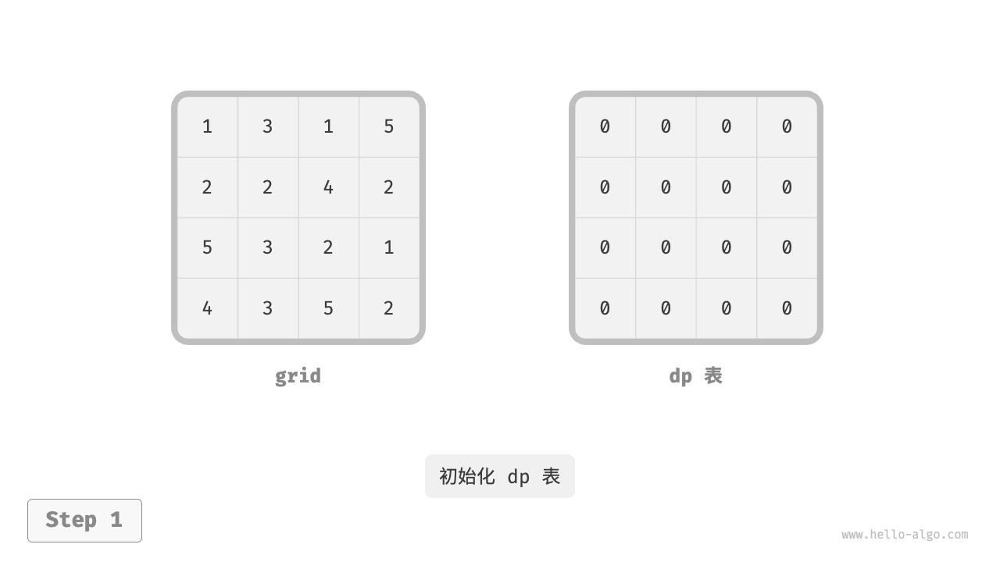{ class="animation-figure" }

=== "<2>"
    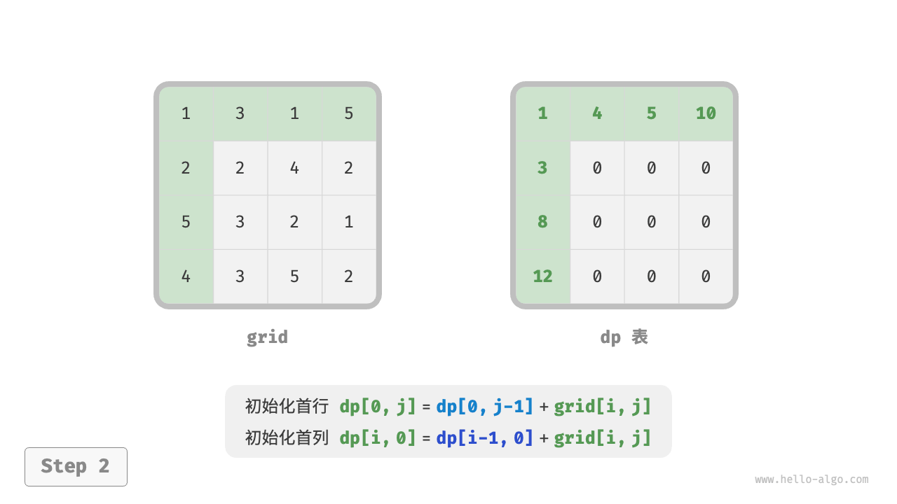{ class="animation-figure" }

=== "<3>"
    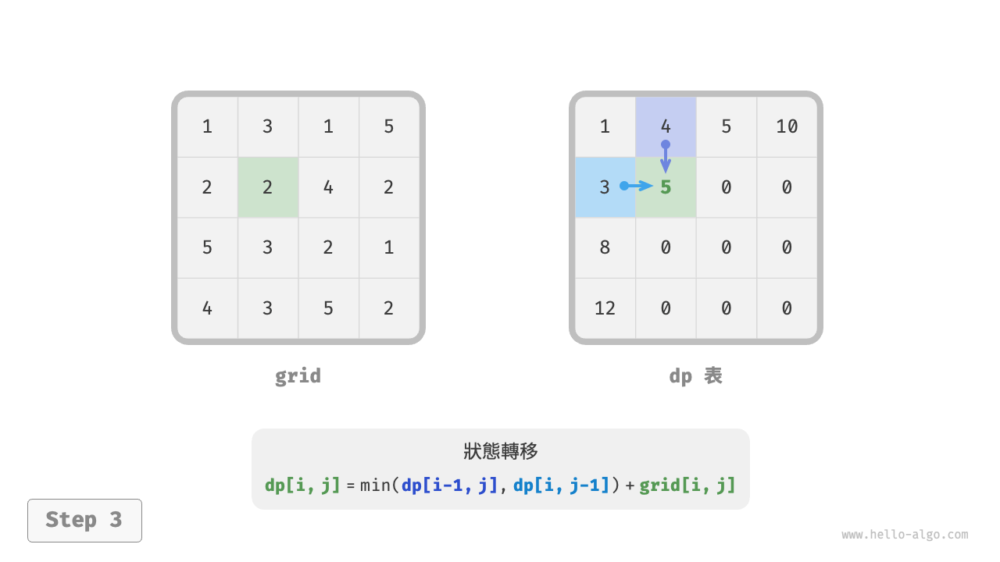{ class="animation-figure" }

=== "<4>"
    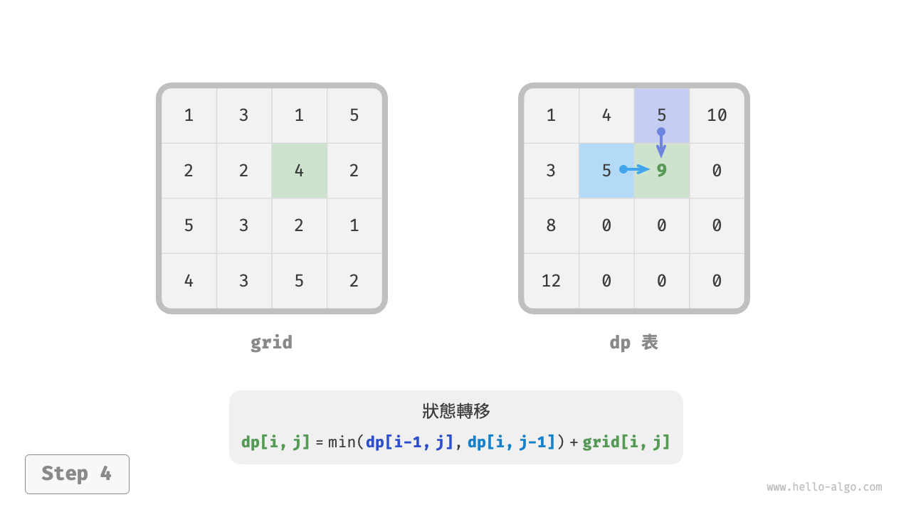{ class="animation-figure" }

=== "<5>"
    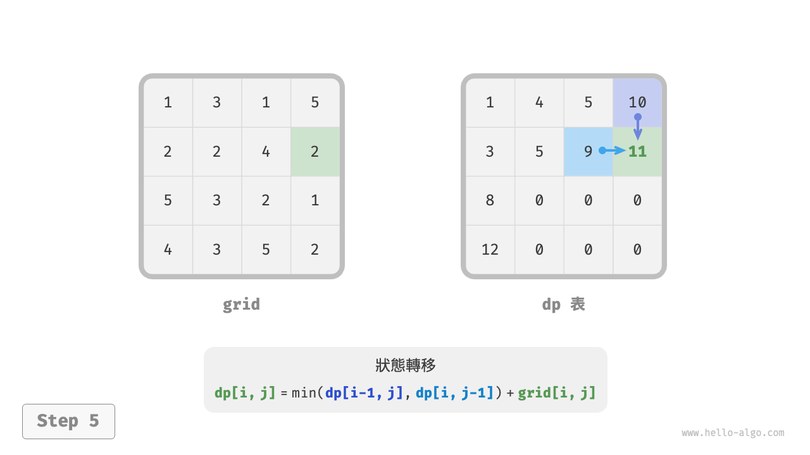{ class="animation-figure" }

=== "<6>"
    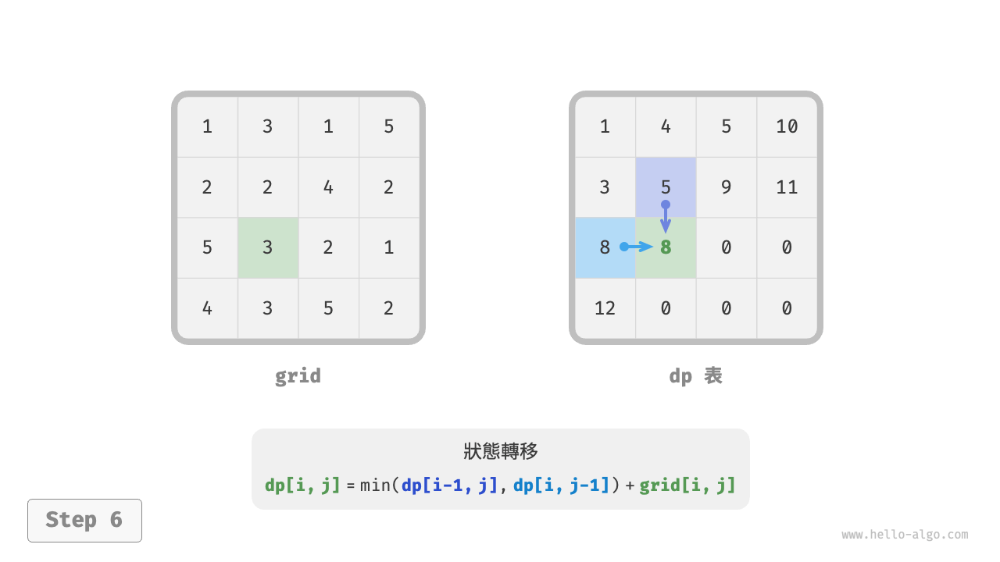{ class="animation-figure" }

=== "<7>"
    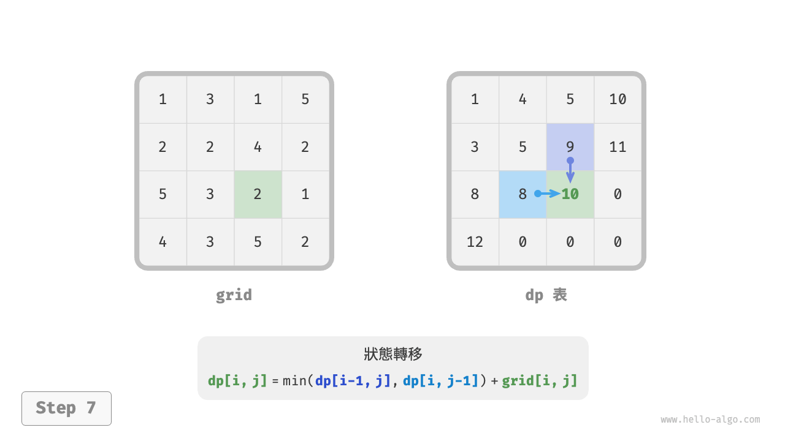{ class="animation-figure" }

=== "<8>"
    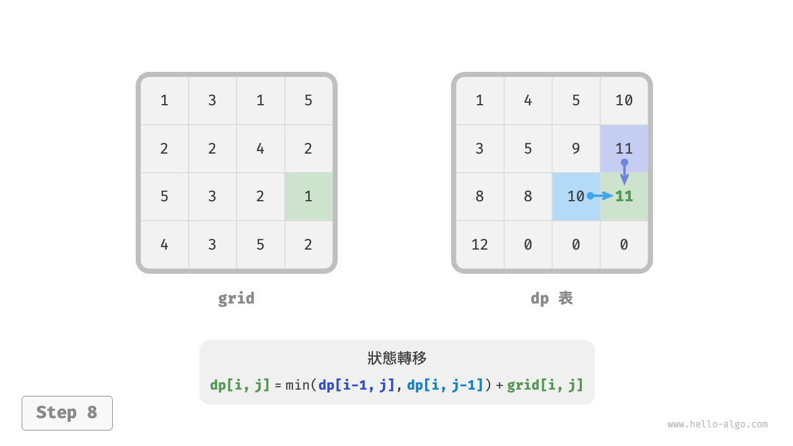{ class="animation-figure" }

=== "<9>"
    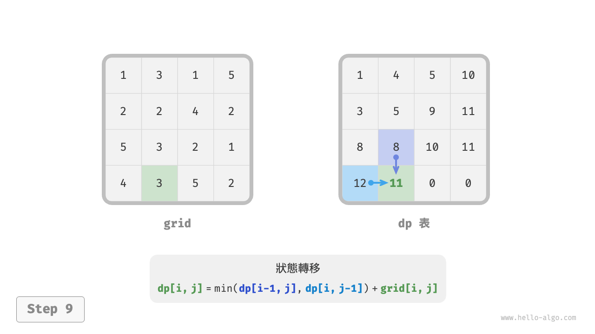{ class="animation-figure" }

=== "<10>"
    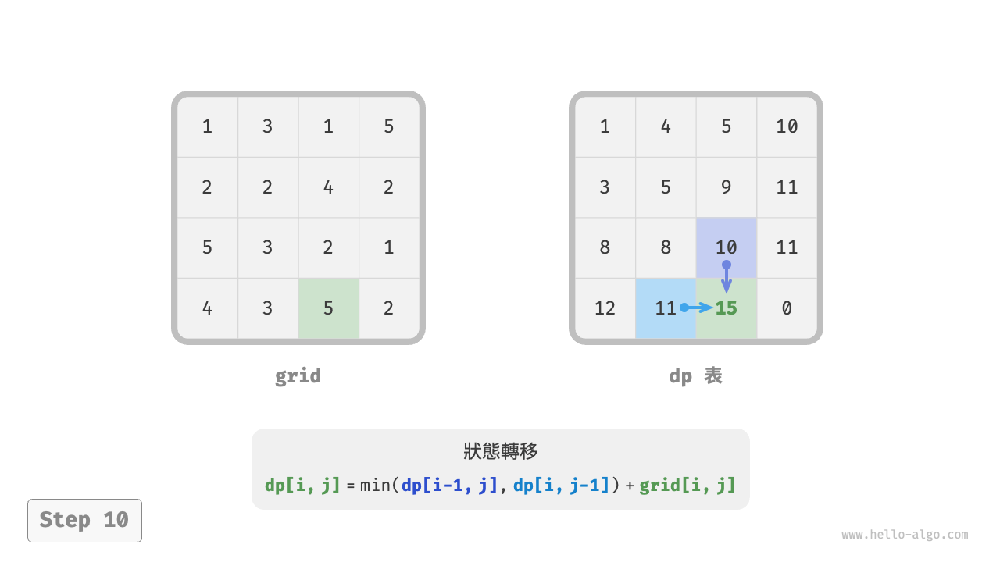{ class="animation-figure" }

=== "<11>"
    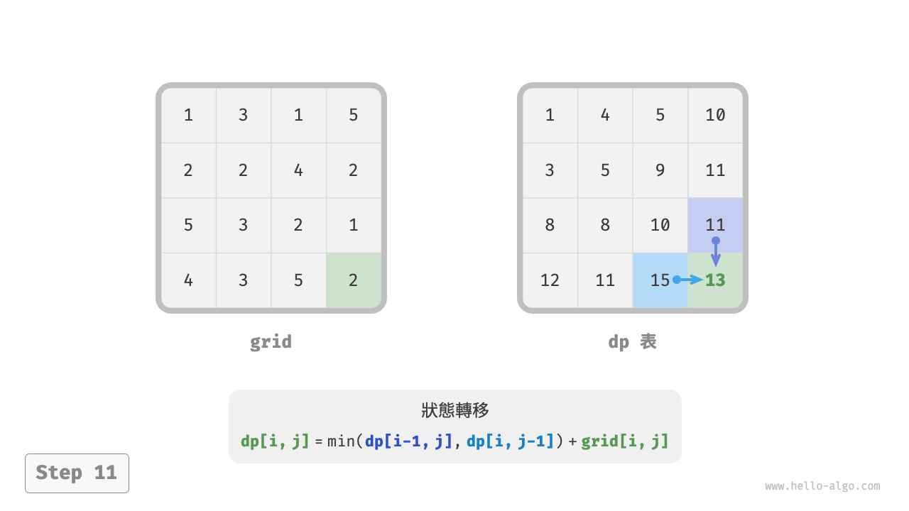{ class="animation-figure" }

=== "<12>"
    { class="animation-figure" }

<p align="center"> 圖 14-16 &nbsp; 最小路徑和的動態規劃過程 </p>

### 4. &nbsp; 空間最佳化

由於每個格子只與其左邊和上邊的格子有關，因此我們可以只用一個單行陣列來實現 $dp$ 表。

請注意，因為陣列 `dp` 只能表示一行的狀態，所以我們無法提前初始化首列狀態，而是在走訪每行時更新它：

=== "Python"

    ```python title="min_path_sum.py"
    def min_path_sum_dp_comp(grid: list[list[int]]) -> int:
        """最小路徑和：空間最佳化後的動態規劃"""
        n, m = len(grid), len(grid[0])
        # 初始化 dp 表
        dp = [0] * m
        # 狀態轉移：首行
        dp[0] = grid[0][0]
        for j in range(1, m):
            dp[j] = dp[j - 1] + grid[0][j]
        # 狀態轉移：其餘行
        for i in range(1, n):
            # 狀態轉移：首列
            dp[0] = dp[0] + grid[i][0]
            # 狀態轉移：其餘列
            for j in range(1, m):
                dp[j] = min(dp[j - 1], dp[j]) + grid[i][j]
        return dp[m - 1]
    ```

=== "C++"

    ```cpp title="min_path_sum.cpp"
    /* 最小路徑和：空間最佳化後的動態規劃 */
    int minPathSumDPComp(vector<vector<int>> &grid) {
        int n = grid.size(), m = grid[0].size();
        // 初始化 dp 表
        vector<int> dp(m);
        // 狀態轉移：首行
        dp[0] = grid[0][0];
        for (int j = 1; j < m; j++) {
            dp[j] = dp[j - 1] + grid[0][j];
        }
        // 狀態轉移：其餘行
        for (int i = 1; i < n; i++) {
            // 狀態轉移：首列
            dp[0] = dp[0] + grid[i][0];
            // 狀態轉移：其餘列
            for (int j = 1; j < m; j++) {
                dp[j] = min(dp[j - 1], dp[j]) + grid[i][j];
            }
        }
        return dp[m - 1];
    }
    ```

=== "Java"

    ```java title="min_path_sum.java"
    /* 最小路徑和：空間最佳化後的動態規劃 */
    int minPathSumDPComp(int[][] grid) {
        int n = grid.length, m = grid[0].length;
        // 初始化 dp 表
        int[] dp = new int[m];
        // 狀態轉移：首行
        dp[0] = grid[0][0];
        for (int j = 1; j < m; j++) {
            dp[j] = dp[j - 1] + grid[0][j];
        }
        // 狀態轉移：其餘行
        for (int i = 1; i < n; i++) {
            // 狀態轉移：首列
            dp[0] = dp[0] + grid[i][0];
            // 狀態轉移：其餘列
            for (int j = 1; j < m; j++) {
                dp[j] = Math.min(dp[j - 1], dp[j]) + grid[i][j];
            }
        }
        return dp[m - 1];
    }
    ```

=== "C#"

    ```csharp title="min_path_sum.cs"
    /* 最小路徑和：空間最佳化後的動態規劃 */
    int MinPathSumDPComp(int[][] grid) {
        int n = grid.Length, m = grid[0].Length;
        // 初始化 dp 表
        int[] dp = new int[m];
        dp[0] = grid[0][0];
        // 狀態轉移：首行
        for (int j = 1; j < m; j++) {
            dp[j] = dp[j - 1] + grid[0][j];
        }
        // 狀態轉移：其餘行
        for (int i = 1; i < n; i++) {
            // 狀態轉移：首列
            dp[0] = dp[0] + grid[i][0];
            // 狀態轉移：其餘列
            for (int j = 1; j < m; j++) {
                dp[j] = Math.Min(dp[j - 1], dp[j]) + grid[i][j];
            }
        }
        return dp[m - 1];
    }
    ```

=== "Go"

    ```go title="min_path_sum.go"
    /* 最小路徑和：空間最佳化後的動態規劃 */
    func minPathSumDPComp(grid [][]int) int {
        n, m := len(grid), len(grid[0])
        // 初始化 dp 表
        dp := make([]int, m)
        // 狀態轉移：首行
        dp[0] = grid[0][0]
        for j := 1; j < m; j++ {
            dp[j] = dp[j-1] + grid[0][j]
        }
        // 狀態轉移：其餘行和列
        for i := 1; i < n; i++ {
            // 狀態轉移：首列
            dp[0] = dp[0] + grid[i][0]
            // 狀態轉移：其餘列
            for j := 1; j < m; j++ {
                dp[j] = int(math.Min(float64(dp[j-1]), float64(dp[j]))) + grid[i][j]
            }
        }
        return dp[m-1]
    }
    ```

=== "Swift"

    ```swift title="min_path_sum.swift"
    /* 最小路徑和：空間最佳化後的動態規劃 */
    func minPathSumDPComp(grid: [[Int]]) -> Int {
        let n = grid.count
        let m = grid[0].count
        // 初始化 dp 表
        var dp = Array(repeating: 0, count: m)
        // 狀態轉移：首行
        dp[0] = grid[0][0]
        for j in 1 ..< m {
            dp[j] = dp[j - 1] + grid[0][j]
        }
        // 狀態轉移：其餘行
        for i in 1 ..< n {
            // 狀態轉移：首列
            dp[0] = dp[0] + grid[i][0]
            // 狀態轉移：其餘列
            for j in 1 ..< m {
                dp[j] = min(dp[j - 1], dp[j]) + grid[i][j]
            }
        }
        return dp[m - 1]
    }
    ```

=== "JS"

    ```javascript title="min_path_sum.js"
    /* 最小路徑和：狀態壓縮後的動態規劃 */
    function minPathSumDPComp(grid) {
        const n = grid.length,
            m = grid[0].length;
        // 初始化 dp 表
        const dp = new Array(m);
        // 狀態轉移：首行
        dp[0] = grid[0][0];
        for (let j = 1; j < m; j++) {
            dp[j] = dp[j - 1] + grid[0][j];
        }
        // 狀態轉移：其餘行
        for (let i = 1; i < n; i++) {
            // 狀態轉移：首列
            dp[0] = dp[0] + grid[i][0];
            // 狀態轉移：其餘列
            for (let j = 1; j < m; j++) {
                dp[j] = Math.min(dp[j - 1], dp[j]) + grid[i][j];
            }
        }
        return dp[m - 1];
    }
    ```

=== "TS"

    ```typescript title="min_path_sum.ts"
    /* 最小路徑和：狀態壓縮後的動態規劃 */
    function minPathSumDPComp(grid: Array<Array<number>>): number {
        const n = grid.length,
            m = grid[0].length;
        // 初始化 dp 表
        const dp = new Array(m);
        // 狀態轉移：首行
        dp[0] = grid[0][0];
        for (let j = 1; j < m; j++) {
            dp[j] = dp[j - 1] + grid[0][j];
        }
        // 狀態轉移：其餘行
        for (let i = 1; i < n; i++) {
            // 狀態轉移：首列
            dp[0] = dp[0] + grid[i][0];
            // 狀態轉移：其餘列
            for (let j = 1; j < m; j++) {
                dp[j] = Math.min(dp[j - 1], dp[j]) + grid[i][j];
            }
        }
        return dp[m - 1];
    }
    ```

=== "Dart"

    ```dart title="min_path_sum.dart"
    /* 最小路徑和：空間最佳化後的動態規劃 */
    int minPathSumDPComp(List<List<int>> grid) {
      int n = grid.length, m = grid[0].length;
      // 初始化 dp 表
      List<int> dp = List.filled(m, 0);
      dp[0] = grid[0][0];
      for (int j = 1; j < m; j++) {
        dp[j] = dp[j - 1] + grid[0][j];
      }
      // 狀態轉移：其餘行
      for (int i = 1; i < n; i++) {
        // 狀態轉移：首列
        dp[0] = dp[0] + grid[i][0];
        // 狀態轉移：其餘列
        for (int j = 1; j < m; j++) {
          dp[j] = min(dp[j - 1], dp[j]) + grid[i][j];
        }
      }
      return dp[m - 1];
    }
    ```

=== "Rust"

    ```rust title="min_path_sum.rs"
    /* 最小路徑和：空間最佳化後的動態規劃 */
    fn min_path_sum_dp_comp(grid: &Vec<Vec<i32>>) -> i32 {
        let (n, m) = (grid.len(), grid[0].len());
        // 初始化 dp 表
        let mut dp = vec![0; m];
        // 狀態轉移：首行
        dp[0] = grid[0][0];
        for j in 1..m {
            dp[j] = dp[j - 1] + grid[0][j];
        }
        // 狀態轉移：其餘行
        for i in 1..n {
            // 狀態轉移：首列
            dp[0] = dp[0] + grid[i][0];
            // 狀態轉移：其餘列
            for j in 1..m {
                dp[j] = std::cmp::min(dp[j - 1], dp[j]) + grid[i][j];
            }
        }
        dp[m - 1]
    }
    ```

=== "C"

    ```c title="min_path_sum.c"
    /* 最小路徑和：空間最佳化後的動態規劃 */
    int minPathSumDPComp(int grid[MAX_SIZE][MAX_SIZE], int n, int m) {
        // 初始化 dp 表
        int *dp = calloc(m, sizeof(int));
        // 狀態轉移：首行
        dp[0] = grid[0][0];
        for (int j = 1; j < m; j++) {
            dp[j] = dp[j - 1] + grid[0][j];
        }
        // 狀態轉移：其餘行
        for (int i = 1; i < n; i++) {
            // 狀態轉移：首列
            dp[0] = dp[0] + grid[i][0];
            // 狀態轉移：其餘列
            for (int j = 1; j < m; j++) {
                dp[j] = myMin(dp[j - 1], dp[j]) + grid[i][j];
            }
        }
        int res = dp[m - 1];
        // 釋放記憶體
        free(dp);
        return res;
    }
    ```

=== "Kotlin"

    ```kotlin title="min_path_sum.kt"
    /* 最小路徑和：空間最佳化後的動態規劃 */
    fun minPathSumDPComp(grid: Array<Array<Int>>): Int {
        val n = grid.size
        val m = grid[0].size
        // 初始化 dp 表
        val dp = IntArray(m)
        // 狀態轉移：首行
        dp[0] = grid[0][0]
        for (j in 1..<m) {
            dp[j] = dp[j - 1] + grid[0][j]
        }
        // 狀態轉移：其餘行
        for (i in 1..<n) {
            // 狀態轉移：首列
            dp[0] = dp[0] + grid[i][0]
            // 狀態轉移：其餘列
            for (j in 1..<m) {
                dp[j] = (min(dp[j - 1].toDouble(), dp[j].toDouble()) + grid[i][j]).toInt()
            }
        }
        return dp[m - 1]
    }
    ```

=== "Ruby"

    ```ruby title="min_path_sum.rb"
    [class]{}-[func]{min_path_sum_dp_comp}
    ```

=== "Zig"

    ```zig title="min_path_sum.zig"
    // 最小路徑和：空間最佳化後的動態規劃
    fn minPathSumDPComp(comptime grid: anytype) i32 {
        comptime var n = grid.len;
        comptime var m = grid[0].len;
        // 初始化 dp 表
        var dp = [_]i32{0} ** m;
        // 狀態轉移：首行
        dp[0] = grid[0][0];
        for (1..m) |j| {
            dp[j] = dp[j - 1] + grid[0][j];
        }
        // 狀態轉移：其餘行
        for (1..n) |i| {
            // 狀態轉移：首列
            dp[0] = dp[0] + grid[i][0];
            for (1..m) |j| {
                dp[j] = @min(dp[j - 1], dp[j]) + grid[i][j];
            }
        }
        return dp[m - 1];
    }
    ```

??? pythontutor "視覺化執行"

    <div style="height: 549px; width: 100%;"><iframe class="pythontutor-iframe" src="https://pythontutor.com/iframe-embed.html#code=from%20math%20import%20inf%0A%0Adef%20min_path_sum_dp_comp%28grid%3A%20list%5Blist%5Bint%5D%5D%29%20-%3E%20int%3A%0A%20%20%20%20%22%22%22%E6%9C%80%E5%B0%8F%E8%B7%AF%E5%BE%84%E5%92%8C%EF%BC%9A%E7%A9%BA%E9%97%B4%E4%BC%98%E5%8C%96%E5%90%8E%E7%9A%84%E5%8A%A8%E6%80%81%E8%A7%84%E5%88%92%22%22%22%0A%20%20%20%20n,%20m%20%3D%20len%28grid%29,%20len%28grid%5B0%5D%29%0A%20%20%20%20%23%20%E5%88%9D%E5%A7%8B%E5%8C%96%20dp%20%E8%A1%A8%0A%20%20%20%20dp%20%3D%20%5B0%5D%20*%20m%0A%20%20%20%20%23%20%E7%8A%B6%E6%80%81%E8%BD%AC%E7%A7%BB%EF%BC%9A%E9%A6%96%E8%A1%8C%0A%20%20%20%20dp%5B0%5D%20%3D%20grid%5B0%5D%5B0%5D%0A%20%20%20%20for%20j%20in%20range%281,%20m%29%3A%0A%20%20%20%20%20%20%20%20dp%5Bj%5D%20%3D%20dp%5Bj%20-%201%5D%20%2B%20grid%5B0%5D%5Bj%5D%0A%20%20%20%20%23%20%E7%8A%B6%E6%80%81%E8%BD%AC%E7%A7%BB%EF%BC%9A%E5%85%B6%E4%BD%99%E8%A1%8C%0A%20%20%20%20for%20i%20in%20range%281,%20n%29%3A%0A%20%20%20%20%20%20%20%20%23%20%E7%8A%B6%E6%80%81%E8%BD%AC%E7%A7%BB%EF%BC%9A%E9%A6%96%E5%88%97%0A%20%20%20%20%20%20%20%20dp%5B0%5D%20%3D%20dp%5B0%5D%20%2B%20grid%5Bi%5D%5B0%5D%0A%20%20%20%20%20%20%20%20%23%20%E7%8A%B6%E6%80%81%E8%BD%AC%E7%A7%BB%EF%BC%9A%E5%85%B6%E4%BD%99%E5%88%97%0A%20%20%20%20%20%20%20%20for%20j%20in%20range%281,%20m%29%3A%0A%20%20%20%20%20%20%20%20%20%20%20%20dp%5Bj%5D%20%3D%20min%28dp%5Bj%20-%201%5D,%20dp%5Bj%5D%29%20%2B%20grid%5Bi%5D%5Bj%5D%0A%20%20%20%20return%20dp%5Bm%20-%201%5D%0A%0A%0A%22%22%22Driver%20Code%22%22%22%0Aif%20__name__%20%3D%3D%20%22__main__%22%3A%0A%20%20%20%20grid%20%3D%20%5B%5B1,%203,%201,%205%5D,%20%5B2,%202,%204,%202%5D,%20%5B5,%203,%202,%201%5D,%20%5B4,%203,%205,%202%5D%5D%0A%20%20%20%20n,%20m%20%3D%20len%28grid%29,%20len%28grid%5B0%5D%29%0A%0A%20%20%20%20%23%20%E7%A9%BA%E9%97%B4%E4%BC%98%E5%8C%96%E5%90%8E%E7%9A%84%E5%8A%A8%E6%80%81%E8%A7%84%E5%88%92%0A%20%20%20%20res%20%3D%20min_path_sum_dp_comp%28grid%29%0A%20%20%20%20print%28f%22%E4%BB%8E%E5%B7%A6%E4%B8%8A%E8%A7%92%E5%88%B0%E5%8F%B3%E4%B8%8B%E8%A7%92%E7%9A%84%E5%81%9A%E5%B0%8F%E8%B7%AF%E5%BE%84%E5%92%8C%E4%B8%BA%20%7Bres%7D%22%29&codeDivHeight=472&codeDivWidth=350&cumulative=false&curInstr=6&heapPrimitives=nevernest&origin=opt-frontend.js&py=311&rawInputLstJSON=%5B%5D&textReferences=false"> </iframe></div>
    <div style="margin-top: 5px;"><a href="https://pythontutor.com/iframe-embed.html#code=from%20math%20import%20inf%0A%0Adef%20min_path_sum_dp_comp%28grid%3A%20list%5Blist%5Bint%5D%5D%29%20-%3E%20int%3A%0A%20%20%20%20%22%22%22%E6%9C%80%E5%B0%8F%E8%B7%AF%E5%BE%84%E5%92%8C%EF%BC%9A%E7%A9%BA%E9%97%B4%E4%BC%98%E5%8C%96%E5%90%8E%E7%9A%84%E5%8A%A8%E6%80%81%E8%A7%84%E5%88%92%22%22%22%0A%20%20%20%20n,%20m%20%3D%20len%28grid%29,%20len%28grid%5B0%5D%29%0A%20%20%20%20%23%20%E5%88%9D%E5%A7%8B%E5%8C%96%20dp%20%E8%A1%A8%0A%20%20%20%20dp%20%3D%20%5B0%5D%20*%20m%0A%20%20%20%20%23%20%E7%8A%B6%E6%80%81%E8%BD%AC%E7%A7%BB%EF%BC%9A%E9%A6%96%E8%A1%8C%0A%20%20%20%20dp%5B0%5D%20%3D%20grid%5B0%5D%5B0%5D%0A%20%20%20%20for%20j%20in%20range%281,%20m%29%3A%0A%20%20%20%20%20%20%20%20dp%5Bj%5D%20%3D%20dp%5Bj%20-%201%5D%20%2B%20grid%5B0%5D%5Bj%5D%0A%20%20%20%20%23%20%E7%8A%B6%E6%80%81%E8%BD%AC%E7%A7%BB%EF%BC%9A%E5%85%B6%E4%BD%99%E8%A1%8C%0A%20%20%20%20for%20i%20in%20range%281,%20n%29%3A%0A%20%20%20%20%20%20%20%20%23%20%E7%8A%B6%E6%80%81%E8%BD%AC%E7%A7%BB%EF%BC%9A%E9%A6%96%E5%88%97%0A%20%20%20%20%20%20%20%20dp%5B0%5D%20%3D%20dp%5B0%5D%20%2B%20grid%5Bi%5D%5B0%5D%0A%20%20%20%20%20%20%20%20%23%20%E7%8A%B6%E6%80%81%E8%BD%AC%E7%A7%BB%EF%BC%9A%E5%85%B6%E4%BD%99%E5%88%97%0A%20%20%20%20%20%20%20%20for%20j%20in%20range%281,%20m%29%3A%0A%20%20%20%20%20%20%20%20%20%20%20%20dp%5Bj%5D%20%3D%20min%28dp%5Bj%20-%201%5D,%20dp%5Bj%5D%29%20%2B%20grid%5Bi%5D%5Bj%5D%0A%20%20%20%20return%20dp%5Bm%20-%201%5D%0A%0A%0A%22%22%22Driver%20Code%22%22%22%0Aif%20__name__%20%3D%3D%20%22__main__%22%3A%0A%20%20%20%20grid%20%3D%20%5B%5B1,%203,%201,%205%5D,%20%5B2,%202,%204,%202%5D,%20%5B5,%203,%202,%201%5D,%20%5B4,%203,%205,%202%5D%5D%0A%20%20%20%20n,%20m%20%3D%20len%28grid%29,%20len%28grid%5B0%5D%29%0A%0A%20%20%20%20%23%20%E7%A9%BA%E9%97%B4%E4%BC%98%E5%8C%96%E5%90%8E%E7%9A%84%E5%8A%A8%E6%80%81%E8%A7%84%E5%88%92%0A%20%20%20%20res%20%3D%20min_path_sum_dp_comp%28grid%29%0A%20%20%20%20print%28f%22%E4%BB%8E%E5%B7%A6%E4%B8%8A%E8%A7%92%E5%88%B0%E5%8F%B3%E4%B8%8B%E8%A7%92%E7%9A%84%E5%81%9A%E5%B0%8F%E8%B7%AF%E5%BE%84%E5%92%8C%E4%B8%BA%20%7Bres%7D%22%29&codeDivHeight=800&codeDivWidth=600&cumulative=false&curInstr=6&heapPrimitives=nevernest&origin=opt-frontend.js&py=311&rawInputLstJSON=%5B%5D&textReferences=false" target="_blank" rel="noopener noreferrer">全螢幕觀看 ></a></div>
