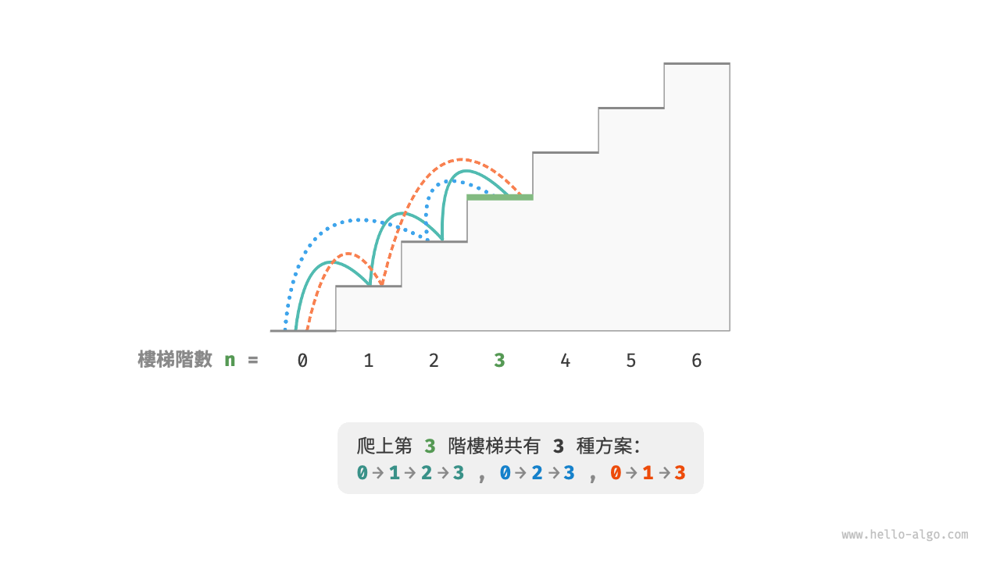
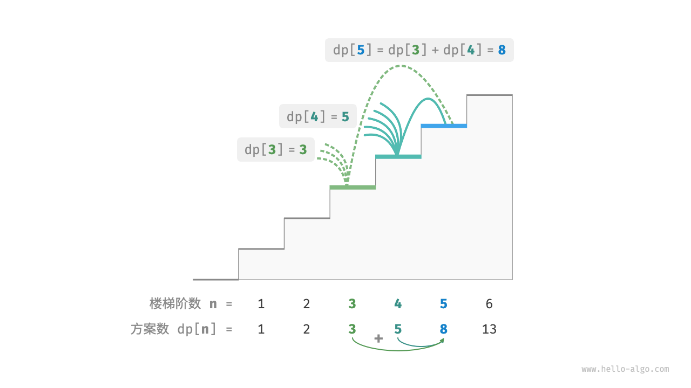
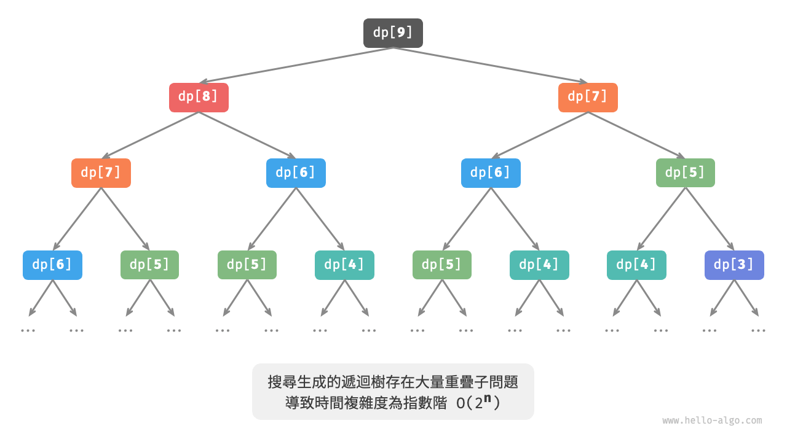
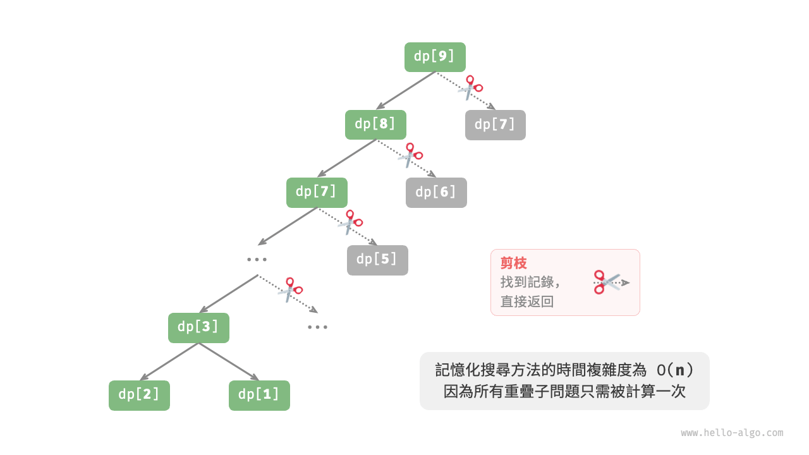

# 初探動態規劃

<u>動態規劃（dynamic programming）</u>是一個重要的演算法範式，它將一個問題分解為一系列更小的子問題，並透過儲存子問題的解來避免重複計算，從而大幅提升時間效率。

在本節中，我們從一個經典例題入手，先給出它的暴力回溯解法，觀察其中包含的重疊子問題，再逐步導出更高效的動態規劃解法。

!!! question "爬樓梯"

    給定一個共有 $n$ 階的樓梯，你每步可以上 $1$ 階或者 $2$ 階，請問有多少種方案可以爬到樓頂？

如下圖所示，對於一個 $3$ 階樓梯，共有 $3$ 種方案可以爬到樓頂。



本題的目標是求解方案數量，**我們可以考慮透過回溯來窮舉所有可能性**。具體來說，將爬樓梯想象為一個多輪選擇的過程：從地面出發，每輪選擇上 $1$ 階或 $2$ 階，每當到達樓梯頂部時就將方案數量加 $1$ ，當越過樓梯頂部時就將其剪枝。程式碼如下所示：

```src
[file]{climbing_stairs_backtrack}-[class]{}-[func]{climbing_stairs_backtrack}
```

## 方法一：暴力搜尋

回溯演算法通常並不顯式地對問題進行拆解，而是將求解問題看作一系列決策步驟，透過試探和剪枝，搜尋所有可能的解。

我們可以嘗試從問題分解的角度分析這道題。設爬到第 $i$ 階共有 $dp[i]$ 種方案，那麼 $dp[i]$ 就是原問題，其子問題包括：

$$
dp[i-1], dp[i-2], \dots, dp[2], dp[1]
$$

由於每輪只能上 $1$ 階或 $2$ 階，因此當我們站在第 $i$ 階樓梯上時，上一輪只可能站在第 $i - 1$ 階或第 $i - 2$ 階上。換句話說，我們只能從第 $i -1$ 階或第 $i - 2$ 階邁向第 $i$ 階。

由此便可得出一個重要推論：**爬到第 $i - 1$ 階的方案數加上爬到第 $i - 2$ 階的方案數就等於爬到第 $i$ 階的方案數**。公式如下：

$$
dp[i] = dp[i-1] + dp[i-2]
$$

這意味著在爬樓梯問題中，各個子問題之間存在遞推關係，**原問題的解可以由子問題的解構建得來**。下圖展示了該遞推關係。



我們可以根據遞推公式得到暴力搜尋解法。以 $dp[n]$ 為起始點，**遞迴地將一個較大問題拆解為兩個較小問題的和**，直至到達最小子問題 $dp[1]$ 和 $dp[2]$ 時返回。其中，最小子問題的解是已知的，即 $dp[1] = 1$、$dp[2] = 2$ ，表示爬到第 $1$、$2$ 階分別有 $1$、$2$ 種方案。

觀察以下程式碼，它和標準回溯程式碼都屬於深度優先搜尋，但更加簡潔：

```src
[file]{climbing_stairs_dfs}-[class]{}-[func]{climbing_stairs_dfs}
```

下圖展示了暴力搜尋形成的遞迴樹。對於問題 $dp[n]$ ，其遞迴樹的深度為 $n$ ，時間複雜度為 $O(2^n)$ 。指數階屬於爆炸式增長，如果我們輸入一個比較大的 $n$ ，則會陷入漫長的等待之中。



觀察上圖，**指數階的時間複雜度是“重疊子問題”導致的**。例如 $dp[9]$ 被分解為 $dp[8]$ 和 $dp[7]$ ，$dp[8]$ 被分解為 $dp[7]$ 和 $dp[6]$ ，兩者都包含子問題 $dp[7]$ 。

以此類推，子問題中包含更小的重疊子問題，子子孫孫無窮盡也。絕大部分計算資源都浪費在這些重疊的子問題上。

## 方法二：記憶化搜尋

為了提升演算法效率，**我們希望所有的重疊子問題都只被計算一次**。為此，我們宣告一個陣列 `mem` 來記錄每個子問題的解，並在搜尋過程中將重疊子問題剪枝。

1. 當首次計算 $dp[i]$ 時，我們將其記錄至 `mem[i]` ，以便之後使用。
2. 當再次需要計算 $dp[i]$ 時，我們便可直接從 `mem[i]` 中獲取結果，從而避免重複計算該子問題。

程式碼如下所示：

```src
[file]{climbing_stairs_dfs_mem}-[class]{}-[func]{climbing_stairs_dfs_mem}
```

觀察下圖，**經過記憶化處理後，所有重疊子問題都只需計算一次，時間複雜度最佳化至 $O(n)$** ，這是一個巨大的飛躍。



## 方法三：動態規劃

**記憶化搜尋是一種“從頂至底”的方法**：我們從原問題（根節點）開始，遞迴地將較大子問題分解為較小子問題，直至解已知的最小子問題（葉節點）。之後，透過回溯逐層收集子問題的解，構建出原問題的解。

與之相反，**動態規劃是一種“從底至頂”的方法**：從最小子問題的解開始，迭代地構建更大子問題的解，直至得到原問題的解。

由於動態規劃不包含回溯過程，因此只需使用迴圈迭代實現，無須使用遞迴。在以下程式碼中，我們初始化一個陣列 `dp` 來儲存子問題的解，它起到了與記憶化搜尋中陣列 `mem` 相同的記錄作用：

```src
[file]{climbing_stairs_dp}-[class]{}-[func]{climbing_stairs_dp}
```

下圖模擬了以上程式碼的執行過程。


與回溯演算法一樣，動態規劃也使用“狀態”概念來表示問題求解的特定階段，每個狀態都對應一個子問題以及相應的區域性最優解。例如，爬樓梯問題的狀態定義為當前所在樓梯階數 $i$ 。

根據以上內容，我們可以總結出動態規劃的常用術語。

- 將陣列 `dp` 稱為 <u>dp 表</u>，$dp[i]$ 表示狀態 $i$ 對應子問題的解。
- 將最小子問題對應的狀態（第 $1$ 階和第 $2$ 階樓梯）稱為<u>初始狀態</u>。
- 將遞推公式 $dp[i] = dp[i-1] + dp[i-2]$ 稱為<u>狀態轉移方程</u>。

## 空間最佳化

細心的讀者可能發現了，**由於 $dp[i]$ 只與 $dp[i-1]$ 和 $dp[i-2]$ 有關，因此我們無須使用一個陣列 `dp` 來儲存所有子問題的解**，而只需兩個變數滾動前進即可。程式碼如下所示：

```src
[file]{climbing_stairs_dp}-[class]{}-[func]{climbing_stairs_dp_comp}
```

觀察以上程式碼，由於省去了陣列 `dp` 佔用的空間，因此空間複雜度從 $O(n)$ 降至 $O(1)$ 。

在動態規劃問題中，當前狀態往往僅與前面有限個狀態有關，這時我們可以只保留必要的狀態，透過“降維”來節省記憶體空間。**這種空間最佳化技巧被稱為“滾動變數”或“滾動陣列”**。
