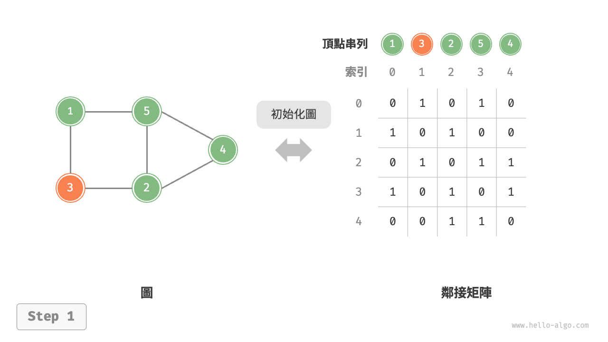
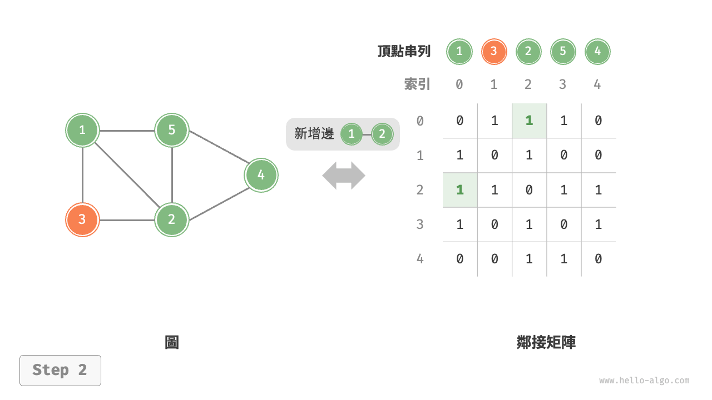
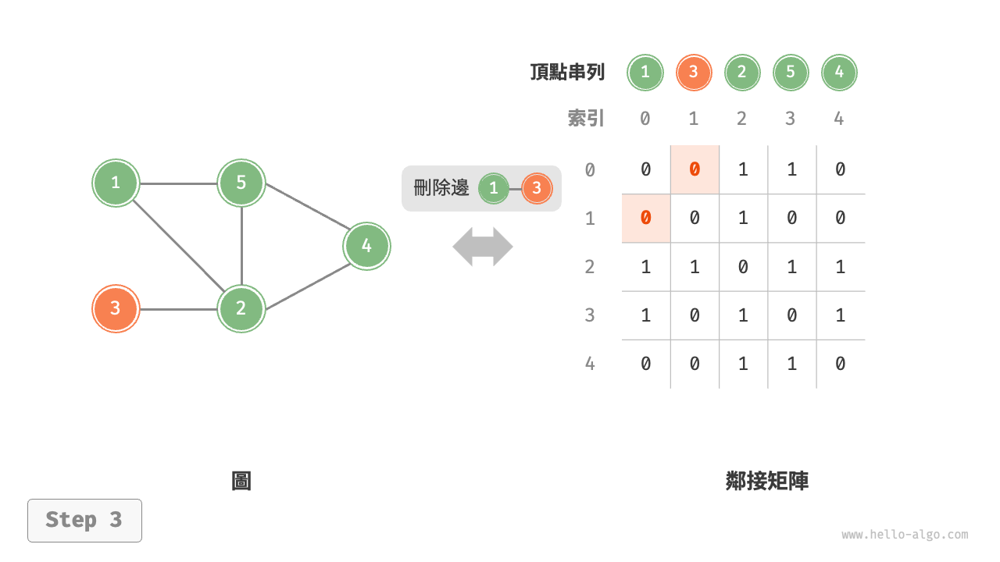
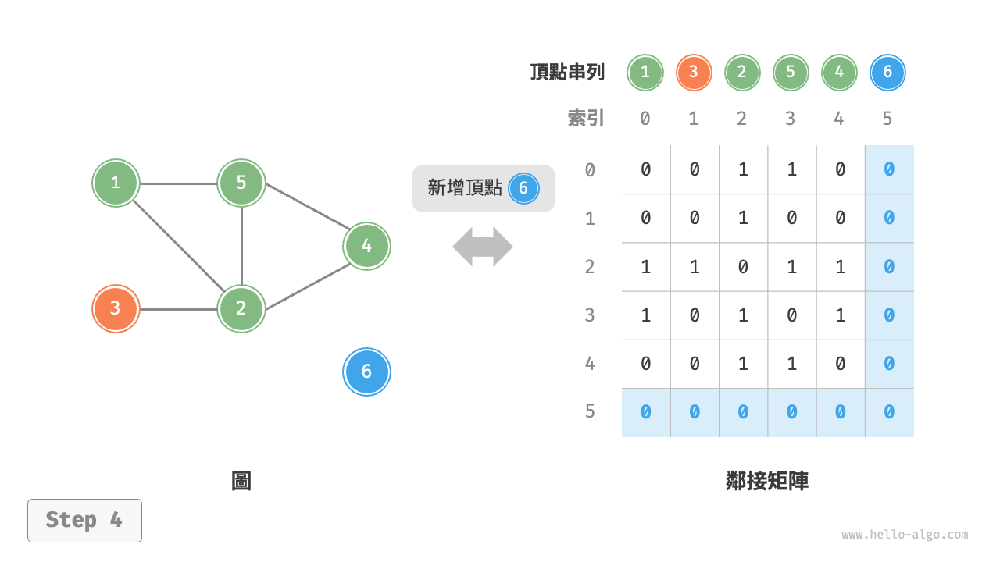
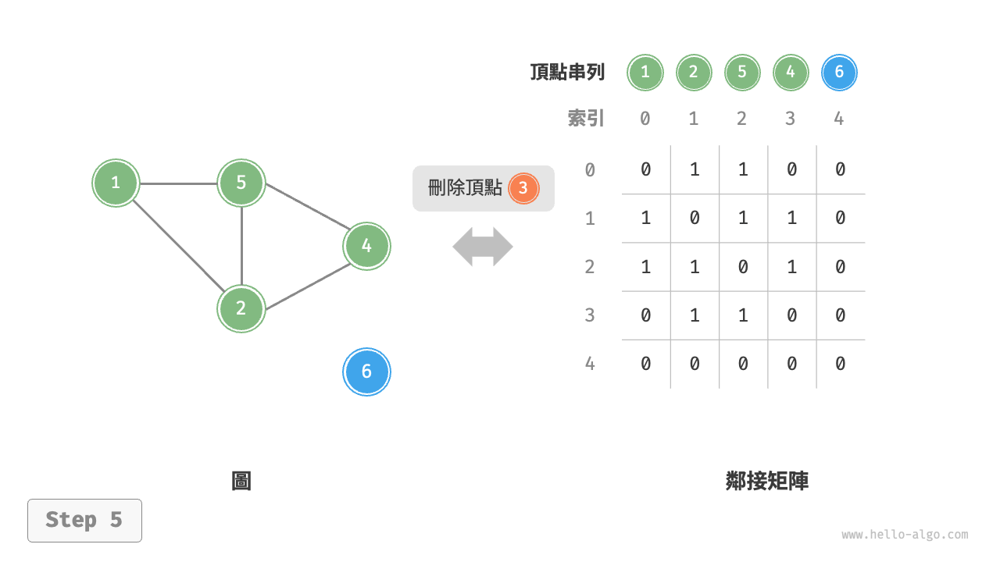
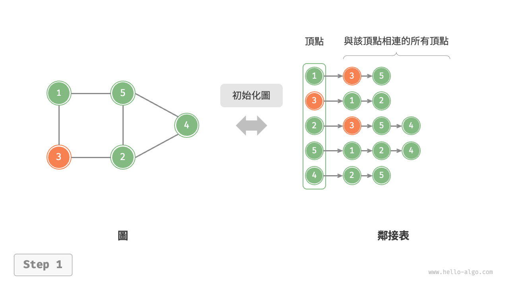
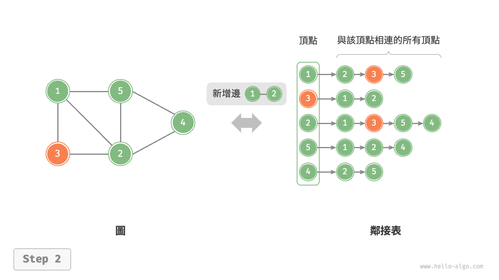
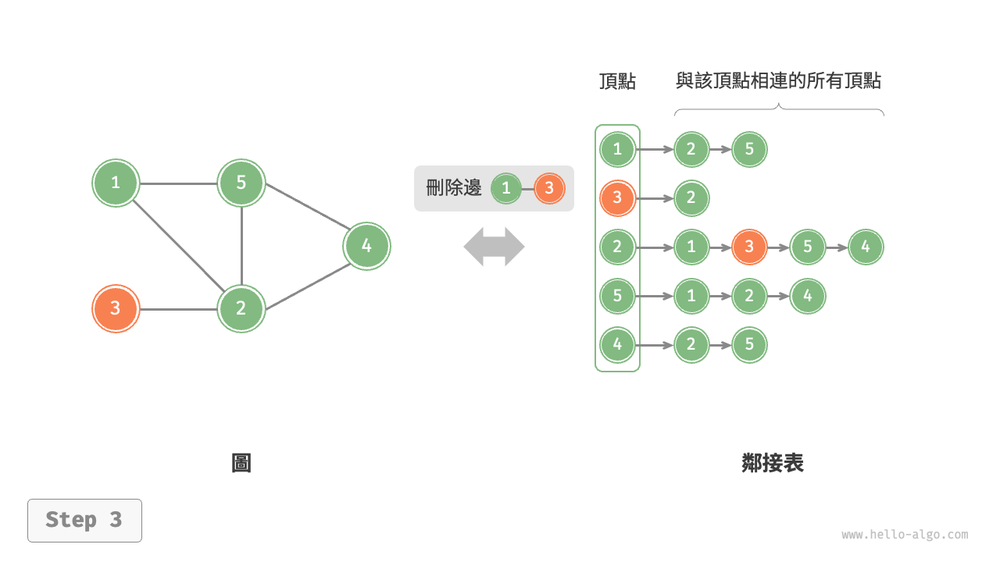
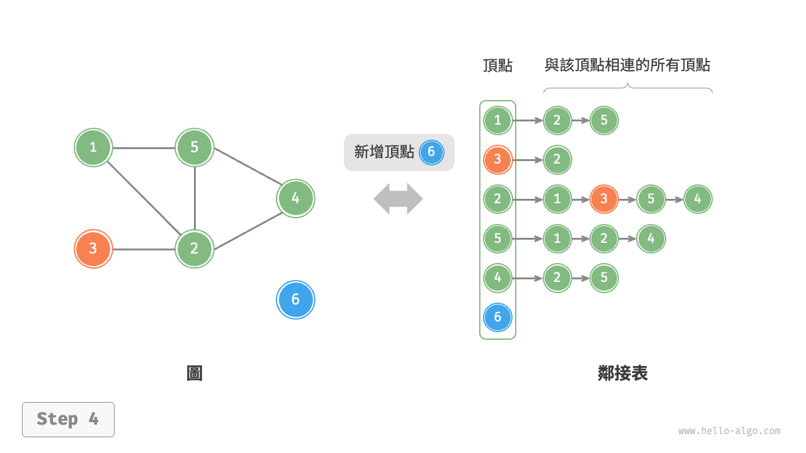
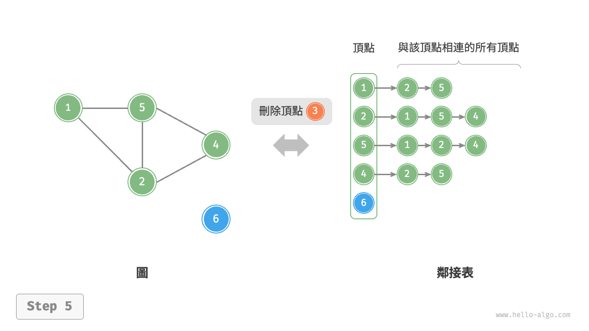

# 圖的基礎操作

圖的基礎操作可分為對“邊”的操作和對“頂點”的操作。在“鄰接矩陣”和“鄰接表”兩種表示方法下，實現方式有所不同。

## 基於鄰接矩陣的實現

給定一個頂點數量為 $n$ 的無向圖，則各種操作的實現方式如下圖所示。

- **新增或刪除邊**：直接在鄰接矩陣中修改指定的邊即可，使用 $O(1)$ 時間。而由於是無向圖，因此需要同時更新兩個方向的邊。
- **新增頂點**：在鄰接矩陣的尾部新增一行一列，並全部填 $0$ 即可，使用 $O(n)$ 時間。
- **刪除頂點**：在鄰接矩陣中刪除一行一列。當刪除首行首列時達到最差情況，需要將 $(n-1)^2$ 個元素“向左上移動”，從而使用 $O(n^2)$ 時間。
- **初始化**：傳入 $n$ 個頂點，初始化長度為 $n$ 的頂點串列 `vertices` ，使用 $O(n)$ 時間；初始化 $n \times n$ 大小的鄰接矩陣 `adjMat` ，使用 $O(n^2)$ 時間。

=== "初始化鄰接矩陣"
    

=== "新增邊"
    

=== "刪除邊"
    

=== "新增頂點"
    

=== "刪除頂點"
    

以下是基於鄰接矩陣表示圖的實現程式碼：

```src
[file]{graph_adjacency_matrix}-[class]{graph_adj_mat}-[func]{}
```

## 基於鄰接表的實現

設無向圖的頂點總數為 $n$、邊總數為 $m$ ，則可根據下圖所示的方法實現各種操作。

- **新增邊**：在頂點對應鏈結串列的末尾新增邊即可，使用 $O(1)$ 時間。因為是無向圖，所以需要同時新增兩個方向的邊。
- **刪除邊**：在頂點對應鏈結串列中查詢並刪除指定邊，使用 $O(m)$ 時間。在無向圖中，需要同時刪除兩個方向的邊。
- **新增頂點**：在鄰接表中新增一個鏈結串列，並將新增頂點作為鏈結串列頭節點，使用 $O(1)$ 時間。
- **刪除頂點**：需走訪整個鄰接表，刪除包含指定頂點的所有邊，使用 $O(n + m)$ 時間。
- **初始化**：在鄰接表中建立 $n$ 個頂點和 $2m$ 條邊，使用 $O(n + m)$ 時間。

=== "初始化鄰接表"
    

=== "新增邊"
    

=== "刪除邊"
    

=== "新增頂點"
    

=== "刪除頂點"
    

以下是鄰接表的程式碼實現。對比上圖，實際程式碼有以下不同。

- 為了方便新增與刪除頂點，以及簡化程式碼，我們使用串列（動態陣列）來代替鏈結串列。
- 使用雜湊表來儲存鄰接表，`key` 為頂點例項，`value` 為該頂點的鄰接頂點串列（鏈結串列）。

另外，我們在鄰接表中使用 `Vertex` 類別來表示頂點，這樣做的原因是：如果與鄰接矩陣一樣，用串列索引來區分不同頂點，那麼假設要刪除索引為 $i$ 的頂點，則需走訪整個鄰接表，將所有大於 $i$ 的索引全部減 $1$ ，效率很低。而如果每個頂點都是唯一的 `Vertex` 例項，刪除某一頂點之後就無須改動其他頂點了。

```src
[file]{graph_adjacency_list}-[class]{graph_adj_list}-[func]{}
```

## 效率對比

設圖中共有 $n$ 個頂點和 $m$ 條邊，下表對比了鄰接矩陣和鄰接表的時間效率和空間效率。

<p align="center"> 表 <id> &nbsp; 鄰接矩陣與鄰接表對比 </p>

|              | 鄰接矩陣 | 鄰接表（鏈結串列） | 鄰接表（雜湊表） |
| ------------ | -------- | -------------- | ---------------- |
| 判斷是否鄰接 | $O(1)$   | $O(m)$         | $O(1)$           |
| 新增邊       | $O(1)$   | $O(1)$         | $O(1)$           |
| 刪除邊       | $O(1)$   | $O(m)$         | $O(1)$           |
| 新增頂點     | $O(n)$   | $O(1)$         | $O(1)$           |
| 刪除頂點     | $O(n^2)$ | $O(n + m)$     | $O(n)$           |
| 記憶體空間佔用 | $O(n^2)$ | $O(n + m)$     | $O(n + m)$       |

觀察上表，似乎鄰接表（雜湊表）的時間效率與空間效率最優。但實際上，在鄰接矩陣中操作邊的效率更高，只需一次陣列訪問或賦值操作即可。綜合來看，鄰接矩陣體現了“以空間換時間”的原則，而鄰接表體現了“以時間換空間”的原則。
