# 9.3 &nbsp; 圖的走訪

樹代表的是“一對多”的關係，而圖則具有更高的自由度，可以表示任意的“多對多”關係。因此，我們可以把樹看作圖的一種特例。顯然，**樹的走訪操作也是圖的走訪操作的一種特例**。

圖和樹都需要應用搜索演算法來實現走訪操作。圖的走訪方式也可分為兩種：<u>廣度優先走訪</u>和<u>深度優先走訪</u>。

## 9.3.1 &nbsp; 廣度優先走訪

**廣度優先走訪是一種由近及遠的走訪方式，從某個節點出發，始終優先訪問距離最近的頂點，並一層層向外擴張**。如圖 9-9 所示，從左上角頂點出發，首先走訪該頂點的所有鄰接頂點，然後走訪下一個頂點的所有鄰接頂點，以此類推，直至所有頂點訪問完畢。

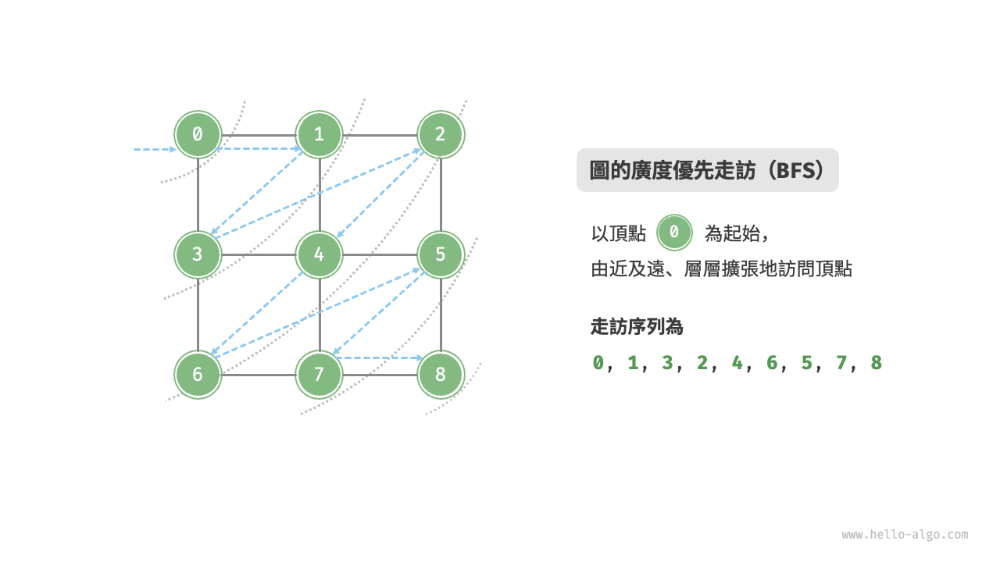{ class="animation-figure" }

<p align="center"> 圖 9-9 &nbsp; 圖的廣度優先走訪 </p>

### 1. &nbsp; 演算法實現

BFS 通常藉助佇列來實現，程式碼如下所示。佇列具有“先入先出”的性質，這與 BFS 的“由近及遠”的思想異曲同工。

1. 將走訪起始頂點 `startVet` 加入列列，並開啟迴圈。
2. 在迴圈的每輪迭代中，彈出佇列首頂點並記錄訪問，然後將該頂點的所有鄰接頂點加入到佇列尾部。
3. 迴圈步驟 `2.` ，直到所有頂點被訪問完畢後結束。

為了防止重複走訪頂點，我們需要藉助一個雜湊集合 `visited` 來記錄哪些節點已被訪問。

!!! tip

    雜湊集合可以看作一個只儲存 `key` 而不儲存 `value` 的雜湊表，它可以在 $O(1)$ 時間複雜度下進行 `key` 的增刪查改操作。根據 `key` 的唯一性，雜湊集合通常用於資料去重等場景。

=== "Python"

    ```python title="graph_bfs.py"
    def graph_bfs(graph: GraphAdjList, start_vet: Vertex) -> list[Vertex]:
        """廣度優先走訪"""
        # 使用鄰接表來表示圖，以便獲取指定頂點的所有鄰接頂點
        # 頂點走訪序列
        res = []
        # 雜湊集合，用於記錄已被訪問過的頂點
        visited = set[Vertex]([start_vet])
        # 佇列用於實現 BFS
        que = deque[Vertex]([start_vet])
        # 以頂點 vet 為起點，迴圈直至訪問完所有頂點
        while len(que) > 0:
            vet = que.popleft()  # 佇列首頂點出隊
            res.append(vet)  # 記錄訪問頂點
            # 走訪該頂點的所有鄰接頂點
            for adj_vet in graph.adj_list[vet]:
                if adj_vet in visited:
                    continue  # 跳過已被訪問的頂點
                que.append(adj_vet)  # 只入列未訪問的頂點
                visited.add(adj_vet)  # 標記該頂點已被訪問
        # 返回頂點走訪序列
        return res
    ```

=== "C++"

    ```cpp title="graph_bfs.cpp"
    /* 廣度優先走訪 */
    // 使用鄰接表來表示圖，以便獲取指定頂點的所有鄰接頂點
    vector<Vertex *> graphBFS(GraphAdjList &graph, Vertex *startVet) {
        // 頂點走訪序列
        vector<Vertex *> res;
        // 雜湊集合，用於記錄已被訪問過的頂點
        unordered_set<Vertex *> visited = {startVet};
        // 佇列用於實現 BFS
        queue<Vertex *> que;
        que.push(startVet);
        // 以頂點 vet 為起點，迴圈直至訪問完所有頂點
        while (!que.empty()) {
            Vertex *vet = que.front();
            que.pop();          // 佇列首頂點出隊
            res.push_back(vet); // 記錄訪問頂點
            // 走訪該頂點的所有鄰接頂點
            for (auto adjVet : graph.adjList[vet]) {
                if (visited.count(adjVet))
                    continue;            // 跳過已被訪問的頂點
                que.push(adjVet);        // 只入列未訪問的頂點
                visited.emplace(adjVet); // 標記該頂點已被訪問
            }
        }
        // 返回頂點走訪序列
        return res;
    }
    ```

=== "Java"

    ```java title="graph_bfs.java"
    /* 廣度優先走訪 */
    // 使用鄰接表來表示圖，以便獲取指定頂點的所有鄰接頂點
    List<Vertex> graphBFS(GraphAdjList graph, Vertex startVet) {
        // 頂點走訪序列
        List<Vertex> res = new ArrayList<>();
        // 雜湊集合，用於記錄已被訪問過的頂點
        Set<Vertex> visited = new HashSet<>();
        visited.add(startVet);
        // 佇列用於實現 BFS
        Queue<Vertex> que = new LinkedList<>();
        que.offer(startVet);
        // 以頂點 vet 為起點，迴圈直至訪問完所有頂點
        while (!que.isEmpty()) {
            Vertex vet = que.poll(); // 佇列首頂點出隊
            res.add(vet);            // 記錄訪問頂點
            // 走訪該頂點的所有鄰接頂點
            for (Vertex adjVet : graph.adjList.get(vet)) {
                if (visited.contains(adjVet))
                    continue;        // 跳過已被訪問的頂點
                que.offer(adjVet);   // 只入列未訪問的頂點
                visited.add(adjVet); // 標記該頂點已被訪問
            }
        }
        // 返回頂點走訪序列
        return res;
    }
    ```

=== "C#"

    ```csharp title="graph_bfs.cs"
    /* 廣度優先走訪 */
    // 使用鄰接表來表示圖，以便獲取指定頂點的所有鄰接頂點
    List<Vertex> GraphBFS(GraphAdjList graph, Vertex startVet) {
        // 頂點走訪序列
        List<Vertex> res = [];
        // 雜湊集合，用於記錄已被訪問過的頂點
        HashSet<Vertex> visited = [startVet];
        // 佇列用於實現 BFS
        Queue<Vertex> que = new();
        que.Enqueue(startVet);
        // 以頂點 vet 為起點，迴圈直至訪問完所有頂點
        while (que.Count > 0) {
            Vertex vet = que.Dequeue(); // 佇列首頂點出隊
            res.Add(vet);               // 記錄訪問頂點
            foreach (Vertex adjVet in graph.adjList[vet]) {
                if (visited.Contains(adjVet)) {
                    continue;          // 跳過已被訪問的頂點
                }
                que.Enqueue(adjVet);   // 只入列未訪問的頂點
                visited.Add(adjVet);   // 標記該頂點已被訪問
            }
        }

        // 返回頂點走訪序列
        return res;
    }
    ```

=== "Go"

    ```go title="graph_bfs.go"
    /* 廣度優先走訪 */
    // 使用鄰接表來表示圖，以便獲取指定頂點的所有鄰接頂點
    func graphBFS(g *graphAdjList, startVet Vertex) []Vertex {
        // 頂點走訪序列
        res := make([]Vertex, 0)
        // 雜湊集合，用於記錄已被訪問過的頂點
        visited := make(map[Vertex]struct{})
        visited[startVet] = struct{}{}
        // 佇列用於實現 BFS, 使用切片模擬佇列
        queue := make([]Vertex, 0)
        queue = append(queue, startVet)
        // 以頂點 vet 為起點，迴圈直至訪問完所有頂點
        for len(queue) > 0 {
            // 佇列首頂點出隊
            vet := queue[0]
            queue = queue[1:]
            // 記錄訪問頂點
            res = append(res, vet)
            // 走訪該頂點的所有鄰接頂點
            for _, adjVet := range g.adjList[vet] {
                _, isExist := visited[adjVet]
                // 只入列未訪問的頂點
                if !isExist {
                    queue = append(queue, adjVet)
                    visited[adjVet] = struct{}{}
                }
            }
        }
        // 返回頂點走訪序列
        return res
    }
    ```

=== "Swift"

    ```swift title="graph_bfs.swift"
    /* 廣度優先走訪 */
    // 使用鄰接表來表示圖，以便獲取指定頂點的所有鄰接頂點
    func graphBFS(graph: GraphAdjList, startVet: Vertex) -> [Vertex] {
        // 頂點走訪序列
        var res: [Vertex] = []
        // 雜湊集合，用於記錄已被訪問過的頂點
        var visited: Set<Vertex> = [startVet]
        // 佇列用於實現 BFS
        var que: [Vertex] = [startVet]
        // 以頂點 vet 為起點，迴圈直至訪問完所有頂點
        while !que.isEmpty {
            let vet = que.removeFirst() // 佇列首頂點出隊
            res.append(vet) // 記錄訪問頂點
            // 走訪該頂點的所有鄰接頂點
            for adjVet in graph.adjList[vet] ?? [] {
                if visited.contains(adjVet) {
                    continue // 跳過已被訪問的頂點
                }
                que.append(adjVet) // 只入列未訪問的頂點
                visited.insert(adjVet) // 標記該頂點已被訪問
            }
        }
        // 返回頂點走訪序列
        return res
    }
    ```

=== "JS"

    ```javascript title="graph_bfs.js"
    /* 廣度優先走訪 */
    // 使用鄰接表來表示圖，以便獲取指定頂點的所有鄰接頂點
    function graphBFS(graph, startVet) {
        // 頂點走訪序列
        const res = [];
        // 雜湊集合，用於記錄已被訪問過的頂點
        const visited = new Set();
        visited.add(startVet);
        // 佇列用於實現 BFS
        const que = [startVet];
        // 以頂點 vet 為起點，迴圈直至訪問完所有頂點
        while (que.length) {
            const vet = que.shift(); // 佇列首頂點出隊
            res.push(vet); // 記錄訪問頂點
            // 走訪該頂點的所有鄰接頂點
            for (const adjVet of graph.adjList.get(vet) ?? []) {
                if (visited.has(adjVet)) {
                    continue; // 跳過已被訪問的頂點
                }
                que.push(adjVet); // 只入列未訪問的頂點
                visited.add(adjVet); // 標記該頂點已被訪問
            }
        }
        // 返回頂點走訪序列
        return res;
    }
    ```

=== "TS"

    ```typescript title="graph_bfs.ts"
    /* 廣度優先走訪 */
    // 使用鄰接表來表示圖，以便獲取指定頂點的所有鄰接頂點
    function graphBFS(graph: GraphAdjList, startVet: Vertex): Vertex[] {
        // 頂點走訪序列
        const res: Vertex[] = [];
        // 雜湊集合，用於記錄已被訪問過的頂點
        const visited: Set<Vertex> = new Set();
        visited.add(startVet);
        // 佇列用於實現 BFS
        const que = [startVet];
        // 以頂點 vet 為起點，迴圈直至訪問完所有頂點
        while (que.length) {
            const vet = que.shift(); // 佇列首頂點出隊
            res.push(vet); // 記錄訪問頂點
            // 走訪該頂點的所有鄰接頂點
            for (const adjVet of graph.adjList.get(vet) ?? []) {
                if (visited.has(adjVet)) {
                    continue; // 跳過已被訪問的頂點
                }
                que.push(adjVet); // 只入列未訪問
                visited.add(adjVet); // 標記該頂點已被訪問
            }
        }
        // 返回頂點走訪序列
        return res;
    }
    ```

=== "Dart"

    ```dart title="graph_bfs.dart"
    /* 廣度優先走訪 */
    List<Vertex> graphBFS(GraphAdjList graph, Vertex startVet) {
      // 使用鄰接表來表示圖，以便獲取指定頂點的所有鄰接頂點
      // 頂點走訪序列
      List<Vertex> res = [];
      // 雜湊集合，用於記錄已被訪問過的頂點
      Set<Vertex> visited = {};
      visited.add(startVet);
      // 佇列用於實現 BFS
      Queue<Vertex> que = Queue();
      que.add(startVet);
      // 以頂點 vet 為起點，迴圈直至訪問完所有頂點
      while (que.isNotEmpty) {
        Vertex vet = que.removeFirst(); // 佇列首頂點出隊
        res.add(vet); // 記錄訪問頂點
        // 走訪該頂點的所有鄰接頂點
        for (Vertex adjVet in graph.adjList[vet]!) {
          if (visited.contains(adjVet)) {
            continue; // 跳過已被訪問的頂點
          }
          que.add(adjVet); // 只入列未訪問的頂點
          visited.add(adjVet); // 標記該頂點已被訪問
        }
      }
      // 返回頂點走訪序列
      return res;
    }
    ```

=== "Rust"

    ```rust title="graph_bfs.rs"
    /* 廣度優先走訪 */
    // 使用鄰接表來表示圖，以便獲取指定頂點的所有鄰接頂點
    fn graph_bfs(graph: GraphAdjList, start_vet: Vertex) -> Vec<Vertex> {
        // 頂點走訪序列
        let mut res = vec![];
        // 雜湊集合，用於記錄已被訪問過的頂點
        let mut visited = HashSet::new();
        visited.insert(start_vet);
        // 佇列用於實現 BFS
        let mut que = VecDeque::new();
        que.push_back(start_vet);
        // 以頂點 vet 為起點，迴圈直至訪問完所有頂點
        while !que.is_empty() {
            let vet = que.pop_front().unwrap(); // 佇列首頂點出隊
            res.push(vet); // 記錄訪問頂點

            // 走訪該頂點的所有鄰接頂點
            if let Some(adj_vets) = graph.adj_list.get(&vet) {
                for &adj_vet in adj_vets {
                    if visited.contains(&adj_vet) {
                        continue; // 跳過已被訪問的頂點
                    }
                    que.push_back(adj_vet); // 只入列未訪問的頂點
                    visited.insert(adj_vet); // 標記該頂點已被訪問
                }
            }
        }
        // 返回頂點走訪序列
        res
    }
    ```

=== "C"

    ```c title="graph_bfs.c"
    /* 節點佇列結構體 */
    typedef struct {
        Vertex *vertices[MAX_SIZE];
        int front, rear, size;
    } Queue;

    /* 建構子 */
    Queue *newQueue() {
        Queue *q = (Queue *)malloc(sizeof(Queue));
        q->front = q->rear = q->size = 0;
        return q;
    }

    /* 判斷佇列是否為空 */
    int isEmpty(Queue *q) {
        return q->size == 0;
    }

    /* 入列操作 */
    void enqueue(Queue *q, Vertex *vet) {
        q->vertices[q->rear] = vet;
        q->rear = (q->rear + 1) % MAX_SIZE;
        q->size++;
    }

    /* 出列操作 */
    Vertex *dequeue(Queue *q) {
        Vertex *vet = q->vertices[q->front];
        q->front = (q->front + 1) % MAX_SIZE;
        q->size--;
        return vet;
    }

    /* 檢查頂點是否已被訪問 */
    int isVisited(Vertex **visited, int size, Vertex *vet) {
        // 走訪查詢節點，使用 O(n) 時間
        for (int i = 0; i < size; i++) {
            if (visited[i] == vet)
                return 1;
        }
        return 0;
    }

    /* 廣度優先走訪 */
    // 使用鄰接表來表示圖，以便獲取指定頂點的所有鄰接頂點
    void graphBFS(GraphAdjList *graph, Vertex *startVet, Vertex **res, int *resSize, Vertex **visited, int *visitedSize) {
        // 佇列用於實現 BFS
        Queue *queue = newQueue();
        enqueue(queue, startVet);
        visited[(*visitedSize)++] = startVet;
        // 以頂點 vet 為起點，迴圈直至訪問完所有頂點
        while (!isEmpty(queue)) {
            Vertex *vet = dequeue(queue); // 佇列首頂點出隊
            res[(*resSize)++] = vet;      // 記錄訪問頂點
            // 走訪該頂點的所有鄰接頂點
            AdjListNode *node = findNode(graph, vet);
            while (node != NULL) {
                // 跳過已被訪問的頂點
                if (!isVisited(visited, *visitedSize, node->vertex)) {
                    enqueue(queue, node->vertex);             // 只入列未訪問的頂點
                    visited[(*visitedSize)++] = node->vertex; // 標記該頂點已被訪問
                }
                node = node->next;
            }
        }
        // 釋放記憶體
        free(queue);
    }
    ```

=== "Kotlin"

    ```kotlin title="graph_bfs.kt"
    /* 廣度優先走訪 */
    // 使用鄰接表來表示圖，以便獲取指定頂點的所有鄰接頂點
    fun graphBFS(graph: GraphAdjList, startVet: Vertex): MutableList<Vertex?> {
        // 頂點走訪序列
        val res = mutableListOf<Vertex?>()
        // 雜湊集合，用於記錄已被訪問過的頂點
        val visited = HashSet<Vertex>()
        visited.add(startVet)
        // 佇列用於實現 BFS
        val que = LinkedList<Vertex>()
        que.offer(startVet)
        // 以頂點 vet 為起點，迴圈直至訪問完所有頂點
        while (!que.isEmpty()) {
            val vet = que.poll() // 佇列首頂點出隊
            res.add(vet)         // 記錄訪問頂點
            // 走訪該頂點的所有鄰接頂點
            for (adjVet in graph.adjList[vet]!!) {
                if (visited.contains(adjVet))
                    continue        // 跳過已被訪問的頂點
                que.offer(adjVet)   // 只入列未訪問的頂點
                visited.add(adjVet) // 標記該頂點已被訪問
            }
        }
        // 返回頂點走訪序列
        return res
    }
    ```

=== "Ruby"

    ```ruby title="graph_bfs.rb"
    ### 廣度優先走訪 ###
    def graph_bfs(graph, start_vet)
      # 使用鄰接表來表示圖，以便獲取指定頂點的所有鄰接頂點
      # 頂點走訪序列
      res = []
      # 雜湊集合，用於記錄已被訪問過的頂點
      visited = Set.new([start_vet])
      # 佇列用於實現 BFS
      que = [start_vet]
      # 以頂點 vet 為起點，迴圈直至訪問完所有頂點
      while que.length > 0
        vet = que.shift # 佇列首頂點出隊
        res << vet # 記錄訪問頂點
        # 走訪該頂點的所有鄰接頂點
        for adj_vet in graph.adj_list[vet]
          next if visited.include?(adj_vet) # 跳過已被訪問的頂點
          que << adj_vet # 只入列未訪問的頂點
          visited.add(adj_vet) # 標記該頂點已被訪問
        end
      end
      # 返回頂點走訪序列
      res
    end
    ```

=== "Zig"

    ```zig title="graph_bfs.zig"
    [class]{}-[func]{graphBFS}
    ```

??? pythontutor "視覺化執行"

    <div style="height: 549px; width: 100%;"><iframe class="pythontutor-iframe" src="https://pythontutor.com/iframe-embed.html#code=from%20collections%20import%20deque%0A%0Aclass%20Vertex%3A%0A%20%20%20%20%22%22%22%E9%A0%82%E9%BB%9E%E9%A1%9E%E5%88%A5%22%22%22%0A%20%20%20%20def%20__init__%28self%2C%20val%3A%20int%29%3A%0A%20%20%20%20%20%20%20%20self.val%20%3D%20val%0A%0Adef%20vals_to_vets%28vals%3A%20list%5Bint%5D%29%20-%3E%20list%5B%22Vertex%22%5D%3A%0A%20%20%20%20%22%22%22%E8%BC%B8%E5%85%A5%E5%80%BC%E4%B8%B2%E5%88%97%20vals%20%EF%BC%8C%E8%BF%94%E5%9B%9E%E9%A0%82%E9%BB%9E%E4%B8%B2%E5%88%97%20vets%22%22%22%0A%20%20%20%20return%20%5BVertex%28val%29%20for%20val%20in%20vals%5D%0A%0Aclass%20GraphAdjList%3A%0A%20%20%20%20%22%22%22%E5%9F%BA%E6%96%BC%E9%84%B0%E6%8E%A5%E8%A1%A8%E5%AF%A6%E7%8F%BE%E7%9A%84%E7%84%A1%E5%90%91%E5%9C%96%E9%A1%9E%E5%88%A5%22%22%22%0A%0A%20%20%20%20def%20__init__%28self%2C%20edges%3A%20list%5Blist%5BVertex%5D%5D%29%3A%0A%20%20%20%20%20%20%20%20%22%22%22%E5%BB%BA%E6%A7%8B%E5%AD%90%22%22%22%0A%20%20%20%20%20%20%20%20self.adj_list%20%3D%20dict%5BVertex%2C%20list%5BVertex%5D%5D%28%29%0A%20%20%20%20%20%20%20%20for%20edge%20in%20edges%3A%0A%20%20%20%20%20%20%20%20%20%20%20%20self.add_vertex%28edge%5B0%5D%29%0A%20%20%20%20%20%20%20%20%20%20%20%20self.add_vertex%28edge%5B1%5D%29%0A%20%20%20%20%20%20%20%20%20%20%20%20self.add_edge%28edge%5B0%5D%2C%20edge%5B1%5D%29%0A%0A%20%20%20%20def%20add_edge%28self%2C%20vet1%3A%20Vertex%2C%20vet2%3A%20Vertex%29%3A%0A%20%20%20%20%20%20%20%20%22%22%22%E6%96%B0%E5%A2%9E%E9%82%8A%22%22%22%0A%20%20%20%20%20%20%20%20if%20vet1%20not%20in%20self.adj_list%20or%20vet2%20not%20in%20self.adj_list%20or%20vet1%20%3D%3D%20vet2%3A%0A%20%20%20%20%20%20%20%20%20%20%20%20raise%20ValueError%28%29%0A%20%20%20%20%20%20%20%20self.adj_list%5Bvet1%5D.append%28vet2%29%0A%20%20%20%20%20%20%20%20self.adj_list%5Bvet2%5D.append%28vet1%29%0A%0A%20%20%20%20def%20add_vertex%28self%2C%20vet%3A%20Vertex%29%3A%0A%20%20%20%20%20%20%20%20%22%22%22%E6%96%B0%E5%A2%9E%E9%A0%82%E9%BB%9E%22%22%22%0A%20%20%20%20%20%20%20%20if%20vet%20in%20self.adj_list%3A%0A%20%20%20%20%20%20%20%20%20%20%20%20return%0A%20%20%20%20%20%20%20%20self.adj_list%5Bvet%5D%20%3D%20%5B%5D%0A%0A%0Adef%20graph_bfs%28graph%3A%20GraphAdjList%2C%20start_vet%3A%20Vertex%29%20-%3E%20list%5BVertex%5D%3A%0A%20%20%20%20%22%22%22%E5%BB%A3%E5%BA%A6%E5%84%AA%E5%85%88%E8%B5%B0%E8%A8%AA%22%22%22%0A%20%20%20%20%23%20%E9%A0%82%E9%BB%9E%E8%B5%B0%E8%A8%AA%E5%BA%8F%E5%88%97%0A%20%20%20%20res%20%3D%20%5B%5D%0A%20%20%20%20%23%20%E9%9B%9C%E6%B9%8A%E8%A1%A8%EF%BC%8C%E7%94%A8%E6%96%BC%E8%A8%98%E9%8C%84%E5%B7%B2%E8%A2%AB%E8%A8%AA%E5%95%8F%E9%81%8E%E7%9A%84%E9%A0%82%E9%BB%9E%0A%20%20%20%20visited%20%3D%20set%5BVertex%5D%28%5Bstart_vet%5D%29%0A%20%20%20%20%23%20%E4%BD%87%E5%88%97%E7%94%A8%E6%96%BC%E5%AF%A6%E7%8F%BE%20BFS%0A%20%20%20%20que%20%3D%20deque%5BVertex%5D%28%5Bstart_vet%5D%29%0A%20%20%20%20%23%20%E4%BB%A5%E9%A0%82%E9%BB%9E%20vet%20%E7%82%BA%E8%B5%B7%E9%BB%9E%EF%BC%8C%E8%BF%B4%E5%9C%88%E7%9B%B4%E8%87%B3%E8%A8%AA%E5%95%8F%E5%AE%8C%E6%89%80%E6%9C%89%E9%A0%82%E9%BB%9E%0A%20%20%20%20while%20len%28que%29%20%3E%200%3A%0A%20%20%20%20%20%20%20%20vet%20%3D%20que.popleft%28%29%20%20%23%20%E4%BD%87%E5%88%97%E9%A6%96%E9%A0%82%E9%BB%9E%E5%87%BA%E9%9A%8A%0A%20%20%20%20%20%20%20%20res.append%28vet%29%20%20%23%20%E8%A8%98%E9%8C%84%E8%A8%AA%E5%95%8F%E9%A0%82%E9%BB%9E%0A%20%20%20%20%20%20%20%20%23%20%E8%B5%B0%E8%A8%AA%E8%A9%B2%E9%A0%82%E9%BB%9E%E7%9A%84%E6%89%80%E6%9C%89%E9%84%B0%E6%8E%A5%E9%A0%82%E9%BB%9E%0A%20%20%20%20%20%20%20%20for%20adj_vet%20in%20graph.adj_list%5Bvet%5D%3A%0A%20%20%20%20%20%20%20%20%20%20%20%20if%20adj_vet%20in%20visited%3A%0A%20%20%20%20%20%20%20%20%20%20%20%20%20%20%20%20continue%20%20%23%20%E8%B7%B3%E9%81%8E%E5%B7%B2%E8%A2%AB%E8%A8%AA%E5%95%8F%E7%9A%84%E9%A0%82%E9%BB%9E%0A%20%20%20%20%20%20%20%20%20%20%20%20que.append%28adj_vet%29%20%20%23%20%E5%8F%AA%E5%85%A5%E5%88%97%E6%9C%AA%E8%A8%AA%E5%95%8F%E7%9A%84%E9%A0%82%E9%BB%9E%0A%20%20%20%20%20%20%20%20%20%20%20%20visited.add%28adj_vet%29%20%20%23%20%E6%A8%99%E8%A8%98%E8%A9%B2%E9%A0%82%E9%BB%9E%E5%B7%B2%E8%A2%AB%E8%A8%AA%E5%95%8F%0A%20%20%20%20%23%20%E8%BF%94%E5%9B%9E%E9%A0%82%E9%BB%9E%E8%B5%B0%E8%A8%AA%E5%BA%8F%E5%88%97%0A%20%20%20%20return%20res%0A%0A%22%22%22Driver%20Code%22%22%22%0Aif%20__name__%20%3D%3D%20%22__main__%22%3A%0A%20%20%20%20%23%20%E5%88%9D%E5%A7%8B%E5%8C%96%E7%84%A1%E5%90%91%E5%9C%96%0A%20%20%20%20v%20%3D%20vals_to_vets%28%5B0%2C%201%2C%202%2C%203%2C%204%5D%29%0A%20%20%20%20edges%20%3D%20%5B%0A%20%20%20%20%20%20%20%20%5Bv%5B0%5D%2C%20v%5B1%5D%5D%2C%0A%20%20%20%20%20%20%20%20%5Bv%5B0%5D%2C%20v%5B3%5D%5D%2C%0A%20%20%20%20%20%20%20%20%5Bv%5B1%5D%2C%20v%5B2%5D%5D%2C%0A%20%20%20%20%20%20%20%20%5Bv%5B1%5D%2C%20v%5B4%5D%5D%2C%0A%20%20%20%20%20%20%20%20%5Bv%5B3%5D%2C%20v%5B4%5D%5D%2C%0A%20%20%20%20%5D%0A%20%20%20%20graph%20%3D%20GraphAdjList%28edges%29%0A%20%20%20%20del%20edges%0A%0A%20%20%20%20%23%20%E5%BB%A3%E5%BA%A6%E5%84%AA%E5%85%88%E8%B5%B0%E8%A8%AA%0A%20%20%20%20res%20%3D%20graph_bfs%28graph%2C%20v%5B0%5D%29&codeDivHeight=472&codeDivWidth=350&cumulative=false&curInstr=131&heapPrimitives=nevernest&origin=opt-frontend.js&py=311&rawInputLstJSON=%5B%5D&textReferences=false"> </iframe></div>
    <div style="margin-top: 5px;"><a href="https://pythontutor.com/iframe-embed.html#code=from%20collections%20import%20deque%0A%0Aclass%20Vertex%3A%0A%20%20%20%20%22%22%22%E9%A0%82%E9%BB%9E%E9%A1%9E%E5%88%A5%22%22%22%0A%20%20%20%20def%20__init__%28self%2C%20val%3A%20int%29%3A%0A%20%20%20%20%20%20%20%20self.val%20%3D%20val%0A%0Adef%20vals_to_vets%28vals%3A%20list%5Bint%5D%29%20-%3E%20list%5B%22Vertex%22%5D%3A%0A%20%20%20%20%22%22%22%E8%BC%B8%E5%85%A5%E5%80%BC%E4%B8%B2%E5%88%97%20vals%20%EF%BC%8C%E8%BF%94%E5%9B%9E%E9%A0%82%E9%BB%9E%E4%B8%B2%E5%88%97%20vets%22%22%22%0A%20%20%20%20return%20%5BVertex%28val%29%20for%20val%20in%20vals%5D%0A%0Aclass%20GraphAdjList%3A%0A%20%20%20%20%22%22%22%E5%9F%BA%E6%96%BC%E9%84%B0%E6%8E%A5%E8%A1%A8%E5%AF%A6%E7%8F%BE%E7%9A%84%E7%84%A1%E5%90%91%E5%9C%96%E9%A1%9E%E5%88%A5%22%22%22%0A%0A%20%20%20%20def%20__init__%28self%2C%20edges%3A%20list%5Blist%5BVertex%5D%5D%29%3A%0A%20%20%20%20%20%20%20%20%22%22%22%E5%BB%BA%E6%A7%8B%E5%AD%90%22%22%22%0A%20%20%20%20%20%20%20%20self.adj_list%20%3D%20dict%5BVertex%2C%20list%5BVertex%5D%5D%28%29%0A%20%20%20%20%20%20%20%20for%20edge%20in%20edges%3A%0A%20%20%20%20%20%20%20%20%20%20%20%20self.add_vertex%28edge%5B0%5D%29%0A%20%20%20%20%20%20%20%20%20%20%20%20self.add_vertex%28edge%5B1%5D%29%0A%20%20%20%20%20%20%20%20%20%20%20%20self.add_edge%28edge%5B0%5D%2C%20edge%5B1%5D%29%0A%0A%20%20%20%20def%20add_edge%28self%2C%20vet1%3A%20Vertex%2C%20vet2%3A%20Vertex%29%3A%0A%20%20%20%20%20%20%20%20%22%22%22%E6%96%B0%E5%A2%9E%E9%82%8A%22%22%22%0A%20%20%20%20%20%20%20%20if%20vet1%20not%20in%20self.adj_list%20or%20vet2%20not%20in%20self.adj_list%20or%20vet1%20%3D%3D%20vet2%3A%0A%20%20%20%20%20%20%20%20%20%20%20%20raise%20ValueError%28%29%0A%20%20%20%20%20%20%20%20self.adj_list%5Bvet1%5D.append%28vet2%29%0A%20%20%20%20%20%20%20%20self.adj_list%5Bvet2%5D.append%28vet1%29%0A%0A%20%20%20%20def%20add_vertex%28self%2C%20vet%3A%20Vertex%29%3A%0A%20%20%20%20%20%20%20%20%22%22%22%E6%96%B0%E5%A2%9E%E9%A0%82%E9%BB%9E%22%22%22%0A%20%20%20%20%20%20%20%20if%20vet%20in%20self.adj_list%3A%0A%20%20%20%20%20%20%20%20%20%20%20%20return%0A%20%20%20%20%20%20%20%20self.adj_list%5Bvet%5D%20%3D%20%5B%5D%0A%0A%0Adef%20graph_bfs%28graph%3A%20GraphAdjList%2C%20start_vet%3A%20Vertex%29%20-%3E%20list%5BVertex%5D%3A%0A%20%20%20%20%22%22%22%E5%BB%A3%E5%BA%A6%E5%84%AA%E5%85%88%E8%B5%B0%E8%A8%AA%22%22%22%0A%20%20%20%20%23%20%E9%A0%82%E9%BB%9E%E8%B5%B0%E8%A8%AA%E5%BA%8F%E5%88%97%0A%20%20%20%20res%20%3D%20%5B%5D%0A%20%20%20%20%23%20%E9%9B%9C%E6%B9%8A%E8%A1%A8%EF%BC%8C%E7%94%A8%E6%96%BC%E8%A8%98%E9%8C%84%E5%B7%B2%E8%A2%AB%E8%A8%AA%E5%95%8F%E9%81%8E%E7%9A%84%E9%A0%82%E9%BB%9E%0A%20%20%20%20visited%20%3D%20set%5BVertex%5D%28%5Bstart_vet%5D%29%0A%20%20%20%20%23%20%E4%BD%87%E5%88%97%E7%94%A8%E6%96%BC%E5%AF%A6%E7%8F%BE%20BFS%0A%20%20%20%20que%20%3D%20deque%5BVertex%5D%28%5Bstart_vet%5D%29%0A%20%20%20%20%23%20%E4%BB%A5%E9%A0%82%E9%BB%9E%20vet%20%E7%82%BA%E8%B5%B7%E9%BB%9E%EF%BC%8C%E8%BF%B4%E5%9C%88%E7%9B%B4%E8%87%B3%E8%A8%AA%E5%95%8F%E5%AE%8C%E6%89%80%E6%9C%89%E9%A0%82%E9%BB%9E%0A%20%20%20%20while%20len%28que%29%20%3E%200%3A%0A%20%20%20%20%20%20%20%20vet%20%3D%20que.popleft%28%29%20%20%23%20%E4%BD%87%E5%88%97%E9%A6%96%E9%A0%82%E9%BB%9E%E5%87%BA%E9%9A%8A%0A%20%20%20%20%20%20%20%20res.append%28vet%29%20%20%23%20%E8%A8%98%E9%8C%84%E8%A8%AA%E5%95%8F%E9%A0%82%E9%BB%9E%0A%20%20%20%20%20%20%20%20%23%20%E8%B5%B0%E8%A8%AA%E8%A9%B2%E9%A0%82%E9%BB%9E%E7%9A%84%E6%89%80%E6%9C%89%E9%84%B0%E6%8E%A5%E9%A0%82%E9%BB%9E%0A%20%20%20%20%20%20%20%20for%20adj_vet%20in%20graph.adj_list%5Bvet%5D%3A%0A%20%20%20%20%20%20%20%20%20%20%20%20if%20adj_vet%20in%20visited%3A%0A%20%20%20%20%20%20%20%20%20%20%20%20%20%20%20%20continue%20%20%23%20%E8%B7%B3%E9%81%8E%E5%B7%B2%E8%A2%AB%E8%A8%AA%E5%95%8F%E7%9A%84%E9%A0%82%E9%BB%9E%0A%20%20%20%20%20%20%20%20%20%20%20%20que.append%28adj_vet%29%20%20%23%20%E5%8F%AA%E5%85%A5%E5%88%97%E6%9C%AA%E8%A8%AA%E5%95%8F%E7%9A%84%E9%A0%82%E9%BB%9E%0A%20%20%20%20%20%20%20%20%20%20%20%20visited.add%28adj_vet%29%20%20%23%20%E6%A8%99%E8%A8%98%E8%A9%B2%E9%A0%82%E9%BB%9E%E5%B7%B2%E8%A2%AB%E8%A8%AA%E5%95%8F%0A%20%20%20%20%23%20%E8%BF%94%E5%9B%9E%E9%A0%82%E9%BB%9E%E8%B5%B0%E8%A8%AA%E5%BA%8F%E5%88%97%0A%20%20%20%20return%20res%0A%0A%22%22%22Driver%20Code%22%22%22%0Aif%20__name__%20%3D%3D%20%22__main__%22%3A%0A%20%20%20%20%23%20%E5%88%9D%E5%A7%8B%E5%8C%96%E7%84%A1%E5%90%91%E5%9C%96%0A%20%20%20%20v%20%3D%20vals_to_vets%28%5B0%2C%201%2C%202%2C%203%2C%204%5D%29%0A%20%20%20%20edges%20%3D%20%5B%0A%20%20%20%20%20%20%20%20%5Bv%5B0%5D%2C%20v%5B1%5D%5D%2C%0A%20%20%20%20%20%20%20%20%5Bv%5B0%5D%2C%20v%5B3%5D%5D%2C%0A%20%20%20%20%20%20%20%20%5Bv%5B1%5D%2C%20v%5B2%5D%5D%2C%0A%20%20%20%20%20%20%20%20%5Bv%5B1%5D%2C%20v%5B4%5D%5D%2C%0A%20%20%20%20%20%20%20%20%5Bv%5B3%5D%2C%20v%5B4%5D%5D%2C%0A%20%20%20%20%5D%0A%20%20%20%20graph%20%3D%20GraphAdjList%28edges%29%0A%20%20%20%20del%20edges%0A%0A%20%20%20%20%23%20%E5%BB%A3%E5%BA%A6%E5%84%AA%E5%85%88%E8%B5%B0%E8%A8%AA%0A%20%20%20%20res%20%3D%20graph_bfs%28graph%2C%20v%5B0%5D%29&codeDivHeight=800&codeDivWidth=600&cumulative=false&curInstr=131&heapPrimitives=nevernest&origin=opt-frontend.js&py=311&rawInputLstJSON=%5B%5D&textReferences=false" target="_blank" rel="noopener noreferrer">全螢幕觀看 ></a></div>

程式碼相對抽象，建議對照圖 9-10 來加深理解。

=== "<1>"
    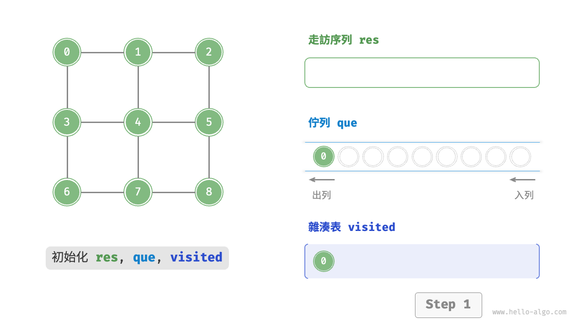{ class="animation-figure" }

=== "<2>"
    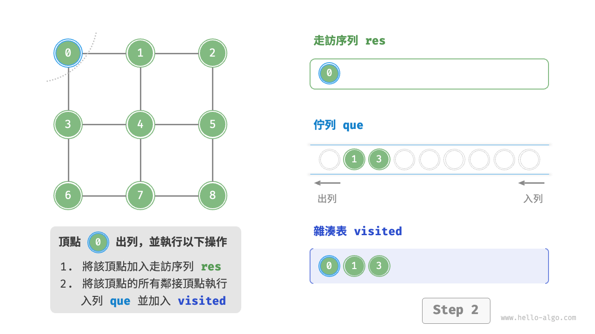{ class="animation-figure" }

=== "<3>"
    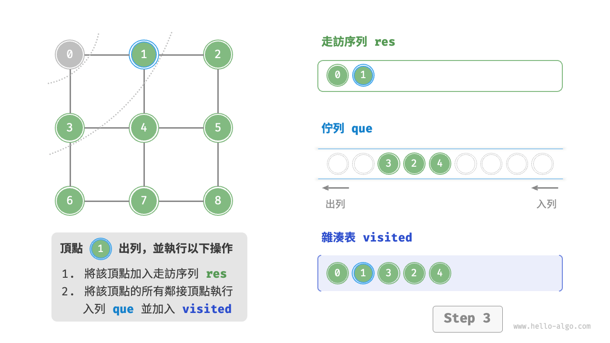{ class="animation-figure" }

=== "<4>"
    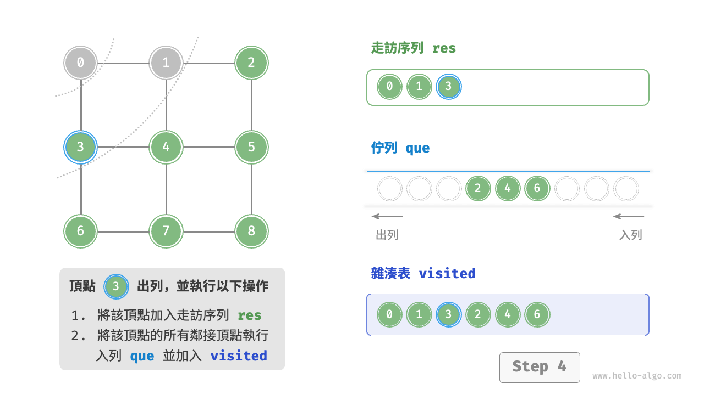{ class="animation-figure" }

=== "<5>"
    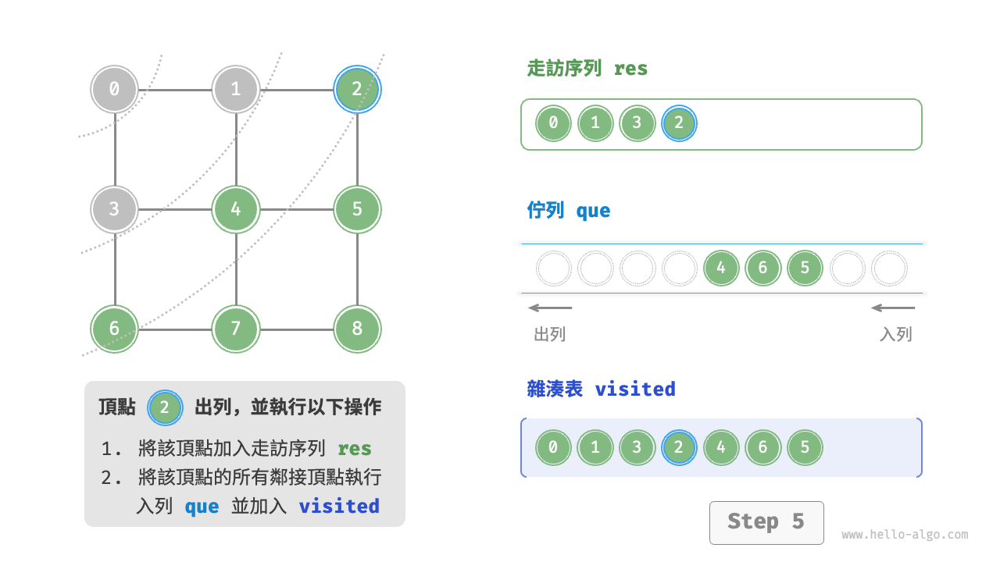{ class="animation-figure" }

=== "<6>"
    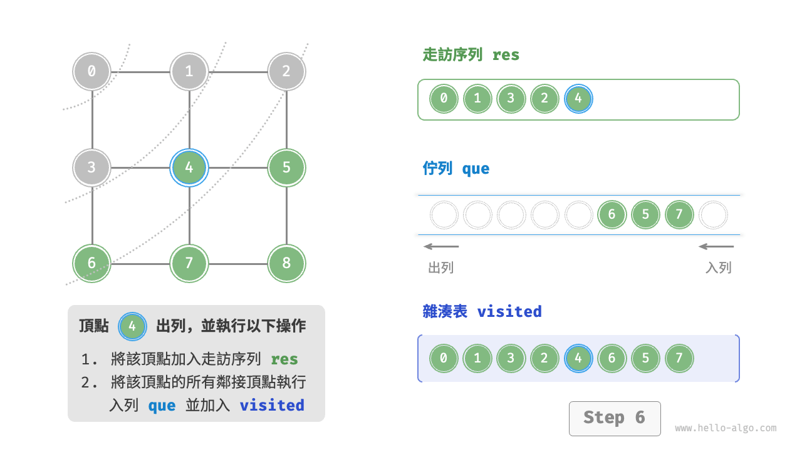{ class="animation-figure" }

=== "<7>"
    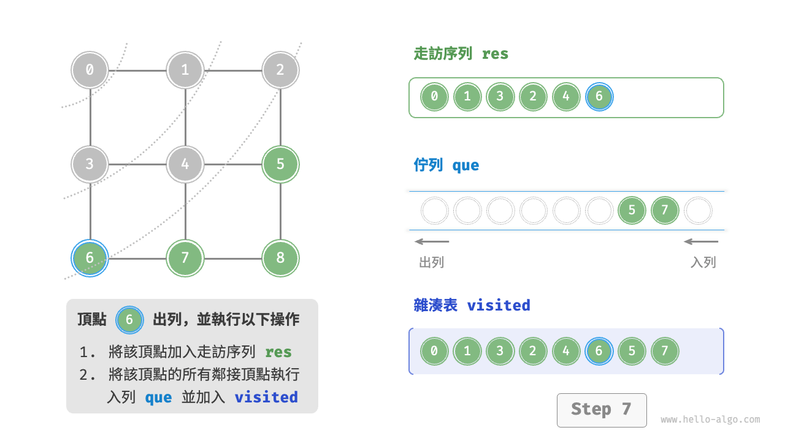{ class="animation-figure" }

=== "<8>"
    { class="animation-figure" }

=== "<9>"
    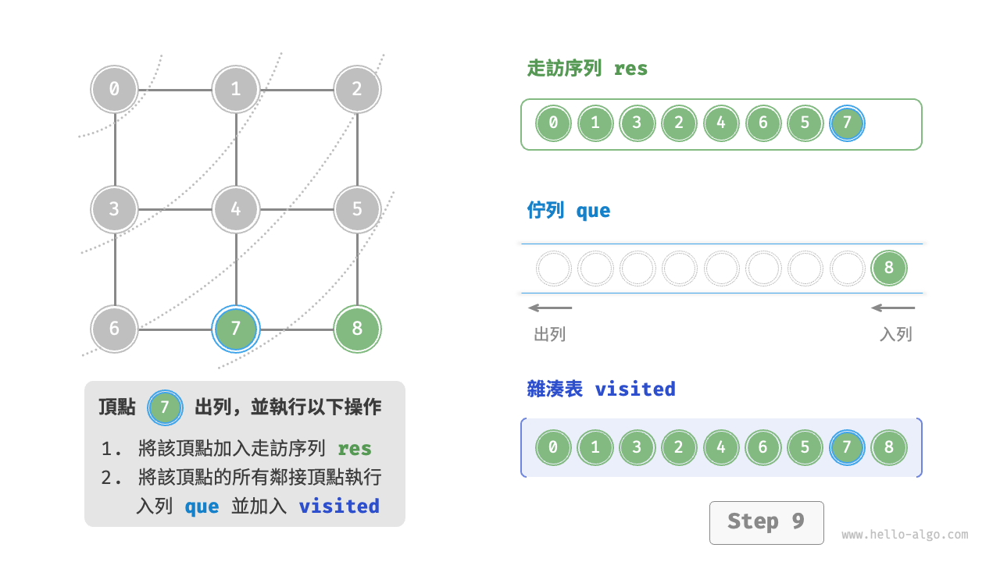{ class="animation-figure" }

=== "<10>"
    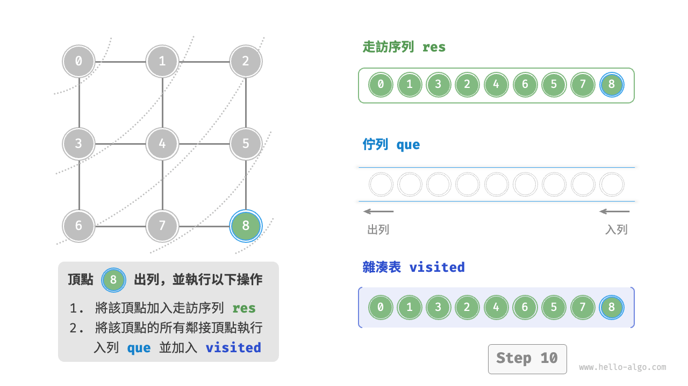{ class="animation-figure" }

=== "<11>"
    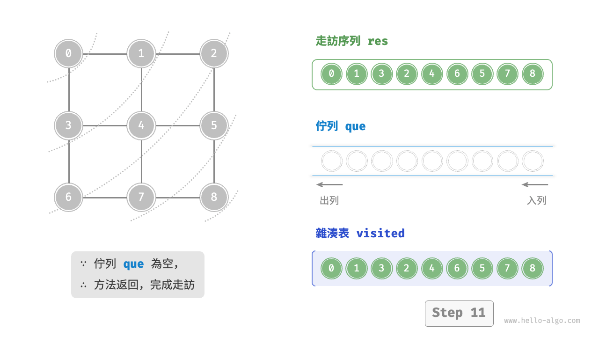{ class="animation-figure" }

<p align="center"> 圖 9-10 &nbsp; 圖的廣度優先走訪步驟 </p>

!!! question "廣度優先走訪的序列是否唯一？"

    不唯一。廣度優先走訪只要求按“由近及遠”的順序走訪，**而多個相同距離的頂點的走訪順序允許被任意打亂**。以圖 9-10 為例，頂點 $1$、$3$ 的訪問順序可以交換，頂點 $2$、$4$、$6$ 的訪問順序也可以任意交換。

### 2. &nbsp; 複雜度分析

**時間複雜度**：所有頂點都會入列並出隊一次，使用 $O(|V|)$ 時間；在走訪鄰接頂點的過程中，由於是無向圖，因此所有邊都會被訪問 $2$ 次，使用 $O(2|E|)$ 時間；總體使用 $O(|V| + |E|)$ 時間。

**空間複雜度**：串列 `res` ，雜湊集合 `visited` ，佇列 `que` 中的頂點數量最多為 $|V|$ ，使用 $O(|V|)$ 空間。

## 9.3.2 &nbsp; 深度優先走訪

**深度優先走訪是一種優先走到底、無路可走再回頭的走訪方式**。如圖 9-11 所示，從左上角頂點出發，訪問當前頂點的某個鄰接頂點，直到走到盡頭時返回，再繼續走到盡頭並返回，以此類推，直至所有頂點走訪完成。

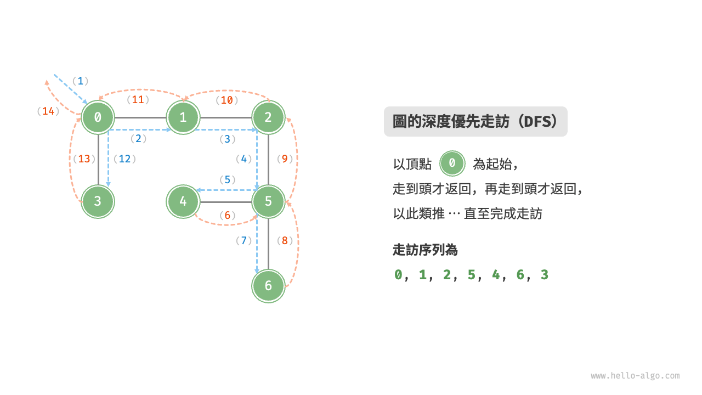{ class="animation-figure" }

<p align="center"> 圖 9-11 &nbsp; 圖的深度優先走訪 </p>

### 1. &nbsp; 演算法實現

這種“走到盡頭再返回”的演算法範式通常基於遞迴來實現。與廣度優先走訪類似，在深度優先走訪中，我們也需要藉助一個雜湊集合 `visited` 來記錄已被訪問的頂點，以避免重複訪問頂點。

=== "Python"

    ```python title="graph_dfs.py"
    def dfs(graph: GraphAdjList, visited: set[Vertex], res: list[Vertex], vet: Vertex):
        """深度優先走訪輔助函式"""
        res.append(vet)  # 記錄訪問頂點
        visited.add(vet)  # 標記該頂點已被訪問
        # 走訪該頂點的所有鄰接頂點
        for adjVet in graph.adj_list[vet]:
            if adjVet in visited:
                continue  # 跳過已被訪問的頂點
            # 遞迴訪問鄰接頂點
            dfs(graph, visited, res, adjVet)

    def graph_dfs(graph: GraphAdjList, start_vet: Vertex) -> list[Vertex]:
        """深度優先走訪"""
        # 使用鄰接表來表示圖，以便獲取指定頂點的所有鄰接頂點
        # 頂點走訪序列
        res = []
        # 雜湊集合，用於記錄已被訪問過的頂點
        visited = set[Vertex]()
        dfs(graph, visited, res, start_vet)
        return res
    ```

=== "C++"

    ```cpp title="graph_dfs.cpp"
    /* 深度優先走訪輔助函式 */
    void dfs(GraphAdjList &graph, unordered_set<Vertex *> &visited, vector<Vertex *> &res, Vertex *vet) {
        res.push_back(vet);   // 記錄訪問頂點
        visited.emplace(vet); // 標記該頂點已被訪問
        // 走訪該頂點的所有鄰接頂點
        for (Vertex *adjVet : graph.adjList[vet]) {
            if (visited.count(adjVet))
                continue; // 跳過已被訪問的頂點
            // 遞迴訪問鄰接頂點
            dfs(graph, visited, res, adjVet);
        }
    }

    /* 深度優先走訪 */
    // 使用鄰接表來表示圖，以便獲取指定頂點的所有鄰接頂點
    vector<Vertex *> graphDFS(GraphAdjList &graph, Vertex *startVet) {
        // 頂點走訪序列
        vector<Vertex *> res;
        // 雜湊集合，用於記錄已被訪問過的頂點
        unordered_set<Vertex *> visited;
        dfs(graph, visited, res, startVet);
        return res;
    }
    ```

=== "Java"

    ```java title="graph_dfs.java"
    /* 深度優先走訪輔助函式 */
    void dfs(GraphAdjList graph, Set<Vertex> visited, List<Vertex> res, Vertex vet) {
        res.add(vet);     // 記錄訪問頂點
        visited.add(vet); // 標記該頂點已被訪問
        // 走訪該頂點的所有鄰接頂點
        for (Vertex adjVet : graph.adjList.get(vet)) {
            if (visited.contains(adjVet))
                continue; // 跳過已被訪問的頂點
            // 遞迴訪問鄰接頂點
            dfs(graph, visited, res, adjVet);
        }
    }

    /* 深度優先走訪 */
    // 使用鄰接表來表示圖，以便獲取指定頂點的所有鄰接頂點
    List<Vertex> graphDFS(GraphAdjList graph, Vertex startVet) {
        // 頂點走訪序列
        List<Vertex> res = new ArrayList<>();
        // 雜湊集合，用於記錄已被訪問過的頂點
        Set<Vertex> visited = new HashSet<>();
        dfs(graph, visited, res, startVet);
        return res;
    }
    ```

=== "C#"

    ```csharp title="graph_dfs.cs"
    /* 深度優先走訪輔助函式 */
    void DFS(GraphAdjList graph, HashSet<Vertex> visited, List<Vertex> res, Vertex vet) {
        res.Add(vet);     // 記錄訪問頂點
        visited.Add(vet); // 標記該頂點已被訪問
        // 走訪該頂點的所有鄰接頂點
        foreach (Vertex adjVet in graph.adjList[vet]) {
            if (visited.Contains(adjVet)) {
                continue; // 跳過已被訪問的頂點                             
            }
            // 遞迴訪問鄰接頂點
            DFS(graph, visited, res, adjVet);
        }
    }

    /* 深度優先走訪 */
    // 使用鄰接表來表示圖，以便獲取指定頂點的所有鄰接頂點
    List<Vertex> GraphDFS(GraphAdjList graph, Vertex startVet) {
        // 頂點走訪序列
        List<Vertex> res = [];
        // 雜湊集合，用於記錄已被訪問過的頂點
        HashSet<Vertex> visited = [];
        DFS(graph, visited, res, startVet);
        return res;
    }
    ```

=== "Go"

    ```go title="graph_dfs.go"
    /* 深度優先走訪輔助函式 */
    func dfs(g *graphAdjList, visited map[Vertex]struct{}, res *[]Vertex, vet Vertex) {
        // append 操作會返回新的的引用，必須讓原引用重新賦值為新slice的引用
        *res = append(*res, vet)
        visited[vet] = struct{}{}
        // 走訪該頂點的所有鄰接頂點
        for _, adjVet := range g.adjList[vet] {
            _, isExist := visited[adjVet]
            // 遞迴訪問鄰接頂點
            if !isExist {
                dfs(g, visited, res, adjVet)
            }
        }
    }

    /* 深度優先走訪 */
    // 使用鄰接表來表示圖，以便獲取指定頂點的所有鄰接頂點
    func graphDFS(g *graphAdjList, startVet Vertex) []Vertex {
        // 頂點走訪序列
        res := make([]Vertex, 0)
        // 雜湊集合，用於記錄已被訪問過的頂點
        visited := make(map[Vertex]struct{})
        dfs(g, visited, &res, startVet)
        // 返回頂點走訪序列
        return res
    }
    ```

=== "Swift"

    ```swift title="graph_dfs.swift"
    /* 深度優先走訪輔助函式 */
    func dfs(graph: GraphAdjList, visited: inout Set<Vertex>, res: inout [Vertex], vet: Vertex) {
        res.append(vet) // 記錄訪問頂點
        visited.insert(vet) // 標記該頂點已被訪問
        // 走訪該頂點的所有鄰接頂點
        for adjVet in graph.adjList[vet] ?? [] {
            if visited.contains(adjVet) {
                continue // 跳過已被訪問的頂點
            }
            // 遞迴訪問鄰接頂點
            dfs(graph: graph, visited: &visited, res: &res, vet: adjVet)
        }
    }

    /* 深度優先走訪 */
    // 使用鄰接表來表示圖，以便獲取指定頂點的所有鄰接頂點
    func graphDFS(graph: GraphAdjList, startVet: Vertex) -> [Vertex] {
        // 頂點走訪序列
        var res: [Vertex] = []
        // 雜湊集合，用於記錄已被訪問過的頂點
        var visited: Set<Vertex> = []
        dfs(graph: graph, visited: &visited, res: &res, vet: startVet)
        return res
    }
    ```

=== "JS"

    ```javascript title="graph_dfs.js"
    /* 深度優先走訪 */
    // 使用鄰接表來表示圖，以便獲取指定頂點的所有鄰接頂點
    function dfs(graph, visited, res, vet) {
        res.push(vet); // 記錄訪問頂點
        visited.add(vet); // 標記該頂點已被訪問
        // 走訪該頂點的所有鄰接頂點
        for (const adjVet of graph.adjList.get(vet)) {
            if (visited.has(adjVet)) {
                continue; // 跳過已被訪問的頂點
            }
            // 遞迴訪問鄰接頂點
            dfs(graph, visited, res, adjVet);
        }
    }

    /* 深度優先走訪 */
    // 使用鄰接表來表示圖，以便獲取指定頂點的所有鄰接頂點
    function graphDFS(graph, startVet) {
        // 頂點走訪序列
        const res = [];
        // 雜湊集合，用於記錄已被訪問過的頂點
        const visited = new Set();
        dfs(graph, visited, res, startVet);
        return res;
    }
    ```

=== "TS"

    ```typescript title="graph_dfs.ts"
    /* 深度優先走訪輔助函式 */
    function dfs(
        graph: GraphAdjList,
        visited: Set<Vertex>,
        res: Vertex[],
        vet: Vertex
    ): void {
        res.push(vet); // 記錄訪問頂點
        visited.add(vet); // 標記該頂點已被訪問
        // 走訪該頂點的所有鄰接頂點
        for (const adjVet of graph.adjList.get(vet)) {
            if (visited.has(adjVet)) {
                continue; // 跳過已被訪問的頂點
            }
            // 遞迴訪問鄰接頂點
            dfs(graph, visited, res, adjVet);
        }
    }

    /* 深度優先走訪 */
    // 使用鄰接表來表示圖，以便獲取指定頂點的所有鄰接頂點
    function graphDFS(graph: GraphAdjList, startVet: Vertex): Vertex[] {
        // 頂點走訪序列
        const res: Vertex[] = [];
        // 雜湊集合，用於記錄已被訪問過的頂點
        const visited: Set<Vertex> = new Set();
        dfs(graph, visited, res, startVet);
        return res;
    }
    ```

=== "Dart"

    ```dart title="graph_dfs.dart"
    /* 深度優先走訪輔助函式 */
    void dfs(
      GraphAdjList graph,
      Set<Vertex> visited,
      List<Vertex> res,
      Vertex vet,
    ) {
      res.add(vet); // 記錄訪問頂點
      visited.add(vet); // 標記該頂點已被訪問
      // 走訪該頂點的所有鄰接頂點
      for (Vertex adjVet in graph.adjList[vet]!) {
        if (visited.contains(adjVet)) {
          continue; // 跳過已被訪問的頂點
        }
        // 遞迴訪問鄰接頂點
        dfs(graph, visited, res, adjVet);
      }
    }

    /* 深度優先走訪 */
    List<Vertex> graphDFS(GraphAdjList graph, Vertex startVet) {
      // 頂點走訪序列
      List<Vertex> res = [];
      // 雜湊集合，用於記錄已被訪問過的頂點
      Set<Vertex> visited = {};
      dfs(graph, visited, res, startVet);
      return res;
    }
    ```

=== "Rust"

    ```rust title="graph_dfs.rs"
    /* 深度優先走訪輔助函式 */
    fn dfs(graph: &GraphAdjList, visited: &mut HashSet<Vertex>, res: &mut Vec<Vertex>, vet: Vertex) {
        res.push(vet); // 記錄訪問頂點
        visited.insert(vet); // 標記該頂點已被訪問
                             // 走訪該頂點的所有鄰接頂點
        if let Some(adj_vets) = graph.adj_list.get(&vet) {
            for &adj_vet in adj_vets {
                if visited.contains(&adj_vet) {
                    continue; // 跳過已被訪問的頂點
                }
                // 遞迴訪問鄰接頂點
                dfs(graph, visited, res, adj_vet);
            }
        }
    }

    /* 深度優先走訪 */
    // 使用鄰接表來表示圖，以便獲取指定頂點的所有鄰接頂點
    fn graph_dfs(graph: GraphAdjList, start_vet: Vertex) -> Vec<Vertex> {
        // 頂點走訪序列
        let mut res = vec![];
        // 雜湊集合，用於記錄已被訪問過的頂點
        let mut visited = HashSet::new();
        dfs(&graph, &mut visited, &mut res, start_vet);

        res
    }
    ```

=== "C"

    ```c title="graph_dfs.c"
    /* 檢查頂點是否已被訪問 */
    int isVisited(Vertex **res, int size, Vertex *vet) {
        // 走訪查詢節點，使用 O(n) 時間
        for (int i = 0; i < size; i++) {
            if (res[i] == vet) {
                return 1;
            }
        }
        return 0;
    }

    /* 深度優先走訪輔助函式 */
    void dfs(GraphAdjList *graph, Vertex **res, int *resSize, Vertex *vet) {
        // 記錄訪問頂點
        res[(*resSize)++] = vet;
        // 走訪該頂點的所有鄰接頂點
        AdjListNode *node = findNode(graph, vet);
        while (node != NULL) {
            // 跳過已被訪問的頂點
            if (!isVisited(res, *resSize, node->vertex)) {
                // 遞迴訪問鄰接頂點
                dfs(graph, res, resSize, node->vertex);
            }
            node = node->next;
        }
    }

    /* 深度優先走訪 */
    // 使用鄰接表來表示圖，以便獲取指定頂點的所有鄰接頂點
    void graphDFS(GraphAdjList *graph, Vertex *startVet, Vertex **res, int *resSize) {
        dfs(graph, res, resSize, startVet);
    }
    ```

=== "Kotlin"

    ```kotlin title="graph_dfs.kt"
    /* 深度優先走訪輔助函式 */
    fun dfs(
        graph: GraphAdjList,
        visited: MutableSet<Vertex?>,
        res: MutableList<Vertex?>,
        vet: Vertex?
    ) {
        res.add(vet)     // 記錄訪問頂點
        visited.add(vet) // 標記該頂點已被訪問
        // 走訪該頂點的所有鄰接頂點
        for (adjVet in graph.adjList[vet]!!) {
            if (visited.contains(adjVet))
                continue  // 跳過已被訪問的頂點
            // 遞迴訪問鄰接頂點
            dfs(graph, visited, res, adjVet)
        }
    }

    /* 深度優先走訪 */
    // 使用鄰接表來表示圖，以便獲取指定頂點的所有鄰接頂點
    fun graphDFS(graph: GraphAdjList, startVet: Vertex?): MutableList<Vertex?> {
        // 頂點走訪序列
        val res = mutableListOf<Vertex?>()
        // 雜湊集合，用於記錄已被訪問過的頂點
        val visited = HashSet<Vertex?>()
        dfs(graph, visited, res, startVet)
        return res
    }
    ```

=== "Ruby"

    ```ruby title="graph_dfs.rb"
    ### 深度優先走訪輔助函式 ###
    def dfs(graph, visited, res, vet)
      res << vet # 記錄訪問頂點
      visited.add(vet) # 標記該頂點已被訪問
      # 走訪該頂點的所有鄰接頂點
      for adj_vet in graph.adj_list[vet]
        next if visited.include?(adj_vet) # 跳過已被訪問的頂點
        # 遞迴訪問鄰接頂點
        dfs(graph, visited, res, adj_vet)
      end
    end

    ### 深度優先走訪 ###
    def graph_dfs(graph, start_vet)
      # 使用鄰接表來表示圖，以便獲取指定頂點的所有鄰接頂點
      # 頂點走訪序列
      res = []
      # 雜湊集合，用於記錄已被訪問過的頂點
      visited = Set.new
      dfs(graph, visited, res, start_vet)
      res
    end
    ```

=== "Zig"

    ```zig title="graph_dfs.zig"
    [class]{}-[func]{dfs}

    [class]{}-[func]{graphDFS}
    ```

??? pythontutor "視覺化執行"

    <div style="height: 549px; width: 100%;"><iframe class="pythontutor-iframe" src="https://pythontutor.com/iframe-embed.html#code=class%20Vertex%3A%0A%20%20%20%20%22%22%22%E9%A0%82%E9%BB%9E%E9%A1%9E%E5%88%A5%22%22%22%0A%20%20%20%20def%20__init__%28self%2C%20val%3A%20int%29%3A%0A%20%20%20%20%20%20%20%20self.val%20%3D%20val%0A%0Adef%20vals_to_vets%28vals%3A%20list%5Bint%5D%29%20-%3E%20list%5B%22Vertex%22%5D%3A%0A%20%20%20%20%22%22%22%E8%BC%B8%E5%85%A5%E5%80%BC%E4%B8%B2%E5%88%97%20vals%20%EF%BC%8C%E8%BF%94%E5%9B%9E%E9%A0%82%E9%BB%9E%E4%B8%B2%E5%88%97%20vets%22%22%22%0A%20%20%20%20return%20%5BVertex%28val%29%20for%20val%20in%20vals%5D%0A%0Aclass%20GraphAdjList%3A%0A%20%20%20%20%22%22%22%E5%9F%BA%E6%96%BC%E9%84%B0%E6%8E%A5%E8%A1%A8%E5%AF%A6%E7%8F%BE%E7%9A%84%E7%84%A1%E5%90%91%E5%9C%96%E9%A1%9E%E5%88%A5%22%22%22%0A%0A%20%20%20%20def%20__init__%28self%2C%20edges%3A%20list%5Blist%5BVertex%5D%5D%29%3A%0A%20%20%20%20%20%20%20%20%22%22%22%E5%BB%BA%E6%A7%8B%E5%AD%90%22%22%22%0A%20%20%20%20%20%20%20%20self.adj_list%20%3D%20dict%5BVertex%2C%20list%5BVertex%5D%5D%28%29%0A%20%20%20%20%20%20%20%20for%20edge%20in%20edges%3A%0A%20%20%20%20%20%20%20%20%20%20%20%20self.add_vertex%28edge%5B0%5D%29%0A%20%20%20%20%20%20%20%20%20%20%20%20self.add_vertex%28edge%5B1%5D%29%0A%20%20%20%20%20%20%20%20%20%20%20%20self.add_edge%28edge%5B0%5D%2C%20edge%5B1%5D%29%0A%0A%20%20%20%20def%20add_edge%28self%2C%20vet1%3A%20Vertex%2C%20vet2%3A%20Vertex%29%3A%0A%20%20%20%20%20%20%20%20%22%22%22%E6%96%B0%E5%A2%9E%E9%82%8A%22%22%22%0A%20%20%20%20%20%20%20%20if%20vet1%20not%20in%20self.adj_list%20or%20vet2%20not%20in%20self.adj_list%20or%20vet1%20%3D%3D%20vet2%3A%0A%20%20%20%20%20%20%20%20%20%20%20%20raise%20ValueError%28%29%0A%20%20%20%20%20%20%20%20self.adj_list%5Bvet1%5D.append%28vet2%29%0A%20%20%20%20%20%20%20%20self.adj_list%5Bvet2%5D.append%28vet1%29%0A%0A%20%20%20%20def%20add_vertex%28self%2C%20vet%3A%20Vertex%29%3A%0A%20%20%20%20%20%20%20%20%22%22%22%E6%96%B0%E5%A2%9E%E9%A0%82%E9%BB%9E%22%22%22%0A%20%20%20%20%20%20%20%20if%20vet%20in%20self.adj_list%3A%0A%20%20%20%20%20%20%20%20%20%20%20%20return%0A%20%20%20%20%20%20%20%20self.adj_list%5Bvet%5D%20%3D%20%5B%5D%0A%0A%0Adef%20dfs%28graph%3A%20GraphAdjList%2C%20visited%3A%20set%5BVertex%5D%2C%20res%3A%20list%5BVertex%5D%2C%20vet%3A%20Vertex%29%3A%0A%20%20%20%20%22%22%22%E6%B7%B1%E5%BA%A6%E5%84%AA%E5%85%88%E8%B5%B0%E8%A8%AA%E8%BC%94%E5%8A%A9%E5%87%BD%E5%BC%8F%22%22%22%0A%20%20%20%20res.append%28vet%29%20%20%23%20%E8%A8%98%E9%8C%84%E8%A8%AA%E5%95%8F%E9%A0%82%E9%BB%9E%0A%20%20%20%20visited.add%28vet%29%20%20%23%20%E6%A8%99%E8%A8%98%E8%A9%B2%E9%A0%82%E9%BB%9E%E5%B7%B2%E8%A2%AB%E8%A8%AA%E5%95%8F%0A%20%20%20%20%23%20%E8%B5%B0%E8%A8%AA%E8%A9%B2%E9%A0%82%E9%BB%9E%E7%9A%84%E6%89%80%E6%9C%89%E9%84%B0%E6%8E%A5%E9%A0%82%E9%BB%9E%0A%20%20%20%20for%20adjVet%20in%20graph.adj_list%5Bvet%5D%3A%0A%20%20%20%20%20%20%20%20if%20adjVet%20in%20visited%3A%0A%20%20%20%20%20%20%20%20%20%20%20%20continue%20%20%23%20%E8%B7%B3%E9%81%8E%E5%B7%B2%E8%A2%AB%E8%A8%AA%E5%95%8F%E7%9A%84%E9%A0%82%E9%BB%9E%0A%20%20%20%20%20%20%20%20%23%20%E9%81%9E%E8%BF%B4%E8%A8%AA%E5%95%8F%E9%84%B0%E6%8E%A5%E9%A0%82%E9%BB%9E%0A%20%20%20%20%20%20%20%20dfs%28graph%2C%20visited%2C%20res%2C%20adjVet%29%0A%0A%0Adef%20graph_dfs%28graph%3A%20GraphAdjList%2C%20start_vet%3A%20Vertex%29%20-%3E%20list%5BVertex%5D%3A%0A%20%20%20%20%22%22%22%E6%B7%B1%E5%BA%A6%E5%84%AA%E5%85%88%E8%B5%B0%E8%A8%AA%22%22%22%0A%20%20%20%20%23%20%E4%BD%BF%E7%94%A8%E9%84%B0%E6%8E%A5%E8%A1%A8%E4%BE%86%E8%A1%A8%E7%A4%BA%E5%9C%96%EF%BC%8C%E4%BB%A5%E4%BE%BF%E7%8D%B2%E5%8F%96%E6%8C%87%E5%AE%9A%E9%A0%82%E9%BB%9E%E7%9A%84%E6%89%80%E6%9C%89%E9%84%B0%E6%8E%A5%E9%A0%82%E9%BB%9E%0A%20%20%20%20%23%20%E9%A0%82%E9%BB%9E%E8%B5%B0%E8%A8%AA%E5%BA%8F%E5%88%97%0A%20%20%20%20res%20%3D%20%5B%5D%0A%20%20%20%20%23%20%E9%9B%9C%E6%B9%8A%E8%A1%A8%EF%BC%8C%E7%94%A8%E6%96%BC%E8%A8%98%E9%8C%84%E5%B7%B2%E8%A2%AB%E8%A8%AA%E5%95%8F%E9%81%8E%E7%9A%84%E9%A0%82%E9%BB%9E%0A%20%20%20%20visited%20%3D%20set%5BVertex%5D%28%29%0A%20%20%20%20dfs%28graph%2C%20visited%2C%20res%2C%20start_vet%29%0A%20%20%20%20return%20res%0A%0A%0A%22%22%22Driver%20Code%22%22%22%0Aif%20__name__%20%3D%3D%20%22__main__%22%3A%0A%20%20%20%20%23%20%E5%88%9D%E5%A7%8B%E5%8C%96%E7%84%A1%E5%90%91%E5%9C%96%0A%20%20%20%20v%20%3D%20vals_to_vets%28%5B0%2C%201%2C%202%2C%203%2C%204%5D%29%0A%20%20%20%20edges%20%3D%20%5B%0A%20%20%20%20%20%20%20%20%5Bv%5B0%5D%2C%20v%5B1%5D%5D%2C%0A%20%20%20%20%20%20%20%20%5Bv%5B0%5D%2C%20v%5B3%5D%5D%2C%0A%20%20%20%20%20%20%20%20%5Bv%5B1%5D%2C%20v%5B2%5D%5D%2C%0A%20%20%20%20%20%20%20%20%5Bv%5B1%5D%2C%20v%5B4%5D%5D%2C%0A%20%20%20%20%20%20%20%20%5Bv%5B3%5D%2C%20v%5B4%5D%5D%2C%0A%20%20%20%20%5D%0A%20%20%20%20graph%20%3D%20GraphAdjList%28edges%29%0A%0A%20%20%20%20%23%20%E6%B7%B1%E5%BA%A6%E5%84%AA%E5%85%88%E8%B5%B0%E8%A8%AA%0A%20%20%20%20res%20%3D%20graph_dfs%28graph%2C%20v%5B0%5D%29&codeDivHeight=472&codeDivWidth=350&cumulative=false&curInstr=130&heapPrimitives=nevernest&origin=opt-frontend.js&py=311&rawInputLstJSON=%5B%5D&textReferences=false"> </iframe></div>
    <div style="margin-top: 5px;"><a href="https://pythontutor.com/iframe-embed.html#code=class%20Vertex%3A%0A%20%20%20%20%22%22%22%E9%A0%82%E9%BB%9E%E9%A1%9E%E5%88%A5%22%22%22%0A%20%20%20%20def%20__init__%28self%2C%20val%3A%20int%29%3A%0A%20%20%20%20%20%20%20%20self.val%20%3D%20val%0A%0Adef%20vals_to_vets%28vals%3A%20list%5Bint%5D%29%20-%3E%20list%5B%22Vertex%22%5D%3A%0A%20%20%20%20%22%22%22%E8%BC%B8%E5%85%A5%E5%80%BC%E4%B8%B2%E5%88%97%20vals%20%EF%BC%8C%E8%BF%94%E5%9B%9E%E9%A0%82%E9%BB%9E%E4%B8%B2%E5%88%97%20vets%22%22%22%0A%20%20%20%20return%20%5BVertex%28val%29%20for%20val%20in%20vals%5D%0A%0Aclass%20GraphAdjList%3A%0A%20%20%20%20%22%22%22%E5%9F%BA%E6%96%BC%E9%84%B0%E6%8E%A5%E8%A1%A8%E5%AF%A6%E7%8F%BE%E7%9A%84%E7%84%A1%E5%90%91%E5%9C%96%E9%A1%9E%E5%88%A5%22%22%22%0A%0A%20%20%20%20def%20__init__%28self%2C%20edges%3A%20list%5Blist%5BVertex%5D%5D%29%3A%0A%20%20%20%20%20%20%20%20%22%22%22%E5%BB%BA%E6%A7%8B%E5%AD%90%22%22%22%0A%20%20%20%20%20%20%20%20self.adj_list%20%3D%20dict%5BVertex%2C%20list%5BVertex%5D%5D%28%29%0A%20%20%20%20%20%20%20%20for%20edge%20in%20edges%3A%0A%20%20%20%20%20%20%20%20%20%20%20%20self.add_vertex%28edge%5B0%5D%29%0A%20%20%20%20%20%20%20%20%20%20%20%20self.add_vertex%28edge%5B1%5D%29%0A%20%20%20%20%20%20%20%20%20%20%20%20self.add_edge%28edge%5B0%5D%2C%20edge%5B1%5D%29%0A%0A%20%20%20%20def%20add_edge%28self%2C%20vet1%3A%20Vertex%2C%20vet2%3A%20Vertex%29%3A%0A%20%20%20%20%20%20%20%20%22%22%22%E6%96%B0%E5%A2%9E%E9%82%8A%22%22%22%0A%20%20%20%20%20%20%20%20if%20vet1%20not%20in%20self.adj_list%20or%20vet2%20not%20in%20self.adj_list%20or%20vet1%20%3D%3D%20vet2%3A%0A%20%20%20%20%20%20%20%20%20%20%20%20raise%20ValueError%28%29%0A%20%20%20%20%20%20%20%20self.adj_list%5Bvet1%5D.append%28vet2%29%0A%20%20%20%20%20%20%20%20self.adj_list%5Bvet2%5D.append%28vet1%29%0A%0A%20%20%20%20def%20add_vertex%28self%2C%20vet%3A%20Vertex%29%3A%0A%20%20%20%20%20%20%20%20%22%22%22%E6%96%B0%E5%A2%9E%E9%A0%82%E9%BB%9E%22%22%22%0A%20%20%20%20%20%20%20%20if%20vet%20in%20self.adj_list%3A%0A%20%20%20%20%20%20%20%20%20%20%20%20return%0A%20%20%20%20%20%20%20%20self.adj_list%5Bvet%5D%20%3D%20%5B%5D%0A%0A%0Adef%20dfs%28graph%3A%20GraphAdjList%2C%20visited%3A%20set%5BVertex%5D%2C%20res%3A%20list%5BVertex%5D%2C%20vet%3A%20Vertex%29%3A%0A%20%20%20%20%22%22%22%E6%B7%B1%E5%BA%A6%E5%84%AA%E5%85%88%E8%B5%B0%E8%A8%AA%E8%BC%94%E5%8A%A9%E5%87%BD%E5%BC%8F%22%22%22%0A%20%20%20%20res.append%28vet%29%20%20%23%20%E8%A8%98%E9%8C%84%E8%A8%AA%E5%95%8F%E9%A0%82%E9%BB%9E%0A%20%20%20%20visited.add%28vet%29%20%20%23%20%E6%A8%99%E8%A8%98%E8%A9%B2%E9%A0%82%E9%BB%9E%E5%B7%B2%E8%A2%AB%E8%A8%AA%E5%95%8F%0A%20%20%20%20%23%20%E8%B5%B0%E8%A8%AA%E8%A9%B2%E9%A0%82%E9%BB%9E%E7%9A%84%E6%89%80%E6%9C%89%E9%84%B0%E6%8E%A5%E9%A0%82%E9%BB%9E%0A%20%20%20%20for%20adjVet%20in%20graph.adj_list%5Bvet%5D%3A%0A%20%20%20%20%20%20%20%20if%20adjVet%20in%20visited%3A%0A%20%20%20%20%20%20%20%20%20%20%20%20continue%20%20%23%20%E8%B7%B3%E9%81%8E%E5%B7%B2%E8%A2%AB%E8%A8%AA%E5%95%8F%E7%9A%84%E9%A0%82%E9%BB%9E%0A%20%20%20%20%20%20%20%20%23%20%E9%81%9E%E8%BF%B4%E8%A8%AA%E5%95%8F%E9%84%B0%E6%8E%A5%E9%A0%82%E9%BB%9E%0A%20%20%20%20%20%20%20%20dfs%28graph%2C%20visited%2C%20res%2C%20adjVet%29%0A%0A%0Adef%20graph_dfs%28graph%3A%20GraphAdjList%2C%20start_vet%3A%20Vertex%29%20-%3E%20list%5BVertex%5D%3A%0A%20%20%20%20%22%22%22%E6%B7%B1%E5%BA%A6%E5%84%AA%E5%85%88%E8%B5%B0%E8%A8%AA%22%22%22%0A%20%20%20%20%23%20%E4%BD%BF%E7%94%A8%E9%84%B0%E6%8E%A5%E8%A1%A8%E4%BE%86%E8%A1%A8%E7%A4%BA%E5%9C%96%EF%BC%8C%E4%BB%A5%E4%BE%BF%E7%8D%B2%E5%8F%96%E6%8C%87%E5%AE%9A%E9%A0%82%E9%BB%9E%E7%9A%84%E6%89%80%E6%9C%89%E9%84%B0%E6%8E%A5%E9%A0%82%E9%BB%9E%0A%20%20%20%20%23%20%E9%A0%82%E9%BB%9E%E8%B5%B0%E8%A8%AA%E5%BA%8F%E5%88%97%0A%20%20%20%20res%20%3D%20%5B%5D%0A%20%20%20%20%23%20%E9%9B%9C%E6%B9%8A%E8%A1%A8%EF%BC%8C%E7%94%A8%E6%96%BC%E8%A8%98%E9%8C%84%E5%B7%B2%E8%A2%AB%E8%A8%AA%E5%95%8F%E9%81%8E%E7%9A%84%E9%A0%82%E9%BB%9E%0A%20%20%20%20visited%20%3D%20set%5BVertex%5D%28%29%0A%20%20%20%20dfs%28graph%2C%20visited%2C%20res%2C%20start_vet%29%0A%20%20%20%20return%20res%0A%0A%0A%22%22%22Driver%20Code%22%22%22%0Aif%20__name__%20%3D%3D%20%22__main__%22%3A%0A%20%20%20%20%23%20%E5%88%9D%E5%A7%8B%E5%8C%96%E7%84%A1%E5%90%91%E5%9C%96%0A%20%20%20%20v%20%3D%20vals_to_vets%28%5B0%2C%201%2C%202%2C%203%2C%204%5D%29%0A%20%20%20%20edges%20%3D%20%5B%0A%20%20%20%20%20%20%20%20%5Bv%5B0%5D%2C%20v%5B1%5D%5D%2C%0A%20%20%20%20%20%20%20%20%5Bv%5B0%5D%2C%20v%5B3%5D%5D%2C%0A%20%20%20%20%20%20%20%20%5Bv%5B1%5D%2C%20v%5B2%5D%5D%2C%0A%20%20%20%20%20%20%20%20%5Bv%5B1%5D%2C%20v%5B4%5D%5D%2C%0A%20%20%20%20%20%20%20%20%5Bv%5B3%5D%2C%20v%5B4%5D%5D%2C%0A%20%20%20%20%5D%0A%20%20%20%20graph%20%3D%20GraphAdjList%28edges%29%0A%0A%20%20%20%20%23%20%E6%B7%B1%E5%BA%A6%E5%84%AA%E5%85%88%E8%B5%B0%E8%A8%AA%0A%20%20%20%20res%20%3D%20graph_dfs%28graph%2C%20v%5B0%5D%29&codeDivHeight=800&codeDivWidth=600&cumulative=false&curInstr=130&heapPrimitives=nevernest&origin=opt-frontend.js&py=311&rawInputLstJSON=%5B%5D&textReferences=false" target="_blank" rel="noopener noreferrer">全螢幕觀看 ></a></div>

深度優先走訪的演算法流程如圖 9-12 所示。

- **直虛線代表向下遞推**，表示開啟了一個新的遞迴方法來訪問新頂點。
- **曲虛線代表向上回溯**，表示此遞迴方法已經返回，回溯到了開啟此方法的位置。

為了加深理解，建議將圖 9-12 與程式碼結合起來，在腦中模擬（或者用筆畫下來）整個 DFS 過程，包括每個遞迴方法何時開啟、何時返回。

=== "<1>"
    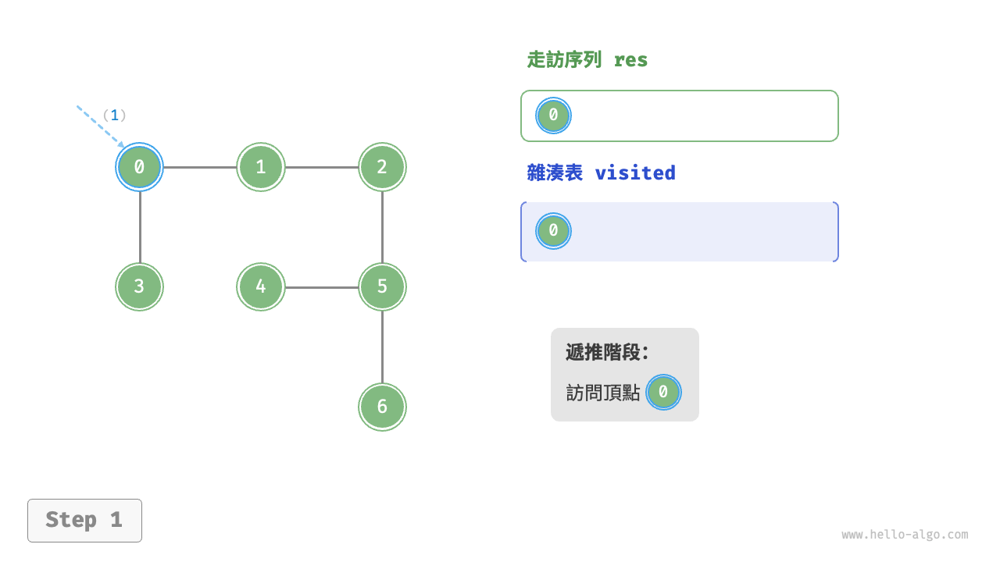{ class="animation-figure" }

=== "<2>"
    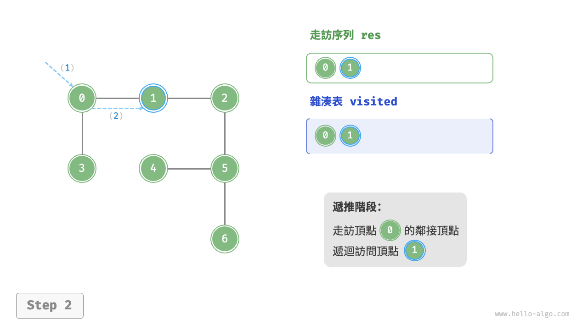{ class="animation-figure" }

=== "<3>"
    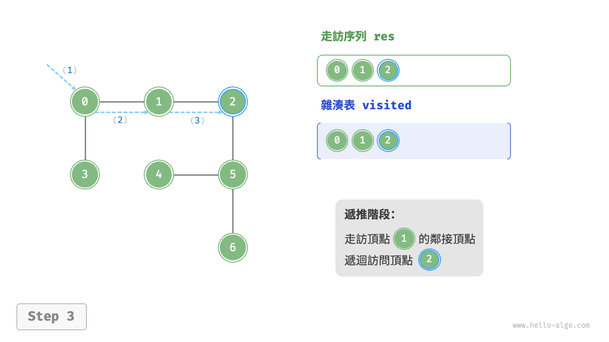{ class="animation-figure" }

=== "<4>"
    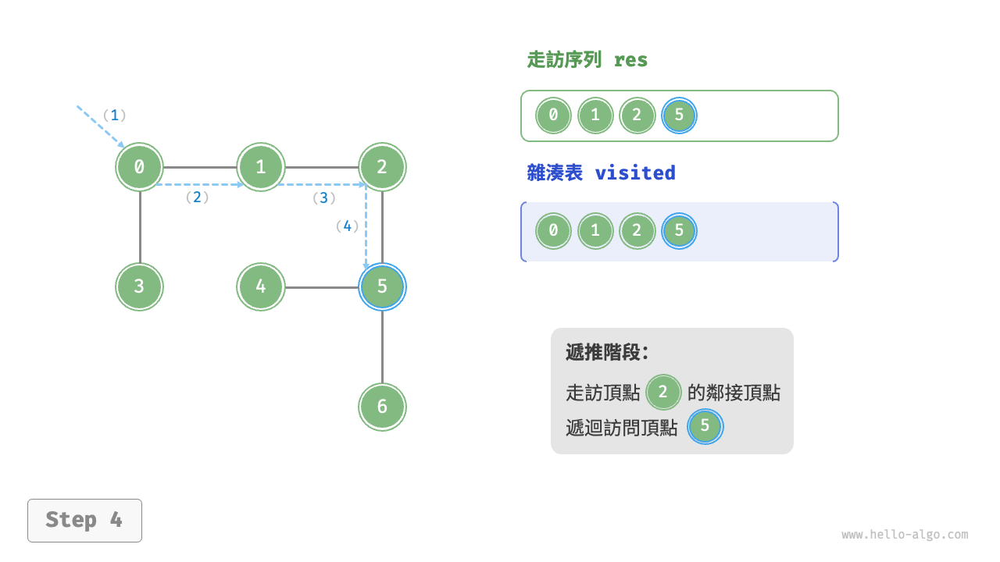{ class="animation-figure" }

=== "<5>"
    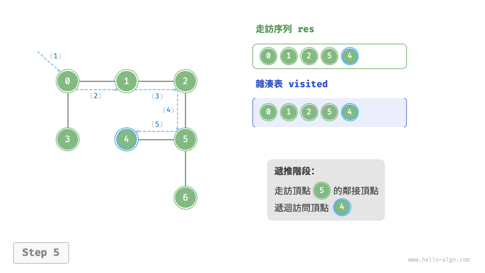{ class="animation-figure" }

=== "<6>"
    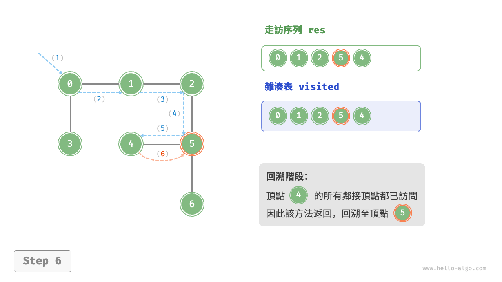{ class="animation-figure" }

=== "<7>"
    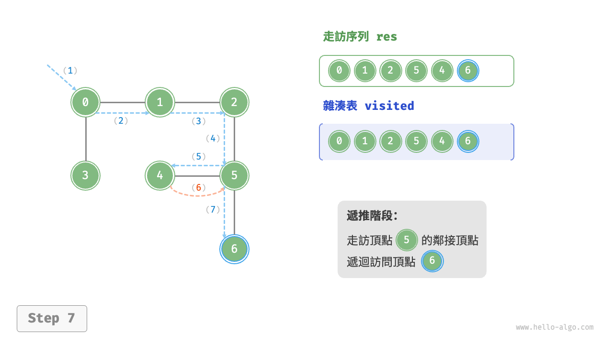{ class="animation-figure" }

=== "<8>"
    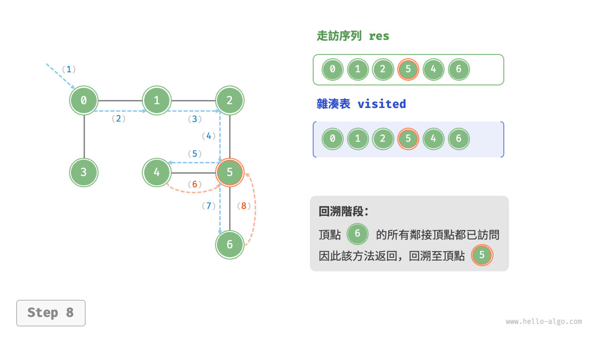{ class="animation-figure" }

=== "<9>"
    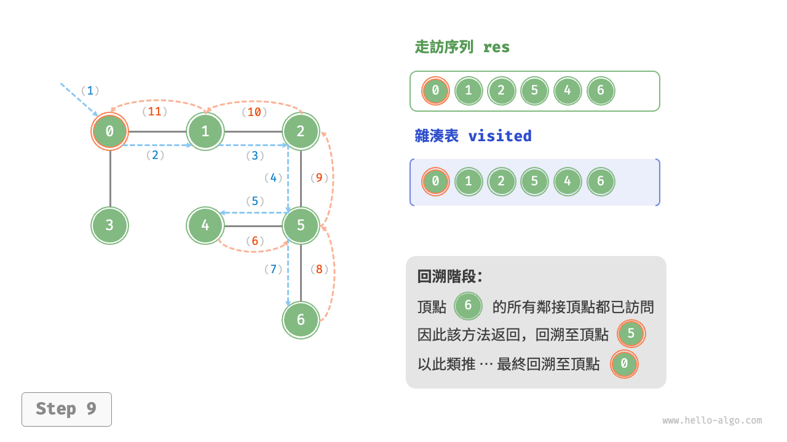{ class="animation-figure" }

=== "<10>"
    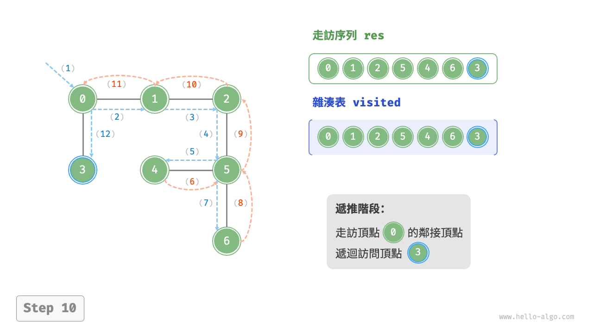{ class="animation-figure" }

=== "<11>"
    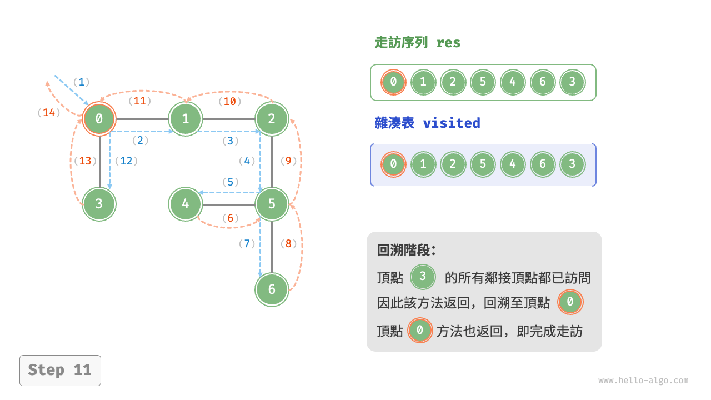{ class="animation-figure" }

<p align="center"> 圖 9-12 &nbsp; 圖的深度優先走訪步驟 </p>

!!! question "深度優先走訪的序列是否唯一？"

    與廣度優先走訪類似，深度優先走訪序列的順序也不是唯一的。給定某頂點，先往哪個方向探索都可以，即鄰接頂點的順序可以任意打亂，都是深度優先走訪。
    
    以樹的走訪為例，“根 $\rightarrow$ 左 $\rightarrow$ 右”“左 $\rightarrow$ 根 $\rightarrow$ 右”“左 $\rightarrow$ 右 $\rightarrow$ 根”分別對應前序、中序、後序走訪，它們展示了三種走訪優先順序，然而這三者都屬於深度優先走訪。

### 2. &nbsp; 複雜度分析

**時間複雜度**：所有頂點都會被訪問 $1$ 次，使用 $O(|V|)$ 時間；所有邊都會被訪問 $2$ 次，使用 $O(2|E|)$ 時間；總體使用 $O(|V| + |E|)$ 時間。

**空間複雜度**：串列 `res` ，雜湊集合 `visited` 頂點數量最多為 $|V|$ ，遞迴深度最大為 $|V|$ ，因此使用 $O(|V|)$ 空間。
