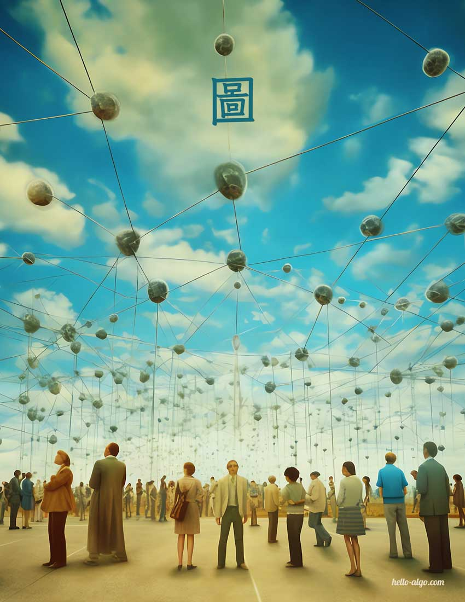

# 第 9 章 &nbsp; 圖

{ class="cover-image" }

!!! abstract

    在生命旅途中，我們就像是一個個節點，被無數看不見的邊相連。
    
    每一次的相識與相離，都在這張巨大的網路圖中留下獨特的印記。

## Chapter Contents

- [9.1 &nbsp; 圖](https://www.hello-algo.com/en/chapter_graph/graph/)
- [9.2 &nbsp; 圖基礎操作](https://www.hello-algo.com/en/chapter_graph/graph_operations/)
- [9.3 &nbsp; 圖的走訪](https://www.hello-algo.com/en/chapter_graph/graph_traversal/)
- [9.4 &nbsp; 小結](https://www.hello-algo.com/en/chapter_graph/summary/)
