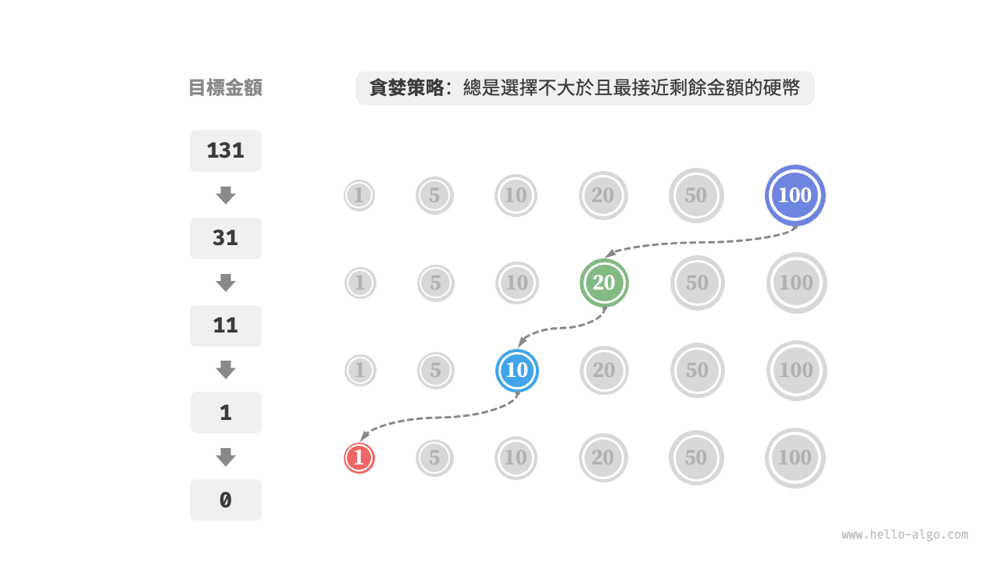
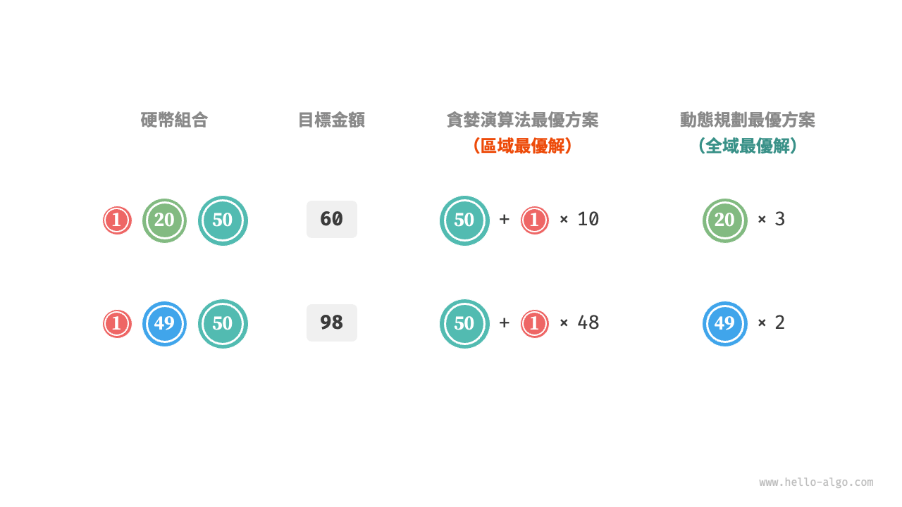

# 貪婪演算法

<u>貪婪演算法（greedy algorithm）</u>是一種常見的解決最佳化問題的演算法，其基本思想是在問題的每個決策階段，都選擇當前看起來最優的選擇，即貪婪地做出區域性最優的決策，以期獲得全域性最優解。貪婪演算法簡潔且高效，在許多實際問題中有著廣泛的應用。

貪婪演算法和動態規劃都常用於解決最佳化問題。它們之間存在一些相似之處，比如都依賴最優子結構性質，但工作原理不同。

- 動態規劃會根據之前階段的所有決策來考慮當前決策，並使用過去子問題的解來構建當前子問題的解。
- 貪婪演算法不會考慮過去的決策，而是一路向前地進行貪婪選擇，不斷縮小問題範圍，直至問題被解決。

我們先透過例題“零錢兌換”瞭解貪婪演算法的工作原理。這道題已經在“完全背包問題”章節中介紹過，相信你對它並不陌生。

!!! question

    給定 $n$ 種硬幣，第 $i$ 種硬幣的面值為 $coins[i - 1]$ ，目標金額為 $amt$ ，每種硬幣可以重複選取，問能夠湊出目標金額的最少硬幣數量。如果無法湊出目標金額，則返回 $-1$ 。

本題採取的貪婪策略如下圖所示。給定目標金額，**我們貪婪地選擇不大於且最接近它的硬幣**，不斷迴圈該步驟，直至湊出目標金額為止。



實現程式碼如下所示：

```src
[file]{coin_change_greedy}-[class]{}-[func]{coin_change_greedy}
```

你可能會不由地發出感嘆：So clean ！貪婪演算法僅用約十行程式碼就解決了零錢兌換問題。

## 貪婪演算法的優點與侷限性

**貪婪演算法不僅操作直接、實現簡單，而且通常效率也很高**。在以上程式碼中，記硬幣最小面值為 $\min(coins)$ ，則貪婪選擇最多迴圈 $amt / \min(coins)$ 次，時間複雜度為 $O(amt / \min(coins))$ 。這比動態規劃解法的時間複雜度 $O(n \times amt)$ 小了一個數量級。

然而，**對於某些硬幣面值組合，貪婪演算法並不能找到最優解**。下圖給出了兩個示例。

- **正例 $coins = [1, 5, 10, 20, 50, 100]$**：在該硬幣組合下，給定任意 $amt$ ，貪婪演算法都可以找到最優解。
- **反例 $coins = [1, 20, 50]$**：假設 $amt = 60$ ，貪婪演算法只能找到 $50 + 1 \times 10$ 的兌換組合，共計 $11$ 枚硬幣，但動態規劃可以找到最優解 $20 + 20 + 20$ ，僅需 $3$ 枚硬幣。
- **反例 $coins = [1, 49, 50]$**：假設 $amt = 98$ ，貪婪演算法只能找到 $50 + 1 \times 48$ 的兌換組合，共計 $49$ 枚硬幣，但動態規劃可以找到最優解 $49 + 49$ ，僅需 $2$ 枚硬幣。



也就是說，對於零錢兌換問題，貪婪演算法無法保證找到全域性最優解，並且有可能找到非常差的解。它更適合用動態規劃解決。

一般情況下，貪婪演算法的適用情況分以下兩種。

1. **可以保證找到最優解**：貪婪演算法在這種情況下往往是最優選擇，因為它往往比回溯、動態規劃更高效。
2. **可以找到近似最優解**：貪婪演算法在這種情況下也是可用的。對於很多複雜問題來說，尋找全域性最優解非常困難，能以較高效率找到次優解也是非常不錯的。

## 貪婪演算法特性

那麼問題來了，什麼樣的問題適合用貪婪演算法求解呢？或者說，貪婪演算法在什麼情況下可以保證找到最優解？

相較於動態規劃，貪婪演算法的使用條件更加苛刻，其主要關注問題的兩個性質。

- **貪婪選擇性質**：只有當局部最優選擇始終可以導致全域性最優解時，貪婪演算法才能保證得到最優解。
- **最優子結構**：原問題的最優解包含子問題的最優解。

最優子結構已經在“動態規劃”章節中介紹過，這裡不再贅述。值得注意的是，一些問題的最優子結構並不明顯，但仍然可使用貪婪演算法解決。

我們主要探究貪婪選擇性質的判斷方法。雖然它的描述看上去比較簡單，**但實際上對於許多問題，證明貪婪選擇性質並非易事**。

例如零錢兌換問題，我們雖然能夠容易地舉出反例，對貪婪選擇性質進行證偽，但證實的難度較大。如果問：**滿足什麼條件的硬幣組合可以使用貪婪演算法求解**？我們往往只能憑藉直覺或舉例子來給出一個模稜兩可的答案，而難以給出嚴謹的數學證明。

!!! quote

    有一篇論文給出了一個 $O(n^3)$ 時間複雜度的演算法，用於判斷一個硬幣組合能否使用貪婪演算法找出任意金額的最優解。

    Pearson, D. A polynomial-time algorithm for the change-making problem[J]. Operations Research Letters, 2005, 33(3): 231-234.

## 貪婪演算法解題步驟

貪婪問題的解決流程大體可分為以下三步。

1. **問題分析**：梳理與理解問題特性，包括狀態定義、最佳化目標和約束條件等。這一步在回溯和動態規劃中都有涉及。
2. **確定貪婪策略**：確定如何在每一步中做出貪婪選擇。這個策略能夠在每一步減小問題的規模，並最終解決整個問題。
3. **正確性證明**：通常需要證明問題具有貪婪選擇性質和最優子結構。這個步驟可能需要用到數學證明，例如歸納法或反證法等。

確定貪婪策略是求解問題的核心步驟，但實施起來可能並不容易，主要有以下原因。

- **不同問題的貪婪策略的差異較大**。對於許多問題來說，貪婪策略比較淺顯，我們透過一些大概的思考與嘗試就能得出。而對於一些複雜問題，貪婪策略可能非常隱蔽，這種情況就非常考驗個人的解題經驗與演算法能力了。
- **某些貪婪策略具有較強的迷惑性**。當我們滿懷信心設計好貪婪策略，寫出解題程式碼並提交執行，很可能發現部分測試樣例無法透過。這是因為設計的貪婪策略只是“部分正確”的，上文介紹的零錢兌換就是一個典型案例。

為了保證正確性，我們應該對貪婪策略進行嚴謹的數學證明，**通常需要用到反證法或數學歸納法**。

然而，正確性證明也很可能不是一件易事。如若沒有頭緒，我們通常會選擇面向測試用例進行程式碼除錯，一步步修改與驗證貪婪策略。

## 貪婪演算法典型例題

貪婪演算法常常應用在滿足貪婪選擇性質和最優子結構的最佳化問題中，以下列舉了一些典型的貪婪演算法問題。

- **硬幣找零問題**：在某些硬幣組合下，貪婪演算法總是可以得到最優解。
- **區間排程問題**：假設你有一些任務，每個任務在一段時間內進行，你的目標是完成儘可能多的任務。如果每次都選擇結束時間最早的任務，那麼貪婪演算法就可以得到最優解。
- **分數背包問題**：給定一組物品和一個載重量，你的目標是選擇一組物品，使得總重量不超過載重量，且總價值最大。如果每次都選擇價效比最高（價值 / 重量）的物品，那麼貪婪演算法在一些情況下可以得到最優解。
- **股票買賣問題**：給定一組股票的歷史價格，你可以進行多次買賣，但如果你已經持有股票，那麼在賣出之前不能再買，目標是獲取最大利潤。
- **霍夫曼編碼**：霍夫曼編碼是一種用於無損資料壓縮的貪婪演算法。透過構建霍夫曼樹，每次選擇出現頻率最低的兩個節點合併，最後得到的霍夫曼樹的帶權路徑長度（編碼長度）最小。
- **Dijkstra 演算法**：它是一種解決給定源頂點到其餘各頂點的最短路徑問題的貪婪演算法。
