# 15.3 &nbsp; 最大容量問題

!!! question

    輸入一個陣列 $ht$ ，其中的每個元素代表一個垂直隔板的高度。陣列中的任意兩個隔板，以及它們之間的空間可以組成一個容器。
    
    容器的容量等於高度和寬度的乘積（面積），其中高度由較短的隔板決定，寬度是兩個隔板的陣列索引之差。
    
    請在陣列中選擇兩個隔板，使得組成的容器的容量最大，返回最大容量。示例如圖 15-7 所示。

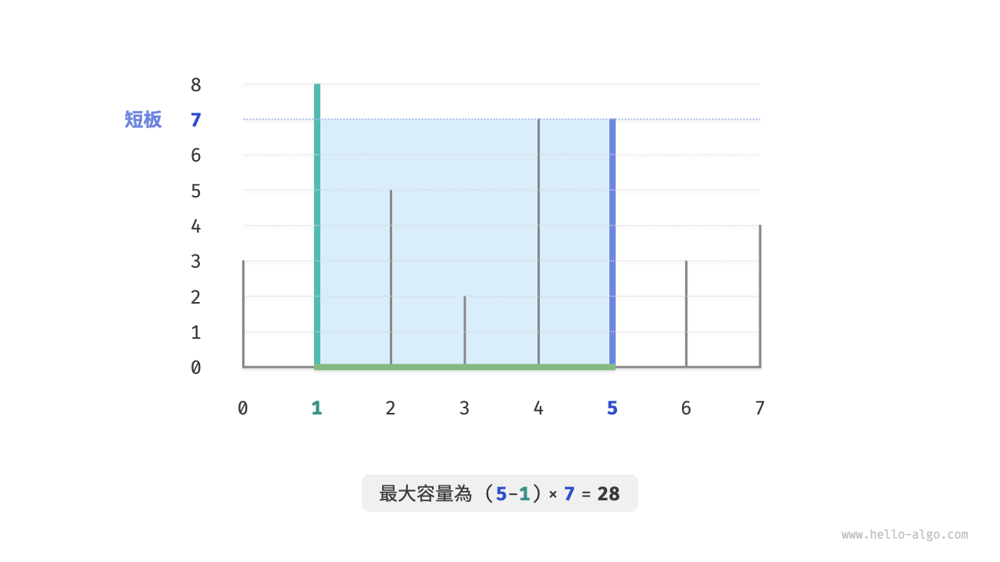{ class="animation-figure" }

<p align="center"> 圖 15-7 &nbsp; 最大容量問題的示例資料 </p>

容器由任意兩個隔板圍成，**因此本題的狀態為兩個隔板的索引，記為 $[i, j]$** 。

根據題意，容量等於高度乘以寬度，其中高度由短板決定，寬度是兩隔板的陣列索引之差。設容量為 $cap[i, j]$ ，則可得計算公式：

$$
cap[i, j] = \min(ht[i], ht[j]) \times (j - i)
$$

設陣列長度為 $n$ ，兩個隔板的組合數量（狀態總數）為 $C_n^2 = \frac{n(n - 1)}{2}$ 個。最直接地，**我們可以窮舉所有狀態**，從而求得最大容量，時間複雜度為 $O(n^2)$ 。

### 1. &nbsp; 貪婪策略確定

這道題還有更高效率的解法。如圖 15-8 所示，現選取一個狀態 $[i, j]$ ，其滿足索引 $i < j$ 且高度 $ht[i] < ht[j]$ ，即 $i$ 為短板、$j$ 為長板。

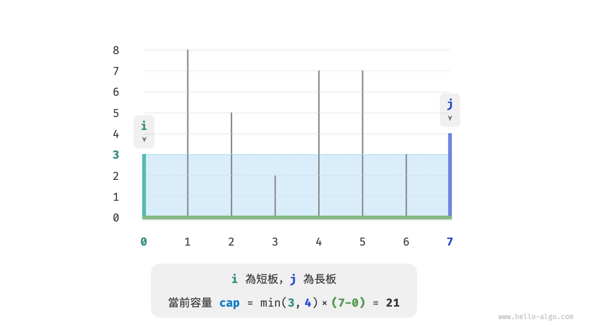{ class="animation-figure" }

<p align="center"> 圖 15-8 &nbsp; 初始狀態 </p>

如圖 15-9 所示，**若此時將長板 $j$ 向短板 $i$ 靠近，則容量一定變小**。

這是因為在移動長板 $j$ 後，寬度 $j-i$ 肯定變小；而高度由短板決定，因此高度只可能不變（ $i$ 仍為短板）或變小（移動後的 $j$ 成為短板）。

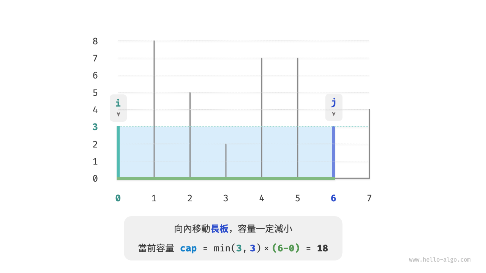{ class="animation-figure" }

<p align="center"> 圖 15-9 &nbsp; 向內移動長板後的狀態 </p>

反向思考，**我們只有向內收縮短板 $i$ ，才有可能使容量變大**。因為雖然寬度一定變小，**但高度可能會變大**（移動後的短板 $i$ 可能會變長）。例如在圖 15-10 中，移動短板後面積變大。

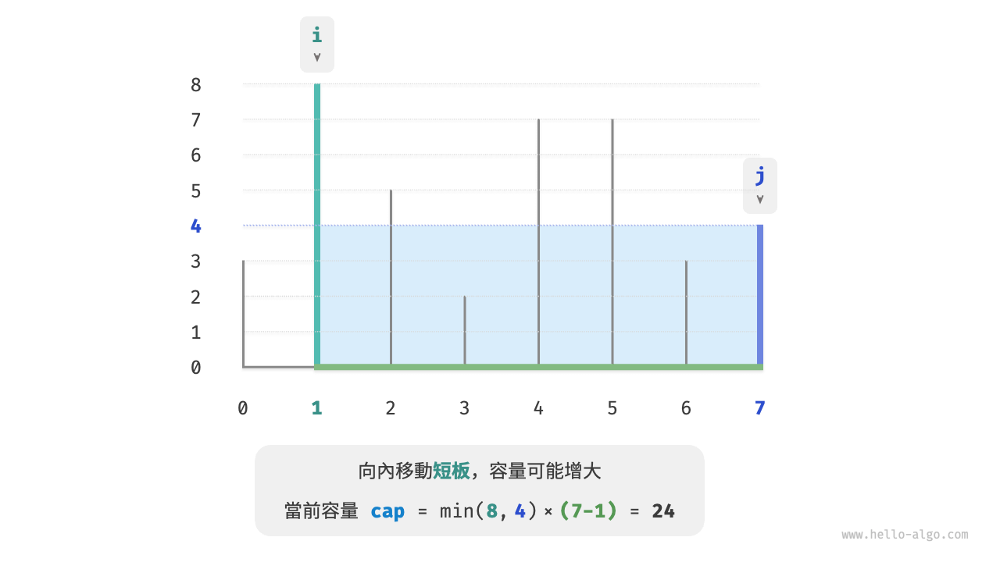{ class="animation-figure" }

<p align="center"> 圖 15-10 &nbsp; 向內移動短板後的狀態 </p>

由此便可推出本題的貪婪策略：初始化兩指標，使其分列容器兩端，每輪向內收縮短板對應的指標，直至兩指標相遇。

圖 15-11 展示了貪婪策略的執行過程。

1. 初始狀態下，指標 $i$ 和 $j$ 分列陣列兩端。
2. 計算當前狀態的容量 $cap[i, j]$ ，並更新最大容量。
3. 比較板 $i$ 和 板 $j$ 的高度，並將短板向內移動一格。
4. 迴圈執行第 `2.` 步和第 `3.` 步，直至 $i$ 和 $j$ 相遇時結束。

=== "<1>"
    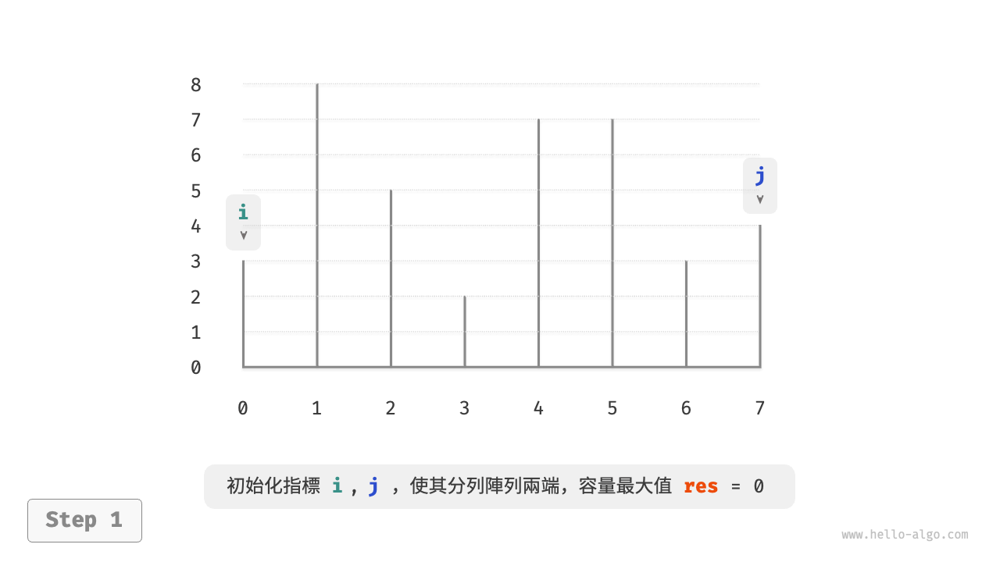{ class="animation-figure" }

=== "<2>"
    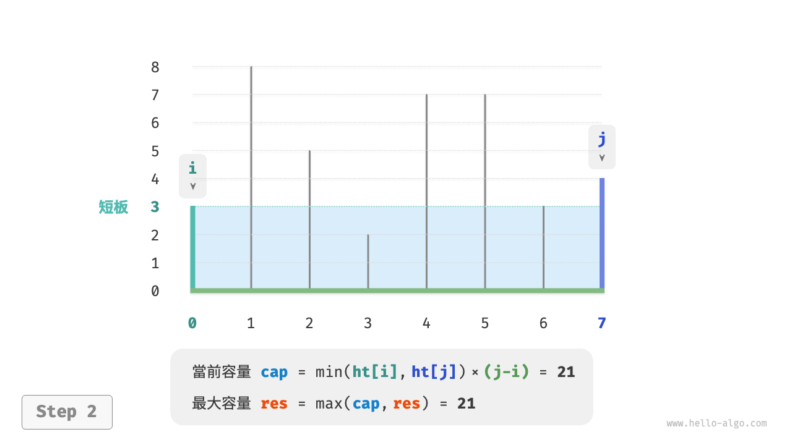{ class="animation-figure" }

=== "<3>"
    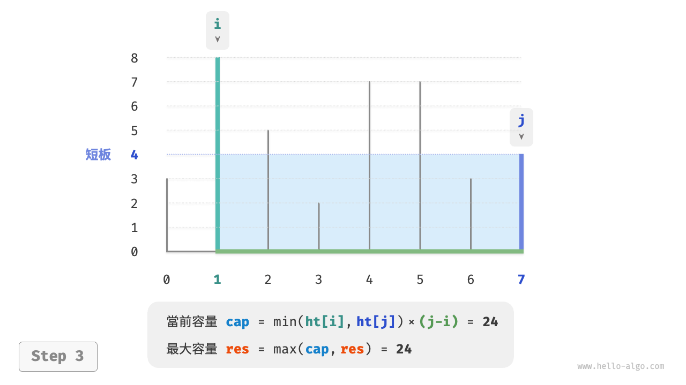{ class="animation-figure" }

=== "<4>"
    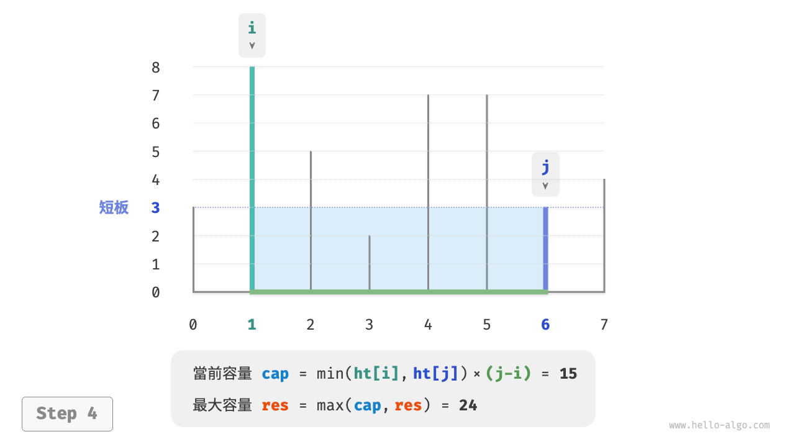{ class="animation-figure" }

=== "<5>"
    { class="animation-figure" }

=== "<6>"
    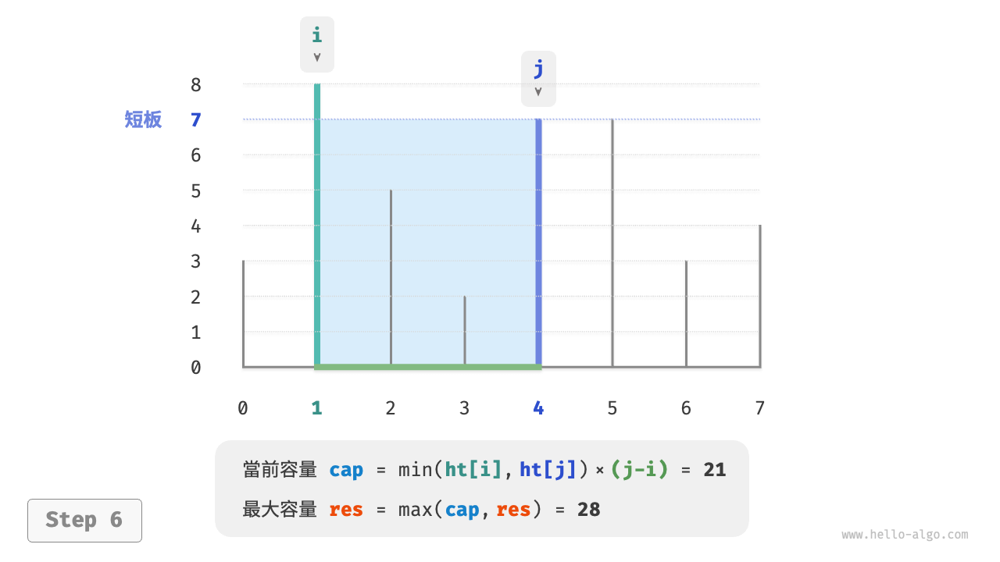{ class="animation-figure" }

=== "<7>"
    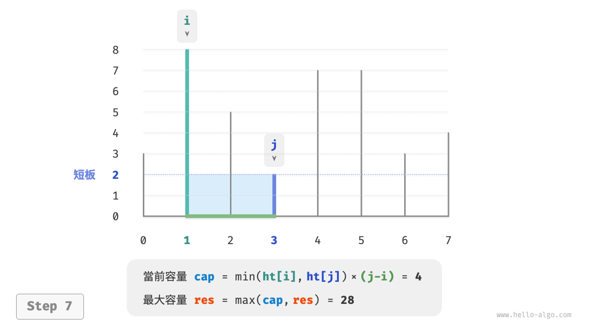{ class="animation-figure" }

=== "<8>"
    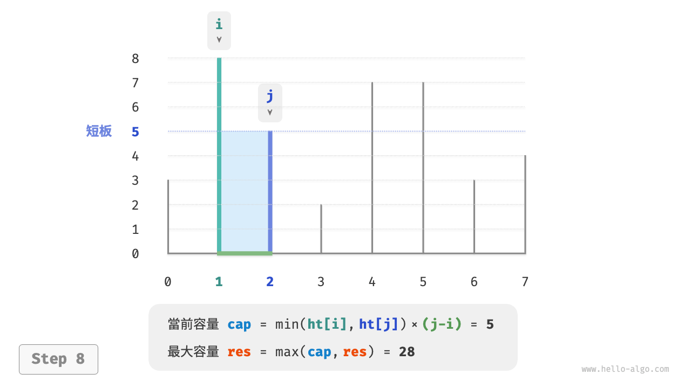{ class="animation-figure" }

=== "<9>"
    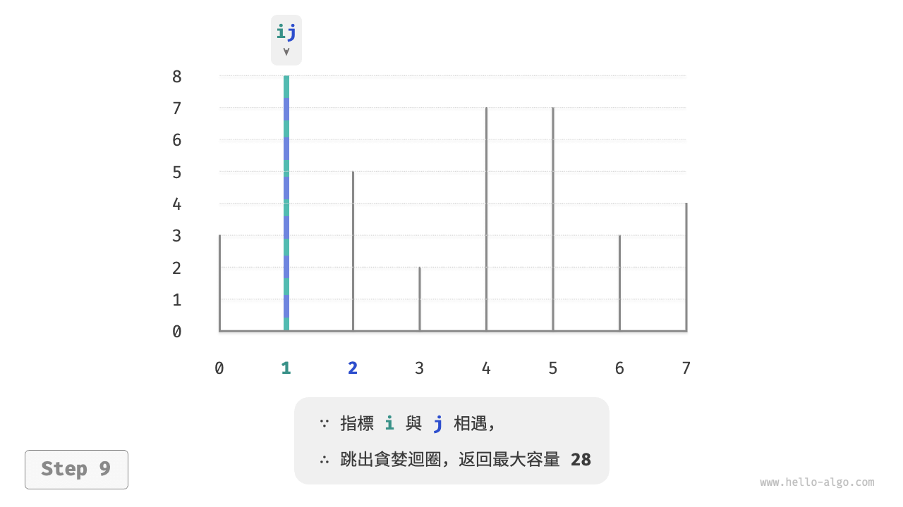{ class="animation-figure" }

<p align="center"> 圖 15-11 &nbsp; 最大容量問題的貪婪過程 </p>

### 2. &nbsp; 程式碼實現

程式碼迴圈最多 $n$ 輪，**因此時間複雜度為 $O(n)$** 。

變數 $i$、$j$、$res$ 使用常數大小的額外空間，**因此空間複雜度為 $O(1)$** 。

=== "Python"

    ```python title="max_capacity.py"
    def max_capacity(ht: list[int]) -> int:
        """最大容量：貪婪"""
        # 初始化 i, j，使其分列陣列兩端
        i, j = 0, len(ht) - 1
        # 初始最大容量為 0
        res = 0
        # 迴圈貪婪選擇，直至兩板相遇
        while i < j:
            # 更新最大容量
            cap = min(ht[i], ht[j]) * (j - i)
            res = max(res, cap)
            # 向內移動短板
            if ht[i] < ht[j]:
                i += 1
            else:
                j -= 1
        return res
    ```

=== "C++"

    ```cpp title="max_capacity.cpp"
    /* 最大容量：貪婪 */
    int maxCapacity(vector<int> &ht) {
        // 初始化 i, j，使其分列陣列兩端
        int i = 0, j = ht.size() - 1;
        // 初始最大容量為 0
        int res = 0;
        // 迴圈貪婪選擇，直至兩板相遇
        while (i < j) {
            // 更新最大容量
            int cap = min(ht[i], ht[j]) * (j - i);
            res = max(res, cap);
            // 向內移動短板
            if (ht[i] < ht[j]) {
                i++;
            } else {
                j--;
            }
        }
        return res;
    }
    ```

=== "Java"

    ```java title="max_capacity.java"
    /* 最大容量：貪婪 */
    int maxCapacity(int[] ht) {
        // 初始化 i, j，使其分列陣列兩端
        int i = 0, j = ht.length - 1;
        // 初始最大容量為 0
        int res = 0;
        // 迴圈貪婪選擇，直至兩板相遇
        while (i < j) {
            // 更新最大容量
            int cap = Math.min(ht[i], ht[j]) * (j - i);
            res = Math.max(res, cap);
            // 向內移動短板
            if (ht[i] < ht[j]) {
                i++;
            } else {
                j--;
            }
        }
        return res;
    }
    ```

=== "C#"

    ```csharp title="max_capacity.cs"
    /* 最大容量：貪婪 */
    int MaxCapacity(int[] ht) {
        // 初始化 i, j，使其分列陣列兩端
        int i = 0, j = ht.Length - 1;
        // 初始最大容量為 0
        int res = 0;
        // 迴圈貪婪選擇，直至兩板相遇
        while (i < j) {
            // 更新最大容量
            int cap = Math.Min(ht[i], ht[j]) * (j - i);
            res = Math.Max(res, cap);
            // 向內移動短板
            if (ht[i] < ht[j]) {
                i++;
            } else {
                j--;
            }
        }
        return res;
    }
    ```

=== "Go"

    ```go title="max_capacity.go"
    /* 最大容量：貪婪 */
    func maxCapacity(ht []int) int {
        // 初始化 i, j，使其分列陣列兩端
        i, j := 0, len(ht)-1
        // 初始最大容量為 0
        res := 0
        // 迴圈貪婪選擇，直至兩板相遇
        for i < j {
            // 更新最大容量
            capacity := int(math.Min(float64(ht[i]), float64(ht[j]))) * (j - i)
            res = int(math.Max(float64(res), float64(capacity)))
            // 向內移動短板
            if ht[i] < ht[j] {
                i++
            } else {
                j--
            }
        }
        return res
    }
    ```

=== "Swift"

    ```swift title="max_capacity.swift"
    /* 最大容量：貪婪 */
    func maxCapacity(ht: [Int]) -> Int {
        // 初始化 i, j，使其分列陣列兩端
        var i = ht.startIndex, j = ht.endIndex - 1
        // 初始最大容量為 0
        var res = 0
        // 迴圈貪婪選擇，直至兩板相遇
        while i < j {
            // 更新最大容量
            let cap = min(ht[i], ht[j]) * (j - i)
            res = max(res, cap)
            // 向內移動短板
            if ht[i] < ht[j] {
                i += 1
            } else {
                j -= 1
            }
        }
        return res
    }
    ```

=== "JS"

    ```javascript title="max_capacity.js"
    /* 最大容量：貪婪 */
    function maxCapacity(ht) {
        // 初始化 i, j，使其分列陣列兩端
        let i = 0,
            j = ht.length - 1;
        // 初始最大容量為 0
        let res = 0;
        // 迴圈貪婪選擇，直至兩板相遇
        while (i < j) {
            // 更新最大容量
            const cap = Math.min(ht[i], ht[j]) * (j - i);
            res = Math.max(res, cap);
            // 向內移動短板
            if (ht[i] < ht[j]) {
                i += 1;
            } else {
                j -= 1;
            }
        }
        return res;
    }
    ```

=== "TS"

    ```typescript title="max_capacity.ts"
    /* 最大容量：貪婪 */
    function maxCapacity(ht: number[]): number {
        // 初始化 i, j，使其分列陣列兩端
        let i = 0,
            j = ht.length - 1;
        // 初始最大容量為 0
        let res = 0;
        // 迴圈貪婪選擇，直至兩板相遇
        while (i < j) {
            // 更新最大容量
            const cap: number = Math.min(ht[i], ht[j]) * (j - i);
            res = Math.max(res, cap);
            // 向內移動短板
            if (ht[i] < ht[j]) {
                i += 1;
            } else {
                j -= 1;
            }
        }
        return res;
    }
    ```

=== "Dart"

    ```dart title="max_capacity.dart"
    /* 最大容量：貪婪 */
    int maxCapacity(List<int> ht) {
      // 初始化 i, j，使其分列陣列兩端
      int i = 0, j = ht.length - 1;
      // 初始最大容量為 0
      int res = 0;
      // 迴圈貪婪選擇，直至兩板相遇
      while (i < j) {
        // 更新最大容量
        int cap = min(ht[i], ht[j]) * (j - i);
        res = max(res, cap);
        // 向內移動短板
        if (ht[i] < ht[j]) {
          i++;
        } else {
          j--;
        }
      }
      return res;
    }
    ```

=== "Rust"

    ```rust title="max_capacity.rs"
    /* 最大容量：貪婪 */
    fn max_capacity(ht: &[i32]) -> i32 {
        // 初始化 i, j，使其分列陣列兩端
        let mut i = 0;
        let mut j = ht.len() - 1;
        // 初始最大容量為 0
        let mut res = 0;
        // 迴圈貪婪選擇，直至兩板相遇
        while i < j {
            // 更新最大容量
            let cap = std::cmp::min(ht[i], ht[j]) * (j - i) as i32;
            res = std::cmp::max(res, cap);
            // 向內移動短板
            if ht[i] < ht[j] {
                i += 1;
            } else {
                j -= 1;
            }
        }
        res
    }
    ```

=== "C"

    ```c title="max_capacity.c"
    /* 最大容量：貪婪 */
    int maxCapacity(int ht[], int htLength) {
        // 初始化 i, j，使其分列陣列兩端
        int i = 0;
        int j = htLength - 1;
        // 初始最大容量為 0
        int res = 0;
        // 迴圈貪婪選擇，直至兩板相遇
        while (i < j) {
            // 更新最大容量
            int capacity = myMin(ht[i], ht[j]) * (j - i);
            res = myMax(res, capacity);
            // 向內移動短板
            if (ht[i] < ht[j]) {
                i++;
            } else {
                j--;
            }
        }
        return res;
    }
    ```

=== "Kotlin"

    ```kotlin title="max_capacity.kt"
    /* 最大容量：貪婪 */
    fun maxCapacity(ht: IntArray): Int {
        // 初始化 i, j，使其分列陣列兩端
        var i = 0
        var j = ht.size - 1
        // 初始最大容量為 0
        var res = 0
        // 迴圈貪婪選擇，直至兩板相遇
        while (i < j) {
            // 更新最大容量
            val cap = (min(ht[i].toDouble(), ht[j].toDouble()) * (j - i)).toInt()
            res = max(res.toDouble(), cap.toDouble()).toInt()
            // 向內移動短板
            if (ht[i] < ht[j]) {
                i++
            } else {
                j--
            }
        }
        return res
    }
    ```

=== "Ruby"

    ```ruby title="max_capacity.rb"
    [class]{}-[func]{max_capacity}
    ```

=== "Zig"

    ```zig title="max_capacity.zig"
    [class]{}-[func]{maxCapacity}
    ```

??? pythontutor "視覺化執行"

    <div style="height: 549px; width: 100%;"><iframe class="pythontutor-iframe" src="https://pythontutor.com/iframe-embed.html#code=def%20max_capacity%28ht%3A%20list%5Bint%5D%29%20-%3E%20int%3A%0A%20%20%20%20%22%22%22%E6%9C%80%E5%A4%A7%E5%AE%B9%E9%87%8F%EF%BC%9A%E8%B4%AA%E5%BF%83%22%22%22%0A%20%20%20%20%23%20%E5%88%9D%E5%A7%8B%E5%8C%96%20i,%20j%EF%BC%8C%E4%BD%BF%E5%85%B6%E5%88%86%E5%88%97%E6%95%B0%E7%BB%84%E4%B8%A4%E7%AB%AF%0A%20%20%20%20i,%20j%20%3D%200,%20len%28ht%29%20-%201%0A%20%20%20%20%23%20%E5%88%9D%E5%A7%8B%E6%9C%80%E5%A4%A7%E5%AE%B9%E9%87%8F%E4%B8%BA%200%0A%20%20%20%20res%20%3D%200%0A%20%20%20%20%23%20%E5%BE%AA%E7%8E%AF%E8%B4%AA%E5%BF%83%E9%80%89%E6%8B%A9%EF%BC%8C%E7%9B%B4%E8%87%B3%E4%B8%A4%E6%9D%BF%E7%9B%B8%E9%81%87%0A%20%20%20%20while%20i%20%3C%20j%3A%0A%20%20%20%20%20%20%20%20%23%20%E6%9B%B4%E6%96%B0%E6%9C%80%E5%A4%A7%E5%AE%B9%E9%87%8F%0A%20%20%20%20%20%20%20%20cap%20%3D%20min%28ht%5Bi%5D,%20ht%5Bj%5D%29%20*%20%28j%20-%20i%29%0A%20%20%20%20%20%20%20%20res%20%3D%20max%28res,%20cap%29%0A%20%20%20%20%20%20%20%20%23%20%E5%90%91%E5%86%85%E7%A7%BB%E5%8A%A8%E7%9F%AD%E6%9D%BF%0A%20%20%20%20%20%20%20%20if%20ht%5Bi%5D%20%3C%20ht%5Bj%5D%3A%0A%20%20%20%20%20%20%20%20%20%20%20%20i%20%2B%3D%201%0A%20%20%20%20%20%20%20%20else%3A%0A%20%20%20%20%20%20%20%20%20%20%20%20j%20-%3D%201%0A%20%20%20%20return%20res%0A%0A%0A%22%22%22Driver%20Code%22%22%22%0Aif%20__name__%20%3D%3D%20%22__main__%22%3A%0A%20%20%20%20ht%20%3D%20%5B3,%208,%205,%202,%207,%207,%203,%204%5D%0A%0A%20%20%20%20%23%20%E8%B4%AA%E5%BF%83%E7%AE%97%E6%B3%95%0A%20%20%20%20res%20%3D%20max_capacity%28ht%29%0A%20%20%20%20print%28f%22%E6%9C%80%E5%A4%A7%E5%AE%B9%E9%87%8F%E4%B8%BA%20%7Bres%7D%22%29&codeDivHeight=472&codeDivWidth=350&cumulative=false&curInstr=4&heapPrimitives=nevernest&origin=opt-frontend.js&py=311&rawInputLstJSON=%5B%5D&textReferences=false"> </iframe></div>
    <div style="margin-top: 5px;"><a href="https://pythontutor.com/iframe-embed.html#code=def%20max_capacity%28ht%3A%20list%5Bint%5D%29%20-%3E%20int%3A%0A%20%20%20%20%22%22%22%E6%9C%80%E5%A4%A7%E5%AE%B9%E9%87%8F%EF%BC%9A%E8%B4%AA%E5%BF%83%22%22%22%0A%20%20%20%20%23%20%E5%88%9D%E5%A7%8B%E5%8C%96%20i,%20j%EF%BC%8C%E4%BD%BF%E5%85%B6%E5%88%86%E5%88%97%E6%95%B0%E7%BB%84%E4%B8%A4%E7%AB%AF%0A%20%20%20%20i,%20j%20%3D%200,%20len%28ht%29%20-%201%0A%20%20%20%20%23%20%E5%88%9D%E5%A7%8B%E6%9C%80%E5%A4%A7%E5%AE%B9%E9%87%8F%E4%B8%BA%200%0A%20%20%20%20res%20%3D%200%0A%20%20%20%20%23%20%E5%BE%AA%E7%8E%AF%E8%B4%AA%E5%BF%83%E9%80%89%E6%8B%A9%EF%BC%8C%E7%9B%B4%E8%87%B3%E4%B8%A4%E6%9D%BF%E7%9B%B8%E9%81%87%0A%20%20%20%20while%20i%20%3C%20j%3A%0A%20%20%20%20%20%20%20%20%23%20%E6%9B%B4%E6%96%B0%E6%9C%80%E5%A4%A7%E5%AE%B9%E9%87%8F%0A%20%20%20%20%20%20%20%20cap%20%3D%20min%28ht%5Bi%5D,%20ht%5Bj%5D%29%20*%20%28j%20-%20i%29%0A%20%20%20%20%20%20%20%20res%20%3D%20max%28res,%20cap%29%0A%20%20%20%20%20%20%20%20%23%20%E5%90%91%E5%86%85%E7%A7%BB%E5%8A%A8%E7%9F%AD%E6%9D%BF%0A%20%20%20%20%20%20%20%20if%20ht%5Bi%5D%20%3C%20ht%5Bj%5D%3A%0A%20%20%20%20%20%20%20%20%20%20%20%20i%20%2B%3D%201%0A%20%20%20%20%20%20%20%20else%3A%0A%20%20%20%20%20%20%20%20%20%20%20%20j%20-%3D%201%0A%20%20%20%20return%20res%0A%0A%0A%22%22%22Driver%20Code%22%22%22%0Aif%20__name__%20%3D%3D%20%22__main__%22%3A%0A%20%20%20%20ht%20%3D%20%5B3,%208,%205,%202,%207,%207,%203,%204%5D%0A%0A%20%20%20%20%23%20%E8%B4%AA%E5%BF%83%E7%AE%97%E6%B3%95%0A%20%20%20%20res%20%3D%20max_capacity%28ht%29%0A%20%20%20%20print%28f%22%E6%9C%80%E5%A4%A7%E5%AE%B9%E9%87%8F%E4%B8%BA%20%7Bres%7D%22%29&codeDivHeight=800&codeDivWidth=600&cumulative=false&curInstr=4&heapPrimitives=nevernest&origin=opt-frontend.js&py=311&rawInputLstJSON=%5B%5D&textReferences=false" target="_blank" rel="noopener noreferrer">全螢幕觀看 ></a></div>

### 3. &nbsp; 正確性證明

之所以貪婪比窮舉更快，是因為每輪的貪婪選擇都會“跳過”一些狀態。

比如在狀態 $cap[i, j]$ 下，$i$ 為短板、$j$ 為長板。若貪婪地將短板 $i$ 向內移動一格，會導致圖 15-12 所示的狀態被“跳過”。**這意味著之後無法驗證這些狀態的容量大小**。

$$
cap[i, i+1], cap[i, i+2], \dots, cap[i, j-2], cap[i, j-1]
$$

{ class="animation-figure" }

<p align="center"> 圖 15-12 &nbsp; 移動短板導致被跳過的狀態 </p>

觀察發現，**這些被跳過的狀態實際上就是將長板 $j$ 向內移動的所有狀態**。前面我們已經證明內移長板一定會導致容量變小。也就是說，被跳過的狀態都不可能是最優解，**跳過它們不會導致錯過最優解**。

以上分析說明，移動短板的操作是“安全”的，貪婪策略是有效的。
