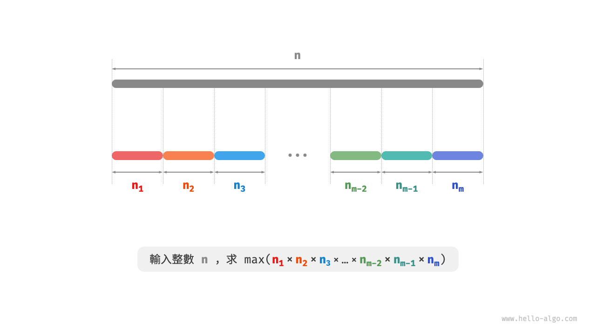
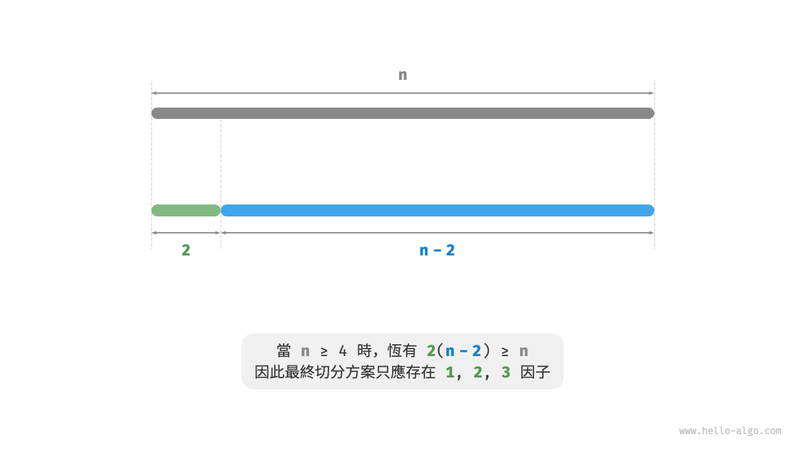
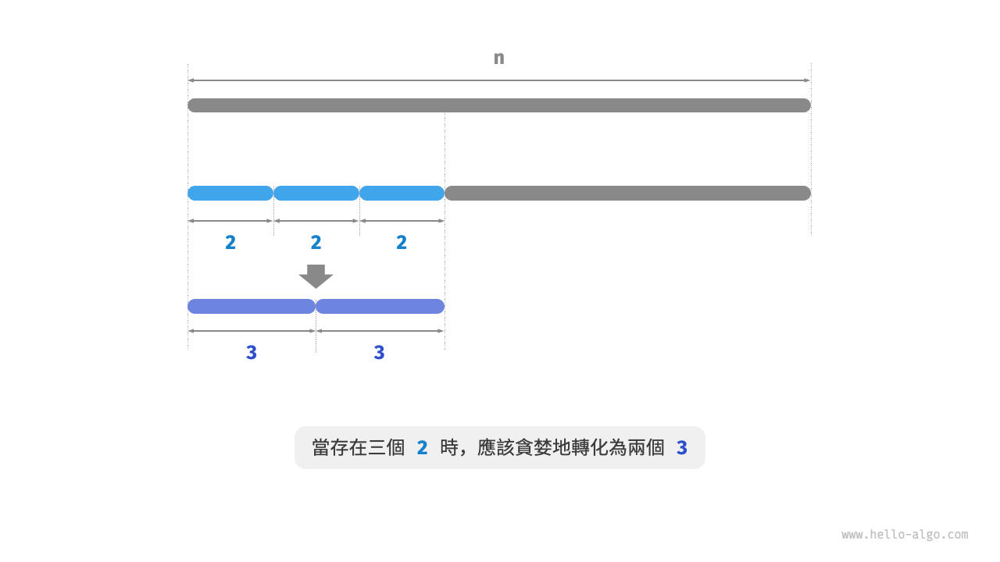
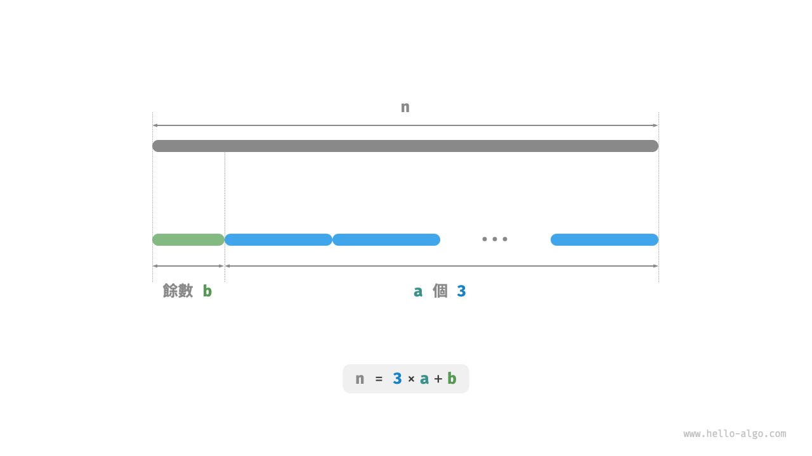

# 15.4 &nbsp; 最大切分乘積問題

!!! question

    給定一個正整數 $n$ ，將其切分為至少兩個正整數的和，求切分後所有整數的乘積最大是多少，如圖 15-13 所示。

{ class="animation-figure" }

<p align="center"> 圖 15-13 &nbsp; 最大切分乘積的問題定義 </p>

假設我們將 $n$ 切分為 $m$ 個整數因子，其中第 $i$ 個因子記為 $n_i$ ，即

$$
n = \sum_{i=1}^{m}n_i
$$

本題的目標是求得所有整數因子的最大乘積，即

$$
\max(\prod_{i=1}^{m}n_i)
$$

我們需要思考的是：切分數量 $m$ 應該多大，每個 $n_i$ 應該是多少？

### 1. &nbsp; 貪婪策略確定

根據經驗，兩個整數的乘積往往比它們的加和更大。假設從 $n$ 中分出一個因子 $2$ ，則它們的乘積為 $2(n-2)$ 。我們將該乘積與 $n$ 作比較：

$$
\begin{aligned}
2(n-2) & \geq n \newline
2n - n - 4 & \geq 0 \newline
n & \geq 4
\end{aligned}
$$

如圖 15-14 所示，當 $n \geq 4$ 時，切分出一個 $2$ 後乘積會變大，**這說明大於等於 $4$ 的整數都應該被切分**。

**貪婪策略一**：如果切分方案中包含 $\geq 4$ 的因子，那麼它就應該被繼續切分。最終的切分方案只應出現 $1$、$2$、$3$ 這三種因子。

{ class="animation-figure" }

<p align="center"> 圖 15-14 &nbsp; 切分導致乘積變大 </p>

接下來思考哪個因子是最優的。在 $1$、$2$、$3$ 這三個因子中，顯然 $1$ 是最差的，因為 $1 \times (n-1) < n$ 恆成立，即切分出 $1$ 反而會導致乘積減小。

如圖 15-15 所示，當 $n = 6$ 時，有 $3 \times 3 > 2 \times 2 \times 2$ 。**這意味著切分出 $3$ 比切分出 $2$ 更優**。

**貪婪策略二**：在切分方案中，最多隻應存在兩個 $2$ 。因為三個 $2$ 總是可以替換為兩個 $3$ ，從而獲得更大的乘積。

{ class="animation-figure" }

<p align="center"> 圖 15-15 &nbsp; 最優切分因子 </p>

綜上所述，可推理出以下貪婪策略。

1. 輸入整數 $n$ ，從其不斷地切分出因子 $3$ ，直至餘數為 $0$、$1$、$2$ 。
2. 當餘數為 $0$ 時，代表 $n$ 是 $3$ 的倍數，因此不做任何處理。
3. 當餘數為 $2$ 時，不繼續劃分，保留。
4. 當餘數為 $1$ 時，由於 $2 \times 2 > 1 \times 3$ ，因此應將最後一個 $3$ 替換為 $2$ 。

### 2. &nbsp; 程式碼實現

如圖 15-16 所示，我們無須透過迴圈來切分整數，而可以利用向下整除運算得到 $3$ 的個數 $a$ ，用取模運算得到餘數 $b$ ，此時有：

$$
n = 3 a + b
$$

請注意，對於 $n \leq 3$ 的邊界情況，必須拆分出一個 $1$ ，乘積為 $1 \times (n - 1)$ 。

=== "Python"

    ```python title="max_product_cutting.py"
    def max_product_cutting(n: int) -> int:
        """最大切分乘積：貪婪"""
        # 當 n <= 3 時，必須切分出一個 1
        if n <= 3:
            return 1 * (n - 1)
        # 貪婪地切分出 3 ，a 為 3 的個數，b 為餘數
        a, b = n // 3, n % 3
        if b == 1:
            # 當餘數為 1 時，將一對 1 * 3 轉化為 2 * 2
            return int(math.pow(3, a - 1)) * 2 * 2
        if b == 2:
            # 當餘數為 2 時，不做處理
            return int(math.pow(3, a)) * 2
        # 當餘數為 0 時，不做處理
        return int(math.pow(3, a))
    ```

=== "C++"

    ```cpp title="max_product_cutting.cpp"
    /* 最大切分乘積：貪婪 */
    int maxProductCutting(int n) {
        // 當 n <= 3 時，必須切分出一個 1
        if (n <= 3) {
            return 1 * (n - 1);
        }
        // 貪婪地切分出 3 ，a 為 3 的個數，b 為餘數
        int a = n / 3;
        int b = n % 3;
        if (b == 1) {
            // 當餘數為 1 時，將一對 1 * 3 轉化為 2 * 2
            return (int)pow(3, a - 1) * 2 * 2;
        }
        if (b == 2) {
            // 當餘數為 2 時，不做處理
            return (int)pow(3, a) * 2;
        }
        // 當餘數為 0 時，不做處理
        return (int)pow(3, a);
    }
    ```

=== "Java"

    ```java title="max_product_cutting.java"
    /* 最大切分乘積：貪婪 */
    int maxProductCutting(int n) {
        // 當 n <= 3 時，必須切分出一個 1
        if (n <= 3) {
            return 1 * (n - 1);
        }
        // 貪婪地切分出 3 ，a 為 3 的個數，b 為餘數
        int a = n / 3;
        int b = n % 3;
        if (b == 1) {
            // 當餘數為 1 時，將一對 1 * 3 轉化為 2 * 2
            return (int) Math.pow(3, a - 1) * 2 * 2;
        }
        if (b == 2) {
            // 當餘數為 2 時，不做處理
            return (int) Math.pow(3, a) * 2;
        }
        // 當餘數為 0 時，不做處理
        return (int) Math.pow(3, a);
    }
    ```

=== "C#"

    ```csharp title="max_product_cutting.cs"
    /* 最大切分乘積：貪婪 */
    int MaxProductCutting(int n) {
        // 當 n <= 3 時，必須切分出一個 1
        if (n <= 3) {
            return 1 * (n - 1);
        }
        // 貪婪地切分出 3 ，a 為 3 的個數，b 為餘數
        int a = n / 3;
        int b = n % 3;
        if (b == 1) {
            // 當餘數為 1 時，將一對 1 * 3 轉化為 2 * 2
            return (int)Math.Pow(3, a - 1) * 2 * 2;
        }
        if (b == 2) {
            // 當餘數為 2 時，不做處理
            return (int)Math.Pow(3, a) * 2;
        }
        // 當餘數為 0 時，不做處理
        return (int)Math.Pow(3, a);
    }
    ```

=== "Go"

    ```go title="max_product_cutting.go"
    /* 最大切分乘積：貪婪 */
    func maxProductCutting(n int) int {
        // 當 n <= 3 時，必須切分出一個 1
        if n <= 3 {
            return 1 * (n - 1)
        }
        // 貪婪地切分出 3 ，a 為 3 的個數，b 為餘數
        a := n / 3
        b := n % 3
        if b == 1 {
            // 當餘數為 1 時，將一對 1 * 3 轉化為 2 * 2
            return int(math.Pow(3, float64(a-1))) * 2 * 2
        }
        if b == 2 {
            // 當餘數為 2 時，不做處理
            return int(math.Pow(3, float64(a))) * 2
        }
        // 當餘數為 0 時，不做處理
        return int(math.Pow(3, float64(a)))
    }
    ```

=== "Swift"

    ```swift title="max_product_cutting.swift"
    /* 最大切分乘積：貪婪 */
    func maxProductCutting(n: Int) -> Int {
        // 當 n <= 3 時，必須切分出一個 1
        if n <= 3 {
            return 1 * (n - 1)
        }
        // 貪婪地切分出 3 ，a 為 3 的個數，b 為餘數
        let a = n / 3
        let b = n % 3
        if b == 1 {
            // 當餘數為 1 時，將一對 1 * 3 轉化為 2 * 2
            return pow(3, a - 1) * 2 * 2
        }
        if b == 2 {
            // 當餘數為 2 時，不做處理
            return pow(3, a) * 2
        }
        // 當餘數為 0 時，不做處理
        return pow(3, a)
    }
    ```

=== "JS"

    ```javascript title="max_product_cutting.js"
    /* 最大切分乘積：貪婪 */
    function maxProductCutting(n) {
        // 當 n <= 3 時，必須切分出一個 1
        if (n <= 3) {
            return 1 * (n - 1);
        }
        // 貪婪地切分出 3 ，a 為 3 的個數，b 為餘數
        let a = Math.floor(n / 3);
        let b = n % 3;
        if (b === 1) {
            // 當餘數為 1 時，將一對 1 * 3 轉化為 2 * 2
            return Math.pow(3, a - 1) * 2 * 2;
        }
        if (b === 2) {
            // 當餘數為 2 時，不做處理
            return Math.pow(3, a) * 2;
        }
        // 當餘數為 0 時，不做處理
        return Math.pow(3, a);
    }
    ```

=== "TS"

    ```typescript title="max_product_cutting.ts"
    /* 最大切分乘積：貪婪 */
    function maxProductCutting(n: number): number {
        // 當 n <= 3 時，必須切分出一個 1
        if (n <= 3) {
            return 1 * (n - 1);
        }
        // 貪婪地切分出 3 ，a 為 3 的個數，b 為餘數
        let a: number = Math.floor(n / 3);
        let b: number = n % 3;
        if (b === 1) {
            // 當餘數為 1 時，將一對 1 * 3 轉化為 2 * 2
            return Math.pow(3, a - 1) * 2 * 2;
        }
        if (b === 2) {
            // 當餘數為 2 時，不做處理
            return Math.pow(3, a) * 2;
        }
        // 當餘數為 0 時，不做處理
        return Math.pow(3, a);
    }
    ```

=== "Dart"

    ```dart title="max_product_cutting.dart"
    /* 最大切分乘積：貪婪 */
    int maxProductCutting(int n) {
      // 當 n <= 3 時，必須切分出一個 1
      if (n <= 3) {
        return 1 * (n - 1);
      }
      // 貪婪地切分出 3 ，a 為 3 的個數，b 為餘數
      int a = n ~/ 3;
      int b = n % 3;
      if (b == 1) {
        // 當餘數為 1 時，將一對 1 * 3 轉化為 2 * 2
        return (pow(3, a - 1) * 2 * 2).toInt();
      }
      if (b == 2) {
        // 當餘數為 2 時，不做處理
        return (pow(3, a) * 2).toInt();
      }
      // 當餘數為 0 時，不做處理
      return pow(3, a).toInt();
    }
    ```

=== "Rust"

    ```rust title="max_product_cutting.rs"
    /* 最大切分乘積：貪婪 */
    fn max_product_cutting(n: i32) -> i32 {
        // 當 n <= 3 時，必須切分出一個 1
        if n <= 3 {
            return 1 * (n - 1);
        }
        // 貪婪地切分出 3 ，a 為 3 的個數，b 為餘數
        let a = n / 3;
        let b = n % 3;
        if b == 1 {
            // 當餘數為 1 時，將一對 1 * 3 轉化為 2 * 2
            3_i32.pow(a as u32 - 1) * 2 * 2
        } else if b == 2 {
            // 當餘數為 2 時，不做處理
            3_i32.pow(a as u32) * 2
        } else {
            // 當餘數為 0 時，不做處理
            3_i32.pow(a as u32)
        }
    }
    ```

=== "C"

    ```c title="max_product_cutting.c"
    /* 最大切分乘積：貪婪 */
    int maxProductCutting(int n) {
        // 當 n <= 3 時，必須切分出一個 1
        if (n <= 3) {
            return 1 * (n - 1);
        }
        // 貪婪地切分出 3 ，a 為 3 的個數，b 為餘數
        int a = n / 3;
        int b = n % 3;
        if (b == 1) {
            // 當餘數為 1 時，將一對 1 * 3 轉化為 2 * 2
            return pow(3, a - 1) * 2 * 2;
        }
        if (b == 2) {
            // 當餘數為 2 時，不做處理
            return pow(3, a) * 2;
        }
        // 當餘數為 0 時，不做處理
        return pow(3, a);
    }
    ```

=== "Kotlin"

    ```kotlin title="max_product_cutting.kt"
    /* 最大切分乘積：貪婪 */
    fun maxProductCutting(n: Int): Int {
        // 當 n <= 3 時，必須切分出一個 1
        if (n <= 3) {
            return 1 * (n - 1)
        }
        // 貪婪地切分出 3 ，a 為 3 的個數，b 為餘數
        val a = n / 3
        val b = n % 3
        if (b == 1) {
            // 當餘數為 1 時，將一對 1 * 3 轉化為 2 * 2
            return 3.0.pow((a - 1)).toInt() * 2 * 2
        }
        if (b == 2) {
            // 當餘數為 2 時，不做處理
            return 3.0.pow(a).toInt() * 2 * 2
        }
        // 當餘數為 0 時，不做處理
        return 3.0.pow(a).toInt()
    }
    ```

=== "Ruby"

    ```ruby title="max_product_cutting.rb"
    ### 最大切分乘積：貪婪 ###
    def max_product_cutting(n)
      # 當 n <= 3 時，必須切分出一個 1
      return 1 * (n - 1) if n <= 3
      # 貪婪地切分出 3 ，a 為 3 的個數，b 為餘數
      a, b = n / 3, n % 3
      # 當餘數為 1 時，將一對 1 * 3 轉化為 2 * 2
      return (3.pow(a - 1) * 2 * 2).to_i if b == 1
      # 當餘數為 2 時，不做處理
      return (3.pow(a) * 2).to_i if b == 2
      # 當餘數為 0 時，不做處理
      3.pow(a).to_i
    end
    ```

=== "Zig"

    ```zig title="max_product_cutting.zig"
    [class]{}-[func]{maxProductCutting}
    ```

??? pythontutor "視覺化執行"

    <div style="height: 549px; width: 100%;"><iframe class="pythontutor-iframe" src="https://pythontutor.com/iframe-embed.html#code=import%20math%0A%0Adef%20max_product_cutting%28n%3A%20int%29%20-%3E%20int%3A%0A%20%20%20%20%22%22%22%E6%9C%80%E5%A4%A7%E5%88%87%E5%88%86%E4%B9%98%E7%A9%8D%EF%BC%9A%E8%B2%AA%E5%A9%AA%22%22%22%0A%20%20%20%20%23%20%E7%95%B6%20n%20%3C%3D%203%20%E6%99%82%EF%BC%8C%E5%BF%85%E9%A0%88%E5%88%87%E5%88%86%E5%87%BA%E4%B8%80%E5%80%8B%201%0A%20%20%20%20if%20n%20%3C%3D%203%3A%0A%20%20%20%20%20%20%20%20return%201%20%2A%20%28n%20-%201%29%0A%20%20%20%20%23%20%E8%B2%AA%E5%A9%AA%E5%9C%B0%E5%88%87%E5%88%86%E5%87%BA%203%20%EF%BC%8Ca%20%E7%82%BA%203%20%E7%9A%84%E5%80%8B%E6%95%B8%EF%BC%8Cb%20%E7%82%BA%E9%A4%98%E6%95%B8%0A%20%20%20%20a%2C%20b%20%3D%20n%20//%203%2C%20n%20%25%203%0A%20%20%20%20if%20b%20%3D%3D%201%3A%0A%20%20%20%20%20%20%20%20%23%20%E7%95%B6%E9%A4%98%E6%95%B8%E7%82%BA%201%20%E6%99%82%EF%BC%8C%E5%B0%87%E4%B8%80%E5%B0%8D%201%20%2A%203%20%E8%BD%89%E5%8C%96%E7%82%BA%202%20%2A%202%0A%20%20%20%20%20%20%20%20return%20int%28math.pow%283%2C%20a%20-%201%29%29%20%2A%202%20%2A%202%0A%20%20%20%20if%20b%20%3D%3D%202%3A%0A%20%20%20%20%20%20%20%20%23%20%E7%95%B6%E9%A4%98%E6%95%B8%E7%82%BA%202%20%E6%99%82%EF%BC%8C%E4%B8%8D%E5%81%9A%E8%99%95%E7%90%86%0A%20%20%20%20%20%20%20%20return%20int%28math.pow%283%2C%20a%29%29%20%2A%202%0A%20%20%20%20%23%20%E7%95%B6%E9%A4%98%E6%95%B8%E7%82%BA%200%20%E6%99%82%EF%BC%8C%E4%B8%8D%E5%81%9A%E8%99%95%E7%90%86%0A%20%20%20%20return%20int%28math.pow%283%2C%20a%29%29%0A%0A%22%22%22Driver%20Code%22%22%22%0Aif%20__name__%20%3D%3D%20%22__main__%22%3A%0A%20%20%20%20n%20%3D%2058%0A%0A%20%20%20%20%23%20%E8%B2%AA%E5%A9%AA%E6%BC%94%E7%AE%97%E6%B3%95%0A%20%20%20%20res%20%3D%20max_product_cutting%28n%29%0A%20%20%20%20print%28f%22%E6%9C%80%E5%A4%A7%E5%88%87%E5%88%86%E4%B9%98%E7%A9%8D%E7%82%BA%20%7Bres%7D%22%29&codeDivHeight=472&codeDivWidth=350&cumulative=false&curInstr=5&heapPrimitives=nevernest&origin=opt-frontend.js&py=311&rawInputLstJSON=%5B%5D&textReferences=false"> </iframe></div>
    <div style="margin-top: 5px;"><a href="https://pythontutor.com/iframe-embed.html#code=import%20math%0A%0Adef%20max_product_cutting%28n%3A%20int%29%20-%3E%20int%3A%0A%20%20%20%20%22%22%22%E6%9C%80%E5%A4%A7%E5%88%87%E5%88%86%E4%B9%98%E7%A9%8D%EF%BC%9A%E8%B2%AA%E5%A9%AA%22%22%22%0A%20%20%20%20%23%20%E7%95%B6%20n%20%3C%3D%203%20%E6%99%82%EF%BC%8C%E5%BF%85%E9%A0%88%E5%88%87%E5%88%86%E5%87%BA%E4%B8%80%E5%80%8B%201%0A%20%20%20%20if%20n%20%3C%3D%203%3A%0A%20%20%20%20%20%20%20%20return%201%20%2A%20%28n%20-%201%29%0A%20%20%20%20%23%20%E8%B2%AA%E5%A9%AA%E5%9C%B0%E5%88%87%E5%88%86%E5%87%BA%203%20%EF%BC%8Ca%20%E7%82%BA%203%20%E7%9A%84%E5%80%8B%E6%95%B8%EF%BC%8Cb%20%E7%82%BA%E9%A4%98%E6%95%B8%0A%20%20%20%20a%2C%20b%20%3D%20n%20//%203%2C%20n%20%25%203%0A%20%20%20%20if%20b%20%3D%3D%201%3A%0A%20%20%20%20%20%20%20%20%23%20%E7%95%B6%E9%A4%98%E6%95%B8%E7%82%BA%201%20%E6%99%82%EF%BC%8C%E5%B0%87%E4%B8%80%E5%B0%8D%201%20%2A%203%20%E8%BD%89%E5%8C%96%E7%82%BA%202%20%2A%202%0A%20%20%20%20%20%20%20%20return%20int%28math.pow%283%2C%20a%20-%201%29%29%20%2A%202%20%2A%202%0A%20%20%20%20if%20b%20%3D%3D%202%3A%0A%20%20%20%20%20%20%20%20%23%20%E7%95%B6%E9%A4%98%E6%95%B8%E7%82%BA%202%20%E6%99%82%EF%BC%8C%E4%B8%8D%E5%81%9A%E8%99%95%E7%90%86%0A%20%20%20%20%20%20%20%20return%20int%28math.pow%283%2C%20a%29%29%20%2A%202%0A%20%20%20%20%23%20%E7%95%B6%E9%A4%98%E6%95%B8%E7%82%BA%200%20%E6%99%82%EF%BC%8C%E4%B8%8D%E5%81%9A%E8%99%95%E7%90%86%0A%20%20%20%20return%20int%28math.pow%283%2C%20a%29%29%0A%0A%22%22%22Driver%20Code%22%22%22%0Aif%20__name__%20%3D%3D%20%22__main__%22%3A%0A%20%20%20%20n%20%3D%2058%0A%0A%20%20%20%20%23%20%E8%B2%AA%E5%A9%AA%E6%BC%94%E7%AE%97%E6%B3%95%0A%20%20%20%20res%20%3D%20max_product_cutting%28n%29%0A%20%20%20%20print%28f%22%E6%9C%80%E5%A4%A7%E5%88%87%E5%88%86%E4%B9%98%E7%A9%8D%E7%82%BA%20%7Bres%7D%22%29&codeDivHeight=800&codeDivWidth=600&cumulative=false&curInstr=5&heapPrimitives=nevernest&origin=opt-frontend.js&py=311&rawInputLstJSON=%5B%5D&textReferences=false" target="_blank" rel="noopener noreferrer">全螢幕觀看 ></a></div>

{ class="animation-figure" }

<p align="center"> 圖 15-16 &nbsp; 最大切分乘積的計算方法 </p>

**時間複雜度取決於程式語言的冪運算的實現方法**。以 Python 為例，常用的冪計算函式有三種。

- 運算子 `**` 和函式 `pow()` 的時間複雜度均為 $O(\log⁡ a)$ 。
- 函式 `math.pow()` 內部呼叫 C 語言庫的 `pow()` 函式，其執行浮點取冪，時間複雜度為 $O(1)$ 。

變數 $a$ 和 $b$ 使用常數大小的額外空間，**因此空間複雜度為 $O(1)$** 。

### 3. &nbsp; 正確性證明

使用反證法，只分析 $n \geq 4$ 的情況。

1. **所有因子 $\leq 3$** ：假設最優切分方案中存在 $\geq 4$ 的因子 $x$ ，那麼一定可以將其繼續劃分為 $2(x-2)$ ，從而獲得更大（或相等）的乘積。這與假設矛盾。
2. **切分方案不包含 $1$** ：假設最優切分方案中存在一個因子 $1$ ，那麼它一定可以合併入另外一個因子中，以獲得更大的乘積。這與假設矛盾。
3. **切分方案最多包含兩個 $2$** ：假設最優切分方案中包含三個 $2$ ，那麼一定可以替換為兩個 $3$ ，乘積更大。這與假設矛盾。
