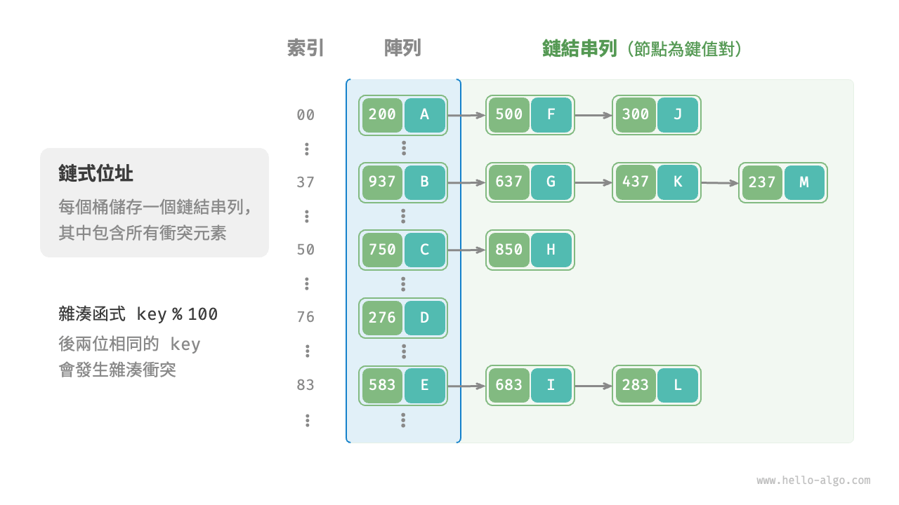
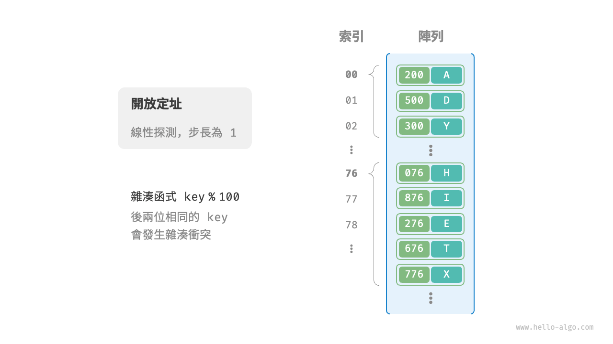
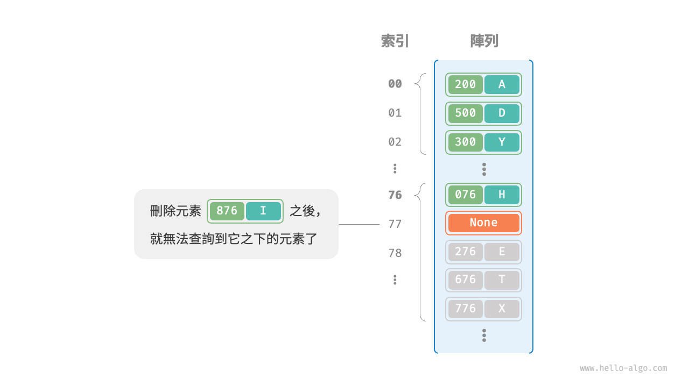

# 6.2 &nbsp; 雜湊衝突

上一節提到，**通常情況下雜湊函式的輸入空間遠大於輸出空間**，因此理論上雜湊衝突是不可避免的。比如，輸入空間為全體整數，輸出空間為陣列容量大小，則必然有多個整數對映至同一桶索引。

雜湊衝突會導致查詢結果錯誤，嚴重影響雜湊表的可用性。為了解決該問題，每當遇到雜湊衝突時，我們就進行雜湊表擴容，直至衝突消失為止。此方法簡單粗暴且有效，但效率太低，因為雜湊表擴容需要進行大量的資料搬運與雜湊值計算。為了提升效率，我們可以採用以下策略。

1. 改良雜湊表資料結構，**使得雜湊表可以在出現雜湊衝突時正常工作**。
2. 僅在必要時，即當雜湊衝突比較嚴重時，才執行擴容操作。

雜湊表的結構改良方法主要包括“鏈式位址”和“開放定址”。

## 6.2.1 &nbsp; 鏈式位址

在原始雜湊表中，每個桶僅能儲存一個鍵值對。<u>鏈式位址（separate chaining）</u>將單個元素轉換為鏈結串列，將鍵值對作為鏈結串列節點，將所有發生衝突的鍵值對都儲存在同一鏈結串列中。圖 6-5 展示了一個鏈式位址雜湊表的例子。

{ class="animation-figure" }

<p align="center"> 圖 6-5 &nbsp; 鏈式位址雜湊表 </p>

基於鏈式位址實現的雜湊表的操作方法發生了以下變化。

- **查詢元素**：輸入 `key` ，經過雜湊函式得到桶索引，即可訪問鏈結串列頭節點，然後走訪鏈結串列並對比 `key` 以查詢目標鍵值對。
- **新增元素**：首先透過雜湊函式訪問鏈結串列頭節點，然後將節點（鍵值對）新增到鏈結串列中。
- **刪除元素**：根據雜湊函式的結果訪問鏈結串列頭部，接著走訪鏈結串列以查詢目標節點並將其刪除。

鏈式位址存在以下侷限性。

- **佔用空間增大**：鏈結串列包含節點指標，它相比陣列更加耗費記憶體空間。
- **查詢效率降低**：因為需要線性走訪鏈結串列來查詢對應元素。

以下程式碼給出了鏈式位址雜湊表的簡單實現，需要注意兩點。

- 使用串列（動態陣列）代替鏈結串列，從而簡化程式碼。在這種設定下，雜湊表（陣列）包含多個桶，每個桶都是一個串列。
- 以下實現包含雜湊表擴容方法。當負載因子超過 $\frac{2}{3}$ 時，我們將雜湊表擴容至原先的 $2$ 倍。

=== "Python"

    ```python title="hash_map_chaining.py"
    class HashMapChaining:
        """鏈式位址雜湊表"""

        def __init__(self):
            """建構子"""
            self.size = 0  # 鍵值對數量
            self.capacity = 4  # 雜湊表容量
            self.load_thres = 2.0 / 3.0  # 觸發擴容的負載因子閾值
            self.extend_ratio = 2  # 擴容倍數
            self.buckets = [[] for _ in range(self.capacity)]  # 桶陣列

        def hash_func(self, key: int) -> int:
            """雜湊函式"""
            return key % self.capacity

        def load_factor(self) -> float:
            """負載因子"""
            return self.size / self.capacity

        def get(self, key: int) -> str | None:
            """查詢操作"""
            index = self.hash_func(key)
            bucket = self.buckets[index]
            # 走訪桶，若找到 key ，則返回對應 val
            for pair in bucket:
                if pair.key == key:
                    return pair.val
            # 若未找到 key ，則返回 None
            return None

        def put(self, key: int, val: str):
            """新增操作"""
            # 當負載因子超過閾值時，執行擴容
            if self.load_factor() > self.load_thres:
                self.extend()
            index = self.hash_func(key)
            bucket = self.buckets[index]
            # 走訪桶，若遇到指定 key ，則更新對應 val 並返回
            for pair in bucket:
                if pair.key == key:
                    pair.val = val
                    return
            # 若無該 key ，則將鍵值對新增至尾部
            pair = Pair(key, val)
            bucket.append(pair)
            self.size += 1

        def remove(self, key: int):
            """刪除操作"""
            index = self.hash_func(key)
            bucket = self.buckets[index]
            # 走訪桶，從中刪除鍵值對
            for pair in bucket:
                if pair.key == key:
                    bucket.remove(pair)
                    self.size -= 1
                    break

        def extend(self):
            """擴容雜湊表"""
            # 暫存原雜湊表
            buckets = self.buckets
            # 初始化擴容後的新雜湊表
            self.capacity *= self.extend_ratio
            self.buckets = [[] for _ in range(self.capacity)]
            self.size = 0
            # 將鍵值對從原雜湊表搬運至新雜湊表
            for bucket in buckets:
                for pair in bucket:
                    self.put(pair.key, pair.val)

        def print(self):
            """列印雜湊表"""
            for bucket in self.buckets:
                res = []
                for pair in bucket:
                    res.append(str(pair.key) + " -> " + pair.val)
                print(res)
    ```

=== "C++"

    ```cpp title="hash_map_chaining.cpp"
    /* 鏈式位址雜湊表 */
    class HashMapChaining {
      private:
        int size;                       // 鍵值對數量
        int capacity;                   // 雜湊表容量
        double loadThres;               // 觸發擴容的負載因子閾值
        int extendRatio;                // 擴容倍數
        vector<vector<Pair *>> buckets; // 桶陣列

      public:
        /* 建構子 */
        HashMapChaining() : size(0), capacity(4), loadThres(2.0 / 3.0), extendRatio(2) {
            buckets.resize(capacity);
        }

        /* 析構方法 */
        ~HashMapChaining() {
            for (auto &bucket : buckets) {
                for (Pair *pair : bucket) {
                    // 釋放記憶體
                    delete pair;
                }
            }
        }

        /* 雜湊函式 */
        int hashFunc(int key) {
            return key % capacity;
        }

        /* 負載因子 */
        double loadFactor() {
            return (double)size / (double)capacity;
        }

        /* 查詢操作 */
        string get(int key) {
            int index = hashFunc(key);
            // 走訪桶，若找到 key ，則返回對應 val
            for (Pair *pair : buckets[index]) {
                if (pair->key == key) {
                    return pair->val;
                }
            }
            // 若未找到 key ，則返回空字串
            return "";
        }

        /* 新增操作 */
        void put(int key, string val) {
            // 當負載因子超過閾值時，執行擴容
            if (loadFactor() > loadThres) {
                extend();
            }
            int index = hashFunc(key);
            // 走訪桶，若遇到指定 key ，則更新對應 val 並返回
            for (Pair *pair : buckets[index]) {
                if (pair->key == key) {
                    pair->val = val;
                    return;
                }
            }
            // 若無該 key ，則將鍵值對新增至尾部
            buckets[index].push_back(new Pair(key, val));
            size++;
        }

        /* 刪除操作 */
        void remove(int key) {
            int index = hashFunc(key);
            auto &bucket = buckets[index];
            // 走訪桶，從中刪除鍵值對
            for (int i = 0; i < bucket.size(); i++) {
                if (bucket[i]->key == key) {
                    Pair *tmp = bucket[i];
                    bucket.erase(bucket.begin() + i); // 從中刪除鍵值對
                    delete tmp;                       // 釋放記憶體
                    size--;
                    return;
                }
            }
        }

        /* 擴容雜湊表 */
        void extend() {
            // 暫存原雜湊表
            vector<vector<Pair *>> bucketsTmp = buckets;
            // 初始化擴容後的新雜湊表
            capacity *= extendRatio;
            buckets.clear();
            buckets.resize(capacity);
            size = 0;
            // 將鍵值對從原雜湊表搬運至新雜湊表
            for (auto &bucket : bucketsTmp) {
                for (Pair *pair : bucket) {
                    put(pair->key, pair->val);
                    // 釋放記憶體
                    delete pair;
                }
            }
        }

        /* 列印雜湊表 */
        void print() {
            for (auto &bucket : buckets) {
                cout << "[";
                for (Pair *pair : bucket) {
                    cout << pair->key << " -> " << pair->val << ", ";
                }
                cout << "]\n";
            }
        }
    };
    ```

=== "Java"

    ```java title="hash_map_chaining.java"
    /* 鏈式位址雜湊表 */
    class HashMapChaining {
        int size; // 鍵值對數量
        int capacity; // 雜湊表容量
        double loadThres; // 觸發擴容的負載因子閾值
        int extendRatio; // 擴容倍數
        List<List<Pair>> buckets; // 桶陣列

        /* 建構子 */
        public HashMapChaining() {
            size = 0;
            capacity = 4;
            loadThres = 2.0 / 3.0;
            extendRatio = 2;
            buckets = new ArrayList<>(capacity);
            for (int i = 0; i < capacity; i++) {
                buckets.add(new ArrayList<>());
            }
        }

        /* 雜湊函式 */
        int hashFunc(int key) {
            return key % capacity;
        }

        /* 負載因子 */
        double loadFactor() {
            return (double) size / capacity;
        }

        /* 查詢操作 */
        String get(int key) {
            int index = hashFunc(key);
            List<Pair> bucket = buckets.get(index);
            // 走訪桶，若找到 key ，則返回對應 val
            for (Pair pair : bucket) {
                if (pair.key == key) {
                    return pair.val;
                }
            }
            // 若未找到 key ，則返回 null
            return null;
        }

        /* 新增操作 */
        void put(int key, String val) {
            // 當負載因子超過閾值時，執行擴容
            if (loadFactor() > loadThres) {
                extend();
            }
            int index = hashFunc(key);
            List<Pair> bucket = buckets.get(index);
            // 走訪桶，若遇到指定 key ，則更新對應 val 並返回
            for (Pair pair : bucket) {
                if (pair.key == key) {
                    pair.val = val;
                    return;
                }
            }
            // 若無該 key ，則將鍵值對新增至尾部
            Pair pair = new Pair(key, val);
            bucket.add(pair);
            size++;
        }

        /* 刪除操作 */
        void remove(int key) {
            int index = hashFunc(key);
            List<Pair> bucket = buckets.get(index);
            // 走訪桶，從中刪除鍵值對
            for (Pair pair : bucket) {
                if (pair.key == key) {
                    bucket.remove(pair);
                    size--;
                    break;
                }
            }
        }

        /* 擴容雜湊表 */
        void extend() {
            // 暫存原雜湊表
            List<List<Pair>> bucketsTmp = buckets;
            // 初始化擴容後的新雜湊表
            capacity *= extendRatio;
            buckets = new ArrayList<>(capacity);
            for (int i = 0; i < capacity; i++) {
                buckets.add(new ArrayList<>());
            }
            size = 0;
            // 將鍵值對從原雜湊表搬運至新雜湊表
            for (List<Pair> bucket : bucketsTmp) {
                for (Pair pair : bucket) {
                    put(pair.key, pair.val);
                }
            }
        }

        /* 列印雜湊表 */
        void print() {
            for (List<Pair> bucket : buckets) {
                List<String> res = new ArrayList<>();
                for (Pair pair : bucket) {
                    res.add(pair.key + " -> " + pair.val);
                }
                System.out.println(res);
            }
        }
    }
    ```

=== "C#"

    ```csharp title="hash_map_chaining.cs"
    /* 鏈式位址雜湊表 */
    class HashMapChaining {
        int size; // 鍵值對數量
        int capacity; // 雜湊表容量
        double loadThres; // 觸發擴容的負載因子閾值
        int extendRatio; // 擴容倍數
        List<List<Pair>> buckets; // 桶陣列

        /* 建構子 */
        public HashMapChaining() {
            size = 0;
            capacity = 4;
            loadThres = 2.0 / 3.0;
            extendRatio = 2;
            buckets = new List<List<Pair>>(capacity);
            for (int i = 0; i < capacity; i++) {
                buckets.Add([]);
            }
        }

        /* 雜湊函式 */
        int HashFunc(int key) {
            return key % capacity;
        }

        /* 負載因子 */
        double LoadFactor() {
            return (double)size / capacity;
        }

        /* 查詢操作 */
        public string? Get(int key) {
            int index = HashFunc(key);
            // 走訪桶，若找到 key ，則返回對應 val
            foreach (Pair pair in buckets[index]) {
                if (pair.key == key) {
                    return pair.val;
                }
            }
            // 若未找到 key ，則返回 null
            return null;
        }

        /* 新增操作 */
        public void Put(int key, string val) {
            // 當負載因子超過閾值時，執行擴容
            if (LoadFactor() > loadThres) {
                Extend();
            }
            int index = HashFunc(key);
            // 走訪桶，若遇到指定 key ，則更新對應 val 並返回
            foreach (Pair pair in buckets[index]) {
                if (pair.key == key) {
                    pair.val = val;
                    return;
                }
            }
            // 若無該 key ，則將鍵值對新增至尾部
            buckets[index].Add(new Pair(key, val));
            size++;
        }

        /* 刪除操作 */
        public void Remove(int key) {
            int index = HashFunc(key);
            // 走訪桶，從中刪除鍵值對
            foreach (Pair pair in buckets[index].ToList()) {
                if (pair.key == key) {
                    buckets[index].Remove(pair);
                    size--;
                    break;
                }
            }
        }

        /* 擴容雜湊表 */
        void Extend() {
            // 暫存原雜湊表
            List<List<Pair>> bucketsTmp = buckets;
            // 初始化擴容後的新雜湊表
            capacity *= extendRatio;
            buckets = new List<List<Pair>>(capacity);
            for (int i = 0; i < capacity; i++) {
                buckets.Add([]);
            }
            size = 0;
            // 將鍵值對從原雜湊表搬運至新雜湊表
            foreach (List<Pair> bucket in bucketsTmp) {
                foreach (Pair pair in bucket) {
                    Put(pair.key, pair.val);
                }
            }
        }

        /* 列印雜湊表 */
        public void Print() {
            foreach (List<Pair> bucket in buckets) {
                List<string> res = [];
                foreach (Pair pair in bucket) {
                    res.Add(pair.key + " -> " + pair.val);
                }
                foreach (string kv in res) {
                    Console.WriteLine(kv);
                }
            }
        }
    }
    ```

=== "Go"

    ```go title="hash_map_chaining.go"
    /* 鏈式位址雜湊表 */
    type hashMapChaining struct {
        size        int      // 鍵值對數量
        capacity    int      // 雜湊表容量
        loadThres   float64  // 觸發擴容的負載因子閾值
        extendRatio int      // 擴容倍數
        buckets     [][]pair // 桶陣列
    }

    /* 建構子 */
    func newHashMapChaining() *hashMapChaining {
        buckets := make([][]pair, 4)
        for i := 0; i < 4; i++ {
            buckets[i] = make([]pair, 0)
        }
        return &hashMapChaining{
            size:        0,
            capacity:    4,
            loadThres:   2.0 / 3.0,
            extendRatio: 2,
            buckets:     buckets,
        }
    }

    /* 雜湊函式 */
    func (m *hashMapChaining) hashFunc(key int) int {
        return key % m.capacity
    }

    /* 負載因子 */
    func (m *hashMapChaining) loadFactor() float64 {
        return float64(m.size) / float64(m.capacity)
    }

    /* 查詢操作 */
    func (m *hashMapChaining) get(key int) string {
        idx := m.hashFunc(key)
        bucket := m.buckets[idx]
        // 走訪桶，若找到 key ，則返回對應 val
        for _, p := range bucket {
            if p.key == key {
                return p.val
            }
        }
        // 若未找到 key ，則返回空字串
        return ""
    }

    /* 新增操作 */
    func (m *hashMapChaining) put(key int, val string) {
        // 當負載因子超過閾值時，執行擴容
        if m.loadFactor() > m.loadThres {
            m.extend()
        }
        idx := m.hashFunc(key)
        // 走訪桶，若遇到指定 key ，則更新對應 val 並返回
        for i := range m.buckets[idx] {
            if m.buckets[idx][i].key == key {
                m.buckets[idx][i].val = val
                return
            }
        }
        // 若無該 key ，則將鍵值對新增至尾部
        p := pair{
            key: key,
            val: val,
        }
        m.buckets[idx] = append(m.buckets[idx], p)
        m.size += 1
    }

    /* 刪除操作 */
    func (m *hashMapChaining) remove(key int) {
        idx := m.hashFunc(key)
        // 走訪桶，從中刪除鍵值對
        for i, p := range m.buckets[idx] {
            if p.key == key {
                // 切片刪除
                m.buckets[idx] = append(m.buckets[idx][:i], m.buckets[idx][i+1:]...)
                m.size -= 1
                break
            }
        }
    }

    /* 擴容雜湊表 */
    func (m *hashMapChaining) extend() {
        // 暫存原雜湊表
        tmpBuckets := make([][]pair, len(m.buckets))
        for i := 0; i < len(m.buckets); i++ {
            tmpBuckets[i] = make([]pair, len(m.buckets[i]))
            copy(tmpBuckets[i], m.buckets[i])
        }
        // 初始化擴容後的新雜湊表
        m.capacity *= m.extendRatio
        m.buckets = make([][]pair, m.capacity)
        for i := 0; i < m.capacity; i++ {
            m.buckets[i] = make([]pair, 0)
        }
        m.size = 0
        // 將鍵值對從原雜湊表搬運至新雜湊表
        for _, bucket := range tmpBuckets {
            for _, p := range bucket {
                m.put(p.key, p.val)
            }
        }
    }

    /* 列印雜湊表 */
    func (m *hashMapChaining) print() {
        var builder strings.Builder

        for _, bucket := range m.buckets {
            builder.WriteString("[")
            for _, p := range bucket {
                builder.WriteString(strconv.Itoa(p.key) + " -> " + p.val + " ")
            }
            builder.WriteString("]")
            fmt.Println(builder.String())
            builder.Reset()
        }
    }
    ```

=== "Swift"

    ```swift title="hash_map_chaining.swift"
    /* 鏈式位址雜湊表 */
    class HashMapChaining {
        var size: Int // 鍵值對數量
        var capacity: Int // 雜湊表容量
        var loadThres: Double // 觸發擴容的負載因子閾值
        var extendRatio: Int // 擴容倍數
        var buckets: [[Pair]] // 桶陣列

        /* 建構子 */
        init() {
            size = 0
            capacity = 4
            loadThres = 2.0 / 3.0
            extendRatio = 2
            buckets = Array(repeating: [], count: capacity)
        }

        /* 雜湊函式 */
        func hashFunc(key: Int) -> Int {
            key % capacity
        }

        /* 負載因子 */
        func loadFactor() -> Double {
            Double(size) / Double(capacity)
        }

        /* 查詢操作 */
        func get(key: Int) -> String? {
            let index = hashFunc(key: key)
            let bucket = buckets[index]
            // 走訪桶，若找到 key ，則返回對應 val
            for pair in bucket {
                if pair.key == key {
                    return pair.val
                }
            }
            // 若未找到 key ，則返回 nil
            return nil
        }

        /* 新增操作 */
        func put(key: Int, val: String) {
            // 當負載因子超過閾值時，執行擴容
            if loadFactor() > loadThres {
                extend()
            }
            let index = hashFunc(key: key)
            let bucket = buckets[index]
            // 走訪桶，若遇到指定 key ，則更新對應 val 並返回
            for pair in bucket {
                if pair.key == key {
                    pair.val = val
                    return
                }
            }
            // 若無該 key ，則將鍵值對新增至尾部
            let pair = Pair(key: key, val: val)
            buckets[index].append(pair)
            size += 1
        }

        /* 刪除操作 */
        func remove(key: Int) {
            let index = hashFunc(key: key)
            let bucket = buckets[index]
            // 走訪桶，從中刪除鍵值對
            for (pairIndex, pair) in bucket.enumerated() {
                if pair.key == key {
                    buckets[index].remove(at: pairIndex)
                    size -= 1
                    break
                }
            }
        }

        /* 擴容雜湊表 */
        func extend() {
            // 暫存原雜湊表
            let bucketsTmp = buckets
            // 初始化擴容後的新雜湊表
            capacity *= extendRatio
            buckets = Array(repeating: [], count: capacity)
            size = 0
            // 將鍵值對從原雜湊表搬運至新雜湊表
            for bucket in bucketsTmp {
                for pair in bucket {
                    put(key: pair.key, val: pair.val)
                }
            }
        }

        /* 列印雜湊表 */
        func print() {
            for bucket in buckets {
                let res = bucket.map { "\($0.key) -> \($0.val)" }
                Swift.print(res)
            }
        }
    }
    ```

=== "JS"

    ```javascript title="hash_map_chaining.js"
    /* 鏈式位址雜湊表 */
    class HashMapChaining {
        #size; // 鍵值對數量
        #capacity; // 雜湊表容量
        #loadThres; // 觸發擴容的負載因子閾值
        #extendRatio; // 擴容倍數
        #buckets; // 桶陣列

        /* 建構子 */
        constructor() {
            this.#size = 0;
            this.#capacity = 4;
            this.#loadThres = 2.0 / 3.0;
            this.#extendRatio = 2;
            this.#buckets = new Array(this.#capacity).fill(null).map((x) => []);
        }

        /* 雜湊函式 */
        #hashFunc(key) {
            return key % this.#capacity;
        }

        /* 負載因子 */
        #loadFactor() {
            return this.#size / this.#capacity;
        }

        /* 查詢操作 */
        get(key) {
            const index = this.#hashFunc(key);
            const bucket = this.#buckets[index];
            // 走訪桶，若找到 key ，則返回對應 val
            for (const pair of bucket) {
                if (pair.key === key) {
                    return pair.val;
                }
            }
            // 若未找到 key ，則返回 null
            return null;
        }

        /* 新增操作 */
        put(key, val) {
            // 當負載因子超過閾值時，執行擴容
            if (this.#loadFactor() > this.#loadThres) {
                this.#extend();
            }
            const index = this.#hashFunc(key);
            const bucket = this.#buckets[index];
            // 走訪桶，若遇到指定 key ，則更新對應 val 並返回
            for (const pair of bucket) {
                if (pair.key === key) {
                    pair.val = val;
                    return;
                }
            }
            // 若無該 key ，則將鍵值對新增至尾部
            const pair = new Pair(key, val);
            bucket.push(pair);
            this.#size++;
        }

        /* 刪除操作 */
        remove(key) {
            const index = this.#hashFunc(key);
            let bucket = this.#buckets[index];
            // 走訪桶，從中刪除鍵值對
            for (let i = 0; i < bucket.length; i++) {
                if (bucket[i].key === key) {
                    bucket.splice(i, 1);
                    this.#size--;
                    break;
                }
            }
        }

        /* 擴容雜湊表 */
        #extend() {
            // 暫存原雜湊表
            const bucketsTmp = this.#buckets;
            // 初始化擴容後的新雜湊表
            this.#capacity *= this.#extendRatio;
            this.#buckets = new Array(this.#capacity).fill(null).map((x) => []);
            this.#size = 0;
            // 將鍵值對從原雜湊表搬運至新雜湊表
            for (const bucket of bucketsTmp) {
                for (const pair of bucket) {
                    this.put(pair.key, pair.val);
                }
            }
        }

        /* 列印雜湊表 */
        print() {
            for (const bucket of this.#buckets) {
                let res = [];
                for (const pair of bucket) {
                    res.push(pair.key + ' -> ' + pair.val);
                }
                console.log(res);
            }
        }
    }
    ```

=== "TS"

    ```typescript title="hash_map_chaining.ts"
    /* 鏈式位址雜湊表 */
    class HashMapChaining {
        #size: number; // 鍵值對數量
        #capacity: number; // 雜湊表容量
        #loadThres: number; // 觸發擴容的負載因子閾值
        #extendRatio: number; // 擴容倍數
        #buckets: Pair[][]; // 桶陣列

        /* 建構子 */
        constructor() {
            this.#size = 0;
            this.#capacity = 4;
            this.#loadThres = 2.0 / 3.0;
            this.#extendRatio = 2;
            this.#buckets = new Array(this.#capacity).fill(null).map((x) => []);
        }

        /* 雜湊函式 */
        #hashFunc(key: number): number {
            return key % this.#capacity;
        }

        /* 負載因子 */
        #loadFactor(): number {
            return this.#size / this.#capacity;
        }

        /* 查詢操作 */
        get(key: number): string | null {
            const index = this.#hashFunc(key);
            const bucket = this.#buckets[index];
            // 走訪桶，若找到 key ，則返回對應 val
            for (const pair of bucket) {
                if (pair.key === key) {
                    return pair.val;
                }
            }
            // 若未找到 key ，則返回 null
            return null;
        }

        /* 新增操作 */
        put(key: number, val: string): void {
            // 當負載因子超過閾值時，執行擴容
            if (this.#loadFactor() > this.#loadThres) {
                this.#extend();
            }
            const index = this.#hashFunc(key);
            const bucket = this.#buckets[index];
            // 走訪桶，若遇到指定 key ，則更新對應 val 並返回
            for (const pair of bucket) {
                if (pair.key === key) {
                    pair.val = val;
                    return;
                }
            }
            // 若無該 key ，則將鍵值對新增至尾部
            const pair = new Pair(key, val);
            bucket.push(pair);
            this.#size++;
        }

        /* 刪除操作 */
        remove(key: number): void {
            const index = this.#hashFunc(key);
            let bucket = this.#buckets[index];
            // 走訪桶，從中刪除鍵值對
            for (let i = 0; i < bucket.length; i++) {
                if (bucket[i].key === key) {
                    bucket.splice(i, 1);
                    this.#size--;
                    break;
                }
            }
        }

        /* 擴容雜湊表 */
        #extend(): void {
            // 暫存原雜湊表
            const bucketsTmp = this.#buckets;
            // 初始化擴容後的新雜湊表
            this.#capacity *= this.#extendRatio;
            this.#buckets = new Array(this.#capacity).fill(null).map((x) => []);
            this.#size = 0;
            // 將鍵值對從原雜湊表搬運至新雜湊表
            for (const bucket of bucketsTmp) {
                for (const pair of bucket) {
                    this.put(pair.key, pair.val);
                }
            }
        }

        /* 列印雜湊表 */
        print(): void {
            for (const bucket of this.#buckets) {
                let res = [];
                for (const pair of bucket) {
                    res.push(pair.key + ' -> ' + pair.val);
                }
                console.log(res);
            }
        }
    }
    ```

=== "Dart"

    ```dart title="hash_map_chaining.dart"
    /* 鏈式位址雜湊表 */
    class HashMapChaining {
      late int size; // 鍵值對數量
      late int capacity; // 雜湊表容量
      late double loadThres; // 觸發擴容的負載因子閾值
      late int extendRatio; // 擴容倍數
      late List<List<Pair>> buckets; // 桶陣列

      /* 建構子 */
      HashMapChaining() {
        size = 0;
        capacity = 4;
        loadThres = 2.0 / 3.0;
        extendRatio = 2;
        buckets = List.generate(capacity, (_) => []);
      }

      /* 雜湊函式 */
      int hashFunc(int key) {
        return key % capacity;
      }

      /* 負載因子 */
      double loadFactor() {
        return size / capacity;
      }

      /* 查詢操作 */
      String? get(int key) {
        int index = hashFunc(key);
        List<Pair> bucket = buckets[index];
        // 走訪桶，若找到 key ，則返回對應 val
        for (Pair pair in bucket) {
          if (pair.key == key) {
            return pair.val;
          }
        }
        // 若未找到 key ，則返回 null
        return null;
      }

      /* 新增操作 */
      void put(int key, String val) {
        // 當負載因子超過閾值時，執行擴容
        if (loadFactor() > loadThres) {
          extend();
        }
        int index = hashFunc(key);
        List<Pair> bucket = buckets[index];
        // 走訪桶，若遇到指定 key ，則更新對應 val 並返回
        for (Pair pair in bucket) {
          if (pair.key == key) {
            pair.val = val;
            return;
          }
        }
        // 若無該 key ，則將鍵值對新增至尾部
        Pair pair = Pair(key, val);
        bucket.add(pair);
        size++;
      }

      /* 刪除操作 */
      void remove(int key) {
        int index = hashFunc(key);
        List<Pair> bucket = buckets[index];
        // 走訪桶，從中刪除鍵值對
        for (Pair pair in bucket) {
          if (pair.key == key) {
            bucket.remove(pair);
            size--;
            break;
          }
        }
      }

      /* 擴容雜湊表 */
      void extend() {
        // 暫存原雜湊表
        List<List<Pair>> bucketsTmp = buckets;
        // 初始化擴容後的新雜湊表
        capacity *= extendRatio;
        buckets = List.generate(capacity, (_) => []);
        size = 0;
        // 將鍵值對從原雜湊表搬運至新雜湊表
        for (List<Pair> bucket in bucketsTmp) {
          for (Pair pair in bucket) {
            put(pair.key, pair.val);
          }
        }
      }

      /* 列印雜湊表 */
      void printHashMap() {
        for (List<Pair> bucket in buckets) {
          List<String> res = [];
          for (Pair pair in bucket) {
            res.add("${pair.key} -> ${pair.val}");
          }
          print(res);
        }
      }
    }
    ```

=== "Rust"

    ```rust title="hash_map_chaining.rs"
    /* 鏈式位址雜湊表 */
    struct HashMapChaining {
        size: i32,
        capacity: i32,
        load_thres: f32,
        extend_ratio: i32,
        buckets: Vec<Vec<Pair>>,
    }

    impl HashMapChaining {
        /* 建構子 */
        fn new() -> Self {
            Self {
                size: 0,
                capacity: 4,
                load_thres: 2.0 / 3.0,
                extend_ratio: 2,
                buckets: vec![vec![]; 4],
            }
        }

        /* 雜湊函式 */
        fn hash_func(&self, key: i32) -> usize {
            key as usize % self.capacity as usize
        }

        /* 負載因子 */
        fn load_factor(&self) -> f32 {
            self.size as f32 / self.capacity as f32
        }

        /* 刪除操作 */
        fn remove(&mut self, key: i32) -> Option<String> {
            let index = self.hash_func(key);
            let bucket = &mut self.buckets[index];

            // 走訪桶，從中刪除鍵值對
            for i in 0..bucket.len() {
                if bucket[i].key == key {
                    let pair = bucket.remove(i);
                    self.size -= 1;
                    return Some(pair.val);
                }
            }

            // 若未找到 key ，則返回 None
            None
        }

        /* 擴容雜湊表 */
        fn extend(&mut self) {
            // 暫存原雜湊表
            let buckets_tmp = std::mem::replace(&mut self.buckets, vec![]);

            // 初始化擴容後的新雜湊表
            self.capacity *= self.extend_ratio;
            self.buckets = vec![Vec::new(); self.capacity as usize];
            self.size = 0;

            // 將鍵值對從原雜湊表搬運至新雜湊表
            for bucket in buckets_tmp {
                for pair in bucket {
                    self.put(pair.key, pair.val);
                }
            }
        }

        /* 列印雜湊表 */
        fn print(&self) {
            for bucket in &self.buckets {
                let mut res = Vec::new();
                for pair in bucket {
                    res.push(format!("{} -> {}", pair.key, pair.val));
                }
                println!("{:?}", res);
            }
        }

        /* 新增操作 */
        fn put(&mut self, key: i32, val: String) {
            // 當負載因子超過閾值時，執行擴容
            if self.load_factor() > self.load_thres {
                self.extend();
            }

            let index = self.hash_func(key);
            let bucket = &mut self.buckets[index];

            // 走訪桶，若遇到指定 key ，則更新對應 val 並返回
            for pair in bucket {
                if pair.key == key {
                    pair.val = val;
                    return;
                }
            }
            let bucket = &mut self.buckets[index];

            // 若無該 key ，則將鍵值對新增至尾部
            let pair = Pair { key, val };
            bucket.push(pair);
            self.size += 1;
        }

        /* 查詢操作 */
        fn get(&self, key: i32) -> Option<&str> {
            let index = self.hash_func(key);
            let bucket = &self.buckets[index];

            // 走訪桶，若找到 key ，則返回對應 val
            for pair in bucket {
                if pair.key == key {
                    return Some(&pair.val);
                }
            }

            // 若未找到 key ，則返回 None
            None
        }
    }
    ```

=== "C"

    ```c title="hash_map_chaining.c"
    /* 鏈結串列節點 */
    typedef struct Node {
        Pair *pair;
        struct Node *next;
    } Node;

    /* 鏈式位址雜湊表 */
    typedef struct {
        int size;         // 鍵值對數量
        int capacity;     // 雜湊表容量
        double loadThres; // 觸發擴容的負載因子閾值
        int extendRatio;  // 擴容倍數
        Node **buckets;   // 桶陣列
    } HashMapChaining;

    /* 建構子 */
    HashMapChaining *newHashMapChaining() {
        HashMapChaining *hashMap = (HashMapChaining *)malloc(sizeof(HashMapChaining));
        hashMap->size = 0;
        hashMap->capacity = 4;
        hashMap->loadThres = 2.0 / 3.0;
        hashMap->extendRatio = 2;
        hashMap->buckets = (Node **)malloc(hashMap->capacity * sizeof(Node *));
        for (int i = 0; i < hashMap->capacity; i++) {
            hashMap->buckets[i] = NULL;
        }
        return hashMap;
    }

    /* 析構函式 */
    void delHashMapChaining(HashMapChaining *hashMap) {
        for (int i = 0; i < hashMap->capacity; i++) {
            Node *cur = hashMap->buckets[i];
            while (cur) {
                Node *tmp = cur;
                cur = cur->next;
                free(tmp->pair);
                free(tmp);
            }
        }
        free(hashMap->buckets);
        free(hashMap);
    }

    /* 雜湊函式 */
    int hashFunc(HashMapChaining *hashMap, int key) {
        return key % hashMap->capacity;
    }

    /* 負載因子 */
    double loadFactor(HashMapChaining *hashMap) {
        return (double)hashMap->size / (double)hashMap->capacity;
    }

    /* 查詢操作 */
    char *get(HashMapChaining *hashMap, int key) {
        int index = hashFunc(hashMap, key);
        // 走訪桶，若找到 key ，則返回對應 val
        Node *cur = hashMap->buckets[index];
        while (cur) {
            if (cur->pair->key == key) {
                return cur->pair->val;
            }
            cur = cur->next;
        }
        return ""; // 若未找到 key ，則返回空字串
    }

    /* 新增操作 */
    void put(HashMapChaining *hashMap, int key, const char *val) {
        // 當負載因子超過閾值時，執行擴容
        if (loadFactor(hashMap) > hashMap->loadThres) {
            extend(hashMap);
        }
        int index = hashFunc(hashMap, key);
        // 走訪桶，若遇到指定 key ，則更新對應 val 並返回
        Node *cur = hashMap->buckets[index];
        while (cur) {
            if (cur->pair->key == key) {
                strcpy(cur->pair->val, val); // 若遇到指定 key ，則更新對應 val 並返回
                return;
            }
            cur = cur->next;
        }
        // 若無該 key ，則將鍵值對新增至鏈結串列頭部
        Pair *newPair = (Pair *)malloc(sizeof(Pair));
        newPair->key = key;
        strcpy(newPair->val, val);
        Node *newNode = (Node *)malloc(sizeof(Node));
        newNode->pair = newPair;
        newNode->next = hashMap->buckets[index];
        hashMap->buckets[index] = newNode;
        hashMap->size++;
    }

    /* 擴容雜湊表 */
    void extend(HashMapChaining *hashMap) {
        // 暫存原雜湊表
        int oldCapacity = hashMap->capacity;
        Node **oldBuckets = hashMap->buckets;
        // 初始化擴容後的新雜湊表
        hashMap->capacity *= hashMap->extendRatio;
        hashMap->buckets = (Node **)malloc(hashMap->capacity * sizeof(Node *));
        for (int i = 0; i < hashMap->capacity; i++) {
            hashMap->buckets[i] = NULL;
        }
        hashMap->size = 0;
        // 將鍵值對從原雜湊表搬運至新雜湊表
        for (int i = 0; i < oldCapacity; i++) {
            Node *cur = oldBuckets[i];
            while (cur) {
                put(hashMap, cur->pair->key, cur->pair->val);
                Node *temp = cur;
                cur = cur->next;
                // 釋放記憶體
                free(temp->pair);
                free(temp);
            }
        }

        free(oldBuckets);
    }

    /* 刪除操作 */
    void removeItem(HashMapChaining *hashMap, int key) {
        int index = hashFunc(hashMap, key);
        Node *cur = hashMap->buckets[index];
        Node *pre = NULL;
        while (cur) {
            if (cur->pair->key == key) {
                // 從中刪除鍵值對
                if (pre) {
                    pre->next = cur->next;
                } else {
                    hashMap->buckets[index] = cur->next;
                }
                // 釋放記憶體
                free(cur->pair);
                free(cur);
                hashMap->size--;
                return;
            }
            pre = cur;
            cur = cur->next;
        }
    }

    /* 列印雜湊表 */
    void print(HashMapChaining *hashMap) {
        for (int i = 0; i < hashMap->capacity; i++) {
            Node *cur = hashMap->buckets[i];
            printf("[");
            while (cur) {
                printf("%d -> %s, ", cur->pair->key, cur->pair->val);
                cur = cur->next;
            }
            printf("]\n");
        }
    }
    ```

=== "Kotlin"

    ```kotlin title="hash_map_chaining.kt"
    /* 鏈式位址雜湊表 */
    class HashMapChaining {
        var size: Int // 鍵值對數量
        var capacity: Int // 雜湊表容量
        val loadThres: Double // 觸發擴容的負載因子閾值
        val extendRatio: Int // 擴容倍數
        var buckets: MutableList<MutableList<Pair>> // 桶陣列

        /* 建構子 */
        init {
            size = 0
            capacity = 4
            loadThres = 2.0 / 3.0
            extendRatio = 2
            buckets = mutableListOf()
            for (i in 0..<capacity) {
                buckets.add(mutableListOf())
            }
        }

        /* 雜湊函式 */
        fun hashFunc(key: Int): Int {
            return key % capacity
        }

        /* 負載因子 */
        fun loadFactor(): Double {
            return (size / capacity).toDouble()
        }

        /* 查詢操作 */
        fun get(key: Int): String? {
            val index = hashFunc(key)
            val bucket = buckets[index]
            // 走訪桶，若找到 key ，則返回對應 val
            for (pair in bucket) {
                if (pair.key == key) return pair._val
            }
            // 若未找到 key ，則返回 null
            return null
        }

        /* 新增操作 */
        fun put(key: Int, _val: String) {
            // 當負載因子超過閾值時，執行擴容
            if (loadFactor() > loadThres) {
                extend()
            }
            val index = hashFunc(key)
            val bucket = buckets[index]
            // 走訪桶，若遇到指定 key ，則更新對應 val 並返回
            for (pair in bucket) {
                if (pair.key == key) {
                    pair._val = _val
                    return
                }
            }
            // 若無該 key ，則將鍵值對新增至尾部
            val pair = Pair(key, _val)
            bucket.add(pair)
            size++
        }

        /* 刪除操作 */
        fun remove(key: Int) {
            val index = hashFunc(key)
            val bucket = buckets[index]
            // 走訪桶，從中刪除鍵值對
            for (pair in bucket) {
                if (pair.key == key) {
                    bucket.remove(pair)
                    size--
                    break
                }
            }
        }

        /* 擴容雜湊表 */
        fun extend() {
            // 暫存原雜湊表
            val bucketsTmp = buckets
            // 初始化擴容後的新雜湊表
            capacity *= extendRatio
            // mutablelist 無固定大小
            buckets = mutableListOf()
            for (i in 0..<capacity) {
                buckets.add(mutableListOf())
            }
            size = 0
            // 將鍵值對從原雜湊表搬運至新雜湊表
            for (bucket in bucketsTmp) {
                for (pair in bucket) {
                    put(pair.key, pair._val)
                }
            }
        }

        /* 列印雜湊表 */
        fun print() {
            for (bucket in buckets) {
                val res = mutableListOf<String>()
                for (pair in bucket) {
                    val k = pair.key
                    val v = pair._val
                    res.add("$k -> $v")
                }
                println(res)
            }
        }
    }
    ```

=== "Ruby"

    ```ruby title="hash_map_chaining.rb"
    ### 鍵式位址雜湊表 ###
    class HashMapChaining
      ### 建構子 ###
      def initialize
        @size = 0 # 鍵值對數量
        @capacity = 4 # 雜湊表容量
        @load_thres = 2.0 / 3.0 # 觸發擴容的負載因子閾值
        @extend_ratio = 2 # 擴容倍數
        @buckets = Array.new(@capacity) { [] } # 桶陣列
      end

      ### 雜湊函式 ###
      def hash_func(key)
        key % @capacity
      end

      ### 負載因子 ###
      def load_factor
        @size / @capacity
      end

      ### 查詢操作 ###
      def get(key)
        index = hash_func(key)
        bucket = @buckets[index]
        # 走訪桶，若找到 key ，則返回對應 val
        for pair in bucket
          return pair.val if pair.key == key
        end
        # 若未找到 key , 則返回 nil
        nil
      end

      ### 新增操作 ###
      def put(key, val)
        # 當負載因子超過閾值時，執行擴容
        extend if load_factor > @load_thres
        index = hash_func(key)
        bucket = @buckets[index]
        # 走訪桶，若遇到指定 key ，則更新對應 val 並返回
        for pair in bucket
          if pair.key == key
            pair.val = val
            return
          end
        end
        # 若無該 key ，則將鍵值對新增至尾部
        pair = Pair.new(key, val)
        bucket << pair
        @size += 1
      end

      ### 刪除操作 ###
      def remove(key)
        index = hash_func(key)
        bucket = @buckets[index]
        # 走訪桶，從中刪除鍵值對
        for pair in bucket
          if pair.key == key
            bucket.delete(pair)
            @size -= 1
            break
          end
        end
      end

      ### 擴容雜湊表 ###
      def extend
        # 暫存原雜湊表
        buckets = @buckets
        # 初始化擴容後的新雜湊表
        @capacity *= @extend_ratio
        @buckets = Array.new(@capacity) { [] }
        @size = 0
        # 將鍵值對從原雜湊表搬運至新雜湊表
        for bucket in buckets
          for pair in bucket
            put(pair.key, pair.val)
          end
        end
      end

      ### 列印雜湊表 ###
      def print
        for bucket in @buckets
          res = []
          for pair in bucket
            res << "#{pair.key} -> #{pair.val}"
          end
          pp res
        end
      end
    end
    ```

=== "Zig"

    ```zig title="hash_map_chaining.zig"
    [class]{HashMapChaining}-[func]{}
    ```

??? pythontutor "視覺化執行"

    <div style="height: 549px; width: 100%;"><iframe class="pythontutor-iframe" src="https://pythontutor.com/iframe-embed.html#code=class%20Pair%3A%0A%20%20%20%20%22%22%22%E9%8D%B5%E5%80%BC%E5%B0%8D%22%22%22%0A%20%20%20%20def%20__init__%28self%2C%20key%3A%20int%2C%20val%3A%20str%29%3A%0A%20%20%20%20%20%20%20%20self.key%20%3D%20key%0A%20%20%20%20%20%20%20%20self.val%20%3D%20val%0A%0Aclass%20HashMapChaining%3A%0A%20%20%20%20%22%22%22%E9%8F%88%E5%BC%8F%E4%BD%8D%E5%9D%80%E9%9B%9C%E6%B9%8A%E8%A1%A8%22%22%22%0A%0A%20%20%20%20def%20__init__%28self%29%3A%0A%20%20%20%20%20%20%20%20%22%22%22%E5%BB%BA%E6%A7%8B%E5%AD%90%22%22%22%0A%20%20%20%20%20%20%20%20self.size%20%3D%200%0A%20%20%20%20%20%20%20%20self.capacity%20%3D%204%0A%20%20%20%20%20%20%20%20self.load_thres%20%3D%202.0%20/%203.0%0A%20%20%20%20%20%20%20%20self.extend_ratio%20%3D%202%0A%20%20%20%20%20%20%20%20self.buckets%20%3D%20%5B%5B%5D%20for%20_%20in%20range%28self.capacity%29%5D%0A%0A%20%20%20%20def%20hash_func%28self%2C%20key%3A%20int%29%20-%3E%20int%3A%0A%20%20%20%20%20%20%20%20%22%22%22%E9%9B%9C%E6%B9%8A%E5%87%BD%E5%BC%8F%22%22%22%0A%20%20%20%20%20%20%20%20return%20key%20%25%20self.capacity%0A%0A%20%20%20%20def%20load_factor%28self%29%20-%3E%20float%3A%0A%20%20%20%20%20%20%20%20%22%22%22%E8%B2%A0%E8%BC%89%E5%9B%A0%E5%AD%90%22%22%22%0A%20%20%20%20%20%20%20%20return%20self.size%20/%20self.capacity%0A%0A%20%20%20%20def%20get%28self%2C%20key%3A%20int%29%20-%3E%20str%20%7C%20None%3A%0A%20%20%20%20%20%20%20%20%22%22%22%E6%9F%A5%E8%A9%A2%E6%93%8D%E4%BD%9C%22%22%22%0A%20%20%20%20%20%20%20%20index%20%3D%20self.hash_func%28key%29%0A%20%20%20%20%20%20%20%20bucket%20%3D%20self.buckets%5Bindex%5D%0A%20%20%20%20%20%20%20%20for%20pair%20in%20bucket%3A%0A%20%20%20%20%20%20%20%20%20%20%20%20if%20pair.key%20%3D%3D%20key%3A%0A%20%20%20%20%20%20%20%20%20%20%20%20%20%20%20%20return%20pair.val%0A%20%20%20%20%20%20%20%20return%20None%0A%0A%20%20%20%20def%20put%28self%2C%20key%3A%20int%2C%20val%3A%20str%29%3A%0A%20%20%20%20%20%20%20%20%22%22%22%E6%96%B0%E5%A2%9E%E6%93%8D%E4%BD%9C%22%22%22%0A%20%20%20%20%20%20%20%20if%20self.load_factor%28%29%20%3E%20self.load_thres%3A%0A%20%20%20%20%20%20%20%20%20%20%20%20self.extend%28%29%0A%20%20%20%20%20%20%20%20index%20%3D%20self.hash_func%28key%29%0A%20%20%20%20%20%20%20%20bucket%20%3D%20self.buckets%5Bindex%5D%0A%20%20%20%20%20%20%20%20for%20pair%20in%20bucket%3A%0A%20%20%20%20%20%20%20%20%20%20%20%20if%20pair.key%20%3D%3D%20key%3A%0A%20%20%20%20%20%20%20%20%20%20%20%20%20%20%20%20pair.val%20%3D%20val%0A%20%20%20%20%20%20%20%20%20%20%20%20%20%20%20%20return%0A%20%20%20%20%20%20%20%20pair%20%3D%20Pair%28key%2C%20val%29%0A%20%20%20%20%20%20%20%20bucket.append%28pair%29%0A%20%20%20%20%20%20%20%20self.size%20%2B%3D%201%0A%0A%20%20%20%20def%20remove%28self%2C%20key%3A%20int%29%3A%0A%20%20%20%20%20%20%20%20%22%22%22%E5%88%AA%E9%99%A4%E6%93%8D%E4%BD%9C%22%22%22%0A%20%20%20%20%20%20%20%20index%20%3D%20self.hash_func%28key%29%0A%20%20%20%20%20%20%20%20bucket%20%3D%20self.buckets%5Bindex%5D%0A%20%20%20%20%20%20%20%20for%20pair%20in%20bucket%3A%0A%20%20%20%20%20%20%20%20%20%20%20%20if%20pair.key%20%3D%3D%20key%3A%0A%20%20%20%20%20%20%20%20%20%20%20%20%20%20%20%20bucket.remove%28pair%29%0A%20%20%20%20%20%20%20%20%20%20%20%20%20%20%20%20self.size%20-%3D%201%0A%20%20%20%20%20%20%20%20%20%20%20%20%20%20%20%20break%0A%0A%20%20%20%20def%20extend%28self%29%3A%0A%20%20%20%20%20%20%20%20%22%22%22%E6%93%B4%E5%AE%B9%E9%9B%9C%E6%B9%8A%E8%A1%A8%22%22%22%0A%20%20%20%20%20%20%20%20buckets%20%3D%20self.buckets%0A%20%20%20%20%20%20%20%20self.capacity%20%2A%3D%20self.extend_ratio%0A%20%20%20%20%20%20%20%20self.buckets%20%3D%20%5B%5B%5D%20for%20_%20in%20range%28self.capacity%29%5D%0A%20%20%20%20%20%20%20%20self.size%20%3D%200%0A%20%20%20%20%20%20%20%20for%20bucket%20in%20buckets%3A%0A%20%20%20%20%20%20%20%20%20%20%20%20for%20pair%20in%20bucket%3A%0A%20%20%20%20%20%20%20%20%20%20%20%20%20%20%20%20self.put%28pair.key%2C%20pair.val%29%0A%0A%20%20%20%20def%20print%28self%29%3A%0A%20%20%20%20%20%20%20%20%22%22%22%E5%88%97%E5%8D%B0%E9%9B%9C%E6%B9%8A%E8%A1%A8%22%22%22%0A%20%20%20%20%20%20%20%20for%20bucket%20in%20self.buckets%3A%0A%20%20%20%20%20%20%20%20%20%20%20%20res%20%3D%20%5B%5D%0A%20%20%20%20%20%20%20%20%20%20%20%20for%20pair%20in%20bucket%3A%0A%20%20%20%20%20%20%20%20%20%20%20%20%20%20%20%20res.append%28str%28pair.key%29%20%2B%20%22%20-%3E%20%22%20%2B%20pair.val%29%0A%20%20%20%20%20%20%20%20%20%20%20%20print%28res%29%0A%0A%0A%22%22%22Driver%20Code%22%22%22%0Aif%20__name__%20%3D%3D%20%22__main__%22%3A%0A%20%20%20%20%23%20%E5%88%9D%E5%A7%8B%E5%8C%96%E9%9B%9C%E6%B9%8A%E8%A1%A8%0A%20%20%20%20hashmap%20%3D%20HashMapChaining%28%29%0A%0A%20%20%20%20%23%20%E6%96%B0%E5%A2%9E%E6%93%8D%E4%BD%9C%0A%20%20%20%20hashmap.put%2812836%2C%20%22%E5%B0%8F%E5%93%88%22%29%0A%20%20%20%20hashmap.put%2815937%2C%20%22%E5%B0%8F%E5%9B%89%22%29%0A%20%20%20%20hashmap.put%2816750%2C%20%22%E5%B0%8F%E7%AE%97%22%29%0A%20%20%20%20hashmap.put%2813276%2C%20%22%E5%B0%8F%E6%B3%95%22%29%0A%20%20%20%20hashmap.put%2810583%2C%20%22%E5%B0%8F%E9%B4%A8%22%29%0A%0A%20%20%20%20%23%20%E6%9F%A5%E8%A9%A2%E6%93%8D%E4%BD%9C%0A%20%20%20%20name%20%3D%20hashmap.get%2813276%29%0A%0A%20%20%20%20%23%20%E5%88%AA%E9%99%A4%E6%93%8D%E4%BD%9C%0A%20%20%20%20hashmap.remove%2812836%29&codeDivHeight=472&codeDivWidth=350&cumulative=false&curInstr=4&heapPrimitives=nevernest&origin=opt-frontend.js&py=311&rawInputLstJSON=%5B%5D&textReferences=false"> </iframe></div>
    <div style="margin-top: 5px;"><a href="https://pythontutor.com/iframe-embed.html#code=class%20Pair%3A%0A%20%20%20%20%22%22%22%E9%8D%B5%E5%80%BC%E5%B0%8D%22%22%22%0A%20%20%20%20def%20__init__%28self%2C%20key%3A%20int%2C%20val%3A%20str%29%3A%0A%20%20%20%20%20%20%20%20self.key%20%3D%20key%0A%20%20%20%20%20%20%20%20self.val%20%3D%20val%0A%0Aclass%20HashMapChaining%3A%0A%20%20%20%20%22%22%22%E9%8F%88%E5%BC%8F%E4%BD%8D%E5%9D%80%E9%9B%9C%E6%B9%8A%E8%A1%A8%22%22%22%0A%0A%20%20%20%20def%20__init__%28self%29%3A%0A%20%20%20%20%20%20%20%20%22%22%22%E5%BB%BA%E6%A7%8B%E5%AD%90%22%22%22%0A%20%20%20%20%20%20%20%20self.size%20%3D%200%0A%20%20%20%20%20%20%20%20self.capacity%20%3D%204%0A%20%20%20%20%20%20%20%20self.load_thres%20%3D%202.0%20/%203.0%0A%20%20%20%20%20%20%20%20self.extend_ratio%20%3D%202%0A%20%20%20%20%20%20%20%20self.buckets%20%3D%20%5B%5B%5D%20for%20_%20in%20range%28self.capacity%29%5D%0A%0A%20%20%20%20def%20hash_func%28self%2C%20key%3A%20int%29%20-%3E%20int%3A%0A%20%20%20%20%20%20%20%20%22%22%22%E9%9B%9C%E6%B9%8A%E5%87%BD%E5%BC%8F%22%22%22%0A%20%20%20%20%20%20%20%20return%20key%20%25%20self.capacity%0A%0A%20%20%20%20def%20load_factor%28self%29%20-%3E%20float%3A%0A%20%20%20%20%20%20%20%20%22%22%22%E8%B2%A0%E8%BC%89%E5%9B%A0%E5%AD%90%22%22%22%0A%20%20%20%20%20%20%20%20return%20self.size%20/%20self.capacity%0A%0A%20%20%20%20def%20get%28self%2C%20key%3A%20int%29%20-%3E%20str%20%7C%20None%3A%0A%20%20%20%20%20%20%20%20%22%22%22%E6%9F%A5%E8%A9%A2%E6%93%8D%E4%BD%9C%22%22%22%0A%20%20%20%20%20%20%20%20index%20%3D%20self.hash_func%28key%29%0A%20%20%20%20%20%20%20%20bucket%20%3D%20self.buckets%5Bindex%5D%0A%20%20%20%20%20%20%20%20for%20pair%20in%20bucket%3A%0A%20%20%20%20%20%20%20%20%20%20%20%20if%20pair.key%20%3D%3D%20key%3A%0A%20%20%20%20%20%20%20%20%20%20%20%20%20%20%20%20return%20pair.val%0A%20%20%20%20%20%20%20%20return%20None%0A%0A%20%20%20%20def%20put%28self%2C%20key%3A%20int%2C%20val%3A%20str%29%3A%0A%20%20%20%20%20%20%20%20%22%22%22%E6%96%B0%E5%A2%9E%E6%93%8D%E4%BD%9C%22%22%22%0A%20%20%20%20%20%20%20%20if%20self.load_factor%28%29%20%3E%20self.load_thres%3A%0A%20%20%20%20%20%20%20%20%20%20%20%20self.extend%28%29%0A%20%20%20%20%20%20%20%20index%20%3D%20self.hash_func%28key%29%0A%20%20%20%20%20%20%20%20bucket%20%3D%20self.buckets%5Bindex%5D%0A%20%20%20%20%20%20%20%20for%20pair%20in%20bucket%3A%0A%20%20%20%20%20%20%20%20%20%20%20%20if%20pair.key%20%3D%3D%20key%3A%0A%20%20%20%20%20%20%20%20%20%20%20%20%20%20%20%20pair.val%20%3D%20val%0A%20%20%20%20%20%20%20%20%20%20%20%20%20%20%20%20return%0A%20%20%20%20%20%20%20%20pair%20%3D%20Pair%28key%2C%20val%29%0A%20%20%20%20%20%20%20%20bucket.append%28pair%29%0A%20%20%20%20%20%20%20%20self.size%20%2B%3D%201%0A%0A%20%20%20%20def%20remove%28self%2C%20key%3A%20int%29%3A%0A%20%20%20%20%20%20%20%20%22%22%22%E5%88%AA%E9%99%A4%E6%93%8D%E4%BD%9C%22%22%22%0A%20%20%20%20%20%20%20%20index%20%3D%20self.hash_func%28key%29%0A%20%20%20%20%20%20%20%20bucket%20%3D%20self.buckets%5Bindex%5D%0A%20%20%20%20%20%20%20%20for%20pair%20in%20bucket%3A%0A%20%20%20%20%20%20%20%20%20%20%20%20if%20pair.key%20%3D%3D%20key%3A%0A%20%20%20%20%20%20%20%20%20%20%20%20%20%20%20%20bucket.remove%28pair%29%0A%20%20%20%20%20%20%20%20%20%20%20%20%20%20%20%20self.size%20-%3D%201%0A%20%20%20%20%20%20%20%20%20%20%20%20%20%20%20%20break%0A%0A%20%20%20%20def%20extend%28self%29%3A%0A%20%20%20%20%20%20%20%20%22%22%22%E6%93%B4%E5%AE%B9%E9%9B%9C%E6%B9%8A%E8%A1%A8%22%22%22%0A%20%20%20%20%20%20%20%20buckets%20%3D%20self.buckets%0A%20%20%20%20%20%20%20%20self.capacity%20%2A%3D%20self.extend_ratio%0A%20%20%20%20%20%20%20%20self.buckets%20%3D%20%5B%5B%5D%20for%20_%20in%20range%28self.capacity%29%5D%0A%20%20%20%20%20%20%20%20self.size%20%3D%200%0A%20%20%20%20%20%20%20%20for%20bucket%20in%20buckets%3A%0A%20%20%20%20%20%20%20%20%20%20%20%20for%20pair%20in%20bucket%3A%0A%20%20%20%20%20%20%20%20%20%20%20%20%20%20%20%20self.put%28pair.key%2C%20pair.val%29%0A%0A%20%20%20%20def%20print%28self%29%3A%0A%20%20%20%20%20%20%20%20%22%22%22%E5%88%97%E5%8D%B0%E9%9B%9C%E6%B9%8A%E8%A1%A8%22%22%22%0A%20%20%20%20%20%20%20%20for%20bucket%20in%20self.buckets%3A%0A%20%20%20%20%20%20%20%20%20%20%20%20res%20%3D%20%5B%5D%0A%20%20%20%20%20%20%20%20%20%20%20%20for%20pair%20in%20bucket%3A%0A%20%20%20%20%20%20%20%20%20%20%20%20%20%20%20%20res.append%28str%28pair.key%29%20%2B%20%22%20-%3E%20%22%20%2B%20pair.val%29%0A%20%20%20%20%20%20%20%20%20%20%20%20print%28res%29%0A%0A%0A%22%22%22Driver%20Code%22%22%22%0Aif%20__name__%20%3D%3D%20%22__main__%22%3A%0A%20%20%20%20%23%20%E5%88%9D%E5%A7%8B%E5%8C%96%E9%9B%9C%E6%B9%8A%E8%A1%A8%0A%20%20%20%20hashmap%20%3D%20HashMapChaining%28%29%0A%0A%20%20%20%20%23%20%E6%96%B0%E5%A2%9E%E6%93%8D%E4%BD%9C%0A%20%20%20%20hashmap.put%2812836%2C%20%22%E5%B0%8F%E5%93%88%22%29%0A%20%20%20%20hashmap.put%2815937%2C%20%22%E5%B0%8F%E5%9B%89%22%29%0A%20%20%20%20hashmap.put%2816750%2C%20%22%E5%B0%8F%E7%AE%97%22%29%0A%20%20%20%20hashmap.put%2813276%2C%20%22%E5%B0%8F%E6%B3%95%22%29%0A%20%20%20%20hashmap.put%2810583%2C%20%22%E5%B0%8F%E9%B4%A8%22%29%0A%0A%20%20%20%20%23%20%E6%9F%A5%E8%A9%A2%E6%93%8D%E4%BD%9C%0A%20%20%20%20name%20%3D%20hashmap.get%2813276%29%0A%0A%20%20%20%20%23%20%E5%88%AA%E9%99%A4%E6%93%8D%E4%BD%9C%0A%20%20%20%20hashmap.remove%2812836%29&codeDivHeight=800&codeDivWidth=600&cumulative=false&curInstr=4&heapPrimitives=nevernest&origin=opt-frontend.js&py=311&rawInputLstJSON=%5B%5D&textReferences=false" target="_blank" rel="noopener noreferrer">全螢幕觀看 ></a></div>

值得注意的是，當鏈結串列很長時，查詢效率 $O(n)$ 很差。**此時可以將鏈結串列轉換為“AVL 樹”或“紅黑樹”**，從而將查詢操作的時間複雜度最佳化至 $O(\log n)$ 。

## 6.2.2 &nbsp; 開放定址

<u>開放定址（open addressing）</u>不引入額外的資料結構，而是透過“多次探測”來處理雜湊衝突，探測方式主要包括線性探查、平方探測和多次雜湊等。

下面以線性探查為例，介紹開放定址雜湊表的工作機制。

### 1. &nbsp; 線性探查

線性探查採用固定步長的線性搜尋來進行探測，其操作方法與普通雜湊表有所不同。

- **插入元素**：透過雜湊函式計算桶索引，若發現桶內已有元素，則從衝突位置向後線性走訪（步長通常為 $1$ ），直至找到空桶，將元素插入其中。
- **查詢元素**：若發現雜湊衝突，則使用相同步長向後進行線性走訪，直到找到對應元素，返回 `value` 即可；如果遇到空桶，說明目標元素不在雜湊表中，返回 `None` 。

圖 6-6 展示了開放定址（線性探查）雜湊表的鍵值對分佈。根據此雜湊函式，最後兩位相同的 `key` 都會被對映到相同的桶。而透過線性探查，它們被依次儲存在該桶以及之下的桶中。

{ class="animation-figure" }

<p align="center"> 圖 6-6 &nbsp; 開放定址（線性探查）雜湊表的鍵值對分佈 </p>

然而，**線性探查容易產生“聚集現象”**。具體來說，陣列中連續被佔用的位置越長，這些連續位置發生雜湊衝突的可能性越大，從而進一步促使該位置的聚堆積生長，形成惡性迴圈，最終導致增刪查改操作效率劣化。

值得注意的是，**我們不能在開放定址雜湊表中直接刪除元素**。這是因為刪除元素會在陣列內產生一個空桶 `None` ，而當查詢元素時，線性探查到該空桶就會返回，因此在該空桶之下的元素都無法再被訪問到，程式可能誤判這些元素不存在，如圖 6-7 所示。

{ class="animation-figure" }

<p align="center"> 圖 6-7 &nbsp; 在開放定址中刪除元素導致的查詢問題 </p>

為了解決該問題，我們可以採用<u>懶刪除（lazy deletion）</u>機制：它不直接從雜湊表中移除元素，**而是利用一個常數 `TOMBSTONE` 來標記這個桶**。在該機制下，`None` 和 `TOMBSTONE` 都代表空桶，都可以放置鍵值對。但不同的是，線性探查到 `TOMBSTONE` 時應該繼續走訪，因為其之下可能還存在鍵值對。

然而，**懶刪除可能會加速雜湊表的效能退化**。這是因為每次刪除操作都會產生一個刪除標記，隨著 `TOMBSTONE` 的增加，搜尋時間也會增加，因為線性探查可能需要跳過多個 `TOMBSTONE` 才能找到目標元素。

為此，考慮線上性探查中記錄遇到的首個 `TOMBSTONE` 的索引，並將搜尋到的目標元素與該 `TOMBSTONE` 交換位置。這樣做的好處是當每次查詢或新增元素時，元素會被移動至距離理想位置（探測起始點）更近的桶，從而最佳化查詢效率。

以下程式碼實現了一個包含懶刪除的開放定址（線性探查）雜湊表。為了更加充分地使用雜湊表的空間，我們將雜湊表看作一個“環形陣列”，當越過陣列尾部時，回到頭部繼續走訪。

=== "Python"

    ```python title="hash_map_open_addressing.py"
    class HashMapOpenAddressing:
        """開放定址雜湊表"""

        def __init__(self):
            """建構子"""
            self.size = 0  # 鍵值對數量
            self.capacity = 4  # 雜湊表容量
            self.load_thres = 2.0 / 3.0  # 觸發擴容的負載因子閾值
            self.extend_ratio = 2  # 擴容倍數
            self.buckets: list[Pair | None] = [None] * self.capacity  # 桶陣列
            self.TOMBSTONE = Pair(-1, "-1")  # 刪除標記

        def hash_func(self, key: int) -> int:
            """雜湊函式"""
            return key % self.capacity

        def load_factor(self) -> float:
            """負載因子"""
            return self.size / self.capacity

        def find_bucket(self, key: int) -> int:
            """搜尋 key 對應的桶索引"""
            index = self.hash_func(key)
            first_tombstone = -1
            # 線性探查，當遇到空桶時跳出
            while self.buckets[index] is not None:
                # 若遇到 key ，返回對應的桶索引
                if self.buckets[index].key == key:
                    # 若之前遇到了刪除標記，則將鍵值對移動至該索引處
                    if first_tombstone != -1:
                        self.buckets[first_tombstone] = self.buckets[index]
                        self.buckets[index] = self.TOMBSTONE
                        return first_tombstone  # 返回移動後的桶索引
                    return index  # 返回桶索引
                # 記錄遇到的首個刪除標記
                if first_tombstone == -1 and self.buckets[index] is self.TOMBSTONE:
                    first_tombstone = index
                # 計算桶索引，越過尾部則返回頭部
                index = (index + 1) % self.capacity
            # 若 key 不存在，則返回新增點的索引
            return index if first_tombstone == -1 else first_tombstone

        def get(self, key: int) -> str:
            """查詢操作"""
            # 搜尋 key 對應的桶索引
            index = self.find_bucket(key)
            # 若找到鍵值對，則返回對應 val
            if self.buckets[index] not in [None, self.TOMBSTONE]:
                return self.buckets[index].val
            # 若鍵值對不存在，則返回 None
            return None

        def put(self, key: int, val: str):
            """新增操作"""
            # 當負載因子超過閾值時，執行擴容
            if self.load_factor() > self.load_thres:
                self.extend()
            # 搜尋 key 對應的桶索引
            index = self.find_bucket(key)
            # 若找到鍵值對，則覆蓋 val 並返回
            if self.buckets[index] not in [None, self.TOMBSTONE]:
                self.buckets[index].val = val
                return
            # 若鍵值對不存在，則新增該鍵值對
            self.buckets[index] = Pair(key, val)
            self.size += 1

        def remove(self, key: int):
            """刪除操作"""
            # 搜尋 key 對應的桶索引
            index = self.find_bucket(key)
            # 若找到鍵值對，則用刪除標記覆蓋它
            if self.buckets[index] not in [None, self.TOMBSTONE]:
                self.buckets[index] = self.TOMBSTONE
                self.size -= 1

        def extend(self):
            """擴容雜湊表"""
            # 暫存原雜湊表
            buckets_tmp = self.buckets
            # 初始化擴容後的新雜湊表
            self.capacity *= self.extend_ratio
            self.buckets = [None] * self.capacity
            self.size = 0
            # 將鍵值對從原雜湊表搬運至新雜湊表
            for pair in buckets_tmp:
                if pair not in [None, self.TOMBSTONE]:
                    self.put(pair.key, pair.val)

        def print(self):
            """列印雜湊表"""
            for pair in self.buckets:
                if pair is None:
                    print("None")
                elif pair is self.TOMBSTONE:
                    print("TOMBSTONE")
                else:
                    print(pair.key, "->", pair.val)
    ```

=== "C++"

    ```cpp title="hash_map_open_addressing.cpp"
    /* 開放定址雜湊表 */
    class HashMapOpenAddressing {
      private:
        int size;                             // 鍵值對數量
        int capacity = 4;                     // 雜湊表容量
        const double loadThres = 2.0 / 3.0;     // 觸發擴容的負載因子閾值
        const int extendRatio = 2;            // 擴容倍數
        vector<Pair *> buckets;               // 桶陣列
        Pair *TOMBSTONE = new Pair(-1, "-1"); // 刪除標記

      public:
        /* 建構子 */
        HashMapOpenAddressing() : size(0), buckets(capacity, nullptr) {
        }

        /* 析構方法 */
        ~HashMapOpenAddressing() {
            for (Pair *pair : buckets) {
                if (pair != nullptr && pair != TOMBSTONE) {
                    delete pair;
                }
            }
            delete TOMBSTONE;
        }

        /* 雜湊函式 */
        int hashFunc(int key) {
            return key % capacity;
        }

        /* 負載因子 */
        double loadFactor() {
            return (double)size / capacity;
        }

        /* 搜尋 key 對應的桶索引 */
        int findBucket(int key) {
            int index = hashFunc(key);
            int firstTombstone = -1;
            // 線性探查，當遇到空桶時跳出
            while (buckets[index] != nullptr) {
                // 若遇到 key ，返回對應的桶索引
                if (buckets[index]->key == key) {
                    // 若之前遇到了刪除標記，則將鍵值對移動至該索引處
                    if (firstTombstone != -1) {
                        buckets[firstTombstone] = buckets[index];
                        buckets[index] = TOMBSTONE;
                        return firstTombstone; // 返回移動後的桶索引
                    }
                    return index; // 返回桶索引
                }
                // 記錄遇到的首個刪除標記
                if (firstTombstone == -1 && buckets[index] == TOMBSTONE) {
                    firstTombstone = index;
                }
                // 計算桶索引，越過尾部則返回頭部
                index = (index + 1) % capacity;
            }
            // 若 key 不存在，則返回新增點的索引
            return firstTombstone == -1 ? index : firstTombstone;
        }

        /* 查詢操作 */
        string get(int key) {
            // 搜尋 key 對應的桶索引
            int index = findBucket(key);
            // 若找到鍵值對，則返回對應 val
            if (buckets[index] != nullptr && buckets[index] != TOMBSTONE) {
                return buckets[index]->val;
            }
            // 若鍵值對不存在，則返回空字串
            return "";
        }

        /* 新增操作 */
        void put(int key, string val) {
            // 當負載因子超過閾值時，執行擴容
            if (loadFactor() > loadThres) {
                extend();
            }
            // 搜尋 key 對應的桶索引
            int index = findBucket(key);
            // 若找到鍵值對，則覆蓋 val 並返回
            if (buckets[index] != nullptr && buckets[index] != TOMBSTONE) {
                buckets[index]->val = val;
                return;
            }
            // 若鍵值對不存在，則新增該鍵值對
            buckets[index] = new Pair(key, val);
            size++;
        }

        /* 刪除操作 */
        void remove(int key) {
            // 搜尋 key 對應的桶索引
            int index = findBucket(key);
            // 若找到鍵值對，則用刪除標記覆蓋它
            if (buckets[index] != nullptr && buckets[index] != TOMBSTONE) {
                delete buckets[index];
                buckets[index] = TOMBSTONE;
                size--;
            }
        }

        /* 擴容雜湊表 */
        void extend() {
            // 暫存原雜湊表
            vector<Pair *> bucketsTmp = buckets;
            // 初始化擴容後的新雜湊表
            capacity *= extendRatio;
            buckets = vector<Pair *>(capacity, nullptr);
            size = 0;
            // 將鍵值對從原雜湊表搬運至新雜湊表
            for (Pair *pair : bucketsTmp) {
                if (pair != nullptr && pair != TOMBSTONE) {
                    put(pair->key, pair->val);
                    delete pair;
                }
            }
        }

        /* 列印雜湊表 */
        void print() {
            for (Pair *pair : buckets) {
                if (pair == nullptr) {
                    cout << "nullptr" << endl;
                } else if (pair == TOMBSTONE) {
                    cout << "TOMBSTONE" << endl;
                } else {
                    cout << pair->key << " -> " << pair->val << endl;
                }
            }
        }
    };
    ```

=== "Java"

    ```java title="hash_map_open_addressing.java"
    /* 開放定址雜湊表 */
    class HashMapOpenAddressing {
        private int size; // 鍵值對數量
        private int capacity = 4; // 雜湊表容量
        private final double loadThres = 2.0 / 3.0; // 觸發擴容的負載因子閾值
        private final int extendRatio = 2; // 擴容倍數
        private Pair[] buckets; // 桶陣列
        private final Pair TOMBSTONE = new Pair(-1, "-1"); // 刪除標記

        /* 建構子 */
        public HashMapOpenAddressing() {
            size = 0;
            buckets = new Pair[capacity];
        }

        /* 雜湊函式 */
        private int hashFunc(int key) {
            return key % capacity;
        }

        /* 負載因子 */
        private double loadFactor() {
            return (double) size / capacity;
        }

        /* 搜尋 key 對應的桶索引 */
        private int findBucket(int key) {
            int index = hashFunc(key);
            int firstTombstone = -1;
            // 線性探查，當遇到空桶時跳出
            while (buckets[index] != null) {
                // 若遇到 key ，返回對應的桶索引
                if (buckets[index].key == key) {
                    // 若之前遇到了刪除標記，則將鍵值對移動至該索引處
                    if (firstTombstone != -1) {
                        buckets[firstTombstone] = buckets[index];
                        buckets[index] = TOMBSTONE;
                        return firstTombstone; // 返回移動後的桶索引
                    }
                    return index; // 返回桶索引
                }
                // 記錄遇到的首個刪除標記
                if (firstTombstone == -1 && buckets[index] == TOMBSTONE) {
                    firstTombstone = index;
                }
                // 計算桶索引，越過尾部則返回頭部
                index = (index + 1) % capacity;
            }
            // 若 key 不存在，則返回新增點的索引
            return firstTombstone == -1 ? index : firstTombstone;
        }

        /* 查詢操作 */
        public String get(int key) {
            // 搜尋 key 對應的桶索引
            int index = findBucket(key);
            // 若找到鍵值對，則返回對應 val
            if (buckets[index] != null && buckets[index] != TOMBSTONE) {
                return buckets[index].val;
            }
            // 若鍵值對不存在，則返回 null
            return null;
        }

        /* 新增操作 */
        public void put(int key, String val) {
            // 當負載因子超過閾值時，執行擴容
            if (loadFactor() > loadThres) {
                extend();
            }
            // 搜尋 key 對應的桶索引
            int index = findBucket(key);
            // 若找到鍵值對，則覆蓋 val 並返回
            if (buckets[index] != null && buckets[index] != TOMBSTONE) {
                buckets[index].val = val;
                return;
            }
            // 若鍵值對不存在，則新增該鍵值對
            buckets[index] = new Pair(key, val);
            size++;
        }

        /* 刪除操作 */
        public void remove(int key) {
            // 搜尋 key 對應的桶索引
            int index = findBucket(key);
            // 若找到鍵值對，則用刪除標記覆蓋它
            if (buckets[index] != null && buckets[index] != TOMBSTONE) {
                buckets[index] = TOMBSTONE;
                size--;
            }
        }

        /* 擴容雜湊表 */
        private void extend() {
            // 暫存原雜湊表
            Pair[] bucketsTmp = buckets;
            // 初始化擴容後的新雜湊表
            capacity *= extendRatio;
            buckets = new Pair[capacity];
            size = 0;
            // 將鍵值對從原雜湊表搬運至新雜湊表
            for (Pair pair : bucketsTmp) {
                if (pair != null && pair != TOMBSTONE) {
                    put(pair.key, pair.val);
                }
            }
        }

        /* 列印雜湊表 */
        public void print() {
            for (Pair pair : buckets) {
                if (pair == null) {
                    System.out.println("null");
                } else if (pair == TOMBSTONE) {
                    System.out.println("TOMBSTONE");
                } else {
                    System.out.println(pair.key + " -> " + pair.val);
                }
            }
        }
    }
    ```

=== "C#"

    ```csharp title="hash_map_open_addressing.cs"
    /* 開放定址雜湊表 */
    class HashMapOpenAddressing {
        int size; // 鍵值對數量
        int capacity = 4; // 雜湊表容量
        double loadThres = 2.0 / 3.0; // 觸發擴容的負載因子閾值
        int extendRatio = 2; // 擴容倍數
        Pair[] buckets; // 桶陣列
        Pair TOMBSTONE = new(-1, "-1"); // 刪除標記

        /* 建構子 */
        public HashMapOpenAddressing() {
            size = 0;
            buckets = new Pair[capacity];
        }

        /* 雜湊函式 */
        int HashFunc(int key) {
            return key % capacity;
        }

        /* 負載因子 */
        double LoadFactor() {
            return (double)size / capacity;
        }

        /* 搜尋 key 對應的桶索引 */
        int FindBucket(int key) {
            int index = HashFunc(key);
            int firstTombstone = -1;
            // 線性探查，當遇到空桶時跳出
            while (buckets[index] != null) {
                // 若遇到 key ，返回對應的桶索引
                if (buckets[index].key == key) {
                    // 若之前遇到了刪除標記，則將鍵值對移動至該索引處
                    if (firstTombstone != -1) {
                        buckets[firstTombstone] = buckets[index];
                        buckets[index] = TOMBSTONE;
                        return firstTombstone; // 返回移動後的桶索引
                    }
                    return index; // 返回桶索引
                }
                // 記錄遇到的首個刪除標記
                if (firstTombstone == -1 && buckets[index] == TOMBSTONE) {
                    firstTombstone = index;
                }
                // 計算桶索引，越過尾部則返回頭部
                index = (index + 1) % capacity;
            }
            // 若 key 不存在，則返回新增點的索引
            return firstTombstone == -1 ? index : firstTombstone;
        }

        /* 查詢操作 */
        public string? Get(int key) {
            // 搜尋 key 對應的桶索引
            int index = FindBucket(key);
            // 若找到鍵值對，則返回對應 val
            if (buckets[index] != null && buckets[index] != TOMBSTONE) {
                return buckets[index].val;
            }
            // 若鍵值對不存在，則返回 null
            return null;
        }

        /* 新增操作 */
        public void Put(int key, string val) {
            // 當負載因子超過閾值時，執行擴容
            if (LoadFactor() > loadThres) {
                Extend();
            }
            // 搜尋 key 對應的桶索引
            int index = FindBucket(key);
            // 若找到鍵值對，則覆蓋 val 並返回
            if (buckets[index] != null && buckets[index] != TOMBSTONE) {
                buckets[index].val = val;
                return;
            }
            // 若鍵值對不存在，則新增該鍵值對
            buckets[index] = new Pair(key, val);
            size++;
        }

        /* 刪除操作 */
        public void Remove(int key) {
            // 搜尋 key 對應的桶索引
            int index = FindBucket(key);
            // 若找到鍵值對，則用刪除標記覆蓋它
            if (buckets[index] != null && buckets[index] != TOMBSTONE) {
                buckets[index] = TOMBSTONE;
                size--;
            }
        }

        /* 擴容雜湊表 */
        void Extend() {
            // 暫存原雜湊表
            Pair[] bucketsTmp = buckets;
            // 初始化擴容後的新雜湊表
            capacity *= extendRatio;
            buckets = new Pair[capacity];
            size = 0;
            // 將鍵值對從原雜湊表搬運至新雜湊表
            foreach (Pair pair in bucketsTmp) {
                if (pair != null && pair != TOMBSTONE) {
                    Put(pair.key, pair.val);
                }
            }
        }

        /* 列印雜湊表 */
        public void Print() {
            foreach (Pair pair in buckets) {
                if (pair == null) {
                    Console.WriteLine("null");
                } else if (pair == TOMBSTONE) {
                    Console.WriteLine("TOMBSTONE");
                } else {
                    Console.WriteLine(pair.key + " -> " + pair.val);
                }
            }
        }
    }
    ```

=== "Go"

    ```go title="hash_map_open_addressing.go"
    /* 開放定址雜湊表 */
    type hashMapOpenAddressing struct {
        size        int     // 鍵值對數量
        capacity    int     // 雜湊表容量
        loadThres   float64 // 觸發擴容的負載因子閾值
        extendRatio int     // 擴容倍數
        buckets     []*pair // 桶陣列
        TOMBSTONE   *pair   // 刪除標記
    }

    /* 建構子 */
    func newHashMapOpenAddressing() *hashMapOpenAddressing {
        return &hashMapOpenAddressing{
            size:        0,
            capacity:    4,
            loadThres:   2.0 / 3.0,
            extendRatio: 2,
            buckets:     make([]*pair, 4),
            TOMBSTONE:   &pair{-1, "-1"},
        }
    }

    /* 雜湊函式 */
    func (h *hashMapOpenAddressing) hashFunc(key int) int {
        return key % h.capacity // 根據鍵計算雜湊值
    }

    /* 負載因子 */
    func (h *hashMapOpenAddressing) loadFactor() float64 {
        return float64(h.size) / float64(h.capacity) // 計算當前負載因子
    }

    /* 搜尋 key 對應的桶索引 */
    func (h *hashMapOpenAddressing) findBucket(key int) int {
        index := h.hashFunc(key) // 獲取初始索引
        firstTombstone := -1     // 記錄遇到的第一個TOMBSTONE的位置
        for h.buckets[index] != nil {
            if h.buckets[index].key == key {
                if firstTombstone != -1 {
                    // 若之前遇到了刪除標記，則將鍵值對移動至該索引處
                    h.buckets[firstTombstone] = h.buckets[index]
                    h.buckets[index] = h.TOMBSTONE
                    return firstTombstone // 返回移動後的桶索引
                }
                return index // 返回找到的索引
            }
            if firstTombstone == -1 && h.buckets[index] == h.TOMBSTONE {
                firstTombstone = index // 記錄遇到的首個刪除標記的位置
            }
            index = (index + 1) % h.capacity // 線性探查，越過尾部則返回頭部
        }
        // 若 key 不存在，則返回新增點的索引
        if firstTombstone != -1 {
            return firstTombstone
        }
        return index
    }

    /* 查詢操作 */
    func (h *hashMapOpenAddressing) get(key int) string {
        index := h.findBucket(key) // 搜尋 key 對應的桶索引
        if h.buckets[index] != nil && h.buckets[index] != h.TOMBSTONE {
            return h.buckets[index].val // 若找到鍵值對，則返回對應 val
        }
        return "" // 若鍵值對不存在，則返回 ""
    }

    /* 新增操作 */
    func (h *hashMapOpenAddressing) put(key int, val string) {
        if h.loadFactor() > h.loadThres {
            h.extend() // 當負載因子超過閾值時，執行擴容
        }
        index := h.findBucket(key) // 搜尋 key 對應的桶索引
        if h.buckets[index] == nil || h.buckets[index] == h.TOMBSTONE {
            h.buckets[index] = &pair{key, val} // 若鍵值對不存在，則新增該鍵值對
            h.size++
        } else {
            h.buckets[index].val = val // 若找到鍵值對，則覆蓋 val
        }
    }

    /* 刪除操作 */
    func (h *hashMapOpenAddressing) remove(key int) {
        index := h.findBucket(key) // 搜尋 key 對應的桶索引
        if h.buckets[index] != nil && h.buckets[index] != h.TOMBSTONE {
            h.buckets[index] = h.TOMBSTONE // 若找到鍵值對，則用刪除標記覆蓋它
            h.size--
        }
    }

    /* 擴容雜湊表 */
    func (h *hashMapOpenAddressing) extend() {
        oldBuckets := h.buckets               // 暫存原雜湊表
        h.capacity *= h.extendRatio           // 更新容量
        h.buckets = make([]*pair, h.capacity) // 初始化擴容後的新雜湊表
        h.size = 0                            // 重置大小
        // 將鍵值對從原雜湊表搬運至新雜湊表
        for _, pair := range oldBuckets {
            if pair != nil && pair != h.TOMBSTONE {
                h.put(pair.key, pair.val)
            }
        }
    }

    /* 列印雜湊表 */
    func (h *hashMapOpenAddressing) print() {
        for _, pair := range h.buckets {
            if pair == nil {
                fmt.Println("nil")
            } else if pair == h.TOMBSTONE {
                fmt.Println("TOMBSTONE")
            } else {
                fmt.Printf("%d -> %s\n", pair.key, pair.val)
            }
        }
    }
    ```

=== "Swift"

    ```swift title="hash_map_open_addressing.swift"
    /* 開放定址雜湊表 */
    class HashMapOpenAddressing {
        var size: Int // 鍵值對數量
        var capacity: Int // 雜湊表容量
        var loadThres: Double // 觸發擴容的負載因子閾值
        var extendRatio: Int // 擴容倍數
        var buckets: [Pair?] // 桶陣列
        var TOMBSTONE: Pair // 刪除標記

        /* 建構子 */
        init() {
            size = 0
            capacity = 4
            loadThres = 2.0 / 3.0
            extendRatio = 2
            buckets = Array(repeating: nil, count: capacity)
            TOMBSTONE = Pair(key: -1, val: "-1")
        }

        /* 雜湊函式 */
        func hashFunc(key: Int) -> Int {
            key % capacity
        }

        /* 負載因子 */
        func loadFactor() -> Double {
            Double(size) / Double(capacity)
        }

        /* 搜尋 key 對應的桶索引 */
        func findBucket(key: Int) -> Int {
            var index = hashFunc(key: key)
            var firstTombstone = -1
            // 線性探查，當遇到空桶時跳出
            while buckets[index] != nil {
                // 若遇到 key ，返回對應的桶索引
                if buckets[index]!.key == key {
                    // 若之前遇到了刪除標記，則將鍵值對移動至該索引處
                    if firstTombstone != -1 {
                        buckets[firstTombstone] = buckets[index]
                        buckets[index] = TOMBSTONE
                        return firstTombstone // 返回移動後的桶索引
                    }
                    return index // 返回桶索引
                }
                // 記錄遇到的首個刪除標記
                if firstTombstone == -1 && buckets[index] == TOMBSTONE {
                    firstTombstone = index
                }
                // 計算桶索引，越過尾部則返回頭部
                index = (index + 1) % capacity
            }
            // 若 key 不存在，則返回新增點的索引
            return firstTombstone == -1 ? index : firstTombstone
        }

        /* 查詢操作 */
        func get(key: Int) -> String? {
            // 搜尋 key 對應的桶索引
            let index = findBucket(key: key)
            // 若找到鍵值對，則返回對應 val
            if buckets[index] != nil, buckets[index] != TOMBSTONE {
                return buckets[index]!.val
            }
            // 若鍵值對不存在，則返回 null
            return nil
        }

        /* 新增操作 */
        func put(key: Int, val: String) {
            // 當負載因子超過閾值時，執行擴容
            if loadFactor() > loadThres {
                extend()
            }
            // 搜尋 key 對應的桶索引
            let index = findBucket(key: key)
            // 若找到鍵值對，則覆蓋 val 並返回
            if buckets[index] != nil, buckets[index] != TOMBSTONE {
                buckets[index]!.val = val
                return
            }
            // 若鍵值對不存在，則新增該鍵值對
            buckets[index] = Pair(key: key, val: val)
            size += 1
        }

        /* 刪除操作 */
        func remove(key: Int) {
            // 搜尋 key 對應的桶索引
            let index = findBucket(key: key)
            // 若找到鍵值對，則用刪除標記覆蓋它
            if buckets[index] != nil, buckets[index] != TOMBSTONE {
                buckets[index] = TOMBSTONE
                size -= 1
            }
        }

        /* 擴容雜湊表 */
        func extend() {
            // 暫存原雜湊表
            let bucketsTmp = buckets
            // 初始化擴容後的新雜湊表
            capacity *= extendRatio
            buckets = Array(repeating: nil, count: capacity)
            size = 0
            // 將鍵值對從原雜湊表搬運至新雜湊表
            for pair in bucketsTmp {
                if let pair, pair != TOMBSTONE {
                    put(key: pair.key, val: pair.val)
                }
            }
        }

        /* 列印雜湊表 */
        func print() {
            for pair in buckets {
                if pair == nil {
                    Swift.print("null")
                } else if pair == TOMBSTONE {
                    Swift.print("TOMBSTONE")
                } else {
                    Swift.print("\(pair!.key) -> \(pair!.val)")
                }
            }
        }
    }
    ```

=== "JS"

    ```javascript title="hash_map_open_addressing.js"
    /* 開放定址雜湊表 */
    class HashMapOpenAddressing {
        #size; // 鍵值對數量
        #capacity; // 雜湊表容量
        #loadThres; // 觸發擴容的負載因子閾值
        #extendRatio; // 擴容倍數
        #buckets; // 桶陣列
        #TOMBSTONE; // 刪除標記

        /* 建構子 */
        constructor() {
            this.#size = 0; // 鍵值對數量
            this.#capacity = 4; // 雜湊表容量
            this.#loadThres = 2.0 / 3.0; // 觸發擴容的負載因子閾值
            this.#extendRatio = 2; // 擴容倍數
            this.#buckets = Array(this.#capacity).fill(null); // 桶陣列
            this.#TOMBSTONE = new Pair(-1, '-1'); // 刪除標記
        }

        /* 雜湊函式 */
        #hashFunc(key) {
            return key % this.#capacity;
        }

        /* 負載因子 */
        #loadFactor() {
            return this.#size / this.#capacity;
        }

        /* 搜尋 key 對應的桶索引 */
        #findBucket(key) {
            let index = this.#hashFunc(key);
            let firstTombstone = -1;
            // 線性探查，當遇到空桶時跳出
            while (this.#buckets[index] !== null) {
                // 若遇到 key ，返回對應的桶索引
                if (this.#buckets[index].key === key) {
                    // 若之前遇到了刪除標記，則將鍵值對移動至該索引處
                    if (firstTombstone !== -1) {
                        this.#buckets[firstTombstone] = this.#buckets[index];
                        this.#buckets[index] = this.#TOMBSTONE;
                        return firstTombstone; // 返回移動後的桶索引
                    }
                    return index; // 返回桶索引
                }
                // 記錄遇到的首個刪除標記
                if (
                    firstTombstone === -1 &&
                    this.#buckets[index] === this.#TOMBSTONE
                ) {
                    firstTombstone = index;
                }
                // 計算桶索引，越過尾部則返回頭部
                index = (index + 1) % this.#capacity;
            }
            // 若 key 不存在，則返回新增點的索引
            return firstTombstone === -1 ? index : firstTombstone;
        }

        /* 查詢操作 */
        get(key) {
            // 搜尋 key 對應的桶索引
            const index = this.#findBucket(key);
            // 若找到鍵值對，則返回對應 val
            if (
                this.#buckets[index] !== null &&
                this.#buckets[index] !== this.#TOMBSTONE
            ) {
                return this.#buckets[index].val;
            }
            // 若鍵值對不存在，則返回 null
            return null;
        }

        /* 新增操作 */
        put(key, val) {
            // 當負載因子超過閾值時，執行擴容
            if (this.#loadFactor() > this.#loadThres) {
                this.#extend();
            }
            // 搜尋 key 對應的桶索引
            const index = this.#findBucket(key);
            // 若找到鍵值對，則覆蓋 val 並返回
            if (
                this.#buckets[index] !== null &&
                this.#buckets[index] !== this.#TOMBSTONE
            ) {
                this.#buckets[index].val = val;
                return;
            }
            // 若鍵值對不存在，則新增該鍵值對
            this.#buckets[index] = new Pair(key, val);
            this.#size++;
        }

        /* 刪除操作 */
        remove(key) {
            // 搜尋 key 對應的桶索引
            const index = this.#findBucket(key);
            // 若找到鍵值對，則用刪除標記覆蓋它
            if (
                this.#buckets[index] !== null &&
                this.#buckets[index] !== this.#TOMBSTONE
            ) {
                this.#buckets[index] = this.#TOMBSTONE;
                this.#size--;
            }
        }

        /* 擴容雜湊表 */
        #extend() {
            // 暫存原雜湊表
            const bucketsTmp = this.#buckets;
            // 初始化擴容後的新雜湊表
            this.#capacity *= this.#extendRatio;
            this.#buckets = Array(this.#capacity).fill(null);
            this.#size = 0;
            // 將鍵值對從原雜湊表搬運至新雜湊表
            for (const pair of bucketsTmp) {
                if (pair !== null && pair !== this.#TOMBSTONE) {
                    this.put(pair.key, pair.val);
                }
            }
        }

        /* 列印雜湊表 */
        print() {
            for (const pair of this.#buckets) {
                if (pair === null) {
                    console.log('null');
                } else if (pair === this.#TOMBSTONE) {
                    console.log('TOMBSTONE');
                } else {
                    console.log(pair.key + ' -> ' + pair.val);
                }
            }
        }
    }
    ```

=== "TS"

    ```typescript title="hash_map_open_addressing.ts"
    /* 開放定址雜湊表 */
    class HashMapOpenAddressing {
        private size: number; // 鍵值對數量
        private capacity: number; // 雜湊表容量
        private loadThres: number; // 觸發擴容的負載因子閾值
        private extendRatio: number; // 擴容倍數
        private buckets: Array<Pair | null>; // 桶陣列
        private TOMBSTONE: Pair; // 刪除標記

        /* 建構子 */
        constructor() {
            this.size = 0; // 鍵值對數量
            this.capacity = 4; // 雜湊表容量
            this.loadThres = 2.0 / 3.0; // 觸發擴容的負載因子閾值
            this.extendRatio = 2; // 擴容倍數
            this.buckets = Array(this.capacity).fill(null); // 桶陣列
            this.TOMBSTONE = new Pair(-1, '-1'); // 刪除標記
        }

        /* 雜湊函式 */
        private hashFunc(key: number): number {
            return key % this.capacity;
        }

        /* 負載因子 */
        private loadFactor(): number {
            return this.size / this.capacity;
        }

        /* 搜尋 key 對應的桶索引 */
        private findBucket(key: number): number {
            let index = this.hashFunc(key);
            let firstTombstone = -1;
            // 線性探查，當遇到空桶時跳出
            while (this.buckets[index] !== null) {
                // 若遇到 key ，返回對應的桶索引
                if (this.buckets[index]!.key === key) {
                    // 若之前遇到了刪除標記，則將鍵值對移動至該索引處
                    if (firstTombstone !== -1) {
                        this.buckets[firstTombstone] = this.buckets[index];
                        this.buckets[index] = this.TOMBSTONE;
                        return firstTombstone; // 返回移動後的桶索引
                    }
                    return index; // 返回桶索引
                }
                // 記錄遇到的首個刪除標記
                if (
                    firstTombstone === -1 &&
                    this.buckets[index] === this.TOMBSTONE
                ) {
                    firstTombstone = index;
                }
                // 計算桶索引，越過尾部則返回頭部
                index = (index + 1) % this.capacity;
            }
            // 若 key 不存在，則返回新增點的索引
            return firstTombstone === -1 ? index : firstTombstone;
        }

        /* 查詢操作 */
        get(key: number): string | null {
            // 搜尋 key 對應的桶索引
            const index = this.findBucket(key);
            // 若找到鍵值對，則返回對應 val
            if (
                this.buckets[index] !== null &&
                this.buckets[index] !== this.TOMBSTONE
            ) {
                return this.buckets[index]!.val;
            }
            // 若鍵值對不存在，則返回 null
            return null;
        }

        /* 新增操作 */
        put(key: number, val: string): void {
            // 當負載因子超過閾值時，執行擴容
            if (this.loadFactor() > this.loadThres) {
                this.extend();
            }
            // 搜尋 key 對應的桶索引
            const index = this.findBucket(key);
            // 若找到鍵值對，則覆蓋 val 並返回
            if (
                this.buckets[index] !== null &&
                this.buckets[index] !== this.TOMBSTONE
            ) {
                this.buckets[index]!.val = val;
                return;
            }
            // 若鍵值對不存在，則新增該鍵值對
            this.buckets[index] = new Pair(key, val);
            this.size++;
        }

        /* 刪除操作 */
        remove(key: number): void {
            // 搜尋 key 對應的桶索引
            const index = this.findBucket(key);
            // 若找到鍵值對，則用刪除標記覆蓋它
            if (
                this.buckets[index] !== null &&
                this.buckets[index] !== this.TOMBSTONE
            ) {
                this.buckets[index] = this.TOMBSTONE;
                this.size--;
            }
        }

        /* 擴容雜湊表 */
        private extend(): void {
            // 暫存原雜湊表
            const bucketsTmp = this.buckets;
            // 初始化擴容後的新雜湊表
            this.capacity *= this.extendRatio;
            this.buckets = Array(this.capacity).fill(null);
            this.size = 0;
            // 將鍵值對從原雜湊表搬運至新雜湊表
            for (const pair of bucketsTmp) {
                if (pair !== null && pair !== this.TOMBSTONE) {
                    this.put(pair.key, pair.val);
                }
            }
        }

        /* 列印雜湊表 */
        print(): void {
            for (const pair of this.buckets) {
                if (pair === null) {
                    console.log('null');
                } else if (pair === this.TOMBSTONE) {
                    console.log('TOMBSTONE');
                } else {
                    console.log(pair.key + ' -> ' + pair.val);
                }
            }
        }
    }
    ```

=== "Dart"

    ```dart title="hash_map_open_addressing.dart"
    /* 開放定址雜湊表 */
    class HashMapOpenAddressing {
      late int _size; // 鍵值對數量
      int _capacity = 4; // 雜湊表容量
      double _loadThres = 2.0 / 3.0; // 觸發擴容的負載因子閾值
      int _extendRatio = 2; // 擴容倍數
      late List<Pair?> _buckets; // 桶陣列
      Pair _TOMBSTONE = Pair(-1, "-1"); // 刪除標記

      /* 建構子 */
      HashMapOpenAddressing() {
        _size = 0;
        _buckets = List.generate(_capacity, (index) => null);
      }

      /* 雜湊函式 */
      int hashFunc(int key) {
        return key % _capacity;
      }

      /* 負載因子 */
      double loadFactor() {
        return _size / _capacity;
      }

      /* 搜尋 key 對應的桶索引 */
      int findBucket(int key) {
        int index = hashFunc(key);
        int firstTombstone = -1;
        // 線性探查，當遇到空桶時跳出
        while (_buckets[index] != null) {
          // 若遇到 key ，返回對應的桶索引
          if (_buckets[index]!.key == key) {
            // 若之前遇到了刪除標記，則將鍵值對移動至該索引處
            if (firstTombstone != -1) {
              _buckets[firstTombstone] = _buckets[index];
              _buckets[index] = _TOMBSTONE;
              return firstTombstone; // 返回移動後的桶索引
            }
            return index; // 返回桶索引
          }
          // 記錄遇到的首個刪除標記
          if (firstTombstone == -1 && _buckets[index] == _TOMBSTONE) {
            firstTombstone = index;
          }
          // 計算桶索引，越過尾部則返回頭部
          index = (index + 1) % _capacity;
        }
        // 若 key 不存在，則返回新增點的索引
        return firstTombstone == -1 ? index : firstTombstone;
      }

      /* 查詢操作 */
      String? get(int key) {
        // 搜尋 key 對應的桶索引
        int index = findBucket(key);
        // 若找到鍵值對，則返回對應 val
        if (_buckets[index] != null && _buckets[index] != _TOMBSTONE) {
          return _buckets[index]!.val;
        }
        // 若鍵值對不存在，則返回 null
        return null;
      }

      /* 新增操作 */
      void put(int key, String val) {
        // 當負載因子超過閾值時，執行擴容
        if (loadFactor() > _loadThres) {
          extend();
        }
        // 搜尋 key 對應的桶索引
        int index = findBucket(key);
        // 若找到鍵值對，則覆蓋 val 並返回
        if (_buckets[index] != null && _buckets[index] != _TOMBSTONE) {
          _buckets[index]!.val = val;
          return;
        }
        // 若鍵值對不存在，則新增該鍵值對
        _buckets[index] = new Pair(key, val);
        _size++;
      }

      /* 刪除操作 */
      void remove(int key) {
        // 搜尋 key 對應的桶索引
        int index = findBucket(key);
        // 若找到鍵值對，則用刪除標記覆蓋它
        if (_buckets[index] != null && _buckets[index] != _TOMBSTONE) {
          _buckets[index] = _TOMBSTONE;
          _size--;
        }
      }

      /* 擴容雜湊表 */
      void extend() {
        // 暫存原雜湊表
        List<Pair?> bucketsTmp = _buckets;
        // 初始化擴容後的新雜湊表
        _capacity *= _extendRatio;
        _buckets = List.generate(_capacity, (index) => null);
        _size = 0;
        // 將鍵值對從原雜湊表搬運至新雜湊表
        for (Pair? pair in bucketsTmp) {
          if (pair != null && pair != _TOMBSTONE) {
            put(pair.key, pair.val);
          }
        }
      }

      /* 列印雜湊表 */
      void printHashMap() {
        for (Pair? pair in _buckets) {
          if (pair == null) {
            print("null");
          } else if (pair == _TOMBSTONE) {
            print("TOMBSTONE");
          } else {
            print("${pair.key} -> ${pair.val}");
          }
        }
      }
    }
    ```

=== "Rust"

    ```rust title="hash_map_open_addressing.rs"
    /* 開放定址雜湊表 */
    struct HashMapOpenAddressing {
        size: usize,                // 鍵值對數量
        capacity: usize,            // 雜湊表容量
        load_thres: f64,            // 觸發擴容的負載因子閾值
        extend_ratio: usize,        // 擴容倍數
        buckets: Vec<Option<Pair>>, // 桶陣列
        TOMBSTONE: Option<Pair>,    // 刪除標記
    }

    impl HashMapOpenAddressing {
        /* 建構子 */
        fn new() -> Self {
            Self {
                size: 0,
                capacity: 4,
                load_thres: 2.0 / 3.0,
                extend_ratio: 2,
                buckets: vec![None; 4],
                TOMBSTONE: Some(Pair {
                    key: -1,
                    val: "-1".to_string(),
                }),
            }
        }

        /* 雜湊函式 */
        fn hash_func(&self, key: i32) -> usize {
            (key % self.capacity as i32) as usize
        }

        /* 負載因子 */
        fn load_factor(&self) -> f64 {
            self.size as f64 / self.capacity as f64
        }

        /* 搜尋 key 對應的桶索引 */
        fn find_bucket(&mut self, key: i32) -> usize {
            let mut index = self.hash_func(key);
            let mut first_tombstone = -1;
            // 線性探查，當遇到空桶時跳出
            while self.buckets[index].is_some() {
                // 若遇到 key，返回對應的桶索引
                if self.buckets[index].as_ref().unwrap().key == key {
                    // 若之前遇到了刪除標記，則將建值對移動至該索引
                    if first_tombstone != -1 {
                        self.buckets[first_tombstone as usize] = self.buckets[index].take();
                        self.buckets[index] = self.TOMBSTONE.clone();
                        return first_tombstone as usize; // 返回移動後的桶索引
                    }
                    return index; // 返回桶索引
                }
                // 記錄遇到的首個刪除標記
                if first_tombstone == -1 && self.buckets[index] == self.TOMBSTONE {
                    first_tombstone = index as i32;
                }
                // 計算桶索引，越過尾部則返回頭部
                index = (index + 1) % self.capacity;
            }
            // 若 key 不存在，則返回新增點的索引
            if first_tombstone == -1 {
                index
            } else {
                first_tombstone as usize
            }
        }

        /* 查詢操作 */
        fn get(&mut self, key: i32) -> Option<&str> {
            // 搜尋 key 對應的桶索引
            let index = self.find_bucket(key);
            // 若找到鍵值對，則返回對應 val
            if self.buckets[index].is_some() && self.buckets[index] != self.TOMBSTONE {
                return self.buckets[index].as_ref().map(|pair| &pair.val as &str);
            }
            // 若鍵值對不存在，則返回 null
            None
        }

        /* 新增操作 */
        fn put(&mut self, key: i32, val: String) {
            // 當負載因子超過閾值時，執行擴容
            if self.load_factor() > self.load_thres {
                self.extend();
            }
            // 搜尋 key 對應的桶索引
            let index = self.find_bucket(key);
            // 若找到鍵值對，則覆蓋 val 並返回
            if self.buckets[index].is_some() && self.buckets[index] != self.TOMBSTONE {
                self.buckets[index].as_mut().unwrap().val = val;
                return;
            }
            // 若鍵值對不存在，則新增該鍵值對
            self.buckets[index] = Some(Pair { key, val });
            self.size += 1;
        }

        /* 刪除操作 */
        fn remove(&mut self, key: i32) {
            // 搜尋 key 對應的桶索引
            let index = self.find_bucket(key);
            // 若找到鍵值對，則用刪除標記覆蓋它
            if self.buckets[index].is_some() && self.buckets[index] != self.TOMBSTONE {
                self.buckets[index] = self.TOMBSTONE.clone();
                self.size -= 1;
            }
        }

        /* 擴容雜湊表 */
        fn extend(&mut self) {
            // 暫存原雜湊表
            let buckets_tmp = self.buckets.clone();
            // 初始化擴容後的新雜湊表
            self.capacity *= self.extend_ratio;
            self.buckets = vec![None; self.capacity];
            self.size = 0;

            // 將鍵值對從原雜湊表搬運至新雜湊表
            for pair in buckets_tmp {
                if pair.is_none() || pair == self.TOMBSTONE {
                    continue;
                }
                let pair = pair.unwrap();

                self.put(pair.key, pair.val);
            }
        }
        /* 列印雜湊表 */
        fn print(&self) {
            for pair in &self.buckets {
                if pair.is_none() {
                    println!("null");
                } else if pair == &self.TOMBSTONE {
                    println!("TOMBSTONE");
                } else {
                    let pair = pair.as_ref().unwrap();
                    println!("{} -> {}", pair.key, pair.val);
                }
            }
        }
    }
    ```

=== "C"

    ```c title="hash_map_open_addressing.c"
    /* 開放定址雜湊表 */
    typedef struct {
        int size;         // 鍵值對數量
        int capacity;     // 雜湊表容量
        double loadThres; // 觸發擴容的負載因子閾值
        int extendRatio;  // 擴容倍數
        Pair **buckets;   // 桶陣列
        Pair *TOMBSTONE;  // 刪除標記
    } HashMapOpenAddressing;

    /* 建構子 */
    HashMapOpenAddressing *newHashMapOpenAddressing() {
        HashMapOpenAddressing *hashMap = (HashMapOpenAddressing *)malloc(sizeof(HashMapOpenAddressing));
        hashMap->size = 0;
        hashMap->capacity = 4;
        hashMap->loadThres = 2.0 / 3.0;
        hashMap->extendRatio = 2;
        hashMap->buckets = (Pair **)malloc(sizeof(Pair *) * hashMap->capacity);
        hashMap->TOMBSTONE = (Pair *)malloc(sizeof(Pair));
        hashMap->TOMBSTONE->key = -1;
        hashMap->TOMBSTONE->val = "-1";

        return hashMap;
    }

    /* 析構函式 */
    void delHashMapOpenAddressing(HashMapOpenAddressing *hashMap) {
        for (int i = 0; i < hashMap->capacity; i++) {
            Pair *pair = hashMap->buckets[i];
            if (pair != NULL && pair != hashMap->TOMBSTONE) {
                free(pair->val);
                free(pair);
            }
        }
        free(hashMap->buckets);
        free(hashMap->TOMBSTONE);
        free(hashMap);
    }

    /* 雜湊函式 */
    int hashFunc(HashMapOpenAddressing *hashMap, int key) {
        return key % hashMap->capacity;
    }

    /* 負載因子 */
    double loadFactor(HashMapOpenAddressing *hashMap) {
        return (double)hashMap->size / (double)hashMap->capacity;
    }

    /* 搜尋 key 對應的桶索引 */
    int findBucket(HashMapOpenAddressing *hashMap, int key) {
        int index = hashFunc(hashMap, key);
        int firstTombstone = -1;
        // 線性探查，當遇到空桶時跳出
        while (hashMap->buckets[index] != NULL) {
            // 若遇到 key ，返回對應的桶索引
            if (hashMap->buckets[index]->key == key) {
                // 若之前遇到了刪除標記，則將鍵值對移動至該索引處
                if (firstTombstone != -1) {
                    hashMap->buckets[firstTombstone] = hashMap->buckets[index];
                    hashMap->buckets[index] = hashMap->TOMBSTONE;
                    return firstTombstone; // 返回移動後的桶索引
                }
                return index; // 返回桶索引
            }
            // 記錄遇到的首個刪除標記
            if (firstTombstone == -1 && hashMap->buckets[index] == hashMap->TOMBSTONE) {
                firstTombstone = index;
            }
            // 計算桶索引，越過尾部則返回頭部
            index = (index + 1) % hashMap->capacity;
        }
        // 若 key 不存在，則返回新增點的索引
        return firstTombstone == -1 ? index : firstTombstone;
    }

    /* 查詢操作 */
    char *get(HashMapOpenAddressing *hashMap, int key) {
        // 搜尋 key 對應的桶索引
        int index = findBucket(hashMap, key);
        // 若找到鍵值對，則返回對應 val
        if (hashMap->buckets[index] != NULL && hashMap->buckets[index] != hashMap->TOMBSTONE) {
            return hashMap->buckets[index]->val;
        }
        // 若鍵值對不存在，則返回空字串
        return "";
    }

    /* 新增操作 */
    void put(HashMapOpenAddressing *hashMap, int key, char *val) {
        // 當負載因子超過閾值時，執行擴容
        if (loadFactor(hashMap) > hashMap->loadThres) {
            extend(hashMap);
        }
        // 搜尋 key 對應的桶索引
        int index = findBucket(hashMap, key);
        // 若找到鍵值對，則覆蓋 val 並返回
        if (hashMap->buckets[index] != NULL && hashMap->buckets[index] != hashMap->TOMBSTONE) {
            free(hashMap->buckets[index]->val);
            hashMap->buckets[index]->val = (char *)malloc(sizeof(strlen(val) + 1));
            strcpy(hashMap->buckets[index]->val, val);
            hashMap->buckets[index]->val[strlen(val)] = '\0';
            return;
        }
        // 若鍵值對不存在，則新增該鍵值對
        Pair *pair = (Pair *)malloc(sizeof(Pair));
        pair->key = key;
        pair->val = (char *)malloc(sizeof(strlen(val) + 1));
        strcpy(pair->val, val);
        pair->val[strlen(val)] = '\0';

        hashMap->buckets[index] = pair;
        hashMap->size++;
    }

    /* 刪除操作 */
    void removeItem(HashMapOpenAddressing *hashMap, int key) {
        // 搜尋 key 對應的桶索引
        int index = findBucket(hashMap, key);
        // 若找到鍵值對，則用刪除標記覆蓋它
        if (hashMap->buckets[index] != NULL && hashMap->buckets[index] != hashMap->TOMBSTONE) {
            Pair *pair = hashMap->buckets[index];
            free(pair->val);
            free(pair);
            hashMap->buckets[index] = hashMap->TOMBSTONE;
            hashMap->size--;
        }
    }

    /* 擴容雜湊表 */
    void extend(HashMapOpenAddressing *hashMap) {
        // 暫存原雜湊表
        Pair **bucketsTmp = hashMap->buckets;
        int oldCapacity = hashMap->capacity;
        // 初始化擴容後的新雜湊表
        hashMap->capacity *= hashMap->extendRatio;
        hashMap->buckets = (Pair **)malloc(sizeof(Pair *) * hashMap->capacity);
        hashMap->size = 0;
        // 將鍵值對從原雜湊表搬運至新雜湊表
        for (int i = 0; i < oldCapacity; i++) {
            Pair *pair = bucketsTmp[i];
            if (pair != NULL && pair != hashMap->TOMBSTONE) {
                put(hashMap, pair->key, pair->val);
                free(pair->val);
                free(pair);
            }
        }
        free(bucketsTmp);
    }

    /* 列印雜湊表 */
    void print(HashMapOpenAddressing *hashMap) {
        for (int i = 0; i < hashMap->capacity; i++) {
            Pair *pair = hashMap->buckets[i];
            if (pair == NULL) {
                printf("NULL\n");
            } else if (pair == hashMap->TOMBSTONE) {
                printf("TOMBSTONE\n");
            } else {
                printf("%d -> %s\n", pair->key, pair->val);
            }
        }
    }
    ```

=== "Kotlin"

    ```kotlin title="hash_map_open_addressing.kt"
    /* 開放定址雜湊表 */
    class HashMapOpenAddressing {
        private var size: Int               // 鍵值對數量
        private var capacity: Int           // 雜湊表容量
        private val loadThres: Double       // 觸發擴容的負載因子閾值
        private val extendRatio: Int        // 擴容倍數
        private var buckets: Array<Pair?>   // 桶陣列
        private val TOMBSTONE: Pair         // 刪除標記

        /* 建構子 */
        init {
            size = 0
            capacity = 4
            loadThres = 2.0 / 3.0
            extendRatio = 2
            buckets = arrayOfNulls(capacity)
            TOMBSTONE = Pair(-1, "-1")
        }

        /* 雜湊函式 */
        fun hashFunc(key: Int): Int {
            return key % capacity
        }

        /* 負載因子 */
        fun loadFactor(): Double {
            return (size / capacity).toDouble()
        }

        /* 搜尋 key 對應的桶索引 */
        fun findBucket(key: Int): Int {
            var index = hashFunc(key)
            var firstTombstone = -1
            // 線性探查，當遇到空桶時跳出
            while (buckets[index] != null) {
                // 若遇到 key ，返回對應的桶索引
                if (buckets[index]?.key == key) {
                    // 若之前遇到了刪除標記，則將鍵值對移動至該索引處
                    if (firstTombstone != -1) {
                        buckets[firstTombstone] = buckets[index]
                        buckets[index] = TOMBSTONE
                        return firstTombstone // 返回移動後的桶索引
                    }
                    return index // 返回桶索引
                }
                // 記錄遇到的首個刪除標記
                if (firstTombstone == -1 && buckets[index] == TOMBSTONE) {
                    firstTombstone = index
                }
                // 計算桶索引，越過尾部則返回頭部
                index = (index + 1) % capacity
            }
            // 若 key 不存在，則返回新增點的索引
            return if (firstTombstone == -1) index else firstTombstone
        }

        /* 查詢操作 */
        fun get(key: Int): String? {
            // 搜尋 key 對應的桶索引
            val index = findBucket(key)
            // 若找到鍵值對，則返回對應 val
            if (buckets[index] != null && buckets[index] != TOMBSTONE) {
                return buckets[index]?._val
            }
            // 若鍵值對不存在，則返回 null
            return null
        }

        /* 新增操作 */
        fun put(key: Int, _val: String) {
            // 當負載因子超過閾值時，執行擴容
            if (loadFactor() > loadThres) {
                extend()
            }
            // 搜尋 key 對應的桶索引
            val index = findBucket(key)
            // 若找到鍵值對，則覆蓋 val 並返回
            if (buckets[index] != null && buckets[index] != TOMBSTONE) {
                buckets[index]!!._val = _val
                return
            }
            // 若鍵值對不存在，則新增該鍵值對
            buckets[index] = Pair(key, _val)
            size++
        }

        /* 刪除操作 */
        fun remove(key: Int) {
            // 搜尋 key 對應的桶索引
            val index = findBucket(key)
            // 若找到鍵值對，則用刪除標記覆蓋它
            if (buckets[index] != null && buckets[index] != TOMBSTONE) {
                buckets[index] = TOMBSTONE
                size--
            }
        }

        /* 擴容雜湊表 */
        fun extend() {
            // 暫存原雜湊表
            val bucketsTmp = buckets
            // 初始化擴容後的新雜湊表
            capacity *= extendRatio
            buckets = arrayOfNulls(capacity)
            size = 0
            // 將鍵值對從原雜湊表搬運至新雜湊表
            for (pair in bucketsTmp) {
                if (pair != null && pair != TOMBSTONE) {
                    put(pair.key, pair._val)
                }
            }
        }

        /* 列印雜湊表 */
        fun print() {
            for (pair in buckets) {
                if (pair == null) {
                    println("null")
                } else if (pair == TOMBSTONE) {
                    println("TOMESTOME")
                } else {
                    println("${pair.key} -> ${pair._val}")
                }
            }
        }
    }
    ```

=== "Ruby"

    ```ruby title="hash_map_open_addressing.rb"
    ### 開放定址雜湊表 ###
    class HashMapOpenAddressing
      TOMBSTONE = Pair.new(-1, '-1') # 刪除標記

      ### 建構子 ###
      def initialize
        @size = 0 # 鍵值對數量
        @capacity = 4 # 雜湊表容量
        @load_thres = 2.0 / 3.0 # 觸發擴容的負載因子閾值
        @extend_ratio = 2 # 擴容倍數
        @buckets = Array.new(@capacity) # 桶陣列
      end

      ### 雜湊函式 ###
      def hash_func(key)
        key % @capacity
      end

      ### 負載因子 ###
      def load_factor
        @size / @capacity
      end

      ### 搜尋 key 對應的桶索引 ###
      def find_bucket(key)
        index = hash_func(key)
        first_tombstone = -1
        # 線性探查，當遇到空桶時跳出
        while !@buckets[index].nil?
          # 若遇到 key ，返回對應的桶索引
          if @buckets[index].key == key
            # 若之前遇到了刪除標記，則將鍵值對移動至該索引處
            if first_tombstone != -1
              @buckets[first_tombstone] = @buckets[index]
              @buckets[index] = TOMBSTONE
              return first_tombstone # 返回移動後的桶索引
            end
            return index # 返回桶索引
          end
          # 記錄遇到的首個刪除標記
          first_tombstone = index if first_tombstone == -1 && @buckets[index] == TOMBSTONE
          # 計算桶索引，越過尾部則返回頭部
          index = (index + 1) % @capacity
        end
        # 若 key 不存在，則返回新增點的索引
        first_tombstone == -1 ? index : first_tombstone
      end

      ### 查詢操作 ###
      def get(key)
        # 搜尋 key 對應的桶索引
        index = find_bucket(key)
        # 若找到鍵值對，則返回對應 val
        return @buckets[index].val unless [nil, TOMBSTONE].include?(@buckets[index])
        # 若鍵值對不存在，則返回 nil
        nil
      end

      ### 新增操作 ###
      def put(key, val)
        # 當負載因子超過閾值時，執行擴容
        extend if load_factor > @load_thres
        # 搜尋 key 對應的桶索引
        index = find_bucket(key)
        # 若找到鍵值對，則覆蓋 val 開返回
        unless [nil, TOMBSTONE].include?(@buckets[index])
          @buckets[index].val = val
          return
        end
        # 若鍵值對不存在，則新增該鍵值對
        @buckets[index] = Pair.new(key, val)
        @size += 1
      end

      ### 刪除操作 ###
      def remove(key)
        # 搜尋 key 對應的桶索引
        index = find_bucket(key)
        # 若找到鍵值對，則用刪除標記覆蓋它
        unless [nil, TOMBSTONE].include?(@buckets[index])
          @buckets[index] = TOMBSTONE
          @size -= 1
        end
      end

      ### 擴容雜湊表 ###
      def extend
        # 暫存原雜湊表
        buckets_tmp = @buckets
        # 初始化擴容後的新雜湊表
        @capacity *= @extend_ratio
        @buckets = Array.new(@capacity)
        @size = 0
        # 將鍵值對從原雜湊表搬運至新雜湊表
        for pair in buckets_tmp
          put(pair.key, pair.val) unless [nil, TOMBSTONE].include?(pair)
        end
      end

      ### 列印雜湊表 ###
      def print
        for pair in @buckets
          if pair.nil?
            puts "Nil"
          elsif pair == TOMBSTONE
            puts "TOMBSTONE"
          else
            puts "#{pair.key} -> #{pair.val}"
          end
        end
      end
    end
    ```

=== "Zig"

    ```zig title="hash_map_open_addressing.zig"
    [class]{HashMapOpenAddressing}-[func]{}
    ```

### 2. &nbsp; 平方探測

平方探測與線性探查類似，都是開放定址的常見策略之一。當發生衝突時，平方探測不是簡單地跳過一個固定的步數，而是跳過“探測次數的平方”的步數，即 $1, 4, 9, \dots$ 步。

平方探測主要具有以下優勢。

- 平方探測透過跳過探測次數平方的距離，試圖緩解線性探查的聚集效應。
- 平方探測會跳過更大的距離來尋找空位置，有助於資料分佈得更加均勻。

然而，平方探測並不是完美的。

- 仍然存在聚集現象，即某些位置比其他位置更容易被佔用。
- 由於平方的增長，平方探測可能不會探測整個雜湊表，這意味著即使雜湊表中有空桶，平方探測也可能無法訪問到它。

### 3. &nbsp; 多次雜湊

顧名思義，多次雜湊方法使用多個雜湊函式 $f_1(x)$、$f_2(x)$、$f_3(x)$、$\dots$ 進行探測。

- **插入元素**：若雜湊函式 $f_1(x)$ 出現衝突，則嘗試 $f_2(x)$ ，以此類推，直到找到空位後插入元素。
- **查詢元素**：在相同的雜湊函式順序下進行查詢，直到找到目標元素時返回；若遇到空位或已嘗試所有雜湊函式，說明雜湊表中不存在該元素，則返回 `None` 。

與線性探查相比，多次雜湊方法不易產生聚集，但多個雜湊函式會帶來額外的計算量。

!!! tip

    請注意，開放定址（線性探查、平方探測和多次雜湊）雜湊表都存在“不能直接刪除元素”的問題。

## 6.2.3 &nbsp; 程式語言的選擇

各種程式語言採取了不同的雜湊表實現策略，下面舉幾個例子。

- Python 採用開放定址。字典 `dict` 使用偽隨機數進行探測。
- Java 採用鏈式位址。自 JDK 1.8 以來，當 `HashMap` 內陣列長度達到 64 且鏈結串列長度達到 8 時，鏈結串列會轉換為紅黑樹以提升查詢效能。
- Go 採用鏈式位址。Go 規定每個桶最多儲存 8 個鍵值對，超出容量則連線一個溢位桶；當溢位桶過多時，會執行一次特殊的等量擴容操作，以確保效能。
