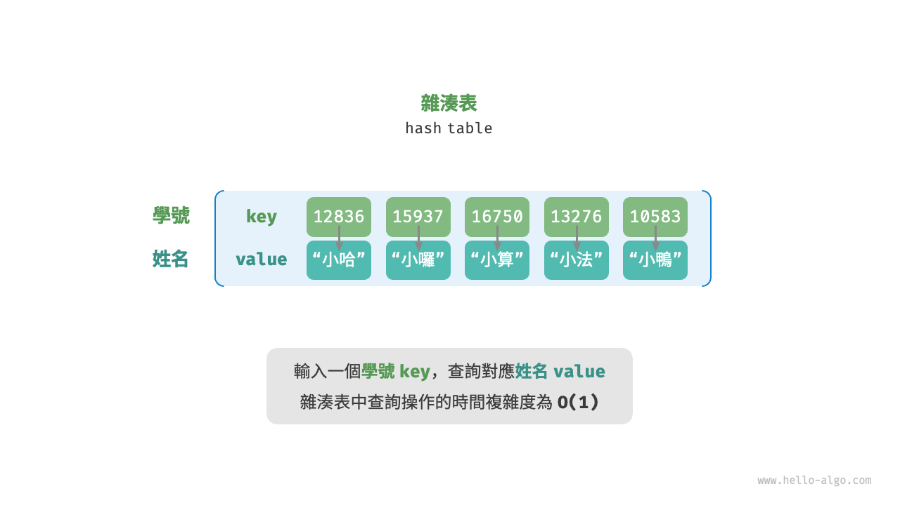
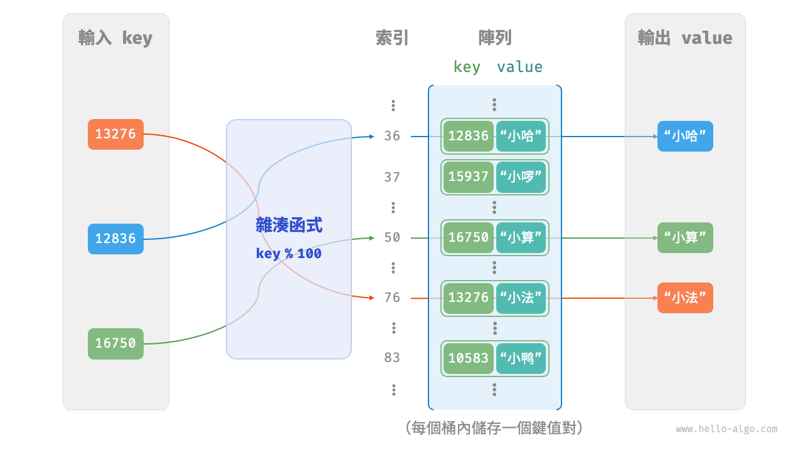
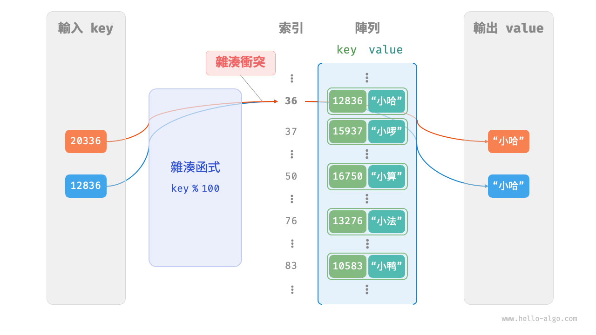
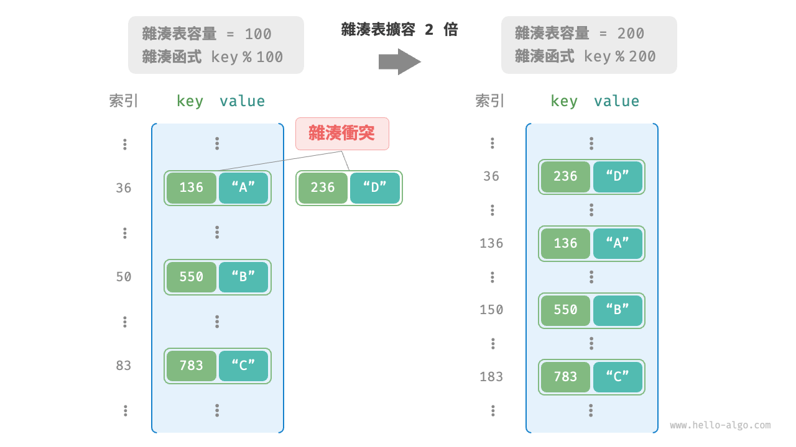

# 6.1 &nbsp; 雜湊表

<u>雜湊表（hash table）</u>，又稱<u>散列表</u>，它透過建立鍵 `key` 與值 `value` 之間的對映，實現高效的元素查詢。具體而言，我們向雜湊表中輸入一個鍵 `key` ，則可以在 $O(1)$ 時間內獲取對應的值 `value` 。

如圖 6-1 所示，給定 $n$ 個學生，每個學生都有“姓名”和“學號”兩項資料。假如我們希望實現“輸入一個學號，返回對應的姓名”的查詢功能，則可以採用圖 6-1 所示的雜湊表來實現。

{ class="animation-figure" }

<p align="center"> 圖 6-1 &nbsp; 雜湊表的抽象表示 </p>

除雜湊表外，陣列和鏈結串列也可以實現查詢功能，它們的效率對比如表 6-1 所示。

- **新增元素**：僅需將元素新增至陣列（鏈結串列）的尾部即可，使用 $O(1)$ 時間。
- **查詢元素**：由於陣列（鏈結串列）是亂序的，因此需要走訪其中的所有元素，使用 $O(n)$ 時間。
- **刪除元素**：需要先查詢到元素，再從陣列（鏈結串列）中刪除，使用 $O(n)$ 時間。

<p align="center"> 表 6-1 &nbsp; 元素查詢效率對比 </p>

<div class="center-table" markdown>

|          | 陣列   | 鏈結串列   | 雜湊表 |
| -------- | ------ | ------ | ------ |
| 查詢元素 | $O(n)$ | $O(n)$ | $O(1)$ |
| 新增元素 | $O(1)$ | $O(1)$ | $O(1)$ |
| 刪除元素 | $O(n)$ | $O(n)$ | $O(1)$ |

</div>

觀察發現，**在雜湊表中進行增刪查改的時間複雜度都是 $O(1)$** ，非常高效。

## 6.1.1 &nbsp; 雜湊表常用操作

雜湊表的常見操作包括：初始化、查詢操作、新增鍵值對和刪除鍵值對等，示例程式碼如下：

=== "Python"

    ```python title="hash_map.py"
    # 初始化雜湊表
    hmap: dict = {}
    
    # 新增操作
    # 在雜湊表中新增鍵值對 (key, value)
    hmap[12836] = "小哈"
    hmap[15937] = "小囉"
    hmap[16750] = "小算"
    hmap[13276] = "小法"
    hmap[10583] = "小鴨"
    
    # 查詢操作
    # 向雜湊表中輸入鍵 key ，得到值 value
    name: str = hmap[15937]
    
    # 刪除操作
    # 在雜湊表中刪除鍵值對 (key, value)
    hmap.pop(10583)
    ```

=== "C++"

    ```cpp title="hash_map.cpp"
    /* 初始化雜湊表 */
    unordered_map<int, string> map;
    
    /* 新增操作 */
    // 在雜湊表中新增鍵值對 (key, value)
    map[12836] = "小哈";
    map[15937] = "小囉";
    map[16750] = "小算";
    map[13276] = "小法";
    map[10583] = "小鴨";
    
    /* 查詢操作 */
    // 向雜湊表中輸入鍵 key ，得到值 value
    string name = map[15937];
    
    /* 刪除操作 */
    // 在雜湊表中刪除鍵值對 (key, value)
    map.erase(10583);
    ```

=== "Java"

    ```java title="hash_map.java"
    /* 初始化雜湊表 */
    Map<Integer, String> map = new HashMap<>();
    
    /* 新增操作 */
    // 在雜湊表中新增鍵值對 (key, value)
    map.put(12836, "小哈");   
    map.put(15937, "小囉");   
    map.put(16750, "小算");   
    map.put(13276, "小法");
    map.put(10583, "小鴨");
    
    /* 查詢操作 */
    // 向雜湊表中輸入鍵 key ，得到值 value
    String name = map.get(15937);
    
    /* 刪除操作 */
    // 在雜湊表中刪除鍵值對 (key, value)
    map.remove(10583);
    ```

=== "C#"

    ```csharp title="hash_map.cs"
    /* 初始化雜湊表 */
    Dictionary<int, string> map = new() {
        /* 新增操作 */
        // 在雜湊表中新增鍵值對 (key, value)
        { 12836, "小哈" },
        { 15937, "小囉" },
        { 16750, "小算" },
        { 13276, "小法" },
        { 10583, "小鴨" }
    };
    
    /* 查詢操作 */
    // 向雜湊表中輸入鍵 key ，得到值 value
    string name = map[15937];
    
    /* 刪除操作 */
    // 在雜湊表中刪除鍵值對 (key, value)
    map.Remove(10583);
    ```

=== "Go"

    ```go title="hash_map_test.go"
    /* 初始化雜湊表 */
    hmap := make(map[int]string)
    
    /* 新增操作 */
    // 在雜湊表中新增鍵值對 (key, value)
    hmap[12836] = "小哈"
    hmap[15937] = "小囉"
    hmap[16750] = "小算"
    hmap[13276] = "小法"
    hmap[10583] = "小鴨"
    
    /* 查詢操作 */
    // 向雜湊表中輸入鍵 key ，得到值 value
    name := hmap[15937]
    
    /* 刪除操作 */
    // 在雜湊表中刪除鍵值對 (key, value)
    delete(hmap, 10583)
    ```

=== "Swift"

    ```swift title="hash_map.swift"
    /* 初始化雜湊表 */
    var map: [Int: String] = [:]
    
    /* 新增操作 */
    // 在雜湊表中新增鍵值對 (key, value)
    map[12836] = "小哈"
    map[15937] = "小囉"
    map[16750] = "小算"
    map[13276] = "小法"
    map[10583] = "小鴨"
    
    /* 查詢操作 */
    // 向雜湊表中輸入鍵 key ，得到值 value
    let name = map[15937]!
    
    /* 刪除操作 */
    // 在雜湊表中刪除鍵值對 (key, value)
    map.removeValue(forKey: 10583)
    ```

=== "JS"

    ```javascript title="hash_map.js"
    /* 初始化雜湊表 */
    const map = new Map();
    /* 新增操作 */
    // 在雜湊表中新增鍵值對 (key, value)
    map.set(12836, '小哈');
    map.set(15937, '小囉');
    map.set(16750, '小算');
    map.set(13276, '小法');
    map.set(10583, '小鴨');
    
    /* 查詢操作 */
    // 向雜湊表中輸入鍵 key ，得到值 value
    let name = map.get(15937);
    
    /* 刪除操作 */
    // 在雜湊表中刪除鍵值對 (key, value)
    map.delete(10583);
    ```

=== "TS"

    ```typescript title="hash_map.ts"
    /* 初始化雜湊表 */
    const map = new Map<number, string>();
    /* 新增操作 */
    // 在雜湊表中新增鍵值對 (key, value)
    map.set(12836, '小哈');
    map.set(15937, '小囉');
    map.set(16750, '小算');
    map.set(13276, '小法');
    map.set(10583, '小鴨');
    console.info('\n新增完成後，雜湊表為\nKey -> Value');
    console.info(map);
    
    /* 查詢操作 */
    // 向雜湊表中輸入鍵 key ，得到值 value
    let name = map.get(15937);
    console.info('\n輸入學號 15937 ，查詢到姓名 ' + name);
    
    /* 刪除操作 */
    // 在雜湊表中刪除鍵值對 (key, value)
    map.delete(10583);
    console.info('\n刪除 10583 後，雜湊表為\nKey -> Value');
    console.info(map);
    ```

=== "Dart"

    ```dart title="hash_map.dart"
    /* 初始化雜湊表 */
    Map<int, String> map = {};

    /* 新增操作 */
    // 在雜湊表中新增鍵值對 (key, value)
    map[12836] = "小哈";
    map[15937] = "小囉";
    map[16750] = "小算";
    map[13276] = "小法";
    map[10583] = "小鴨";

    /* 查詢操作 */
    // 向雜湊表中輸入鍵 key ，得到值 value
    String name = map[15937];

    /* 刪除操作 */
    // 在雜湊表中刪除鍵值對 (key, value)
    map.remove(10583);
    ```

=== "Rust"

    ```rust title="hash_map.rs"
    use std::collections::HashMap;
    
    /* 初始化雜湊表 */
    let mut map: HashMap<i32, String> = HashMap::new();

    /* 新增操作 */
    // 在雜湊表中新增鍵值對 (key, value)
    map.insert(12836, "小哈".to_string());
    map.insert(15937, "小囉".to_string());
    map.insert(16750, "小算".to_string());
    map.insert(13279, "小法".to_string());
    map.insert(10583, "小鴨".to_string());

    /* 查詢操作 */
    // 向雜湊表中輸入鍵 key ，得到值 value
    let _name: Option<&String> = map.get(&15937);

    /* 刪除操作 */
    // 在雜湊表中刪除鍵值對 (key, value)
    let _removed_value: Option<String> = map.remove(&10583);
    ```

=== "C"

    ```c title="hash_map.c"
    // C 未提供內建雜湊表
    ```

=== "Kotlin"

    ```kotlin title="hash_map.kt"
    /* 初始化雜湊表 */
    val map = HashMap<Int,String>()
    
    /* 新增操作 */
    // 在雜湊表中新增鍵值對 (key, value)
    map[12836] = "小哈"
    map[15937] = "小囉"
    map[16750] = "小算"
    map[13276] = "小法"
    map[10583] = "小鴨"
    
    /* 查詢操作 */
    // 向雜湊表中輸入鍵 key ，得到值 value
    val name = map[15937]
    
    /* 刪除操作 */
    // 在雜湊表中刪除鍵值對 (key, value)
    map.remove(10583)
    ```

=== "Ruby"

    ```ruby title="hash_map.rb"

    ```

=== "Zig"

    ```zig title="hash_map.zig"

    ```

??? pythontutor "視覺化執行"

    <div style="height: 549px; width: 100%;"><iframe class="pythontutor-iframe" src="https://pythontutor.com/iframe-embed.html#code=%22%22%22Driver%20Code%22%22%22%0Aif%20__name__%20%3D%3D%20%22__main__%22%3A%0A%20%20%20%20%23%20%E5%88%9D%E5%A7%8B%E5%8C%96%E9%9B%9C%E6%B9%8A%E8%A1%A8%0A%20%20%20%20hmap%20%3D%20%7B%7D%0A%20%20%20%20%0A%20%20%20%20%23%20%E6%96%B0%E5%A2%9E%E6%93%8D%E4%BD%9C%0A%20%20%20%20%23%20%E5%9C%A8%E9%9B%9C%E6%B9%8A%E8%A1%A8%E4%B8%AD%E6%96%B0%E5%A2%9E%E9%8D%B5%E5%80%BC%E5%B0%8D%20%28key%2C%20value%29%0A%20%20%20%20hmap%5B12836%5D%20%3D%20%22%E5%B0%8F%E5%93%88%22%0A%20%20%20%20hmap%5B15937%5D%20%3D%20%22%E5%B0%8F%E5%9B%89%22%0A%20%20%20%20hmap%5B16750%5D%20%3D%20%22%E5%B0%8F%E7%AE%97%22%0A%20%20%20%20hmap%5B13276%5D%20%3D%20%22%E5%B0%8F%E6%B3%95%22%0A%20%20%20%20hmap%5B10583%5D%20%3D%20%22%E5%B0%8F%E9%B4%A8%22%0A%20%20%20%20%0A%20%20%20%20%23%20%E6%9F%A5%E8%A9%A2%E6%93%8D%E4%BD%9C%0A%20%20%20%20%23%20%E5%90%91%E9%9B%9C%E6%B9%8A%E8%A1%A8%E4%B8%AD%E8%BC%B8%E5%85%A5%E9%8D%B5%20key%20%EF%BC%8C%E5%BE%97%E5%88%B0%E5%80%BC%20value%0A%20%20%20%20name%20%3D%20hmap%5B15937%5D%0A%20%20%20%20%0A%20%20%20%20%23%20%E5%88%AA%E9%99%A4%E6%93%8D%E4%BD%9C%0A%20%20%20%20%23%20%E5%9C%A8%E9%9B%9C%E6%B9%8A%E8%A1%A8%E4%B8%AD%E5%88%AA%E9%99%A4%E9%8D%B5%E5%80%BC%E5%B0%8D%20%28key%2C%20value%29%0A%20%20%20%20hmap.pop%2810583%29&codeDivHeight=472&codeDivWidth=350&cumulative=false&curInstr=2&heapPrimitives=nevernest&origin=opt-frontend.js&py=311&rawInputLstJSON=%5B%5D&textReferences=false"> </iframe></div>
    <div style="margin-top: 5px;"><a href="https://pythontutor.com/iframe-embed.html#code=%22%22%22Driver%20Code%22%22%22%0Aif%20__name__%20%3D%3D%20%22__main__%22%3A%0A%20%20%20%20%23%20%E5%88%9D%E5%A7%8B%E5%8C%96%E9%9B%9C%E6%B9%8A%E8%A1%A8%0A%20%20%20%20hmap%20%3D%20%7B%7D%0A%20%20%20%20%0A%20%20%20%20%23%20%E6%96%B0%E5%A2%9E%E6%93%8D%E4%BD%9C%0A%20%20%20%20%23%20%E5%9C%A8%E9%9B%9C%E6%B9%8A%E8%A1%A8%E4%B8%AD%E6%96%B0%E5%A2%9E%E9%8D%B5%E5%80%BC%E5%B0%8D%20%28key%2C%20value%29%0A%20%20%20%20hmap%5B12836%5D%20%3D%20%22%E5%B0%8F%E5%93%88%22%0A%20%20%20%20hmap%5B15937%5D%20%3D%20%22%E5%B0%8F%E5%9B%89%22%0A%20%20%20%20hmap%5B16750%5D%20%3D%20%22%E5%B0%8F%E7%AE%97%22%0A%20%20%20%20hmap%5B13276%5D%20%3D%20%22%E5%B0%8F%E6%B3%95%22%0A%20%20%20%20hmap%5B10583%5D%20%3D%20%22%E5%B0%8F%E9%B4%A8%22%0A%20%20%20%20%0A%20%20%20%20%23%20%E6%9F%A5%E8%A9%A2%E6%93%8D%E4%BD%9C%0A%20%20%20%20%23%20%E5%90%91%E9%9B%9C%E6%B9%8A%E8%A1%A8%E4%B8%AD%E8%BC%B8%E5%85%A5%E9%8D%B5%20key%20%EF%BC%8C%E5%BE%97%E5%88%B0%E5%80%BC%20value%0A%20%20%20%20name%20%3D%20hmap%5B15937%5D%0A%20%20%20%20%0A%20%20%20%20%23%20%E5%88%AA%E9%99%A4%E6%93%8D%E4%BD%9C%0A%20%20%20%20%23%20%E5%9C%A8%E9%9B%9C%E6%B9%8A%E8%A1%A8%E4%B8%AD%E5%88%AA%E9%99%A4%E9%8D%B5%E5%80%BC%E5%B0%8D%20%28key%2C%20value%29%0A%20%20%20%20hmap.pop%2810583%29&codeDivHeight=800&codeDivWidth=600&cumulative=false&curInstr=2&heapPrimitives=nevernest&origin=opt-frontend.js&py=311&rawInputLstJSON=%5B%5D&textReferences=false" target="_blank" rel="noopener noreferrer">全螢幕觀看 ></a></div>

雜湊表有三種常用的走訪方式：走訪鍵值對、走訪鍵和走訪值。示例程式碼如下：

=== "Python"

    ```python title="hash_map.py"
    # 走訪雜湊表
    # 走訪鍵值對 key->value
    for key, value in hmap.items():
        print(key, "->", value)
    # 單獨走訪鍵 key
    for key in hmap.keys():
        print(key)
    # 單獨走訪值 value
    for value in hmap.values():
        print(value)
    ```

=== "C++"

    ```cpp title="hash_map.cpp"
    /* 走訪雜湊表 */
    // 走訪鍵值對 key->value
    for (auto kv: map) {
        cout << kv.first << " -> " << kv.second << endl;
    }
    // 使用迭代器走訪 key->value
    for (auto iter = map.begin(); iter != map.end(); iter++) {
        cout << iter->first << "->" << iter->second << endl;
    }
    ```

=== "Java"

    ```java title="hash_map.java"
    /* 走訪雜湊表 */
    // 走訪鍵值對 key->value
    for (Map.Entry <Integer, String> kv: map.entrySet()) {
        System.out.println(kv.getKey() + " -> " + kv.getValue());
    }
    // 單獨走訪鍵 key
    for (int key: map.keySet()) {
        System.out.println(key);
    }
    // 單獨走訪值 value
    for (String val: map.values()) {
        System.out.println(val);
    }
    ```

=== "C#"

    ```csharp title="hash_map.cs"
    /* 走訪雜湊表 */
    // 走訪鍵值對 Key->Value
    foreach (var kv in map) {
        Console.WriteLine(kv.Key + " -> " + kv.Value);
    }
    // 單獨走訪鍵 key
    foreach (int key in map.Keys) {
        Console.WriteLine(key);
    }
    // 單獨走訪值 value
    foreach (string val in map.Values) {
        Console.WriteLine(val);
    }
    ```

=== "Go"

    ```go title="hash_map_test.go"
    /* 走訪雜湊表 */
    // 走訪鍵值對 key->value
    for key, value := range hmap {
        fmt.Println(key, "->", value)
    }
    // 單獨走訪鍵 key
    for key := range hmap {
        fmt.Println(key)
    }
    // 單獨走訪值 value
    for _, value := range hmap {
        fmt.Println(value)
    }
    ```

=== "Swift"

    ```swift title="hash_map.swift"
    /* 走訪雜湊表 */
    // 走訪鍵值對 Key->Value
    for (key, value) in map {
        print("\(key) -> \(value)")
    }
    // 單獨走訪鍵 Key
    for key in map.keys {
        print(key)
    }
    // 單獨走訪值 Value
    for value in map.values {
        print(value)
    }
    ```

=== "JS"

    ```javascript title="hash_map.js"
    /* 走訪雜湊表 */
    console.info('\n走訪鍵值對 Key->Value');
    for (const [k, v] of map.entries()) {
        console.info(k + ' -> ' + v);
    }
    console.info('\n單獨走訪鍵 Key');
    for (const k of map.keys()) {
        console.info(k);
    }
    console.info('\n單獨走訪值 Value');
    for (const v of map.values()) {
        console.info(v);
    }
    ```

=== "TS"

    ```typescript title="hash_map.ts"
    /* 走訪雜湊表 */
    console.info('\n走訪鍵值對 Key->Value');
    for (const [k, v] of map.entries()) {
        console.info(k + ' -> ' + v);
    }
    console.info('\n單獨走訪鍵 Key');
    for (const k of map.keys()) {
        console.info(k);
    }
    console.info('\n單獨走訪值 Value');
    for (const v of map.values()) {
        console.info(v);
    }
    ```

=== "Dart"

    ```dart title="hash_map.dart"
    /* 走訪雜湊表 */
    // 走訪鍵值對 Key->Value
    map.forEach((key, value) {
      print('$key -> $value');
    });

    // 單獨走訪鍵 Key
    map.keys.forEach((key) {
      print(key);
    });

    // 單獨走訪值 Value
    map.values.forEach((value) {
      print(value);
    });
    ```

=== "Rust"

    ```rust title="hash_map.rs"
    /* 走訪雜湊表 */
    // 走訪鍵值對 Key->Value
    for (key, value) in &map {
        println!("{key} -> {value}");
    }

    // 單獨走訪鍵 Key
    for key in map.keys() {
        println!("{key}"); 
    }

    // 單獨走訪值 Value
    for value in map.values() {
        println!("{value}");
    }
    ```

=== "C"

    ```c title="hash_map.c"
    // C 未提供內建雜湊表
    ```

=== "Kotlin"

    ```kotlin title="hash_map.kt"
    /* 走訪雜湊表 */
    // 走訪鍵值對 key->value
    for ((key, value) in map) {
        println("$key -> $value")
    }
    // 單獨走訪鍵 key
    for (key in map.keys) {
        println(key)
    }
    // 單獨走訪值 value
    for (_val in map.values) {
        println(_val)
    }
    ```

=== "Ruby"

    ```ruby title="hash_map.rb"

    ```

=== "Zig"

    ```zig title="hash_map.zig"

    ```

??? pythontutor "視覺化執行"

    <div style="height: 549px; width: 100%;"><iframe class="pythontutor-iframe" src="https://pythontutor.com/iframe-embed.html#code=%22%22%22Driver%20Code%22%22%22%0Aif%20__name__%20%3D%3D%20%22__main__%22%3A%0A%20%20%20%20%23%20%E5%88%9D%E5%A7%8B%E5%8C%96%E9%9B%9C%E6%B9%8A%E8%A1%A8%0A%20%20%20%20hmap%20%3D%20%7B%7D%0A%20%20%20%20%0A%20%20%20%20%23%20%E6%96%B0%E5%A2%9E%E6%93%8D%E4%BD%9C%0A%20%20%20%20%23%20%E5%9C%A8%E9%9B%9C%E6%B9%8A%E8%A1%A8%E4%B8%AD%E6%96%B0%E5%A2%9E%E9%8D%B5%E5%80%BC%E5%B0%8D%20%28key%2C%20value%29%0A%20%20%20%20hmap%5B12836%5D%20%3D%20%22%E5%B0%8F%E5%93%88%22%0A%20%20%20%20hmap%5B15937%5D%20%3D%20%22%E5%B0%8F%E5%9B%89%22%0A%20%20%20%20hmap%5B16750%5D%20%3D%20%22%E5%B0%8F%E7%AE%97%22%0A%20%20%20%20hmap%5B13276%5D%20%3D%20%22%E5%B0%8F%E6%B3%95%22%0A%20%20%20%20hmap%5B10583%5D%20%3D%20%22%E5%B0%8F%E9%B4%A8%22%0A%20%20%20%20%0A%20%20%20%20%23%20%E8%B5%B0%E8%A8%AA%E9%9B%9C%E6%B9%8A%E8%A1%A8%0A%20%20%20%20%23%20%E8%B5%B0%E8%A8%AA%E9%8D%B5%E5%80%BC%E5%B0%8D%20key-%3Evalue%0A%20%20%20%20for%20key%2C%20value%20in%20hmap.items%28%29%3A%0A%20%20%20%20%20%20%20%20print%28key%2C%20%22-%3E%22%2C%20value%29%0A%20%20%20%20%23%20%E5%96%AE%E7%8D%A8%E8%B5%B0%E8%A8%AA%E9%8D%B5%20key%0A%20%20%20%20for%20key%20in%20hmap.keys%28%29%3A%0A%20%20%20%20%20%20%20%20print%28key%29%0A%20%20%20%20%23%20%E5%96%AE%E7%8D%A8%E8%B5%B0%E8%A8%AA%E5%80%BC%20value%0A%20%20%20%20for%20value%20in%20hmap.values%28%29%3A%0A%20%20%20%20%20%20%20%20print%28value%29&codeDivHeight=472&codeDivWidth=350&cumulative=false&curInstr=8&heapPrimitives=nevernest&origin=opt-frontend.js&py=311&rawInputLstJSON=%5B%5D&textReferences=false"> </iframe></div>
    <div style="margin-top: 5px;"><a href="https://pythontutor.com/iframe-embed.html#code=%22%22%22Driver%20Code%22%22%22%0Aif%20__name__%20%3D%3D%20%22__main__%22%3A%0A%20%20%20%20%23%20%E5%88%9D%E5%A7%8B%E5%8C%96%E9%9B%9C%E6%B9%8A%E8%A1%A8%0A%20%20%20%20hmap%20%3D%20%7B%7D%0A%20%20%20%20%0A%20%20%20%20%23%20%E6%96%B0%E5%A2%9E%E6%93%8D%E4%BD%9C%0A%20%20%20%20%23%20%E5%9C%A8%E9%9B%9C%E6%B9%8A%E8%A1%A8%E4%B8%AD%E6%96%B0%E5%A2%9E%E9%8D%B5%E5%80%BC%E5%B0%8D%20%28key%2C%20value%29%0A%20%20%20%20hmap%5B12836%5D%20%3D%20%22%E5%B0%8F%E5%93%88%22%0A%20%20%20%20hmap%5B15937%5D%20%3D%20%22%E5%B0%8F%E5%9B%89%22%0A%20%20%20%20hmap%5B16750%5D%20%3D%20%22%E5%B0%8F%E7%AE%97%22%0A%20%20%20%20hmap%5B13276%5D%20%3D%20%22%E5%B0%8F%E6%B3%95%22%0A%20%20%20%20hmap%5B10583%5D%20%3D%20%22%E5%B0%8F%E9%B4%A8%22%0A%20%20%20%20%0A%20%20%20%20%23%20%E8%B5%B0%E8%A8%AA%E9%9B%9C%E6%B9%8A%E8%A1%A8%0A%20%20%20%20%23%20%E8%B5%B0%E8%A8%AA%E9%8D%B5%E5%80%BC%E5%B0%8D%20key-%3Evalue%0A%20%20%20%20for%20key%2C%20value%20in%20hmap.items%28%29%3A%0A%20%20%20%20%20%20%20%20print%28key%2C%20%22-%3E%22%2C%20value%29%0A%20%20%20%20%23%20%E5%96%AE%E7%8D%A8%E8%B5%B0%E8%A8%AA%E9%8D%B5%20key%0A%20%20%20%20for%20key%20in%20hmap.keys%28%29%3A%0A%20%20%20%20%20%20%20%20print%28key%29%0A%20%20%20%20%23%20%E5%96%AE%E7%8D%A8%E8%B5%B0%E8%A8%AA%E5%80%BC%20value%0A%20%20%20%20for%20value%20in%20hmap.values%28%29%3A%0A%20%20%20%20%20%20%20%20print%28value%29&codeDivHeight=800&codeDivWidth=600&cumulative=false&curInstr=8&heapPrimitives=nevernest&origin=opt-frontend.js&py=311&rawInputLstJSON=%5B%5D&textReferences=false" target="_blank" rel="noopener noreferrer">全螢幕觀看 ></a></div>

## 6.1.2 &nbsp; 雜湊表簡單實現

我們先考慮最簡單的情況，**僅用一個陣列來實現雜湊表**。在雜湊表中，我們將陣列中的每個空位稱為<u>桶（bucket）</u>，每個桶可儲存一個鍵值對。因此，查詢操作就是找到 `key` 對應的桶，並在桶中獲取 `value` 。

那麼，如何基於 `key` 定位對應的桶呢？這是透過<u>雜湊函式（hash function）</u>實現的。雜湊函式的作用是將一個較大的輸入空間對映到一個較小的輸出空間。在雜湊表中，輸入空間是所有 `key` ，輸出空間是所有桶（陣列索引）。換句話說，輸入一個 `key` ，**我們可以透過雜湊函式得到該 `key` 對應的鍵值對在陣列中的儲存位置**。

輸入一個 `key` ，雜湊函式的計算過程分為以下兩步。

1. 透過某種雜湊演算法 `hash()` 計算得到雜湊值。
2. 將雜湊值對桶數量（陣列長度）`capacity` 取模，從而獲取該 `key` 對應的陣列索引 `index` 。

```shell
index = hash(key) % capacity
```

隨後，我們就可以利用 `index` 在雜湊表中訪問對應的桶，從而獲取 `value` 。

設陣列長度 `capacity = 100`、雜湊演算法 `hash(key) = key` ，易得雜湊函式為 `key % 100` 。圖 6-2 以 `key` 學號和 `value` 姓名為例，展示了雜湊函式的工作原理。

{ class="animation-figure" }

<p align="center"> 圖 6-2 &nbsp; 雜湊函式工作原理 </p>

以下程式碼實現了一個簡單雜湊表。其中，我們將 `key` 和 `value` 封裝成一個類別 `Pair` ，以表示鍵值對。

=== "Python"

    ```python title="array_hash_map.py"
    class Pair:
        """鍵值對"""

        def __init__(self, key: int, val: str):
            self.key = key
            self.val = val

    class ArrayHashMap:
        """基於陣列實現的雜湊表"""

        def __init__(self):
            """建構子"""
            # 初始化陣列，包含 100 個桶
            self.buckets: list[Pair | None] = [None] * 100

        def hash_func(self, key: int) -> int:
            """雜湊函式"""
            index = key % 100
            return index

        def get(self, key: int) -> str:
            """查詢操作"""
            index: int = self.hash_func(key)
            pair: Pair = self.buckets[index]
            if pair is None:
                return None
            return pair.val

        def put(self, key: int, val: str):
            """新增操作"""
            pair = Pair(key, val)
            index: int = self.hash_func(key)
            self.buckets[index] = pair

        def remove(self, key: int):
            """刪除操作"""
            index: int = self.hash_func(key)
            # 置為 None ，代表刪除
            self.buckets[index] = None

        def entry_set(self) -> list[Pair]:
            """獲取所有鍵值對"""
            result: list[Pair] = []
            for pair in self.buckets:
                if pair is not None:
                    result.append(pair)
            return result

        def key_set(self) -> list[int]:
            """獲取所有鍵"""
            result = []
            for pair in self.buckets:
                if pair is not None:
                    result.append(pair.key)
            return result

        def value_set(self) -> list[str]:
            """獲取所有值"""
            result = []
            for pair in self.buckets:
                if pair is not None:
                    result.append(pair.val)
            return result

        def print(self):
            """列印雜湊表"""
            for pair in self.buckets:
                if pair is not None:
                    print(pair.key, "->", pair.val)
    ```

=== "C++"

    ```cpp title="array_hash_map.cpp"
    /* 鍵值對 */
    struct Pair {
      public:
        int key;
        string val;
        Pair(int key, string val) {
            this->key = key;
            this->val = val;
        }
    };

    /* 基於陣列實現的雜湊表 */
    class ArrayHashMap {
      private:
        vector<Pair *> buckets;

      public:
        ArrayHashMap() {
            // 初始化陣列，包含 100 個桶
            buckets = vector<Pair *>(100);
        }

        ~ArrayHashMap() {
            // 釋放記憶體
            for (const auto &bucket : buckets) {
                delete bucket;
            }
            buckets.clear();
        }

        /* 雜湊函式 */
        int hashFunc(int key) {
            int index = key % 100;
            return index;
        }

        /* 查詢操作 */
        string get(int key) {
            int index = hashFunc(key);
            Pair *pair = buckets[index];
            if (pair == nullptr)
                return "";
            return pair->val;
        }

        /* 新增操作 */
        void put(int key, string val) {
            Pair *pair = new Pair(key, val);
            int index = hashFunc(key);
            buckets[index] = pair;
        }

        /* 刪除操作 */
        void remove(int key) {
            int index = hashFunc(key);
            // 釋放記憶體並置為 nullptr
            delete buckets[index];
            buckets[index] = nullptr;
        }

        /* 獲取所有鍵值對 */
        vector<Pair *> pairSet() {
            vector<Pair *> pairSet;
            for (Pair *pair : buckets) {
                if (pair != nullptr) {
                    pairSet.push_back(pair);
                }
            }
            return pairSet;
        }

        /* 獲取所有鍵 */
        vector<int> keySet() {
            vector<int> keySet;
            for (Pair *pair : buckets) {
                if (pair != nullptr) {
                    keySet.push_back(pair->key);
                }
            }
            return keySet;
        }

        /* 獲取所有值 */
        vector<string> valueSet() {
            vector<string> valueSet;
            for (Pair *pair : buckets) {
                if (pair != nullptr) {
                    valueSet.push_back(pair->val);
                }
            }
            return valueSet;
        }

        /* 列印雜湊表 */
        void print() {
            for (Pair *kv : pairSet()) {
                cout << kv->key << " -> " << kv->val << endl;
            }
        }
    };
    ```

=== "Java"

    ```java title="array_hash_map.java"
    /* 鍵值對 */
    class Pair {
        public int key;
        public String val;

        public Pair(int key, String val) {
            this.key = key;
            this.val = val;
        }
    }

    /* 基於陣列實現的雜湊表 */
    class ArrayHashMap {
        private List<Pair> buckets;

        public ArrayHashMap() {
            // 初始化陣列，包含 100 個桶
            buckets = new ArrayList<>();
            for (int i = 0; i < 100; i++) {
                buckets.add(null);
            }
        }

        /* 雜湊函式 */
        private int hashFunc(int key) {
            int index = key % 100;
            return index;
        }

        /* 查詢操作 */
        public String get(int key) {
            int index = hashFunc(key);
            Pair pair = buckets.get(index);
            if (pair == null)
                return null;
            return pair.val;
        }

        /* 新增操作 */
        public void put(int key, String val) {
            Pair pair = new Pair(key, val);
            int index = hashFunc(key);
            buckets.set(index, pair);
        }

        /* 刪除操作 */
        public void remove(int key) {
            int index = hashFunc(key);
            // 置為 null ，代表刪除
            buckets.set(index, null);
        }

        /* 獲取所有鍵值對 */
        public List<Pair> pairSet() {
            List<Pair> pairSet = new ArrayList<>();
            for (Pair pair : buckets) {
                if (pair != null)
                    pairSet.add(pair);
            }
            return pairSet;
        }

        /* 獲取所有鍵 */
        public List<Integer> keySet() {
            List<Integer> keySet = new ArrayList<>();
            for (Pair pair : buckets) {
                if (pair != null)
                    keySet.add(pair.key);
            }
            return keySet;
        }

        /* 獲取所有值 */
        public List<String> valueSet() {
            List<String> valueSet = new ArrayList<>();
            for (Pair pair : buckets) {
                if (pair != null)
                    valueSet.add(pair.val);
            }
            return valueSet;
        }

        /* 列印雜湊表 */
        public void print() {
            for (Pair kv : pairSet()) {
                System.out.println(kv.key + " -> " + kv.val);
            }
        }
    }
    ```

=== "C#"

    ```csharp title="array_hash_map.cs"
    /* 鍵值對 int->string */
    class Pair(int key, string val) {
        public int key = key;
        public string val = val;
    }

    /* 基於陣列實現的雜湊表 */
    class ArrayHashMap {
        List<Pair?> buckets;
        public ArrayHashMap() {
            // 初始化陣列，包含 100 個桶
            buckets = [];
            for (int i = 0; i < 100; i++) {
                buckets.Add(null);
            }
        }

        /* 雜湊函式 */
        int HashFunc(int key) {
            int index = key % 100;
            return index;
        }

        /* 查詢操作 */
        public string? Get(int key) {
            int index = HashFunc(key);
            Pair? pair = buckets[index];
            if (pair == null) return null;
            return pair.val;
        }

        /* 新增操作 */
        public void Put(int key, string val) {
            Pair pair = new(key, val);
            int index = HashFunc(key);
            buckets[index] = pair;
        }

        /* 刪除操作 */
        public void Remove(int key) {
            int index = HashFunc(key);
            // 置為 null ，代表刪除
            buckets[index] = null;
        }

        /* 獲取所有鍵值對 */
        public List<Pair> PairSet() {
            List<Pair> pairSet = [];
            foreach (Pair? pair in buckets) {
                if (pair != null)
                    pairSet.Add(pair);
            }
            return pairSet;
        }

        /* 獲取所有鍵 */
        public List<int> KeySet() {
            List<int> keySet = [];
            foreach (Pair? pair in buckets) {
                if (pair != null)
                    keySet.Add(pair.key);
            }
            return keySet;
        }

        /* 獲取所有值 */
        public List<string> ValueSet() {
            List<string> valueSet = [];
            foreach (Pair? pair in buckets) {
                if (pair != null)
                    valueSet.Add(pair.val);
            }
            return valueSet;
        }

        /* 列印雜湊表 */
        public void Print() {
            foreach (Pair kv in PairSet()) {
                Console.WriteLine(kv.key + " -> " + kv.val);
            }
        }
    }
    ```

=== "Go"

    ```go title="array_hash_map.go"
    /* 鍵值對 */
    type pair struct {
        key int
        val string
    }

    /* 基於陣列實現的雜湊表 */
    type arrayHashMap struct {
        buckets []*pair
    }

    /* 初始化雜湊表 */
    func newArrayHashMap() *arrayHashMap {
        // 初始化陣列，包含 100 個桶
        buckets := make([]*pair, 100)
        return &arrayHashMap{buckets: buckets}
    }

    /* 雜湊函式 */
    func (a *arrayHashMap) hashFunc(key int) int {
        index := key % 100
        return index
    }

    /* 查詢操作 */
    func (a *arrayHashMap) get(key int) string {
        index := a.hashFunc(key)
        pair := a.buckets[index]
        if pair == nil {
            return "Not Found"
        }
        return pair.val
    }

    /* 新增操作 */
    func (a *arrayHashMap) put(key int, val string) {
        pair := &pair{key: key, val: val}
        index := a.hashFunc(key)
        a.buckets[index] = pair
    }

    /* 刪除操作 */
    func (a *arrayHashMap) remove(key int) {
        index := a.hashFunc(key)
        // 置為 nil ，代表刪除
        a.buckets[index] = nil
    }

    /* 獲取所有鍵對 */
    func (a *arrayHashMap) pairSet() []*pair {
        var pairs []*pair
        for _, pair := range a.buckets {
            if pair != nil {
                pairs = append(pairs, pair)
            }
        }
        return pairs
    }

    /* 獲取所有鍵 */
    func (a *arrayHashMap) keySet() []int {
        var keys []int
        for _, pair := range a.buckets {
            if pair != nil {
                keys = append(keys, pair.key)
            }
        }
        return keys
    }

    /* 獲取所有值 */
    func (a *arrayHashMap) valueSet() []string {
        var values []string
        for _, pair := range a.buckets {
            if pair != nil {
                values = append(values, pair.val)
            }
        }
        return values
    }

    /* 列印雜湊表 */
    func (a *arrayHashMap) print() {
        for _, pair := range a.buckets {
            if pair != nil {
                fmt.Println(pair.key, "->", pair.val)
            }
        }
    }
    ```

=== "Swift"

    ```swift title="array_hash_map.swift"
    /* 鍵值對 */
    class Pair: Equatable {
        public var key: Int
        public var val: String

        public init(key: Int, val: String) {
            self.key = key
            self.val = val
        }

        public static func == (lhs: Pair, rhs: Pair) -> Bool {
            lhs.key == rhs.key && lhs.val == rhs.val
        }
    }

    /* 基於陣列實現的雜湊表 */
    class ArrayHashMap {
        private var buckets: [Pair?]

        init() {
            // 初始化陣列，包含 100 個桶
            buckets = Array(repeating: nil, count: 100)
        }

        /* 雜湊函式 */
        private func hashFunc(key: Int) -> Int {
            let index = key % 100
            return index
        }

        /* 查詢操作 */
        func get(key: Int) -> String? {
            let index = hashFunc(key: key)
            let pair = buckets[index]
            return pair?.val
        }

        /* 新增操作 */
        func put(key: Int, val: String) {
            let pair = Pair(key: key, val: val)
            let index = hashFunc(key: key)
            buckets[index] = pair
        }

        /* 刪除操作 */
        func remove(key: Int) {
            let index = hashFunc(key: key)
            // 置為 nil ，代表刪除
            buckets[index] = nil
        }

        /* 獲取所有鍵值對 */
        func pairSet() -> [Pair] {
            buckets.compactMap { $0 }
        }

        /* 獲取所有鍵 */
        func keySet() -> [Int] {
            buckets.compactMap { $0?.key }
        }

        /* 獲取所有值 */
        func valueSet() -> [String] {
            buckets.compactMap { $0?.val }
        }

        /* 列印雜湊表 */
        func print() {
            for pair in pairSet() {
                Swift.print("\(pair.key) -> \(pair.val)")
            }
        }
    }
    ```

=== "JS"

    ```javascript title="array_hash_map.js"
    /* 鍵值對 Number -> String */
    class Pair {
        constructor(key, val) {
            this.key = key;
            this.val = val;
        }
    }

    /* 基於陣列實現的雜湊表 */
    class ArrayHashMap {
        #buckets;
        constructor() {
            // 初始化陣列，包含 100 個桶
            this.#buckets = new Array(100).fill(null);
        }

        /* 雜湊函式 */
        #hashFunc(key) {
            return key % 100;
        }

        /* 查詢操作 */
        get(key) {
            let index = this.#hashFunc(key);
            let pair = this.#buckets[index];
            if (pair === null) return null;
            return pair.val;
        }

        /* 新增操作 */
        set(key, val) {
            let index = this.#hashFunc(key);
            this.#buckets[index] = new Pair(key, val);
        }

        /* 刪除操作 */
        delete(key) {
            let index = this.#hashFunc(key);
            // 置為 null ，代表刪除
            this.#buckets[index] = null;
        }

        /* 獲取所有鍵值對 */
        entries() {
            let arr = [];
            for (let i = 0; i < this.#buckets.length; i++) {
                if (this.#buckets[i]) {
                    arr.push(this.#buckets[i]);
                }
            }
            return arr;
        }

        /* 獲取所有鍵 */
        keys() {
            let arr = [];
            for (let i = 0; i < this.#buckets.length; i++) {
                if (this.#buckets[i]) {
                    arr.push(this.#buckets[i].key);
                }
            }
            return arr;
        }

        /* 獲取所有值 */
        values() {
            let arr = [];
            for (let i = 0; i < this.#buckets.length; i++) {
                if (this.#buckets[i]) {
                    arr.push(this.#buckets[i].val);
                }
            }
            return arr;
        }

        /* 列印雜湊表 */
        print() {
            let pairSet = this.entries();
            for (const pair of pairSet) {
                console.info(`${pair.key} -> ${pair.val}`);
            }
        }
    }
    ```

=== "TS"

    ```typescript title="array_hash_map.ts"
    /* 鍵值對 Number -> String */
    class Pair {
        public key: number;
        public val: string;

        constructor(key: number, val: string) {
            this.key = key;
            this.val = val;
        }
    }

    /* 基於陣列實現的雜湊表 */
    class ArrayHashMap {
        private readonly buckets: (Pair | null)[];

        constructor() {
            // 初始化陣列，包含 100 個桶
            this.buckets = new Array(100).fill(null);
        }

        /* 雜湊函式 */
        private hashFunc(key: number): number {
            return key % 100;
        }

        /* 查詢操作 */
        public get(key: number): string | null {
            let index = this.hashFunc(key);
            let pair = this.buckets[index];
            if (pair === null) return null;
            return pair.val;
        }

        /* 新增操作 */
        public set(key: number, val: string) {
            let index = this.hashFunc(key);
            this.buckets[index] = new Pair(key, val);
        }

        /* 刪除操作 */
        public delete(key: number) {
            let index = this.hashFunc(key);
            // 置為 null ，代表刪除
            this.buckets[index] = null;
        }

        /* 獲取所有鍵值對 */
        public entries(): (Pair | null)[] {
            let arr: (Pair | null)[] = [];
            for (let i = 0; i < this.buckets.length; i++) {
                if (this.buckets[i]) {
                    arr.push(this.buckets[i]);
                }
            }
            return arr;
        }

        /* 獲取所有鍵 */
        public keys(): (number | undefined)[] {
            let arr: (number | undefined)[] = [];
            for (let i = 0; i < this.buckets.length; i++) {
                if (this.buckets[i]) {
                    arr.push(this.buckets[i].key);
                }
            }
            return arr;
        }

        /* 獲取所有值 */
        public values(): (string | undefined)[] {
            let arr: (string | undefined)[] = [];
            for (let i = 0; i < this.buckets.length; i++) {
                if (this.buckets[i]) {
                    arr.push(this.buckets[i].val);
                }
            }
            return arr;
        }

        /* 列印雜湊表 */
        public print() {
            let pairSet = this.entries();
            for (const pair of pairSet) {
                console.info(`${pair.key} -> ${pair.val}`);
            }
        }
    }
    ```

=== "Dart"

    ```dart title="array_hash_map.dart"
    /* 鍵值對 */
    class Pair {
      int key;
      String val;
      Pair(this.key, this.val);
    }

    /* 基於陣列實現的雜湊表 */
    class ArrayHashMap {
      late List<Pair?> _buckets;

      ArrayHashMap() {
        // 初始化陣列，包含 100 個桶
        _buckets = List.filled(100, null);
      }

      /* 雜湊函式 */
      int _hashFunc(int key) {
        final int index = key % 100;
        return index;
      }

      /* 查詢操作 */
      String? get(int key) {
        final int index = _hashFunc(key);
        final Pair? pair = _buckets[index];
        if (pair == null) {
          return null;
        }
        return pair.val;
      }

      /* 新增操作 */
      void put(int key, String val) {
        final Pair pair = Pair(key, val);
        final int index = _hashFunc(key);
        _buckets[index] = pair;
      }

      /* 刪除操作 */
      void remove(int key) {
        final int index = _hashFunc(key);
        _buckets[index] = null;
      }

      /* 獲取所有鍵值對 */
      List<Pair> pairSet() {
        List<Pair> pairSet = [];
        for (final Pair? pair in _buckets) {
          if (pair != null) {
            pairSet.add(pair);
          }
        }
        return pairSet;
      }

      /* 獲取所有鍵 */
      List<int> keySet() {
        List<int> keySet = [];
        for (final Pair? pair in _buckets) {
          if (pair != null) {
            keySet.add(pair.key);
          }
        }
        return keySet;
      }

      /* 獲取所有值 */
      List<String> values() {
        List<String> valueSet = [];
        for (final Pair? pair in _buckets) {
          if (pair != null) {
            valueSet.add(pair.val);
          }
        }
        return valueSet;
      }

      /* 列印雜湊表 */
      void printHashMap() {
        for (final Pair kv in pairSet()) {
          print("${kv.key} -> ${kv.val}");
        }
      }
    }
    ```

=== "Rust"

    ```rust title="array_hash_map.rs"
    /* 鍵值對 */
    #[derive(Debug, Clone, PartialEq)]
    pub struct Pair {
        pub key: i32,
        pub val: String,
    }

    /* 基於陣列實現的雜湊表 */
    pub struct ArrayHashMap {
        buckets: Vec<Option<Pair>>,
    }

    impl ArrayHashMap {
        pub fn new() -> ArrayHashMap {
            // 初始化陣列，包含 100 個桶
            Self {
                buckets: vec![None; 100],
            }
        }

        /* 雜湊函式 */
        fn hash_func(&self, key: i32) -> usize {
            key as usize % 100
        }

        /* 查詢操作 */
        pub fn get(&self, key: i32) -> Option<&String> {
            let index = self.hash_func(key);
            self.buckets[index].as_ref().map(|pair| &pair.val)
        }

        /* 新增操作 */
        pub fn put(&mut self, key: i32, val: &str) {
            let index = self.hash_func(key);
            self.buckets[index] = Some(Pair {
                key,
                val: val.to_string(),
            });
        }

        /* 刪除操作 */
        pub fn remove(&mut self, key: i32) {
            let index = self.hash_func(key);
            // 置為 None ，代表刪除
            self.buckets[index] = None;
        }

        /* 獲取所有鍵值對 */
        pub fn entry_set(&self) -> Vec<&Pair> {
            self.buckets
                .iter()
                .filter_map(|pair| pair.as_ref())
                .collect()
        }

        /* 獲取所有鍵 */
        pub fn key_set(&self) -> Vec<&i32> {
            self.buckets
                .iter()
                .filter_map(|pair| pair.as_ref().map(|pair| &pair.key))
                .collect()
        }

        /* 獲取所有值 */
        pub fn value_set(&self) -> Vec<&String> {
            self.buckets
                .iter()
                .filter_map(|pair| pair.as_ref().map(|pair| &pair.val))
                .collect()
        }

        /* 列印雜湊表 */
        pub fn print(&self) {
            for pair in self.entry_set() {
                println!("{} -> {}", pair.key, pair.val);
            }
        }
    }
    ```

=== "C"

    ```c title="array_hash_map.c"
    /* 鍵值對 int->string */
    typedef struct {
        int key;
        char *val;
    } Pair;

    /* 基於陣列實現的雜湊表 */
    typedef struct {
        Pair *buckets[MAX_SIZE];
    } ArrayHashMap;

    /* 建構子 */
    ArrayHashMap *newArrayHashMap() {
        ArrayHashMap *hmap = malloc(sizeof(ArrayHashMap));
        for (int i = 0; i < MAX_SIZE; i++) {
            hmap->buckets[i] = NULL;
        }
        return hmap;
    }

    /* 析構函式 */
    void delArrayHashMap(ArrayHashMap *hmap) {
        for (int i = 0; i < MAX_SIZE; i++) {
            if (hmap->buckets[i] != NULL) {
                free(hmap->buckets[i]->val);
                free(hmap->buckets[i]);
            }
        }
        free(hmap);
    }

    /* 新增操作 */
    void put(ArrayHashMap *hmap, const int key, const char *val) {
        Pair *Pair = malloc(sizeof(Pair));
        Pair->key = key;
        Pair->val = malloc(strlen(val) + 1);
        strcpy(Pair->val, val);

        int index = hashFunc(key);
        hmap->buckets[index] = Pair;
    }

    /* 刪除操作 */
    void removeItem(ArrayHashMap *hmap, const int key) {
        int index = hashFunc(key);
        free(hmap->buckets[index]->val);
        free(hmap->buckets[index]);
        hmap->buckets[index] = NULL;
    }

    /* 獲取所有鍵值對 */
    void pairSet(ArrayHashMap *hmap, MapSet *set) {
        Pair *entries;
        int i = 0, index = 0;
        int total = 0;
        /* 統計有效鍵值對數量 */
        for (i = 0; i < MAX_SIZE; i++) {
            if (hmap->buckets[i] != NULL) {
                total++;
            }
        }
        entries = malloc(sizeof(Pair) * total);
        for (i = 0; i < MAX_SIZE; i++) {
            if (hmap->buckets[i] != NULL) {
                entries[index].key = hmap->buckets[i]->key;
                entries[index].val = malloc(strlen(hmap->buckets[i]->val) + 1);
                strcpy(entries[index].val, hmap->buckets[i]->val);
                index++;
            }
        }
        set->set = entries;
        set->len = total;
    }

    /* 獲取所有鍵 */
    void keySet(ArrayHashMap *hmap, MapSet *set) {
        int *keys;
        int i = 0, index = 0;
        int total = 0;
        /* 統計有效鍵值對數量 */
        for (i = 0; i < MAX_SIZE; i++) {
            if (hmap->buckets[i] != NULL) {
                total++;
            }
        }
        keys = malloc(total * sizeof(int));
        for (i = 0; i < MAX_SIZE; i++) {
            if (hmap->buckets[i] != NULL) {
                keys[index] = hmap->buckets[i]->key;
                index++;
            }
        }
        set->set = keys;
        set->len = total;
    }

    /* 獲取所有值 */
    void valueSet(ArrayHashMap *hmap, MapSet *set) {
        char **vals;
        int i = 0, index = 0;
        int total = 0;
        /* 統計有效鍵值對數量 */
        for (i = 0; i < MAX_SIZE; i++) {
            if (hmap->buckets[i] != NULL) {
                total++;
            }
        }
        vals = malloc(total * sizeof(char *));
        for (i = 0; i < MAX_SIZE; i++) {
            if (hmap->buckets[i] != NULL) {
                vals[index] = hmap->buckets[i]->val;
                index++;
            }
        }
        set->set = vals;
        set->len = total;
    }

    /* 列印雜湊表 */
    void print(ArrayHashMap *hmap) {
        int i;
        MapSet set;
        pairSet(hmap, &set);
        Pair *entries = (Pair *)set.set;
        for (i = 0; i < set.len; i++) {
            printf("%d -> %s\n", entries[i].key, entries[i].val);
        }
        free(set.set);
    }
    ```

=== "Kotlin"

    ```kotlin title="array_hash_map.kt"
    /* 鍵值對 */
    class Pair(
        var key: Int,
        var _val: String
    )

    /* 基於陣列實現的雜湊表 */
    class ArrayHashMap {
        // 初始化陣列，包含 100 個桶
        private val buckets = arrayOfNulls<Pair>(100)

        /* 雜湊函式 */
        fun hashFunc(key: Int): Int {
            val index = key % 100
            return index
        }

        /* 查詢操作 */
        fun get(key: Int): String? {
            val index = hashFunc(key)
            val pair = buckets[index] ?: return null
            return pair._val
        }

        /* 新增操作 */
        fun put(key: Int, _val: String) {
            val pair = Pair(key, _val)
            val index = hashFunc(key)
            buckets[index] = pair
        }

        /* 刪除操作 */
        fun remove(key: Int) {
            val index = hashFunc(key)
            // 置為 null ，代表刪除
            buckets[index] = null
        }

        /* 獲取所有鍵值對 */
        fun pairSet(): MutableList<Pair> {
            val pairSet = mutableListOf<Pair>()
            for (pair in buckets) {
                if (pair != null)
                    pairSet.add(pair)
            }
            return pairSet
        }

        /* 獲取所有鍵 */
        fun keySet(): MutableList<Int> {
            val keySet = mutableListOf<Int>()
            for (pair in buckets) {
                if (pair != null)
                    keySet.add(pair.key)
            }
            return keySet
        }

        /* 獲取所有值 */
        fun valueSet(): MutableList<String> {
            val valueSet = mutableListOf<String>()
            for (pair in buckets) {
                pair?.let { valueSet.add(it._val) }
            }
            return valueSet
        }

        /* 列印雜湊表 */
        fun print() {
            for (kv in pairSet()) {
                val key = kv.key
                val _val = kv._val
                println("${key} -> ${_val}")
            }
        }
    }
    ```

=== "Ruby"

    ```ruby title="array_hash_map.rb"
    [class]{Pair}-[func]{}

    [class]{ArrayHashMap}-[func]{}
    ```

=== "Zig"

    ```zig title="array_hash_map.zig"
    // 鍵值對
    const Pair = struct {
        key: usize = undefined,
        val: []const u8 = undefined,

       pub fn init(key: usize, val: []const u8) Pair {
            return Pair {
                .key = key,
                .val = val,
            };
        }
    };

    // 基於陣列實現的雜湊表
    fn ArrayHashMap(comptime T: type) type {
        return struct {
            bucket: ?std.ArrayList(?T) = null,
            mem_allocator: std.mem.Allocator = undefined,

            const Self = @This();
            
            // 建構子
            pub fn init(self: *Self, allocator: std.mem.Allocator) !void {
                self.mem_allocator = allocator;
                // 初始化一個長度為 100 的桶（陣列）
                self.bucket = std.ArrayList(?T).init(self.mem_allocator);
                var i: i32 = 0;
                while (i < 100) : (i += 1) {
                    try self.bucket.?.append(null);
                }
            }

            // 析構函式
            pub fn deinit(self: *Self) void {
                if (self.bucket != null) self.bucket.?.deinit();
            }

            // 雜湊函式
            fn hashFunc(key: usize) usize {
                var index = key % 100;
                return index;
            }

            // 查詢操作
            pub fn get(self: *Self, key: usize) []const u8 {
                var index = hashFunc(key);
                var pair = self.bucket.?.items[index];
                return pair.?.val;
            }

            // 新增操作
            pub fn put(self: *Self, key: usize, val: []const u8) !void {
                var pair = Pair.init(key, val);
                var index = hashFunc(key);
                self.bucket.?.items[index] = pair;
            }

            // 刪除操作
            pub fn remove(self: *Self, key: usize) !void {
                var index = hashFunc(key);
                // 置為 null ，代表刪除
                self.bucket.?.items[index] = null;
            }       

            // 獲取所有鍵值對
            pub fn pairSet(self: *Self) !std.ArrayList(T) {
                var entry_set = std.ArrayList(T).init(self.mem_allocator);
                for (self.bucket.?.items) |item| {
                    if (item == null) continue;
                    try entry_set.append(item.?);
                }
                return entry_set;
            }  

            // 獲取所有鍵
            pub fn keySet(self: *Self) !std.ArrayList(usize) {
                var key_set = std.ArrayList(usize).init(self.mem_allocator);
                for (self.bucket.?.items) |item| {
                    if (item == null) continue;
                    try key_set.append(item.?.key);
                }
                return key_set;
            }  

            // 獲取所有值
            pub fn valueSet(self: *Self) !std.ArrayList([]const u8) {
                var value_set = std.ArrayList([]const u8).init(self.mem_allocator);
                for (self.bucket.?.items) |item| {
                    if (item == null) continue;
                    try value_set.append(item.?.val);
                }
                return value_set;
            }

            // 列印雜湊表
            pub fn print(self: *Self) !void {
                var entry_set = try self.pairSet();
                defer entry_set.deinit();
                for (entry_set.items) |item| {
                    std.debug.print("{} -> {s}\n", .{item.key, item.val});
                }
            }
        };
    }
    ```

??? pythontutor "視覺化執行"

    <div style="height: 549px; width: 100%;"><iframe class="pythontutor-iframe" src="https://pythontutor.com/iframe-embed.html#code=class%20Pair%3A%0A%20%20%20%20%22%22%22%E9%8D%B5%E5%80%BC%E5%B0%8D%22%22%22%0A%20%20%20%20def%20__init__%28self%2C%20key%3A%20int%2C%20val%3A%20str%29%3A%0A%20%20%20%20%20%20%20%20self.key%20%3D%20key%0A%20%20%20%20%20%20%20%20self.val%20%3D%20val%0A%0A%0Aclass%20ArrayHashMap%3A%0A%20%20%20%20%22%22%22%E5%9F%BA%E6%96%BC%E9%99%A3%E5%88%97%E5%AF%A6%E7%8F%BE%E7%9A%84%E9%9B%9C%E6%B9%8A%E8%A1%A8%22%22%22%0A%0A%20%20%20%20def%20__init__%28self%29%3A%0A%20%20%20%20%20%20%20%20%22%22%22%E5%BB%BA%E6%A7%8B%E5%AD%90%22%22%22%0A%20%20%20%20%20%20%20%20%23%20%E5%88%9D%E5%A7%8B%E5%8C%96%E9%99%A3%E5%88%97%EF%BC%8C%E5%8C%85%E5%90%AB%2020%20%E5%80%8B%E6%A1%B6%0A%20%20%20%20%20%20%20%20self.buckets%3A%20list%5BPair%20%7C%20None%5D%20%3D%20%5BNone%5D%20%2A%2020%0A%0A%20%20%20%20def%20hash_func%28self%2C%20key%3A%20int%29%20-%3E%20int%3A%0A%20%20%20%20%20%20%20%20%22%22%22%E9%9B%9C%E6%B9%8A%E5%87%BD%E5%BC%8F%22%22%22%0A%20%20%20%20%20%20%20%20index%20%3D%20key%20%25%2020%0A%20%20%20%20%20%20%20%20return%20index%0A%0A%20%20%20%20def%20get%28self%2C%20key%3A%20int%29%20-%3E%20str%3A%0A%20%20%20%20%20%20%20%20%22%22%22%E6%9F%A5%E8%A9%A2%E6%93%8D%E4%BD%9C%22%22%22%0A%20%20%20%20%20%20%20%20index%3A%20int%20%3D%20self.hash_func%28key%29%0A%20%20%20%20%20%20%20%20pair%3A%20Pair%20%3D%20self.buckets%5Bindex%5D%0A%20%20%20%20%20%20%20%20if%20pair%20is%20None%3A%0A%20%20%20%20%20%20%20%20%20%20%20%20return%20None%0A%20%20%20%20%20%20%20%20return%20pair.val%0A%0A%20%20%20%20def%20put%28self%2C%20key%3A%20int%2C%20val%3A%20str%29%3A%0A%20%20%20%20%20%20%20%20%22%22%22%E6%96%B0%E5%A2%9E%E6%93%8D%E4%BD%9C%22%22%22%0A%20%20%20%20%20%20%20%20pair%20%3D%20Pair%28key%2C%20val%29%0A%20%20%20%20%20%20%20%20index%3A%20int%20%3D%20self.hash_func%28key%29%0A%20%20%20%20%20%20%20%20self.buckets%5Bindex%5D%20%3D%20pair%0A%0A%20%20%20%20def%20remove%28self%2C%20key%3A%20int%29%3A%0A%20%20%20%20%20%20%20%20%22%22%22%E5%88%AA%E9%99%A4%E6%93%8D%E4%BD%9C%22%22%22%0A%20%20%20%20%20%20%20%20index%3A%20int%20%3D%20self.hash_func%28key%29%0A%20%20%20%20%20%20%20%20%23%20%E7%BD%AE%E7%82%BA%20None%20%EF%BC%8C%E4%BB%A3%E8%A1%A8%E5%88%AA%E9%99%A4%0A%20%20%20%20%20%20%20%20self.buckets%5Bindex%5D%20%3D%20None%0A%0A%20%20%20%20def%20entry_set%28self%29%20-%3E%20list%5BPair%5D%3A%0A%20%20%20%20%20%20%20%20%22%22%22%E7%8D%B2%E5%8F%96%E6%89%80%E6%9C%89%E9%8D%B5%E5%80%BC%E5%B0%8D%22%22%22%0A%20%20%20%20%20%20%20%20result%3A%20list%5BPair%5D%20%3D%20%5B%5D%0A%20%20%20%20%20%20%20%20for%20pair%20in%20self.buckets%3A%0A%20%20%20%20%20%20%20%20%20%20%20%20if%20pair%20is%20not%20None%3A%0A%20%20%20%20%20%20%20%20%20%20%20%20%20%20%20%20result.append%28pair%29%0A%20%20%20%20%20%20%20%20return%20result%0A%0A%20%20%20%20def%20key_set%28self%29%20-%3E%20list%5Bint%5D%3A%0A%20%20%20%20%20%20%20%20%22%22%22%E7%8D%B2%E5%8F%96%E6%89%80%E6%9C%89%E9%8D%B5%22%22%22%0A%20%20%20%20%20%20%20%20result%20%3D%20%5B%5D%0A%20%20%20%20%20%20%20%20for%20pair%20in%20self.buckets%3A%0A%20%20%20%20%20%20%20%20%20%20%20%20if%20pair%20is%20not%20None%3A%0A%20%20%20%20%20%20%20%20%20%20%20%20%20%20%20%20result.append%28pair.key%29%0A%20%20%20%20%20%20%20%20return%20result%0A%0A%20%20%20%20def%20value_set%28self%29%20-%3E%20list%5Bstr%5D%3A%0A%20%20%20%20%20%20%20%20%22%22%22%E7%8D%B2%E5%8F%96%E6%89%80%E6%9C%89%E5%80%BC%22%22%22%0A%20%20%20%20%20%20%20%20result%20%3D%20%5B%5D%0A%20%20%20%20%20%20%20%20for%20pair%20in%20self.buckets%3A%0A%20%20%20%20%20%20%20%20%20%20%20%20if%20pair%20is%20not%20None%3A%0A%20%20%20%20%20%20%20%20%20%20%20%20%20%20%20%20result.append%28pair.val%29%0A%20%20%20%20%20%20%20%20return%20result%0A%0A%20%20%20%20def%20print%28self%29%3A%0A%20%20%20%20%20%20%20%20%22%22%22%E5%88%97%E5%8D%B0%E9%9B%9C%E6%B9%8A%E8%A1%A8%22%22%22%0A%20%20%20%20%20%20%20%20for%20pair%20in%20self.buckets%3A%0A%20%20%20%20%20%20%20%20%20%20%20%20if%20pair%20is%20not%20None%3A%0A%20%20%20%20%20%20%20%20%20%20%20%20%20%20%20%20print%28pair.key%2C%20%22-%3E%22%2C%20pair.val%29%0A%0A%0A%22%22%22Driver%20Code%22%22%22%0Aif%20__name__%20%3D%3D%20%22__main__%22%3A%0A%20%20%20%20%23%20%E5%88%9D%E5%A7%8B%E5%8C%96%E9%9B%9C%E6%B9%8A%E8%A1%A8%0A%20%20%20%20hmap%20%3D%20ArrayHashMap%28%29%0A%0A%20%20%20%20%23%20%E6%96%B0%E5%A2%9E%E6%93%8D%E4%BD%9C%0A%20%20%20%20hmap.put%2812836%2C%20%22%E5%B0%8F%E5%93%88%22%29%0A%20%20%20%20hmap.put%2815937%2C%20%22%E5%B0%8F%E5%9B%89%22%29%0A%20%20%20%20hmap.put%2816750%2C%20%22%E5%B0%8F%E7%AE%97%22%29%0A%20%20%20%20hmap.put%2813276%2C%20%22%E5%B0%8F%E6%B3%95%22%29%0A%20%20%20%20hmap.put%2810583%2C%20%22%E5%B0%8F%E9%B4%A8%22%29%0A%0A%20%20%20%20%23%20%E6%9F%A5%E8%A9%A2%E6%93%8D%E4%BD%9C%0A%20%20%20%20name%20%3D%20hmap.get%2815937%29%0A%0A%20%20%20%20%23%20%E5%88%AA%E9%99%A4%E6%93%8D%E4%BD%9C%0A%20%20%20%20hmap.remove%2810583%29%0A%0A%20%20%20%20%23%20%E8%B5%B0%E8%A8%AA%E9%9B%9C%E6%B9%8A%E8%A1%A8%0A%20%20%20%20print%28%22%5Cn%E8%B5%B0%E8%A8%AA%E9%8D%B5%E5%80%BC%E5%B0%8D%20Key-%3EValue%22%29%0A%20%20%20%20for%20pair%20in%20hmap.entry_set%28%29%3A%0A%20%20%20%20%20%20%20%20print%28pair.key%2C%20%22-%3E%22%2C%20pair.val%29&codeDivHeight=472&codeDivWidth=350&cumulative=false&curInstr=4&heapPrimitives=nevernest&origin=opt-frontend.js&py=311&rawInputLstJSON=%5B%5D&textReferences=false"> </iframe></div>
    <div style="margin-top: 5px;"><a href="https://pythontutor.com/iframe-embed.html#code=class%20Pair%3A%0A%20%20%20%20%22%22%22%E9%8D%B5%E5%80%BC%E5%B0%8D%22%22%22%0A%20%20%20%20def%20__init__%28self%2C%20key%3A%20int%2C%20val%3A%20str%29%3A%0A%20%20%20%20%20%20%20%20self.key%20%3D%20key%0A%20%20%20%20%20%20%20%20self.val%20%3D%20val%0A%0A%0Aclass%20ArrayHashMap%3A%0A%20%20%20%20%22%22%22%E5%9F%BA%E6%96%BC%E9%99%A3%E5%88%97%E5%AF%A6%E7%8F%BE%E7%9A%84%E9%9B%9C%E6%B9%8A%E8%A1%A8%22%22%22%0A%0A%20%20%20%20def%20__init__%28self%29%3A%0A%20%20%20%20%20%20%20%20%22%22%22%E5%BB%BA%E6%A7%8B%E5%AD%90%22%22%22%0A%20%20%20%20%20%20%20%20%23%20%E5%88%9D%E5%A7%8B%E5%8C%96%E9%99%A3%E5%88%97%EF%BC%8C%E5%8C%85%E5%90%AB%2020%20%E5%80%8B%E6%A1%B6%0A%20%20%20%20%20%20%20%20self.buckets%3A%20list%5BPair%20%7C%20None%5D%20%3D%20%5BNone%5D%20%2A%2020%0A%0A%20%20%20%20def%20hash_func%28self%2C%20key%3A%20int%29%20-%3E%20int%3A%0A%20%20%20%20%20%20%20%20%22%22%22%E9%9B%9C%E6%B9%8A%E5%87%BD%E5%BC%8F%22%22%22%0A%20%20%20%20%20%20%20%20index%20%3D%20key%20%25%2020%0A%20%20%20%20%20%20%20%20return%20index%0A%0A%20%20%20%20def%20get%28self%2C%20key%3A%20int%29%20-%3E%20str%3A%0A%20%20%20%20%20%20%20%20%22%22%22%E6%9F%A5%E8%A9%A2%E6%93%8D%E4%BD%9C%22%22%22%0A%20%20%20%20%20%20%20%20index%3A%20int%20%3D%20self.hash_func%28key%29%0A%20%20%20%20%20%20%20%20pair%3A%20Pair%20%3D%20self.buckets%5Bindex%5D%0A%20%20%20%20%20%20%20%20if%20pair%20is%20None%3A%0A%20%20%20%20%20%20%20%20%20%20%20%20return%20None%0A%20%20%20%20%20%20%20%20return%20pair.val%0A%0A%20%20%20%20def%20put%28self%2C%20key%3A%20int%2C%20val%3A%20str%29%3A%0A%20%20%20%20%20%20%20%20%22%22%22%E6%96%B0%E5%A2%9E%E6%93%8D%E4%BD%9C%22%22%22%0A%20%20%20%20%20%20%20%20pair%20%3D%20Pair%28key%2C%20val%29%0A%20%20%20%20%20%20%20%20index%3A%20int%20%3D%20self.hash_func%28key%29%0A%20%20%20%20%20%20%20%20self.buckets%5Bindex%5D%20%3D%20pair%0A%0A%20%20%20%20def%20remove%28self%2C%20key%3A%20int%29%3A%0A%20%20%20%20%20%20%20%20%22%22%22%E5%88%AA%E9%99%A4%E6%93%8D%E4%BD%9C%22%22%22%0A%20%20%20%20%20%20%20%20index%3A%20int%20%3D%20self.hash_func%28key%29%0A%20%20%20%20%20%20%20%20%23%20%E7%BD%AE%E7%82%BA%20None%20%EF%BC%8C%E4%BB%A3%E8%A1%A8%E5%88%AA%E9%99%A4%0A%20%20%20%20%20%20%20%20self.buckets%5Bindex%5D%20%3D%20None%0A%0A%20%20%20%20def%20entry_set%28self%29%20-%3E%20list%5BPair%5D%3A%0A%20%20%20%20%20%20%20%20%22%22%22%E7%8D%B2%E5%8F%96%E6%89%80%E6%9C%89%E9%8D%B5%E5%80%BC%E5%B0%8D%22%22%22%0A%20%20%20%20%20%20%20%20result%3A%20list%5BPair%5D%20%3D%20%5B%5D%0A%20%20%20%20%20%20%20%20for%20pair%20in%20self.buckets%3A%0A%20%20%20%20%20%20%20%20%20%20%20%20if%20pair%20is%20not%20None%3A%0A%20%20%20%20%20%20%20%20%20%20%20%20%20%20%20%20result.append%28pair%29%0A%20%20%20%20%20%20%20%20return%20result%0A%0A%20%20%20%20def%20key_set%28self%29%20-%3E%20list%5Bint%5D%3A%0A%20%20%20%20%20%20%20%20%22%22%22%E7%8D%B2%E5%8F%96%E6%89%80%E6%9C%89%E9%8D%B5%22%22%22%0A%20%20%20%20%20%20%20%20result%20%3D%20%5B%5D%0A%20%20%20%20%20%20%20%20for%20pair%20in%20self.buckets%3A%0A%20%20%20%20%20%20%20%20%20%20%20%20if%20pair%20is%20not%20None%3A%0A%20%20%20%20%20%20%20%20%20%20%20%20%20%20%20%20result.append%28pair.key%29%0A%20%20%20%20%20%20%20%20return%20result%0A%0A%20%20%20%20def%20value_set%28self%29%20-%3E%20list%5Bstr%5D%3A%0A%20%20%20%20%20%20%20%20%22%22%22%E7%8D%B2%E5%8F%96%E6%89%80%E6%9C%89%E5%80%BC%22%22%22%0A%20%20%20%20%20%20%20%20result%20%3D%20%5B%5D%0A%20%20%20%20%20%20%20%20for%20pair%20in%20self.buckets%3A%0A%20%20%20%20%20%20%20%20%20%20%20%20if%20pair%20is%20not%20None%3A%0A%20%20%20%20%20%20%20%20%20%20%20%20%20%20%20%20result.append%28pair.val%29%0A%20%20%20%20%20%20%20%20return%20result%0A%0A%20%20%20%20def%20print%28self%29%3A%0A%20%20%20%20%20%20%20%20%22%22%22%E5%88%97%E5%8D%B0%E9%9B%9C%E6%B9%8A%E8%A1%A8%22%22%22%0A%20%20%20%20%20%20%20%20for%20pair%20in%20self.buckets%3A%0A%20%20%20%20%20%20%20%20%20%20%20%20if%20pair%20is%20not%20None%3A%0A%20%20%20%20%20%20%20%20%20%20%20%20%20%20%20%20print%28pair.key%2C%20%22-%3E%22%2C%20pair.val%29%0A%0A%0A%22%22%22Driver%20Code%22%22%22%0Aif%20__name__%20%3D%3D%20%22__main__%22%3A%0A%20%20%20%20%23%20%E5%88%9D%E5%A7%8B%E5%8C%96%E9%9B%9C%E6%B9%8A%E8%A1%A8%0A%20%20%20%20hmap%20%3D%20ArrayHashMap%28%29%0A%0A%20%20%20%20%23%20%E6%96%B0%E5%A2%9E%E6%93%8D%E4%BD%9C%0A%20%20%20%20hmap.put%2812836%2C%20%22%E5%B0%8F%E5%93%88%22%29%0A%20%20%20%20hmap.put%2815937%2C%20%22%E5%B0%8F%E5%9B%89%22%29%0A%20%20%20%20hmap.put%2816750%2C%20%22%E5%B0%8F%E7%AE%97%22%29%0A%20%20%20%20hmap.put%2813276%2C%20%22%E5%B0%8F%E6%B3%95%22%29%0A%20%20%20%20hmap.put%2810583%2C%20%22%E5%B0%8F%E9%B4%A8%22%29%0A%0A%20%20%20%20%23%20%E6%9F%A5%E8%A9%A2%E6%93%8D%E4%BD%9C%0A%20%20%20%20name%20%3D%20hmap.get%2815937%29%0A%0A%20%20%20%20%23%20%E5%88%AA%E9%99%A4%E6%93%8D%E4%BD%9C%0A%20%20%20%20hmap.remove%2810583%29%0A%0A%20%20%20%20%23%20%E8%B5%B0%E8%A8%AA%E9%9B%9C%E6%B9%8A%E8%A1%A8%0A%20%20%20%20print%28%22%5Cn%E8%B5%B0%E8%A8%AA%E9%8D%B5%E5%80%BC%E5%B0%8D%20Key-%3EValue%22%29%0A%20%20%20%20for%20pair%20in%20hmap.entry_set%28%29%3A%0A%20%20%20%20%20%20%20%20print%28pair.key%2C%20%22-%3E%22%2C%20pair.val%29&codeDivHeight=800&codeDivWidth=600&cumulative=false&curInstr=4&heapPrimitives=nevernest&origin=opt-frontend.js&py=311&rawInputLstJSON=%5B%5D&textReferences=false" target="_blank" rel="noopener noreferrer">全螢幕觀看 ></a></div>

## 6.1.3 &nbsp; 雜湊衝突與擴容

從本質上看，雜湊函式的作用是將所有 `key` 構成的輸入空間對映到陣列所有索引構成的輸出空間，而輸入空間往往遠大於輸出空間。因此，**理論上一定存在“多個輸入對應相同輸出”的情況**。

對於上述示例中的雜湊函式，當輸入的 `key` 後兩位相同時，雜湊函式的輸出結果也相同。例如，查詢學號為 12836 和 20336 的兩個學生時，我們得到：

```shell
12836 % 100 = 36
20336 % 100 = 36
```

如圖 6-3 所示，兩個學號指向了同一個姓名，這顯然是不對的。我們將這種多個輸入對應同一輸出的情況稱為<u>雜湊衝突（hash collision）</u>。

{ class="animation-figure" }

<p align="center"> 圖 6-3 &nbsp; 雜湊衝突示例 </p>

容易想到，雜湊表容量 $n$ 越大，多個 `key` 被分配到同一個桶中的機率就越低，衝突就越少。因此，**我們可以透過擴容雜湊表來減少雜湊衝突**。

如圖 6-4 所示，擴容前鍵值對 `(136, A)` 和 `(236, D)` 發生衝突，擴容後衝突消失。

{ class="animation-figure" }

<p align="center"> 圖 6-4 &nbsp; 雜湊表擴容 </p>

類似於陣列擴容，雜湊表擴容需將所有鍵值對從原雜湊表遷移至新雜湊表，非常耗時；並且由於雜湊表容量 `capacity` 改變，我們需要透過雜湊函式來重新計算所有鍵值對的儲存位置，這進一步增加了擴容過程的計算開銷。為此，程式語言通常會預留足夠大的雜湊表容量，防止頻繁擴容。

<u>負載因子（load factor）</u>是雜湊表的一個重要概念，其定義為雜湊表的元素數量除以桶數量，用於衡量雜湊衝突的嚴重程度，**也常作為雜湊表擴容的觸發條件**。例如在 Java 中，當負載因子超過 $0.75$ 時，系統會將雜湊表擴容至原先的 $2$ 倍。
