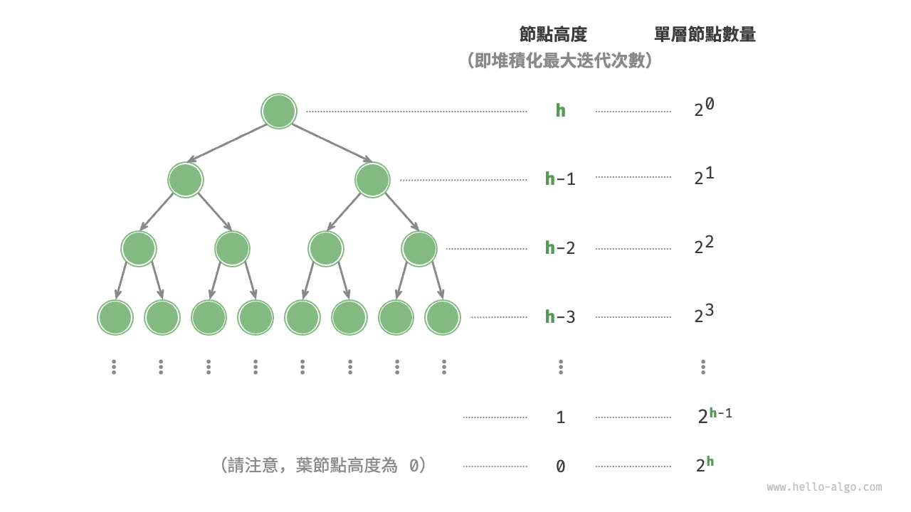

# 建堆積操作

在某些情況下，我們希望使用一個串列的所有元素來構建一個堆積，這個過程被稱為“建堆積操作”。

## 藉助入堆積操作實現

我們首先建立一個空堆積，然後走訪串列，依次對每個元素執行“入堆積操作”，即先將元素新增至堆積的尾部，再對該元素執行“從底至頂”堆積化。

每當一個元素入堆積，堆積的長度就加一。由於節點是從頂到底依次被新增進二元樹的，因此堆積是“自上而下”構建的。

設元素數量為 $n$ ，每個元素的入堆積操作使用 $O(\log{n})$ 時間，因此該建堆積方法的時間複雜度為 $O(n \log n)$ 。

## 透過走訪堆積化實現

實際上，我們可以實現一種更為高效的建堆積方法，共分為兩步。

1. 將串列所有元素原封不動地新增到堆積中，此時堆積的性質尚未得到滿足。
2. 倒序走訪堆積（層序走訪的倒序），依次對每個非葉節點執行“從頂至底堆積化”。

**每當堆積化一個節點後，以該節點為根節點的子樹就形成一個合法的子堆積**。而由於是倒序走訪，因此堆積是“自下而上”構建的。

之所以選擇倒序走訪，是因為這樣能夠保證當前節點之下的子樹已經是合法的子堆積，這樣堆積化當前節點才是有效的。

值得說明的是，**由於葉節點沒有子節點，因此它們天然就是合法的子堆積，無須堆積化**。如以下程式碼所示，最後一個非葉節點是最後一個節點的父節點，我們從它開始倒序走訪並執行堆積化：

```src
[file]{my_heap}-[class]{max_heap}-[func]{__init__}
```

## 複雜度分析

下面，我們來嘗試推算第二種建堆積方法的時間複雜度。

- 假設完全二元樹的節點數量為 $n$ ，則葉節點數量為 $(n + 1) / 2$ ，其中 $/$ 為向下整除。因此需要堆積化的節點數量為 $(n - 1) / 2$ 。
- 在從頂至底堆積化的過程中，每個節點最多堆積化到葉節點，因此最大迭代次數為二元樹高度 $\log n$ 。

將上述兩者相乘，可得到建堆積過程的時間複雜度為 $O(n \log n)$ 。**但這個估算結果並不準確，因為我們沒有考慮到二元樹底層節點數量遠多於頂層節點的性質**。

接下來我們來進行更為準確的計算。為了降低計算難度，假設給定一個節點數量為 $n$ 、高度為 $h$ 的“完美二元樹”，該假設不會影響計算結果的正確性。



如上圖所示，節點“從頂至底堆積化”的最大迭代次數等於該節點到葉節點的距離，而該距離正是“節點高度”。因此，我們可以對各層的“節點數量 $\times$ 節點高度”求和，**得到所有節點的堆積化迭代次數的總和**。

$$
T(h) = 2^0h + 2^1(h-1) + 2^2(h-2) + \dots + 2^{(h-1)}\times1
$$

化簡上式需要藉助中學的數列知識，先將 $T(h)$ 乘以 $2$ ，得到：

$$
\begin{aligned}
T(h) & = 2^0h + 2^1(h-1) + 2^2(h-2) + \dots + 2^{h-1}\times1 \newline
2 T(h) & = 2^1h + 2^2(h-1) + 2^3(h-2) + \dots + 2^{h}\times1 \newline
\end{aligned}
$$

使用錯位相減法，用下式 $2 T(h)$ 減去上式 $T(h)$ ，可得：

$$
2T(h) - T(h) = T(h) = -2^0h + 2^1 + 2^2 + \dots + 2^{h-1} + 2^h
$$

觀察上式，發現 $T(h)$ 是一個等比數列，可直接使用求和公式，得到時間複雜度為：

$$
\begin{aligned}
T(h) & = 2 \frac{1 - 2^h}{1 - 2} - h \newline
& = 2^{h+1} - h - 2 \newline
& = O(2^h)
\end{aligned}
$$

進一步，高度為 $h$ 的完美二元樹的節點數量為 $n = 2^{h+1} - 1$ ，易得複雜度為 $O(2^h) = O(n)$ 。以上推算表明，**輸入串列並建堆積的時間複雜度為 $O(n)$ ，非常高效**。
