# 8.1 &nbsp; 堆積

<u>堆積（heap）</u>是一種滿足特定條件的完全二元樹，主要可分為兩種型別，如圖 8-1 所示。

- <u>小頂堆積（min heap）</u>：任意節點的值 $\leq$ 其子節點的值。
- <u>大頂堆積（max heap）</u>：任意節點的值 $\geq$ 其子節點的值。

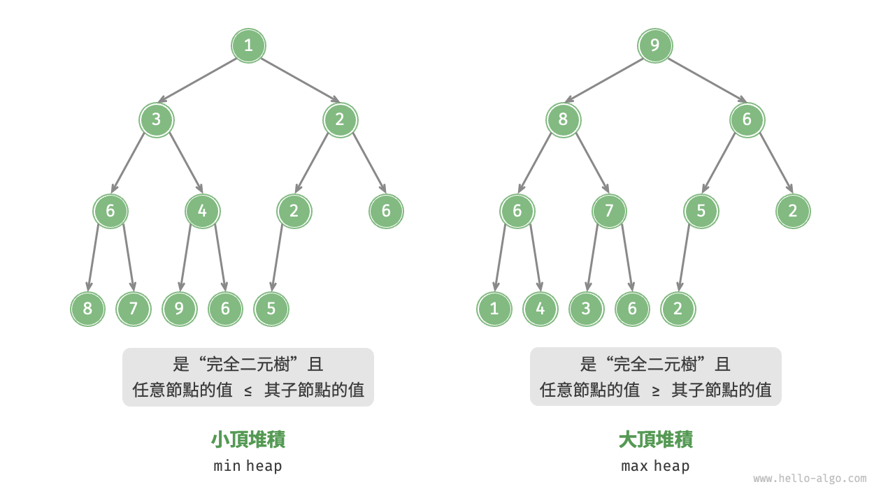{ class="animation-figure" }

<p align="center"> 圖 8-1 &nbsp; 小頂堆積與大頂堆積 </p>

堆積作為完全二元樹的一個特例，具有以下特性。

- 最底層節點靠左填充，其他層的節點都被填滿。
- 我們將二元樹的根節點稱為“堆積頂”，將底層最靠右的節點稱為“堆積底”。
- 對於大頂堆積（小頂堆積），堆積頂元素（根節點）的值是最大（最小）的。

## 8.1.1 &nbsp; 堆積的常用操作

需要指出的是，許多程式語言提供的是<u>優先佇列（priority queue）</u>，這是一種抽象的資料結構，定義為具有優先順序排序的佇列。

實際上，**堆積通常用於實現優先佇列，大頂堆積相當於元素按從大到小的順序出列的優先佇列**。從使用角度來看，我們可以將“優先佇列”和“堆積”看作等價的資料結構。因此，本書對兩者不做特別區分，統一稱作“堆積”。

堆積的常用操作見表 8-1 ，方法名需要根據程式語言來確定。

<p align="center"> 表 8-1 &nbsp; 堆積的操作效率 </p>

<div class="center-table" markdown>

| 方法名      | 描述                                             | 時間複雜度  |
| ----------- | ------------------------------------------------ | ----------- |
| `push()`    | 元素入堆積                                         | $O(\log n)$ |
| `pop()`     | 堆積頂元素出堆積                                     | $O(\log n)$ |
| `peek()`    | 訪問堆積頂元素（對於大 / 小頂堆積分別為最大 / 小值） | $O(1)$      |
| `size()`    | 獲取堆積的元素數量                                 | $O(1)$      |
| `isEmpty()` | 判斷堆積是否為空                                   | $O(1)$      |

</div>

在實際應用中，我們可以直接使用程式語言提供的堆積類別（或優先佇列類別）。

類似於排序演算法中的“從小到大排列”和“從大到小排列”，我們可以透過設定一個 `flag` 或修改 `Comparator` 實現“小頂堆積”與“大頂堆積”之間的轉換。程式碼如下所示：

=== "Python"

    ```python title="heap.py"
    # 初始化小頂堆積
    min_heap, flag = [], 1
    # 初始化大頂堆積
    max_heap, flag = [], -1

    # Python 的 heapq 模組預設實現小頂堆積
    # 考慮將“元素取負”後再入堆積，這樣就可以將大小關係顛倒，從而實現大頂堆積
    # 在本示例中，flag = 1 時對應小頂堆積，flag = -1 時對應大頂堆積

    # 元素入堆積
    heapq.heappush(max_heap, flag * 1)
    heapq.heappush(max_heap, flag * 3)
    heapq.heappush(max_heap, flag * 2)
    heapq.heappush(max_heap, flag * 5)
    heapq.heappush(max_heap, flag * 4)

    # 獲取堆積頂元素
    peek: int = flag * max_heap[0] # 5

    # 堆積頂元素出堆積
    # 出堆積元素會形成一個從大到小的序列
    val = flag * heapq.heappop(max_heap) # 5
    val = flag * heapq.heappop(max_heap) # 4
    val = flag * heapq.heappop(max_heap) # 3
    val = flag * heapq.heappop(max_heap) # 2
    val = flag * heapq.heappop(max_heap) # 1

    # 獲取堆積大小
    size: int = len(max_heap)

    # 判斷堆積是否為空
    is_empty: bool = not max_heap

    # 輸入串列並建堆積
    min_heap: list[int] = [1, 3, 2, 5, 4]
    heapq.heapify(min_heap)
    ```

=== "C++"

    ```cpp title="heap.cpp"
    /* 初始化堆積 */
    // 初始化小頂堆積
    priority_queue<int, vector<int>, greater<int>> minHeap;
    // 初始化大頂堆積
    priority_queue<int, vector<int>, less<int>> maxHeap;

    /* 元素入堆積 */
    maxHeap.push(1);
    maxHeap.push(3);
    maxHeap.push(2);
    maxHeap.push(5);
    maxHeap.push(4);

    /* 獲取堆積頂元素 */
    int peek = maxHeap.top(); // 5

    /* 堆積頂元素出堆積 */
    // 出堆積元素會形成一個從大到小的序列
    maxHeap.pop(); // 5
    maxHeap.pop(); // 4
    maxHeap.pop(); // 3
    maxHeap.pop(); // 2
    maxHeap.pop(); // 1

    /* 獲取堆積大小 */
    int size = maxHeap.size();

    /* 判斷堆積是否為空 */
    bool isEmpty = maxHeap.empty();

    /* 輸入串列並建堆積 */
    vector<int> input{1, 3, 2, 5, 4};
    priority_queue<int, vector<int>, greater<int>> minHeap(input.begin(), input.end());
    ```

=== "Java"

    ```java title="heap.java"
    /* 初始化堆積 */
    // 初始化小頂堆積
    Queue<Integer> minHeap = new PriorityQueue<>();
    // 初始化大頂堆積（使用 lambda 表示式修改 Comparator 即可）
    Queue<Integer> maxHeap = new PriorityQueue<>((a, b) -> b - a);

    /* 元素入堆積 */
    maxHeap.offer(1);
    maxHeap.offer(3);
    maxHeap.offer(2);
    maxHeap.offer(5);
    maxHeap.offer(4);

    /* 獲取堆積頂元素 */
    int peek = maxHeap.peek(); // 5

    /* 堆積頂元素出堆積 */
    // 出堆積元素會形成一個從大到小的序列
    peek = maxHeap.poll(); // 5
    peek = maxHeap.poll(); // 4
    peek = maxHeap.poll(); // 3
    peek = maxHeap.poll(); // 2
    peek = maxHeap.poll(); // 1

    /* 獲取堆積大小 */
    int size = maxHeap.size();

    /* 判斷堆積是否為空 */
    boolean isEmpty = maxHeap.isEmpty();

    /* 輸入串列並建堆積 */
    minHeap = new PriorityQueue<>(Arrays.asList(1, 3, 2, 5, 4));
    ```

=== "C#"

    ```csharp title="heap.cs"
    /* 初始化堆積 */
    // 初始化小頂堆積
    PriorityQueue<int, int> minHeap = new();
    // 初始化大頂堆積（使用 lambda 表示式修改 Comparer 即可）
    PriorityQueue<int, int> maxHeap = new(Comparer<int>.Create((x, y) => y.CompareTo(x)));

    /* 元素入堆積 */
    maxHeap.Enqueue(1, 1);
    maxHeap.Enqueue(3, 3);
    maxHeap.Enqueue(2, 2);
    maxHeap.Enqueue(5, 5);
    maxHeap.Enqueue(4, 4);

    /* 獲取堆積頂元素 */
    int peek = maxHeap.Peek();//5

    /* 堆積頂元素出堆積 */
    // 出堆積元素會形成一個從大到小的序列
    peek = maxHeap.Dequeue();  // 5
    peek = maxHeap.Dequeue();  // 4
    peek = maxHeap.Dequeue();  // 3
    peek = maxHeap.Dequeue();  // 2
    peek = maxHeap.Dequeue();  // 1

    /* 獲取堆積大小 */
    int size = maxHeap.Count;

    /* 判斷堆積是否為空 */
    bool isEmpty = maxHeap.Count == 0;

    /* 輸入串列並建堆積 */
    minHeap = new PriorityQueue<int, int>([(1, 1), (3, 3), (2, 2), (5, 5), (4, 4)]);
    ```

=== "Go"

    ```go title="heap.go"
    // Go 語言中可以透過實現 heap.Interface 來構建整數大頂堆積
    // 實現 heap.Interface 需要同時實現 sort.Interface
    type intHeap []any

    // Push heap.Interface 的方法，實現推入元素到堆積
    func (h *intHeap) Push(x any) {
        // Push 和 Pop 使用 pointer receiver 作為參數
        // 因為它們不僅會對切片的內容進行調整，還會修改切片的長度。
        *h = append(*h, x.(int))
    }

    // Pop heap.Interface 的方法，實現彈出堆積頂元素
    func (h *intHeap) Pop() any {
        // 待出堆積元素存放在最後
        last := (*h)[len(*h)-1]
        *h = (*h)[:len(*h)-1]
        return last
    }

    // Len sort.Interface 的方法
    func (h *intHeap) Len() int {
        return len(*h)
    }

    // Less sort.Interface 的方法
    func (h *intHeap) Less(i, j int) bool {
        // 如果實現小頂堆積，則需要調整為小於號
        return (*h)[i].(int) > (*h)[j].(int)
    }

    // Swap sort.Interface 的方法
    func (h *intHeap) Swap(i, j int) {
        (*h)[i], (*h)[j] = (*h)[j], (*h)[i]
    }

    // Top 獲取堆積頂元素
    func (h *intHeap) Top() any {
        return (*h)[0]
    }

    /* Driver Code */
    func TestHeap(t *testing.T) {
        /* 初始化堆積 */
        // 初始化大頂堆積
        maxHeap := &intHeap{}
        heap.Init(maxHeap)
        /* 元素入堆積 */
        // 呼叫 heap.Interface 的方法，來新增元素
        heap.Push(maxHeap, 1)
        heap.Push(maxHeap, 3)
        heap.Push(maxHeap, 2)
        heap.Push(maxHeap, 4)
        heap.Push(maxHeap, 5)

        /* 獲取堆積頂元素 */
        top := maxHeap.Top()
        fmt.Printf("堆積頂元素為 %d\n", top)

        /* 堆積頂元素出堆積 */
        // 呼叫 heap.Interface 的方法，來移除元素
        heap.Pop(maxHeap) // 5
        heap.Pop(maxHeap) // 4
        heap.Pop(maxHeap) // 3
        heap.Pop(maxHeap) // 2
        heap.Pop(maxHeap) // 1

        /* 獲取堆積大小 */
        size := len(*maxHeap)
        fmt.Printf("堆積元素數量為 %d\n", size)

        /* 判斷堆積是否為空 */
        isEmpty := len(*maxHeap) == 0
        fmt.Printf("堆積是否為空 %t\n", isEmpty)
    }
    ```

=== "Swift"

    ```swift title="heap.swift"
    /* 初始化堆積 */
    // Swift 的 Heap 型別同時支持最大堆積和最小堆積，且需要引入 swift-collections
    var heap = Heap<Int>()

    /* 元素入堆積 */
    heap.insert(1)
    heap.insert(3)
    heap.insert(2)
    heap.insert(5)
    heap.insert(4)

    /* 獲取堆積頂元素 */
    var peek = heap.max()!

    /* 堆積頂元素出堆積 */
    peek = heap.removeMax() // 5
    peek = heap.removeMax() // 4
    peek = heap.removeMax() // 3
    peek = heap.removeMax() // 2
    peek = heap.removeMax() // 1

    /* 獲取堆積大小 */
    let size = heap.count

    /* 判斷堆積是否為空 */
    let isEmpty = heap.isEmpty

    /* 輸入串列並建堆積 */
    let heap2 = Heap([1, 3, 2, 5, 4])
    ```

=== "JS"

    ```javascript title="heap.js"
    // JavaScript 未提供內建 Heap 類別
    ```

=== "TS"

    ```typescript title="heap.ts"
    // TypeScript 未提供內建 Heap 類別
    ```

=== "Dart"

    ```dart title="heap.dart"
    // Dart 未提供內建 Heap 類別
    ```

=== "Rust"

    ```rust title="heap.rs"
    use std::collections::BinaryHeap;
    use std::cmp::Reverse;

    /* 初始化堆積 */
    // 初始化小頂堆積
    let mut min_heap = BinaryHeap::<Reverse<i32>>::new();
    // 初始化大頂堆積
    let mut max_heap = BinaryHeap::new();

    /* 元素入堆積 */
    max_heap.push(1);
    max_heap.push(3);
    max_heap.push(2);
    max_heap.push(5);
    max_heap.push(4);

    /* 獲取堆積頂元素 */
    let peek = max_heap.peek().unwrap();  // 5

    /* 堆積頂元素出堆積 */
    // 出堆積元素會形成一個從大到小的序列
    let peek = max_heap.pop().unwrap();   // 5
    let peek = max_heap.pop().unwrap();   // 4
    let peek = max_heap.pop().unwrap();   // 3
    let peek = max_heap.pop().unwrap();   // 2
    let peek = max_heap.pop().unwrap();   // 1

    /* 獲取堆積大小 */
    let size = max_heap.len();

    /* 判斷堆積是否為空 */
    let is_empty = max_heap.is_empty();

    /* 輸入串列並建堆積 */
    let min_heap = BinaryHeap::from(vec![Reverse(1), Reverse(3), Reverse(2), Reverse(5), Reverse(4)]);
    ```

=== "C"

    ```c title="heap.c"
    // C 未提供內建 Heap 類別
    ```

=== "Kotlin"

    ```kotlin title="heap.kt"
    /* 初始化堆積 */
    // 初始化小頂堆積
    var minHeap = PriorityQueue<Int>()
    // 初始化大頂堆積（使用 lambda 表示式修改 Comparator 即可）
    val maxHeap = PriorityQueue { a: Int, b: Int -> b - a }

    /* 元素入堆積 */
    maxHeap.offer(1)
    maxHeap.offer(3)
    maxHeap.offer(2)
    maxHeap.offer(5)
    maxHeap.offer(4)

    /* 獲取堆積頂元素 */
    var peek = maxHeap.peek() // 5

    /* 堆積頂元素出堆積 */
    // 出堆積元素會形成一個從大到小的序列
    peek = maxHeap.poll() // 5
    peek = maxHeap.poll() // 4
    peek = maxHeap.poll() // 3
    peek = maxHeap.poll() // 2
    peek = maxHeap.poll() // 1

    /* 獲取堆積大小 */
    val size = maxHeap.size

    /* 判斷堆積是否為空 */
    val isEmpty = maxHeap.isEmpty()

    /* 輸入串列並建堆積 */
    minHeap = PriorityQueue(mutableListOf(1, 3, 2, 5, 4))
    ```

=== "Ruby"

    ```ruby title="heap.rb"
    # Ruby 未提供內建 Heap 類別
    ```

??? pythontutor "視覺化執行"

    <div style="height: 549px; width: 100%;"><iframe class="pythontutor-iframe" src="https://pythontutor.com/iframe-embed.html#code=import%20heapq%0A%0A%22%22%22Driver%20Code%22%22%22%0Aif%20__name__%20%3D%3D%20%22__main__%22%3A%0A%20%20%20%20%23%20%E5%88%9D%E5%A7%8B%E5%8C%96%E5%B0%8F%E9%A0%82%E5%A0%86%E7%A9%8D%0A%20%20%20%20min_heap%2C%20flag%20%3D%20%5B%5D%2C%201%0A%20%20%20%20%23%20%E5%88%9D%E5%A7%8B%E5%8C%96%E5%A4%A7%E9%A0%82%E5%A0%86%E7%A9%8D%0A%20%20%20%20max_heap%2C%20flag%20%3D%20%5B%5D%2C%20-1%0A%20%20%20%20%0A%20%20%20%20%23%20Python%20%E7%9A%84%20heapq%20%E6%A8%A1%E7%B5%84%E9%A0%90%E8%A8%AD%E5%AF%A6%E7%8F%BE%E5%B0%8F%E9%A0%82%E5%A0%86%E7%A9%8D%0A%20%20%20%20%23%20%E8%80%83%E6%85%AE%E5%B0%87%E2%80%9C%E5%85%83%E7%B4%A0%E5%8F%96%E8%B2%A0%E2%80%9D%E5%BE%8C%E5%86%8D%E5%85%A5%E5%A0%86%E7%A9%8D%EF%BC%8C%E9%80%99%E6%A8%A3%E5%B0%B1%E5%8F%AF%E4%BB%A5%E5%B0%87%E5%A4%A7%E5%B0%8F%E9%97%9C%E4%BF%82%E9%A1%9B%E5%80%92%EF%BC%8C%E5%BE%9E%E8%80%8C%E5%AF%A6%E7%8F%BE%E5%A4%A7%E9%A0%82%E5%A0%86%E7%A9%8D%0A%20%20%20%20%23%20%E5%9C%A8%E6%9C%AC%E7%A4%BA%E4%BE%8B%E4%B8%AD%EF%BC%8Cflag%20%3D%201%20%E6%99%82%E5%B0%8D%E6%87%89%E5%B0%8F%E9%A0%82%E5%A0%86%E7%A9%8D%EF%BC%8Cflag%20%3D%20-1%20%E6%99%82%E5%B0%8D%E6%87%89%E5%A4%A7%E9%A0%82%E5%A0%86%E7%A9%8D%0A%20%20%20%20%0A%20%20%20%20%23%20%E5%85%83%E7%B4%A0%E5%85%A5%E5%A0%86%E7%A9%8D%0A%20%20%20%20heapq.heappush%28max_heap%2C%20flag%20%2A%201%29%0A%20%20%20%20heapq.heappush%28max_heap%2C%20flag%20%2A%203%29%0A%20%20%20%20heapq.heappush%28max_heap%2C%20flag%20%2A%202%29%0A%20%20%20%20heapq.heappush%28max_heap%2C%20flag%20%2A%205%29%0A%20%20%20%20heapq.heappush%28max_heap%2C%20flag%20%2A%204%29%0A%20%20%20%20%0A%20%20%20%20%23%20%E7%8D%B2%E5%8F%96%E5%A0%86%E7%A9%8D%E9%A0%82%E5%85%83%E7%B4%A0%0A%20%20%20%20peek%20%3D%20flag%20%2A%20max_heap%5B0%5D%20%23%205%0A%20%20%20%20%0A%20%20%20%20%23%20%E5%A0%86%E7%A9%8D%E9%A0%82%E5%85%83%E7%B4%A0%E5%87%BA%E5%A0%86%E7%A9%8D%0A%20%20%20%20%23%20%E5%87%BA%E5%A0%86%E7%A9%8D%E5%85%83%E7%B4%A0%E6%9C%83%E5%BD%A2%E6%88%90%E4%B8%80%E5%80%8B%E5%BE%9E%E5%A4%A7%E5%88%B0%E5%B0%8F%E7%9A%84%E5%BA%8F%E5%88%97%0A%20%20%20%20val%20%3D%20flag%20%2A%20heapq.heappop%28max_heap%29%20%23%205%0A%20%20%20%20val%20%3D%20flag%20%2A%20heapq.heappop%28max_heap%29%20%23%204%0A%20%20%20%20val%20%3D%20flag%20%2A%20heapq.heappop%28max_heap%29%20%23%203%0A%20%20%20%20val%20%3D%20flag%20%2A%20heapq.heappop%28max_heap%29%20%23%202%0A%20%20%20%20val%20%3D%20flag%20%2A%20heapq.heappop%28max_heap%29%20%23%201%0A%20%20%20%20%0A%20%20%20%20%23%20%E7%8D%B2%E5%8F%96%E5%A0%86%E7%A9%8D%E5%A4%A7%E5%B0%8F%0A%20%20%20%20size%20%3D%20len%28max_heap%29%0A%20%20%20%20%0A%20%20%20%20%23%20%E5%88%A4%E6%96%B7%E5%A0%86%E7%A9%8D%E6%98%AF%E5%90%A6%E7%82%BA%E7%A9%BA%0A%20%20%20%20is_empty%20%3D%20not%20max_heap%0A%20%20%20%20%0A%20%20%20%20%23%20%E8%BC%B8%E5%85%A5%E4%B8%B2%E5%88%97%E4%B8%A6%E5%BB%BA%E5%A0%86%E7%A9%8D%0A%20%20%20%20min_heap%20%3D%20%5B1%2C%203%2C%202%2C%205%2C%204%5D%0A%20%20%20%20heapq.heapify%28min_heap%29&codeDivHeight=472&codeDivWidth=350&cumulative=false&curInstr=3&heapPrimitives=nevernest&origin=opt-frontend.js&py=311&rawInputLstJSON=%5B%5D&textReferences=false"> </iframe></div>
    <div style="margin-top: 5px;"><a href="https://pythontutor.com/iframe-embed.html#code=import%20heapq%0A%0A%22%22%22Driver%20Code%22%22%22%0Aif%20__name__%20%3D%3D%20%22__main__%22%3A%0A%20%20%20%20%23%20%E5%88%9D%E5%A7%8B%E5%8C%96%E5%B0%8F%E9%A0%82%E5%A0%86%E7%A9%8D%0A%20%20%20%20min_heap%2C%20flag%20%3D%20%5B%5D%2C%201%0A%20%20%20%20%23%20%E5%88%9D%E5%A7%8B%E5%8C%96%E5%A4%A7%E9%A0%82%E5%A0%86%E7%A9%8D%0A%20%20%20%20max_heap%2C%20flag%20%3D%20%5B%5D%2C%20-1%0A%20%20%20%20%0A%20%20%20%20%23%20Python%20%E7%9A%84%20heapq%20%E6%A8%A1%E7%B5%84%E9%A0%90%E8%A8%AD%E5%AF%A6%E7%8F%BE%E5%B0%8F%E9%A0%82%E5%A0%86%E7%A9%8D%0A%20%20%20%20%23%20%E8%80%83%E6%85%AE%E5%B0%87%E2%80%9C%E5%85%83%E7%B4%A0%E5%8F%96%E8%B2%A0%E2%80%9D%E5%BE%8C%E5%86%8D%E5%85%A5%E5%A0%86%E7%A9%8D%EF%BC%8C%E9%80%99%E6%A8%A3%E5%B0%B1%E5%8F%AF%E4%BB%A5%E5%B0%87%E5%A4%A7%E5%B0%8F%E9%97%9C%E4%BF%82%E9%A1%9B%E5%80%92%EF%BC%8C%E5%BE%9E%E8%80%8C%E5%AF%A6%E7%8F%BE%E5%A4%A7%E9%A0%82%E5%A0%86%E7%A9%8D%0A%20%20%20%20%23%20%E5%9C%A8%E6%9C%AC%E7%A4%BA%E4%BE%8B%E4%B8%AD%EF%BC%8Cflag%20%3D%201%20%E6%99%82%E5%B0%8D%E6%87%89%E5%B0%8F%E9%A0%82%E5%A0%86%E7%A9%8D%EF%BC%8Cflag%20%3D%20-1%20%E6%99%82%E5%B0%8D%E6%87%89%E5%A4%A7%E9%A0%82%E5%A0%86%E7%A9%8D%0A%20%20%20%20%0A%20%20%20%20%23%20%E5%85%83%E7%B4%A0%E5%85%A5%E5%A0%86%E7%A9%8D%0A%20%20%20%20heapq.heappush%28max_heap%2C%20flag%20%2A%201%29%0A%20%20%20%20heapq.heappush%28max_heap%2C%20flag%20%2A%203%29%0A%20%20%20%20heapq.heappush%28max_heap%2C%20flag%20%2A%202%29%0A%20%20%20%20heapq.heappush%28max_heap%2C%20flag%20%2A%205%29%0A%20%20%20%20heapq.heappush%28max_heap%2C%20flag%20%2A%204%29%0A%20%20%20%20%0A%20%20%20%20%23%20%E7%8D%B2%E5%8F%96%E5%A0%86%E7%A9%8D%E9%A0%82%E5%85%83%E7%B4%A0%0A%20%20%20%20peek%20%3D%20flag%20%2A%20max_heap%5B0%5D%20%23%205%0A%20%20%20%20%0A%20%20%20%20%23%20%E5%A0%86%E7%A9%8D%E9%A0%82%E5%85%83%E7%B4%A0%E5%87%BA%E5%A0%86%E7%A9%8D%0A%20%20%20%20%23%20%E5%87%BA%E5%A0%86%E7%A9%8D%E5%85%83%E7%B4%A0%E6%9C%83%E5%BD%A2%E6%88%90%E4%B8%80%E5%80%8B%E5%BE%9E%E5%A4%A7%E5%88%B0%E5%B0%8F%E7%9A%84%E5%BA%8F%E5%88%97%0A%20%20%20%20val%20%3D%20flag%20%2A%20heapq.heappop%28max_heap%29%20%23%205%0A%20%20%20%20val%20%3D%20flag%20%2A%20heapq.heappop%28max_heap%29%20%23%204%0A%20%20%20%20val%20%3D%20flag%20%2A%20heapq.heappop%28max_heap%29%20%23%203%0A%20%20%20%20val%20%3D%20flag%20%2A%20heapq.heappop%28max_heap%29%20%23%202%0A%20%20%20%20val%20%3D%20flag%20%2A%20heapq.heappop%28max_heap%29%20%23%201%0A%20%20%20%20%0A%20%20%20%20%23%20%E7%8D%B2%E5%8F%96%E5%A0%86%E7%A9%8D%E5%A4%A7%E5%B0%8F%0A%20%20%20%20size%20%3D%20len%28max_heap%29%0A%20%20%20%20%0A%20%20%20%20%23%20%E5%88%A4%E6%96%B7%E5%A0%86%E7%A9%8D%E6%98%AF%E5%90%A6%E7%82%BA%E7%A9%BA%0A%20%20%20%20is_empty%20%3D%20not%20max_heap%0A%20%20%20%20%0A%20%20%20%20%23%20%E8%BC%B8%E5%85%A5%E4%B8%B2%E5%88%97%E4%B8%A6%E5%BB%BA%E5%A0%86%E7%A9%8D%0A%20%20%20%20min_heap%20%3D%20%5B1%2C%203%2C%202%2C%205%2C%204%5D%0A%20%20%20%20heapq.heapify%28min_heap%29&codeDivHeight=800&codeDivWidth=600&cumulative=false&curInstr=3&heapPrimitives=nevernest&origin=opt-frontend.js&py=311&rawInputLstJSON=%5B%5D&textReferences=false" target="_blank" rel="noopener noreferrer">全螢幕觀看 ></a></div>

## 8.1.2 &nbsp; 堆積的實現

下文實現的是大頂堆積。若要將其轉換為小頂堆積，只需將所有大小邏輯判斷進行逆轉（例如，將 $\geq$ 替換為 $\leq$ ）。感興趣的讀者可以自行實現。

### 1. &nbsp; 堆積的儲存與表示

“二元樹”章節講過，完全二元樹非常適合用陣列來表示。由於堆積正是一種完全二元樹，**因此我們將採用陣列來儲存堆積**。

當使用陣列表示二元樹時，元素代表節點值，索引代表節點在二元樹中的位置。**節點指標透過索引對映公式來實現**。

如圖 8-2 所示，給定索引 $i$ ，其左子節點的索引為 $2i + 1$ ，右子節點的索引為 $2i + 2$ ，父節點的索引為 $(i - 1) / 2$（向下整除）。當索引越界時，表示空節點或節點不存在。

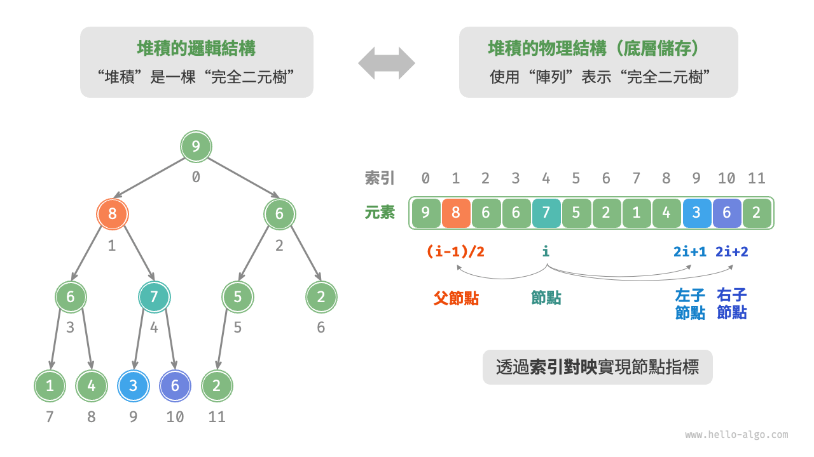{ class="animation-figure" }

<p align="center"> 圖 8-2 &nbsp; 堆積的表示與儲存 </p>

我們可以將索引對映公式封裝成函式，方便後續使用：

=== "Python"

    ```python title="my_heap.py"
    def left(self, i: int) -> int:
        """獲取左子節點的索引"""
        return 2 * i + 1

    def right(self, i: int) -> int:
        """獲取右子節點的索引"""
        return 2 * i + 2

    def parent(self, i: int) -> int:
        """獲取父節點的索引"""
        return (i - 1) // 2  # 向下整除
    ```

=== "C++"

    ```cpp title="my_heap.cpp"
    /* 獲取左子節點的索引 */
    int left(int i) {
        return 2 * i + 1;
    }

    /* 獲取右子節點的索引 */
    int right(int i) {
        return 2 * i + 2;
    }

    /* 獲取父節點的索引 */
    int parent(int i) {
        return (i - 1) / 2; // 向下整除
    }
    ```

=== "Java"

    ```java title="my_heap.java"
    /* 獲取左子節點的索引 */
    int left(int i) {
        return 2 * i + 1;
    }

    /* 獲取右子節點的索引 */
    int right(int i) {
        return 2 * i + 2;
    }

    /* 獲取父節點的索引 */
    int parent(int i) {
        return (i - 1) / 2; // 向下整除
    }
    ```

=== "C#"

    ```csharp title="my_heap.cs"
    /* 獲取左子節點的索引 */
    int Left(int i) {
        return 2 * i + 1;
    }

    /* 獲取右子節點的索引 */
    int Right(int i) {
        return 2 * i + 2;
    }

    /* 獲取父節點的索引 */
    int Parent(int i) {
        return (i - 1) / 2; // 向下整除
    }
    ```

=== "Go"

    ```go title="my_heap.go"
    /* 獲取左子節點的索引 */
    func (h *maxHeap) left(i int) int {
        return 2*i + 1
    }

    /* 獲取右子節點的索引 */
    func (h *maxHeap) right(i int) int {
        return 2*i + 2
    }

    /* 獲取父節點的索引 */
    func (h *maxHeap) parent(i int) int {
        // 向下整除
        return (i - 1) / 2
    }
    ```

=== "Swift"

    ```swift title="my_heap.swift"
    /* 獲取左子節點的索引 */
    func left(i: Int) -> Int {
        2 * i + 1
    }

    /* 獲取右子節點的索引 */
    func right(i: Int) -> Int {
        2 * i + 2
    }

    /* 獲取父節點的索引 */
    func parent(i: Int) -> Int {
        (i - 1) / 2 // 向下整除
    }
    ```

=== "JS"

    ```javascript title="my_heap.js"
    /* 獲取左子節點的索引 */
    #left(i) {
        return 2 * i + 1;
    }

    /* 獲取右子節點的索引 */
    #right(i) {
        return 2 * i + 2;
    }

    /* 獲取父節點的索引 */
    #parent(i) {
        return Math.floor((i - 1) / 2); // 向下整除
    }
    ```

=== "TS"

    ```typescript title="my_heap.ts"
    /* 獲取左子節點的索引 */
    left(i: number): number {
        return 2 * i + 1;
    }

    /* 獲取右子節點的索引 */
    right(i: number): number {
        return 2 * i + 2;
    }

    /* 獲取父節點的索引 */
    parent(i: number): number {
        return Math.floor((i - 1) / 2); // 向下整除
    }
    ```

=== "Dart"

    ```dart title="my_heap.dart"
    /* 獲取左子節點的索引 */
    int _left(int i) {
      return 2 * i + 1;
    }

    /* 獲取右子節點的索引 */
    int _right(int i) {
      return 2 * i + 2;
    }

    /* 獲取父節點的索引 */
    int _parent(int i) {
      return (i - 1) ~/ 2; // 向下整除
    }
    ```

=== "Rust"

    ```rust title="my_heap.rs"
    /* 獲取左子節點的索引 */
    fn left(i: usize) -> usize {
        2 * i + 1
    }

    /* 獲取右子節點的索引 */
    fn right(i: usize) -> usize {
        2 * i + 2
    }

    /* 獲取父節點的索引 */
    fn parent(i: usize) -> usize {
        (i - 1) / 2 // 向下整除
    }
    ```

=== "C"

    ```c title="my_heap.c"
    /* 獲取左子節點的索引 */
    int left(MaxHeap *maxHeap, int i) {
        return 2 * i + 1;
    }

    /* 獲取右子節點的索引 */
    int right(MaxHeap *maxHeap, int i) {
        return 2 * i + 2;
    }

    /* 獲取父節點的索引 */
    int parent(MaxHeap *maxHeap, int i) {
        return (i - 1) / 2; // 向下取整
    }
    ```

=== "Kotlin"

    ```kotlin title="my_heap.kt"
    /* 獲取左子節點的索引 */
    fun left(i: Int): Int {
        return 2 * i + 1
    }

    /* 獲取右子節點的索引 */
    fun right(i: Int): Int {
        return 2 * i + 2
    }

    /* 獲取父節點的索引 */
    fun parent(i: Int): Int {
        return (i - 1) / 2 // 向下整除
    }
    ```

=== "Ruby"

    ```ruby title="my_heap.rb"
    ### 獲取左子節點的索引 ###
    def left(i)
      2 * i + 1
    end

    ### 獲取右子節點的索引 ###
    def right(i)
      2 * i + 2
    end

    ### 獲取父節點的索引 ###
    def parent(i)
      (i - 1) / 2     # 向下整除
    end
    ```

### 2. &nbsp; 訪問堆積頂元素

堆積頂元素即為二元樹的根節點，也就是串列的首個元素：

=== "Python"

    ```python title="my_heap.py"
    def peek(self) -> int:
        """訪問堆積頂元素"""
        return self.max_heap[0]
    ```

=== "C++"

    ```cpp title="my_heap.cpp"
    /* 訪問堆積頂元素 */
    int peek() {
        return maxHeap[0];
    }
    ```

=== "Java"

    ```java title="my_heap.java"
    /* 訪問堆積頂元素 */
    int peek() {
        return maxHeap.get(0);
    }
    ```

=== "C#"

    ```csharp title="my_heap.cs"
    /* 訪問堆積頂元素 */
    int Peek() {
        return maxHeap[0];
    }
    ```

=== "Go"

    ```go title="my_heap.go"
    /* 訪問堆積頂元素 */
    func (h *maxHeap) peek() any {
        return h.data[0]
    }
    ```

=== "Swift"

    ```swift title="my_heap.swift"
    /* 訪問堆積頂元素 */
    func peek() -> Int {
        maxHeap[0]
    }
    ```

=== "JS"

    ```javascript title="my_heap.js"
    /* 訪問堆積頂元素 */
    peek() {
        return this.#maxHeap[0];
    }
    ```

=== "TS"

    ```typescript title="my_heap.ts"
    /* 訪問堆積頂元素 */
    peek(): number {
        return this.maxHeap[0];
    }
    ```

=== "Dart"

    ```dart title="my_heap.dart"
    /* 訪問堆積頂元素 */
    int peek() {
      return _maxHeap[0];
    }
    ```

=== "Rust"

    ```rust title="my_heap.rs"
    /* 訪問堆積頂元素 */
    fn peek(&self) -> Option<i32> {
        self.max_heap.first().copied()
    }
    ```

=== "C"

    ```c title="my_heap.c"
    /* 訪問堆積頂元素 */
    int peek(MaxHeap *maxHeap) {
        return maxHeap->data[0];
    }
    ```

=== "Kotlin"

    ```kotlin title="my_heap.kt"
    /* 訪問堆積頂元素 */
    fun peek(): Int {
        return maxHeap[0]
    }
    ```

=== "Ruby"

    ```ruby title="my_heap.rb"
    ### 訪問堆積頂元素 ###
    def peek
      @max_heap[0]
    end
    ```

??? pythontutor "視覺化執行"

    <div style="height: 549px; width: 100%;"><iframe class="pythontutor-iframe" src="https://pythontutor.com/iframe-embed.html#code=class%20MaxHeap%3A%0A%20%20%20%20%22%22%22%E5%A4%A7%E9%A0%82%E5%A0%86%E7%A9%8D%22%22%22%0A%0A%20%20%20%20def%20__init__%28self%2C%20nums%3A%20list%5Bint%5D%29%3A%0A%20%20%20%20%20%20%20%20%22%22%22%E5%BB%BA%E6%A7%8B%E5%AD%90%22%22%22%0A%20%20%20%20%20%20%20%20%23%20%E5%B0%87%E4%B8%B2%E5%88%97%E5%85%83%E7%B4%A0%E5%8E%9F%E5%B0%81%E4%B8%8D%E5%8B%95%E6%96%B0%E5%A2%9E%E9%80%B2%E5%A0%86%E7%A9%8D%0A%20%20%20%20%20%20%20%20self.max_heap%20%3D%20nums%0A%0A%20%20%20%20def%20left%28self%2C%20i%3A%20int%29%20-%3E%20int%3A%0A%20%20%20%20%20%20%20%20%22%22%22%E7%8D%B2%E5%8F%96%E5%B7%A6%E5%AD%90%E7%AF%80%E9%BB%9E%E7%9A%84%E7%B4%A2%E5%BC%95%22%22%22%0A%20%20%20%20%20%20%20%20return%202%20%2A%20i%20%2B%201%0A%0A%20%20%20%20def%20right%28self%2C%20i%3A%20int%29%20-%3E%20int%3A%0A%20%20%20%20%20%20%20%20%22%22%22%E7%8D%B2%E5%8F%96%E5%8F%B3%E5%AD%90%E7%AF%80%E9%BB%9E%E7%9A%84%E7%B4%A2%E5%BC%95%22%22%22%0A%20%20%20%20%20%20%20%20return%202%20%2A%20i%20%2B%202%0A%0A%20%20%20%20def%20parent%28self%2C%20i%3A%20int%29%20-%3E%20int%3A%0A%20%20%20%20%20%20%20%20%22%22%22%E7%8D%B2%E5%8F%96%E7%88%B6%E7%AF%80%E9%BB%9E%E7%9A%84%E7%B4%A2%E5%BC%95%22%22%22%0A%20%20%20%20%20%20%20%20return%20%28i%20-%201%29%20//%202%20%20%23%20%E5%90%91%E4%B8%8B%E6%95%B4%E9%99%A4%0A%0A%20%20%20%20def%20size%28self%29%20-%3E%20int%3A%0A%20%20%20%20%20%20%20%20%22%22%22%E7%8D%B2%E5%8F%96%E5%A0%86%E7%A9%8D%E5%A4%A7%E5%B0%8F%22%22%22%0A%20%20%20%20%20%20%20%20return%20len%28self.max_heap%29%0A%0A%20%20%20%20def%20is_empty%28self%29%20-%3E%20bool%3A%0A%20%20%20%20%20%20%20%20%22%22%22%E5%88%A4%E6%96%B7%E5%A0%86%E7%A9%8D%E6%98%AF%E5%90%A6%E7%82%BA%E7%A9%BA%22%22%22%0A%20%20%20%20%20%20%20%20return%20self.size%28%29%20%3D%3D%200%0A%0A%20%20%20%20def%20peek%28self%29%20-%3E%20int%3A%0A%20%20%20%20%20%20%20%20%22%22%22%E8%A8%AA%E5%95%8F%E5%A0%86%E7%A9%8D%E9%A0%82%E5%85%83%E7%B4%A0%22%22%22%0A%20%20%20%20%20%20%20%20return%20self.max_heap%5B0%5D%0A%0A%0A%22%22%22Driver%20Code%22%22%22%0Aif%20__name__%20%3D%3D%20%22__main__%22%3A%0A%20%20%20%20%23%20%E5%88%9D%E5%A7%8B%E5%8C%96%E5%A4%A7%E9%A0%82%E5%A0%86%E7%A9%8D%0A%20%20%20%20%23%20%E8%AB%8B%E6%B3%A8%E6%84%8F%EF%BC%8C%E8%BC%B8%E5%85%A5%E9%99%A3%E5%88%97%E5%B7%B2%E7%B6%93%E6%98%AF%E4%B8%80%E5%80%8B%E5%B7%B2%E7%B6%93%E6%98%AF%E4%B8%80%E5%80%8B%E5%90%88%E6%B3%95%E7%9A%84%E5%A0%86%E7%A9%8D%20%0A%20%20%20%20max_heap%20%3D%20MaxHeap%28%5B9%2C%208%2C%206%2C%206%2C%207%2C%205%2C%202%2C%201%2C%204%2C%203%2C%206%2C%202%5D%29%0A%0A%20%20%20%20%23%20%E7%8D%B2%E5%8F%96%E5%A0%86%E7%A9%8D%E9%A0%82%E5%85%83%E7%B4%A0%0A%20%20%20%20peek%20%3D%20max_heap.peek%28%29%0A%20%20%20%20print%28f%22%5Cn%E5%A0%86%E7%A9%8D%E9%A0%82%E5%85%83%E7%B4%A0%E7%82%BA%20%7Bpeek%7D%22%29&codeDivHeight=472&codeDivWidth=350&cumulative=false&curInstr=7&heapPrimitives=nevernest&origin=opt-frontend.js&py=311&rawInputLstJSON=%5B%5D&textReferences=false"> </iframe></div>
    <div style="margin-top: 5px;"><a href="https://pythontutor.com/iframe-embed.html#code=class%20MaxHeap%3A%0A%20%20%20%20%22%22%22%E5%A4%A7%E9%A0%82%E5%A0%86%E7%A9%8D%22%22%22%0A%0A%20%20%20%20def%20__init__%28self%2C%20nums%3A%20list%5Bint%5D%29%3A%0A%20%20%20%20%20%20%20%20%22%22%22%E5%BB%BA%E6%A7%8B%E5%AD%90%22%22%22%0A%20%20%20%20%20%20%20%20%23%20%E5%B0%87%E4%B8%B2%E5%88%97%E5%85%83%E7%B4%A0%E5%8E%9F%E5%B0%81%E4%B8%8D%E5%8B%95%E6%96%B0%E5%A2%9E%E9%80%B2%E5%A0%86%E7%A9%8D%0A%20%20%20%20%20%20%20%20self.max_heap%20%3D%20nums%0A%0A%20%20%20%20def%20left%28self%2C%20i%3A%20int%29%20-%3E%20int%3A%0A%20%20%20%20%20%20%20%20%22%22%22%E7%8D%B2%E5%8F%96%E5%B7%A6%E5%AD%90%E7%AF%80%E9%BB%9E%E7%9A%84%E7%B4%A2%E5%BC%95%22%22%22%0A%20%20%20%20%20%20%20%20return%202%20%2A%20i%20%2B%201%0A%0A%20%20%20%20def%20right%28self%2C%20i%3A%20int%29%20-%3E%20int%3A%0A%20%20%20%20%20%20%20%20%22%22%22%E7%8D%B2%E5%8F%96%E5%8F%B3%E5%AD%90%E7%AF%80%E9%BB%9E%E7%9A%84%E7%B4%A2%E5%BC%95%22%22%22%0A%20%20%20%20%20%20%20%20return%202%20%2A%20i%20%2B%202%0A%0A%20%20%20%20def%20parent%28self%2C%20i%3A%20int%29%20-%3E%20int%3A%0A%20%20%20%20%20%20%20%20%22%22%22%E7%8D%B2%E5%8F%96%E7%88%B6%E7%AF%80%E9%BB%9E%E7%9A%84%E7%B4%A2%E5%BC%95%22%22%22%0A%20%20%20%20%20%20%20%20return%20%28i%20-%201%29%20//%202%20%20%23%20%E5%90%91%E4%B8%8B%E6%95%B4%E9%99%A4%0A%0A%20%20%20%20def%20size%28self%29%20-%3E%20int%3A%0A%20%20%20%20%20%20%20%20%22%22%22%E7%8D%B2%E5%8F%96%E5%A0%86%E7%A9%8D%E5%A4%A7%E5%B0%8F%22%22%22%0A%20%20%20%20%20%20%20%20return%20len%28self.max_heap%29%0A%0A%20%20%20%20def%20is_empty%28self%29%20-%3E%20bool%3A%0A%20%20%20%20%20%20%20%20%22%22%22%E5%88%A4%E6%96%B7%E5%A0%86%E7%A9%8D%E6%98%AF%E5%90%A6%E7%82%BA%E7%A9%BA%22%22%22%0A%20%20%20%20%20%20%20%20return%20self.size%28%29%20%3D%3D%200%0A%0A%20%20%20%20def%20peek%28self%29%20-%3E%20int%3A%0A%20%20%20%20%20%20%20%20%22%22%22%E8%A8%AA%E5%95%8F%E5%A0%86%E7%A9%8D%E9%A0%82%E5%85%83%E7%B4%A0%22%22%22%0A%20%20%20%20%20%20%20%20return%20self.max_heap%5B0%5D%0A%0A%0A%22%22%22Driver%20Code%22%22%22%0Aif%20__name__%20%3D%3D%20%22__main__%22%3A%0A%20%20%20%20%23%20%E5%88%9D%E5%A7%8B%E5%8C%96%E5%A4%A7%E9%A0%82%E5%A0%86%E7%A9%8D%0A%20%20%20%20%23%20%E8%AB%8B%E6%B3%A8%E6%84%8F%EF%BC%8C%E8%BC%B8%E5%85%A5%E9%99%A3%E5%88%97%E5%B7%B2%E7%B6%93%E6%98%AF%E4%B8%80%E5%80%8B%E5%B7%B2%E7%B6%93%E6%98%AF%E4%B8%80%E5%80%8B%E5%90%88%E6%B3%95%E7%9A%84%E5%A0%86%E7%A9%8D%20%0A%20%20%20%20max_heap%20%3D%20MaxHeap%28%5B9%2C%208%2C%206%2C%206%2C%207%2C%205%2C%202%2C%201%2C%204%2C%203%2C%206%2C%202%5D%29%0A%0A%20%20%20%20%23%20%E7%8D%B2%E5%8F%96%E5%A0%86%E7%A9%8D%E9%A0%82%E5%85%83%E7%B4%A0%0A%20%20%20%20peek%20%3D%20max_heap.peek%28%29%0A%20%20%20%20print%28f%22%5Cn%E5%A0%86%E7%A9%8D%E9%A0%82%E5%85%83%E7%B4%A0%E7%82%BA%20%7Bpeek%7D%22%29&codeDivHeight=800&codeDivWidth=600&cumulative=false&curInstr=7&heapPrimitives=nevernest&origin=opt-frontend.js&py=311&rawInputLstJSON=%5B%5D&textReferences=false" target="_blank" rel="noopener noreferrer">全螢幕觀看 ></a></div>

### 3. &nbsp; 元素入堆積

給定元素 `val` ，我們首先將其新增到堆積底。新增之後，由於 `val` 可能大於堆積中其他元素，堆積的成立條件可能已被破壞，**因此需要修復從插入節點到根節點的路徑上的各個節點**，這個操作被稱為<u>堆積化（heapify）</u>。

考慮從入堆積節點開始，**從底至頂執行堆積化**。如圖 8-3 所示，我們比較插入節點與其父節點的值，如果插入節點更大，則將它們交換。然後繼續執行此操作，從底至頂修復堆積中的各個節點，直至越過根節點或遇到無須交換的節點時結束。

=== "<1>"
    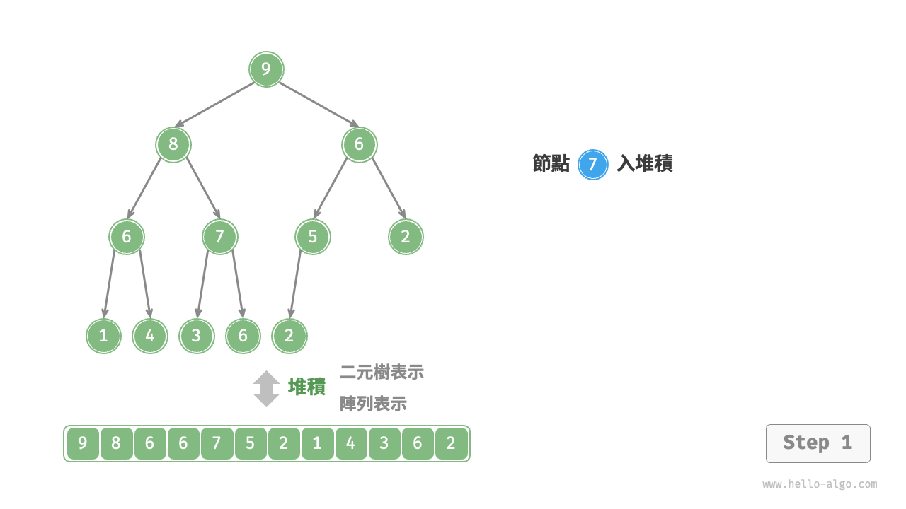{ class="animation-figure" }

=== "<2>"
    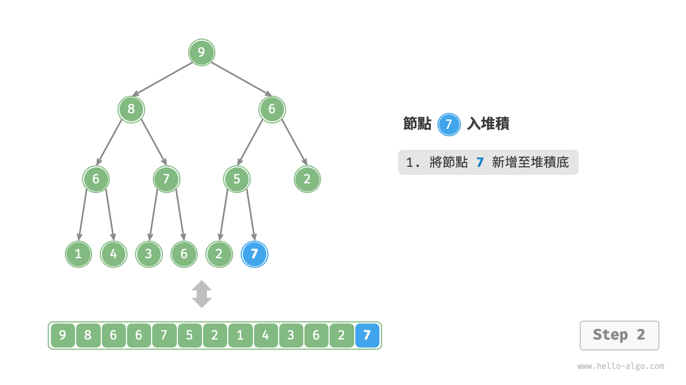{ class="animation-figure" }

=== "<3>"
    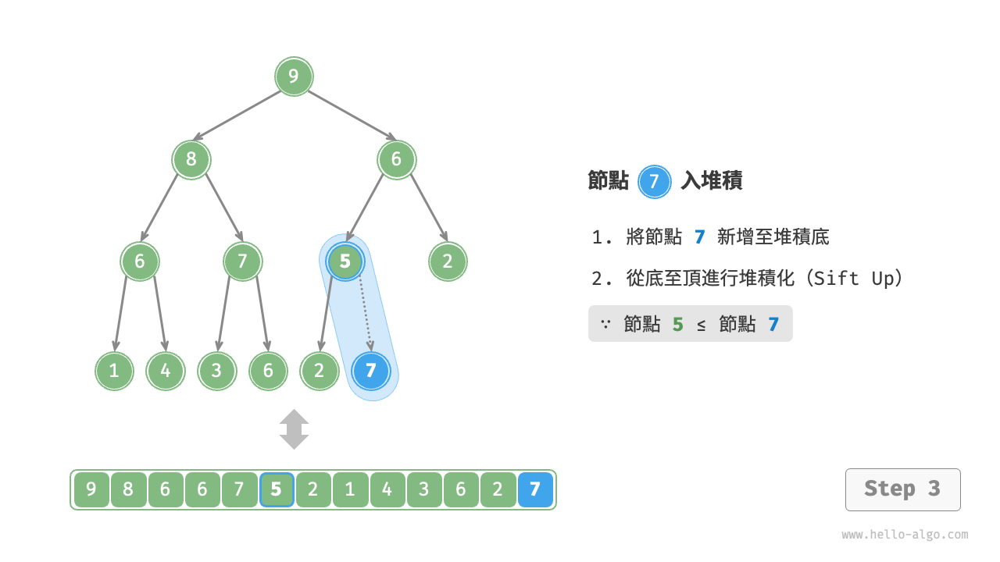{ class="animation-figure" }

=== "<4>"
    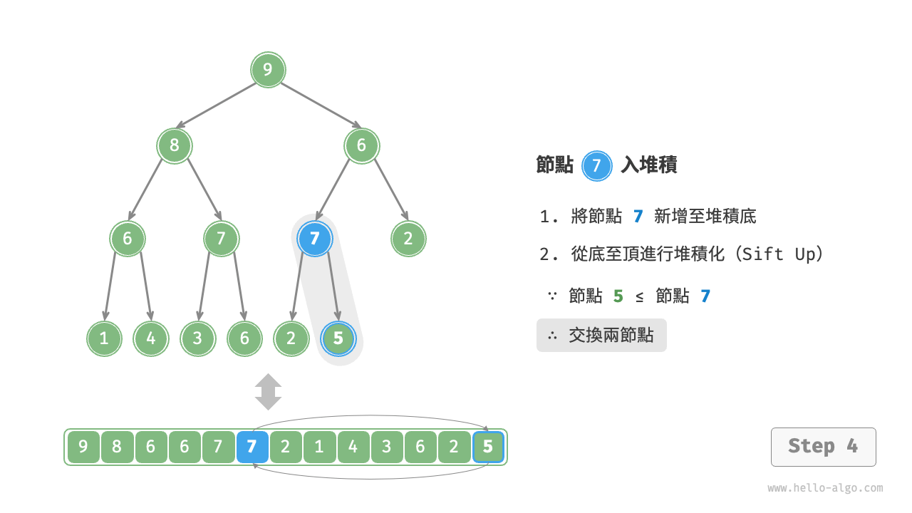{ class="animation-figure" }

=== "<5>"
    { class="animation-figure" }

=== "<6>"
    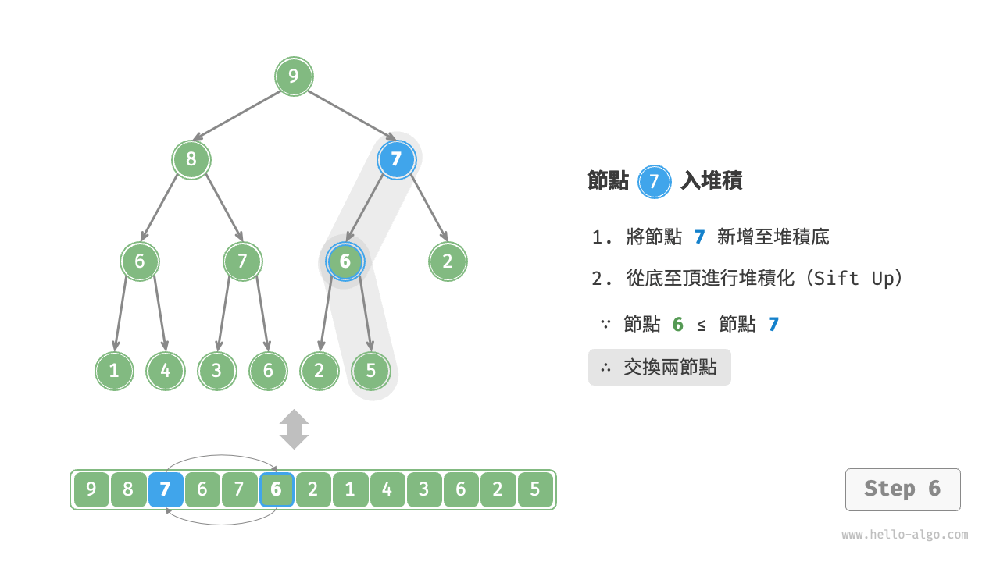{ class="animation-figure" }

=== "<7>"
    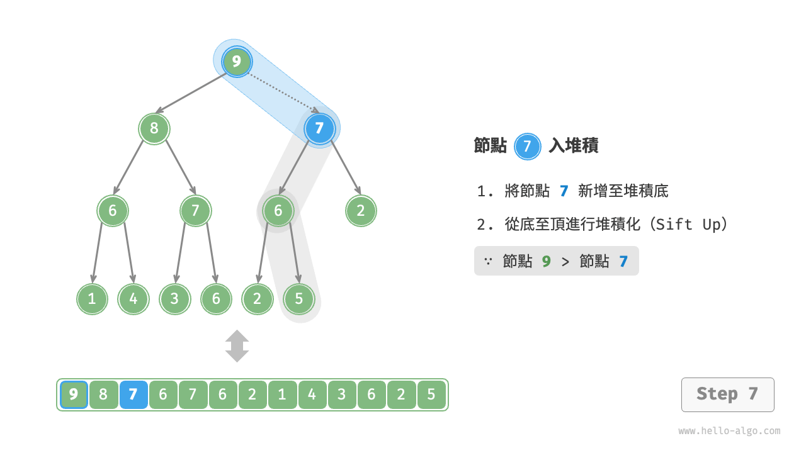{ class="animation-figure" }

=== "<8>"
    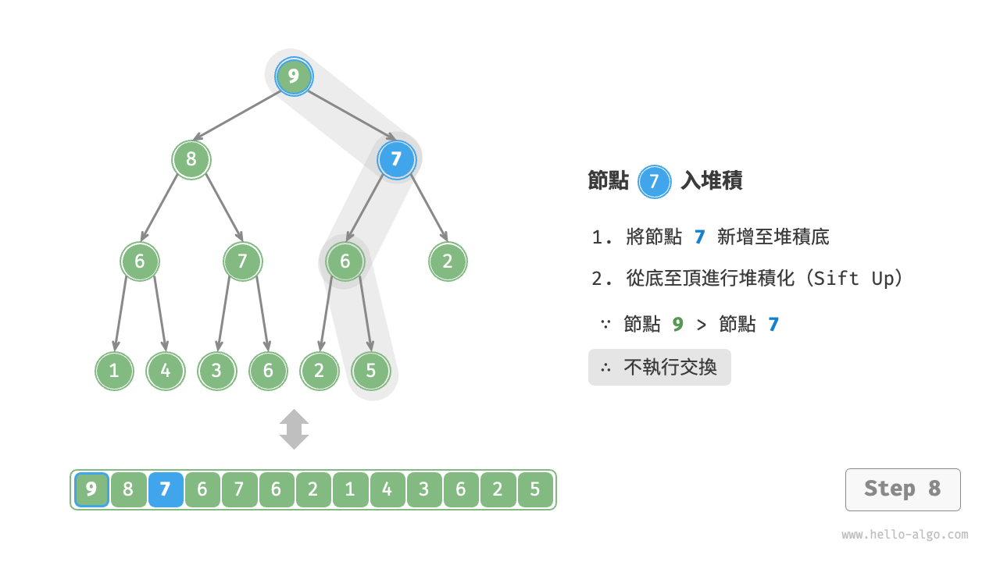{ class="animation-figure" }

=== "<9>"
    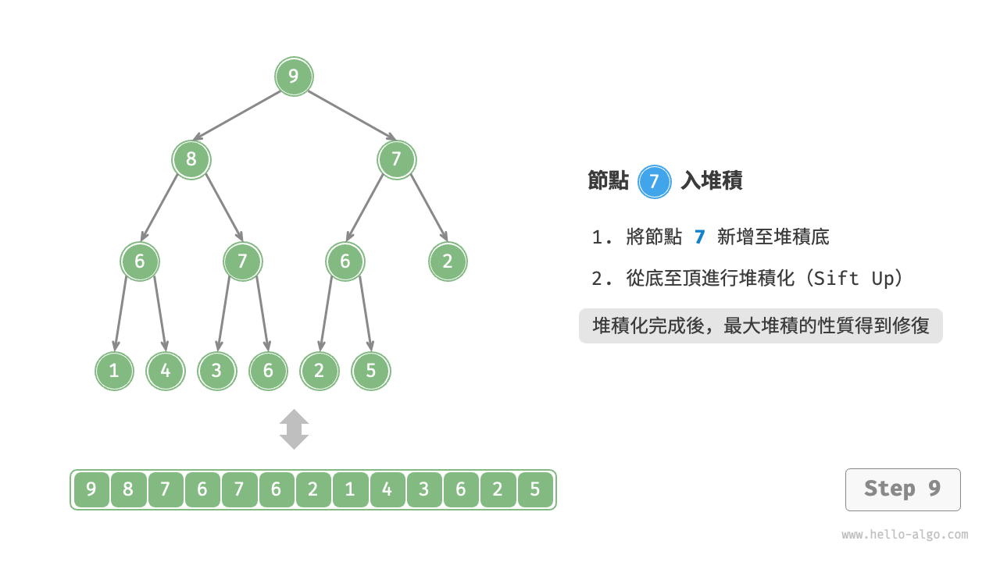{ class="animation-figure" }

<p align="center"> 圖 8-3 &nbsp; 元素入堆積步驟 </p>

設節點總數為 $n$ ，則樹的高度為 $O(\log n)$ 。由此可知，堆積化操作的迴圈輪數最多為 $O(\log n)$ ，**元素入堆積操作的時間複雜度為 $O(\log n)$** 。程式碼如下所示：

=== "Python"

    ```python title="my_heap.py"
    def push(self, val: int):
        """元素入堆積"""
        # 新增節點
        self.max_heap.append(val)
        # 從底至頂堆積化
        self.sift_up(self.size() - 1)

    def sift_up(self, i: int):
        """從節點 i 開始，從底至頂堆積化"""
        while True:
            # 獲取節點 i 的父節點
            p = self.parent(i)
            # 當“越過根節點”或“節點無須修復”時，結束堆積化
            if p < 0 or self.max_heap[i] <= self.max_heap[p]:
                break
            # 交換兩節點
            self.swap(i, p)
            # 迴圈向上堆積化
            i = p
    ```

=== "C++"

    ```cpp title="my_heap.cpp"
    /* 元素入堆積 */
    void push(int val) {
        // 新增節點
        maxHeap.push_back(val);
        // 從底至頂堆積化
        siftUp(size() - 1);
    }

    /* 從節點 i 開始，從底至頂堆積化 */
    void siftUp(int i) {
        while (true) {
            // 獲取節點 i 的父節點
            int p = parent(i);
            // 當“越過根節點”或“節點無須修復”時，結束堆積化
            if (p < 0 || maxHeap[i] <= maxHeap[p])
                break;
            // 交換兩節點
            swap(maxHeap[i], maxHeap[p]);
            // 迴圈向上堆積化
            i = p;
        }
    }
    ```

=== "Java"

    ```java title="my_heap.java"
    /* 元素入堆積 */
    void push(int val) {
        // 新增節點
        maxHeap.add(val);
        // 從底至頂堆積化
        siftUp(size() - 1);
    }

    /* 從節點 i 開始，從底至頂堆積化 */
    void siftUp(int i) {
        while (true) {
            // 獲取節點 i 的父節點
            int p = parent(i);
            // 當“越過根節點”或“節點無須修復”時，結束堆積化
            if (p < 0 || maxHeap.get(i) <= maxHeap.get(p))
                break;
            // 交換兩節點
            swap(i, p);
            // 迴圈向上堆積化
            i = p;
        }
    }
    ```

=== "C#"

    ```csharp title="my_heap.cs"
    /* 元素入堆積 */
    void Push(int val) {
        // 新增節點
        maxHeap.Add(val);
        // 從底至頂堆積化
        SiftUp(Size() - 1);
    }

    /* 從節點 i 開始，從底至頂堆積化 */
    void SiftUp(int i) {
        while (true) {
            // 獲取節點 i 的父節點
            int p = Parent(i);
            // 若“越過根節點”或“節點無須修復”，則結束堆積化
            if (p < 0 || maxHeap[i] <= maxHeap[p])
                break;
            // 交換兩節點
            Swap(i, p);
            // 迴圈向上堆積化
            i = p;
        }
    }
    ```

=== "Go"

    ```go title="my_heap.go"
    /* 元素入堆積 */
    func (h *maxHeap) push(val any) {
        // 新增節點
        h.data = append(h.data, val)
        // 從底至頂堆積化
        h.siftUp(len(h.data) - 1)
    }

    /* 從節點 i 開始，從底至頂堆積化 */
    func (h *maxHeap) siftUp(i int) {
        for true {
            // 獲取節點 i 的父節點
            p := h.parent(i)
            // 當“越過根節點”或“節點無須修復”時，結束堆積化
            if p < 0 || h.data[i].(int) <= h.data[p].(int) {
                break
            }
            // 交換兩節點
            h.swap(i, p)
            // 迴圈向上堆積化
            i = p
        }
    }
    ```

=== "Swift"

    ```swift title="my_heap.swift"
    /* 元素入堆積 */
    func push(val: Int) {
        // 新增節點
        maxHeap.append(val)
        // 從底至頂堆積化
        siftUp(i: size() - 1)
    }

    /* 從節點 i 開始，從底至頂堆積化 */
    func siftUp(i: Int) {
        var i = i
        while true {
            // 獲取節點 i 的父節點
            let p = parent(i: i)
            // 當“越過根節點”或“節點無須修復”時，結束堆積化
            if p < 0 || maxHeap[i] <= maxHeap[p] {
                break
            }
            // 交換兩節點
            swap(i: i, j: p)
            // 迴圈向上堆積化
            i = p
        }
    }
    ```

=== "JS"

    ```javascript title="my_heap.js"
    /* 元素入堆積 */
    push(val) {
        // 新增節點
        this.#maxHeap.push(val);
        // 從底至頂堆積化
        this.#siftUp(this.size() - 1);
    }

    /* 從節點 i 開始，從底至頂堆積化 */
    #siftUp(i) {
        while (true) {
            // 獲取節點 i 的父節點
            const p = this.#parent(i);
            // 當“越過根節點”或“節點無須修復”時，結束堆積化
            if (p < 0 || this.#maxHeap[i] <= this.#maxHeap[p]) break;
            // 交換兩節點
            this.#swap(i, p);
            // 迴圈向上堆積化
            i = p;
        }
    }
    ```

=== "TS"

    ```typescript title="my_heap.ts"
    /* 元素入堆積 */
    push(val: number): void {
        // 新增節點
        this.maxHeap.push(val);
        // 從底至頂堆積化
        this.siftUp(this.size() - 1);
    }

    /* 從節點 i 開始，從底至頂堆積化 */
    siftUp(i: number): void {
        while (true) {
            // 獲取節點 i 的父節點
            const p = this.parent(i);
            // 當“越過根節點”或“節點無須修復”時，結束堆積化
            if (p < 0 || this.maxHeap[i] <= this.maxHeap[p]) break;
            // 交換兩節點
            this.swap(i, p);
            // 迴圈向上堆積化
            i = p;
        }
    }
    ```

=== "Dart"

    ```dart title="my_heap.dart"
    /* 元素入堆積 */
    void push(int val) {
      // 新增節點
      _maxHeap.add(val);
      // 從底至頂堆積化
      siftUp(size() - 1);
    }

    /* 從節點 i 開始，從底至頂堆積化 */
    void siftUp(int i) {
      while (true) {
        // 獲取節點 i 的父節點
        int p = _parent(i);
        // 當“越過根節點”或“節點無須修復”時，結束堆積化
        if (p < 0 || _maxHeap[i] <= _maxHeap[p]) {
          break;
        }
        // 交換兩節點
        _swap(i, p);
        // 迴圈向上堆積化
        i = p;
      }
    }
    ```

=== "Rust"

    ```rust title="my_heap.rs"
    /* 元素入堆積 */
    fn push(&mut self, val: i32) {
        // 新增節點
        self.max_heap.push(val);
        // 從底至頂堆積化
        self.sift_up(self.size() - 1);
    }

    /* 從節點 i 開始，從底至頂堆積化 */
    fn sift_up(&mut self, mut i: usize) {
        loop {
            // 節點 i 已經是堆積頂節點了，結束堆積化
            if i == 0 {
                break;
            }
            // 獲取節點 i 的父節點
            let p = Self::parent(i);
            // 當“節點無須修復”時，結束堆積化
            if self.max_heap[i] <= self.max_heap[p] {
                break;
            }
            // 交換兩節點
            self.swap(i, p);
            // 迴圈向上堆積化
            i = p;
        }
    }
    ```

=== "C"

    ```c title="my_heap.c"
    /* 元素入堆積 */
    void push(MaxHeap *maxHeap, int val) {
        // 預設情況下，不應該新增這麼多節點
        if (maxHeap->size == MAX_SIZE) {
            printf("heap is full!");
            return;
        }
        // 新增節點
        maxHeap->data[maxHeap->size] = val;
        maxHeap->size++;

        // 從底至頂堆積化
        siftUp(maxHeap, maxHeap->size - 1);
    }

    /* 從節點 i 開始，從底至頂堆積化 */
    void siftUp(MaxHeap *maxHeap, int i) {
        while (true) {
            // 獲取節點 i 的父節點
            int p = parent(maxHeap, i);
            // 當“越過根節點”或“節點無須修復”時，結束堆積化
            if (p < 0 || maxHeap->data[i] <= maxHeap->data[p]) {
                break;
            }
            // 交換兩節點
            swap(maxHeap, i, p);
            // 迴圈向上堆積化
            i = p;
        }
    }
    ```

=== "Kotlin"

    ```kotlin title="my_heap.kt"
    /* 元素入堆積 */
    fun push(_val: Int) {
        // 新增節點
        maxHeap.add(_val)
        // 從底至頂堆積化
        siftUp(size() - 1)
    }

    /* 從節點 i 開始，從底至頂堆積化 */
    fun siftUp(it: Int) {
        // Kotlin的函式參數不可變，因此建立臨時變數
        var i = it
        while (true) {
            // 獲取節點 i 的父節點
            val p = parent(i)
            // 當“越過根節點”或“節點無須修復”時，結束堆積化
            if (p < 0 || maxHeap[i] <= maxHeap[p]) break
            // 交換兩節點
            swap(i, p)
            // 迴圈向上堆積化
            i = p
        }
    }
    ```

=== "Ruby"

    ```ruby title="my_heap.rb"
    ### 元素入堆積 ###
    def push(val)
      # 新增節點
      @max_heap << val
      # 從底至頂堆積化
      sift_up(size - 1)
    end

    ### 從節點 i 開始，從底至頂堆積化 ###
    def sift_up(i)
      loop do
        # 獲取節點 i 的父節點
        p = parent(i)
        # 當“越過根節點”或“節點無須修復”時，結束堆積化
        break if p < 0 || @max_heap[i] <= @max_heap[p]
        # 交換兩節點
        swap(i, p)
        # 迴圈向上堆積化
        i = p
      end
    end
    ```

??? pythontutor "視覺化執行"

    <div style="height: 549px; width: 100%;"><iframe class="pythontutor-iframe" src="https://pythontutor.com/iframe-embed.html#code=class%20MaxHeap%3A%0A%20%20%20%20%22%22%22%E5%A4%A7%E9%A0%82%E5%A0%86%E7%A9%8D%22%22%22%0A%0A%20%20%20%20def%20__init__%28self%2C%20nums%3A%20list%5Bint%5D%29%3A%0A%20%20%20%20%20%20%20%20%22%22%22%E5%BB%BA%E6%A7%8B%E5%AD%90%22%22%22%0A%20%20%20%20%20%20%20%20%23%20%E5%B0%87%E4%B8%B2%E5%88%97%E5%85%83%E7%B4%A0%E5%8E%9F%E5%B0%81%E4%B8%8D%E5%8B%95%E6%96%B0%E5%A2%9E%E9%80%B2%E5%A0%86%E7%A9%8D%0A%20%20%20%20%20%20%20%20self.max_heap%20%3D%20nums%0A%0A%20%20%20%20def%20left%28self%2C%20i%3A%20int%29%20-%3E%20int%3A%0A%20%20%20%20%20%20%20%20%22%22%22%E7%8D%B2%E5%8F%96%E5%B7%A6%E5%AD%90%E7%AF%80%E9%BB%9E%E7%9A%84%E7%B4%A2%E5%BC%95%22%22%22%0A%20%20%20%20%20%20%20%20return%202%20%2A%20i%20%2B%201%0A%0A%20%20%20%20def%20right%28self%2C%20i%3A%20int%29%20-%3E%20int%3A%0A%20%20%20%20%20%20%20%20%22%22%22%E7%8D%B2%E5%8F%96%E5%8F%B3%E5%AD%90%E7%AF%80%E9%BB%9E%E7%9A%84%E7%B4%A2%E5%BC%95%22%22%22%0A%20%20%20%20%20%20%20%20return%202%20%2A%20i%20%2B%202%0A%0A%20%20%20%20def%20parent%28self%2C%20i%3A%20int%29%20-%3E%20int%3A%0A%20%20%20%20%20%20%20%20%22%22%22%E7%8D%B2%E5%8F%96%E7%88%B6%E7%AF%80%E9%BB%9E%E7%9A%84%E7%B4%A2%E5%BC%95%22%22%22%0A%20%20%20%20%20%20%20%20return%20%28i%20-%201%29%20//%202%20%20%23%20%E5%90%91%E4%B8%8B%E6%95%B4%E9%99%A4%0A%0A%20%20%20%20def%20swap%28self%2C%20i%3A%20int%2C%20j%3A%20int%29%3A%0A%20%20%20%20%20%20%20%20%22%22%22%E4%BA%A4%E6%8F%9B%E5%85%83%E7%B4%A0%22%22%22%0A%20%20%20%20%20%20%20%20self.max_heap%5Bi%5D%2C%20self.max_heap%5Bj%5D%20%3D%20self.max_heap%5Bj%5D%2C%20self.max_heap%5Bi%5D%0A%0A%20%20%20%20def%20size%28self%29%20-%3E%20int%3A%0A%20%20%20%20%20%20%20%20%22%22%22%E7%8D%B2%E5%8F%96%E5%A0%86%E7%A9%8D%E5%A4%A7%E5%B0%8F%22%22%22%0A%20%20%20%20%20%20%20%20return%20len%28self.max_heap%29%0A%0A%20%20%20%20def%20is_empty%28self%29%20-%3E%20bool%3A%0A%20%20%20%20%20%20%20%20%22%22%22%E5%88%A4%E6%96%B7%E5%A0%86%E7%A9%8D%E6%98%AF%E5%90%A6%E7%82%BA%E7%A9%BA%22%22%22%0A%20%20%20%20%20%20%20%20return%20self.size%28%29%20%3D%3D%200%0A%0A%20%20%20%20def%20push%28self%2C%20val%3A%20int%29%3A%0A%20%20%20%20%20%20%20%20%22%22%22%E5%85%83%E7%B4%A0%E5%85%A5%E5%A0%86%E7%A9%8D%22%22%22%0A%20%20%20%20%20%20%20%20%23%20%E6%96%B0%E5%A2%9E%E7%AF%80%E9%BB%9E%0A%20%20%20%20%20%20%20%20self.max_heap.append%28val%29%0A%20%20%20%20%20%20%20%20%23%20%E5%BE%9E%E5%BA%95%E8%87%B3%E9%A0%82%E5%A0%86%E7%A9%8D%E5%8C%96%0A%20%20%20%20%20%20%20%20self.sift_up%28self.size%28%29%20-%201%29%0A%0A%20%20%20%20def%20sift_up%28self%2C%20i%3A%20int%29%3A%0A%20%20%20%20%20%20%20%20%22%22%22%E5%BE%9E%E7%AF%80%E9%BB%9E%20i%20%E9%96%8B%E5%A7%8B%EF%BC%8C%E5%BE%9E%E5%BA%95%E8%87%B3%E9%A0%82%E5%A0%86%E7%A9%8D%E5%8C%96%22%22%22%0A%20%20%20%20%20%20%20%20while%20True%3A%0A%20%20%20%20%20%20%20%20%20%20%20%20%23%20%E7%8D%B2%E5%8F%96%E7%AF%80%E9%BB%9E%20i%20%E7%9A%84%E7%88%B6%E7%AF%80%E9%BB%9E%0A%20%20%20%20%20%20%20%20%20%20%20%20p%20%3D%20self.parent%28i%29%0A%20%20%20%20%20%20%20%20%20%20%20%20%23%20%E7%95%B6%E2%80%9C%E8%B6%8A%E9%81%8E%E6%A0%B9%E7%AF%80%E9%BB%9E%E2%80%9D%E6%88%96%E2%80%9C%E7%AF%80%E9%BB%9E%E7%84%A1%E9%A0%88%E4%BF%AE%E5%BE%A9%E2%80%9D%E6%99%82%EF%BC%8C%E7%B5%90%E6%9D%9F%E5%A0%86%E7%A9%8D%E5%8C%96%0A%20%20%20%20%20%20%20%20%20%20%20%20if%20p%20%3C%200%20or%20self.max_heap%5Bi%5D%20%3C%3D%20self.max_heap%5Bp%5D%3A%0A%20%20%20%20%20%20%20%20%20%20%20%20%20%20%20%20break%0A%20%20%20%20%20%20%20%20%20%20%20%20%23%20%E4%BA%A4%E6%8F%9B%E5%85%A9%E7%AF%80%E9%BB%9E%0A%20%20%20%20%20%20%20%20%20%20%20%20self.swap%28i%2C%20p%29%0A%20%20%20%20%20%20%20%20%20%20%20%20%23%20%E8%BF%B4%E5%9C%88%E5%90%91%E4%B8%8A%E5%A0%86%E7%A9%8D%E5%8C%96%0A%20%20%20%20%20%20%20%20%20%20%20%20i%20%3D%20p%0A%0A%0A%22%22%22Driver%20Code%22%22%22%0Aif%20__name__%20%3D%3D%20%22__main__%22%3A%0A%20%20%20%20%23%20%E5%88%9D%E5%A7%8B%E5%8C%96%E5%A4%A7%E9%A0%82%E5%A0%86%E7%A9%8D%0A%20%20%20%20%23%20%E8%AB%8B%E6%B3%A8%E6%84%8F%EF%BC%8C%E8%BC%B8%E5%85%A5%E9%99%A3%E5%88%97%E5%B7%B2%E7%B6%93%E6%98%AF%E4%B8%80%E5%80%8B%E5%B7%B2%E7%B6%93%E6%98%AF%E4%B8%80%E5%80%8B%E5%90%88%E6%B3%95%E7%9A%84%E5%A0%86%E7%A9%8D%0A%20%20%20%20max_heap%20%3D%20MaxHeap%28%5B9%2C%208%2C%206%2C%206%2C%207%2C%205%2C%202%2C%201%2C%204%2C%203%2C%206%2C%202%5D%29%0A%0A%20%20%20%20%23%20%E5%85%83%E7%B4%A0%E5%85%A5%E5%A0%86%E7%A9%8D%0A%20%20%20%20val%20%3D%207%0A%20%20%20%20max_heap.push%28val%29&codeDivHeight=472&codeDivWidth=350&cumulative=false&curInstr=8&heapPrimitives=nevernest&origin=opt-frontend.js&py=311&rawInputLstJSON=%5B%5D&textReferences=false"> </iframe></div>
    <div style="margin-top: 5px;"><a href="https://pythontutor.com/iframe-embed.html#code=class%20MaxHeap%3A%0A%20%20%20%20%22%22%22%E5%A4%A7%E9%A0%82%E5%A0%86%E7%A9%8D%22%22%22%0A%0A%20%20%20%20def%20__init__%28self%2C%20nums%3A%20list%5Bint%5D%29%3A%0A%20%20%20%20%20%20%20%20%22%22%22%E5%BB%BA%E6%A7%8B%E5%AD%90%22%22%22%0A%20%20%20%20%20%20%20%20%23%20%E5%B0%87%E4%B8%B2%E5%88%97%E5%85%83%E7%B4%A0%E5%8E%9F%E5%B0%81%E4%B8%8D%E5%8B%95%E6%96%B0%E5%A2%9E%E9%80%B2%E5%A0%86%E7%A9%8D%0A%20%20%20%20%20%20%20%20self.max_heap%20%3D%20nums%0A%0A%20%20%20%20def%20left%28self%2C%20i%3A%20int%29%20-%3E%20int%3A%0A%20%20%20%20%20%20%20%20%22%22%22%E7%8D%B2%E5%8F%96%E5%B7%A6%E5%AD%90%E7%AF%80%E9%BB%9E%E7%9A%84%E7%B4%A2%E5%BC%95%22%22%22%0A%20%20%20%20%20%20%20%20return%202%20%2A%20i%20%2B%201%0A%0A%20%20%20%20def%20right%28self%2C%20i%3A%20int%29%20-%3E%20int%3A%0A%20%20%20%20%20%20%20%20%22%22%22%E7%8D%B2%E5%8F%96%E5%8F%B3%E5%AD%90%E7%AF%80%E9%BB%9E%E7%9A%84%E7%B4%A2%E5%BC%95%22%22%22%0A%20%20%20%20%20%20%20%20return%202%20%2A%20i%20%2B%202%0A%0A%20%20%20%20def%20parent%28self%2C%20i%3A%20int%29%20-%3E%20int%3A%0A%20%20%20%20%20%20%20%20%22%22%22%E7%8D%B2%E5%8F%96%E7%88%B6%E7%AF%80%E9%BB%9E%E7%9A%84%E7%B4%A2%E5%BC%95%22%22%22%0A%20%20%20%20%20%20%20%20return%20%28i%20-%201%29%20//%202%20%20%23%20%E5%90%91%E4%B8%8B%E6%95%B4%E9%99%A4%0A%0A%20%20%20%20def%20swap%28self%2C%20i%3A%20int%2C%20j%3A%20int%29%3A%0A%20%20%20%20%20%20%20%20%22%22%22%E4%BA%A4%E6%8F%9B%E5%85%83%E7%B4%A0%22%22%22%0A%20%20%20%20%20%20%20%20self.max_heap%5Bi%5D%2C%20self.max_heap%5Bj%5D%20%3D%20self.max_heap%5Bj%5D%2C%20self.max_heap%5Bi%5D%0A%0A%20%20%20%20def%20size%28self%29%20-%3E%20int%3A%0A%20%20%20%20%20%20%20%20%22%22%22%E7%8D%B2%E5%8F%96%E5%A0%86%E7%A9%8D%E5%A4%A7%E5%B0%8F%22%22%22%0A%20%20%20%20%20%20%20%20return%20len%28self.max_heap%29%0A%0A%20%20%20%20def%20is_empty%28self%29%20-%3E%20bool%3A%0A%20%20%20%20%20%20%20%20%22%22%22%E5%88%A4%E6%96%B7%E5%A0%86%E7%A9%8D%E6%98%AF%E5%90%A6%E7%82%BA%E7%A9%BA%22%22%22%0A%20%20%20%20%20%20%20%20return%20self.size%28%29%20%3D%3D%200%0A%0A%20%20%20%20def%20push%28self%2C%20val%3A%20int%29%3A%0A%20%20%20%20%20%20%20%20%22%22%22%E5%85%83%E7%B4%A0%E5%85%A5%E5%A0%86%E7%A9%8D%22%22%22%0A%20%20%20%20%20%20%20%20%23%20%E6%96%B0%E5%A2%9E%E7%AF%80%E9%BB%9E%0A%20%20%20%20%20%20%20%20self.max_heap.append%28val%29%0A%20%20%20%20%20%20%20%20%23%20%E5%BE%9E%E5%BA%95%E8%87%B3%E9%A0%82%E5%A0%86%E7%A9%8D%E5%8C%96%0A%20%20%20%20%20%20%20%20self.sift_up%28self.size%28%29%20-%201%29%0A%0A%20%20%20%20def%20sift_up%28self%2C%20i%3A%20int%29%3A%0A%20%20%20%20%20%20%20%20%22%22%22%E5%BE%9E%E7%AF%80%E9%BB%9E%20i%20%E9%96%8B%E5%A7%8B%EF%BC%8C%E5%BE%9E%E5%BA%95%E8%87%B3%E9%A0%82%E5%A0%86%E7%A9%8D%E5%8C%96%22%22%22%0A%20%20%20%20%20%20%20%20while%20True%3A%0A%20%20%20%20%20%20%20%20%20%20%20%20%23%20%E7%8D%B2%E5%8F%96%E7%AF%80%E9%BB%9E%20i%20%E7%9A%84%E7%88%B6%E7%AF%80%E9%BB%9E%0A%20%20%20%20%20%20%20%20%20%20%20%20p%20%3D%20self.parent%28i%29%0A%20%20%20%20%20%20%20%20%20%20%20%20%23%20%E7%95%B6%E2%80%9C%E8%B6%8A%E9%81%8E%E6%A0%B9%E7%AF%80%E9%BB%9E%E2%80%9D%E6%88%96%E2%80%9C%E7%AF%80%E9%BB%9E%E7%84%A1%E9%A0%88%E4%BF%AE%E5%BE%A9%E2%80%9D%E6%99%82%EF%BC%8C%E7%B5%90%E6%9D%9F%E5%A0%86%E7%A9%8D%E5%8C%96%0A%20%20%20%20%20%20%20%20%20%20%20%20if%20p%20%3C%200%20or%20self.max_heap%5Bi%5D%20%3C%3D%20self.max_heap%5Bp%5D%3A%0A%20%20%20%20%20%20%20%20%20%20%20%20%20%20%20%20break%0A%20%20%20%20%20%20%20%20%20%20%20%20%23%20%E4%BA%A4%E6%8F%9B%E5%85%A9%E7%AF%80%E9%BB%9E%0A%20%20%20%20%20%20%20%20%20%20%20%20self.swap%28i%2C%20p%29%0A%20%20%20%20%20%20%20%20%20%20%20%20%23%20%E8%BF%B4%E5%9C%88%E5%90%91%E4%B8%8A%E5%A0%86%E7%A9%8D%E5%8C%96%0A%20%20%20%20%20%20%20%20%20%20%20%20i%20%3D%20p%0A%0A%0A%22%22%22Driver%20Code%22%22%22%0Aif%20__name__%20%3D%3D%20%22__main__%22%3A%0A%20%20%20%20%23%20%E5%88%9D%E5%A7%8B%E5%8C%96%E5%A4%A7%E9%A0%82%E5%A0%86%E7%A9%8D%0A%20%20%20%20%23%20%E8%AB%8B%E6%B3%A8%E6%84%8F%EF%BC%8C%E8%BC%B8%E5%85%A5%E9%99%A3%E5%88%97%E5%B7%B2%E7%B6%93%E6%98%AF%E4%B8%80%E5%80%8B%E5%B7%B2%E7%B6%93%E6%98%AF%E4%B8%80%E5%80%8B%E5%90%88%E6%B3%95%E7%9A%84%E5%A0%86%E7%A9%8D%0A%20%20%20%20max_heap%20%3D%20MaxHeap%28%5B9%2C%208%2C%206%2C%206%2C%207%2C%205%2C%202%2C%201%2C%204%2C%203%2C%206%2C%202%5D%29%0A%0A%20%20%20%20%23%20%E5%85%83%E7%B4%A0%E5%85%A5%E5%A0%86%E7%A9%8D%0A%20%20%20%20val%20%3D%207%0A%20%20%20%20max_heap.push%28val%29&codeDivHeight=800&codeDivWidth=600&cumulative=false&curInstr=8&heapPrimitives=nevernest&origin=opt-frontend.js&py=311&rawInputLstJSON=%5B%5D&textReferences=false" target="_blank" rel="noopener noreferrer">全螢幕觀看 ></a></div>

### 4. &nbsp; 堆積頂元素出堆積

堆積頂元素是二元樹的根節點，即串列首元素。如果我們直接從串列中刪除首元素，那麼二元樹中所有節點的索引都會發生變化，這將使得後續使用堆積化進行修復變得困難。為了儘量減少元素索引的變動，我們採用以下操作步驟。

1. 交換堆積頂元素與堆積底元素（交換根節點與最右葉節點）。
2. 交換完成後，將堆積底從串列中刪除（注意，由於已經交換，因此實際上刪除的是原來的堆積頂元素）。
3. 從根節點開始，**從頂至底執行堆積化**。

如圖 8-4 所示，**“從頂至底堆積化”的操作方向與“從底至頂堆積化”相反**，我們將根節點的值與其兩個子節點的值進行比較，將最大的子節點與根節點交換。然後迴圈執行此操作，直到越過葉節點或遇到無須交換的節點時結束。

=== "<1>"
    { class="animation-figure" }

=== "<2>"
    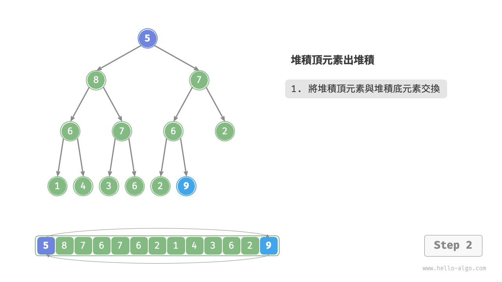{ class="animation-figure" }

=== "<3>"
    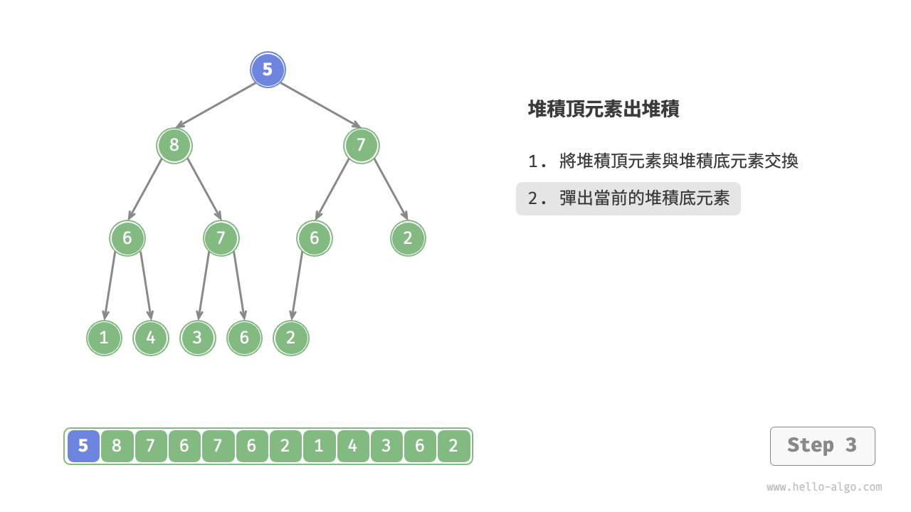{ class="animation-figure" }

=== "<4>"
    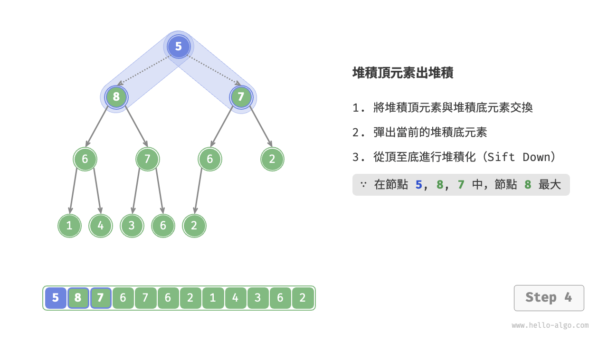{ class="animation-figure" }

=== "<5>"
    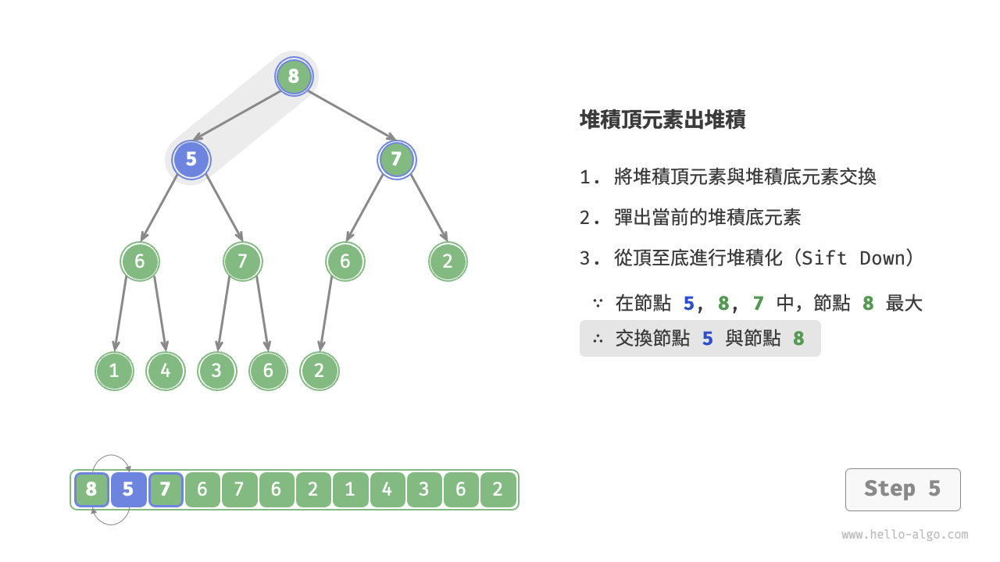{ class="animation-figure" }

=== "<6>"
    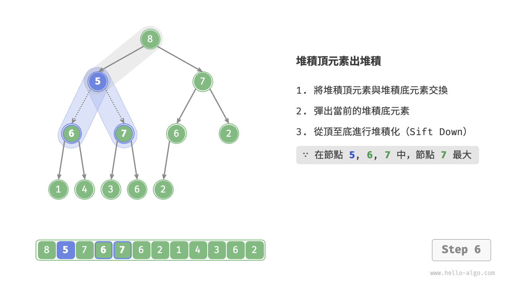{ class="animation-figure" }

=== "<7>"
    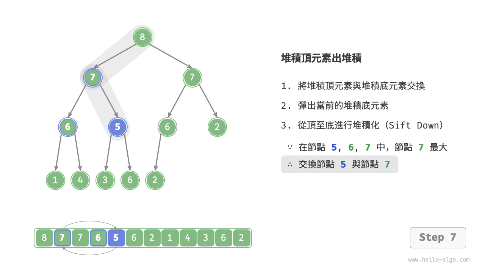{ class="animation-figure" }

=== "<8>"
    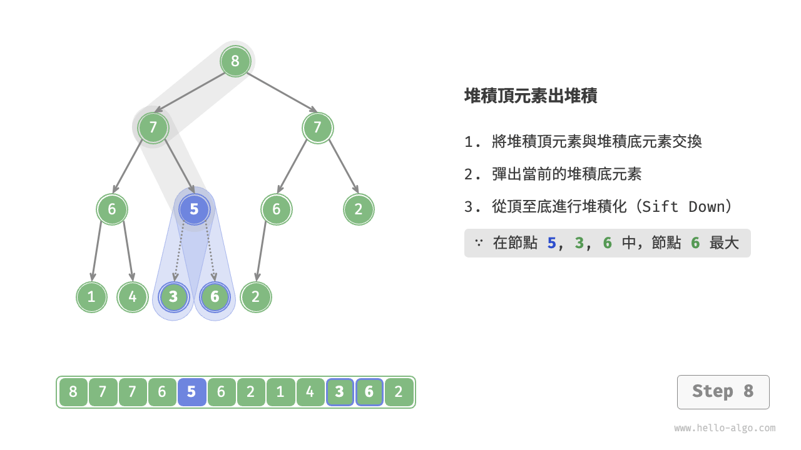{ class="animation-figure" }

=== "<9>"
    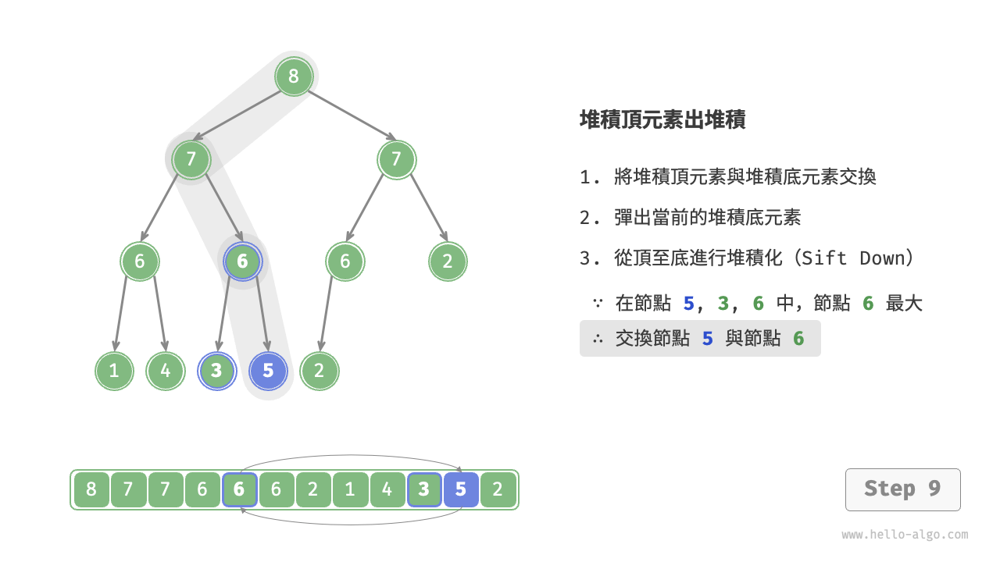{ class="animation-figure" }

=== "<10>"
    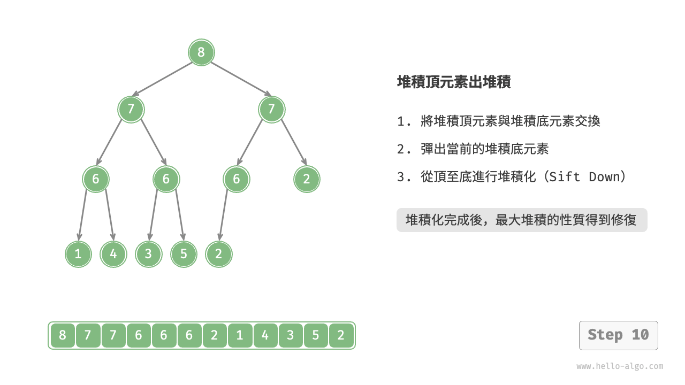{ class="animation-figure" }

<p align="center"> 圖 8-4 &nbsp; 堆積頂元素出堆積步驟 </p>

與元素入堆積操作相似，堆積頂元素出堆積操作的時間複雜度也為 $O(\log n)$ 。程式碼如下所示：

=== "Python"

    ```python title="my_heap.py"
    def pop(self) -> int:
        """元素出堆積"""
        # 判空處理
        if self.is_empty():
            raise IndexError("堆積為空")
        # 交換根節點與最右葉節點（交換首元素與尾元素）
        self.swap(0, self.size() - 1)
        # 刪除節點
        val = self.max_heap.pop()
        # 從頂至底堆積化
        self.sift_down(0)
        # 返回堆積頂元素
        return val

    def sift_down(self, i: int):
        """從節點 i 開始，從頂至底堆積化"""
        while True:
            # 判斷節點 i, l, r 中值最大的節點，記為 ma
            l, r, ma = self.left(i), self.right(i), i
            if l < self.size() and self.max_heap[l] > self.max_heap[ma]:
                ma = l
            if r < self.size() and self.max_heap[r] > self.max_heap[ma]:
                ma = r
            # 若節點 i 最大或索引 l, r 越界，則無須繼續堆積化，跳出
            if ma == i:
                break
            # 交換兩節點
            self.swap(i, ma)
            # 迴圈向下堆積化
            i = ma
    ```

=== "C++"

    ```cpp title="my_heap.cpp"
    /* 元素出堆積 */
    void pop() {
        // 判空處理
        if (isEmpty()) {
            throw out_of_range("堆積為空");
        }
        // 交換根節點與最右葉節點（交換首元素與尾元素）
        swap(maxHeap[0], maxHeap[size() - 1]);
        // 刪除節點
        maxHeap.pop_back();
        // 從頂至底堆積化
        siftDown(0);
    }

    /* 從節點 i 開始，從頂至底堆積化 */
    void siftDown(int i) {
        while (true) {
            // 判斷節點 i, l, r 中值最大的節點，記為 ma
            int l = left(i), r = right(i), ma = i;
            if (l < size() && maxHeap[l] > maxHeap[ma])
                ma = l;
            if (r < size() && maxHeap[r] > maxHeap[ma])
                ma = r;
            // 若節點 i 最大或索引 l, r 越界，則無須繼續堆積化，跳出
            if (ma == i)
                break;
            swap(maxHeap[i], maxHeap[ma]);
            // 迴圈向下堆積化
            i = ma;
        }
    }
    ```

=== "Java"

    ```java title="my_heap.java"
    /* 元素出堆積 */
    int pop() {
        // 判空處理
        if (isEmpty())
            throw new IndexOutOfBoundsException();
        // 交換根節點與最右葉節點（交換首元素與尾元素）
        swap(0, size() - 1);
        // 刪除節點
        int val = maxHeap.remove(size() - 1);
        // 從頂至底堆積化
        siftDown(0);
        // 返回堆積頂元素
        return val;
    }

    /* 從節點 i 開始，從頂至底堆積化 */
    void siftDown(int i) {
        while (true) {
            // 判斷節點 i, l, r 中值最大的節點，記為 ma
            int l = left(i), r = right(i), ma = i;
            if (l < size() && maxHeap.get(l) > maxHeap.get(ma))
                ma = l;
            if (r < size() && maxHeap.get(r) > maxHeap.get(ma))
                ma = r;
            // 若節點 i 最大或索引 l, r 越界，則無須繼續堆積化，跳出
            if (ma == i)
                break;
            // 交換兩節點
            swap(i, ma);
            // 迴圈向下堆積化
            i = ma;
        }
    }
    ```

=== "C#"

    ```csharp title="my_heap.cs"
    /* 元素出堆積 */
    int Pop() {
        // 判空處理
        if (IsEmpty())
            throw new IndexOutOfRangeException();
        // 交換根節點與最右葉節點（交換首元素與尾元素）
        Swap(0, Size() - 1);
        // 刪除節點
        int val = maxHeap.Last();
        maxHeap.RemoveAt(Size() - 1);
        // 從頂至底堆積化
        SiftDown(0);
        // 返回堆積頂元素
        return val;
    }

    /* 從節點 i 開始，從頂至底堆積化 */
    void SiftDown(int i) {
        while (true) {
            // 判斷節點 i, l, r 中值最大的節點，記為 ma
            int l = Left(i), r = Right(i), ma = i;
            if (l < Size() && maxHeap[l] > maxHeap[ma])
                ma = l;
            if (r < Size() && maxHeap[r] > maxHeap[ma])
                ma = r;
            // 若“節點 i 最大”或“越過葉節點”，則結束堆積化
            if (ma == i) break;
            // 交換兩節點
            Swap(i, ma);
            // 迴圈向下堆積化
            i = ma;
        }
    }
    ```

=== "Go"

    ```go title="my_heap.go"
    /* 元素出堆積 */
    func (h *maxHeap) pop() any {
        // 判空處理
        if h.isEmpty() {
            fmt.Println("error")
            return nil
        }
        // 交換根節點與最右葉節點（交換首元素與尾元素）
        h.swap(0, h.size()-1)
        // 刪除節點
        val := h.data[len(h.data)-1]
        h.data = h.data[:len(h.data)-1]
        // 從頂至底堆積化
        h.siftDown(0)

        // 返回堆積頂元素
        return val
    }

    /* 從節點 i 開始，從頂至底堆積化 */
    func (h *maxHeap) siftDown(i int) {
        for true {
            // 判斷節點 i, l, r 中值最大的節點，記為 max
            l, r, max := h.left(i), h.right(i), i
            if l < h.size() && h.data[l].(int) > h.data[max].(int) {
                max = l
            }
            if r < h.size() && h.data[r].(int) > h.data[max].(int) {
                max = r
            }
            // 若節點 i 最大或索引 l, r 越界，則無須繼續堆積化，跳出
            if max == i {
                break
            }
            // 交換兩節點
            h.swap(i, max)
            // 迴圈向下堆積化
            i = max
        }
    }
    ```

=== "Swift"

    ```swift title="my_heap.swift"
    /* 元素出堆積 */
    func pop() -> Int {
        // 判空處理
        if isEmpty() {
            fatalError("堆積為空")
        }
        // 交換根節點與最右葉節點（交換首元素與尾元素）
        swap(i: 0, j: size() - 1)
        // 刪除節點
        let val = maxHeap.remove(at: size() - 1)
        // 從頂至底堆積化
        siftDown(i: 0)
        // 返回堆積頂元素
        return val
    }

    /* 從節點 i 開始，從頂至底堆積化 */
    func siftDown(i: Int) {
        var i = i
        while true {
            // 判斷節點 i, l, r 中值最大的節點，記為 ma
            let l = left(i: i)
            let r = right(i: i)
            var ma = i
            if l < size(), maxHeap[l] > maxHeap[ma] {
                ma = l
            }
            if r < size(), maxHeap[r] > maxHeap[ma] {
                ma = r
            }
            // 若節點 i 最大或索引 l, r 越界，則無須繼續堆積化，跳出
            if ma == i {
                break
            }
            // 交換兩節點
            swap(i: i, j: ma)
            // 迴圈向下堆積化
            i = ma
        }
    }
    ```

=== "JS"

    ```javascript title="my_heap.js"
    /* 元素出堆積 */
    pop() {
        // 判空處理
        if (this.isEmpty()) throw new Error('堆積為空');
        // 交換根節點與最右葉節點（交換首元素與尾元素）
        this.#swap(0, this.size() - 1);
        // 刪除節點
        const val = this.#maxHeap.pop();
        // 從頂至底堆積化
        this.#siftDown(0);
        // 返回堆積頂元素
        return val;
    }

    /* 從節點 i 開始，從頂至底堆積化 */
    #siftDown(i) {
        while (true) {
            // 判斷節點 i, l, r 中值最大的節點，記為 ma
            const l = this.#left(i),
                r = this.#right(i);
            let ma = i;
            if (l < this.size() && this.#maxHeap[l] > this.#maxHeap[ma]) ma = l;
            if (r < this.size() && this.#maxHeap[r] > this.#maxHeap[ma]) ma = r;
            // 若節點 i 最大或索引 l, r 越界，則無須繼續堆積化，跳出
            if (ma === i) break;
            // 交換兩節點
            this.#swap(i, ma);
            // 迴圈向下堆積化
            i = ma;
        }
    }
    ```

=== "TS"

    ```typescript title="my_heap.ts"
    /* 元素出堆積 */
    pop(): number {
        // 判空處理
        if (this.isEmpty()) throw new RangeError('Heap is empty.');
        // 交換根節點與最右葉節點（交換首元素與尾元素）
        this.swap(0, this.size() - 1);
        // 刪除節點
        const val = this.maxHeap.pop();
        // 從頂至底堆積化
        this.siftDown(0);
        // 返回堆積頂元素
        return val;
    }

    /* 從節點 i 開始，從頂至底堆積化 */
    siftDown(i: number): void {
        while (true) {
            // 判斷節點 i, l, r 中值最大的節點，記為 ma
            const l = this.left(i),
                r = this.right(i);
            let ma = i;
            if (l < this.size() && this.maxHeap[l] > this.maxHeap[ma]) ma = l;
            if (r < this.size() && this.maxHeap[r] > this.maxHeap[ma]) ma = r;
            // 若節點 i 最大或索引 l, r 越界，則無須繼續堆積化，跳出
            if (ma === i) break;
            // 交換兩節點
            this.swap(i, ma);
            // 迴圈向下堆積化
            i = ma;
        }
    }
    ```

=== "Dart"

    ```dart title="my_heap.dart"
    /* 元素出堆積 */
    int pop() {
      // 判空處理
      if (isEmpty()) throw Exception('堆積為空');
      // 交換根節點與最右葉節點（交換首元素與尾元素）
      _swap(0, size() - 1);
      // 刪除節點
      int val = _maxHeap.removeLast();
      // 從頂至底堆積化
      siftDown(0);
      // 返回堆積頂元素
      return val;
    }

    /* 從節點 i 開始，從頂至底堆積化 */
    void siftDown(int i) {
      while (true) {
        // 判斷節點 i, l, r 中值最大的節點，記為 ma
        int l = _left(i);
        int r = _right(i);
        int ma = i;
        if (l < size() && _maxHeap[l] > _maxHeap[ma]) ma = l;
        if (r < size() && _maxHeap[r] > _maxHeap[ma]) ma = r;
        // 若節點 i 最大或索引 l, r 越界，則無須繼續堆積化，跳出
        if (ma == i) break;
        // 交換兩節點
        _swap(i, ma);
        // 迴圈向下堆積化
        i = ma;
      }
    }
    ```

=== "Rust"

    ```rust title="my_heap.rs"
    /* 元素出堆積 */
    fn pop(&mut self) -> i32 {
        // 判空處理
        if self.is_empty() {
            panic!("index out of bounds");
        }
        // 交換根節點與最右葉節點（交換首元素與尾元素）
        self.swap(0, self.size() - 1);
        // 刪除節點
        let val = self.max_heap.pop().unwrap();
        // 從頂至底堆積化
        self.sift_down(0);
        // 返回堆積頂元素
        val
    }

    /* 從節點 i 開始，從頂至底堆積化 */
    fn sift_down(&mut self, mut i: usize) {
        loop {
            // 判斷節點 i, l, r 中值最大的節點，記為 ma
            let (l, r, mut ma) = (Self::left(i), Self::right(i), i);
            if l < self.size() && self.max_heap[l] > self.max_heap[ma] {
                ma = l;
            }
            if r < self.size() && self.max_heap[r] > self.max_heap[ma] {
                ma = r;
            }
            // 若節點 i 最大或索引 l, r 越界，則無須繼續堆積化，跳出
            if ma == i {
                break;
            }
            // 交換兩節點
            self.swap(i, ma);
            // 迴圈向下堆積化
            i = ma;
        }
    }
    ```

=== "C"

    ```c title="my_heap.c"
    /* 元素出堆積 */
    int pop(MaxHeap *maxHeap) {
        // 判空處理
        if (isEmpty(maxHeap)) {
            printf("heap is empty!");
            return INT_MAX;
        }
        // 交換根節點與最右葉節點（交換首元素與尾元素）
        swap(maxHeap, 0, size(maxHeap) - 1);
        // 刪除節點
        int val = maxHeap->data[maxHeap->size - 1];
        maxHeap->size--;
        // 從頂至底堆積化
        siftDown(maxHeap, 0);

        // 返回堆積頂元素
        return val;
    }

    /* 從節點 i 開始，從頂至底堆積化 */
    void siftDown(MaxHeap *maxHeap, int i) {
        while (true) {
            // 判斷節點 i, l, r 中值最大的節點，記為 max
            int l = left(maxHeap, i);
            int r = right(maxHeap, i);
            int max = i;
            if (l < size(maxHeap) && maxHeap->data[l] > maxHeap->data[max]) {
                max = l;
            }
            if (r < size(maxHeap) && maxHeap->data[r] > maxHeap->data[max]) {
                max = r;
            }
            // 若節點 i 最大或索引 l, r 越界，則無須繼續堆積化，跳出
            if (max == i) {
                break;
            }
            // 交換兩節點
            swap(maxHeap, i, max);
            // 迴圈向下堆積化
            i = max;
        }
    }
    ```

=== "Kotlin"

    ```kotlin title="my_heap.kt"
    /* 元素出堆積 */
    fun pop(): Int {
        // 判空處理
        if (isEmpty()) throw IndexOutOfBoundsException()
        // 交換根節點與最右葉節點（交換首元素與尾元素）
        swap(0, size() - 1)
        // 刪除節點
        val _val = maxHeap.removeAt(size() - 1)
        // 從頂至底堆積化
        siftDown(0)
        // 返回堆積頂元素
        return _val
    }

    /* 從節點 i 開始，從頂至底堆積化 */
    fun siftDown(it: Int) {
        // Kotlin的函式參數不可變，因此建立臨時變數
        var i = it
        while (true) {
            // 判斷節點 i, l, r 中值最大的節點，記為 ma
            val l = left(i)
            val r = right(i)
            var ma = i
            if (l < size() && maxHeap[l] > maxHeap[ma]) ma = l
            if (r < size() && maxHeap[r] > maxHeap[ma]) ma = r
            // 若節點 i 最大或索引 l, r 越界，則無須繼續堆積化，跳出
            if (ma == i) break
            // 交換兩節點
            swap(i, ma)
            // 迴圈向下堆積化
            i = ma
        }
    }
    ```

=== "Ruby"

    ```ruby title="my_heap.rb"
    ### 元素出堆積 ###
    def pop
      # 判空處理
      raise IndexError, "堆積為空" if is_empty?
      # 交換根節點與最右葉節點（交換首元素與尾元素）
      swap(0, size - 1)
      # 刪除節點
      val = @max_heap.pop
      # 從頂至底堆積化
      sift_down(0)
      # 返回堆積頂元素
      val
    end

    ### 從節點 i 開始，從頂至底堆積化 ###
    def sift_down(i)
      loop do
        # 判斷節點 i, l, r 中值最大的節點，記為 ma
        l, r, ma = left(i), right(i), i
        ma = l if l < size && @max_heap[l] > @max_heap[ma]
        ma = r if r < size && @max_heap[r] > @max_heap[ma]

        # 若節點 i 最大或索引 l, r 越界，則無須繼續堆積化，跳出
        break if ma == i

        # 交換兩節點
        swap(i, ma)
        # 迴圈向下堆積化
        i = ma
      end
    end
    ```

??? pythontutor "視覺化執行"

    <div style="height: 549px; width: 100%;"><iframe class="pythontutor-iframe" src="https://pythontutor.com/iframe-embed.html#code=class%20MaxHeap%3A%0A%20%20%20%20%22%22%22%E5%A4%A7%E9%A0%82%E5%A0%86%E7%A9%8D%22%22%22%0A%0A%20%20%20%20def%20__init__%28self%2C%20nums%3A%20list%5Bint%5D%29%3A%0A%20%20%20%20%20%20%20%20%22%22%22%E5%BB%BA%E6%A7%8B%E5%AD%90%22%22%22%0A%20%20%20%20%20%20%20%20%23%20%E5%B0%87%E4%B8%B2%E5%88%97%E5%85%83%E7%B4%A0%E5%8E%9F%E5%B0%81%E4%B8%8D%E5%8B%95%E6%96%B0%E5%A2%9E%E9%80%B2%E5%A0%86%E7%A9%8D%0A%20%20%20%20%20%20%20%20self.max_heap%20%3D%20nums%0A%0A%20%20%20%20def%20left%28self%2C%20i%3A%20int%29%20-%3E%20int%3A%0A%20%20%20%20%20%20%20%20%22%22%22%E7%8D%B2%E5%8F%96%E5%B7%A6%E5%AD%90%E7%AF%80%E9%BB%9E%E7%9A%84%E7%B4%A2%E5%BC%95%22%22%22%0A%20%20%20%20%20%20%20%20return%202%20%2A%20i%20%2B%201%0A%0A%20%20%20%20def%20right%28self%2C%20i%3A%20int%29%20-%3E%20int%3A%0A%20%20%20%20%20%20%20%20%22%22%22%E7%8D%B2%E5%8F%96%E5%8F%B3%E5%AD%90%E7%AF%80%E9%BB%9E%E7%9A%84%E7%B4%A2%E5%BC%95%22%22%22%0A%20%20%20%20%20%20%20%20return%202%20%2A%20i%20%2B%202%0A%0A%20%20%20%20def%20parent%28self%2C%20i%3A%20int%29%20-%3E%20int%3A%0A%20%20%20%20%20%20%20%20%22%22%22%E7%8D%B2%E5%8F%96%E7%88%B6%E7%AF%80%E9%BB%9E%E7%9A%84%E7%B4%A2%E5%BC%95%22%22%22%0A%20%20%20%20%20%20%20%20return%20%28i%20-%201%29%20//%202%20%20%23%20%E5%90%91%E4%B8%8B%E6%95%B4%E9%99%A4%0A%0A%20%20%20%20def%20swap%28self%2C%20i%3A%20int%2C%20j%3A%20int%29%3A%0A%20%20%20%20%20%20%20%20%22%22%22%E4%BA%A4%E6%8F%9B%E5%85%83%E7%B4%A0%22%22%22%0A%20%20%20%20%20%20%20%20self.max_heap%5Bi%5D%2C%20self.max_heap%5Bj%5D%20%3D%20self.max_heap%5Bj%5D%2C%20self.max_heap%5Bi%5D%0A%0A%20%20%20%20def%20size%28self%29%20-%3E%20int%3A%0A%20%20%20%20%20%20%20%20%22%22%22%E7%8D%B2%E5%8F%96%E5%A0%86%E7%A9%8D%E5%A4%A7%E5%B0%8F%22%22%22%0A%20%20%20%20%20%20%20%20return%20len%28self.max_heap%29%0A%0A%20%20%20%20def%20is_empty%28self%29%20-%3E%20bool%3A%0A%20%20%20%20%20%20%20%20%22%22%22%E5%88%A4%E6%96%B7%E5%A0%86%E7%A9%8D%E6%98%AF%E5%90%A6%E7%82%BA%E7%A9%BA%22%22%22%0A%20%20%20%20%20%20%20%20return%20self.size%28%29%20%3D%3D%200%0A%0A%20%20%20%20def%20pop%28self%29%20-%3E%20int%3A%0A%20%20%20%20%20%20%20%20%22%22%22%E5%85%83%E7%B4%A0%E5%87%BA%E5%A0%86%E7%A9%8D%22%22%22%0A%20%20%20%20%20%20%20%20%23%20%E5%88%A4%E7%A9%BA%E8%99%95%E7%90%86%0A%20%20%20%20%20%20%20%20if%20self.is_empty%28%29%3A%0A%20%20%20%20%20%20%20%20%20%20%20%20raise%20IndexError%28%22%E5%A0%86%E7%A9%8D%E7%82%BA%E7%A9%BA%22%29%0A%20%20%20%20%20%20%20%20%23%20%E4%BA%A4%E6%8F%9B%E6%A0%B9%E7%AF%80%E9%BB%9E%E8%88%87%E6%9C%80%E5%8F%B3%E8%91%89%E7%AF%80%E9%BB%9E%EF%BC%88%E4%BA%A4%E6%8F%9B%E9%A6%96%E5%85%83%E7%B4%A0%E8%88%87%E5%B0%BE%E5%85%83%E7%B4%A0%EF%BC%89%0A%20%20%20%20%20%20%20%20self.swap%280%2C%20self.size%28%29%20-%201%29%0A%20%20%20%20%20%20%20%20%23%20%E5%88%AA%E9%99%A4%E7%AF%80%E9%BB%9E%0A%20%20%20%20%20%20%20%20val%20%3D%20self.max_heap.pop%28%29%0A%20%20%20%20%20%20%20%20%23%20%E5%BE%9E%E9%A0%82%E8%87%B3%E5%BA%95%E5%A0%86%E7%A9%8D%E5%8C%96%0A%20%20%20%20%20%20%20%20self.sift_down%280%29%0A%20%20%20%20%20%20%20%20%23%20%E8%BF%94%E5%9B%9E%E5%A0%86%E7%A9%8D%E9%A0%82%E5%85%83%E7%B4%A0%0A%20%20%20%20%20%20%20%20return%20val%0A%0A%20%20%20%20def%20sift_down%28self%2C%20i%3A%20int%29%3A%0A%20%20%20%20%20%20%20%20%22%22%22%E5%BE%9E%E7%AF%80%E9%BB%9E%20i%20%E9%96%8B%E5%A7%8B%EF%BC%8C%E5%BE%9E%E9%A0%82%E8%87%B3%E5%BA%95%E5%A0%86%E7%A9%8D%E5%8C%96%22%22%22%0A%20%20%20%20%20%20%20%20while%20True%3A%0A%20%20%20%20%20%20%20%20%20%20%20%20%23%20%E5%88%A4%E6%96%B7%E7%AF%80%E9%BB%9E%20i%2C%20l%2C%20r%20%E4%B8%AD%E5%80%BC%E6%9C%80%E5%A4%A7%E7%9A%84%E7%AF%80%E9%BB%9E%EF%BC%8C%E8%A8%98%E7%82%BA%20ma%0A%20%20%20%20%20%20%20%20%20%20%20%20l%2C%20r%2C%20ma%20%3D%20self.left%28i%29%2C%20self.right%28i%29%2C%20i%0A%20%20%20%20%20%20%20%20%20%20%20%20if%20l%20%3C%20self.size%28%29%20and%20self.max_heap%5Bl%5D%20%3E%20self.max_heap%5Bma%5D%3A%0A%20%20%20%20%20%20%20%20%20%20%20%20%20%20%20%20ma%20%3D%20l%0A%20%20%20%20%20%20%20%20%20%20%20%20if%20r%20%3C%20self.size%28%29%20and%20self.max_heap%5Br%5D%20%3E%20self.max_heap%5Bma%5D%3A%0A%20%20%20%20%20%20%20%20%20%20%20%20%20%20%20%20ma%20%3D%20r%0A%20%20%20%20%20%20%20%20%20%20%20%20%23%20%E8%8B%A5%E7%AF%80%E9%BB%9E%20i%20%E6%9C%80%E5%A4%A7%E6%88%96%E7%B4%A2%E5%BC%95%20l%2C%20r%20%E8%B6%8A%E7%95%8C%EF%BC%8C%E5%89%87%E7%84%A1%E9%A0%88%E7%B9%BC%E7%BA%8C%E5%A0%86%E7%A9%8D%E5%8C%96%EF%BC%8C%E8%B7%B3%E5%87%BA%0A%20%20%20%20%20%20%20%20%20%20%20%20if%20ma%20%3D%3D%20i%3A%0A%20%20%20%20%20%20%20%20%20%20%20%20%20%20%20%20break%0A%20%20%20%20%20%20%20%20%20%20%20%20%23%20%E4%BA%A4%E6%8F%9B%E5%85%A9%E7%AF%80%E9%BB%9E%0A%20%20%20%20%20%20%20%20%20%20%20%20self.swap%28i%2C%20ma%29%0A%20%20%20%20%20%20%20%20%20%20%20%20%23%20%E8%BF%B4%E5%9C%88%E5%90%91%E4%B8%8B%E5%A0%86%E7%A9%8D%E5%8C%96%0A%20%20%20%20%20%20%20%20%20%20%20%20i%20%3D%20ma%0A%0A%0A%22%22%22Driver%20Code%22%22%22%0Aif%20__name__%20%3D%3D%20%22__main__%22%3A%0A%20%20%20%20%23%20%E5%88%9D%E5%A7%8B%E5%8C%96%E5%A4%A7%E9%A0%82%E5%A0%86%E7%A9%8D%0A%20%20%20%20%23%20%E8%AB%8B%E6%B3%A8%E6%84%8F%EF%BC%8C%E8%BC%B8%E5%85%A5%E9%99%A3%E5%88%97%E5%B7%B2%E7%B6%93%E6%98%AF%E4%B8%80%E5%80%8B%E5%B7%B2%E7%B6%93%E6%98%AF%E4%B8%80%E5%80%8B%E5%90%88%E6%B3%95%E7%9A%84%E5%A0%86%E7%A9%8D%0A%20%20%20%20max_heap%20%3D%20MaxHeap%28%5B9%2C%208%2C%207%2C%206%2C%207%2C%206%2C%202%2C%201%2C%204%2C%203%2C%206%2C%202%2C%205%5D%29%0A%0A%20%20%20%20%23%20%E5%A0%86%E7%A9%8D%E9%A0%82%E5%85%83%E7%B4%A0%E5%87%BA%E5%A0%86%E7%A9%8D%0A%20%20%20%20peek%20%3D%20max_heap.pop%28%29&codeDivHeight=472&codeDivWidth=350&cumulative=false&curInstr=8&heapPrimitives=nevernest&origin=opt-frontend.js&py=311&rawInputLstJSON=%5B%5D&textReferences=false"> </iframe></div>
    <div style="margin-top: 5px;"><a href="https://pythontutor.com/iframe-embed.html#code=class%20MaxHeap%3A%0A%20%20%20%20%22%22%22%E5%A4%A7%E9%A0%82%E5%A0%86%E7%A9%8D%22%22%22%0A%0A%20%20%20%20def%20__init__%28self%2C%20nums%3A%20list%5Bint%5D%29%3A%0A%20%20%20%20%20%20%20%20%22%22%22%E5%BB%BA%E6%A7%8B%E5%AD%90%22%22%22%0A%20%20%20%20%20%20%20%20%23%20%E5%B0%87%E4%B8%B2%E5%88%97%E5%85%83%E7%B4%A0%E5%8E%9F%E5%B0%81%E4%B8%8D%E5%8B%95%E6%96%B0%E5%A2%9E%E9%80%B2%E5%A0%86%E7%A9%8D%0A%20%20%20%20%20%20%20%20self.max_heap%20%3D%20nums%0A%0A%20%20%20%20def%20left%28self%2C%20i%3A%20int%29%20-%3E%20int%3A%0A%20%20%20%20%20%20%20%20%22%22%22%E7%8D%B2%E5%8F%96%E5%B7%A6%E5%AD%90%E7%AF%80%E9%BB%9E%E7%9A%84%E7%B4%A2%E5%BC%95%22%22%22%0A%20%20%20%20%20%20%20%20return%202%20%2A%20i%20%2B%201%0A%0A%20%20%20%20def%20right%28self%2C%20i%3A%20int%29%20-%3E%20int%3A%0A%20%20%20%20%20%20%20%20%22%22%22%E7%8D%B2%E5%8F%96%E5%8F%B3%E5%AD%90%E7%AF%80%E9%BB%9E%E7%9A%84%E7%B4%A2%E5%BC%95%22%22%22%0A%20%20%20%20%20%20%20%20return%202%20%2A%20i%20%2B%202%0A%0A%20%20%20%20def%20parent%28self%2C%20i%3A%20int%29%20-%3E%20int%3A%0A%20%20%20%20%20%20%20%20%22%22%22%E7%8D%B2%E5%8F%96%E7%88%B6%E7%AF%80%E9%BB%9E%E7%9A%84%E7%B4%A2%E5%BC%95%22%22%22%0A%20%20%20%20%20%20%20%20return%20%28i%20-%201%29%20//%202%20%20%23%20%E5%90%91%E4%B8%8B%E6%95%B4%E9%99%A4%0A%0A%20%20%20%20def%20swap%28self%2C%20i%3A%20int%2C%20j%3A%20int%29%3A%0A%20%20%20%20%20%20%20%20%22%22%22%E4%BA%A4%E6%8F%9B%E5%85%83%E7%B4%A0%22%22%22%0A%20%20%20%20%20%20%20%20self.max_heap%5Bi%5D%2C%20self.max_heap%5Bj%5D%20%3D%20self.max_heap%5Bj%5D%2C%20self.max_heap%5Bi%5D%0A%0A%20%20%20%20def%20size%28self%29%20-%3E%20int%3A%0A%20%20%20%20%20%20%20%20%22%22%22%E7%8D%B2%E5%8F%96%E5%A0%86%E7%A9%8D%E5%A4%A7%E5%B0%8F%22%22%22%0A%20%20%20%20%20%20%20%20return%20len%28self.max_heap%29%0A%0A%20%20%20%20def%20is_empty%28self%29%20-%3E%20bool%3A%0A%20%20%20%20%20%20%20%20%22%22%22%E5%88%A4%E6%96%B7%E5%A0%86%E7%A9%8D%E6%98%AF%E5%90%A6%E7%82%BA%E7%A9%BA%22%22%22%0A%20%20%20%20%20%20%20%20return%20self.size%28%29%20%3D%3D%200%0A%0A%20%20%20%20def%20pop%28self%29%20-%3E%20int%3A%0A%20%20%20%20%20%20%20%20%22%22%22%E5%85%83%E7%B4%A0%E5%87%BA%E5%A0%86%E7%A9%8D%22%22%22%0A%20%20%20%20%20%20%20%20%23%20%E5%88%A4%E7%A9%BA%E8%99%95%E7%90%86%0A%20%20%20%20%20%20%20%20if%20self.is_empty%28%29%3A%0A%20%20%20%20%20%20%20%20%20%20%20%20raise%20IndexError%28%22%E5%A0%86%E7%A9%8D%E7%82%BA%E7%A9%BA%22%29%0A%20%20%20%20%20%20%20%20%23%20%E4%BA%A4%E6%8F%9B%E6%A0%B9%E7%AF%80%E9%BB%9E%E8%88%87%E6%9C%80%E5%8F%B3%E8%91%89%E7%AF%80%E9%BB%9E%EF%BC%88%E4%BA%A4%E6%8F%9B%E9%A6%96%E5%85%83%E7%B4%A0%E8%88%87%E5%B0%BE%E5%85%83%E7%B4%A0%EF%BC%89%0A%20%20%20%20%20%20%20%20self.swap%280%2C%20self.size%28%29%20-%201%29%0A%20%20%20%20%20%20%20%20%23%20%E5%88%AA%E9%99%A4%E7%AF%80%E9%BB%9E%0A%20%20%20%20%20%20%20%20val%20%3D%20self.max_heap.pop%28%29%0A%20%20%20%20%20%20%20%20%23%20%E5%BE%9E%E9%A0%82%E8%87%B3%E5%BA%95%E5%A0%86%E7%A9%8D%E5%8C%96%0A%20%20%20%20%20%20%20%20self.sift_down%280%29%0A%20%20%20%20%20%20%20%20%23%20%E8%BF%94%E5%9B%9E%E5%A0%86%E7%A9%8D%E9%A0%82%E5%85%83%E7%B4%A0%0A%20%20%20%20%20%20%20%20return%20val%0A%0A%20%20%20%20def%20sift_down%28self%2C%20i%3A%20int%29%3A%0A%20%20%20%20%20%20%20%20%22%22%22%E5%BE%9E%E7%AF%80%E9%BB%9E%20i%20%E9%96%8B%E5%A7%8B%EF%BC%8C%E5%BE%9E%E9%A0%82%E8%87%B3%E5%BA%95%E5%A0%86%E7%A9%8D%E5%8C%96%22%22%22%0A%20%20%20%20%20%20%20%20while%20True%3A%0A%20%20%20%20%20%20%20%20%20%20%20%20%23%20%E5%88%A4%E6%96%B7%E7%AF%80%E9%BB%9E%20i%2C%20l%2C%20r%20%E4%B8%AD%E5%80%BC%E6%9C%80%E5%A4%A7%E7%9A%84%E7%AF%80%E9%BB%9E%EF%BC%8C%E8%A8%98%E7%82%BA%20ma%0A%20%20%20%20%20%20%20%20%20%20%20%20l%2C%20r%2C%20ma%20%3D%20self.left%28i%29%2C%20self.right%28i%29%2C%20i%0A%20%20%20%20%20%20%20%20%20%20%20%20if%20l%20%3C%20self.size%28%29%20and%20self.max_heap%5Bl%5D%20%3E%20self.max_heap%5Bma%5D%3A%0A%20%20%20%20%20%20%20%20%20%20%20%20%20%20%20%20ma%20%3D%20l%0A%20%20%20%20%20%20%20%20%20%20%20%20if%20r%20%3C%20self.size%28%29%20and%20self.max_heap%5Br%5D%20%3E%20self.max_heap%5Bma%5D%3A%0A%20%20%20%20%20%20%20%20%20%20%20%20%20%20%20%20ma%20%3D%20r%0A%20%20%20%20%20%20%20%20%20%20%20%20%23%20%E8%8B%A5%E7%AF%80%E9%BB%9E%20i%20%E6%9C%80%E5%A4%A7%E6%88%96%E7%B4%A2%E5%BC%95%20l%2C%20r%20%E8%B6%8A%E7%95%8C%EF%BC%8C%E5%89%87%E7%84%A1%E9%A0%88%E7%B9%BC%E7%BA%8C%E5%A0%86%E7%A9%8D%E5%8C%96%EF%BC%8C%E8%B7%B3%E5%87%BA%0A%20%20%20%20%20%20%20%20%20%20%20%20if%20ma%20%3D%3D%20i%3A%0A%20%20%20%20%20%20%20%20%20%20%20%20%20%20%20%20break%0A%20%20%20%20%20%20%20%20%20%20%20%20%23%20%E4%BA%A4%E6%8F%9B%E5%85%A9%E7%AF%80%E9%BB%9E%0A%20%20%20%20%20%20%20%20%20%20%20%20self.swap%28i%2C%20ma%29%0A%20%20%20%20%20%20%20%20%20%20%20%20%23%20%E8%BF%B4%E5%9C%88%E5%90%91%E4%B8%8B%E5%A0%86%E7%A9%8D%E5%8C%96%0A%20%20%20%20%20%20%20%20%20%20%20%20i%20%3D%20ma%0A%0A%0A%22%22%22Driver%20Code%22%22%22%0Aif%20__name__%20%3D%3D%20%22__main__%22%3A%0A%20%20%20%20%23%20%E5%88%9D%E5%A7%8B%E5%8C%96%E5%A4%A7%E9%A0%82%E5%A0%86%E7%A9%8D%0A%20%20%20%20%23%20%E8%AB%8B%E6%B3%A8%E6%84%8F%EF%BC%8C%E8%BC%B8%E5%85%A5%E9%99%A3%E5%88%97%E5%B7%B2%E7%B6%93%E6%98%AF%E4%B8%80%E5%80%8B%E5%B7%B2%E7%B6%93%E6%98%AF%E4%B8%80%E5%80%8B%E5%90%88%E6%B3%95%E7%9A%84%E5%A0%86%E7%A9%8D%0A%20%20%20%20max_heap%20%3D%20MaxHeap%28%5B9%2C%208%2C%207%2C%206%2C%207%2C%206%2C%202%2C%201%2C%204%2C%203%2C%206%2C%202%2C%205%5D%29%0A%0A%20%20%20%20%23%20%E5%A0%86%E7%A9%8D%E9%A0%82%E5%85%83%E7%B4%A0%E5%87%BA%E5%A0%86%E7%A9%8D%0A%20%20%20%20peek%20%3D%20max_heap.pop%28%29&codeDivHeight=800&codeDivWidth=600&cumulative=false&curInstr=8&heapPrimitives=nevernest&origin=opt-frontend.js&py=311&rawInputLstJSON=%5B%5D&textReferences=false" target="_blank" rel="noopener noreferrer">全螢幕觀看 ></a></div>

## 8.1.3 &nbsp; 堆積的常見應用

- **優先佇列**：堆積通常作為實現優先佇列的首選資料結構，其入列和出列操作的時間複雜度均為 $O(\log n)$ ，而建堆積操作為 $O(n)$ ，這些操作都非常高效。
- **堆積排序**：給定一組資料，我們可以用它們建立一個堆積，然後不斷地執行元素出堆積操作，從而得到有序資料。然而，我們通常會使用一種更優雅的方式實現堆積排序，詳見“堆積排序”章節。
- **獲取最大的 $k$ 個元素**：這是一個經典的演算法問題，同時也是一種典型應用，例如選擇熱度前 10 的新聞作為微博熱搜，選取銷量前 10 的商品等。
