# Top-k 問題

!!! question

    給定一個長度為 $n$ 的無序陣列 `nums` ，請返回陣列中最大的 $k$ 個元素。

對於該問題，我們先介紹兩種思路比較直接的解法，再介紹效率更高的堆積解法。

## 方法一：走訪選擇

我們可以進行下圖所示的 $k$ 輪走訪，分別在每輪中提取第 $1$、$2$、$\dots$、$k$ 大的元素，時間複雜度為 $O(nk)$ 。

此方法只適用於 $k \ll n$ 的情況，因為當 $k$ 與 $n$ 比較接近時，其時間複雜度趨向於 $O(n^2)$ ，非常耗時。

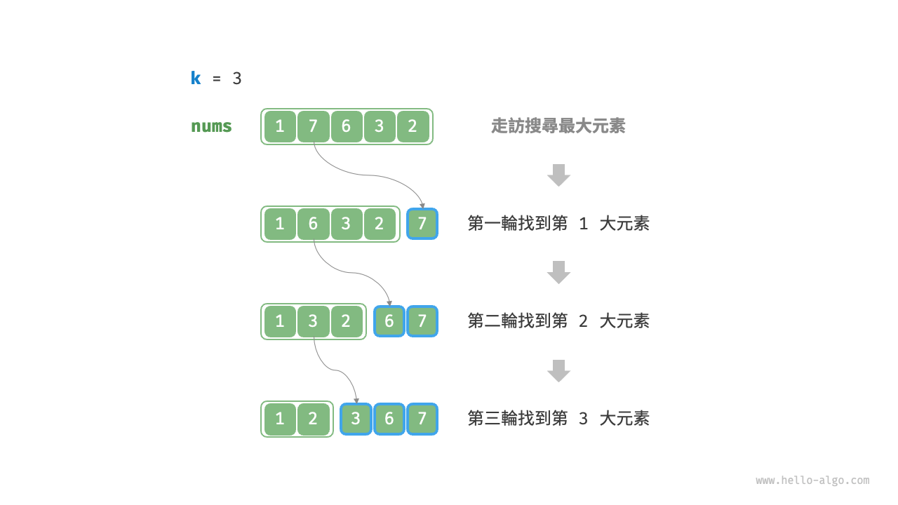

!!! tip

    當 $k = n$ 時，我們可以得到完整的有序序列，此時等價於“選擇排序”演算法。

## 方法二：排序

如下圖所示，我們可以先對陣列 `nums` 進行排序，再返回最右邊的 $k$ 個元素，時間複雜度為 $O(n \log n)$ 。

顯然，該方法“超額”完成任務了，因為我們只需找出最大的 $k$ 個元素即可，而不需要排序其他元素。

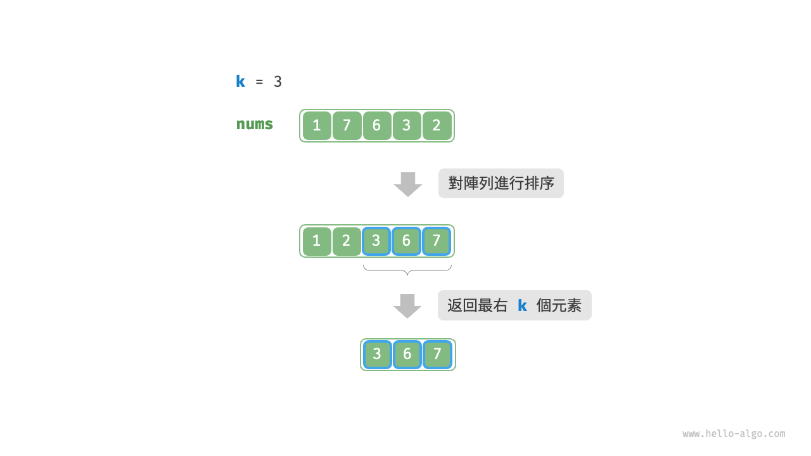

## 方法三：堆積

我們可以基於堆積更加高效地解決 Top-k 問題，流程如下圖所示。

1. 初始化一個小頂堆積，其堆積頂元素最小。
2. 先將陣列的前 $k$ 個元素依次入堆積。
3. 從第 $k + 1$ 個元素開始，若當前元素大於堆積頂元素，則將堆積頂元素出堆積，並將當前元素入堆積。
4. 走訪完成後，堆積中儲存的就是最大的 $k$ 個元素。

=== "<1>"
    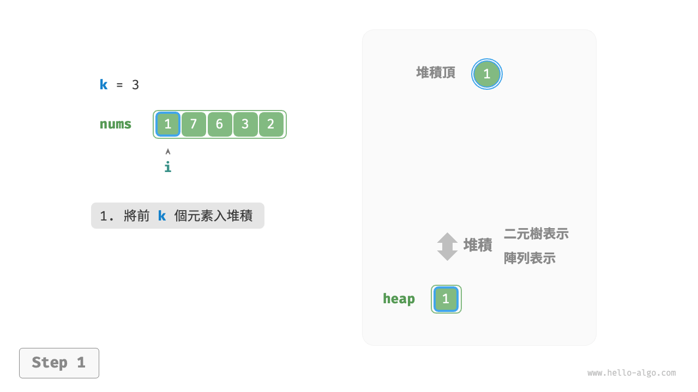

=== "<2>"
    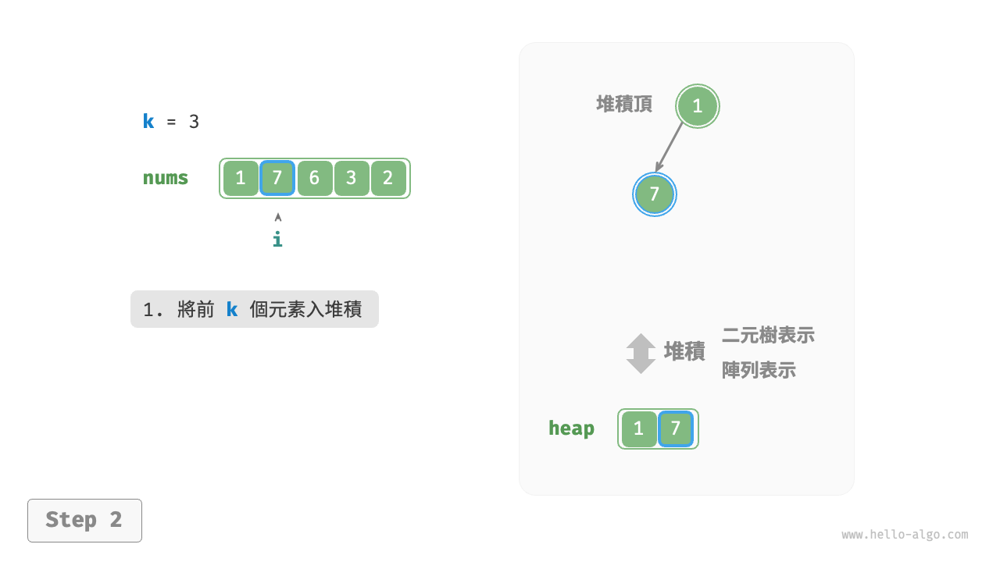

=== "<3>"
    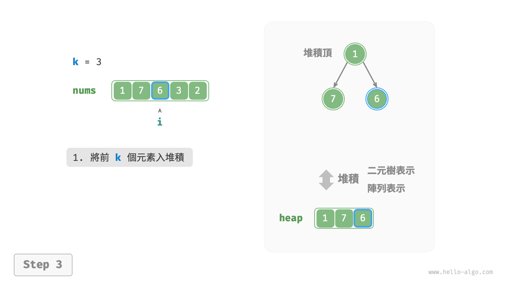

=== "<4>"
    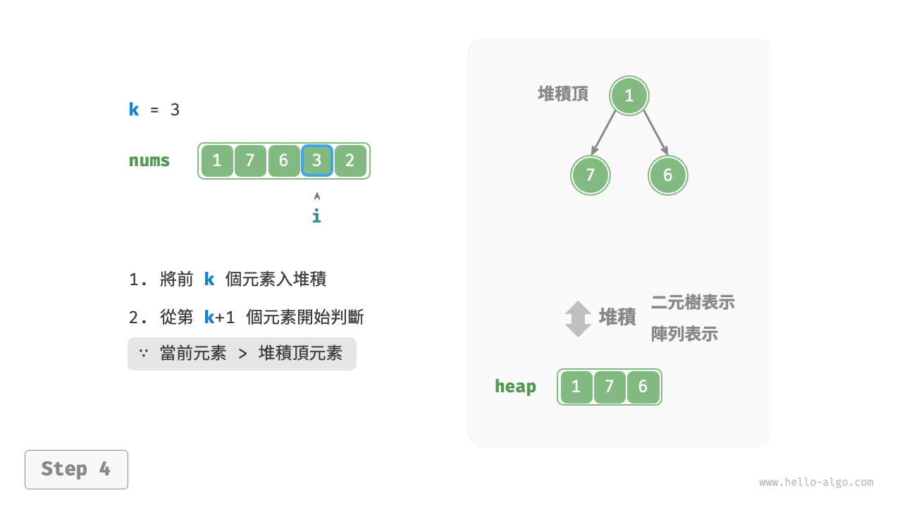

=== "<5>"
    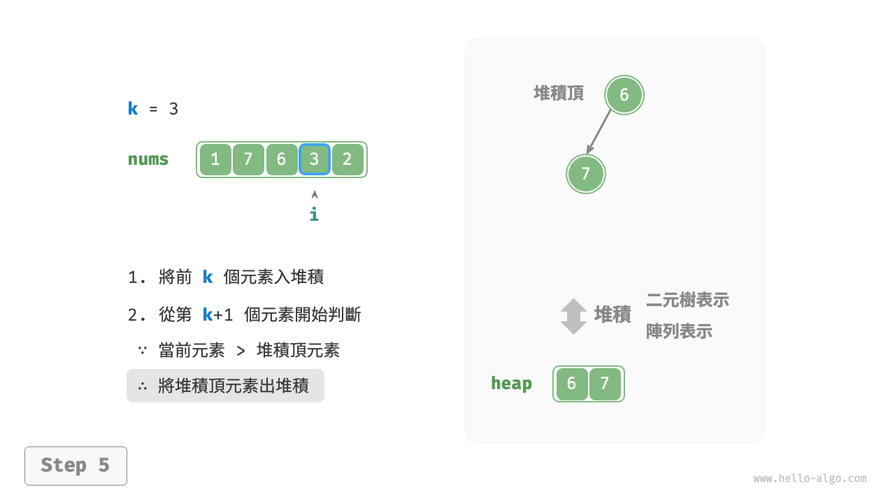

=== "<6>"
    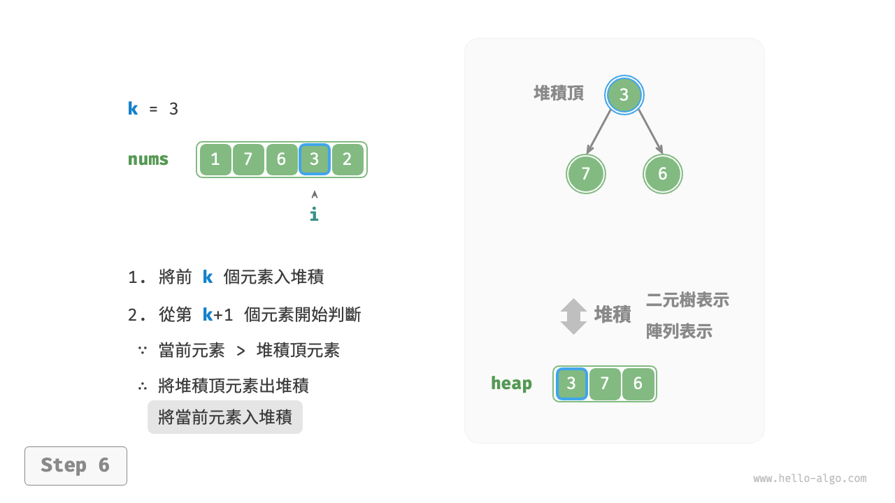

=== "<7>"
    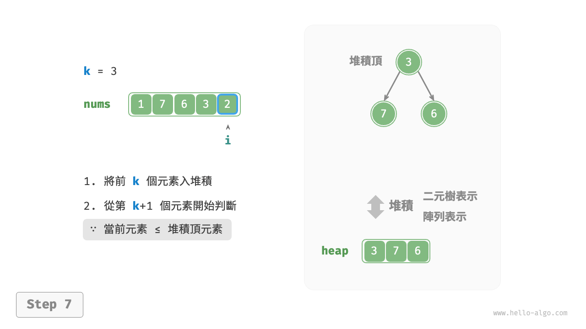

=== "<8>"
    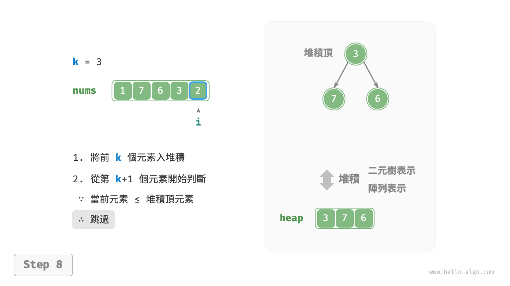

=== "<9>"
    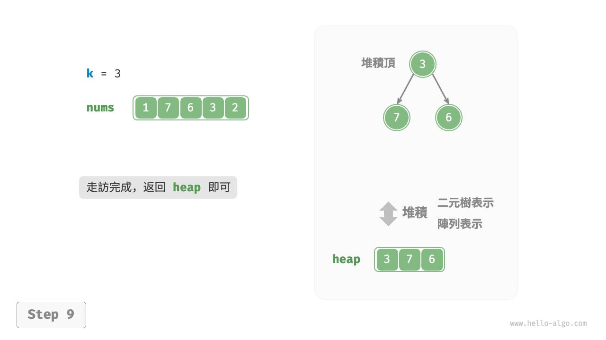

示例程式碼如下：

```src
[file]{top_k}-[class]{}-[func]{top_k_heap}
```

總共執行了 $n$ 輪入堆積和出堆積，堆積的最大長度為 $k$ ，因此時間複雜度為 $O(n \log k)$ 。該方法的效率很高，當 $k$ 較小時，時間複雜度趨向 $O(n)$ ；當 $k$ 較大時，時間複雜度不會超過 $O(n \log n)$ 。

另外，該方法適用於動態資料流的使用場景。在不斷加入資料時，我們可以持續維護堆積內的元素，從而實現最大的 $k$ 個元素的動態更新。
