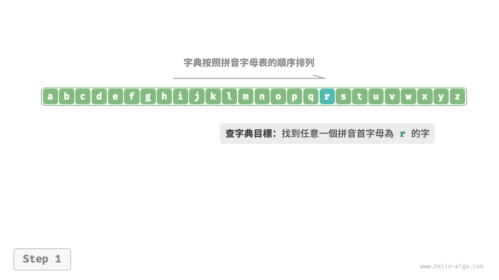
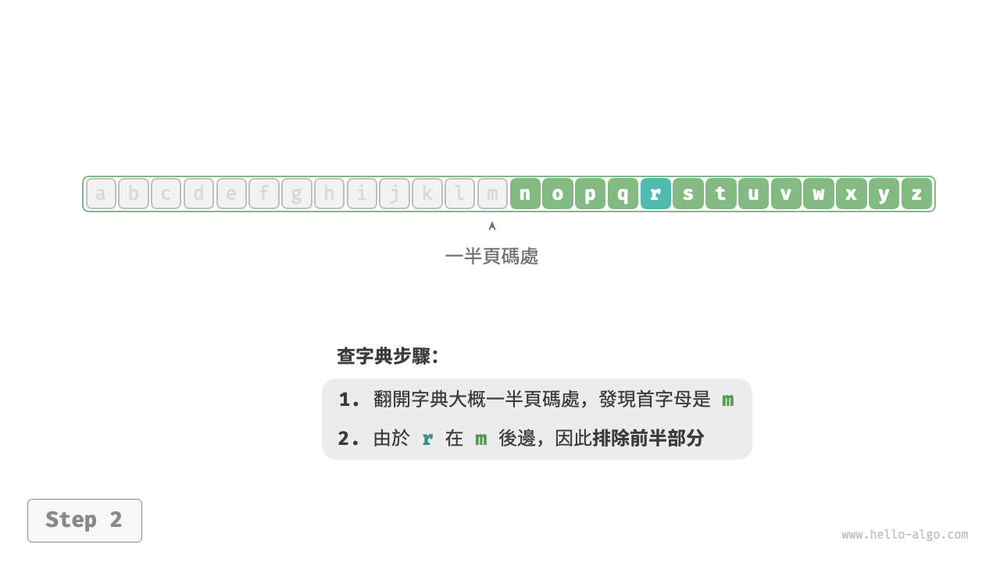
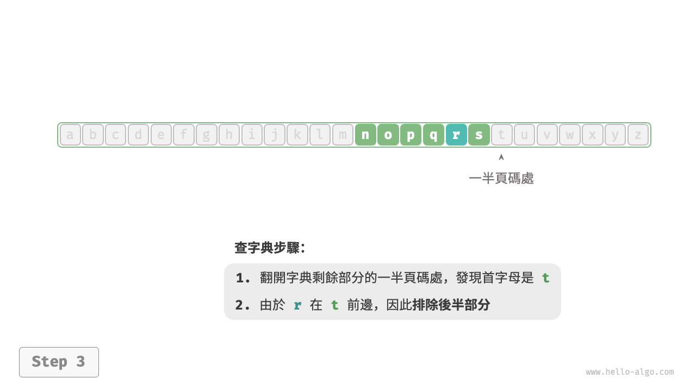
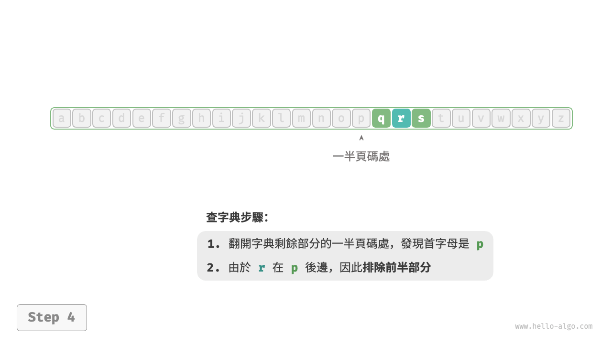
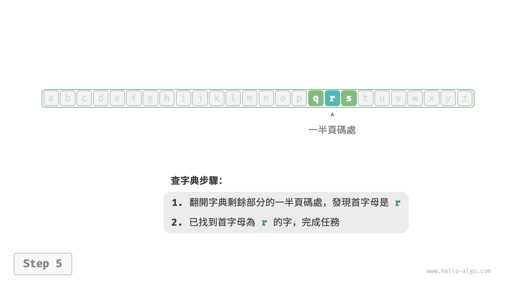
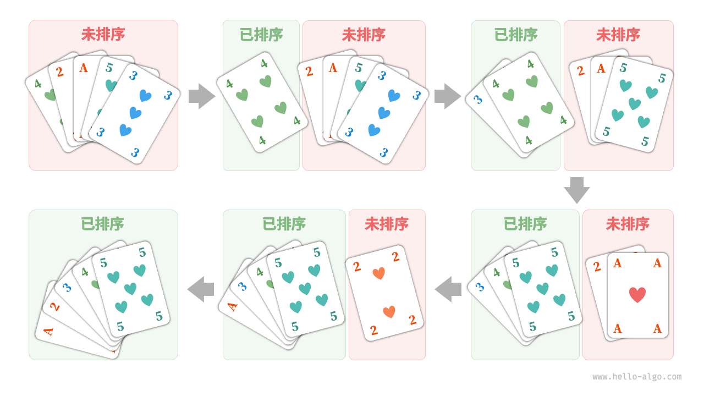
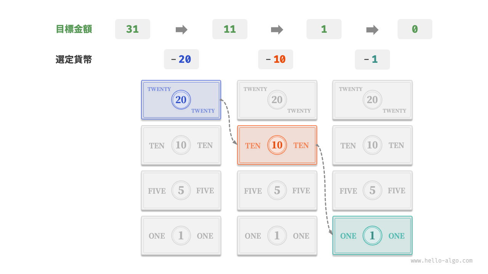

# 演算法無處不在

當我們聽到“演算法”這個詞時，很自然地會想到數學。然而實際上，許多演算法並不涉及複雜數學，而是更多地依賴基本邏輯，這些邏輯在我們的日常生活中處處可見。

在正式探討演算法之前，有一個有趣的事實值得分享：**你已經在不知不覺中學會了許多演算法，並習慣將它們應用到日常生活中了**。下面我將舉幾個具體的例子來證實這一點。

**例一：查字典**。在字典裡，每個漢字都對應一個拼音，而字典是按照拼音字母順序排列的。假設我們需要查詢一個拼音首字母為 $r$ 的字，通常會按照下圖所示的方式實現。

1. 翻開字典約一半的頁數，檢視該頁的首字母是什麼，假設首字母為 $m$ 。
2. 由於在拼音字母表中 $r$ 位於 $m$ 之後，所以排除字典前半部分，查詢範圍縮小到後半部分。
3. 不斷重複步驟 `1.` 和 步驟 `2.` ，直至找到拼音首字母為 $r$ 的頁碼為止。

=== "<1>"
    

=== "<2>"
    

=== "<3>"
    

=== "<4>"
    

=== "<5>"
    

查字典這個小學生必備技能，實際上就是著名的“二分搜尋”演算法。從資料結構的角度，我們可以把字典視為一個已排序的“陣列”；從演算法的角度，我們可以將上述查字典的一系列操作看作“二分搜尋”。

**例二：整理撲克**。我們在打牌時，每局都需要整理手中的撲克牌，使其從小到大排列，實現流程如下圖所示。

1. 將撲克牌劃分為“有序”和“無序”兩部分，並假設初始狀態下最左 1 張撲克牌已經有序。
2. 在無序部分抽出一張撲克牌，插入至有序部分的正確位置；完成後最左 2 張撲克已經有序。
3. 不斷迴圈步驟 `2.` ，每一輪將一張撲克牌從無序部分插入至有序部分，直至所有撲克牌都有序。

上述整理撲克牌的方法本質上是“插入排序”演算法，它在處理小型資料集時非常高效。許多程式語言的排序庫函式中都有插入排序的身影。

**例三：貨幣找零**。假設我們在超市購買了 $69$ 元的商品，給了收銀員 $100$ 元，則收銀員需要找我們 $31$ 元。他會很自然地完成如下圖所示的思考。

1. 可選項是比 $31$ 元面值更小的貨幣，包括 $1$ 元、$5$ 元、$10$ 元、$20$ 元。
2. 從可選項中拿出最大的 $20$ 元，剩餘 $31 - 20 = 11$ 元。
3. 從剩餘可選項中拿出最大的 $10$ 元，剩餘 $11 - 10 = 1$ 元。
4. 從剩餘可選項中拿出最大的 $1$ 元，剩餘 $1 - 1 = 0$ 元。
5. 完成找零，方案為 $20 + 10 + 1 = 31$ 元。

在以上步驟中，我們每一步都採取當前看來最好的選擇（儘可能用大面額的貨幣），最終得到了可行的找零方案。從資料結構與演算法的角度看，這種方法本質上是“貪婪”演算法。

小到烹飪一道菜，大到星際航行，幾乎所有問題的解決都離不開演算法。計算機的出現使得我們能夠透過程式設計將資料結構儲存在記憶體中，同時編寫程式碼呼叫 CPU 和 GPU 執行演算法。這樣一來，我們就能把生活中的問題轉移到計算機上，以更高效的方式解決各種複雜問題。

!!! tip

    如果你對資料結構、演算法、陣列和二分搜尋等概念仍感到一知半解，請繼續往下閱讀，本書將引導你邁入資料結構與演算法的知識殿堂。
