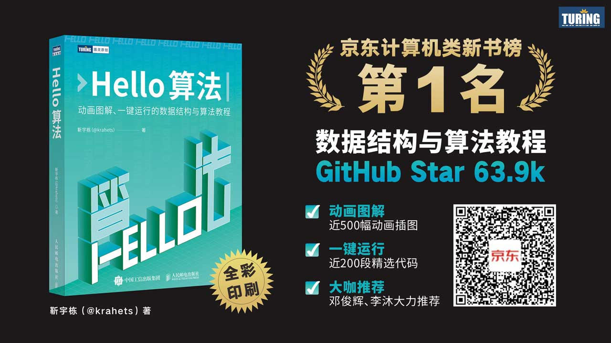

# 紙質書

經過長時間的打磨，《Hello 演算法》紙質書終於釋出了！此時的心情可以用一句詩來形容：

追風趕月莫停留，平蕪盡處是春山。

{ class="animation-figure" }

以下影片展示了紙質書，並且包含我的一些思考：

- 學習資料結構與演算法的重要性。
- 為什麼在紙質書中選擇 Python。
- 對知識分享的理解。

> 新人 UP 主，請多多關照、一鍵三連～謝謝！

    <iframe src="//player.bilibili.com/player.html?aid=1051597767&bvid=BV1QH4y157uC&cid=1462564112&p=1&autoplay=0" scrolling="no" border="0" frameborder="no" framespacing="0" allowfullscreen="true"> </iframe>

附紙質書快照：

{ class="animation-figure" }

{ class="animation-figure" }

## 優勢與不足

總結一下紙質書可能會給大家帶來驚喜的地方：

- 採用全綵印刷，能夠原汁原味地發揮出本書“動畫圖解”的優勢。
- 考究紙張材質，既保證色彩高度還原，也保留紙質書特有的質感。
- 在不提升定價的前提下，附贈思維導圖摺頁、書籤。
- 紙質書、網頁版、PDF 版內容同步，隨意切換閱讀。

!!! tip

    由於紙質書和網頁版的同步成本較大，因此可能會有一些細節上的不同，請您見諒！

當然，紙質書也有一些值得大家入手前考慮的地方：

- 使用 Python 語言，可能不匹配你的主語言（也許可以趁此機會練習 Python）。
- 全綵印刷雖然大幅提升了閱讀體驗，但價格會比黑白印刷高一些。

!!! tip

    “印刷質量”和“價格”就像演算法中的“時間效率”和“空間效率”，難以兩全。而我認為，“印刷質量”對應的是“時間效率”，更應該被注重。

## 購買連結

如果你對紙質書感興趣，可以考慮入手一本。我們為大家爭取到了新書 5 折優惠，請見[此連結](https://3.cn/-1Wwj1jq)或掃描以下二維碼：

{ class="animation-figure" }

## 尾記

起初，我低估了紙質書出版的工作量，以為只要維護好了開源專案，紙質版就可以透過某些自動化手段生成出來。實踐證明，紙質書的生產流程與開源專案的更新機制存在很大的不同，兩者之間的轉化需要做許多額外工作。

一本書的初稿與達到出版標準的定稿之間仍有較長距離，需要出版社（策劃、編輯、設計、市場等）與作者的通力合作、長期雕琢。在此感謝圖靈策劃編輯王軍花、以及人民郵電出版社和圖靈社群每位參與本書出版流程的工作人員！

希望這本書能夠幫助到你！
