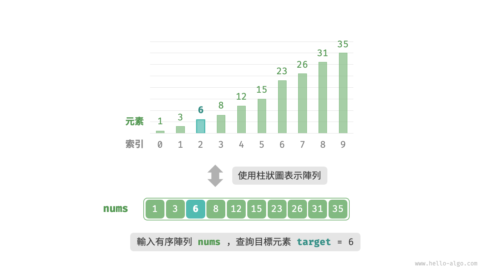
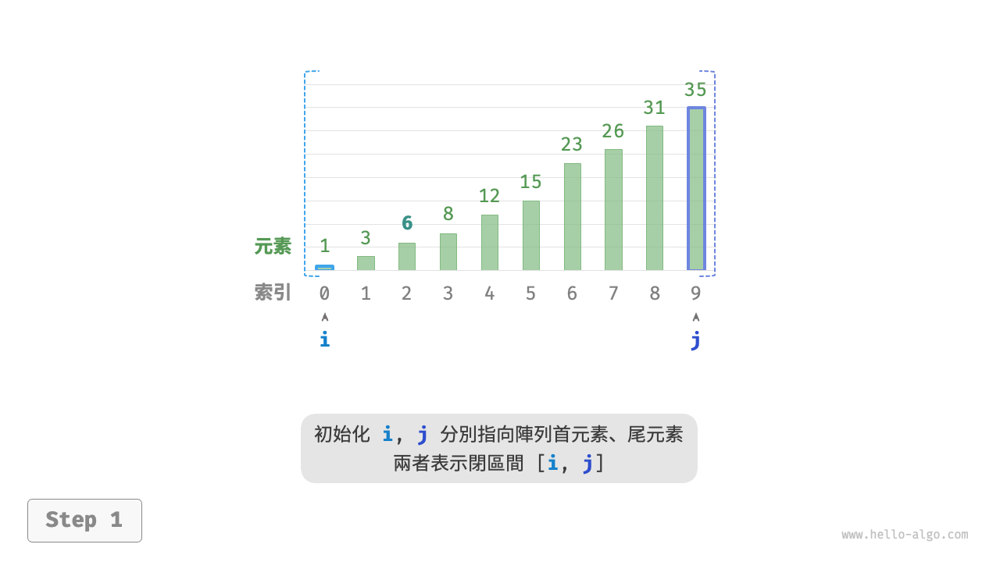
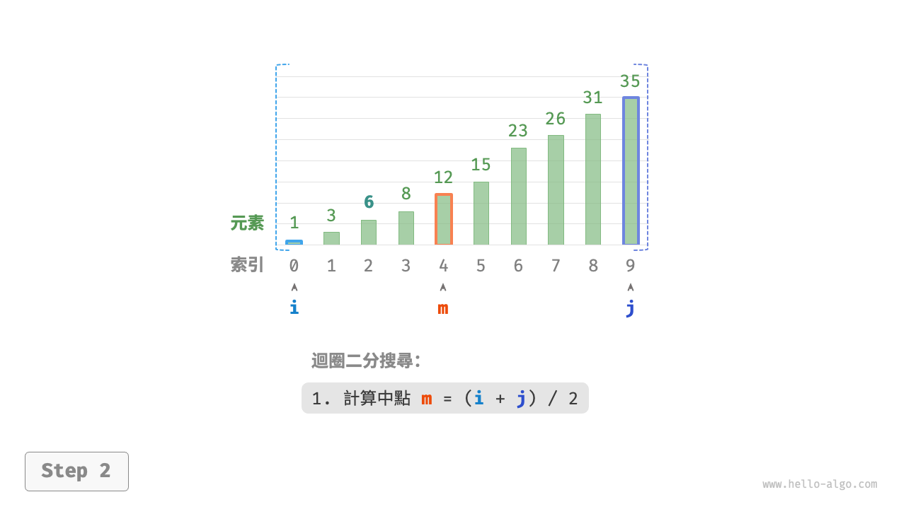
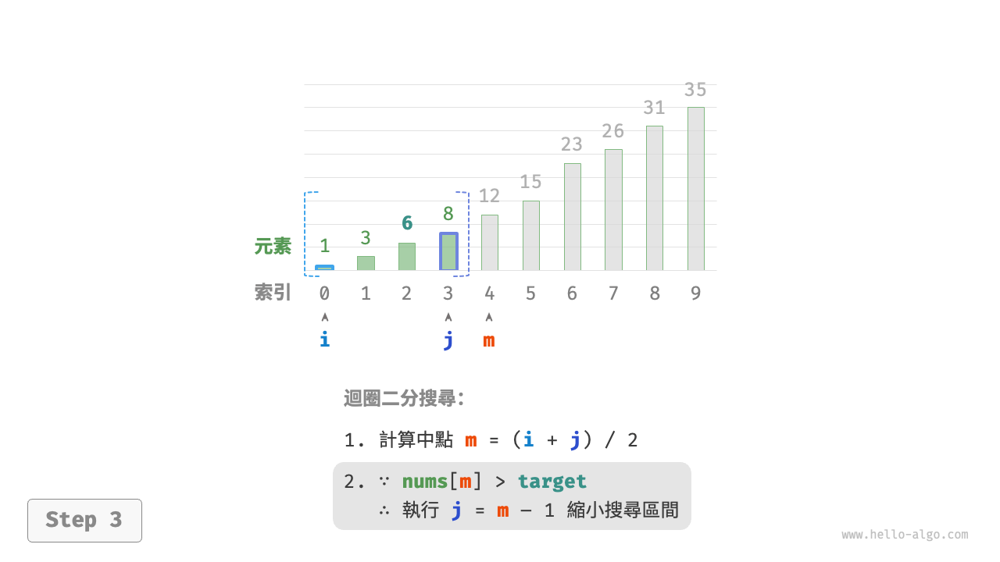
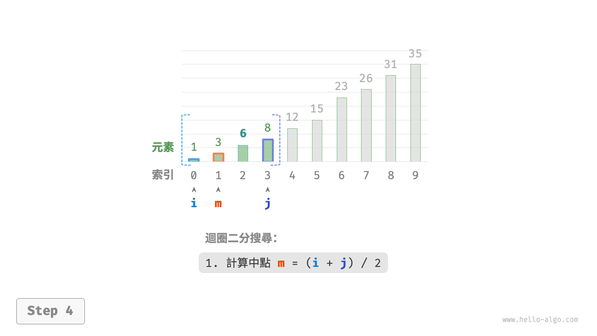
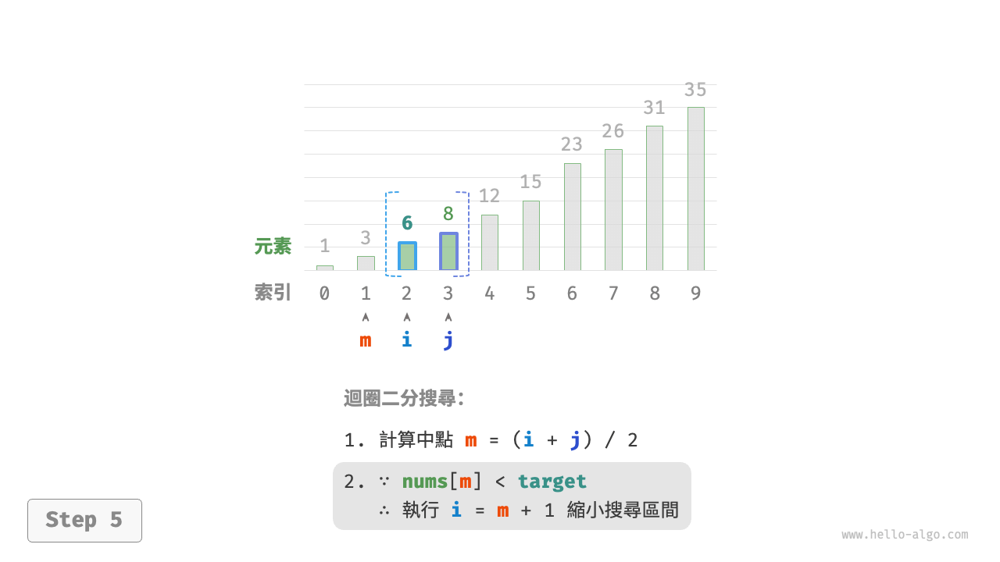
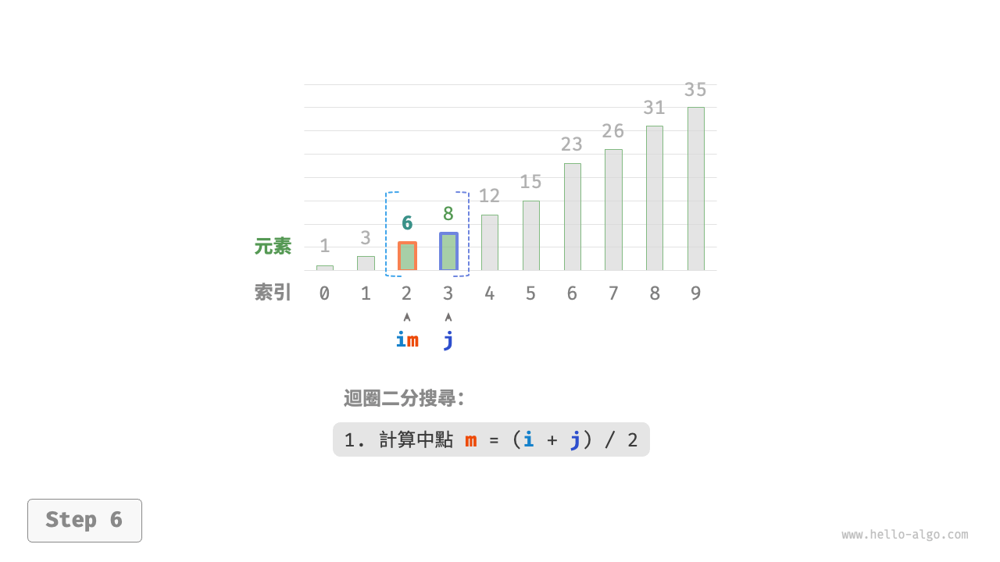
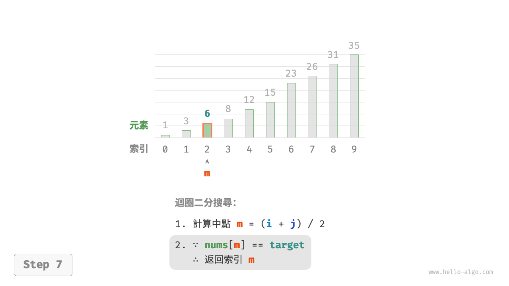
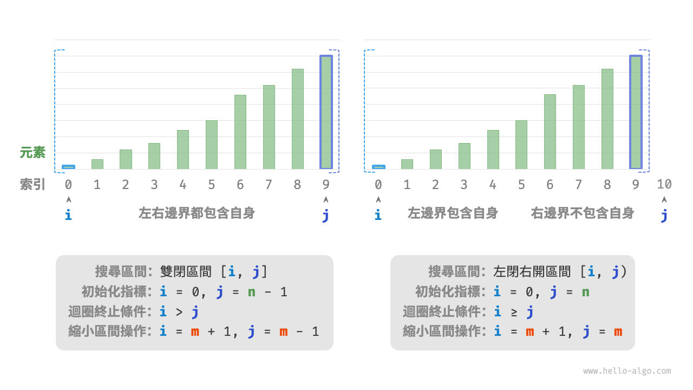

# 二分搜尋

<u>二分搜尋（binary search）</u>是一種基於分治策略的高效搜尋演算法。它利用資料的有序性，每輪縮小一半搜尋範圍，直至找到目標元素或搜尋區間為空為止。

!!! question

    給定一個長度為 $n$ 的陣列 `nums` ，元素按從小到大的順序排列且不重複。請查詢並返回元素 `target` 在該陣列中的索引。若陣列不包含該元素，則返回 $-1$ 。示例如下圖所示。



如下圖所示，我們先初始化指標 $i = 0$ 和 $j = n - 1$ ，分別指向陣列首元素和尾元素，代表搜尋區間 $[0, n - 1]$ 。請注意，中括號表示閉區間，其包含邊界值本身。

接下來，迴圈執行以下兩步。

1. 計算中點索引 $m = \lfloor {(i + j) / 2} \rfloor$ ，其中 $\lfloor \: \rfloor$ 表示向下取整操作。
2. 判斷 `nums[m]` 和 `target` 的大小關係，分為以下三種情況。
    1. 當 `nums[m] < target` 時，說明 `target` 在區間 $[m + 1, j]$ 中，因此執行 $i = m + 1$ 。
    2. 當 `nums[m] > target` 時，說明 `target` 在區間 $[i, m - 1]$ 中，因此執行 $j = m - 1$ 。
    3. 當 `nums[m] = target` 時，說明找到 `target` ，因此返回索引 $m$ 。

若陣列不包含目標元素，搜尋區間最終會縮小為空。此時返回 $-1$ 。

=== "<1>"
    

=== "<2>"
    

=== "<3>"
    

=== "<4>"
    

=== "<5>"
    

=== "<6>"
    

=== "<7>"
    

值得注意的是，由於 $i$ 和 $j$ 都是 `int` 型別，**因此 $i + j$ 可能會超出 `int` 型別的取值範圍**。為了避免大數越界，我們通常採用公式 $m = \lfloor {i + (j - i) / 2} \rfloor$ 來計算中點。

程式碼如下所示：

```src
[file]{binary_search}-[class]{}-[func]{binary_search}
```

**時間複雜度為 $O(\log n)$** ：在二分迴圈中，區間每輪縮小一半，因此迴圈次數為 $\log_2 n$ 。

**空間複雜度為 $O(1)$** ：指標 $i$ 和 $j$ 使用常數大小空間。

## 區間表示方法

除了上述雙閉區間外，常見的區間表示還有“左閉右開”區間，定義為 $[0, n)$ ，即左邊界包含自身，右邊界不包含自身。在該表示下，區間 $[i, j)$ 在 $i = j$ 時為空。

我們可以基於該表示實現具有相同功能的二分搜尋演算法：

```src
[file]{binary_search}-[class]{}-[func]{binary_search_lcro}
```

如下圖所示，在兩種區間表示下，二分搜尋演算法的初始化、迴圈條件和縮小區間操作皆有所不同。

由於“雙閉區間”表示中的左右邊界都被定義為閉區間，因此透過指標 $i$ 和指標 $j$ 縮小區間的操作也是對稱的。這樣更不容易出錯，**因此一般建議採用“雙閉區間”的寫法**。



## 優點與侷限性

二分搜尋在時間和空間方面都有較好的效能。

- 二分搜尋的時間效率高。在大資料量下，對數階的時間複雜度具有顯著優勢。例如，當資料大小 $n = 2^{20}$ 時，線性查詢需要 $2^{20} = 1048576$ 輪迴圈，而二分搜尋僅需 $\log_2 2^{20} = 20$ 輪迴圈。
- 二分搜尋無須額外空間。相較於需要藉助額外空間的搜尋演算法（例如雜湊查詢），二分搜尋更加節省空間。

然而，二分搜尋並非適用於所有情況，主要有以下原因。

- 二分搜尋僅適用於有序資料。若輸入資料無序，為了使用二分搜尋而專門進行排序，得不償失。因為排序演算法的時間複雜度通常為 $O(n \log n)$ ，比線性查詢和二分搜尋都更高。對於頻繁插入元素的場景，為保持陣列有序性，需要將元素插入到特定位置，時間複雜度為 $O(n)$ ，也是非常昂貴的。
- 二分搜尋僅適用於陣列。二分搜尋需要跳躍式（非連續地）訪問元素，而在鏈結串列中執行跳躍式訪問的效率較低，因此不適合應用在鏈結串列或基於鏈結串列實現的資料結構。
- 小資料量下，線性查詢效能更佳。線上性查詢中，每輪只需 1 次判斷操作；而在二分搜尋中，需要 1 次加法、1 次除法、1 ~ 3 次判斷操作、1 次加法（減法），共 4 ~ 6 個單元操作；因此，當資料量 $n$ 較小時，線性查詢反而比二分搜尋更快。
