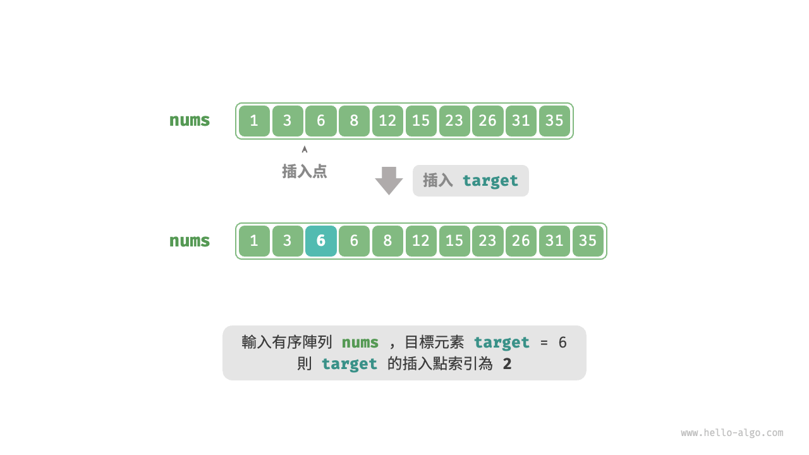
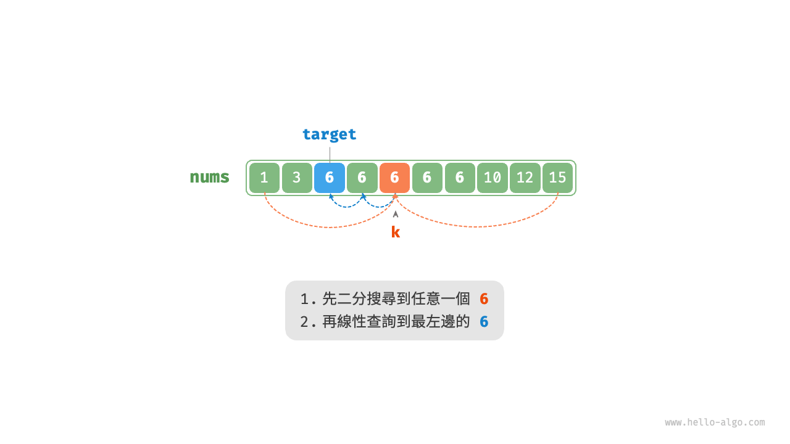
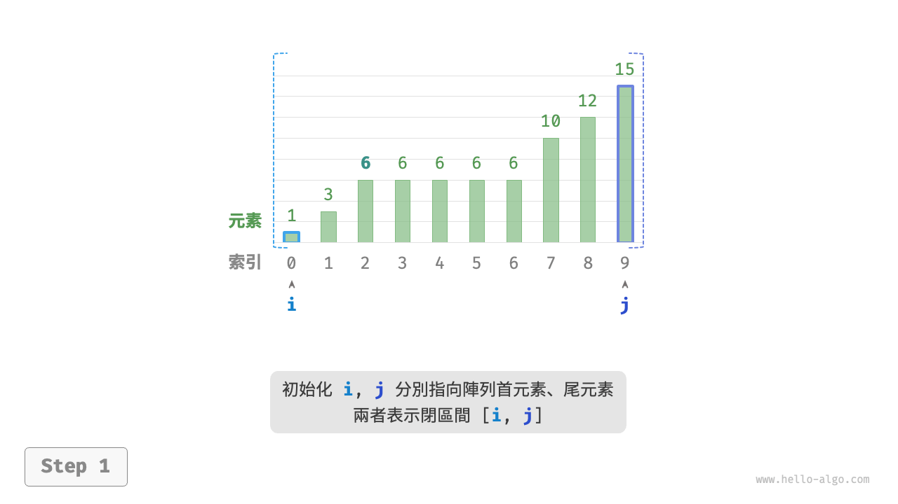
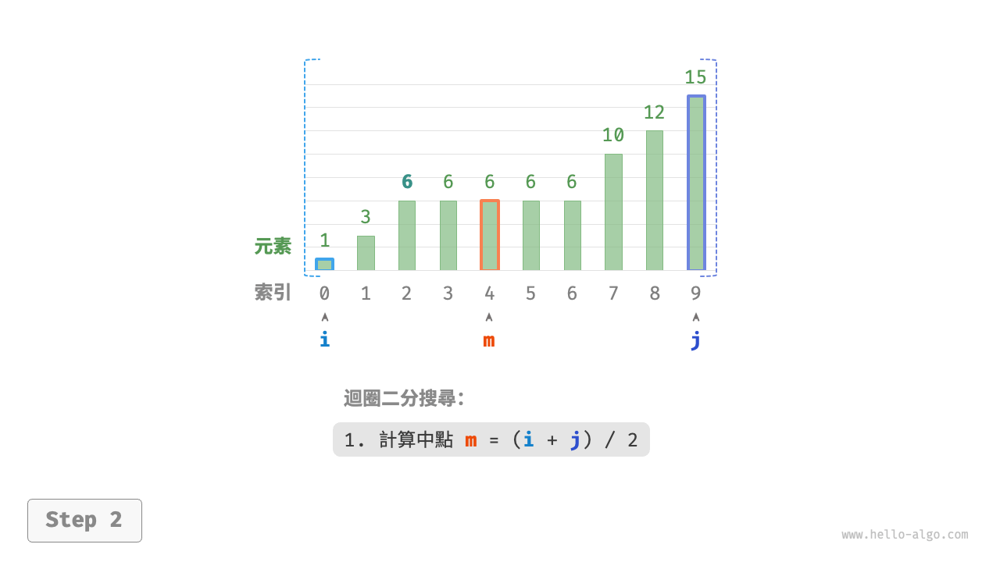
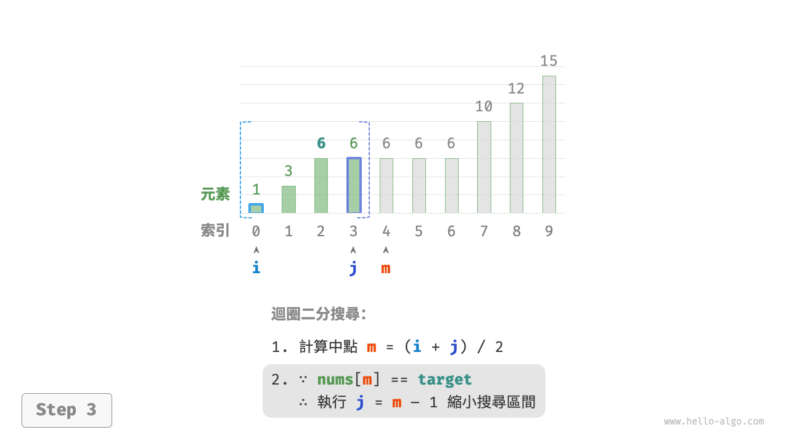
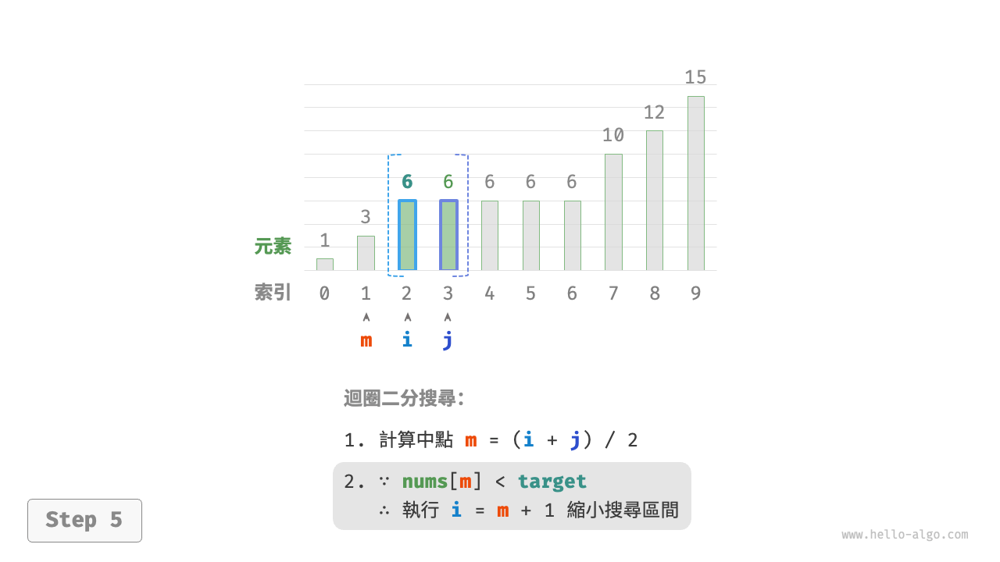
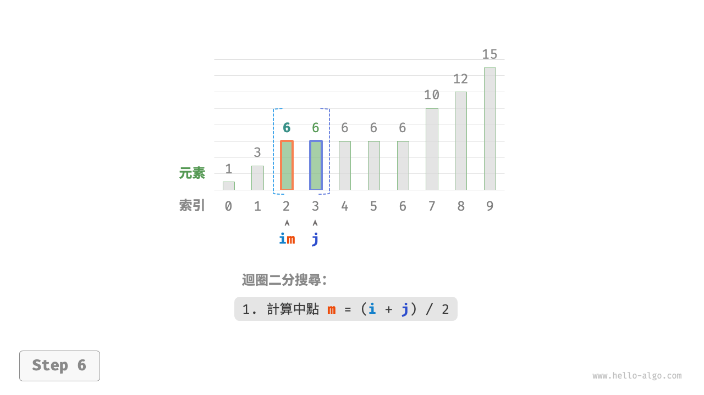
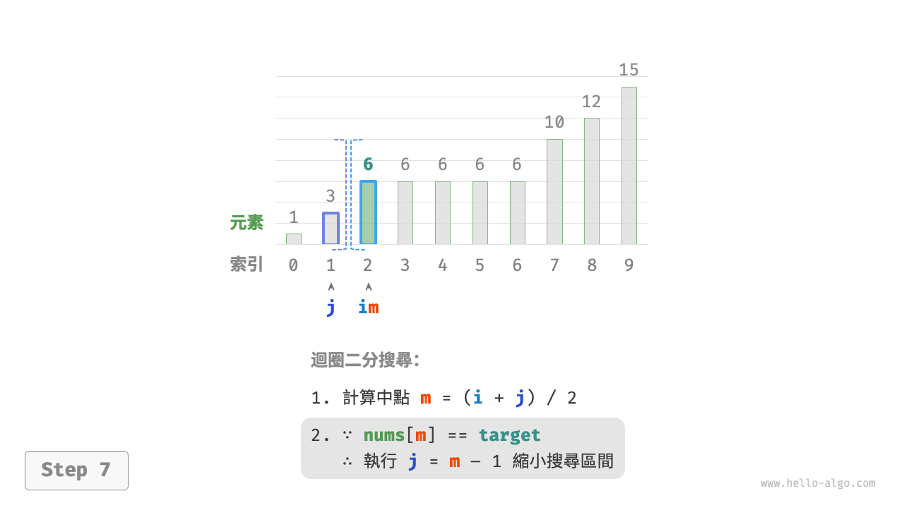
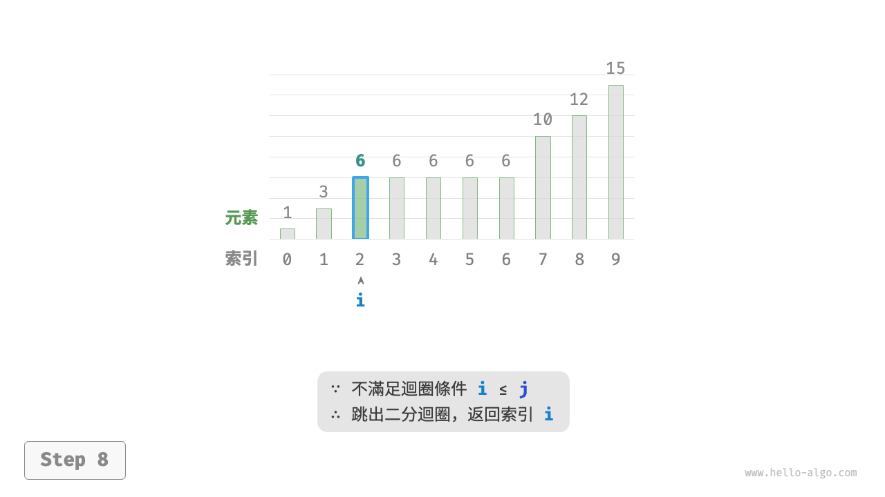

# 二分搜尋插入點

二分搜尋不僅可用於搜尋目標元素，還可用於解決許多變種問題，比如搜尋目標元素的插入位置。

## 無重複元素的情況

!!! question

    給定一個長度為 $n$ 的有序陣列 `nums` 和一個元素 `target` ，陣列不存在重複元素。現將 `target` 插入陣列 `nums` 中，並保持其有序性。若陣列中已存在元素 `target` ，則插入到其左方。請返回插入後 `target` 在陣列中的索引。示例如下圖所示。



如果想複用上一節的二分搜尋程式碼，則需要回答以下兩個問題。

**問題一**：當陣列中包含 `target` 時，插入點的索引是否是該元素的索引？

題目要求將 `target` 插入到相等元素的左邊，這意味著新插入的 `target` 替換了原來 `target` 的位置。也就是說，**當陣列包含 `target` 時，插入點的索引就是該 `target` 的索引**。

**問題二**：當陣列中不存在 `target` 時，插入點是哪個元素的索引？

進一步思考二分搜尋過程：當 `nums[m] < target` 時 $i$ 移動，這意味著指標 $i$ 在向大於等於 `target` 的元素靠近。同理，指標 $j$ 始終在向小於等於 `target` 的元素靠近。

因此二分結束時一定有：$i$ 指向首個大於 `target` 的元素，$j$ 指向首個小於 `target` 的元素。**易得當陣列不包含 `target` 時，插入索引為 $i$** 。程式碼如下所示：

```src
[file]{binary_search_insertion}-[class]{}-[func]{binary_search_insertion_simple}
```

## 存在重複元素的情況

!!! question

    在上一題的基礎上，規定陣列可能包含重複元素，其餘不變。

假設陣列中存在多個 `target` ，則普通二分搜尋只能返回其中一個 `target` 的索引，**而無法確定該元素的左邊和右邊還有多少 `target`**。

題目要求將目標元素插入到最左邊，**所以我們需要查詢陣列中最左一個 `target` 的索引**。初步考慮透過下圖所示的步驟實現。

1. 執行二分搜尋，得到任意一個 `target` 的索引，記為 $k$ 。
2. 從索引 $k$ 開始，向左進行線性走訪，當找到最左邊的 `target` 時返回。



此方法雖然可用，但其包含線性查詢，因此時間複雜度為 $O(n)$ 。當陣列中存在很多重複的 `target` 時，該方法效率很低。

現考慮拓展二分搜尋程式碼。如下圖所示，整體流程保持不變，每輪先計算中點索引 $m$ ，再判斷 `target` 和 `nums[m]` 的大小關係，分為以下幾種情況。

- 當 `nums[m] < target` 或 `nums[m] > target` 時，說明還沒有找到 `target` ，因此採用普通二分搜尋的縮小區間操作，**從而使指標 $i$ 和 $j$ 向 `target` 靠近**。
- 當 `nums[m] == target` 時，說明小於 `target` 的元素在區間 $[i, m - 1]$ 中，因此採用 $j = m - 1$ 來縮小區間，**從而使指標 $j$ 向小於 `target` 的元素靠近**。

迴圈完成後，$i$ 指向最左邊的 `target` ，$j$ 指向首個小於 `target` 的元素，**因此索引 $i$ 就是插入點**。

=== "<1>"
    

=== "<2>"
    

=== "<3>"
    

=== "<4>"
    

=== "<5>"
    

=== "<6>"
    

=== "<7>"
    

=== "<8>"
    

觀察以下程式碼，判斷分支 `nums[m] > target` 和 `nums[m] == target` 的操作相同，因此兩者可以合併。

即便如此，我們仍然可以將判斷條件保持展開，因為其邏輯更加清晰、可讀性更好。

```src
[file]{binary_search_insertion}-[class]{}-[func]{binary_search_insertion}
```

!!! tip

    本節的程式碼都是“雙閉區間”寫法。有興趣的讀者可以自行實現“左閉右開”寫法。

總的來看，二分搜尋無非就是給指標 $i$ 和 $j$ 分別設定搜尋目標，目標可能是一個具體的元素（例如 `target` ），也可能是一個元素範圍（例如小於 `target` 的元素）。

在不斷的迴圈二分中，指標 $i$ 和 $j$ 都逐漸逼近預先設定的目標。最終，它們或是成功找到答案，或是越過邊界後停止。
