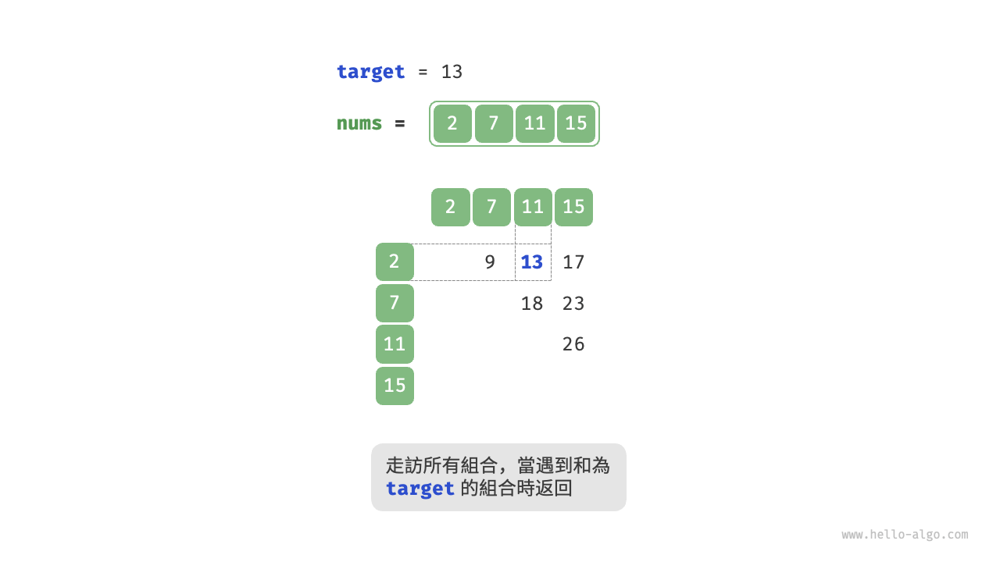
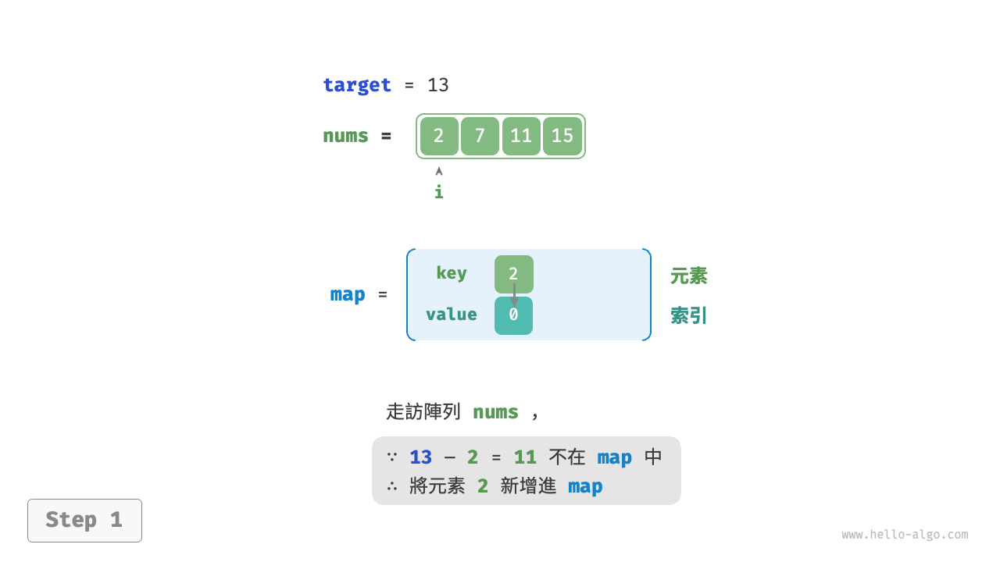
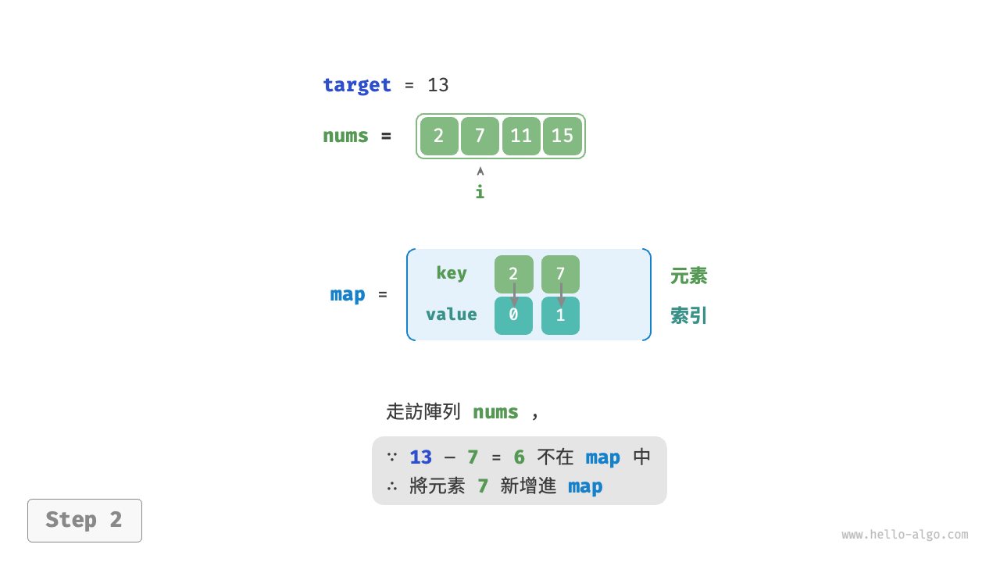
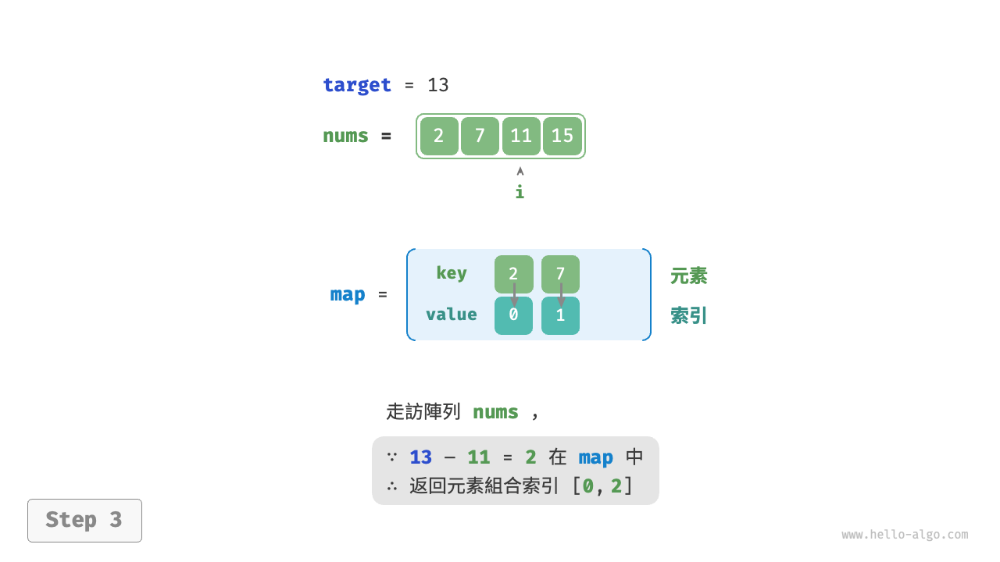

# 雜湊最佳化策略

在演算法題中，**我們常透過將線性查詢替換為雜湊查詢來降低演算法的時間複雜度**。我們藉助一個演算法題來加深理解。

!!! question

    給定一個整數陣列 `nums` 和一個目標元素 `target` ，請在陣列中搜索“和”為 `target` 的兩個元素，並返回它們的陣列索引。返回任意一個解即可。

## 線性查詢：以時間換空間

考慮直接走訪所有可能的組合。如下圖所示，我們開啟一個兩層迴圈，在每輪中判斷兩個整數的和是否為 `target` ，若是，則返回它們的索引。



程式碼如下所示：

```src
[file]{two_sum}-[class]{}-[func]{two_sum_brute_force}
```

此方法的時間複雜度為 $O(n^2)$ ，空間複雜度為 $O(1)$ ，在大資料量下非常耗時。

## 雜湊查詢：以空間換時間

考慮藉助一個雜湊表，鍵值對分別為陣列元素和元素索引。迴圈走訪陣列，每輪執行下圖所示的步驟。

1. 判斷數字 `target - nums[i]` 是否在雜湊表中，若是，則直接返回這兩個元素的索引。
2. 將鍵值對 `nums[i]` 和索引 `i` 新增進雜湊表。

=== "<1>"
    

=== "<2>"
    

=== "<3>"
    

實現程式碼如下所示，僅需單層迴圈即可：

```src
[file]{two_sum}-[class]{}-[func]{two_sum_hash_table}
```

此方法透過雜湊查詢將時間複雜度從 $O(n^2)$ 降至 $O(n)$ ，大幅提升執行效率。

由於需要維護一個額外的雜湊表，因此空間複雜度為 $O(n)$ 。**儘管如此，該方法的整體時空效率更為均衡，因此它是本題的最優解法**。
